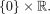
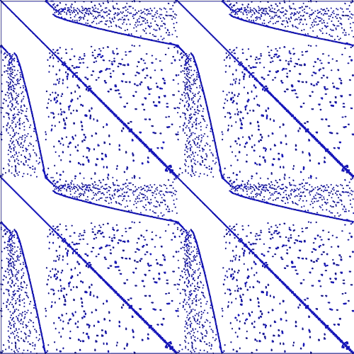

# 五、高级数组概念

在本章中，我们将解释数组的一些更高级的方面。首先，我们将介绍数组视图的概念，然后是布尔数组以及如何比较数组。我们简要描述索引和矢量化，解释稀疏数组，以及广播等一些特殊主题。

# 数组视图和副本

为了精确控制内存的使用方式，NumPy 提供了数组视图的概念。视图是较小的数组，与较大的数组共享相同的数据。这就像引用一个单独的对象一样(参见[第一章](01.html "Chapter 1. Getting Started")、*入门*一节*基本类型*)。

## 数组视图

一个最简单的视图示例由一个数组的切片给出:

```py
M = array([[1.,2.],[3.,4.]])
v = M[0,:] # first row of M
```

前面的切片是`M`的视图。它与`M`共享相同的数据。修改`v`也会修改`M`:

```py
v[-1] = 0.
v # array([[1.,0.]])
M # array([[1.,0.],[3.,4.]]) # M is modified as well
```

可以使用数组属性`base`访问拥有数据的对象:

```py
v.base # array([[1.,0.],[3.,4.]])
v.base is M # True
```

如果数组拥有其数据，则属性基为 none:

```py
M.base # None
```

## 切片作为视图

哪些切片将返回视图，哪些将返回副本，都有精确的规则。只有基本切片(主要是带有`:`的索引表达式)返回视图，而任何高级选择(例如用布尔值切片)都将返回数据的副本。例如，可以通过列表(或数组)索引来创建新的矩阵:

```py
a = arange(4) # array([0.,1.,2.,3.])
b = a[[2,3]] # the index is a list [2,3]
b # array([2.,3.])
b.base is None # True, the data was copied
c = a[1:3]
c.base is None # False, this is just a view
```

在前面的例子中，数组`b`不是视图，而用更简单的切片获得的数组`c`是视图。

有一个特别简单的数组切片，它返回整个数组的视图:

```py
N = M[:] # this is a view of the whole array M
```

## 作为视图进行置换和重塑

其他一些重要的操作返回视图。例如，转置返回一个视图:

```py
M = random.random_sample((3,3))
N = M.T
N.base is M # True
```

这同样适用于所有整形操作:

```py
v = arange(10)
C = v.reshape(-1,1) # column matrix
C.base is v # True
```

## 数组副本

有时需要明确请求复制数据。这可以简单地通过名为`array`的 NumPy 函数来实现:

```py
M = array([[1.,2.],[3.,4.]])
N = array(M.T) # copy of M.T
```

我们可能会验证数据确实已被复制:

```py
N.base is None # True
```

# 比较数组

比较两个数组并不像看起来那么简单。考虑下面的代码，它旨在检查两个矩阵是否彼此接近:

```py
A = array([0.,0.])
B = array([0.,0.])
if abs(B-A) < 1e-10: # an exception is raised here
    print("The two arrays are close enough")
```

当执行`if`语句时，该代码引发异常:

```py
ValueError: The truth value of an array with more than one element is ambiguous. Use a.any() or a.all()
```

在本节中，我们将解释为什么会这样，以及如何补救这种情况。

## 布尔数组

布尔数组对于高级数组索引很有用(参见*用布尔数组索引*一节)。布尔数组只是一个条目类型为`bool`的数组:

```py
A = array([True,False]) # Boolean array
A.dtype # dtype('bool')
```

任何作用于数组的比较运算符都将创建一个布尔数组，而不是简单的布尔:

```py
M = array([[2, 3],
           [1, 4]])
M > 2 # array([[False, True],
             # [False, True]])
M == 0 # array([[False, False],
             # [False, False]])
N = array([[2, 3],
           [0, 0]])
M == N # array([[True, True],
              # [False, False]])
...
```

请注意，因为数组比较创建布尔数组，所以不能在条件语句中直接使用数组比较，例如，`if`语句。解决方法是使用方法`all`和`any`:

```py
A = array([[1,2],[3,4]])
B = array([[1,2],[3,3]])
A == B # creates array([[True, True], [True, False]]) 
(A == B).all() # False
(A != B).any() # True
if (abs(B-A) < 1e-10).all():
    print("The two arrays are close enough")
```

### 检查是否相等

检查两个浮点数组的相等性并不是直截了当的，因为两个浮点可能非常接近而不相等。在 NumPy 中，可以检查与`allclose`是否相等。该函数检查给定精度下两个数组的相等性:

```py
data = random.rand(2)*1e-3
small_error = random.rand(2)*1e-16
data == data + small_error # False
allclose(data, data + small_error, rtol=1.e-5, atol=1.e-8)   # True
```

公差以相对公差界限`rtol`和绝对误差界限`atol`给出。命令`allclose`是:`(abs(A-B) < atol+rtol*abs(B)).all()`的缩写。

注意`allclose`也可以应用于标量:

```py
data = 1e-3
error = 1e-16
data == data + error # False
allclose(data, data + error, rtol=1.e-5, atol=1.e-8)  #True
```

# 数组上的布尔运算

布尔数组中不能使用`and`、`or`和`not`。事实上，这些操作符强制从数组转换为布尔值，这是不允许的。相反，我们可以使用下表中给出的运算符(*表 5.1* )对布尔数组进行组件逻辑运算:

<colgroup><col> <col></colgroup> 
| **逻辑运算符** | **布尔数组的替换** |
| `A and B` | `A & B` |
| `A or B` | `A &#124; B` |
| `not A` | `~ A` |

表 5.1 逻辑运算符和、或和不适用于数组。

```py
A = array([True, True, False, False])
B = array([True, False, True, False])
A and B # error!
A & B # array([True, False, False, False])
A | B # array([True, True, True, False])
~A # array([False, False, True, True])
```

以下是逻辑运算符在布尔数组中的用法示例:

假设我们有一系列的数据被一些测量误差破坏了。进一步假设我们运行一个回归，它给出了每个值的偏差。我们希望获得所有异常值和所有偏差小于给定阈值的值:

```py
data = linspace(1,100,100) # data
deviation = random.normal(size=100) # the deviations 
           #don't forget the parentheses in next statement!
exceptional = data[(deviation<-0.5)|(deviation>0.5)] 
exceptional = data[abs(deviation)>0.5] # same result 
small = data[(abs(deviation)<0.1)&(data<5.)] # small deviation and data
```

# 数组索引

我们已经看到，可以通过切片和整数的组合来索引数组，这是基本的切片技术。然而，还有很多可能性，允许多种方式来访问和修改数组元素。

## 用布尔数组索引

根据数组的值，只访问和修改数组的一部分通常很有用。例如，人们可能想要访问数组的所有正元素。事实证明，使用布尔数组是可能的，布尔数组就像掩码一样，只选择数组的某些元素。这种索引的结果是*总是*一个向量。例如，考虑以下示例:

```py
B = array([[True, False],
           [False, True]])
M = array([[2, 3],
           [1, 4]])
M[B] # array([2,4]), a vector
```

其实`M[B]`通话相当于`M.flatten()[B]`。然后，可以用另一个向量替换结果向量。例如，可以用零替换所有元素(更多信息请参考*广播*部分):

```py
M[B] = 0
M # [[0, 3], [1, 0]]
```

或者可以用其他值替换所有选定的值:

```py
M[B] = 10, 20
M # [[10, 3], [1, 20]]
```

通过结合创建布尔数组(`M > 2`)、智能索引(用布尔数组索引)和广播，可以使用以下优雅的语法:

```py
M[M>2] = 0    # all the elements > 2 are replaced by 0
```

这里的表达广播指的是标量 0 到适当形状的向量的默认转换。

## 使用位置

命令`where`给出了一个有用的构造，它可以将布尔数组作为一个条件，并返回满足该条件的数组元素的索引，或者根据布尔数组中的值返回不同的值。

基本结构是:

```py
where(condition, a, b)
```

这将在条件为`True`时返回`a`的值，在条件为`False`时返回`b`的值。

例如，考虑一个*重量*函数:


下面的代码实现了一个 Heaviside 函数:

```py
def H(x):
    return where(x < 0, 0, 1)
x = linspace(-1,1,11)  # [-1\. -0.8 -0.6 -0.4 -0.2 0\. 0.2 0.4 0.6 0.8 1\. ]
print(H(x))            # [0 0 0 0 0 1 1 1 1 1 1]
```

第二个和第三个参数可以是与条件大小相同的数组(布尔数组)，也可以是标量。我们再举两个例子来演示如何根据条件操作数组或标量中的元素:

```py
x = linspace(-4,4,5)
# [-4\. -2.  0.  2.  4.]

print(where(x > 0, sqrt(x), 0))
# [ 0.+0.j 0.+0.j 0.+0.j 1.41421356+0.j  2.+0.j ]
print(where(x > 0, 1, -1)) # [-1 -1 -1  1  1]
```

如果省略第二个和第三个参数，则返回包含满足条件的元素索引的元组。

例如，考虑以下代码中只有一个参数的`where`的使用:

```py
a = arange(9)
b = a.reshape((3,3))

print(where(a > 5))   # (array([6, 7, 8]),)

print(where(b > 5))   # (array([2, 2, 2]), array([0, 1, 2]))
```

# 性能和矢量化

说到 Python 代码的性能，通常归结为解释代码和编译代码之间的区别。Python 是一种解释的编程语言，基本的 Python 代码是直接执行的，不需要对机器代码进行任何中间编译。使用编译语言，代码需要在执行前被翻译成机器指令。

解释语言的好处很多，但是解释代码在速度上无法与编译代码竞争。为了让你的代码更快，你可以用像 FORTRAN、C 或 C++这样的编译语言编写一些部分。这就是 NumPy 和 SciPy 所做的。

因此，最好尽可能在解释版本上使用 NumPy 和 SciPy 中的函数。矩阵乘法、矩阵向量乘法、矩阵分解、标量积等 NumPy 数组运算的速度比任何纯 Python 等价类都要快得多。考虑标量积的简单情况。标量积比编译的 NumPy 函数`dot(a,b)`慢得多(对于大约有 100 个元素的数组，慢 100 多倍):

```py
def my_prod(a,b):
    val = 0
    for aa,bb in zip(a,b):
        val += aa*bb
    return val
```

测量函数的速度是科学计算的一个重要方面。测量执行时间详见[第十三章](13.html "Chapter 13. Testing")*测试*中*测量执行时间*一节。

## 矢量化

为了提高性能，必须经常向量化代码。用 NumPy 切片、操作和函数替换`for`循环和其他较慢的代码部分可以带来显著的改进。例如，通过迭代元素将标量简单地添加到向量中是非常慢的:

```py
for i in range(len(v)):
    w[i] = v[i] + 5
```

其中使用 NumPy 的加法要快得多:

```py
w = v + 5
```

使用 NumPy 切片也可以在迭代`for`循环时显著提高速度。为了演示这一点，让我们考虑在二维数组中形成邻居的平均值:

```py
def my_avg(A):
    m,n = A.shape
    B = A.copy()
    for i in range(1,m-1):
        for j in range(1,n-1):
            B[i,j] = (A[i-1,j] + A[i+1,j] + A[i,j-1] + A[i,j+1])/4
    return B

def slicing_avg(A):
    A[1:-1,1:-1] = (A[:-2,1:-1] + A[2:,1:-1] +
    A[1:-1,:-2] + A[1:-1,2:])/4
    return A
```

这些函数都给每个元素分配了四个相邻元素的平均值。使用切片的第二个版本要快得多。

除了用 NumPy 函数代替`for`循环和其他较慢的构造，还有一个有用的函数叫做`vectorize`，参考[第四章](04.html "Chapter 4. Linear Algebra – Arrays")、*线性代数-数组*中*函数作用于数组*一节。这将采用一个函数，并创建一个矢量化版本，尽可能使用函数将该函数应用于数组的所有元素。

考虑以下向量化函数的示例:

```py
def my_func(x):
    y = x**3 - 2*x + 5
    if y>0.5:
        return y-0.5
    else:
        return 0
```

通过迭代数组来应用这一点非常慢:

```py
for i in range(len(v)):
    v[i] = my_func(v[i])
```

相反，使用`vectorize`创建一个新函数，如下所示:

```py
my_vecfunc = vectorize(my_func)
```

然后，该函数可以直接应用于数组:

```py
v = my_vecfunc(v)
```

矢量化选项要快得多(长度为 100 的数组快 10 倍左右)。

# 广播

NumPy 中的广播表示猜测两个数组之间共同的兼容形状的能力。例如，当添加一个向量(一维数组)和一个标量(零维数组)时，标量被扩展为向量，以便允许添加。一般的机制叫做广播。我们将首先从数学的角度回顾这个机制，然后继续给出 NumPy 中广播的精确规则。

## 数学观

广播经常在数学中进行，主要是隐含的。例如 *f(x) + C* 或 *f(x) + g(y)* 等表达式。我们将在本节中对该技术进行明确的描述。

我们牢记函数和 NumPy 数组之间非常密切的关系，如[第 4 章](04.html "Chapter 4. Linear Algebra – Arrays")*线性代数-数组的*数学预备知识*一节所述。*

### 常量函数

广播最常见的例子之一是增加一个函数和一个常数；如果 *C* 是一个标量，人们通常会写道:


这是对符号的滥用，因为人们不应该能够添加函数和常数。然而，常量被隐式地传播给函数。常数 *C* 的广播版本是功能定义的:


现在将两个函数加在一起是有意义的:


我们并不是为了学究而学究，而是因为类似的情况可能会出现在数组中，如下面的代码所示:

```py
vector = arange(4) # array([0.,1.,2.,3.])
vector + 1\.        # array([1.,2.,3.,4.])
```

在这个例子中，发生的一切就好像标量`1.`已经被转换成与`vector`长度相同的数组，即`array([1.,1.,1.,1.])`，然后被添加到`vector`中。

这个例子非常简单，所以我们继续展示不太明显的情况。

### 几个变量的函数

一个更复杂的广播例子出现在构建几个变量的函数时。例如，假设给我们一个变量的两个函数， *f* 和 *g* ，我们想要根据公式构造一个新的函数 *F* :


这显然是一个有效的数学定义。我们想把这个定义表达为两个变量中两个函数的和，这两个变量定义为


现在我们可以简单地写道:


这种情况类似于添加列矩阵和行矩阵时出现的情况:

```py
C = arange(2).reshape(-1,1) # column
R = arange(2).reshape(1,-1) # row
C + R                       # valid addition: array([[0.,1.],[1.,2.]])
```

这在对两个变量的函数进行采样时特别有用，如*部分典型示例*所示。

### 一般机制

我们已经看到了如何添加一个函数和一个标量，以及如何从一个变量的两个函数构建一个两个变量的函数。现在让我们把重点放在使这成为可能的一般机制上。一般的机制包括两个步骤:重塑和延伸。

首先，函数 *g* 被重塑为一个函数，该函数接受两个参数。其中一个论点是一个伪论点，我们认为它是零，作为一个惯例:


数学上，的定义域现在是然后函数 *f* 以类似于以下的方式被重塑:


现在和都取两个参数，虽然其中一个总是零。我们继续下一步，扩展。将常数转换为常数函数的步骤相同(参考常数函数示例)。

功能扩展为:


功能扩展为:


现在两个变量 *F* 的函数，由 *F(x，y) = f(x) + g(y)* 草率地定义，可以不用参考它的参数来定义:


例如，让我们描述一下前面的常数机制。常数是标量，也就是零参数的函数。因此，整形步骤是定义一个(空的)变量的函数:


现在，扩展步骤简单地通过以下方式进行:


### 惯例

最后一个要素是关于如何向函数添加额外参数的约定，即如何自动执行整形。按照惯例，一个函数通过在左边加零来自动重塑。

例如，如果两个参数的函数 *g* 必须被重新整形为三个参数，那么新的函数将被定义为:


## 广播数组

我们现在重复观察数组仅仅是几个变量的函数(参考[第四章](04.html "Chapter 4. Linear Algebra – Arrays")、*线性代数-数组*中的*数学预备知识*一节)。因此，数组广播遵循与上述数学函数完全相同的过程。广播在 NumPy 中自动完成。

在下图(*图 5.1* )中，我们展示了将形状矩阵(4，3)添加到大小矩阵(1，3)时会发生什么。第二矩阵具有形状(4，3):


图 5.1:矩阵和向量之间的广播。

### 广播问题

当 NumPy 被赋予两个不同形状的数组，并被要求执行要求这两个形状相同的操作时，这两个数组被广播到一个公共形状。

假设两个数组具有形状*s<sub>1</sub>T3】和*s<sub>2</sub>T7】。该广播分两步进行:**

1.  如果形状*s<sub>1</sub>T3 比形状*s<sub>2</sub>T7】短，则在形状 *s <sub>1</sub>* 的左侧添加 1。这是一次重塑。**
2.  当形状具有相同的长度时，数组被扩展以匹配形状 *s <sub>2</sub>* (如果可能的话)。

假设我们想要将形状(3)的向量添加到形状(4，3)的矩阵中。矢量需要广播。第一次手术是整形；向量的形状从(3)转换为(1，3)。第二个操作是扩展；形状从(1，3)转换为(4，3)。

例如，假设大小为 *n* 的向量将被广播到形状( *m，n* ):

1.  *v* 自动重塑为(1， *n* )。
2.  *v* 延伸至( *m* 、 *n* )。

为了证明这一点，我们考虑由下式定义的矩阵:

```py
M = array([[11, 12, 13, 14],
           [21, 22, 23, 24],
           [31, 32, 33, 34]])
```

和向量由下式给出:

```py
v = array([100, 200, 300, 400])
```

现在我们可以直接添加`M`和`v`:

```py
M + v # works directly
```

结果是这个矩阵:


### 形状不匹配

不可能自动将长度为`n`的向量`v`传播到形状`(n,m)`。下图说明了这一点:


播放会失败，因为形状`(n,)`可能不会自动播放到形状`(m, n)`。解决办法是手动将`v`重塑为`(n,1)`的形状。广播现在将照常工作(仅扩展):

```py
M + v.reshape(-1,1)
```

下面是另一个示例，通过以下方式定义矩阵:

```py
M = array([[11, 12, 13, 14],
           [21, 22, 23, 24],
           [31, 32, 33, 34]])
```

和一个矢量:

```py
v = array([100, 200, 300])
```

现在自动广播将失败，因为自动整形不起作用:

```py
M + v # shape mismatch error
```

因此，解决方案是手动处理整形。在那种情况下，我们想要的是在右边加 1，也就是把向量转换成列矩阵。然后，广播直接工作:

```py
M + v.reshape(-1,1)
```

形状参数-1，参见[第四章](04.html "Chapter 4. Linear Algebra – Arrays")、*线性代数-数组的*访问和更改形状*部分。*结果就是这个矩阵:


## 典型例子

让我们研究一些广播可能派上用场的典型例子。

### 重新缩放行

假设`M`是一个 *n* × *m* 矩阵，我们要将每行乘以一个系数。系数存储在一个向量`coeff`中，该向量具有 *n 个*分量。在这种情况下，自动重塑将不起作用，我们必须执行:

```py
rescaled = M*coeff.reshape(-1,1)
```

### 重新缩放列

这里的设置是相同的，但是我们想要用存储在长度为 *m* 的向量`coeff`中的系数来重新缩放每一列。在这种情况下，自动整形将起作用:

```py
rescaled = M*coeff
```

显然，我们也可以手动进行整形，并通过以下方式获得相同的结果:

```py
rescaled = M*coeff.reshape(1,-1)
```

### 两个变量的函数

假设 *u* 和 *v* 是向量，我们想用元素*W<sub>ij</sub>= u<sub>I</sub>+v<sub>j</sub>*组成矩阵*。这对应于函数 *F(x，y) = x + y* 。矩阵 *W* 仅由下式定义:*

```py
W=u.reshape(-1,1) + v
```

如果向量 *u* 和 *v* 分别为[0，1]和[0，1，2]，则结果为:


更一般地说，假设我们要对函数 *w* ( *x，y*)*:=*cos(*x*)*+*sin(2*y*)。假设向量 *x* 和 *y* 被定义，采样值的矩阵 *w* 由下式得到:

```py
w = cos(x).reshape(-1,1) + sin(2*y)
```

请注意，这与`ogrid`结合使用非常频繁。从`ogrid`获得的向量已经被方便地成形用于广播。这允许对函数 cos(*x*)*+*sin(2*y*)进行以下优雅的采样:

```py
x,y = ogrid[0:1:3j,0:1:3j] 
# x,y are vectors with the contents of linspace(0,1,3)
w = cos(x) + sin(2*y)
```

`ogrid`的语法需要一些解释。第一，`ogrid`是没有功能的。这是一个具有`__getitem__`方法的类的实例(参见第 8 章、*类*中的*属性*一节)。这就是为什么它用括号代替圆括号的原因。

这两个命令是等效的:

```py
x,y = ogrid[0:1:3j, 0:1:3j]
x,y = ogrid.__getitem__((slice(0, 1, 3j),slice(0, 1, 3j)))
```

前面例子中的步幅参数是一个复数。这表示是步数而不是步长。乍一看，步幅参数的规则可能会令人困惑:

*   如果步幅是实数，那么它定义了开始和停止之间的步长，并且停止不包括在列表中。
*   如果步幅是复数`s`，那么`s.imag`的整数部分定义了开始和停止之间的步数，停止包含在列表中。

`ogrid`输出的另一个例子是具有两个数组的元组，可以用于广播:

```py
x,y = ogrid[0:1:3j, 0:1:3j]
```

给出:

```py
array([[ 0\. ],
       [ 0.5],
       [ 1\. ]])
array([[ 0\. ,  0.5,  1\. ]])
```

这相当于:

```py
x,y = ogrid[0:1.5:.5, 0:1.5:.5]
```

# 稀疏矩阵

具有少量非零条目的矩阵称为**稀疏矩阵**。例如，当在数值求解偏微分方程的上下文中描述离散微分算子时，在科学计算中会出现稀疏矩阵。

稀疏矩阵通常有很大的维数，有时大到整个矩阵(零条目)甚至无法容纳在可用的内存中。这是稀疏矩阵特殊类型的一个动机。另一个动机是可以避免零矩阵条目的更好的操作性能。

线性代数中一般的非结构化稀疏矩阵的算法数量非常有限。其中大多数本质上是迭代的，并且基于稀疏矩阵的矩阵向量乘法的有效实现。

稀疏矩阵的例子是对角矩阵或带状矩阵。这些矩阵的简单模式允许简单的存储策略；主对角线以及次对角线和超对角线存储在 1D 数组中。从稀疏表示到经典数组类型的转换可以通过命令`diag`完成，反之亦然。

一般来说，没有这么简单的结构，稀疏矩阵的描述需要特殊的技术和标准。在这里，我们为稀疏矩阵提供了一个面向行和一个面向列的类型，这两个类型都可以通过模块`scipy.sparse`获得。



图 5.2:弹性板有限元模型的刚度矩阵。像素表示 1250 × 1250 矩阵中的非零条目

## 稀疏矩阵格式

`scipy.sparse`模块从稀疏矩阵中提供许多不同的存储格式。这里我们只描述最重要的几个:中国南车、中国南车和 LIL。LIL 格式应该用于生成和修改稀疏矩阵；CSR 和 CSC 是矩阵-矩阵和矩阵-向量运算的有效格式。

### 压缩稀疏行

压缩稀疏行格式(CSR)使用三个数组:`data`、`indptr`和`indices`:

*   1D 数组`data`按顺序存储所有非零值。它的元素和非零元素一样多，通常用变量`nnz`表示。
*   1D 数组`indptr`包含整数，使得`indptr[i]`是`data`中元素的索引，该元素是行 *i* 的第一个非零元素。如果整行 *i* 为零，则`indptr[i]==indptr[i+1]`。如果原矩阵有 *m* 行，那么`len(indptr)==m+1`。
*   1D 数组`indices`包含列索引信息的方式是`indices[indptr[i]:indptr[i+1]]`是一个整数数组，行 *i* 中非零元素的列索引。显然，`len(indices)==len(data)==nnz`。

让我们看一个例子:矩阵的企业社会责任格式:


由三个数组给出:

```py
data = (1\. 2\. 3\. 4.)
indptr = (0 2 2 3 5)
indices = (0 2 0 0 3)
```

模块`scipy.sparse`提供了一个类型`csr_matrix`，带有一个构造函数，可以通过以下方式使用:

*   以 2D 数组作为参数
*   在`scipy.sparse`中使用其他稀疏格式之一的矩阵
*   使用形状参数`(m,n)`，生成 CSR 格式的零矩阵
*   通过用于`data`的 1D 数组和具有形状`(2,len(data))`的整数数组`ij`，使得`ij[0,k]`是矩阵的行索引，`ij[1,k]`是矩阵的`data[k]`的列索引
*   三个参数`data`、`indptr`和`indices`可以直接给构造函数

前两个选项用于转换目的，而后两个选项直接定义稀疏矩阵。

考虑 python 中的上述示例，如下所示:

```py
import scipy.sparse as sp
A = array([[1,0,2,0],[0,0,0,0],[3.,0.,0.,0.],[1.,0.,0.,4.]])
AS = sp.csr_matrix(A)
```

其中，提供了以下属性:

```py
AS.data      # returns array([ 1., 2., 3., 1., 4.]) 
AS.indptr    # returns array([0, 2, 2, 3, 5])
AS.indices   # returns array([0, 2, 0, 0, 3])
AS.nnz       # returns 5
```

### 压缩稀疏列

CSR 格式有一个面向列的孪生格式——压缩稀疏列(CSC)格式。与 CSR 格式相比，它唯一的不同是`indptr`和`indices`数组的定义，这两个数组现在是与列相关的。CSC 格式的类型是`csc_matrix`，它的使用对应于`csr_matrix`，在本节前面已经解释过了。

继续 CSC 格式的相同示例:

```py
import scipy.sparse as sp
A = array([[1,0,2,0],[0,0,0,0],[3.,0.,0.,0.],[1.,0.,0.,4.]])
AS = sp.csc_matrix(A)
AS.data         # returns array([ 1., 3., 1., 2., 4.]) 
AS.indptr       # returns array([0, 3, 3, 4, 5])
AS.indices      # returns array([0, 2, 3, 0, 3])
AS.nnz          # returns 5
```

### 基于行的链表格式

链表稀疏格式将非零矩阵条目按行存储在列表`data`中，使得`data[k]`是行 *k* 中非零条目的列表。如果该行中的所有条目都为 0，则它包含一个空列表。

第二个列表`rows`在位置 *k* 包含行 *k* 中非零元素的列索引列表。下面是**基于行的链表格式(LIL)** 格式的一个例子:

```py
import scipy.sparse as sp
A = array([[1,0,2,0],[0,0,0,0], [3.,0.,0.,0.], [1.,0.,0.,4.]]) 
AS = sp.lil_matrix(A)
AS.data     # returns array([[1.0, 2.0], [], [3.0], [1.0, 4.0]], dtype=object)
AS.rows     # returns array([[0, 2], [], [0], [0, 3]], dtype=object)
AS.nnz      # returns 5
```

#### 以 LIL 格式更改和切片矩阵

LIL 格式最适合切片，即提取 LIL 格式的子矩阵，并通过插入非零元素来改变稀疏模式。下一个示例演示了切片:

```py
BS = AS[1:3,0:2]
BS.data     # returns array([[], [3.0]], dtype=object)
BS.rows     # returns array([[], [0]], dtype=object)
```

插入新的非零元素会自动更新属性:

```py
AS[0,1] = 17 
AS.data # returns array([[1.0, 17.0, 2.0], [], [3.0], [1.0, 4.0]])
AS.rows              # returns array([[0, 1, 2], [], [0], [0, 3]])
AS.nnz               # returns 6
```

其他稀疏矩阵格式不鼓励这些操作，因为它们效率极低。

## 生成稀疏矩阵

NumPy 命令`eye`、`identity`、`diag`和`rand`有它们稀疏的对应物。他们提出了一个额外的论点；它指定结果矩阵的稀疏矩阵格式。

以下命令生成单位矩阵，但采用不同的稀疏矩阵格式:

```py
import scipy.sparse as sp
sp.eye(20,20,format = 'lil') 
sp.spdiags(ones((20,)),0,20,20, format = 'csr') 
sp.identity(20,format ='csc')
```

`sp.rand`命令接受描述生成的随机矩阵密度的附加参数。密集矩阵的密度为 1，而零矩阵的密度为 0:

```py
import scipy.sparse as sp 
AS=sp.rand(20,200,density=0.1,format=’csr’)
AS.nnz # returns 400
```

与 NumPy 命令`zeroes`没有直接对应关系。完全用零填充的矩阵是通过实例化相应的类型来生成的，其中形状参数作为构造函数参数:

```py
import scipy.sparse as sp
Z=sp.csr_matrix((20,200))
Z.nnz    # returns 0
```

## 稀疏矩阵方法

有几种方法可以将一种稀疏类型转换为另一种类型或转换为数组:

```py
AS.toarray # converts sparse formats to a numpy array 
AS.tocsr
AS.tocsc
AS.tolil
```

稀疏矩阵的类型可以通过方法`issparse`、`isspmatrix_lil`、`isspmatrix_csr`和`isspmatrix_csc`来检查。

稀疏矩阵上的元素操作`+`、`*`、`/`和`**`被定义为用于 NumPy 数组。不管操作数的稀疏矩阵格式如何，结果总是一个`csr_matrix`。将元素操作函数应用于稀疏矩阵需要首先将它们转换为 CSR 或 CSC 格式，并将函数应用于它们的`data`属性，如下一个示例所示。

稀疏矩阵的元素正弦可以通过对其`data`属性的操作来定义:

```py
import scipy.sparse as sp
def sparse_sin(A):
    if not (sp.isspmatrix_csr(A) or sp.isspmatrix_csc(A)):
        A = A.tocsr()
A.data = sin(A.data)
return A
```

对于矩阵-矩阵或矩阵-向量乘法，有一种稀疏矩阵方法，`dot`。它返回一个`csr_matrix`或一个`array`1D 号码:

```py
import scipy.sparse as sp
A = array([[1,0,2,0],[0,0,0,0],[3.,0.,0.,0.],[1.,0.,0.,4.]])
AS = sp.csr_matrix(A)
b = array([1,2,3,4])
c = AS.dot(b)      # returns array([ 7., 0., 3., 17.]) 
C = AS.dot(AS)     # returns  csr_matrix
d = dot(AS,b)      # does not return the expected result! 

```

### 型式

避免在稀疏矩阵上使用 NumPy 的命令`dot`，因为这可能会导致意想不到的结果。请使用来自`scipy.sparse`的命令`dot`。

其他线性代数运算，如系统求解、最小二乘、特征值和奇异值由`scipy.sparse.linalg`模块提供。

# 总结

观点的概念是你应该从本章中学到的重要话题之一。错过这个主题会让你在调试代码时很困难。布尔数组出现在本书的不同地方。在处理数组时，它们是避免冗长的`if`构造和循环的方便而紧凑的工具。在几乎所有大型计算项目中，稀疏矩阵都成为一个问题。您看到了这些是如何处理的，以及哪些相关方法可用。