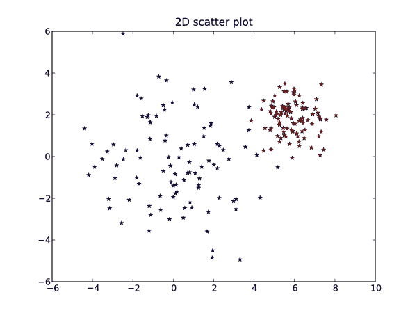
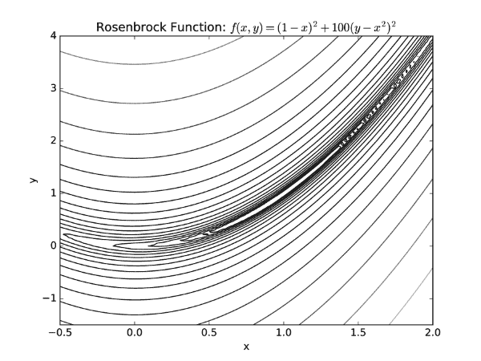
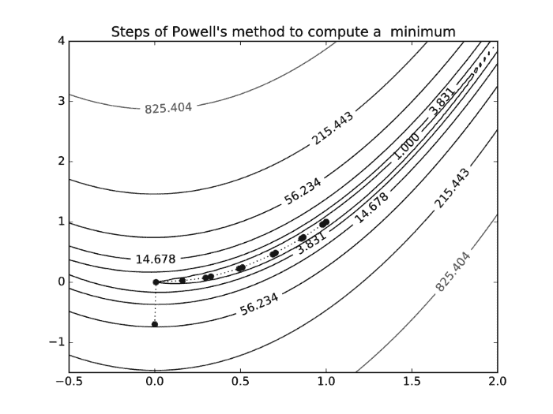

# 六、绘图

Python 中的绘图可以通过 matplotlib 模块的`pyplot`部分来完成。使用 matplotlib，您可以创建高质量的图形和图形，还可以绘制和可视化您的结果。Matplotlib 是开源的免费软件，[【21】](16.html "Appendix . References")。matplotlib 网站还包含优秀的文档和示例， [[35]](16.html "Appendix . References") 。在本节中，我们将向您展示如何使用最常见的功能。接下来几节中的示例假设您已经将模块导入为:

```py
from matplotlib.pyplot import *
```

如果想使用 IPython 中的绘图命令，建议在启动 IPython shell 后直接运行魔法命令`%matplotlib`。这为交互式绘图做好了准备。

# 基本标绘

标准绘图功能为`plot`。调用`plot(x,y)`创建一个图形窗口，其图形为 *y* 作为 *x* 的函数。输入参数是长度相等的数组(或列表)。也可以使用`plot(y)`，在这种情况下 *y* 中的值将相对于它们的指数绘制，即`plot(y)`是`plot(range(len(y)),y)`的缩写。

下面是一个示例，展示了如何使用 200 个采样点为*x*ϵ【-2π，2π】绘制 sin( *x* )并在每第四个点设置标记:

```py
# plot sin(x) for some interval
x = linspace(-2*pi,2*pi,200)
plot(x,sin(x))

# plot marker for every 4th point
samples = x[::4]
plot(samples,sin(samples),'r*')

# add title and grid lines
title('Function sin(x) and some points plotted')
grid()
```

结果如下图所示(*图 6.1* ):


图 6.1:显示了带有网格线的函数 sin(x)的曲线图。

如您所见，标准图是一条纯蓝色曲线。每个轴会自动缩放以适应这些值，但也可以手动设置。颜色和绘图选项可以在前两个输入参数之后给出。这里，`r*`表示红色的星形标记。下一节将更详细地介绍格式化。`title`命令在绘图区域上方放置一个标题文本字符串。

多次调用`plot`会将图叠加在同一个窗口中。要获得新的干净图形窗口，请使用`figure()`。`figure`命令可能包含一个整数，例如`figure(2)`，可用于在图形窗口之间切换。如果没有具有该编号的图形窗口，则会创建一个新的图形窗口，否则，该窗口将被激活以进行打印，并且所有后续的打印命令都将应用于该窗口。

可以使用`legend`功能解释多个绘图，并为每个绘图调用添加标签。以下示例使用命令`polyfit`和`polyval`将多项式拟合到一组点，并用图例绘制结果:

```py
# —Polyfit example—
x = range(5)
y = [1,2,1,3,5]
p2 = polyfit(x,y,2)
p4 = polyfit(x,y,4)

# plot the polynomials and points
xx = linspace(-1,5,200) 
plot(xx, polyval(p2, xx), label='fitting polynomial of degree 2')
plot(xx, polyval(p4, xx),
                label='interpolating polynomial of degree 4') 
plot(x,y,'*')

# set the axis and legend
axis([-1,5,0,6])
legend(loc='upper left', fontsize='small')
```

这里还可以看到如何使用`axis([xmin,xmax,ymin,ymax])`手动设置轴的范围。`legend`命令接受关于位置和格式的可选参数；这种情况下图例放在左上角，用小字号排版，如下图所示(*图 6.2* )。


图 6.2:拟合到相同点的两个多项式。

作为基本绘图的最后一个示例，我们演示了如何在二维中绘制散点图和对数图。

2D 点散点图示例:

```py
# create random 2D points
import numpy
x1 = 2*numpy.random.standard_normal((2,100))
x2 = 0.8*numpy.random.standard_normal((2,100)) + array([[6],[2]])
plot(x1[0],x1[1],'*')
plot(x2[0],x2[1],'r*')
title('2D scatter plot')
```



图 6.3(a):散点图的一个例子

以下代码是使用`loglog`的对数图的示例:

```py
# log both x and y axis 
x = linspace(0,10,200) 
loglog(x,2*x**2, label = 'quadratic polynomial',
                            linestyle = '-', linewidth = 3)
loglog(x,4*x**4, label = '4th degree polynomial',
                            linestyle = '-.', linewidth = 3)
loglog(x,5*exp(x), label = 'exponential function', linewidth = 3)
title('Logarithmic plots')
legend(loc = 'best')
```


图 6.3(b):带有对数 x 轴和 y 轴的曲线图示例

上图所示的例子(*图 6.3(a)* 和*图 6.3(b)* )使用了`plot`和`loglog`的一些允许特殊格式化的参数。在下一节中，我们将更详细地解释参数。

# 格式化

图形和情节的外观可以根据您的需要进行设计和定制。一些重要的变量是`linewidth`，控制地块线的粗细；设置轴标签的`xlabel`、`ylabel`、`color`为地块颜色，`transparent`为透明度。本节将告诉您如何使用其中的一些。下面是一个包含更多关键字的示例:

```py
k = 0.2
x = [sin(2*n*k) for n in range(20)]
plot(x, color='green', linestyle='dashed', marker='o', 
                       markerfacecolor='blue', markersize=12, linewidth=6)
```

如果您只需要基本的样式更改，例如设置颜色和线条样式，可以使用一些简短的命令。下表(*表 6.1* )显示了这些格式化命令的一些示例。您可以使用短字符串语法`plot(...,'ro-')`，或者更明确的语法`plot(..., marker='o', color='r', linestyle='-')`。


表 6.1:一些常见的绘图格式参数

要用我们写的`'o'`标记将颜色设置为绿色:

```py
plot(x,'go')
```

要绘制直方图而不是常规图，使用`hist`命令:

```py
# random vector with normal distribution
sigma, mu = 2, 10
x = sigma*numpy.random.standard_normal(10000)+mu 
hist(x,50,normed=1)
z = linspace(0,20,200)
plot(z, (1/sqrt(2*pi*sigma**2))*exp(-(z-mu)**2/(2*sigma**2)),'g')
# title with LaTeX formatting 
title('Histogram with '.format(mu,sigma))
```


图 6.4 具有 50 个箱的正态分布和指示真实分布的绿色曲线

结果图与上图相似(*图 6.4* )。标题和任何其他文本都可以使用 LaTeX 进行格式化，以显示数学公式。LaTeX 格式包含在一对`$`符号中。另外，请注意使用`format`方法进行的字符串格式化，请参考第 2 章、*变量和基本类型*中的*字符串*一节。

有时字符串格式的括号会干扰 LaTeX 括号环境。如果出现这种情况，用双支架替换 LaTeX 支架，例如`x_{1}`应替换为`x_{{1}}`。文本可能包含与字符串转义序列重叠的序列，例如，`\tau`将被解释为制表符`\t`。一个简单的解决方法是在字符串前添加`r`，例如`r'\tau'`；这使它成为一个原始字符串。

使用`subplot`命令可以在一个图形窗口中放置几个图。考虑下面的例子，它迭代地平均正弦曲线上的噪声。

```py
def avg(x):
    """ simple running average """
    return (roll(x,1) + x + roll(x,-1)) / 3
# sine function with noise
x = linspace(-2*pi, 2*pi,200)
y = sin(x) + 0.4*rand(200)

# make successive subplots
for iteration in range(3):
    subplot(3, 1, iteration + 1)
    plot(x,y, label = '{:d} average{}'.format(iteration, 's' if iteration > 1 else ''))
    yticks([])
    legend(loc = 'lower left', frameon = False)
    y = avg(y) #apply running average 
subplots_adjust(hspace = 0.7)
```


图 6.5:在同一图形窗口中绘制多次的示例。

函数`avg`使用`roll`调用来移动数组的所有值。`subplot`采用三个参数:垂直图的数量、水平图的数量和指示绘制位置的索引(按行计数)。请注意，我们使用`subplots_adjust`命令添加额外的空间来调整两个支线剧情之间的距离。

一个有用的命令是`savefig`，它允许你将一个图形保存为一个图像(这也可以在图形窗口中完成)。该命令支持许多图像和文件格式，它们由文件扩展名指定为:

```py
savefig('test.pdf')  # save to pdf
```

或者

```py
savefig('test.svg')  # save to svg (editable format)
```

您可以将图像放在非白色背景下，例如网页。为此，可以设置`transparent`参数使图形背景透明:

```py
savefig('test.pdf', transparent=True)
```

如果您打算将图形嵌入到 LaTeX 文档中，建议您通过将图形的边界框紧密设置在绘图周围来减少周围的空白，如下所示:

```py
savefig('test.pdf', bbox_inches='tight')
```

# 网格和等高线

常见的任务是矩形上标量函数的图形表示:


为此，首先我们必须在矩形[ *a* 、 *b* ] x [ *c* 、 *d* 上生成一个网格。这是使用`meshgrid`命令完成的:

```py
n = ... # number of discretization points along the x-axis
m = ... # number of discretization points along the x-axis 
X,Y = meshgrid(linspace(a,b,n), linspace(c,d,m))
```

`X`和`Y`为`(n,m)`形状的数组，使得包含网格点的坐标，如下图*(图 6.6)* :


图 6.6:由网格离散的矩形

由`meshgrid`离散的矩形将用于可视化迭代的行为。但是首先我们将使用它来绘制函数的水平曲线。这是通过命令`contour`完成的。

例如，我们选择罗森布鲁克的香蕉函数:


它用于挑战优化方法。函数值向香蕉形谷下降，该谷本身向函数的全局最小值(1，1)缓慢下降。

首先我们使用`contour`显示水平曲线。

```py
rosenbrockfunction = lambda x,y: (1-x)**2+100*(y-x**2)**2 
X,Y = meshgrid(linspace(-.5,2.,100), linspace(-1.5,4.,100))
Z = rosenbrockfunction(X,Y) 
contour(X,Y,Z,logspace(-0.5,3.5,20,base=10),cmap='gray') 
title('Rosenbrock Function: ')
xlabel('x')
ylabel('y')
```

这将在第四个参数给出的级别绘制级别曲线，并使用颜色图`gray`。此外，我们使用从 10 <sup>0.5</sup> 到 10 <sup>3</sup> 的对数间隔步长，使用函数`logscale`来定义级别，如下图所示。



图 6.7:罗森布鲁克函数的等高线图

在前面的例子中，由关键字`lambda`指示的匿名函数用于保持代码紧凑。匿名函数在[第 7 章](07.html "Chapter 7. Functions")、*函数*、*匿名函数*的*匿名函数 lambda 关键字*一节中进行了解释。如果等级没有作为参数提供给`contour`，函数会自己选择合适的等级。

`contourf`功能执行与`contour`相同的功能，但根据不同的级别用颜色填充绘图。等高线图是可视化数值方法行为的理想选择。我们在这里通过展示优化方法的迭代来说明这一点。

我们继续前面的例子，描述了由鲍威尔方法[【27】](16.html "Appendix . References")生成的罗森布罗克函数的最小值的步骤，我们将应用它来寻找罗森布罗克函数的最小值:

```py
import scipy.optimize as so
rosenbrockfunction = lambda x,y: (1-x)**2+100*(y-x**2)**2
X,Y=meshgrid(linspace(-.5,2.,100),linspace(-1.5,4.,100))
Z=rosenbrockfunction(X,Y)
cs=contour(X,Y,Z,logspace(0,3.5,7,base=10),cmap='gray')
rosen=lambda x: rosenbrockfunction(x[0],x[1])
solution, iterates = so.fmin_powell(rosen,x0=array([0,-0.7]),retall=True)
x,y=zip(*iterates)
plot(x,y,'ko') # plot black bullets
plot(x,y,'k:',linewidth=1) # plot black dotted lines
title("Steps of Powell's method to compute a  minimum")
clabel(cs)
```

迭代法`fmin_powell`应用鲍威尔法求最小值。它由给定的开始值 *x <sub>0</sub>* 启动，并在给出选项`retall=True`时报告所有迭代。经过十六次迭代，找到了解 *x=* 0 *，y=* 0。迭代在下面的等高线图中被描述为项目符号(*图 6.8* )。



图 6.8:罗森布鲁克函数的等高线图，带有优化方法的搜索路径

`contour`还创建了一个轮廓集对象，我们将其分配给变量`cs`。然后`clabel`用它来标注相应函数值的级别，如上图所示(*图 6.8* )。

# 图像和轮廓

让我们看一些将数组可视化为图像的例子。下面的函数将为曼德勃罗分形**创建一个颜色值矩阵。**这里我们考虑一个不动点迭代，它依赖于一个复杂的参数 *c* :


根据该参数的选择，它可能会也可能不会创建复数值的有界序列 *z <sub>n</sub>* 。

对于 *c* 的每个值，我们检查 *z <sub>n</sub>* 是否超过规定的界限。如果在`maxit`次迭代中，它保持在界限之下，我们假设序列是有界限的。

请注意，在下面这段代码中，`meshgrid`是如何用来生成复杂参数值矩阵的 *c:*

```py
def mandelbrot(h,w, maxit=20):
    X,Y = meshgrid(linspace(-2, 0.8, w), linspace(-1.4, 1.4, h))
    c = X + Y*1j
    z = c
    exceeds = zeros(z.shape, dtype=bool)

    for iteration in range(maxit):
        z  = z**2 + c
        exceeded = abs(z) > 4
        exceeds_now = exceeded & (logical_not(exceeds))  
        exceeds[exceeds_now] = True        
        z[exceeded] = 2  # limit the values to avoid overflow
    return exceeds

imshow(mandelbrot(400,400),cmap='gray')
axis('off')
```

命令`imshow`将矩阵显示为图像。所选的颜色图用白色显示了序列显示为无界的区域，用黑色显示了其他区域。这里我们使用`axis('off')`来关闭轴，因为这对于图像可能不是很有用。


图 6.9:使用 imshow 将矩阵可视化为图像的示例。

默认情况下，`imshow`使用插值使图像看起来更好。当矩阵很小时，这一点很明显。下图显示了使用:

```py
imshow(mandelbrot(40,40),cmap='gray')
```

和

```py
imshow(mandelbrot(40,40), interpolation='nearest', cmap='gray')
```

在第二个例子中，像素值被复制。


图 6.10:使用 imshow 的线性插值与使用最近邻插值的区别

有关使用 Python 处理和绘制图像的更多详细信息，请参考[【30】](16.html "Appendix . References")。

# Matplotlib 对象

到目前为止，我们已经使用了 matplotlib 的`pyplot`模块。这个模块让我们可以轻松地直接使用最重要的绘图命令。大多数情况下，我们感兴趣的是创建一个图形并立即显示它。但是，有时我们想生成一个图形，稍后应该通过改变它的一些属性来修改它。这要求我们以面向对象的方式处理图形对象。在本节中，我们将介绍一些修改图形的基本步骤。对于 Python 中更复杂的面向对象的绘图方法，您必须离开`pyplot`并直接进入`matplotlib`及其大量的文档。

## 轴对象

当创建一个以后应该修改的图时，我们需要引用一个图形和一个轴对象。为此，我们必须先创建一个图形，然后定义一些轴及其在图形中的位置。我们不应该忘记将这些对象分配给一个变量:

```py
fig = figure()
ax = subplot(111)
```

根据`subplot`的使用，一个图形可以有多个轴对象。在第二步中，绘图与给定的轴对象相关联:

```py
fig = figure(1)
ax = subplot(111)
x = linspace(0,2*pi,100) 
# We set up a function that modulates the amplitude of the sin function
amod_sin = lambda x: (1.-0.1*sin(25*x))*sin(x)
# and plot both...
ax.plot(x,sin(x),label = 'sin') 
ax.plot(x, amod_sin(x), label = 'modsin')
```

这里我们使用了一个由`lambda`关键字表示的匿名函数。我们将在后面的章节*匿名函数中解释这个构造-在[第 7 章](07.html "Chapter 7. Functions")、*函数*中的 lambda 关键字*。事实上，这两个绘图命令用两个`Lines2D`对象填充列表`ax.lines`:

```py
ax.lines #[<matplotlib.lines.Line2D at ...>, <matplotlib.lines.Line2D at ...>]
```

使用标签是一个很好的做法，这样我们以后就可以用一种简单的方式识别对象:

```py
for il,line in enumerate(ax.lines):
    if line.get_label() == 'sin':
       break
```

我们现在以一种允许进一步修改的方式设置事情。我们目前得到的图如前图所示(*图 6.11，左*)。

## 修改线条属性

我们只是通过标签来识别特定的线对象。它是带有索引`il`的列表`ax.lines`列表的一个元素。它的所有属性都收集在字典中

```py
dict_keys(['marker', 'markeredgewidth', 'data', 'clip_box', 'solid_capstyle', 'clip_on', 'rasterized', 'dash_capstyle', 'path', 'ydata', 'markeredgecolor', 'xdata', 'label', 'alpha', 'linestyle', 'antialiased', 'snap', 'transform', 'url', 'transformed_clip_path_and_affine', 'clip_path', 'path_effects', 'animated', 'contains', 'fillstyle', 'sketch_params', 'xydata', 'drawstyle', 'markersize', 'linewidth', 'figure', 'markerfacecolor', 'pickradius', 'agg_filter', 'dash_joinstyle', 'color', 'solid_joinstyle', 'picker', 'markevery', 'axes', 'children', 'gid', 'zorder', 'visible', 'markerfacecoloralt'])
```

这可以通过以下命令获得:

```py
ax.lines[il].properties()
```

它们可以通过相应的 setter 方法进行更改。让我们更改正弦曲线的线条样式:

```py
ax.lines[il].set_linestyle('-.')
ax.lines[il].set_linewidth(2)
```

我们甚至可以修改数据，如图所示:

```py
ydata=ax.lines[il].get_ydata()
ydata[-1]=-0.5
ax.lines[il].set_ydata(ydata)
```

结果如下图*(图 6.11，右)*:


图 6.11:调幅正弦函数(左)和最后一个数据点损坏的曲线(右)。

## 注释

一个有用的轴方法是`annotate`。它在给定位置设置注释，并用箭头指向图形中的另一个位置。箭头可以在字典中被赋予属性:

```py
annot1=ax.annotate('amplitude modulated\n curve', (2.1,1.0),(3.2,0.5),
       arrowprops={'width':2,'color':'k', 'connectionstyle':'arc3,rad=+0.5', 
                   'shrink':0.05},
       verticalalignment='bottom', horizontalalignment='left',fontsize=15, 
                   bbox={'facecolor':'gray', 'alpha':0.1, 'pad':10})
annot2=ax.annotate('corrupted data', (6.3,-0.5),(6.1,-1.1),
       arrowprops={'width':0.5,'color':'k','shrink':0.1},
       horizontalalignment='center', fontsize=12)
```

在上面的第一个注释示例中，箭头指向坐标为( *2.1，1.0* )的点，文本的左下方坐标为( *3.2，0.5* )。如果没有另外指定，坐标是在方便的数据坐标系中给出的，这是指用于生成图的数据。

此外，我们演示了由`arrowprop`字典指定的几个箭头属性。您可以通过`shrink`键缩放箭头。设置`'shrink':0.05`将箭头尺寸减小 5%，以与它所指向的曲线保持一段距离。您可以使用`connectionstyle`键让箭头跟随样条弧或赋予它其他形状。

文本属性甚至文本周围的边界框都可以通过额外的关键字参数来标注方法，参见下图(*图 6.12，左侧*):

实验注释有时需要移除我们想要拒绝的尝试。因此，我们将注释对象分配给一个变量，这允许我们通过其`remove`方法移除注释:

```py
annot1.remove()
```

## 填充曲线之间的区域

填充是突出曲线之间差异的理想工具，例如预期数据之上的噪声、近似与精确函数等。

填充是通过轴方法完成的

```py
ax.fill_between(x,y1,y2)
```

对于我们使用的下一个数字:

```py
axf = ax.fill_between(x, sin(x), amod_sin(x), facecolor='gray')
```

`where`是一个非常方便的参数，需要一个布尔数组来指定额外的填充条件。

```py
axf = ax.fill_between(x, sin(x), amod_sin(x),where=amod_sin(x)-sin(x) > 0, facecolor=’gray’)
```

选择要填充的区域的布尔数组是`amod_sin(x)-sin(x) > 0`。

下图显示了带有两种填充区域的曲线:


图 6.12:带有注释和填充区域的调幅正弦函数(左)和使用 where 参数仅部分填充区域的修改图形(右)。

如果您自己测试这些命令，在尝试部分填充之前，不要忘记删除完整的填充，否则您将看不到任何变化:

```py
axf.remove()
```

相关填充命令为`fill`、`fill_betweenx`。

## 刻度和标签

如果谈话、海报和出版物中的人物没有过多的不必要信息，他们看起来会好得多。你想把观众引向那些包含信息的部分。在我们的示例中，我们通过从 *x* 轴和 *y* 轴移除刻度并引入与问题相关的刻度标签来清理图片:


图 6.13:振幅调制正弦函数的完整示例，带有注释和填充区域以及修改的刻度和刻度标签。

```py
ax.set_xticks(array([0,pi/2,pi,3/2*pi,2*pi]))
ax.set_xticklabels(('$0$','$\pi/2$','$\pi$','$3/2 \pi$','$2 \pi$'),fontsize=18)
ax.set_yticks(array([-1.,0.,1]))
ax.set_yticklabels(('$-1$','$0$','$1$'),fontsize=18)
```

请注意，我们在字符串中使用 LaTeX 格式来表示希腊字母，正确设置公式，并使用 LaTeX 字体。增加字体大小也是一种很好的做法，这样可以将生成的图形缩小到文本文档中，而不会影响坐标轴的可读性。本指导例最终结果见上图(*图 6.13* )。

# 制作三维图

有一些有用的`matplotlib`工具包和模块可以用于各种特殊用途。在本节中，我们描述了一种生成三维图的方法。

`mplot3d`工具包提供点、线、轮廓、表面和所有其他基本组件的三维绘图，以及三维旋转和缩放。如下例所示，通过将关键字`projection='3d'`添加到轴对象来制作三维图:

```py
from mpl_toolkits.mplot3d import axes3d

fig = figure()
ax = fig.gca(projection='3d')
# plot points in 3D
class1 = 0.6 * random.standard_normal((200,3))
ax.plot(class1[:,0],class1[:,1],class1[:,2],'o')
class2 = 1.2 * random.standard_normal((200,3)) + array([5,4,0])
ax.plot(class2[:,0],class2[:,1],class2[:,2],'o')
class3 = 0.3 * random.standard_normal((200,3)) + array([0,3,2])
ax.plot(class3[:,0],class3[:,1],class3[:,2],'o')
```

可以看到，需要从`mplot3d`导入`axes3D`类型。生成的图显示了分散的三维数据，如下图所示(*图 6.14* )


图 6.14:使用 mplot3d 工具包绘制三维数据

绘制曲面同样简单。以下示例使用内置函数`get_test_data`创建用于绘制曲面的样本数据。考虑以下带有透明度的曲面图示例。

```py
X,Y,Z = axes3d.get_test_data(0.05)

fig = figure()
ax = fig.gca(projection='3d')
# surface plot with transparency 0.5 
ax.plot_surface(X,Y,Z,alpha=0.5)
```

*α*值设置透明度。曲面图如下图所示(*图 6.15* )。


图 6.15:用三个 2D 投影绘制表面网格的示例。

您也可以在任何坐标投影中绘制等高线，如下例所示。

```py
fig = figure()
ax = fig.gca(projection = '3d')
ax.plot_wireframe(X,Y,Z,rstride = 5,cstride = 5)

# plot contour projection on each axis plane
ax.contour(X,Y,Z, zdir='z',offset = -100)
ax.contour(X,Y,Z, zdir='x',offset = -40)
ax.contour(X,Y,Z, zdir='y',offset = 40)

# set axis limits
ax.set_xlim3d(-40,40)
ax.set_ylim3d(-40,40)
ax.set_zlim3d(-100,100)

# set labels
ax.set_xlabel('X axis')
ax.set_ylabel('Y axis')
ax.set_zlabel('Z axis')
```

注意设置轴限制的命令。用于设置轴限制的标准`matplotlib`命令是`axis([-40, 40, -40, 40])`，这对于 2D 地块很有效。然而，`axis([-40,40,-40,40,-40,40])`不起作用。对于三维绘图，您需要使用面向对象版本的命令，`ax.set_xlim3d(-40,40)`和类似的命令。标注轴也是如此；请注意设置标签的命令。对于 2D 地块你可以做`xlabel(’X axis’)`和`ylabel(’Y axis’)`但是没有`zlabel`命令。相反，在三维绘图中，您需要使用`ax.set_xlabel(’X axis’)`和类似的工具，如前例所示。

这段代码的结果如下


有许多选项可用于设置地块外观的格式，包括曲面的颜色和透明度。`mplot3d`文档网站[【23】](16.html "Appendix . References")有详细信息。

# 用剧情拍电影

如果您有演变的数据，除了在图形窗口中显示之外，您可能还想将其保存为电影，类似于`savefig`命令。一种方法是使用 visvisvis 提供的`visvis`模块(更多信息请参考[【37】](16.html "Appendix . References"))。

这里有一个简单的例子，用隐式表示法来演化一个圆。让圆用函数的零电平来表示。或者，考虑零点集合内的圆盘。如果 *f* 的值以 *v* 的速率减小，则圆将以的速率向外移动。

这可以实现为:

```py
import visvis.vvmovie as vv

# create initial function values
x = linspace(-255,255,511)
X,Y = meshgrid(x,x)
f = sqrt(X*X+Y*Y) - 40 #radius 40

# evolve and store in a list
imlist = []
for iteration in range(200):
    imlist.append((f>0)*255)
    f -= 1 # move outwards one pixel
vv.images2swf.writeSwf('circle_evolution.swf',imlist)
```

结果是一部 Flash 电影(*。swf 文件)的一个不断增长的黑色圆圈，如下图所示(*图 6.16)* :


图 6.16:一个演化圆的例子

在本例中，使用数组列表来创建电影。`visvis`模块还可以保存 GIF 动画，在某些平台上还可以保存 AVI 动画(*。gif 和*。avi 文件 *)* ，也有可能直接从人物窗口捕捉电影画面。然而，这些选项需要在您的系统上安装更多的软件包(例如，`PyOpenGL`和`PIL`，Python 图像库)。详见`visvis`网页上的文档。

另一种选择是使用`savefig`创建图像，每帧一个。

```py
# create initial function values
x = linspace(-255,255,511)
X,Y = meshgrid(x,x)
f = sqrt(X*X+Y*Y) - 40 #radius 40
for iteration in range(200):
    imshow((f>0)*255)
    gray()
    axis('off')
    savefig('circle_evolution_{:d}.png'.format(iteration))
    f -= 1
```

然后，可以使用标准的视频编辑软件(例如美柯德或 ImageMagick)来组合这些图像。这种方法的优点是，您可以通过保存高分辨率图像来制作高分辨率视频。

# 总结

图形表示是呈现数学结果或算法行为的最简洁形式。本章为您提供了绘图的基本工具，并向您介绍了以面向对象的方式处理图形对象(如图形、轴和线)的更复杂的方法。

在本章中，您学习了如何制作图，不仅是经典的 x/y 图，还有 3D 图和直方图。我们给了你一个拍电影的开胃菜。您还看到了如何修改绘图，将它们视为具有相关方法和属性的图形对象，这些方法和属性可以设置、删除或修改。

# 练习

**Ex。1** →编写一个函数，给定椭圆的中心坐标( *x，y* )、半轴 *a* 和 *b* 旋转角度θ绘制椭圆。

**Ex。2** →写一个短程序，取一个 2D 数组，比如前面的 Mandelbrot 轮廓图像，用相邻值的平均值迭代替换每个值。在图形窗口中更新数组的等高线图，以动画显示等高线的演变。解释行为。

**Ex。3** →考虑一个带有整数值的 *N × N* 矩阵或图像。地图


是点的环形正方形网格映射到自身的一个示例。这有一个有趣的特性，它通过剪切扭曲图像，然后使用 modulu 函数`mod`将图像之外的部分移回。迭代应用，这导致随机图像的方式，最终返回原来的。执行以下顺序:


并将前 N 步保存到文件中或在图形窗口中绘制出来。

作为示例图像，您可以使用来自`scipy.misc`的经典 512 *×* 512 Lena 测试图像。

```py
from scipy.misc import lena
I = lena()
```

结果应该如下所示:

<colgroup><col> <col> <col> <col> <col> <col> <col> <col> <col></colgroup> 
|  |  | … |  | … |  | … |  |  |
| Zero | one |  | One hundred and twenty-eight |  | Two hundred and fifty-six |  | Five hundred and eleven | Five hundred and twelve |

### 型式

计算 *x* 和 *y* 映射，并使用数组索引(参考[第 5 章](05.html "Chapter 5. Advanced Array Concepts")、*高级数组概念*中的*数组索引*部分)来复制像素值。

**Ex。4** →图像读取和绘制。SciPy 自带`imread`功能(在`scipy.misc`模块)读取图像，(参考[第 12 章](12.html "Chapter 12. Input and Output")、*输入输出*中*读写图像*一节)。写一个简短的程序，从文件中读取一个图像，并在给定的灰度值下绘制覆盖在原始图像上的图像轮廓。

### 型式

您可以通过对颜色通道进行平均来获得图像的灰度版本，如下所示:`mean(im,axis=2)`

**Ex。5** →图像边缘。2D 拉普拉斯的过零点是图像边缘的良好指示。修改上一练习中的程序，使用`scipy.ndimage`模块中的`gaussian_laplace`或`laplace`功能计算 2D 拉普拉斯算子，并将边缘覆盖在图像顶部。

**Ex。6** →使用`orgid`代替`meshgrid,`重新表述曼德罗德分形示例(参见*图像和轮廓部分)*另请参见[第 5 章](05.html "Chapter 5. Advanced Array Concepts")、*高级数组概念*中*双变量函数*中的解释`ogrid`。`orgid`、`mgrid`和`meshgrid`有什么区别？