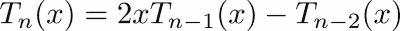
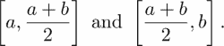
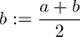

# 七、函数

本章介绍函数，这是编程中的一个基本构件。我们展示了如何定义它们，如何处理输入和输出，如何正确使用它们，以及如何将它们视为对象。

# 基础

在数学中，一个函数被写成一个映射，它唯一地将一个元素 *y* 从范围 *R* 分配给域 *D* 中的每个元素 *x* 。

这由 *f : D → R* 表示

或者，当考虑特定元素 *x* 和 *y* 时，可以写 *f : x → y*

在这里， *f* 被称为函数的名称， *f(x)* 是其应用于 *x* 时的值。在这里， *x* 有时被称为 *f.* 我们先看一个例子，然后再考虑 Python 中的函数。

例如， *D =* ℝ x ℝ和 *y = f(x <sub>1</sub> ，x<sub>2</sub>)= x<sub>1</sub>-x<sub>2</sub>*。这个函数把两个实数映射到它们的差上。

在数学中，函数可以有数字、向量、矩阵，甚至其他函数作为自变量。下面是一个带有混合参数的函数示例:

。

在这种情况下，会返回一个数字。使用函数时，我们必须区分两个不同的步骤:

*   函数的定义
*   函数的求值，即对于给定值 *x* 的 *f(x)* 的计算

第一步完成一次，而第二步可以针对各种参数执行多次。编程语言中的函数遵循相同的概念，并将其应用于各种类型的输入参数，例如字符串、列表或任何对象。我们通过再次考虑给定的例子来演示函数的定义:

```py
def subtract(x1, x2):
    return x1 - x2
```

关键字`def`表示我们要定义一个函数。`subtract`是函数的名称，`x1`和 `*x2*` 是它的参数。冒号表示我们正在使用一个 block 命令，函数返回的值跟在`return`关键字后面。现在，我们可以评估这个函数。调用此函数时，其参数由输入参数代替:

```py
r = subtract(5.0, 4.3)
```

计算结果 0.7 并分配给`r`变量。

# 参数和参数

定义函数时，其输入变量称为函数的参数。执行函数时使用的输入称为其参数。

## 传递参数-按位置和关键字

我们将再次考虑前面的例子，其中函数采用两个参数，即`x1`和`x2`。

它们的名字用来区分这两个数字，在这种情况下，不改变结果就不能互换。第一个参数定义从中减去第二个参数的数字。调用`subtract`时，每个参数都被一个参数代替。只有争论的顺序很重要；参数可以是任何对象。例如，我们可以称之为:

```py
z = 3 
e = subtract(5,z)
```

除了这种调用函数的标准方式(即通过位置传递参数)之外，有时使用关键字传递参数可能会更方便。参数的名称是关键字；考虑以下实例:

```py
z = 3 
e = subtract(x2 = z, x1 = 5)
```

这里，参数是按名称而不是按调用中的位置分配给参数的。调用函数的两种方式可以结合起来，这样由 position 给出的参数排在第一位，由 keyword 给出的参数排在最后。我们使用功能`plot`来显示这一点，该功能在[第 6 章](06.html "Chapter 6. Plotting")、*标绘*中有描述:

```py
plot(xp, yp, linewidth = 2,label = 'y-values')
```

## 改变论点

参数的目的是为函数提供必要的输入数据。更改函数内部的参数值通常不会影响函数外部的参数值:

```py
def subtract(x1, x2):
    z = x1 - x2
    x2 = 50.
    return z
a = 20.
b = subtract(10, a)    # returns -10
a    # still has the value 20
```

这适用于所有不可变的参数，如字符串、数字和元组。如果可变参数(如列表或字典)被更改，情况就不同了。

例如，将可变输入参数传递给函数，并在函数内部更改它们，也可以在函数外部更改它们:

```py
def subtract(x):
    z = x[0] - x[1]
    x[1] = 50.
    return z
a = [10,20]
b = subtract(a)    # returns -10
a    # is now [10, 50.0]
```

这样的函数滥用它的参数来返回结果。我们强烈建议您不要这样构造，并且建议您不要更改函数内部的输入参数(更多信息请参考*默认参数*部分)。

## 访问在本地命名空间之外定义的变量

Python 允许函数访问在其任何封闭程序单元中定义的变量。与局部变量相反，这些变量被称为全局变量。后者只能在函数中访问。例如，考虑以下代码:

```py
import numpy as np # here the variable np is defined
def sqrt(x):
    return np.sqrt(x) # we use np inside the function
```

这个功能不应该被滥用。下面的代码是一个不应该做什么的例子:

```py
a = 3
def multiply(x):
    return a * x # bad style: access to the variable a defined outside
```

当改变变量`a`时，函数`multiply`默认改变其行为:

```py
a=3
multiply(4)  # returns 12
a=4
multiply(4)  # returns 16
```

在这种情况下，最好通过参数列表提供变量作为参数:

```py
def multiply(x, a):
    return a * x
```

使用闭包时，全局变量可能很有用。名称空间和范围在[第 11 章](11.html "Chapter 11. Namespaces, Scopes, and Modules")、*名称空间、范围和模块*中有更广泛的讨论。

## 默认参数

有些函数可以有许多参数，其中一些可能只在非标准情况下有用。如果参数可以自动设置为标准(默认)值，这将是切实可行的。我们通过查看`scipy.linalg`模块中的命令`norm`来演示默认参数的使用。它计算矩阵和向量的各种范数。

以下片段要求计算 *3 × 3* 单位矩阵的**弗罗贝纽斯范数**是等价的(关于矩阵范数的更多信息可以在[【10】](16.html "Appendix . References")中找到):

```py
import scipy.linalg as sl
sl.norm(identity(3))
sl.norm(identity(3), ord = 'fro')
sl.norm(identity(3), 'fro')
```

注意，在第一次调用中，没有给出关于`ord`关键字的信息。Python 如何知道它应该计算 Frobenius 范数而不是另一个范数，例如欧几里德 2-范数？

上一个问题的答案是使用默认值。默认值是函数定义已经给出的值。如果调用函数时没有提供这个参数，Python 会使用程序员在定义函数时提供的值。

假设我们调用的函数`subtract`只有一个参数；我们会收到一条错误消息:

```py
TypeError: subtract() takes exactly 2 arguments (1 given)
```

为了允许省略参数`x2`，函数的定义必须提供默认值，例如:

```py
def subtract(x1, x2 = 0): 
    return x1 - x2
```

总而言之，参数可以作为位置参数和关键字参数给出。必须首先给出所有的位置参数。只要省略的参数在函数定义中有默认值，就不需要提供所有关键字参数。

### 小心可变默认参数

默认参数是根据函数定义设置的。使用默认值时，更改函数内部的可变参数会产生副作用，例如:

```py
def my_list(x1, x2 = []):
    x2.append(x1)
    return x2
my_list(1)  # returns [1]
my_list(2)  # returns [1,2]
```

# 可变参数数

列表和字典可用于定义或调用具有可变数量参数的函数。让我们定义一个列表和一个字典如下:

```py
data = [[1,2],[3,4]]    
style = dict({'linewidth':3,'marker':'o','color':'green'})
```

然后我们可以使用带星号(`*`)的参数调用`plot`函数:

```py
plot(*data,**style)
```

以`*`为前缀的变量名，如前面例子中的`*data`，意味着提供了一个在函数调用中被解包的列表。这样，列表会生成位置参数。类似地，以`**`为前缀的变量名，如示例中的`**style`，将字典解包为关键字参数。参考下图(*图 7.1* ):


图 7.1:函数调用中的星号参数

您可能还想使用相反的过程，其中所有给定的位置参数都打包成一个列表，所有关键字参数在传递给函数时都打包成一个字典。

在函数定义中，这由分别以`*`和`**`为前缀的参数表示。您会经常在代码文档中找到`*args`和`**kwargs`参数，参见*图 7.2* 。


图 7.2:函数定义中的星形参数

# 返回值

Python 中的函数总是返回单个对象。如果一个函数必须返回多个对象，这些对象将被打包并作为单元组对象返回。

例如，下面的函数取一个复数 *z* ，并根据欧拉公式将其极坐标表示返回为幅度 *r* 和角度:


Python 的对应物是这样的:

```py
def complex_to_polar(z):
    r = sqrt(z.real ** 2 + z.imag ** 2)
    phi = arctan2(z.imag, z.real)
    return (r,phi)  # here the return object is formed
```

这里，我们使用`sqrt(x)` NumPy 函数作为数字`x`的平方根，使用`arctan2(x,y)`作为表达式 tan <sup>-1</sup> ( *x/y* )。

让我们试试我们的功能:

```py
z = 3 + 5j  # here we define a complex number
a = complex_to_polar(z)
r = a[0]
phi = a[1]
```

最后三个语句可以用一行写得更优雅:

```py
r,phi = complex_to_polar(z)
```

我们可以通过调用`polar_to_comp`来测试我们的功能；参考*练习 1* 。

如果一个函数没有`return`语句，则返回值`None`。在许多情况下，函数不需要返回值。这可能是因为传递给函数的变量可能会被修改。例如，考虑以下函数:

```py
def append_to_list(L, x):
    L.append(x)
```

前面的函数不返回任何内容，因为它修改了作为参数给出的一个对象。我们在*参数和参数*部分提到了为什么这是有用的。有许多方法的行为方式是相同的。仅提及列表方法，`append`、`extend`、`reverse`和`sort`方法不返回任何内容(即返回`None`)。当一个对象被一个方法以这种方式修改时，这种修改被就地调用。除非通过查看代码或文档，否则很难知道一个方法是否改变了一个对象。

函数或方法不返回任何内容的另一个原因是当它打印出消息或写入文件时。

执行在第一个出现的`return`语句处停止。该语句后的行是死代码，永远不会执行:

```py
def function_with_dead_code(x):
    return 2 * x
    y = x ** 2 # these two lines ...
    return y   # ... are never executed!
```

# 递归函数

在数学中，许多函数都是递归定义的。在这一节中，我们将展示这个概念如何在编程函数时使用。这使得程序与其数学对应物的关系非常清楚，这可能会降低程序的可读性。

然而，我们建议您谨慎使用这种编程技术，尤其是在科学计算领域。在大多数应用中，更直接的迭代方法更有效。从下面的例子中，这一点将立即变得清楚。

切比雪夫多项式由三项递归定义:



这样的递归需要初始化，即 *T* <sub xmlns:epub="http://www.idpf.org/2007/ops" xmlns:m="http://www.w3.org/1998/Math/MathML" xmlns:pls="http://www.w3.org/2005/01/pronunciation-lexicon" xmlns:ssml="http://www.w3.org/2001/10/synthesis">0</sub> ( *x* ) =1、*T*T8】1(*x*)=*x .*

在 Python 中，这三项递归可以通过以下函数定义来实现:

```py
def chebyshev(n, x):
    if n == 0:
        return 1.
    elif n == 1:
        return x
    else:
        return 2\. * x * chebyshev(n - 1, x) 
                      - chebyshev(n - 2 ,x)

```

该函数的调用方式如下:

```py
chebyshev(5, 0.52) # returns 0.39616645119999994
```

这个例子也说明了大幅浪费计算时间的风险。函数求值的数量随着递归级别呈指数增长，并且这些求值中的大多数只是以前计算的重复。虽然使用递归程序来演示代码和数学定义之间的强关系可能很有诱惑力，但是生产代码将避免这种编程技术(参考*练习* 6)。我们还提到了一种叫做记忆化的技术(更多细节请参考[【22】](16.html "Appendix . References")*)*，它将递归编程与缓存技术相结合，以保存复制的函数求值。

递归函数通常有一个级别参数。在前面的例子中，它是 *n.* 它用于控制功能的两个主要部分:

*   基本情况，这里，前两个`if`分支
*   递归体，其中使用较小的级别参数调用函数本身一次或多次。

递归函数的执行传递的级别数称为递归深度。这个数量不能太大；否则计算可能不再有效，最终会出现以下错误:

```py
RuntimeError: maximum recursion depth exceeded
```

最大递归深度取决于您使用的计算机的内存。当函数定义中缺少初始化步骤时，也会出现此错误。我们鼓励对非常小的递归深度使用递归程序(有关更多信息，请参考[第 9 章](09.html "Chapter 9. Iterating")、*迭代*的*无限迭代*一节。

# 功能文档

您应该在开始时使用字符串来记录您的函数。这称为文档字符串:

```py
def newton(f, x0):
    """
    Newton's method for computing a zero of a function
    on input:
    f  (function) given function f(x)
    x0 (float) initial guess 
    on return:
    y  (float) the approximated zero of f
    """
     ...
```

调用`help(newton)`时，这个文档字符串会和这个函数的调用一起显示出来:

```py
Help on function newton in module __main__:

newton(f, x0)
     Newton's method for computing a zero of a function
     on input:
     f  (function) given function f(x)
     x0 (float) initial guess
     on return:
     y  (float) the approximated zero of f
```

文档字符串在内部保存为给定函数的属性`__doc__`。在示例中，它是`newton.__doc__`。您应该在文档字符串中提供的最小信息是函数的目的以及输入和输出对象的描述。有工具可以通过收集程序中的所有文档字符串来自动生成完整的代码文档(更多信息请参考 [[32]](16.html "Appendix . References") )。

# 函数是对象

函数是对象，就像 Python 中的其他东西一样。人们可以传递函数作为参数，更改它们的名称，或者删除它们。例如:

```py
def square(x):
    """
    Return the square of x
    """
    return x ** 2
square(4) # 16
sq = square # now sq is the same as square
sq(4) # 16
del square # square doesn't exist anymore
print(newton(sq, .2)) # passing as argument
```

在科学计算中应用算法时，将函数作为参数传递是非常常见的。计算给定函数的零点的`scipy.optimize`中的函数`fsolve`或计算积分的`scipy.integrate`中的`quad`就是典型的例子。

函数本身可以有不同类型的不同数量的参数。因此，当将您的函数`f`作为参数传递给另一个函数`g`时，请确保`f`与`g`的文档字符串中描述的形式完全相同。

`fsolve`的文档字符串给出了其`func`参数的信息:

```py
func -- A Python function or method which takes at least one
               (possibly vector) argument.
```

## 部分应用

让我们从一个双变量函数的例子开始。

函数可以看作是两个变量的函数。人们通常认为ω不是自由变量，而是函数族的固定参数:


这种解释将两个变量中的一个函数简化为一个变量中的一个函数`t`，给定一个固定的参数值 *ω* 。通过固定(冻结)函数的一个或几个参数来定义新函数的过程称为部分应用。

使用 Python 模块`functools`可以轻松创建部分应用，该模块正是为此目的提供了一个名为`partial`的函数。我们通过构造一个函数来说明这一点，该函数返回给定频率的正弦值:

```py
import functools
def sin_omega(t, freq):
    return sin(2 * pi * freq * t)

def make_sine(frequency):
    return functools.partial(sin_omega, freq = frequency)
```

### 使用闭包

使用函数是对象的观点，部分应用可以通过编写一个函数来实现，这个函数本身返回一个新的函数，减少了输入参数的数量。例如，该函数可以定义如下:

```py
def make_sine(freq):
    "Make a sine function with frequency freq"
    def mysine(t):
        return sin_omega(t, freq)
    return mysine
```

在本例中，内部函数`mysine`可以访问变量`freq`；它既不是这个函数的局部变量，也不是通过参数列表传递给它的。Python 允许这样的构造(参见[第 11 章](11.html "Chapter 11. Namespaces, Scopes, and Modules")、*命名空间、范围和模块*中的*命名空间*部分)。

# 匿名函数 lambda 关键字

Python 中使用关键字 lambda 定义匿名函数，即；函数没有名字，用一个表达式描述。您可能只想对一个可以用简单表达式表示的函数执行操作，而不需要命名该函数，也不需要用冗长的`def`块定义该函数。

### 注

名称*λ*源于微积分和数理逻辑的一个特殊分支，-微积分。

例如，为了计算下面的表达式，我们可以使用 SciPy 的函数`quad`，它要求函数被积分作为它的第一个参数，积分界限作为接下来的两个参数:


这里，要集成的函数只是一个简单的单行函数，我们使用`lambda`关键字来定义它:

```py
import scipy.integrate as si
si.quad(lambda x: x ** 2 + 5, 0, 1)
```

语法如下:

```py
lambda parameter_list: expression
```

`lambda`函数的定义只能由一个表达式组成，特别是不能包含循环。`lambda`与其他函数一样，函数是对象，可以分配给变量:

```py
parabola = lambda x: x ** 2 + 5
parabola(3) # gives 14
```

## λ结构总是可替换的

需要注意的是，lambda 构造只是 Python 中的语法糖。任何 lambda 结构都可以用显式函数定义来代替:

```py
parabola = lambda x: x**2+5 
# the following code is equivalent
def parabola(x):
    return x ** 2 + 5
```

使用构造的主要原因是为了非常简单的函数，而完整的函数定义会过于繁琐。

`lambda`函数提供了第三种构造闭包的方法，正如我们继续前面的例子所展示的:

我们使用`sin_omega`函数计算不同频率下正弦函数的积分:

```py
import scipy.integrate as si
for iteration in range(3):
    print(si.quad(lambda x: sin_omega(x, iteration*pi), 0, pi/2.) )
```

# 作为装饰者的功能

在部分应用部分，我们看到了如何使用一个函数来修改另一个函数。装饰器是 Python 中的语法元素，它方便地允许我们改变函数的行为，而不改变函数本身的定义。让我们从以下情况开始:

假设我们有一个决定矩阵稀疏程度的函数:

```py
def how_sparse(A):
    return len(A.reshape(-1).nonzero()[0])
```

如果该函数不是以数组对象作为输入调用的，它将返回一个错误。更准确地说，它不适用于不实现`reshape`方法的对象。例如，`how_sparse`函数不适用于列表，因为列表没有`reshape`方法。下面的 helper 函数修改任何带有一个输入参数的函数，以便尝试对数组进行类型转换:

```py
def cast2array(f):
    def new_function(obj):
        fA = f(array(obj))
        return fA
    return new_function
```

因此，修改后的函数`how_sparse = cast2array(how_sparse)`可以应用于任何可以转换为数组的对象。如果用类型转换功能修饰`how_sparse`的定义，也可以实现同样的功能。还建议考虑`functools.wraps`(详见[【8】](16.html "Appendix . References")):

```py
@cast2array
def how_sparse(A):
    return len(A.reshape(-1).nonzero()[0])
```

要定义装饰器，您需要一个可调用的对象，例如修改要装饰的函数定义的函数。主要目的是:

*   通过从不直接为其功能服务的函数中分离出部分来提高代码的可读性(例如，记忆)
*   将一系列相似函数的公共序言和结尾部分放在一个公共位置(例如，类型检查)
*   能够轻松地关闭和打开功能的附加功能(例如，测试打印、跟踪)

# 总结

函数不仅是使程序模块化的理想工具，而且也反映了数学思维。您学习了函数定义的语法，以及如何区分定义和调用函数。

我们认为函数是可以被其他函数修改的对象。使用函数时，熟悉变量范围的概念以及信息如何通过参数传递到函数中是很重要的。

有时，用所谓的匿名函数动态定义函数是很方便的。为此，我们引入了关键字 lambda。

# 练习

**例 1** →编写一个函数`polar_to_comp`，该函数接受两个参数 *r* 和并返回复数指数函数使用 NumPy 函数`exp`。

**Ex 2** →在 Python 模块`functools`的描述中(参见[【8】](16.html "Appendix . References")了解更多关于 functools 的详细信息)您可以找到以下 Python 函数:

```py
def partial(func, *args, **keywords):
    def newfunc(*fargs, **fkeywords):
        newkeywords = keywords.copy()
        newkeywords.update(fkeywords)
        return func(*(args + fargs), **newkeywords)
    newfunc.func = func
    newfunc.args = args
    newfunc.keywords = keywords
    return newfunc
```

解释并测试该功能。

**Ex 3** →为函数`how_sparse`编写装饰器，通过将小于 1.e-16 的元素设置为零来清理输入矩阵 *A* (考虑第*节中作为装饰器*的示例)。

**Ex 4** → A 连续函数 *f* 与*f*(*A*)*f*(*b*)<0 在区间【 *a，b* 中改变其符号，并且在该区间中至少有一个根(零)。这样的根可以用等分法找到。此方法从给定的时间间隔开始。然后研究子区间中的符号变化，



如果符号在第一个子区间 *b* 中发生变化，则重新定义为:



否则，它会以相同的方式重新定义为:


并且重复该过程直到 *b-a* 小于给定的公差。

*   将此方法实现为将作为参数的函数:
    *   –功能 *f*
    *   –初始间隔[ *a，b* ]
    *   –公差
*   该功能`bisec`应返回最终间隔及其中点。
*   在区间[1.1，1.4] *、*以及在[1.3，1.4]中交替使用函数`arctan`和多项式 *f(x) = 3 x <sup>2</sup> -5* 测试该方法。

**Ex。5** →两个整数的最大公约数可以用如下递归描述的欧几里德算法计算:


写一个计算两个整数的最大公约数的函数。编写另一个函数，使用以下关系计算这些数字的最小公倍数:


**Ex。6** →研究切比雪夫多项式的递归实现，考虑*递归函数*部分的例子。以非递归方式重写程序，研究计算时间与多项式次数的关系(另见`timeit`模块)。