# 八、类

在数学中，当我们写罪的时候，我们指的是一个数学对象，我们从初等微积分中知道许多方法。例如:

*   我们可能希望在 *x=* 0.5 处计算 sin *x* ，即计算 sin(0.5)，它返回一个实数
*   我们可能想计算它的导数，这给了我们另一个数学对象，cos
*   我们可能需要计算泰勒多项式的前三个系数

这些方法不仅可以应用于 sin，还可以应用于其他足够平滑的函数。然而，还有其他的数学对象(例如数字 *5* )这些方法对它们没有意义。具有相同方法的对象被组合在抽象类中，例如函数。每一个可以应用于函数的语句和方法都特别适用于 s in 或 cos。这类的其他例子可能是有理数，它有分母和分子方法；一个区间，它有左右边界法；一个无穷序列，我们可以问它是否有极限，等等。

在这种情况下，sin 被称为类的实例。数学短语*让 g 是一个函数...*在本文中称为实例化。这里， *g* 是函数的名称；可以分配给它的许多属性之一。另一个属性可能是它的域。

数学对象 *p(x) = 2x <sup>2</sup> - 5* 就像正弦函数一样。每种功能方法都适用于 *p* ，但是我们也可以为 *p* 定义特殊的方法。例如，我们可能会要求 *p* 的系数。这些方法可以用来定义多项式的种类。由于多项式是函数，它们还继承了函数类的所有方法。

在数学中，我们经常对完全不同的运算使用同一个运算符符号。例如，在 5+4 和 sin *+* cos 中，运算符符号+有不同的含义。通过使用相同的符号，人们试图表达数学运算的相似性。我们通过将这些术语应用于数学示例，从面向对象编程中引入了这些术语:

*   类
*   实例和实例化
*   遗产
*   方法
*   属性
*   操作员超载

在本章中，我们将展示如何在 Python 中使用这些概念。

# 课程介绍

我们将用有理数的例子来说明类的概念，即形式为*q = q*<sub xmlns:epub="http://www.idpf.org/2007/ops" xmlns:m="http://www.w3.org/1998/Math/MathML" xmlns:pls="http://www.w3.org/2005/01/pronunciation-lexicon" xmlns:ssml="http://www.w3.org/2001/10/synthesis">N</sub>*q*<sub xmlns:epub="http://www.idpf.org/2007/ops" xmlns:m="http://www.w3.org/1998/Math/MathML" xmlns:pls="http://www.w3.org/2005/01/pronunciation-lexicon" xmlns:ssml="http://www.w3.org/2001/10/synthesis">D</sub>的数，其中*q*T10】N 和*q*T14】D 都是整数。

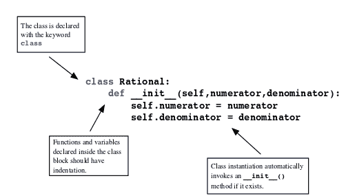

图 8.1:一个类声明的例子

我们这里使用有理数只是作为类概念的一个例子。关于 Python 中有理数的未来工作，请使用*分数*模块(请参考[【6】](16.html "Appendix . References"))。

## 类语法

一个类的定义是由一个带有`class`关键字的块命令、类的名称和块中的一些语句组成的(参见*图 8.1* ):

```py
class RationalNumber: 
      pass
```

这个类的一个实例(或者换句话说，类型为`RationalNumber`的对象)是由

```py
r = RationalNumber()
```

查询`type(a)`返回答案`<class'__main__.RationalNumber'>`。如果我们想调查一个对象是否是这个类的实例，我们可以使用这个:

```py
if isinstance(a, RationalNumber):
    print('Indeed it belongs to the class RationalNumber')  
```

到目前为止，我们已经生成了一个`RationalNumber`类型的对象，它还没有数据。此外，没有定义对这些对象执行操作的方法。这将是下一部分的主题。

## _ _ init _ _ 方法

现在我们为示例类提供一些属性；也就是说，我们给它定义数据。在我们的例子中，这个数据是分母和分子的值。为此，我们必须定义一个方法，`__init__`，用于用这些值初始化类:

```py
class RationalNumber:
    def __init__(self, numerator, denominator):
        self.numerator = numerator
        self.denominator = denominator
```

在解释我们添加到类中的特殊`__init__`函数之前，我们演示一个`RationalNumber`对象的实例化:

```py
q = RationalNumber(10, 20)    # Defines a new object
q.numerator    # returns 10
q.denominator    # returns 20
```

使用类名创建一个类型为`RationalNumber`的新对象，就像它是一个函数一样。这种说法做了两件事:

*   它首先创建一个空对象`q`。
*   然后对其应用`__init__`功能；即执行`q.__init__(10, 20)`。

`__init__`的第一个参数是指新对象本身。在函数调用时，第一个参数被对象的实例替换。这适用于该类的所有方法，而不仅仅适用于特殊方法`__init__`。第一个参数的特殊作用体现在命名为`self`的惯例上。在前面的例子中，`__init__`函数定义了新对象的两个属性，`numerator`和`denominator`。

# 属性和方法

使用类的主要原因之一是对象可以组合在一起并绑定到一个公共对象。我们在看有理数时已经看到了这一点；分母和分子是我们绑定到`RationalNumber`类实例的两个对象。它们被称为实例的属性。一个对象是一个类实例的一个属性的事实从它们被引用的方式中变得显而易见，我们之前已经默认使用了这一点:

```py
<object>.attribute
```

以下是实例化和属性引用的一些示例:

```py
q = RationalNumber(3, 5) # instantiation
q.numerator     # attribute access
q.denominator

a = array([1, 2])    # instantiation
a.shape

z = 5 + 4j    # instantiation
z.imag
```

一旦定义了一个实例，我们就可以设置、更改或删除该特定实例的属性。语法与常规变量相同:

```py
q = RationalNumber(3, 5) 
r = RationalNumber(7, 3)
q.numerator = 17
del r.denominator
```

更改或删除属性可能会产生不希望的副作用，甚至会使对象变得无用。我们将在相互依赖的*属性*一节中了解更多信息。由于函数也是对象，我们也可以将函数用作属性；它们被称为实例的方法:

```py
<object>.method(<arguments...>)
```

例如，让我们向类`RationalNumber`添加一个方法，将数字转换为浮点数:

```py
class RationalNumber:
...
    def convert2float(self):
        return float(self.numerator) / float(self.denominator)
```

同样，该方法将对象本身的引用`self`作为其第一个(也是唯一一个)参数。我们将此方法用于常规函数调用:

```py
q = RationalNumber(10, 20)    # Defines a new object
q.convert2float() # returns 0.5   
```

这相当于以下调用:

```py
RationalNumber.convert2float(q)
```

再次注意，对象实例是作为函数的第一个参数插入的。第一个参数的使用解释了如果该特定方法与其他参数一起使用时会出现的错误消息:

`q.convert2float(15)`调用会引发以下错误信息:

```py
TypeError: convert2float() takes exactly 1 argument (2 given)
```

这不起作用的原因是`q.convert2float(15)`精确地等同于`RationalNumber.convert2float(q,15)`，这是失败的，因为`RationalNumber.convert2float`只接受一个参数。

## 特殊方法

特殊的方法`__repr__`让我们能够定义对象在 Python 解释器中的表示方式。对于有理数，该方法的可能定义如下:

```py
class RationalNumber:
 ...
    def __repr__(self):
        return '{} / {}'.format(self.numerator,self.denominator)
```

定义了这个方法，只需输入`q`返回 10 / 20。

我们希望有一种方法可以将两个有理数相加。第一次尝试可能会产生这样的方法:

```py
class RationalNumber:
...
    def add(self, other):
        p1, q1 = self.numerator, self.denominator
        if isinstance(other, int):
            p2, q2 = other, 1
        else:
            p2, q2 = other.numerator, other.denominator
        return RationalNumber(p1 * q2 + p2 * q1, q1 * q2)
```

对此方法的调用采用以下形式:

```py
q = RationalNumber(1, 2)
p = RationalNumber(1, 3)
q.add(p)   # returns the RationalNumber for 5/6
```

如果我们能写`q + p`就更好了。但到目前为止，`RationalNumber`类型没有定义加号。这是通过使用`__add__`特殊方法完成的。因此，仅仅将`add`重命名为`__add__`就允许使用有理数的加号:

```py
q = RationalNumber(1, 2)
p = RationalNumber(1, 3)
q + p # RationalNumber(5, 6)
```

表达式`q + p`实际上是表达式`q.__add__(p)`的别名。在表(*表 8.1)* 中，你会发现二元运算符的特殊方法，如`+`、`-`或`*`。

<colgroup><col> <col> <col> <col></colgroup> 
| **操作员** | **方法** | **操作员** | **方法** |
| `+` | `__add__` | `+=` | `__iadd__` |
| `*` | `__mul__` | `*=` | `__imul__` |
| `-` | `__sub__` | `-=` | `__isub__` |
| `/` | `__truediv__` | `/=` | `__itruediv__` |
| `//` | `__floordiv__` | `//=` | `__ifloordiv__` |
| `**` | `__pow__` |  |  |
| `==` | `__eq__` | `!=` | `__ne__` |
| `<=` | `__le__` | `<` | `__lt__` |
| `>=` | `__ge__` | `>` | `__gt__` |
| `()` | `__call__` | `[]` | `__getitem__` |

表 8.1:部分 Python 运算符及对应的类方法，可以找到完整的列表[【31】](16.html "Appendix . References")

新类的这些运算符的实现称为运算符重载。运算符重载的另一个例子是检查两个有理数是否相同的方法:

```py
class RationalNumber:
...
    def __eq__(self, other):
        return self.denominator * other.numerator == 
            self.numerator * other.denominator
```

它是这样使用的:

```py
p = RationalNumber(1, 2) # instantiation
q = RationalNumber(2, 4) # instantiation
p == q # True
```

属于不同类的对象之间的操作需要特别小心:

```py
p = RationalNumber(1, 2) # instantiation
p + 5  # corresponds to p.__add__(5)  
5 + p  # returns an error
```

默认情况下，`+`运算符调用左操作数的方法`__add__`。我们对它进行了编程，使得它既允许`int`类型的对象，也允许`RationalNumber`类型的对象。在语句`5 + p`中，操作数被转换，并调用内置`int`类型的`__add__`方法。这个方法返回一个错误，因为它不知道如何处理有理数。这个案子可以用`__radd__`的方法处理，我们现在就用这个方法装备`RationalNumber`班。方法`__radd__`叫做反向加法。

### 反向操作

如果像`+`这样的操作应用于两个不同类型的操作数，则首先调用左操作数的对应方法(在本例中为`__add__`)。如果这引发异常，则调用右操作数的反向方法(此处为`__radd__`)。如果该方法不存在，则会引发`TypeError`异常。

考虑一个反向操作的例子。为了启用操作 5+ *p* ，其中 *p* 是`RationalNumber`的一个实例，我们定义如下:

```py
class RationalNumber:
   ....
    def __radd__(self, other):
        return self + other
```

注意`__radd__`交换参数的顺序；`self`是`RationalNumber`类型的对象，而其他是必须转换的对象。

将类实例与方括号*、* ( *、*)或[，]一起使用时，会调用一个特殊方法`__call__`或`__getitem__`中的一个方法，为该实例提供一个函数或一个可迭代对象的行为(请参考 T *able 8.1* 中的这些和其他特殊方法):

```py
class Polynomial:
...
    def __call__(self, x):
        return self.eval(x)
```

现在可以如下使用:

```py
p = Polynomial(...)
p(3.) # value of p at 3.
```

如果类提供了迭代器，`__getitem__`特殊方法就有意义了(在考虑下面的例子之前，建议参考[第 9 章](09.html "Chapter 9. Iterating")、*迭代器*一节*迭代器*)。

这个递归*u<sub>I+1</sub>= a*<sub xmlns:epub="http://www.idpf.org/2007/ops" xmlns:m="http://www.w3.org/1998/Math/MathML" xmlns:pls="http://www.w3.org/2005/01/pronunciation-lexicon" xmlns:ssml="http://www.w3.org/2001/10/synthesis">1</sub>T6】u<sub>I</sub>T9】+*a*T12】0T14】u<sub>I</sub>T18】-1 被称为一个三 *-* 术语递归。它在应用数学，特别是正交多项式的构造中起着重要的作用。我们可以通过以下方式将三项递归设置为一个类:

```py
import itertools

class  Recursion3Term:
    def __init__(self, a0, a1, u0, u1):
        self.coeff = [a1, a0]
        self.initial = [u1, u0]
    def __iter__(self):
        u1, u0 = self.initial
        yield u0  # (see also Iterators section in Chapter 9) 
        yield u1
        a1, a0 = self.coeff
        while True :
            u1, u0 = a1 * u1 + a0 * u0, u1
            yield u1
    def __getitem__(self, k):
        return list(itertools.islice(self, k, k + 1))[0]
```

这里，`__iter__`方法定义了一个生成器对象，它允许我们使用类的一个实例作为迭代器:

```py
r3 = Recursion3Term(-0.35, 1.2, 1, 1)
for i, r in enumerate(r3):
    if i == 7:
        print(r)  # returns 0.194167
        break
```

`__getitem__`方法使我们能够直接访问迭代，就像`r3`是一个列表一样:

```py
r3[7] # returns 0.194167
```

请注意，我们在编码`__getitem__`方法时使用了`itertools.islice`(更多信息，请参考第 9 章、*迭代*的*迭代器*部分)。在[第 5 章](05.html "Chapter 5. Advanced Array Concepts")、*高级数组概念*的*双变量函数*一节中给出了一个使用`__getitem__`和切片以及函数`ogrid`的例子。

# 相互依赖的属性

只需为实例的属性赋值，就可以更改(或创建)它们。但是，如果其他属性依赖于刚刚更改的属性，则最好同时更改这些属性:

让我们考虑一个从三个给定点为平面三角形定义一个对象的类。建立这样一个类的第一次尝试如下:

```py
class Triangle:
    def __init__(self,  A, B, C):
        self.A = array(A)
        self.B = array(B)
        self.C = array(C)
        self.a = self.C - self.B
        self.b = self.C - self.A
        self.c = self.B - self.A
    def area(self):
        return abs(cross(self.b, self.c)) / 2
```

这个三角形的一个实例是这样创建的:

```py
tr = Triangle([0., 0.], [1., 0.], [0., 1.])
```

它的面积是这样计算的:

```py
tr.area() # returns 0.5
```

如果我们改变一个属性，比如点 *B* ，对应的边 *a* 和 *c* 不会自动更新，计算的面积是错误的:

```py
tr.B = [12., 0.]
tr.area() # still returns 0.5, should be 6 instead.
```

补救方法是定义一个在属性改变时执行的方法；这样的方法称为 setter 方法。相应地，人们可能会要求在请求属性值时执行的方法；这种方法称为 getter 方法。

## 属性函数

函数`property`将一个属性链接到这样的 getter、setter 和 deleter 方法。它也可以用于将文档字符串分配给属性:

```py
attribute = property(fget = get_attr, fset = set_attr, 
                     fdel = del_attr, doc = string)
```

我们用 setter 方法继续前面的例子，并再次考虑`Trinagle`类。如果以下陈述包含在`Triangle`中

```py
B = property(fget = get_B, fset = set_B, fdel = del_B, doc = ’The point B of a triangle’)
```

命令

```py
tr.B = <something>
```

调用 setter 方法`set_B`。

让我们修改三角形类:

```py
class Triangle:
    def __init__(self, A, B, C):
        self._A = array(A)
        self._B = array(B)
        self._C = array(C)
        self._a = self._C - self._B
        self._b = self._C - self._A
        self._c = self._B - self._A
    def area(self):
        return abs(cross(self._c, self._b)) / 2.
    def set_B(self, B):
        self._B = B
        self._a = self._C - self._B
        self._c = self._B - self._A
    def get_B(self):
        return self._B
    def del_Pt(self):
        raise Exception('A triangle point cannot be deleted')
    B = property(fget = get_B, fset = set_B, fdel = del_Pt)
```

如果属性`B`改变，则方法`set_B`将新值存储在内部属性`_B`中，并改变所有相关属性:

```py
tr.B = [12., 0.]
tr.area() # returns 6.0
```

这里使用`deleter`方法的方式是为了防止删除属性:

```py
del tr.B # raises an exception
```

使用下划线作为属性名称的前缀是一种约定，用于指示不是为直接访问而设计的属性。它们旨在保存由设置器和获取器处理的属性的数据。这些属性在其他编程语言的意义上不是私有的；它们只是不打算被直接访问。

# 结合和非结合方法

我们现在将仔细看看属于方法的属性。让我们考虑一个例子:

```py
class A:
    def func(self,arg):
        pass
```

一个小小的检查向我们展示了`func`的性质在创建一个实例后是如何变化的:

```py
A.func  # <unbound method A.func>
instA = A()  # we create an instance
instA.func  #  <bound method A.func of ... >
```

例如，调用`A.func(3)`会导致如下错误消息:

```py
TypeError: func() missing 1 required positional argument: 'arg'
```

`instA.func(3)`按预期执行。创建实例时，`func`方法绑定到该实例。`self`参数将实例赋值。将方法绑定到实例使该方法可用作函数。在此之前，是没有用的。类方法，我们稍后会考虑，在这方面是不同的。

# 类属性

类声明中指定的属性称为类属性。考虑以下示例:

```py
class Newton:
    tol = 1e-8 # this is a class attribute
    def __init__(self,f):
        self.f = f # this is not a class attribute
    ....
```

类属性对于模拟默认值很有用，并且可以在必须重置值时使用:

```py
N1 = Newton(f)
N2 = Newton(g)
```

两个实例都有一个属性`tol`，其值在类定义中初始化:

```py
N1.tol # 1e-8
N2.tol # 1e-8
```

更改类属性会自动影响所有实例的所有相应属性:

```py
Newton.tol = 1e-10
N1.tol # 1e-10
N2.tol # 1e-10
```

更改一个实例的`tol`不会影响另一个实例:

```py
N2.tol = 1.e-4
N1.tol  # still 1.e-10
```

但是现在`N2.tol`脱离了类属性。更改`Newton.tol`对`N2.tol`不再有任何影响；

```py
Newton.tol = 1e-5 # now all instances of the Newton classes have 1e-5
N1.tol # 1.e-5
N2.tol # 1e-4 but not N2.
```

# 类方法

我们在前面关于*绑定和未绑定方法*的章节中看到了方法是如何绑定到类的实例或者作为未绑定方法保持状态的。类方法不同。它们总是绑定方法。他们与类本身息息相关。

我们将首先描述语法细节，然后给出一些例子来说明这些方法可以用来做什么。要表明一个方法是一个类方法，装饰行在方法定义之前:

```py
@classmethod
```

虽然标准方法通过使用它们的第一个参数来引用实例，但是类方法的第一个参数引用类本身。按照惯例，标准方法的第一个参数叫做`self`，类方法的第一个参数叫做`cls`。

*   标准案例:

```py
      class A:
          def func(self,*args):
               <...>
```

*   类方法案例:

```py
      class B:
          @classmethod
          def func(cls,*args):
               <...>
```

实际上，类方法对于在创建实例之前执行命令可能是有用的，例如在预处理步骤中。请参见以下示例:

在本例中，我们展示了如何在创建实例之前使用类方法准备数据:

```py
class Polynomial:
    def __init__(self, coeff):
        self.coeff = array(coeff)
    @classmethod
    def by_points(cls, x, y):
        degree = x.shape[0] - 1
        coeff = polyfit(x, y, degree)
        return cls(coeff) 
    def __eq__(self, other):
        return allclose(self.coeff, other.coeff)
```

该类被设计为通过指定其系数来创建多项式对象。或者，`by_points`类方法允许我们通过插值点定义多项式。即使没有多项式实例可用，我们也可以将插值数据转换为多项式系数:

```py
p1 = Polynomial.by_points(array([0., 1.]), array([0., 1.]))
p2 = Polynomial([1., 0.])

print(p1 == p2)  # prints True
```

本章后面的示例中介绍了类方法的另一个示例。在该示例中，类方法用于访问与该类的几个(或所有)实例相关的信息。

# 子类化和继承

在本节中，我们将介绍面向对象编程的一些核心概念:抽象类、子类和继承。为了指导您理解这些概念，我们考虑另一个数学示例:求解微分方程的一步方法。普通初值问题的一般形式是

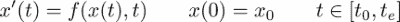

数据为右侧函数 *f* 、初始值 *x <sub>0</sub>* 、关注区间【 *t* <sub>0</sub> *、t* <sub>e</sub> 】。这个问题的解决是一个功能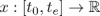。一种数值算法将该解作为离散值 *u <sub> i </sub>* 的向量 *u* 给出，近似为*x*(*t<sub>I</sub>*)。这里，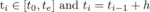是自变量 *t* 的离散值，在物理模型中常表示时间。

一步法通过递归步骤构造解值 *u <sub>i</sub>* :

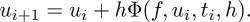

这里，φ是表征单个方法的阶跃函数(参见[【28】](16.html "Appendix . References")):

*   **显式欧拉** : 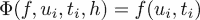
*   **中点法则** : 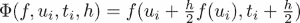
*   **龙格-库塔 4** : 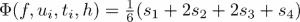带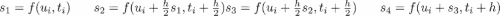

我们在这里所做的是描述数学算法的典型方式。我们首先根据方法的思想来描述它，以抽象的方式给出它的步骤。为了实际使用它，我们必须填写一个具体方法的参数，在这个例子中，函数φ。这也是面向对象编程中解释事物的方式。首先，我们用方法的抽象描述建立一个类:

```py
class OneStepMethod:
    def __init__(self, f, x0, interval, N):
        self.f = f
        self.x0 = x0
        self.interval = [t0, te] = interval
        self.grid = linspace(t0, te, N)
        self.h = (te - t0) / N

    def generate(self):
        ti, ui = self.grid[0], self.x0
        yield ti, ui
        for t in self.grid[1:]:
            ui = ui + self.h * self.step(self.f, ui, ti)
            ti = t
            yield ti, ui

    def solve(self):
        self.solution = array(list(self.generate()))

    def plot(self):
        plot(self.solution[:, 0], self.solution[:, 1])

    def step(self, f, u, t):
        raise NotImplementedError()
```

这个抽象类及其方法被用作单个方法的模板:

```py
class ExplicitEuler(OneStepMethod):
    def step(self, f, u, t):
        return f(u, t)

class MidPointRule(OneStepMethod):
    def step(self, f, u, t):
        return f(u + self.h / 2 * f(u, t), t + self.h / 2)
```

请注意，在类定义中，我们用作模板的抽象类的名称`OneStepMethod`是作为额外的参数给出的:

```py
class ExplicitEuler(OneStepMethod)
```

该类称为父类。父类的所有方法和属性都被子类继承，只要它们没有被覆盖。如果它们在子类中被重新定义，它们将被覆盖。`step`方法在子类中被重新定义，而方法`generate`对于整个族是通用的，因此从父族继承而来。在考虑进一步的细节之前，我们将演示如何使用这三个类:

```py
def f(x, t):
    return -0.5 * x

euler = ExplicitEuler(f, 15., [0., 10.], 20)
euler.solve()
euler.plot()
hold(True)
midpoint = MidPointRule(f, 15., [0., 10.], 20)

midpoint.solve()
midpoint.plot()
```

使用星形运算符可以避免常见参数列表的重复(详见[第七章](07.html "Chapter 7. Functions")、*函数*中*变参数*一节):

```py
...
argument_list = [f, 15., [0., 10.], 20]
euler = ExplicitEuler(*argument_list)
...
midpoint = MidPointRule(*argument_list)
...
```

请注意，抽象类从未用于创建实例。由于`step`方法没有完全定义，调用它会引发类型为`NotImplementedError`的异常。

有时必须访问父类的方法或属性。这是使用命令`super`完成的。当子类使用自己的`__init__`方法来扩展父类的`__init__`时，这很有用:

例如，让我们假设我们想要给每个求解器类一个带有求解器名称的字符串变量。为此，我们为求解器提供了一个`__init__`方法，因为它覆盖了父级的`__init__`方法。在两种方法都应该使用的情况下，我们必须通过命令`super`来引用父方法:

```py
class ExplicitEuler(OneStepMethod):
    def __init__(self,*args, **kwargs):
        self.name='Explicit Euler Method'
        super(ExplicitEuler, self).__init__(*args,**kwargs)
    def step(self, f, u, t):
        return f(u, t)
```

请注意，可以显式使用父类的名称。而`super`的使用允许我们更改父类的名称，而不必更改对父类的所有引用。

# 封装

有时使用继承是不切实际的，甚至是不可能的。这激发了封装的使用。我们将通过考虑 Python 函数来解释封装的概念，即 Python 类型`function`的对象，我们将其封装在一个新的类`Function`中，并提供一些相关的方法:

```py
class Function:
    def __init__(self, f):
        self.f = f
    def __call__(self, x):
        return self.f(x)
    def __add__(self, g):
        def sum(x):
            return self(x) + g(x)
        return type(self)(sum) 
    def __mul__(self, g): 
        def prod(x):
            return self.f(x) * g(x)
        return type(self)(prod)
    def __radd__(self, g):
        return self + g
    def __rmul__(self, g):
        return self * g
```

请注意，`__add__`和`__mul__`操作应该返回同一个类的实例。这是通过`return type(self)(sum)`声明实现的，在这种情况下，这是一种更一般的写作形式`return Function(sum)`。我们现在可以通过继承来派生子类:

作为一个例子，切比雪夫多项式可以在区间[1，-1]中通过以下方式计算:

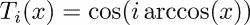。

我们构建一个切比雪夫多项式作为`Function`类的实例:

```py
T5 = Function(lambda x: cos(5 * arccos(x)))
T6 = Function(lambda x: cos(6 * arccos(x)))
```

切比雪夫多项式在某种意义上是正交的:

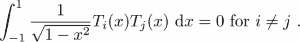

使用这种结构可以很容易地进行检查:

```py
import scipy.integrate as sci

weight = Function(lambda x: 1 / sqrt((1 - x ** 2)))
[integral, errorestimate] = 
        sci.quad(weight * T5 * T6, -1, 1) # (6.510878470473995e-17, 1.3237018925525037e-14)
```

没有封装，像写`weight * T5 * T6`一样简单的乘法函数是不可能的。

# 装饰类

在[第 7 章](07.html "Chapter 7. Functions")、*功能*的*功能作为装饰者*一节中，我们看到了如何通过应用另一个功能作为装饰者来修改功能。在前面的例子中，我们看到了只要类被提供了`__call__`方法，它们是如何表现为函数的。我们将在这里用它来展示类如何被用作装饰器。

让我们假设我们想要以这样一种方式改变一些函数的行为，即在调用函数之前，打印所有的输入参数。这可能对调试有用。我们以这种情况为例来解释装饰器类的使用:

```py
class echo:
    text = 'Input parameters of {name}n'+
        'Positional parameters {args}n'+
        'Keyword parameters {kwargs}n'
    def __init__(self, f):
        self.f = f
    def __call__(self, *args, **kwargs):
        print(self.text.format(name = self.f.__name__,
              args = args, kwargs = kwargs))
        return self.f(*args, **kwargs)
```

我们使用这个类来修饰函数定义，

```py
@echo
def line(m, b, x):
    return m * x + b
```

像往常一样调用函数，

```py
line(2., 5., 3.)
line(2., 5., x=3.)
```

在第二次调用中，我们获得了以下输出:

```py
Input parameters of line
Positional parameters (2.0, 5.0)
Keyword parameters {'x': 3.0}

11.0
```

这个例子表明类和函数都可以用作装饰器。类允许更多的可能性，因为它们也可以用来收集数据。

事实上，我们注意到:

*   每个修饰的函数都会创建装饰器类的一个新实例。
*   一个实例收集的数据可以通过类属性保存并供另一个实例访问(参见[第 8 章](08.html "Chapter 8. Classes")、*类*中的*属性*一节)。

最后一点强调与功能装饰者的区别。我们现在通过一个装饰器来展示这一点，该装饰器对函数调用进行计数，并将结果存储在以函数为键的字典中。

为了分析算法的性能，统计特定函数的调用可能是有用的。我们可以在不改变函数定义的情况下获取计数器信息。该代码是对[【4】](16.html "Appendix . References")中给出的一个例子的轻微修改。

```py
class CountCalls:
    """
    Decorator that keeps track of the number of times 
    a function is called.
    """
    instances = {} 
    def __init__(self, f):
        self.f = f
        self.numcalls = 0
        self.instances[f] = self
    def __call__(self, *args, **kwargs):
        self.numcalls += 1
        return self.f(*args, **kwargs)
    @classmethod
    def counts(cls):
        """
        Return a dict of {function: # of calls} for all 
        registered functions.
        """
        return dict([(f.__name__, cls.instances[f].numcalls) 
                                    for f in cls.instances])
```

这里，我们使用类属性`CountCalls.instances`来存储每个单独实例的计数器。让我们看看这个装饰器是如何工作的:

```py
@CountCalls
def line(m, b, x):
    return m * x + b
@CountCalls 
def parabola(a, b, c, x):
    return a * x ** 2 + b * x + c
line(3., -1., 1.)
parabola(4., 5., -1., 2.)

CountCalls.counts() # returns {'line': 1, 'parabola': 1}
parabola.numcalls # returns 1
```

# 总结

现代计算机科学中最重要的编程概念之一是面向对象编程。在本章中，我们学习了如何将对象定义为类的实例，我们提供了方法和属性。方法的第一个参数，通常用`self`表示，起着重要而特殊的作用。您看到了可用于为自己的类定义基本操作的方法，如`+`和`*`。

虽然在其他编程语言中，属性和方法可以防止意外使用，但 Python 允许通过特殊的 getter 和 setter 方法隐藏属性和访问这些隐藏属性的技术。为此，你遇到了一个重要的功能，`property`。

# 练习

**Ex。1** →给类`RationalNumber`写一个方法`simplify`。这个方法应该以元组的形式返回分数的简化版本。

**Ex。2** →为了给结果提供置信区间，在数值数学中引入了一种特殊的微积分，即所谓的区间算法；(参考[【3、14】](16.html "Appendix . References")*)*。定义一个名为`Interval`的类，为其提供加减乘除的方法(仅限正整数)。这些操作遵循以下规则:

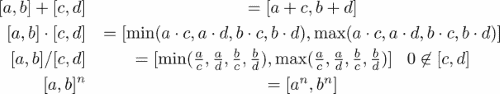。

为该类提供允许类型为 *a* + *I、a I、I* + *a、I a* 的操作的方法，其中 *I* 是一个区间， *a* 是一个整数或浮点数。首先将整数或浮点数转换为区间`[a,a]`。(提示:您可能希望为此使用函数装饰器；(参见第七章、*功能*中*作为装饰者的功能*一节)。此外，实现`__contains__`方法，该方法使您能够使用“区间”类型的对象`I`的语法`x in I`来检查给定的数字是否属于区间。通过对一个区间应用多项式`f=lambda x: 25*x**2-4*x+1`来测试你的类。

**Ex。3** →考虑*类作为装饰者*一节下的例子。扩展这个例子，得到一个*函数装饰器*，计算某个函数被调用的频率。

**Ex。4** →比较两种实现类 `RationalNumber`中反向加法`__radd__`的方法:*特殊方法*一节例子中给出的方法和这里给出的方法:

```py
class RationalNumber:
    ....
    def __radd__(self, other):
        return other + self
```

你认为这个版本会有错误吗？错误是什么，你如何解释？通过执行以下命令来测试您的答案:

```py
q = RationalNumber(10, 15)
5 + q
```

**Ex。4** →将装饰者类`CountCalls`视为装饰者一节中的示例。为这个类提供一个方法`reset`，将字典中所有函数`CountCalls.instances`的计数器设置为零。如果字典换成空字典会怎么样？