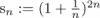
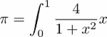
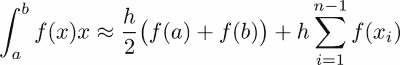

# 九、重复

在本章中，我们将介绍使用循环和迭代器的迭代。我们将展示如何将它用于列表和生成器的示例。迭代是计算机有用的基本操作之一。传统上，迭代是通过`for`循环来实现的。`for`循环是指令块重复一定次数。在循环内部，可以访问一个循环变量，其中存储了迭代号。

Python 的习惯用法略有不同。Python 中的`for`循环主要是为了穷尽一个列表，也就是枚举一个列表的元素。如果使用包含第一个 *n 个*整数的列表，效果类似于刚才描述的重复效果。

一个`for`循环一次只需要列表中的一个元素。因此，希望对能够按需创建这些元素的对象使用`for`循环，一次一个。这就是迭代器在 Python 中实现的功能。

# for 语句

`for`语句的主要目的是遍历列表:

```py
for s in ['a', 'b', 'c']:
    print(s), # a b c
```

在本例中，循环变量 *s* 被连续分配给列表中的一个元素。请注意，循环变量在循环结束后可用。这有时可能有用；例如，参考章节*中的例子控制回路*内的流量。

`for`循环最常见的用途之一是使用功能`range`将给定任务重复定义的次数(参见[第 1 章](01.html "Chapter 1. Getting Started")、*入门*的*列表*部分)。

```py
for iteration in range(n): # repeat the following code n times
    ...
```

如果循环的目的是遍历列表，许多语言(包括 Python)提供以下模式:

```py
for k in range(...):
    ...
    element = my_list[k]
```

如果该代码的目的是浏览列表`my_list`，前面的代码不会使它非常清楚。因此，更好的表达方式如下:

```py
for element in my_list:
    ...
```

现在乍看之下很清楚，前面的代码通过了`my_list`列表。请注意，如果您真的需要索引变量 *k* ，您可以用以下代码替换前面的代码:

```py
for k, element in enumerate(my_list):
    ...
```

这段代码的目的是在保持索引变量 *k* 可用的同时通过`my_list`。类似的数组结构是命令`ndenumerate`。

# 控制回路内的流量

有时需要跳出循环，或者直接进入下一个循环迭代。这两个操作由`break`和`continue`命令执行。顾名思义，`break`关键字打破了这个循环。循环中断时会出现两种情况:

*   循环被完全执行。
*   该循环在完全执行之前被留下(`break`)。

对于第一种情况，可以在`else`块中定义特殊动作，如果遍历了整个列表，则执行该块。如果`for`循环的目的是寻找某样东西并停止，这通常是有用的。例如，在列表中搜索一个满足某个属性的元素。如果没有找到这样的元素，则执行`else`块。

这是科学计算中的一个常见用法。通常，我们使用的迭代算法不能保证成功。在这种情况下，最好使用(大的)有限循环，这样程序就不会陷入无限循环。`for` / `else`构造允许这样的实现:

```py
maxIteration = 10000
for iteration in range(maxIteration):
    residual = compute() # some computation
    if residual < tolerance:
        break
else: # only executed if the for loop is not broken
    raise Exception("The algorithm did not converge")
print("The algorithm converged in {} steps".format(iteration+1))
```

# 迭代器

`for`循环主要用于遍历列表，但它一次只选取列表中的一个元素。特别是，不需要将整个列表存储在内存中，循环就能正常工作。允许`for`循环在没有列表的情况下工作的机制是迭代器。

可迭代对象产生对象(传递到`for`循环)。这样的物体`obj`可以在`for`回路中使用，如下所示:

```py
for element in obj:
    ...
```

迭代器的概念概括了列表的概念。列表给出了可迭代对象的最简单的例子。生成的对象只是存储在列表中的对象:

```py
L = ['A', 'B', 'C']
for element in L:
    print(element)
```

可迭代对象不需要产生现有对象。相反，这些物体可以在飞行中产生。

典型的可迭代对象是函数`range`返回的对象。这个函数的工作方式就好像它会生成一个整数列表，但是相反，连续的整数是在需要时动态生成的:

```py
for iteration in range(100000000):
    # Note: the 100000000 integers are not created at once
    if iteration > 10:
        break
```

如果真的需要一个 0 到 100，000，000 之间的所有整数的列表，那么它必须是显式形成的:

```py
l=list(range(100000000))
```

## 发电机

您可以使用`yield`关键字创建自己的迭代器。例如，小于 *n* 的奇数发生器可以定义为:

```py
def odd_numbers(n):
    "generator for odd numbers less than n"
    for k in range(n):
        if k % 2 == 1:
            yield k
```

那么您可以按如下方式使用它:

```py
g = odd_numbers(10)
for k in g:
    ...    # do something with k
```

或者甚至像这样:

```py
for k in odd_numbers(10):
    ... # do something with k
```

## 迭代器是一次性的

迭代器的一个显著特点是它们只能使用一次。为了再次使用迭代器，您必须创建一个新的迭代器对象。请注意，可迭代对象可以根据需要多次创建新的迭代器。让我们来研究一下列表的情况:

```py
L = ['a', 'b', 'c']
iterator = iter(L)
list(iterator) # ['a', 'b', 'c']
list(iterator) # [] empty list, because the iterator is exhausted

new_iterator = iter(L) # new iterator, ready to be used
list(new_iterator) # ['a', 'b', 'c']
```

每次调用生成器对象时，都会创建一个新的迭代器。因此，当迭代器用完时，必须再次调用生成器来获得新的迭代器:

```py
g = odd_numbers(10)
for k in g:
    ... # do something with k

# now the iterator is exhausted:
for k in g: # nothing will happen!!
    ...

# to loop through it again, create a new one:
g = odd_numbers(10)
for k in g:.
    ...
```

## 迭代器工具

这里有几个迭代器工具，它们经常会派上用场:

*   `enumerate`用于枚举另一个迭代器。它产生一个新的迭代器，产生对(迭代，元素)，其中`iteration`存储迭代的索引:

```py
      A = ['a', 'b', 'c']
      for iteration, x in enumerate(A):
          print(iteration, x)
      # result: (0, 'a') (1, 'b') (2, 'c')
```

*   `reversed`通过向后遍历列表，从列表中创建一个迭代器。请注意，这不同于创建反向列表:

```py
      A = [0, 1, 2]
      for elt in reversed(A):,
          print(elt)
          # result: 2 1 0
```

*   `itertools.count`可能是整数的无限迭代器:

```py
      for iteration in itertools.count():
          if iteration > 100:
              break # without this, the loop goes on forever
          print("integer {}".format(iteration))
          # prints the 100 first integer
```

*   `intertools.islice`使用熟悉的`slicing`语法截断迭代器；参考[第三章](03.html "Chapter 3. Container Types")、*集装箱类型*。一个应用正在从无限迭代器创建有限迭代器:

```py
      from itertools import count, islice
      for iteration in islice(count(), 10): 
          # same effect as range(10)
          ...
```

例如，让我们通过将`islice`与一个无限发生器相结合来找到一些奇数。首先，我们修改奇数的生成器，使其成为无限生成器:

```py
def odd_numbers():
    k=-1
    while True:
        k+=1
        if k%2==1:
        yield k
```

然后，我们用它和`islice`一起得到一些奇数的列表:

```py
list(itertools.islice(odd_numbers(),10,30,8)) # returns [21, 37, 53]
```

## 递归序列的生成器

假设一个序列由一个归纳公式给出。例如，考虑由递归公式定义的斐波那契数列:*u<sub>n</sub>= u<sub>n</sub>*T6】-1+*u*<sub xmlns:epub="http://www.idpf.org/2007/ops" xmlns:m="http://www.w3.org/1998/Math/MathML" xmlns:pls="http://www.w3.org/2005/01/pronunciation-lexicon" xmlns:ssml="http://www.w3.org/2001/10/synthesis">T11】n-2</sub>。

该序列取决于两个初始值，即 *u* <sub>0</sub> 和 *u* <sub>1</sub> ，尽管对于标准斐波那契序列，这些数字分别取为 0 和 1。编写这种序列生成程序的一种巧妙方法是使用生成器，如下所示:

```py
def fibonacci(u0, u1):
    """
    Infinite generator of the Fibonacci sequence.
    """
    yield u0
    yield u1
    while True:
        u0, u1 = u1, u0+u1
        yield u1
```

例如，可以这样使用:

```py
# sequence of the 100 first Fibonacci numbers:
list(itertools.islice(fibonacci(0, 1), 100))
```

### 算术几何平均值

基于迭代计算算术和几何平均的迭代称为 **AGM 迭代**(更多信息请参考[【1，第 598 页】](16.html "Appendix . References")):


它具有迷人的特性:


右边的积分叫做第一类完全椭圆积分。我们现在开始计算这个椭圆积分。我们使用生成器来描述迭代:

```py
def arithmetic_geometric_mean(a, b):
    """
    Generator for the arithmetic and geometric mean
    a, b initial values
    """ 
    while True:    # infinite loop
         a, b = (a+b)/2, sqrt(a*b)
         yield a, b
```

当序列{ *a <sub>i</sub>* }收敛时，由{ *c <sub>i</sub>* }定义的序列{ *c* <sub>*i*</sub> }收敛到 0-这一事实将用于终止计算椭圆积分的程序中的迭代:

```py
def elliptic_integral(k, tolerance=1e-5):
    """
    Compute an elliptic integral of the first kind.
    """
    a_0, b_0 = 1., sqrt(1-k**2)
    for a, b in arithmetic_geometric_mean(a_0, b_0):
        if abs(a-b) < tolerance:
            return pi/(2*a)
```

我们必须确保算法停止。请注意，该代码完全依赖于算术几何平均迭代收敛(快速)的数学陈述。在实际计算中，我们在应用理论结果时必须小心，因为它们在有限精度的算术中可能不再有效。使前面的代码安全的正确方法是使用`itertools.islice`。安全代码如下(参见*控制回路内流量*一节下的示例，了解`for` / `else`语句的另一个典型用法):

```py
from itertools import islice
def elliptic_integral(k, tolerance=1e-5, maxiter=100):
    """
    Compute an elliptic integral of the first kind.
    """
    a_0, b_0 = 1., sqrt(1-k**2)
    for a, b in islice(arithmetic_geometric_mean(a_0, b_0), 
                                                  maxiter):
        if abs(a-b) < tolerance:
            return pi/(2*a)
    else:
        raise Exception("Algorithm did not converge")
```

作为一种应用，椭圆积分可用于计算长度为 *L* 的**摆的周期，该摆以角度θ开始(更多信息，请参考[【18，第 114 页】](16.html "Appendix . References")),使用:**


使用这个公式，钟摆的周期很容易得到:

```py
def pendulum_period(L, theta, g=9.81):
    return 4*sqrt(L/g)*elliptic_integral(sin(theta/2))
```

# 收敛加速度

我们给出了一个应用发电机加速收敛的例子。本演示紧跟 *Python 生成器技巧*中 *Pramode C.E* 给出的示例(更多信息请参考[【9】](16.html "Appendix . References"))。

请注意，一个生成器可能会将另一个生成器作为输入参数。例如，假设我们已经定义了一个生成收敛序列元素的生成器。然后，由于*欧拉*和*艾特肯*，通常称为艾特肯的δ<sup>2</sup>-方法(参考[【33】](16.html "Appendix . References")*)，有可能通过加速技术来改善收敛。*它通过定义将序列 *s <sub>i</sub>* 转换为另一个序列


两个序列具有相同的极限，但是序列收敛得明显更快。一种可能的实现如下:

```py
def Euler_accelerate(sequence):
    """
    Accelerate the iterator in the variable `sequence`.
    """
    s0 = next(sequence) # Si
    s1 = next(sequence) # Si+1
    s2 = next(sequence) # Si+2
    while True:
        yield s0 - ((s1 - s0)**2)/(s2 - 2*s1 + s0)
  s0, s1, s2 = s1, s2, next(sequence)
```

例如，我们使用经典系列:


向π/4 *收敛。*我们在下面的代码中将这个系列实现为一个生成器:

```py
def pi_series():
    sum = 0.
    j = 1
    for i in itertools.cycle([1, -1]):
        yield sum
        sum += i/j
        j += 2
```

我们现在可以使用这个序列的加速版本:

```py
Euler_accelerate(pi_series())
```

因此，该加速序列的第一 *N* 元素通过以下方式获得:

```py
itertools.islice(Euler_accelerate(pi_series()), N)
```

例如，下图(*图 9.1* )显示了由上述公式定义的序列的标准版本及其加速版本的误差对数的收敛速度:


图 9.1:定义的序列与其加速版本之间的比较

# 列出填充模式

在本节中，我们将比较不同的列表填充方式。它们在计算效率和代码可读性方面是不同的。

## 列表填充用追加法

无处不在的编程模式是计算元素并将它们存储在列表中:

```py
L = []
for k in range(n):
    # call various functions here
    # that compute "result"
    L.append(result)
```

这种方法有许多缺点:

*   迭代的次数是预先决定的。如果有`break`指令，那么前面的代码负责生成值和决定何时停止。这是不可取的，也缺乏灵活性。
*   它假设用户想要所有迭代的整个计算历史。假设我们只对所有计算值的总和感兴趣。如果有许多计算值，存储它们是没有意义的，因为一次添加一个会更有效。

## 迭代器列表

迭代器为我们之前讨论的问题提供了一个优雅的解决方案:

```py
def result_iterator():
    for k in itertools.count(): # infinite iterator
        # call various functions here
        # that compute "result"
        ...
        yield result
```

使用迭代器，我们将生成计算值的任务分开，而不用担心停止条件或存储。如果该代码的用户想要存储 *n* 个第一值，可以使用`list`构造函数轻松完成:

```py
L = list(itertools.islice(result_iterator(), n)) # no append needed!
```

如果用户想要第一个 *n 个*生成值的总和，建议采用以下结构:

```py
# make sure that you do not use scipy.sum here
s = sum(itertools.islice(result_iterator(), n))
```

我们在这里做的是一方面分离元素的生成，另一方面存储这些元素。

如果目的确实是建立一个列表，并且当每一步的结果不依赖于先前计算的元素时，可以使用列表理解语法(更多信息，请参考[第 3 章](03.html "Chapter 3. Container Types")、*容器类型*的*列表*部分):

```py
L = [some_function(k) for k in range(n)]
```

当迭代计算依赖于先前计算值的值时，列表理解没有帮助。

## 存储生成的值

使用迭代器来填充列表在大多数情况下都会很好地工作，但是当计算新值的算法容易抛出异常时，这种模式就会变得复杂；如果迭代器在这个过程中引发了异常，那么列表将不可用！下面的例子说明了这个问题。

假设我们生成由递归定义的序列。如果初始数据 *u* <sub>0</sub> 大于 1，则该序列迅速发散至无穷大。让我们用一个生成器来生成它:

```py
import itertools
def power_sequence(u0):
    u = u0
    while True:
        yield u
        u = u**2
```

如果试图通过执行获得序列的第一个 *20* 元素(由 *u <sub>0</sub> = 2* 初始化)，

```py
list(itertools.islice(power_sequence(2.), 20))
```

将引发异常，并且没有可用的列表，甚至没有引发异常之前的元素列表。目前还没有办法从可能有故障的发电机获得一个部分填充的列表。唯一的办法是使用封装在异常捕获块中的追加方法(更多详细信息，请参考[第 10 章](10.html "Chapter 10. Error Handling")、*错误处理*中的*异常*一节):

```py
generator = power_sequence(2.)
L = []
for iteration in range(20):
    try:
        L.append(next(generator))
    except Exception:
        ...
```

# 当迭代器表现为列表时

一些列表操作也适用于迭代器。我们现在将检查*列表理解*和*列表压缩*的等效项(更多详细信息，请参考第 3 章、*容器类型*的*列表*部分)。

## 生成器表达式

这相当于对生成器的列表理解。这样的构造称为生成器表达式:

```py
g = (n for n in range(1000) if not n % 100)
# generator for  100, 200, ... , 900
```

这对于计算和或积特别有用，因为那些运算是增量的；他们一次只需要一个元素:

```py
sum(n for n in range(1000) if not n % 100) # returns 4500 
```

在这段代码中，您注意到`sum`函数有一个参数，这是一个生成器表达式。请注意，当生成器仅用作函数的*参数时，Python 语法允许我们省略生成器的括号。*

 *让我们计算黎曼泽塔函数 *ζ* ，其表达式为


使用生成器表达式，我们可以在一行中计算这个系列的部分和:

```py
sum(1/n**s for n in itertools.islice(itertools.count(1), N))
```

请注意，我们还可以定义序列 1n*n<sup>s</sup>T3 的生成器，如下所示:*

```py
def generate_zeta(s):
    for n in itertools.count(1):
        yield 1/n**s
```

然后我们简单地获得第一个 *N 个*项的和，使用:

```py
def zeta(N, s):
    # make sure that you do not use the scipy.sum here
    return sum(itertools.islice(generate_zeta(s), N))
```

我们指出，我们使用这种计算ζ(ζ)函数的方法，以优雅的方式演示了发电机的使用。这当然不是评估该函数的最准确和计算效率最高的方法。

## 压缩迭代器

我们在部分*列表*、[第 3 章](03.html "Chapter 3. Container Types")、*容器类型*中看到，可以通过将两个容器拉在一起来创建一个列表。迭代器也存在相同的操作:

```py
xg = x_iterator()  # some iterator
yg = y_iterator()  # another iterator

for x, y in zip(xg, yg):
    print(x, y)
```

一旦其中一个迭代器用完，压缩迭代器就会停止。这与列表上的压缩操作的行为相同。

# 迭代器对象

正如我们前面提到的，一个`for`循环只需要一个可迭代的对象。尤其是列表是可重复的。这意味着列表能够从其内容创建迭代器。事实上，这对于任何对象(不仅仅是列表)都是正确的:任何对象都可能是可重复的。

这是通过`__iter__`方法实现的，该方法应该返回一个迭代器。这里我们举一个例子，其中`__iter__`方法是一个生成器:

```py
class OdeStore:
    """
    Class to store results of ode computations
    """
    def __init__(self, data):
        "data is a list of the form [[t0, u0], [t1, u1],...]"
        self.data = data

    def __iter__(self):
        "By default, we iterate on the values u0, u1,..."
        for t, u in self.data:
            yield u

store = OdeStore([[0, 1], [0.1, 1.1], [0.2, 1.3]])
for u in store:
    print(u)
# result: 1, 1.1, 1.3
list(store) # [1, 1.1, 1.3]
```

如果您试图对不可迭代的对象使用迭代器的功能，将会引发异常:

```py
>>> list(3)
TypeError: 'int' object is not iterable
```

在这个例子中，列表函数试图通过调用`__iter__`方法迭代对象 *3* 。但是这个方法不是为整数实现的，因此引发了异常。如果我们试图循环通过一个不可迭代的对象，也会发生同样的情况:

```py
>>> for iteration in 3: pass
TypeError: 'int' object is not iterable
```

# 无限迭代

无限迭代或者通过无限迭代器，通过`while`循环，或者通过递归获得。显然，在实际情况下，某些条件会停止迭代。有限迭代的区别在于，通过粗略地检查代码，不可能说迭代是否会停止。

## while 循环

`while`循环可用于重复一个代码块，直到满足一个条件:

```py
while condition:
    <code>
```

一个`while`循环相当于以下代码:

```py
for iteration in itertools.count():
    if not condition:
        break
    <code>
```

因此`while`循环相当于无限迭代器，如果满足某个条件，可能会停止。这种构造的危险是显而易见的:如果条件永远不满足，代码可能会陷入无限循环。

科学计算的问题在于，人们并不总是确定算法会收敛。例如，牛顿迭代可能根本不会收敛。如果该算法在一个`while`循环中实现，那么对于一些初始条件的选择，相应的代码将陷入无限循环。

因此，我们建议有限迭代器通常更适合这样的任务。以下结构通常有利地取代了`while`环的使用:

```py
maxit = 100
for nb_iterations in range(max_it):
    ...
else:
    raise Exception("No convergence in {} iterations".format(maxit))
```

第一个优点是，无论发生什么，代码都保证在有限的时间内执行。第二个优点是变量`nb_iterations`包含算法收敛所需的迭代次数。

## 递归

当一个函数调用自己时，就会发生递归(参见[第 7 章](07.html "Chapter 7. Functions")、*函数*中*递归函数*一节)。

在进行递归时，递归深度，也就是迭代的次数，将你的计算机带到了极限。我们在这里通过考虑一个简单的递归来演示这一点，它实际上根本不包含任何计算。它只给迭代赋值零:

```py
def f(N):
    if N == 0: 
        return 0
    return f(N-1)
```

根据您的系统，该程序可能会阻塞 *N ≥ 10000* (使用了太多内存)。结果是 Python 解释器崩溃了，没有进一步的异常。Python 提供了一种机制，可以在检测到过高的递归深度时引发异常。该最大递归深度可以通过执行以下操作来更改:

```py
import sys 
sys.setrecursionlimit(1000)
```

递归极限的实际值可以通过`sys.getrecursionlimit()`得到。

但是请注意，选择过高的数字可能会危及代码的稳定性，因为 Python 可能会在达到最大深度之前崩溃。因此，保持递归极限不变通常是明智的。

相比之下，以下非递归程序运行千万次迭代没有任何问题:

```py
for iteration in range(10000000):
    pass
```

我们主张，如果可能的话，应该在 Python 中避免递归。这显然只适用于有合适的替代迭代算法可用的情况。第一个原因是深度 *N* 的递归同时涉及 *N* 函数调用，这可能会导致很大的开销。第二个原因是它是一个无限迭代，也就是说，在递归结束之前，很难给出必要步骤数的上限。

请注意，在一些非常特殊的情况下(树遍历)，递归是不可避免的。此外，在某些情况下(递归深度很小)，递归程序由于可读性可能更好。

# 总结

在这一章中，我们研究了迭代器，这是一种非常接近迭代方法的数学描述的编程构造。你看到了`yield`关键字，遇到了有限和无限迭代器。

我们展示了迭代器可以被耗尽。更多的特殊方面，如迭代器理解和递归迭代器被引入，并通过例子进行了演示。

# 练习

**Ex。1** →计算总和的值:


**Ex。2** →创建一个生成器，用于计算由以下关系定义的序列:


**Ex。3** →生成所有偶数。

**Ex。4** →让。微积分中显示。通过实验确定最小数量 *n* ，使得。为此任务使用生成器。

**Ex。5** →生成所有小于给定整数的素数。使用名为厄拉多塞筛的算法。

**Ex。6** →应用显式欧拉方法求解微分方程得到递归:


编写一个生成器，计算给定初始值 *u* <sub>0</sub> 和给定时间步长值 *h* 的解数值 *u <sub>n</sub>* 。

**Ex。7** →使用公式计算π:



积分可以用复合梯形法则来近似，即通过以下公式:



其中。

为值 *y <sub>i</sub> = f(x <sub>i</sub> )* 编程一个*生成器*，并通过对一个又一个项求和来评估公式。将您的结果与 SciPy 的`quad`功能进行比较。

**Ex。8** →让 *x* = [1，2，3]和 *y* = [-1，-2，-3]。代码`zip(*zip(x, y))`有什么作用？解释它是如何工作的。

**Ex。9** →完全椭圆积分可以通过函数`scipy.special.ellipk`计算。编写一个函数，计算 AGM 迭代所需的迭代次数，直到结果符合给定的公差(注意`ellipk`中的输入参数 *m* 对应于*算术几何平均)*一节定义中的 *k <sup>2</sup>* 。

**Ex。10** →考虑以下定义的顺序:


它单调收敛到零:*E<sub>1</sub>T10】E<sub>2</sub>T11。。。> 0* 。通过分部积分，可以看出序列 *E <sub>n</sub>* 实现了以下递归:


使用适当的生成器计算递归的前 20 项，并将结果与通过`scipy.integrate.quad`数值积分获得的结果进行比较。通过反转递归来执行相同的操作:


使用`exp`函数评估指数函数。你观察到了什么？你有解释吗？(参考[【29】](16.html "Appendix . References")*)*


图 9.2:逼近 sin(x)的函数的收敛性研究

**Ex。11** →正弦函数可由欧拉表示为


编写一个生成函数值 *P <sub>k</sub> (x)* 的生成器。设置`x=linspace(-1,3.5*pi,200)` 并通过图形演示 *P <sub>k</sub> (x)* 对增加 *k* 来说有多好。上图(*图 9.2* )显示了可能的结果(参考[【11，Th。5.2，第 65 页]](16.html "Appendix . References") )。*