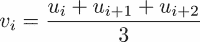

# 十三、测试

在这一章中，我们将集中讨论科学编程测试的两个方面。第一个方面是在科学计算中测试什么这个经常很难的话题。第二个方面涉及如何测试的问题。我们将区分手动测试和自动测试。手动测试是每个程序员为了快速检查一个实现是否工作而做的事情。自动化测试是这个想法的精炼的、自动化的变体。我们将介绍一些可用于一般自动测试的工具，着眼于科学计算的特殊情况。

# 手动测试

在代码开发过程中，为了测试它的功能，您会做很多小测试。这可以称为手动测试。通常，您会通过在交互环境中手动测试函数来测试给定的函数是否完成了它应该做的事情。例如，假设您实现了等分算法。这是一种寻找标量非线性函数的零点(根)的算法。要启动算法，必须给定一个区间，其属性是函数在区间边界上取不同的符号，更多信息请参见*练习 4* 、[第 7 章](07.html "Chapter 7. Functions")、*函数*。

然后，您将测试该算法的实现，通常是通过检查:

*   当函数在区间边界具有相反符号时，找到了一个解
*   当函数在区间边界具有相同的符号时，会引发异常

尽管看起来很有必要，但手动测试并不令人满意。一旦你确信代码做了它应该做的事情，你就可以用相对较少的演示例子来说服其他人相信代码的质量。在那个阶段，人们经常对开发过程中进行的测试失去兴趣，它们被遗忘甚至删除。一旦你改变了一个细节，事情就不再正常工作，你可能会后悔你以前的测试不再可用。

# 自动测试

开发任何代码的正确方法是使用自动测试。优点是:

*   在每次代码重构之后和任何新版本发布之前，大量测试的自动重复。
*   代码使用的静默文档。
*   代码测试覆盖范围的文档:事情是在变更前工作还是某个方面从未测试过？

### 注

程序中的变化，特别是不影响其功能的结构变化，叫做代码重构。

我们建议与代码并行开发测试。好的测试设计本身就是一门艺术，很少有投资能像好的测试投资那样保证开发时间节约的良好回报。

现在，我们将考虑自动化测试方法来实现一个简单的算法。

## 测试等分算法

让我们检查一下等分算法的自动化测试。利用该算法，可以找到实值函数的零点。在[第七章](07.html "Chapter 7. Functions")、*功能*中*练习 4* 一节有描述。算法的实现可以具有以下形式:

```py
def bisect(f, a, b, tol=1.e-8):
    """
    Implementation of the bisection algorithm 
    f real valued function
    a,b interval boundaries (float) with the property 
    f(a) * f(b) <= 0
    tol tolerance (float)
    """
    if f(a) * f(b)> 0:
        raise ValueError("Incorrect initial interval [a, b]") 
    for i in range(100):
        c = (a + b) / 2.
        if f(a) * f(c) <= 0:
            b = c
        else:
            a = c
        if abs(a - b) < tol:
            return (a + b) / 2
    raise Exception(
          'No root found within the given tolerance {}'.format(tol))
```

我们假设这存储在`bisection.py`文件中。作为第一个测试用例，我们测试发现函数 *f* ( *x* ) = *x* 的零点为:

```py
def test_identity():
    result = bisect(lambda x: x, -1., 1.) 
    expected = 0.
    assert allclose(result, expected),'expected zero not found'

test_identity()
```

在这段代码中，你第一次遇到 Python 关键字`assert`。如果其第一个参数返回`False`值，则引发`AssertionError`异常。它可选的第二个参数是一个包含附加信息的字符串。我们使用函数`allclose`来测试浮点数是否相等。

让我们评论一下测试函数的一些特性。我们使用断言来确保如果代码的行为不符合预期，将会引发异常。我们必须在`test_identity()`线手动运行测试。

有许多工具可以自动化这种调用。

现在让我们设置一个测试，当函数在区间两端具有相同的符号时，该测试检查`bisect`是否引发异常。现在，我们假设引发的异常是`ValueError`异常。在以下示例中，我们将检查初始间隔[ *a* 、 *b* ]。对于等分算法，它应该满足一个符号条件:

```py
def test_badinput():
    try:
        bisect(lambda x: x,0.5,1)
    except ValueError:
        pass
    else:
        raise AssertionError()

test_badinput()
```

在这种情况下，如果异常不是`ValueError`类型，则会引发`AssertionError`。有一些工具可以简化前面的构造，以检查是否引发了异常。

另一个有用的测试是边缘案例测试。在这里，我们测试参数或用户输入，这可能会产生程序员无法预见的数学上未定义的情况或程序状态。例如，如果两个界限相等会发生什么？如果 *a > b* 会发生什么？

```py
def test_equal_boundaries():
    result = bisect(lambda x: x, 0., 0.)
    expected = 0.
    assert allclose(result, expected), \
                   'test equal interval bounds failed'

def test_reverse_boundaries():
    result = bisect(lambda x: x, 1., -1.)
    expected = 0.
    assert allclose(result, expected),\
                 'test reverse interval bounds failed'

test_equal_boundaries()
test_reverse_boundaries()
```

# 使用单元测试包

标准的`unittest` Python 包极大地方便了自动化测试。这个包要求我们重写测试以兼容。第一个测试必须在`class`中重写，如下所示:

```py
from bisection import bisect
import unittest

class TestIdentity(unittest.TestCase):
    def test(self):
        result = bisect(lambda x: x, -1.2, 1.,tol=1.e-8)
        expected = 0.
        self.assertAlmostEqual(result, expected)

if __name__=='__main__':
    unittest.main()
```

让我们检查一下与之前实现的区别。首先，测试现在是一个方法和一个类的一部分。该类必须从`unittest.TestCase`继承。测试方法的名称必须以`test`开头。注意，我们现在可以使用`unittest`包的断言工具之一，即`assertAlmostEqual`。最后，使用`unittest.main`运行测试。我们建议将测试写在与要测试的代码分开的文件中。这就是为什么它以`import`开头。测试通过并返回如下:

```py
Ran 1 test in 0.002s
OK

```

如果我们使用宽松的公差参数运行它，例如`1.e-3`，将会报告测试失败:

```py
F
======================================================================
FAIL: test (__main__.TestIdentity)
----------------------------------------------------------------------
Traceback (most recent call last):
  File "<ipython-input-11-e44778304d6f>", line 5, in test
    self.assertAlmostEqual(result, expected)
AssertionError: 0.00017089843750002018 != 0.0 within 7 places
----------------------------------------------------------------------
Ran 1 test in 0.004s
FAILED (failures=1)

```

测试可以也应该作为测试类的方法组合在一起，如下例所示:

```py
import unittest
from bisection import bisect

class TestIdentity(unittest.TestCase):
    def identity_fcn(self,x):
        return x
    def test_functionality(self):
        result = bisect(self.identity_fcn, -1.2, 1.,tol=1.e-8)
        expected = 0.
        self.assertAlmostEqual(result, expected)
    def test_reverse_boundaries(self):
        result = bisect(self.identity_fcn, 1., -1.)
        expected = 0.
        self.assertAlmostEqual(result, expected)
    def test_exceeded_tolerance(self):
        tol=1.e-80
        self.assertRaises(Exception, bisect, self.identity_fcn,
                                               -1.2, 1.,tol)
if __name__=='__main__':
    unittest.main()
```

这里，在上一次测试中，我们使用了`unittest.TestCase.assertRaises`方法。它测试异常是否被正确引发。它的第一个参数是异常类型，例如，`ValueError`、`Exception`，它的第二个参数是函数的名称，预计会引发异常。剩下的参数是这个函数的参数。命令`unittest.main()`创建一个`TestIdentity`类的实例，并从`test`开始执行这些方法。

## 测试设置和拆卸方法

类`unittest.TestCase`提供了两个特殊的方法，`setUp`和`tearDown`，它们在每次调用测试方法之前和之后运行。测试发电机时需要这样做，每次测试后发电机都会耗尽。我们通过测试一个程序来演示这一点，该程序检查给定字符串首次出现的文件中的行:

```py
class NotFoundError(Exception):
  pass

def find_string(file, string):
    for i,lines in enumerate(file.readlines()):
        if string in lines:
            return i
    raise NotFoundError(
         'String {} not found in File {}'.format(string,file.name))
```

我们假设该代码保存在`find_in_file.py`文件中。测试必须准备一个文件，并在测试后打开和删除它，如下例所示:

```py
import unittest
import os # used for, for example, deleting files

from find_in_file import find_string, NotFoundError

class TestFindInFile(unittest.TestCase):
    def setUp(self):
        file = open('test_file.txt', 'w')
        file.write('aha')
        file.close()
        self.file = open('test_file.txt', 'r')
    def tearDown(self):
        self.file.close()
        os.remove(self.file.name)
    def test_exists(self):
        line_no=find_string(self.file, 'aha')
        self.assertEqual(line_no, 0)
    def test_not_exists(self):
        self.assertRaises(NotFoundError, find_string,
                                              self.file, 'bha')

if __name__=='__main__':
    unittest.main()
```

每次测试前`setUp`运行，然后`tearDown`执行。

# 参数化测试

人们经常想用不同的数据集重复同样的测试。当使用`unittest`的功能时，这要求我们使用注入的相应方法自动生成测试用例:

为此，我们首先用一个或几个将要使用的方法构建一个测试用例，当我们稍后设置测试方法时。让我们再次考虑二等分方法，并检查它返回的值是否真的是给定函数的零。

我们首先构建测试用例和我们将用于测试的方法，如下所示:

```py
class Tests(unittest.TestCase):
    def checkifzero(self,fcn_with_zero,interval):
        result = bisect(fcn_with_zero,*interval,tol=1.e-8)
        function_value=fcn_with_zero(result)
        expected=0.
        self.assertAlmostEqual(function_value, expected)
```

然后我们动态地创建测试函数作为这个类的属性:

```py
test_data=[
           {'name':'identity', 'function':lambda x: x,
                                     'interval' : [-1.2, 1.]},
           {'name':'parabola', 'function':lambda x: x**2-1,
                                        'interval' :[0, 10.]},
           {'name':'cubic', 'function':lambda x: x**3-2*x**2,
                                       'interval':[0.1, 5.]},
               ] 
def make_test_function(dic):
        return lambda self :\
                   self.checkifzero(dic['function'],dic['interval'])
for data in test_data:
    setattr(Tests, "test_{name}".format(name=data['name']),
                                           make_test_function(data))
if __name__=='__main__':
  unittest.main()
```

在本例中，数据以字典列表的形式提供。`make_test_function`函数动态生成一个测试函数，该函数使用一个特定的数据字典，用之前定义的方法`checkifzero`执行测试。最后，命令`setattr`用于制作类`Tests`的这些测试函数方法。

# 断言工具

在这一部分，我们收集了最重要的工具来提高一个`AssertionError`。我们从`unittest`看到了`assert`命令和两个工具，即`assertAlmostEqual`。下表(*表 13.1* )总结了最重要的断言工具和相关模块:

<colgroup><col> <col></colgroup> 
| **断言工具及应用示例** | **模块** |
| `assert 5==5` | – |
| `assertEqual(5.27, 5.27)` | `unittest.TestCase` |
| `assertAlmostEqual(5.24, 5.2,places = 1)` | `unittest.TestCase` |
| `assertTrue(5 > 2)` | `unittest.TestCase` |
| `assertFalse(2 < 5)` | `unittest.TestCase` |
| `assertRaises(ZeroDivisionError,lambda x: 1/x,0.)` | `unittest.TestCase` |
| `assertIn(3,{3,4})` | `unittest.TestCase` |
| `assert_array_equal(A,B)` | `numpy.testing` |
| `assert_array_almost_equal(A, B, decimal=5)` | `numpy.testing` |
| `assert_allclose(A, B, rtol=1.e-3,atol=1.e-5)` | `numpy.testing` |

表 13.1:Python、unittest 和 NumPy 中的断言工具

# 浮动比较

两个浮点数不应该与`==`比较，因为一次计算的结果往往会因为舍入误差而略有偏差。出于测试目的，有许多工具可以测试浮点数的相等性。首先，`allclose`检查两个数组是否几乎相等。它可以用于测试功能，如图所示:

```py
self.assertTrue(allclose(computed, expected))
```

这里，`self`指的是一个`unittest.Testcase`实例。`numpy`包`testing`中也有测试工具。这些是通过使用以下方式导入的:

```py
import numpy.testing
```

使用`numpy.testing.assert_array_allmost_equal`或`numpy.testing.assert_allclose`测试两个标量或两个数组是否相等。如上表所示，这些方法描述所需精度的方式不同。

*QR* 因式分解将给定矩阵分解为正交矩阵 *Q* 和上三角矩阵 *R* 的乘积，如下例所示:

```py
import scipy.linalg as sl
A=rand(10,10)
[Q,R]=sl.qr(A)
```

方法应用正确吗？我们可以通过验证 *Q* 确实是一个正交矩阵来检验这一点:

```py
import numpy.testing as npt 
npt.assert_allclose(
               dot(Q.T,self.Q),identity(Q.shape[0]),atol=1.e-12)
```

此外，我们可以通过检查 *A = QR* 来执行健全性测试:

```py
import numpy.testing as npt
npt.assert_allclose(dot(Q,R),A))
```

所有这些都可以收集到一个`unittest`测试用例中，如下所示:

```py
import unittest
import numpy.testing as npt
from scipy.linalg import qr
from scipy import *

class TestQR(unittest.TestCase):
    def setUp(self):
        self.A=rand(10,10)
        [self.Q,self.R]=qr(self.A)
    def test_orthogonal(self):
        npt.assert_allclose(
            dot(self.Q.T,self.Q),identity(self.Q.shape[0]),
                                                        atol=1.e-12)
    def test_sanity(self):
            npt.assert_allclose(dot(self.Q,self.R),self.A)

if __name__=='__main__':
    unittest.main()
```

注意在`assert_allclose`中，参数`atol`默认为零，当处理具有小元素的矩阵时，这通常会导致问题。

# 单元和功能测试

到目前为止，我们只使用了功能测试。功能测试检查功能是否正确。对于二等分算法，这种算法实际上在有一个零的时候会找到一个零。在这个简单的例子中，单元测试是什么并不清楚。虽然这看起来有点做作，但是仍然可以对二等分算法进行单元测试。它将展示单元测试如何经常导致更加条块分割的实现。

因此，在二等分法中，我们想要检查，例如，在每一步中，间隔的选择是否正确。怎么做？请注意，用当前的实现是绝对不可能的，因为算法隐藏在函数内部。一种可能的补救方法是只运行二等分算法的一个步骤。由于所有的步骤都是相似的，我们可能会说我们已经测试了所有可能的步骤。我们还需要能够在算法的当前步骤检查当前界限`a`和`b`。所以我们必须添加要作为参数运行的步骤数，并更改函数的返回接口。我们将按如下所示进行操作:

```py
def bisect(f,a,b,n=100):
  ...
  for iteration in range(n):
    ...
  return a,b
```

注意，为了适应这种变化，我们必须改变现有的单元测试。我们现在可以添加一个单元测试，如图所示:

```py
def test_midpoint(self):
  a,b = bisect(identity,-2.,1.,1)
  self.assertAlmostEqual(a,-0.5)
  self.assertAlmostEqual(b,1.)
```

# 调试

在测试时，调试有时是必要的，特别是如果不能立即弄清楚为什么给定的测试没有通过。在这种情况下，能够在交互会话中调试给定的测试是非常有用的。然而，`unittest.TestCase`类的设计使这变得困难，这阻碍了测试用例对象的简单实例化。解决方案是创建一个仅用于调试目的的特殊实例。

假设，在上面`TestIdentity`类的例子中，我们想要测试`test_functionality`方法。这将通过以下方式实现:

```py
test_case = TestIdentity(methodName='test_functionality')
```

现在，该测试可以通过以下方式单独运行:

```py
test_case.debug()
```

这将运行这个单独的测试，并允许调试。

# 测试发现

如果您编写一个 Python 包，各种测试可能会在包中展开。`discover`模块查找、导入并运行这些测试用例。命令行的基本调用是:

```py
python -m unittest discover

```

它开始在当前目录中寻找测试用例，并向下递归目录树来寻找名称中包含`'test'`字符串的 Python 对象。该命令接受可选参数。最重要的是`-s`修改开始目录和`-p`定义识别测试的模式:

```py
python -m unittest discover -s '.' -p 'Test*.py'

```

# 测量执行时间

为了在代码优化上做出决定，人们通常必须比较几种代码选择，并根据执行时间来决定应该优先选择哪种代码。此外，在比较不同算法时，讨论执行时间是一个问题。在这一节中，我们提供了一种简单易行的方法来测量执行时间。

## 带魔法功能的计时

测量单个语句执行时间最简单的方法是使用 IPython 的神奇函数`%timeit`。

### 注

外壳 IPython 为标准 Python 增加了额外的功能。这些额外的函数被称为魔术函数。

由于单个语句的执行时间可能非常短，因此该语句被放在一个循环中执行几次。通过使用最少的测量时间，可以确保计算机上运行的其他任务不会对测量结果产生太大影响。让我们考虑从数组中提取非零元素的四种可选方法，如下所示:

```py
A=zeros((1000,1000))
A[53,67]=10

def find_elements_1(A):
    b = []
    n, m = A.shape
    for i in range(n):
        for j in range(m):
            if abs(A[i, j]) > 1.e-10:
                b.append(A[i, j])
    return b

def find_elements_2(A):
    return [a for a in A.reshape((-1, )) if abs(a) > 1.e-10]

def find_elements_3(A):
    return [a for a in A.flatten() if abs(a) > 1.e-10]

def find_elements_4(A):
    return A[where(0.0 != A)]
```

用 IPython 的神奇功能`%timeit`测量时间会得到以下结果:

```py
In [50]: %timeit -n 50 -r 3 find_elements_1(A)
50 loops, best of 3: 585 ms per loop

In [51]: %timeit -n 50 -r 3 find_elements_2(A)
50 loops, best of 3: 514 ms per loop

In [52]: %timeit -n 50 -r 3 find_elements_3(A)
50 loops, best of 3: 519 ms per loop

In [53]: %timeit -n 50 -r 3 find_elements_4(A)
50 loops, best of 3: 7.29 ms per loop
```

参数`-n`控制在测量时间之前执行语句的频率，`-r`参数控制重复次数。

## 用 Python 模块计时

Python 提供了一个`timeit`模块，可以用来测量执行时间。它要求首先构造一个时间对象。它由两个字符串构成，一个字符串包含设置命令，另一个字符串包含要执行的命令。我们采用与前面例子中相同的四种选择。数组和函数定义现在被写在一个名为`setup_statements`的字符串中，四次对象的构造如下:

```py
import timeit
setup_statements="""
from scipy import zeros
from numpy import where
A=zeros((1000,1000))
A[57,63]=10.

def find_elements_1(A):
    b = []
    n, m = A.shape
    for i in range(n):
        for j in range(m):
            if abs(A[i, j]) > 1.e-10:
               b.append(A[i, j])
    return b

def find_elements_2(A):
    return [a for a in A.reshape((-1,)) if abs(a) > 1.e-10]

def find_elements_3(A):
    return [a for a in A.flatten() if abs(a) > 1.e-10]

def find_elements_4(A):
    return A[where( 0.0 != A)]
"""
experiment_1 = timeit.Timer(stmt = 'find_elements_1(A)',
                            setup = setup_statements)
experiment_2 = timeit.Timer(stmt = 'find_elements_2(A)',
                            setup = setup_statements)
experiment_3 = timeit.Timer(stmt = 'find_elements_3(A)',
                            setup = setup_statements)
experiment_4 = timeit.Timer(stmt = 'find_elements_4(A)',
                            setup = setup_statements)
```

计时器对象有一个`repeat`方法。它需要`repeat`和`number`参数。它循环执行定时器对象的语句，测量时间，并重复与`repeat`参数对应的实验:

我们继续前面的示例，并测量执行时间，如下所示:

```py
t1 = experiment_1.repeat(3,5) 
t2 = experiment_2.repeat(3,5) 
t3 = experiment_3.repeat(3,5) 
t4 = experiment_4.repeat(3,5) 
# Results per loop in ms
min(t1)*1000/5 # 615 ms
min(t2)*1000/5 # 543 ms
min(t3)*1000/5 # 546 ms
min(t4)*1000/5 # 7.26 ms
```

与前面例子中的方法相反，我们获得了所有获得的测量值的列表。由于计算时间可能会根据计算机的总负载而变化，因此可以将此列表中的最小值视为执行语句所需计算时间的良好近似值。

## 使用上下文管理器计时

最后，我们提出了第三种方法。它展示了上下文管理器的另一个应用。我们首先构建一个上下文管理器对象来测量经过的时间，如图所示:

```py
import time
class Timer:
    def __enter__(self):
        self.start = time.time()
        # return self
    def __exit__(self, ty, val, tb):
        end = time.time()
        self.elapsed=end-self.start
        print('Time elapsed {} seconds'.format(self.elapsed))
        return False
```

回想一下`_ _enter_ _`和`_ _exit_ _`方法使这个类成为一个上下文管理器。`_ _exit_ _`方法的参数`ty`、`val`和`tb`在正常情况下`None`。如果在执行过程中引发异常，它们会获取异常类型、异常值和追溯信息。`return False`表示到目前为止还没有捕捉到异常。

我们现在展示使用上下文管理器来测量前面示例中四个备选方案的执行时间:

```py
with Timer():
  find_elements_1(A)

```

这将显示类似`Time elapsed 15.0129795074 ms`的信息。

如果计时结果应该可以在变量中访问，`enter`方法必须返回`Timer`实例(取消对`return`语句的注释)，并且必须使用`with ... as ...`构造:

```py
with Timer() as t1:
    find_elements_1(A)
t1.elapsed # contains the result
```

# 总结

没有测试就没有程序开发！我们展示了良好组织和记录测试的重要性。一些专业人员甚至通过首先指定测试来开始开发。自动测试的一个有用工具是模块`unittest`，我们已经详细解释过了。虽然测试提高了代码的可靠性，但是需要分析来提高性能。替代的编码方式可能会导致很大的性能差异。我们展示了如何测量计算时间以及如何定位代码中的瓶颈。

# 练习

**Ex。1** →两个矩阵 *A* 、 *B* 叫做相似，如果存在一个矩阵 *S* ，这样 *B = S <sup>-1</sup> A S* 。 *A* 和 *B* 具有相同的特征值。写一个测试，通过比较两个矩阵的特征值来检查它们是否相似。是功能测试还是单元测试？

**Ex。2** →创建两个高维向量。比较各种方式计算`dot`乘积的执行时间:

*   SciPy 功能:`dot(v,w)`
*   生成器和总和:`sum((x*y for x,y in zip(v,w)))`
*   综合清单及合计:`sum([x*y for x,y in zip(v,w)])`

**Ex。3** →让 *u* 成为向量。矢量 *v* 带分量



叫做 *u* 的移动平均线。确定计算 *v* 的两种选择中哪一种更快:

```py
v = (u[:-2] + u[1:-1] + u[2:]) / 3
```

或者

```py
v = array([(u[i] + u[i + 1] + u[i + 2]) / 3
  for i in range(len(u)-3)])
```