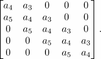
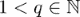

# 十五、符号计算——SymPy

在本章中，我们将简要介绍如何使用 Python 进行符号计算。市场上有强大的执行符号计算的软件，例如，Maple <sup>TM</sup> 或 Mathematica <sup>TM</sup> 。但有时，用你习惯的语言或框架进行符号计算可能是有利的。在本书的这个阶段，我们假设这种语言是 Python，所以我们在 Python 中寻找一种工具 SymPy 模块。

如果可能的话，对 SymPy 的完整描述可以填满整本书，这不是本章的目的。相反，我们将通过一些指导性的例子来指出进入这个工具的途径，让这个工具的潜力成为 NumPy 和 SciPy 的补充。

# 什么是符号计算？

到目前为止，我们在这本书里做的所有计算都是所谓的数值计算。这些是主要对浮点数的一系列操作。数值计算的本质是结果是精确解的近似值。

符号计算通过将代数或微积分中教授的公式或符号转换成其他公式来对公式或符号进行操作。这些转换的最后一步可能需要插入数字并执行数值计算。

我们通过计算这个定积分来说明区别:


象征性地，这个表达式可以通过考虑被积函数的原始函数来转换:


我们现在通过插入积分界得到定积分的公式:


这被称为积分的封闭形式表达式。很少有数学问题的解可以用封闭形式的表达式给出。它是积分的精确值，没有任何近似值。另外，将实数表示为浮点数不会引入误差，否则会引入舍入误差。

逼近和舍入在最后时刻发挥作用，这时需要对这个表达式进行评估。平方根和*反正切*只能用数值方法近似计算。这样的评估给出了一定精度(通常未知)的最终结果:


另一方面，数值计算将通过某种近似方法(例如辛普森法则)直接近似定积分，并给出数值结果，通常带有误差估计。在 Python 中，这是通过以下命令完成的:

```py
from scipy.integrate import quad
quad(lambda x : 1/(x**2+x+1),a=0, b=4)   
```

它们返回值 *0.9896614396122965* 和误差范围的估计值*1.173566342283496 10<sup>-08</sup>。*

下图显示了数值近似和符号近似的比较:


图 15.1:符号和数字求积

## 在 SymPy 中阐述一个例子

首先，让我们详细说明前面的例子，其中解释了步骤。

首先，我们必须导入模块:

```py
from sympy import *
init_printing()
```

第二个命令确保公式尽可能以图形方式呈现。然后，我们生成一个符号并定义被积函数:

```py
x = symbols('x')
f = Lambda(x, 1/(x**2 + x + 1))
```

`x`现在是类型为`Symbol`的 Python 对象，`f`是一个 SymPy `Lambda`函数(注意命令以大写字母开头)。

现在我们从积分的符号计算开始:

```py
integrate(f(x),x)    
```

根据你的工作环境，结果以不同的方式呈现；参见下面的截图(*图 15.2* )，它代表了 SymPy 公式在不同环境下的两种不同结果:


图 15.2:一个公式在两个不同环境中的 SymPy 表示的两个截图。

我们可以通过微分来检查结果是否正确。为此，我们为基元函数指定一个名称，并根据 *x* 进行区分:

```py
pf = Lambda(x, integrate(f(x),x))
diff(pf(x),x)    
```

获得的结果如下:


这可以通过使用以下命令来简化:

```py
simplify(diff(pf(x),x))    
```

到

。

我们期待的结果。

定积分通过使用以下命令获得:

```py
pf(4) - pf(0)     
```

用`simplify`简化后给出如下输出:


为了获得一个数值，我们最终将这个表达式求值为一个浮点数:

```py
(pf(4)-pf(0)).evalf() # returns 0.9896614396123
```

# 症状的基本要素

这里我们介绍一下 SymPy 的基本元素。您会发现熟悉 Python 中的类和数据类型是有益的。

## 符号——所有公式的基础

在 SymPy 中构建公式的基本构造元素是符号。正如我们在介绍性示例中看到的，符号是由命令`symbols`创建的。这个 SymPy 命令从给定的字符串生成符号对象:

```py
x, y, mass, torque = symbols('x y mass torque')
```

它实际上是以下命令的简短形式:

```py
symbol_list=[symbols(l) for l in 'x y mass torque'.split()]
```

随后是解包步骤以获得变量:

```py
 x, y, mass, torque = symbol_list
```

命令的参数定义了符号的字符串表示形式。符号的变量名通常选择为与其字符串表示相同，但这不是语言所要求的:

```py
row_index=symbols('i',integer=True)
print(row_index**2)  # returns i**2
```

这里，我们还定义了假设符号是整数。

整套符号可以用非常简洁的方式定义:

```py
integervariables = symbols('i:l', integer=True)
dimensions = symbols('m:n', integer=True)
realvariables = symbols('x:z', real=True)
```

类似地，索引变量的符号可以通过以下方式定义:

```py
A = symbols('A1:3(1:4)')
```

这给出了一组符号，


索引范围的规则是我们在本书前面处理切片时看到的规则(更多详细信息，请参考[第 3 章](03.html "Chapter 3. Container Types")、*容器类型*)。

## 数字

Python 直接对数字进行运算，不可避免地会引入舍入误差。这些会阻碍所有的符号计算。当我们`sympify`数字:

```py
1/3  # returns 0.3333333333333333
sympify(1)/sympify(3)  # returns '1/3'
```

`sympify`命令将整数转换为类型为`sympy.core.numbers.Integer`的对象。

不用把 1/3 写成两个整数的运算，也可以用`Rational(1,3)`直接表示为有理数。

## 功能

SymPy 区分定义函数和未定义函数。术语未定义函数(可能有点误导)指的是定义良好的 Python 对象，用于没有特殊属性的一般函数。

具有特殊属性的函数的一个例子是本章介绍性示例中使用的`atan`或`Lambda`函数。

注意同一数学函数不同实现的不同名称:`sympy.atan`和`scipy.arctan`。

### 未定义的函数

通过给`symbols`命令一个额外的类参数来创建一个未定义函数的符号:

```py
f, g = symbols('f g', cls=Function)
```

使用`Function`构造函数也可以实现同样的效果:

```py
f = Function('f')
g = Function('g')
```

对于未定义的函数，我们可以评估微积分的一般规则。

例如，让我们计算以下表达式:


这在 Python 中通过使用以下命令象征性地计算出来:

```py
x = symbols('x')
f, g = symbols('f g', cls=Function)
diff(f(x*g(x)),x)
```

执行时，前面的代码返回以下内容作为输出:


此示例显示了如何应用产品规则和链规则。

我们甚至可以使用未定义的函数作为几个变量中的函数，例如:

```py
x = symbols('x:3')
f(*x)
```

它返回以下输出:


### 注

注意使用星型运算符来解包一个元组，形成带有参数的*f*；参见第 7 章、*功能*部分*匿名功能*、

利用列表理解，我们可以构造出 *f* 的所有偏导数的列表:

```py
 [diff(f(*x),xx) for xx in x]
```

这会返回一个包含(T2 的*的梯度)元素的列表:*


也可以使用`Function`对象的`diff`方法重写命令:

```py
[f(*x).diff(xx) for xx in x]
```

另一种方法是泰勒级数展开:

```py
x = symbols('x')
f(x).series(x,0,n=4)
```

这将返回泰勒公式，以及由朗道符号表示的剩余项:


# 初等函数

SymPy 中初等函数的例子是三角函数及其逆函数。以下示例显示了简化如何作用于包含初等函数的表达式:

```py
x = symbols('x')
simplify(cos(x)**2 + sin(x)**2)  # returns 1
```

下面是使用初等函数的另一个例子:

```py
atan(x).diff(x) - 1./(x**2+1)  # returns 0
```

如果您同时使用 SciPy 和 SymPy，我们强烈建议您在不同的名称空间中使用它们:

```py
import scipy as sp
import sympy as sym
# working with numbers
x=3
y=sp.sin(x)
# working with symbols
x=sym.symbols('x')
y=sym.sin(x)   
```

## λ-函数

在第 7 章、*函数*的*匿名函数*一节中，我们看到了如何在 Python 中定义所谓的匿名函数。SymPy 中的对应物由`Lambda`命令完成。注意区别；`lambda`是关键词，`Lambda`是建造师。

命令`Lambda`采用两个参数，函数自变量的符号和一个 SymPy 表达式来计算函数。

下面是一个将空气阻力(也称为阻力)定义为速度函数的例子:

```py
C,rho,A,v=symbols('C rho A v')
# C drag coefficient, A coss-sectional area, rho density
# v speed
f_drag = Lambda(v,-Rational(1,2)*C*rho*A*v**2)
```

`f_drag`显示为一个表达式:

。

这个函数可以通过提供一个参数以通常的方式进行计算:

```py
x = symbols('x')
f_drag(2)
f_drag(x/3)
```

这将产生给定的表达式:


也可以通过提供几个参数在几个变量中创建函数，例如:

```py
t=Lambda((x,y),sin(x) + cos(2*y))
```

对该函数的调用可以通过两种方式完成，或者直接提供几个参数:

```py
t(pi,pi/2)  # returns -1
```

或者通过解包元组或列表:

```py
p=(pi,pi/2)
t(*p)   # returns -1
```

SymPy 中的矩阵对象甚至可以定义向量值函数:

```py
F=Lambda((x,y),Matrix([sin(x) + cos(2*y), sin(x)*cos(y)]))
```

这使我们能够计算雅可比:

```py
F(x,y).jacobian((x,y))
```

它给出以下表达式作为输出:


在变量较多的情况下，使用更紧凑的形式来定义函数是很方便的:

```py
x=symbols('x:2')
F=Lambda(x,Matrix([sin(x[0]) + cos(2*x[1]),sin(x[0])*cos(x[1])]))  
F(*x).jacobian(x)
```

# 符号线性代数

符号线性代数由我们将首先介绍的 SymPy 的`matrix`数据类型支持。然后，我们将介绍一些线性代数方法，作为这个领域中符号计算的广泛可能性的例子:

## 符号矩阵

当我们讨论向量值函数时，我们简要地遇到了`matrix`数据类型。在这里，我们看到了它最简单的形式，它将列表转换成矩阵。举个例子，让我们构造一个旋转矩阵:

```py
phi=symbols('phi')
rotation=Matrix([[cos(phi), -sin(phi)],
                 [sin(phi), cos(phi)]])
```

当使用 SymPy 矩阵时，我们必须注意到运算符`*`执行矩阵乘法，而不是像 NumPy 数组那样充当元素乘法。

通过使用矩阵乘法和矩阵转置，可以检查上述定义的旋转矩阵的正交性:

```py
simplify(rotation.T*rotation -eye(2))  # returns a 2 x 2 zero matrix
```

前面的例子展示了矩阵是如何转置的，以及单位矩阵是如何创建的。或者，我们可以检查它的逆是否是它的转置，这可以通过以下方式完成:

```py
simplify(rotation.T - rotation.inv())
```

建立矩阵的另一种方法是提供符号列表和形状:

```py
M = Matrix(3,3, symbols('M:3(:3)'))
```

这将创建以下矩阵:


创建矩阵的第三种方法是通过给定的函数生成其条目。语法是:

```py
Matrix(number of rows,number of colums, function)
```

我们通过考虑托普利兹矩阵是具有常对角线的矩阵来举例说明上述矩阵。给定一个 *2n-1* 数据向量 *a* ，其元素定义为


在 SymPy 中，矩阵可以通过直接使用这个定义来定义:

```py
def toeplitz(n):
    a = symbols('a:'+str(2*n))
    f = lambda i,j: a[i-j+n-1]
    return Matrix(n,n,f)
```

执行前面的代码给出`toeplitz(5)`:


人们清楚地看到想要的结构；沿着次对角线和超对角线的所有元素都是相同的。我们可以根据[第三章](03.html "Chapter 3. Container Types")、*容器类型*的*列表*一节中介绍的 Python 语法，通过索引和切片来访问矩阵元素:

```py
a=symbols('a')
M[0,2]=0  # changes one element
M[1,:]=Matrix(1,3,[1,2,3]) # changes an entire row
```

# SymPy 中线性代数方法的例子

线性代数的基本任务是求解线性方程组:

。

让我们为一个 3 *×* 3 矩阵象征性地这样做:

```py
A = Matrix(3,3,symbols('A1:4(1:4)'))
b = Matrix(3,1,symbols('b1:4'))
x = A.LUsolve(b)

```

这个相对小的问题的输出已经仅仅是可读的了，这可以在下面的表达式中看到:


再次，使用`simplify`命令有助于我们检测取消项并收集常见因素:

```py
simplify(x)
```

这将导致以下看起来更好的输出:


随着矩阵维数的增加，符号计算变得非常慢。对于大于 15 的维度，甚至可能出现内存问题。

上图(*图 15.3* )说明了用符号和数值求解线性系统的 CPU 时间差异:


图 15.3:用数字和符号求解线性系统的中央处理器时间。

# 替代

让我们首先考虑一个简单的符号表达式:

```py
x, a = symbols('x a')
b = x + a
```

如果我们设置`x = 0`会发生什么？我们观察到`b`没有变化。我们所做的是改变了 Python 变量`x`。它现在不再指符号对象，而是指整数对象 *0* 。由字符串`'x'`表示的符号保持不变，`b`也是如此。

相反，通过用数字、其他符号或表达式替换符号来改变表达式是通过一种特殊的替换方法来完成的，这可以在下面的代码中看到:

```py
x, a = symbols('x a')
b = x + a
c = b.subs(x,0)   
d = c.subs(a,2*a)  
print(c, d)   # returns (a, 2a)
```

此方法采用一个或两个参数:

```py
b.subs(x,0)
b.subs({x:0})  # a dictionary as argument
```

作为参数的字典允许我们一步完成几个替换:

```py
b.subs({x:0, a:2*a})  # several substitutions in one
```

由于字典中的条目没有明确的顺序，人们永远不知道哪一个是第一个，因此需要确保对条目进行置换不会影响替换结果。因此，在 SymPy 中，首先在字典中进行替换，然后在表达式中进行替换。下面的例子说明了这一点:

```py
x, a, y = symbols('x a y')
b = x + a
b.subs({a:a*y, x:2*x, y:a/y})
b.subs({y:a/y, a:a*y, x:2*x})
```

两个替换返回相同的结果，即，

。

定义多个替换的第三种方法是使用旧值/新值对列表:

```py
 b.subs([(y,a/y), (a,a*y), (x,2*x)]) 
```

也可以用其他表达式替换整个表达式:

```py
n, alpha = symbols('n alpha')
b = cos(n*alpha)
b.subs(cos(n*alpha), 2*cos(alpha)*cos((n-1)*alpha)-cos((n-2)*alpha))
```

为了说明矩阵元素的替换，我们再次取 *5 × 5* 托普利兹矩阵:


考虑替代`M.subs(T[0,2],0)`。它改变位置[0，2]处的符号对象，即符号 *a* <sub>2</sub> 。它还发生在另外两个地方，这两个地方会自动受到这种替代的影响。

给定的表达式是结果矩阵:


或者，我们可以为这个符号创建一个变量，并在替换中使用它:

```py
a2 = symbols('a2')
T.subs(a2,0)
```

作为一个更复杂的替代例子，我们描述了如何将托普利兹矩阵转化为三对角托普利兹矩阵*。*这可以通过以下方式实现:首先，我们生成一个列表，列出我们想要替换的符号；然后我们使用`zip`命令生成一个配对列表。最后，我们通过给出如上所述的旧值/新值对的列表来替代:

```py
symbs = [symbols('a'+str(i)) for i in range(19) if i < 3 or i > 5]
substitutions=list(zip(symbs,len(symbs)*[0]))
T.subs(substitutions)
```

这给出了以下矩阵结果:



# 评估符号表达式

在科学计算的环境中，通常需要首先进行符号操作，然后将符号结果转换为浮点数。

评估符号表达式的中心工具是`evalf`。它使用以下方法将符号表达式转换为浮点数:

```py
pi.evalf()   # returns 3.14159265358979
```

结果对象的数据类型是`Float`(注意大写)，这是一种允许任意位数(任意精度)的浮点数的 SymPy 数据类型。默认精度对应于 15 位数字，但是可以通过给`evalf`一个额外的正整数参数来改变，该参数根据数字的数量来指定所需的精度，

```py
pi.evalf(30)   # returns  3.14159265358979323846264338328
```

使用任意精度的结果是数字可以任意小，也就是说，打破了经典浮点表示的限制；参考[第二章](02.html "Chapter 2. Variables and Basic Types")、*变量和基本类型*中的*浮点数*部分。

非常有趣的是，用类型为`Float`的输入评估一个 SymPy 函数会返回一个与输入精度相同的浮点值。我们在一个更详细的数值分析例子中演示了这一事实的使用。

## 例:牛顿法收敛阶的研究

如果存在正常数 *C* ，则迭代*x<sub>n</sub>T3】的迭代方法被称为以顺序 *q* 与收敛*

。

牛顿的方法在一开始的时候有一个很好的初始先后顺序 *q* = 2，而对于某些问题，甚至 *q* = 3。牛顿法应用于问题 arctan( *x* ) = 0 时给出如下迭代方案:


其立方收敛；那就是 *q* = 3。

这意味着从一次迭代到另一次迭代，正确数字的数量是三倍。用标准的 16 位浮点数据类型来演示三次收敛和数值确定常数 *C* 几乎是不可能的。

下面的代码将 SymPy 与高精度评估结合使用，将三次收敛研究推向了极致:

```py
x = sp.Rational(1,2)
xns=[x]

for i in range(1,9):
    x = (x - sp.atan(x)*(1+x**2)).evalf(3000)
    xns.append(x)
```

结果如下图所示(*图 15.4* )，该图显示从一次迭代到另一次迭代，正确数字的数量增加了两倍。


图 15.4:应用于反正切(x)=0 的牛顿法的收敛性研究

这种极端的精度要求(3000 位数！)使我们能够评估前面序列的七个项，以下列方式演示三次收敛:

```py
# Test for cubic convergence
print(array(abs(diff(xns[1:]))/abs(diff(xns[:-1]))**3,dtype=float64))
```

结果是七个术语的列表，让我们假设 *C =* 2/3:

```py
[ 0.41041618, 0.65747717, 0.6666665,  0.66666667, 0.66666667, 0.66666667, 0.66666667]
```

# 将符号表达式转换为数值函数

正如我们所看到的，符号表达式的数值计算分三步进行，首先我们进行一些符号计算，然后我们用数字代替数值，并用`evalf`对浮点数进行计算。

符号计算的原因通常是想进行参数研究。这要求在给定的参数范围内修改参数。这要求符号表达式最终变成数值函数。

## 多项式系数的参数相关性研究

我们通过一个插值示例来演示符号/数值参数研究，以引入 SymPy 命令`lambdify`。让我们考虑插入数据*x*=【0， *t* ，1】和*y*=【0，1，-1】的任务。这里， *t* 是一个自由参数，我们将在区间[-0.4，1.4]内变化。二次插值多项式的系数取决于该参数:

。

使用 SymPy 和中描述的单项方法，我们得到了这些系数的封闭公式:

```py
t=symbols('t')
x=[0,t,1]
# The Vandermonde Matrix
V = Matrix([[0, 0, 1], [t**2, t, 1], [1, 1,1]])
y = Matrix([0,1,-1])  # the data vector
a = simplify(V.LUsolve(y)) # the coefficients
# the leading coefficient as a function of the parameter
a2 = Lambda(t,a[0])
```

我们获得插值多项式的前导系数 *a* <sub>2</sub> 的符号函数:


现在是时候将表达式转换成数字函数了，例如，进行绘图。这是通过功能`lamdify`完成的。这个函数有两个参数，独立变量和一个 SymPy 函数。

对于 Python 中的示例，我们可以编写:

```py
leading_coefficient = lambdify(t,a2(t))
```

例如，现在可以通过以下命令绘制该函数:

```py
t_list= linspace(-0.4,1.4,200)
ax=subplot(111)
lc_list = [leading_coefficient(t) for t in  t_list]
ax.plot(t_list, lc_list)
ax.axis([-.4,1.4,-15,10])
```

上图(*图 15.5* )是该参数研究的结果，可以清楚地看到由于多个插值点而产生的奇点，(此处为 *t* = 0 或 *t* = 1):


图 15.5:多项式系数对插值点位置的依赖性。

# 总结

在这一章中，你被介绍到了符号计算的世界，你看到了 SymPy 的力量。通过指导示例，您学习了如何设置符号表达式，如何处理符号矩阵，并看到了如何进行简化。使用符号函数并将其转换为数值计算，最终建立了与科学计算和浮点结果的联系。当您使用其强大的结构和清晰的语法将其完全集成到 Python 中时，您体验到了 SymPy 的强大。

把这最后一章当作开胃菜，而不是完整的菜单。我们希望你对科学计算和数学领域未来迷人的编程挑战充满渴望。