# 第一章：Scala 简介

*"我是 Scala。我是一种可扩展的、函数式的、面向对象的编程语言。我可以随你一起成长，你可以通过输入一行表达式并立即观察结果来与我互动"*

- Scala 引用

在过去几年中，Scala 逐渐崭露头角，得到了开发者和从业人员的广泛采用，特别是在数据科学和分析领域。另一方面，Apache Spark 是用 Scala 编写的，它是一个快速且通用的大规模数据处理引擎。Spark 的成功归因于多个因素：易用的 API、清晰的编程模型、优越的性能等。因此，自然地，Spark 对 Scala 提供了更多支持：相比于 Python 或 Java，Scala 有更多的 API；此外，新的 Scala API 在发布时通常会先于 Java、Python 和 R 的 API。

在我们开始使用 Spark 和 Scala 编写数据分析程序（第二部分）之前，我们首先会详细了解 Scala 的函数式编程概念、面向对象特性和 Scala 集合 API（第一部分）。作为起点，我们将在本章提供对 Scala 的简要介绍。我们将涵盖 Scala 的一些基本方面，包括它的历史和目的。然后，我们将了解如何在不同的平台上安装 Scala，包括 Windows、Linux 和 macOS，以便你可以在喜欢的编辑器和 IDE 中编写数据分析程序。本章后面，我们将对 Java 和 Scala 进行比较分析。最后，我们将通过一些示例深入探讨 Scala 编程。

简而言之，以下主题将被涵盖：

+   Scala 的历史与目的

+   平台和编辑器

+   安装和设置 Scala

+   Scala：可扩展的语言

+   面向 Java 程序员的 Scala

+   面向初学者的 Scala

+   总结

# Scala 的历史与目的

Scala 是一种通用编程语言，支持 `函数式编程` 和强大的 `静态类型` 系统。Scala 的源代码被编译为 `Java` 字节码，以便生成的可执行代码可以在 `Java 虚拟机`（JVM）上运行。

Martin Odersky 于 2001 年在**洛桑联邦理工学院**（**EPFL**）开始设计 Scala。这是他在 Funnel 编程语言上的工作的扩展，Funnel 是一种使用函数式编程和 Petri 网的编程语言。Scala 的首次公开发布出现在 2004 年，但只支持 Java 平台。随后，在 2004 年 6 月，它也支持了 .`NET` 框架。

Scala 已经变得非常流行，并且得到了广泛的采用，因为它不仅支持面向对象编程范式，还融合了函数式编程的概念。此外，尽管 Scala 的符号运算符相较于 Java 来说不容易阅读，但大多数 Scala 代码相对简洁且易于阅读——例如，Java 的代码过于冗长。

就像其他编程语言一样，Scala 是为了特定的目的而提出和开发的。那么，问题是，Scala 为什么会被创造出来，它解决了哪些问题呢？为了回答这些问题，Odersky 在他的博客中说：

“Scala 的工作源自一项研究，旨在为组件软件开发更好的语言支持。我们希望通过 Scala 实验验证两个假设。首先，我们假设面向组件软件的编程语言需要具备可扩展性，意味着相同的概念能够描述从小到大的各个部分。因此，我们将重点放在抽象、组合和分解机制上，而不是添加一大堆原语，这些原语在某一层级上可能对组件有用，但在其他层级上则可能无效。第二，我们假设通过统一和泛化面向对象编程与函数式编程，编程语言可以为组件提供可扩展的支持。对于静态类型语言（如 Scala），这两种范式直到现在仍然大多是分开的。”

然而，Scala 还提供了模式匹配、高阶函数等特性，这些特性并非为了填补函数式编程（FP）与面向对象编程（OOP）之间的空白，而是因为它们是函数式编程的典型特征。为此，Scala 具有一些强大的模式匹配功能，这是一个基于演员模型的并发框架。此外，它还支持一阶和高阶函数。总的来说，“Scala”这个名字是“可扩展语言”（scalable language）的合成词，意味着它被设计成能够随着用户需求的增长而扩展。

# 平台与编辑器

Scala 运行在**Java 虚拟机**（**JVM**）上，这使得 Scala 对于希望在代码中加入函数式编程风格的 Java 程序员来说，也是一个不错的选择。在选择编辑器时有很多选项。建议你花一些时间进行对比研究，因为对 IDE 的舒适使用是成功编程体验的关键因素之一。以下是一些可供选择的选项：

+   Scala IDE

+   Scala 插件用于 Eclipse

+   IntelliJ IDEA

+   Emacs

+   VIM

在 Eclipse 上支持 Scala 编程有多个优点，借助众多的 beta 插件。Eclipse 提供了一些令人兴奋的功能，如本地、远程以及高级调试功能，结合语义高亮和代码自动完成，适用于 Scala。你可以同样轻松地使用 Eclipse 进行 Java 和 Scala 应用程序的开发。然而，我也建议使用 Scala IDE（[`scala-ide.org/`](http://scala-ide.org/)）——它是一个基于 Eclipse 的完整 Scala 编辑器，并通过一系列有趣的功能进行定制（例如，Scala 工作表、ScalaTest 支持、Scala 重构等）。

在我看来，第二个最佳选择是 IntelliJ IDEA。它的首个版本发布于 2001 年，是首批集成了高级代码导航和重构功能的 Java IDE 之一。根据 InfoWorld 的报告（见[`www.infoworld.com/article/2683534/development-environments/infoworld-review--top-java-programming-tools.html`](http://www.infoworld.com/article/2683534/development-environments/infoworld-review--top-java-programming-tools.html)），在四大 Java 编程 IDE 中（即 Eclipse、IntelliJ IDEA、NetBeans 和 JDeveloper），IntelliJ 的测试得分为 8.5 分（满分 10 分），是最高的。

对应的评分在下图中展示：

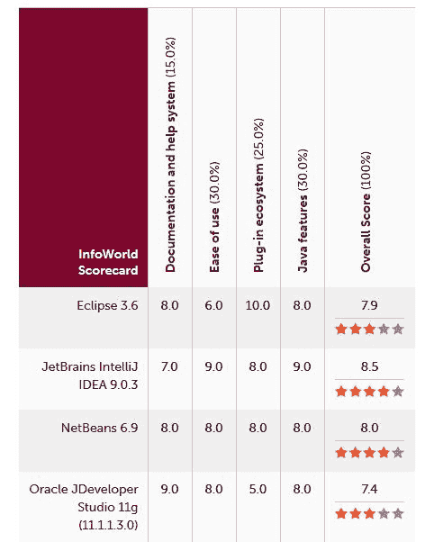**图 1：** 最佳的 Scala/Java 开发者 IDE

从前面的图示来看，你可能也有兴趣使用其他 IDE，如 NetBeans 和 JDeveloper。最终，选择权是开发者之间的一个永恒争论话题，这意味着最终的决定是你的。

# 安装并设置 Scala

如我们已经提到过，Scala 使用 JVM，因此请确保你的计算机上已经安装了 Java。如果没有，请参考下一节，介绍如何在 Ubuntu 上安装 Java。在本节中，首先我们将展示如何在 Ubuntu 上安装 Java 8。然后，我们将展示如何在 Windows、Mac OS 和 Linux 上安装 Scala。

# 安装 Java

为了简便起见，我们将展示如何在 Ubuntu 14.04 LTS 64 位机器上安装 Java 8。但对于 Windows 和 Mac OS，最好花些时间在 Google 上搜索相关安装方法。对于 Windows 用户的最低提示：请参阅这个链接了解详细信息：[`java.com/en/download/help/windows_manual_download.xml`](https://java.com/en/download/help/windows_manual_download.xml)[.](https://java.com/en/download/help/windows_manual_download.xml.)

现在，让我们看看如何通过一步步的命令和说明在 Ubuntu 上安装 Java 8。首先，检查 Java 是否已经安装：

```py
$ java -version 

```

如果返回`无法在以下软件包中找到程序 java`，则说明 Java 尚未安装。接下来，你需要执行以下命令来删除：

```py
 $ sudo apt-get install default-jre 

```

这将安装**Java 运行时环境**（**JRE**）。然而，如果你需要的是**Java 开发工具包**（**JDK**），通常这是编译 Java 应用程序时在 Apache Ant、Apache Maven、Eclipse 和 IntelliJ IDEA 中所需要的。

Oracle JDK 是官方 JDK，但现在 Oracle 已不再为 Ubuntu 提供默认安装。你仍然可以通过 apt-get 进行安装。要安装任何版本，首先执行以下命令：

```py
$ sudo apt-get install python-software-properties
$ sudo apt-get update
$ sudo add-apt-repository ppa:webupd8team/java
$ sudo apt-get update 

```

然后，根据你想安装的版本，执行以下命令之一：

```py
$ sudo apt-get install oracle-java8-installer

```

安装完成后，别忘了设置 Java 的环境变量。只需应用以下命令（为了简便起见，我们假设 Java 安装在`/usr/lib/jvm/java-8-oracle`）：

```py
$ echo "export JAVA_HOME=/usr/lib/jvm/java-8-oracle" >> ~/.bashrc  
$ echo "export PATH=$PATH:$JAVA_HOME/bin" >> ~/.bashrc
$ source ~/.bashrc 

```

现在，让我们来看一下`Java_HOME`，如下所示：

```py
$ echo $JAVA_HOME

```

你应该在终端上观察到以下结果：

```py
 /usr/lib/jvm/java-8-oracle

```

现在，让我们通过执行以下命令来检查 Java 是否已成功安装（你可能会看到最新版本！）：

```py
$ java -version

```

你将看到以下输出：

```py
java version "1.8.0_121"
Java(TM) SE Runtime Environment (build 1.8.0_121-b13)
Java HotSpot(TM) 64-Bit Server VM (build 25.121-b13, mixed mode)

```

太棒了！现在你已经在计算机上安装了 Java，一旦安装 Scala，你就可以开始编写 Scala 代码了。接下来的几节课将展示如何实现这一点。

# Windows

这一部分将重点介绍如何在 Windows 7 上安装 Scala，但最终，无论你当前运行的是哪个版本的 Windows，都没有关系：

1.  第一步是从官方网站下载 Scala 的压缩文件。你可以在 [`www.Scala-lang.org/download/all.html`](https://www.scala-lang.org/download/all.html) 找到该文件。在该页面的“其他资源”部分，你会找到可以用来安装 Scala 的归档文件列表。我们选择下载 Scala 2.11.8 的压缩文件，如下图所示：

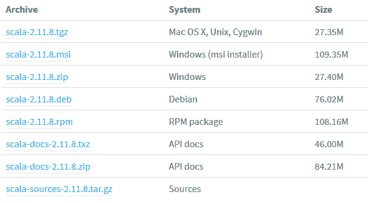**图 2：** Windows 上的 Scala 安装程序

1.  下载完成后，解压文件并将其放入你喜欢的文件夹中。你还可以将文件重命名为 Scala，以便于导航。最后，需要为 Scala 创建一个 `PATH` 变量，以便在你的操作系统中全局识别 Scala。为此，请导航到计算机 | 属性，如下图所示：

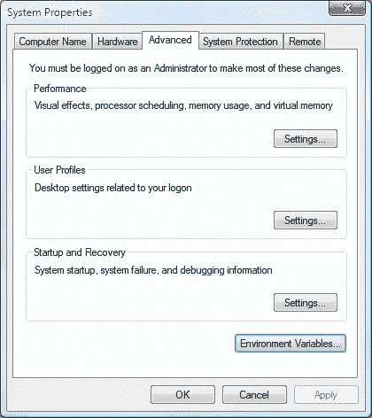**图 3：** Windows 上的环境变量标签

1.  从那里选择环境变量，并获取 Scala 的 `bin` 文件夹的路径；然后，将其添加到 `PATH` 环境变量中。应用更改并点击确定，如下截图所示：

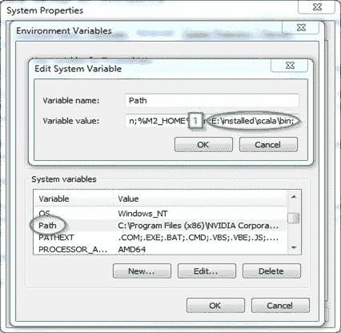**图 4：** 为 Scala 添加环境变量

1.  现在，你可以开始进行 Windows 安装了。打开命令提示符（CMD），然后输入 `scala`。如果安装成功，你应该会看到类似以下截图的输出：

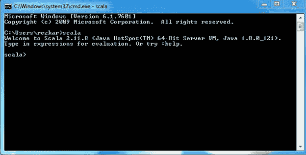**图 5：** 从“Scala shell”访问 Scala

# Mac OS

现在是时候在你的 Mac 上安装 Scala 了。你可以通过多种方式在 Mac 上安装 Scala，这里我们将介绍其中两种方法：

# 使用 Homebrew 安装器

1.  首先，检查你的系统是否已安装 Xcode，因为这一步骤需要它。你可以通过 Apple App Store 免费安装它。

1.  接下来，你需要通过在终端中运行以下命令来安装 `Homebrew`：

```py
$ /usr/bin/ruby -e "$(curl -fsSL https://raw.githubusercontent.com/Homebrew/install/master/install)"

```

注意：前面的命令有时会被 Homebrew 开发者修改。如果命令无法正常工作，请访问 Homebrew 网站查找最新的命令：[`brew.sh/`](http://brew.sh/)。

1.  现在，你准备好通过在终端中输入命令 `brew install scala` 来安装 Scala 了。

1.  最后，你只需在终端中输入 Scala（第二行），就可以开始使用 Scala，并在终端中看到以下内容：

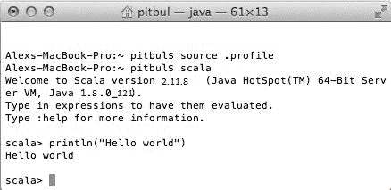**图 6：** macOS 上的 Scala shell

# 手动安装

在手动安装 Scala 之前，选择您喜欢的 Scala 版本，并从 [`www.Scala-lang.org/download/`](http://www.scala-lang.org/download/) 下载该版本的 `.tgz` 文件 `Scala-verion.tgz`。下载完您喜欢的 Scala 版本后，按以下方式提取：

```py
$ tar xvf scala-2.11.8.tgz

```

然后，按照如下方式将其移动到 `/usr/local/share`：

```py
$ sudo mv scala-2.11.8 /usr/local/share

```

现在，为了使安装永久生效，请执行以下命令：

```py
$ echo "export SCALA_HOME=/usr/local/share/scala-2.11.8" >> ~/.bash_profile
$ echo "export PATH=$PATH: $SCALA_HOME/bin" >> ~/.bash_profile 

```

就这样。现在，让我们看看如何在像 Ubuntu 这样的 Linux 发行版上执行此操作，在下一小节中讲解。

# Linux

在这一小节中，我们将向您展示在 Linux 的 Ubuntu 发行版上安装 Scala 的过程。开始之前，让我们检查 Scala 是否已正确安装。使用以下命令检查非常简单：

```py
$ scala -version

```

如果 Scala 已安装在您的系统上，您应该会在终端看到以下消息：

```py
Scala code runner version 2.11.8 -- Copyright 2002-2016, LAMP/EPFL

```

请注意，在编写本安装过程时，我们使用的是 Scala 的最新版本，即 2.11.8。如果您的系统上没有安装 Scala，请确保在进行下一步之前安装它；您可以从 Scala 官网 [`www.scala-lang.org/download/`](http://www.scala-lang.org/download/) 下载最新版本的 Scala（为更清晰的查看，参考 *图 2*）。为了方便起见，让我们下载 Scala 2.11.8，方法如下：

```py
$ cd Downloads/
$ wget https://downloads.lightbend.com/scala/2.11.8/scala-2.11.8.tgz

```

下载完成后，您应该能在下载文件夹中找到 Scala 的 tar 文件。

用户应首先通过以下命令进入 `Download` 目录：`$ cd /Downloads/`。请注意，下载文件夹的名称可能会根据系统所选语言而有所不同。

要从其位置提取 Scala `tar` 文件或更多内容，请输入以下命令。使用此命令，可以从终端提取 Scala tar 文件：

```py
$ tar -xvzf scala-2.11.8.tgz

```

现在，通过输入以下命令或手动操作，将 Scala 分发包移动到用户的视角（例如，`/usr/local/scala/share`）：

```py
 $ sudo mv scala-2.11.8 /usr/local/share/

```

使用以下命令转到您的主目录：

```py
$ cd ~

```

然后，使用以下命令设置 Scala home：

```py
$ echo "export SCALA_HOME=/usr/local/share/scala-2.11.8" >> ~/.bashrc 
$ echo "export PATH=$PATH:$SCALA_HOME/bin" >> ~/.bashrc

```

然后，通过使用以下命令，使会话的更改永久生效：

```py
$ source ~/.bashrc

```

安装完成后，您最好使用以下命令验证安装情况：

```py
$ scala -version

```

如果 Scala 已成功配置在您的系统上，您应该会在终端看到以下消息：

```py
Scala code runner version 2.11.8 -- Copyright 2002-2016, LAMP/EPFL

```

做得好！现在，让我们通过在终端输入 `scala` 命令进入 Scala shell，如下图所示：

**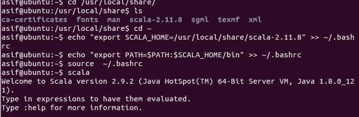****图 7:** Linux 上的 Scala shell（Ubuntu 发行版）

最后，您还可以使用 apt-get 命令安装 Scala，方法如下：

```py
$ sudo apt-get install scala

```

此命令将下载最新版本的 Scala（即 2.12.x）。然而，Spark 尚不支持 Scala 2.12（至少在我们编写本章时是这样）。因此，我们建议使用之前描述的手动安装方法。

# Scala：可扩展的语言

Scala 的名字来源于“可扩展语言”，因为 Scala 的概念能够很好地扩展到大规模的程序中。用其他语言编写的某些程序可能需要几十行代码，而在 Scala 中，你可以通过简洁有效的方式表达编程中的一般模式和概念。在本节中，我们将描述一些由 Odersky 为我们创建的 Scala 的激动人心的特性：

# Scala 是面向对象的

Scala 是面向对象语言的一个很好的例子。要为你的对象定义类型或行为，你需要使用类和特征的概念，这将在下一章中详细解释。Scala 不支持直接的多重继承，但要实现这种结构，你需要使用 Scala 扩展的**子类化**和**基于混入的组合**。这一点将在后续章节中讨论。

# Scala 是函数式的

函数式编程将函数视为一等公民。在 Scala 中，这通过语法糖和扩展特征的对象（如*Function2*）来实现，但这就是 Scala 中实现函数式编程的方式。此外，Scala 定义了一种简单易用的方式来定义**匿名** **函数**（没有名称的函数）。它还支持高阶函数，并允许嵌套函数**。**这些概念的语法将在后续章节中详细解释。

它还帮助你以不可变的方式编写代码，通过这种方式，你可以轻松地将其应用于带有同步和并发的并行编程。

# Scala 是静态类型的

与其他静态类型语言（如 Pascal、Rust 等）不同，Scala 并不要求你提供冗余的类型信息。在大多数情况下，你不需要指定类型。最重要的是，你甚至不需要重复指定它们。

如果一个编程语言在编译时已知变量的类型，则称其为静态类型语言：这也意味着，作为程序员，你必须指定每个变量的类型。例如，Scala、Java、C、OCaml、Haskell、C++等都是静态类型语言。另一方面，Perl、Ruby、Python 等是动态类型语言，它们的类型与变量或字段无关，而是与运行时的值相关。

Scala 的静态类型特性确保所有类型检查都由编译器完成。Scala 这一极其强大的特性有助于你在代码执行之前，在非常早的阶段就能发现和捕捉大多数细微的 bug 和错误。

# Scala 运行在 JVM 上

与 Java 一样，Scala 也编译成字节码，可以很容易地由 JVM 执行。这意味着 Scala 和 Java 的运行时平台是相同的，因为两者都会生成字节码作为编译输出。因此，你可以轻松地从 Java 切换到 Scala，并且也可以轻松地将两者集成，甚至在你的 Android 应用中使用 Scala 来增加函数式的风味；

请注意，虽然在 Scala 程序中使用 Java 代码非常容易，但反过来则非常困难，主要是因为 Scala 的语法糖。

就像 `javac` 命令将 Java 代码编译为字节码一样，Scala 也有 `scalas` 命令，它将 Scala 代码编译为字节码。

# Scala 可以执行 Java 代码

如前所述，Scala 也可以用来执行你的 Java 代码。它不仅可以安装你的 Java 代码；它还允许你在 Scala 环境中使用所有可用的 Java SDK 类，甚至是你自己定义的类、项目和包。

# Scala 可以进行并发和同步处理

其他语言中的一些程序可能需要数十行代码，而在 Scala 中，你能够以简洁有效的方式表达编程中的一般模式和概念。此外，它还帮助你以不可变的方式编写代码，进而轻松应用于并行性、同步和并发性。

# 针对 Java 程序员的 Scala

Scala 具有一组完全不同于 Java 的特性。在这一节中，我们将讨论其中的一些特性。本节内容将对那些来自 Java 背景或至少熟悉基本 Java 语法和语义的人有所帮助。

# 所有类型都是对象

如前所述，Scala 中的每个值都看起来像一个对象。这句话的意思是，一切看起来都像对象，但有些实际上并不是对象，你将在接下来的章节中看到对此的解释（例如，Scala 中引用类型和原始类型之间的区别依然存在，但它大部分被隐藏了）。举个例子，在 Scala 中，字符串会被隐式转换为字符集合，但在 Java 中则不是这样！

# 类型推导

如果你不熟悉这个术语，它其实就是编译时的类型推导。等等，这不是动态类型的意思吗？嗯，不是。注意我说的是类型推导；这与动态类型语言的做法截然不同，另外，它是在编译时完成的，而不是运行时。许多语言都内建了这一功能，但其实现因语言而异。刚开始时这可能会让人困惑，但通过代码示例会变得更清晰。让我们进入 Scala REPL 做些实验。

# Scala REPL

Scala REPL 是一个强大的功能，它使得在 Scala shell 中编写 Scala 代码更加直接和简洁。**REPL** 代表 **Read-Eval-Print-Loop**，也叫做 **交互式解释器**。这意味着它是一个用于：

1.  阅读你输入的表达式。

1.  使用 Scala 编译器评估步骤 1 中的表达式。

1.  输出步骤 2 中计算结果。

1.  等待（循环）你输入更多表达式。

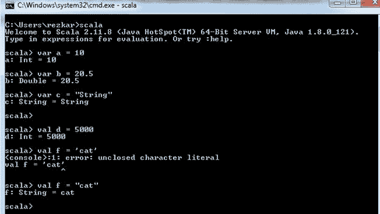**图 8：** Scala REPL 示例 1

从图中可以明显看出，没有魔法，变量会在编译时自动推断为它们认为最合适的类型。如果你再仔细看，当我尝试声明时：

```py
 i:Int = "hello"

```

然后，Scala shell 抛出一个错误，显示如下内容：

```py
<console>:11: error: type mismatch;
  found   : String("hello")
  required: Int
        val i:Int = "hello"
                    ^

```

根据奥德斯基的说法，*“将字符映射到 RichString 上的字符图应当返回一个 RichString，如 Scala REPL 中的以下交互所示”*。前述语句可以通过以下代码行进行验证：

```py
scala> "abc" map (x => (x + 1).toChar) 
res0: String = bcd

```

然而，如果有人将 `Char` 的方法应用于 `Int` 再应用于 `String`，会发生什么呢？在这种情况下，Scala 会进行转换，因为向量整数（也称为不可变集合）是 Scala 集合的特性，正如 *图 9* 所示。我们将在 第四章 中详细了解 Scala 集合 API，*集合 API*。

```py
"abc" map (x => (x + 1)) 
res1: scala.collection.immutable.IndexedSeq[Int] = Vector(98, 99, 100)

```

对象的静态方法和实例方法也可以使用。例如，如果你声明 `x` 为字符串 `hello`，然后尝试访问对象 `x` 的静态和实例方法，它们是可用的。在 Scala shell 中，输入 `x` 然后 `.` 和 `<tab>`，你就会看到可用的方法：

```py
scala> val x = "hello"
x: java.lang.String = hello
scala> x.re<tab>
reduce             reduceRight         replaceAll            reverse
reduceLeft         reduceRightOption   replaceAllLiterally   reverseIterator
reduceLeftOption   regionMatches       replaceFirst          reverseMap
reduceOption       replace             repr
scala> 

```

由于这一切都是通过反射动态完成的，即使是你刚刚定义的匿名类，也同样可以访问：

```py
scala> val x = new AnyRef{def helloWord = "Hello, world!"}
x: AnyRef{def helloWord: String} = $anon$1@58065f0c
 scala> x.helloWord
 def helloWord: String
 scala> x.helloWord
 warning: there was one feature warning; re-run with -feature for details
 res0: String = Hello, world!

```

前面两个示例可以在 Scala shell 中展示，方法如下：

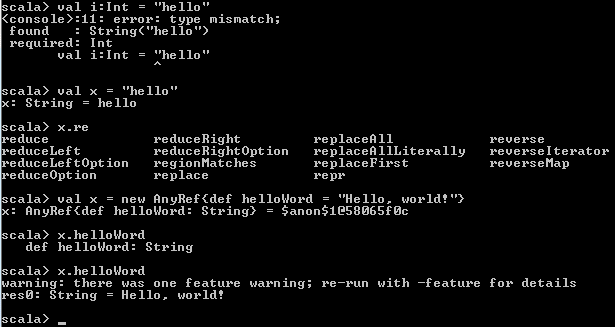**图 9：** Scala REPL 示例 2

“所以结果是，map 会根据传递的函数参数的返回类型不同，产生不同的类型！”

- 奥德斯基

# 嵌套函数

为什么你的编程语言需要支持嵌套函数？大多数时候，我们希望保持方法简洁，避免过大的函数。在 Java 中，典型的解决方案是将所有这些小函数定义在类级别，但任何其他方法都可以轻松引用和访问它们，即使它们是辅助方法。而在 Scala 中，情况不同，你可以在方法内部定义函数，从而防止外部访问这些函数：

```py
def sum(vector: List[Int]): Int = {
  // Nested helper method (won't be accessed from outside this function
  def helper(acc: Int, remaining: List[Int]): Int = remaining match {
    case Nil => acc
    case _   => helper(acc + remaining.head, remaining.tail)
  }
  // Call the nested method
  helper(0, vector)
}

```

我们并不指望你理解这些代码片段，它们展示了 Scala 和 Java 之间的区别。

# 导入语句

在 Java 中，你只能在代码文件的顶部导入包，即在 `package` 声明之后。但在 Scala 中，情况不同；你几乎可以在源文件中的任何位置编写导入语句（例如，你甚至可以在类或方法内部写导入语句）。你只需要注意导入语句的作用域，因为它继承了类的成员或方法中局部变量的作用域。Scala 中的 `_`（下划线）用于通配符导入，类似于 Java 中使用的 `*`（星号）：

```py
// Import everything from the package math 
import math._

```

你还可以使用 `{ }` 来表示来自同一父包的一组导入，只需一行代码。在 Java 中，你需要使用多行代码来实现：

```py
// Import math.sin and math.cos
import math.{sin, cos}

```

与 Java 不同，Scala 没有静态导入的概念。换句话说，Scala 中不存在静态的概念。然而，作为开发者，显然，你可以使用常规导入语句导入对象的一个或多个成员。前面的示例已经展示了这一点，我们从名为 math 的包对象中导入了方法 sin 和 cos。为了举例说明，从 Java 程序员的角度来看，前面的代码片段可以定义如下：

```py
import static java.lang.Math.sin;
import static java.lang.Math.cos;

```

Scala 另一个美妙之处在于，你可以重新命名导入的包。或者，你可以重新命名导入的包，以避免与具有相似成员的包发生类型冲突。以下语句在 Scala 中是有效的：

```py
// Import Scala.collection.mutable.Map as MutableMap 
import Scala.collection.mutable.{Map => MutableMap}

```

最后，你可能希望排除某个包的成员，以避免冲突或出于其他目的。为此，你可以使用通配符来实现：

```py
// Import everything from math, but hide cos 
import math.{cos => _, _}

```

# 运算符作为方法

值得一提的是，Scala 不支持运算符重载。你可能会认为，Scala 中根本没有运算符。

调用接受单个参数的方法的另一种语法是使用中缀语法。中缀语法就像你在 C++ 中做的那样，给你一种类似运算符重载的感觉。例如：

```py
val x = 45
val y = 75

```

在以下情况下，`+` 表示 `Int` 类中的一个方法。以下代码是非传统的调用方法语法：

```py
val add1 = x.+(y)

```

更正式地说，可以使用中缀语法来做到这一点，如下所示：

```py
val add2 = x + y

```

此外，你还可以利用中缀语法。然而，该方法只有一个参数，如下所示：

```py
val my_result = List(3, 6, 15, 34, 76) contains 5

```

使用中缀语法时有一个特殊情况。也就是说，如果方法名以 `:`（冒号）结尾，那么调用或调用将是右关联的。这意味着方法在右侧参数上被调用，左侧的表达式作为参数，而不是反过来。例如，以下在 Scala 中是有效的：

```py
val my_list = List(3, 6, 15, 34, 76)

```

前面的语句表示：`my_list.+:(5)` 而不是 `5.+:(my_list)`，更正式地说是：；

```py
val my_result = 5 +: my_list

```

现在，让我们看看前面的 Scala REPL 示例：

```py
scala> val my_list = 5 +: List(3, 6, 15, 34, 76)
 my_list: List[Int] = List(5, 3, 6, 15, 34, 76)
scala> val my_result2 = 5+:my_list
 my_result2: List[Int] = List(5, 5, 3, 6, 15, 34, 76)
scala> println(my_result2)
 List(5, 5, 3, 6, 15, 34, 76)
scala>

```

除了上述内容之外，这里的运算符其实就是方法，因此它们可以像方法一样简单地被重写。

# 方法和参数列表

在 Scala 中，一个方法可以有多个参数列表，甚至可以没有参数列表。而在 Java 中，一个方法总是有一个参数列表，且可以有零个或多个参数。例如，在 Scala 中，以下是有效的方法定义（用 `currie notation` 编写），其中一个方法有两个参数列表：

```py
def sum(x: Int)(y: Int) = x + y     

```

前面的该方法不能这样写：

```py
def sum(x: Int, y: Int) = x + y

```

一个方法，比如 `sum2`，可以没有参数列表，如下所示：

```py
def sum2 = sum(2) _

```

现在，你可以调用方法 `add2`，它返回一个接受一个参数的函数。然后，它用参数 `5` 调用该函数，如下所示：

```py
val result = add2(5)

```

# 方法内的方法

有时候，你可能希望通过避免过长和复杂的方法来使你的应用程序和代码模块化。Scala 提供了这个功能，帮助你避免方法变得过于庞大，从而将它们拆分成几个更小的方法。

另一方面，Java 只允许你在类级别定义方法。例如，假设你有以下方法定义：

```py
def main_method(xs: List[Int]): Int = {
  // This is the nested helper/auxiliary method
  def auxiliary_method(accu: Int, rest: List[Int]): Int = rest match {
    case Nil => accu
    case _   => auxiliary_method(accu + rest.head, rest.tail)
  }
}

```

现在，你可以按照如下方式调用嵌套的辅助方法：

```py
auxiliary_method(0, xs)

```

考虑到以上内容，下面是一个完整的有效代码段：

```py
def main_method(xs: List[Int]): Int = {
  // This is the nested helper/auxiliary method
  def auxiliary_method(accu: Int, rest: List[Int]): Int = rest match {
    case Nil => accu
    case _   => auxiliary_method(accu + rest.head, rest.tail)
  }
   auxiliary_method(0, xs)
}

```

# Scala 中的构造函数

关于 Scala 有一个令人惊讶的地方是，Scala 类的主体本身就是一个构造函数。；然而，Scala 是这样做的；事实上，它的方式更加显式。之后，该类的一个新实例会被创建并执行。此外，你可以在类声明行中指定构造函数的参数。

因此，构造函数的参数可以从该类中定义的所有方法中访问。例如，以下类和构造函数定义在 Scala 中是有效的：

```py
class Hello(name: String) {
  // Statement executed as part of the constructor
  println("New instance with name: " + name)
  // Method which accesses the constructor argument
  def sayHello = println("Hello, " + name + "!")
}

```

相应的 Java 类将是这样的：

```py
public class Hello {
  private final String name;
  public Hello(String name) {
    System.out.println("New instance with name: " + name);
    this.name = name;
  }
  public void sayHello() {
    System.out.println("Hello, " + name + "!");
  }
}

```

# 对象代替静态方法

如前所述，Scala 中没有 static。你不能进行静态导入，也不能将静态方法添加到类中。在 Scala 中，当你定义一个与类同名且在同一源文件中的对象时，这个对象被称为该类的伴生对象*。*你在这个伴生对象中定义的函数，就像是 Java 中类的静态方法：

```py
class HelloCity(CityName: String) {
  def sayHelloToCity = println("Hello, " + CityName + "!") 
}

```

这就是你如何为类 hello 定义伴生对象的方式：

```py
object HelloCity { 
  // Factory method 
  def apply(CityName: String) = new Hello(CityName) 
}

```

相应的 Java 类将是这样的：

```py
public class HelloCity { 
  private final String CityName; 
  public HelloCity(String CityName) { 
    this.CityName = CityName; 
  }
  public void sayHello() {
    System.out.println("Hello, " + CityName + "!"); 
  }
  public static HelloCity apply(String CityName) { 
    return new Hello(CityName); 
  } 
}

```

所以，在这个简单的类中，有很多冗余的内容，是不是？；在 Scala 中，apply 方法的处理方式不同，你可以找到一种特殊的快捷语法来调用它。这是调用该方法的常见方式：

```py
val hello1 = Hello.apply("Dublin")

```

这是与之前相等的快捷语法：

```py
 val hello2 = Hello("Dublin")

```

请注意，只有当你在代码中使用 apply 方法时，这才有效，因为 Scala 以不同的方式处理名为 apply 的方法。

# 特征

Scala 为你提供了一个很棒的功能，可以扩展和丰富类的行为。这些特征类似于接口，其中定义了函数原型或签名。因此，借助这些，你可以将来自不同特征的功能混合到类中，从而丰富了类的行为。那么，Scala 中的特征有什么好处呢？它们支持从这些特征中组成类，特征就像是构建块。像往常一样，让我们通过一个例子来看一下。下面是在 Java 中设置常规日志记录例程的方式：

请注意，尽管你可以混入任何数量的特征。此外，像 Java 一样，Scala 不支持多重继承。然而，在 Java 和 Scala 中，子类只能扩展一个父类。例如，在 Java 中：

```py
class SomeClass {
  //First, to have to log for a class, you must initialize it
  final static Logger log = LoggerFactory.getLogger(this.getClass());
  ...
  //For logging to be efficient, you must always check, if logging level for current message is enabled                
  //BAD, you will waste execution time if the log level is an error, fatal, etc.
  log.debug("Some debug message");
  ...
  //GOOD, it saves execution time for something more useful
  if (log.isDebugEnabled()) { log.debug("Some debug message"); }
  //BUT looks clunky, and it's tiresome to write this construct every time you want to log something.
}

```

如需更详细的讨论，请参考这个网址：[`stackoverflow.com/questions/963492/in-log4j-does-checking-isdebugenabled-before-logging-improve-performance/963681#963681`](https://stackoverflow.com/questions/963492/in-log4j-does-checking-isdebugenabled-before-logging-improve-performance/963681#963681)。

然而，特质有所不同。始终检查日志级别是否启用是非常麻烦的。如果你能一次性写好这个例程，并且可以随时在任何类中重用，那该有多好。Scala 中的特质使这一切成为可能。例如：

```py
trait Logging {
  lazy val log = LoggerFactory.getLogger(this.getClass.getName)     
  //Let's start with info level...
  ...
  //Debug level here...
  def debug() {
    if (log.isDebugEnabled) log.info(s"${msg}")
  }
  def debug(msg: => Any, throwable: => Throwable) {
    if (log.isDebugEnabled) log.info(s"${msg}", throwable)
  }
  ...
  //Repeat it for all log levels you want to use
}

```

如果你查看上面的代码，你会看到一个以 `s` 开头的字符串示例。这样，Scala 提供了一种机制，通过你的数据来创建字符串，这个机制叫做**字符串插值**。

字符串插值允许你将变量引用直接嵌入到处理过的字符串字面量中。例如：

`; ; ;`scala> val name = "John Breslin"`

`; ;scala> println(s"Hello, $name") ; // Hello, John Breslin`。

现在，我们可以用更传统的方式将高效的日志记录例程作为可重用的模块。为了在任何类中启用日志记录，我们只需要将 `Logging` 特质混入类中！太棒了！现在，只需这么做就能为你的类添加日志功能：

```py
class SomeClass extends Logging {
  ...
  //With logging trait, no need for declaring a logger manually for every class
  //And now, your logging routine is either efficient and doesn't litter the code!

  log.debug("Some debug message")
  ...
}

```

甚至可以混合多个特质。例如，对于前面的 `trait`（即 `Logging`），你可以按以下顺序继续扩展：

```py
trait Logging  {
  override def toString = "Logging "
}
class A extends Logging  {
  override def toString = "A->" + super.toString
}
trait B extends Logging  {
  override def toString = "B->" + super.toString
}
trait C extends Logging  {
  override def toString = "C->" + super.toString
}
class D extends A with B with C {
  override def toString = "D->" + super.toString
}

```

然而，需要注意的是，Scala 类可以一次性扩展多个特质，但 JVM 类只能扩展一个父类。

现在，要调用上述特质和类，只需在 Scala REPL 中使用 `new D()`，如下面的图示所示：

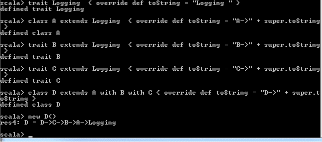**图 10**：混合多个特质

到目前为止，本章内容进展顺利。接下来，我们将进入新的一部分，讨论一些初学者希望深入了解 Scala 编程领域的主题。

# Scala 入门

在这一部分，你会发现我们假设你对任何以前的编程语言有基本的了解。如果 Scala 是你进入编程世界的第一步，那么你会发现网上有大量的材料，甚至有针对初学者的课程来解释 Scala。如前所述，网上有很多教程、视频和课程。

Coursera 上有一个专门的课程系列，包含这门课程：[`www.coursera.org/specializations/scala`](https://www.coursera.org/specializations/scala)。这门课程由 Scala 的创建者马丁·奥德斯基（Martin Odersky）教授，采用一种较为学术的方式来教授函数式编程的基础。你将在通过解决编程作业的过程中学到很多 Scala 的知识。此外，这个课程系列还包括关于 Apache Spark 的课程。此外，Kojo（[`www.kogics.net/sf:kojo`](http://www.kogics.net/sf:kojo)）是一个交互式学习环境，使用 Scala 编程来探索和玩转数学、艺术、音乐、动画和游戏。

# 你的第一行代码

作为第一个示例，我们将使用一个非常常见的`Hello, world!`程序，向你展示如何在不需要了解太多的情况下使用 Scala 及其工具。打开你喜欢的编辑器（本示例在 Windows 7 上运行，但在 Ubuntu 或 macOS 上也可以类似地运行），例如 Notepad++，然后输入以下代码行：

```py
object HelloWorld {
  def main(args: Array[String]){ 
    println("Hello, world!")  
  } 
}

```

现在，将代码保存为一个名字，例如`HelloWorld.scala`，如下图所示：

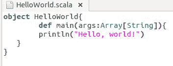**图 11：**使用 Notepad++保存你的第一个 Scala 源代码

让我们按如下方式编译源文件：

```py
C:\>scalac HelloWorld.scala
 C:\>scala HelloWorld
 Hello, world!
 C:\>

```

# 我是 Hello world 程序，请好好解释我！

这个程序应该对任何有一些编程经验的人来说都很熟悉。它有一个主方法，打印字符串`Hello, world!`到你的控制台。接下来，为了查看我们是如何定义`main`函数的，我们使用了`def main()`这种奇怪的语法来定义它。`def`是 Scala 中的关键字，用于声明/定义方法，接下来我们将在下一章讲解更多关于方法和不同写法的内容。所以，我们为这个方法提供了一个`Array[String]`作为参数，它是一个字符串数组，可以用于程序的初始配置，并且可以省略。然后，我们使用了常见的`println()`方法，它接收一个字符串（或格式化字符串）并将其打印到控制台。一个简单的 Hello world 程序引出了许多学习话题，特别是三个：

● ; ; ;方法（将在后续章节中讲解）

● ; ; ;对象和类（将在后面的章节中讲解）

● ; ; ;类型推断——这就是 Scala 为什么是静态类型语言的原因——已在前面解释过。

# 交互式运行 Scala！

`scala`命令为你启动交互式 Shell，在这里你可以交互式地解释 Scala 表达式：

```py
> scala
Welcome to Scala 2.11.8 (Java HotSpot(TM) 64-Bit Server VM, Java 1.8.0_121).
Type in expressions for evaluation. Or try :help.
scala>
scala> object HelloWorld {
 |   def main(args: Array[String]){
 |     println("Hello, world!")
 |   }
 | }
defined object HelloWorld
scala> HelloWorld.main(Array())
Hello, world!
scala>

```

快捷键`:q`代表内部 Shell 命令`:quit`，用于退出解释器。

# 编译它！

`scalac`命令类似于`javac`命令，编译一个或多个 Scala 源文件并生成字节码输出，然后可以在任何 Java 虚拟机上执行。要编译你的 Hello world 对象，请使用以下命令：

```py
> scalac HelloWorld.scala

```

默认情况下，`scalac`会将类文件生成到当前工作目录。你可以使用`-d`选项指定一个不同的输出目录：

```py
> scalac -d classes HelloWorld.scala

```

然而，请注意，在执行此命令之前，必须创建名为`classes`的目录。

# 使用 Scala 命令执行它

`scala`命令执行由解释器生成的字节码：

```py
$ scala HelloWorld

```

Scala 允许我们指定命令选项，比如`-classpath`（别名`-cp`）选项：

```py
$ scala -cp classes HelloWorld

```

在使用`scala`命令执行你的源文件之前，你应该有一个主方法作为应用程序的入口点。否则，你应该有一个扩展`Trait Scala.App`的`Object`，然后这个对象中的所有代码将由命令执行。以下是相同的`Hello, world!`示例，但使用了`App`特质：

```py
#!/usr/bin/env Scala 
object HelloWorld extends App {  
  println("Hello, world!") 
}
HelloWorld.main(args)

```

前面的脚本可以直接从命令 Shell 中运行：

```py
./script.sh

```

注意：我们假设此处文件 `script.sh` 已具有执行权限；

```py
$ sudo chmod +x script.sh

```

然后，`scala` 命令的搜索路径在 `$PATH` 环境变量中指定。

# 摘要

本章中，您已经学习了 Scala 编程语言的基础知识、特性以及可用的编辑器。我们还简要讨论了 Scala 及其语法。我们展示了为 Scala 编程初学者提供的安装和设置指南。在本章后期，您学习了如何编写、编译和执行示例 Scala 代码。此外，针对来自 Java 背景的读者，我们还进行了 Scala 和 Java 的比较讨论。下面是 Scala 与 Python 的简短对比：

Scala 是静态类型的，而 Python 是动态类型的。Scala（大多数情况下）采用函数式编程范式，而 Python 则没有。Python 有独特的语法，缺少大部分括号，而 Scala（几乎总是）要求使用括号。在 Scala 中，几乎所有的东西都是表达式，而 Python 并非如此。然而，也有一些看似复杂的优点。类型的复杂性大多是可选的。其次，根据 [`stackoverflow.com/questions/1065720/what-is-the-purpose-of-scala-programming-language/5828684#5828684`](https://stackoverflow.com/questions/1065720/what-is-the-purpose-of-scala-programming-language/5828684#5828684) 提供的文档；*Scala 编译器就像是免费的测试和文档，因为环路复杂度和代码行数不断增加。只要正确实现，Scala 就能在一致且连贯的 API 后面执行那些几乎不可能完成的操作。*

在下一章中，我们将讨论如何通过了解 Scala 实现面向对象范式的基本知识，从而提升我们在构建模块化软件系统方面的经验。
