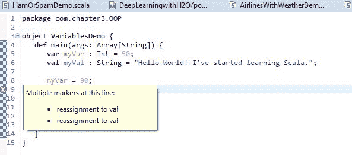
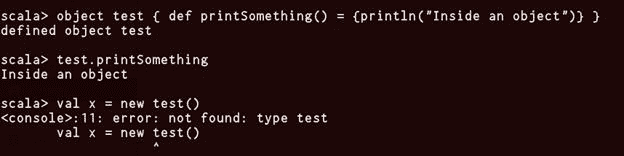
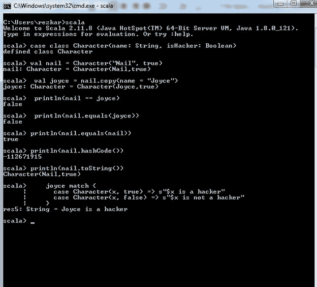
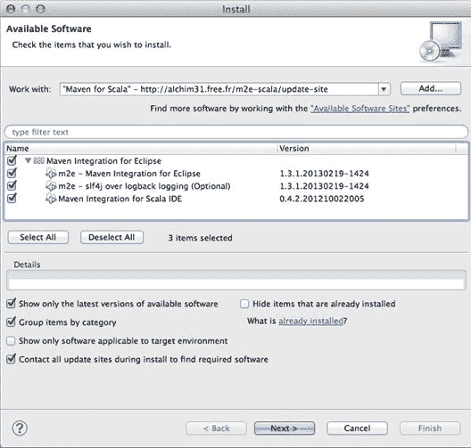
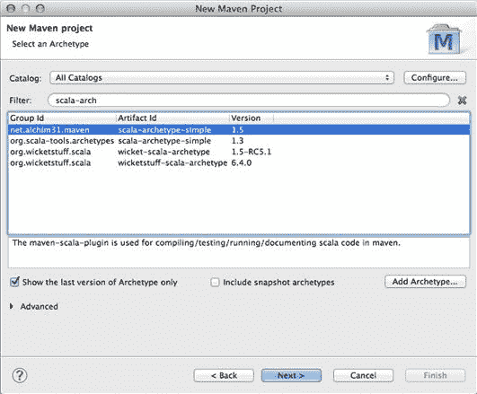
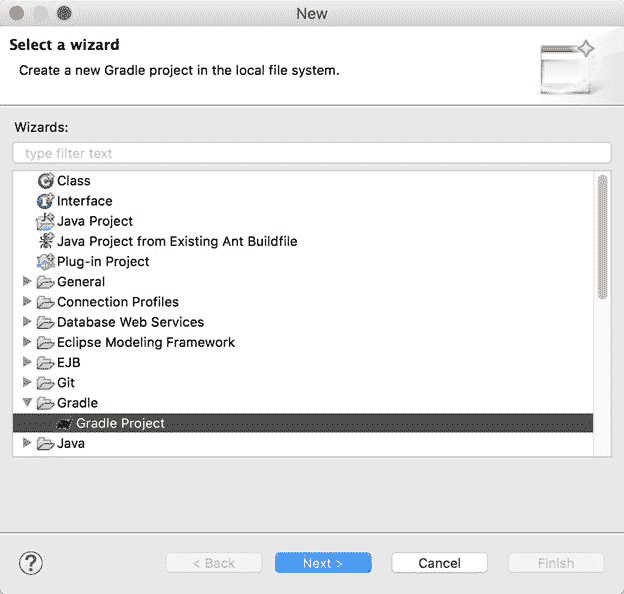
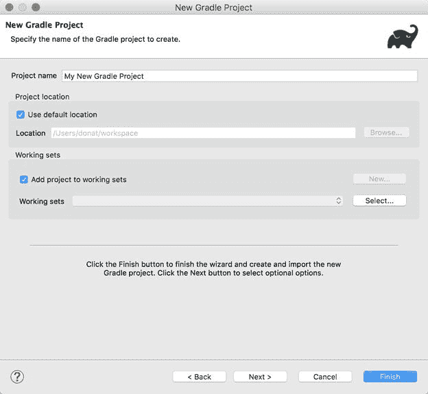
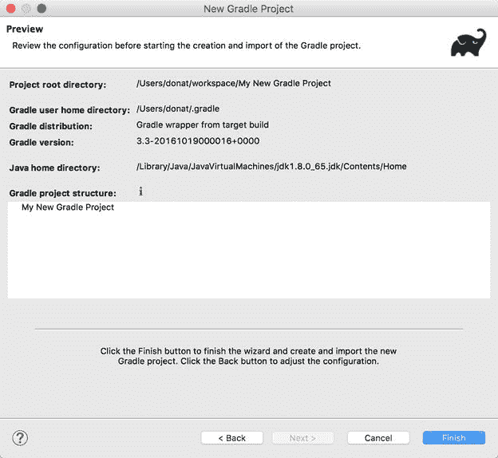
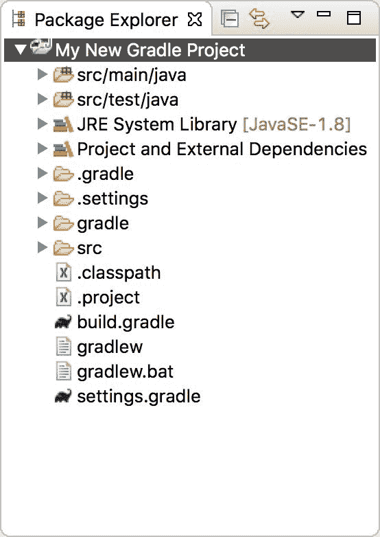

# 第二章：Scala 的面向对象

*"面向对象模型使得通过积累来构建程序变得容易。在实践中，这经常意味着它提供了一种结构化的方式来编写意大利面代码。"*

- 保罗·格雷厄姆

在上一章中，我们看到如何开始使用 Scala 进行编程。如果你正在编写我们在前一章中遵循的过程式程序，你可以通过创建过程或函数来强化代码的可重用性。然而，随着工作的继续，你的程序变得越来越长、越来越大、越来越复杂。在某一点上，你甚至可能没有其他更简单的方法在生产之前组织整个代码。

相反，**面向对象编程**（**OOP**）范式提供了一个全新的抽象层次。通过定义类似属性和方法的 OOP 实体，你可以模块化你的代码。甚至可以通过继承或接口定义这些实体之间的关系。你还可以将功能相似的类分组在一起，例如辅助类；从而使你的项目突然感觉更加宽敞和可扩展。总之，OOP 语言的最大优势在于可发现性、模块化和可扩展性。

考虑到前述面向对象编程语言的特点，在本章中，我们将讨论 Scala 中的基本面向对象特性。简而言之，本章将涵盖以下主题：

+   Scala 中的变量

+   Scala 中的方法、类和对象

+   包和包对象

+   特征和特征线性化

+   Java 互操作性

然后，我们将讨论模式匹配，这是来自函数式编程概念的一个特性。此外，我们还将讨论 Scala 中的一些内置概念，如隐式和泛型。最后，我们将讨论一些广泛使用的构建工具，这些工具用于将我们的 Scala 应用程序构建为 JAR 文件。

# Scala 中的变量

在深入讨论面向对象编程（**OOP**）特性之前，首先我们需要了解 Scala 中不同类型的变量和数据类型的细节。在 Scala 中声明变量，你需要使用 `var` 或 `val` 关键字。Scala 中声明变量的形式语法如下：

```py
val or var VariableName : DataType = Initial_Value

```

例如，让我们看看如何声明两个显式指定数据类型的变量：

```py
var myVar : Int = 50
val myVal : String = "Hello World! I've started learning Scala."

```

你甚至可以只声明一个不指定 `DataType` 的变量。例如，让我们看看如何使用 `val` 或 `var` 来声明变量，如下所示：

```py
var myVar = 50
val myVal = "Hello World! I've started learning Scala."

```

Scala 中有两种类型的变量：可变变量和不可变变量，可以如下定义：

+   **可变变量：** 可以稍后更改其值的变量

+   **不可变变量：** 一旦设置了值就不能更改其值的变量

一般来说，为了声明一个可变变量，会使用 `var` 关键字。另一方面，为了指定一个不可变变量，会使用 `val` 关键字。为了展示使用可变和不可变变量的示例，让我们考虑以下代码段：

```py
package com.chapter3.OOP 
object VariablesDemo {
  def main(args: Array[String]) {
    var myVar : Int = 50 
    valmyVal : String = "Hello World! I've started learning Scala."  
    myVar = 90  
    myVal = "Hello world!"   
    println(myVar) 
    println(myVal) 
  } 
}

```

前面的代码在 `myVar = 90` 之前可以正常工作，因为 **`myVar`** 是一个可变变量。然而，如果你尝试更改不可变变量（即 `myVal`）的值，如前所示，IDE 会显示编译错误，提示“不能重新赋值给 `val`”，如下所示：

**图 1：** 不可变变量的重新赋值在 Scala 变量作用域中是不允许的

不用担心看到前面的代码中包含对象和方法！我们将在本章稍后讨论类、方法和对象，届时一切都会变得更加清晰。

在 Scala 中的变量，我们可以有三种不同的作用域，这取决于你声明它们的位置：

+   **字段：** 这些是属于 Scala 代码中类的实例的变量。因此，字段可以从对象的每个方法内部访问。然而，取决于访问修饰符，字段也可以被其他类的实例访问。

如前所述，对象字段可以是可变的，也可以是不可变的（基于声明类型，使用 `var` 或 `val`）。但它们不能同时是两者。

+   **方法参数：** 这些是变量，当方法被调用时，可以用来传递值到方法内部。方法参数只能在方法内部访问。然而，传递的对象可能从外部被访问。

需要注意的是，方法的参数/参数总是不可变的，无论指定了什么关键字。

+   **局部变量：** 这些变量是在方法内部声明的，只能在方法内部访问。然而，调用代码可以访问返回值。

# 引用与值的不可变性

根据前面的部分，`val` 用于声明不可变变量，那么我们能否更改这些变量的值？这是否与 Java 中的 `final` 关键字类似？为了帮助我们更好地理解这一点，我们将使用以下代码示例：

```py
scala> var testVar = 10
testVar: Int = 10

scala> testVar = testVar + 10
testVar: Int = 20

scala> val testVal = 6
testVal: Int = 6

scala> testVal = testVal + 10
<console>:12: error: reassignment to val
 testVal = testVal + 10
 ^
scala>

```

如果你运行前面的代码，会发现编译时出现错误，提示你正在尝试重新赋值给 `val` 变量。通常，可变变量带来性能上的优势。原因是，这更接近计算机的行为方式，并且引入不可变值会强制计算机每次需要对特定实例进行更改（无论多么微小）时，都创建一个新的对象实例。

# Scala 中的数据类型

如前所述，Scala 是一种 JVM 语言，因此与 Java 有很多相似之处。这些相似性之一就是数据类型；Scala 与 Java 共享相同的数据类型。简而言之，Scala 具有与 Java 相同的数据类型，内存占用和精度相同。如在第一章《Scala 简介》中提到，*Scala 中几乎到处都有对象*，所有数据类型都是对象，你可以在它们中调用方法，如下所示：

| **序号** | **数据类型及描述** |
| --- | --- |
| 1 | **Byte**：8 位有符号值，范围从 -128 到 127 |
| 2 | **Short**：16 位有符号值，范围从 -32768 到 32767 |
| 3 | **Int**：32 位有符号值，范围从 -2147483648 到 2147483647 |
| 4 | **Long**：64 位有符号值，范围从 -9223372036854775808 到 9223372036854775807 |
| 5 | **Float**：32 位 IEEE 754 单精度浮点数 |
| 6 | **Double**：64 位 IEEE 754 双精度浮点数 |
| 7 | **Char**：16 位无符号 Unicode 字符，范围从 U+0000 到 U+FFFF |
| 8 | **String**：一串字符 |
| 9 | **Boolean**：要么是字面值 `true`，要么是字面值 `false` |
| 10 | **Unit**：对应于没有值 |
| 11 | **Null**：空引用 |
| 12 | **Nothing**：每个其他类型的子类型；不包括任何值 |
| 13 | **Any**：任何类型的超类型；任何对象的类型都是 *Any* |
| 14 | **AnyRef**：任何引用类型的超类型 |

**表格 1：** Scala 数据类型、描述和范围

上面表格中列出的所有数据类型都是对象。然而，请注意，Scala 中没有像 Java 那样的原始数据类型。这意味着你可以在 `Int`、`Long` 等类型上调用方法。

```py
val myVal = 20
//use println method to print it to the console; you will also notice that if will be inferred as Int
println(myVal + 10)
val myVal = 40
println(myVal * "test")

```

现在，你可以开始玩这些变量了。让我们来看看如何初始化一个变量并进行类型注解。

# 变量初始化

在 Scala 中，初始化变量后再使用它是一种良好的实践。然而，需要注意的是，未初始化的变量不一定是 `null`（考虑像 `Int`、`Long`、`Double`、`Char` 等类型），而已初始化的变量也不一定是非 `null`（例如，`val s: String = null`）。实际原因是：

+   在 Scala 中，类型是从赋予的值中推断出来的。这意味着必须赋值，编译器才能推断出类型（如果代码是 `val a`，编译器无法推断出类型，因为没有赋值，编译器无法初始化它）。

+   在 Scala 中，大多数时候你会使用 `val`。由于这些是不可变的，因此你不能先声明再初始化它们。

尽管 Scala 语言要求你在使用实例变量之前初始化它，但 Scala 并不会为你的变量提供默认值。相反，你必须手动设置它的值，可以使用通配符下划线 `_`，它类似于默认值，如下所示：

```py
var name:String = _

```

与其使用像 `val1`、`val2` 这样的名称，你可以定义自己的名称：

```py
scala> val result = 6 * 5 + 8
result: Int = 38

```

你可以在后续的表达式中使用这些名称，如下所示：

```py
scala> 0.5 * result
res0: Double = 19.0

```

# 类型注解

如果你使用 `val` 或 `var` 关键字声明一个变量，它的数据类型会根据你赋给这个变量的值自动推断。你也可以在声明时显式地指定变量的数据类型。

```py
val myVal : Integer = 10

```

现在，让我们来看看在使用 Scala 中的变量和数据类型时，需要注意的其他方面。我们将看到如何使用类型说明和 `lazy` 变量。

# 类型说明

类型赋值用于告诉编译器你期望表达式的类型是哪些，从所有可能的有效类型中选择。因此，类型是有效的，前提是它符合现有的约束条件，比如变异性和类型声明，并且它要么是表达式所适用类型的某种类型，要么在作用域内有适用的转换。所以，从技术上讲，`java.lang.String` 扩展自 `java.lang.Object`，因此任何 `String` 也是一个 `Object`。例如：

```py
scala> val s = "Ahmed Shadman" 
s: String = Ahmed Shadman

scala> val p = s:Object 
p: Object = Ahmed Shadman 

scala>

```

# 延迟值（Lazy val）

`lazy val` 的主要特征是绑定的表达式不会立即计算，而是在首次访问时计算。这就是 `val` 和 `lazy val` 之间的主要区别。当第一次访问发生时，表达式会被计算，结果会绑定到标识符 `lazy val` 上。之后的访问不会再次计算，而是立即返回已存储的结果。我们来看一个有趣的例子：

```py
scala> lazy val num = 1 / 0
num: Int = <lazy>

```

如果你查看 Scala REPL 中的前面的代码，你会注意到即使你把整数除以 0，代码也能运行得很好，不会抛出任何错误！让我们看一个更好的例子：

```py
scala> val x = {println("x"); 20}
x
x: Int = 20

scala> x
res1: Int = 20
scala>

```

这段代码能正常工作，之后你可以在需要时访问变量 `x` 的值。这些只是使用 `lazy val` 概念的一些例子。有兴趣的读者可以访问这个页面以了解更多详细信息：[`blog.codecentric.de/en/2016/02/lazy-vals-scala-look-hood/.`](https://blog.codecentric.de/en/2016/02/lazy-vals-scala-look-hood/)

# Scala 中的方法、类和对象

在上一节中，我们学习了如何处理 Scala 变量、不同的数据类型及其可变性和不可变性，以及它们的使用范围。然而，在本节中，为了更好地理解面向对象编程（OOP）的概念，我们将涉及方法、对象和类。Scala 的这三个特性将帮助我们理解其面向对象的本质及其功能。

# Scala 中的方法

在这一部分中，我们将讨论 Scala 中的方法。当你深入了解 Scala 时，你会发现有很多种方式可以定义方法。我们将通过以下几种方式来演示它们：

```py
def min(x1:Int, x2:Int) : Int = {
  if (x1 < x2) x1 else x2
}

```

前面声明的方法接受两个变量并返回其中的最小值。在 Scala 中，所有方法都必须以 `def` 关键字开头，接着是该方法的名称。你可以选择不向方法传递任何参数，甚至可以选择不返回任何内容。你可能会想知道最小值是如何返回的，但我们稍后会讲到这个问题。此外，在 Scala 中，你可以在不使用大括号的情况下定义方法：

```py
def min(x1:Int, x2:Int):Int= if (x1 < x2) x1 else x2

```

如果你的方法体很小，你可以像这样声明方法。否则，建议使用大括号以避免混淆。如前所述，如果需要，你可以选择不向方法传递任何参数：

```py
def getPiValue(): Double = 3.14159

```

带有或不带括号的方法表明是否有副作用。此外，它与统一访问原则有着深刻的联系。因此，你也可以像下面这样避免使用大括号：

```py
def getValueOfPi : Double = 3.14159

```

也有一些方法通过明确指定返回类型来返回值。例如：

```py
def sayHello(person :String) = "Hello " + person + "!"

```

应该提到，前面的代码之所以能够正常工作，是因为 Scala 编译器能够推断返回类型，就像对待值和变量一样。

这将返回 `Hello` 和传入的姓名拼接在一起。例如：

```py
scala> def sayHello(person :String) = "Hello " + person + "!"
sayHello: (person: String)String

scala> sayHello("Asif")
res2: String = Hello Asif!

scala>

```

# Scala 中的返回值

在学习 Scala 方法如何返回值之前，让我们回顾一下 Scala 方法的结构：

```py
def functionName ([list of parameters]) : [return type] = {
  function body
  value_to_return
}

```

对于前面的语法，返回类型可以是任何有效的 Scala 数据类型，参数列表将是以逗号分隔的变量列表，参数和返回类型是可选的。现在，让我们定义一个方法，添加两个正整数并返回结果，这个结果也是一个整数值：

```py
scala> def addInt( x:Int, y:Int ) : Int = {
 |       var sum:Int = 0
 |       sum = x + y
 |       sum
 |    }
addInt: (x: Int, y: Int)Int

scala> addInt(20, 34)
res3: Int = 54

scala>

```

如果现在从 `main()` 方法调用前面的方法，并传入实际的值，比如 `addInt(10, 30)`，方法将返回一个整数值的和，结果是 `40`。由于使用 `return` 关键字是可选的，Scala 编译器设计成当没有 `return` 关键字时，最后一个赋值会作为返回值。在这种情况下，更大的值将被返回：

```py
scala> def max(x1 : Int , x2: Int)  = {
 |     if (x1>x2) x1 else x2
 | }
max: (x1: Int, x2: Int)Int

scala> max(12, 27)
res4: Int = 27

scala>

```

做得好！我们已经看到了如何使用变量以及如何在 Scala REPL 中声明方法。现在，接下来我们将看到如何将它们封装在 Scala 方法和类中。下一部分将讨论 Scala 对象。

# Scala 中的类

类被视为蓝图，然后你实例化这个类以创建一个实际在内存中表示的对象。它们可以包含方法、值、变量、类型、对象、特征和类，这些统称为**成员**。让我们通过以下示例来演示：

```py
class Animal {
  var animalName = null
  var animalAge = -1
  def setAnimalName (animalName:String)  {
    this.animalName = animalName
  }
  def setAnaimalAge (animalAge:Int) {
    this.animalAge = animalAge
  }
  def getAnimalName () : String = {
    animalName
  }
  def getAnimalAge () : Int = {
    animalAge
  }
}

```

我们有两个变量`animalName`和`animalAge`，以及它们的 setter 和 getter。现在，如何使用它们来实现我们的目标呢？这就涉及到 Scala 对象的使用。接下来我们将讨论 Scala 对象，然后再回到我们的下一个讨论。

# Scala 中的对象

Scala 中的 **对象** 的含义与传统面向对象编程中的对象略有不同，这一点需要说明。特别地，在面向对象编程中，对象是类的实例，而在 Scala 中，声明为对象的任何东西都不能被实例化！`object` 是 Scala 中的一个关键字。声明 Scala 对象的基本语法如下：

```py
object <identifier> [extends <identifier>] [{ fields, methods, and classes }]

```

为了理解前面的语法，让我们回顾一下 hello world 程序：

```py
object HelloWorld {
  def main(args : Array[String]){
    println("Hello world!")
  }
}

```

这个 hello world 示例与 Java 的类似。唯一的巨大区别是主方法不在类内部，而是放在对象内部。在 Scala 中，`object` 关键字可以表示两种不同的含义：

+   正如在面向对象编程中，一个对象可以表示一个类的实例

+   一个表示非常不同类型实例对象的关键字称为**单例模式**

# 单例和伴生对象

在这一小节中，我们将看到 Scala 中的单例对象与 Java 之间的对比分析。单例模式的核心思想是确保一个类只有一个实例可以存在。以下是 Java 中单例模式的一个示例：

```py
public class DBConnection {
  private static DBConnection dbInstance;
  private DBConnection() {
  }
  public static DBConnection getInstance() {
    if (dbInstance == null) {
      dbInstance = new DBConnection();
    }
    return dbInstance;
  }
}

```

Scala 对象做了类似的事情，且由编译器很好地处理。由于只有一个实例，因此这里不能进行对象创建：

**图 3：** Scala 中的对象创建

# 伴生对象

当一个`singleton object`与类同名时，它被称为`companion object`。伴生对象必须在与类相同的源文件中定义。让我们通过以下示例来演示这一点：

```py
class Animal {
  var animalName:String  = "notset"
  def setAnimalName(name: String) {
    animalName = name
  }
  def getAnimalName: String = {
    animalName
  }
  def isAnimalNameSet: Boolean = {
    if (getAnimalName == "notset") false else true
  }
}

```

以下是通过伴生对象调用方法的方式（最好使用相同的名称——即`Animal`）：

```py
object Animal{
  def main(args: Array[String]): Unit= {
    val obj: Animal = new Animal
    var flag:Boolean  = false        
    obj.setAnimalName("dog")
    flag = obj.isAnimalNameSet
    println(flag)  // prints true 

    obj.setAnimalName("notset")
    flag = obj.isAnimalNameSet
    println(flag)   // prints false     
  }
}

```

一个 Java 等效的实现会非常相似，如下所示：

```py
public class Animal {
  public String animalName = "null";
  public void setAnimalName(String animalName) {
    this.animalName = animalName;
  }
  public String getAnimalName() {
    return animalName;
  }
  public boolean isAnimalNameSet() {
    if (getAnimalName() == "notset") {
      return false;
    } else {
      return true;
    }
  }

  public static void main(String[] args) {
    Animal obj = new Animal();
    boolean flag = false;         
    obj.setAnimalName("dog");
    flag = obj.isAnimalNameSet();
    System.out.println(flag);        

    obj.setAnimalName("notset");
    flag = obj.isAnimalNameSet();
    System.out.println(flag);
  }
}

```

干得好！到目前为止，我们已经了解了如何使用 Scala 的对象和类。然而，更重要的是如何使用方法来实现和解决数据分析问题。因此，接下来我们将简要地了解如何使用 Scala 方法。

```py
object RunAnimalExample {
  val animalObj = new Animal
  println(animalObj.getAnimalName) //prints the initial name
  println(animalObj.getAnimalAge) //prints the initial age
  // Now try setting the values of animal name and age as follows:   
  animalObj.setAnimalName("dog") //setting animal name
  animalObj.setAnaimalAge(10) //seting animal age
  println(animalObj.getAnimalName) //prints the new name of the animal 
  println(animalObj.getAnimalAge) //Prints the new age of the animal
}

```

输出如下：

```py
notset 
-1 
dog 
10

```

现在，让我们在下一节中简要概述一下 Scala 类的可访问性和可见性。

# 比较与对比：val 和 final

就像 Java 一样，`final`关键字在 Scala 中也存在，其作用与`val`关键字有些相似。为了区分 Scala 中的`val`和`final`关键字，让我们声明一个简单的动物类，如下所示：

```py
class Animal {
  val age = 2  
}

```

如第一章《Scala 简介》中所述，在列出 Scala 特性时，Scala 可以重载在 Java 中不存在的变量：

```py
class Cat extends Animal{
  override val age = 3
  def printAge ={
    println(age)
  }
}

```

现在，在深入讨论之前，有必要快速讨论一下`extends`关键字。详细信息请参考下面的信息框。

使用 Scala 时，类是可扩展的。通过`extends`关键字的子类机制，可以通过继承给定的*超类*的所有成员，并定义额外的类成员，从而使类变得*特化*。让我们看一个示例，如下所示：

`class Coordinate(xc: Int, yc: Int) {`

`val x: Int = xc`

`val y: Int = yc`

`def move(dx: Int, dy: Int): Coordinate = new Coordinate(x + dx, y + dy)`

`}`

`class ColorCoordinate(u: Int, v: Int, c: String) extends Coordinate(u, v) {`

`val color: String = c`

`def compareWith(pt: ColorCoordinate): Boolean = (pt.x == x) && (pt.y == y) && (pt.color == color)`

`override def move(dx: Int, dy: Int): ColorCoordinate = new ColorCoordinate(x + dy, y + dy, color)`

`}`

然而，如果我们在 `Animal` 类中将年龄变量声明为 `final`，那么 `Cat` 类将无法重写它，会产生以下错误。对于这个 `Animal` 示例，你应该学会何时使用 `final` 关键字。让我们看一个例子：

```py
scala> class Animal {
 |     final val age = 3
 | }
defined class Animal
scala> class Cat extends Animal {
 |     override val age = 5
 | }
<console>:13: error: overriding value age in class Animal of type Int(3);
 value age cannot override final member
 override val age = 5
 ^
scala>

```

干得好！为了实现最佳的封装 - 也称为信息隐藏 - 你应该始终用最少可行的可见性声明方法。在下一小节中，我们将学习类、伴生对象、包、子类和项目的访问和可见性如何工作。

# 访问和可见性

在这一小节中，我们将试图理解 Scala 变量在面向对象编程范式中的访问和可见性。让我们看看 Scala 中的访问修饰符。Scala 的一个类似的例子：

| **修饰符** | **类** | **伴生对象** | **包** | **子类** | **项目** |
| --- | --- | --- | --- | --- | --- |
| 默认/无修饰符 | 是 | 是 | 是 | 是 | 是 |
| 受保护 | 是 | 是 | 是 | 否 | 否 |
| 私有 | 是 | 是 | 否 | 否 | 否 |

**公共成员**：与私有和受保护成员不同，对于公共成员不需要指定公共关键字。对于公共成员没有显式修饰符。这些成员可以从任何地方访问。例如：

```py
class OuterClass { //Outer class
  class InnerClass {
    def printName() { println("My name is Asif Karim!") }

    class InnerMost { //Inner class
      printName() // OK
    }
  }
  (new InnerClass).printName() // OK because now printName() is public
}

```

**私有成员**：私有成员仅在包含成员定义的类或对象内可见。让我们看一个例子，如下所示：

```py
package MyPackage {
  class SuperClass {
    private def printName() { println("Hello world, my name is Asif Karim!") }
  }   
  class SubClass extends SuperClass {
    printName() //ERROR
  }   
  class SubsubClass {
    (new SuperClass).printName() // Error: printName is not accessible
  }
}

```

**受保护成员**：受保护成员仅能从定义成员的类的子类中访问。让我们看一个例子，如下所示：

```py
package MyPackage {
  class SuperClass {
    protected def printName() { println("Hello world, my name is Asif
                                         Karim!") }
  }   
  class SubClass extends SuperClass {
    printName()  //OK
  }   
  class SubsubClass {
    (new SuperClass).printName() // ERROR: printName is not accessible
  }
}

```

在 Scala 中，访问修饰符可以通过限定词进行增强。形如 `private[X]` 或 `protected[X]` 的修饰符意味着访问是私有或受保护的，直到 `X`，其中 `X` 指定了封闭的包、类或单例对象。让我们看一个例子：

```py
package Country {
  package Professional {
    class Executive {
      private[Professional] var jobTitle = "Big Data Engineer"
      private[Country] var friend = "Saroar Zahan" 
      protected[this] var secret = "Age"

      def getInfo(another : Executive) {
        println(another.jobTitle)
        println(another.friend)
        println(another.secret) //ERROR
        println(this.secret) // OK
      }
    }
  }
}

```

下面是关于前面代码段的简短说明：

+   变量 `jboTitle` 将对 `Professional` 封闭包中的任何类可见

+   变量 `friend` 将对 `Country` 封闭包中的任何类可见

+   变量 `secret` 仅在实例方法（this）中对隐式对象可见

如果你看前面的例子，我们使用了关键字 `package`。然而，到目前为止我们还没有讨论这个。但别担心，本章后面将有专门的部分来讨论它。构造函数是任何面向对象编程语言的一个强大特性。Scala 也不例外。现在，让我们简要回顾一下构造函数。

# 构造函数

Scala 中构造函数的概念和用法与 C# 或 Java 中有些许不同。Scala 中有两种构造函数类型 - 主构造函数和辅助构造函数。主构造函数是类的主体，其参数列表紧跟在类名之后。

例如，以下代码段描述了如何在 Scala 中使用主构造函数：

```py
class Animal (animalName:String, animalAge:Int) {
  def getAnimalName () : String = {
    animalName
  }
  def getAnimalAge () : Int = {
    animalAge
  }
}

```

现在，为了使用前面的构造函数，这个实现类似于之前的实现，唯一不同的是没有设置器和获取器。相反，我们可以像下面这样获取动物的名字和年龄：

```py
object RunAnimalExample extends App{
  val animalObj = new animal("Cat",-1)
  println(animalObj.getAnimalName)
  println(animalObj.getAnimalAge)
}

```

参数是在类定义时提供的，用于表示构造函数。如果我们声明了构造函数，那么在不提供构造函数中指定的默认参数值的情况下，就无法创建类对象。此外，Scala 允许在不提供必要参数的情况下实例化对象：当所有构造函数参数都已定义默认值时，就会发生这种情况。

尽管在使用辅助构造函数时有一些限制，但我们可以自由地添加任意数量的附加辅助构造函数。一个辅助构造函数必须在其主体的第一行调用之前声明的另一个辅助构造函数，或者调用主构造函数。为了遵守这一规则，每个辅助构造函数将直接或间接地调用主构造函数。

例如，以下代码片段演示了在 Scala 中使用辅助构造函数的方式：

```py
class Hello(primaryMessage: String, secondaryMessage: String) {
  def this(primaryMessage: String) = this(primaryMessage, "")
  // auxilary constructor
  def sayHello() = println(primaryMessage + secondaryMessage)
}
object Constructors {
  def main(args: Array[String]): Unit = {
    val hello = new Hello("Hello world!", " I'm in a trouble,
                          please help me out.")
    hello.sayHello()
  }
}

```

在之前的设置中，我们在主构造函数中包含了一个次要（即，第 2 个）消息。主构造函数将实例化一个新的`Hello`对象。方法`sayHello()`将打印拼接后的消息。

**辅助构造函数**：在 Scala 中，为 Scala 类定义一个或多个辅助构造函数，可以为类的使用者提供不同的创建对象实例的方式。将辅助构造函数定义为类中的方法，方法名为`this`。你可以定义多个辅助构造函数，但它们必须有不同的签名（参数列表）。此外，每个构造函数必须调用先前定义的一个构造函数。

现在让我们窥视一下 Scala 中另一个重要但相对较新的概念，称为**特质**。我们将在下一节中讨论这个概念。

# Scala 中的特质

Scala 中的新特性之一是特质，它与 Java 中的接口概念非常相似，不同之处在于它还可以包含具体的方法。虽然 Java 8 已经支持这一特性。另一方面，特质是 Scala 中的一个新概念，但这个特性在面向对象编程中早已存在。因此，它们看起来像抽象类，只不过没有构造函数。

# 特质语法

你需要使用`trait`关键字来声明一个特质，后面应该跟上特质的名称和主体：

```py
trait Animal {
  val age : Int
  val gender : String
  val origin : String
 }

```

# 扩展特质

为了扩展特质或类，你需要使用`extend`关键字。特质不能被实例化，因为它可能包含未实现的方法。因此，必须实现特质中的抽象成员：

```py
trait Cat extends Animal{ }

```

值类不允许扩展特质。为了允许值类扩展特质，引入了通用特质，它扩展了`Any`。例如，假设我们有以下定义的特质：

```py
trait EqualityChecking {
  def isEqual(x: Any): Boolean
  def isNotEqual(x: Any): Boolean = !isEqual(x)
}

```

现在，使用通用特性扩展前面提到的特性，我们可以按照以下代码段操作：

```py
trait EqualityPrinter extends Any {
  def print(): Unit = println(this)
}

```

那么，Scala 中的抽象类和特性有什么区别呢？正如你所看到的，抽象类可以有构造函数参数、类型参数和多个参数。然而，Scala 中的特性只能有类型参数。

如果特性没有任何实现代码，那么它就是完全互操作的。此外，Scala 特性在 Scala 2.12 中与 Java 接口完全互操作。因为 Java 8 也允许在接口中实现方法。

特性也可能有其他用途，例如，抽象类可以扩展特性，或者如果需要，任何普通类（包括案例类）都可以扩展现有的特性。例如，抽象类也可以扩展特性：

```py
abstract class Cat extends Animal { }

```

最后，一个普通的 Scala 类也可以扩展一个 Scala 特性。由于类是具体的（也就是说，可以创建实例），因此特性的抽象成员应该被实现。在下一节中，我们将讨论 Scala 代码的 Java 互操作性。现在，让我们深入探讨面向对象编程中的另一个重要概念——**抽象类**。我们将在下一节讨论这一内容。

# 抽象类

Scala 中的抽象类可以有构造函数参数和类型参数。Scala 中的抽象类与 Java 完全互操作。换句话说，可以从 Java 代码中调用它们，而不需要任何中间包装器。

那么，Scala 中的抽象类和特性有什么区别呢？正如你所看到的，抽象类可以有构造函数参数、类型参数和多个参数。然而，Scala 中的特性只能有类型参数。以下是一个简单的抽象类示例：

```py
abstract class Animal(animalName:String = "notset") {
  //Method with definition/return type
  def getAnimalAge
  //Method with no definition with String return type
  def getAnimalGender : String
  //Explicit way of saying that no implementation is present
  def getAnimalOrigin () : String {} 
  //Method with its functionality implemented
  //Need not be implemented by subclasses, can be overridden if required
  def getAnimalName : String = {
    animalName
  }
}

```

为了让另一个类扩展这个类，我们需要实现之前未实现的方法`getAnimalAge`、`getAnimalGender`和`getAnimalOrigin`。对于`getAnimalName`，我们可以选择覆盖，也可以不覆盖，因为它的实现已经存在。

# 抽象类和`override`关键字

如果你想覆盖父类中的具体方法，那么`override`修饰符是必须的。然而，如果你实现的是抽象方法，严格来说，不一定需要添加`override`修饰符。Scala 使用`override`关键字来覆盖父类的方法。例如，假设你有以下抽象类和一个方法`printContents()`来在控制台打印你的消息：

```py
abstract class MyWriter {
  var message: String = "null"
  def setMessage(message: String):Unit
  def printMessage():Unit
}

```

现在，添加前面抽象类的具体实现，将内容打印到控制台，如下所示：

```py
class ConsolePrinter extends MyWriter {
  def setMessage(contents: String):Unit= {
    this.message = contents
  }

  def printMessage():Unit= {
    println(message)
  }
}

```

其次，如果你想创建一个特性来修改前面具体类的行为，如下所示：

```py
trait lowerCase extends MyWriter {
  abstract override def setMessage(contents: String) = printMessage()
}

```

如果仔细查看前面的代码段，你会发现有两个修饰符（即抽象和覆盖）。现在，在前面的设置下，你可以通过以下方式使用前面的类：

```py
val printer:ConsolePrinter = new ConsolePrinter()
printer.setMessage("Hello! world!")
printer.printMessage()

```

总结来说，我们可以在方法前添加 `override` 关键字，以使其按预期工作。

# Scala 中的 case 类

**case** 类是一个可实例化的类，它包含几个自动生成的方法。它还包括一个自动生成的伴生对象，并且该对象有自己的自动生成方法。Scala 中 case 类的基本语法如下：

```py
case class <identifier> ([var] <identifier>: <type>[, ... ])[extends <identifier>(<input parameters>)] [{ fields and methods }]

```

case 类可以进行模式匹配，并且已经实现了以下方法：`hashCode`（位置/作用域是类）、`apply`（位置/作用域是对象）、`copy`（位置/作用域是类）、`equals`（位置/作用域是类）、`toString`（位置/作用域是类）和`unapply`（位置/作用域是对象）。

和普通类一样，case 类会自动为构造函数参数定义 getter 方法。为了更好地理解前述功能或 case 类，让我们看看以下代码段：

```py
package com.chapter3.OOP 
object CaseClass {
  def main(args: Array[String]) {
    case class Character(name: String, isHacker: Boolean) // defining a
                               class if a person is a computer hacker     
    //Nail is a hacker
    val nail = Character("Nail", true)     
    //Now let's return a copy of the instance with any requested changes
    val joyce = nail.copy(name = "Joyce")
    // Let's check if both Nail and Joyce are Hackers
    println(nail == joyce)    
    // Let's check if both Nail and Joyce equal
    println(nail.equals(joyce))        
    // Let's check if both Nail and Nail equal
    println(nail.equals(nail))    
    // Let's the hasing code for nail
    println(nail.hashCode())    
    // Let's the hasing code for nail
    println(nail)
    joyce match {
      case Character(x, true) => s"$x is a hacker"
      case Character(x, false) => s"$x is not a hacker"
    }
  }
}

```

上述代码生成的输出如下：

```py
false 
false 
true 
-112671915 
Character(Nail,true) 
Joyce is a hacker

```

对于 REPL 和正则表达式匹配的输出，如果你执行上述代码（除去`Object`和`main`方法），你应该能够看到更具交互性的输出，如下所示：

**图 2：** Scala REPL 中的 case 类

# 包和包对象

就像 Java 一样，包是一个特殊的容器或对象，它包含/定义了一组对象、类，甚至是包。每个 Scala 文件都有以下自动导入：

+   `java.lang._`

+   `scala._`

+   `scala.Predef._`

以下是基本导入的示例：

```py
// import only one member of a package
import java.io.File
// Import all members in a specific package
import java.io._
// Import many members in a single import statement
import java.io.{File, IOException, FileNotFoundException}
// Import many members in a multiple import statement
import java.io.File
import java.io.FileNotFoundException
import java.io.IOException

```

你甚至可以在导入时重命名一个成员，以避免同名成员在不同包中的冲突。这种方法也叫做类的`别名`：

```py
import java.util.{List => UtilList}
import java.awt.{List => AwtList}
// In the code, you can use the alias that you have created
val list = new UtilList

```

正如在第一章《Scala 入门》中提到的，你也可以导入一个包的所有成员，但其中一些成员也被称为**成员隐藏**：

```py
import java.io.{File => _, _}

```

如果你在 REPL 中尝试此操作，它只会告诉编译器已定义类或对象的完整、规范名称：

```py
package fo.ba
class Fo {
  override def toString = "I'm fo.ba.Fo"
}

```

你甚至可以使用大括号定义包的风格。你可以有一个单一的包和嵌套包，也就是说包内可以有包。例如，以下代码段定义了一个名为`singlePackage`的单一包，其中包含一个名为`Test`的类。`Test` 类则由一个名为`toString()`的方法组成。

```py
package singlePack {
  class Test { override def toString = "I am SinglePack.Test" }
}

```

现在，你可以使包装变得嵌套。换句话说，你可以以嵌套方式拥有多个包。例如，下面的案例中，我们有两个包，分别是`NestParentPack`和`NestChildPack`，每个包内都有自己的类。

```py
package nestParentPack {
  class Test { override def toString = "I am NestParentPack.Test" }

  package nestChildPack {
    class TestChild { override def toString = "I am nestParentPack.nestChildPack.TestChild" }
  }
}

```

让我们创建一个新对象（命名为`MainProgram`），在其中调用我们刚刚定义的方法和类：

```py
object MainProgram {
  def main(args: Array[String]): Unit = {
    println(new nestParentPack.Test())
    println(new nestParentPack.nestChildPack.TestChild())
  }
}

```

你可以在互联网上找到更多描述包和包对象复杂用例的示例。在下一节中，我们将讨论 Scala 代码的 Java 互操作性。

# Java 互操作性

Java 是最流行的语言之一，许多程序员将 Java 编程作为他们进入编程世界的第一步。自 1995 年首次发布以来，Java 的流行度已经大幅提升。Java 之所以受欢迎，原因有很多。其中之一是其平台设计，任何 Java 代码都将编译为字节码，然后在 JVM 上运行。借助这一强大功能，Java 语言可以编写一次，随处运行。因此，Java 是一种跨平台语言。

此外，Java 在其社区中得到了广泛支持，并且有许多软件包可以帮助您使用这些软件包实现您的想法。接着是 Scala，它具有许多 Java 所缺乏的特性，如类型推断和可选的分号，不可变集合直接内置到 Scala 核心中，以及许多其他功能（详见第一章，*Scala 简介*）。Scala 也像 Java 一样运行在 JVM 上。

**Scala 中的分号：** 分号是完全可选的，当需要在单行上编写多行代码时，才需要它们。这可能是为什么编译器如果在行末放置分号则不会抱怨的原因：它被认为是一个代码片段，后面跟着一个空的代码片段，巧合地位于同一行。

正如你所看到的，Scala 和 Java 都运行在 JVM 上，因此在同一个程序中同时使用它们是有意义的，而不会受到编译器的投诉。让我们通过一个示例来演示这一点。考虑以下 Java 代码：

```py
ArrayList<String> animals = new ArrayList<String>();
animals.add("cat");
animals.add("dog");
animals.add("rabbit");
for (String animal : animals) {
  System.out.println(animal);
}

```

为了在 Scala 中编写相同的代码，可以利用 Java 软件包。让我们借助使用诸如`ArrayList`等 Java 集合，将前面的示例翻译成 Scala：

```py
import java.util.ArrayList
val animals = new ArrayList[String]
animals.add("cat")
animals.add("dog")
animals.add("rabbit")
for (animal <- animals) {
  println(animal)
}

```

在标准 Java 软件包上应用之前的混合，但是你想使用未包含在 Java 标准库中的库，甚至想使用自己的类。那么，你需要确保它们位于类路径中。

# 模式匹配

Scala 的广泛使用功能之一是模式匹配。每个模式匹配都有一组备选项，每个选项都以 case 关键字开头。每个备选项都有一个模式和表达式，如果模式匹配成功，则箭头符号`=>`将模式与表达式分隔开来。以下是一个示例，演示如何匹配整数：

```py
object PatternMatchingDemo1 {
  def main(args: Array[String]) {
    println(matchInteger(3))
  }   
  def matchInteger(x: Int): String = x match {
    case 1 => "one"
    case 2 => "two"
    case _ => "greater than two"
  }
}

```

你可以通过将此文件保存为`PatternMatchingDemo1.scala`，然后使用以下命令来运行前述程序。只需使用以下命令：

```py
>scalac Test.scala
>scala Test

```

您将会得到以下输出：

```py
Greater than two

```

case 语句被用作将整数映射到字符串的函数。以下是另一个示例，用于匹配不同类型：

```py
object PatternMatchingDemo2 {
  def main(args: Array[String]): Unit = {
    println(comparison("two"))
    println(comparison("test"))
    println(comparison(1))
  }
  def comparison(x: Any): Any = x match {
    case 1 => "one"
    case "five" => 5
    case _ => "nothing else"
  }
}

```

你可以通过与之前示例相同的方式运行此示例，并得到以下输出：

```py
nothing else
nothing else
one

```

模式匹配是检查一个值是否符合某个模式的机制。成功的匹配还可以将一个值分解为其组成部分。它是 Java 中 switch 语句的更强大的版本，也可以用来代替一系列 `if...else` 语句。你可以通过查阅 Scala 官方文档了解更多关于模式匹配的内容（网址：[`www.scala-lang.org/files/archive/spec/2.11/08-pattern-matching.html`](http://www.scala-lang.org/files/archive/spec/2.11/08-pattern-matching.html)）。

在接下来的章节中，我们将讨论 Scala 中的一个重要特性，它使得我们可以自动传递一个值，或者说，实现从一种类型到另一种类型的自动转换。

# Scala 中的隐式

隐式是 Scala 引入的另一个令人兴奋且强大的特性，它可以指代两种不同的概念：

+   一个可以自动传递的值

+   从一种类型到另一种类型的自动转换

+   它们可以用来扩展类的功能

实际的自动转换可以通过隐式 `def` 来完成，如下例所示（假设你在使用 Scala REPL）：

```py
scala> implicit def stringToInt(s: String) = s.toInt
stringToInt: (s: String)Int

```

现在，在我的作用域中有了前面的代码，我可以像这样做：

```py
scala> def add(x:Int, y:Int) = x + y
add: (x: Int, y: Int)Int

scala> add(1, "2")
res5: Int = 3
scala>

```

即使传递给 `add()` 的参数之一是 `String`（而 `add()` 要求提供两个整数），只要隐式转换在作用域内，编译器就能自动将 `String` 转换为 `Int`。显然，这个特性可能会非常危险，因为它会使代码变得不易阅读；而且，一旦定义了隐式转换，编译器什么时候使用它、什么时候避免使用它就不容易判断了。

第一种类型的隐式是一个可以自动传递隐式参数的值。这些参数在调用方法时像任何普通参数一样传递，但 Scala 的编译器会尝试自动填充它们。如果 Scala 的编译器无法自动填充这些参数，它会报错。以下是演示第一种类型隐式的示例：

```py
def add(implicit num: Int) = 2 + num

```

通过这个，你要求编译器在调用方法时如果没有提供 `num` 参数，就去查找隐式值。你可以像这样向编译器定义隐式值：

```py
implicit val adder = 2

```

然后，我们可以像这样简单地调用函数：

```py
add

```

在这里，没有传递任何参数，因此 Scala 的编译器会查找隐式值，即 `2`，然后返回 `4` 作为方法调用的输出。然而，很多其他选项也引发了类似的问题：

+   方法可以同时包含显式和隐式参数吗？答案是可以的。我们来看一个 Scala REPL 中的示例：

```py
 scala> def helloWold(implicit a: Int, b: String) = println(a, b)
 helloWold: (implicit a: Int, implicit b: String)Unit

 scala> val i = 2
 i: Int = 2

 scala> helloWorld(i, implicitly)
 (2,)

 scala>

```

+   方法可以包含多个隐式参数吗？答案是可以的。我们来看一个 Scala REPL 中的示例：

```py
 scala> def helloWold(implicit a: Int, b: String) = println(a, b)
 helloWold: (implicit a: Int, implicit b: String)Unit

 scala> helloWold(i, implicitly)
 (1,)

 scala>

```

+   隐式参数可以显式地提供吗？答案是可以的。我们来看一个 Scala REPL 中的示例：

```py
 scala> def helloWold(implicit a: Int, b: String) = println(a, b)
 helloWold: (implicit a: Int, implicit b: String)Unit

 scala> helloWold(20, "Hello world!")
 (20,Hello world!)
 scala>

```

如果在同一作用域中包含了多个隐式参数，隐式参数是如何解决的？是否有解决隐式参数的顺序？要了解这两个问题的答案，请参考此 URL：[`stackoverflow.com/questions/9530893/good-example-of-implicit-parameter-in-scala`](http://stackoverflow.com/questions/9530893/good-example-of-implicit-parameter-in-scala)。

在下一部分，我们将通过一些示例讨论 Scala 中的泛型。

# Scala 中的泛型

泛型类是接受类型作为参数的类。它们对于集合类特别有用。泛型类可以用于日常数据结构的实现，如堆栈、队列、链表等。我们将看到一些示例。

# 定义一个泛型类

泛型类在方括号 `[]` 中接受一个类型作为参数。一种约定是使用字母 `A` 作为类型参数标识符，虽然可以使用任何参数名称。让我们看一个在 Scala REPL 中的最小示例，如下所示：

```py
scala> class Stack[A] {
 |       private var elements: List[A] = Nil
 |       def push(x: A) { elements = x :: elements }
 |       def peek: A = elements.head
 |       def pop(): A = {
 |         val currentTop = peek
 |         elements = elements.tail
 |         currentTop
 |       }
 |     }
defined class Stack
scala>

```

前面实现的 `Stack` 类接受任何类型 A 作为参数。这意味着底层的列表 `var elements: List[A] = Nil` 只能存储类型为 `A` 的元素。程序 def push 只接受类型为 `A` 的对象（注意：`elements = x :: elements` 将元素重新赋值为一个通过将 `x` 添加到当前元素前面的新列表）。让我们来看一个如何使用前面类实现堆栈的示例：

```py
object ScalaGenericsForStack {
  def main(args: Array[String]) {
    val stack = new Stack[Int]
    stack.push(1)
    stack.push(2)
    stack.push(3)
    stack.push(4)
    println(stack.pop) // prints 4
    println(stack.pop) // prints 3
    println(stack.pop) // prints 2
    println(stack.pop) // prints 1
  }
}

```

输出如下：

```py
4
3
2
1

```

第二个用例也可以是实现一个链表。例如，如果 Scala 没有链表类，而你想自己编写，可以像这样编写基本功能：

```py
class UsingGenericsForLinkedList[X] { // Create a user specific linked list to print heterogenous values
  private class NodeX {
    var next: Node[X] = _
    override def toString = elem.toString
  }

  private var head: Node[X] = _

  def add(elem: X) { //Add element in the linekd list
    val value = new Node(elem)
    value.next = head
    head = value
  }

  private def printNodes(value: Node[X]) { // prining value of the nodes
    if (value != null) {
      println(value)
      printNodes(value.next)
    }
  }
  def printAll() { printNodes(head) } //print all the node values at a time
}

```

现在，让我们看看如何使用前面的链表实现：

```py
object UsingGenericsForLinkedList {
  def main(args: Array[String]) {
    // To create a list of integers with this class, first create an instance of it, with type Int:
    val ints = new UsingGenericsForLinkedList[Int]()
    // Then populate it with Int values:
    ints.add(1)
    ints.add(2)
    ints.add(3)
    ints.printAll()

    // Because the class uses a generic type, you can also create a LinkedList of String:
    val strings = new UsingGenericsForLinkedList[String]()
    strings.add("Salman Khan")
    strings.add("Xamir Khan")
    strings.add("Shah Rukh Khan")
    strings.printAll()

    // Or any other type such as Double to use:
    val doubles = new UsingGenericsForLinkedList[Double]()
    doubles.add(10.50)
    doubles.add(25.75)
    doubles.add(12.90)
    doubles.printAll()
  }
}

```

输出如下：

```py
3
2
1
Shah Rukh Khan
Aamir Khan
Salman Khan
12.9
25.75
10.5

```

总结一下，在基本层面上，创建 Scala 中的泛型类就像在 Java 中创建泛型类一样，唯一的区别是方括号。好了！到目前为止，我们已经了解了一些开始使用面向对象编程语言 Scala 的基本特性。

尽管我们没有覆盖一些其他方面，但我们仍然认为你可以继续工作。在第一章，*Scala 简介*中，我们讨论了可用的 Scala 编辑器。在下一部分，我们将看到如何设置构建环境。更具体地说，我们将涵盖三种构建系统：Maven、SBT 和 Gradle。

# SBT 和其他构建系统

对于任何企业软件项目，都需要使用构建工具。有许多构建工具可以选择，比如 Maven、Gradle、Ant 和 SBT。一个好的构建工具应该是让你专注于编码，而不是编译的复杂性。

# 使用 SBT 构建

在这里，我们将简要介绍 SBT。在继续之前，你需要通过其官方网站上适合你系统的安装方法来安装 SBT（URL: [`www.scala-sbt.org/release/docs/Setup.html`](http://www.scala-sbt.org/release/docs/Setup.html)）。

那么，让我们从 SBT 开始，演示如何在终端中使用 SBT。对于这个构建工具教程，我们假设你的源代码文件存放在一个目录中。你需要执行以下操作：

1.  打开终端并使用 `cd` 命令切换到该目录，

1.  创建一个名为 `build.sbt` 的构建文件。

1.  然后，将以下内容填入该构建文件：

```py
           name := "projectname-sbt"
           organization :="org.example"
           scalaVersion :="2.11.8"
           version := "0.0.1-SNAPSHOT"

```

让我们来看看这些行的含义：

+   `name` 定义了项目的名称。这个名称将在生成的 jar 文件中使用。

+   `organization` 是一个命名空间，用于防止具有相似名称的项目之间发生冲突。

+   `scalaVersion` 设置你希望构建的 Scala 版本。

+   `Version` 指定当前项目的构建版本，你可以使用 `-SNAPSHOT` 来标识尚未发布的版本。

创建完这个构建文件后，你需要在终端中运行 `sbt` 命令，然后会弹出一个以 `>` 开头的提示符。在这个提示符中，你可以输入 `compile` 来编译代码中的 Scala 或 Java 源文件。如果你的程序可以运行，也可以在 SBT 提示符中输入命令以运行程序。或者，你可以在 SBT 提示符中使用 `package` 命令来生成一个 `.jar` 文件，该文件会保存在一个名为 `target` 的子目录中。要了解更多关于 SBT 的信息和更复杂的示例，你可以参考 SBT 的官方网站。

# Maven 与 Eclipse

使用 Eclipse 作为 Scala IDE，并以 Maven 作为构建工具是非常简单和直接的。在本节中，我们将通过截图演示如何在 Eclipse 和 Maven 中使用 Scala。为了在 Eclipse 中使用 Maven，你需要安装其插件，这些插件在不同版本的 Eclipse 中会有所不同。安装 Maven 插件后，你会发现它并不直接支持 Scala。为了让这个 Maven 插件支持 Scala 项目，我们需要安装一个名为 **m2eclipse-scala** 的连接器。

如果你在尝试向 Eclipse 添加新软件时粘贴这个 URL（[`alchim31.free.fr/m2e-scala/update-site`](http://alchim31.free.fr/m2e-scala/update-site)），你会发现 Eclipse 能够识别这个 URL，并建议一些插件供你添加：

**图 4：** 在 Eclipse 中安装 Maven 插件以启用 Maven 构建

安装了 Maven 和 Scala 支持的连接器后，我们将创建一个新的 Scala Maven 项目。创建新的 Scala Maven 项目时，你需要导航到 New | Project | Other，然后选择 Maven Project。之后，选择具有 net.alchim31.maven 作为 Group Id 的选项：

**图 5：** 在 Eclipse 中创建一个 Scala Maven 项目

完成此选择后，你需要跟随向导输入必填项，如 Group Id 等。然后，点击 Finish，这样你就在工作空间中创建了第一个支持 Maven 的 Scala 项目。在项目结构中，你会发现一个名为 `pom.xml` 的文件，在那里你可以添加所有依赖项和其他内容。

有关如何向项目添加依赖项的更多信息，请参考此链接：[`docs.scala-lang.org/tutorials/scala-with-maven.html`](http://docs.scala-lang.org/tutorials/scala-with-maven.html)。

作为本节的延续，我们将在接下来的章节中展示如何构建用 Scala 编写的 Spark 应用程序。

# 在 Eclipse 上使用 Gradle

Gradle Inc. 提供了适用于 Eclipse IDE 的 Gradle 工具和插件。该工具允许你在 Eclipse IDE 中创建和导入 Gradle 启用的项目。此外，它还允许你运行 Gradle 任务并监视任务的执行。

Eclipse 项目本身叫做 **Buildship**。该项目的源代码可以在 GitHub 上找到，地址为 [`github.com/eclipse/Buildship`](https://github.com/eclipse/Buildship)。

在 Eclipse 上安装 Gradle 插件有两个选项。具体如下：

+   通过 Eclipse Marketplace

+   通过 Eclipse 更新管理器

首先，让我们看看如何使用 Marketplace 在 Eclipse 上安装 Buildship 插件以支持 Gradle 构建：Eclipse | 帮助 | Eclipse Marketplace：

**图 6:** 使用 Marketplace 在 Eclipse 上安装 Buildship 插件以支持 Gradle 构建

在 Eclipse 上安装 Gradle 插件的第二个选项是通过帮助 | 安装新软件... 菜单路径来安装 Gradle 工具，如下图所示：

**图 7:** 使用安装新软件方式在 Eclipse 上安装 Buildship 插件以支持 Gradle 构建

例如，以下 URL 可用于 Eclipse 4.6 (Neon) 版本：[`download.eclipse.org/releases/neon`](http://download.eclipse.org/releases/neon)。

一旦你通过之前描述的任意方法安装了 Gradle 插件，Eclipse Gradle 将帮助你设置基于 Scala 的 Gradle 项目：文件 | 新建 | 项目 | 选择向导 | Gradle | Gradle 项目。

******图 8:** 在 Eclipse 上创建 Gradle 项目

现在，如果你点击 Next>，你将进入以下向导，用于为你的项目指定名称：

******图 9:** 在 Eclipse 上创建 Gradle 项目并指定项目名称

最后，点击 Finish 按钮以创建项目。点击 Finish 按钮本质上会触发 Gradle `init --type java-library` 命令并导入该项目。然而，如果你希望在创建之前预览配置，点击 Next >，你将看到以下向导：

**图 10:** 创建前的配置预览

最后，您将看到在 Eclipse 上的以下项目结构。然而，我们将在后续章节中讨论如何使用 Maven、SBT 和 Gradle 构建 Spark 应用程序。原因是，在开始项目之前，更重要的是先学习 Scala 和 Spark。

**图 11：** 使用 Gradle 的 Eclipse 项目结构

在本节中，我们已经看到了三种构建系统，包括 SBT、Maven 和 Gradle。然而，在接下来的章节中，我将主要使用 Maven，因为它简单且更具代码兼容性。不过，在后续章节中，我们将使用 SBT 从您的 Spark 应用程序创建 JAR 文件。

# 概述

以合理的方式构建代码，使用类和特质，能够通过泛型增强代码的可重用性，并使用标准的广泛工具创建项目。通过了解 Scala 如何实现面向对象（OO）范式，来构建模块化的软件系统。在本章中，我们讨论了 Scala 中的基本面向对象特性，如类和对象、包和包对象、特质及特质线性化、Java 互操作性、模式匹配、隐式和泛型。最后，我们讨论了在 Eclipse 或任何其他 IDE 上构建 Spark 应用程序所需的 SBT 及其他构建系统。

在下一章中，我们将讨论什么是函数式编程，以及 Scala 如何支持它。我们将了解它的重要性以及使用函数式概念的优势。接下来，您将学习纯函数、高阶函数、Scala 集合基础（map、flatMap、filter）、for-comprehensions、单子处理，以及如何使用 Scala 的标准库将高阶函数扩展到集合之外。
