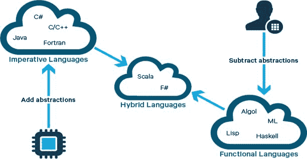
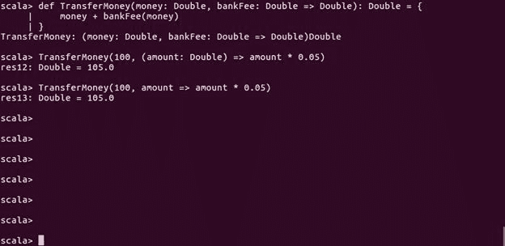
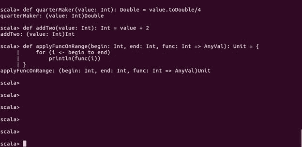
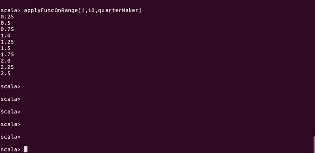
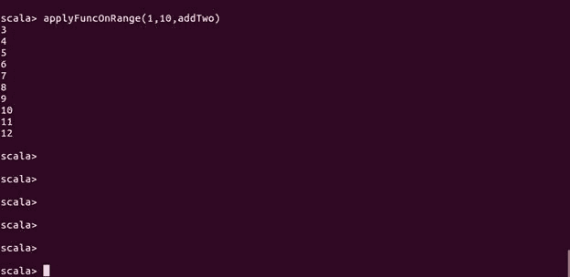
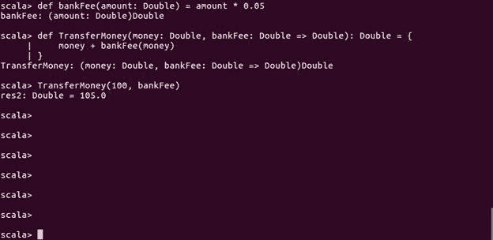
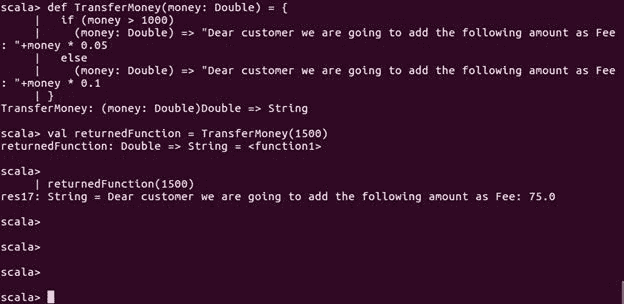

# 第三章：函数式编程概念

“面向对象编程通过封装移动部分使代码易于理解。函数式编程通过最小化移动部分使代码易于理解。”

- 迈克尔·费瑟斯

使用 Scala 和 Spark 是学习大数据分析的一个非常好的组合。然而，在面向对象编程（OOP）范式的基础上，我们还需要了解为什么函数式编程（FP）概念对于编写 Spark 应用程序、最终分析数据非常重要。如前几章所述，Scala 支持两种编程范式：面向对象编程范式和函数式编程概念。在第二章，*面向对象的 Scala*中，我们探讨了面向对象编程范式，学习了如何在蓝图（类）中表示现实世界中的对象，并将其实例化为具有实际内存表示的对象。

在本章中，我们将重点讨论第二种范式（即函数式编程）。我们将了解什么是函数式编程，Scala 是如何支持它的，为什么它如此重要，以及使用这一概念的相关优势。更具体地说，我们将学习几个主题，例如为什么 Scala 是数据科学家的强大工具，为什么学习 Spark 范式很重要，纯函数和**高阶函数**（**HOFs**）。本章还将展示一个使用 HOF 的实际案例。然后，我们将学习如何在 Scala 的标准库中处理集合之外的高阶函数中的异常。最后，我们将了解函数式 Scala 如何影响对象的可变性。

简而言之，本章将涵盖以下主题：

+   函数式编程简介

+   数据科学家的函数式 Scala

+   为什么函数式编程和 Scala 对学习 Spark 至关重要？

+   纯函数与高阶函数

+   使用高阶函数：一个实际的使用案例

+   函数式 Scala 中的错误处理

+   函数式编程与数据的可变性

# 函数式编程简介

在计算机科学中，`函数式编程`（FP）是一种编程范式，它是一种构建计算机程序结构和元素的独特风格。这种独特性有助于将计算视为数学函数的求值，避免了状态变化和可变数据。因此，通过使用 FP 概念，你可以学习如何以确保数据不可变的方式编写代码。换句话说，FP 是编写纯函数的编程方法，是尽可能去除隐式输入和输出，使得我们的代码尽可能*只是*描述输入与输出之间的关系。

这并不是一个新概念，但`λ演算`（Lambda Calculus），它为函数式编程提供了基础，最早是在 1930 年代提出的。然而，在编程语言的领域中，函数式编程这个术语指的是一种新的声明式编程范式，意味着编程可以借助控制、声明或表达式来完成，而不是像传统编程语言（例如 C）中常用的经典语句。

# 函数式编程的优势

在函数式编程范式中，有一些令人兴奋和酷的特性，比如`组合`、`管道`和`高阶函数`，它们有助于避免编写不符合函数式编程的代码。或者，至少后来能帮助将不符合函数式的程序转换成一种面向命令式的函数式风格。最后，现在让我们从计算机科学的角度来看函数式编程的定义。函数式编程是计算机科学中的一个常见概念，其中计算和程序的构建结构被视为在评估支持不可变数据并避免状态变化的数学函数。在函数式编程中，每个函数对于相同的输入参数值都有相同的映射或输出。

随着复杂软件需求的增加，我们也需要良好结构的程序和不难编写且可调试的软件。我们还需要编写可扩展的代码，这样可以在未来节省编程成本，并且能为代码的编写和调试带来便利；甚至需要更多模块化的软件，这种软件易于扩展并且编程工作量更小。由于函数式编程的模块化特性，函数式编程被认为是软件开发中的一大优势。

在函数式编程中，其结构中有一个基本构建块，叫做无副作用的函数（或者至少是副作用非常少的函数），大多数代码都遵循这一原则。没有副作用时，求值顺序真的不重要。关于编程语言的视角，有一些方法可以强制特定的求值顺序。在某些函数式编程语言中（例如，像 Scheme 这样的贪心语言），它们对参数没有求值顺序的限制，你可以像下面这样将这些表达式嵌套在自己的 lambda 表达式中：

```py
((lambda (val1) 
  ((lambda (val2) 
    ((lambda (val3) (/ (* val1 val2) val3)) 
      expression3)) ; evaluated third
      expression2))   ; evaluated second
    expression1)      ; evaluated first

```

在函数式编程中，编写数学函数时，执行顺序无关紧要，通常能使代码更具可读性。有时，人们会争辩说，我们也需要有副作用的函数。事实上，这是大多数函数式编程语言的一个主要缺点，因为通常很难编写不需要任何 I/O 的函数；另一方面，这些需要 I/O 的函数在函数式编程中实现起来也很困难。从*图 1*中可以看出，Scala 也是一种混合语言，通过融合命令式语言（如 Java）和函数式语言（如 Lisp）的特性演变而来。

但幸运的是，在这里我们处理的是一种混合语言，允许面向对象和函数式编程范式，因此编写需要 I/O 的函数变得相当容易。函数式编程相较于基础编程也有重大优势，比如理解和缓存。

函数式编程的一个主要优势是简洁，因为在函数式编程中，你可以编写更紧凑、更简洁的代码。此外，并发性被认为是一个主要优势，它在函数式编程中更容易实现。因此，像 Scala 这样的函数式语言提供了许多其他功能和工具，鼓励程序员做出整个范式转变，转向更数学化的思维方式。

**图 1：** 展示了使用函数式编程概念的概念视图

通过将焦点缩小到只有少数几个可组合的抽象概念，例如函数、函数组合和抽象代数，函数式编程概念提供了比其他范式更多的优势。例如：

+   **更接近数学思维：** 你倾向于以接近数学定义的格式表达你的想法，而不是通过迭代程序。

+   **无（或至少更少）副作用：** 你的函数不会影响其他函数，这对并发性和并行化非常有利，同时也有助于调试。

+   **减少代码行数而不牺牲概念的清晰度：** Lisp 比非函数式语言更强大。虽然确实需要在项目中花费更多的时间思考而不是编写代码，但最终你可能会发现你变得更高效。

由于这些令人兴奋的特性，函数式编程具有显著的表达能力。例如，机器学习算法可能需要数百行命令式代码来实现，而它们可以仅通过少数几个方程式来定义。

# 数据科学家的函数式 Scala

对于进行交互式数据清理、处理、变换和分析，许多数据科学家使用 R 或 Python 作为他们最喜欢的工具。然而，也有许多数据科学家倾向于非常依赖他们最喜欢的工具——即 Python 或 R，并试图用这个工具解决所有的数据分析问题。因此，在大多数情况下，向他们介绍一种新工具可能是非常具有挑战性的，因为新工具有更多的语法和一套新的模式需要学习，然后才能用新工具解决他们的目的。

Spark 中还有其他用 Python 和 R 编写的 API，例如 PySpark 和 SparkR，分别允许你从 Python 或 R 中使用它们。然而，大多数 Spark 的书籍和在线示例都是用 Scala 编写的。可以说，我们认为学习如何使用 Spark 并使用与 Spark 代码编写相同语言的方式，将为你作为数据科学家提供比 Java、Python 或 R 更多的优势：

+   提供更好的性能并去除数据处理的开销

+   提供访问 Spark 最新和最强大功能的能力

+   有助于以透明的方式理解 Spark 的哲学

数据分析意味着你正在编写 Scala 代码，使用 Spark 及其 API（如 SparkR、SparkSQL、Spark Streaming、Spark MLlib 和 Spark GraphX）从集群中提取数据。或者，你正在使用 Scala 开发一个 Spark 应用程序，在你自己的机器上本地处理数据。在这两种情况下，Scala 都是你真正的伙伴，并且能在时间上为你带来回报。

# 为什么选择函数式编程和 Scala 来学习 Spark？

在本节中，我们将讨论为什么要学习 Spark 来解决我们的数据分析问题。接着，我们将讨论为什么 Scala 中的函数式编程概念对于数据科学家来说尤其重要，它可以使数据分析变得更加简单。我们还将讨论 Spark 的编程模型及其生态系统，帮助大家更清楚地理解。

# 为什么选择 Spark？

Spark 是一个极速的集群计算框架，主要设计用于快速计算。Spark 基于 Hadoop 的 MapReduce 模型，并在更多形式和类型的计算中使用 MapReduce，例如交互式查询和流处理。Spark 的主要特性之一是内存计算，它帮助提高应用程序的性能和处理速度。Spark 支持广泛的应用程序和工作负载，如下所示：

+   基于批处理的应用

+   迭代算法，在以前无法快速运行的情况下

+   交互式查询和流处理

此外，学习 Spark 并将其应用于你的程序并不需要花费太多时间，也不需要深入理解并发和分布式系统的内部细节。Spark 是在 2009 年由 UC Berkeley 的 AMPLab 团队实现的，2010 年他们决定将其开源。之后，Spark 于 2013 年成为 Apache 项目，从那时起，Spark 一直被认为是最著名和最常用的 Apache 开源软件。Apache Spark 因其以下特性而声名显赫：

+   **快速计算**：由于其独特的内存计算特性，Spark 能够帮助你比 Hadoop 更快地运行应用程序。

+   **支持多种编程语言**：Apache Spark 为不同的编程语言提供了封装和内置 API，如 Scala、Java、Python，甚至 R。

+   **更多分析功能**：如前所述，Spark 支持 MapReduce 操作，同时也支持更高级的分析功能，如**机器学习**（**MLlib**）、数据流处理和图形处理算法。

如前所述，Spark 是构建在 Hadoop 软件之上的，你可以以不同的方式部署 Spark：

+   **独立集群**：这意味着 Spark 将运行在**Hadoop 分布式文件系统**（**HDFS**）之上，并将空间实际分配给 HDFS。Spark 和 MapReduce 将并行运行，以服务所有 Spark 作业。

+   **Hadoop YARN 集群**：这意味着 Spark 可以直接在 YARN 上运行，无需任何根权限或预先安装。

+   **Mesos 集群**：当驱动程序创建一个 Spark 作业并开始为调度分配相关任务时，Mesos 会决定哪些计算节点将处理哪些任务。我们假设你已经在你的机器上配置并安装了 Mesos。

+   **按需付费集群部署**：你可以在 AWS EC2 上以真实集群模式部署 Spark 作业。为了让应用在 Spark 集群模式下运行并提高可扩展性，你可以考虑将**亚马逊弹性计算云**（**EC2**）服务作为**基础设施即服务**（**IaaS**）或**平台即服务**（**PaaS**）。

请参考第十七章，*前往 ClusterLand - 在集群上部署 Spark* 和第十八章，*在集群上测试和调试 Spark*，了解如何使用 Scala 和 Spark 在真实集群上部署数据分析应用程序。

# Scala 和 Spark 编程模型

Spark 编程从一个数据集或几个数据集开始，通常位于某种形式的分布式持久化存储中，例如 HDFS。Spark 提供的典型 RDD 编程模型可以描述如下：

+   从环境变量中，Spark 上下文（Spark Shell 为你提供了 Spark 上下文，或者你可以自己创建，稍后将在本章中讨论）创建一个初始数据引用的 RDD 对象。

+   转换初始 RDD，创建更多的 RDD 对象，遵循函数式编程风格（稍后会讨论）。

+   将代码、算法或应用程序从驱动程序发送到集群管理器节点，然后集群管理器会将副本提供给每个计算节点。

+   计算节点持有其分区中 RDD 的引用（同样，驱动程序也持有数据引用）。然而，计算节点也可以由集群管理器提供输入数据集。

+   经过一次转换（无论是狭义转换还是宽义转换）后，生成的结果是一个全新的 RDD，因为原始的 RDD 不会被修改。

+   最终，RDD 对象或更多（具体来说，是数据引用）通过一个动作进行物化，将 RDD 转储到存储中。

+   驱动程序可以请求计算节点提供一部分结果，用于程序的分析或可视化。

等等！到目前为止，我们已经顺利进行。我们假设你会将应用程序代码发送到集群中的计算节点。但是，你仍然需要将输入数据集上传或发送到集群中，以便在计算节点之间进行分发。即使在批量上传时，你也需要通过网络传输数据。我们还认为，应用程序代码和结果的大小是可以忽略不计的或微不足道的。另一个障碍是，如果你希望 Spark 进行大规模数据处理，可能需要先将数据对象从多个分区合并。这意味着我们需要在工作节点/计算节点之间进行数据洗牌，通常通过 `partition()`、`intersection()` 和 `join()` 等转换操作来实现。

# Scala 和 Spark 生态系统

为了提供更多增强功能和大数据处理能力，Spark 可以配置并运行在现有的基于 Hadoop 的集群上。另一方面，Spark 中的核心 API 是用 Java、Scala、Python 和 R 编写的。与 MapReduce 相比，Spark 提供了更通用、更强大的编程模型，并且提供了多个库，这些库是 Spark 生态系统的一部分，能够为通用数据处理与分析、大规模结构化 SQL、图形处理和 **机器学习**（**ML**）等领域提供附加能力。

Spark 生态系统由以下组件组成，如所示（详细信息请参见 第十六章，*Spark 调优*）：

+   **Apache Spark 核心**：这是 Spark 平台的底层引擎，所有其他功能都基于它构建。此外，它还提供内存处理功能。

+   **Spark SQL**：正如之前所提到的，Spark 核心是底层引擎，所有其他组件或功能都是基于它构建的。Spark SQL 是 Spark 组件之一，提供对不同数据结构（结构化和半结构化数据）的支持。

+   **Spark Streaming**：这个组件负责流式数据分析，并将其转换成可以后续用于分析的小批次数据。

+   **MLlib（机器学习库）**：MLlib 是一个机器学习框架，支持以分布式方式实现许多机器学习算法。

+   **GraphX**：一个分布式图框架，构建在 Spark 之上，以并行方式表达用户定义的图形组件。

如前所述，大多数函数式编程语言允许用户编写优雅、模块化和可扩展的代码。此外，函数式编程通过编写看起来像数学函数的函数，鼓励安全的编程方式。那么，Spark 是如何使所有的 API 工作成为一个整体的呢？这得益于硬件的进步，以及当然，还有函数式编程的概念。因为简单地为语言增加语法糖以便轻松使用 lambda 表达式并不足以让一种语言具备函数式编程特性，这仅仅是一个开始。

尽管 Spark 中的 RDD 概念运作得很好，但在许多使用案例中，由于其不可变性，情况会变得有些复杂。对于以下计算平均值的经典示例，要使源代码更健壮和可读；当然，为了降低总体成本，人们不希望先计算总和，再计算计数，即使数据已缓存于主内存中。

```py
val data: RDD[People] = ...
data.map(person => (person.name, (person.age, 1)))
.reduceByKey(_ |+| _)
.mapValues { case (total, count) =>
  total.toDouble / count
}.collect()

```

DataFrames API（这将在后面的章节中详细讨论）生成的代码同样简洁且可读，其中函数式 API 适用于大多数使用场景，最小化了 MapReduce 阶段；有许多 shuffle 操作可能导致显著的性能开销，导致这种情况的主要原因如下：

+   大型代码库需要静态类型来消除琐碎的错误，比如*ae*代替*age*这样的错误

+   复杂代码需要透明的 API 来清晰地传达设计

+   通过幕后变异，DataFrames API 可以实现 2 倍的加速，这也可以通过封装状态的 OOP 和使用 mapPartitions 与 combineByKey 来实现

+   构建功能快速的灵活性和 Scala 特性是必需的

在 Barclays，OOP 和 FP 的结合可以使一些本来非常困难的问题变得更加简单。例如，在 Barclays，最近开发了一个名为 Insights Engine 的应用程序，它可以执行任意数量的接近任意的类似 SQL 查询。该应用程序能够以可扩展的方式执行这些查询，随着 N 的增加而扩展。

现在让我们谈谈纯函数、高阶函数和匿名函数，这三者是 Scala 函数式编程中的三个重要概念。

# 纯函数与高阶函数

从计算机科学的角度来看，函数可以有多种形式，例如一阶函数、高阶函数或纯函数。从数学角度来看也是如此。使用高阶函数时，以下某一操作可以执行：

+   接受一个或多个函数作为参数，执行某些操作

+   返回一个函数作为其结果

除高阶函数外，所有其他函数都是一阶函数。然而，从数学角度来看，高阶函数也被称为**运算符**或**泛函数**。另一方面，如果一个函数的返回值仅由其输入决定，并且当然没有可观察的副作用，则称为**纯函数**。

在这一部分中，我们将简要讨论为什么以及如何在 Scala 中使用不同的函数式范式。特别是，纯函数和高阶函数将被讨论。在本节末尾，我们还将简要概述如何使用匿名函数，因为在使用 Scala 开发 Spark 应用时，这个概念非常常见。

# 纯函数

函数式编程中最重要的原则之一是纯函数。那么，什么是纯函数，为什么我们要关心它们？在本节中，我们将探讨函数式编程中的这一重要特性。函数式编程的最佳实践之一是实现程序，使得程序/应用程序的核心由纯函数构成，而所有 I/O 函数或副作用（如网络开销和异常）则位于外部公开层。

那么，纯函数有什么好处呢？纯函数通常比普通函数小（尽管这取决于其他因素，比如编程语言），而且对于人脑来说，它们更容易理解和解释，因为它们看起来像一个数学函数。

然而，你可能会反驳这一点，因为大多数开发人员仍然觉得命令式编程更容易理解！纯函数更容易实现和测试。让我们通过一个例子来演示这一点。假设我们有以下两个独立的函数：

```py
def pureFunc(cityName: String) = s"I live in $cityName"
def notpureFunc(cityName: String) = println(s"I live in $cityName")

```

所以在前面的两个例子中，如果你想测试`pureFunc`纯函数，我们只需断言从纯函数返回的值与我们基于输入预期的值相符，如：

```py
assert(pureFunc("Dublin") == "I live in Dublin")

```

但是，另一方面，如果我们想测试我们的`notpureFunc`非纯函数，那么我们需要重定向标准输出并对其应用断言。下一个实用技巧是，函数式编程使程序员更加高效，因为，如前所述，纯函数更小，更容易编写，并且你可以轻松地将它们组合在一起。除此之外，代码重复最小，你可以轻松地重用你的代码。现在，让我们通过一个更好的例子来演示这一优势。考虑这两个函数：

```py
scala> def pureMul(x: Int, y: Int) = x * y
pureMul: (x: Int, y: Int)Int 
scala> def notpureMul(x: Int, y: Int) = println(x * y)
notpureMul: (x: Int, y: Int)Unit

```

然而，可能会有可变性带来的副作用；使用纯函数（即没有可变性）有助于我们推理和测试代码：

```py
def pureIncrease(x: Int) = x + 1

```

这个方法具有优势，非常容易解释和使用。然而，让我们来看另一个例子：

```py
varinc = 0
def impureIncrease() = {
  inc += 1
  inc
}

```

现在，考虑一下这可能会有多混乱：在多线程环境中，输出会是什么？如你所见，我们可以轻松使用我们的纯函数`pureMul`来乘以任何数字序列，这与我们的`notpureMul`非纯函数不同。让我们通过以下例子来演示这一点：

```py
scala> Seq.range(1,10).reduce(pureMul)
res0: Int = 362880

```

上述示例的完整代码如下（方法已使用一些实际值进行调用）：

```py
package com.chapter3.ScalaFP

object PureAndNonPureFunction {
  def pureFunc(cityName: String) = s"I live in $cityName"
  def notpureFunc(cityName: String) = println(s"I live in $cityName")
  def pureMul(x: Int, y: Int) = x * y
  def notpureMul(x: Int, y: Int) = println(x * y)  

  def main(args: Array[String]) {
    //Now call all the methods with some real values
    pureFunc("Galway") //Does not print anything
    notpureFunc("Dublin") //Prints I live in Dublin
    pureMul(10, 25) //Again does not print anything
    notpureMul(10, 25) // Prints the multiplicaiton -i.e. 250   

    //Now call pureMul method in a different way
    val data = Seq.range(1,10).reduce(pureMul)
    println(s"My sequence is: " + data)
  }
}

```

上述代码的输出如下：

```py
I live in Dublin 250 
My sequence is: 362880

```

如前所述，你可以将纯函数视为函数式编程中最重要的特性之一，并作为最佳实践；你需要用纯函数构建应用程序的核心。

函数与方法：

在编程领域，**函数**是通过名称调用的一段代码。数据（作为参数或作为参数）可以传递给函数进行操作，并且可以返回数据（可选）。所有传递给函数的数据都是显式传递的。另一方面，**方法**也是通过名称调用的一段代码。然而，方法总是与一个对象相关联。听起来相似吗？嗯！在大多数情况下，方法与函数是相同的，只有两个关键的区别：

1\. 方法隐式地接收它被调用的对象。

2\. 方法能够对包含在类中的数据进行操作。

在前一章中已经说明了，对象是类的实例——类是定义，对象是该数据的实例。

现在是学习高阶函数的时候了。不过，在此之前，我们应该先了解函数式 Scala 中的另一个重要概念——**匿名函数**。通过这个概念，我们还将学习如何在函数式 Scala 中使用 lambda 表达式。

# 匿名函数

有时候，在你的代码中，你不想在使用之前定义一个函数，可能是因为你只会在某一个地方使用它。在函数式编程中，有一种非常适合这种情况的函数类型，叫做匿名函数。让我们通过之前的转账示例来演示匿名函数的使用：

```py
def TransferMoney(money: Double, bankFee: Double => Double): Double = {
  money + bankFee(money)
}

```

现在，让我们使用一些实际值来调用 `TransferMoney()` 方法，如下所示：

```py
 TransferMoney(100, (amount: Double) => amount * 0.05)

```

Lambda 表达式：

如前所述，Scala 支持一等函数，这意味着函数也可以通过函数字面量语法表达；函数可以通过对象来表示，被称为函数值。尝试以下表达式，它为整数创建了一个后继函数：

`scala> var apply = (x:Int) => x+1`

`apply: Int => Int = <function1>`

现在，apply 变量已经是一个可以像往常一样使用的函数，如下所示：

`scala> var x = apply(7)`

`x: Int = 8`

我们在这里所做的就是简单地使用了函数的核心部分：参数列表，接着是函数箭头以及函数体。这并不是黑魔法，而是一个完整的函数，只不过没有给定名称——也就是匿名函数。如果你以这种方式定义一个函数，那么之后就无法引用该函数，因此你无法在之后调用它，因为没有名称，它是匿名的。同时，我们还看到了所谓的**lambda 表达式**！它就是函数的纯粹匿名定义。

上述代码的输出如下：

```py
105.0

```

所以，在之前的示例中，我们没有声明一个单独的 `callback` 函数，而是直接传递了一个匿名函数，它完成了与 `bankFee` 函数相同的工作。你也可以省略匿名函数中的类型，它将根据传递的参数直接推断出来，像这样：

```py
TransferMoney(100, amount => amount * 0.05)

```

上述代码的输出如下：

```py
105.0

```

让我们在 Scala shell 中展示前面的例子，如下截图所示：

**图 6：** 在 Scala 中使用匿名函数

一些支持函数式编程的编程语言使用“lambda 函数”这个名称来代替匿名函数。

# 高阶函数

在 Scala 的函数式编程中，你可以将函数作为参数传递，甚至可以将一个函数作为结果从另一个函数返回；这就是所谓的高阶函数。

让我们通过一个例子来演示这个特性。考虑以下函数`testHOF`，它接受另一个函数`func`，然后将该函数应用于它的第二个参数值：

```py
object Test {
  def main(args: Array[String]) {
    println( testHOF( paramFunc, 10) )
  }
  def testHOF(func: Int => String, value: Int) = func(value)
  def paramFuncA = "[" + x.toString() + "]"
}

```

在演示了 Scala 函数式编程的基础后，现在我们准备进入更复杂的函数式编程案例。如前所述，我们可以将高阶函数定义为接受其他函数作为参数并返回它们的结果。如果你来自面向对象编程的背景，你会发现这是一种非常不同的方法，但随着我们继续深入，它会变得更容易理解。

让我们从定义一个简单的函数开始：

```py
def quarterMaker(value: Int): Double = value.toDouble/4

```

前面的函数是一个非常简单的函数。它接受一个`Int`值，并返回该值的四分之一，类型为`Double`。让我们定义另一个简单函数：

```py
def addTwo(value: Int): Int = value + 2

```

第二个函数`addTwo`比第一个函数更简单。它接受一个`Int`值，然后加 2。正如你所看到的，这两个函数有一些相同之处。它们都接受`Int`并返回另一个处理过的值，我们可以称之为`AnyVal`。现在，让我们定义一个接受另一个函数作为参数的高阶函数：

```py
def applyFuncOnRange(begin: Int, end: Int, func: Int => AnyVal): Unit = {
  for (i <- begin to end)
    println(func(i))
}

```

正如你所看到的，前面的函数`applyFuncOnRange`接受两个`Int`值，作为序列的开始和结束，并接受一个具有`Int => AnyVal`签名的函数，就像之前定义的简单函数（`quarterMakder`和`addTwo`）。现在，让我们通过将两个简单函数中的一个作为第三个参数传递给它，来展示我们之前的高阶函数（如果你想传递自己的函数，确保它具有相同的签名`Int => AnyVal`）。

**Scala 的范围 for 循环语法：** 使用 Scala 范围的 for 循环的最简单语法是：

`for( var x <- range ){`

`statement(s)`

`}`

这里，`range`可以是一个数字范围，表示为`i`到`j`，有时也像`i`直到`j`。左箭头`←`运算符被称为生成器，因为它从范围中生成单个值。让我们通过一个具体的例子来展示这一特性：

`object UsingRangeWithForLoop {`

`def main(args: Array[String]):Unit= {`

`var i = 0;`

`// 使用范围的 for 循环执行`

`for( i <- 1 to 10){`

`println( "i 的值: " + i )`

`}`

`}`

`}`

前面代码的输出如下：

`i 的值: 1`

`i 的值: 2`

`i 的值: 3`

`i 的值: 4`

`i 的值: 5`

`i 的值: 6`

`i 的值: 7`

`i 的值：8`

`i 的值：9`

`i 的值：10`

在开始使用这些函数之前，让我们首先定义它们，如下图所示：

**图 2：** 在 Scala 中定义高阶函数的示例

现在，让我们开始调用我们的高阶函数 `applyFuncOnRange` 并将 `quarterMaker` 函数作为第三个参数传递：

**图 3：** 调用高阶函数

我们甚至可以应用另一个函数 `addTwo`，因为它具有与上图所示相同的签名：

**图 4：** 调用高阶函数的另一种方式

在进一步讲解其他示例之前，我们先定义一下回调函数。回调函数是可以作为参数传递给其他函数的函数。其他函数则是普通函数。我们将通过更多的示例来演示如何使用不同的回调函数。考虑以下高阶函数，它负责从你的账户转账指定金额：

```py
def TransferMoney(money: Double, bankFee: Double => Double): Double = {
  money + bankFee(money)
}
def bankFee(amount: Double) = amount * 0.05

```

在对 100 调用 `TransferMoney` 函数之后：

```py
TransferMoney(100, bankFee)

```

上述代码的输出如下所示：

```py
105.0

```

从函数式编程的角度来看，这段代码尚未准备好集成到银行系统中，因为你需要对金额参数进行不同的验证，例如它必须是正数并且大于银行指定的特定金额。然而，在这里我们仅仅是演示高阶函数和回调函数的使用。

所以，这个示例的工作原理如下：你想将一定金额的资金转账到另一个银行账户或钱款代理人。银行会根据你转账的金额收取特定费用，这时回调函数发挥了作用。它获取要转账的金额，并应用银行费用，以计算出总金额。

`TransferMoney` 函数接受两个参数：第一个是要转账的金额，第二个是一个回调函数，其签名为 `Double => Double`，该函数应用于金额参数以确定转账金额的银行费用。

**图 5：** 调用并为高阶函数提供额外的功能

上述示例的完整源代码如下所示（我们使用一些实际值来调用方法）：

```py
package com.chapter3.ScalaFP
object HigherOrderFunction {
  def quarterMaker(value: Int): Double = value.toDouble / 4
  def testHOF(func: Int => String, value: Int) = func(value)
  def paramFuncA = "[" + x.toString() + "]"
  def addTwo(value: Int): Int = value + 2
  def applyFuncOnRange(begin: Int, end: Int, func: Int => AnyVal): Unit = {
    for (i <- begin to end)
      println(func(i))
  }
  def transferMoney(money: Double, bankFee: Double => Double): Double = {
    money + bankFee(money)
  }
  def bankFee(amount: Double) = amount * 0.05
  def main(args: Array[String]) {
    //Now call all the methods with some real values
    println(testHOF(paramFunc, 10)) // Prints [10]
    println(quarterMaker(20)) // Prints 5.0
    println(paramFunc(100)) //Prints [100]
    println(addTwo(90)) // Prints 92
    println(applyFuncOnRange(1, 20, addTwo)) // Prints 3 to 22 and ()
    println(TransferMoney(105.0, bankFee)) //prints 110.25
  }
}

```

上述代码的输出如下所示：

```py
[10] 
5.0 
[100] 
92 
3 4 5 6 7 8 9 10 11 12 13 14 15 16 1718 19 20 21 22 () 
110.25

```

通过使用回调函数，你给高阶函数提供了额外的功能；因此，这是一个非常强大的机制，可以使你的程序更加优雅、灵活和高效。

# 函数作为返回值

如前所述，高阶函数还支持返回一个函数作为结果。我们通过一个示例来演示这一点：

```py
def transferMoney(money: Double) = {
  if (money > 1000)
    (money: Double) => "Dear customer we are going to add the following
                        amount as Fee: "+money * 0.05
  else
    (money: Double) => "Dear customer we are going to add the following
                        amount as Fee: "+money * 0.1
} 
val returnedFunction = TransferMoney(1500)
returnedFunction(1500)

```

上面的代码片段将输出以下内容：

```py
Dear customer, we are going to add the following amount as Fee: 75.0

```

让我们运行之前的示例，如下图所示；它展示了如何将函数作为返回值使用：

**图 7：** 函数作为返回值

前面示例的完整代码如下：

```py
package com.chapter3.ScalaFP
object FunctionAsReturnValue {
  def transferMoney(money: Double) = {
    if (money > 1000)
      (money: Double) => "Dear customer, we are going to add following
                          amount as Fee: " + money * 0.05
    else
      (money: Double) => "Dear customer, we are going to add following
                          amount as Fee: " + money * 0.1
  }  
  def main(args: Array[String]) {
    val returnedFunction = transferMoney(1500.0)
    println(returnedFunction(1500)) //Prints Dear customer, we are 
                         going to add following amount as Fee: 75.0
  }
}

```

前面代码的输出如下：

```py
Dear customer, we are going to add following amount as Fee: 75.0

```

在结束我们关于高阶函数的讨论之前，来看看一个实际的例子，也就是使用高阶函数进行柯里化。

# 使用高阶函数

假设你在餐厅做厨师，某个同事问你一个问题：实现一个**高阶函数**（**HOF**）来执行柯里化。需要线索吗？假设你有以下两个高阶函数的签名：

```py
def curryX,Y,Z => Z) : X => Y => Z

```

类似地，按如下方式实现一个执行反柯里化的函数：

```py
def uncurryX,Y,Z: (X,Y) => Z

```

那么，如何使用高阶函数来执行柯里化操作呢？你可以创建一个特征，它封装了两个高阶函数（即柯里化和反柯里化）的签名，如下所示：

```py
trait Curry {
  def curryA, B, C => C): A => B => C
  def uncurryA, B, C: (A, B) => C
}

```

现在，你可以按照以下方式实现并扩展这个特征作为一个对象：

```py

object CurryImplement extends Curry {
  def uncurryX, Y, Z: (X, Y) => Z = { (a: X, b: Y) => f(a)(b) }
  def curryX, Y, Z => Z): X => Y => Z = { (a: X) => { (b: Y) => f(a, b) } }
}

```

这里我先实现了反柯里化，因为它更简单。等号后面的两个大括号是一个匿名函数字面量，用来接受两个参数（即类型为 `X` 和 `Y` 的 `a` 和 `b`）。然后，这两个参数可以用于一个返回函数的函数中。接着，它将第二个参数传递给返回的函数。最后，返回第二个函数的值。第二个函数字面量接受一个参数并返回一个新函数，也就是 `curry()`。最终，当调用时，它返回一个函数，而该函数再返回另一个函数。

现在来看看如何在实际应用中使用前面的对象，该对象扩展了基础特征。这里有一个例子：

```py
object CurryingHigherOrderFunction {
  def main(args: Array[String]): Unit = {
    def add(x: Int, y: Long): Double = x.toDouble + y
    val addSpicy = CurryImplement.curry(add) 
    println(addSpicy(3)(1L)) // prints "4.0"    
    val increment = addSpicy(2) 
    println(increment(1L)) // prints "3.0"    
    val unspicedAdd = CurryImplement.uncurry(addSpicy) 
    println(unspicedAdd(1, 6L)) // prints "7.0"
  }
}

```

在前面的对象中以及主方法内部：

+   `addSpicy` 保存了一个函数，该函数接受一个长整型并将其加 1，然后打印出 4.0。

+   `increment` 保存了一个函数，该函数接受一个长整型并将其加 2，最后打印出 3.0。

+   `unspicedAdd` 保存了一个函数，该函数将 1 加到一个长整型上，最后打印出 7.0。

前面代码的输出如下：

```py
4.0
3.0
7.0

```

在数学和计算机科学中，柯里化是一种技术，它将一个接受多个参数（或一个元组的参数）的函数的求值转换为一系列函数的求值，每个函数只接受一个参数。柯里化与部分应用相关，但不同于部分应用：

**柯里化：** 柯里化在实践和理论环境中都非常有用。在函数式编程语言以及许多其他编程语言中，柯里化提供了一种自动管理函数参数传递和异常的方式。在理论计算机科学中，它提供了一种简化理论模型的方式来研究具有多个参数的函数，这些模型只接受一个参数。

**去柯里化：** 去柯里化是柯里化的对偶变换，可以看作是一种去功能化的形式。它接收一个返回值为另一个函数 `g` 的函数 `f`，并生成一个新的函数 `f′`，该函数接受 `f` 和 `g` 的参数，并返回 `f` 和随后 `g` 对这些参数的应用。这个过程可以反复进行。

到目前为止，我们已经学习了如何处理 Scala 中的纯函数、高阶函数和匿名函数。接下来，我们简要概述如何使用 `Throw`、`Try`、`Either` 和 `Future` 扩展高阶函数。

# 函数式 Scala 中的错误处理

到目前为止，我们专注于确保 Scala 函数的主体完成预定任务且不执行其他操作（即不出现错误或异常）。现在，为了有效使用编程并避免生成易出错的代码，你需要了解如何捕获异常并处理语言中的错误。我们将看到如何利用 Scala 的一些特殊功能，如 `Try`、`Either` 和 `Future`，扩展高阶函数，超出集合的范围。

# Scala 中的失败和异常

首先，让我们定义一般情况下的失败含义（来源：[`tersesystems.com/2012/12/27/error-handling-in-scala/`](https://tersesystems.com/2012/12/27/error-handling-in-scala/)）：

+   **意外的内部失败：** 操作因未满足的期望而失败，例如空指针引用、违反的断言或简单的错误状态。

+   **预期的内部失败：** 操作故意由于内部状态而失败，例如黑名单或断路器。

+   **预期的外部失败：** 操作因为被要求处理某些原始输入而失败，如果原始输入无法处理，则会失败。

+   **意外的外部失败：** 操作因系统依赖的资源不存在而失败：例如文件句柄丢失、数据库连接失败或网络中断。

不幸的是，除非失败源于某些可管理的异常，否则没有具体方法可以停止失败。另一方面，Scala 使得*已检查与未检查*变得非常简单：它没有已检查的异常。在 Scala 中，所有异常都是未检查的，甚至是 `SQLException` 和 `IOException` 等。因此，接下来我们将看看如何至少处理这些异常。

# 抛出异常

Scala 方法可能会因意外的工作流而抛出异常。你可以创建一个异常对象，然后使用 `throw` 关键字抛出它，示例如下：

```py
//code something
throw new IllegalArgumentException("arg 2 was wrong...");
//nothing will be executed from here.

```

请注意，使用异常处理的主要目标不是生成友好的消息，而是中断 Scala 程序的正常流程。

# 使用 `try` 和 `catch` 捕获异常

Scala 允许你在一个代码块中使用 `try...catch` 捕获任何异常，并使用 `case` 块对其进行模式匹配。使用 `try...catch` 的基本语法如下：

```py
try
{
  // your scala code should go here
} 
catch
{
  case foo: FooException => handleFooException(foo)
  case bar: BarException => handleBarException(bar)
  case _: Throwable => println("Got some other kind of exception")
}
finally
{
  // your scala code should go here, such as to close a database connection 
}

```

因此，如果你抛出异常，那么你需要使用`try...catch`块来优雅地处理它，而不会崩溃并显示内部异常消息：

```py
package com.chapter3.ScalaFP
import java.io.IOException
import java.io.FileReader
import java.io.FileNotFoundException

object TryCatch {
  def main(args: Array[String]) {
    try {
      val f = new FileReader("data/data.txt")
    } catch {
      case ex: FileNotFoundException => println("File not found exception")
      case ex: IOException => println("IO Exception") 
    } 
  }
}

```

如果在你的项目树的路径/data 下没有名为`data.txt`的文件，你将遇到如下的`FileNotFoundException`：

前面代码的输出如下：

```py
File not found exception

```

现在，让我们通过一个简单的示例来展示如何在 Scala 中使用`finally`子句，以使`try...catch`块完整。

# 最后

假设你希望无论是否抛出异常，都执行你的代码，那么你应该使用`finally`子句。你可以像下面这样将它放在`try 块`内部。以下是一个示例：

```py
try {
    val f = new FileReader("data/data.txt")
  } catch {
    case ex: FileNotFoundException => println("File not found exception")
  } finally { println("Dude! this code always executes") }
}

```

现在，这是使用`try...catch...finally`的完整示例：

```py
package com.chapter3.ScalaFP
import java.io.IOException
import java.io.FileReader
import java.io.FileNotFoundException

object TryCatch {
  def main(args: Array[String]) {
    try {
      val f = new FileReader("data/data.txt")
    } catch {
      case ex: FileNotFoundException => println("File not found 
                                                 exception")
      case ex: IOException => println("IO Exception") 
    } finally {
      println("Finally block always executes!")
    }
  }
}

```

前面代码的输出如下：

```py
File not found exception 
Finally block always executes!

```

接下来，我们将讨论 Scala 中的另一个强大特性——`Either`。

# 创建一个 Either

`Either[X, Y]`是一个实例，它包含`X`或`Y`中的一个实例，但不能同时包含两个实例。我们将这两个子类型称为 Either 的左侧和右侧。创建一个 Either 很简单。但有时在程序中使用它是非常强大的：

```py
package com.chapter3.ScalaFP
import java.net.URL
import scala.io.Source
object Either {
  def getData(dataURL: URL): Either[String, Source] =
    if (dataURL.getHost.contains("xxx"))
      Left("Requested URL is blocked or prohibited!")
    else
      Right(Source.fromURL(dataURL))      
  def main(args: Array[String]) {
      val either1 = getData(new URL("http://www.xxx.com"))    
      println(either1)      
      val either2 = getData(new URL("http://www.google.com"))    
      println(either2)
  }
}

```

现在，如果我们传递任何不包含`xxx`的任意 URL，我们将得到一个被`Right`子类型封装的`Scala.io.Source`。如果 URL 包含`xxx`，那么我们将得到一个被`Left`子类型封装的`String`。为了让前述语句更清楚，让我们看看前面代码段的输出：

```py
Left(Requested URL is blocked or prohibited!) Right(non-empty iterator)

```

接下来，我们将探索 Scala 的另一个有趣特性——`Future`，它用于以非阻塞的方式执行任务。这也是在任务完成后处理结果的更好方法。

# Future

如果你仅仅想以非阻塞的方式运行任务，并且需要在任务完成后处理结果，Scala 为你提供了 Futures。例如，如果你想并行地进行多个 Web 服务调用，并在 Web 服务处理完所有这些调用后与结果一起工作。以下部分将提供一个使用 Future 的示例。

# 运行一个任务，但进行阻塞

以下示例展示了如何创建一个 Future，然后通过阻塞执行序列来等待其结果。创建 Futures 很简单。你只需要将它传递给你想要的代码。以下示例在未来执行 2+2，然后返回结果：

```py
package com.chapter3.ScalaFP
import scala.concurrent.ExecutionContext.Implicits.global
import scala.concurrent.duration._
import scala.concurrent.{Await, Future}

object RunOneTaskbutBlock {
  def main(args: Array[String]) {
    // Getting the current time in Milliseconds
    implicit val baseTime = System.currentTimeMillis    
    // Future creation
    val testFuture = Future {
      Thread.sleep(300)
      2 + 2
    }    
    // this is the blocking part
    val finalOutput = Await.result(testFuture, 2 second)
    println(finalOutput)
  }
}

```

`Await.result`方法等待最多 2 秒，直到`Future`返回结果；如果它在 2 秒内没有返回结果，它会抛出以下异常，你可能想要处理或捕获该异常：

```py
java.util.concurrent.TimeoutException

```

是时候总结这一章了。然而，我想借此机会讨论一下我对 Scala 中函数式编程与对象可变性的重要看法。

# 函数式编程与数据可变性

纯函数式编程是函数式编程中的最佳实践之一，你应该坚持使用它。编写纯函数将使你的编程生活更加轻松，你将能够编写易于维护和扩展的代码。此外，如果你希望并行化代码，编写纯函数将使这一过程更加简单。

如果你是一个函数式编程（FP）的纯粹主义者，使用 Scala 进行函数式编程的一个缺点是 Scala 同时支持面向对象编程（OOP）和函数式编程（FP）（见*图 1*），因此有可能在同一代码库中混合使用这两种编程风格。在本章中，我们看到了几个例子，展示了编写纯函数是容易的。然而，将它们组合成一个完整的应用程序却很困难。你可能会同意，像单子这样的高级主题使得函数式编程看起来令人畏惧。

我和很多人谈过，他们认为递归并不自然。当你使用不可变对象时，你永远不能用其他方式修改它们。你不会有任何时刻允许这样做。这就是不可变对象的关键所在！有时候，我发现纯函数和数据的输入或输出会混淆。然而，当你需要修改时，你可以创建一个包含你修改过字段的对象副本。因此，从理论上讲，*不会混淆*。最后，只有使用不可变值和递归可能会导致 CPU 使用和内存的性能问题。

# 总结

在本章中，我们探讨了一些 Scala 中的函数式编程概念。我们了解了什么是函数式编程以及 Scala 如何支持它，为什么它很重要，以及使用函数式概念的优点。我们还看到了学习函数式编程概念对学习 Spark 范式的重要性。我们讨论了纯函数、匿名函数和高阶函数，并通过适当的例子进行了讲解。接着，在本章后面，我们讨论了如何使用 Scala 的标准库在集合外的高阶函数中处理异常。最后，我们讨论了函数式 Scala 如何影响对象的可变性。

在下一章中，我们将对标准库中最突出特性之一——集合 API 进行深入分析。
