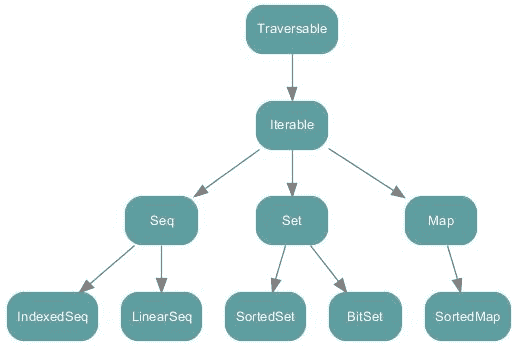
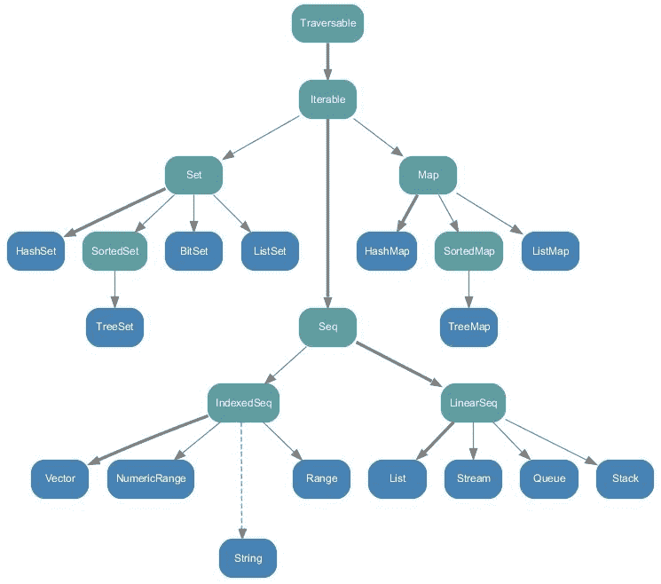
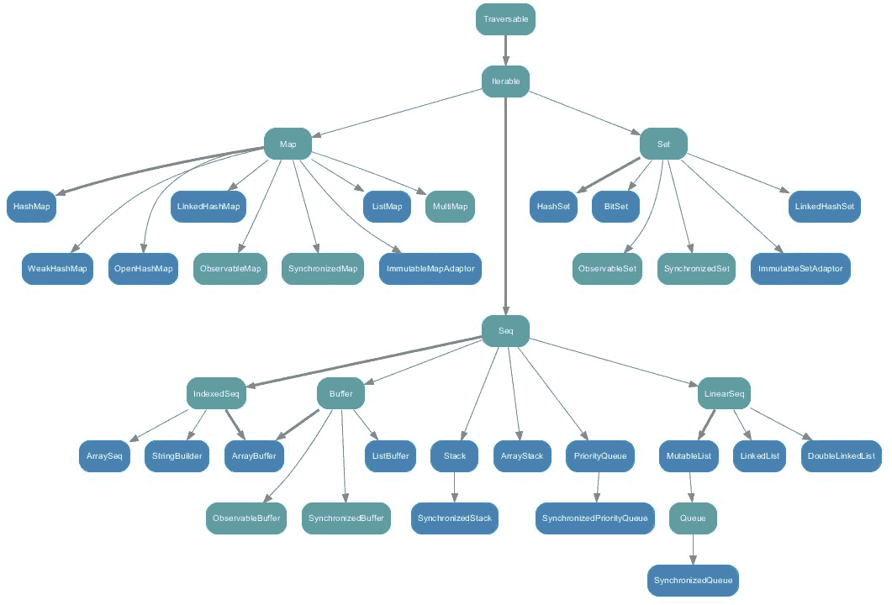

# 第四章：集合 API

"我们最终成为谁，取决于在所有教授讲授完我们之后，我们读了什么书。最伟大的大学是一本本书的集合。"

- 托马斯·卡莱尔

吸引大多数 Scala 用户的一个特点是其集合 API，非常强大、灵活，并且拥有大量的操作功能。广泛的操作范围使得你处理各种数据时变得更加轻松。我们将介绍 Scala 集合 API，包括它们的不同类型和层级，以适应不同类型的数据并解决各种不同的问题。简而言之，本章将涵盖以下内容：

+   Scala 集合 API

+   类型和层级

+   性能特性

+   Java 互操作性

+   使用 Scala 隐式参数

# Scala 集合 API

Scala 集合是一个广泛理解且常用的编程抽象，可以区分可变集合和不可变集合。像可变变量一样，*可变*集合可以在必要时更改、更新或扩展。然而，像不可变变量一样，*不可变*集合无法更改。大多数集合类被分别放置在 `scala.collection`、`scala.collection.immutable` 和 `scala.collection.mutable` 包中。

这个极其强大的 Scala 特性为你提供了以下的功能，可以用来操作和处理你的数据：

+   **易于使用**：例如，它帮助你消除迭代器和集合更新之间的干扰。因此，20-50 个方法的小词汇量应该足以解决数据分析解决方案中的大多数集合问题。

+   **简洁**：你可以使用轻量级语法进行函数式操作，结合多个操作，最终你会感觉自己在使用自定义代数。

+   **安全**：帮助你在编码时处理大多数错误。

+   **快速**：大多数集合对象经过精心调优和优化，使得你的数据计算能够更快速地进行。

+   **通用**：集合使你能够对任何类型的数据执行相同的操作，无论在哪里。

在接下来的章节中，我们将探索 Scala 集合 API 的类型和关联层级。我们将展示如何使用集合 API 中的大多数功能的几个示例。

# 类型和层级

Scala 集合是一个广泛理解且常用的编程抽象，可以区分可变集合和不可变集合。像可变变量一样，*可变*集合可以在必要时更改、更新或扩展。像不可变变量一样，*不可变*集合无法更改。大多数使用这些集合的类分别位于 `scala.collection`、`scala.collection.immutable` 和 `scala.collection.mutable` 包中。

以下层级图（*图 1*）展示了根据 Scala 官方文档，Scala 集合 API 的层级结构。这些都是高级抽象类或特质，既有可变的实现，也有不可变的实现。

**图 1:** 包下的集合 scala.collection

# Traversable

**Traversable** 是集合层级结构的根。在 Traversable 中，定义了 Scala 集合 API 提供的广泛操作。Traversable 中只有一个抽象方法，即 `foreach` 方法。

```py
def foreachU: Unit

```

该方法对 Traversable 中包含的所有操作至关重要。如果你研究过数据结构，你会熟悉遍历数据结构的元素并在每个元素上执行一个函数。`foreach` 方法正是做这样的事情，它遍历集合中的元素并对每个元素执行函数 `f`。正如我们提到的，这是一个抽象方法，它被设计成根据底层集合的不同，提供不同的定义，以确保每个集合的代码高度优化。

# Iterable

**Iterable** 是 Scala 集合 API 层级图中的第二个根。它有一个抽象方法叫做 iterator，必须在所有其他子集合中实现/定义。它还实现了来自根 Traversable 的 `foreach` 方法。正如我们所提到的，所有的后代子集合将会覆盖此实现，以进行与该子集合相关的特定优化。

# Seq、LinearSeq 和 IndexedSeq

序列与常规 Iterable 有一些区别，它有定义的长度和顺序。Seq 有两个子特质，如 `LinearSeq` 和 `IndexedSeq`。让我们快速浏览一下它们。

`LinearSeq` 是线性序列的基特质。线性序列具有相对高效的 head、tail 和 `isEmpty` 方法。如果这些方法提供了遍历集合的最快方式，则扩展该特质的集合 `Coll` 还应该扩展 `LinearSeqOptimized[A, Coll[A]]`。`LinearSeq` 有三个具体方法：

+   **isEmpty:** 检查列表是否为空

+   **head**: 该方法返回列表/序列中的第一个元素

+   **tail**: 返回列表中的所有元素，但不包括第一个元素。每个继承 `LinearSeq` 的子集合将会有自己对这些方法的实现，以确保良好的性能。两个继承/扩展的集合是流和列表。

更多内容，请参考此链接：[`www.scala-lang.org/api/current/scala/collection/LinearSeq.html.`](http://www.scala-lang.org/api/current/scala/collection/LinearSeq.html)

最后，`IndexedSeq` 有两个方法，它是通过这两个方法定义的：

+   **Apply**: 通过索引查找元素。

+   **length**：返回序列的长度。通过索引查找元素需要子集合实现的高效性能。这些有索引的序列有`Vector`和`ArrayBuffer`。

# 可变与不可变

在 Scala 中，你会发现可变和不可变集合。一个集合可以有可变实现和不可变实现。这就是为什么在 Java 中，`List`不能同时是`LinkedList`和`ArrayList`，但`List`有`LinkedList`实现和`ArrayList`实现的原因。下图展示了`scala.collection.immutable`包中的所有集合：

**图 2：** 所有在包`scala.collection.immutable`中的集合

Scala 默认导入不可变集合，如果你需要使用可变集合，则需要自己导入。现在，为了简要了解包`scala.collection.mutable`中的所有集合，请参考以下图表：

**图 3：** 所有在包`Scala.collection.mutable`中的集合

在每一种面向对象编程（OOP）和函数式编程语言中，数组是一个重要的集合包，帮助我们存储数据对象，之后我们可以非常容易地访问它们。在下一小节中，我们将通过一些示例详细讨论数组。

# 数组

数组是一个可变的集合。在数组中，元素的顺序会被保留，重复的元素也会被保留。由于是可变的，你可以通过访问其索引号来更改数组中任何元素的值。让我们通过几个例子来演示数组的使用。使用以下代码行来声明一个简单的数组：

```py
val numbers: Array[Int] = ArrayInt // A simple array

```

现在，打印数组的所有元素：

```py
println("The full array is: ")
  for (i <- numbers) {
    print(" " + i)
  }

```

现在，打印特定元素：例如，第 3 个元素：

```py
println(numbers(2))

```

让我们把所有元素求和并打印总和：

```py
var total = 0;
for (i <- 0 to (numbers.length - 1)) {
  total = total + numbers(i)
}
println("Sum: = " + total)

```

查找最小的元素：

```py
var min = numbers(0)
for (i <- 1 to (numbers.length - 1)) {
  if (numbers(i) < min) min = numbers(i)
}
println("Min is: " + min)

```

查找最大的元素：

```py
var max = numbers(0);
for (i <- 1 to (numbers.length - 1)) {
  if (numbers(i) > max) max = numbers(i)
}
println("Max is: " + max)

```

创建和定义数组的另一种方式是使用`range()`方法，示例如下：

```py
//Creating array using range() method
var myArray1 = range(5, 20, 2)
var myArray2 = range(5, 20)

```

上面的代码行表示我创建了一个元素在 5 到 20 之间且间隔为 2 的数组。如果你没有指定第 3 个参数，Scala 会假定范围间隔为：

```py
//Creating array using range() method without range difference
var myArray1 = range(5, 20, 2)

```

现在，让我们看看如何访问元素，示例如下：

```py
// Print all the array elements
for (x <- myArray1) {
  print(" " + x)
}
println()
for (x <- myArray2) {
  print(" " + x)
}

```

使用`concat()`方法连接两个数组是完全可能的，示例如下：

```py
//Array concatenation
var myArray3 =  concat( myArray1, myArray2)      
// Print all the array elements
for ( x <- myArray3 ) {
  print(" "+ x)
}

```

请注意，为了使用`range()`和`concat()`方法，你需要像下面这样导入 Scala 的`Array`包：

```py
Import Array._

```

最后，也可以像下面这样定义和使用多维数组：

```py
var myMatrix = ofDimInt

```

现在，首先使用前面的数组创建一个矩阵，示例如下：

```py
var myMatrix = ofDimInt
// build a matrix
for (i <- 0 to 3) {
  for (j <- 0 to 3) {
    myMatrix(i)(j) = j
  }
}
println()

```

按如下方式打印之前的矩阵：

```py
// Print two dimensional array
for (i <- 0 to 3) {
  for (j <- 0 to 3) {
    print(" " + myMatrix(i)(j))
  }
  println()
}

```

之前示例的完整源代码如下所示：

```py
package com.chapter4.CollectionAPI
import Array._                                                                                         object ArrayExample {
  def main(args: Array[String]) {
    val numbers: Array[Int] = ArrayInt
    // A simple array
    // Print all the element of the array
    println("The full array is: ")
    for (i <- numbers) {
      print(" " + i)
    }
    //Print a particular element for example element 3
    println(numbers(2))
    //Summing all the elements
    var total = 0
    for (i <- 0 to (numbers.length - 1)) {
      total = total + numbers(i)
    }
    println("Sum: = " + total)
    // Finding the smallest element
    var min = numbers(0)
    for (i <- 1 to (numbers.length - 1)) {
      if (numbers(i) < min) min = numbers(i)
    }
    println("Min is: " + min)
    // Finding the largest element
    var max = numbers(0)
    for (i <- 1 to (numbers.length - 1)) {
      if (numbers(i) > max) max = numbers(i)
    }
    println("Max is: " + max)
    //Creating array using range() method
    var myArray1 = range(5, 20, 2)
    var myArray2 = range(5, 20)
    // Print all the array elements
    for (x <- myArray1) {
      print(" " + x)
    }
    println()
    for (x <- myArray2) {
      print(" " + x)
    }
    //Array concatenation
    var myArray3 = concat(myArray1, myArray2)
    // Print all the array elements
    for (x <- myArray3) {
      print(" " + x)
    }
    //Multi-dimensional array
    var myMatrix = ofDimInt
    // build a matrix
    for (i <- 0 to 3) {
      for (j <- 0 to 3) {
        myMatrix(i)(j) = j
      }
    }
    println();
    // Print two dimensional array
    for (i <- 0 to 3) {
      for (j <- 0 to 3) {
        print(" " + myMatrix(i)(j))
      }
      println();
    }
  }
}

```

你将得到以下输出：

```py
The full array is: 1 2 3 4 5 1 2 3 3 4 53 
Sum: = 33 
Min is: 1 
Max is: 5 
5 7 9 11 13 15 17 19 5 6 7 8 9 10 11 12 13 14 15 16 17 18 19 5 7 9 11 13 15 17 19 5 6 7 8 9 10 11 12 13 14 15 16 17 18 19 
0 1 2 3 
0 1 2 3 
0 1 2 3 
0 1 2 3

```

在 Scala 中，列表保持顺序，保留重复元素，并且还检查其不可变性。接下来，让我们在下一小节中查看一些使用 Scala 列表的示例。

# 列表

如前所述，Scala 提供了可变和不可变集合。不可变集合是默认导入的，但如果需要使用可变集合，则需要自行导入。列表是不可变集合，如果你想保持元素之间的顺序并保留重复元素，它可以被使用。让我们通过一个示例来演示列表如何保持顺序并保留重复元素，同时检查它的不可变性：

```py
scala> val numbers = List(1, 2, 3, 4, 5, 1, 2, 3, 4, 5)
numbers: List[Int] = List(1, 2, 3, 4, 5, 1, 2, 3, 4, 5) 
scala> numbers(3) = 10 
<console>:12: error: value update is not a member of List[Int] 
numbers(3) = 10 ^

```

你可以使用两种不同的构建块来定义列表。`Nil`表示`List`的尾部，之后是一个空的`List`。因此，前面的例子可以重写为：

```py
scala> val numbers = 1 :: 2 :: 3 :: 4 :: 5 :: 1 :: 2 :: 3:: 4:: 5 :: Nil
numbers: List[Int] = List(1, 2, 3, 4, 5, 1, 2, 3,4, 5

```

让我们通过下面的详细示例来检查列表及其方法：

```py
package com.chapter4.CollectionAPI

object ListExample {
  def main(args: Array[String]) {
    // List of cities
    val cities = "Dublin" :: "London" :: "NY" :: Nil

    // List of Even Numbers
    val nums = 2 :: 4 :: 6 :: 8 :: Nil

    // Empty List.
    val empty = Nil

    // Two dimensional list
    val dim = 1 :: 2 :: 3 :: Nil ::
                   4 :: 5 :: 6 :: Nil ::
                   7 :: 8 :: 9 :: Nil :: Nil
    val temp = Nil

    // Getting the first element in the list
    println( "Head of cities : " + cities.head )

    // Getting all the elements but the last one
    println( "Tail of cities : " + cities.tail )

    //Checking if cities/temp list is empty
    println( "Check if cities is empty : " + cities.isEmpty )
    println( "Check if temp is empty : " + temp.isEmpty )

    val citiesEurope = "Dublin" :: "London" :: "Berlin" :: Nil
    val citiesTurkey = "Istanbul" :: "Ankara" :: Nil

    //Concatenate two or more lists with :::
    var citiesConcatenated = citiesEurope ::: citiesTurkey
    println( "citiesEurope ::: citiesTurkey : "+citiesConcatenated )

    // using the concat method
    citiesConcatenated = List.concat(citiesEurope, citiesTurkey)
    println( "List.concat(citiesEurope, citiesTurkey) : " +
             citiesConcatenated  )

  }
}

```

你将得到以下输出：

```py
Head of cities : Dublin
Tail of cities : List(London, NY)
Check if cities is empty : false
Check if temp is empty : true
citiesEurope ::: citiesTurkey : List(Dublin, London, Berlin, Istanbul, Ankara)
List.concat(citiesEurope, citiesTurkey) : List(Dublin, London, Berlin, Istanbul, Ankara)

```

现在，让我们在下一个小节中快速回顾一下如何在 Scala 应用中使用集合。

# 集合

集合是最广泛使用的集合之一。在集合中，顺序不会被保留，并且集合不允许重复元素。你可以将其视为数学集合的表示法。让我们通过一个例子来演示这一点，看看集合如何不保留顺序并且不允许重复：

```py
scala> val numbers = Set( 1, 2, 3, 4, 5, 1, 2, 3, 4, 5)
numbers: scala.collection.immutable.Set[Int] = Set(5, 1, 2, 3, 4)

```

以下源代码展示了在 Scala 程序中使用集合的不同方式：

```py
package com.chapter4.CollectionAPI
object SetExample {
  def main(args: Array[String]) {
    // Empty set of integer type
    var sInteger : Set[Int] = Set()
    // Set of even numbers
    var sEven : Set[Int] = Set(2,4,8,10)
    //Or you can use this syntax
    var sEven2 = Set(2,4,8,10)
    val cities = Set("Dublin", "London", "NY")
    val tempNums: Set[Int] = Set()
    //Finding Head, Tail, and checking if the sets are empty
    println( "Head of cities : " + cities.head )
    println( "Tail of cities : " + cities.tail )
    println( "Check if cities is empty : " + cities.isEmpty )
    println( "Check if tempNums is empty : " + tempNums.isEmpty )
    val citiesEurope = Set("Dublin", "London", "NY")
    val citiesTurkey = Set("Istanbul", "Ankara")
    // Sets Concatenation using ++ operator
    var citiesConcatenated = citiesEurope ++ citiesTurkey
    println( "citiesEurope ++ citiesTurkey : " + citiesConcatenated )
    //Also you can use ++ as a method
    citiesConcatenated = citiesEurope.++(citiesTurkey)
    println( "citiesEurope.++(citiesTurkey) : " + citiesConcatenated )
    //Finding minimum and maximum elements in the set
    val evenNumbers = Set(2,4,6,8)
    // Using the min and max methods
    println( "Minimum element in Set(2,4,6,8) : " + evenNumbers.min )
    println( "Maximum element in Set(2,4,6,8) : " + evenNumbers.max )
  }
}

```

你将得到以下输出：

```py
Head of cities : Dublin
Tail of cities : Set(London, NY)
Check if cities is empty : false
Check if tempNums is empty : true
citiesEurope ++ citiesTurkey : Set(London, Dublin, Ankara, Istanbul, NY)
citiesEurope.++(citiesTurkey) : Set(London, Dublin, Ankara, Istanbul, NY)
Minimum element in Set(2,4,6,8) : 2
Maximum element in Set(2,4,6,8) : 8

```

根据我在使用 Java 或 Scala 开发 Spark 应用程序时的个人经验，我发现元组的使用非常频繁，尤其是在不使用任何显式类的情况下对元素集合进行分组。在下一个小节中，我们将看到如何在 Scala 中使用元组。

# 元组

Scala 元组用于将固定数量的项组合在一起。这个组合的最终目标是帮助匿名函数，这样它们就可以作为一个整体传递。与数组或列表的真正区别在于，元组可以包含不同类型的对象，同时保持每个元素的类型信息，而集合则不能，集合使用的类型是公共类型（例如，在前面的例子中，集合的类型是 `Set[Any]`）。

从计算角度来看，Scala 元组也是不可变的。换句话说，元组确实使用类来存储元素（例如，`Tuple2`，`Tuple3`，`Tuple22` 等）。

以下是一个示例，演示一个元组包含一个整数、一个字符串和控制台：

```py
val tuple_1 = (20, "Hello", Console)

```

这是以下内容的语法糖（快捷方式）：

```py
val t = new Tuple3(20, "Hello", Console)

```

另一个例子：

```py
scala> val cityPop = ("Dublin", 2)
cityPop: (String, Int) = (Dublin,2)

```

元组没有命名的访问器让你访问数据，而是需要使用基于位置的访问器，且是从 1 开始计数，而不是从 0 开始。比如：

```py
scala> val cityPop = ("Dublin", 2)
cityPop: (String, Int) = (Dublin,2) 
scala> cityPop._1
res3: String = Dublin 
scala> cityPop._2
res4: Int = 2

```

此外，元组可以完美地适配模式匹配。例如：

```py
cityPop match {
  case ("Dublin", population) => ...
  case ("NY", population) => ...
}

```

你甚至可以使用特殊运算符`->`来编写一个简洁的语法，用于表示两个值的元组。例如：

```py
scala> "Dublin" -> 2
res0: (String, Int) = (Dublin,2)

```

以下是一个更详细的示例，演示元组的功能：

```py
package com.chapter4.CollectionAPI
object TupleExample {
  def main(args: Array[String]) {
    val evenTuple = (2,4,6,8)
    val sumTupleElements =evenTuple._1 + evenTuple._2 + evenTuple._3 + evenTuple._4
    println( "Sum of Tuple Elements: "  + sumTupleElements )      
    // You can also iterate over the tuple and print it's element using the foreach method
    evenTuple.productIterator.foreach{ evenTuple =>println("Value = " + evenTuple )}
  }
}

```

你将得到以下输出：

```py
Sum of Tuple Elements: 20 Value = 2 Value = 4 Value = 6 Value = 8

```

现在，让我们深入了解 Scala 中使用映射（Maps）的世界，映射广泛用于存储基本数据类型。

# 映射

`Map`是一个`Iterable`，由键值对（也称为映射或关联）组成。`Map`也是最广泛使用的集合之一，因为它可以用于存储基本数据类型。例如：

```py
scala> Map(1 -> 2)
res7: scala.collection.immutable.Map[Int,Int] = Map(1 -> 2)                                                scala> Map("X" -> "Y")
res8: scala.collection.immutable.Map[String,String] = Map(X -> Y)

```

Scala 的`Predef`对象提供了一种隐式转换，使你可以将`key -> value`作为`pair (key, value)`的替代语法。例如，`Map("a" -> 10, "b" -> 15, "c" -> 16)`与`Map(("a", 10), ("b", 15), ("c", 16))`完全相同，但可读性更好。

此外，`Map`可以简单地看作是`Tuple2`的集合：

```py
Map(2 -> "two", 4 -> "four")

```

上述行将被理解为：

```py
Map((2, "two"), (4, "four"))

```

在这个示例中，我们可以说通过使用`Map`，可以存储一个函数，这就是函数式编程语言中函数的全部意义：它们是第一类公民，可以在任何地方使用。

假设你有一个方法，用于查找数组中的最大元素，如下所示：

```py
var myArray = range(5, 20, 2)
  def getMax(): Int = {
    // Finding the largest element
    var max = myArray(0)
    for (i <- 1 to (myArray.length - 1)) {
      if (myArray(i) > max)
        max = myArray(i)
    }
    max
  }

```

现在，我们将进行映射，使得可以使用`Map`方法存储数据：

```py
scala> val myMax = Map("getMax" -> getMax()) 
scala> println("My max is: " + myMax )

```

让我们再看一下使用`Map`的另一种方式：

```py
scala> Map( 2 -> "two", 4 -> "four")
res9: scala.collection.immutable.Map[Int,String] = Map(2 -> two, 4 -> four)
scala> Map( 1 -> Map("X"-> "Y"))
res10: scala.collection.immutable.Map[Int,scala.collection.immutable.Map[String,String]] = Map(1 -> Map(X -> Y))

```

以下是一个详细示例，展示`Map`的功能：

```py
package com.chapter4.CollectionAPI
import Array._

object MapExample {
  var myArray = range(5, 20, 2)

  def getMax(): Int = {
    // Finding the largest element
    var max = myArray(0)
    for (i <- 1 to (myArray.length - 1)) {
      if (myArray(i) > max)
        max = myArray(i)
    }
    max
  }

  def main(args: Array[String]) {
    val capitals = Map("Ireland" -> "Dublin", "Britain" -> "London", 
    "Germany" -> "Berlin")

    val temp: Map[Int, Int] = Map()
    val myMax = Map("getMax" -> getMax())
    println("My max is: " + myMax )

    println("Keys in capitals : " + capitals.keys)
    println("Values in capitals : " + capitals.values)
    println("Check if capitals is empty : " + capitals.isEmpty)
    println("Check if temp is empty : " + temp.isEmpty)

    val capitals1 = Map("Ireland" -> "Dublin", "Turkey" -> "Ankara",
    "Egypt" -> "Cairo")
    val capitals2 = Map("Germany" -> "Berlin", "Saudi Arabia" ->
    "Riyadh")

    // Map concatenation using ++ operator
    var capitalsConcatenated = capitals1 ++ capitals2
    println("capitals1 ++ capitals2 : " + capitalsConcatenated)

    // use two maps with ++ as method
    capitalsConcatenated = capitals1.++(capitals2)
    println("capitals1.++(capitals2)) : " + capitalsConcatenated)

  }
}

```

你将得到以下输出：

```py
My max is: Map(getMax -> 19)
Keys in capitals : Set(Ireland, Britain, Germany)
Values in capitals : MapLike(Dublin, London, Berlin)
Check if capitals is empty : false
Check if temp is empty : true
capitals1 ++ capitals2 : Map(Saudi Arabia -> Riyadh, Egypt -> Cairo, Ireland -> Dublin, Turkey -> Ankara, Germany -> Berlin)
capitals1.++(capitals2)) : Map(Saudi Arabia -> Riyadh, Egypt -> Cairo, Ireland -> Dublin, Turkey -> Ankara, Germany -> Berlin)

```

现在，让我们快速了解在 Scala 中使用 Option；它基本上是一个数据容器，可以存储数据。

# Option

`Option`类型在 Scala 程序中使用频繁，可以将其与 Java 中的 null 值进行比较，null 表示没有值。Scala 的`Option [T]`是一个容器，用来表示给定类型的零个或一个元素。`Option [T]`可以是`Some [T]`或`None`对象，表示缺失的值。例如，Scala 的`Map`的`get`方法如果找到了与给定键对应的值，会返回`Some`（值），如果给定键在`Map`中没有定义，则返回`None`。

`Option`的基本特征如下所示：

```py
trait Option[T] {
  def get: A // Returns the option's value.
  def isEmpty: Boolean // Returns true if the option is None, false
  otherwise.
  def productArity: Int // The size of this product. For a product
  A(x_1, ..., x_k), returns k
  def productElement(n: Int): Any // The nth element of this product,
  0-based
  def exists(p: (A) => Boolean): Boolean // Returns true if this option
  is nonempty 
  def filter(p: (A) => Boolean): Option[A] // Returns this Option if it
  is nonempty 
  def filterNot(p: (A) => Boolean): Option[A] // Returns this Option if
  it is nonempty or return None.
  def flatMapB => Option[B]): Option[B] // Returns result of
  applying f to this Option's 
  def foreachU => U): Unit // Apply given procedure f to the
  option's value, if it is nonempty.  
  def getOrElseB >: A: B // Returns the option's value
  if the option is nonempty, 
  def isDefined: Boolean // Returns true if the option is an instance
  of Some, false otherwise.
  def iterator: Iterator[A] // Returns a singleton iterator returning
  Option's value if it is nonempty
  def mapB => B): Option[B] // Returns a Some containing
  result of applying f to this Option's 
  def orElseB >: A: Option[B] // Returns
  this Option if it is nonempty
  def orNull // Returns the option's value if it is nonempty,
                or null if it is empty.  
}

```

例如，在以下代码中，我们试图映射并显示位于一些国家（如`印度`、`孟加拉国`、`日本`和`美国`）的一些城市：

```py
object ScalaOptions {
  def main(args: Array[String]) {
    val megacity = Map("Bangladesh" -> "Dhaka", "Japan" -> "Tokyo",
    "India" -> "Kolkata", "USA" -> "New York")
    println("megacity.get( \"Bangladesh\" ) : " + 
    show(megacity.get("Bangladesh")))
    println("megacity.get( \"India\" ) : " + 
    show(megacity.get("India")))
  }
}

```

现在，为了使前面的代码正常工作，我们需要在某处定义`show()`方法。在这里，我们可以通过 Scala 的模式匹配来使用`Option`，如下所示：

```py
def show(x: Option[String]) = x match {
  case Some(s) => s
  case None => "?"
}

```

将这些组合如下所示，应该会打印出我们期望的准确结果：

```py
package com.chapter4.CollectionAPI
object ScalaOptions {
  def show(x: Option[String]) = x match {
    case Some(s) => s
    case None => "?"
  } 
  def main(args: Array[String]) {
    val megacity = Map("Bangladesh" -> "Dhaka", "Japan" -> "Tokyo",
    "India" -> "Kolkata", "USA" -> "New York")
    println("megacity.get( \"Bangladesh\" ) : " +
    show(megacity.get("Bangladesh")))
    println("megacity.get( \"India\" ) : " +
    show(megacity.get("India")))
  }
}

```

你将得到以下输出：

```py
megacity.get( "Bangladesh" ) : Dhaka
megacity.get( "India" ) : Kolkata

```

使用`getOrElse()`方法，当没有值时，可以访问一个值或默认值。例如：

```py
// Using getOrElse() method: 
val message: Option[String] = Some("Hello, world!")
val x: Option[Int] = Some(20)
val y: Option[Int] = None
println("message.getOrElse(0): " + message.getOrElse(0))
println("x.getOrElse(0): " + x.getOrElse(0))
println("y.getOrElse(10): " + y.getOrElse(10))

```

你将得到以下输出：

```py
message.getOrElse(0): Hello, world!
x.getOrElse(0): 20
y.getOrElse(10): 10

```

此外，使用`isEmpty()`方法，你可以检查该 Option 是否为`None`。例如：

```py
println("message.isEmpty: " + message.isEmpty)
println("x.isEmpty: " + x.isEmpty)
println("y.isEmpty: " + y.isEmpty)

```

现在，这是完整的程序：

```py
package com.chapter4.CollectionAPI
object ScalaOptions {
  def show(x: Option[String]) = x match {
    case Some(s) => s
    case None => "?"
  }
  def main(args: Array[String]) {
    val megacity = Map("Bangladesh" -> "Dhaka", "Japan" -> "Tokyo",
    "India" -> "Kolkata", "USA" -> "New York")
    println("megacity.get( \"Bangladesh\" ) : " +
    show(megacity.get("Bangladesh")))
    println("megacity.get( \"India\" ) : " +
    show(megacity.get("India")))

    // Using getOrElse() method: 
    val message: Option[String] = Some("Hello, world")
    val x: Option[Int] = Some(20)
    val y: Option[Int] = None

    println("message.getOrElse(0): " + message.getOrElse(0))
    println("x.getOrElse(0): " + x.getOrElse(0))
    println("y.getOrElse(10): " + y.getOrElse(10))

    // Using isEmpty()
    println("message.isEmpty: " + message.isEmpty)
    println("x.isEmpty: " + x.isEmpty)
    println("y.isEmpty: " + y.isEmpty)
  }
}

```

你将得到以下输出：

```py
megacity.get( "Bangladesh" ) : Dhaka
megacity.get( "India" ) : Kolkata
message.getOrElse(0): Hello, world
x.getOrElse(0): 20
y.getOrElse(10): 10
message.isEmpty: false
x.isEmpty: false
y.isEmpty: true

```

让我们看看其他一些使用`Option`的示例。例如，`Map.get()`方法使用`Option`来告诉用户他尝试访问的元素是否存在。例如：

```py
scala> val numbers = Map("two" -> 2, "four" -> 4)
numbers: scala.collection.immutable.Map[String,Int] = Map(two -> 2, four -> 4)
scala> numbers.get("four")
res12: Option[Int] = Some(4)
scala> numbers.get("five")
res13: Option[Int] = None

```

现在，我们将看到如何使用`exists`，它用于检查一个谓词是否适用于集合中元素的子集。

# 存在

Exists 检查一个谓词是否对可遍历集合中的至少一个元素成立。例如：

```py
def exists(p: ((A, B)) ⇒ Boolean): Boolean  

```

**使用 fat 箭头：** `=>` 被称为*右箭头*、*fat 箭头*或*火箭*，用于按名称传递参数。这意味着表达式将在访问参数时求值。它实际上是一个零参数函数`call: x: () => Boolean`的语法糖。让我们看看使用这个操作符的示例如下：

`package com.chapter4.CollectionAPI`

`object UsingFatArrow {`

`def fliesPerSecond(callback: () => Unit) {`

`while (true) { callback(); Thread sleep 1000 }`

`}`

`def main(args: Array[String]): Unit= {`

`fliesPerSecond(() => println("时间和潮水不等人，但飞如箭一般..."))`

`}`

`}`

你将得到如下输出：

`时间和潮水不等人，但飞如箭一般...`

`时间和潮水不等人，但飞如箭一般...`

`时间和潮水不等人，但飞如箭一般...`

`时间和潮水不等人，但飞如箭一般...`

`时间和潮水不等人，但飞如箭一般...`

`时间和潮水不等人，但飞如箭一般...`

下面的代码展示了一个详细示例：

```py
package com.chapter4.CollectionAPI

object ExistsExample {
  def main(args: Array[String]) {
    // Given a list of cities and now check if "Dublin" is included in
    the list     
    val cityList = List("Dublin", "NY", "Cairo")
    val ifExisitsinList = cityList exists (x => x == "Dublin")
    println(ifExisitsinList)

    // Given a map of countries and their capitals check if Dublin is
    included in the Map 
    val cityMap = Map("Ireland" -> "Dublin", "UK" -> "London")
    val ifExistsinMap =  cityMap exists (x => x._2 == "Dublin")
    println(ifExistsinMap)
  }
}

```

你将得到如下输出：

```py
true
true

```

**注意：在 Scala 中使用中缀操作符：**

在之前的示例和随后的章节中，我们使用了 Scala 的中缀表示法。假设你想对复数执行一些操作，并且有一个带有 add 方法的 case 类，用于添加两个复数：

```py
case class Complex(i: Double, j: Double) {
   def plus(other: Complex): Complex = Complex(i + other.i, j + other.j)
 }

```

现在，为了访问这个类的属性，你需要创建一个对象，如下所示：

```py
val obj = Complex(10, 20)

```

此外，假设你定义了以下两个复数：

```py
val a = Complex(6, 9)
 val b = Complex(3, -6)

```

现在，要访问 case 类中的`plus()`方法，你可以这样做：

```py
val z = obj.plus(a)

```

这应该给你输出：`Complex(16.0,29.0)`。然而，如果你像这样调用方法，不是更好吗：

```py
val c = a plus b

```

它真的像魅力一样有效。这里是完整的示例：

```py
package com.chapter4.CollectionAPI
 object UsingInfix {
   case class Complex(i: Double, j: Double) {
     def plus(other: Complex): Complex = Complex(i + other.i, j + other.j)
   }  
   def main(args: Array[String]): Unit = {    
     val obj = Complex(10, 20)
     val a = Complex(6, 9)
     val b = Complex(3, -6)
     val c = a plus b
     val z = obj.plus(a)
     println(c)
     println(z)
   }
 }

```

**中缀操作符的优先级：** 由操作符的第一个字符决定。字符按优先级递增的顺序列出，同行的字符具有相同的优先级：

```py
(all letters)
 |
 ^
 &
 = !
 < >
 :
 + -
 * / %
 (all other special characters)

```

**常规警告：** 使用中缀表示法调用常规的非符号方法是不推荐的，只有在显著提高可读性的情况下才应使用。中缀表示法的一个充分动机的示例是在`ScalaTest`中定义匹配器和其他部分的测试。

Scala 集合包中另一个有趣的元素是使用`forall`。它用于检查一个谓词是否对`Traversable`集合中的每个元素成立。在接下来的子章节中，我们将看到它的示例。

# Forall

Forall 检查一个谓词是否对`Traversable`集合中的每个元素成立。可以正式地定义如下：

```py
def forall (p: (A) ⇒ Boolean): Boolean  

```

让我们看看如下示例：

```py
scala> Vector(1, 2, 8, 10) forall (x => x % 2 == 0)
res2: Boolean = false

```

在编写 Scala 代码进行预处理时，尤其是我们经常需要筛选选定的数据对象。Scala 集合 API 的过滤功能用于此目的。在下一个小节中，我们将看到使用 filter 的示例。

# Filter

`filter` 选择所有满足特定条件的元素。它可以正式定义如下：

```py
def filter(p: (A) ⇒ Boolean): Traversable[A]  

```

让我们看一个如下的示例：

```py
scala> //Given a list of tuples (cities, Populations)
scala> // Get all cities that has population more than 5 million
scala> List(("Dublin", 2), ("NY", 8), ("London", 8)) filter (x =>x._2 >= 5)
res3: List[(String, Int)] = List((NY,8), (London,8))

```

Map 用于通过遍历一个函数作用于集合的所有元素来构建一个新的集合或元素集。在下一个小节中，我们将看到使用 `Map` 的示例。

# Map

Map 用于通过遍历一个函数作用于集合的所有元素来构建一个新的集合或元素集。它可以正式定义如下：

```py
def mapB ⇒ B): Map[B]  

```

让我们看一个如下的示例：

```py
scala> // Given a list of integers
scala> // Get a list with all the elements square.
scala> List(2, 4, 5, -6) map ( x=> x * x)
res4: List[Int] = List(4, 16, 25, 36)

```

在使用 Scala 集合 API 时，你经常需要选择列表或数组中的第 n^(个) 元素。例如，在下一个小节中，我们将探讨使用 take 的示例。

# Take

Take 用于获取集合中的前 n 个元素。使用 `take` 的正式定义如下：

```py
def take(n: Int): Traversable[A]

```

让我们看一个如下的示例：

```py
// Given an infinite recursive method creating a stream of odd numbers.
def odd: Stream[Int] = {
  def odd0(x: Int): Stream[Int] =
    if (x%2 != 0) x #:: odd0(x+1)
    else odd0(x+1)
      odd0(1)
}// Get a list of the 5 first odd numbers.
odd take (5) toList

```

你将得到如下输出：

```py
res5: List[Int] = List(1, 3, 5, 7, 9)

```

在 Scala 中，如果你想根据特定的分区函数将特定集合划分为另一个 `Traversable` 集合的映射，你可以使用 `groupBy()` 方法。在下一个小节中，我们将展示一些使用 `groupBy()` 的示例。

# GroupBy

GroupBy 用于根据特定的分区函数将特定集合划分为其他 `Traversable` 集合的映射。它可以正式定义如下：

```py
def groupByK) ⇒ K): Map[K, Map[A, B]]  

```

让我们看一个如下的示例：

```py
scala> // Given a list of numbers
scala> // Group them as positive and negative numbers.
scala> List(1,-2,3,-4) groupBy (x => if (x >= 0) "positive" else "negative")
res6: scala.collection.immutable.Map[String,List[Int]] = Map(negative -> List(-2, -4), positive -> List(1, 3))

```

在 Scala 中，如果你想选择 `Traversable` 集合中的所有元素，除了最后一个，你可以使用 `init`。在下一个小节中，我们将看到相关示例。

# Init

`init` 选择 `Traversable` 集合中的所有元素，除了最后一个。它可以正式定义如下：

```py
def init: Traversable[A]  

```

让我们看一个如下的示例：

```py
scala> List(1,2,3,4) init
res7: List[Int] = List(1, 2, 3)

```

在 Scala 中，如果你想选择除前 n 个元素外的所有元素，你应该使用 drop。在下一个小节中，我们将看到如何使用 drop。

# Drop

`drop` 用于选择除前 n 个元素外的所有元素。它可以正式定义如下：

```py
def drop(n: Int): Traversable[A]  

```

让我们看一个如下的示例：

```py
// Drop the first three elements
scala> List(1,2,3,4) drop 3
res8: List[Int] = List(4)

```

在 Scala 中，如果你想获取一组元素直到满足某个条件，你应该使用 `takeWhile`。在下一个小节中，我们将看到如何使用 `takeWhile`。

# TakeWhile

TakeWhile 用于获取一组元素直到满足某个条件。它可以正式定义如下：

```py
def takeWhile(p: (A) ⇒ Boolean): Traversable[A]  

```

让我们看一个如下的示例：

```py
// Given an infinite recursive method creating a stream of odd numbers.
def odd: Stream[Int] = {
  def odd0(x: Int): Stream[Int] =
    if (x%2 != 0) x #:: odd0(x+1)
    else odd0(x+1)
      odd0(1)
}
// Return a list of all the odd elements until an element isn't less then 9\. 
odd takeWhile (x => x < 9) toList

```

你将得到如下输出：

```py
res11: List[Int] = List(1, 3, 5, 7)

```

在 Scala 中，如果你想省略一组元素直到满足某个条件，你应该使用 `dropWhile`。我们将在下一个小节中看到一些相关示例。

# DropWhile

`dropWhile` 用于省略一组元素直到满足某个条件。它可以正式定义如下：

```py
def dropWhile(p: (A) ⇒ Boolean): Traversable[A]  

```

让我们看一个如下的示例：

```py
//Drop values till reaching the border between numbers that are greater than 5 and less than 5
scala> List(2,3,4,9,10,11) dropWhile(x => x <5)
res1: List[Int] = List(9, 10, 11)

```

在 Scala 中，如果你想要使用你的 **用户定义函数** (**UDF**)，使其接受嵌套列表中的函数作为参数，并将输出重新组合，`flatMap()` 是一个完美的选择。我们将在下一节中看到如何使用 `flatMap()` 的示例。

# FlatMap

FlatMap 接受一个函数作为参数。传递给 `flatMap()` 的函数并不会作用于嵌套列表，而是会生成一个新的集合。它可以正式定义如下：

```py
def flatMapB ⇒ GenTraversableOnce[B]): Traversable[B]  

```

让我们来看一个如下的例子：

```py
//Applying function on nested lists and then combining output back together
scala> List(List(2,4), List(6,8)) flatMap(x => x.map(x => x * x))
res4: List[Int] = List(4, 16, 36, 64)

```

我们已经基本完成了 Scala 集合特性用法的介绍。还需要注意的是，像 `Fold()`、`Reduce()`、`Aggregate()`、`Collect()`、`Count()`、`Find()` 和 `Zip()` 等方法可以用于从一个集合转换到另一个集合（例如，`toVector`、`toSeq`、`toSet`、`toArray`）。然而，我们将在接下来的章节中看到这些示例。现在是时候查看不同 Scala 集合 API 的一些性能特性了。

# 性能特性

在 Scala 中，不同的集合有不同的性能特性，而这些特性是你选择某个集合而非其他集合的原因。在本节中，我们将从操作和内存使用的角度评估 Scala 集合对象的性能特性。在本节末尾，我们将提供一些指导，帮助你根据代码和问题类型选择合适的集合对象。

# 集合对象的性能特性

以下是根据官方文档，Scala 集合的性能特性。

+   **常量**：该操作仅需常量时间。

+   **eConst**：该操作实际上采用常量时间，但这可能取决于一些假设，例如向量的最大长度或哈希键的分布。

+   **线性**：该操作随着集合大小按线性增长。

+   **对数**：该操作随着集合大小按对数增长。

+   **aConst**：该操作采用摊销常量时间。有些操作的调用可能会更长，但如果执行多个操作，平均每次操作只需常量时间。

+   **不适用**：操作不支持。

序列类型（不可变）的性能特性在下表中呈现。

| **不可变 CO*** | **头部** | **尾部** | **应用** | **更新** | **前置** | **附加** | **插入** |
| --- | --- | --- | --- | --- | --- | --- | --- |
| 列表 | 常量 | 常量 | 线性 | 线性 | 常量 | 线性 | 不适用 |
| 流 | 常量 | 常量 | 线性 | 线性 | 常量 | 线性 | 不适用 |
| 向量 | eConst | eConst | eConst | eConst | eConst | eConst | 不适用 |
| 栈 | 常量 | 常量 | 线性 | 线性 | 常量 | 线性 | 线性 |
| 队列 | aConst | aConst | 线性 | 线性 | 常量 | 常量 | 不适用 |
| 范围 | 常量 | 常量 | 常量 | 不适用 | 不适用 | 不适用 | 不适用 |
| 字符串 | 常量 | 线性 | 常量 | 线性 | 线性 | 线性 | 不适用 |

**表 1：** 序列类型（不可变）的性能特性 [*CO== 集合对象]

以下表格显示了 **表 1** 和 **表 3** 中描述的操作的含义：

| **头部** | 用于选择现有序列的前几个元素。 |
| --- | --- |
| **尾部** | 用于选择所有元素，除了第一个，并返回一个新的序列。 |
| **应用** | 用于索引目的。 |
| **更新** | 用于不可变序列的功能性更新。对于可变序列，它是带有副作用的更新（适用于可变序列的更新）。 |
| **前置** | 用于将一个元素添加到现有序列的开头。对于不可变序列，会生成一个新的序列。对于可变序列，现有序列会被修改。 |
| **附加** | 用于在现有序列的末尾添加一个元素。对于不可变序列，会生成一个新的序列。对于可变序列，现有序列会被修改。 |
| **插入** | 用于在现有序列的任意位置插入一个元素。对于可变序列，可以直接执行此操作。 |

**表 2：** 表 1 中描述的操作的含义

序列类型（可变）的性能特征显示在 **表 3** 中，如下所示：

| **可变 CO*** | **头部** | **尾部** | **应用** | **更新** | **前置** | **附加** | **插入** |
| --- | --- | --- | --- | --- | --- | --- | --- |
| ArrayBuffer | 常量 | 线性 | 常量 | 常量 | 线性 | aConst | 线性 |
| ListBuffer | 常量 | 线性 | 线性 | 线性 | 常量 | 常量 | 线性 |
| StringBuilder | 常量 | 线性 | 常量 | 常量 | 线性 | aCconst | 线性 |
| MutableList | 常量 | 线性 | 线性 | 线性 | 常量 | 常量 | 线性 |
| 队列 | 常量 | 线性 | 线性 | 线性 | 常量 | 常量 | 线性 |
| ArraySeq | 常量 | 线性 | 常量 | 常量 | 不适用 | 不适用 | 不适用 |
| 栈 | 常量 | 线性 | 线性 | 线性 | 常量 | 线性 | 线性 |
| ArrayStack | 常量 | 线性 | 常量 | 常量 | aConst | 线性 | 线性 |
| 数组 | 常量 | 线性 | 常量 | 常量 | 不适用 | 不适用 | 不适用 |

**表 3：** 序列类型（可变）的性能特征 [*CO== 集合对象]

有关可变集合和其他类型集合的更多信息，请参考此链接 ([`docs.scala-lang.org/overviews/collections/performance-characteristics.html`](http://docs.scala-lang.org/overviews/collections/performance-characteristics.html))。

集合类型和映射类型的性能特征显示在以下表格中：

| **集合类型** | **查找** | **添加** | **删除** | **最小值** |
| --- | --- | --- | --- | --- |
| **不可变** | - | - | - | - |
| HashSet/HashMap | eConst | eConst | eConst | 线性 |
| TreeSet/TreeMap | 对数 | 对数 | 对数 | 对数 |
| BitSet | 常量 | 线性 | 线性 | eConst* |
| ListMap | 线性 | 线性 | 线性 | 线性 |
| **集合类型** | **查找** | **添加** | **删除** | **最小值** |
| **可变** | - | - | - | - |
| HashSet/HashMap | eConst | eConst | eConst | 线性 |
| WeakHashMap | eConst | eConst | eConst | 线性 |
| BitSet | 常量 | aConst | 常量 | eConst* |
| TreeSet | 对数 | 对数 | 对数 | 对数 |

**表 4：** 集合和映射类型的性能特性 [ *仅在位图紧凑时适用* ]

以下表格显示了 **表 4** 中描述的每个操作的含义：

| **操作** | **含义** |
| --- | --- |
| **查找** | 用于测试一个元素是否包含在集合中。其次，也用于选择与特定键相关联的值。 |
| **添加** | 用于向集合中添加一个新元素。同时，也用于向映射中添加一个新的键/值对。 |
| **删除** | 用于从集合中移除一个元素或从映射中移除一个键。 |
| **最小值** | 用于选择集合中的最小元素或映射中的最小键。 |

**表 5：** 表 4 中描述的每个操作的含义

基本的性能指标之一是特定集合对象的内存使用情况。在接下来的章节中，我们将提供一些基于内存使用情况测量这些指标的指南。

# 集合对象的内存使用情况

有时，会遇到几个基准测试问题，例如：对于你的操作，`Lists` 比 `Vectors` 快，还是 `Vectors` 比 `Lists` 快？使用未封装的数组存储原始类型时能节省多少内存？当你做一些性能优化操作，比如预分配数组或使用 `while` 循环代替 `foreach` 调用时，究竟有多大影响？`var l: List` 还是 `val b: mutable.Buffer`？内存使用情况可以通过不同的 Scala 基准代码进行估算，例如，参考 [`github.com/lihaoyi/scala-bench`](https://github.com/lihaoyi/scala-bench)。

表 6 显示了各种不可变集合的估算大小（字节数），包括 0 元素、1 元素、4 元素以及以四的幂次增长的元素数量，一直到 1,048,576 个元素。尽管大多数是确定性的，但这些值可能会根据你的平台有所变化：

| **大小** | **0** | **1** | **4** | **16** | **64** | **256** | **1,024** | **4,069** | **16,192** | **65,536** | **262,144** | **1,048,576** |
| --- | --- | --- | --- | --- | --- | --- | --- | --- | --- | --- | --- | --- |
|  |  |  |  |  |  |  |  |  |  |  |  |  |
| 向量 | 56 | 216 | 264 | 456 | 1,512 | 5,448 | 21,192 | 84,312 | 334,440 | 1,353,192 | 5,412,168 | 21,648,072 |
| 数组[对象] | 16 | 40 | 96 | 336 | 1,296 | 5,136 | 20,496 | 81,400 | 323,856 | 1,310,736 | 5,242,896 | 20,971,536 |
| 列表 | 16 | 56 | 176 | 656 | 2,576 | 10,256 | 40,976 | 162,776 | 647,696 | 2,621,456 | 10,485,776 | 41,943,056 |
| 流（非强制） | 16 | 160 | 160 | 160 | 160 | 160 | 160 | 160 | 160 | 160 | 160 | 160 |
| 流（强制） | 16 | 56 | 176 | 656 | 2,576 | 10,256 | 40,976 | 162,776 | 647,696 | 2,621,456 | 10,485,776 | 41,943,056 |
| 集合 | 16 | 32 | 96 | 880 | 3,720 | 14,248 | 59,288 | 234,648 | 895,000 | 3,904,144 | 14,361,000 | 60,858,616 |
| 映射 | 16 | 56 | 176 | 1,648 | 6,800 | 26,208 | 109,112 | 428,592 | 1,674,568 | 7,055,272 | 26,947,840 | 111,209,368 |
| 有序集合 | 40 | 104 | 248 | 824 | 3,128 | 12,344 | 49,208 | 195,368 | 777,272 | 3,145,784 | 12,582,968 | 50,331,704 |
| Queue | 40 | 80 | 200 | 680 | 2,600 | 10,280 | 41,000 | 162,800 | 647,720 | 2,621,480 | 10,485,800 | 41,943,080 |
| String | 40 | 48 | 48 | 72 | 168 | 552 | 2,088 | 8,184 | 32,424 | 131,112 | 524,328 | 2,097,192 |

**表 6：** 各种集合的估计大小（字节）

以下表格显示了 Scala 中数组的估计大小（字节），包括 0 元素、1 元素、4 元素以及四的幂，直到 1,048,576 元素。尽管大多数情况是确定的，但这些值可能会根据平台的不同而变化：

| **大小** | **0** | **1** | **4** | **16** | **64** | **256** | **1,024** | **4,069** | **16,192** | **65,536** | **262,144** | **1,048,576** |
| --- | --- | --- | --- | --- | --- | --- | --- | --- | --- | --- | --- | --- |
|  |  |  |  |  |  |  |  |  |  |  |  |  |
| Array[Object] | 16 | 40 | 96 | 336 | 1,296 | 5,136 | 20,496 | 81,400 | 323,856 | 1,310,736 | 5,242,896 | 20,971,536 |
|  |  |  |  |  |  |  |  |  |  |  |  |  |
| **大小** | **0** | **1** | **4** | **16** | **64** | **256** | **1,024** | **4,069** | **16,192** | **65,536** | **262,144** | **1,048,576** |
|  |  |  |  |  |  |  |  |  |  |  |  |  |
| Array[Boolean] | 16 | 24 | 24 | 32 | 80 | 272 | 1,040 | 4,088 | 16,208 | 65,552 | 262,160 | 1,048,592 |
| Array[Byte] | 16 | 24 | 24 | 32 | 80 | 272 | 1,040 | 4,088 | 16,208 | 65,552 | 262,160 | 1,048,592 |
| Array[Short] | 16 | 24 | 24 | 48 | 144 | 528 | 2,064 | 8,160 | 32,400 | 131,088 | 524,304 | 2,097,168 |
| Array[Int] | 16 | 24 | 32 | 80 | 272 | 1,040 | 4,112 | 16,296 | 64,784 | 262,160 | 1,048,592 | 4,194,320 |
| Array[Long] | 16 | 24 | 48 | 144 | 528 | 2,064 | 8,208 | 32,568 | 129,552 | 524,304 | 2,097,168 | 8,388,624 |
| Boxed Array[Boolean] | 16 | 40 | 64 | 112 | 304 | 1,072 | 4,144 | 16,328 | 64,816 | 262,192 | 1,048,624 | 4,194,352 |
| Boxed Array[Byte] | 16 | 40 | 96 | 336 | 1,296 | 5,136 | 8,208 | 20,392 | 68,880 | 266,256 | 1,052,688 | 4,198,416 |
| Boxed Array[Short] | 16 | 40 | 96 | 336 | 1,296 | 5,136 | 20,496 | 81,400 | 323,856 | 1,310,736 | 5,230,608 | 20,910,096 |
| Boxed Array[Int] | 16 | 40 | 96 | 336 | 1,296 | 5,136 | 20,496 | 81,400 | 323,856 | 1,310,736 | 5,242,896 | 20,971,536 |
| Boxed Array[Long] | 16 | 48 | 128 | 464 | 1,808 | 7,184 | 28,688 | 113,952 | 453,392 | 1,835,024 | 7,340,048 | 29,360,144 |

**表 7**：Scala 中数组的估计大小（字节）

然而，本书并未广泛区分这些，因此我们将省略对这些话题的讨论。有关更多指导，请参阅以下信息框：

有关带有计时代码的 Scala 集合的详细基准测试，请参考 GitHub 上的此链接（[`github.com/lihaoyi/scala-bench/tree/master/bench/src/main/scala/bench`](https://github.com/lihaoyi/scala-bench/tree/master/bench/src/main/scala/bench)）。

正如我们在第一章中提到的，*Scala 入门*，Scala 有一个非常丰富的集合 API。Java 也是如此，但两者的集合 API 之间有很多差异。在接下来的章节中，我们将看到一些关于 Java 互操作性的示例。

# Java 互操作性

如前所述，Scala 具有非常丰富的集合 API。Java 也是如此，但两者之间有很多差异。例如，两者的 API 都有可迭代（iterable）、迭代器（iterators）、映射（maps）、集合（sets）和序列（sequences）。但是，Scala 有优势；它更加关注不可变集合，并为你提供了更多的操作，以便生成另一个集合。有时，你可能需要使用或访问 Java 集合，或者反之亦然。

`JavaConversions` 已不再是一个合适的选择。`JavaConverters` 使得 Scala 和 Java 集合之间的转换更加明确，你会更少遇到那些你并未打算使用的隐式转换。

事实上，做到这一点相当简单，因为 Scala 提供了一种隐式的方式在 `JavaConversion` 对象中转换这两种 API。因此，你可能会发现以下类型的双向转换：

```py
Iterator               <=>     java.util.Iterator
Iterator               <=>     java.util.Enumeration
Iterable               <=>     java.lang.Iterable
Iterable               <=>     java.util.Collection
mutable.Buffer         <=>     java.util.List
mutable.Set            <=>     java.util.Set
mutable.Map            <=>     java.util.Map
mutable.ConcurrentMap  <=>     java.util.concurrent.ConcurrentMap

```

为了能够使用这些类型的转换，你需要从 `JavaConversions` 对象中导入它们。例如：

```py
scala> import collection.JavaConversions._
import collection.JavaConversions._

```

通过此，你可以在 Scala 集合和其对应的 Java 集合之间进行自动转换：

```py
scala> import collection.mutable._
import collection.mutable._
scala> val jAB: java.util.List[Int] = ArrayBuffer(3,5,7)
jAB: java.util.List[Int] = [3, 5, 7]
scala> val sAB: Seq[Int] = jAB
sAB: scala.collection.mutable.Seq[Int] = ArrayBuffer(3, 5, 7)
scala> val jM: java.util.Map[String, Int] = HashMap("Dublin" -> 2, "London" -> 8)
jM: java.util.Map[String,Int] = {Dublin=2, London=8}

```

你也可以尝试将其他 Scala 集合转换为 Java 集合。例如：

```py
Seq           =>    java.util.List
mutable.Seq   =>    java.utl.List
Set           =>    java.util.Set
Map           =>    java.util.Map 

```

Java 不提供区分不可变集合和可变集合的功能。`List` 将是 `java.util.List`，在尝试修改其元素时会抛出 `Exception`。以下是一个示例来演示这一点：

```py
scala> val jList: java.util.List[Int] = List(3,5,7)
jList: java.util.List[Int] = [3, 5, 7]
scala> jList.add(9)
java.lang.UnsupportedOperationException
 at java.util.AbstractList.add(AbstractList.java:148)
 at java.util.AbstractList.add(AbstractList.java:108)
 ... 33 elided

```

在第二章，*面向对象的 Scala* 中，我们简要讨论了使用隐式。我们将在接下来的章节中提供关于如何使用隐式的详细讨论。

# 使用 Scala 隐式

我们在前面的章节中已经讨论了隐式（implicits），但这里我们将看到更多的示例。隐式参数与默认参数非常相似，但它们使用不同的机制来找到默认值。

隐式参数是传递给构造函数或方法的，并标记为隐式，这意味着如果你没有为该参数提供值，编译器将在作用域内搜索隐式值。例如：

```py
scala> def func(implicit x:Int) = print(x) 
func: (implicit x: Int)Unit
scala> func
<console>:9: error: could not find implicit value for parameter x: Int
 func
 ^
scala> implicit val defVal = 2
defVal: Int = 2
scala> func(3)
3

```

隐式对于集合 API 非常有用。例如，集合 API 使用隐式参数来为这些集合中的许多方法提供 `CanBuildFrom` 对象。这通常发生在用户不关心这些参数的情况下。

一个限制是，每个方法中只能有一个隐式关键字，并且它必须放在参数列表的开头。以下是一些无效的示例：

```py
scala> def func(implicit x:Int, y:Int)(z:Int) = println(y,x)
<console>:1: error: '=' expected but '(' found.
 def func(implicit x:Int, y:Int)(z:Int) = println(y,x)
 ^

```

**隐式参数的数量：** 请注意，您可以有多个隐式参数。但是，您不能有多个隐式参数组。

以下是关于多个隐式参数的内容：

```py
scala> def func(implicit x:Int, y:Int)(implicit z:Int, f:Int) = println(x,y)
<console>:1: error: '=' expected but '(' found.
 def func(implicit x:Int, y:Int)(implicit z:Int, f:Int) = println(x,y)
 ^

```

函数的最终参数列表可以被标记为隐式。这意味着这些值将在调用时从上下文中获取。换句话说，如果作用域中没有确切类型的隐式值，使用隐式值的源代码将无法编译。原因很简单：因为隐式值必须解析为单一的值类型，所以最好使该类型与其目的相匹配，以避免隐式冲突。

此外，您不需要方法来查找隐式转换。例如：

```py
// probably in a library
class Prefixer(val prefix: String)
def addPrefix(s: String)(implicit p: Prefixer) = p.prefix + s
// then probably in your application
implicit val myImplicitPrefixer = new Prefixer("***")
addPrefix("abc")  // returns "***abc"

```

当您的 Scala 编译器发现上下文所需要的表达式类型错误时，它将寻找一个隐式函数值来进行类型检查。因此，您的常规方法和标记为隐式的方法的区别在于，当发现`Double`但需要`Int`时，编译器会为您插入那个隐式方法。例如：

```py
scala> implicit def doubleToInt(d: Double) = d.toInt
val x: Int = 42.0

```

之前的代码将与以下内容相同：

```py
scala> def doubleToInt(d: Double) = d.toInt
val x: Int = doubleToInt(42.0)

```

在第二种情况中，我们手动插入了转换。最初，编译器会自动进行此操作。由于左侧的类型注解，转换是必需的。

在处理数据时，我们常常需要将一种类型转换为另一种类型。Scala 的隐式类型转换为我们提供了这个功能。我们将在接下来的部分看到几个示例。

# Scala 中的隐式转换

从类型`S`到类型`T`的隐式转换是通过具有函数类型`S => T`的隐式值，或通过可以转换为该类型值的隐式方法定义的。隐式转换在两种情况下应用（来源：[`docs.scala-lang.org/tutorials/tour/implicit-conversions`](http://docs.scala-lang.org/tutorials/tour/implicit-conversions)）：

+   如果一个表达式`e`的类型是`S`，而`S`不符合该表达式预期的类型`T`：

+   在`e.m`的选择中，`e`的类型是`S`，如果选择器`m`不是`S`的成员。

好吧，我们已经看到了如何在 Scala 中使用中缀操作符。现在，让我们看看一些 Scala 隐式转换的用例。假设我们有以下代码段：

```py
class Complex(val real: Double, val imaginary: Double) {
  def plus(that: Complex) = new Complex(this.real + that.real, this.imaginary + that.imaginary)
  def minus(that: Complex) = new Complex(this.real - that.real, this.imaginary - that.imaginary)
  def unary(): Double = {
    val value = Math.sqrt(real * real + imaginary * imaginary)
    value
  }
  override def toString = real + " + " + imaginary + "i"
}
object UsingImplicitConversion {
  def main(args: Array[String]): Unit = {
    val obj = new Complex(5.0, 6.0)
    val x = new Complex(4.0, 3.0)
    val y = new Complex(8.0, -7.0)

    println(x) // prints 4.0 + 3.0i
    println(x plus y) // prints 12.0 + -4.0i
    println(x minus y) // -4.0 + 10.0i
    println(obj.unary) // prints 7.810249675906654
  }
}

```

在前面的代码中，我们定义了一些用于执行加法、减法以及复数的单目运算的方法（即包括实数和虚数）。在`main()`方法中，我们使用实数调用了这些方法。输出结果如下：

```py
4.0 + 3.0i
12.0 + -4.0i
-4.0 + 10.0i
7.810249675906654

```

但是，如果我们希望支持将一个普通数字添加到一个复数上，我们该如何实现呢？我们当然可以重载我们的`plus`方法，接受一个`Double`参数，这样它就可以支持以下表达式。

```py
val sum = myComplexNumber plus 6.5

```

为此，我们可以使用 Scala 隐式转换。它支持对实数和复数的隐式转换，用于数学运算。所以，我们可以将那个元组作为隐式转换的参数，并将其转换为 `Complex`，参考以下内容：

```py
implicit def Tuple2Complex(value: Tuple2[Double, Double]) = new Complex(value._1, value._2)

```

或者，进行如下的双向到复杂转换：

```py
implicit def Double2Complex(value : Double) = new Complex(value,0.0) 

```

为了利用这种转换，我们需要导入以下内容：

```py
import ComplexImplicits._ // for complex numbers
import scala.language.implicitConversions // in general

```

现在，我们可以在 Scala REPL/IDE 上执行如下操作：

```py
val z = 4 plus y
println(z) // prints 12.0 + -7.0i
val p = (1.0, 1.0) plus z
println(p) // prints 13.0 + -6.0i 

```

你将获得以下输出：

```py
12.0 + -7.0i
13.0 + -6.0i

```

此示例的完整源代码如下所示：

```py
package com.chapter4.CollectionAPI
import ComplexImplicits._
import scala.language.implicitConversions
class Complex(val real: Double, val imaginary: Double) {
  def plus(that: Complex) = new Complex(this.real + that.real, this.imaginary + that.imaginary)
  def plus(n: Double) = new Complex(this.real + n, this.imaginary)
  def minus(that: Complex) = new Complex(this.real - that.real, this.imaginary - that.imaginary)
  def unary(): Double = {
    val value = Math.sqrt(real * real + imaginary * imaginary)
    value
  }
  override def toString = real + " + " + imaginary + "i"
}
object ComplexImplicits {
  implicit def Double2Complex(value: Double) = new Complex(value, 0.0)
  implicit def Tuple2Complex(value: Tuple2[Double, Double]) = new Complex(value._1, value._2)
}
object UsingImplicitConversion {
  def main(args: Array[String]): Unit = {
    val obj = new Complex(5.0, 6.0)
    val x = new Complex(4.0, 3.0)
    val y = new Complex(8.0, -7.0)
    println(x) // prints 4.0 + 3.0i
    println(x plus y) // prints 12.0 + -4.0i
    println(x minus y) // -4.0 + 10.0i
    println(obj.unary) // prints 7.810249675906654
    val z = 4 plus y
    println(z) // prints 12.0 + -7.0i
    val p = (1.0, 1.0) plus z
    println(p) // prints 13.0 + -6.0i
  }
} 

```

我们现在已经或多或少覆盖了 Scala 集合 API。还有其他功能，但由于页面限制，我们未能覆盖它们。对此感兴趣的读者如果仍想进一步了解，应该参考此页面 [`www.scala-lang.org/docu/files/collections-api/collections.html`](http://www.scala-lang.org/docu/files/collections-api/collections.html)。

# 总结

在本章中，我们看到许多使用 Scala 集合 API 的示例。它非常强大、灵活，并且与许多操作结合在一起。这个广泛的操作范围将使你在处理任何类型的数据时更加轻松。我们介绍了 Scala 集合 API，以及它的不同类型和层次结构。我们还演示了 Scala 集合 API 的功能，以及它如何被用来容纳不同类型的数据，并解决广泛的各种问题。总之，你了解了类型和层次结构、性能特性、Java 互操作性以及隐式转换的使用。因此，这基本上就是学习 Scala 的结束。然而，你将通过接下来的章节继续学习更多的高级主题和操作。

在下一章中，我们将探讨数据分析和大数据，了解大数据所带来的挑战，以及如何通过分布式计算和函数式编程推荐的方法来应对这些挑战。你还将学习到 MapReduce、Apache Hadoop，以及最后的 Apache Spark，并了解它们如何采用这种方法和技术。
