# 第五章：应对大数据——Spark 登场

对于正确问题的近似答案，比对于近似问题的精确答案更有价值。

- 约翰·图基

在本章中，你将学习数据分析和大数据；我们将看到大数据带来的挑战以及如何应对这些挑战。你将学习分布式计算以及函数式编程提出的方法；我们将介绍 Google 的 MapReduce、Apache Hadoop，最后是 Apache Spark，并展示它们如何采纳这些方法和技术。

简而言之，本章将涵盖以下主题：

+   数据分析简介

+   大数据简介

+   使用 Apache Hadoop 的分布式计算

+   Apache Spark 来了

# 数据分析简介

**数据分析**是应用定性和定量技术来检查数据的过程，目的是提供有价值的洞察。通过各种技术和概念，数据分析可以为探索数据提供手段，即**探索性数据分析**（**EDA**），并对数据得出结论，即**验证性数据分析**（**CDA**）。EDA 和 CDA 是数据分析的基本概念，理解这两者之间的区别非常重要。

EDA 涉及用于探索数据的各种方法、工具和技术，目的是在数据中发现模式以及数据中各元素之间的关系。CDA 涉及用于根据假设和统计技术或对数据的简单观察，提供对特定问题的洞察或结论的方法、工具和技术。

一个快速的例子来帮助理解这些概念是关于一个杂货店，它要求你提供提高销售和顾客满意度的方法，同时保持低运营成本。

以下是一个拥有各类商品货架的杂货店：

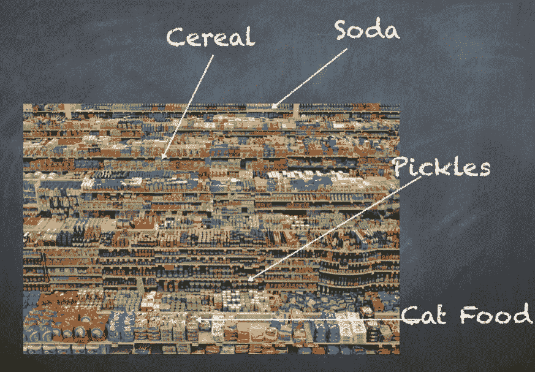

假设所有的超市销售数据都存储在某个数据库中，并且你可以访问过去 3 个月的数据。通常情况下，企业会存储多年的数据，因为你需要一定时间范围的数据来建立假设或观察到某些模式。在这个例子中，我们的目标是根据客户购买产品的方式，优化商品在各个过道的摆放。一个假设是，客户通常购买那些既在眼平线位置，又相互靠近的商品。例如，如果牛奶在商店的一角，而酸奶在商店的另一角，一些客户可能只会选择牛奶或酸奶，然后直接离开商店，这将导致销售损失。更严重的影响可能是客户选择另一个商店，因为那里的商品摆放更好，他们会觉得*在这个商店里很难找到东西*。一旦产生这种感觉，它也会传递给朋友和家人，最终导致糟糕的社交形象。这种现象在现实世界中并不少见，它导致一些企业成功，而另一些则失败，尽管两者在产品和价格上非常相似。

解决这个问题的方法有很多种，从客户调查到专业统计学家，再到机器学习科学家。我们的方法将是仅通过销售交易记录来理解我们能得出的信息。

以下是交易记录可能的样子：

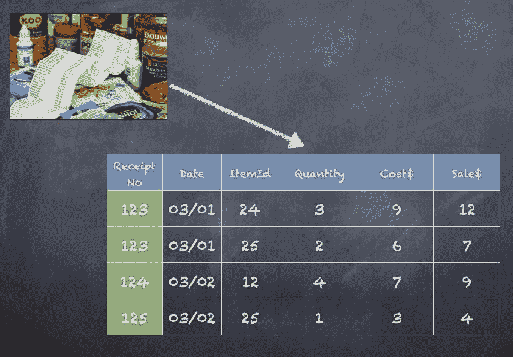

以下是你可以作为 EDA 步骤的一部分进行的操作：

1.  计算*每天购买的平均产品数量 = 每天销售的所有产品总数 / 该天的收据总数*。

1.  对前述步骤进行重复，分别针对最近 1 周、1 个月和 1 季度进行分析。

1.  尝试理解周末和平日之间是否存在差异，以及一天中的不同时间段（早晨、正午、傍晚）是否有区别。

1.  为每个产品创建一个列表，列出所有其他产品，看看哪些产品通常会一起购买（同一张收据）

1.  对 1 天、1 周、1 个月和 1 季度重复前述步骤。

1.  尝试通过交易次数（按降序排序）来确定哪些产品应该放得更近。

完成前述的 6 个步骤后，我们可以尝试为 CDA 得出一些结论。

假设这是我们得到的输出：

| **项目** | **星期几** | **数量** |
| --- | --- | --- |
| 牛奶 | 星期天 | 1244 |
| 面包 | 周一 | 245 |
| 牛奶 | 周一 | 190 |

在这种情况下，我们可以指出，**牛奶**在*周末*购买得更多，因此最好在周末增加牛奶产品的数量和种类。看看下面的表格：

| **项目 1** | **项目 2** | **数量** |
| --- | --- | --- |
| 牛奶 | 鸡蛋 | 360 |
| 面包 | 奶酪 | 335 |
| 洋葱 | 西红柿 | 310 |

在这种情况下，我们可以指出，**牛奶**和**鸡蛋**通常会被*更多*的客户在一次购买中选购，其次是**面包**和**奶酪**。因此，我们建议商店重新排列过道和货架，将**牛奶**和**鸡蛋**放得*更近*。

我们得出的两个结论是：

+   **牛奶**在*周末*购买量更多，因此最好在周末增加牛奶产品的数量和种类。

+   **牛奶**和**鸡蛋**在一次购买中被*更多*的顾客购买，其次是**面包**和**奶酪**。因此，我们建议商店重新调整货架和过道，将**牛奶**和**鸡蛋**放得*更近*一些。

结论通常会在一段时间内进行跟踪，以评估效果。如果即使在采用前两个建议 6 个月后销售没有显著影响，那么我们就可以认定这些建议没有带来良好的投资回报率（ROI）。

类似地，你也可以针对利润率和定价优化进行一些分析。这就是为什么你通常会看到单一商品的价格高于同类多个商品的平均价格。例如，买一瓶洗发水需要$7，而买两瓶洗发水则只需要$12。

想一想你可以为杂货店探索并推荐的其他方面。例如，你能仅仅通过这些产品没有特别的关联性——比如口香糖、杂志等，来推测哪些产品应当放在收银台附近吗？

数据分析项目支持各种商业用途。例如，银行和信用卡公司分析取款和消费模式以防止欺诈和身份盗窃。广告公司分析网站流量，识别那些有较高转化为顾客可能性的潜在客户。百货商店分析顾客数据，以判断更优惠的折扣是否有助于提升销售。手机运营商可以找出定价策略。有线电视公司不断寻找那些可能会流失的客户，除非提供某种优惠或促销价格来留住他们。医院和制药公司分析数据，以开发更好的产品，发现处方药的问题或评估处方药的效果。

# 数据分析过程中的内容

数据分析应用不仅仅是分析数据。在进行任何分析之前，还需要花时间和精力收集、整合和准备数据，检查数据质量，然后开发、测试和修订分析方法。数据一旦准备好，数据分析师和科学家们就可以利用统计方法（如 SAS）或使用 Spark ML 的机器学习模型对数据进行探索和分析。数据本身由数据工程团队准备，而数据质量团队则负责检查收集的数据。数据治理也是一个需要考虑的因素，以确保数据的正确收集和保护。另一个不太为人所知的角色是数据管家，他们专注于理解数据的每个细节，准确了解数据的来源、所有的转换过程以及业务对某一列或数据字段的真正需求。

业务中的不同实体可能以不同方式处理地址，如**123 N Main St**与**123 North Main Street**。但是，我们的分析依赖于获取正确的地址字段；否则，上述两个地址将被视为不同，导致我们的分析准确性降低。

分析过程始于根据分析师可能需要的数据仓库中的数据进行数据收集，收集组织中各种数据（如销售、市场营销、员工、薪资、HR 等）。数据管理员和治理团队在这里非常重要，确保收集到正确的数据，并且任何被认为是机密或私密的信息不会被意外导出，即使最终用户都是员工。

社会保障号码或完整地址可能不适合包含在分析中，因为这可能会给组织带来许多问题。

必须建立数据质量流程，以确保收集和处理的数据是正确的，并且能够满足数据科学家的需求。在这一阶段，主要目标是发现和解决可能影响分析需求准确性的数据质量问题。常用的技术包括数据概况分析和数据清洗，以确保数据集中的信息一致，并删除任何错误和重复记录。

来自不同源系统的数据可能需要使用各种数据工程技术进行合并、转换和规范化，例如分布式计算或 MapReduce 编程、流处理或 SQL 查询，然后将数据存储在 Amazon S3、Hadoop 集群、NAS 或 SAN 存储设备上，或者传统的数据仓库，如 Teradata。数据准备或工程工作涉及使用技术来操作和组织数据，以满足计划中的分析需求。

一旦我们准备好数据并检查数据质量，并且数据可供数据科学家或分析师使用，实际的分析工作就开始了。数据科学家可以使用预测建模工具和语言（如 SAS、Python、R、Scala、Spark、H2O 等）构建分析模型。该模型最初会在部分数据集上运行，以测试其在*训练阶段*中的准确性。训练阶段通常会进行多次迭代，这是任何分析项目中都很常见的。经过模型层面的调整，或者有时需要回到数据管理员处获取或修复正在收集或准备的一些数据，模型的输出会越来越好。最终，当进一步调整不再显著改变结果时，就达到了稳定状态；此时，我们可以认为该模型已准备好投入生产使用。

现在，模型可以在生产模式下针对完整数据集进行运行，并根据我们训练模型的方式生成结果或输出。无论是统计分析还是机器学习，构建分析时做出的选择直接影响模型的质量和目的。你无法仅凭杂货销售数据判断亚洲人是否比墨西哥人买更多牛奶，因为这需要额外的、来自人口统计数据的元素。同样，如果我们的分析重点是客户体验（产品的退货或换货），那么它基于的技术和模型与我们试图关注收入或向客户推销的模型是不同的。

你将在后续章节中看到各种机器学习技术。

分析应用可以通过多个学科、团队和技能组合来实现。分析应用可以用于生成报告，也可以自动触发业务动作。例如，你可以简单地创建每日销售报告，并在每天早上 8 点通过电子邮件发送给所有经理。但你也可以与业务流程管理应用程序或一些定制的股票交易应用程序集成，执行一些操作，如买入、卖出或对股市活动进行提醒。你还可以考虑引入新闻文章或社交媒体信息，以进一步影响决策的制定。

数据可视化是数据分析中的一个重要部分，当你面对大量的指标和计算时，理解数字变得非常困难。相反，越来越多地依赖于**商业智能**（**BI**）工具，如 Tableau、QlikView 等，来探索和分析数据。当然，大规模的可视化，例如显示全国所有 Uber 车辆或显示纽约市水供应的热力图，需要构建更多的定制应用或专门的工具。

在各行各业，不同规模的组织一直面临着数据管理和分析的挑战。企业一直在努力寻找一种务实的方法来捕捉有关客户、产品和服务的信息。当公司只有少数几个客户并且他们只购买几种商品时，这并不难。这不是一个大挑战。但随着时间的推移，市场中的公司开始增长，情况变得更加复杂。现在，我们有品牌信息和社交媒体，有通过互联网买卖的商品。我们需要提出不同的解决方案。网站开发、组织、定价、社交网络和细分市场；我们正在处理许多不同的数据，这使得在处理、管理、组织数据以及试图从数据中获得见解时变得更加复杂。

# 大数据简介

如前一节所述，数据分析结合了技术、工具和方法，以探索和分析数据，从而为企业提供可量化的成果。结果可能是简单地选择一种颜色来粉刷店面，或者是更复杂的客户行为预测。随着企业的增长，越来越多种类的分析方法开始出现在视野中。在 1980 年代或 1990 年代，我们能得到的只是 SQL 数据仓库中可用的数据；而如今，许多外部因素都在发挥重要作用，影响着企业的运营方式。

Twitter、Facebook、Amazon、Verizon、Macy's 和 Whole Foods 等公司都在利用数据分析运营业务，并基于此做出许多决策。想一想他们正在收集什么样的数据，收集了多少数据，以及他们可能如何使用这些数据。

让我们看一下之前提到的杂货店例子。如果商店开始扩展业务，开设数百家分店，显然，销售交易的数据将需要在比单个商店大 100 倍的规模上进行收集和存储。但此时，任何企业都不再是独立运作的。外部有大量的信息，包括本地新闻、推特、Yelp 评论、客户投诉、调查活动、其他商店的竞争、人口变化以及当地经济状况等等。所有这些额外的数据都能帮助更好地理解客户行为和收入模型。

例如，如果我们发现关于商店停车设施的负面情绪在增加，那么我们可以分析这种情况并采取纠正措施，比如验证停车位，或者与城市公共交通部门谈判，提供更频繁的列车或公交服务，以提高到达的便利性。

这种数量庞大且多样化的数据，虽然提供了更好的分析能力，但也对企业 IT 组织提出了挑战，要求它们存储、处理和分析所有数据。事实上，看到 TB 级别的数据并不罕见。

每天，我们都会创造超过 2 亿亿字节的数据（2 Exa 字节），而且估计超过 90%的数据仅在过去几年内生成。

**1 KB = 1024 字节**

**1 MB = 1024 KB**

**1 GB = 1024 MB**

**1 TB = 1024 GB ~ 1,000,000 MB**

**1 PB = 1024 TB ~ 1,000,000 GB ~ 1,000,000,000 MB**

**1 EB = 1024 PB ~ 1,000,000 TB ~ 1,000,000,000 GB ~ 1,000,000,000,000 MB**

自 1990 年代以来，大量数据的出现以及对这些数据的理解和利用需求，催生了*大数据*这一术语。

大数据这一术语，跨越了计算机科学和统计学/计量经济学领域，可能源于 1990 年代中期硅图形公司（Silicon Graphics）午餐桌上的讨论，其中约翰·马谢（John Mashey）是重要人物。

2001 年，Doug Laney，当时是咨询公司 Meta Group Inc（后被 Gartner 收购）的分析师，提出了 3Vs（多样性、速度和体积）的概念。现在，我们使用 4Vs 而不是 3Vs，增加了数据的真实性（Veracity）这一项。

# 大数据的 4 个 V

以下是大数据的 4 个 V，用于描述大数据的特性。

# 数据种类

数据可以来自天气传感器、汽车传感器、人口普查数据、Facebook 更新、推文、交易、销售和营销。数据格式既有结构化数据也有非结构化数据，数据类型也各不相同；二进制、文本、JSON 和 XML。

# 数据的速度

数据可以来自数据仓库、批量模式文件存档、近实时更新或您刚刚预订的 Uber 行程的即时实时更新。

# 数据量

数据可以被收集和存储一个小时、一整天、一整月、一整年，甚至长达 10 年。许多公司的数据量正在增长，达到数百 TB。

# 数据的真实性

数据可以被分析以获得可操作的洞察，但由于来自不同数据源的大量各种类型的数据被分析，确保数据的正确性和准确性证明非常困难。

以下是大数据的 4 个 V：

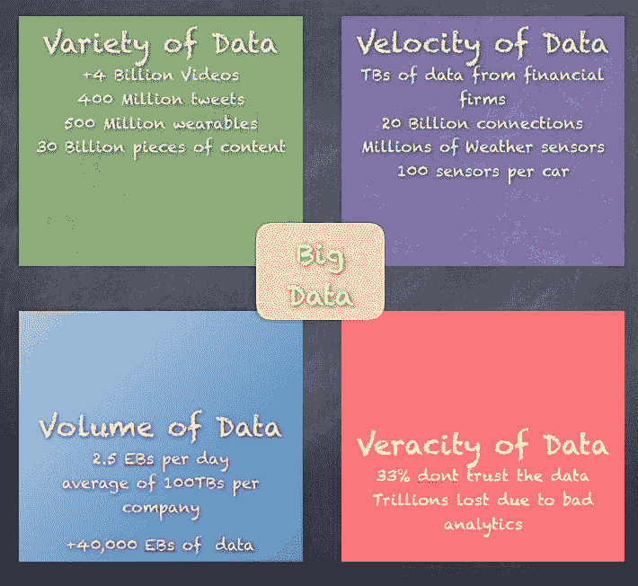

为了理解所有这些数据并将数据分析应用于大数据，我们需要扩展数据分析的概念，以更大规模地操作，处理大数据的 4 个 V。这不仅改变了分析数据时使用的工具、技术和方法，还改变了我们处理问题的方式。如果 1999 年某个企业使用 SQL 数据库来处理数据，那么现在处理同一企业的数据，我们需要一个可扩展且能够适应大数据领域细微差别的分布式 SQL 数据库。

大数据分析应用通常包括来自内部系统和外部来源的数据，例如天气数据或由第三方信息服务提供商编制的消费者人口统计数据。此外，随着用户希望对通过 Spark 的 Spark Streaming 模块或其他开源流处理引擎（如 Flink 和 Storm）将数据传入 Hadoop 系统进行实时分析，流分析应用在大数据环境中变得越来越普遍。

早期的大数据系统主要部署在本地，特别是在收集、组织和分析海量数据的大型组织中。然而，云平台供应商，如**亚马逊 Web 服务**（**AWS**）和微软，已经使得在云中设置和管理 Hadoop 集群变得更加容易，像 Cloudera 和 Hortonworks 这样的 Hadoop 供应商也支持其大数据框架的分发版本在 AWS 和 Microsoft Azure 云上运行。现在，用户可以在云中快速启动集群，根据需要运行，并在使用完毕后将其下线，按需计费，无需持续的软件许可。

大数据分析项目中可能遇到的潜在陷阱包括缺乏内部分析技能，以及招聘经验丰富的数据科学家和数据工程师填补空缺的高昂成本。

涉及的数据量及其多样性可能会导致数据管理问题，涉及数据质量、一致性和治理等领域；此外，使用不同平台和数据存储在大数据架构中可能会导致数据孤岛问题。与此同时，将 Hadoop、Spark 和其他大数据工具整合到一个有凝聚力的架构中，以满足组织的大数据分析需求，对于许多 IT 和分析团队来说是一项具有挑战性的任务，他们必须找出合适的技术组合并将其拼接在一起。

# 使用 Apache Hadoop 进行分布式计算

我们的世界充满了各种设备，从智能冰箱、智能手表、手机、平板电脑、笔记本电脑，到机场的自助服务机、为你提供现金的 ATM 机，等等。我们能够做出几年前我们无法想象的事情。Instagram、Snapchat、Gmail、Facebook、Twitter 和 Pinterest 是我们现在已经习以为常的一些应用，几乎无法想象没有这些应用的一天。

随着云计算的出现，我们只需几次点击，就能在 AWS、Azure（微软）或 Google Cloud 等平台上启动数百甚至数千台机器，利用庞大的资源实现各种业务目标。

云计算引入了 IaaS、PaaS 和 SaaS 的概念，使我们能够构建和运营可扩展的基础设施，以服务于各种类型的使用场景和业务需求。

**IaaS**（**基础设施即服务**）- 提供可靠的托管硬件，无需数据中心、电源线、空调等设施。

**PaaS**（**平台即服务**）- 在 IaaS 基础上，提供托管的平台，如 Windows、Linux、数据库等。

**SaaS**（**软件即服务**）- 在 SaaS 基础上，提供托管服务，如 SalesForce、[Kayak.com](https://www.kayak.co.in/?ispredir=true) 等，供所有人使用。

在幕后是高度可扩展的分布式计算世界，它使得存储和处理 PB（PetaBytes）级别的数据成为可能。

1 ExaByte = 1024 PetaBytes (5000 万部蓝光电影)

1 PetaByte = 1024 Tera Bytes (50,000 部蓝光电影)

1 TeraByte = 1024 Giga Bytes (50 部蓝光电影)

1 部蓝光电影的平均光盘大小约为 20 GB

现在，分布式计算的范式并不是一个真正的新话题，几十年来，它在研究机构以及一些商业公司中以某种形式得到追求。**大规模并行处理**（**MPP**）是几十年前在多个领域（如海洋学、地震监测和太空探索）使用的一种范式。一些公司，如 Teradata，也实施了 MPP 平台并提供了商业产品和应用程序。最终，像 Google 和 Amazon 等科技公司推动了可扩展分布式计算的细分领域，进入了一个新的进化阶段，这最终导致了伯克利大学创建了 Apache Spark。

Google 发布了关于 **Map Reduce**（**MR**）和 **Google 文件系统**（**GFS**）的论文，将分布式计算的原理传递给了每个人。当然，也需要给予 Doug Cutting 应有的荣誉，他通过实现 Google 白皮书中的概念，并向世界介绍了 Hadoop，使这一切成为可能。

Apache Hadoop 框架是一个用 Java 编写的开源软件框架。该框架提供的两个主要功能是存储和处理。在存储方面，Apache Hadoop 框架使用 **Hadoop 分布式文件系统**（**HDFS**），该文件系统基于 2003 年 10 月发布的 Google 文件系统论文。在处理或计算方面，框架依赖于 MapReduce，该框架基于 2004 年 12 月发布的 Google 关于 MR 的论文。

MapReduce 框架从 V1（基于作业跟踪器和任务跟踪器）发展到 V2（基于 YARN）。

# Hadoop 分布式文件系统（HDFS）

HDFS 是一个基于软件的文件系统，使用 Java 实现，运行在本地文件系统之上。HDFS 的主要概念是将文件分割成块（通常为 128 MB），而不是将文件视为整体处理。这使得许多功能成为可能，如分布式存储、数据复制、故障恢复，以及更重要的，使用多台机器对这些块进行分布式处理。

块大小可以是 64 MB、128 MB、256 MB 或 512 MB，根据需求选择。对于一个 1 GB 的文件，使用 128 MB 的块，计算方式为 1024 MB / 128 MB = 8 块。如果考虑复制因子为 3，则总共有 24 块。

HDFS 提供了一个具有容错性和故障恢复功能的分布式存储系统。HDFS 主要有两个组件：名称节点和数据节点。名称节点包含文件系统所有内容的所有元数据。数据节点与名称节点连接，并依赖名称节点获取有关文件系统内容的所有元数据。如果名称节点不知道任何信息，数据节点将无法为任何需要读写 HDFS 的客户端提供服务。

以下是 HDFS 架构：

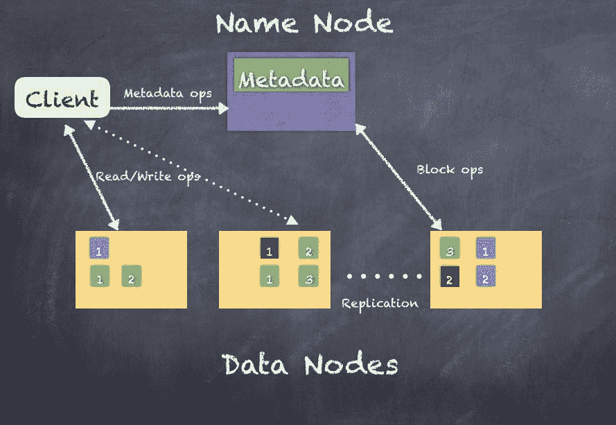

NameNode 和 DataNode 是 JVM 进程，因此任何支持 Java 的机器都可以运行 NameNode 或 DataNode 进程。只有一个 NameNode（如果计算 HA 部署，第二个 NameNode 也会存在），但是有数百甚至上千个 DataNode。

不建议拥有上千个 DataNode，因为所有 DataNode 的操作会在实际生产环境中倾向于压倒 NameNode，尤其是在有大量数据密集型应用的情况下。

集群中只有一个 NameNode，这极大简化了系统的架构。NameNode 是所有 HDFS 元数据的仲裁者和存储库，任何想要读写数据的客户端都必须首先联系 NameNode 以获取元数据信息。数据不会直接通过 NameNode 流动，这使得 1 个 NameNode 能够管理数百个 DataNode（PB 级数据）。

HDFS 支持传统的层次化文件组织结构，具有类似于大多数其他文件系统的目录和文件。您可以创建、移动和删除文件和目录。NameNode 维护文件系统的命名空间，并记录所有更改和文件系统的状态。应用程序可以指定 HDFS 应该维护的文件副本数量，这些信息也由 NameNode 存储。

HDFS 旨在以分布式的方式可靠地存储非常大的文件，这些文件分布在大型数据节点集群中的多台机器上。为了应对复制、容错以及分布式计算，HDFS 将每个文件存储为一系列块。

NameNode 做出所有有关块复制的决策。这主要依赖于来自集群中每个 DataNode 的块报告，块报告会定期在心跳间隔期间发送。块报告包含 DataNode 上所有块的列表，NameNode 随后将其存储在元数据存储库中。

NameNode 将所有元数据存储在内存中，并处理所有来自客户端的读写请求。然而，由于这是维护所有 HDFS 元数据的主节点，因此保持一致且可靠的元数据是至关重要的。如果这些信息丢失，HDFS 上的内容将无法访问。

为此，HDFS NameNode 使用一个称为 EditLog 的事务日志，它会持久记录文件系统元数据发生的每一个更改。创建新文件时会更新 EditLog，移动文件、重命名文件或删除文件时也是如此。整个文件系统命名空间，包括块到文件的映射以及文件系统属性，都存储在一个名为 `FsImage` 的文件中。**NameNode** 也将所有内容存储在内存中。当 NameNode 启动时，它会加载 EditLog，并且 `FsImage` 会初始化自身以设置 HDFS。

然而，数据节点并不了解 HDFS，它们仅依赖于存储的数据块。数据节点完全依赖于 NameNode 执行任何操作。即使客户端要连接以读取或写入文件，也是 NameNode 告诉客户端应该连接到哪里。

# HDFS 高可用性

HDFS 是主从集群，NameNode 作为主节点，而数百甚至数千个 DataNode 作为从节点，由主节点管理。这在集群中引入了**单点故障**（**SPOF**）的问题，如果主 NameNode 由于某种原因出现故障，整个集群将无法使用。HDFS 1.0 支持额外的主节点称为**辅助 NameNode**，用于帮助集群的恢复。它通过维护文件系统所有元数据的副本来实现，但不是一个高度可用的系统，需要手动干预和维护工作。HDFS 2.0 通过添加全面支持**高可用性**（**HA**）将其提升到了一个新的水平。

HA 的工作方式是使用两个 NameNode，以主备模式运行，其中一个是活动的，另一个是待机的。当主 NameNode 发生故障时，备用 NameNode 将接管主节点的角色。

下图展示了主备 NameNode 的部署方式：

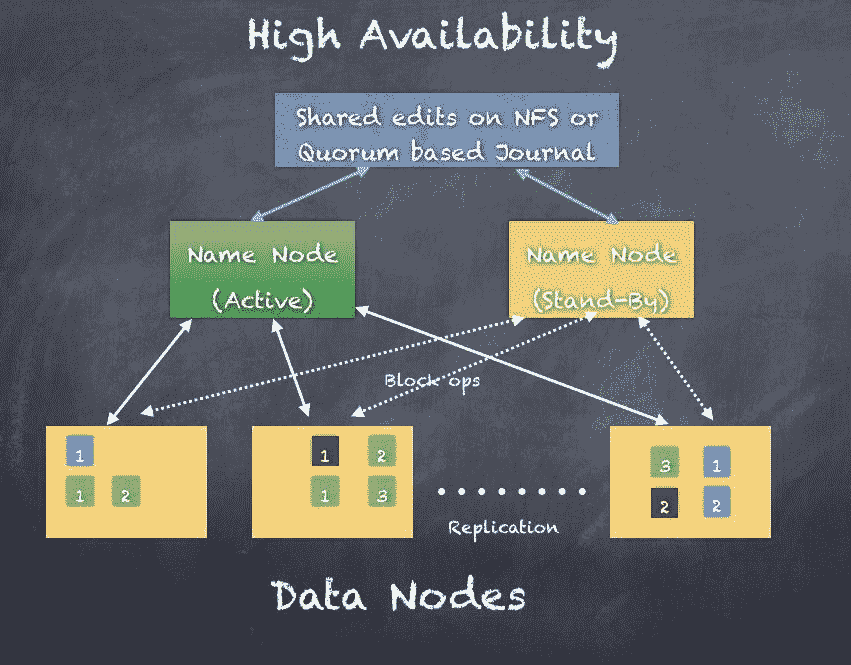

# HDFS 联邦

HDFS 联邦是使用多个 NameNode 来扩展文件系统命名空间的一种方式。与第一个 HDFS 版本不同，后者仅使用单个 NameNode 管理整个集群，随着集群规模的增长，这种管理方式无法很好地扩展。HDFS 联邦可以支持规模显著更大的集群，并通过多个联合的 NameNode 水平扩展 NameNode 或名称服务。请看下图：

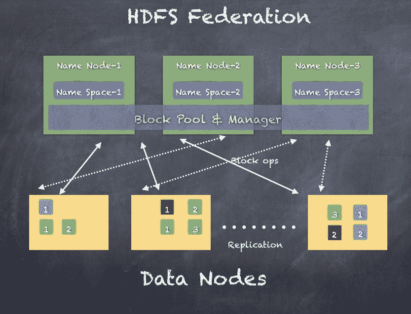

# HDFS 快照

Hadoop 2.0 还增加了一项新功能：使用快照（只读副本和写时复制）拍摄数据节点上存储的文件系统（数据块）。使用快照，您可以在不干扰其他常规 HDFS 操作的情况下无缝地拍摄目录，利用 NameNode 的数据块元数据。快照创建是即时的。

下面是关于如何在特定目录上工作的快照工作示例：

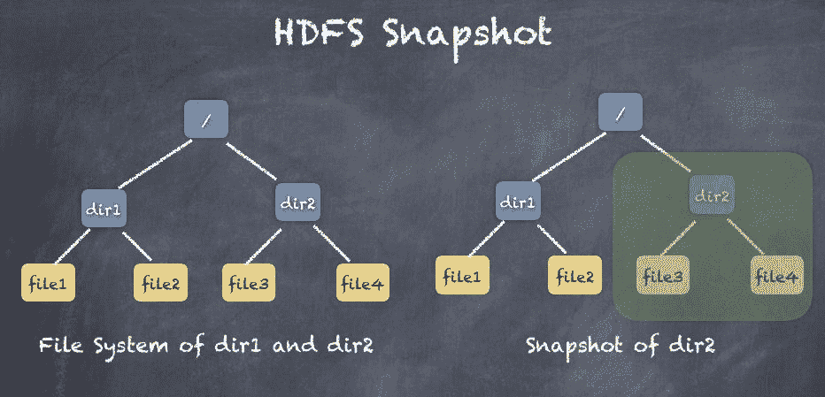

# HDFS 读取

客户端连接到 NameNode，并根据文件名询问文件的位置。NameNode 查找文件的块位置并返回给客户端。然后客户端可以连接到数据节点并读取所需的块。NameNode 不参与数据传输。

下面是客户端读取请求的流程。首先，客户端获取位置信息，然后从数据节点拉取数据块。如果某个数据节点在中途失败，客户端则从另一个数据节点获取该块的副本。

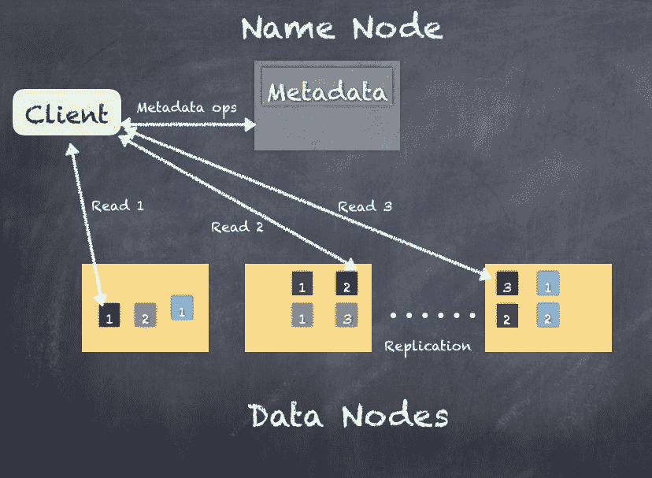

# HDFS 写入

客户端连接到 NameNode，并请求 NameNode 允许其写入 HDFS。NameNode 查找信息并规划使用哪些块、哪些 DataNode 来存储这些块，以及使用什么复制策略。NameNode 不处理任何数据，它只是告诉客户端该写到哪里。一旦第一个 DataNode 接收到块，基于复制策略，NameNode 会告诉第一个 DataNode 在哪里进行复制。因此，客户端接收到的块会发送到第二个 DataNode（复制块应该写入的位置），然后第二个 DataNode 会将其发送到第三个 DataNode（如果复制因子为 3 的话）。

以下是一个客户端写请求的流程。首先，客户端获取位置，然后写入第一个 DataNode。接收块的 DataNode 会将块复制到应该存储块副本的其他 DataNode。这一过程适用于从客户端写入的所有块。如果在中途某个 DataNode 发生故障，块会按照 NameNode 的指示被复制到另一个 DataNode。

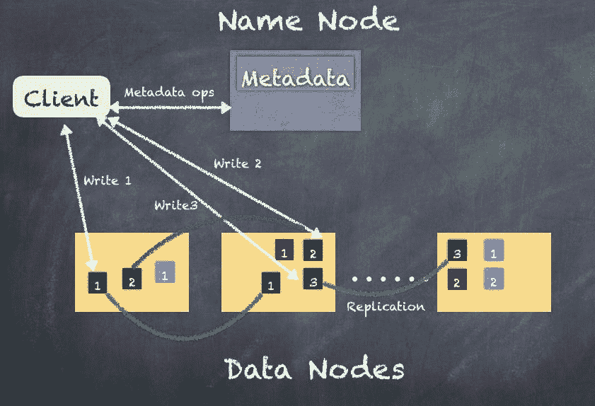

到目前为止，我们已经看到了 HDFS 如何通过使用块、NameNode 和 DataNode 提供分布式文件系统。一旦数据达到 PB 级别存储，实际上处理数据也变得非常重要，以服务于业务的各种用例。

MapReduce 框架是在 Hadoop 框架中创建的，用于执行分布式计算。我们将在下一节进一步探讨这一点。

# MapReduce 框架

**MapReduce**（**MR**）框架使你能够编写分布式应用程序，以可靠且容错的方式处理来自像 HDFS 这样的文件系统的大量数据。当你想使用 MapReduce 框架处理数据时，它通过创建一个作业来运行，这个作业在框架上执行所需的任务。

MapReduce 作业通常通过将输入数据分割到运行**Mapper**任务的工作节点上以并行方式工作。在此过程中，HDFS 级别的故障或 Mapper 任务的失败都会被自动处理，从而实现容错。一旦 Mapper 完成，结果将通过网络复制到其他运行**Reducer**任务的机器上。

理解这个概念的一个简单方法是，假设你和你的朋友们要把一堆水果分类到箱子里。为此，你希望把每个人分配一个任务，让他们处理一篮原料水果（全部混在一起），并将水果分开放入不同的箱子。每个人然后都按同样的方法处理这篮水果。

最终，你会得到来自所有朋友的一大堆水果箱。然后，你可以指派一组人把相同种类的水果放在同一个箱子里，称重并封箱以便运输。

下图描述了通过不同种类的水果来分类水果篮子的概念：

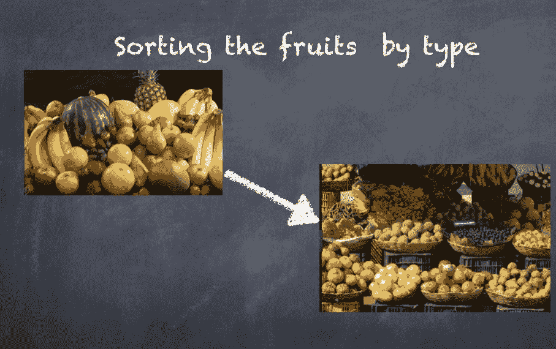

MapReduce 框架由一个资源管理器和多个节点管理器组成（通常节点管理器与 HDFS 的数据节点共存）。当应用程序需要运行时，客户端启动应用程序主控器，然后与资源管理器协商，在集群中以容器的形式获取资源。

容器代表了分配给单个节点上的 CPU（核心）和内存，用于运行任务和进程。容器由节点管理器监督，并由资源管理器调度。

容器示例：

1 个核心 + 4 GB 内存

2 个核心 + 6 GB 内存

4 个核心 + 20 GB 内存

一些容器被分配为 Mappers，另一些容器被分配为 Reducers；这一切都由应用程序主控器与资源管理器共同协调。这个框架叫做**另一个资源协商器**（**YARN**）

以下是 YARN 的示意图：

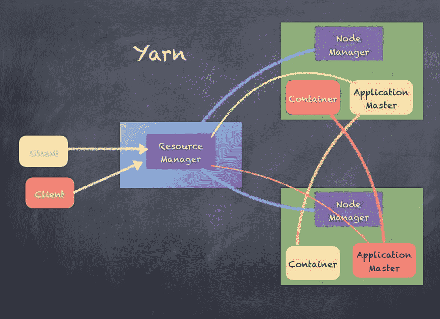

一个经典的例子，展示了 MapReduce 框架的工作原理，就是词频统计示例。以下是处理输入数据的各个阶段，首先将输入数据拆分到多个工作节点上，最后生成单词的输出计数：

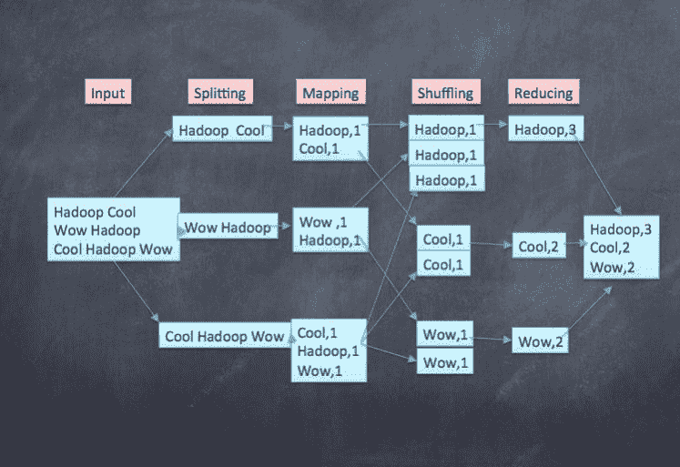

尽管 MapReduce 框架在全球范围内非常成功，并且被大多数公司采用，但由于其数据处理方式，它会遇到一些问题。为了让 MapReduce 更易于使用，出现了多种技术，如 Hive 和 Pig，但复杂性依然存在。

Hadoop MapReduce 有多个限制，诸如：

+   由于基于磁盘的处理导致性能瓶颈

+   批处理无法满足所有需求

+   编程可能冗长且复杂

+   由于资源重复使用较少，任务调度较慢

+   没有很好的方式进行实时事件处理

+   机器学习通常需要较长时间，因为机器学习通常涉及迭代处理，而 MapReduce 处理速度太慢，无法满足这一需求。

Hive 是由 Facebook 创建的，作为 MapReduce 的 SQL 类似接口。Pig 是由 Yahoo 创建的，作为 MapReduce 的脚本接口。此外，还使用了多个增强技术，如 Tez（Hortonworks）和 LLAP（Hive2.x），它们通过内存优化来绕过 MapReduce 的局限性。

在下一节中，我们将介绍 Apache Spark，它已经解决了一些 Hadoop 技术的局限性。

# 这里介绍 Apache Spark

Apache Spark 是一个统一的分布式计算引擎，能够在不同的工作负载和平台之间运行。Spark 可以连接到不同的平台，并使用多种范式（如 Spark 流处理、Spark ML、Spark SQL 和 Spark GraphX）处理不同的数据工作负载。

Apache Spark 是一个快速的内存数据处理引擎，具有优雅和表达性强的开发 API，允许数据工作者高效地执行需要快速交互访问数据集的流式机器学习或 SQL 工作负载。Apache Spark 由 Spark 核心和一组库组成。核心是分布式执行引擎，Java、Scala 和 Python API 提供了分布式应用程序开发的平台。建立在核心之上的附加库支持流式处理、SQL、图形处理和机器学习等工作负载。例如，Spark ML 旨在用于数据科学，其抽象使得数据科学变得更加容易。

Spark 提供实时流处理、查询、机器学习和图形处理。在 Apache Spark 之前，我们必须使用不同的技术来处理不同类型的工作负载，一个用于批量分析，一个用于交互式查询，一个用于实时流处理，另一个用于机器学习算法。然而，Apache Spark 可以只使用 Apache Spark 来处理所有这些工作负载，而不必使用多个不总是集成的技术。

使用 Apache Spark，可以处理所有类型的工作负载，Spark 还支持 Scala、Java、R 和 Python 作为编写客户端程序的手段。

Apache Spark 是一个开源分布式计算引擎，相比 MapReduce 模式具有显著优势：

+   尽可能使用内存处理

+   用于批处理和实时工作负载的通用引擎

+   与 YARN 和 Mesos 兼容

+   与 HBase、Cassandra、MongoDB、HDFS、Amazon S3 和其他文件系统及数据源兼容良好

Spark 于 2009 年在伯克利创建，源于一个旨在构建 Mesos（支持不同类型集群计算系统的集群管理框架）的项目。请看以下表格：

| 版本 | 发布日期 | 里程碑 |
| --- | --- | --- |
| 0.5 | 2012-10-07 | 第一个可用于非生产环境的版本 |
| 0.6 | 2013-02-07 | 各种更改的版本发布 |
| 0.7 | 2013-07-16 | 各种更改的版本发布 |
| 0.8 | 2013-12-19 | 各种更改的版本发布 |
| 0.9 | 2014-07-23 | 各种更改的版本发布 |
| 1.0 | 2014-08-05 | 第一个生产就绪、向后兼容的版本发布。包括 Spark Batch、Streaming、Shark、MLLib、GraphX |
| 1.1 | 2014-11-26 | 各种更改的版本发布 |
| 1.2 | 2015-04-17 | 结构化数据、SchemaRDD（后续发展为 DataFrames） |
| 1.3 | 2015-04-17 | 提供统一的 API 来读取结构化和半结构化数据源 |
| 1.4 | 2015-07-15 | SparkR、DataFrame API、Tungsten 改进 |
| 1.5 | 2015-11-09 | 各种更改的版本发布 |
| 1.6 | 2016-11-07 | 引入了 Dataset DSL |
| 2.0 | 2016-11-14 | DataFrames 和 Datasets API 作为机器学习的基础层，结构化流、SparkR 改进。 |
| 2.1 | 2017-05-02 | 事件时间水印、ML、GraphX 改进 |

2.2 版本已于 2017-07-11 发布，包含了若干改进，尤其是结构化流处理（Structured Streaming）现在已进入 GA 阶段。

Spark 是一个分布式计算平台，具有以下几个特点：

+   通过简单的 API 透明地在多个节点上处理数据

+   弹性地处理故障

+   根据需要将数据溢出到磁盘，但主要使用内存

+   支持 Java、Scala、Python、R 和 SQL API

+   相同的 Spark 代码可以独立运行，也可以在 Hadoop YARN、Mesos 和云中运行

Scala 特性，如隐式转换、高阶函数、结构化类型等，允许我们轻松构建 DSL 并将其与语言集成。

Apache Spark 不提供存储层，而是依赖于 HDFS 或 Amazon S3 等。因此，即使 Apache Hadoop 技术被 Apache Spark 替代，HDFS 仍然是必需的，以提供可靠的存储层。

Apache Kudu 提供了一个替代 HDFS 的方案，且 Apache Spark 与 Kudu 存储层已实现集成，进一步解耦了 Apache Spark 和 Hadoop 生态系统。

Hadoop 和 Apache Spark 都是流行的大数据框架，但它们并不完全相同。Hadoop 提供分布式存储和 MapReduce 分布式计算框架，而 Spark 是一个数据处理框架，依赖于其他技术提供的分布式数据存储。

由于数据处理方式的不同，Spark 通常比 MapReduce 快得多。MapReduce 使用磁盘操作处理数据拆分，而 Spark 在数据集上的操作效率远高于 MapReduce，Spark 性能提升的主要原因是高效的堆外内存处理，而不是仅依赖基于磁盘的计算。

如果你的数据操作和报告需求大多数是静态的，并且可以接受使用批处理处理，你可能会选择 MapReduce，但如果需要对流数据进行分析或处理需求需要多阶段的处理逻辑，你可能会选择 Spark。

Spark 堆栈有三层。底层是集群管理器，可以是独立模式、YARN 或 Mesos。

使用本地模式时，你不需要集群管理器来进行处理。

在中间，集群管理器之上是 Spark 核心层，它提供所有底层 API，用于任务调度和与存储的交互。

在顶部是运行在 Spark 核心之上的模块，例如 Spark SQL 提供交互式查询，Spark streaming 用于实时分析，Spark ML 用于机器学习，Spark GraphX 用于图形处理。

三个层次如下：

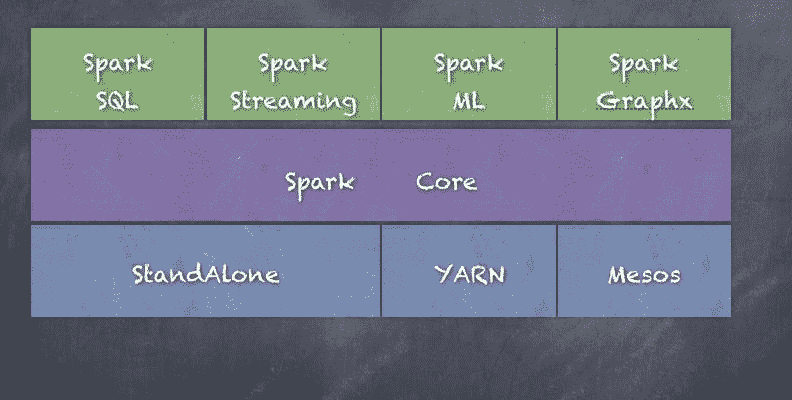

如前图所示，各种库，如 Spark SQL、Spark streaming、Spark ML 和 GraphX 都位于 Spark 核心之上，核心是中间层。底层展示了各种集群管理器的选项。

现在让我们简要了解一下每个组件：

# Spark 核心

Spark 核心是 Spark 平台的底层通用执行引擎，所有其他功能都是在其上构建的。Spark 核心包含运行作业所需的基本 Spark 功能，并且其他组件也需要这些功能。它提供内存计算和对外部存储系统数据集的引用，最重要的是**弹性分布式数据集**（**RDD**）。

此外，Spark 核心包含访问各种文件系统的逻辑，如 HDFS、Amazon S3、HBase、Cassandra、关系型数据库等。Spark 核心还提供支持网络、安防、调度和数据洗牌的基本功能，用于构建一个具有高可扩展性和容错能力的分布式计算平台。

我们在第六章，*开始使用 Spark - REPL* 和 RDDs，以及第七章，*特殊 RDD 操作*中详细介绍了 Spark 核心。

基于 RDD 构建的数据帧和数据集，并通过 Spark SQL 引入，现在在许多使用场景中已成为比 RDD 更为常见的选择。尽管 RDD 在处理完全非结构化数据时仍然更具灵活性，但在未来，数据集 API 可能最终会成为核心 API。

# Spark SQL

Spark SQL 是 Spark 核心之上的一个组件，引入了一种新的数据抽象——**SchemaRDD**，它为结构化和半结构化数据提供支持。Spark SQL 提供了使用 Spark 和 Hive QL 支持的 SQL 子集操作大型分布式结构化数据的功能。Spark SQL 通过数据帧和数据集简化了结构化数据的处理，且性能远超以往，是 Tungsten 计划的一部分。Spark SQL 还支持从各种结构化格式和数据源中读取和写入数据，如文件、parquet、orc、关系型数据库、Hive、HDFS、S3 等。Spark SQL 提供了一个查询优化框架——**Catalyst**，用于优化所有操作，以提高速度（与 RDDs 相比，Spark SQL 的速度快了好几倍）。Spark SQL 还包括一个 Thrift 服务器，外部系统可以通过 Spark SQL 使用经典的 JDBC 和 ODBC 协议查询数据。

我们在第八章，*引入一点结构 - Spark SQL*中详细介绍了 Spark SQL。

# Spark 流处理

Spark 流处理利用 Spark 核心的快速调度能力，通过从 HDFS、Kafka、Flume、Twitter、ZeroMQ、Kinesis 等各种数据源摄取实时流数据来执行流处理分析。Spark 流处理使用数据的微批处理方式进行数据分块处理，并使用一个称为 DStreams 的概念，Spark 流处理可以像 Spark 核心 API 中的常规 RDD 一样对 RDD 进行转换和操作。Spark 流处理操作可以使用多种技术自动从故障中恢复。Spark 流处理可以与其他 Spark 组件结合，在单个程序中统一实时处理、机器学习、SQL 和图形操作。

我们在第九章中详细介绍了 Spark 流处理，*Stream Me Up, Scotty - Spark Streaming*。

此外，新的结构化流处理 API 使得 Spark 流处理程序更类似于 Spark 批处理程序，同时也允许在流数据上进行实时查询，这在 Spark 2.0+之前的 Spark 流处理库中是非常复杂的。

# Spark GraphX

GraphX 是一个基于 Spark 的分布式图处理框架。图是由顶点和连接它们的边组成的数据结构。GraphX 提供了构建图的功能，图表示为 Graph RDD。它提供了一个 API，用于表达图计算，能够通过使用 Pregel 抽象 API 来建模用户定义的图。它还为该抽象提供了优化的运行时。GraphX 还包含图论中最重要算法的实现，如 PageRank、连通组件、最短路径、SVD++等。

我们在第十章中详细介绍了 Spark GraphX，*Everything is Connected - GraphX*。

一个新的模块 GraphFrames 正在开发中，它使得使用基于 DataFrame 的图形更容易进行图处理。GraphX 对于 RDD 就像 GraphFrames 对于 DataFrame/数据集一样。此外，目前 GraphFrames 与 GraphX 是分开的，预计将来会支持 GraphX 的所有功能，届时可能会切换到 GraphFrames。

# Spark ML

MLlib 是一个分布式机器学习框架，位于 Spark 核心之上，处理用于转换 RDD 格式数据集的机器学习模型。Spark MLlib 是一个机器学习算法库，提供各种算法，如逻辑回归、朴素贝叶斯分类、**支持向量机**（**SVMs**）、决策树、随机森林、线性回归、**交替最小二乘法**（**ALS**）和 K-means 聚类。Spark ML 与 Spark 核心、Spark 流处理、Spark SQL 和 GraphX 紧密集成，提供一个真正集成的平台，可以处理实时或批处理数据。

我们在第十一章中详细介绍了 Spark ML，*Learning Machine Learning - Spark MLlib and ML*。

此外，PySpark 和 SparkR 也可以作为与 Spark 集群交互并使用 Python 和 R API 的手段。Python 和 R 的集成真正为数据科学家和机器学习建模人员打开了 Spark，因为数据科学家通常使用的最常见语言是 Python 和 R。这就是 Spark 支持 Python 和 R 集成的原因，以避免学习 Scala 这种新语言的高昂成本。另一个原因是可能存在大量用 Python 和 R 编写的现有代码，如果我们能够利用其中的一些代码，将提升团队的生产力，而不是从头开始重新构建所有内容。

笔记本技术如 Jupyter 和 Zeppelin 正在越来越受到欢迎并被广泛使用，它们使得与 Spark 的互动变得更加简便，特别是在 Spark ML 中尤为有用，因为在该领域通常需要进行大量的假设和分析。

# PySpark

PySpark 使用基于 Python 的 `SparkContext` 和 Python 脚本作为任务，然后通过套接字和管道执行进程，在基于 Java 的 Spark 集群与 Python 脚本之间进行通信。PySpark 还使用 `Py4J`，这是一个流行的库，集成在 PySpark 中，可以让 Python 动态与基于 Java 的 RDD 进行交互。

必须在所有运行 Spark 执行器的工作节点上安装 Python。

以下是 PySpark 如何通过在 Java 处理和 Python 脚本之间通信来工作的方式：

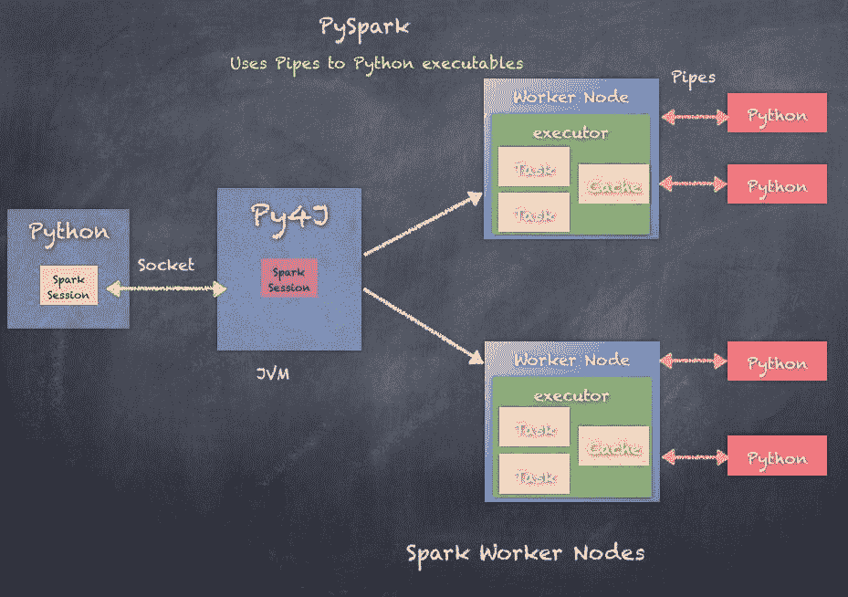

# SparkR

`SparkR` 是一个 R 包，提供了一个轻量级的前端接口，用于从 R 中使用 Apache Spark。SparkR 提供了一个分布式数据框架实现，支持选择、过滤、聚合等操作。SparkR 还支持使用 MLlib 进行分布式机器学习。SparkR 使用基于 R 的 `SparkContext` 和 R 脚本作为任务，然后通过 JNI 和管道执行进程，在基于 Java 的 Spark 集群与 R 脚本之间进行通信。

必须在所有运行 Spark 执行器的工作节点上安装 R。

以下是 SparkR 如何通过在 Java 处理和 R 脚本之间通信来工作的方式：

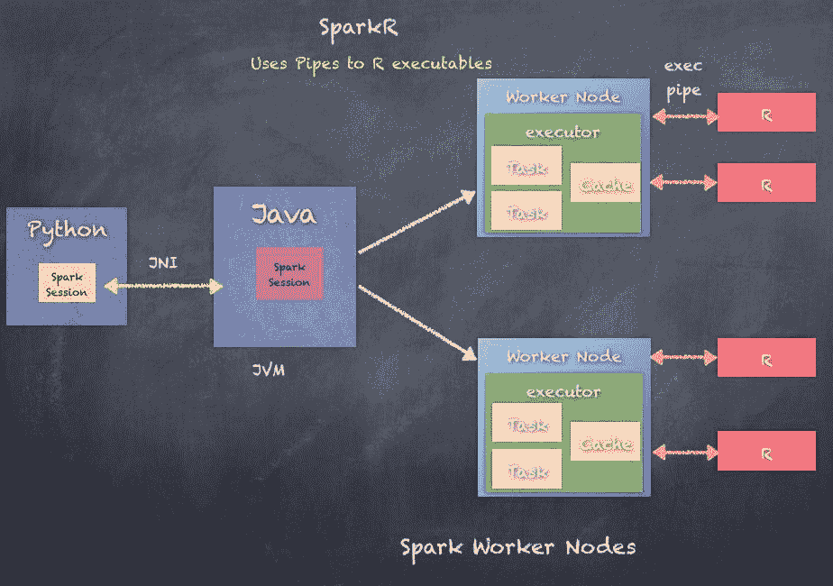

# 总结

我们探索了 Hadoop 和 MapReduce 框架的演变，并讨论了 YARN、HDFS 概念、HDFS 的读写操作、关键特性以及挑战。然后，我们讨论了 Apache Spark 的演变，Apache Spark 最初为何被创建，以及它能为大数据分析和处理的挑战带来何种价值。

最后，我们还简单了解了 Apache Spark 中的各个组件，即 Spark Core、Spark SQL、Spark Streaming、Spark GraphX 和 Spark ML，以及 PySpark 和 SparkR，它们是将 Python 和 R 语言代码与 Apache Spark 集成的手段。

现在我们已经了解了大数据分析、Hadoop 分布式计算平台的空间以及演变过程，还了解了 Apache Spark 的发展，并对 Apache Spark 如何解决一些挑战有了一个高层次的概述，我们已经准备好开始学习 Spark，并了解如何在我们的应用场景中使用它。

在下一章中，我们将更深入地探讨 Apache Spark，并开始了解其内部运作原理，详细内容请参考第六章，*开始使用 Spark - REPL 和 RDDs*。
