# 第六章：开始使用 Spark – REPL 和 RDDs

“所有这些现代技术只会让人们试图同时做所有事情。”

- 比尔·沃特森（Bill Watterson）

在本章中，您将学习 Spark 的工作原理；然后，您将了解 RDD（弹性分布式数据集），它是 Apache Spark 的基本抽象，您会发现它们实际上是暴露类似 Scala API 的分布式集合。接下来，您将看到如何下载 Spark，并通过 Spark shell 在本地运行它。

简而言之，本章将覆盖以下主题：

+   更深入地了解 Apache Spark

+   Apache Spark 安装

+   RDDs 介绍

+   使用 Spark shell

+   动作与转换

+   缓存

+   数据加载与保存

# 更深入地了解 Apache Spark

Apache Spark 是一个快速的内存数据处理引擎，具有优雅且表达力强的开发 API，能够让数据工作者高效地执行流处理、机器学习或 SQL 工作负载，这些工作负载需要快速的交互式数据访问。Apache Spark 由 Spark 核心和一组库组成。核心是分布式执行引擎，Java、Scala 和 Python API 提供了分布式应用程序开发的平台。

在核心之上构建的其他库允许处理流数据、SQL、图形处理和机器学习的工作负载。例如，SparkML 是为数据科学设计的，它的抽象使数据科学变得更容易。

为了规划和执行分布式计算，Spark 使用作业的概念，这些作业通过阶段和任务在工作节点上执行。Spark 由一个 Driver 组成，Driver 协调跨工作节点集群的执行。Driver 还负责跟踪所有工作节点以及当前正在执行的任务。

让我们更深入地了解一下各个组件。关键组件是 Driver 和执行器，它们都是 JVM 进程（Java 进程）：

+   **Driver**：Driver 程序包含应用程序和主程序。如果您使用的是 Spark shell，那么它将成为 Driver 程序，Driver 会在集群中启动执行器并控制任务的执行。

+   **执行器**：接下来是执行器，它们是运行在集群工作节点上的进程。在执行器内部，个别任务或计算会被执行。每个工作节点中可能有一个或多个执行器，并且每个执行器内部可能包含多个任务。当 Driver 连接到集群管理器时，集群管理器会分配资源来运行执行器。

集群管理器可以是独立集群管理器、YARN 或 Mesos。

**Cluster Manager** 负责在构成集群的计算节点之间调度和分配资源。通常，这由一个管理进程来完成，它了解并管理一个资源集群，并将资源分配给如 Spark 这样的请求进程。我们将在接下来的章节中进一步讨论三种不同的集群管理器：standalone、YARN 和 Mesos。

以下是 Spark 在高层次上如何工作的：

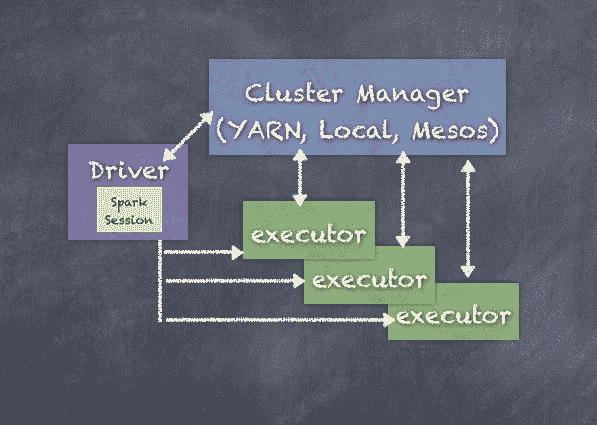

Spark 程序的主要入口点被称为 `SparkContext`。`SparkContext` 位于 **Driver** 组件内部，代表与集群的连接，并包含运行调度器、任务分配和协调的代码。

在 Spark 2.x 中，新增了一个名为 `SparkSession` 的变量。`SparkContext`、`SQLContext` 和 `HiveContext` 现在是 `SparkSession` 的成员变量。

当你启动 **Driver** 程序时，命令会通过 `SparkContext` 发出到集群，接着 **executors** 会执行这些指令。一旦执行完成，**Driver** 程序也完成了任务。此时，你可以发出更多命令并执行更多的作业。

维护并重用 `SparkContext` 是 Apache Spark 架构的一个关键优势，不像 Hadoop 框架，在 Hadoop 中每个 `MapReduce` 作业、Hive 查询或 Pig 脚本在每次执行任务时都会从头开始处理，而且还需要使用昂贵的磁盘而不是内存。

`SparkContext` 可用于在集群上创建 RDD、累加器和广播变量。每个 JVM/Java 进程中只能激活一个 `SparkContext`。在创建新的 `SparkContext` 之前，必须先 `stop()` 当前激活的 `SparkContext`。

**Driver** 解析代码，并将字节级代码序列化后传递给 executors 执行。当我们执行计算时，计算实际上会在每个节点的本地级别完成，使用内存中的处理。

解析代码和规划执行的过程是由 **Driver** 进程实现的关键方面。

以下是 Spark **Driver** 如何在集群中协调计算的过程：

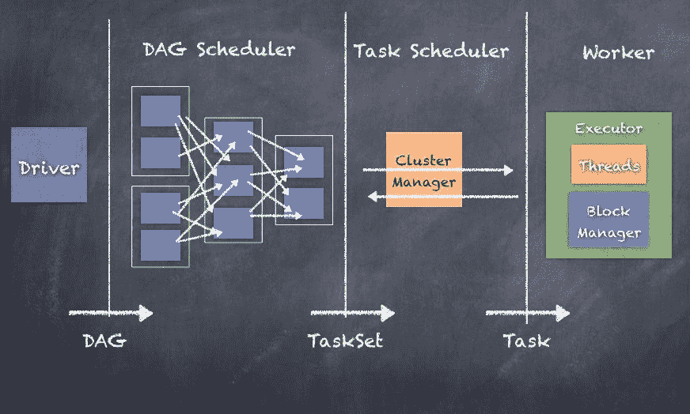

**有向无环图** (**DAG**) 是 Spark 框架的秘密武器。**Driver** 进程为你尝试运行的代码片段创建一个 DAG，然后，DAG 会通过任务调度器分阶段执行，每个阶段通过与 **Cluster Manager** 通信来请求资源以运行 executors。DAG 代表一个作业，一个作业被拆分为子集，也叫阶段，每个阶段以任务的形式执行，每个任务使用一个核心。

一个简单作业的示意图以及 DAG 如何被拆分成阶段和任务的过程如下图所示；第一张图展示了作业本身，第二张图展示了作业中的阶段和任务：

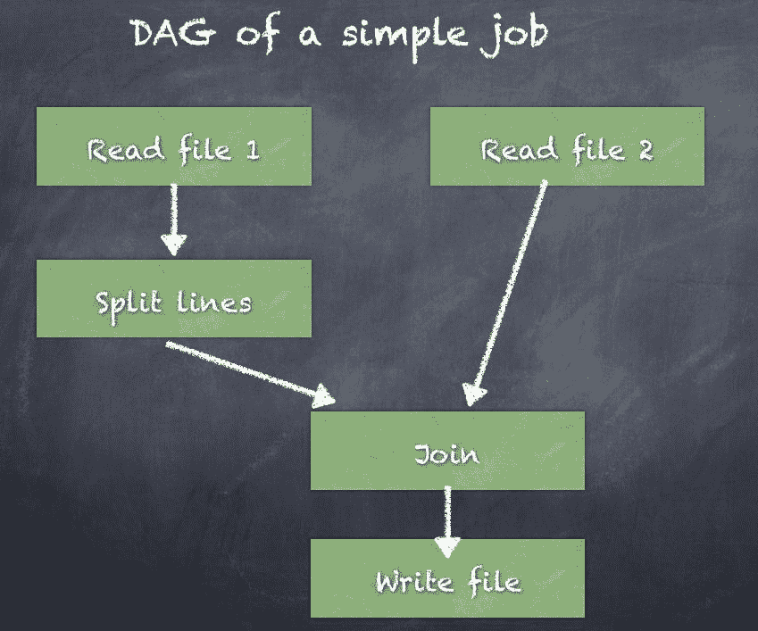

以下图表将作业/DAG 分解为阶段和任务：

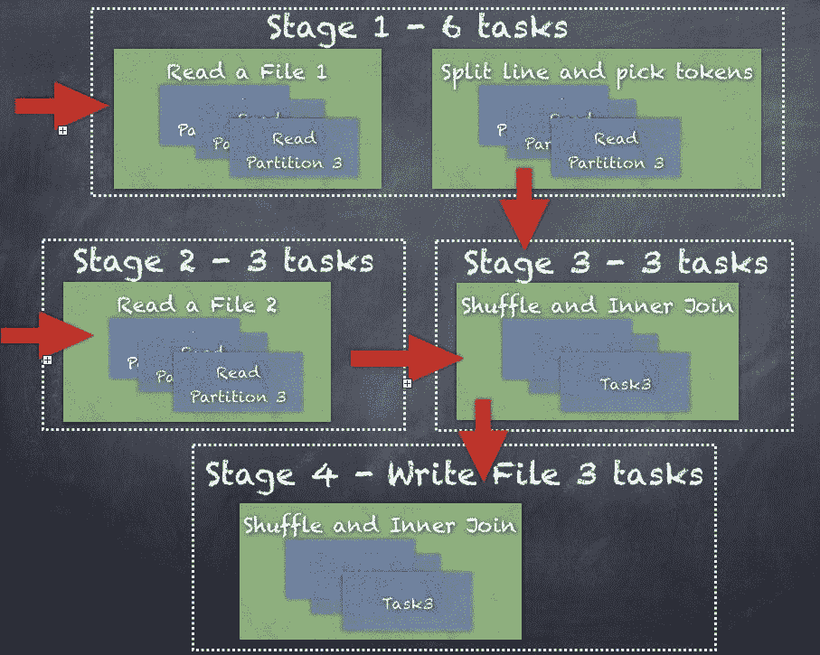

阶段的数量以及阶段的组成由操作的类型决定。通常，任何转换操作都会与之前的操作属于同一个阶段，但每个像 reduce 或 shuffle 这样的操作都会创建一个新的执行阶段。任务是阶段的一部分，直接与执行器上执行操作的核心相关。

如果你使用 YARN 或 Mesos 作为集群管理器，当需要处理更多工作时，可以使用动态 YARN 调度程序来增加执行器的数量，并且可以终止空闲的执行器。

因此，驱动程序管理整个执行过程的容错性。一旦驱动程序完成作业，输出可以写入文件、数据库或直接输出到控制台。

请记住，驱动程序中的代码本身必须是完全可序列化的，包括所有变量和对象。

经常看到的例外是不可序列化的异常，这是由于从块外部包含全局变量所导致的。

因此，驱动程序进程负责整个执行过程，同时监控和管理所使用的资源，如执行器、阶段和任务，确保一切按计划运行，并在发生任务失败或整个执行器节点失败等故障时进行恢复。

# Apache Spark 安装

Apache Spark 是一个跨平台框架，可以在 Linux、Windows 和 Mac 机器上部署，只要机器上安装了 Java。在这一节中，我们将介绍如何安装 Apache Spark。

Apache Spark 可以从 [`spark.apache.org/downloads.html`](http://spark.apache.org/downloads.html) 下载

首先，让我们看看在机器上必须具备的前提条件：

+   Java 8+（强制要求，因为所有 Spark 软件都作为 JVM 进程运行）

+   Python 3.4+（可选，仅在需要使用 PySpark 时使用）

+   R 3.1+（可选，仅在需要使用 SparkR 时使用）

+   Scala 2.11+（可选，仅用于为 Spark 编写程序）

Spark 可以通过三种主要的部署模式进行部署，我们将一一查看：

+   Spark 独立模式

+   YARN 上的 Spark

+   Mesos 上的 Spark

# Spark 独立模式

Spark 独立模式使用内置调度程序，不依赖于任何外部调度程序，如 YARN 或 Mesos。要在独立模式下安装 Spark，你需要将 Spark 二进制安装包复制到集群中的所有机器上。

在独立模式下，客户端可以通过 spark-submit 或 Spark shell 与集群交互。在这两种情况下，驱动程序与 Spark 主节点通信以获取工作节点，在那里可以为此应用启动执行器。

多个客户端与集群交互时，会在工作节点上创建自己的执行器。此外，每个客户端都会有自己的驱动程序组件。

以下是使用主节点和工作节点的 Spark 独立部署：

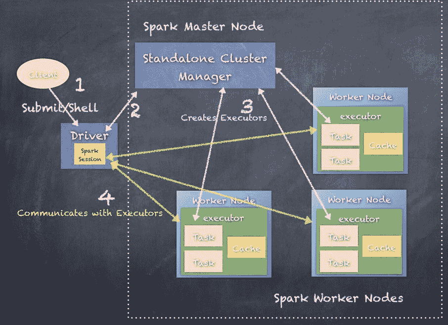

现在我们来下载并安装 Spark，以独立模式在 Linux/Mac 上运行：

1.  从链接下载 Apache Spark：[`spark.apache.org/downloads.html`](http://spark.apache.org/downloads.html)：

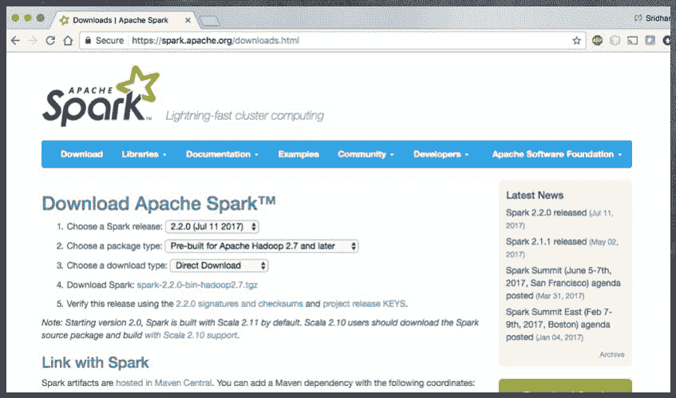

1.  将包解压到本地目录中：

```py
 tar -xvzf spark-2.2.0-bin-hadoop2.7.tgz

```

1.  切换到新创建的目录：

```py
 cd spark-2.2.0-bin-hadoop2.7

```

1.  通过执行以下步骤设置 `JAVA_HOME` 和 `SPARK_HOME` 的环境变量：

    1.  `JAVA_HOME` 应该是你安装 Java 的路径。在我的 Mac 终端中，设置如下：

```py
 export JAVA_HOME=/Library/Java/JavaVirtualMachines/
                             jdk1.8.0_65.jdk/Contents/Home/

```

1.  1.  `SPARK_HOME` 应该是新解压的文件夹。在我的 Mac 终端中，设置如下：

```py
 export SPARK_HOME= /Users/myuser/spark-2.2.0-bin-
                               hadoop2.7

```

1.  运行 Spark shell 查看是否有效。如果无法正常工作，检查 `JAVA_HOME` 和 `SPARK_HOME` 环境变量：`./bin/spark-shell`

1.  现在你会看到如下的 shell 界面：

    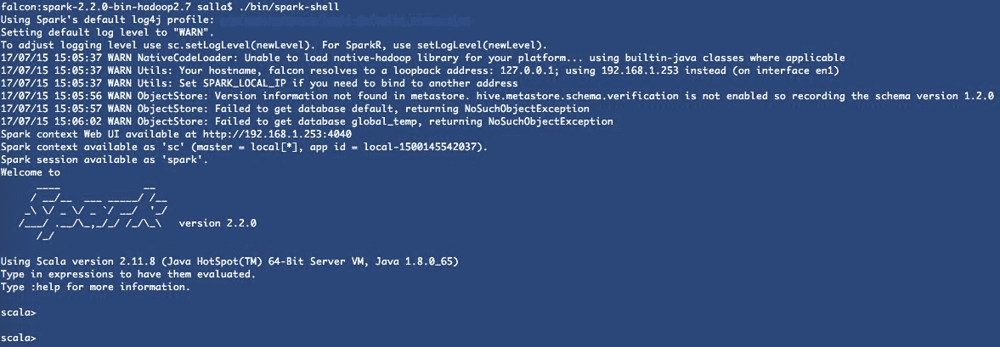

1.  你将看到 Scala/Spark shell，接下来你可以与 Spark 集群进行交互：

```py
 scala>

```

现在，我们有一个连接到自动设置的本地集群并运行 Spark 的 Spark-shell。这是最快的在本地机器上启动 Spark 的方式。然而，你仍然可以控制 worker/执行器，并且可以连接到任何集群（独立模式/YARN/Mesos）。这就是 Spark 的强大之处，它使你能够从交互式测试快速过渡到集群上的测试，随后将作业部署到大型集群上。无缝的集成带来了很多好处，这是使用 Hadoop 和其他技术无法实现的。

如果你想了解所有的设置，可以参考官方文档：[`spark.apache.org/docs/latest/`](http://spark.apache.org/docs/latest/)。

有多种方法可以启动 Spark shell，如下面的代码片段所示。我们将在后面的章节中看到更多选项，并更详细地展示 Spark shell：

+   本地机器上的默认 shell 自动将本地机器指定为主节点：

```py
 ./bin/spark-shell

```

+   本地机器上的默认 shell 指定本地机器为主节点，并使用 `n` 个线程：

```py
 ./bin/spark-shell --master local[n]

```

+   本地机器上的默认 shell 连接到指定的 Spark 主节点：

```py
 ./bin/spark-shell --master spark://<IP>:<Port>

```

+   本地机器上的默认 shell 以客户端模式连接到 YARN 集群：

```py
 ./bin/spark-shell --master yarn --deploy-mode client

```

+   本地机器上的默认 shell 以集群模式连接到 YARN 集群：

```py
 ./bin/spark-shell --master yarn --deploy-mode cluster

```

Spark 驱动程序也有一个 Web UI，帮助你了解有关 Spark 集群的所有信息，包括运行的执行器、作业和任务、环境变量以及缓存。当然，最重要的用途是监控作业。

启动本地 Spark 集群的 Web UI，网址为 `http://127.0.0.1:4040/jobs/`

以下是 Web UI 中的 Jobs 标签页：

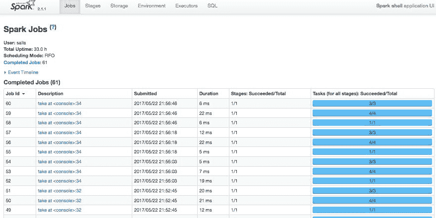

以下是显示集群所有执行器的标签页：

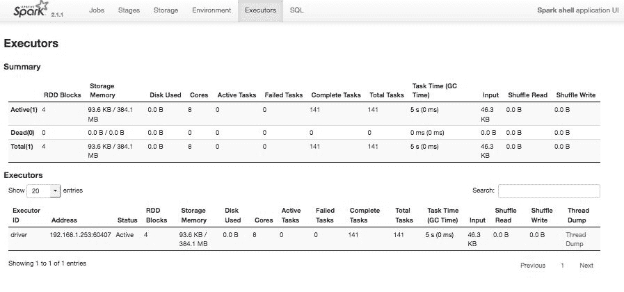

# Spark 在 YARN 上

在 YARN 模式下，客户端与 YARN 资源管理器通信并获取容器来运行 Spark 执行。你可以将其视为为你部署的一个类似于迷你 Spark 集群的东西。

多个客户端与集群交互时，会在集群节点（节点管理器）上创建它们自己的执行器。同时，每个客户端都会有自己的驱动程序组件。

使用 YARN 运行时，Spark 可以运行在 YARN 客户端模式或 YARN 集群模式下。

# YARN 客户端模式

在 YARN 客户端模式下，Driver 运行在集群外的节点上（通常是客户端所在的位置）。Driver 首先联系资源管理器请求资源来运行 Spark 任务。资源管理器分配一个容器（容器零）并回应 Driver。Driver 随后在容器零中启动 Spark 应用程序主节点。Spark 应用程序主节点接着在资源管理器分配的容器中创建执行器。YARN 容器可以位于集群中由节点管理器控制的任何节点上。因此，所有资源分配都由资源管理器管理。

即使是 Spark 应用程序主节点也需要与资源管理器通信，以获取后续容器来启动执行器。

以下是 Spark 的 YARN 客户端模式部署：

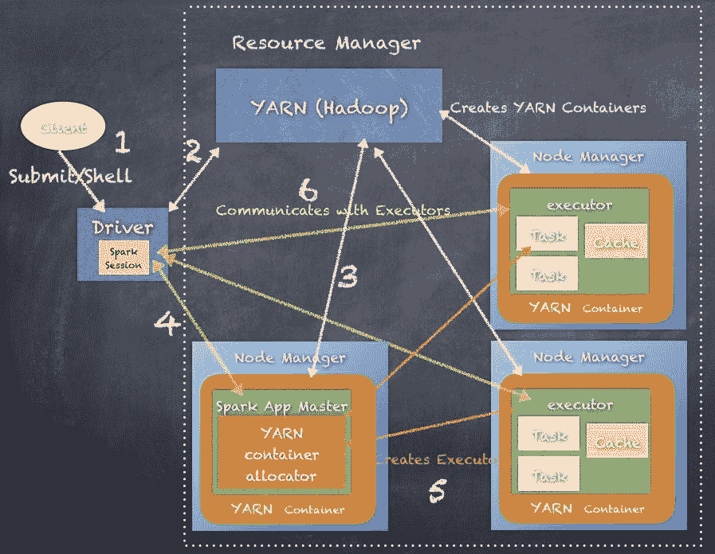

# YARN 集群模式

在 YARN 集群模式中，Driver 运行在集群内的节点上（通常是应用程序主节点所在的地方）。客户端首先联系资源管理器请求资源来运行 Spark 任务。资源管理器分配一个容器（容器零）并回应客户端。客户端接着将代码提交给集群，并在容器零中启动 Driver 和 Spark 应用程序主节点。Driver 与应用程序主节点和 Spark 应用程序主节点一起运行，然后在资源管理器分配的容器中创建执行器。YARN 容器可以位于集群中由节点管理器控制的任何节点上。因此，所有资源分配都由资源管理器管理。

即使是 Spark 应用程序主节点也需要与资源管理器通信，以获取后续容器来启动执行器。

以下是 Spark 的 YARN 集群模式部署：

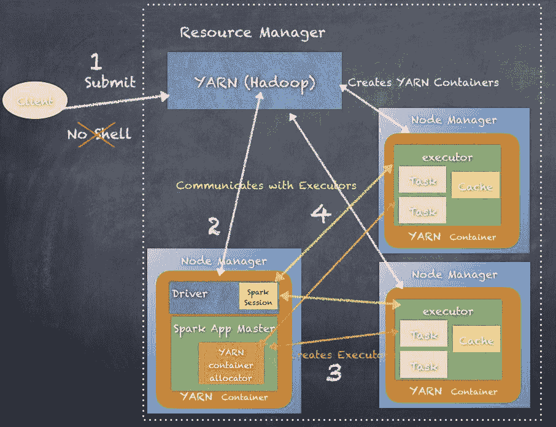

YARN 集群模式中没有 Shell 模式，因为 Driver 本身是在 YARN 内部运行的。

# Mesos 上的 Spark

Mesos 部署与 Spark 独立模式类似，Driver 与 Mesos Master 进行通信，后者分配执行器所需的资源。如同在独立模式中，Driver 然后与执行器进行通信以运行任务。因此，在 Mesos 部署中，Driver 首先与 Master 通信，然后在所有 Mesos 从节点上获取容器的请求。

当容器分配给 Spark 任务时，Driver 会启动执行器并在执行器中运行代码。当 Spark 任务完成且 Driver 退出时，Mesos Master 会收到通知，所有 Mesos 从节点上的容器形式的资源将被回收。

多个客户端与集群交互，在从节点上创建各自的执行器。此外，每个客户端将有其自己的 Driver 组件。客户端模式和集群模式都可以使用，就像 YARN 模式一样。

以下是基于 Mesos 的 Spark 部署示意图，展示了**Driver**如何连接到**Mesos 主节点**，该节点还管理着所有 Mesos 从节点的资源：

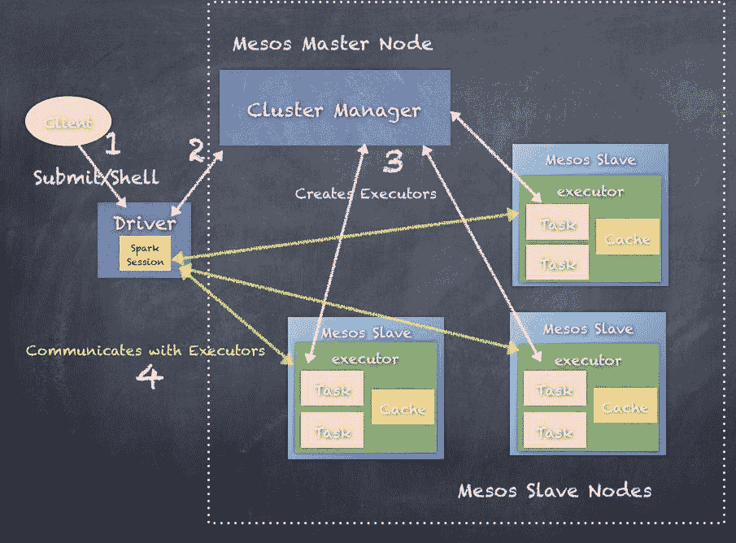

# RDD 简介

**弹性分布式数据集**（**RDD**）是一个不可变的、分布式的对象集合。Spark 的 RDD 具有弹性或容错性，这使得 Spark 能够在发生故障时恢复 RDD。不可变性使得 RDD 一旦创建后就是只读的。转换操作允许对 RDD 进行操作，创建新的 RDD，但原始的 RDD 在创建后永远不会被修改。这使得 RDD 免受竞争条件和其他同步问题的影响。

RDD 的分布式特性之所以有效，是因为 RDD 仅包含对数据的引用，而实际的数据则分布在集群中各个节点的分区内。

从概念上讲，RDD 是一个分布式的数据集合，分布在集群的多个节点上。为了更好地理解 RDD，我们可以把它看作是一个跨机器分布的大型整数数组。

RDD 实际上是一个跨集群分区的数据集，这些分区的数据可以来自**HDFS**（**Hadoop 分布式文件系统**）、HBase 表、Cassandra 表、Amazon S3 等。

在内部，每个 RDD 具有五个主要属性：

+   分区列表

+   计算每个分区的函数

+   其他 RDD 的依赖关系列表

+   可选地，键值型 RDD 的分区器（例如，声明 RDD 是哈希分区的）

+   可选地，计算每个分区时的首选位置列表（例如，HDFS 文件的块位置）

请看以下图示：

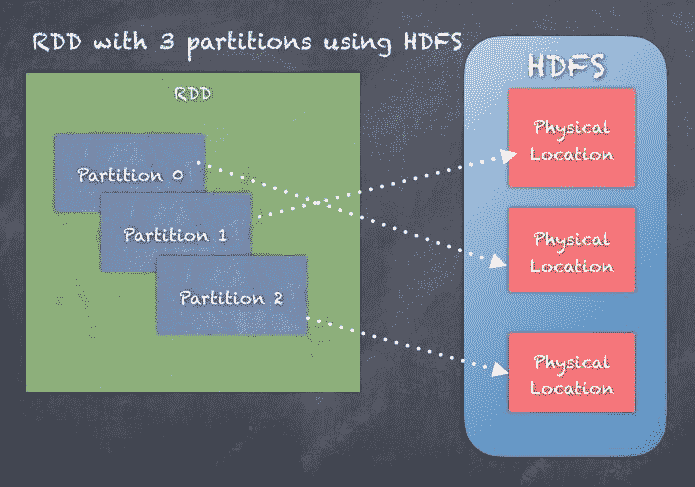

在程序中，驱动程序将 RDD 对象视为对分布式数据的句柄。它类似于指向数据的指针，而不是直接使用实际数据，当需要时通过它来访问实际数据。

默认情况下，RDD 使用哈希分区器将数据分配到集群中。分区的数量与集群中节点的数量无关。可能出现的情况是，集群中的单个节点拥有多个数据分区。数据分区的数量完全取决于集群中节点的数量以及数据的大小。如果查看任务在节点上的执行情况，运行在工作节点上执行器上的任务可能处理的数据既可以是同一本地节点上的数据，也可以是远程节点上的数据。这就是数据的本地性，执行任务会选择最本地的数据。

本地性会显著影响作业的性能。默认的本地性偏好顺序如下所示：

`PROCESS_LOCAL > NODE_LOCAL > NO_PREF > RACK_LOCAL > ANY`

无法保证每个节点会得到多少个分区。这会影响每个执行器的处理效率，因为如果一个节点上有太多的分区来处理多个分区，那么处理所有分区所花费的时间也会增加，导致执行器的核心负载过重，从而拖慢整个处理阶段，进而减慢整个作业的速度。实际上，分区是提高 Spark 作业性能的主要调优因素之一。请参考以下命令：

```py
class RDD[T: ClassTag]

```

让我们进一步了解在加载数据时 RDD 的表现。以下是一个示例，展示了 Spark 如何使用不同的工作节点加载数据的不同分区或切片：

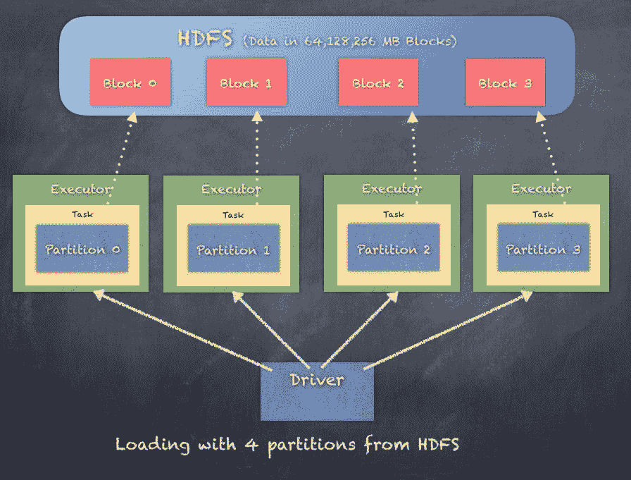

无论 RDD 是如何创建的，初始的 RDD 通常称为基础 RDD，随后通过各种操作创建的任何 RDD 都是该 RDD 的血统的一部分。记住这一点非常重要，因为容错和恢复的秘密在于**驱动程序**维护了 RDD 的血统，并能够执行这些血统以恢复丢失的 RDD 块。

以下是一个示例，展示了多个 RDD 是如何作为操作结果被创建的。我们从**基础 RDD**开始，它包含 24 个元素，然后派生出另一个 RDD **carsRDD**，它只包含匹配“汽车”这一项的元素（3）：

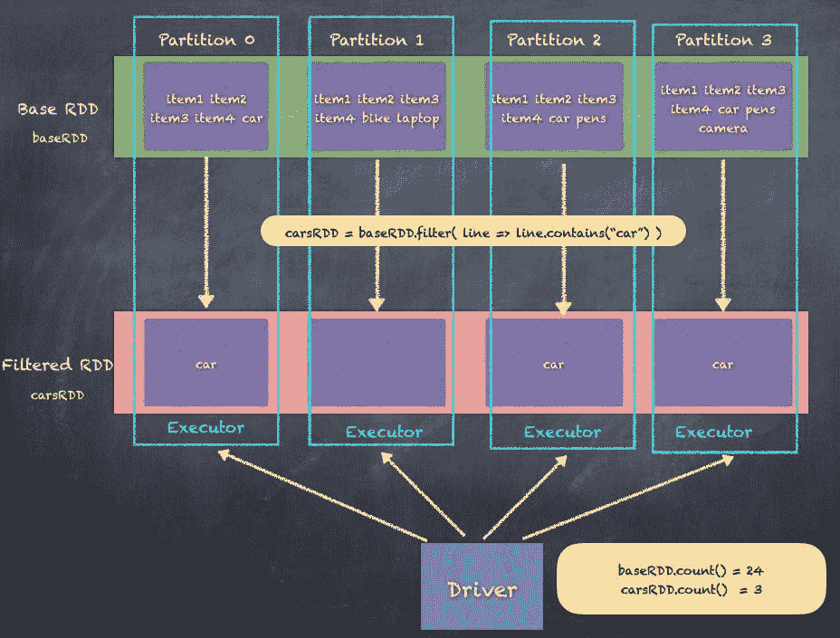

在这种操作过程中，分区的数量不会发生变化，因为每个执行器会在内存中应用过滤转换，从而生成与原始 RDD 分区对应的新 RDD 分区。

接下来，我们将了解如何创建 RDD。

# RDD 创建

RDD 是 Apache Spark 中使用的基本对象。它们是不可变的集合，代表数据集，并具有内置的可靠性和故障恢复能力。由于其特性，RDD 在任何操作（如转换或动作）后都会创建新的 RDD。RDD 还会存储血统信息，用于从故障中恢复。在上一章中，我们也看到了一些关于如何创建 RDD 以及可以应用于 RDD 的操作的细节。

可以通过几种方式创建 RDD：

+   并行化一个集合

+   从外部源读取数据

+   转换一个现有的 RDD

+   流式 API

# 并行化一个集合

并行化一个集合可以通过在驱动程序中调用 `parallelize()` 来实现。驱动程序在尝试并行化一个集合时，会将集合拆分为多个分区，并将这些数据分区分发到集群中。

以下是一个使用 SparkContext 和 `parallelize()` 函数从数字序列创建 RDD 的示例。`parallelize()` 函数本质上是将数字序列拆分成一个分布式集合，也就是所谓的 RDD。

```py
scala> val rdd_one = sc.parallelize(Seq(1,2,3))
rdd_one: org.apache.spark.rdd.RDD[Int] = ParallelCollectionRDD[0] at parallelize at <console>:24

scala> rdd_one.take(10)
res0: Array[Int] = Array(1, 2, 3)

```

# 从外部源读取数据

创建 RDD 的第二种方法是通过从外部分布式源读取数据，例如 Amazon S3、Cassandra、HDFS 等。例如，如果你是从 HDFS 创建 RDD，那么 HDFS 中的分布式块将被 Spark 集群中的各个节点读取。

Spark 集群中的每个节点本质上都在执行自己的输入输出操作，每个节点独立地从 HDFS 块中读取一个或多个块。通常，Spark 会尽最大努力将尽可能多的 RDD 放入内存中。它具有通过启用 Spark 集群中的节点避免重复读取操作（例如从可能与 Spark 集群远程的 HDFS 块中读取）来减少输入输出操作的能力，称为`缓存`。在 Spark 程序中有许多缓存策略可供使用，我们将在后续的缓存章节中讨论。

以下是通过 Spark Context 和 `textFile()` 函数从文本文件加载的文本行的 RDD。`textFile` 函数将输入数据作为文本文件加载（每个换行符 `\n` 终止的部分会成为 RDD 中的一个元素）。该函数调用还会自动使用 HadoopRDD（在下一章节中介绍）来根据需要检测并加载数据，以多分区的形式分布在集群中。

```py
scala> val rdd_two = sc.textFile("wiki1.txt")
rdd_two: org.apache.spark.rdd.RDD[String] = wiki1.txt MapPartitionsRDD[8] at textFile at <console>:24

scala> rdd_two.count
res6: Long = 9

scala> rdd_two.first
res7: String = Apache Spark provides programmers with an application programming interface centered on a data structure called the resilient distributed dataset (RDD), a read-only multiset of data items distributed over a cluster of machines, that is maintained in a fault-tolerant way.

```

# 现有 RDD 的转换

RDD 本质上是不可变的，因此，可以通过对任何现有的 RDD 应用转换来创建新的 RDD。Filter 是转换的一个典型示例。

以下是一个简单的整数 `rdd`，并通过将每个整数乘以 `2` 进行转换。我们再次使用 `SparkContext` 和 parallelize 函数，将整数序列分发到各个分区形式的 RDD 中。然后，使用 `map()` 函数将 RDD 转换为另一个 RDD，通过将每个数字乘以 `2`。

```py
scala> val rdd_one = sc.parallelize(Seq(1,2,3))
rdd_one: org.apache.spark.rdd.RDD[Int] = ParallelCollectionRDD[0] at parallelize at <console>:24

scala> rdd_one.take(10)
res0: Array[Int] = Array(1, 2, 3)

scala> val rdd_one_x2 = rdd_one.map(i => i * 2)
rdd_one_x2: org.apache.spark.rdd.RDD[Int] = MapPartitionsRDD[9] at map at <console>:26

scala> rdd_one_x2.take(10)
res9: Array[Int] = Array(2, 4, 6)

```

# 流处理 API

RDD 还可以通过 Spark Streaming 创建。这些 RDD 称为离散化流 RDD（DStream RDD）。

我们将在 第九章 中进一步讨论，*Stream Me Up, Scotty - Spark Streaming*。

在下一节中，我们将创建 RDD，并使用 Spark-Shell 探索一些操作。

# 使用 Spark shell

Spark shell 提供了一种简单的方法来进行数据的交互式分析。它还使你能够通过快速尝试各种 API 来学习 Spark API。此外，它与 Scala shell 的相似性以及对 Scala API 的支持，使你能够快速适应 Scala 语言构造，并更好地使用 Spark API。

Spark shell 实现了 **读取-评估-打印-循环**（**REPL**）的概念，允许你通过键入代码与 shell 进行交互，代码会被立即评估。结果会打印到控制台，而无需编译，从而构建可执行代码。

在你安装了 Spark 的目录中运行以下命令以启动：

```py
./bin/spark-shell

```

Spark shell 启动时，自动创建 `SparkSession` 和 `SparkContext` 对象。`SparkSession` 作为 Spark 可用，`SparkContext` 作为 sc 可用。

`spark-shell` 可以通过多种选项启动，如下段代码所示（最重要的选项已加粗）：

```py
./bin/spark-shell --help
Usage: ./bin/spark-shell [options]

Options:
 --master MASTER_URL spark://host:port, mesos://host:port, yarn, or local.
 --deploy-mode DEPLOY_MODE Whether to launch the driver program locally ("client") or
 on one of the worker machines inside the cluster ("cluster")
 (Default: client).
 --class CLASS_NAME Your application's main class (for Java / Scala apps).
 --name NAME A name of your application.
 --jars JARS Comma-separated list of local jars to include on the driver
 and executor classpaths.
 --packages Comma-separated list of maven coordinates of jars to include
 on the driver and executor classpaths. Will search the local
 maven repo, then maven central and any additional remote
 repositories given by --repositories. The format for the
 coordinates should be groupId:artifactId:version.
 --exclude-packages Comma-separated list of groupId:artifactId, to exclude while
 resolving the dependencies provided in --packages to avoid
 dependency conflicts.
 --repositories Comma-separated list of additional remote repositories to
 search for the maven coordinates given with --packages.
 --py-files PY_FILES Comma-separated list of .zip, .egg, or .py files to place
 on the PYTHONPATH for Python apps.
 --files FILES Comma-separated list of files to be placed in the working
 directory of each executor.

 --conf PROP=VALUE Arbitrary Spark configuration property.
 --properties-file FILE Path to a file from which to load extra properties. If not
 specified, this will look for conf/spark-defaults.conf.

 --driver-memory MEM Memory for driver (e.g. 1000M, 2G) (Default: 1024M).
 --driver-Java-options Extra Java options to pass to the driver.
 --driver-library-path Extra library path entries to pass to the driver.
 --driver-class-path Extra class path entries to pass to the driver. Note that
 jars added with --jars are automatically included in the
 classpath.

 --executor-memory MEM Memory per executor (e.g. 1000M, 2G) (Default: 1G).

 --proxy-user NAME User to impersonate when submitting the application.
 This argument does not work with --principal / --keytab.

 --help, -h Show this help message and exit.
 --verbose, -v Print additional debug output.
 --version, Print the version of current Spark.

 Spark standalone with cluster deploy mode only:
 --driver-cores NUM Cores for driver (Default: 1).

 Spark standalone or Mesos with cluster deploy mode only:
 --supervise If given, restarts the driver on failure.
 --kill SUBMISSION_ID If given, kills the driver specified.
 --status SUBMISSION_ID If given, requests the status of the driver specified.

 Spark standalone and Mesos only:
 --total-executor-cores NUM Total cores for all executors.

 Spark standalone and YARN only:
 --executor-cores NUM Number of cores per executor. (Default: 1 in YARN mode,
 or all available cores on the worker in standalone mode)

 YARN-only:
 --driver-cores NUM Number of cores used by the driver, only in cluster mode
 (Default: 1).
 --queue QUEUE_NAME The YARN queue to submit to (Default: "default").
 --num-executors NUM Number of executors to launch (Default: 2).
 If dynamic allocation is enabled, the initial number of
 executors will be at least NUM.
 --archives ARCHIVES Comma separated list of archives to be extracted into the
 working directory of each executor.
 --principal PRINCIPAL Principal to be used to login to KDC, while running on
 secure HDFS.
 --keytab KEYTAB The full path to the file that contains the keytab for the
 principal specified above. This keytab will be copied to
 the node running the Application Master via the Secure
 Distributed Cache, for renewing the login tickets and the
 delegation tokens periodically.

```

你还可以将 Spark 代码作为可执行的 Java jar 提交，这样作业就会在集群中执行。通常，只有当你使用 shell 达到一个可行的解决方案时，才会这样做。

使用 `./bin/spark-submit` 提交 Spark 作业到集群（本地、YARN 和 Mesos）。

以下是 Shell 命令（最重要的命令已加粗）：

```py
scala> :help
All commands can be abbreviated, e.g., :he instead of :help.
:edit <id>|<line> edit history
:help [command] print this summary or command-specific help
:history [num] show the history (optional num is commands to show)
:h? <string> search the history
:imports [name name ...] show import history, identifying sources of names
:implicits [-v] show the implicits in scope
:javap <path|class> disassemble a file or class name
:line <id>|<line> place line(s) at the end of history
:load <path> interpret lines in a file
:paste [-raw] [path] enter paste mode or paste a file
:power enable power user mode
:quit exit the interpreter
:replay [options] reset the repl and replay all previous commands
:require <path> add a jar to the classpath
:reset [options] reset the repl to its initial state, forgetting all session entries
:save <path> save replayable session to a file
:sh <command line> run a shell command (result is implicitly => List[String])
:settings <options> update compiler options, if possible; see reset
:silent disable/enable automatic printing of results
:type [-v] <expr> display the type of an expression without evaluating it
:kind [-v] <expr> display the kind of expression's type
:warnings show the suppressed warnings from the most recent line which had any

```

使用 spark-shell，我们现在加载一些数据作为 RDD：

```py
scala> val rdd_one = sc.parallelize(Seq(1,2,3))
rdd_one: org.apache.spark.rdd.RDD[Int] = ParallelCollectionRDD[0] at parallelize at <console>:24

scala> rdd_one.take(10)
res0: Array[Int] = Array(1, 2, 3)

```

如你所见，我们正在逐个运行命令。或者，我们也可以将命令粘贴进去：

```py
scala> :paste
// Entering paste mode (ctrl-D to finish)

val rdd_one = sc.parallelize(Seq(1,2,3))
rdd_one.take(10)

// Exiting paste mode, now interpreting.
rdd_one: org.apache.spark.rdd.RDD[Int] = ParallelCollectionRDD[10] at parallelize at <console>:26
res10: Array[Int] = Array(1, 2, 3)

```

在下一节中，我们将深入探讨操作。

# 操作与转换

RDD 是不可变的，每个操作都会创建一个新的 RDD。现在，你可以在 RDD 上执行的两种主要操作是 **转换** 和 **操作**。

**转换**改变 RDD 中的元素，比如拆分输入元素、过滤掉某些元素，或者进行某种计算。可以按顺序执行多个转换；然而在规划阶段，执行并不会发生。

对于转换，Spark 将它们添加到计算的 DAG 中，只有当 driver 请求某些数据时，这个 DAG 才会被执行。这被称为 *懒惰* 评估。

懒惰评估的原理在于，Spark 可以查看所有的转换并计划执行，利用 Driver 对所有操作的理解。例如，如果一个过滤转换在其他转换后立即应用，Spark 会优化执行，使得每个 Executor 在每个数据分区上高效地执行这些转换。现在，只有当 Spark 等待执行某些操作时，这种优化才有可能。

**操作**是实际触发计算的操作。直到遇到一个操作，Spark 程序中的执行计划才会以 DAG 形式创建并保持不变。显然，执行计划中可能包含各种各样的转换操作，但在执行操作之前，什么也不会发生。

以下是对一些任意数据进行的各种操作的示意图，我们的目标只是移除所有的笔和自行车，只保留并统计汽车**。** 每个 print 语句都是一个操作，它触发 DAG 执行计划中所有转换步骤的执行，直到该点为止，如下图所示：

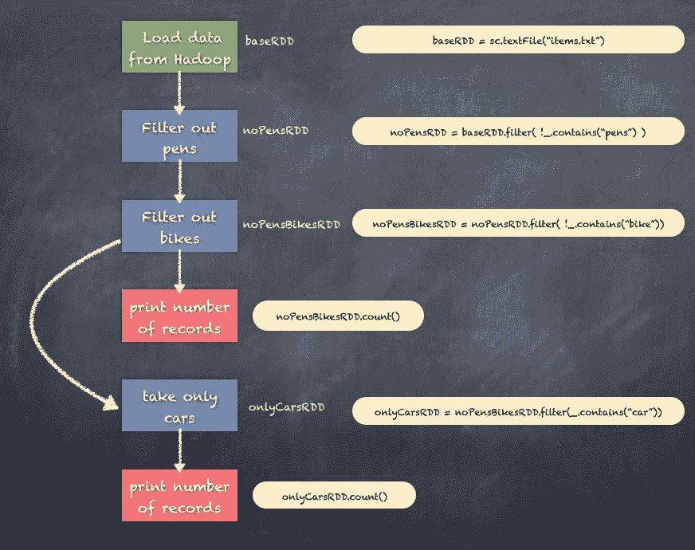

例如，针对有向无环图（DAG）的变换执行`count`操作时，会触发从基本 RDD 到所有变换的执行。如果执行了另一个操作，那么就会有一条新的执行链发生。这就是为什么在有向无环图的不同阶段进行缓存会大大加速程序下一次执行的原因。执行优化的另一种方式是重用上次执行中的 shuffle 文件。

另一个例子是`collect`操作，它会将所有节点的数据收集或拉取到驱动程序。你可以在调用`collect`时使用部分函数，选择性地拉取数据。

# 变换

**变换**通过将变换逻辑应用于现有 RDD 中的每个元素，创建一个新的 RDD。某些变换函数涉及拆分元素、过滤元素以及执行某种计算。多个变换可以按顺序执行。然而，在计划阶段不会发生实际执行。

变换可以分为四类，如下所示。

# 常见变换

**常见变换**是处理大多数通用用途的变换函数，它将变换逻辑应用于现有的 RDD，并生成一个新的 RDD。聚合、过滤等常见操作都被称为常见变换。

常见变换函数的示例包括：

+   `map`

+   `filter`

+   `flatMap`

+   `groupByKey`

+   `sortByKey`

+   `combineByKey`

# 数学/统计变换

数学或统计变换是处理一些统计功能的变换函数，通常会对现有的 RDD 应用某些数学或统计操作，生成一个新的 RDD。抽样就是一个很好的例子，在 Spark 程序中经常使用。

这些变换的示例包括：

+   `sampleByKey`

+   `` `randomSplit` ``

# 集合理论/关系变换

集合理论/关系变换是处理数据集连接（Join）以及其他关系代数功能（如`cogroup`）的变换函数。这些函数通过将变换逻辑应用于现有的 RDD，生成一个新的 RDD。

这些变换的示例包括：

+   `cogroup`

+   `join`

+   `subtractByKey`

+   `fullOuterJoin`

+   `leftOuterJoin`

+   `rightOuterJoin`

# 基于数据结构的变换

基于数据结构的转换是操作 RDD 底层数据结构和 RDD 分区的转换函数。在这些函数中，你可以直接操作分区，而不需要直接处理 RDD 内部的元素/数据。这些函数在任何复杂的 Spark 程序中都至关重要，尤其是在需要更多控制分区和分区在集群中的分布时。通常，性能提升可以通过根据集群状态和数据大小、以及具体用例需求重新分配数据分区来实现。

这种转换的例子有：

+   `partitionBy`

+   `repartition`

+   `zipwithIndex`

+   `coalesce`

以下是最新 Spark 2.1.1 版本中可用的转换函数列表：

| 转换 | 含义 |
| --- | --- |
| `map(func)` | 返回一个新的分布式数据集，通过将源数据集中的每个元素传递给函数`func`来生成。 |
| `filter(func)` | 返回一个新数据集，包含那些`func`返回 true 的源数据集元素。 |
| `flatMap(func)` | 类似于 map，但每个输入项可以映射到 0 个或多个输出项（因此`func`应该返回一个`Seq`而不是单一项）。 |
| `mapPartitions(func)` | 类似于 map，但在 RDD 的每个分区（块）上分别运行，因此当在类型为`T`的 RDD 上运行时，`func`必须是类型`Iterator<T> => Iterator<U>`。 |
| `mapPartitionsWithIndex(func)` | 类似于`mapPartitions`，但还会向`func`提供一个整数值，表示分区的索引，因此当在类型为`T`的 RDD 上运行时，`func`必须是类型`(Int, Iterator<T>) => Iterator<U>`。 |
| `sample(withReplacement, fraction, seed)` | 从数据中按给定比例`fraction`抽取样本，支持有放回或无放回抽样，使用给定的随机数生成种子。 |
| `union(otherDataset)` | 返回一个新数据集，包含源数据集和参数数据集的联合元素。 |
| `intersection(otherDataset)` | 返回一个新 RDD，包含源数据集和参数数据集的交集元素。 |
| `distinct([numTasks]))` | 返回一个新数据集，包含源数据集中的不同元素。 |

| `groupByKey([numTasks])` | 当在一个`(K, V)`对数据集上调用时，返回一个`(K, Iterable<V>)`对的数据集。注意：如果你是为了对每个键执行聚合操作（如求和或平均）而进行分组，使用`reduceByKey`或`aggregateByKey`会带来更好的性能。

注意：默认情况下，输出的并行度取决于父 RDD 的分区数。你可以传递一个可选的`numTasks`参数来设置不同数量的任务。

| reduceByKey(func, [numTasks]) | 当在 `(K, V)` 对数据集上调用时，返回一个 `(K, V)` 对数据集，其中每个键的值使用给定的 `reduce` 函数 `func` 进行聚合，`func` 必须是类型 `(V, V) => V` 的函数。与 `groupByKey` 类似，reduce 任务的数量可以通过可选的第二个参数进行配置。 |
| --- | --- |
| `aggregateByKey(zeroValue)(seqOp, combOp, [numTasks])` | 当在 `(K, V)` 对数据集上调用时，返回一个 `(K, U)` 对数据集，其中每个键的值使用给定的合并函数和中性 *零* 值进行聚合。允许聚合值类型与输入值类型不同，同时避免不必要的内存分配。与 `groupByKey` 类似，reduce 任务的数量可以通过可选的第二个参数进行配置。 |
| `sortByKey([ascending], [numTasks])` | 当在 `(K, V)` 对数据集上调用时，其中 `K` 实现了排序，返回一个按照键升序或降序排序的 `(K, V)` 对数据集，排序顺序由布尔值 `ascending` 参数指定。 |
| `join(otherDataset, [numTasks])` | 当在类型为 `(K, V)` 和 `(K, W)` 的数据集上调用时，返回一个 `(K, (V, W))` 类型的数据集，其中包含每个键的所有元素对。支持外连接，可以通过 `leftOuterJoin`、`rightOuterJoin` 和 `fullOuterJoin` 实现。 |
| `cogroup(otherDataset, [numTasks])` | 当在类型为 `(K, V)` 和 `(K, W)` 的数据集上调用时，返回一个 `(K, (Iterable<V>, Iterable<W>))` 类型的元组数据集。此操作也称为 `groupWith`。 |
| `cartesian(otherDataset)` | 当在类型为 `T` 和 `U` 的数据集上调用时，返回一个 `(T, U)` 对数据集（所有元素对）。 |
| `pipe(command, [envVars])` | 将 RDD 的每个分区通过一个 shell 命令进行处理，例如 Perl 或 bash 脚本。RDD 元素会被写入进程的 `stdin`，输出到其 `stdout` 的行将作为字符串 RDD 返回。 |
| `coalesce(numPartitions)` | 将 RDD 中的分区数量减少到 `numPartitions`。在对大数据集进行过滤后，这对于更高效地运行操作非常有用。 |
| `repartition(numPartitions)` | 随机重新洗牌 RDD 中的数据，以创建更多或更少的分区，并在分区之间进行平衡。这会将所有数据通过网络进行洗牌。 |
| `repartitionAndSortWithinPartitions(partitioner)` | 根据给定的分区器重新分区 RDD，并在每个结果分区内按键对记录进行排序。与调用 `repartition` 后再进行排序相比，这种方法更高效，因为它可以将排序操作推到 shuffle 机制中。 |

我们将演示最常见的转换操作：

# map 函数

`map` 将转换函数应用于输入分区，以生成输出 RDD 中的输出分区。

如下所示，我们可以将一个文本文件的 RDD 映射为包含文本行长度的 RDD：

```py
scala> val rdd_two = sc.textFile("wiki1.txt")
rdd_two: org.apache.spark.rdd.RDD[String] = wiki1.txt MapPartitionsRDD[8] at textFile at <console>:24

scala> rdd_two.count
res6: Long = 9

scala> rdd_two.first
res7: String = Apache Spark provides programmers with an application programming interface centered on a data structure called the resilient distributed dataset (RDD), a read-only multiset of data items distributed over a cluster of machines, that is maintained in a fault-tolerant way.

scala> val rdd_three = rdd_two.map(line => line.length)
res12: org.apache.spark.rdd.RDD[Int] = MapPartitionsRDD[11] at map at <console>:2

scala> rdd_three.take(10)
res13: Array[Int] = Array(271, 165, 146, 138, 231, 159, 159, 410, 281)

```

以下图表解释了`map()`是如何工作的。你可以看到，RDD 的每个分区在新的 RDD 中都生成一个新分区，本质上是在 RDD 的所有元素上应用转换：

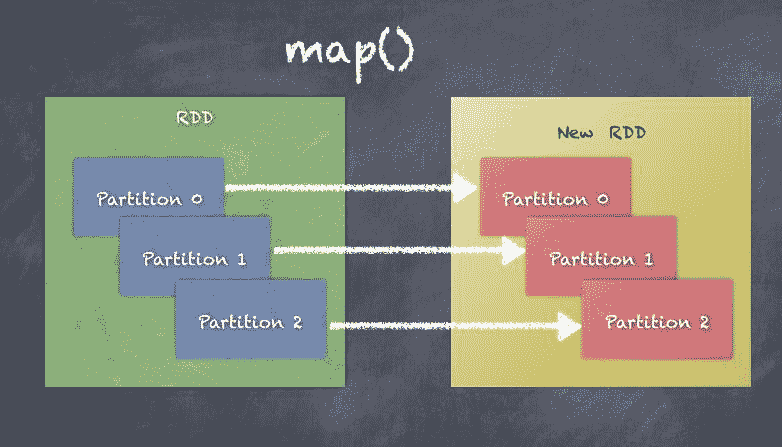

# flatMap 函数

`flatMap()`对输入分区应用转换函数，生成输出 RDD 中的输出分区，就像`map()`函数一样。然而，`flatMap()`还会将输入 RDD 元素中的任何集合扁平化。

```py
flatMap() on a RDD of a text file to convert the lines in the text to a RDD containing the individual words. We also show map() called on the same RDD before flatMap() is called just to show the difference in behavior:
```

```py
scala> val rdd_two = sc.textFile("wiki1.txt")
rdd_two: org.apache.spark.rdd.RDD[String] = wiki1.txt MapPartitionsRDD[8] at textFile at <console>:24

scala> rdd_two.count
res6: Long = 9

scala> rdd_two.first
res7: String = Apache Spark provides programmers with an application programming interface centered on a data structure called the resilient distributed dataset (RDD), a read-only multiset of data items distributed over a cluster of machines, that is maintained in a fault-tolerant way.

scala> val rdd_three = rdd_two.map(line => line.split(" "))
rdd_three: org.apache.spark.rdd.RDD[Array[String]] = MapPartitionsRDD[16] at map at <console>:26

scala> rdd_three.take(1)
res18: Array[Array[String]] = Array(Array(Apache, Spark, provides, programmers, with, an, application, programming, interface, centered, on, a, data, structure, called, the, resilient, distributed, dataset, (RDD),, a, read-only, multiset, of, data, items, distributed, over, a, cluster, of, machines,, that, is, maintained, in, a, fault-tolerant, way.)

scala> val rdd_three = rdd_two.flatMap(line => line.split(" "))
rdd_three: org.apache.spark.rdd.RDD[String] = MapPartitionsRDD[17] at flatMap at <console>:26

scala> rdd_three.take(10)
res19: Array[String] = Array(Apache, Spark, provides, programmers, with, an, application, programming, interface, centered)

```

以下图表解释了`flatMap()`是如何工作的。你可以看到，RDD 的每个分区在新的 RDD 中都生成一个新分区，本质上是在 RDD 的所有元素上应用转换：

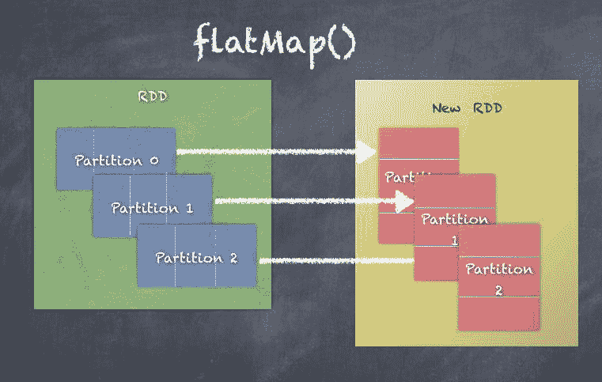

# filter 函数

`filter`对输入分区应用转换函数，以在输出 RDD 中生成过滤后的输出分区。

```py
Spark:
```

```py
scala> val rdd_two = sc.textFile("wiki1.txt")
rdd_two: org.apache.spark.rdd.RDD[String] = wiki1.txt MapPartitionsRDD[8] at textFile at <console>:24

scala> rdd_two.count
res6: Long = 9

scala> rdd_two.first
res7: String = Apache Spark provides programmers with an application programming interface centered on a data structure called the resilient distributed dataset (RDD), a read-only multiset of data items distributed over a cluster of machines, that is maintained in a fault-tolerant way.

scala> val rdd_three = rdd_two.filter(line => line.contains("Spark"))
rdd_three: org.apache.spark.rdd.RDD[String] = MapPartitionsRDD[20] at filter at <console>:26

scala>rdd_three.count
res20: Long = 5

```

以下图表解释了`filter`是如何工作的。你可以看到，RDD 的每个分区在新的 RDD 中都生成一个新分区，本质上是在 RDD 的所有元素上应用 filter 转换。

请注意，应用 filter 时，分区不会改变，并且有些分区可能为空。

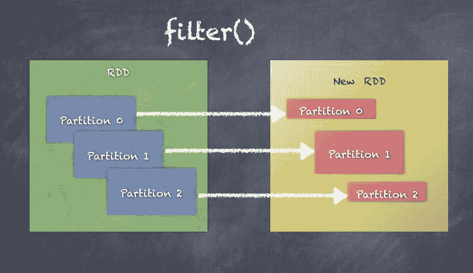

# coalesce

`coalesce`对输入分区应用`transformation`函数，将输入分区合并成输出 RDD 中的更少分区。

如以下代码片段所示，这就是我们如何将所有分区合并为单个分区：

```py
scala> val rdd_two = sc.textFile("wiki1.txt")
rdd_two: org.apache.spark.rdd.RDD[String] = wiki1.txt MapPartitionsRDD[8] at textFile at <console>:24

scala> rdd_two.partitions.length
res21: Int = 2

scala> val rdd_three = rdd_two.coalesce(1)
rdd_three: org.apache.spark.rdd.RDD[String] = CoalescedRDD[21] at coalesce at <console>:26

scala> rdd_three.partitions.length
res22: Int = 1

```

以下图表解释了`coalesce`是如何工作的。你可以看到，一个新的 RDD 是从原始 RDD 创建的，本质上通过根据需要合并分区来减少分区数量：

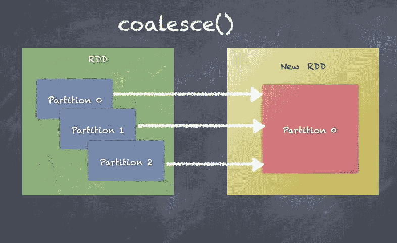

# repartition

`repartition`对输入分区应用`transformation`函数，以便将输入重新分配到输出 RDD 中的更多或更少的分区。

如以下代码片段所示，这就是我们如何将一个文本文件的 RDD 映射到具有更多分区的 RDD：

```py
scala> val rdd_two = sc.textFile("wiki1.txt")
rdd_two: org.apache.spark.rdd.RDD[String] = wiki1.txt MapPartitionsRDD[8] at textFile at <console>:24

scala> rdd_two.partitions.length
res21: Int = 2

scala> val rdd_three = rdd_two.repartition(5)
rdd_three: org.apache.spark.rdd.RDD[String] = MapPartitionsRDD[25] at repartition at <console>:26

scala> rdd_three.partitions.length
res23: Int = 5

```

以下图表解释了`repartition`是如何工作的。你可以看到，一个新的 RDD 是从原始 RDD 创建的，本质上通过根据需要合并/拆分分区来重新分配分区：

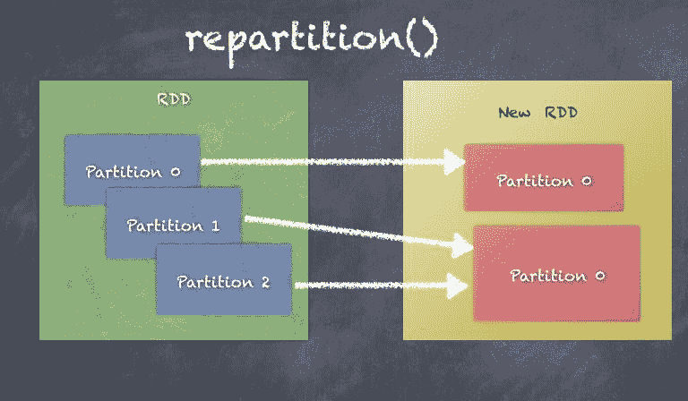

# 操作

Action 触发整个**DAG**（**有向无环图**）的转换，该转换通过运行代码块和函数来实现。所有操作现在都按照 DAG 的指定进行执行。

有两种操作类型：

+   **Driver**：一种操作是驱动程序操作，如 collect、count、count by key 等。每个这样的操作都会在远程执行器上执行一些计算，并将数据拉回到驱动程序。

基于驱动程序的操作存在一个问题：对大数据集执行操作时，可能会轻易使驱动程序的内存超负荷，导致应用程序崩溃，因此应谨慎使用涉及驱动程序的操作。

+   **分布式**：另一种操作是分布式操作，它在集群的节点上执行。`saveAsTextFile`就是这种分布式操作的一个示例。这是最常见的操作之一，因为该操作具备分布式处理的优点。 |

以下是最新版本 Spark 2.1.1 中可用的操作函数列表：

| 操作 | 含义 |
| --- | --- |
| `reduce(func)` | 使用函数`func`（该函数接受两个参数并返回一个结果）对数据集的元素进行聚合。该函数应该是交换律和结合律的，以便可以正确并行计算。 |
| `collect()` | 将数据集中的所有元素作为数组返回到驱动程序中。通常在过滤或其他操作之后有用，这些操作返回一个足够小的子集数据。 |
| `count()` | 返回数据集中的元素数量。 |
| `first()` | 返回数据集中的第一个元素（类似于`take(1)`）。 |
| `take(n)` | 返回数据集的前`n`个元素组成的数组。 |
| `takeSample(withReplacement, num, [seed])` | 返回一个包含数据集中`num`个随机样本的数组，可以选择是否允许替代，且可选地预先指定随机数生成器的种子。 |
| `takeOrdered(n, [ordering])` | 返回 RDD 的前`n`个元素，使用它们的自然顺序或自定义比较器。 |
| `saveAsTextFile(path)` | 将数据集的元素作为文本文件（或一组文本文件）写入本地文件系统、HDFS 或任何其他 Hadoop 支持的文件系统中的指定目录。Spark 会调用每个元素的`toString`方法，将其转换为文件中的一行文本。 |
| `saveAsSequenceFile(path)`（Java 和 Scala） | 将数据集的元素作为 Hadoop SequenceFile 写入本地文件系统、HDFS 或任何其他 Hadoop 支持的文件系统中的指定路径。此操作仅适用于实现 Hadoop 的`Writable`接口的键值对类型的 RDD。在 Scala 中，对于那些可以隐式转换为`Writable`的类型，也可以使用该操作（Spark 提供了基本类型如`Int`、`Double`、`String`等的转换）。 |
| `saveAsObjectFile(path)`（Java 和 Scala） | 使用 Java 序列化将数据集的元素写入简单格式，随后可以使用`SparkContext.objectFile()`加载。 |
| `countByKey()` | 仅适用于类型为`(K, V)`的 RDD。返回一个包含每个键计数的`(K, Int)`键值对的哈希映射。 |
| `foreach(func)` | 对数据集的每个元素执行一个函数`func`。这通常用于副作用，例如更新累加器（[`spark.apache.org/docs/latest/programming-guide.html#accumulators`](http://spark.apache.org/docs/latest/programming-guide.html#accumulators)）或与外部存储系统交互。注意：在`foreach()`外部修改累加器以外的变量可能会导致未定义的行为。有关更多详细信息，请参见理解闭包（[`spark.apache.org/docs/latest/programming-guide.html#understanding-closures-a-nameclosureslinka`](http://spark.apache.org/docs/latest/programming-guide.html#understanding-closures-a-nameclosureslinka)）[了解更多信息](http://spark.apache.org/docs/latest/programming-guide.html#understanding-closures-a-nameclosureslinka)。 |

# reduce

`reduce()`对 RDD 中的所有元素应用 reduce 函数，并将结果发送到 Driver。

以下是说明此功能的示例代码。你可以使用`SparkContext`和 parallelize 函数从一个整数序列创建 RDD。然后，你可以使用`reduce`函数对 RDD 中的所有数字进行求和。

由于这是一个动作，运行`reduce`函数时，结果会立即打印出来。

以下是从一个小的数字数组构建简单 RDD 并对 RDD 进行 reduce 操作的代码：

```py
scala> val rdd_one = sc.parallelize(Seq(1,2,3,4,5,6))
rdd_one: org.apache.spark.rdd.RDD[Int] = ParallelCollectionRDD[26] at parallelize at <console>:24

scala> rdd_one.take(10)
res28: Array[Int] = Array(1, 2, 3, 4, 5, 6)

scala> rdd_one.reduce((a,b) => a +b)
res29: Int = 21

```

以下图示为`reduce()`的示例。Driver 在执行器上运行 reduce 函数并最终收集结果。

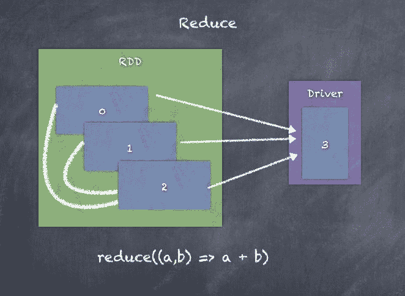

# count

`count()`只是简单地计算 RDD 中元素的数量，并将其发送到 Driver。

以下是此函数的示例。我们通过 SparkContext 和 parallelize 函数从一个整数序列创建了一个 RDD，然后在 RDD 上调用 count 来打印 RDD 中元素的数量。

```py
scala> val rdd_one = sc.parallelize(Seq(1,2,3,4,5,6))
rdd_one: org.apache.spark.rdd.RDD[Int] = ParallelCollectionRDD[26] at parallelize at <console>:24

scala> rdd_one.count
res24: Long = 6

```

以下是`count()`的示例。Driver 请求每个执行器/任务计算任务处理的分区中元素的数量，然后将所有任务的计数相加，最终在 Driver 层进行汇总。

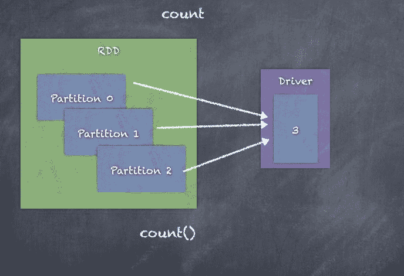

# collect

`collect()`只是简单地收集 RDD 中的所有元素，并将其发送到 Driver。

这里展示了一个示例，说明 collect 函数的本质。当你在 RDD 上调用 collect 时，Driver 将通过提取 RDD 的所有元素将它们收集到 Driver 中。

在大规模 RDD 上调用 collect 会导致 Driver 出现内存溢出问题。

以下是收集 RDD 内容并显示的代码：

```py
scala> rdd_two.collect
res25: Array[String] = Array(Apache Spark provides programmers with an application programming interface centered on a data structure called the resilient distributed dataset (RDD), a read-only multiset of data items distributed over a cluster of machines, that is maintained in a fault-tolerant way., It was developed in response to limitations in the MapReduce cluster computing paradigm, which forces a particular linear dataflow structure on distributed programs., "MapReduce programs read input data from disk, map a function across the data, reduce the results of the map, and store reduction results on disk. ", Spark's RDDs function as a working set for distributed programs that offers a (deliberately) restricted form of distributed shared memory., The availability of RDDs facilitates t...

```

以下是`collect()`的示例。使用 collect，Driver 从所有分区中提取 RDD 的所有元素。

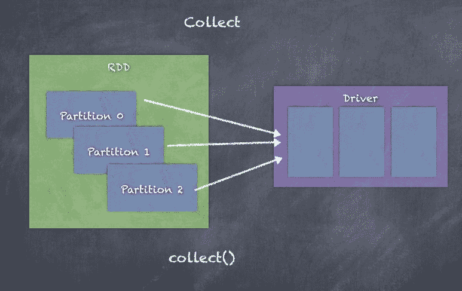

# Caching

缓存使得 Spark 可以在计算和操作过程中持久化数据。事实上，这也是 Spark 中加速计算的最重要的技术之一，尤其是在处理迭代计算时。

缓存通过尽可能多地存储 RDD 在内存中来工作。如果内存不足，则按 LRU 策略将当前存储的数据驱逐出去。如果要求缓存的数据大于可用内存，则性能将下降，因为将使用磁盘而不是内存。

您可以使用`persist()`或`cache()`将 RDD 标记为已缓存。

`cache()`只是`persist`(MEMORY_ONLY)`的同义词。

`persist`可以使用内存或磁盘或两者：

```py
persist(newLevel: StorageLevel) 

```

以下是存储级别的可能值：

| 存储级别 | 含义 |
| --- | --- |
| `MEMORY_ONLY` | 将 RDD 作为反序列化的 Java 对象存储在 JVM 中。如果 RDD 不适合内存，则某些分区将不会被缓存，并且在每次需要时会即时重新计算。这是默认级别。 |
| `MEMORY_AND_DISK` | 将 RDD 作为反序列化的 Java 对象存储在 JVM 中。如果 RDD 不适合内存，则存储不适合的分区在磁盘上，并在需要时从那里读取。 |
| `MEMORY_ONLY_SER`（Java 和 Scala） | 将 RDD 存储为序列化的 Java 对象（每个分区一个字节数组）。这通常比反序列化对象更节省空间，特别是在使用快速序列化器时，但读取时更消耗 CPU。 |
| `MEMORY_AND_DISK_SER`（Java 和 Scala） | 类似于`MEMORY_ONLY_SER`，但将不适合内存的分区溢出到磁盘，而不是每次需要时即时重新计算它们。 |
| `DISK_ONLY` | 仅将 RDD 分区存储在磁盘上。 |
| `MEMORY_ONLY_2`，`MEMORY_AND_DISK_2`等。 | 与前述级别相同，但将每个分区复制到两个集群节点。 |
| `OFF_HEAP`（实验性） | 类似于`MEMORY_ONLY_SER`，但将数据存储在堆外内存中。这需要启用堆外内存。 |

选择存储级别取决于情况

+   如果 RDD 可以放入内存中，请使用`MEMORY_ONLY`，因为这是执行性能最快的选项。

+   如果使用可序列化对象，请尝试`MEMORY_ONLY_SER`以使对象更小。

+   除非计算成本高昂，否则不应使用`DISK`。

+   如果可以，使用复制存储来获得最佳的容错能力，即使需要额外的内存。这将防止丢失分区的重新计算，以获得最佳的可用性。

`unpersist()`只需释放已缓存的内容。

以下是使用不同类型存储（内存或磁盘）调用`persist()`函数的示例：

```py
scala> import org.apache.spark.storage.StorageLevel
import org.apache.spark.storage.StorageLevel

scala> rdd_one.persist(StorageLevel.MEMORY_ONLY)
res37: rdd_one.type = ParallelCollectionRDD[26] at parallelize at <console>:24

scala> rdd_one.unpersist()
res39: rdd_one.type = ParallelCollectionRDD[26] at parallelize at <console>:24

scala> rdd_one.persist(StorageLevel.DISK_ONLY)
res40: rdd_one.type = ParallelCollectionRDD[26] at parallelize at <console>:24

scala> rdd_one.unpersist()
res41: rdd_one.type = ParallelCollectionRDD[26] at parallelize at <console>:24

```

以下是我们通过缓存获得的性能改进的示例。

首先，我们将运行代码：

```py
scala> val rdd_one = sc.parallelize(Seq(1,2,3,4,5,6))
rdd_one: org.apache.spark.rdd.RDD[Int] = ParallelCollectionRDD[0] at parallelize at <console>:24

scala> rdd_one.count
res0: Long = 6

scala> rdd_one.cache
res1: rdd_one.type = ParallelCollectionRDD[0] at parallelize at <console>:24

scala> rdd_one.count
res2: Long = 6

```

您可以使用 WebUI 查看所显示的改进，如下面的屏幕截图所示：

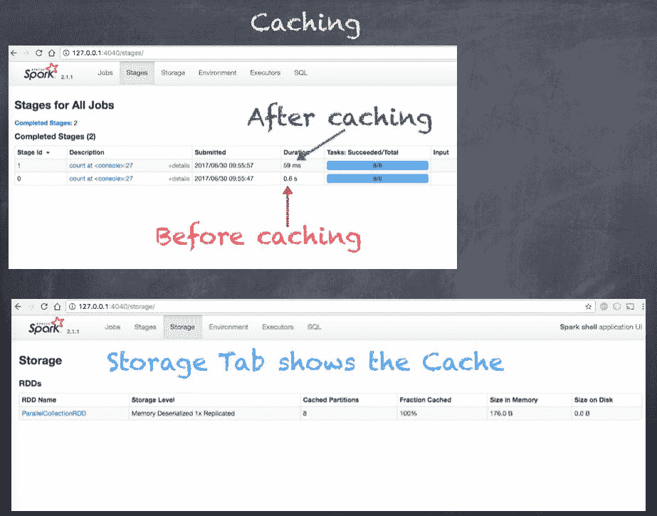

# 加载和保存数据

加载数据到 RDD 和将 RDD 保存到输出系统都支持多种不同的方法。我们将在本节中介绍最常见的方法。

# 加载数据

可以通过使用`SparkContext`来加载数据到 RDD。其中一些最常见的方法是：。

+   `textFile`

+   `wholeTextFiles`

+   `load` 从 JDBC 数据源加载

# textFile

可以使用`textFile()`将 textFiles 加载到 RDD 中，每一行成为 RDD 中的一个元素。

```py
sc.textFile(name, minPartitions=None, use_unicode=True)

```

以下是使用`textFile()`将`textfile`加载到 RDD 的示例：

```py
scala> val rdd_two = sc.textFile("wiki1.txt")
rdd_two: org.apache.spark.rdd.RDD[String] = wiki1.txt MapPartitionsRDD[8] at textFile at <console>:24

scala> rdd_two.count
res6: Long = 9

```

# wholeTextFiles

`wholeTextFiles()`可以用来将多个文本文件加载到一个包含`<filename, textOfFile>`对的 RDD 中，表示文件名和文件的完整内容。当加载多个小文本文件时，这非常有用，并且与`textFile` API 不同，因为使用`wholeTextFiles()`时，文件的完整内容作为单个记录加载：

```py
sc.wholeTextFiles(path, minPartitions=None, use_unicode=True)

```

以下是使用`wholeTextFiles()`将`textfile`加载到 RDD 的示例：

```py
scala> val rdd_whole = sc.wholeTextFiles("wiki1.txt")
rdd_whole: org.apache.spark.rdd.RDD[(String, String)] = wiki1.txt MapPartitionsRDD[37] at wholeTextFiles at <console>:25

scala> rdd_whole.take(10)
res56: Array[(String, String)] =
Array((file:/Users/salla/spark-2.1.1-bin-hadoop2.7/wiki1.txt,Apache Spark provides programmers with an application programming interface centered on a data structure called the resilient distributed dataset (RDD), a read-only multiset of data 

```

# 从 JDBC 数据源加载

你可以从支持**Java 数据库连接**（**JDBC**）的外部数据源加载数据。使用 JDBC 驱动程序，你可以连接到关系型数据库，如 Mysql，并将表的内容加载到 Spark 中，具体请参见以下代码示例：

```py
 sqlContext.load(path=None, source=None, schema=None, **options)

```

以下是从 JDBC 数据源加载的示例：

```py
val dbContent = sqlContext.load(source="jdbc",  url="jdbc:mysql://localhost:3306/test",  dbtable="test",  partitionColumn="id")

```

# 保存 RDD

将数据从 RDD 保存到文件系统可以通过以下两种方式完成：

+   `saveAsTextFile`

+   `saveAsObjectFile`

以下是将 RDD 保存到文本文件的示例

```py
scala> rdd_one.saveAsTextFile("out.txt")

```

还有许多加载和保存数据的方式，特别是在与 HBase、Cassandra 等系统集成时。

# 总结

在本章中，我们讨论了 Apache Spark 的内部结构，RDD 是什么，DAG 和 RDD 的血统，转换和动作。我们还了解了 Apache Spark 的各种部署模式，包括独立模式、YARN 和 Mesos 部署。我们还在本地机器上做了本地安装，并查看了 Spark shell 以及如何与 Spark 进行交互。

此外，我们还讨论了如何将数据加载到 RDD 中并将 RDD 保存到外部系统，以及 Spark 卓越性能的秘诀——缓存功能，以及如何使用内存和/或磁盘来优化性能。

在下一章中，我们将深入探讨 RDD API 以及它如何在第七章中工作，*特殊 RDD 操作*。
