# 第七章：特殊的 RDD 操作

"本来应该是自动的，但实际上你必须按这个按钮。"

- 约翰·布鲁纳

在本章中，你将学习如何根据不同的需求调整 RDD，并且了解这些 RDD 提供的新功能（以及潜在的风险！）。此外，我们还将探讨 Spark 提供的其他有用对象，如广播变量和累加器。

简而言之，本章将涵盖以下主题：

+   RDD 的类型

+   聚合

+   分区和洗牌

+   广播变量

+   累加器

# RDD 的类型

**弹性分布式数据集** (**RDDs**) 是 Apache Spark 中使用的基本对象。RDD 是不可变的集合，代表数据集，并具有内建的可靠性和故障恢复能力。RDD 的特点是每次操作（如转换或动作）都会创建新的 RDD，并且它们还存储继承链，继承链用于故障恢复。在前一章中，我们已经看到了一些关于如何创建 RDD 以及可以应用于 RDD 的操作类型的细节。

以下是一个简单的 RDD 继承示例：

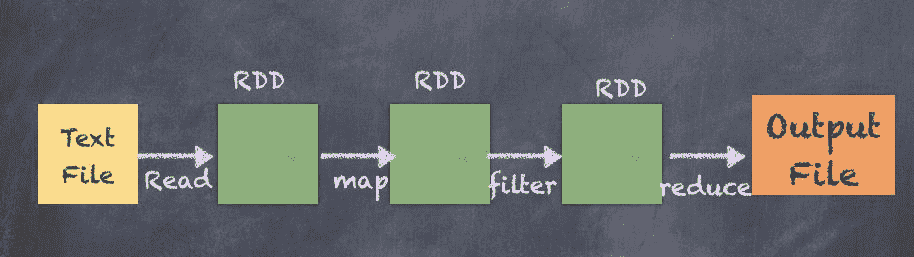

让我们再次从一个简单的 RDD 开始，通过创建一个由数字序列组成的 RDD：

```py
scala> val rdd_one = sc.parallelize(Seq(1,2,3,4,5,6))
rdd_one: org.apache.spark.rdd.RDD[Int] = ParallelCollectionRDD[28] at parallelize at <console>:25

scala> rdd_one.take(100)
res45: Array[Int] = Array(1, 2, 3, 4, 5, 6)

```

前面的示例展示了整数类型的 RDD，任何对该 RDD 执行的操作都会生成另一个 RDD。例如，如果我们将每个元素乘以 `3`，结果如下面的代码片段所示：

```py
scala> val rdd_two = rdd_one.map(i => i * 3)
rdd_two: org.apache.spark.rdd.RDD[Int] = MapPartitionsRDD[29] at map at <console>:27

scala> rdd_two.take(10)
res46: Array[Int] = Array(3, 6, 9, 12, 15, 18)

```

让我们再做一个操作，将 `2` 加到每个元素上，并打印出所有三个 RDD：

```py
scala> val rdd_three = rdd_two.map(i => i+2)
rdd_three: org.apache.spark.rdd.RDD[Int] = MapPartitionsRDD[30] at map at <console>:29

scala> rdd_three.take(10)
res47: Array[Int] = Array(5, 8, 11, 14, 17, 20)

```

一个有趣的事情是使用 `toDebugString` 函数查看每个 RDD 的继承链：

```py
scala> rdd_one.toDebugString
res48: String = (8) ParallelCollectionRDD[28] at parallelize at <console>:25 []

scala> rdd_two.toDebugString
res49: String = (8) MapPartitionsRDD[29] at map at <console>:27 []
 | ParallelCollectionRDD[28] at parallelize at <console>:25 []

scala> rdd_three.toDebugString
res50: String = (8) MapPartitionsRDD[30] at map at <console>:29 []
 | MapPartitionsRDD[29] at map at <console>:27 []
 | ParallelCollectionRDD[28] at parallelize at <console>:25 []

```

以下是在 Spark Web UI 中显示的继承链：

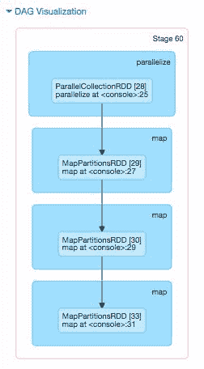

RDD 不需要与第一个 RDD（整数类型）保持相同的数据类型。以下是一个 RDD，它写入了不同数据类型的元组（字符串，整数）。

```py
scala> val rdd_four = rdd_three.map(i => ("str"+(i+2).toString, i-2))
rdd_four: org.apache.spark.rdd.RDD[(String, Int)] = MapPartitionsRDD[33] at map at <console>:31

scala> rdd_four.take(10)
res53: Array[(String, Int)] = Array((str7,3), (str10,6), (str13,9), (str16,12), (str19,15), (str22,18))

```

以下是 `StatePopulation` 文件的 RDD，其中每个记录都转换为 `upperCase`。

```py
scala> val upperCaseRDD = statesPopulationRDD.map(_.toUpperCase)
upperCaseRDD: org.apache.spark.rdd.RDD[String] = MapPartitionsRDD[69] at map at <console>:27

scala> upperCaseRDD.take(10)
res86: Array[String] = Array(STATE,YEAR,POPULATION, ALABAMA,2010,4785492, ALASKA,2010,714031, ARIZONA,2010,6408312, ARKANSAS,2010,2921995, CALIFORNIA,2010,37332685, COLORADO,2010,5048644, DELAWARE,2010,899816, DISTRICT OF COLUMBIA,2010,605183, FLORIDA,2010,18849098)

```

以下是前一个转换的图示：

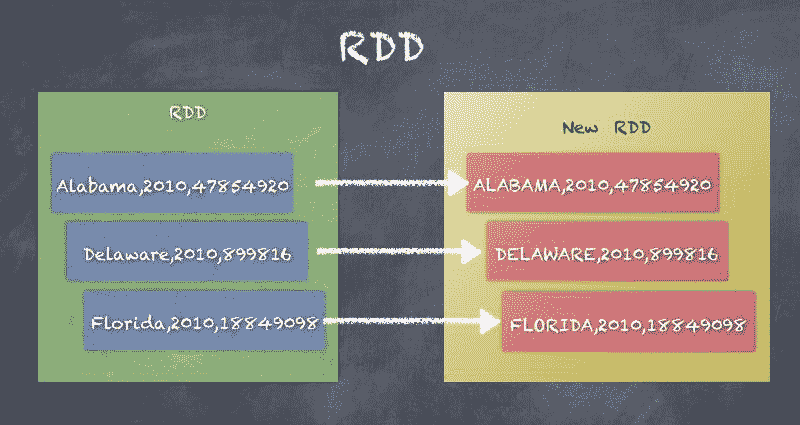

# Pair RDD

Pair RDD 是由键值对组成的 RDD，非常适合用于聚合、排序和连接数据等场景。键和值可以是简单的类型，如整数和字符串，或者更复杂的类型，如案例类、数组、列表以及其他类型的集合。基于键值的可扩展数据模型提供了许多优势，并且是 MapReduce 范式的基本概念。

创建 `PairRDD` 可以通过对任何 RDD 应用转换来轻松实现，将其转换为键值对的 RDD。

让我们使用 `SparkContext` 将 `statesPopulation.csv` 读入 RDD，`SparkContext` 可用 `sc` 来表示。

以下是一个基本的州人口 RDD 示例，以及同一 RDD 拆分记录为州和人口的元组（对）后的 `PairRDD` 的样子：

```py
scala> val statesPopulationRDD = sc.textFile("statesPopulation.csv") statesPopulationRDD: org.apache.spark.rdd.RDD[String] = statesPopulation.csv MapPartitionsRDD[47] at textFile at <console>:25
 scala> statesPopulationRDD.first
res4: String = State,Year,Population

scala> statesPopulationRDD.take(5)
res5: Array[String] = Array(State,Year,Population, Alabama,2010,4785492, Alaska,2010,714031, Arizona,2010,6408312, Arkansas,2010,2921995)

scala> val pairRDD = statesPopulationRDD.map(record => (record.split(",")(0), record.split(",")(2)))
pairRDD: org.apache.spark.rdd.RDD[(String, String)] = MapPartitionsRDD[48] at map at <console>:27

scala> pairRDD.take(10)
res59: Array[(String, String)] = Array((Alabama,4785492), (Alaska,714031), (Arizona,6408312), (Arkansas,2921995), (California,37332685), (Colorado,5048644), (Delaware,899816), (District of Columbia,605183), (Florida,18849098))

```

以下是前一个示例的图示，展示了 RDD 元素如何转换为 `(key - value)` 对：

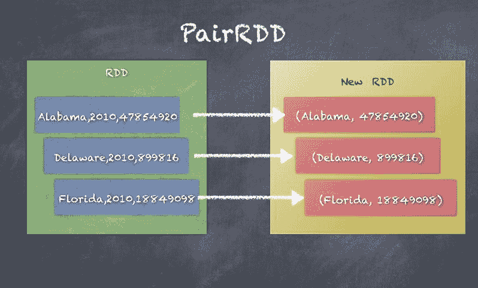

# DoubleRDD

DoubleRDD 是一个由双精度值集合构成的 RDD。由于这一特性，可以对 DoubleRDD 使用许多统计函数。

以下是 DoubleRDD 的示例，其中我们从一组双精度数字创建了一个 RDD：

```py
scala> val rdd_one = sc.parallelize(Seq(1.0,2.0,3.0))
rdd_one: org.apache.spark.rdd.RDD[Double] = ParallelCollectionRDD[52] at parallelize at <console>:25

scala> rdd_one.mean
res62: Double = 2.0

scala> rdd_one.min
res63: Double = 1.0

scala> rdd_one.max
res64: Double = 3.0

scala> rdd_one.stdev
res65: Double = 0.816496580927726

```

以下是 DoubleRDD 的示意图，展示了如何在 DoubleRDD 上运行 `sum()` 函数：

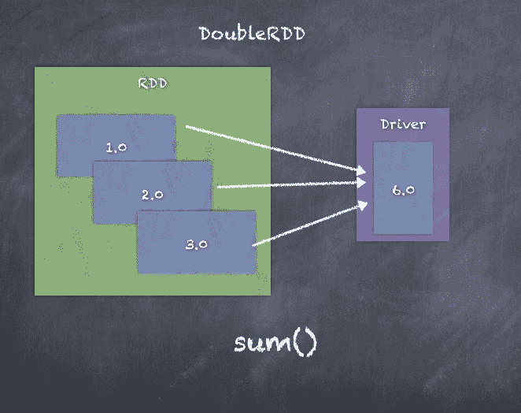

# SequenceFileRDD

`SequenceFileRDD` 是从 `SequenceFile` 创建的，`SequenceFile` 是 Hadoop 文件系统中的一种文件格式。`SequenceFile` 可以是压缩的或未压缩的。

Map Reduce 过程可以使用 SequenceFiles，SequenceFiles 是键和值的对。键和值是 Hadoop 可写数据类型，如 Text、IntWritable 等。

以下是一个 `SequenceFileRDD` 的示例，展示了如何写入和读取 `SequenceFile`：

```py
scala> val pairRDD = statesPopulationRDD.map(record => (record.split(",")(0), record.split(",")(2)))
pairRDD: org.apache.spark.rdd.RDD[(String, String)] = MapPartitionsRDD[60] at map at <console>:27

scala> pairRDD.saveAsSequenceFile("seqfile")

scala> val seqRDD = sc.sequenceFileString, String
seqRDD: org.apache.spark.rdd.RDD[(String, String)] = MapPartitionsRDD[62] at sequenceFile at <console>:25

scala> seqRDD.take(10)
res76: Array[(String, String)] = Array((State,Population), (Alabama,4785492), (Alaska,714031), (Arizona,6408312), (Arkansas,2921995), (California,37332685), (Colorado,5048644), (Delaware,899816), (District of Columbia,605183), (Florida,18849098))

```

以下是前面示例中看到的 **SequenceFileRDD** 的示意图：

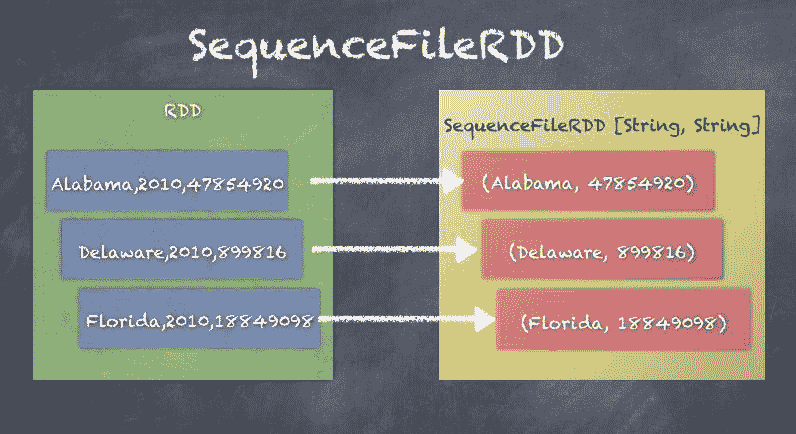

# CoGroupedRDD

`CoGroupedRDD` 是一个将其父 RDD 进行 cogroup 操作的 RDD。两个父 RDD 必须是 pairRDD 才能工作，因为 cogroup 操作本质上会生成一个包含共同键和值列表的 pairRDD，值列表来自两个父 RDD。请看以下代码片段：

```py
class CoGroupedRDD[K] extends RDD[(K, Array[Iterable[_]])] 

```

以下是 CoGroupedRDD 的示例，我们创建了两个 pairRDD 的 cogroup，其中一个包含州和人口的值对，另一个包含州和年份的值对：

```py
scala> val pairRDD = statesPopulationRDD.map(record => (record.split(",")(0), record.split(",")(2)))
pairRDD: org.apache.spark.rdd.RDD[(String, String)] = MapPartitionsRDD[60] at map at <console>:27

scala> val pairRDD2 = statesPopulationRDD.map(record => (record.split(",")(0), record.split(",")(1)))
pairRDD2: org.apache.spark.rdd.RDD[(String, String)] = MapPartitionsRDD[66] at map at <console>:27

scala> val cogroupRDD = pairRDD.cogroup(pairRDD2)
cogroupRDD: org.apache.spark.rdd.RDD[(String, (Iterable[String], Iterable[String]))] = MapPartitionsRDD[68] at cogroup at <console>:31

scala> cogroupRDD.take(10)
res82: Array[(String, (Iterable[String], Iterable[String]))] = Array((Montana,(CompactBuffer(990641, 997821, 1005196, 1014314, 1022867, 1032073, 1042520),CompactBuffer(2010, 2011, 2012, 2013, 2014, 2015, 2016))), (California,(CompactBuffer(37332685, 37676861, 38011074, 38335203, 38680810, 38993940, 39250017),CompactBuffer(2010, 2011, 2012, 2013, 2014, 2015, 2016))),

```

以下是通过为每个键创建值对来对 **pairRDD** 和 **pairRDD2** 进行 cogroup 操作的示意图：

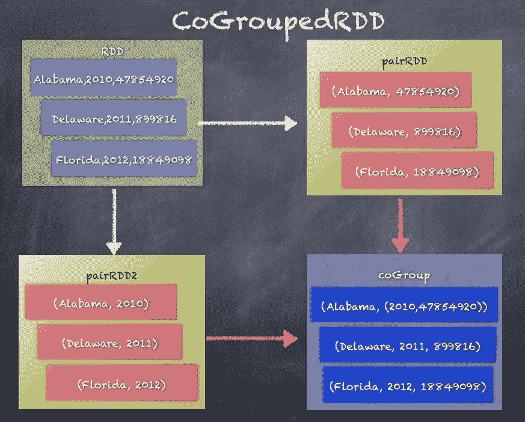

# ShuffledRDD

`ShuffledRDD` 根据键对 RDD 元素进行洗牌，从而将相同键的值积累到同一执行器上，以便进行聚合或合并逻辑。一个很好的例子是查看在 PairRDD 上调用 `reduceByKey()` 时发生的情况：

```py
class ShuffledRDD[K, V, C] extends RDD[(K, C)] 

```

以下是对 `pairRDD` 执行 `reduceByKey` 操作，以按州聚合记录的示例：

```py
scala> val pairRDD = statesPopulationRDD.map(record => (record.split(",")(0), 1))
pairRDD: org.apache.spark.rdd.RDD[(String, Int)] = MapPartitionsRDD[82] at map at <console>:27

scala> pairRDD.take(5)
res101: Array[(String, Int)] = Array((State,1), (Alabama,1), (Alaska,1), (Arizona,1), (Arkansas,1))

scala> val shuffledRDD = pairRDD.reduceByKey(_+_)
shuffledRDD: org.apache.spark.rdd.RDD[(String, Int)] = ShuffledRDD[83] at reduceByKey at <console>:29

scala> shuffledRDD.take(5)
res102: Array[(String, Int)] = Array((Montana,7), (California,7), (Washington,7), (Massachusetts,7), (Kentucky,7))

```

下图展示了根据键进行洗牌，将相同键（State）的记录发送到同一分区的过程：

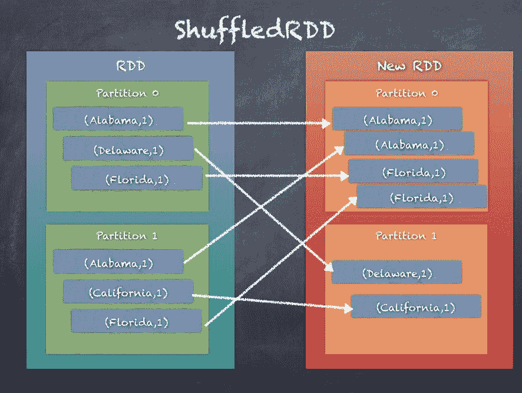

# UnionRDD

`UnionRDD` 是两个 RDD 进行联合操作后的结果。联合操作仅仅是创建一个包含两个 RDD 中所有元素的新 RDD，如以下代码片段所示：

```py
class UnionRDDT: ClassTag extends RDDT

UnionRDD by combining the elements of the two RDDs:
```

```py
scala> val rdd_one = sc.parallelize(Seq(1,2,3))
rdd_one: org.apache.spark.rdd.RDD[Int] = ParallelCollectionRDD[85] at parallelize at <console>:25

scala> val rdd_two = sc.parallelize(Seq(4,5,6))
rdd_two: org.apache.spark.rdd.RDD[Int] = ParallelCollectionRDD[86] at parallelize at <console>:25

scala> val rdd_one = sc.parallelize(Seq(1,2,3))
rdd_one: org.apache.spark.rdd.RDD[Int] = ParallelCollectionRDD[87] at parallelize at <console>:25

scala> rdd_one.take(10)
res103: Array[Int] = Array(1, 2, 3)

scala> val rdd_two = sc.parallelize(Seq(4,5,6))
rdd_two: org.apache.spark.rdd.RDD[Int] = ParallelCollectionRDD[88] at parallelize at <console>:25

scala> rdd_two.take(10)
res104: Array[Int] = Array(4, 5, 6)

scala> val unionRDD = rdd_one.union(rdd_two)
unionRDD: org.apache.spark.rdd.RDD[Int] = UnionRDD[89] at union at <console>:29

scala> unionRDD.take(10)
res105: Array[Int] = Array(1, 2, 3, 4, 5, 6)

```

以下图展示了两个 RDD 进行联合操作后，来自 **RDD 1** 和 **RDD 2** 的元素如何被合并到一个新的 RDD **UnionRDD** 中：

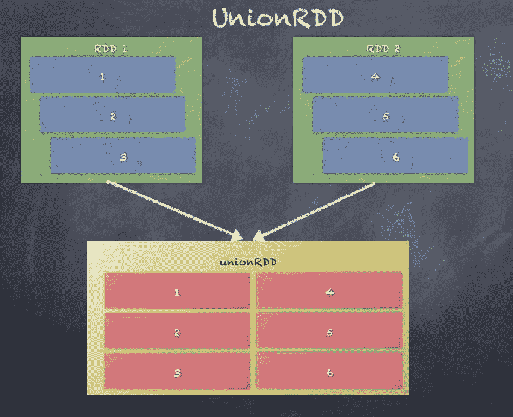

# HadoopRDD

`HadoopRDD` 提供了从 Hadoop 1.x 库中的 MapReduce API 读取存储在 HDFS 中的数据的核心功能。`HadoopRDD` 是默认使用的，当从任何文件系统加载数据到 RDD 时，可以看到它：

```py
class HadoopRDD[K, V] extends RDD[(K, V)]

```

当从 CSV 文件加载州人口记录时，底层的基础 RDD 实际上是 `HadoopRDD`，如以下代码片段所示：

```py
scala> val statesPopulationRDD = sc.textFile("statesPopulation.csv")
statesPopulationRDD: org.apache.spark.rdd.RDD[String] = statesPopulation.csv MapPartitionsRDD[93] at textFile at <console>:25

scala> statesPopulationRDD.toDebugString
res110: String =
(2) statesPopulation.csv MapPartitionsRDD[93] at textFile at <console>:25 []
 | statesPopulation.csv HadoopRDD[92] at textFile at <console>:25 []

```

下图展示了通过将文本文件从文件系统加载到 RDD 中创建 **HadoopRDD** 的示例：

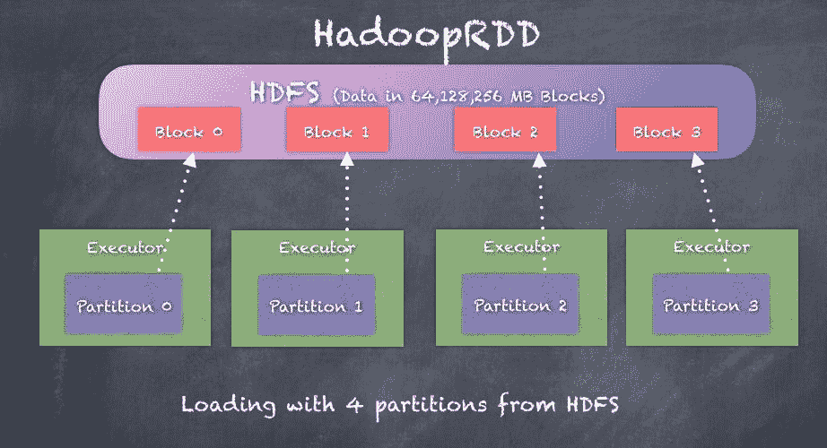

# NewHadoopRDD

`NewHadoopRDD` 提供了读取存储在 HDFS、HBase 表、Amazon S3 中的数据的核心功能，使用的是来自 Hadoop 2.x 的新 MapReduce API。`libraries.NewHadoopRDD` 可以读取多种不同格式的数据，因此它可以与多个外部系统进行交互。

在 `NewHadoopRDD` 之前，`HadoopRDD` 是唯一可用的选项，它使用的是 Hadoop 1.x 中的旧 MapReduce API。

```py
class NewHadoopRDDK, V
extends RDD[(K, V)]

NewHadoopRDD takes an input format class, a key class, and a value class. Let's look at examples of NewHadoopRDD.
```

最简单的例子是使用 SparkContext 的 `wholeTextFiles` 函数来创建 `WholeTextFileRDD`。现在，`WholeTextFileRDD` 实际上扩展了 `NewHadoopRDD`，如下所示的代码片段：

```py
scala> val rdd_whole = sc.wholeTextFiles("wiki1.txt")
rdd_whole: org.apache.spark.rdd.RDD[(String, String)] = wiki1.txt MapPartitionsRDD[3] at wholeTextFiles at <console>:31

scala> rdd_whole.toDebugString
res9: String =
(1) wiki1.txt MapPartitionsRDD[3] at wholeTextFiles at <console>:31 []
 | WholeTextFileRDD[2] at wholeTextFiles at <console>:31 []

```

让我们看另一个例子，在这个例子中，我们将使用 `SparkContext` 中的 `newAPIHadoopFile` 函数：

```py
import org.apache.hadoop.mapreduce.lib.input.KeyValueTextInputFormat

import org.apache.hadoop.io.Text

val newHadoopRDD = sc.newAPIHadoopFile("statesPopulation.csv", classOf[KeyValueTextInputFormat], classOf[Text],classOf[Text])

```

# 聚合

聚合技术允许你以任意方式组合 RDD 中的元素来执行某些计算。事实上，聚合是大数据分析中最重要的部分。如果没有聚合，我们就无法生成报告和分析，例如 *按人口最多的州*，这似乎是给定过去 200 年所有州人口数据集时提出的一个逻辑问题。另一个简单的例子是需要计算 RDD 中元素的数量，这要求执行器计算每个分区中的元素数量，并将其发送给 Driver，Driver 再将这些子集相加，从而计算 RDD 中的元素总数。

在本节中，我们的主要焦点是聚合函数，这些函数用于通过键收集和合并数据。正如本章前面所看到的，PairRDD 是一个 (key - value) 对的 RDD，其中 key 和 value 是任意的，可以根据具体应用场景进行自定义。

在我们关于州人口的例子中，PairRDD 可以是 `<State, <Population, Year>>` 的对，这意味着 `State` 被作为键，`<Population, Year>` 的元组被作为值。这种将键和值分解的方式可以生成如 *按州的人口最多年份* 等聚合结果。相反，如果我们的聚合是围绕年份进行的，例如 *按年份的人口最多的州*，我们可以使用一个 `pairRDD`，其中包含 `<Year, <State, Population>>` 的对。

以下是生成 `pairRDD` 的示例代码，数据来源于 `StatePopulation` 数据集，既有以 `State` 作为键，也有以 `Year` 作为键的情况：

```py
scala> val statesPopulationRDD = sc.textFile("statesPopulation.csv")
statesPopulationRDD: org.apache.spark.rdd.RDD[String] = statesPopulation.csv MapPartitionsRDD[157] at textFile at <console>:26

scala> statesPopulationRDD.take(5)
res226: Array[String] = Array(State,Year,Population, Alabama,2010,4785492, Alaska,2010,714031, Arizona,2010,6408312, Arkansas,2010,2921995)

```

接下来，我们可以生成一个 `pairRDD`，使用 `State` 作为键，`<Year, Population>` 的元组作为值，如以下代码片段所示：

```py
scala> val pairRDD = statesPopulationRDD.map(record => record.split(",")).map(t => (t(0), (t(1), t(2))))
pairRDD: org.apache.spark.rdd.RDD[(String, (String, String))] = MapPartitionsRDD[160] at map at <console>:28

scala> pairRDD.take(5)
res228: Array[(String, (String, String))] = Array((State,(Year,Population)), (Alabama,(2010,4785492)), (Alaska,(2010,714031)), (Arizona,(2010,6408312)), (Arkansas,(2010,2921995)))

```

如前所述，我们还可以使用 `Year` 作为键，`<State, Population>` 的元组作为值，生成一个 `PairRDD`，如以下代码片段所示：

```py
scala> val pairRDD = statesPopulationRDD.map(record => record.split(",")).map(t => (t(1), (t(0), t(2))))
pairRDD: org.apache.spark.rdd.RDD[(String, (String, String))] = MapPartitionsRDD[162] at map at <console>:28

scala> pairRDD.take(5)
res229: Array[(String, (String, String))] = Array((Year,(State,Population)), (2010,(Alabama,4785492)), (2010,(Alaska,714031)), (2010,(Arizona,6408312)), (2010,(Arkansas,2921995)))

```

现在我们将探讨如何在 `<State, <Year, Population>>` 的 `pairRDD` 上使用常见的聚合函数：

+   `groupByKey`

+   `reduceByKey`

+   `aggregateByKey`

+   `combineByKey`

# groupByKey

`groupByKey`将 RDD 中每个键的所有值组合成一个单一的序列。`groupByKey`还允许通过传递分区器来控制生成的键值对 RDD 的分区。默认情况下，使用`HashPartitioner`，但可以作为参数传入自定义分区器。每个组内元素的顺序无法保证，甚至每次评估结果 RDD 时可能会不同。

`groupByKey`是一个代价高昂的操作，因为需要大量的数据洗牌。`reduceByKey`或`aggregateByKey`提供了更好的性能。我们将在本节稍后讨论这一点。

`groupByKey`可以通过使用自定义分区器或直接使用默认的`HashPartitioner`来调用，如以下代码片段所示：

```py
def groupByKey(partitioner: Partitioner): RDD[(K, Iterable[V])] 

def groupByKey(numPartitions: Int): RDD[(K, Iterable[V])] 

```

按照当前的实现，`groupByKey`必须能够在内存中保存任何键的所有键值对。如果某个键有太多值，就可能导致`OutOfMemoryError`。

`groupByKey`通过将所有分区的元素发送到基于分区器的分区中，从而将相同键的所有(key-value)对收集到同一个分区中。一旦完成，就可以轻松地进行聚合操作。

下面是调用`groupByKey`时发生情况的示意图：

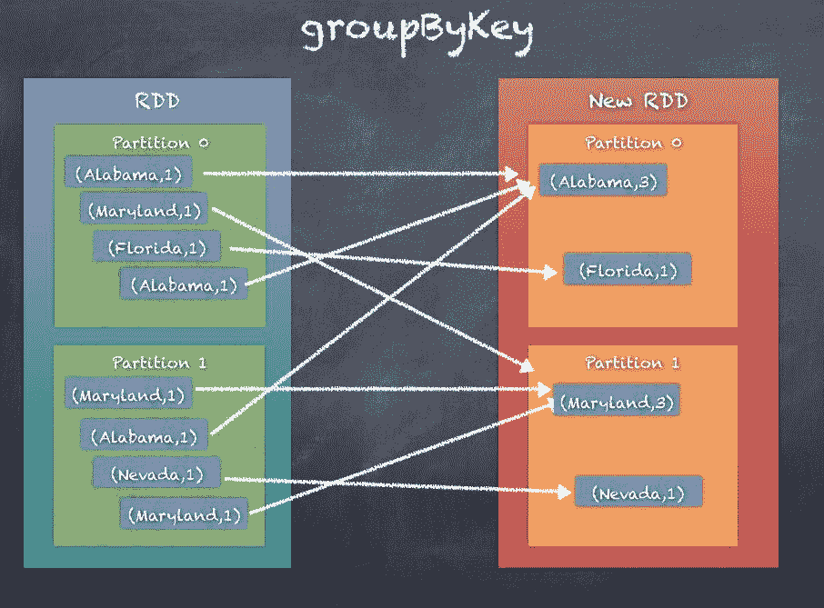

# reduceByKey

`groupByKey`涉及大量的数据洗牌，而`reduceByKey`通过不使用洗牌将所有`PairRDD`的元素发送，而是使用本地的 combiner 先在本地做一些基本聚合，然后再像`groupByKey`那样发送结果元素。这样大大减少了数据传输量，因为我们不需要传输所有内容。`reduceBykey`通过使用结合性和交换性的 reduce 函数合并每个键的值来工作。当然，首先会...

在每个映射器上本地执行合并操作，然后将结果发送到归约器。

如果你熟悉 Hadoop MapReduce，这与 MapReduce 编程中的 combiner 非常相似。

`reduceByKey`可以通过使用自定义分区器或直接使用默认的`HashPartitioner`来调用，如以下代码片段所示：

```py
def reduceByKey(partitioner: Partitioner, func: (V, V) => V): RDD[(K, V)]

def reduceByKey(func: (V, V) => V, numPartitions: Int): RDD[(K, V)] 

def reduceByKey(func: (V, V) => V): RDD[(K, V)] 

```

`reduceByKey`通过根据`partitioner`将所有分区的元素发送到指定的分区，以便将相同键的所有(key-value)对收集到同一个分区。但在洗牌之前，首先会进行本地聚合，减少需要洗牌的数据量。一旦完成，最终分区中就可以轻松地进行聚合操作。

以下图示说明了调用`reduceBykey`时发生的情况：

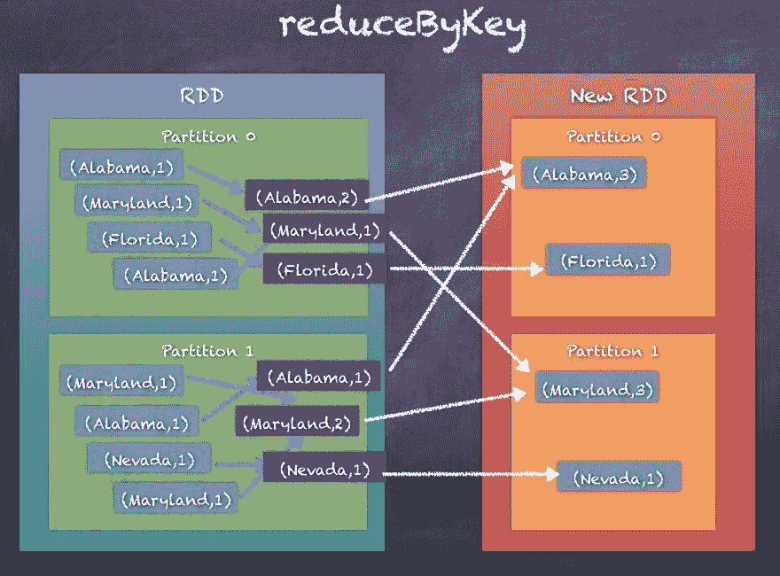

# aggregateByKey

`aggregateByKey`与`reduceByKey`非常相似，唯一不同的是`aggregateByKey`在分区内和分区之间聚合时提供了更多的灵活性和定制性，允许处理更复杂的用例，例如在一次函数调用中生成所有`<Year, Population>`对以及每个州的总人口。

`aggregateByKey` 通过使用给定的合并函数和中立的初始/零值来聚合每个键的值。

该函数可以返回不同的结果类型 `U`，而不是此 RDD 中值的类型 `V`，这是最大的区别。因此，我们需要一个操作将 `V` 合并成 `U`，另一个操作用于合并两个 `U`。前者操作用于合并分区内的值，后者用于合并分区间的值。为了避免内存分配，允许这两个函数修改并返回其第一个参数，而不是创建一个新的 `U`：

```py
def aggregateByKeyU: ClassTag(seqOp: (U, V) => U,
 combOp: (U, U) => U): RDD[(K, U)] 

def aggregateByKeyU: ClassTag(seqOp: (U, V) => U,
 combOp: (U, U) => U): RDD[(K, U)] 

def aggregateByKeyU: ClassTag(seqOp: (U, V) => U,
 combOp: (U, U) => U): RDD[(K, U)] 

```

`aggregateByKey` 通过在分区内执行聚合操作，作用于每个分区的所有元素，然后在合并分区时应用另一种聚合逻辑来工作。最终，所有相同 Key 的 (key - value) 对都会收集到同一个分区中；然而，聚合的方式以及生成的输出不像 `groupByKey` 和 `reduceByKey` 那样固定，而是使用 `aggregateByKey` 时更加灵活和可定制的。

以下图示说明了调用 `aggregateByKey` 时发生的情况。与 `groupByKey` 和 `reduceByKey` 中将计数相加不同，在这里我们为每个 Key 生成值的列表：

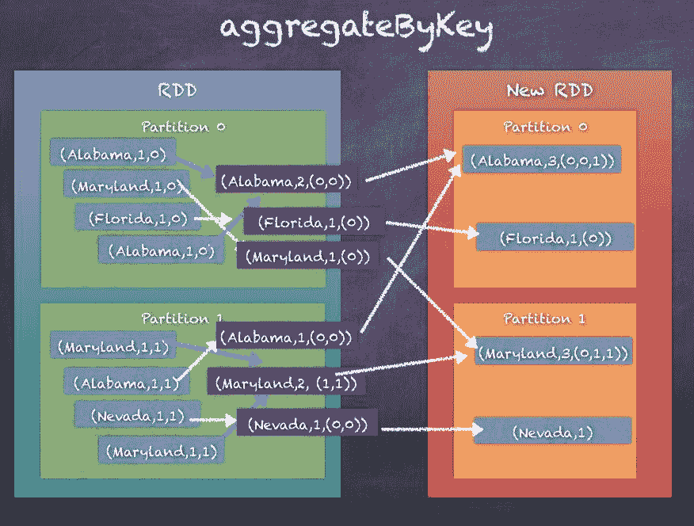

# combineByKey

`combineByKey` 和 `aggregateByKey` 非常相似；实际上，`combineByKey` 内部调用了 `combineByKeyWithClassTag`，而 `aggregateByKey` 也会调用它。和 `aggregateByKey` 一样，`combineByKey` 也是通过在每个分区内应用操作，然后在合并器之间进行操作来工作的。

`combineByKey` 将 `RDD[K,V]` 转换为 `RDD[K,C]`，其中 `C` 是在键 `K` 下收集或合并的 `V` 列表。

调用 `combineByKey` 时，期望有三个函数。

+   `createCombiner` 将 `V` 转换为 `C`，其中 `C` 是一个包含一个元素的列表

+   `mergeValue` 用于将 `V` 合并为 `C`，通过将 `V` 附加到列表末尾

+   `mergeCombiners` 用于将两个 `C` 合并为一个

在 `aggregateByKey` 中，第一个参数只是一个零值，但在 `combineByKey` 中，我们提供了一个初始函数，该函数将当前值作为参数。

`combineByKey` 可以通过自定义分区器调用，也可以像以下代码片段那样使用默认的 HashPartitioner：

```py
def combineByKeyC => C, mergeCombiners: (C, C) => C, numPartitions: Int): RDD[(K, C)]

def combineByKeyC => C, mergeCombiners: (C, C) => C, partitioner: Partitioner, mapSideCombine: Boolean = true, serializer: Serializer = null): RDD[(K, C)]

```

`combineByKey` 通过在分区内执行聚合操作，作用于每个分区的所有元素，然后在合并分区时应用另一种聚合逻辑来工作。最终，所有相同 Key 的 (key - value) 对都将收集到同一个分区中，但聚合的方式以及生成的输出不像 `groupByKey` 和 `reduceByKey` 那样固定，而是更加灵活和可定制的。

以下图示说明了调用 `combineByKey` 时发生的情况：

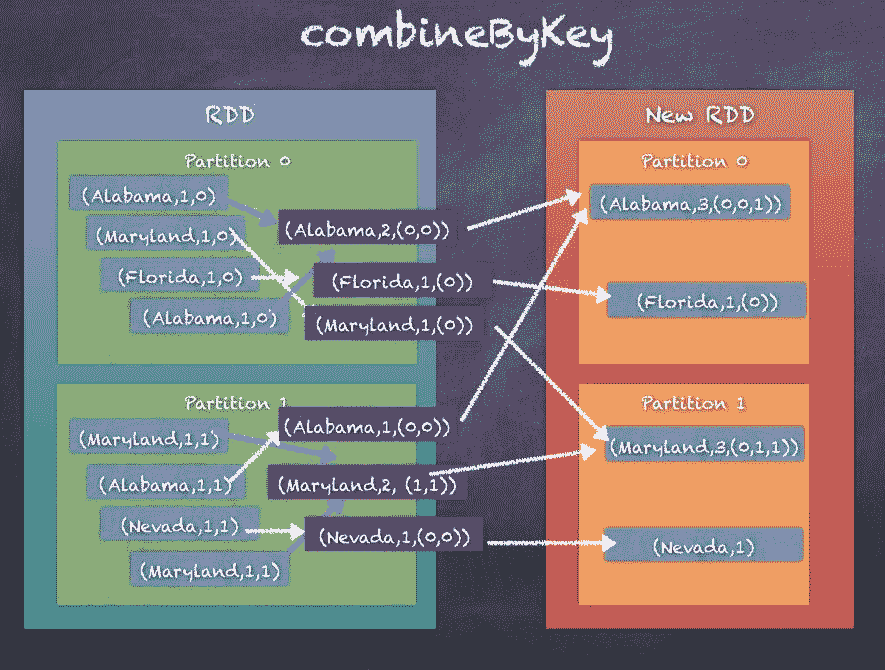

# `groupByKey`、`reduceByKey`、`combineByKey` 和 `aggregateByKey` 的比较

让我们考虑一个 StatePopulation RDD 的例子，它生成一个 `<State, <Year, Population>>` 的 `pairRDD`。

如前一节所见，`groupByKey` 会通过生成键的哈希码进行 `HashPartitioning`，然后洗牌数据，将每个键的值收集到同一个分区中。这显然会导致过多的洗牌。

`reduceByKey` 通过使用本地合并器逻辑改进了 `groupByKey`，从而减少了在洗牌阶段发送的数据量。结果与 `groupByKey` 相同，但性能更好。

`aggregateByKey` 的工作方式与 `reduceByKey` 非常相似，但有一个重大区别，这使得它在三者中最为强大。`aggregateByKey` 不需要在相同的数据类型上操作，并且可以在分区内进行不同的聚合，同时在分区之间也可以进行不同的聚合。

`combineByKey` 在性能上与 `aggregateByKey` 非常相似，除了用于创建合并器的初始函数不同。

使用哪个函数取决于你的用例，但如果不确定，请参考本节的 *聚合* 部分，以选择适合你用例的正确函数。另外，密切关注下一部分，因为 *分区和洗牌* 会在其中讨论。

以下是显示四种按州计算总人口的方法的代码。

**步骤 1\. 初始化 RDD：**

```py
scala> val statesPopulationRDD = sc.textFile("statesPopulation.csv").filter(_.split(",")(0) != "State") 
statesPopulationRDD: org.apache.spark.rdd.RDD[String] = statesPopulation.csv MapPartitionsRDD[1] at textFile at <console>:24

scala> statesPopulationRDD.take(10)
res27: Array[String] = Array(Alabama,2010,4785492, Alaska,2010,714031, Arizona,2010,6408312, Arkansas,2010,2921995, California,2010,37332685, Colorado,2010,5048644, Delaware,2010,899816, District of Columbia,2010,605183, Florida,2010,18849098, Georgia,2010,9713521)

```

**步骤 2\. 转换为 pair RDD：**

```py
scala> val pairRDD = statesPopulationRDD.map(record => record.split(",")).map(t => (t(0), (t(1).toInt, t(2).toInt)))
pairRDD: org.apache.spark.rdd.RDD[(String, (Int, Int))] = MapPartitionsRDD[26] at map at <console>:26

scala> pairRDD.take(10)
res15: Array[(String, (Int, Int))] = Array((Alabama,(2010,4785492)), (Alaska,(2010,714031)), (Arizona,(2010,6408312)), (Arkansas,(2010,2921995)), (California,(2010,37332685)), (Colorado,(2010,5048644)), (Delaware,(2010,899816)), (District of Columbia,(2010,605183)), (Florida,(2010,18849098)), (Georgia,(2010,9713521)))

```

**步骤 3\. groupByKey - 对值进行分组，然后加总人口数：**

```py
scala> val groupedRDD = pairRDD.groupByKey.map(x => {var sum=0; x._2.foreach(sum += _._2); (x._1, sum)})
groupedRDD: org.apache.spark.rdd.RDD[(String, Int)] = MapPartitionsRDD[38] at map at <console>:28

scala> groupedRDD.take(10)
res19: Array[(String, Int)] = Array((Montana,7105432), (California,268280590), (Washington,48931464), (Massachusetts,46888171), (Kentucky,30777934), (Pennsylvania,89376524), (Georgia,70021737), (Tennessee,45494345), (North Carolina,68914016), (Utah,20333580))

```

**步骤 4\. reduceByKey - 简单地通过添加人口数来减少每个键的值：**

```py

scala> val reduceRDD = pairRDD.reduceByKey((x, y) => (x._1, x._2+y._2)).map(x => (x._1, x._2._2))
reduceRDD: org.apache.spark.rdd.RDD[(String, Int)] = MapPartitionsRDD[46] at map at <console>:28

scala> reduceRDD.take(10)
res26: Array[(String, Int)] = Array((Montana,7105432), (California,268280590), (Washington,48931464), (Massachusetts,46888171), (Kentucky,30777934), (Pennsylvania,89376524), (Georgia,70021737), (Tennessee,45494345), (North Carolina,68914016), (Utah,20333580))

```

**步骤 5\. aggregateByKey - 对每个键下的人口进行聚合并加总：**

```py
Initialize the array
scala> val initialSet = 0
initialSet: Int = 0

provide function to add the populations within a partition
scala> val addToSet = (s: Int, v: (Int, Int)) => s+ v._2
addToSet: (Int, (Int, Int)) => Int = <function2>

provide funtion to add populations between partitions
scala> val mergePartitionSets = (p1: Int, p2: Int) => p1 + p2
mergePartitionSets: (Int, Int) => Int = <function2>

scala> val aggregatedRDD = pairRDD.aggregateByKey(initialSet)(addToSet, mergePartitionSets)
aggregatedRDD: org.apache.spark.rdd.RDD[(String, Int)] = ShuffledRDD[41] at aggregateByKey at <console>:34

scala> aggregatedRDD.take(10)
res24: Array[(String, Int)] = Array((Montana,7105432), (California,268280590), (Washington,48931464), (Massachusetts,46888171), (Kentucky,30777934), (Pennsylvania,89376524), (Georgia,70021737), (Tennessee,45494345), (North Carolina,68914016), (Utah,20333580))

```

**步骤 6\. combineByKey - 在分区内进行合并，然后合并合并器：**

```py
createcombiner function
scala> val createCombiner = (x:(Int,Int)) => x._2
createCombiner: ((Int, Int)) => Int = <function1>

function to add within partition
scala> val mergeValues = (c:Int, x:(Int, Int)) => c +x._2
mergeValues: (Int, (Int, Int)) => Int = <function2>

function to merge combiners
scala> val mergeCombiners = (c1:Int, c2:Int) => c1 + c2
mergeCombiners: (Int, Int) => Int = <function2>

scala> val combinedRDD = pairRDD.combineByKey(createCombiner, mergeValues, mergeCombiners)
combinedRDD: org.apache.spark.rdd.RDD[(String, Int)] = ShuffledRDD[42] at combineByKey at <console>:34

scala> combinedRDD.take(10)
res25: Array[(String, Int)] = Array((Montana,7105432), (California,268280590), (Washington,48931464), (Massachusetts,46888171), (Kentucky,30777934), (Pennsylvania,89376524), (Georgia,70021737), (Tennessee,45494345), (North Carolina,68914016), (Utah,20333580))

```

正如你所见，所有四种聚合方法都得到了相同的结果。只是它们的工作方式不同。

# 分区与洗牌

我们已经看到 Apache Spark 如何比 Hadoop 更好地处理分布式计算。我们还了解了它的内部工作原理，主要是被称为 **弹性分布式数据集**（**RDD**）的基本数据结构。RDD 是不可变的集合，表示数据集，具有内置的可靠性和故障恢复能力。RDD 操作数据时，并非作为单一的整体数据，而是以分区的方式在集群中管理和操作数据。因此，数据分区的概念对 Apache Spark 作业的正常运行至关重要，并且会对性能以及资源利用产生重要影响。

RDD 由数据的分区组成，所有操作都在 RDD 的数据分区上执行。像转换这样的操作是由执行器在特定数据分区上执行的函数。然而，并非所有操作都可以通过仅在相应执行器上对数据分区执行孤立操作来完成。像聚合（在前面的章节中提到的）这样的操作需要数据在集群中移动，这一过程称为 **洗牌**。在本节中，我们将深入探讨分区和洗牌的概念。

让我们通过执行以下代码来查看一个简单的整数 RDD。Spark Context 的 `parallelize` 函数从整数序列创建一个 RDD。然后，使用 `getNumPartitions()` 函数，我们可以获得这个 RDD 的分区数。

```py
scala> val rdd_one = sc.parallelize(Seq(1,2,3))
rdd_one: org.apache.spark.rdd.RDD[Int] = ParallelCollectionRDD[120] at parallelize at <console>:25

scala> rdd_one.getNumPartitions
res202: Int = 8

```

如下图所示，可以将 RDD 可视化，图中展示了 RDD 中的 8 个分区：

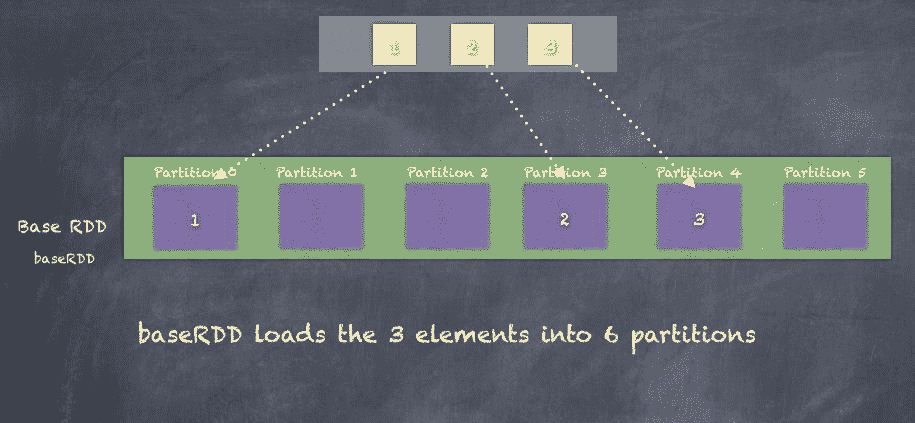

分区数量非常重要，因为这个数量直接影响将运行 RDD 转换的任务数。如果分区数量太小，那么我们会在大量数据上仅使用少数 CPU/核心，导致性能变慢并使集群资源未得到充分利用。另一方面，如果分区数量太大，那么你将使用比实际需要更多的资源，并且在多租户环境中，可能会导致其他作业（无论是你自己还是团队中的其他人）资源不足。

# 分区器

RDD 的分区是通过分区器来完成的。分区器为 RDD 中的元素分配一个分区索引。同一分区中的所有元素将具有相同的分区索引。

Spark 提供了两种分区器：`HashPartitioner` 和 `RangePartitioner`。除了这两种，你还可以实现一个自定义的分区器。

# 哈希分区器

`HashPartitioner` 是 Spark 中的默认分区器，通过计算每个 RDD 元素键的哈希值来工作。所有具有相同哈希值的元素将被分配到相同的分区，如以下代码片段所示：

```py
partitionIndex = hashcode(key) % numPartitions

```

以下是字符串 `hashCode()` 函数的示例，以及我们如何生成 `partitionIndex`：

```py
scala> val str = "hello"
str: String = hello

scala> str.hashCode
res206: Int = 99162322

scala> val numPartitions = 8
numPartitions: Int = 8

scala> val partitionIndex = str.hashCode % numPartitions
partitionIndex: Int = 2

```

默认的分区数量要么来自 Spark 配置参数 `spark.default.parallelism`，要么来自集群中的核心数。

以下图示说明了哈希分区是如何工作的。我们有一个包含 **a**、**b** 和 **e** 三个元素的 RDD。通过使用字符串的 hashcode，我们可以根据设置的 6 个分区数量计算每个元素的 `partitionIndex`：

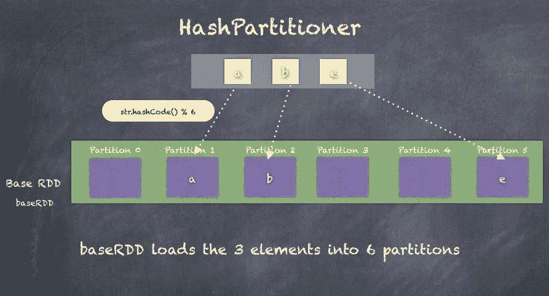

# 范围分区器

`RangePartitioner` 通过将 RDD 分成大致相等的区间来工作。由于区间需要知道每个分区的起始和结束键，因此在使用 `RangePartitioner` 之前，RDD 需要先进行排序。

`RangePartitioning`首先需要根据 RDD 为分区设定合理的边界，然后创建一个从键 K 到`partitionIndex`（元素所在分区的索引）之间的函数。最后，我们需要根据`RangePartitioner`重新分区 RDD，以根据我们确定的范围正确地分配 RDD 元素。

以下是如何使用`PairRDD`的`RangePartitioning`的示例。我们还可以看到，在使用`RangePartitioner`对 RDD 重新分区后，分区如何发生变化：

```py
import org.apache.spark.RangePartitioner
scala> val statesPopulationRDD = sc.textFile("statesPopulation.csv")
statesPopulationRDD: org.apache.spark.rdd.RDD[String] = statesPopulation.csv MapPartitionsRDD[135] at textFile at <console>:26

scala> val pairRDD = statesPopulationRDD.map(record => (record.split(",")(0), 1))
pairRDD: org.apache.spark.rdd.RDD[(String, Int)] = MapPartitionsRDD[136] at map at <console>:28

scala> val rangePartitioner = new RangePartitioner(5, pairRDD)
rangePartitioner: org.apache.spark.RangePartitioner[String,Int] = org.apache.spark.RangePartitioner@c0839f25

scala> val rangePartitionedRDD = pairRDD.partitionBy(rangePartitioner)
rangePartitionedRDD: org.apache.spark.rdd.RDD[(String, Int)] = ShuffledRDD[130] at partitionBy at <console>:32

scala> pairRDD.mapPartitionsWithIndex((i,x) => Iterator(""+i + ":"+x.length)).take(10)
res215: Array[String] = Array(0:177, 1:174)

scala> rangePartitionedRDD.mapPartitionsWithIndex((i,x) => Iterator(""+i + ":"+x.length)).take(10)
res216: Array[String] = Array(0:70, 1:77, 2:70, 3:63, 4:71)

```

以下图示说明了前面示例中提到的`RangePartitioner`：

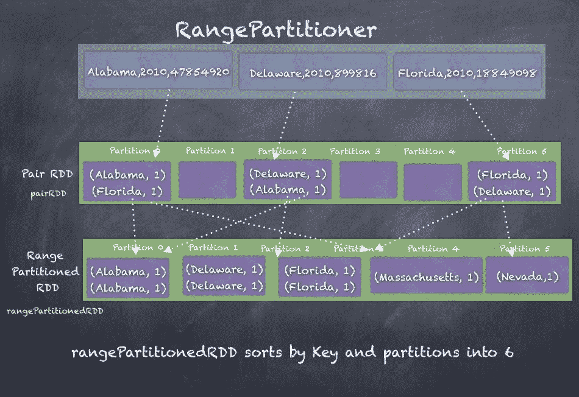

# 洗牌（Shuffling）

无论使用何种分区器，许多操作都会导致数据在 RDD 的分区之间重新分配。新分区可以被创建，或者多个分区可以被合并。所有用于重新分区所需的数据移动过程都被称为**洗牌（Shuffling）**，这是编写 Spark 作业时需要理解的一个重要概念。洗牌可能会导致很大的性能延迟，因为计算不再保存在同一执行器的内存中，而是执行器通过网络交换数据。

一个好的例子是我们在*聚合*（Aggregations）部分中看到的`groupByKey()`示例。显然，为了确保所有相同键的值都收集到同一个执行器上以执行`groupBy`操作，大量的数据在执行器之间流动。

洗牌（Shuffling）还决定了 Spark 作业的执行过程，并影响作业如何被拆分成阶段（Stages）。正如我们在本章和上一章中所看到的，Spark 持有一个 RDD 的有向无环图（DAG），该图表示了 RDD 的血统关系，Spark 不仅利用这个血统来规划作业的执行，还可以从任何执行器丢失中恢复。当一个 RDD 正在进行转换时，系统会尽力确保操作在与数据相同的节点上执行。然而，我们经常使用连接操作（join）、聚合（reduce）、分组（group）或其他聚合操作，这些操作往往会有意或无意地导致重新分区。这个洗牌过程反过来决定了数据处理中的某一阶段何时结束以及新的阶段何时开始。

以下图示说明了 Spark 作业如何被拆分成多个阶段。这个示例展示了一个`pairRDD`在执行`groupByKey`之前，先经过过滤和使用 map 转换的过程，最后再通过`map()`进行一次转换：

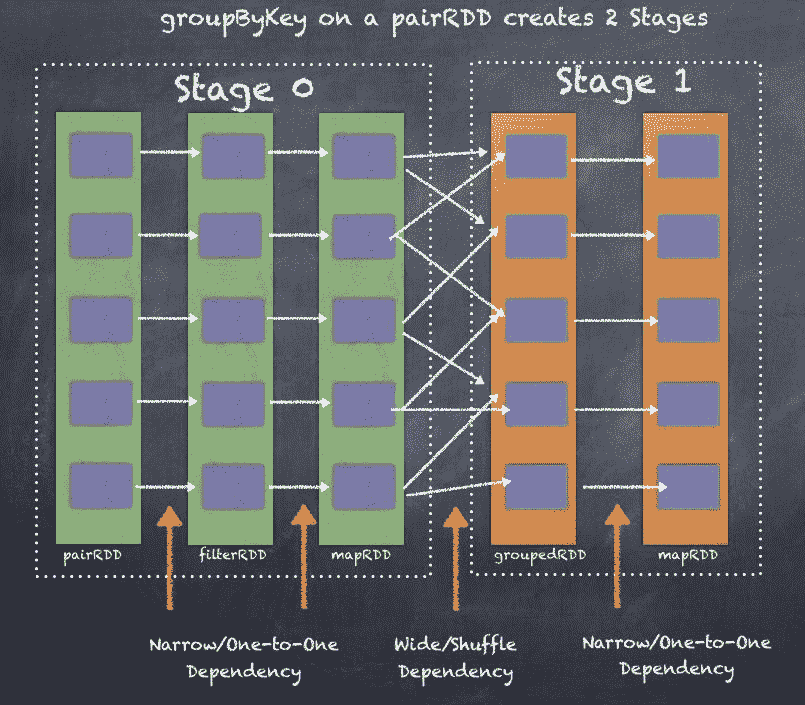

我们的洗牌操作越多，作业执行过程中就会有更多的阶段，从而影响性能。Spark Driver 使用两个关键方面来确定这些阶段。这是通过定义 RDD 的两种依赖关系类型来完成的，分别是窄依赖（narrow dependencies）和宽依赖（wide dependencies）。

# 窄依赖（Narrow Dependencies）

当一个 RDD 可以通过简单的一对一转换（如 `filter()` 函数、`map()` 函数、`flatMap()` 函数等）从另一个 RDD 派生时，子 RDD 被认为是基于一对一关系依赖于父 RDD。这种依赖关系被称为窄依赖，因为数据可以在包含原始 RDD/父 RDD 分区的同一节点上进行转换，而不需要通过其他执行器之间的网络传输任何数据。

窄依赖处于作业执行的同一阶段。

下图展示了窄依赖如何将一个 RDD 转换为另一个 RDD，并对 RDD 元素应用一对一转换：

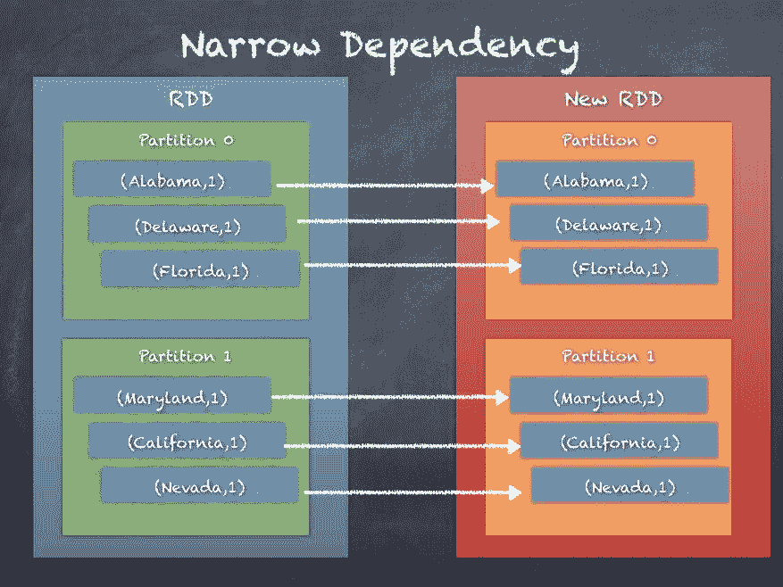

# 宽依赖

当一个 RDD 可以通过在网络上传输数据或交换数据来重新分区或重新分发数据（使用函数，如 `aggregateByKey`、`reduceByKey` 等）从一个或多个 RDD 派生时，子 RDD 被认为依赖于参与 shuffle 操作的父 RDD。这种依赖关系被称为宽依赖，因为数据不能在包含原始 RDD/父 RDD 分区的同一节点上进行转换，因此需要通过其他执行器之间的网络传输数据。

宽依赖会在作业执行过程中引入新的阶段。

下图展示了宽依赖如何将一个 RDD 转换为另一个 RDD，并在执行器之间进行数据交换：

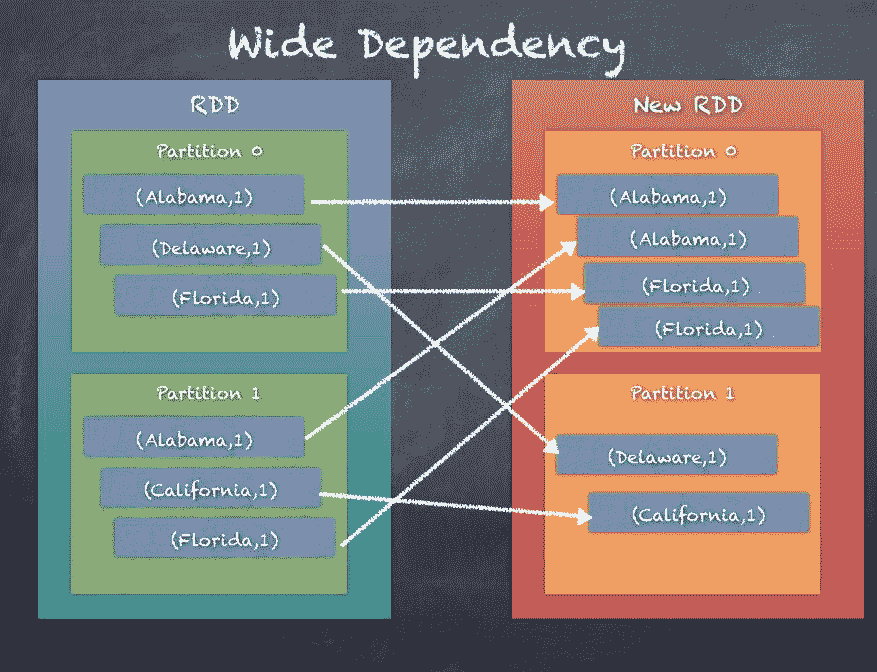

# 广播变量

广播变量是跨所有执行器共享的变量。广播变量在驱动程序中创建一次，然后在执行器中只读。虽然广播简单数据类型（如 `Integer`）是易于理解的，但广播的概念远不止于简单变量。整个数据集可以在 Spark 集群中进行广播，以便执行器能够访问广播的数据。所有在执行器中运行的任务都可以访问广播变量。

广播使用各种优化方法使广播的数据对所有执行器可用。这是一个需要解决的重要挑战，因为如果广播的数据集的大小很大，你不能指望数百或数千个执行器连接到驱动程序并拉取数据集。相反，执行器通过 HTTP 连接拉取数据，最新的方式类似于 BitTorrent，其中数据集像种子一样在集群中分发。这使得广播变量的分发方式更加可扩展，而不是让每个执行器逐个从驱动程序拉取数据，这可能会导致当执行器数量较多时，驱动程序出现故障。

驱动程序只能广播它所拥有的数据，不能通过引用广播 RDD。这是因为只有驱动程序知道如何解释 RDD，而执行器只知道它们所处理的特定数据分区。

如果深入了解广播的工作原理，会发现机制是首先由 Driver 将序列化对象分割成小块，然后将这些小块存储在 Driver 的 BlockManager 中。当代码被序列化并在执行器上运行时，每个执行器首先尝试从自己内部的 BlockManager 获取对象。如果广播变量已经被获取，它会找到并使用该变量。如果不存在，执行器会通过远程获取来从 Driver 和/或其他执行器拉取小块。一旦获取到小块，它会将这些小块存储到自己的 BlockManager 中，准备供其他执行器使用。这可以防止 Driver 成为发送多个广播数据副本（每个执行器一个副本）的瓶颈。

以下图示演示了广播在 Spark 集群中的工作原理：

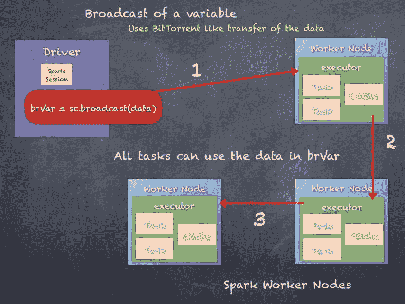

广播变量既可以创建，也可以销毁。我们将探讨广播变量的创建与销毁方法。此外，我们还将讨论如何从内存中移除广播变量。

# 创建广播变量

创建广播变量可以使用 Spark Context 的 `broadcast()` 函数，适用于任何数据类型的可序列化数据/变量。

让我们来看一下如何广播一个 Integer 变量，并在执行器上执行的转换操作中使用该广播变量：

```py
scala> val rdd_one = sc.parallelize(Seq(1,2,3))
rdd_one: org.apache.spark.rdd.RDD[Int] = ParallelCollectionRDD[101] at parallelize at <console>:25

scala> val i = 5
i: Int = 5

scala> val bi = sc.broadcast(i)
bi: org.apache.spark.broadcast.Broadcast[Int] = Broadcast(147)

scala> bi.value
res166: Int = 5

scala> rdd_one.take(5)
res164: Array[Int] = Array(1, 2, 3)

scala> rdd_one.map(j => j + bi.value).take(5)
res165: Array[Int] = Array(6, 7, 8)

```

广播变量不仅可以在原始数据类型上创建，如下一个示例所示，我们将从 Driver 广播一个 `HashMap`。

以下是一个简单的整数 RDD 转换示例，通过查找 HashMap，将每个元素与另一个整数相乘。RDD 1,2,3 被转换为 1 X 2 , 2 X 3, 3 X 4 = 2,6,12：

```py
scala> val rdd_one = sc.parallelize(Seq(1,2,3))
rdd_one: org.apache.spark.rdd.RDD[Int] = ParallelCollectionRDD[109] at parallelize at <console>:25

scala> val m = scala.collection.mutable.HashMap(1 -> 2, 2 -> 3, 3 -> 4)
m: scala.collection.mutable.HashMap[Int,Int] = Map(2 -> 3, 1 -> 2, 3 -> 4)

scala> val bm = sc.broadcast(m)
bm: org.apache.spark.broadcast.Broadcast[scala.collection.mutable.HashMap[Int,Int]] = Broadcast(178)

scala> rdd_one.map(j => j * bm.value(j)).take(5)
res191: Array[Int] = Array(2, 6, 12)

```

# 清理广播变量

广播变量会占用所有执行器的内存，且根据广播变量中包含的数据大小，这可能会在某个时刻导致资源问题。确实有方法可以从所有执行器的内存中移除广播变量。

对广播变量调用 `unpersist()` 会将广播变量的数据从所有执行器的内存缓存中移除，以释放资源。如果该变量再次被使用，数据会重新传输到执行器，以便再次使用。然而，Driver 会保留这部分内存，因为如果 Driver 没有数据，广播变量就不再有效。

接下来，我们将讨论如何销毁广播变量。

以下是如何在广播变量上调用 `unpersist()` 的示例。调用 `unpersist` 后，如果再次访问广播变量，它会像往常一样工作，但在幕后，执行器会重新获取该变量的数据。

```py
scala> val rdd_one = sc.parallelize(Seq(1,2,3))
rdd_one: org.apache.spark.rdd.RDD[Int] = ParallelCollectionRDD[101] at parallelize at <console>:25

scala> val k = 5
k: Int = 5

scala> val bk = sc.broadcast(k)
bk: org.apache.spark.broadcast.Broadcast[Int] = Broadcast(163)

scala> rdd_one.map(j => j + bk.value).take(5)
res184: Array[Int] = Array(6, 7, 8)

scala> bk.unpersist

scala> rdd_one.map(j => j + bk.value).take(5)
res186: Array[Int] = Array(6, 7, 8)

```

# 销毁广播变量

你还可以销毁广播变量，完全从所有执行器和驱动程序中删除它们，使其无法访问。这在优化集群资源管理时非常有帮助。

调用 `destroy()` 方法销毁广播变量时，将删除与该广播变量相关的所有数据和元数据。广播变量一旦被销毁，就不能再使用，必须重新创建。

以下是销毁广播变量的示例：

```py
scala> val rdd_one = sc.parallelize(Seq(1,2,3))
rdd_one: org.apache.spark.rdd.RDD[Int] = ParallelCollectionRDD[101] at parallelize at <console>:25

scala> val k = 5
k: Int = 5

scala> val bk = sc.broadcast(k)
bk: org.apache.spark.broadcast.Broadcast[Int] = Broadcast(163)

scala> rdd_one.map(j => j + bk.value).take(5)
res184: Array[Int] = Array(6, 7, 8)

scala> bk.destroy

```

如果尝试使用已销毁的广播变量，将抛出异常

以下是尝试重用已销毁的广播变量的示例：

```py
scala> rdd_one.map(j => j + bk.value).take(5)
17/05/27 14:07:28 ERROR Utils: Exception encountered
org.apache.spark.SparkException: Attempted to use Broadcast(163) after it was destroyed (destroy at <console>:30)
 at org.apache.spark.broadcast.Broadcast.assertValid(Broadcast.scala:144)
 at org.apache.spark.broadcast.TorrentBroadcast$$anonfun$writeObject$1.apply$mcV$sp(TorrentBroadcast.scala:202)
 at org.apache.spark.broadcast.TorrentBroadcast$$anonfun$wri

```

因此，广播功能可以大大提高 Spark 作业的灵活性和性能。

# 累加器

累加器是跨执行器共享的变量，通常用于向 Spark 程序中添加计数器。如果你有一个 Spark 程序，并希望了解错误或总记录数，或者两者的数量，你可以通过两种方式来实现。一种方法是添加额外的逻辑来单独计数错误或总记录数，但当处理所有可能的计算时，这会变得复杂。另一种方法是保持逻辑和代码流程大体不变，直接添加累加器。

累加器只能通过累加值来更新。

以下是使用 Spark Context 创建和使用长整型累加器的示例，使用 `longAccumulator` 函数将新创建的累加器变量初始化为零。由于累加器在 map 转换中使用，累加器的值会增加。操作结束时，累加器的值为 351。

```py
scala> val acc1 = sc.longAccumulator("acc1")
acc1: org.apache.spark.util.LongAccumulator = LongAccumulator(id: 10355, name: Some(acc1), value: 0)

scala> val someRDD = statesPopulationRDD.map(x => {acc1.add(1); x})
someRDD: org.apache.spark.rdd.RDD[String] = MapPartitionsRDD[99] at map at <console>:29

scala> acc1.value
res156: Long = 0  /*there has been no action on the RDD so accumulator did not get incremented*/

scala> someRDD.count
res157: Long = 351

scala> acc1.value
res158: Long = 351

scala> acc1
res145: org.apache.spark.util.LongAccumulator = LongAccumulator(id: 10355, name: Some(acc1), value: 351)

```

有许多内置的累加器可以用于不同的使用场景：

+   `LongAccumulator`：用于计算 64 位整数的总和、计数和平均值

+   `DoubleAccumulator`：用于计算双精度浮点数的总和、计数和平均值。

+   `CollectionAccumulator[T]`：用于收集一组元素

所有前面的累加器都是建立在 `AccumulatorV2` 类的基础上的。通过遵循相同的逻辑，我们可以构建非常复杂和定制的累加器，以供项目中使用。

我们可以通过扩展 `AccumulatorV2` 类来构建自定义累加器。以下是实现所需函数的示例。代码中的 `AccumulatorV2[Int, Int]` 表示输入和输出都为整数类型：

```py
class MyAccumulator extends AccumulatorV2[Int, Int] {
  //simple boolean check
 override def isZero: Boolean = ??? //function to copy one Accumulator and create another one override def copy(): AccumulatorV2[Int, Int] = ??? //to reset the value override def reset(): Unit = ??? //function to add a value to the accumulator override def add(v: Int): Unit = ??? //logic to merge two accumulators override def merge(other: AccumulatorV2[Int, Int]): Unit = ??? //the function which returns the value of the accumulator override def value: Int = ???
}

```

接下来，我们将看一个自定义累加器的实际例子。我们将再次使用 `statesPopulation` CSV 文件作为示例。我们的目标是使用自定义累加器累计年份总和和人口总和。

**第 1 步：导入包含 AccumulatorV2 类的包：**

```py
import org.apache.spark.util.AccumulatorV2

```

**第 2 步：定义一个包含年份和人口的 Case 类：**

```py
case class YearPopulation(year: Int, population: Long)

```

**第 3 步：StateAccumulator 类继承自 AccumulatorV2：**

```py

class StateAccumulator extends AccumulatorV2[YearPopulation, YearPopulation] { 
      //declare the two variables one Int for year and Long for population
      private var year = 0 
 private var population:Long = 0L

      //return iszero if year and population are zero
      override def isZero: Boolean = year == 0 && population == 0L

      //copy accumulator and return a new accumulator
     override def copy(): StateAccumulator = { 
 val newAcc = new StateAccumulator 
 newAcc.year =     this.year 
 newAcc.population = this.population 
 newAcc 
 }

       //reset the year and population to zero 
       override def reset(): Unit = { year = 0 ; population = 0L }

       //add a value to the accumulator
       override def add(v: YearPopulation): Unit = { 
 year += v.year 
 population += v.population 
 }

       //merge two accumulators
      override def merge(other: AccumulatorV2[YearPopulation, YearPopulation]): Unit = { 
 other match { 
 case o: StateAccumulator => { 
 year += o.year 
 population += o.population 
 } 
 case _ => 
 } 
 }

       //function called by Spark to access the value of accumulator
       override def value: YearPopulation = YearPopulation(year, population)
}

```

**第 4 步：创建一个新的 StateAccumulator，并在 SparkContext 中注册：**

```py
val statePopAcc = new StateAccumulator

sc.register(statePopAcc, "statePopAcc")

```

**第 5 步：将 statesPopulation.csv 读取为 RDD：**

```py

val statesPopulationRDD = sc.textFile("statesPopulation.csv").filter(_.split(",")(0) != "State")

scala> statesPopulationRDD.take(10)
res1: Array[String] = Array(Alabama,2010,4785492, Alaska,2010,714031, Arizona,2010,6408312, Arkansas,2010,2921995, California,2010,37332685, Colorado,2010,5048644, Delaware,2010,899816, District of Columbia,2010,605183, Florida,2010,18849098, Georgia,2010,9713521)

```

**第 6 步：使用 StateAccumulator：**

```py
statesPopulationRDD.map(x => { 
 val toks = x.split(",") 
 val year = toks(1).toInt 
 val pop = toks(2).toLong 
 statePopAcc.add(YearPopulation(year, pop)) 
 x
}).count

```

**第 7 步**。现在，我们可以检查 StateAccumulator 的值：

```py
scala> statePopAcc
res2: StateAccumulator = StateAccumulator(id: 0, name: Some(statePopAcc), value: YearPopulation(704550,2188669780))

```

在本节中，我们研究了累加器及如何构建自定义累加器。因此，通过前面示例的展示，你可以创建复杂的累加器来满足你的需求。

# 总结

在本章中，我们讨论了多种类型的 RDD，例如 `shuffledRDD`、`pairRDD`、`sequenceFileRDD`、`HadoopRDD` 等。我们还介绍了三种主要的聚合方式，`groupByKey`、`reduceByKey` 和 `aggregateByKey`。我们探讨了分区是如何工作的，并解释了为什么合理规划分区对于提升性能至关重要。我们还讨论了洗牌过程及其与狭义依赖和广义依赖的概念，这些是 Spark 作业被划分为多个阶段的基本原则。最后，我们介绍了广播变量和累加器的相关概念。

RDD 的灵活性是其真正的力量，它使得适应大多数用例并执行必要的操作以实现目标变得非常容易。

在下一章中，我们将转向 RDDs 之上，Tungsten 计划所增加的更高层次的抽象——DataFrames 和 Spark SQL，以及它们如何在第八章中汇聚，*引入一些结构 – Spark SQL*。
