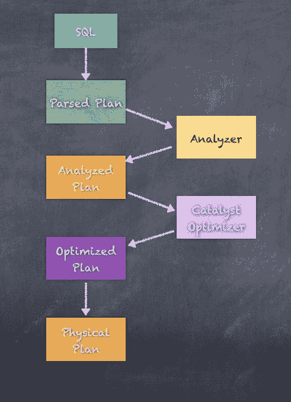
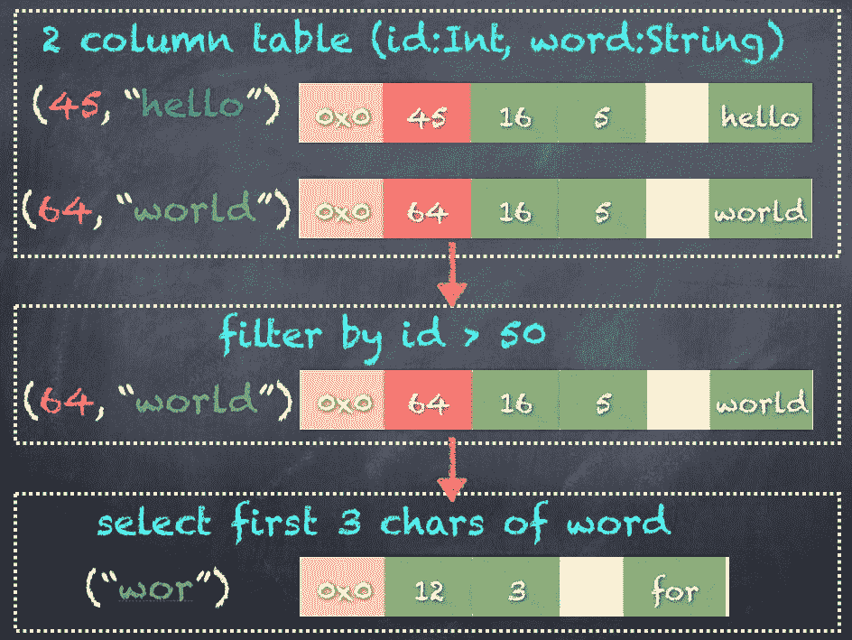
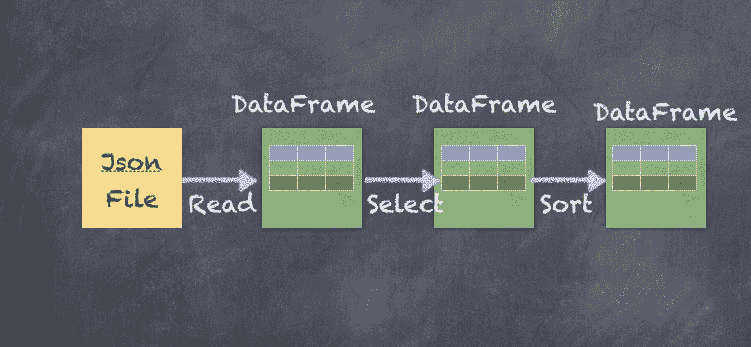
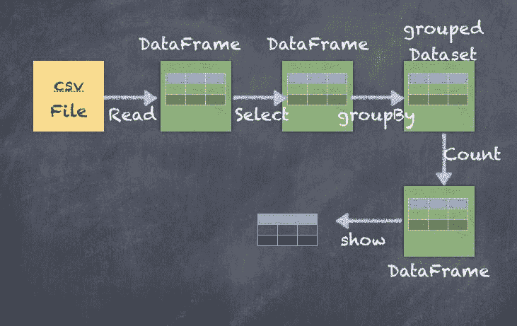
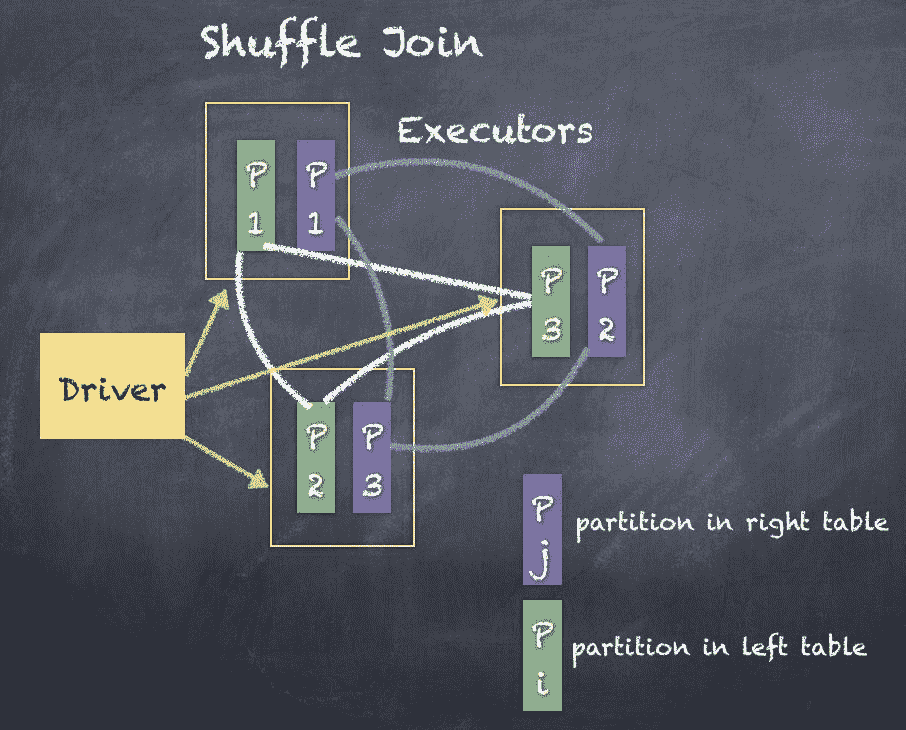

# 第八章：简介结构 - Spark SQL

“一台机器可以做五十个普通人能做的工作，但没有一台机器能做一个非凡人能做的工作。”

- 埃尔伯特·哈伯德

在本章中，你将学习如何使用 Spark 来分析结构化数据（如需将无结构数据，比如包含任意文本或其他格式的文档，转换为结构化形式）；我们将看到 DataFrames/datasets 在这里是基础，Spark SQL 的 API 如何使查询结构化数据既简单又强大。此外，我们还会介绍 datasets，并探讨 datasets、DataFrames 和 RDDs 之间的区别。总的来说，本章将涵盖以下主题：

+   Spark SQL 和 DataFrames

+   DataFrame 和 SQL API

+   DataFrame 模式

+   数据集和编码器

+   数据加载和保存

+   聚合操作

+   连接操作

# Spark SQL 和 DataFrames

在 Apache Spark 之前，Apache Hive 是每当需要对大量数据运行 SQL 类似查询时的首选技术。Apache Hive 实质上将 SQL 查询转换为类似 MapReduce 的逻辑，从而自动使得执行各种大数据分析变得非常简单，而不需要学习编写复杂的 Java 和 Scala 代码。

随着 Apache Spark 的出现，我们在大数据规模上执行分析的方式发生了范式转变。Spark SQL 提供了一个易于使用的 SQL 类似层，建立在 Apache Spark 的分布式计算能力之上。实际上，Spark SQL 可以作为一个在线分析处理数据库使用。



Spark SQL 的工作原理是通过将 SQL 类似语句解析为**抽象语法树**（**AST**），随后将该计划转换为逻辑计划，并优化逻辑计划为可执行的物理计划。最终执行使用底层的 DataFrame API，这使得任何人都可以通过使用类似 SQL 的接口而不是学习所有内部实现，轻松使用 DataFrame API。由于本书深入探讨了各种 API 的技术细节，我们将主要介绍 DataFrame API，并在某些地方展示 Spark SQL API，以对比不同的 API 使用方式。

因此，DataFrame API 是 Spark SQL 底层的基础层。在本章中，我们将展示如何使用各种技术创建 DataFrames，包括 SQL 查询和对 DataFrame 执行操作。

DataFrame 是 **弹性分布式数据集**（**RDD**）的抽象，处理通过 Catalyst 优化器优化的更高级功能，并且通过 Tungsten Initiative 实现高性能。你可以将数据集看作是 RDD 的高效表格，并具有经过优化的二进制数据表示。二进制表示是通过编码器实现的，编码器将各种对象序列化为二进制结构，从而提供比 RDD 表示更好的性能。由于 DataFrame 内部无论如何都使用 RDD，因此 DataFrame/数据集也像 RDD 一样分布式，因此它也是一个分布式数据集。显然，这也意味着数据集是不可变的。

以下是数据的二进制表示示意图：



数据集（datasets）在 Spark 1.6 中被添加，并在 DataFrame 之上提供强类型的好处。事实上，从 Spark 2.0 开始，DataFrame 实际上是数据集的别名。

`org.apache.spark.sql` 将类型 `DataFrame` 定义为 `dataset[Row]`，这意味着大多数 API 可以很好地与数据集和 `DataFrame` 配合使用。

**type DataFrame = dataset[Row]**

DataFrame 在概念上类似于关系数据库中的表。因此，DataFrame 包含数据行，每行由多个列组成。

我们需要记住的第一件事是，像 RDD 一样，DataFrame 也是不可变的。DataFrame 的这种不可变性意味着每个转换或操作都会创建一个新的 DataFrame。



让我们开始深入了解 DataFrame 以及它们如何与 RDD 不同。正如之前所见，RDD 是 Apache Spark 中的数据操作的低级 API。DataFrame 是在 RDD 之上创建的，目的是抽象化 RDD 的低级内部工作原理，并暴露出更高层次的 API，这些 API 更易于使用，并且提供了大量开箱即用的功能。DataFrame 的创建遵循了类似于 Python pandas 包、R 语言、Julia 语言等中的概念。

正如我们之前提到的，DataFrame 将 SQL 代码和特定领域语言表达式转换为优化执行计划，这些计划将在 Spark Core API 上运行，以便 SQL 语句能够执行各种操作。DataFrame 支持多种不同类型的输入数据源和操作类型。包括所有类型的 SQL 操作，如连接、分组、聚合和窗口函数，类似于大多数数据库。Spark SQL 也非常类似于 Hive 查询语言，并且由于 Spark 提供了与 Apache Hive 的自然适配器，已经在 Apache Hive 中工作的用户可以轻松地将他们的知识转移到 Spark SQL，从而最大限度地减少过渡时间。

DataFrames 本质上依赖于表的概念，正如之前所见。可以非常类似于 Apache Hive 的方式操作表。事实上，Apache Spark 中对表的许多操作与 Apache Hive 处理表及操作表的方式非常相似。一旦有了作为 DataFrame 的表，可以将 DataFrame 注册为表，并且可以使用 Spark SQL 语句操作数据，而不是使用 DataFrame API。

DataFrames 依赖于催化剂优化器和钨丝性能改进，因此让我们简要地看一下催化剂优化器是如何工作的。催化剂优化器从输入的 SQL 创建一个解析后的逻辑计划，然后通过查看 SQL 语句中使用的所有各种属性和列来分析这个逻辑计划。一旦分析完逻辑计划，催化剂优化器进一步尝试通过合并多个操作和重新排列逻辑来优化计划，以获得更好的性能。

要理解催化剂优化器，可以将其看作是一个常识逻辑优化器，它可以重新排序诸如过滤器和转换等操作，有时将多个操作组合成一个操作，以尽量减少在工作节点之间传输的数据量。例如，催化剂优化器可能决定在不同数据集之间执行联合操作时广播较小的数据集。使用 explain 查看任何数据框的执行计划。催化剂优化器还计算 DataFrame 的列和分区的统计信息，提高执行速度。

例如，如果数据分区上有转换和过滤操作，则过滤数据和应用转换的顺序对操作的整体性能至关重要。由于所有优化，生成了优化的逻辑计划，然后将其转换为物理计划。显然，有几个物理计划可以执行相同的 SQL 语句并生成相同的结果。成本优化逻辑根据成本优化和估算选择一个好的物理计划。

钨丝性能改进是 Spark 2.x 提供的显著性能改进背后的秘密武器之一，与之前的版本如 Spark 1.6 和更早的版本相比。钨丝实现了对内存管理和其他性能改进的完全改造。最重要的内存管理改进使用对象的二进制编码，并在堆外和堆内存中引用它们。因此，钨丝允许使用二进制编码机制来编码所有对象以使用办公堆内存。二进制编码的对象占用的内存要少得多。项目钨丝还改进了洗牌性能。

通常通过 `DataFrameReader` 将数据加载到 DataFrames 中，并通过 `DataFrameWriter` 从 DataFrames 中保存数据。

# DataFrame API 和 SQL API

创建数据框可以通过多种方式进行：

+   通过执行 SQL 查询

+   加载外部数据，如 Parquet、JSON、CSV、文本、Hive、JDBC 等

+   将 RDD 转换为数据框

可以通过加载 CSV 文件来创建一个数据框。我们将查看一个名为`statesPopulation.csv`的 CSV 文件，它被加载为一个数据框。

该 CSV 文件包含 2010 年到 2016 年间美国各州的人口数据格式。

| **州** | **年份** | **人口** |
| --- | --- | --- |
| 阿拉巴马州 | 2010 | 4785492 |
| 阿拉斯加州 | 2010 | 714031 |
| 亚利桑那州 | 2010 | 6408312 |
| 阿肯色州 | 2010 | 2921995 |
| 加利福尼亚州 | 2010 | 37332685 |

由于此 CSV 文件包含标题行，我们可以使用它快速加载到数据框中，并进行隐式的模式检测。

```py
scala> val statesDF = spark.read.option("header", "true").option("inferschema", "true").option("sep", ",").csv("statesPopulation.csv")
statesDF: org.apache.spark.sql.DataFrame = [State: string, Year: int ... 1 more field]

```

一旦数据框加载完成，就可以检查其模式：

```py
scala> statesDF.printSchema
root
 |-- State: string (nullable = true)
 |-- Year: integer (nullable = true)
 |-- Population: integer (nullable = true)

```

`option("header", "true").option("inferschema", "true").option("sep", ",")`告诉 Spark，CSV 文件包含`header`，使用逗号作为分隔符，并且可以隐式推断模式。

数据框通过解析逻辑计划、分析逻辑计划、优化计划，然后最终执行物理执行计划来工作。

使用`explain`命令对数据框进行查看，可以显示执行计划：

```py
scala> statesDF.explain(true)
== Parsed Logical Plan ==
Relation[State#0,Year#1,Population#2] csv
== Analyzed Logical Plan ==
State: string, Year: int, Population: int
Relation[State#0,Year#1,Population#2] csv
== Optimized Logical Plan ==
Relation[State#0,Year#1,Population#2] csv
== Physical Plan ==
*FileScan csv [State#0,Year#1,Population#2] Batched: false, Format: CSV, Location: InMemoryFileIndex[file:/Users/salla/states.csv], PartitionFilters: [], PushedFilters: [], ReadSchema: struct<State:string,Year:int,Population:int>

```

数据框也可以注册为表名（如下所示），这将允许你像关系型数据库一样编写 SQL 语句。

```py
scala> statesDF.createOrReplaceTempView("states")

```

一旦我们获得了结构化的数据框或表格，我们就可以运行命令来对数据进行操作：

```py
scala> statesDF.show(5)
scala> spark.sql("select * from states limit 5").show
+----------+----+----------+
| State|Year|Population|
+----------+----+----------+
| Alabama|2010| 4785492|
| Alaska|2010| 714031|
| Arizona|2010| 6408312|
| Arkansas|2010| 2921995|
|California|2010| 37332685|
+----------+----+----------+

```

如果你查看前面的代码片段，我们已经编写了一个类似 SQL 的语句，并使用`spark.sql` API 执行它。

请注意，Spark SQL 实际上是转换为数据框 API 进行执行，SQL 只是一个简化使用的领域特定语言（DSL）。

使用数据框上的`sort`操作，你可以按任何列对数据框中的行进行排序。以下是使用`Population`列进行降序`sort`操作的效果。行将按照人口的降序进行排序。

```py
scala> statesDF.sort(col("Population").desc).show(5)
scala> spark.sql("select * from states order by Population desc limit 5").show
+----------+----+----------+
| State|Year|Population|
+----------+----+----------+
|California|2016| 39250017|
|California|2015| 38993940|
|California|2014| 38680810|
|California|2013| 38335203|
|California|2012| 38011074|
+----------+----+----------+

```

使用`groupBy`我们可以按任何列对数据框进行分组。以下是按`State`分组行，然后为每个`State`的`Population`数量求和的代码。

```py
scala> statesDF.groupBy("State").sum("Population").show(5)
scala> spark.sql("select State, sum(Population) from states group by State limit 5").show
+---------+---------------+
| State|sum(Population)|
+---------+---------------+
| Utah| 20333580|
| Hawaii| 9810173|
|Minnesota| 37914011|
| Ohio| 81020539|
| Arkansas| 20703849|
+---------+---------------+

```

使用`agg`操作，你可以对数据框中的列执行多种不同的操作，例如查找列的`min`、`max`和`avg`。你还可以同时执行操作并重命名列，以适应你的用例。

```py
scala> statesDF.groupBy("State").agg(sum("Population").alias("Total")).show(5)
scala> spark.sql("select State, sum(Population) as Total from states group by State limit 5").show
+---------+--------+
| State| Total|
+---------+--------+
| Utah|20333580|
| Hawaii| 9810173|
|Minnesota|37914011|
| Ohio|81020539|
| Arkansas|20703849|
+---------+--------+

```

自然，逻辑越复杂，执行计划也越复杂。让我们查看之前`groupBy`和`agg` API 调用的执行计划，以更好地理解背后发生了什么。以下是显示按`State`分组并对人口进行求和的执行计划的代码：

```py
scala> statesDF.groupBy("State").agg(sum("Population").alias("Total")).explain(true)
== Parsed Logical Plan ==
'Aggregate [State#0], [State#0, sum('Population) AS Total#31886]
+- Relation[State#0,Year#1,Population#2] csv

== Analyzed Logical Plan ==
State: string, Total: bigint
Aggregate [State#0], [State#0, sum(cast(Population#2 as bigint)) AS Total#31886L]
+- Relation[State#0,Year#1,Population#2] csv

== Optimized Logical Plan ==
Aggregate [State#0], [State#0, sum(cast(Population#2 as bigint)) AS Total#31886L]
+- Project [State#0, Population#2]
 +- Relation[State#0,Year#1,Population#2] csv

== Physical Plan ==
*HashAggregate(keys=[State#0], functions=[sum(cast(Population#2 as bigint))], output=[State#0, Total#31886L])
+- Exchange hashpartitioning(State#0, 200)
 +- *HashAggregate(keys=[State#0], functions=[partial_sum(cast(Population#2 as bigint))], output=[State#0, sum#31892L])
 +- *FileScan csv [State#0,Population#2] Batched: false, Format: CSV, Location: InMemoryFileIndex[file:/Users/salla/states.csv], PartitionFilters: [], PushedFilters: [], ReadSchema: struct<State:string,Population:int>

```

数据框操作可以很好地链式连接，这样执行就能利用成本优化（Tungsten 性能改进和 Catalyst 优化器协同工作）。

我们还可以将操作链式连接在一个语句中，如下所示，其中我们不仅按 `State` 列对数据进行分组并汇总 `Population` 值，还按汇总列对 DataFrame 进行排序：

```py
scala> statesDF.groupBy("State").agg(sum("Population").alias("Total")).sort(col("Total").desc).show(5)
scala> spark.sql("select State, sum(Population) as Total from states group by State order by Total desc limit 5").show
+----------+---------+
| State| Total|
+----------+---------+
|California|268280590|
| Texas|185672865|
| Florida|137618322|
| New York|137409471|
| Illinois| 89960023|
+----------+---------+

```

上述链式操作包含了多个转换和操作，可以通过以下图表来可视化：



也可以同时创建多个聚合，如下所示：

```py
scala> statesDF.groupBy("State").agg(
             min("Population").alias("minTotal"), 
             max("Population").alias("maxTotal"),        
             avg("Population").alias("avgTotal"))
           .sort(col("minTotal").desc).show(5) 
scala> spark.sql("select State, min(Population) as minTotal, max(Population) as maxTotal, avg(Population) as avgTotal from states group by State order by minTotal desc limit 5").show
+----------+--------+--------+--------------------+
| State|minTotal|maxTotal| avgTotal|
+----------+--------+--------+--------------------+
|California|37332685|39250017|3.8325798571428575E7|
| Texas|25244310|27862596| 2.6524695E7|
| New York|19402640|19747183| 1.962992442857143E7|
| Florida|18849098|20612439|1.9659760285714287E7|
| Illinois|12801539|12879505|1.2851431857142856E7|
+----------+--------+--------+--------------------+

```

# 数据透视

数据透视是一种很好的方法，可以将表格转化为不同的视图，更适合进行多项汇总和聚合。这是通过获取列的值，并将每个值转化为一个实际的列来实现的。

为了更好地理解这一点，让我们按 `Year` 对 DataFrame 的行进行数据透视，并查看结果。这显示现在 `Year` 列通过将每个唯一值转换为一个实际的列，创建了几个新的列。最终结果是，现在我们不仅仅查看年份列，而是可以使用每年的列来按 `Year` 进行汇总和聚合。

```py
scala> statesDF.groupBy("State").pivot("Year").sum("Population").show(5)
+---------+--------+--------+--------+--------+--------+--------+--------+
| State| 2010| 2011| 2012| 2013| 2014| 2015| 2016|
+---------+--------+--------+--------+--------+--------+--------+--------+
| Utah| 2775326| 2816124| 2855782| 2902663| 2941836| 2990632| 3051217|
| Hawaii| 1363945| 1377864| 1391820| 1406481| 1416349| 1425157| 1428557|
|Minnesota| 5311147| 5348562| 5380285| 5418521| 5453109| 5482435| 5519952|
| Ohio|11540983|11544824|11550839|11570022|11594408|11605090|11614373|
| Arkansas| 2921995| 2939493| 2950685| 2958663| 2966912| 2977853| 2988248|
+---------+--------+--------+--------+--------+--------+--------+--------+

```

# 过滤器

DataFrame 还支持过滤器（Filters），可以快速过滤 DataFrame 行并生成新的 DataFrame。过滤器使数据的转换变得非常重要，可以将 DataFrame 精简到我们的使用场景。例如，如果你只想分析加利福尼亚州的情况，那么使用 `filter` API 可以在每个数据分区上执行非匹配行的删除，从而提高操作的性能。

让我们查看过滤 DataFrame 的执行计划，以仅考虑加利福尼亚州的情况。

```py
scala> statesDF.filter("State == 'California'").explain(true)

== Parsed Logical Plan ==
'Filter ('State = California)
+- Relation[State#0,Year#1,Population#2] csv

== Analyzed Logical Plan ==
State: string, Year: int, Population: int
Filter (State#0 = California)
+- Relation[State#0,Year#1,Population#2] csv

== Optimized Logical Plan ==
Filter (isnotnull(State#0) && (State#0 = California))
+- Relation[State#0,Year#1,Population#2] csv

== Physical Plan ==
*Project [State#0, Year#1, Population#2]
+- *Filter (isnotnull(State#0) && (State#0 = California))
 +- *FileScan csv [State#0,Year#1,Population#2] Batched: false, Format: CSV, Location: InMemoryFileIndex[file:/Users/salla/states.csv], PartitionFilters: [], PushedFilters: [IsNotNull(State), EqualTo(State,California)], ReadSchema: struct<State:string,Year:int,Population:int>

```

现在我们可以看到执行计划，接下来执行 `filter` 命令，如下所示：

```py
scala> statesDF.filter("State == 'California'").show
+----------+----+----------+
| State|Year|Population|
+----------+----+----------+
|California|2010| 37332685|
|California|2011| 37676861|
|California|2012| 38011074|
|California|2013| 38335203|
|California|2014| 38680810|
|California|2015| 38993940|
|California|2016| 39250017|
+----------+----+----------+

```

# 用户自定义函数（UDFs）

UDF 定义了基于列的新的函数，扩展了 Spark SQL 的功能。通常，Spark 中内置的函数无法处理我们所需的精确功能。在这种情况下，Apache Spark 支持创建 UDF，我们可以使用它们。

`udf()` 内部调用了一个案例类用户自定义函数，它内部又调用了 ScalaUDF。

让我们通过一个示例来了解一个简单的用户自定义函数（UDF），该函数将 State 列的值转换为大写。

首先，我们在 Scala 中创建所需的函数。

```py
import org.apache.spark.sql.functions._

scala> val toUpper: String => String = _.toUpperCase
toUpper: String => String = <function1>

```

然后，我们必须将创建的函数封装在 `udf` 中，以创建 UDF。

```py
scala> val toUpperUDF = udf(toUpper)
toUpperUDF: org.apache.spark.sql.expressions.UserDefinedFunction = UserDefinedFunction(<function1>,StringType,Some(List(StringType)))

```

现在我们已经创建了 `udf`，可以使用它将 State 列转换为大写。

```py
scala> statesDF.withColumn("StateUpperCase", toUpperUDF(col("State"))).show(5)
+----------+----+----------+--------------+
| State|Year|Population|StateUpperCase|
+----------+----+----------+--------------+
| Alabama|2010| 4785492| ALABAMA|
| Alaska|2010| 714031| ALASKA|
| Arizona|2010| 6408312| ARIZONA|
| Arkansas|2010| 2921995| ARKANSAS|
|California|2010| 37332685| CALIFORNIA|
+----------+----+----------+--------------+

```

# 架构  数据的结构

架构是数据结构的描述，可以是隐式的或显式的。

由于 DataFrame 内部基于 RDD，因此将现有 RDD 转换为数据集有两种主要方法。可以通过反射推断 RDD 的架构，从而将 RDD 转换为数据集。创建数据集的第二种方法是通过编程接口，使用该接口可以提供现有的 RDD 和架构，将 RDD 转换为带架构的数据集。

为了通过反射推断模式从 RDD 创建 DataFrame，Spark 的 Scala API 提供了案例类，可以用来定义表的模式。DataFrame 是通过程序化方式从 RDD 创建的，因为在所有情况下使用案例类并不容易。例如，在一个有 1000 列的表上创建案例类会非常耗时。

# 隐式模式

让我们来看一个将 **CSV**（逗号分隔值）文件加载到 DataFrame 中的例子。每当文本文件包含表头时，读取 API 可以通过读取表头行来推断模式。我们也可以指定用于分隔文本文件行的分隔符。

我们读取 `csv` 文件，通过表头推断模式，并使用逗号（`,`) 作为分隔符。我们还展示了 `schema` 命令和 `printSchema` 命令的使用，来验证输入文件的模式。

```py
scala> val statesDF = spark.read.option("header", "true")
                                .option("inferschema", "true")
                                .option("sep", ",")
                                .csv("statesPopulation.csv")
statesDF: org.apache.spark.sql.DataFrame = [State: string, Year: int ... 1 more field]

scala> statesDF.schema
res92: org.apache.spark.sql.types.StructType = StructType(
                                                  StructField(State,StringType,true),
                                                  StructField(Year,IntegerType,true),
                                                  StructField(Population,IntegerType,true))
scala> statesDF.printSchema
root
 |-- State: string (nullable = true)
 |-- Year: integer (nullable = true)
 |-- Population: integer (nullable = true)

```

# 显式模式

模式通过 `StructType` 描述，它是 `StructField` 对象的集合。

`StructType` 和 `StructField` 属于 `org.apache.spark.sql.types` 包。

`IntegerType`、`StringType` 等数据类型也属于 `org.apache.spark.sql.types` 包。

使用这些导入，我们可以定义一个自定义的显式模式。

首先，导入必要的类：

```py
scala> import org.apache.spark.sql.types.{StructType, IntegerType, StringType}
import org.apache.spark.sql.types.{StructType, IntegerType, StringType}

```

定义一个包含两列/字段的模式——一个 `Integer` 字段，后跟一个 `String` 字段：

```py
scala> val schema = new StructType().add("i", IntegerType).add("s", StringType)
schema: org.apache.spark.sql.types.StructType = StructType(StructField(i,IntegerType,true), StructField(s,StringType,true))

```

打印新创建的 `schema` 非常简单：

```py
scala> schema.printTreeString
root
 |-- i: integer (nullable = true)
 |-- s: string (nullable = true)

```

还可以选择打印 JSON，方法如下，使用 `prettyJson` 函数：

```py
scala> schema.prettyJson
res85: String =
{
 "type" : "struct",
 "fields" : [ {
 "name" : "i",
 "type" : "integer",
 "nullable" : true,
 "metadata" : { }
 }, {
 "name" : "s",
 "type" : "string",
 "nullable" : true,
 "metadata" : { }
 } ]
}

```

Spark SQL 的所有数据类型都位于 `org.apache.spark.sql.types` 包中。你可以通过以下方式访问它们：

```py
import org.apache.spark.sql.types._

```

# 编码器

Spark 2.x 支持为复杂数据类型定义模式的另一种方式。首先，我们来看一个简单的例子。

必须通过 import 语句导入编码器，以便使用编码器：

```py
import org.apache.spark.sql.Encoders 

```

让我们来看一个简单的例子，定义一个元组作为数据类型，并在数据集 API 中使用它：

```py

scala> Encoders.product[(Integer, String)].schema.printTreeString
root
 |-- _1: integer (nullable = true)
 |-- _2: string (nullable = true)

```

上面的代码看起来总是很复杂，因此我们也可以为需求定义一个案例类，然后使用它。我们可以定义一个名为 `Record` 的案例类，包含两个字段——一个 `Integer` 和一个 `String`：

```py
scala> case class Record(i: Integer, s: String)
defined class Record

```

使用 `Encoders`，我们可以轻松地在案例类上创建一个 `schema`，从而轻松使用各种 API：

```py
scala> Encoders.product[Record].schema.printTreeString
root
 |-- i: integer (nullable = true)
 |-- s: string (nullable = true)

```

Spark SQL 的所有数据类型都位于包 **`org.apache.spark.sql.types`** 中。你可以通过以下方式访问它们：

```py
import org.apache.spark.sql.types._

```

你应该在代码中使用 `DataTypes` 对象来创建复杂的 Spark SQL 类型，例如数组或映射，如下所示：

```py
scala> import org.apache.spark.sql.types.DataTypes
import org.apache.spark.sql.types.DataTypes

scala> val arrayType = DataTypes.createArrayType(IntegerType)
arrayType: org.apache.spark.sql.types.ArrayType = ArrayType(IntegerType,true)

```

以下是 Spark SQL API 中支持的数据类型：

| **数据类型** | **Scala 中的值类型** | **访问或创建数据类型的 API** |
| --- | --- | --- |
| `ByteType` | `Byte` | `ByteType` |
| `ShortType` | `Short` | `ShortType` |
| `IntegerType` | `Int` | `IntegerType` |
| `LongType` | `Long` | `LongType` |
| `FloatType` | `Float` | `FloatType` |
| `DoubleType` | `Double` | `DoubleType` |
| `DecimalType` | `java.math.BigDecimal` | `DecimalType` |
| `StringType` | `String` | `StringType` |
| `BinaryType` | `Array[Byte]` | `BinaryType` |
| `BooleanType` | `Boolean` | `BooleanType` |
| `TimestampType` | `java.sql.Timestamp` | `TimestampType` |
| `DateType` | `java.sql.Date` | `DateType` |
| `ArrayType` | `scala.collection.Seq` | `ArrayType(elementType, [containsNull])` |
| `MapType` | `scala.collection.Map` | `MapType(keyType, valueType, [valueContainsNull])` 注意：`valueContainsNull` 的默认值为 `true`。 |
| `StructType` | `org.apache.spark.sql.Row` | `StructType(fields)` 注意：fields 是 `Seq` 类型的 `StructFields`。此外，不允许有两个同名的字段。 |

# 加载和保存数据集

我们需要将数据读取到集群作为输入，并将输出或结果写回存储，这样才能对代码做实际操作。输入数据可以从多种数据集和来源读取，如文件、Amazon S3 存储、数据库、NoSQL 和 Hive，输出也可以保存到文件、S3、数据库、Hive 等。

通过连接器，多个系统已经支持 Spark，随着越来越多的系统接入 Spark 处理框架，这一数字正在日益增长。

# 加载数据集

Spark SQL 可以通过 `DataFrameReader` 接口从外部存储系统（如文件、Hive 表和 JDBC 数据库）读取数据。

API 调用的格式是 `spark.read.inputtype`

+   Parquet

+   CSV

+   Hive 表

+   JDBC

+   ORC

+   文本

+   JSON

让我们看几个简单的例子，展示如何将 CSV 文件读取到 DataFrame 中：

```py
scala> val statesPopulationDF = spark.read.option("header", "true").option("inferschema", "true").option("sep", ",").csv("statesPopulation.csv")
statesPopulationDF: org.apache.spark.sql.DataFrame = [State: string, Year: int ... 1 more field]

scala> val statesTaxRatesDF = spark.read.option("header", "true").option("inferschema", "true").option("sep", ",").csv("statesTaxRates.csv")
statesTaxRatesDF: org.apache.spark.sql.DataFrame = [State: string, TaxRate: double]

```

# 保存数据集

Spark SQL 可以通过 `DataFrameWriter` 接口将数据保存到外部存储系统，如文件、Hive 表和 JDBC 数据库。

API 调用的格式是 `dataframe``.write.outputtype`

+   Parquet

+   ORC

+   文本

+   Hive 表

+   JSON

+   CSV

+   JDBC

让我们看几个将 DataFrame 写入或保存为 CSV 文件的示例：

```py
scala> statesPopulationDF.write.option("header", "true").csv("statesPopulation_dup.csv")

scala> statesTaxRatesDF.write.option("header", "true").csv("statesTaxRates_dup.csv")

```

# 聚合

聚合是根据某个条件收集数据并对其进行分析的方法。聚合对于理解各种规模的数据非常重要，因为仅仅拥有原始数据记录对于大多数用例来说并不那么有用。

举个例子，如果你查看下面的表格和它的聚合视图，显然仅仅是原始记录并不能帮助你理解数据。

想象一下，一个表格，其中记录了世界上每个城市五年内每天的气温测量数据。

以下展示了一个包含每天每个城市的平均气温记录的表格：

| **城市** | **日期** | **气温** |
| --- | --- | --- |
| 波士顿 | 2016/12/23 | 32 |
| 纽约 | 2016/12/24 | 36 |
| 波士顿 | 2016/12/24 | 30 |
| 费城 | 2016/12/25 | 34 |
| 波士顿 | 2016/12/25 | 28 |

如果我们想计算上表中每个城市的日均气温，我们可以看到的结果将类似于下面的表格：

| **城市** | **平均气温** |
| --- | --- |
| 波士顿 | 30 - *(32 + 30 + 28)/3* |
| 纽约 | 36 |
| 费城 | 34 |

# 聚合函数

大多数聚合操作可以使用在`org.apache.spark.sql.functions`包中找到的函数来完成。此外，还可以创建自定义聚合函数，称为**用户定义的聚合函数**（**UDAF**）。

每个分组操作返回一个`RelationalGroupeddataset`，你可以在其上指定聚合操作。

我们将加载示例数据，以说明本节中所有不同类型的聚合函数：

```py
val statesPopulationDF = spark.read.option("header", "true").option("inferschema", "true").option("sep", ",").csv("statesPopulation.csv")

```

# 计数

`count`是最基本的聚合函数，它简单地计算指定列的行数。其扩展版本是`countDistinct`，它还会去除重复项。

`count` API 有多种实现方式，具体使用哪个 API 取决于特定的使用场景：

```py
def count(columnName: String): TypedColumn[Any, Long]
Aggregate function: returns the number of items in a group.

def count(e: Column): Column
Aggregate function: returns the number of items in a group.

def countDistinct(columnName: String, columnNames: String*): Column
Aggregate function: returns the number of distinct items in a group.

def countDistinct(expr: Column, exprs: Column*): Column
Aggregate function: returns the number of distinct items in a group.

```

让我们看一些在 DataFrame 上调用`count`和`countDistinct`的示例，来打印行数：

```py
import org.apache.spark.sql.functions._
scala> statesPopulationDF.select(col("*")).agg(count("State")).show
scala> statesPopulationDF.select(count("State")).show
+------------+
|count(State)|
+------------+
| 350|
+------------+

scala> statesPopulationDF.select(col("*")).agg(countDistinct("State")).show
scala> statesPopulationDF.select(countDistinct("State")).show
+---------------------+
|count(DISTINCT State)|
+---------------------+
| 50|

```

# 第一行

获取`RelationalGroupeddataset`中的第一条记录。

`first` API 有多种实现方式，具体使用哪个 API 取决于特定的使用场景：

```py
def first(columnName: String): Column
Aggregate function: returns the first value of a column in a group.

def first(e: Column): Column
Aggregate function: returns the first value in a group.

def first(columnName: String, ignoreNulls: Boolean): Column
Aggregate function: returns the first value of a column in a group.

def first(e: Column, ignoreNulls: Boolean): Column
Aggregate function: returns the first value in a group.

```

让我们看一个在 DataFrame 上调用`first`的示例，来输出第一行：

```py
import org.apache.spark.sql.functions._
scala> statesPopulationDF.select(first("State")).show
+-------------------+
|first(State, false)|
+-------------------+
| Alabama|
+-------------------+

```

# 最后一行

获取`RelationalGroupeddataset`中的最后一条记录。

`last` API 有多种实现方式，具体使用哪个 API 取决于特定的使用场景：

```py
def last(columnName: String): Column
Aggregate function: returns the last value of the column in a group.

def last(e: Column): Column
Aggregate function: returns the last value in a group.

def last(columnName: String, ignoreNulls: Boolean): Column
Aggregate function: returns the last value of the column in a group.

def last(e: Column, ignoreNulls: Boolean): Column
Aggregate function: returns the last value in a group.

```

让我们看一个在 DataFrame 上调用`last`的示例，来输出最后一行。

```py
import org.apache.spark.sql.functions._
scala> statesPopulationDF.select(last("State")).show
+------------------+
|last(State, false)|
+------------------+
| Wyoming|
+------------------+

```

# approx_count_distinct

近似的不同计数比进行精确计数要快得多，因为精确计数通常需要很多数据重分区和其他操作。虽然近似计数不是 100%准确，但在许多使用场景下，即使没有精确计数，表现也能一样好。

`approx_count_distinct` API 有多种实现方式，具体使用哪个 API 取决于特定的使用场景。

```py
def approx_count_distinct(columnName: String, rsd: Double): Column
Aggregate function: returns the approximate number of distinct items in a group.

def approx_count_distinct(e: Column, rsd: Double): Column
Aggregate function: returns the approximate number of distinct items in a group.

def approx_count_distinct(columnName: String): Column
Aggregate function: returns the approximate number of distinct items in a group.

def approx_count_distinct(e: Column): Column
Aggregate function: returns the approximate number of distinct items in a group.

```

让我们看一个在 DataFrame 上调用`approx_count_distinct`的示例，来打印 DataFrame 的近似计数：

```py
import org.apache.spark.sql.functions._
scala> statesPopulationDF.select(col("*")).agg(approx_count_distinct("State")).show
+----------------------------+
|approx_count_distinct(State)|
+----------------------------+
| 48|
+----------------------------+

scala> statesPopulationDF.select(approx_count_distinct("State", 0.2)).show
+----------------------------+
|approx_count_distinct(State)|
+----------------------------+
| 49|
+----------------------------+

```

# 最小值

DataFrame 中某一列的最小值。例如，如果你想找出某个城市的最低温度。

`min` API 有多种实现方式，具体使用哪个 API 取决于特定的使用场景：

```py
def min(columnName: String): Column
Aggregate function: returns the minimum value of the column in a group.

def min(e: Column): Column
Aggregate function: returns the minimum value of the expression in a group.

```

让我们看一个在 DataFrame 上调用`min`的示例，来打印最小人口：

```py
import org.apache.spark.sql.functions._
scala> statesPopulationDF.select(min("Population")).show
+---------------+
|min(Population)|
+---------------+
| 564513|
+---------------+

```

# 最大值

DataFrame 中某一列的最大值。例如，如果你想找出某个城市的最高温度。

`max` API 有多种实现方式，具体使用哪个 API 取决于特定的使用场景。

```py
def max(columnName: String): Column
Aggregate function: returns the maximum value of the column in a group.

def max(e: Column): Column
Aggregate function: returns the maximum value of the expression in a group.

```

让我们看一个在 DataFrame 上调用`max`的示例，来打印最大人口：

```py
import org.apache.spark.sql.functions._
scala> statesPopulationDF.select(max("Population")).show
+---------------+
|max(Population)|
+---------------+
| 39250017|
+---------------+

```

# 平均值

值的平均值通过将所有值相加然后除以值的个数来计算。

1、2、3 的平均值是(1 + 2 + 3) / 3 = 6 / 3 = 2

`avg` API 有多种实现方式，具体使用哪个 API 取决于特定的使用场景：

```py
def avg(columnName: String): Column
Aggregate function: returns the average of the values in a group.

def avg(e: Column): Column
Aggregate function: returns the average of the values in a group.

```

让我们看一个在 DataFrame 上调用`avg`的示例，来打印平均人口：

```py
import org.apache.spark.sql.functions._
scala> statesPopulationDF.select(avg("Population")).show
+-----------------+
| avg(Population)|
+-----------------+
|6253399.371428572|
+-----------------+

```

# 求和

计算列中值的总和。可以选择使用 `sumDistinct` 来仅计算不同值的总和。

`sum` API 有几种实现方式，具体使用哪个 API 取决于特定的使用场景：

```py
def sum(columnName: String): Column
Aggregate function: returns the sum of all values in the given column.

def sum(e: Column): Column
Aggregate function: returns the sum of all values in the expression.

def sumDistinct(columnName: String): Column
Aggregate function: returns the sum of distinct values in the expression

def sumDistinct(e: Column): Column
Aggregate function: returns the sum of distinct values in the expression.

```

让我们来看一个调用 `sum` 的例子，计算 DataFrame 中 `Population` 的总和：

```py
import org.apache.spark.sql.functions._
scala> statesPopulationDF.select(sum("Population")).show
+---------------+
|sum(Population)|
+---------------+
| 2188689780|
+---------------+

```

# 峰度

峰度是量化分布形状差异的一种方式，即使均值和方差看起来非常相似，它们的形状实际上却是不同的。在这种情况下，峰度成为衡量分布尾部相对于分布中部的权重的良好指标。

`kurtosis` API 有几种实现方式，具体使用哪个 API 取决于特定的使用场景。

```py
def kurtosis(columnName: String): Column
Aggregate function: returns the kurtosis of the values in a group.

def kurtosis(e: Column): Column
Aggregate function: returns the kurtosis of the values in a group.

```

让我们来看一个调用 `kurtosis` 的例子，针对 `Population` 列的 DataFrame：

```py
import org.apache.spark.sql.functions._
scala> statesPopulationDF.select(kurtosis("Population")).show
+--------------------+
|kurtosis(Population)|
+--------------------+
| 7.727421920829375|
+--------------------+

```

# 偏度

偏度衡量数据中各值围绕平均值或均值的非对称性。

`skewness` API 有几种实现方式，具体使用哪个 API 取决于特定的使用场景。

```py
def skewness(columnName: String): Column
Aggregate function: returns the skewness of the values in a group.

def skewness(e: Column): Column
Aggregate function: returns the skewness of the values in a group.

```

让我们来看一个调用 `skewness` 的例子，针对 `Population` 列的 DataFrame：

```py
import org.apache.spark.sql.functions._
scala> statesPopulationDF.select(skewness("Population")).show
+--------------------+
|skewness(Population)|
+--------------------+
| 2.5675329049100024|
+--------------------+

```

# 方差

方差是每个值与均值的平方差的平均值。

`var` API 有几种实现方式，具体使用哪个 API 取决于特定的使用场景：

```py
def var_pop(columnName: String): Column
Aggregate function: returns the population variance of the values in a group.

def var_pop(e: Column): Column
Aggregate function: returns the population variance of the values in a group.

def var_samp(columnName: String): Column
Aggregate function: returns the unbiased variance of the values in a group.

def var_samp(e: Column): Column
Aggregate function: returns the unbiased variance of the values in a group.

```

现在，让我们来看一个调用 `var_pop` 的例子，计算 `Population` 的方差：

```py
import org.apache.spark.sql.functions._
scala> statesPopulationDF.select(var_pop("Population")).show
+--------------------+
| var_pop(Population)|
+--------------------+
|4.948359064356177E13|
+--------------------+

```

# 标准差

标准差是方差的平方根（参见前文）。

`stddev` API 有几种实现方式，具体使用哪个 API 取决于特定的使用场景：

```py
def stddev(columnName: String): Column
Aggregate function: alias for stddev_samp.

def stddev(e: Column): Column
Aggregate function: alias for stddev_samp.

def stddev_pop(columnName: String): Column
Aggregate function: returns the population standard deviation of the expression in a group.

def stddev_pop(e: Column): Column
Aggregate function: returns the population standard deviation of the expression in a group.

def stddev_samp(columnName: String): Column
Aggregate function: returns the sample standard deviation of the expression in a group.

def stddev_samp(e: Column): Column
Aggregate function: returns the sample standard deviation of the expression in a group.

```

让我们来看一个调用 `stddev` 的例子，打印 `Population` 的标准差：

```py
import org.apache.spark.sql.functions._
scala> statesPopulationDF.select(stddev("Population")).show
+-----------------------+
|stddev_samp(Population)|
+-----------------------+
| 7044528.191173398|
+-----------------------+

```

# 协方差

协方差是衡量两个随机变量联合变异性的指标。如果一个变量的较大值与另一个变量的较大值主要对应，而较小值也同样如此，那么这两个变量趋向于表现出相似的行为，协方差为正。如果情况相反，一个变量的较大值与另一个变量的较小值对应，那么协方差为负。

`covar` API 有几种实现方式，具体使用哪个 API 取决于特定的使用场景。

```py
def covar_pop(columnName1: String, columnName2: String): Column
Aggregate function: returns the population covariance for two columns.

def covar_pop(column1: Column, column2: Column): Column
Aggregate function: returns the population covariance for two columns.

def covar_samp(columnName1: String, columnName2: String): Column
Aggregate function: returns the sample covariance for two columns.

def covar_samp(column1: Column, column2: Column): Column
Aggregate function: returns the sample covariance for two columns.

```

让我们来看一个调用 `covar_pop` 的例子，计算年份与人口列之间的协方差：

```py
import org.apache.spark.sql.functions._
scala> statesPopulationDF.select(covar_pop("Year", "Population")).show
+---------------------------+
|covar_pop(Year, Population)|
+---------------------------+
| 183977.56000006935|
+---------------------------+

```

# groupBy

在数据分析中，常见的任务之一是将数据分组到不同的类别中，然后对结果数据进行计算。

理解分组的一种快速方法是想象自己被要求快速评估办公室所需的用品。你可以开始环顾四周，按不同类型的物品进行分组，如笔、纸张、订书机，并分析你有什么和需要什么。

让我们对`DataFrame`运行`groupBy`函数，以打印每个州的聚合计数：

```py
scala> statesPopulationDF.groupBy("State").count.show(5)
+---------+-----+
| State|count|
+---------+-----+
| Utah| 7|
| Hawaii| 7|
|Minnesota| 7|
| Ohio| 7|
| Arkansas| 7|
+---------+-----+

```

您还可以先`groupBy`，然后应用之前看到的任何聚合函数，如`min`、`max`、`avg`、`stddev`等：

```py
import org.apache.spark.sql.functions._
scala> statesPopulationDF.groupBy("State").agg(min("Population"), avg("Population")).show(5)
+---------+---------------+--------------------+
| State|min(Population)| avg(Population)|
+---------+---------------+--------------------+
| Utah| 2775326| 2904797.1428571427|
| Hawaii| 1363945| 1401453.2857142857|
|Minnesota| 5311147| 5416287.285714285|
| Ohio| 11540983|1.1574362714285715E7|
| Arkansas| 2921995| 2957692.714285714|
+---------+---------------+--------------------+

```

# 汇总

汇总是用于执行层次或嵌套计算的多维聚合。例如，如果我们想显示每个`State+Year`组的记录数，以及每个`State`的记录数（汇总所有年份，给出每个州的总数，不考虑`Year`），我们可以按如下方式使用`rollup`：

```py
scala> statesPopulationDF.rollup("State", "Year").count.show(5)
+------------+----+-----+
| State|Year|count|
+------------+----+-----+
|South Dakota|2010| 1|
| New York|2012| 1|
| California|2014| 1|
| Wyoming|2014| 1|
| Hawaii|null| 7|
+------------+----+-----+

```

`rollup`计算州和年份的计数，例如加利福尼亚州+2014 年，以及加利福尼亚州（汇总所有年份）。

# 立方体

立方体是用于执行层次或嵌套计算的多维聚合，类似于汇总，但不同的是立方体对所有维度执行相同的操作。例如，如果我们想显示每个`State`和`Year`组的记录数，以及每个`State`的记录数（汇总所有年份，给出每个州的总数，不考虑`Year`），我们可以按如下方式使用汇总。此外，`cube`还会显示每年的总计（不考虑`State`）：

```py
scala> statesPopulationDF.cube("State", "Year").count.show(5)
+------------+----+-----+
| State|Year|count|
+------------+----+-----+
|South Dakota|2010| 1|
| New York|2012| 1|
| null|2014| 50|
| Wyoming|2014| 1|
| Hawaii|null| 7|
+------------+----+-----+

```

# 窗口函数

窗口函数允许您在数据窗口而非整个数据或某些过滤数据上执行聚合操作。这类窗口函数的使用案例有：

+   累计和

+   与前一个值的差异（对于相同的键）

+   加权移动平均

理解窗口函数的最好方法是想象在更大的数据集宇宙中有一个滑动窗口。您可以指定一个窗口，查看三行 T-1、T 和 T+1，并通过执行一个简单的计算。您还可以指定一个包含最新/最近十个值的窗口：


窗口规范的 API 需要三个属性：`partitionBy()`、`orderBy()`和`rowsBetween()`。`partitionBy`将数据分割成由`partitionBy()`指定的分区/组。`orderBy()`用于对每个数据分区中的数据进行排序。

`rowsBetween()`指定窗口帧或滑动窗口的跨度，以进行计算。

要尝试窗口函数，需要一些特定的包。您可以通过以下导入指令导入所需的包：

```py
import org.apache.spark.sql.expressions.Window
import org.apache.spark.sql.functions.col import org.apache.spark.sql.functions.max

```

现在，您已准备好编写代码来了解窗口函数。让我们创建一个窗口规范，对按`Population`排序并按`State`分区的分区进行排序。同时，指定我们希望将所有行视为`Window`的一部分，直到当前行。

```py
 val windowSpec = Window
 .partitionBy("State")
 .orderBy(col("Population").desc)
 .rowsBetween(Window.unboundedPreceding, Window.currentRow)

```

计算窗口规范上的`rank`。结果将是为每一行添加一个排名（行号），只要它落在指定的`Window`内。在这个例子中，我们选择按`State`进行分区，然后进一步按降序排列每个`State`的行。因此，每个州的行都有自己的排名号。

```py
import org.apache.spark.sql.functions._
scala> statesPopulationDF.select(col("State"), col("Year"), max("Population").over(windowSpec), rank().over(windowSpec)).sort("State", "Year").show(10)
+-------+----+------------------------------------------------------------------------------------------------------------------------------+---------------------------------------------------------------------------------------------------------------------+
| State|Year|max(Population) OVER (PARTITION BY State ORDER BY Population DESC NULLS LAST ROWS BETWEEN UNBOUNDED PRECEDING AND CURRENT ROW)|RANK() OVER (PARTITION BY State ORDER BY Population DESC NULLS LAST ROWS BETWEEN UNBOUNDED PRECEDING AND CURRENT ROW)|
+-------+----+------------------------------------------------------------------------------------------------------------------------------+---------------------------------------------------------------------------------------------------------------------+
|Alabama|2010| 4863300| 6|
|Alabama|2011| 4863300| 7|
|Alabama|2012| 4863300| 5|
|Alabama|2013| 4863300| 4|
|Alabama|2014| 4863300| 3|

```

# 分位数

ntiles 是窗口聚合中常见的一种方法，通常用于将输入数据集分为 n 个部分。例如，在预测分析中，十等分（10 个部分）通常用于首先对数据进行分组，然后将其分为 10 个部分，以获得公平的数据分布。这是窗口函数方法的自然功能，因此 ntiles 是窗口函数如何提供帮助的一个很好的例子。

例如，如果我们想按`State`对`statesPopulationDF`进行分区（如前所示的窗口规范），按人口排序，然后将其分为两部分，我们可以在`windowspec`上使用`ntile`：

```py
import org.apache.spark.sql.functions._
scala> statesPopulationDF.select(col("State"), col("Year"), ntile(2).over(windowSpec), rank().over(windowSpec)).sort("State", "Year").show(10)
+-------+----+-----------------------------------------------------------------------------------------------------------------------+---------------------------------------------------------------------------------------------------------------------+
| State|Year|ntile(2) OVER (PARTITION BY State ORDER BY Population DESC NULLS LAST ROWS BETWEEN UNBOUNDED PRECEDING AND CURRENT ROW)|RANK() OVER (PARTITION BY State ORDER BY Population DESC NULLS LAST ROWS BETWEEN UNBOUNDED PRECEDING AND CURRENT ROW)|
+-------+----+-----------------------------------------------------------------------------------------------------------------------+---------------------------------------------------------------------------------------------------------------------+
|Alabama|2010| 2| 6|
|Alabama|2011| 2| 7|
|Alabama|2012| 2| 5|
|Alabama|2013| 1| 4|
|Alabama|2014| 1| 3|
|Alabama|2015| 1| 2|
|Alabama|2016| 1| 1|
| Alaska|2010| 2| 7|
| Alaska|2011| 2| 6|
| Alaska|2012| 2| 5|
+-------+----+-----------------------------------------------------------------------------------------------------------------------+------------------------------------------------------------------------------

```

如前所示，我们已使用`Window`函数和`ntile()`一起将每个`State`的行分为两等份。

该功能的常见用途之一是计算数据科学模型中使用的十等分（deciles）。

# 连接

在传统数据库中，连接用于将一张交易表与另一张查找表连接，以生成更完整的视图。例如，如果你有一张按客户 ID 分类的在线交易表和另一张包含客户城市及客户 ID 的表，你可以使用连接来生成按城市分类的交易报告。

**交易表**：以下表格包含三列，**客户 ID**、**购买商品**以及客户为商品支付的价格：

| **客户 ID** | **购买商品** | **支付价格** |
| --- | --- | --- |
| 1 | 耳机 | 25.00 |
| 2 | 手表 | 100.00 |
| 3 | 键盘 | 20.00 |
| 1 | 鼠标 | 10.00 |
| 4 | 电缆 | 10.00 |
| 3 | 耳机 | 30.00 |

**客户信息表**：以下表格包含两列，**客户 ID**和客户所在的**城市**：

| **客户 ID** | **城市** |
| --- | --- |
| 1 | 波士顿 |
| 2 | 纽约 |
| 3 | 费城 |
| 4 | 波士顿 |

将交易表与客户信息表连接将生成如下视图：

| **客户 ID** | **购买商品** | **支付价格** | **城市** |
| --- | --- | --- | --- |
| 1 | 耳机 | 25.00 | 波士顿 |
| 2 | 手表 | 100.00 | 纽约 |
| 3 | 键盘 | 20.00 | 费城 |
| 1 | 鼠标 | 10.00 | 波士顿 |
| 4 | 电缆 | 10.00 | 波士顿 |
| 3 | 耳机 | 30.00 | 费城 |

现在，我们可以使用这个连接后的视图来生成按**城市**分类的**总销售价格**报告：

| **城市** | **#商品** | **总销售价格** |
| --- | --- | --- |
| 波士顿 | 3 | 45.00 |
| 费城 | 2 | 50.00 |
| 纽约 | 1 | 100.00 |

连接是 Spark SQL 的重要功能，因为它允许你将两个数据集结合起来，如前所示。当然，Spark 不仅仅用于生成报告，它还用于处理 PB 级别的数据，以应对实时流处理、机器学习算法或普通的分析任务。为了实现这些目标，Spark 提供了所需的 API 函数。

一个典型的数据集连接通过使用左侧和右侧数据集的一个或多个键来完成，然后在键的集合上评估条件表达式作为布尔表达式。如果布尔表达式的结果为真，则连接成功，否则连接后的 DataFrame 将不包含相应的连接数据。

Join API 有 6 种不同的实现方式：

```py
join(right: dataset[_]): DataFrame
Condition-less inner join

join(right: dataset[_], usingColumn: String): DataFrame
Inner join with a single column

join(right: dataset[_], usingColumns: Seq[String]): DataFrame 
Inner join with multiple columns

join(right: dataset[_], usingColumns: Seq[String], joinType: String): DataFrame
Join with multiple columns and a join type (inner, outer,....)

join(right: dataset[_], joinExprs: Column): DataFrame
Inner Join using a join expression

join(right: dataset[_], joinExprs: Column, joinType: String): DataFrame 
Join using a Join expression and a join type (inner, outer, ...)

```

我们将使用其中一个 API 来理解如何使用 join API；不过，您也可以根据使用场景选择其他 API：

```py
def   join(right: dataset[_], joinExprs: Column, joinType: String): DataFrame Join with another DataFrame using the given join expression

right: Right side of the join.
joinExprs: Join expression.
joinType : Type of join to perform. Default is *inner* join

// Scala:
import org.apache.spark.sql.functions._
import spark.implicits._
df1.join(df2, $"df1Key" === $"df2Key", "outer") 

```

注意，连接的详细内容将在接下来的几部分中讨论。

# Join 的内部工作原理

Join 通过在多个执行器上操作 DataFrame 的分区来工作。然而，实际的操作和随后的性能取决于`join`的类型和所连接数据集的性质。在下一部分中，我们将讨论各种连接类型。

# Shuffle 连接

在两个大数据集之间进行连接时，涉及到 shuffle join，其中左侧和右侧数据集的分区被分布到各个执行器中。Shuffle 操作是非常昂贵的，因此必须分析逻辑，确保分区和 shuffle 的分布是最优的。以下是 shuffle join 如何在内部工作的示意图：



# 广播连接

在一个大数据集和一个小数据集之间进行连接时，可以通过将小数据集广播到所有执行器来完成，前提是左侧数据集的分区存在。以下是广播连接如何在内部工作的示意图：


# 连接类型

以下是不同类型的连接表。这非常重要，因为在连接两个数据集时所做的选择对结果和性能有着决定性影响。

| **Join type** | **Description** |
| --- | --- |
| **inner** | 内连接将*left*中的每一行与*right*中的每一行进行比较，并且只有当两者都有非 NULL 值时，才会将匹配的*left*和*right*行组合在一起。 |
| **cross** | cross join 将*left*中的每一行与*right*中的每一行进行匹配，生成一个笛卡尔积。 |
| **outer, full, fullouter** | 全外连接返回*left*和*right*中的所有行，如果某一侧没有数据，则填充 NULL。 |
| **leftanti** | leftanti Join 仅返回*left*中的行，基于*right*侧的不存在。 |
| **left, leftouter** | leftouter Join 返回*left*中的所有行以及*left*和*right*的共同行（内连接）。如果不在*right*中，则填充 NULL。 |
| **leftsemi** | leftsemi Join 仅返回*left*中的行，基于*right*侧的存在。它不包括*right*侧的值。 |
| **right, rightouter** | rightouter Join 返回*right*中的所有行以及*left*和*right*的共同行（内连接）。如果不在*left*中，则填充 NULL。 |

我们将通过使用示例数据集来研究不同的连接类型是如何工作的。

```py
scala> val statesPopulationDF = spark.read.option("header", "true").option("inferschema", "true").option("sep", ",").csv("statesPopulation.csv")
statesPopulationDF: org.apache.spark.sql.DataFrame = [State: string, Year: int ... 1 more field]

scala> val statesTaxRatesDF = spark.read.option("header", "true").option("inferschema", "true").option("sep", ",").csv("statesTaxRates.csv")
statesTaxRatesDF: org.apache.spark.sql.DataFrame = [State: string, TaxRate: double]

scala> statesPopulationDF.count
res21: Long = 357

scala> statesTaxRatesDF.count
res32: Long = 47

%sql
statesPopulationDF.createOrReplaceTempView("statesPopulationDF")
statesTaxRatesDF.createOrReplaceTempView("statesTaxRatesDF")

```

# 内连接

内连接（Inner join）会返回来自`statesPopulationDF`和`statesTaxRatesDF`的数据行，前提是两个数据集中`state`列的值都非空。


按照`state`列连接这两个数据集，如下所示：

```py
val joinDF = statesPopulationDF.join(statesTaxRatesDF, statesPopulationDF("State") === statesTaxRatesDF("State"), "inner")

%sql
val joinDF = spark.sql("SELECT * FROM statesPopulationDF INNER JOIN statesTaxRatesDF ON statesPopulationDF.State = statesTaxRatesDF.State")

scala> joinDF.count
res22: Long = 329

scala> joinDF.show
+--------------------+----+----------+--------------------+-------+
| State|Year|Population| State|TaxRate|
+--------------------+----+----------+--------------------+-------+
| Alabama|2010| 4785492| Alabama| 4.0|
| Arizona|2010| 6408312| Arizona| 5.6|
| Arkansas|2010| 2921995| Arkansas| 6.5|
| California|2010| 37332685| California| 7.5|
| Colorado|2010| 5048644| Colorado| 2.9|
| Connecticut|2010| 3579899| Connecticut| 6.35|

```

你可以对`joinDF`运行`explain()`，查看执行计划：

```py
scala> joinDF.explain
== Physical Plan ==
*BroadcastHashJoin [State#570], [State#577], Inner, BuildRight
:- *Project [State#570, Year#571, Population#572]
: +- *Filter isnotnull(State#570)
: +- *FileScan csv [State#570,Year#571,Population#572] Batched: false, Format: CSV, Location: InMemoryFileIndex[file:/Users/salla/spark-2.1.0-bin-hadoop2.7/statesPopulation.csv], PartitionFilters: [], PushedFilters: [IsNotNull(State)], ReadSchema: struct<State:string,Year:int,Population:int>
+- BroadcastExchange HashedRelationBroadcastMode(List(input[0, string, true]))
 +- *Project [State#577, TaxRate#578]
 +- *Filter isnotnull(State#577)
 +- *FileScan csv [State#577,TaxRate#578] Batched: false, Format: CSV, Location: InMemoryFileIndex[file:/Users/salla/spark-2.1.0-bin-hadoop2.7/statesTaxRates.csv], PartitionFilters: [], PushedFilters: [IsNotNull(State)], ReadSchema: struct<State:string,TaxRate:double>

```

# 左外连接（Left outer join）

左外连接（Left outer join）返回`statesPopulationDF`中的所有行，包括`statesPopulationDF`和`statesTaxRatesDF`中共同的行。


按照`state`列连接这两个数据集，如下所示：

```py
val joinDF = statesPopulationDF.join(statesTaxRatesDF, statesPopulationDF("State") === statesTaxRatesDF("State"), "leftouter")

%sql
val joinDF = spark.sql("SELECT * FROM statesPopulationDF LEFT OUTER JOIN statesTaxRatesDF ON statesPopulationDF.State = statesTaxRatesDF.State")

scala> joinDF.count
res22: Long = 357

scala> joinDF.show(5)
+----------+----+----------+----------+-------+
| State|Year|Population| State|TaxRate|
+----------+----+----------+----------+-------+
| Alabama|2010| 4785492| Alabama| 4.0|
| Alaska|2010| 714031| null| null|
| Arizona|2010| 6408312| Arizona| 5.6|
| Arkansas|2010| 2921995| Arkansas| 6.5|
|California|2010| 37332685|California| 7.5|
+----------+----+----------+----------+-------+

```

# 右外连接

右外连接（Right outer join）返回`statesTaxRatesDF`中的所有行，包括`statesPopulationDF`和`statesTaxRatesDF`中共同的行。


按照`State`列连接这两个数据集，如下所示：

```py
val joinDF = statesPopulationDF.join(statesTaxRatesDF, statesPopulationDF("State") === statesTaxRatesDF("State"), "rightouter")

%sql
val joinDF = spark.sql("SELECT * FROM statesPopulationDF RIGHT OUTER JOIN statesTaxRatesDF ON statesPopulationDF.State = statesTaxRatesDF.State")

scala> joinDF.count
res22: Long = 323

scala> joinDF.show
+--------------------+----+----------+--------------------+-------+
| State|Year|Population| State|TaxRate|
+--------------------+----+----------+--------------------+-------+
| Colorado|2011| 5118360| Colorado| 2.9|
| Colorado|2010| 5048644| Colorado| 2.9|
| null|null| null|Connecticut| 6.35|
| Florida|2016| 20612439| Florida| 6.0|
| Florida|2015| 20244914| Florida| 6.0|
| Florida|2014| 19888741| Florida| 6.0|

```

# 外连接

外连接（Outer join）返回`statesPopulationDF`和`statesTaxRatesDF`中的所有行。


按照`State`列连接这两个数据集，如下所示：

```py
val joinDF = statesPopulationDF.join(statesTaxRatesDF, statesPopulationDF("State") === statesTaxRatesDF("State"), "fullouter")

%sql
val joinDF = spark.sql("SELECT * FROM statesPopulationDF FULL OUTER JOIN statesTaxRatesDF ON statesPopulationDF.State = statesTaxRatesDF.State")

scala> joinDF.count
res22: Long = 351

scala> joinDF.show
+--------------------+----+----------+--------------------+-------+
| State|Year|Population| State|TaxRate|
+--------------------+----+----------+--------------------+-------+
| Delaware|2010| 899816| null| null|
| Delaware|2011| 907924| null| null|
| West Virginia|2010| 1854230| West Virginia| 6.0|
| West Virginia|2011| 1854972| West Virginia| 6.0|
| Missouri|2010| 5996118| Missouri| 4.225|
| null|null| null|  Connecticut|   6.35|

```

# 左反连接

左反连接（Left anti join）只会返回来自`statesPopulationDF`的数据行，前提是`statesTaxRatesDF`中没有对应的行。


按照`State`列连接这两个数据集，如下所示：

```py
val joinDF = statesPopulationDF.join(statesTaxRatesDF, statesPopulationDF("State") === statesTaxRatesDF("State"), "leftanti")

%sql
val joinDF = spark.sql("SELECT * FROM statesPopulationDF LEFT ANTI JOIN statesTaxRatesDF ON statesPopulationDF.State = statesTaxRatesDF.State")

scala> joinDF.count
res22: Long = 28

scala> joinDF.show(5)
+--------+----+----------+
| State|Year|Population|
+--------+----+----------+
| Alaska|2010| 714031|
|Delaware|2010| 899816|
| Montana|2010| 990641|
| Oregon|2010| 3838048|
| Alaska|2011| 722713|
+--------+----+----------+

```

# 左半连接

左半连接（Left semi join）只会返回来自`statesPopulationDF`的数据行，前提是`statesTaxRatesDF`中有对应的行。


按照`state`列连接这两个数据集，如下所示：

```py
val joinDF = statesPopulationDF.join(statesTaxRatesDF, statesPopulationDF("State") === statesTaxRatesDF("State"), "leftsemi")

%sql
val joinDF = spark.sql("SELECT * FROM statesPopulationDF LEFT SEMI JOIN statesTaxRatesDF ON statesPopulationDF.State = statesTaxRatesDF.State")

scala> joinDF.count
res22: Long = 322

scala> joinDF.show(5)
+----------+----+----------+
| State|Year|Population|
+----------+----+----------+
| Alabama|2010| 4785492|
| Arizona|2010| 6408312|
| Arkansas|2010| 2921995|
|California|2010| 37332685|
| Colorado|2010| 5048644|
+----------+----+----------+

```

# 交叉连接

交叉连接（Cross join）会将*左*表的每一行与*右*表的每一行匹配，生成一个笛卡尔积。


按照`State`列连接这两个数据集，如下所示：

```py
scala> val joinDF=statesPopulationDF.crossJoin(statesTaxRatesDF)
joinDF: org.apache.spark.sql.DataFrame = [State: string, Year: int ... 3 more fields]

%sql
val joinDF = spark.sql("SELECT * FROM statesPopulationDF CROSS JOIN statesTaxRatesDF")

scala> joinDF.count
res46: Long = 16450

scala> joinDF.show(10)
+-------+----+----------+-----------+-------+
| State|Year|Population| State|TaxRate|
+-------+----+----------+-----------+-------+
|Alabama|2010| 4785492| Alabama| 4.0|
|Alabama|2010| 4785492| Arizona| 5.6|
|Alabama|2010| 4785492| Arkansas| 6.5|
|Alabama|2010| 4785492| California| 7.5|
|Alabama|2010| 4785492| Colorado| 2.9|
|Alabama|2010| 4785492|Connecticut| 6.35|
|Alabama|2010| 4785492| Florida| 6.0|
|Alabama|2010| 4785492| Georgia| 4.0|
|Alabama|2010| 4785492| Hawaii| 4.0|
|Alabama|2010| 4785492| Idaho| 6.0|
+-------+----+----------+-----------+-------+

```

你还可以使用`cross`连接类型来代替调用交叉连接（cross join）API。`statesPopulationDF.join(statesTaxRatesDF, statesPopulationDF("State").isNotNull, "cross").count`。

# 连接的性能影响

选择的连接类型直接影响连接的性能。这是因为连接操作需要在执行器之间对数据进行洗牌，因此在使用连接时，需要考虑不同的连接类型，甚至连接的顺序。

以下是你在编写`Join`代码时可以参考的表格：

| **Join type** | **性能考虑和提示** |
| --- | --- |
| **inner** | 内连接要求左表和右表具有相同的列。如果左表或右表中有重复或多个键值，连接操作会迅速膨胀成一种笛卡尔连接，导致执行时间远长于正确设计的连接，后者能够最小化多个键的影响。 |
| **cross** | 交叉连接将*左*表的每一行与*右*表的每一行匹配，生成一个笛卡尔积。使用时需谨慎，因为这是性能最差的连接类型，应该仅在特定用例中使用。 |
| **outer, full, fullouter** | 完全外连接（Fullouter Join）返回*左*表和*右*表中的所有行，如果某行仅存在于*右*表或*左*表中，则填充为 NULL。如果用于表之间的公共部分很少的情况，可能会导致结果非常大，从而影响性能。 |
| **leftanti** | Leftanti 连接仅根据*right*侧的不存不存在返回*left*中的行。性能非常好，因为只有一个表被完全考虑，另一个表只是根据连接条件进行检查。 |
| **left, leftouter** | Leftouter 连接返回所有来自*left*的行，并加上*left*和*right*的公共行（内连接）。如果在*right*中不存在，则填充 NULL。如果在两个表之间的共同部分很少，可能会导致结果非常庞大，从而导致性能变慢。 |
| **leftsemi** | Leftsemi 连接仅根据*right*侧的存在返回*left*中的行。不会包括*right*侧的值。性能非常好，因为只有一个表被完全考虑，另一个表只是根据连接条件进行检查。 |
| **right, rightouter** | Rightouter 连接提供了所有来自*right*的行，并加上*left*和*right*的公共行（内连接）。如果在*left*中不存在，则填充 NULL。性能与前面表格中的左外连接相似。 |

# 总结

在本章中，我们讨论了 DataFrame 的起源以及 Spark SQL 如何在 DataFrame 上提供 SQL 接口。DataFrame 的强大之处在于，执行时间相比原始的 RDD 计算大幅缩短。拥有这样一个强大的层次结构，并且具有简单的 SQL 类似接口，使其更加高效。我们还探讨了各种 API 来创建和操作 DataFrame，同时深入了解了聚合操作的复杂特性，包括 `groupBy`、`Window`、`rollup` 和 `cubes`。最后，我们还研究了数据集连接的概念以及可能的各种连接类型，如内连接、外连接、交叉连接等。

在下一章，我们将探索实时数据处理和分析的精彩世界，内容见第九章，*Stream Me Up, Scotty - Spark Streaming*。
