# 第九章：Stream Me Up, Scotty - Spark Streaming

*“我真的很喜欢流媒体服务。这是人们发现你音乐的一个好方式”*

- Kygo

本章将介绍 Spark Streaming，并了解我们如何利用 Spark API 处理数据流。此外，在本章中，我们将通过一个实际的例子，学习如何处理实时数据流，使用 Twitter 的推文来消费和处理数据。简而言之，本章将涵盖以下主题：

+   流媒体简介

+   Spark Streaming

+   离散化流

+   有状态/无状态转换

+   检查点

+   与流媒体平台的互操作性（Apache Kafka）

+   结构化流

# 流媒体简介

在当今互联设备和服务的世界里，我们几乎不可能每天花几小时而不依赖智能手机去查看 Facebook，或者订车，或者发推特分享你刚买的汉堡，或者查看你最喜欢的球队的最新新闻或体育动态。我们依赖手机和互联网做很多事情，无论是工作，还是浏览，还是给朋友发邮件。这个现象已经无可避免，而且应用和服务的数量与种类只会随着时间增长。

结果是，智能设备无处不在，并且它们时刻产生大量数据。这种现象，也被广泛称为物联网，永远改变了数据处理的动态。无论何时你使用 iPhone、Android 或 Windows 手机上的任何服务或应用程序，以某种形式，实时数据处理都在发挥作用。由于大量依赖于应用程序的质量和价值，人们非常关注各种初创公司和成熟公司如何应对**SLA**（**服务级别协议**）、有用性以及数据的及时性等复杂挑战。

许多组织和服务提供商正在研究并采用的一个范式是构建非常可扩展的、接近实时或实时的数据处理框架，运行在非常前沿的平台或基础设施上。所有东西都必须快速并且对变化和故障具有反应能力。如果你的 Facebook 每小时更新一次，或者你每天只收到一次电子邮件，你可能不会喜欢；因此，数据流、处理和使用必须尽可能接近实时。我们感兴趣的许多系统都会生成大量数据，作为一个无限期持续的事件流。

与任何其他数据处理系统一样，我们面临着数据收集、存储和处理的基本挑战。然而，额外的复杂性来自于平台的实时需求。为了收集这些不确定的事件流，并随后处理所有这些事件以生成可操作的见解，我们需要使用高度可扩展的专业架构来应对海量的事件速率。因此，许多系统已经在几十年中发展起来，从 AMQ、RabbitMQ、Storm、Kafka、Spark、Flink、Gearpump、Apex 等开始。

为了应对如此大量的流数据，现代系统采用了非常灵活且可扩展的技术，这些技术不仅效率极高，而且比以往更能帮助实现业务目标。通过使用这些技术，几乎可以立即或根据需要在稍后的时间里，消费来自各种数据源的数据，并将其用于各种使用场景。

让我们谈谈当你拿出智能手机并预定 Uber 车去机场时发生了什么。通过在手机屏幕上轻点几下，你可以选择一个地点、选择信用卡、完成支付并预定乘车。交易完成后，你可以在手机上的地图上实时监控车辆的进展。当汽车向你驶来时，你可以精确看到车辆的位置，同时，你也可以决定在等车时去附近的 Starbucks 买杯咖啡。

你还可以通过查看预计的汽车到达时间来做出关于汽车和随后的机场之行的明智决策。如果看起来汽车接你需要花费相当长的时间，而且这可能会影响到你即将乘坐的航班，那么你可以取消这次乘车并选择附近恰好有空的出租车。或者，如果恰好由于交通情况无法按时到达机场，从而可能影响到你即将乘坐的航班，那么你也可以做出重新安排或取消航班的决定。

现在，为了理解这种实时流架构是如何工作并提供如此宝贵的信息的，我们需要理解流架构的基本原则。一方面，实时流架构必须能够以极高的速率消费大量数据，另一方面，还需要确保获取的数据也能够被处理。

以下图示展示了一个通用的流处理系统，生产者将事件放入消息系统，消费者则从消息系统读取事件：

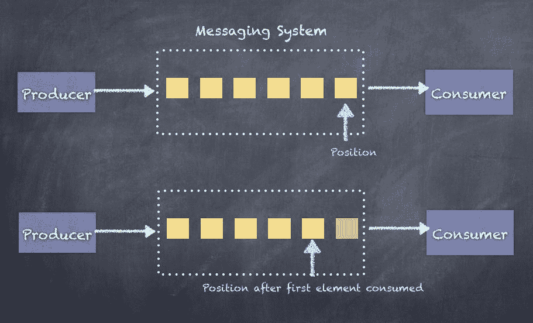

实时流数据处理可以分为以下三种基本范式：

+   至少一次处理

+   至多一次处理

+   精确一次处理

让我们来看一下这三种流处理范式对我们的业务用例意味着什么。

尽管实时事件的**精确一次处理**是我们的最终目标，但在不同场景下，始终实现这一目标非常困难。我们必须在某些情况下对精确一次处理的特性进行妥协，因为这样的保证的好处往往被实现的复杂性所抵消。

# 至少一次处理

至少一次处理范式涉及一种机制，在事件实际处理并且结果已持久化之后，**仅仅在**事件被处理后才保存最后接收到事件的位置，这样，如果发生故障并且消费者重启，消费者将重新读取旧的事件并进行处理。然而，由于无法保证接收到的事件没有被完全处理或部分处理，这会导致事件被重复获取，从而可能导致事件重复处理。这就导致了“事件至少被处理一次”的行为。

至少一次处理理想适用于任何涉及更新某些瞬时计量器或仪表来显示当前值的应用程序。任何累计总和、计数器或依赖于聚合结果准确性的应用场景（如`sum`、`groupBy`等）不适合采用这种处理方式，因为重复的事件会导致错误的结果。

消费者的操作顺序如下：

1.  保存结果

1.  保存偏移量

以下是一个示例，展示了如果发生故障并且**消费者**重启时会发生什么情况。由于事件已经处理完毕，但偏移量未保存，消费者将从之前保存的偏移量处开始读取，从而导致重复。下图中事件 0 被处理了两次：

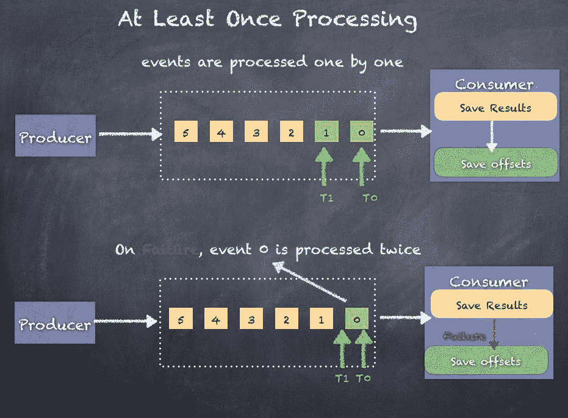

# 至多一次处理

至多一次处理范式涉及一种机制，在事件实际处理并且结果已持久化之前保存最后接收到事件的位置，这样，如果发生故障并且消费者重启，消费者将不会再尝试读取旧的事件。然而，由于无法保证接收到的事件都已处理完，这会导致潜在的事件丢失，因为这些事件再也不会被获取。这样就导致了“事件至多被处理一次或根本未被处理”的行为。

至多一次处理理想适用于任何涉及更新某些瞬时计量器或仪表来显示当前值的应用程序，以及任何累计总和、计数器或其他聚合操作，只要不要求精确度或应用程序不需要所有事件。任何丢失的事件都会导致错误的结果或缺失的结果。

消费者的操作顺序如下：

1.  保存偏移量

1.  保存结果

以下图示展示了如果发生故障且**消费者**重新启动时的情况。由于事件尚未处理，但偏移量已经保存，消费者将从保存的偏移量读取，导致事件消费出现间隙。在下图中，事件 0 从未被处理：

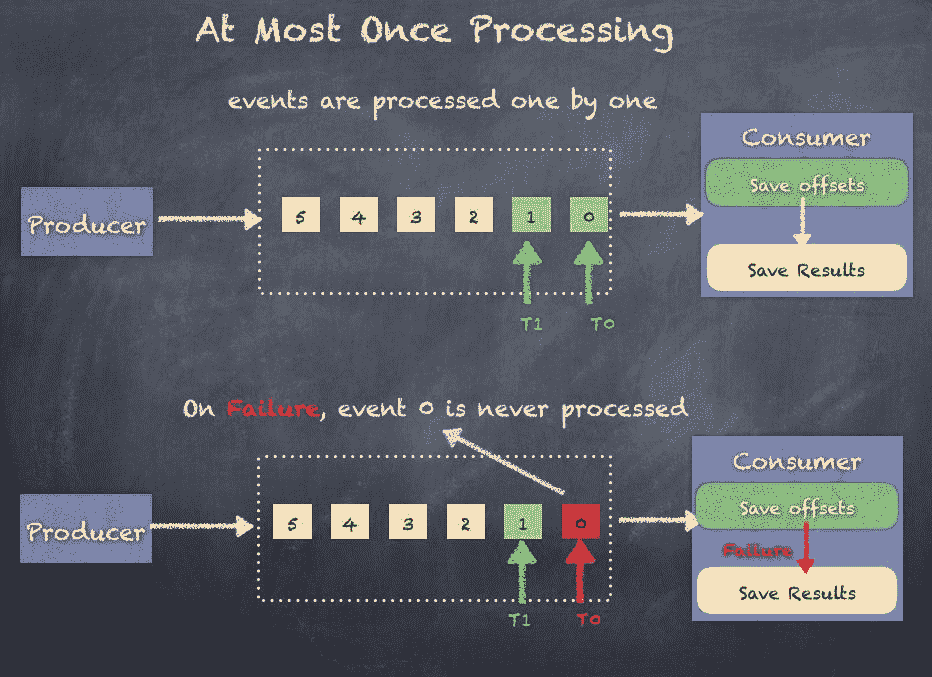

# 精确一次处理

精确一次处理范式类似于至少一次范式，涉及一种机制，只有在事件实际被处理并且结果已经持久化到某处后，才保存接收到的最后一个事件的位置。因此，如果发生故障且消费者重新启动，消费者将再次读取旧的事件并处理它们。然而，由于无法保证接收到的事件完全没有处理或仅部分处理，这可能会导致事件的潜在重复，因为它们会被再次获取。然而，与至少一次范式不同，重复的事件不会被处理，而是被丢弃，从而实现了精确一次范式。

精确一次处理范式适用于任何需要准确计数、聚合，或一般需要每个事件仅处理一次且一定要处理一次（不丢失）的应用。

消费者的操作顺序如下：

1.  保存结果

1.  保存偏移量

以下图示展示了如果发生故障且**消费者**重新启动时的情况。由于事件已经处理，但偏移量没有保存，消费者将从先前保存的偏移量读取，从而导致重复。下图中事件 0 只被处理一次，因为**消费者**丢弃了重复的事件 0：

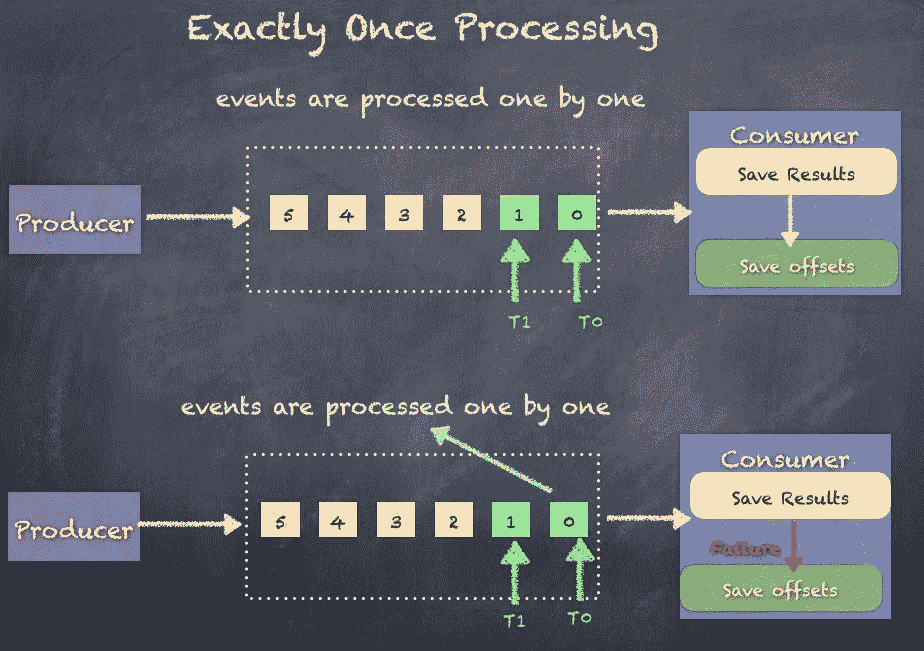

精确一次范式如何丢弃重复项？有两种技术可以帮助解决这个问题：

1.  幂等更新

1.  事务性更新

Spark Streaming 在 Spark 2.0+中也实现了结构化流处理，支持开箱即用的精确一次处理。我们将在本章稍后讨论结构化流处理。

幂等更新涉及根据某个唯一的 ID/键保存结果，以便如果有重复，生成的唯一 ID/键已经存在于结果中（例如，数据库），这样消费者就可以丢弃重复项而无需更新结果。这是复杂的，因为并非总能生成唯一的键，且生成唯一键并不总是容易的。它还需要消费者端额外的处理。另一个问题是，数据库可能会将结果和偏移量分开。

事务性更新将结果保存在批次中，批次具有事务开始和事务提交阶段，因此当提交发生时，我们知道事件已成功处理。因此，当接收到重复事件时，可以在不更新结果的情况下将其丢弃。这种技术比幂等更新复杂得多，因为现在我们需要一些事务性数据存储。另一个要点是，结果和偏移量的数据库必须相同。

您应该研究您尝试构建的用例，并查看至少一次处理或最多一次处理是否可以合理地广泛应用，并仍然能够达到可接受的性能和准确性水平。

在接下来的章节中，当我们学习 Spark Streaming，以及如何使用 Spark Streaming 和消费来自 Apache Kafka 的事件时，我们将密切关注这些范式。

# Spark Streaming

Spark Streaming 并不是第一个出现的流处理架构。多种技术随着时间的推移应运而生，以应对各种业务用例的实时处理需求。Twitter Storm 是最早的流处理技术之一，并被许多组织广泛使用，满足了许多企业的需求。

Apache Spark 配备了一个流处理库，该库已迅速发展为最广泛使用的技术。Spark Streaming 在其他技术之上具有一些明显优势，首先是 Spark Streaming API 与 Spark 核心 API 之间的紧密集成，使得构建一个同时支持实时和批量分析的平台变得可行和高效。Spark Streaming 还集成了 Spark ML 和 Spark SQL，以及 GraphX，使其成为能够服务许多独特和复杂用例的最强大的流处理技术。在本节中，我们将深入了解 Spark Streaming 的所有内容。

欲了解更多关于 Spark Streaming 的信息，请参阅 [`spark.apache.org/docs/2.1.0/streaming-programming-guide.html`](https://spark.apache.org/docs/2.1.0/streaming-programming-guide.html)。

Spark Streaming 支持多种输入源，并可以将结果写入多个输出目标。

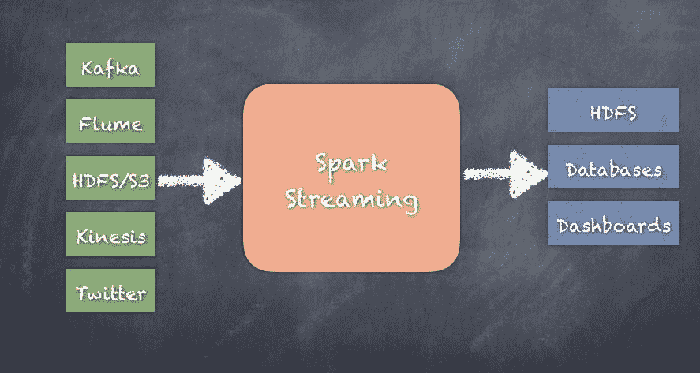

虽然 Flink、Heron（Twitter Storm 的继任者）、Samza 等都可以在收集事件时以最低的延迟处理事件，但 Spark Streaming 则会连续消耗数据流，并以微批处理的形式处理收集到的数据。微批的大小可以低至 500 毫秒，但通常不会低于此值。

Apache Apex、Gear pump、Flink、Samza、Heron 或其他即将推出的技术在某些用例中与 Spark Streaming 竞争。如果您需要真正的事件处理，则 Spark Streaming 不适合您的用例。

流处理的工作方式是根据配置定期创建事件批次，并在每个指定的时间间隔交付数据的微批处理以供进一步处理。

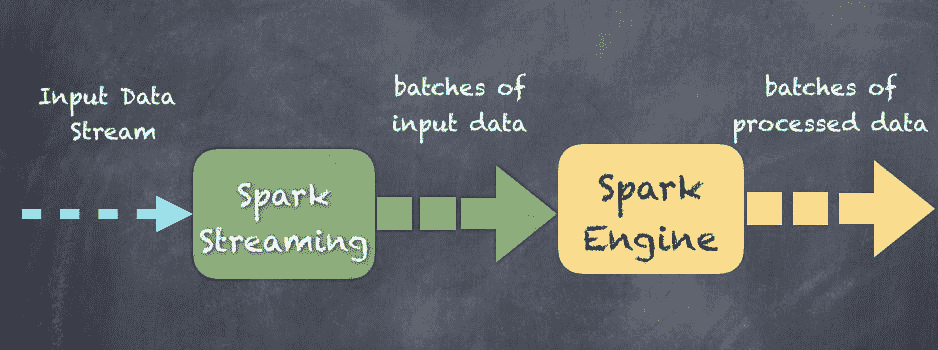

就像`SparkContext`一样，Spark Streaming 也有一个`StreamingContext`，它是流处理作业/应用的主要入口点。`StreamingContext`依赖于`SparkContext`。实际上，`SparkContext`可以直接用于流处理作业中。`StreamingContext`与`SparkContext`相似，不同之处在于，`StreamingContext`还要求程序指定批处理时间间隔或持续时间，单位可以是毫秒或分钟。

记住，`SparkContext`是主要的入口点，任务调度和资源管理是`SparkContext`的一部分，因此`StreamingContext`复用了这部分逻辑。

# StreamingContext

`StreamingContext`是流处理的主要入口点，负责流处理应用的各个方面，包括检查点、转换和对 DStreams 的 RDD 操作。

# 创建 StreamingContext

新的 StreamingContext 可以通过两种方式创建：

1.  使用现有的`SparkContext`创建一个`StreamingContext`，如下所示：

```py
 StreamingContext(sparkContext: SparkContext, batchDuration: Duration) scala> val ssc = new StreamingContext(sc, Seconds(10))

```

1.  通过提供新`SparkContext`所需的配置来创建一个`StreamingContext`，如下所示：

```py
 StreamingContext(conf: SparkConf, batchDuration: Duration) scala> val conf = new SparkConf().setMaster("local[1]")
                                       .setAppName("TextStreams")
      scala> val ssc = new StreamingContext(conf, Seconds(10))

```

1.  第三种方法是使用`getOrCreate()`，它用于从检查点数据重新创建一个`StreamingContext`，或者创建一个新的`StreamingContext`。如果在提供的`checkpointPath`中存在检查点数据，`StreamingContext`将从该检查点数据重新创建。如果数据不存在，则通过调用提供的`creatingFunc`来创建`StreamingContext`：

```py
        def getOrCreate(
          checkpointPath: String,
          creatingFunc: () => StreamingContext,
          hadoopConf: Configuration = SparkHadoopUtil.get.conf,
          createOnError: Boolean = false
        ): StreamingContext

```

# 启动 StreamingContext

`start()`方法启动使用`StreamingContext`定义的流的执行。它实际上启动了整个流处理应用：

```py
def start(): Unit 

scala> ssc.start()

```

# 停止 StreamingContext

停止`StreamingContext`会停止所有处理，你需要重新创建一个新的`StreamingContext`并调用`start()`来重新启动应用。以下是两个用于停止流处理应用的 API。

立即停止流的执行（不等待所有接收的数据被处理）：

```py
def stop(stopSparkContext: Boolean) scala> ssc.stop(false)

```

停止流的执行，并确保所有接收的数据都已经被处理：

```py
def stop(stopSparkContext: Boolean, stopGracefully: Boolean) scala> ssc.stop(true, true)

```

# 输入流

有几种类型的输入流，例如`receiverStream`和`fileStream`，可以使用`StreamingContext`创建，具体内容见以下小节：

# receiverStream

创建一个输入流，并使用任何自定义的用户实现接收器。它可以根据使用案例进行定制。

详情请访问[`spark.apache.org/docs/latest/streaming-custom-receivers.html`](http://spark.apache.org/docs/latest/streaming-custom-receivers.html)。

以下是`receiverStream`的 API 声明：

```py
 def receiverStreamT: ClassTag: ReceiverInputDStream[T]

```

# socketTextStream

这将从 TCP 源`hostname:port`创建一个输入流。数据通过 TCP 套接字接收，接收到的字节将被解释为 UTF8 编码的`\n`分隔行：

```py
def socketTextStream(hostname: String, port: Int,
 storageLevel: StorageLevel = StorageLevel.MEMORY_AND_DISK_SER_2):
    ReceiverInputDStream[String]

```

# rawSocketStream

创建一个输入流，从网络源`hostname:port`接收数据，数据以序列化块的形式接收（使用 Spark 的序列化器进行序列化），这些数据可以在不反序列化的情况下直接推送到块管理器中。这是最高效的方式。

接收数据的方式。

```py
def rawSocketStreamT: ClassTag:
    ReceiverInputDStream[T]

```

# fileStream

创建一个输入流，监控一个与 Hadoop 兼容的文件系统，监听新文件并使用给定的键值类型和输入格式读取它们。文件必须通过从同一文件系统中的其他位置移动到监控的目录来写入。以`.`开头的文件名将被忽略，因此这对于被移动到监控目录中的文件名来说是一个明显的选择。通过使用原子文件重命名函数调用，可以将以`.`开头的文件名重命名为一个实际可用的文件名，从而使`fileStream`能够接管并处理文件内容：

```py
def fileStream[K: ClassTag, V: ClassTag, F <: NewInputFormat[K, V]: ClassTag] (directory: String): InputDStream[(K, V)]

```

# textFileStream

创建一个输入流，监控一个与 Hadoop 兼容的文件系统，监听新文件并将它们作为文本文件读取（使用`LongWritable`作为键，Text 作为值，输入格式为`TextInputFormat`）。文件必须通过从同一文件系统中的其他位置移动到监控的目录来写入。以`.`开头的文件名将被忽略：

```py
def textFileStream(directory: String): DStream[String]

```

# binaryRecordsStream

创建一个输入流，监控一个与 Hadoop 兼容的文件系统，监听新文件并将它们作为平面二进制文件读取，假设每个记录的长度是固定的，并为每个记录生成一个字节数组。文件必须通过从同一文件系统中的其他位置移动到监控的目录来写入。以`.`开头的文件名将被忽略：

```py
def binaryRecordsStream(directory: String, recordLength: Int): DStream[Array[Byte]]

```

# queueStream

创建一个从 RDD 队列读取的输入流。在每个批次中，它将处理队列返回的一个或所有 RDD：

```py
def queueStreamT: ClassTag: InputDStream[T]

```

# textFileStream 示例

以下展示了一个简单的 Spark Streaming 示例，使用`textFileStream`。在这个例子中，我们从 spark-shell 的`SparkContext`（`sc`）和一个 10 秒的时间间隔创建一个`StreamingContext`。这将启动`textFileStream`，该流监控名为**streamfiles**的目录，并处理目录中找到的任何新文件。在这个例子中，我们仅仅打印出 RDD 中元素的数量：

```py
scala> import org.apache.spark._
scala> import org.apache.spark.streaming._

scala> val ssc = new StreamingContext(sc, Seconds(10))

scala> val filestream = ssc.textFileStream("streamfiles")

scala> filestream.foreachRDD(rdd => {println(rdd.count())})

scala> ssc.start

```

# twitterStream 示例

让我们看看另一个如何使用 Spark Streaming 处理 Twitter 推文的例子：

1.  首先，打开一个终端并将目录更改为` spark-2.1.1-bin-hadoop2.7`。

1.  在` spark-2.1.1-bin-hadoop2.7`文件夹下创建一个`streamouts`文件夹，其中安装了 Spark。当应用程序运行时，`streamouts`文件夹将收集推文并保存为文本文件。

1.  下载以下的 JAR 文件到目录中：

    +   [`central.maven.org/maven2/org/apache/bahir/spark-streaming-twitter_2.11/2.1.0/spark-streaming-twitter_2.11-2.1.0.jar`](http://central.maven.org/maven2/org/apache/bahir/spark-streaming-twitter_2.11/2.1.0/spark-streaming-twitter_2.11-2.1.0.jar)

    +   [`central.maven.org/maven2/org/twitter4j/twitter4j-core/4.0.6/twitter4j-core-4.0.6.jar`](http://central.maven.org/maven2/org/twitter4j/twitter4j-core/4.0.6/twitter4j-core-4.0.6.jar)

    +   [`central.maven.org/maven2/org/twitter4j/twitter4j-stream/4.0.6/twitter4j-stream-4.0.6.jar`](http://central.maven.org/maven2/org/twitter4j/twitter4j-stream/4.0.6/twitter4j-stream-4.0.6.jar)

1.  使用指定的 Twitter 集成所需的 jars 启动 spark-shell：

```py
 ./bin/spark-shell --jars twitter4j-stream-4.0.6.jar,
                               twitter4j-core-4.0.6.jar,
                               spark-streaming-twitter_2.11-2.1.0.jar

```

1.  现在，我们可以编写一个示例代码。以下是用于测试 Twitter 事件处理的代码：

```py
        import org.apache.spark._
        import org.apache.spark.streaming._
        import org.apache.spark.streaming.Twitter._
        import twitter4j.auth.OAuthAuthorization
        import twitter4j.conf.ConfigurationBuilder

        //you can replace the next 4 settings with your own Twitter
              account settings.
        System.setProperty("twitter4j.oauth.consumerKey",
                           "8wVysSpBc0LGzbwKMRh8hldSm") 
        System.setProperty("twitter4j.oauth.consumerSecret",
                  "FpV5MUDWliR6sInqIYIdkKMQEKaAUHdGJkEb4MVhDkh7dXtXPZ") 
        System.setProperty("twitter4j.oauth.accessToken",
                  "817207925756358656-yR0JR92VBdA2rBbgJaF7PYREbiV8VZq") 
        System.setProperty("twitter4j.oauth.accessTokenSecret",
                  "JsiVkUItwWCGyOLQEtnRpEhbXyZS9jNSzcMtycn68aBaS")

        val ssc = new StreamingContext(sc, Seconds(10))

        val twitterStream = TwitterUtils.createStream(ssc, None)

        twitterStream.saveAsTextFiles("streamouts/tweets", "txt")
        ssc.start()

        //wait for 30 seconds

        ss.stop(false)

```

你会看到 `streamouts` 文件夹中包含几个以文本文件形式输出的 `tweets`。现在可以打开 `streamouts` 目录，并检查文件是否包含 `tweets`。

# 离散化流

Spark Streaming 基于一个叫做 **离散化流（Discretized Streams）** 的抽象，简称 **DStreams**。DStream 表示为一系列 RDD，每个 RDD 在每个时间间隔内创建。DStream 可以像常规 RDD 一样使用类似的概念（如基于有向无环图的执行计划）进行处理。与常规 RDD 处理类似，执行计划中的转换操作和行动操作也会用于 DStream。

DStream 本质上是将源源不断的数据流基于时间间隔划分为较小的块，称为微批次（micro-batches），并将每个微批次物化为一个 RDD，然后可以像常规 RDD 一样进行处理。每个微批次独立处理，并且不同微批次之间不会维护状态，因此其处理方式本质上是无状态的。假设批次间隔是 5 秒，那么在事件消费的同时，每隔 5 秒就会创建一个微批次，并将该微批次作为 RDD 交给后续处理。Spark Streaming 的主要优势之一是，用于处理微批次事件的 API 调用与 Spark API 紧密集成，从而实现与架构其他部分的无缝集成。当创建微批次时，它会被转化为一个 RDD，使得使用 Spark API 进行处理成为一个无缝的过程。

`DStream` 类在源代码中的样子如下，展示了最重要的变量，一个 `HashMap[Time, RDD]` 对：

```py
class DStream[T: ClassTag] (var ssc: StreamingContext)

//hashmap of RDDs in the DStream
var generatedRDDs = new HashMap[Time, RDD[T]]()

```

以下是一个 DStream 的示例，展示了每 **T** 秒创建的 RDD：

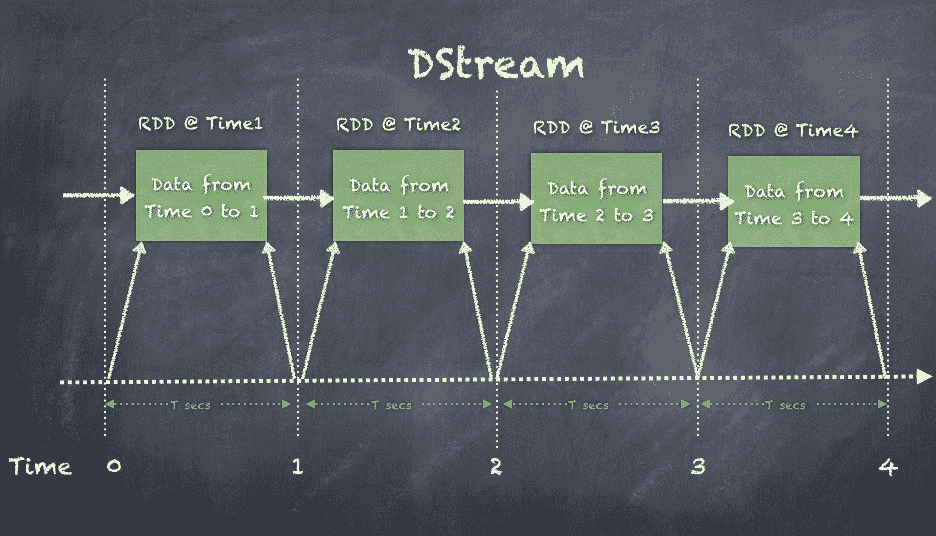

在以下示例中，创建一个流上下文，每 5 秒创建一个微批次，并创建一个 RDD，这与 Spark 核心 API 中的 RDD 类似。DStream 中的 RDD 可以像任何其他 RDD 一样进行处理。

构建流处理应用程序的步骤如下：

1.  从 `SparkContext` 创建一个 `StreamingContext`。

1.  从 `StreamingContext` 创建一个 `DStream`。

1.  提供可以应用于每个 RDD 的转换和行动操作。

1.  最后，通过调用`StreamingContext`上的`start()`启动流式应用程序。这将启动整个消费和处理实时事件的过程。

一旦 Spark Streaming 应用程序启动，就无法再添加更多操作。已停止的上下文无法重新启动，如果有此需求，必须创建一个新的流式上下文。

以下是如何创建一个简单的流式作业来访问 Twitter 的示例：

1.  从`SparkContext`创建一个`StreamingContext`：

```py
 scala> val ssc = new StreamingContext(sc, Seconds(5))
      ssc: org.apache.spark.streaming.StreamingContext = 
 org.apache.spark.streaming.StreamingContext@8ea5756

```

1.  从`StreamingContext`创建一个`DStream`：

```py
 scala> val twitterStream = TwitterUtils.createStream(ssc, None)
      twitterStream: org.apache.spark.streaming.dstream
 .ReceiverInputDStream[twitter4j.Status] = 
 org.apache.spark.streaming.Twitter.TwitterInputDStream@46219d14

```

1.  提供可以应用于每个 RDD 的转换和操作：

```py
 val aggStream = twitterStream
 .flatMap(x => x.getText.split(" ")).filter(_.startsWith("#"))
 .map(x => (x, 1))
 .reduceByKey(_ + _)

```

1.  最后，通过调用`StreamingContext`上的`start()`启动流式应用程序。这将启动整个消费和处理实时事件的过程：

```py
 ssc.start()      //to stop just call stop on the StreamingContext
 ssc.stop(false)

```

1.  创建了一个类型为`ReceiverInputDStream`的`DStream`，它被定义为一个抽象类，用于定义任何需要在工作节点上启动接收器以接收外部数据的`InputDStream`。在这里，我们从 Twitter 流中接收数据：

```py
        class InputDStreamT: ClassTag extends
                                        DStreamT

        class ReceiverInputDStreamT: ClassTag
                                  extends InputDStreamT

```

1.  如果在`twitterStream`上运行`flatMap()`转换，您将获得一个`FlatMappedDStream`，如下所示：

```py
 scala> val wordStream = twitterStream.flatMap(x => x.getText()
                                                          .split(" "))
      wordStream: org.apache.spark.streaming.dstream.DStream[String] = 
 org.apache.spark.streaming.dstream.FlatMappedDStream@1ed2dbd5

```

# 转换

对`DStream`的转换类似于适用于 Spark 核心 RDD 的转换。由于 DStream 由 RDD 组成，转换也适用于每个 RDD，以生成转换后的 RDD，然后创建一个转换后的 DStream。每个转换都会创建一个特定的`DStream`派生类。

以下图表展示了`DStream`类的层次结构，从父类`DStream`开始。我们还可以看到从父类继承的不同类：

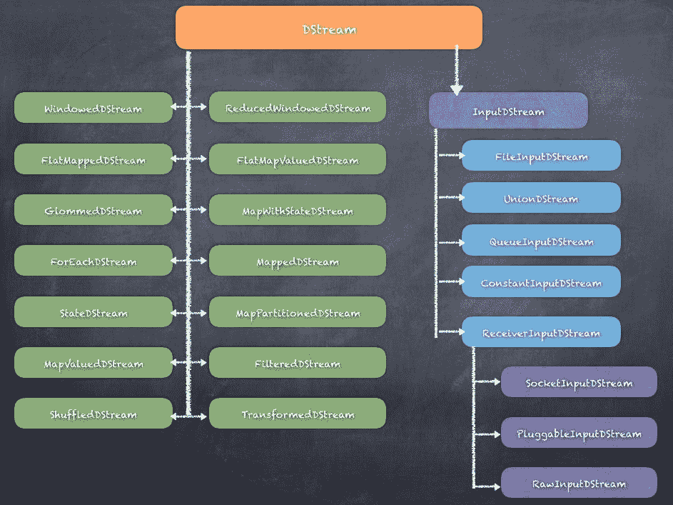

有很多`DStream`类是专门为此功能构建的。Map 转换、窗口函数、reduce 操作和不同类型的输入流都是通过不同的`DStream`派生类实现的。

以下是一个关于基础 DStream 的转换示例，用于生成一个过滤后的 DStream。类似地，任何转换都可以应用于 DStream：

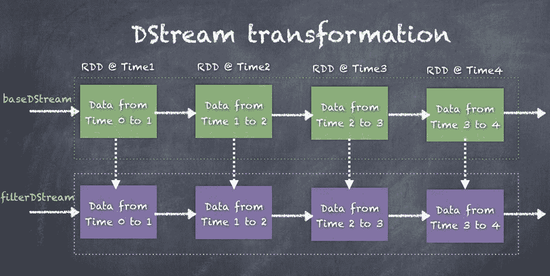

请参考下表了解可能的转换类型。

| 转换 | 含义 |
| --- | --- |
| `map(func)` | 这将转换函数应用于 DStream 的每个元素，并返回一个新的 DStream。 |
| `flatMap(func)` | 这类似于 map；然而，就像 RDD 的`flatMap`与 map 的区别，使用`flatMap`操作每个元素，并应用`flatMap`，每个输入生成多个输出项。 |
| `filter(func)` | 这会过滤掉 DStream 中的记录，返回一个新的 DStream。 |
| `repartition(numPartitions)` | 这会创建更多或更少的分区，以重新分配数据，从而改变并行度。 |
| `union(otherStream)` | 这会将两个源 DStream 中的元素合并，并返回一个新的 DStream。 |
| `count()` | 这通过计算源 DStream 中每个 RDD 的元素数量来返回一个新的 DStream。 |
| `reduce(func)` | 这通过对源 DStream 的每个元素应用`reduce`函数，返回一个新的 DStream。 |
| `countByValue()` | 这计算每个键的频率，并返回一个新的 DStream，其中的元素是(key, long)对。 |
| `reduceByKey(func, [numTasks])` | 这通过在源 DStream 的 RDD 上按键聚合数据，并返回一个新的 DStream，其中的元素是（键，值）对。 |
| `join(otherStream, [numTasks])` | 这将两个 DStream 的*(K, V)*和*(K, W)*对连接在一起，并返回一个新的 DStream，它的元素是*(K, (V, W))*对，合并了两个 DStream 中的值。 |
| `cogroup(otherStream, [numTasks])` | 当在*(K, V)*和*(K, W)*对的 DStream 上调用`cogroup()`时，它将返回一个新的 DStream，其中的元素是*(K, Seq[V], Seq[W])*元组。 |
| `transform(func)` | 这在源 DStream 的每个 RDD 上应用一个转换函数，并返回一个新的 DStream。 |
| `updateStateByKey(func)` | 这通过在每个键的先前状态和该键的新值上应用给定的函数，更新每个键的状态。通常用于维持一个状态机。 |

# 窗口操作

Spark Streaming 提供了窗口处理功能，允许你在滑动窗口中的事件上应用转换。滑动窗口是在指定的间隔上创建的。每当窗口滑过一个源 DStream 时，符合窗口规范的源 RDD 会被合并并进行操作，生成窗口化的 DStream。窗口有两个参数需要指定：

+   **窗口长度：这是指定的窗口考虑的时间间隔长度**

+   滑动间隔：这是窗口创建的间隔。

窗口长度和滑动间隔必须都是块间隔的倍数。

下面展示了一个示意图，显示了一个 DStream 的滑动窗口操作，演示了旧窗口（虚线矩形）如何滑动一个间隔到右边，进入新的窗口（实线矩形）：

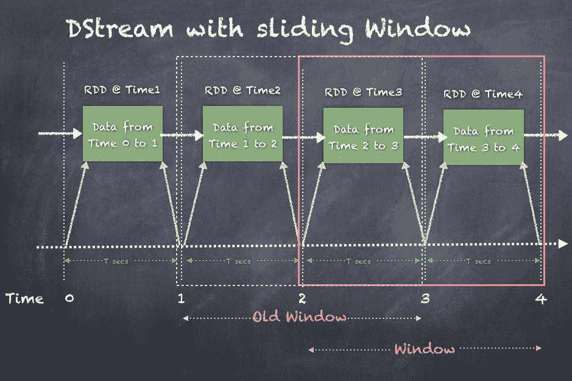

一些常见的窗口操作如下。

| 转换 | 含义 |
| --- | --- |
| `window(windowLength, slideInterval)` | 这在源 DStream 上创建一个窗口，并返回相同的 DStream 作为新的 DStream。 |
| `countByWindow(windowLength, slideInterval)` | 这通过应用滑动窗口返回 DStream 中元素的计数。 |
| `reduceByWindow(func, windowLength, slideInterval)` | 这通过在源 DStream 的每个元素上应用 reduce 函数，并在创建一个长度为`windowLength`的滑动窗口后，返回一个新的 DStream。 |
| `reduceByKeyAndWindow(func, windowLength, slideInterval, [numTasks])` | 这通过在源 DStream 的 RDD 上应用窗口进行按键聚合，并返回一个新的 DStream，其中的元素是（键，值）对。计算由`func`函数提供。 |
| `reduceByKeyAndWindow(func, invFunc, windowLength, slideInterval, [numTasks])` | 该函数通过键对源 DStream 的 RDD 进行窗口聚合，并返回一个新的包含（键，值）对的 DStream。与前面的函数的主要区别在于`invFunc`，它提供了在滑动窗口开始时需要执行的计算。 |
| `countByValueAndWindow(windowLength, slideInterval, [numTasks])` | 该函数计算每个键的频率，并返回一个新的包含（键，长整型）对的 DStream，该 DStream 符合指定的滑动窗口。 |

让我们更详细地看一下 Twitter 流的示例。我们的目标是每 5 秒打印推文中使用的前五个单词，使用一个长度为 15 秒、每 10 秒滑动一次的窗口。因此，我们可以在 15 秒内获取前五个单词。

要运行此代码，请按照以下步骤操作：

1.  首先，打开终端并切换到`spark-2.1.1-bin-hadoop2.7`目录。

1.  在`spark-2.1.1-bin-hadoop2.7`文件夹下创建一个`streamouts`文件夹，该文件夹是你安装 spark 的地方。当应用程序运行时，`streamouts`文件夹将收集推文并保存为文本文件。

1.  将以下 jar 下载到目录中：

    +   [`central.maven.org/maven2/org/apache/bahir/spark-streaming-twitter_2.11/2.1.0/spark-streaming-twitter_2.11-2.1.0.jar`](http://central.maven.org/maven2/org/apache/bahir/spark-streaming-twitter_2.11/2.1.0/spark-streaming-twitter_2.11-2.1.0.jar)

    +   [`central.maven.org/maven2/org/twitter4j/twitter4j-core/4.0.6/twitter4j-core-4.0.6.jar`](http://central.maven.org/maven2/org/twitter4j/twitter4j-core/4.0.6/twitter4j-core-4.0.6.jar)

    +   [`central.maven.org/maven2/org/twitter4j/twitter4j-stream/4.0.6/twitter4j-stream-4.0.6.jar`](http://central.maven.org/maven2/org/twitter4j/twitter4j-stream/4.0.6/twitter4j-stream-4.0.6.jar)

1.  使用指定所需 Twitter 集成的 jar 启动 spark-shell：

```py
 ./bin/spark-shell --jars twitter4j-stream-4.0.6.jar,
                               twitter4j-core-4.0.6.jar,
                               spark-streaming-twitter_2.11-2.1.0.jar

```

1.  现在，我们可以编写代码。下面是用于测试 Twitter 事件处理的代码：

```py
        import org.apache.log4j.Logger
        import org.apache.log4j.Level
        Logger.getLogger("org").setLevel(Level.OFF)

       import java.util.Date
       import org.apache.spark._
       import org.apache.spark.streaming._
       import org.apache.spark.streaming.Twitter._
       import twitter4j.auth.OAuthAuthorization
       import twitter4j.conf.ConfigurationBuilder

       System.setProperty("twitter4j.oauth.consumerKey",
                          "8wVysSpBc0LGzbwKMRh8hldSm")
       System.setProperty("twitter4j.oauth.consumerSecret",
                  "FpV5MUDWliR6sInqIYIdkKMQEKaAUHdGJkEb4MVhDkh7dXtXPZ")
       System.setProperty("twitter4j.oauth.accessToken",
                  "817207925756358656-yR0JR92VBdA2rBbgJaF7PYREbiV8VZq")
       System.setProperty("twitter4j.oauth.accessTokenSecret",
                  "JsiVkUItwWCGyOLQEtnRpEhbXyZS9jNSzcMtycn68aBaS")

       val ssc = new StreamingContext(sc, Seconds(5))

       val twitterStream = TwitterUtils.createStream(ssc, None)

       val aggStream = twitterStream
             .flatMap(x => x.getText.split(" "))
             .filter(_.startsWith("#"))
             .map(x => (x, 1))
             .reduceByKeyAndWindow(_ + _, _ - _, Seconds(15),
                                   Seconds(10), 5)

       ssc.checkpoint("checkpoints")
       aggStream.checkpoint(Seconds(10))

       aggStream.foreachRDD((rdd, time) => {
         val count = rdd.count()

         if (count > 0) {
           val dt = new Date(time.milliseconds)
           println(s"\n\n$dt rddCount = $count\nTop 5 words\n")
           val top5 = rdd.sortBy(_._2, ascending = false).take(5)
           top5.foreach {
             case (word, count) =>
             println(s"[$word] - $count")
           }
         }
       })

       ssc.start

       //wait 60 seconds
       ss.stop(false)

```

1.  输出每 15 秒显示在控制台上，输出结果类似如下：

```py
 Mon May 29 02:44:50 EDT 2017 rddCount = 1453
 Top 5 words

 [#RT] - 64
 [#de] - 24
 [#a] - 15
 [#to] - 15
 [#the] - 13

 Mon May 29 02:45:00 EDT 2017 rddCount = 3312
 Top 5 words

 [#RT] - 161
 [#df] - 47
 [#a] - 35
 [#the] - 29
 [#to] - 29

```

# 有状态/无状态转换

如前所述，Spark Streaming 使用 DStream 的概念，DStream 本质上是以 RDD 形式创建的数据微批次。我们还看到了 DStream 上可能进行的转换类型。DStream 的转换可以分为两种类型：**无状态转换**和**有状态转换**。

在无状态转换中，每个数据微批的处理不依赖于先前批次的数据。因此，这是一种无状态转换，每个批次独立处理，而不依赖于之前发生的任何事情。

在有状态转换中，每个微批数据的处理都完全或部分依赖于之前的数据批次。因此，这是一个有状态转换，每个批次在计算当前批次数据时都会考虑之前发生的事情，并利用这些信息。

# 无状态转换

无状态转换通过对 DStream 中的每个 RDD 应用转换，将一个 DStream 转换为另一个 DStream。像`map()`、`flatMap()`、`union()`、`join()`和`reduceByKey`等转换都属于无状态转换的例子。

以下是一个插图，展示了对`inputDStream`进行`map()`转换以生成新的`mapDstream`：

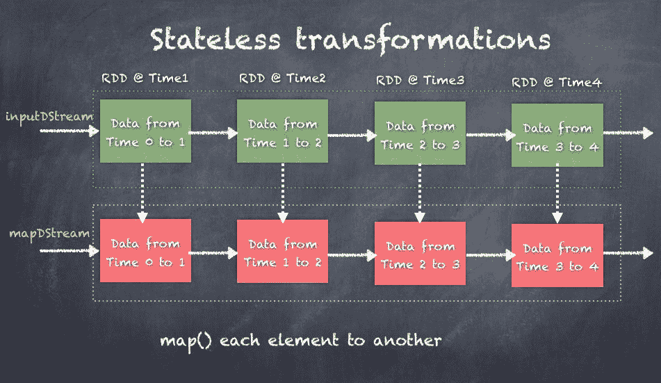

# 有状态转换

有状态转换操作一个 DStream，但计算依赖于处理的前一状态。像`countByValueAndWindow`、`reduceByKeyAndWindow`、`mapWithState`和`updateStateByKey`等操作都是有状态转换的例子。事实上，所有基于窗口的转换都是有状态的，因为根据窗口操作的定义，我们需要跟踪 DStream 的窗口长度和滑动间隔。

# 检查点

实时流式应用程序旨在长时间运行，并能够容忍各种故障。Spark Streaming 实现了一种检查点机制，能够保留足够的信息，以便在发生故障时进行恢复。

需要进行检查点的数据有两种类型：

+   元数据检查点

+   数据检查点

可以通过在`StreamingContext`上调用`checkpoint()`函数来启用检查点功能，如下所示：

```py
def checkpoint(directory: String)

```

指定检查点数据将可靠存储的目录。

请注意，这必须是容错的文件系统，如 HDFS。

一旦设置了检查点目录，任何 DStream 都可以根据指定的间隔将数据检查到该目录中。以 Twitter 示例为例，我们可以每 10 秒将每个 DStream 检查到`checkpoints`目录中：

```py
val ssc = new StreamingContext(sc, Seconds(5))

val twitterStream = TwitterUtils.createStream(ssc, None)

val wordStream = twitterStream.flatMap(x => x.getText().split(" "))

val aggStream = twitterStream
 .flatMap(x => x.getText.split(" ")).filter(_.startsWith("#"))
 .map(x => (x, 1))
 .reduceByKeyAndWindow(_ + _, _ - _, Seconds(15), Seconds(10), 5)

ssc.checkpoint("checkpoints")

aggStream.checkpoint(Seconds(10))

wordStream.checkpoint(Seconds(10))

```

`checkpoints`目录在几秒钟后看起来像下面这样，显示了元数据以及 RDD 和`logfiles`作为检查点的一部分：

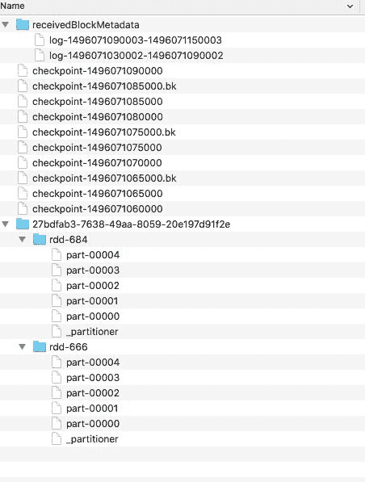

# 元数据检查点

**元数据检查点**保存定义流式操作的信息，这些操作由**有向无环图**（**DAG**）表示，并将其保存到 HDFS 中。这些信息可以在发生故障并重新启动应用程序时用于恢复 DAG。驱动程序会重新启动并从 HDFS 读取元数据，重建 DAG 并恢复崩溃前的所有操作状态。

元数据包括以下内容：

+   **配置**：用于创建流式应用程序的配置

+   **DStream 操作**：定义流式应用程序的 DStream 操作集

+   **不完整批次**：排队中的作业但尚未完成的批次

# 数据检查点

数据检查点将实际的 RDD 保存到 HDFS 中，这样，如果流应用程序发生故障，应用程序可以恢复检查点的 RDD 并从上次中断的地方继续。虽然流应用程序恢复是数据检查点的一个典型应用场景，但检查点也有助于在某些 RDD 因缓存清理或执行器丢失而丢失时，通过实例化生成的 RDD 而无需等待所有父 RDD 在 DAG（有向无环图）中重新计算，从而实现更好的性能。

对于具有以下任何要求的应用程序，必须启用检查点：

+   **有状态转换的使用**：如果应用程序中使用了`updateStateByKey`或`reduceByKeyAndWindow`（带有逆向函数），则必须提供检查点目录，以允许周期性地进行 RDD 检查点。

+   **从驱动程序故障中恢复**：元数据检查点用于通过进度信息进行恢复。

如果您的流应用程序没有使用有状态转换，那么可以在不启用检查点的情况下运行该应用程序。

您的流应用程序可能会丢失接收到但尚未处理的数据。

请注意，RDD 的检查点会产生将每个 RDD 保存到存储中的成本。这可能导致检查点化的 RDD 所在的批次处理时间增加。因此，必须小心设置检查点的间隔，以避免引发性能问题。在非常小的批次（例如 1 秒）下，检查点每个微小批次的频率过高，可能会显著降低操作吞吐量。相反，检查点的频率过低会导致血统和任务大小增长，这可能会引起处理延迟，因为需要持久化的数据量较大。

对于需要 RDD 检查点的有状态转换，默认间隔是批处理间隔的倍数，至少为 10 秒。

DStream 的 5 到 10 个滑动间隔的检查点间隔是一个良好的初始设置。

# 驱动程序故障恢复

驱动程序故障恢复可以通过使用`StreamingContext.getOrCreate()`来实现，该方法可以从现有的检查点初始化`StreamingContext`或创建一个新的`StreamingContext`。

启动流应用程序时需要满足以下两个条件：

+   当程序第一次启动时，需要创建一个新的`StreamingContext`，设置所有的流，然后调用`start()`。

+   当程序在失败后重新启动时，需要从检查点目录中的检查点数据初始化一个`StreamingContext`，然后调用`start()`。

我们将实现一个函数 `createStreamContext()`，该函数创建 `StreamingContext` 并设置各种 DStreams 来解析推文，并使用窗口每 15 秒生成前五个推文标签。但是，我们不会调用 `createStreamContext()` 然后调用 `ssc.start()`，而是会调用 `getOrCreate()`，这样如果 `checkpointDirectory` 存在，则将从检查点数据重新创建上下文。如果目录不存在（应用程序首次运行），则将调用 `createStreamContext()` 来创建新的上下文并设置 DStreams：

```py
val ssc = StreamingContext.getOrCreate(checkpointDirectory,
                                       createStreamContext _)

```

下面显示的代码显示了函数定义以及如何调用 `getOrCreate()`：

```py
val checkpointDirectory = "checkpoints"

// Function to create and setup a new StreamingContext
def createStreamContext(): StreamingContext = {
  val ssc = new StreamingContext(sc, Seconds(5))

  val twitterStream = TwitterUtils.createStream(ssc, None)

  val wordStream = twitterStream.flatMap(x => x.getText().split(" "))

  val aggStream = twitterStream
    .flatMap(x => x.getText.split(" ")).filter(_.startsWith("#"))
    .map(x => (x, 1))
    .reduceByKeyAndWindow(_ + _, _ - _, Seconds(15), Seconds(10), 5)

  ssc.checkpoint(checkpointDirectory)

  aggStream.checkpoint(Seconds(10))

  wordStream.checkpoint(Seconds(10))

  aggStream.foreachRDD((rdd, time) => {
    val count = rdd.count()

    if (count > 0) {
      val dt = new Date(time.milliseconds)
      println(s"\n\n$dt rddCount = $count\nTop 5 words\n")
      val top10 = rdd.sortBy(_._2, ascending = false).take(5)
      top10.foreach {
        case (word, count) => println(s"[$word] - $count")
      }
    }
  })
  ssc
}

// Get StreamingContext from checkpoint data or create a new one
val ssc = StreamingContext.getOrCreate(checkpointDirectory, createStreamContext _)

```

# 与流处理平台（Apache Kafka）的互操作性

Spark Streaming 与 Apache Kafka 集成非常好，后者是目前最流行的消息平台。Kafka 集成有多种方法，并且随着时间的推移机制已经演变，以提高性能和可靠性。

有三种主要方法可以将 Spark Streaming 与 Kafka 集成：

+   基于接收器的方法

+   直接流处理方法

+   结构化流处理

# 基于接收器的方法

基于接收器的方法是 Spark 和 Kafka 之间的第一个集成方法。在此方法中，驱动程序在执行器上启动接收器，使用高级 API 从 Kafka brokers 拉取数据。由于接收器从 Kafka brokers 拉取事件，接收器会将偏移量更新到 Zookeeper 中，这也被 Kafka 集群使用。关键之处在于使用 **WAL**（**Write Ahead Log**），接收器在消费 Kafka 数据时持续写入 WAL。因此，当存在问题并且执行器或接收器丢失或重启时，可以使用 WAL 恢复事件并处理它们。因此，这种基于日志的设计提供了持久性和一致性。

每个接收器都会创建一个来自 Kafka 主题的输入 DStream，并查询 Zookeeper 获取 Kafka 主题、brokers、偏移量等信息。在此之后，我们之前讨论的 DStreams 将发挥作用。

长时间运行的接收器使得并行性复杂化，因为随着应用程序的扩展，工作负载不会被正确分配。依赖于 HDFS 也是一个问题，还有写操作的重复。至于处理的幂等性所需的可靠性，只有幂等方法才能起作用。基于接收器的方法之所以无法使用事务方法，是因为无法从 HDFS 位置或 Zookeeper 访问偏移范围。

基于接收器的方法适用于任何消息系统，因此更通用。

您可以通过调用 `createStream()` API 来创建基于接收器的流，如下所示：

```py
def createStream(
 ssc: StreamingContext, // StreamingContext object
 zkQuorum: String, //Zookeeper quorum (hostname:port,hostname:port,..)
 groupId: String, //The group id for this consumer
 topics: Map[String, Int], //Map of (topic_name to numPartitions) to
                  consume. Each partition is consumed in its own thread
 storageLevel: StorageLevel = StorageLevel.MEMORY_AND_DISK_SER_2 
  Storage level to use for storing the received objects
  (default: StorageLevel.MEMORY_AND_DISK_SER_2)
): ReceiverInputDStream[(String, String)] //DStream of (Kafka message key, Kafka message value)

```

以下显示了一个示例，展示了如何创建一个从 Kafka brokers 拉取消息的基于接收器的流：

```py
val topicMap = topics.split(",").map((_, numThreads.toInt)).toMap
val lines = KafkaUtils.createStream(ssc, zkQuorum, group,
                                    topicMap).map(_._2)

```

下图展示了驱动程序如何在执行器上启动接收器，通过高级 API 从 Kafka 拉取数据。接收器从 Kafka Zookeeper 集群中拉取主题偏移范围，然后在从代理拉取事件时更新 Zookeeper：

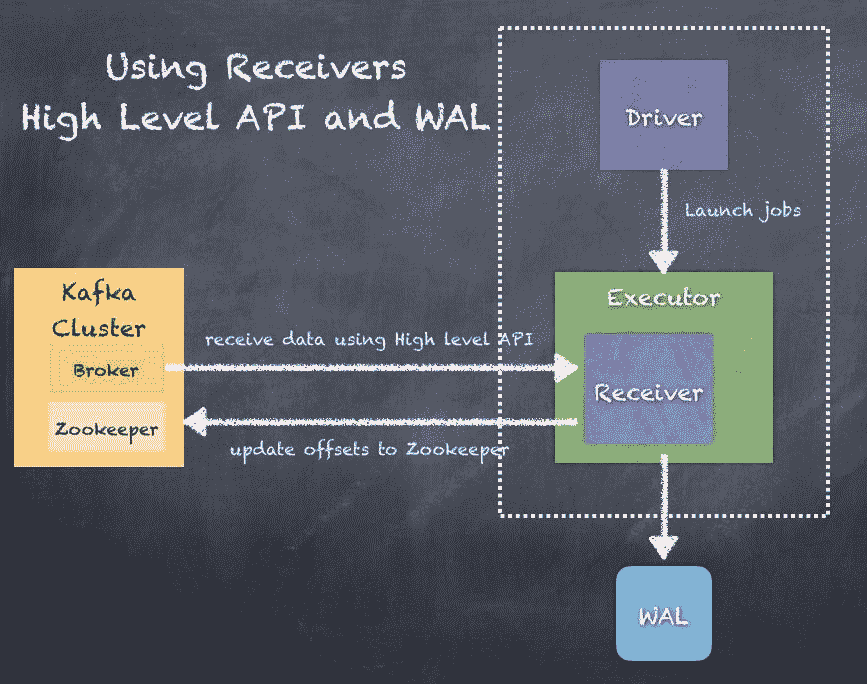

# 直接流

基于直接流的方法是相较于 Kafka 集成的新方法，它通过驱动程序直接连接到代理并拉取事件。关键点在于，使用直接流 API 时，Spark 任务与 Kafka 主题/分区之间是 1:1 的关系。这种方法不依赖于 HDFS 或 WAL，使其更加灵活。而且，由于我们现在可以直接访问偏移量，可以使用幂等或事务性的方法进行精确一次处理。

创建一个输入流，直接从 Kafka 代理拉取消息，无需使用任何接收器。此流可以保证从 Kafka 来的每条消息都在转换中仅出现一次。

直接流的属性如下：

+   **没有接收器**：此流不使用任何接收器，而是直接查询 Kafka。

+   **偏移量**：此方法不使用 Zookeeper 来存储偏移量，消费的偏移量由流本身跟踪。你可以从生成的 RDD 中访问每个批次使用的偏移量。

+   **故障恢复**：为了从驱动程序故障中恢复，你必须在`StreamingContext`中启用检查点。

+   **端到端语义**：此流确保每条记录都被有效接收并且转换仅发生一次，但无法保证转换后的数据是否准确地输出一次。

你可以通过使用 KafkaUtils，`createDirectStream()` API 来创建直接流，如下所示：

```py
def createDirectStream[
 K: ClassTag, //K type of Kafka message key
 V: ClassTag, //V type of Kafka message value
 KD <: Decoder[K]: ClassTag, //KD type of Kafka message key decoder
 VD <: Decoder[V]: ClassTag, //VD type of Kafka message value decoder
 R: ClassTag //R type returned by messageHandler
](
 ssc: StreamingContext, //StreamingContext object
 KafkaParams: Map[String, String], 
  /*
  KafkaParams Kafka <a  href="http://Kafka.apache.org/documentation.html#configuration">
  configuration parameters</a>. Requires "metadata.broker.list" or   "bootstrap.servers"
to be set with Kafka broker(s) (NOT zookeeper servers) specified in
  host1:port1,host2:port2 form.
  */
 fromOffsets: Map[TopicAndPartition, Long], //fromOffsets Per- topic/partition Kafka offsets defining the (inclusive) starting point of the stream
 messageHandler: MessageAndMetadata[K, V] => R //messageHandler Function for translating each message and metadata into the desired type
): InputDStream[R] //DStream of R

```

下图展示了一个示例，说明如何创建一个直接流，从 Kafka 主题拉取数据并创建 DStream：

```py
val topicsSet = topics.split(",").toSet
val KafkaParams : Map[String, String] =
        Map("metadata.broker.list" -> brokers,
            "group.id" -> groupid )

val rawDstream = KafkaUtils.createDirectStreamString, String, StringDecoder, StringDecoder

```

直接流 API 只能与 Kafka 一起使用，因此这不是一种通用方法。

下图展示了驱动程序如何从 Zookeeper 拉取偏移量信息，并指导执行器根据驱动程序指定的偏移范围启动任务，从 Kafka 代理拉取事件：

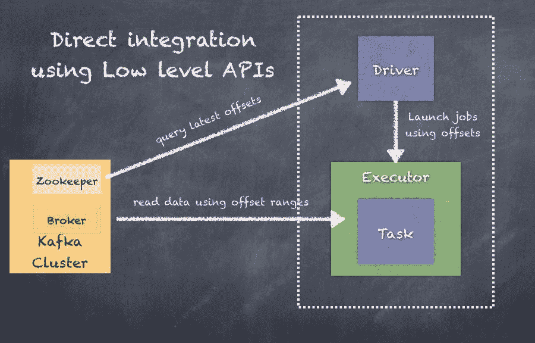

# 结构化流处理

结构化流处理是 Apache Spark 2.0+中的新特性，从 Spark 2.2 版本开始已进入 GA 阶段。接下来你将看到详细信息，并附有如何使用结构化流处理的示例。

关于结构化流处理中的 Kafka 集成的更多详细信息，请参阅[`spark.apache.org/docs/latest/structured-streaming-kafka-integration.html`](https://spark.apache.org/docs/latest/structured-streaming-kafka-integration.html)。

如何在结构化流处理中使用 Kafka 源流的示例如下：

```py
val ds1 = spark
 .readStream
 .format("Kafka")
 .option("Kafka.bootstrap.servers", "host1:port1,host2:port2")
 .option("subscribe", "topic1")
 .load()

ds1.selectExpr("CAST(key AS STRING)", "CAST(value AS STRING)")
 .as[(String, String)]

```

如何使用 Kafka 源流而不是源流（如果你需要更多批处理分析方法）的示例如下：

```py
val ds1 = spark
 .read
 .format("Kafka")
 .option("Kafka.bootstrap.servers", "host1:port1,host2:port2")
 .option("subscribe", "topic1")
 .load()

ds1.selectExpr("CAST(key AS STRING)", "CAST(value AS STRING)")
 .as[(String, String)]

```

# 结构化流处理

结构化流处理是构建在 Spark SQL 引擎之上的一个可扩展且具有容错性的流处理引擎。这使得流处理和计算更加接近批处理，而不是当前 Spark 流处理 API 所面临的 DStream 范式及其挑战。结构化流引擎解决了多个挑战，例如精准一次流处理、增量更新处理结果、聚合等。

结构化流处理 API 还提供了解决 Spark 流处理的一个重大挑战的方法，即，Spark 流处理是以微批次方式处理传入数据，并使用接收时间作为拆分数据的依据，因此并不考虑数据的实际事件时间。结构化流处理允许你在接收到的数据中指定事件时间，从而自动处理任何迟到的数据。

结构化流处理在 Spark 2.2 中已经是 GA（一般可用版），并且 API 已标记为 GA。参考[`spark.apache.org/docs/latest/structured-streaming-programming-guide.html`](https://spark.apache.org/docs/latest/structured-streaming-programming-guide.html)。

结构化流处理的核心思想是将实时数据流视为一个无限制的表，随着事件的处理，该表会不断地被附加新的数据。你可以像对待批量数据一样，对这个无限制的表进行计算和 SQL 查询。例如，Spark SQL 查询会处理这个无限制的表：

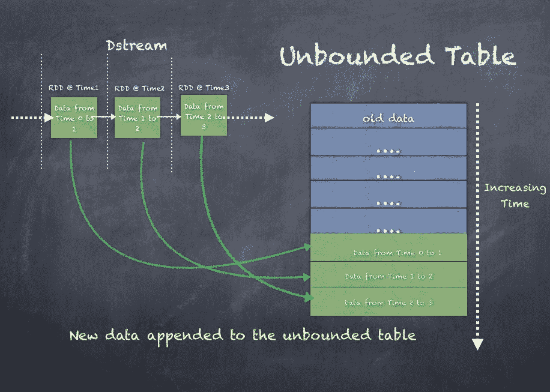

随着 DStream 随时间变化，越来越多的数据将被处理以生成结果。因此，无限制输入表被用来生成结果表。输出或结果表可以写入被称为**输出**的外部存储。

**输出**是指写入的内容，可以通过不同模式进行定义：

+   **完整模式**：整个更新后的结果表将写入外部存储。由存储连接器决定如何处理整个表的写入。

+   **追加模式**：仅将自上次触发以来附加到结果表中的新行写入外部存储。这仅适用于那些预期结果表中的现有行不会发生变化的查询。

+   **更新模式**：自上次触发以来仅更新的结果表中的行将写入外部存储。请注意，这与完整模式不同，因为该模式只输出自上次触发以来发生变化的行。如果查询不包含聚合操作，那么它将等同于追加模式。

以下展示的是来自无限制表的输出示意图：

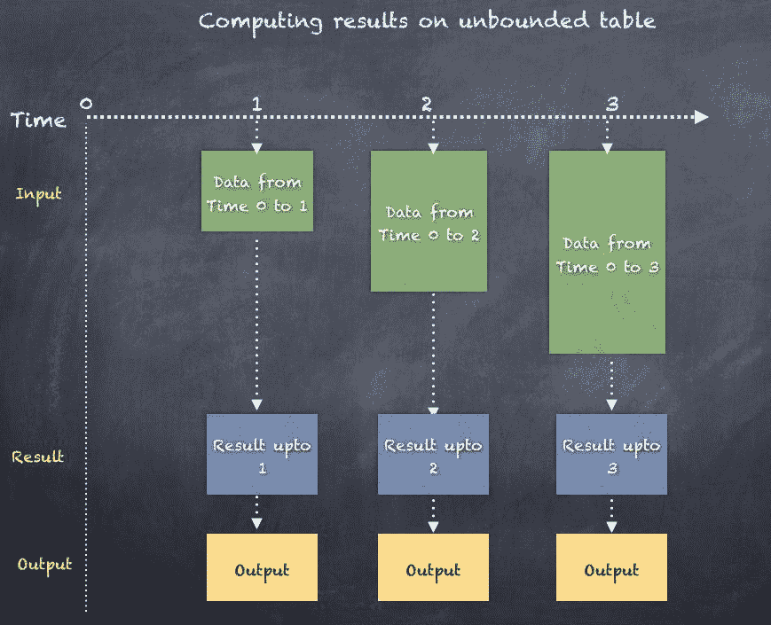

我们将展示一个通过监听本地主机端口 9999 创建结构化流查询的示例。

如果使用 Linux 或 Mac，启动一个简单的服务器并监听端口 9999 非常简单：nc -lk 9999。

下面是一个示例，我们首先创建一个`inputStream`，调用 SparkSession 的`readStream` API，然后从行中提取单词。接着，我们对单词进行分组并计算出现次数，最后将结果写入输出流：

```py
//create stream reading from localhost 9999
val inputLines = spark.readStream
 .format("socket")
 .option("host", "localhost")
 .option("port", 9999)
 .load()
inputLines: org.apache.spark.sql.DataFrame = [value: string]

// Split the inputLines into words
val words = inputLines.as[String].flatMap(_.split(" "))
words: org.apache.spark.sql.Dataset[String] = [value: string]

// Generate running word count
val wordCounts = words.groupBy("value").count()
wordCounts: org.apache.spark.sql.DataFrame = [value: string, count: bigint]

val query = wordCounts.writeStream
 .outputMode("complete")
 .format("console")
query: org.apache.spark.sql.streaming.DataStreamWriter[org.apache.spark.sql.Row] = org.apache.spark.sql.streaming.DataStreamWriter@4823f4d0

query.start()

```

当你继续在终端输入时，查询会不断更新并生成结果，这些结果会打印到控制台：

```py
scala> -------------------------------------------
Batch: 0
-------------------------------------------
+-----+-----+
|value|count|
+-----+-----+
| dog| 1|
+-----+-----+

-------------------------------------------
Batch: 1
-------------------------------------------
+-----+-----+
|value|count|
+-----+-----+
| dog| 1|
| cat| 1|
+-----+-----+

scala> -------------------------------------------
Batch: 2
-------------------------------------------
+-----+-----+
|value|count|
+-----+-----+
| dog| 2|
| cat| 1|
+-----+-----+

```

# 处理事件时间和迟到数据

**事件时间**是数据本身内部的时间。传统的 Spark Streaming 只将时间视为接收时间，用于 DStream 的目的，但对于许多应用程序来说，这不足以满足需求，我们需要的是事件时间。例如，如果你想要每分钟计算推文中某个标签出现的次数，那么你应该使用数据生成的时间，而不是 Spark 接收事件的时间。为了在结构化流处理中引入事件时间，可以将事件时间视为行/事件中的一列。这使得基于窗口的聚合可以使用事件时间而非接收时间来运行。此外，这种模型自然处理比预期晚到达的数据，因为它基于事件时间进行处理。由于 Spark 正在更新结果表，它完全控制在出现迟到数据时如何更新旧的聚合，并清理旧的聚合以限制中间状态数据的大小。同时，还支持对事件流进行水印处理，允许用户指定迟到数据的阈值，并使引擎根据该阈值清理旧状态。

水印使引擎能够追踪当前事件时间，并通过检查接收数据的迟到阈值，判断事件是否需要处理或已经处理。例如，假设事件时间用`eventTime`表示，迟到数据的阈值间隔为`lateThreshold`，则通过检查`max(eventTime) - lateThreshold`与从时间 T 开始的特定窗口的比较，引擎可以确定该事件是否可以在该窗口中进行处理。

下面显示的是前面示例的扩展，演示了结构化流处理监听端口 9999 的情况。在这里，我们启用了`Timestamp`作为输入数据的一部分，这样我们就可以在无限制的表上执行窗口操作以生成结果：

```py
import java.sql.Timestamp import org.apache.spark.sql.SparkSession
import org.apache.spark.sql.functions._ // Create DataFrame representing the stream of input lines from connection to host:port
val inputLines = spark.readStream
 .format("socket")
 .option("host", "localhost")
 .option("port", 9999)
 .option("includeTimestamp", true)
 .load() // Split the lines into words, retaining timestamps
val words = inputLines.as[(String, Timestamp)].flatMap(line =>
 line._1.split(" ").map(word => (word, line._2))
).toDF("word", "timestamp") // Group the data by window and word and compute the count of each group
val windowedCounts = words.withWatermark("timestamp", "10 seconds")
.groupBy(
 window($"timestamp", "10 seconds", "10 seconds"), $"word"
).count().orderBy("window") // Start running the query that prints the windowed word counts to the console
val query = windowedCounts.writeStream
 .outputMode("complete")
 .format("console")
 .option("truncate", "false")

query.start()
query.awaitTermination()

```

# 容错语义

实现 **端到端精确一次语义** 是设计结构化流处理的关键目标之一，它通过实现结构化流处理源、输出端和执行引擎，可靠地跟踪处理的精确进度，从而在发生任何类型的失败时通过重启和/或重新处理来处理。每个流源都假定具有偏移量（类似于 Kafka 偏移量），用来跟踪流中的读取位置。引擎使用检查点和预写日志来记录每个触发器中正在处理数据的偏移范围。流输出端被设计为幂等性，以便处理重新处理操作。通过使用可重放的流源和幂等性输出端，结构化流处理可以确保在任何失败情况下实现端到端的精确一次语义。

记住，传统流处理中使用外部数据库或存储来维护偏移量时，"精确一次"的范式更加复杂。

结构化流处理仍在发展中，面临一些挑战需要克服，才能广泛应用。以下是其中的一些挑战：

+   在流数据集上，不支持多重流聚合操作。

+   在流数据集上，不支持限制或获取前 *N* 行操作。

+   流数据集上的去重操作不被支持。

+   只有在执行聚合步骤后，并且仅在完全输出模式下，才支持对流数据集进行排序操作。

+   目前尚不支持两个流数据集之间的任何类型连接操作。

+   目前只支持少数几种类型的输出端 - 文件输出端和每个输出端。

# 小结

在本章中，我们讨论了流处理系统的概念，Spark 流处理、Apache Spark 的 DStreams、DStreams 的定义、DAGs 和 DStreams 的血统、转换和动作。我们还探讨了流处理中的窗口概念。最后，我们还看了一个实际示例，使用 Spark Streaming 消费 Twitter 中的推文。

此外，我们还研究了基于接收者和直接流式处理的两种从 Kafka 消费数据的方法。最后，我们还看了新型的结构化流处理，它承诺解决许多挑战，比如流处理中的容错性和"精确一次"语义问题。我们还讨论了结构化流处理如何简化与消息系统（如 Kafka 或其他消息系统）的集成。

在下一章，我们将探讨图形处理及其工作原理。
