# 第十章：一切皆相连 - GraphX

“技术使得大规模人口成为可能；而大规模人口现在使得技术变得不可或缺。”

- Joseph Wood Krutch

在这一章中，我们将学习如何使用图形模型（并解决）许多现实世界的问题。我们看到 Apache Spark 有自己的图形库，你在学习 RDD 时学到的内容在这里也能派上用场（这次作为顶点和边的 RDD）。

简而言之，本章将涵盖以下主题：

+   图论简要介绍

+   GraphX

+   VertexRDD 和 EdgeRDD

+   图形操作符

+   Pregel API

+   PageRank

# 图论简要介绍

为了更好地理解图形，让我们来看一下 Facebook 以及你通常如何使用 Facebook。每天你使用智能手机在朋友的墙上发布消息或更新你的状态。你的朋友们也都在发布自己的消息、照片和视频。

你有朋友，你的朋友有朋友，他们有朋友，依此类推。Facebook 有设置让你可以交新朋友或从朋友列表中删除朋友。Facebook 也有权限设置，可以精细控制谁能看到什么，以及谁可以与谁沟通。

现在，当你考虑到有十亿 Facebook 用户时，所有用户的朋友和朋友的朋友列表变得非常庞大和复杂。要理解和管理所有不同的关系或友谊是很困难的。

所以，如果有人想了解你和另一个人*X*是否有任何关系，他们可以简单地从查看你所有的朋友以及你朋友的朋友开始，依此类推，试图找到*X*。如果*X*是朋友的朋友，那么你和*X*是间接连接的。

在你的 Facebook 账户中搜索一两位名人，看看是否有人是你朋友的朋友。也许你可以尝试将他们添加为朋友。

我们需要构建存储和检索关于人及其朋友的数据，以便让我们能够回答如下问题：

+   X 是 Y 的朋友吗？

+   X 和 Y 是否直接连接，或者在两步内连接？

+   X 有多少个朋友？

我们可以从尝试一个简单的数据结构开始，比如数组，这样每个人都有一个朋友数组。现在，只需要取数组的长度就能回答问题 3。我们还可以直接扫描数组并快速回答问题 1。现在，问题 2 则需要多一点工作，取出*X*的朋友数组，并对每个朋友扫描他们的朋友数组。

我们通过构建一个专门的数据结构（如下面的例子所示），解决了这个问题，在这个例子中，我们创建了一个`Person`的 case 类，然后通过添加朋友来建立类似于`john` | `ken` | `mary` | `dan`的关系。

```py
case class Person(name: String) {
 val friends = scala.collection.mutable.ArrayBuffer[Person]() 
 def numberOfFriends() = friends.length 
 def isFriend(other: Person) = friends.find(_.name == other.name) 
 def isConnectedWithin2Steps(other: Person) = {
 for {f <- friends} yield {f.name == other.name ||
                              f.isFriend(other).isDefined}
 }.find(_ == true).isDefined
 }

scala> val john = Person("John")
john: Person = Person(John)

scala> val ken = Person("Ken")
ken: Person = Person(Ken)

scala> val mary = Person("Mary")
mary: Person = Person(Mary)

scala> val dan = Person("Dan")
dan: Person = Person(Dan)

scala> john.numberOfFriends
res33: Int = 0

scala> john.friends += ken
res34: john.friends.type = ArrayBuffer(Person(Ken))     //john -> ken

scala> john.numberOfFriends
res35: Int = 1

scala> ken.friends += mary
res36: ken.friends.type = ArrayBuffer(Person(Mary))    //john -> ken -> mary

scala> ken.numberOfFriends
res37: Int = 1

scala> mary.friends += dan
res38: mary.friends.type = ArrayBuffer(Person(Dan))   //john -> ken -> mary -> dan

scala> mary.numberOfFriends
res39: Int = 1

scala> john.isFriend(ken)
res40: Option[Person] = Some(Person(Ken))         //Yes, ken is a friend of john

scala> john.isFriend(mary)
res41: Option[Person] = None        //No, mary is a friend of ken not john

scala> john.isFriend(dan)
res42: Option[Person] = None      //No, dan is a friend of mary not john

scala> john.isConnectedWithin2Steps(ken)
res43: Boolean = true     //Yes, ken is a friend of john

scala> john.isConnectedWithin2Steps(mary)
res44: Boolean = true     //Yes, mary is a friend of ken who is a friend of john

scala> john.isConnectedWithin2Steps(dan)
res45: Boolean = false    //No, dan is a friend of mary who is a friend of ken who is a friend of john

```

如果我们为所有 Facebook 用户构建`Person()`实例，并按照前面的代码将朋友添加到数组中，那么最终，我们将能够执行大量关于谁是朋友以及两个人之间关系的查询。

下图展示了数据结构中的 `Person()` 实例以及它们之间的逻辑关系：

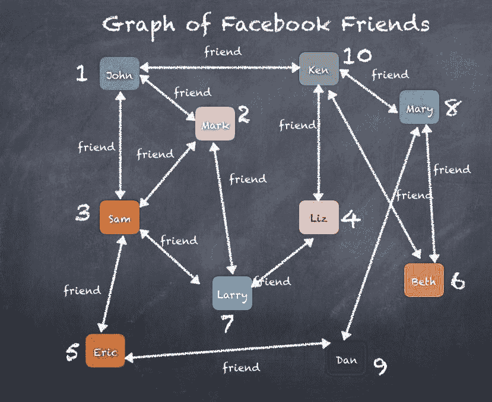

如果你想使用上面的图，仅仅找出**约翰**的朋友，**约翰**朋友的朋友，依此类推，这样我们就可以快速找到直接朋友、间接朋友（朋友的二级关系）、三级朋友（朋友的朋友的朋友），你会看到类似以下的图示：

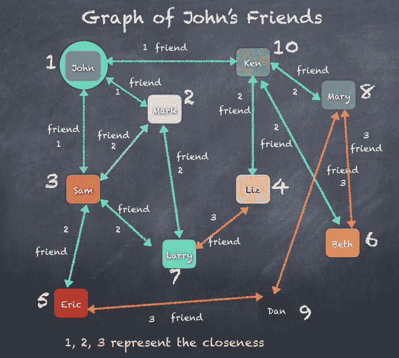

我们可以轻松扩展 `Person()` 类并提供更多功能来回答不同的问题。这并不是重点，我们想要关注的是前面那个图示，展示了 `Person` 和 `Person` 的朋友，以及如何将每个 `Person` 的所有朋友绘制出来，从而形成一个人物之间的关系网。

现在我们引入图论，它源于数学领域。图论将图定义为由顶点、节点或点组成的结构，这些顶点通过边、弧和线连接。如果你将顶点集合视为 `V`，边集合视为 `E`，那么图 `G` 可以定义为有序对 `V` 和 `E`。

```py
Graph G = (V, E)
V - set of Vertices
E - set of Edges

```

在我们 Facebook 朋友图的例子中，我们可以简单地将每个人视为顶点集合中的一个顶点，然后两个人之间的每一条链接可以视为边集合中的一条边。

根据这个逻辑，我们可以列出**顶点**和**边**，如下图所示：

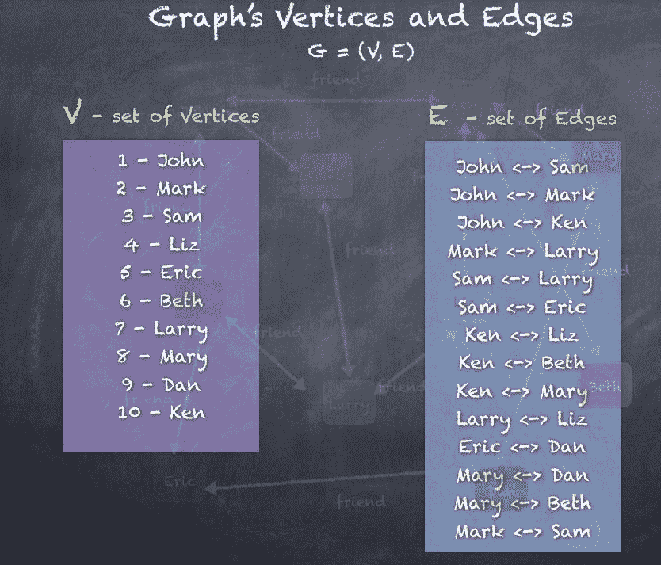

这种作为数学图的描述引出了多种遍历和查询图的数学方法。当这些技术应用于计算机科学，作为开发程序方法来执行必要的数学运算时，正式的做法当然是开发算法，以可扩展、高效的方式实现数学规则。

我们已经尝试使用案例类 `Person` 实现一个简单的图形程序，但这只是最简单的用例，应该显而易见的是，存在许多复杂的扩展是可能的，比如以下问题需要解答：

+   从 X 到 Y 的最佳路径是什么？一个这样的例子是你的车载 GPS 告诉你去超市的最佳路线。

+   如何识别关键边，这些边可能导致图的分割？一个这样的例子是确定连接各个城市互联网服务/水管/电力线路的关键链接。关键边会切断连通性，产生两个连接良好的城市子图，但这两个子图之间将无法进行任何通信。

回答上述问题可以得出若干算法，如最小生成树、最短路径、网页排名、**ALS**（**交替最小二乘法**）、最大割最小流算法等，这些算法适用于广泛的使用场景。

其他示例包括 LinkedIn 的个人资料和连接、Twitter 的粉丝、Google 的页面排名、航空公司调度、汽车中的 GPS 等等，你可以清楚地看到一个包含顶点和边的图。通过使用图算法，可以使用不同的算法来分析 Facebook、LinkedIn 和 Google 等示例中看到的图，从而得出不同的商业用例。

以下是一些现实生活中图的实际应用示例，展示了图和图算法在一些现实生活中的用例中的应用，例如：

+   帮助确定机场之间的航班路线

+   规划如何将水管道布局到本地区的所有家庭

+   让你的汽车 GPS 规划开车去超市的路线

+   设计如何从一个城市到另一个城市、一个州到另一个州、一个国家到另一个国家的互联网流量路由

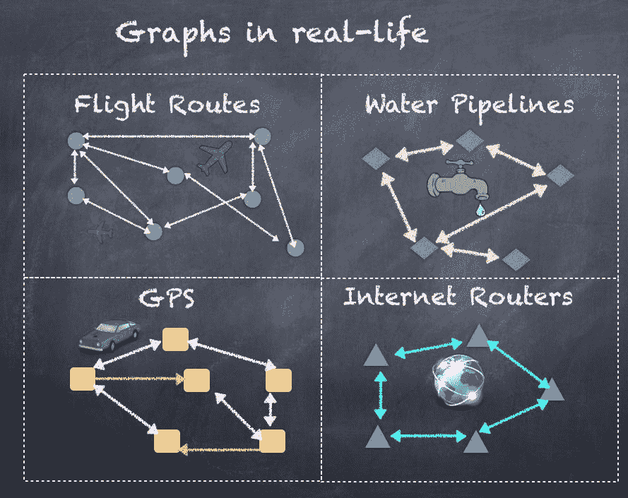

现在让我们深入探讨如何使用 Spark GraphX。

# GraphX

如前一部分所示，我们可以将许多现实生活中的用例建模为一个包含顶点集合和边集合的图，这些边连接着顶点。我们还编写了简单的代码，尝试实现一些基本的图操作和查询，比如，*X 是否是 Y 的朋友*？然而，随着我们进一步探索，算法变得更加复杂，用例也增多，而且图的规模远远大于单台机器能够处理的范围。

不可能将十亿个 Facebook 用户及其所有的友谊关系都装入一台机器或甚至几台机器中。

我们需要做的是超越仅仅将一台机器或几台机器拼凑在一起，开始考虑高度可扩展的架构，以实现复杂的图算法，这些算法能够处理数据量和数据元素之间复杂的互联关系。我们已经看到 Spark 的介绍，Spark 如何解决分布式计算和大数据分析中的一些挑战。我们还看到了实时流处理、Spark SQL 以及 DataFrames 和 RDD。我们能否解决图算法的挑战？答案是 GraphX，它随 Apache Spark 一起提供，就像其他库一样，位于 Spark Core 之上。

GraphX 通过提供一个基于 RDD 概念的图抽象，扩展了 Spark 的 RDD。GraphX 中的图是通过顶点或节点的概念来表示对象，边或链接用于描述对象之间的关系。GraphX 提供了实现许多适合图处理范式的用例的手段。在这一部分，我们将学习 GraphX，如何创建顶点、边和包含顶点和边的图。我们还将编写代码，通过示例学习一些与图算法和处理相关的技术。

要开始，你需要导入以下列出的几个包：

```py
import org.apache.spark._
import org.apache.spark.graphx._
import org.apache.spark.rdd.RDD

import org.apache.spark.graphx.GraphLoader
import org.apache.spark.graphx.GraphOps

```

GraphX 的基本数据结构是图，它抽象地表示一个图，图中的顶点和边与任意对象相关联。图提供了基本操作，用于访问和操作与顶点和边相关联的数据，以及底层结构。与 Spark 的 RDD 类似，图是一种函数式数据结构，变更操作会返回新的图。这种`Graph`对象的不可变性使得可以进行大规模的并行计算，而不会面临同步问题。

对象的并发更新或修改是许多程序中复杂多线程编程的主要原因。

图定义了基本的数据结构，并且有一个辅助类`GraphOps`，其中包含了额外的便利操作和图算法。

图的定义如下，作为一个类模板，其中有两个属性指定构成图的两部分的数据类型，即顶点和边：

```py
class Graph[VD: ClassTag, ED: ClassTag] 

```

如我们之前讨论的，图由顶点和边组成。顶点集合存储在一个特殊的数据结构中，称为`VertexRDD`。类似地，边集合存储在另一个特殊的数据结构中，称为`EdgeRDD`。顶点和边一起构成了图，所有后续操作都可以使用这两种数据结构进行。

所以，`Graph`类的声明如下所示：

```py
class Graph[VD, ED] {
  //A RDD containing the vertices and their associated attributes.
  val vertices: VertexRDD[VD]

  //A RDD containing the edges and their associated attributes. 
    The entries in the RDD contain just the source id and target id
    along with the edge data.
  val edges: EdgeRDD[ED]

  //A RDD containing the edge triplets, which are edges along with the
    vertex data associated with the adjacent vertices.
  val triplets: RDD[EdgeTriplet[VD, ED]]
}

```

现在，让我们来看一下`Graph`类的两个主要组成部分：`VertexRDD`和`EdgeRDD`。

# VertexRDD 和 EdgeRDD

`VertexRDD`包含顶点或节点的集合，这些顶点存储在一个特殊的数据结构中；`EdgeRDD`包含节点/顶点之间边或连接的集合，存储在另一个特殊的数据结构中。`VertexRDD`和`EdgeRDD`都基于 RDD，`VertexRDD`处理图中的每一个节点，而`EdgeRDD`包含所有节点之间的连接。在本节中，我们将介绍如何创建`VertexRDD`和`EdgeRDD`，并使用这些对象来构建图。

# VertexRDD

如前所述，`VertexRDD`是一个包含顶点及其相关属性的 RDD。RDD 中的每个元素代表图中的一个顶点或节点。为了保持顶点的唯一性，我们需要为每个顶点分配一个唯一的 ID。为此，GraphX 定义了一个非常重要的标识符，称为`VertexId`。

`VertexId`被定义为一个 64 位的顶点标识符，它唯一标识图中的一个顶点。它不需要遵循任何排序或约束，唯一性是唯一要求。

`VertexId`的声明如下，简单地说，它是一个 64 位`Long`类型数字的别名：

```py
type VertexId = Long

```

`VertexRDD`扩展了一个包含顶点 ID 和顶点属性的 RDD，表示为`RDD[(VertexId, VD)]`。它还确保每个顶点只有一个条目，并通过预先索引条目来加速高效的连接操作。两个具有相同索引的`VertexRDD`可以高效地进行连接。

```py
class VertexRDD[VD]() extends RDD[(VertexId, VD)]

```

`VertexRDD`也实现了许多函数，这些函数提供了与图操作相关的重要功能。每个函数通常接受由`VertexRDD`表示的顶点作为输入。

让我们将顶点加载到`VertexRDD`中。为此，我们首先声明一个案例类`User`，如下面所示：

```py
case class User(name: String, occupation: String)

```

现在，使用`users.txt`文件创建`VertexRDD`：

| **VertexID** | **姓名** | **职业** |
| --- | --- | --- |
| 1 | John | 会计 |
| 2 | Mark | 医生 |
| 3 | Sam | 律师 |
| 4 | Liz | 医生 |
| 5 | Eric | 会计 |
| 6 | Beth | 会计 |
| 7 | Larry | 工程师 |
| 8 | Marry | 收银员 |
| 9 | Dan | 医生 |
| 10 | Ken | 图书管理员 |

`users.txt`文件的每一行包含**VertexId**、**姓名**和**职业**，所以我们可以在这里使用`String`的分割函数：

```py
scala> val users = sc.textFile("users.txt").map{ line =>
 val fields = line.split(",")
 (fields(0).toLong, User(fields(1), fields(2)))
}
users: org.apache.spark.rdd.RDD[(Long, User)] = MapPartitionsRDD[2645] at map at <console>:127

scala> users.take(10)
res103: Array[(Long, User)] = Array((1,User(John,Accountant)), (2,User(Mark,Doctor)), (3,User(Sam,Lawyer)), (4,User(Liz,Doctor)), (5,User(Eric,Accountant)), (6,User(Beth,Accountant)), (7,User(Larry,Engineer)), (8,User(Mary,Cashier)), (9,User(Dan,Doctor)), (10,User(Ken,Librarian)))

```

# `EdgeRDD`

`EdgeRDD`表示顶点之间的边集合，是 Graph 类的成员，如前所述。`EdgeRDD`与`VertexRDD`一样，都是从 RDD 扩展而来的，并且可以同时包含边属性和顶点属性。

`EdgeRDD[ED, VD]`通过将边存储在每个分区的列格式中来扩展`RDD[Edge[ED]]`，以提高性能。它还可以存储与每条边相关联的顶点属性，从而提供三元组视图：

```py
class EdgeRDD[ED]() extends RDD[Edge[ED]]

```

`EdgeRDD`还实现了许多函数，这些函数提供了与图操作相关的重要功能。每个函数通常接受由`EdgeRDD`表示的边作为输入。每条边由源顶点 Id、目标顶点 Id 和边属性（如`String`、`Integer`或任何案例类）组成。在下面的例子中，我们使用`String`类型的朋友作为属性。稍后在本章中，我们将使用以英里为单位的距离（`Integer`）作为属性。

我们可以通过读取一对顶点 Id 的文件来创建`EdgeRDD`：

| **源顶点 ID** | **目标/目的地顶点 ID** | **距离（英里）** |
| --- | --- | --- |
| 1 | 3 | 5 |
| 3 | 1 | 5 |
| 1 | 2 | 1 |
| 2 | 1 | 1 |
| 4 | 10 | 5 |
| 10 | 4 | 5 |
| 1 | 10 | 5 |
| 10 | 1 | 5 |
| 2 | 7 | 6 |
| 7 | 2 | 6 |
| 7 | 4 | 3 |
| 4 | 7 | 3 |
| 2 | 3 | 2 |

`friends.txt`文件的每一行都包含源`vertexId`和目标`vertexId`，因此我们可以在这里使用`String`的分割函数：

```py
scala> val friends = sc.textFile("friends.txt").map{ line =>
 val fields = line.split(",")
 Edge(fields(0).toLong, fields(1).toLong, "friend")
}
friends: org.apache.spark.rdd.RDD[org.apache.spark.graphx.Edge[String]] = MapPartitionsRDD[2648] at map at <console>:125

scala> friends.take(10)
res109: Array[org.apache.spark.graphx.Edge[String]] = Array(Edge(1,3,friend), Edge(3,1,friend), Edge(1,2,friend), Edge(2,1,friend), Edge(4,10,friend), Edge(10,4,friend), Edge(1,10,friend), Edge(10,1,friend), Edge(2,7,friend), Edge(7,2,friend))

```

现在我们有了顶点和边，接下来是将一切整合在一起，探索如何从顶点和边的列表构建一个`Graph`：

```py
scala> val graph = Graph(users, friends)
graph: org.apache.spark.graphx.Graph[User,String] = org.apache.spark.graphx.impl.GraphImpl@327b69c8

scala> graph.vertices
res113: org.apache.spark.graphx.VertexRDD[User] = VertexRDDImpl[2658] at RDD at VertexRDD.scala:57

scala> graph.edges
res114: org.apache.spark.graphx.EdgeRDD[String] = EdgeRDDImpl[2660] at RDD at EdgeRDD.scala:41

```

使用`Graph`对象，我们可以通过`collect()`函数查看顶点和边，`collect()`会显示所有的顶点和边。每个顶点的形式是（`VertexId`，`User`），每条边的形式是（`srcVertexId`，`dstVertexId`，`edgeAttribute`）。

```py
scala> graph.vertices.collect
res111: Array[(org.apache.spark.graphx.VertexId, User)] = Array((4,User(Liz,Doctor)), (6,User(Beth,Accountant)), (8,User(Mary,Cashier)), (10,User(Ken,Librarian)), (2,User(Mark,Doctor)), (1,User(John,Accountant)), (3,User(Sam,Lawyer)), (7,User(Larry,Engineer)), (9,User(Dan,Doctor)), (5,User(Eric,Accountant)))

scala> graph.edges.collect
res112: Array[org.apache.spark.graphx.Edge[String]] = Array(Edge(1,2,friend), Edge(1,3,friend), Edge(1,10,friend), Edge(2,1,friend), Edge(2,3,friend), Edge(2,7,friend), Edge(3,1,friend), Edge(3,2,friend), Edge(3,10,friend), Edge(4,7,friend), Edge(4,10,friend), Edge(7,2,friend), Edge(7,4,friend), Edge(10,1,friend), Edge(10,4,friend), Edge(3,5,friend), Edge(5,3,friend), Edge(5,9,friend), Edge(6,8,friend), Edge(6,10,friend), Edge(8,6,friend), Edge(8,9,friend), Edge(8,10,friend), Edge(9,5,friend), Edge(9,8,friend), Edge(10,6,friend), Edge(10,8,friend))

```

现在我们已经创建了一个图，接下来我们将在下一部分查看各种操作。

# 图操作符

让我们从直接使用`Graph`对象进行的操作开始，例如基于对象的某些属性过滤图中的顶点和边。我们还将看到`mapValues()`的示例，它可以将图转换为自定义的 RDD。

首先，让我们使用我们在前一节创建的`Graph`对象来检查顶点和边，然后看一些图操作符。

```py
scala> graph.vertices.collect
res111: Array[(org.apache.spark.graphx.VertexId, User)] = Array((4,User(Liz,Doctor)), (6,User(Beth,Accountant)), (8,User(Mary,Cashier)), (10,User(Ken,Librarian)), (2,User(Mark,Doctor)), (1,User(John,Accountant)), (3,User(Sam,Lawyer)), (7,User(Larry,Engineer)), (9,User(Dan,Doctor)), (5,User(Eric,Accountant)))

scala> graph.edges.collect
res112: Array[org.apache.spark.graphx.Edge[String]] = Array(Edge(1,2,friend), Edge(1,3,friend), Edge(1,10,friend), Edge(2,1,friend), Edge(2,3,friend), Edge(2,7,friend), Edge(3,1,friend), Edge(3,2,friend), Edge(3,10,friend), Edge(4,7,friend), Edge(4,10,friend), Edge(7,2,friend), Edge(7,4,friend), Edge(10,1,friend), Edge(10,4,friend), Edge(3,5,friend), Edge(5,3,friend), Edge(5,9,friend), Edge(6,8,friend), Edge(6,10,friend), Edge(8,6,friend), Edge(8,9,friend), Edge(8,10,friend), Edge(9,5,friend), Edge(9,8,friend), Edge(10,6,friend), Edge(10,8,friend))

```

# Filter

对`filter()`的函数调用将顶点集限制为满足给定谓词的顶点集。此操作保留索引以便与原始 RDD 进行高效连接，并且设置位于位掩码中，而不是分配新内存。

```py
def filter(pred: Tuple2[VertexId, VD] => Boolean): VertexRDD[VD] 

```

使用`filter`，我们可以过滤出除用户`Mark`的顶点之外的所有内容，可以使用顶点 ID 或`User.name`属性进行过滤。我们还可以过滤`User.occupation`属性。

以下是完成相同任务的代码：

```py
scala> graph.vertices.filter(x => x._1 == 2).take(10)
res118: Array[(org.apache.spark.graphx.VertexId, User)] = Array((2,User(Mark,Doctor)))

scala> graph.vertices.filter(x => x._2.name == "Mark").take(10)
res119: Array[(org.apache.spark.graphx.VertexId, User)] = Array((2,User(Mark,Doctor)))

scala> graph.vertices.filter(x => x._2.occupation == "Doctor").take(10)
res120: Array[(org.apache.spark.graphx.VertexId, User)] = Array((4,User(Liz,Doctor)), (2,User(Mark,Doctor)), (9,User(Dan,Doctor)))

```

我们也可以对边执行`filter`操作，使用源顶点 ID 或目标顶点 ID。因此，我们可以过滤出仅显示从`John`（顶点 ID = 1）发出的边：

```py
scala> graph.edges.filter(x => x.srcId == 1)
res123: org.apache.spark.rdd.RDD[org.apache.spark.graphx.Edge[String]] = MapPartitionsRDD[2672] at filter at <console>:134

scala> graph.edges.filter(x => x.srcId == 1).take(10)
res124: Array[org.apache.spark.graphx.Edge[String]] = Array(Edge(1,2,friend), Edge(1,3,friend), Edge(1,10,friend))

```

# MapValues

`mapValues()`映射每个顶点属性，保留索引以避免改变顶点 ID。改变顶点 ID 会导致索引变化，从而使后续操作失败，并且顶点将不再可达。因此，重要的是不要改变顶点 ID。

此函数的声明如下所示：

```py
def mapValuesVD2: ClassTag: VertexRDD[VD2]
//A variant of the mapValues() function accepts a vertexId in addition  
  to the vertices.
def mapValuesVD2: ClassTag => VD2): VertexRDD[VD2]

```

`mapValues()`也可以操作边，对边进行值映射，保留结构但改变值：

```py
def mapValuesED2: ClassTag: EdgeRDD[ED2]

```

以下是在顶点和边上调用`mapValues()`的示例代码。在顶点上，MapValues 将顶点转换为(`vertexId`, `User.name`)对的列表。在边上，MapValues 将边转换为(`srcId`, `dstId`, `string`)的三元组：

```py
scala> graph.vertices.mapValues{(id, u) => u.name}.take(10)
res142: Array[(org.apache.spark.graphx.VertexId, String)] = Array((4,Liz), (6,Beth), (8,Mary), (10,Ken), (2,Mark), (1,John), (3,Sam), (7,Larry), (9,Dan), (5,Eric))

scala> graph.edges.mapValues(x => s"${x.srcId} -> ${x.dstId}").take(10)
7), Edge(3,1,3 -> 1), Edge(3,2,3 -> 2), Edge(3,10,3 -> 10), Edge(4,7,4 -> 7))

```

# aggregateMessages

GraphX 中的核心聚合操作是`aggregateMessages`，它将用户定义的`sendMsg`函数应用于图中每个边三元组，然后使用`mergeMsg`函数在目标顶点处聚合这些消息。`aggregateMessages`在许多图算法中使用，其中我们需要在顶点之间交换信息。

以下是此 API 的签名：

```py
def aggregateMessagesMsg: ClassTag => Msg,
 tripletFields: TripletFields = TripletFields.All)
 : VertexRDD[Msg]

```

关键函数是`sendMsg`和`mergeMsg`，它们确定发送到边的源顶点或目标顶点的内容。然后，`mergeMsg`处理从所有边接收到的消息，并执行计算或聚合。

以下是在`Graph`图上调用`aggregateMessages`的简单示例代码，其中我们向所有目标顶点发送消息。每个顶点的合并策略只是将接收到的所有消息相加：

```py
scala> graph.aggregateMessagesInt, _ + _).collect
res207: Array[(org.apache.spark.graphx.VertexId, Int)] = Array((4,2), (6,2), (8,3), (10,4), (2,3), (1,3), (3,3), (7,2), (9,2), (5,2))

```

# TriangleCounting

如果一个顶点的两个邻居通过一条边相连，就会创建一个三角形。换句话说，用户将与那两个互为朋友的朋友创建一个三角形。

Graph 有一个函数`triangleCount()`，用于计算图中的三角形。

以下是用于通过首先调用 `triangleCount` 函数并将三角形与顶点（用户）连接，以生成每个用户及其所属三角形输出的代码：

```py
scala> val triangleCounts = graph.triangleCount.vertices
triangleCounts: org.apache.spark.graphx.VertexRDD[Int] = VertexRDDImpl[3365] at RDD at VertexRDD.scala:57

scala> triangleCounts.take(10)
res171: Array[(org.apache.spark.graphx.VertexId, Int)] = Array((4,0), (6,1), (8,1), (10,1), (2,1), (1,1), (3,1), (7,0), (9,0), (5,0))

scala> val triangleCountsPerUser = users.join(triangleCounts).map { case(id, (User(x,y), k)) => ((x,y), k) }
triangleCountsPerUser: org.apache.spark.rdd.RDD[((String, String), Int)] = MapPartitionsRDD[3371] at map at <console>:153

scala> triangleCountsPerUser.collect.mkString("\n")
res170: String =
((Liz,Doctor),0)
((Beth,Accountant),1)  *//1 count means this User is part of 1 triangle*
((Mary,Cashier),1)  *//1 count means this User is part of 1 triangle*
((Ken,Librarian),1)  *//1 count means this User is part of 1 triangle*
((Mark,Doctor),1)  * //1 count means this User is part of 1 triangle*
((John,Accountant),1)  *//1 count means this User is part of 1 triangle*
((Sam,Lawyer),1)   *//1 count means this User is part of 1 triangle*
((Larry,Engineer),0)
((Dan,Doctor),0)
((Eric,Accountant),0)

```

我们刚才在前面的代码中计算出的两个三角形的图示显示了两个三角形，(**John**, **Mark**, **Sam**) 和 (**Ken**, **Mary**, **Beth**):

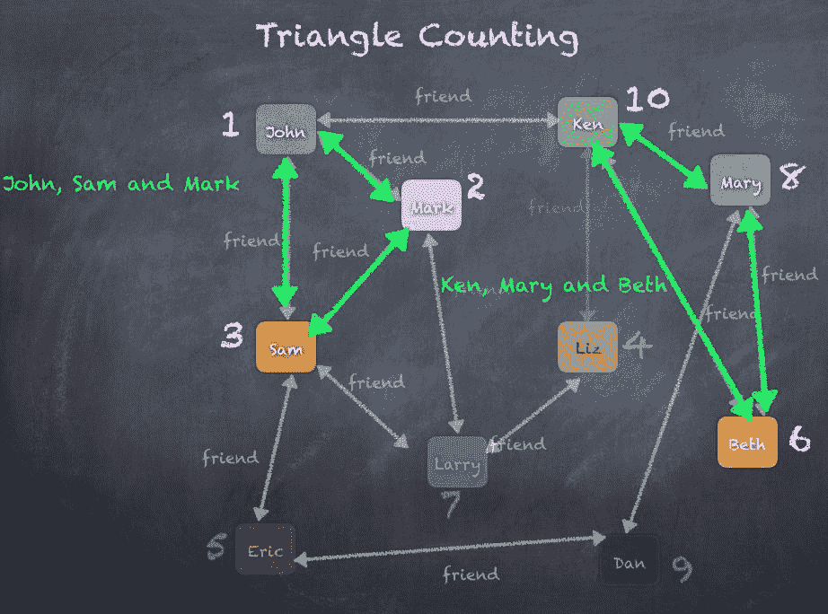

# Pregel API

图本质上是递归的数据结构，因为顶点的属性依赖于其邻居的属性，而邻居的属性又依赖于它们自己的邻居的属性。因此，许多重要的图算法需要迭代地重新计算每个顶点的属性，直到达到固定点条件。为了表达这些迭代算法，提出了多种图并行抽象。GraphX 提供了 Pregel API 的变体。

从高层次来看，GraphX 中的 Pregel 运算符是一个批量同步的并行消息抽象，受图的拓扑结构限制。Pregel 运算符在一系列步骤中执行，在这些步骤中，顶点接收来自上一超步的传入消息的总和，计算顶点属性的新值，然后在下一超步中向相邻顶点发送消息。使用 Pregel 时，消息是并行计算的，作为边三元组的函数，消息计算可以访问源和目标顶点的属性。没有接收到消息的顶点会在超步中跳过。Pregel 运算符在没有剩余消息时终止迭代并返回最终图。

一些内置的 Pregel API 算法如下所示：

+   连通分量

+   最短路径

+   旅行商问题

+   PageRank（将在下一节介绍）

Pregel API 的签名如下所示，显示了所需的各种参数。确切的用法将在后续章节中展示，您可以参考此签名以获得更多信息：

```py
def pregel[A]
 (initialMsg: A, // the initial message to all vertices
 maxIter: Int = Int.MaxValue, // number of iterations
 activeDir: EdgeDirection = EdgeDirection.Out) // incoming or outgoing edges
 (vprog: (VertexId, VD, A) => VD,
 sendMsg: EdgeTriplet[VD, ED] => Iterator[(VertexId, A)], //send message function
 mergeMsg: (A, A) => A) //merge strategy
 : Graph[VD, ED] 

```

# 连通分量

连通分量本质上是图中的子图，其中顶点通过某种方式相互连接。这意味着同一组件中的每个顶点都与组件中的其他顶点有一条边。当没有其他边将顶点连接到某个组件时，就会创建一个新的组件，该组件包含该特定顶点。这个过程会一直持续，直到所有顶点都属于某个组件。

图对象提供了一个 `connectComponents()` 函数来计算连通分量。该函数在底层使用 Pregel API 来计算顶点所属的组件。以下是用于计算图中连通分量的代码。显然，在此示例中，我们只有一个连通分量，因此所有用户的组件编号都显示为 1：

```py
scala> graph.connectedComponents.vertices.collect res198: Array[(org.apache.spark.graphx.VertexId, org.apache.spark.graphx.VertexId)] = Array((4,1), (6,1), (8,1), (10,1), (2,1), (1,1), (3,1), (7,1), (9,1), (5,1))
 scala> graph.connectedComponents.vertices.join(users).take(10)
res197: Array[(org.apache.spark.graphx.VertexId, (org.apache.spark.graphx.VertexId, User))] = Array((4,(1,User(Liz,Doctor))), (6,(1,User(Beth,Accountant))), (8,(1,User(Mary,Cashier))), (10,(1,User(Ken,Librarian))), (2,(1,User(Mark,Doctor))), (1,(1,User(John,Accountant))), (3,(1,User(Sam,Lawyer))), (7,(1,User(Larry,Engineer))), (9,(1,User(Dan,Doctor))), (5,(1,User(Eric,Accountant))))

```

# 旅行商问题

旅行商问题试图在无向图中找到一条最短路径，遍历每个顶点。例如，用户约翰想要开车到每个其他用户的地方，最小化总驾驶距离。随着顶点和边的数量增加，排列组合的数量也会呈多项式增长，覆盖从顶点到顶点的所有可能路径。时间复杂度也会多项式增长，问题的解决可能需要很长时间。与其完全准确地解决它，更常用的方法是采用**贪心**算法，以尽可能最优的方式解决该问题。

为了解决旅行商问题，贪心算法会快速选择最短的边，尽管我们知道如果继续进一步深度遍历，这可能是一个非最优选择。

贪心算法在用户和朋友图中的示意图如下所示，其中我们看到在每个顶点处选择最短的加权边进行遍历。同时请注意，顶点**拉里**（**7**）和**莉兹**（**4**）从未被访问过：

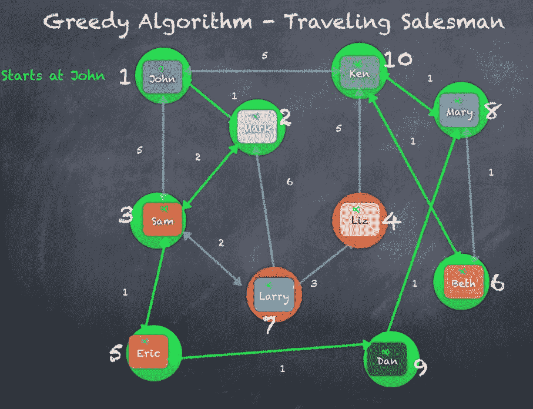

# ShortestPaths

最短路径算法通过从源顶点开始，然后遍历连接各顶点的边，直到到达目标顶点，从而找到两顶点之间的路径。该算法通过各顶点之间交换消息来实现。此外，这个最短路径算法并不是`Graph`或`GraphOps`对象的一部分，而必须通过`lib.ShortestPaths()`来调用：

```py
scala> lib.ShortestPaths.run(graph,Array(1)).vertices.join(users).take(10)

res204: Array[(org.apache.spark.graphx.VertexId, (org.apache.spark.graphx.lib.ShortestPaths.SPMap, User))] = Array((4,(Map(1 -> 2),User(Liz,Doctor))), (6,(Map(1 -> 2),User(Beth,Accountant))), (8,(Map(1 -> 2),User(Mary,Cashier))), (10,(Map(1 -> 1),User(Ken,Librarian))), (2,(Map(1 -> 1),User(Mark,Doctor))), (1,(Map(1 -> 0),User(John,Accountant))), (3,(Map(1 -> 1),User(Sam,Lawyer))), (7,(Map(1 -> 2),User(Larry,Engineer))), (9,(Map(1 -> 3),User(Dan,Doctor))), (5,(Map(1 -> 2),User(Eric,Accountant))))

```

`ShortestPaths`选择两个顶点之间跳跃次数最少的最短路径。以下图示展示了**约翰**到**拉里**的三种路径，其中两条路径长度为 2，一条路径长度为 3。从前面代码的结果可以清楚地看到，从**拉里**到约翰选择的路径长度为 2。

上述代码块的输出显示了一个包含路径长度和节点的向量`(7,(Map(1 -> 2),User(Larry,Engineer)))`：

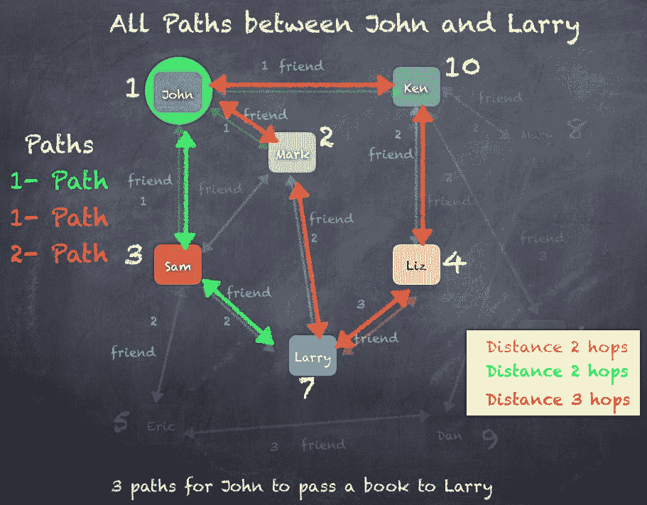

我们还可以使用加权边计算最短路径，这意味着连接用户的每条边的权重不同。例如，如果我们可以将边的值/权重/属性视为每个用户居住地之间的距离，我们就得到一个加权图。在这种情况下，最短路径是通过计算两个用户之间的距离（以英里为单位）来求得的：

```py
scala> val srcId = 1 //vertex ID 1 is the user John
srcId: Int = 1

scala> val initGraph = graph.mapVertices((id, x) => if(id == srcId) 0.0 else Double.PositiveInfinity)
initGraph: org.apache.spark.graphx.Graph[Double,Long] = org.apache.spark.graphx.impl.GraphImpl@2b9b8608

scala> val weightedShortestPath = initGraph.pregel(Double.PositiveInfinity, 5)(
 | (id, dist, newDist) => math.min(dist, newDist),
 | triplet => {
 | if (triplet.srcAttr + triplet.attr < triplet.dstAttr) {
 | Iterator((triplet.dstId, triplet.srcAttr + triplet.attr))
 | }
 | else {
 | Iterator.empty
 | }
 | },
 | (a, b) => math.min(a, b)
 | )
weightedShortestPath: org.apache.spark.graphx.Graph[Double,Long] = org.apache.spark.graphx.impl.GraphImpl@1f87fdd3

scala> weightedShortestPath.vertices.take(10).mkString("\n")
res247: String =
(4,10.0)
(6,6.0)
(8,6.0)
(10,5.0)
(2,1.0)
(1,0.0)
(3,3.0)
(7,7.0)
(9,5.0)
(5,4.0)

```

以下是一个使用 Pregel API 计算从**约翰**到**拉里**的**单源最短路径**的示意图，计算过程从初始化开始，逐步迭代直到我们到达最佳路径。

图的初始化是通过将代表**约翰**的顶点的值设置为零，所有其他顶点的值设置为正无穷大来完成的：

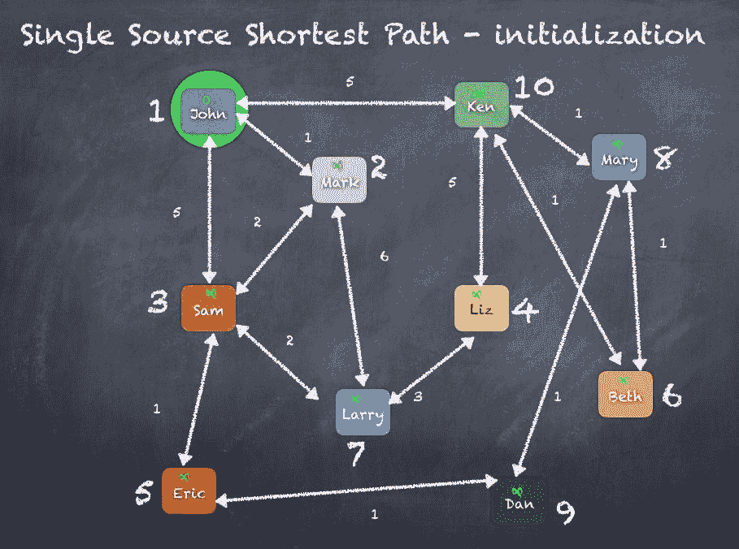

初始化完成后，我们将使用 Pregel 进行四次迭代来重新计算顶点值。在每次迭代中，我们遍历所有顶点，并在每个顶点处检查是否存在更好的从源顶点到目标顶点的路径。如果存在这样的边/路径，则更新顶点值。

让我们定义两个函数 *distance(v)* 和 *distance(s, t)*，其中 *distance(v)* 返回一个顶点的值，*distance(s,t)* 返回连接 *s* 到 *t* 的边的值。

在迭代 1 中，除约翰外的每个用户都被设置为无限大，约翰的距离为 0，因为他是源顶点。现在，我们使用 Pregel 遍历各个顶点，检查是否有比无限大更好的值。以 Ken 为例，我们将检查 *distance("John") + distance("John", "Ken") < distance("Ken")*。

这相当于检查 *0 + 5 < Infinity*，结果是 `true`；所以我们将 Ken 的距离更新为 *5*。

类似地，我们检查 Mary，*distance("Ken") + distance("Ken", "Mary") < distance("Mary")*，结果是`false`，因为那时 Ken 仍然是无限远。因此，在迭代 1 中，我们只能更新与约翰连接的用户。

在下一次迭代中，Mary、Liz、Eric 等人都会被更新，因为现在我们已经有了来自迭代 1 中的 Ken、Mark 和 Sam 的更新值。这将继续进行，直到达到 Pregel API 调用中指定的迭代次数。

以下是计算图中单源最短路径时，各个迭代步骤的示意图：

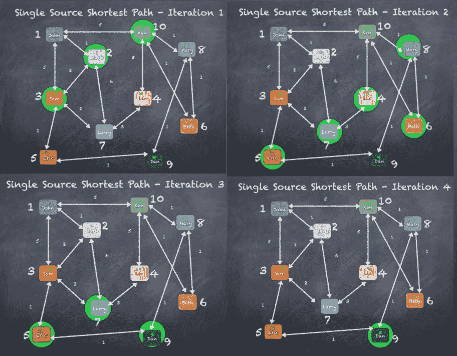

在经过四次迭代后，从**约翰**到**拉里**的最短路径显示，最短路径为五英里。从**约翰**到**拉里**的路径可以通过以下路径查看：**约翰** | **马克** | **萨姆** | **拉里**：

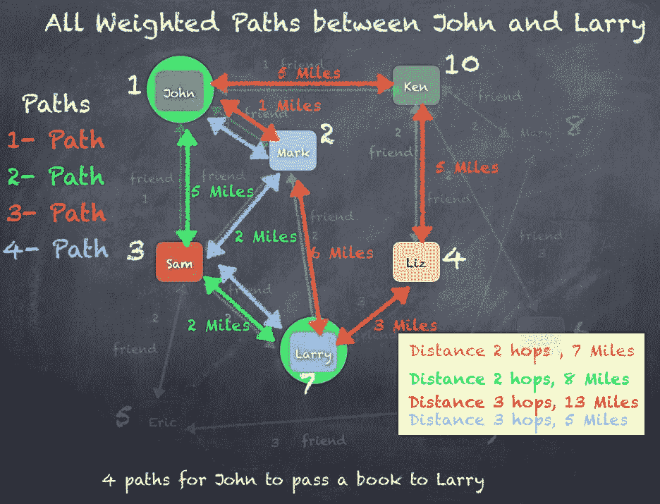

# PageRank

**PageRank** 是图处理领域最重要的算法之一。该算法源于 Google，以 Google 创始人 Larry Page 的名字命名，并且基于通过关系或边缘对顶点或节点进行排名的概念，已经发展出许多不同的应用场景。

Google PageRank 通过计算指向页面的链接数量和质量，来大致估算一个网站的重要性。其基本假设是，越重要的网站更可能收到来自其他网站的更多链接。如需了解更多信息，您可以阅读 [`en.wikipedia.org/wiki/PageRank`](https://en.wikipedia.org/wiki/PageRank) 上的描述。

以 Google PageRank 为例，通过在其他流行网站和技术博客中推广您的网页，您可以提高您公司网站或博客中某个网页的相对重要性。使用这种方法，您的博客网站可能会在 Google 搜索结果中排名高于其他类似网页，尤其是当有许多第三方网站显示您的博客网站及其内容时。

**搜索引擎优化**（**SEO**）是营销领域中最大的行业之一，几乎每个网站都在投资这一技术。SEO 涉及各种技术和策略，主要目的是提高网站在搜索引擎结果中排名的高度，当用户搜索相关词汇时，网站能够排在前面。这基于类似 Google PageRank 的概念。

如果你将网页视为节点/顶点，将网页之间的超链接视为边缘，那么我们基本上就创建了一个图。现在，如果你能计算网页的排名，作为指向该网页的超链接/边缘的数量，例如你的 `myblog.com` 网站上有指向 `cnn.com` 或 `msnbc.com` 的链接，用户可以点击这些链接访问你的 `myblog.com` 页面。这可以作为一个表示 `myblog.com` 顶点重要性的因子。如果我们递归地应用这个简单的逻辑，最终我们会为每个顶点分配一个排名，该排名是通过计算传入边的数量和基于源顶点排名的 PageRank 来得到的。一个被许多高 PageRank 网页链接的页面，自己也会获得较高的排名。让我们看看如何使用 Spark GraphX 在大数据规模上解决 PageRank 问题。正如我们所看到的，PageRank 衡量了图中每个顶点的重要性，假设从 **a** 到 **b** 的边表示 **a** 提升了 **b** 的值。例如，如果一个 Twitter 用户被许多其他用户关注，那么该用户将被排名较高。

GraphX 提供了静态和动态实现的 PageRank，作为 `pageRank` 对象上的方法。静态 PageRank 运行固定次数的迭代，而动态 PageRank 会一直运行直到排名收敛。`GraphOps` 允许直接在图上调用这些算法方法：

```py
scala> val prVertices = graph.pageRank(0.0001).vertices
prVertices: org.apache.spark.graphx.VertexRDD[Double] = VertexRDDImpl[8245] at RDD at VertexRDD.scala:57

scala> prVertices.join(users).sortBy(_._2._1, false).take(10)
res190: Array[(org.apache.spark.graphx.VertexId, (Double, User))] = Array((10,(1.4600029149839906,User(Ken,Librarian))), (8,(1.1424200609462447,User(Mary,Cashier))), (3,(1.1279748817993318,User(Sam,Lawyer))), (2,(1.1253662371576425,User(Mark,Doctor))), (1,(1.0986118723393328,User(John,Accountant))), (9,(0.8215535923013982,User(Dan,Doctor))), (5,(0.8186673059832846,User(Eric,Accountant))), (7,(0.8107902215195832,User(Larry,Engineer))), (4,(0.8047583729877394,User(Liz,Doctor))), (6,(0.783902117150218,User(Beth,Accountant))))

```

图上的 PageRank 算法示意图如下：

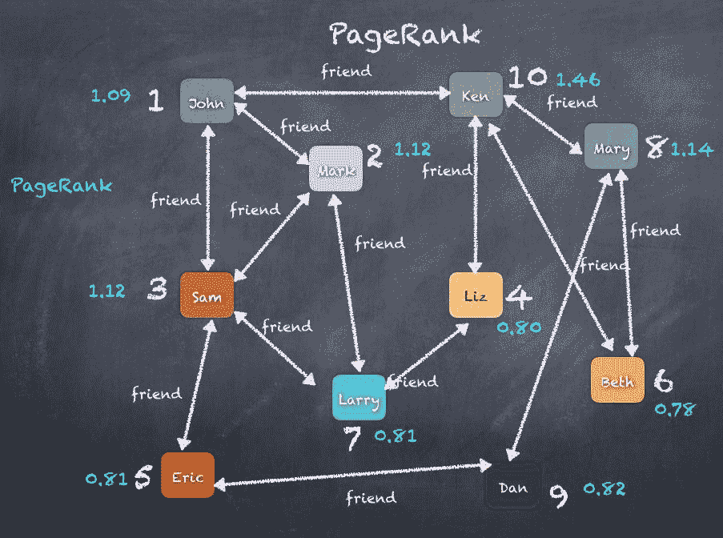

# 总结

在本章中，我们通过使用 Facebook 作为示例介绍了图论；Apache Spark 的图处理库 GraphX、`VertexRDD` 和 EdgeRDDs；图操作符 `aggregateMessages`、`TriangleCounting` 和 Pregel API；以及像 PageRank 算法这样的应用案例。我们还了解了旅行推销员问题和连通分量等内容。我们看到了如何使用 GraphX API 开发大规模图处理算法。

在第十一章，*学习机器学习 - Spark MLlib 和 ML*，我们将探索 Apache Spark 的机器学习库的精彩世界。
