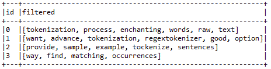

# 第十一章：学习机器学习 - Spark MLlib 和 Spark ML

“我们每个人，实际上每一种动物，都是数据科学家。我们从传感器中收集数据，然后处理这些数据以获得抽象规则，以感知我们的环境并控制我们在该环境中的行为，减少痛苦和/或增加快乐。我们有记忆来存储这些规则，然后在需要时回忆并使用它们。学习是终身的；当规则不再适用时，我们会忘记它们，或者当环境变化时，我们会修订它们。”

- Ethem Alpaydin，《机器学习：新型人工智能》

本章的目的是为那些在典型的统计学训练中可能没有接触过此类方法的人提供统计机器学习（ML）技术的概念性介绍。本章还旨在通过几个步骤，帮助新人从几乎没有机器学习知识到成为一名有经验的从业者。我们将以理论和实践的方式，重点介绍 Spark 的机器学习 API，称为 Spark MLlib 和 Spark ML。此外，我们还将提供一些涵盖特征提取与转换、降维、回归和分类分析的示例。简而言之，本章将涵盖以下主题：

+   机器学习简介

+   Spark 机器学习 API

+   特征提取与转换

+   使用 PCA 进行回归的降维

+   二分类与多分类

# 机器学习简介

在这一部分，我们将从计算机科学、统计学和数据分析的角度尝试定义机器学习。**机器学习（ML）**是计算机科学的一个分支，它使计算机能够在没有明确编程的情况下学习（Arthur Samuel，1959 年）。这个研究领域源自人工智能中的模式识别和计算学习理论的研究。

更具体地说，机器学习探索了可以从启发式方法中学习并对数据进行预测的算法的研究和构建。这类算法通过根据样本输入构建模型，从而克服了严格静态的程序指令，通过数据驱动的预测或决策来工作。现在，让我们从计算机科学的角度听听 Tom M. Mitchell 教授对机器学习的更明确和多样化的定义：

如果一个计算机程序在任务类别 T 和性能度量 P 下，随着经验 E 的增加，其在 T 任务中的表现通过 P 测量得到改进，那么我们说该程序从经验 E 中学习。

基于这个定义，我们可以得出结论：计算机程序或机器可以：

+   从数据和历史中学习

+   通过经验得到提升

+   互动地增强一个可以用来预测问题结果的模型

典型的机器学习任务包括概念学习、预测建模、聚类和寻找有用的模式。最终目标是改进学习，使其变得自动化，从而不再需要人工干预，或者尽可能减少人工干预的程度。尽管机器学习有时与**知识发现和数据挖掘**（**KDDM**）混淆，但 KDDM 更多地侧重于探索性数据分析，并且被称为无监督学习。典型的机器学习应用可以分为科学知识发现和更多的商业应用，从机器人学或**人机交互**（**HCI**）到反垃圾邮件过滤和推荐系统。

# 典型的机器学习工作流程

一个典型的机器学习应用涉及几个步骤，从输入、处理到输出，形成一个科学工作流程，如*图 1*所示。一个典型机器学习应用所涉及的步骤如下：

1.  加载样本数据。

1.  将数据解析为算法的输入格式。

1.  对数据进行预处理并处理缺失值。

1.  将数据分成两个集：一个用于构建模型（训练数据集），另一个用于测试模型（验证数据集）。

1.  运行算法来构建或训练你的机器学习模型。

1.  使用训练数据进行预测并观察结果。

1.  使用测试数据集测试和评估模型，或者使用交叉验证技术，通过第三个数据集（称为验证数据集）来验证模型。

1.  调整模型以提高性能和准确性。

1.  扩展模型，使其能够在未来处理大规模数据集。

1.  将机器学习模型投入商业化应用。

**图 1：** 机器学习工作流程

通常，机器学习算法有一些方法来处理数据集中的偏斜性。然而，这种偏斜性有时非常严重。在第 4 步中，实验数据集被随机分割，通常分为训练集和测试集，这个过程称为抽样。训练数据集用于训练模型，而测试数据集用于在最后评估最佳模型的表现。更好的做法是尽可能多地使用训练数据集，以提高泛化性能。另一方面，建议只使用一次测试数据集，以避免在计算预测误差和相关度量时出现过拟合问题。

# 机器学习任务

根据学习系统可获得的反馈类型，机器学习任务或过程通常分为三大类：有监督学习、无监督学习和强化学习，如图 2 所示。此外，还有其他机器学习任务，例如降维、推荐系统、频繁模式挖掘等。

**图 2：** 机器学习任务

# 有监督学习

监督学习应用基于一组示例做出预测，目标是学习能够将输入映射到符合现实世界输出的通用规则。例如，垃圾邮件过滤的数据集通常包含垃圾邮件和非垃圾邮件。因此，我们可以知道训练集中的邮件是垃圾邮件还是正常邮件。然而，我们可能有机会利用这些信息来训练模型，从而对新的未见过的邮件进行分类。下图展示了监督学习的示意图。当算法找到所需的模式后，这些模式可以用于对无标签的测试数据进行预测。这是最流行且最有用的机器学习任务类型，在 Spark 中也不例外，其中大多数算法都是监督学习技术：

**图 3**：监督学习的应用

示例包括用于解决监督学习问题的分类和回归。我们将在本书中提供几个监督学习的示例，如逻辑回归、随机森林、决策树、朴素贝叶斯、一对多分类等。然而，为了使讨论更具实质性，本书将仅讨论逻辑回归和随机森林，其他算法将在第十二章中讨论，章节标题为*高级机器学习最佳实践*，并附有一些实际的示例。另一方面，线性回归将用于回归分析。

# 无监督学习

在无监督学习中，数据点没有与之相关的标签。因此，我们需要通过算法为其添加标签，如下图所示。换句话说，训练数据集在无监督学习中的正确类别是未知的。因此，类别必须从非结构化数据集中推断出来，这意味着无监督学习算法的目标是通过描述数据的结构以某种结构化方式对数据进行预处理。

为了克服无监督学习中的这一障碍，通常使用聚类技术根据一定的相似性度量将无标签样本分组。因此，这项任务也涉及挖掘隐藏的模式以进行特征学习。聚类是智能地对数据集中的项进行分类的过程。总体思路是，同一聚类中的两个项彼此“更接近”，而属于不同聚类的项则较远。这是一般定义，留给“接近”的解释是开放的。

**图 4**：无监督学习

示例包括聚类、频繁模式挖掘和降维用于解决无监督学习问题（也可应用于监督学习问题）。我们将在本书中提供几个无监督学习的示例，如 k 均值、二分 k 均值、高斯混合模型，**潜在狄利克雷分配** (**LDA**)，等等。我们还将展示如何通过回归分析在监督学习中使用降维算法，如**主成分分析** (**PCA**) 或 **奇异值分解** (**SVD**)。

**降维** (**DR**)：降维是一种在特定条件下减少随机变量数量的技术。这种技术用于监督学习和非监督学习。使用降维技术的典型优势如下：

+   它减少了机器学习任务所需的时间和存储空间

+   它有助于消除多重共线性，并改善机器学习模型的性能

+   当降到 2D 或 3D 等非常低的维度时，数据可视化变得更加容易

# 强化学习

作为一个人类，你和我们也从过去的经验中学习。我们不是偶然变得如此迷人的。多年来的积极赞美和负面批评都帮助塑造了我们今天的样子。通过与朋友、家人甚至陌生人的互动，你学会了如何让人们感到快乐，并且通过尝试不同的肌肉运动来学会骑自行车，直到这些动作变得自然。有时，当你执行动作时，你会立即获得回报。例如，找到附近的购物中心可能会带来即时满足感。而有时，奖励并不会立即出现，例如旅行长途寻找一个特别好的吃饭地点。这些都与强化学习（RL）有关。

因此，RL 是一种技术，其中模型本身从一系列操作或行为中学习。数据集的复杂性或样本复杂性对于算法成功学习目标函数非常重要。此外，在与外部环境交互时，针对每个数据点的最终目标是确保最大化奖励函数，如下图所示：

**图 5**：强化学习

强化学习技术正在许多领域中使用。以下是一个非常简短的列表：

+   广告有助于学习排名，使用一次性学习处理新兴项目，新用户将带来更多的收入

+   教导机器人新任务，同时保留先前的知识

+   衍生复杂的层次方案，从国际象棋开局到交易策略

+   路由问题，例如，管理运输舰队，分配卡车/司机到哪种货物

+   在机器人学中，算法必须根据一组传感器读数选择机器人的下一步行动

+   它也是**物联网**（**IoT**）应用的一个自然选择，在这些应用中，计算机程序与动态环境互动，在没有明确导师的情况下，它必须完成某个目标。

+   最简单的强化学习问题之一是 n 臂老虎机。问题在于有 n 个老虎机，但每个老虎机的固定支付概率不同。目标是通过始终选择支付最好的老虎机来最大化利润。

+   一个新兴的应用领域是股市交易。在这种情况下，交易员像一个强化学习代理，因为买卖（即行为）某只股票会通过产生利润或亏损来改变交易员的状态，即奖励。

# 推荐系统

推荐系统是信息过滤系统的一个子类，它旨在预测用户通常对某个物品的评分或偏好。推荐系统的概念近年来变得非常普遍，并已应用于不同的领域。

**图 6**：不同的推荐系统

最常见的推荐系统可能是产品（例如电影、音乐、书籍、研究文章、新闻、搜索查询、社交标签等）。推荐系统通常可以分为以下四类：

+   协同过滤，也叫做社交过滤，通过利用其他人的推荐来过滤信息。问题是，过去在评估某些物品时达成一致的人，未来也可能再次达成一致。因此，例如，想看电影的人可能会向他的朋友们请求推荐。现在，一旦他从一些有相似兴趣并且更受信任的朋友那里获得了推荐，这些推荐就比其他人的更有参考价值。这些信息被用来决定看哪部电影。

+   基于内容的过滤（也称为认知过滤），它根据物品内容与用户档案之间的比较来推荐物品。每个物品的内容通常以一组描述符或术语表示，通常是文档中出现的词语。用户档案使用相同的术语来表示，通过分析用户看到过的物品内容来构建。然而，在实现这些类型的推荐系统时，需要考虑以下一些问题：

    +   首先，术语可以自动或手动分配。对于自动分配，必须选择一种方法，以便能够从项目列表中提取这些项。其次，术语必须以一种方式表示，以便用户档案和项目能够以有意义的方式进行比较。学习算法本身必须明智地选择，以便能够基于已观察到（即已看到）的项目来学习用户档案，并根据该用户档案做出适当的推荐。内容过滤系统通常用于文本文档，其中使用术语解析器从文档中选择单个单词。向量空间模型和潜在语义索引是两种方法，通过这些术语将文档表示为多维空间中的向量。此外，它还用于相关反馈、遗传算法、神经网络和贝叶斯分类器，以学习用户档案。

+   混合推荐系统是近年来的研究成果，一种混合方法（即结合协同过滤和内容过滤）。Netflix 是这种推荐系统的一个典型例子，它使用**限制玻尔兹曼机**（**RBM**）和一种矩阵分解算法形式，处理像 IMDb 这样的庞大电影数据库（详见 [`pdfs.semanticscholar.org/789a/d4218d1e2e920b4d192023f840fe8246d746.pdf`](https://pdfs.semanticscholar.org/789a/d4218d1e2e920b4d192023f840fe8246d746.pdf)）。这种通过比较相似用户的观看和搜索习惯来推荐电影、电视剧或流媒体的推荐方式被称为评分预测。

+   基于知识的系统，通过用户和产品的知识推理，了解哪些可以满足用户需求，使用感知树、决策支持系统和案例推理。

本章将讨论基于协同过滤的电影推荐系统。

# 半监督学习

在监督学习和无监督学习之间，有一个小的空间用于半监督学习。在这种情况下，机器学习模型通常会接收一个不完整的训练信号。从统计学的角度来看，机器学习模型接收到的训练集部分目标输出是缺失的。半监督学习或多或少是基于假设的，通常使用三种假设算法作为未标记数据集的学习算法。使用的假设有：平滑性、聚类和流形。换句话说，半监督学习也可以被称为弱监督学习，或者是利用未标记样本的隐藏信息来增强从少量标记数据中学习的自举技术。

如前所述，获取标注数据通常需要熟练的人工操作。因此，标注过程所涉及的成本可能会使得完全标注的训练集不可行，而获取未标注数据则相对便宜。

例如：转录音频片段、确定蛋白质的三维结构或确定某个特定位置是否有石油、期望最小化和人类认知以及传递性。在这种情况下，半监督学习可以具有很大的实际价值。

# Spark 机器学习 API

在本节中，我们将介绍 Spark 机器学习库（Spark MLlib 和 Spark ML）所引入的两个关键概念，以及与我们在前面章节中讨论的监督学习和无监督学习技术相对应的最常用的已实现算法。

# Spark 机器学习库

正如前面所说，在 Spark 出现之前，大数据建模人员通常使用统计语言如 R、STATA 和 SAS 来构建他们的机器学习模型。然而，这种工作流程（即这些机器学习算法的执行流程）缺乏效率、可扩展性和吞吐量，也缺乏准确性，当然，执行时间也较长。

然后，数据工程师通常会重新用 Java 实现相同的模型，例如部署到 Hadoop 上。使用 Spark，可以重建、采用并部署相同的机器学习模型，使整个工作流程更加高效、稳健和快速，从而提供实际的见解来提高性能。此外，在 Hadoop 中实现这些算法意味着这些算法可以并行运行，这是 R、STATA 和 SAS 等工具无法做到的。Spark 机器学习库分为两个包：Spark MLlib（`spark.mllib`）和 Spark ML（`spark.ml`）。

# Spark MLlib

MLlib 是 Spark 的可扩展机器学习库，是 Spark 核心 API 的扩展，提供了易于使用的机器学习算法库。Spark 算法是用 Scala 实现的，然后公开 Java、Scala、Python 和 R 的 API。Spark 支持本地向量和矩阵数据类型，这些数据类型存储在单个机器上，同时支持由一个或多个 RDD 支持的分布式矩阵。Spark MLlib 的优点很多。例如，算法具有很高的可扩展性，并利用 Spark 处理海量数据的能力。

+   它们是为并行计算而设计的，采用基于内存的操作，速度比 MapReduce 数据处理快 100 倍（它们也支持基于磁盘的操作，比 MapReduce 的常规数据处理快 10 倍）。

+   它们种类繁多，涵盖了回归分析、分类、聚类、推荐系统、文本分析和频繁模式挖掘等常见的机器学习算法，显然涵盖了构建可扩展机器学习应用程序所需的所有步骤。

# Spark ML

Spark ML 添加了一套新的机器学习 API，让用户能够在数据集之上快速组装和配置实用的机器学习管道。Spark ML 的目标是提供一组统一的高级 API，建立在 DataFrame 之上，而非 RDD，帮助用户创建和调整实用的机器学习管道。Spark ML API 标准化了机器学习算法，使得学习任务更容易将多个算法合并成单一的管道或数据工作流，方便数据科学家使用。Spark ML 使用了 DataFrame 和 Datasets 的概念，这些概念在 Spark 1.6 中作为实验性功能被引入，随后在 Spark 2.0+ 中得到了应用。

在 Scala 和 Java 中，DataFrame 和 Dataset 已经统一，即 DataFrame 只是行数据集的类型别名。在 Python 和 R 中，由于缺乏类型安全，DataFrame 是主要的编程接口。

数据集包含多种数据类型，比如存储文本、特征向量和数据的真实标签的列。除此之外，Spark ML 还使用转换器将一个 DataFrame 转换为另一个，反之亦然，其中估算器的概念用于在 DataFrame 上进行拟合，产生新的转换器。另一方面，管道 API 可以将多个转换器和估算器组合在一起，指定 ML 数据工作流。在开发 ML 应用时，引入了参数的概念，以便将所有转换器和估算器在同一个 API 下共享。

# Spark MLlib 还是 Spark ML？

Spark ML 提供了一个基于 DataFrame 的高级 API，用于构建 ML 管道。基本上，Spark ML 提供了一套工具集，帮助你在数据上构建不同的机器学习相关转换管道。例如，它可以轻松地将特征提取、降维和分类器训练链式组合成一个模型，整体上可以用于分类任务。然而，MLlib 是一个较旧的库，开发时间较长，因此它拥有更多的功能。因此，推荐使用 Spark ML，因为它的 API 在与 DataFrame 配合时更加灵活且功能多样。

# 特征提取与转换

假设你要构建一个机器学习模型，用于预测信用卡交易是否为欺诈交易。根据现有的背景知识和数据分析，你可能会决定哪些数据字段（即特征）对于训练你的模型是重要的。例如，金额、客户姓名、购买公司名称以及信用卡持有者的地址都值得提供用于整个学习过程。这些需要考虑，因为如果你只提供一个随机生成的交易 ID，它将不包含任何信息，因此完全没有用。因此，一旦你决定了训练集需要包含哪些特征，你就需要对这些特征进行转换，以便更好地训练模型。特征转换有助于你向训练数据中添加更多的背景信息。这些信息最终使机器学习模型能够从中受益。为了让上述讨论更加具体，假设你有以下客户地址字符串：

`"123 Main Street, Seattle, WA 98101"`

如果你看到上面的地址，发现这个地址缺乏适当的语义。换句话说，这个字符串的表达能力有限。这个地址只对学习与该精确地址相关的地址模式有用，例如，在数据库中进行学习时。但将其拆解为基本部分可以提供更多特征，例如：

+   "Address"（123 Main Street）

+   "City"（Seattle）

+   "State"（WA）

+   "Zip"（98101）

如果你看到上面的模式，机器学习算法现在可以将更多不同的交易归为一类，并发现更广泛的模式。这是正常现象，因为一些客户的邮政编码比其他人更容易发生欺诈活动。Spark 提供了若干实现的算法用于特征提取，并使转换更加简便。例如，当前版本提供了以下特征提取算法：

+   TF-IDF

+   Word2vec

+   CountVectorizer

另一方面，特征转换器是一个抽象，包含了特征转换器和学习模型。技术上，转换器实现了一个名为`transform()`的方法，该方法将一个 DataFrame 转换为另一个，通常通过附加一个或多个列。Spark 支持以下转换器到 RDD 或 DataFrame：

+   Tokenizer

+   StopWordsRemover

+   n-gram

+   Binarizer

+   PCA

+   PolynomialExpansion

+   离散余弦变换（DCT）

+   StringIndexer

+   IndexToString

+   OneHotEncoder

+   VectorIndexer

+   Interaction

+   Normalizer

+   StandardScaler

+   MinMaxScaler

+   MaxAbsScaler

+   Bucketizer

+   ElementwiseProduct

+   SQLTransformer

+   VectorAssembler

+   QuantileDiscretizer

由于页面限制，我们无法描述所有内容。但我们将讨论一些广泛使用的算法，例如`CountVectorizer`、`Tokenizer`、`StringIndexer`、`StopWordsRemover`、`OneHotEncoder`等。常用于降维的 PCA 将在下一节中讨论。

# CountVectorizer

`CountVectorizer` 和 `CountVectorizerModel` 旨在帮助将一组文本文档转换为标记计数的向量。当先前的字典不可用时，可以使用 `CountVectorizer` 作为估计器来提取词汇，并生成 `CountVectorizerModel`。该模型为文档在词汇表上的表示生成稀疏表示，随后可以传递给其他算法，如 LDA。

假设我们有如下的文本语料库：

**图 7**：仅包含名称的文本语料库

现在，如果我们想将前面的文本集合转换为标记计数的向量，Spark 提供了 `CountVectorizer()` API 来实现这一点。首先，让我们为之前的表格创建一个简单的 DataFrame，如下所示：

```py
val df = spark.createDataFrame(
Seq((0, Array("Jason", "David")),
(1, Array("David", "Martin")),
(2, Array("Martin", "Jason")),
(3, Array("Jason", "Daiel")),
(4, Array("Daiel", "Martin")),
(5, Array("Moahmed", "Jason")),
(6, Array("David", "David")),
(7, Array("Jason", "Martin")))).toDF("id", "name")
df.show(false)

```

在许多情况下，你可以使用 `setInputCol` 设置输入列。让我们来看一个例子，并从语料库拟合一个 `CountVectorizerModel` 对象，如下所示：

```py
val cvModel: CountVectorizerModel = new CountVectorizer()
                           .setInputCol("name")
                           .setOutputCol("features")
                           .setVocabSize(3)
                           .setMinDF(2)
                           .fit(df)

```

现在让我们使用提取器下游处理向量化，如下所示：

```py
val feature = cvModel.transform(df)
spark.stop()

```

现在让我们检查一下，确保它正常工作：

```py
feature.show(false)

```

上面的代码行生成了以下输出：

**图 8**：名称文本语料库已经被特征化

现在让我们进入特征转换器部分。最重要的转换器之一是分词器，它在机器学习任务中经常用于处理分类数据。我们将在下一节中看到如何使用这个转换器。

# 分词器

分词是从原始文本中提取重要成分的过程，如单词和句子，并将原始文本拆分为单个术语（也称为单词）。如果你希望对常规表达式匹配进行更高级的分词，`RegexTokenizer` 是一个很好的选择。默认情况下，*pattern*（正则表达式，默认值：`s+`）作为分隔符来拆分输入文本。否则，你还可以将参数 *gaps* 设置为 false，表示正则表达式 *pattern* 表示 *tokens* 而不是拆分空隙。这样，你可以找到所有匹配的出现，作为分词的结果。

假设你有以下句子：

+   分词（Tokenization）是从原始文本中提取单词的过程。

+   如果你希望进行更高级的分词，`RegexTokenizer` 是一个不错的选择。

+   这里将提供一个示例，演示如何对句子进行分词。

+   这样，你可以找到所有匹配的出现。

现在，你想要对前面四个句子中的每个有意义的单词进行分词。让我们从之前的句子中创建一个 DataFrame，如下所示：

```py
val sentence = spark.createDataFrame(Seq(
 (0, "Tokenization,is the process of enchanting words,from the raw text"),
 (1, " If you want,to have more advance tokenization,RegexTokenizer,
       is a good option"),
 (2, " Here,will provide a sample example on how to tockenize sentences"),
 (3, "This way,you can find all matching occurrences"))).toDF("id",
                                                        "sentence")

```

现在让我们通过实例化 `Tokenizer()` API 创建一个分词器，如下所示：

```py
val tokenizer = new Tokenizer().setInputCol("sentence").setOutputCol("words") 

```

现在，使用 UDF 计算每个句子中标记的数量，如下所示：`import org.apache.spark.sql.functions._`

```py
val countTokens = udf { (words: Seq[String]) => words.length } 

```

现在分词每个句子中的单词，如下所示：

```py
val tokenized = tokenizer.transform(sentence) 

```

最后，显示每个标记与每个原始句子的对应关系，如下所示：

```py
tokenized.select("sentence", "words")
.withColumn("tokens", countTokens(col("words")))
.show(false) 

```

上面的代码行打印出来自标记化 DataFrame 的快照，其中包含原始句子、单词袋和标记数量：

**图 9**：从原始文本中分词后的单词

然而，如果您使用`RegexTokenizer` API，将获得更好的结果。过程如下：

通过实例化`RegexTokenizer()` API 来创建一个正则表达式分词器：

```py
val regexTokenizer = new RegexTokenizer()
                     .setInputCol("sentence")
                     .setOutputCol("words")
                     .setPattern("\\W+")
                     .setGaps(true)

```

现在，按照以下方式对每个句子中的单词进行分词：

```py
val regexTokenized = regexTokenizer.transform(sentence) 
regexTokenized.select("sentence", "words") 
              .withColumn("tokens", countTokens(col("words")))
              .show(false)

```

上述代码行通过 RegexTokenizer 打印出经过分词的 DataFrame 快照，包含原始句子、词袋以及词汇数量：

**图 10**：使用 RegexTokenizer 进行更好的分词

# StopWordsRemover

停用词是指应该从输入中排除的词，通常是因为这些词出现频率较高且含义不大。Spark 的`StopWordsRemover`接受一个由`Tokenizer`或`RegexTokenizer`分词后的字符串序列作为输入，然后从输入序列中去除所有停用词。停用词列表由`stopWords`参数指定。目前`StopWordsRemover` API 的实现支持丹麦语、荷兰语、芬兰语、法语、德语、匈牙利语、意大利语、挪威语、葡萄牙语、俄语、西班牙语、瑞典语、土耳其语和英语等语言。为了提供一个示例，我们可以简单地扩展前一节中的`Tokenizer`示例，因为它们已经被分词。然而，在这个示例中，我们将使用`RegexTokenizer` API。

首先，通过`StopWordsRemover()` API 创建一个停用词移除器实例，如下所示：

```py
val remover = new StopWordsRemover()
             .setInputCol("words")
             .setOutputCol("filtered")

```

现在，让我们去除所有停用词并打印结果，如下所示：

```py
val newDF = remover.transform(regexTokenized)
 newDF.select("id", "filtered").show(false)

```

上述代码行打印出去除停用词后的过滤 DataFrame 快照：

**图 11**：过滤后的（即没有停用词的）分词

# StringIndexer

StringIndexer 将标签的字符串列编码为标签索引列。索引值位于`0, numLabels)`区间内，按标签频率排序，因此最常见的标签将获得索引 0。如果输入列是数值型，我们将其转换为字符串并对字符串值进行索引。当下游管道组件（如估算器或转换器）使用该字符串索引标签时，必须将组件的输入列设置为此字符串索引列的名称。在许多情况下，您可以通过`setInputCol`设置输入列。假设您有以下格式的分类数据：

![**图 12**：应用 String Indexer 的数据框现在，我们希望对名称列进行索引，使得最常见的名称（在我们的示例中是 Jason）获得索引 0。为此，Spark 提供了`StringIndexer` API。对于我们的示例，可以按如下方式进行：首先，让我们为上面的表格创建一个简单的 DataFrame：```pyval df = spark.createDataFrame( Seq((0, "Jason", "Germany"), (1, "David", "France"), (2, "Martin", "Spain"), (3, "Jason", "USA"), (4, "Daiel", "UK"), (5, "Moahmed", "Bangladesh"), (6, "David", "Ireland"), (7, "Jason", "Netherlands"))).toDF("id", "name", "address")```现在，让我们按如下方式对名称列进行索引：```pyval indexer = new StringIndexer() .setInputCol("name") .setOutputCol("label") .fit(df)```现在，让我们通过 transformer 下游处理 indexer，如下所示：```pyval indexed = indexer.transform(df)```现在让我们检查是否正常工作：```pyindexed.show(false)```**图 13**：使用 StringIndexer 创建标签

另一个重要的转换器是 OneHotEncoder，它在处理类别数据的机器学习任务中经常被使用。我们将在下一节中学习如何使用这个转换器。

# OneHotEncoder

独热编码将标签索引列映射到一个二进制向量列，最多只有一个值。这个编码方式使得像逻辑回归这样的算法能够使用类别特征，尽管它们期望的是连续特征。假设你有一些类别数据，格式如下（与我们在上一节中描述 `StringIndexer` 使用的格式相同）：

**图 14：** 应用 OneHotEncoder 的 DataFrame

现在，我们想要对名字列进行索引，以便数据集中最频繁的名字（在我们的例子中是**Jason**）得到索引**0**。但是，仅仅进行索引有什么用呢？换句话说，你可以进一步将它们向量化，然后你可以轻松地将 DataFrame 输入任何机器学习模型。由于我们已经在上一节中学习了如何创建 DataFrame，接下来我们将展示如何将它们编码成向量：

```py
val indexer = new StringIndexer()
                  .setInputCol("name")
                  .setOutputCol("categoryIndex")
                  .fit(df)
val indexed = indexer.transform(df)
val encoder = new OneHotEncoder()
                  .setInputCol("categoryIndex")
                  .setOutputCol("categoryVec")

```

现在，让我们使用 `Transformer` 将其转换为向量，并查看内容，如下所示：

```py
val encoded = encoder.transform(indexed)
encoded.show()

```

结果 DataFrame 中包含的快照如下：

**图 15：** 使用 OneHotEncoder 创建类别索引和向量

现在，你可以看到，在结果 DataFrame 中已添加一个包含特征向量的新列。

# Spark ML 管道

MLlib 的目标是使实用的机器学习（ML）具有可扩展性并且易于使用。Spark 引入了管道 API，用于轻松创建和调优实用的机器学习管道。正如前面所讨论的，通过特征工程在机器学习管道创建过程中提取有意义的知识，涉及数据收集、预处理、特征提取、特征选择、模型拟合、验证和模型评估等一系列阶段。例如，文本分类可能涉及文本分割和清洗、提取特征以及通过交叉验证调优的分类模型训练。大多数机器学习库并不设计用于分布式计算，或者它们不提供原生支持管道创建和调优。

# 数据集抽象

当从其他编程语言（例如 Java）运行 SQL 查询时，结果以 DataFrame 的形式返回。DataFrame 是一种分布式数据集合，组织成命名的列。另一方面，数据集（dataset）是一个接口，旨在提供 Spark SQL 中 RDD 的优势。数据集可以从一些 JVM 对象构建，比如基本类型（例如 `String`、`Integer` 和 `Long`）、Scala 案例类和 Java Beans。机器学习管道包含多个数据集转换和模型的序列。每个转换都接受一个输入数据集，并输出转换后的数据集，后者成为下一个阶段的输入。因此，数据导入和导出是机器学习管道的起点和终点。为了简化这些过程，Spark MLlib 和 Spark ML 提供了多种应用特定类型的数据集、DataFrame、RDD 和模型的导入导出工具，包括：

+   用于分类和回归的 LabeledPoint

+   用于交叉验证和潜在狄利克雷分配（LDA）的 LabeledDocument

+   协同过滤的评分与排名

然而，实际数据集通常包含多种类型，如用户 ID、物品 ID、标签、时间戳和原始记录。不幸的是，当前 Spark 实现的工具不能轻松处理包含这些类型的数据集，特别是时间序列数据集。特征转换通常构成实际机器学习管道的主要部分。特征转换可以视为从现有列创建新列，并将其附加或删除。

在下图中，你将看到文本标记器将文档拆分成一个词袋。之后，TF-IDF 算法将词袋转换成特征向量。在转换过程中，标签需要保留以供模型拟合阶段使用：

**图 16**：机器学习模型的文本处理（DS 表示数据源）

在这里，ID、文本和单词在转换步骤中被包含。这些在做出预测和模型检查时很有用。然而，它们在模型拟合时实际上是多余的。如果预测数据集仅包含预测标签，它们也不会提供太多信息。因此，如果你想检查预测指标，如准确率、精确度、召回率、加权真正例和加权假正例，查看预测标签以及原始输入文本和标记化单词是非常有帮助的。这个建议同样适用于使用 Spark ML 和 Spark MLlib 的其他机器学习应用。

因此，RDD、数据集和 DataFrame 之间的轻松转换已使得内存、磁盘或外部数据源（如 Hive 和 Avro）成为可能。虽然通过用户定义的函数创建新列非常简单，但数据集的实现是一个惰性操作。相比之下，数据集只支持一些标准数据类型。然而，为了增加可用性，并使其更好地适应机器学习模型，Spark 还增加了对`Vector`类型的支持，作为一种支持稠密和稀疏特征向量的用户定义类型，位于`mllib.linalg.DenseVector`和`mllib.linalg.Vector`下。

完整的 DataFrame、数据集和 RDD 的 Java、Scala 和 Python 示例可以在 Spark 分发包中的`examples/src/main/`文件夹中找到。有兴趣的读者可以参考 Spark SQL 的用户指南，[`spark.apache.org/docs/latest/sql-programming-guide.html`](http://spark.apache.org/docs/latest/sql-programming-guide.html)，以了解更多关于 DataFrame、数据集及其支持的操作。

# 创建一个简单的管道

Spark 提供了 Spark ML 下的管道 API。管道由一系列阶段组成，这些阶段包括转换器和估算器。管道阶段有两种基本类型，分别是转换器和估算器：

+   转换器将数据集作为输入，生成增强后的数据集作为输出，以便将输出传递到下一步。例如，**Tokenizer**和**HashingTF**就是两个转换器。Tokenizer 将包含文本的数据集转换为包含分词的数据集。另一方面，HashingTF 则生成词频。分词和 HashingTF 的概念常用于文本挖掘和文本分析。

+   相反，估算器必须是输入数据集中的第一个，以生成模型。在这种情况下，模型本身将作为转换器，用于将输入数据集转换为增强的输出数据集。例如，**逻辑回归**或线性回归可以作为估算器，在用相应的标签和特征拟合训练数据集后使用。

之后，它会生成一个逻辑回归或线性回归模型，这意味着开发一个管道非常简单。实际上，你只需要声明所需的阶段，然后配置相关阶段的参数；最后，将它们链接成一个管道对象，如下图所示：

**图 17**：使用逻辑回归估算器的 Spark ML 管道模型（DS 表示数据存储，虚线内的步骤仅在管道拟合期间发生）

如果你查看*图 17*，拟合的模型包含一个分词器、一个 HashingTF 特征提取器和一个拟合的逻辑回归模型。拟合的管道模型充当一个转换器，可以用于预测、模型验证、模型检查，最终是模型部署。然而，为了提高预测准确度，模型本身需要进行调优。

现在我们已经了解了 Spark MLlib 和 ML 中可用的算法，是时候在正式使用它们解决有监督和无监督学习问题之前做好准备了。在下一节中，我们将开始进行特征提取和转换。

# 无监督机器学习

在本节中，为了使讨论更具体，我们将只讨论使用 PCA 进行的降维和用于主题建模的 LDA 文本聚类。其他无监督学习的算法将在第十三章中讨论，*我的名字是贝叶斯，朴素贝叶斯*，并附带一些实际例子。

# 降维

降维是减少考虑变量数量的过程。它可以用来从原始和噪声特征中提取潜在特征，或者在保持结构的同时压缩数据。Spark MLlib 支持在`RowMatrix`类上进行降维。最常用的降维算法是 PCA 和 SVD。然而，在本节中，为了使讨论更具体，我们将仅讨论 PCA。

# PCA

PCA 是一种统计程序，使用正交变换将可能相关的变量观察值转换为一组线性无关的变量，称为主成分。PCA 算法可以用来将向量投影到低维空间。然后，可以基于减少后的特征向量来训练一个机器学习模型。以下示例展示了如何将 6 维特征向量投影到四维主成分。假设你有一个如下的特征向量：

```py
val data = Array(
 Vectors.dense(3.5, 2.0, 5.0, 6.3, 5.60, 2.4),
 Vectors.dense(4.40, 0.10, 3.0, 9.0, 7.0, 8.75),
 Vectors.dense(3.20, 2.40, 0.0, 6.0, 7.4, 3.34) )

```

现在，让我们从中创建一个 DataFrame，如下所示：

```py
val df = spark.createDataFrame(data.map(Tuple1.apply)).toDF("features")
df.show(false)

```

上述代码生成了一个特征 DataFrame，包含 PCA 的 6 维特征向量：

**图 18**：为 PCA 创建特征 DataFrame（6 维特征向量）

现在，让我们通过设置必要的参数来实例化 PCA 模型，具体如下：

```py
val pca = new PCA()
 .setInputCol("features")
 .setOutputCol("pcaFeatures")
 .setK(4) 
 .fit(df)

```

现在，为了做出区分，我们使用`setOutputCol()`方法将输出列设置为`pcaFeatures`。然后，我们设置 PCA 的维度。最后，我们拟合 DataFrame 以进行转换。请注意，PCA 模型包括一个`explainedVariance`成员。一个模型可以从这样的旧数据中加载，但其`explainedVariance`将为空向量。现在让我们展示结果特征：

```py
val result = pca.transform(df).select("pcaFeatures") 
result.show(false)

```

上述代码生成了一个特征 DataFrame，包含 4 维主成分特征向量，使用 PCA 方法：

**图 19**：四维主成分（PCA 特征）

# 使用 PCA

PCA 广泛用于降维，它是一种统计方法，帮助找出旋转矩阵。例如，如果我们想检查第一个坐标是否具有最大的方差。同时，它还帮助检查是否有任何后续坐标会使方差最大化。

最终，PCA 模型计算出这些参数，并将其作为旋转矩阵返回。旋转矩阵的列称为主成分。Spark MLlib 支持针对存储在行导向格式中的高且细的矩阵和任何向量进行 PCA 处理。

# 回归分析 - PCA 的实际应用

在本节中，我们将首先探索将用于回归分析的**MSD**（**百万歌曲数据集**）。接着，我们将展示如何使用 PCA 来降低数据集的维度。最后，我们将评估线性回归模型的回归质量。

# 数据集收集与探索

在本节中，我们将介绍非常著名的 MNIST 数据集。这个数据集将贯穿整个章节。手写数字的 MNIST 数据库（可以从 [`www.csie.ntu.edu.tw/~cjlin/libsvmtools/datasets/multiclass.html`](https://www.csie.ntu.edu.tw/~cjlin/libsvmtools/datasets/multiclass.html) 下载）有 60,000 个训练样本和 10,000 个测试样本。它是 NIST 提供的一个更大数据集的子集。这些数字经过大小归一化并且居中显示在固定大小的图像中。因此，这是一个非常好的示例数据集，适用于那些尝试在实际数据上学习技术和模式识别方法的人，同时最大限度地减少预处理和格式化工作。NIST 提供的原始黑白（双级）图像被大小归一化，以适应一个 20 x 20 像素的框，并保持其纵横比。

MNIST 数据库是从 NIST 的特殊数据库 3 和特殊数据库 1 中构建的，这些数据库包含手写数字的二进制图像。以下是该数据集的一个样本：

**图 20**：MNIST 数据集的快照

你可以看到总共有 780 个特征。因此，有时许多机器学习算法会因为数据集的高维特性而失败。因此，为了解决这个问题，在接下来的部分中，我们将展示如何在不牺牲机器学习任务（如分类）质量的情况下减少数据的维度。然而，在深入解决这个问题之前，我们先来了解一下回归分析的背景知识。

# 什么是回归分析？

线性回归属于回归算法家族。回归的目标是找到变量之间的关系和依赖关系。它建模了一个连续标量因变量 *y*（在机器学习术语中，也称为标签或目标变量）与一个或多个（D 维向量）解释变量（也称为自变量、输入变量、特征、观察数据、观测值、属性、维度、数据点等）之间的关系，使用的是线性函数。在回归分析中，目标是预测一个连续的目标变量，如下图所示：


图 21：回归算法的目的是产生连续的输出。输入可以是以下任何形式

离散或连续（来源：Nishant Shukla，《使用 TensorFlow 的机器学习》，Manning Publications 公司，2017 年）

现在，你可能会对分类问题和回归问题之间的基本区别感到困惑。以下信息框将为你澄清：

**回归与分类：** 另一方面，另一个领域叫做分类，涉及的是从有限的集合中预测一个标签，但其值是离散的。了解这个区分很重要，因为离散值输出由分类处理得更好，这将在接下来的章节中讨论。

涉及输入变量的线性组合的多重回归模型呈现以下形式：

y = ss[0] + ss[1]x[1] + ss[2]x[2] + ss[3]x[3] +..... + e

图 22 显示了一个简单线性回归的示例，只有一个自变量（*x* 轴）。该模型（红线）是通过训练数据（蓝点）计算得到的，每个点都有已知的标签（*y* 轴），通过最小化所选损失函数的值来尽可能精确地拟合这些点。然后，我们可以使用该模型来预测未知的标签（我们只知道 *x* 值，并希望预测 *y* 值）。


图 22：回归图将数据点分离开来（图中的点 [.] 代表数据点，红线代表回归）

Spark 提供了一个基于 RDD 的线性回归算法实现。你可以使用随机梯度下降法训练一个没有正则化的线性回归模型。这解决了最小二乘回归公式 *f (weights) = 1/n ||A weights-y||²*（即均方误差）。在这里，数据矩阵有 *n* 行，输入 RDD 包含 *A* 的行集，每行有其对应的右侧标签 *y*。更多信息，请参见 [`github.com/apache/spark/blob/master/mllib/src/main/scala/org/apache/spark/mllib/regression/LinearRegression.scala`](https://github.com/apache/spark/blob/master/mllib/src/main/scala/org/apache/spark/mllib/regression/LinearRegression.scala)。

**步骤 1\. 加载数据集并创建 RDD**

在 LIBSVM 格式中加载 MNIST 数据集时，我们使用了 Spark MLlib 中内置的 API，名为 MLUtils：

```py
val data = MLUtils.loadLibSVMFile(spark.sparkContext, "data/mnist.bz2") 

```

**步骤 2.** 计算特征数量以简化降维：

```py
val featureSize = data.first().features.size
println("Feature Size: " + featureSize)

```

这将导致以下输出：

```py
Feature Size: 780

```

所以数据集有 780 列 —— 即特征，因此可以认为这是一个高维数据集（特征）。因此，有时值得减少数据集的维度。

**步骤 3.** 现在按照以下方式准备训练集和测试集：

实际上，我们会训练 `LinearRegressionwithSGD` 模型两次。首先，我们将使用具有原始特征维度的正常数据集；其次，使用一半的特征。对于原始数据，训练和测试集的准备步骤如下：

```py
val splits = data.randomSplit(Array(0.75, 0.25), seed = 12345L)
val (training, test) = (splits(0), splits(1))

```

现在，对于降维后的特征，训练步骤如下：

```py
val pca = new PCA(featureSize/2).fit(data.map(_.features))
val training_pca = training.map(p => p.copy(features = pca.transform(p.features)))
val test_pca = test.map(p => p.copy(features = pca.transform(p.features))) 

```

**步骤 4.** 训练线性回归模型

现在，分别对正常特征和降维特征进行 20 次迭代，并训练 `LinearRegressionWithSGD`，步骤如下：

```py
val numIterations = 20
val stepSize = 0.0001
val model = LinearRegressionWithSGD.train(training, numIterations)
val model_pca = LinearRegressionWithSGD.train(training_pca, numIterations)

```

小心！有时候，`LinearRegressionWithSGD()` 会返回 `NaN`。我认为导致这种情况的原因有两个：

+   如果 `stepSize` 很大，在这种情况下，你应该使用更小的值，比如 0.0001、0.001、0.01、0.03、0.1、0.3、1.0 等等。

+   你的训练数据中有 `NaN`。如果是这样，结果很可能是 `NaN`。因此，建议在训练模型之前先去除空值。

**步骤 5.** 评估两个模型

在我们评估分类模型之前，首先，让我们准备计算正常情况下的均方误差（MSE），以观察降维对原始预测的影响。显然，如果你想要一种正式的方式来量化模型的准确性，并可能提高精度、避免过拟合，你可以通过残差分析来实现。另外，分析用于模型构建和评估的训练集和测试集的选择也是值得的。最后，选择技术有助于描述模型的各种属性：

```py
val valuesAndPreds = test.map { point =>
                      val score = model.predict(point.features)
                      (score, point.label)
                     }

```

现在按照以下方式计算 PCA 预测集：

```py
val valuesAndPreds_pca = test_pca.map { point =>
                         val score = model_pca.predict(point.features)
                         (score, point.label)
                       }

```

现在计算每种情况的 MSE 并打印出来：

```py
val MSE = valuesAndPreds.map { case (v, p) => math.pow(v - p 2) }.mean()
val MSE_pca = valuesAndPreds_pca.map { case (v, p) => math.pow(v - p, 2) }.mean()
println("Mean Squared Error = " + MSE)
println("PCA Mean Squared Error = " + MSE_pca)

```

你将得到以下输出：

```py
Mean Squared Error = 2.9164359135973043E78
PCA Mean Squared Error = 2.9156682256149184E78

```

请注意，MSE 实际上是使用以下公式计算的：


**步骤 6.** **观察两个模型的系数**

按照以下方式计算模型系数：

```py
println("Model coefficients:"+ model.toString())
println("Model with PCA coefficients:"+ model_pca.toString())

```

现在你应该在终端/控制台上观察到以下输出：

```py
Model coefficients: intercept = 0.0, numFeatures = 780
Model with PCA coefficients: intercept = 0.0, numFeatures = 390

```

# 二元和多类分类

二元分类器用于将给定数据集的元素分为两个可能的组（例如，欺诈或非欺诈），它是多类分类的特例。大多数二元分类指标可以推广到多类分类指标。多类分类描述了一种分类问题，其中每个数据点有 *M>2* 个可能标签（当 *M=2* 时就是二元分类问题）。

对于多分类指标，正例和负例的概念稍有不同。预测和标签仍然可以是正例或负例，但必须考虑到特定类别的上下文。每个标签和预测都属于多个类别中的一个，因此它们被认为对于其特定类别是正例，对于其他所有类别是负例。因此，当预测与标签匹配时，就发生了真正的正例，而当预测和标签都不属于某个给定类别时，就发生了真正的负例。根据这一惯例，给定数据样本可能会有多个真正的负例。假设正例和负例的定义从先前的正负标签扩展是很直接的。

# 性能指标

虽然有许多不同类型的分类算法，但评估指标在原则上大致相似。在监督分类问题中，对于每个数据点，都存在一个真实的输出和一个模型生成的预测输出。因此，每个数据点的结果可以分为以下四类：

+   **真正例**（**TP**）：标签为正例，预测也是正例。

+   **真负例**（**TN**）：标签为负例，预测也是负例。

+   **假正例**（**FP**）：标签为负例，但预测为正例。

+   **假负例**（**FN**）：标签为正例，但预测为负例。

现在，为了更清楚地了解这些参数，请参阅下图：

**图 23**：预测分类器（即混淆矩阵）

TP、FP、TN、FN 是大多数分类器评估指标的基础。考虑分类器评估时，一个基本的观点是，纯粹的准确度（即预测是否正确）通常不是一个好的评估指标。原因在于，数据集可能高度不平衡。例如，如果一个模型用于预测欺诈数据，而数据集中 95%的数据点不是欺诈，只有 5%是欺诈。那么假设一个简单的分类器总是预测不是欺诈（不管输入是什么），其准确率将达到 95%。因此，通常使用像精确度和召回率这样的指标，因为它们考虑了错误的类型。在大多数应用中，精确度和召回率之间存在某种理想的平衡，这种平衡可以通过将二者结合成一个单一的指标，称为**F-measure**来捕捉。

精确度表示被分类为正类的样本中有多少是相关的。另一方面，召回率表示测试在检测正类样本方面的效果如何？在二分类中，召回率也叫敏感度。需要注意的是，精确度可能不会随着召回率的提高而降低。召回率与精确度之间的关系可以在图表的阶梯区域中观察到：

+   接收操作特征（ROC）

+   ROC 曲线下面积

+   精确度-召回率曲线下面积

这些曲线通常用于二元分类，以研究分类器的输出。然而，有时将精确率和召回率结合起来选择两个模型会更好。与多数评估指标一起使用精确率和召回率使得比较算法更为困难。假设你有两个如下表现的算法：

| **分类器** | **精确率** | **召回率** |
| --- | --- | --- |
| X | 96% | 89% |
| Y | 99% | 84% |

在这里，没有明显优越的分类器，因此它不会立即指导你选择最佳的那一个。但使用 F1 分数，这是一个结合了精确率和召回率的度量（即精确率和召回率的调和平均数），可以平衡 F1 分数。让我们计算一下，并将其放入表格中：

| **分类器** | **精确率** | **召回率** | **F1 分数** |
| --- | --- | --- | --- |
| X | 96% | 89% | 92.36% |
| Y | 99% | 84% | 90.885% |

因此，拥有 F1 分数有助于在大量分类器中进行选择。它为所有分类器提供了清晰的偏好排名，从而为进展提供了明确的方向，即分类器**X**。

对于二元分类，可以计算如下性能指标：

**图 24**：计算二元分类器性能指标的数学公式（来源：[`spark.apache.org/docs/2.1.0/mllib-evaluation-metrics.html`](https://spark.apache.org/docs/2.1.0/mllib-evaluation-metrics.html)）

然而，在多类分类问题中，关联超过两个预测标签时，计算前述指标更为复杂，但可以使用以下数学方程计算：

**图 25**：计算多类分类器性能指标的数学公式

其中*δ*^(*x*)称为修改的 delta 函数，并可定义如下（来源：[`spark.apache.org/docs/2.1.0/mllib-evaluation-metrics.html`](https://spark.apache.org/docs/2.1.0/mllib-evaluation-metrics.html)）：


# 使用逻辑回归进行二元分类

逻辑回归广泛用于预测二元响应。这是一种线性方法，可以数学表示如下：


在上述方程中，*L(w; x, y)* 是称为逻辑损失的损失函数。

对于二元分类问题，算法将输出一个二元逻辑回归模型。给定一个新数据点，表示为*x*，模型通过应用逻辑函数进行预测：


其中*z = w^Tx*，默认情况下，如果*f(w^Tx)>0.5*，则结果为正，否则为负，尽管与线性 SVM 不同，逻辑回归模型的原始输出*f(z)* 具有概率解释（即*x* 为正的概率）。

**线性支持向量机（Linear SVM）** 是一种全新的、极其快速的机器学习（数据挖掘）算法，专门用于解决来自超大数据集的多类别分类问题，它实现了一个原始的专有裁切平面算法，用于设计线性支持向量机（来源：[www.linearsvm.com/](http://www.linearsvm.com/)）。

# 使用 Spark ML 的逻辑回归进行乳腺癌预测

在本节中，我们将学习如何使用 Spark ML 开发乳腺癌诊断流水线。我们将使用一个真实的数据集来预测乳腺癌的概率。更具体地说，将使用威斯康星乳腺癌数据集。

# 数据集收集

在这里，我们使用了更简单的、结构化并手动整理的数据集，适用于机器学习应用开发，当然，其中许多数据集显示出良好的分类精度。来自 UCI 机器学习库的威斯康星乳腺癌数据集（[`archive.ics.uci.edu/ml/datasets/Breast+Cancer+Wisconsin+(Original)`](https://archive.ics.uci.edu/ml/datasets/Breast+Cancer+Wisconsin+(Original)）包含了由威斯康星大学的研究人员捐赠的数据，数据包括来自乳腺肿块的细针穿刺数字化图像的测量值。数值代表了数字图像中描述的细胞核特征，详情见下文：

```py
0\. Sample code number id number
1\. Clump Thickness 1 - 10
2\. Uniformity of Cell Size 1 - 10
3\. Uniformity of Cell Shape 1 - 10
4\. Marginal Adhesion 1 - 10
5\. Single Epithelial Cell Size 1 - 10
6\. Bare Nuclei 1 - 10
7\. Bland Chromatin 1 - 10
8\. Normal Nucleoli 1 - 10
9\. Mitoses 1 - 10
10\. Class: (2 for benign, 4 for malignant)

```

要了解更多关于威斯康星乳腺癌数据集的信息，请参考作者的出版物：*乳腺肿瘤诊断的核特征提取*，*IS&T/SPIE* 1993 *国际电子成像科学与技术研讨会*，卷 1905，第 861-870 页，由 *W.N. Street*、*W.H. Wolberg* 和 *O.L. Mangasarian* 编写，1993 年。

# 使用 Spark ML 开发流水线

现在我们将展示如何通过逐步示例预测乳腺癌的可能性：

**步骤 1：加载并解析数据**

```py
val rdd = spark.sparkContext.textFile("data/wbcd.csv") 
val cancerRDD = parseRDD(rdd).map(parseCancer) 

```

`parseRDD()` 方法如下所示：

```py
def parseRDD(rdd: RDD[String]): RDD[Array[Double]] = { 
  rdd.map(_.split(",")).filter(_(6) != "?").map(_.drop(1)).map(_.map(_.toDouble)) 
} 

```

`parseCancer()` 方法如下所示：

```py
def parseCancer(line: Array[Double]): Cancer = { 
  Cancer(if (line(9) == 4.0) 1 else 0, line(0), line(1), line(2), line(3), line(4), line(5), line(6), line(7), line(8)) 
}  

```

请注意，这里我们简化了数据集。对于值为 4.0 的数据，我们将其转换为 1.0，其余为 0.0。`Cancer` 类是一个可以如下定义的案例类：

```py
case class Cancer(cancer_class: Double, thickness: Double, size: Double, shape: Double, madh: Double, epsize: Double, bnuc: Double, bchrom: Double, nNuc: Double, mit: Double)

```

**步骤 2：将 RDD 转换为 DataFrame 以便用于 ML 流水线**

```py
import spark.sqlContext.implicits._
val cancerDF = cancerRDD.toDF().cache() 
cancerDF.show() 

```

DataFrame 看起来如下所示：

**图 26：** 乳腺癌数据集快照

**步骤 3：特征提取与转换**

首先，让我们选择特征列，如下所示：

```py
val featureCols = Array("thickness", "size", "shape", "madh", "epsize", "bnuc", "bchrom", "nNuc", "mit") 

```

现在让我们将它们组装成一个特征向量，如下所示：

```py
val assembler = new VectorAssembler().setInputCols(featureCols).setOutputCol("features") 

```

现在将它们转换为 DataFrame，如下所示：

```py
val df2 = assembler.transform(cancerDF) 

```

让我们查看转换后的 DataFrame 结构：

```py
df2.show() 

```

现在，你应该能看到一个包含基于左侧列计算的特征的 DataFrame：

**图 27：** 新的包含特征的 DataFrame

最后，让我们使用 `StringIndexer` 来创建训练数据集的标签，如下所示：

```py
val labelIndexer = new StringIndexer().setInputCol("cancer_class").setOutputCol("label")
val df3 = labelIndexer.fit(df2).transform(df2)
df3.show() 

```

现在你应该能看到一个 DataFrame，包含基于左侧列计算的特征和标签：

**图 28：** 包含特征和标签的新 DataFrame 用于训练 ML 模型

**步骤 4：创建测试集和训练集**

```py
val splitSeed = 1234567 
val Array(trainingData, testData) = df3.randomSplit(Array(0.7, 0.3), splitSeed)

```

**步骤 5：使用训练集创建估算器**

让我们使用 `elasticNetParam` 创建一个用于管道的逻辑回归估算器。我们还指定了最大迭代次数和回归参数，如下所示：

```py
val lr = new LogisticRegression().setMaxIter(50).setRegParam(0.01).setElasticNetParam(0.01) 
val model = lr.fit(trainingData)  

```

**步骤 6：获取测试集的原始预测、概率和预测**

使用测试集转化模型，获取原始预测、概率和测试集预测：

```py
val predictions = model.transform(testData) 
predictions.show() 

```

生成的 DataFrame 如下所示：

**图 29：** 包含原始预测和每行实际预测的新 DataFrame

**步骤 7：生成训练过程中的目标历史记录**

让我们生成模型在每次迭代中的目标历史记录，如下所示：

```py
val trainingSummary = model.summary 
val objectiveHistory = trainingSummary.objectiveHistory 
objectiveHistory.foreach(loss => println(loss))

```

上述代码段产生以下关于训练损失的输出：

```py
    0.6562291876496595
    0.6087867761081431
    0.538972588904556
    0.4928455913405332
    0.46269258074999386
    0.3527914819973198
    0.20206901337404978
    0.16459454874996993
    0.13783437051276512
    0.11478053164710095
    0.11420433621438157
    0.11138884788059378
    0.11041889032338036
    0.10849477236373875
    0.10818880537879513
    0.10682868640074723
    0.10641395229253267
    0.10555411704574749
    0.10505186414044905
    0.10470425580130915
    0.10376219754747162
    0.10331139609033112
    0.10276173290225406
    0.10245982201904923
    0.10198833366394071
    0.10168248313103552
    0.10163242551955443
    0.10162826209311404
    0.10162119367292953
    0.10161235376791203
    0.1016114803209495
    0.10161090505556039
    0.1016107261254795
    0.10161056082112738
    0.10161050381332608
    0.10161048515341387
    0.10161043900301985
    0.10161042057436288
    0.10161040971267737
    0.10161040846923354
    0.10161040625542347
    0.10161040595207525
    0.10161040575664354
    0.10161040565870835
    0.10161040519559975
    0.10161040489834573
    0.10161040445215266
    0.1016104043469577
    0.1016104042793553
    0.1016104042606048
    0.10161040423579716 

```

如你所见，损失在后续迭代中逐渐减小。

**步骤 8：评估模型**

首先，我们必须确保我们使用的分类器来自二元逻辑回归总结：

```py
val binarySummary = trainingSummary.asInstanceOf[BinaryLogisticRegressionSummary]

```

现在让我们获得 ROC 曲线作为 `DataFrame` 和 `areaUnderROC`。接近 1.0 的值更好：

```py
val roc = binarySummary.roc 
roc.show() 
println("Area Under ROC: " + binarySummary.areaUnderROC)

```

上述代码打印出 `areaUnderROC` 的值，如下所示：

```py
Area Under ROC: 0.9959095884623509

```

这太棒了！现在让我们计算其他度量标准，如真正率、假正率、假负率、总计数，以及正确和错误预测的实例数量，如下所示：

```py
import org.apache.spark.sql.functions._

// Calculate the performance metrics
val lp = predictions.select("label", "prediction") 
val counttotal = predictions.count() 
val correct = lp.filter($"label" === $"prediction").count() 
val wrong = lp.filter(not($"label" === $"prediction")).count() 
val truep = lp.filter($"prediction" === 0.0).filter($"label" === $"prediction").count() 
val falseN = lp.filter($"prediction" === 0.0).filter(not($"label" === $"prediction")).count() 
val falseP = lp.filter($"prediction" === 1.0).filter(not($"label" === $"prediction")).count() 
val ratioWrong = wrong.toDouble / counttotal.toDouble 
val ratioCorrect = correct.toDouble / counttotal.toDouble 

println("Total Count: " + counttotal) 
println("Correctly Predicted: " + correct) 
println("Wrongly Identified: " + wrong) 
println("True Positive: " + truep) 
println("False Negative: " + falseN) 
println("False Positive: " + falseP) 
println("ratioWrong: " + ratioWrong) 
println("ratioCorrect: " + ratioCorrect) 

```

现在你应该能看到上面代码的输出，如下所示：

**总计数：209** **正确预测：202** **错误识别：7** **真正例：140** **假负例：4** **假正例：3** **错误比率：0.03349282296650718** **正确比率：0.9665071770334929**

最后，让我们判断模型的准确性。不过，在此之前，我们需要设置模型阈值以最大化 `fMeasure`：

```py
val fMeasure = binarySummary.fMeasureByThreshold 
val fm = fMeasure.col("F-Measure") 
val maxFMeasure = fMeasure.select(max("F-Measure")).head().getDouble(0) 
val bestThreshold = fMeasure.where($"F-Measure" === maxFMeasure).select("threshold").head().getDouble(0) 
model.setThreshold(bestThreshold) 

```

现在让我们计算准确率，如下所示：

```py
val evaluator = new BinaryClassificationEvaluator().setLabelCol("label") 
val accuracy = evaluator.evaluate(predictions) 
println("Accuracy: " + accuracy)     

```

上述代码产生了以下输出，几乎为 99.64%：

```py
Accuracy: 0.9963975418520874

```

# 使用逻辑回归进行多分类

二元逻辑回归可以推广到多项式逻辑回归，用于训练和预测多分类问题。例如，对于 *K* 种可能的结果，可以选择其中一个结果作为枢轴，其他 *K−1* 个结果可以分别与枢轴结果进行回归。在 `spark.mllib` 中，第一个类 0 被选择为 `枢轴` 类。

对于多分类问题，算法将输出一个多项式逻辑回归模型，该模型包含 *k−1 个二元* 逻辑回归模型，与第一类进行回归。给定一个新的数据点，*k−1 个模型* 将运行，具有最大概率的类将被选择为预测类。在本节中，我们将展示一个使用 L-BFGS 逻辑回归的分类示例，以便更快的收敛。

**步骤 1\. 加载并解析 MNIST 数据集（LIVSVM 格式）**

```py
// Load training data in LIBSVM format.
 val data = MLUtils.loadLibSVMFile(spark.sparkContext, "data/mnist.bz2")

```

**步骤 2\. 准备训练集和测试集**

将数据拆分为训练集（75%）和测试集（25%），如下所示：

```py
val splits = data.randomSplit(Array(0.75, 0.25), seed = 12345L)
val training = splits(0).cache()
val test = splits(1)

```

**步骤 3\. 运行训练算法以构建模型**

运行训练算法以通过设置类别数量（对于该数据集为 10 个）来构建模型。为了更好的分类准确度，您还可以指定截距，并使用布尔值 `true` 来验证数据集，如下所示：

```py
val model = new LogisticRegressionWithLBFGS()
           .setNumClasses(10)
           .setIntercept(true)
           .setValidateData(true)
           .run(training)

```

如果算法需要使用 `setIntercept()` 添加截距，请将截距设置为 `true`。如果您希望算法在模型构建之前验证训练集，应该使用 `setValidateData()` 方法将该值设置为 `true`。

**步骤 4\. 清除默认阈值**

清除默认阈值，以便训练时不使用默认设置，如下所示：

```py
model.clearThreshold()

```

**步骤 5\. 在测试集上计算原始分数**

在测试集上计算原始分数，以便使用上述性能指标评估模型，如下所示：

```py
val scoreAndLabels = test.map { point =>
  val score = model.predict(point.features)
  (score, point.label)
}

```

**步骤 6\. 为评估实例化多类指标**

```py
val metrics = new MulticlassMetrics(scoreAndLabels)

```

**步骤 7\. 构建混淆矩阵**

```py
println("Confusion matrix:")
println(metrics.confusionMatrix)

```

在混淆矩阵中，矩阵的每一列代表预测类别中的实例，而每一行代表实际类别中的实例（或反之）。该名称源于其能够轻松地显示系统是否混淆了两个类别。更多信息，请参阅矩阵（[`en.wikipedia.org/wiki/Confusion_matrix.Confusion`](https://en.wikipedia.org/wiki/Confusion_matrix.Confusion)）：

**图 30：** 由逻辑回归分类器生成的混淆矩阵

**步骤 8\. 整体统计数据**

现在让我们计算整体统计数据，以评估模型的性能：

```py
val accuracy = metrics.accuracy
println("Summary Statistics")
println(s"Accuracy = $accuracy")
// Precision by label
val labels = metrics.labels
labels.foreach { l =>
  println(s"Precision($l) = " + metrics.precision(l))
}
// Recall by label
labels.foreach { l =>
  println(s"Recall($l) = " + metrics.recall(l))
}
// False positive rate by label
labels.foreach { l =>
  println(s"FPR($l) = " + metrics.falsePositiveRate(l))
}
// F-measure by label
labels.foreach { l =>
  println(s"F1-Score($l) = " + metrics.fMeasure(l))
}

```

上述代码段产生以下输出，包含一些性能指标，如准确率、精度、召回率、真正率、假阳性率和 F1 分数：

```py
Summary Statistics
 ----------------------
 Accuracy = 0.9203609775377116
 Precision(0.0) = 0.9606815203145478
 Precision(1.0) = 0.9595732734418866
 .
 .
 Precision(8.0) = 0.8942172073342737
 Precision(9.0) = 0.9027210884353741

 Recall(0.0) = 0.9638395792241946
 Recall(1.0) = 0.9732346241457859
 .
 .
 Recall(8.0) = 0.8720770288858322
 Recall(9.0) = 0.8936026936026936

 FPR(0.0) = 0.004392386530014641
 FPR(1.0) = 0.005363128491620112
 .
 .
 FPR(8.0) = 0.010927369417935456
 FPR(9.0) = 0.010441004672897197

 F1-Score(0.0) = 0.9622579586478502
 F1-Score(1.0) = 0.966355668645745
 .
 .
 F1-Score(9.0) = 0.8981387478849409

```

现在让我们计算整体的统计数据，即汇总统计数据：

```py
println(s"Weighted precision: ${metrics.weightedPrecision}")
println(s"Weighted recall: ${metrics.weightedRecall}")
println(s"Weighted F1 score: ${metrics.weightedFMeasure}")
println(s"Weighted false positive rate: ${metrics.weightedFalsePositiveRate}") 

```

上述代码段输出以下结果，包含加权精度、召回率、F1 分数和假阳性率：

```py
Weighted precision: 0.920104303076327
 Weighted recall: 0.9203609775377117
 Weighted F1 score: 0.9201934861645358
 Weighted false positive rate: 0.008752250453215607

```

整体统计数据表明模型的准确率超过 92%。然而，我们仍然可以通过使用更好的算法（如 **随机森林** (**RF**)）来提高准确度。在下一部分，我们将查看随机森林实现，以对同一模型进行分类。

# 使用随机森林提高分类准确度

随机森林（有时也称为随机决策森林）是决策树的集成。随机森林是最成功的机器学习模型之一，广泛应用于分类和回归。它们结合了多棵决策树，以减少过拟合的风险。与决策树一样，随机森林能够处理分类特征，扩展到多类别分类设置，不需要特征缩放，并且能够捕捉非线性关系和特征之间的交互。随机森林有许多优势。通过结合多棵决策树，它们能够克服训练数据集中的过拟合问题。

RF 或 RDF 中的森林通常由数十万棵树组成。这些树实际上是基于同一个训练集的不同部分进行训练的。更技术性地讲，生长得非常深的单棵树往往倾向于学习高度不可预测的模式。树木的这种特性会在训练集上造成过拟合问题。此外，低偏差使得分类器即使在数据集的特征质量良好的情况下，性能仍然较低。另一方面，RF 通过将多个决策树平均化，目的是通过计算样本对之间的相似度来减少方差，确保一致性。

然而，这会增加一点偏差或在结果可解释性上的一些损失。但最终，最终模型的性能会显著提高。在将 RF 作为分类器使用时，参数设置如下：

+   如果树的数量为 1，则完全不使用自助采样；然而，如果树的数量 *> 1*，则会使用自助采样。支持的值包括 `auto`、`all`、`sqrt`、`log2` 和 `onethird`。

+   支持的数值范围是 *(0.0-1.0]* 和 *[1-n]*。然而，如果选择 `featureSubsetStrategy` 为 `auto`，算法会自动选择最佳的特征子集策略。

+   如果 `numTrees == 1`，则 `featureSubsetStrategy` 被设置为 `all`。但是，如果 `numTrees > 1`（即森林），则 `featureSubsetStrategy` 被设置为分类时的 `sqrt`。

+   此外，如果一个实数 *n* 设置在范围 *(0, 1.0]* 内，则会使用 `n*number_of_features`。然而，如果整数值 *n* 在 `range (1, 特征数量)` 内，则仅使用 `n` 个特征，交替进行选择。

+   `categoricalFeaturesInfo` 参数是一个映射，用于存储任意的分类特征。条目 *(n -> k)* 表示特征 *n* 是分类的，且有 *k* 个类别，索引范围为 *0: {0, 1,...,k-1}*。

+   纯度标准仅用于信息增益的计算。分类和回归分别支持 *gini* 和 *variance* 作为纯度标准。

+   `maxDepth` 是树的最大深度（例如，深度 0 表示 1 个叶节点，深度 1 表示 1 个内部节点 *+ 2* 个叶节点，以此类推）。

+   `maxBins` 表示用于拆分特征的最大箱数，建议值为 100，以获得更好的结果。

+   最后，随机种子用于自助法（bootstrapping）和选择特征子集，以避免结果的随机性。

如前所述，由于随机森林（RF）对大规模数据集来说足够快速且可扩展，Spark 是实现随机森林以应对大规模扩展的合适技术。然而，如果计算了相似度，存储需求也会呈指数级增长。

# 使用随机森林分类 MNIST 数据集

在本节中，我们将展示使用随机森林进行分类的示例。我们将逐步分解代码，帮助你轻松理解解决方案。

**步骤 1：** 以 LIVSVM 格式加载并解析 MNIST 数据集

```py
// Load training data in LIBSVM format.
 val data = MLUtils.loadLibSVMFile(spark.sparkContext, "data/mnist.bz2")

```

**步骤 2：** 准备训练集和测试集

将数据分割为训练集（75%）和测试集（25%），并设置种子以确保可重复性，如下所示：

```py
val splits = data.randomSplit(Array(0.75, 0.25), seed = 12345L)
val training = splits(0).cache()
val test = splits(1)

```

**步骤 3：** 运行训练算法以构建模型

使用空的 `categoricalFeaturesInfo` 训练一个随机森林模型。由于数据集中的所有特征都是连续的，因此这是必需的：

```py
val numClasses = 10 //number of classes in the MNIST dataset
val categoricalFeaturesInfo = Map[Int, Int]()
val numTrees = 50 // Use more in practice.More is better
val featureSubsetStrategy = "auto" // Let the algorithm choose.
val impurity = "gini" // see above notes on RandomForest for explanation
val maxDepth = 30 // More is better in practice
val maxBins = 32 // More is better in practice 
val model = RandomForest.trainClassifier(training, numClasses, categoricalFeaturesInfo, numTrees, featureSubsetStrategy, impurity, maxDepth, maxBins)

```

请注意，训练一个随机森林模型非常消耗资源。因此，它将占用更多内存，因此请注意内存溢出（OOM）。我建议在运行此代码之前增加 Java 堆内存。

**步骤 4：** 在测试集上计算原始分数

在测试集上计算原始分数，以便我们可以使用上述性能指标来评估模型，如下所示：

```py
val scoreAndLabels = test.map { point =>
  val score = model.predict(point.features)
  (score, point.label)
}

```

**步骤 5：** 实例化一个多类度量标准用于评估

```py
val metrics = new MulticlassMetrics(scoreAndLabels)

```

**步骤 6：** 构建混淆矩阵

```py
println("Confusion matrix:")
println(metrics.confusionMatrix)

```

前面的代码打印出以下混淆矩阵用于我们的分类：

**图 31：** 由随机森林分类器生成的混淆矩阵

**步骤 7：** 总体统计

现在让我们计算总体统计数据来判断模型的表现：

```py
val accuracy = metrics.accuracy
println("Summary Statistics")
println(s"Accuracy = $accuracy")
// Precision by label
val labels = metrics.labels
labels.foreach { l =>
  println(s"Precision($l) = " + metrics.precision(l))
}
// Recall by label
labels.foreach { l =>
  println(s"Recall($l) = " + metrics.recall(l))
}
// False positive rate by label
labels.foreach { l =>
  println(s"FPR($l) = " + metrics.falsePositiveRate(l))
}
// F-measure by label
labels.foreach { l =>
  println(s"F1-Score($l) = " + metrics.fMeasure(l))
} 

```

前面的代码段产生以下输出，包含一些性能指标，如准确率、精度、召回率、真正率、假正率和 F1 分数：

```py
Summary Statistics:
 ------------------------------
 Precision(0.0) = 0.9861932938856016
 Precision(1.0) = 0.9891799544419134
 .
 .
 Precision(8.0) = 0.9546079779917469
 Precision(9.0) = 0.9474747474747475

 Recall(0.0) = 0.9778357235984355
 Recall(1.0) = 0.9897435897435898
 .
 .
 Recall(8.0) = 0.9442176870748299
 Recall(9.0) = 0.9449294828744124

 FPR(0.0) = 0.0015387997362057595
 FPR(1.0) = 0.0014151646059883808
 .
 .
 FPR(8.0) = 0.0048136532710962
 FPR(9.0) = 0.0056967572304995615

 F1-Score(0.0) = 0.9819967266775778
 F1-Score(1.0) = 0.9894616918256907
 .
 .
 F1-Score(8.0) = 0.9493844049247605
 F1-Score(9.0) = 0.9462004034969739

```

现在让我们计算总体统计数据，如下所示：

```py
println(s"Weighted precision: ${metrics.weightedPrecision}")
println(s"Weighted recall: ${metrics.weightedRecall}")
println(s"Weighted F1 score: ${metrics.weightedFMeasure}")
println(s"Weighted false positive rate: ${metrics.weightedFalsePositiveRate}")
val testErr = labelAndPreds.filter(r => r._1 != r._2).count.toDouble / test.count()
println("Accuracy = " + (1-testErr) * 100 + " %")

```

前面的代码段打印出以下输出，包含加权精度、召回率、F1 分数和假正率：

```py
Overall statistics
 ----------------------------
 Weighted precision: 0.966513107682512
 Weighted recall: 0.9664712469534286
 Weighted F1 score: 0.9664794711607312
 Weighted false positive rate: 0.003675328222679072
 Accuracy = 96.64712469534287 %

```

总体统计显示，模型的准确率超过 96%，优于逻辑回归。然而，我们仍然可以通过更好的模型调优来进一步提升它。

# 总结

在本章中，我们简要介绍了这个主题，并掌握了简单、强大且常见的机器学习技术。最后，你了解了如何使用 Spark 构建自己的预测模型。你学会了如何构建分类模型，如何使用模型进行预测，以及如何使用常见的机器学习技术，如降维和独热编码。

在后面的章节中，你了解了如何将回归技术应用于高维数据集。接着，你看到了如何应用二分类和多分类算法进行预测分析。最后，你学习了如何使用随机森林算法实现卓越的分类准确率。然而，我们还有其他机器学习主题需要讲解，例如推荐系统以及在最终部署模型之前进行模型调优，以获得更稳定的性能。

在下一章，我们将介绍一些 Spark 的高级主题。我们将提供机器学习模型调优的示例，以获得更好的性能，还将分别介绍电影推荐和文本聚类的两个示例。
