# 第十二章：高级机器学习最佳实践

“超参数优化或模型选择是选择一组超参数的问题[当其定义为？]用于学习算法，通常目标是优化该算法在独立数据集上的表现度量。”

- 机器学习模型调优引用

在本章中，我们将介绍一些关于使用 Spark 的机器学习（ML）高级主题的理论和实践方面的内容。我们将看到如何通过网格搜索、交叉验证和超参数调优来调整机器学习模型，以实现更好和优化的性能。在后续部分，我们将展示如何使用 ALS 开发一个可扩展的推荐系统，这是一种基于模型的推荐算法的例子。最后，我们将展示一个作为文本聚类技术的主题建模应用。

简而言之，我们将在本章中涵盖以下主题：

+   机器学习最佳实践

+   机器学习模型的超参数调优

+   使用潜在狄利克雷分配（LDA）进行主题建模

+   使用协同过滤的推荐系统

# 机器学习最佳实践

有时候，建议考虑误差率，而不仅仅是准确率。例如，假设一个机器学习系统的准确率为 99%，但误差率为 50%，这比一个准确率为 90%但误差率为 25%的系统更差。到目前为止，我们已经讨论了以下机器学习主题：

+   **回归**：这是用于预测线性可分的值

+   **异常检测**：这是用于寻找不寻常的数据点，通常通过使用聚类算法来实现

+   **聚类**：这是用于发现数据集中隐藏的结构，以便对同质数据点进行聚类

+   **二分类**：这是用于预测两类类别的任务

+   **多类分类**：这是用于预测三个或更多类别的任务

我们也看到了一些适合这些任务的优秀算法。然而，选择正确的算法来解决你的问题类型，对于实现更高和卓越的准确性来说是一个具有挑战性的任务。为此，我们需要在各个阶段采取一些好的实践，也就是说，从数据收集、特征工程、模型构建、评估、调优到部署。考虑到这些，在本节中，我们将提供一些实践性的建议，帮助你在使用 Spark 开发机器学习应用时更为高效。

# 小心过拟合和欠拟合

一条穿过弯曲散点图的直线可以作为欠拟合的一个典型例子，如图所示。然而，如果这条直线过于贴合数据，就会出现一个相反的问题，称为**过拟合**。当我们说一个模型对数据集发生过拟合时，我们的意思是它可能在训练数据上的误差率很低，但却无法很好地对数据中的总体分布进行泛化。

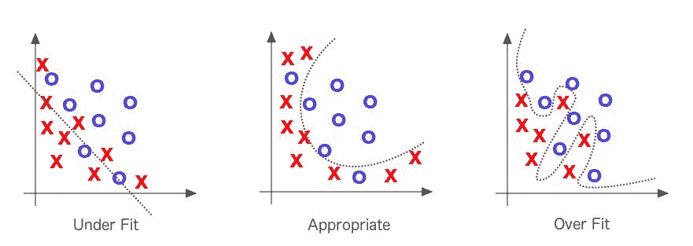**图 1**：过拟合与欠拟合的权衡（来源：《深度学习》一书，作者：Adam Gibson, Josh Patterson）

更技术性地说，如果你在训练数据上评估你的模型，而不是在测试数据或验证数据上进行评估，你可能无法明确指出模型是否发生了过拟合。常见的症状如下：

+   用于训练的数据的预测准确度可能过于准确（也就是说，有时甚至达到 100%）。

+   相较于随机预测，模型可能在新数据上表现出更好的性能。

+   我们喜欢将数据集拟合到某个分布，因为如果数据集与该分布较为接近，我们可以基于该理论分布作出假设，以指导我们如何处理数据。因此，数据中的正态分布使我们可以假设，在指定条件下，统计量的抽样分布是正态分布。正态分布由其均值和标准差定义，通常在所有变体中形状相同。

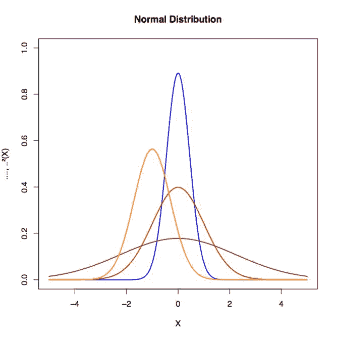**图 2**：数据中的正态分布有助于克服过拟合和欠拟合（来源：《深度学习》一书，作者：Adam Gibson, Josh Patterson）

有时，机器学习模型本身会在某些特定的调参或数据点上发生欠拟合，这意味着模型变得过于简化。我们的建议（如同其他人的观点一样）如下：

+   将数据集拆分为两部分以检测过拟合情况——第一部分用于训练和模型选择，称为训练集；第二部分是用于评估模型的测试集，取代机器学习工作流部分中的评估步骤。

+   另外，你也可以通过使用更简单的模型（例如，优先选择线性分类器而非高斯核 SVM）或通过增加机器学习模型的正则化参数（如果可用）来避免过拟合。

+   调整模型的参数值，以避免过拟合和欠拟合。

+   因此，解决欠拟合是首要任务，但大多数机器学习从业者建议投入更多的时间和精力，避免将模型过拟合到数据上。另一方面，许多机器学习从业者推荐将大规模数据集分成三个部分：训练集（50%）、验证集（25%）和测试集（25%）。他们还建议使用训练集构建模型，并使用验证集计算预测误差。测试集则建议用于评估最终模型的泛化误差。如果在监督学习过程中可用的标记数据较少，则不推荐拆分数据集。在这种情况下，使用交叉验证。更具体地说，将数据集分成 10 个（大致）相等的部分；然后，对于这 10 个部分中的每一个，迭代训练分类器，并使用第十部分来测试模型。

# 请关注 Spark MLlib 和 Spark ML

管道设计的第一步是创建构建模块（作为由节点和边组成的有向或无向图），并在这些模块之间建立链接。然而，作为数据科学家，你也应该专注于对节点（基本元素）进行扩展和优化，以便能够在后续阶段扩展你的应用程序，以处理大规模数据集，使得你的 ML 管道能够稳定地执行。管道过程还将帮助你使模型适应新数据集。不过，这些基本元素中的一些可能会显式地定义为特定领域和数据类型（例如文本、图像、视频、音频以及时空数据）。

除了这些类型的数据外，基本元素还应该适用于通用领域的统计或数学。将你的 ML 模型以这些基本元素的形式表示，将使你的工作流程更加透明、可解释、可访问且易于解释。

最近的一个例子是 ML-matrix，这是一个分布式矩阵库，可以在 Spark 上使用。请参考 JIRA 问题：[`issues.apache.org/jira/browse/SPARK-3434`](https://issues.apache.org/jira/browse/SPARK-3434)。

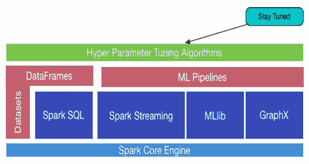**图 3：**保持同步并互操作 ML 和 MLlib

正如我们在前一节中所述，作为开发者，你可以将 Spark MLlib 中的实现技术与在 Spark ML、Spark SQL、GraphX 和 Spark Streaming 中开发的算法无缝结合，作为基于 RDD、DataFrame 和数据集的混合或互操作的 ML 应用程序，正如*图 3*所示。因此，这里的建议是保持同步或与周围最新的技术保持一致，以便改进你的 ML 应用程序。

# 为你的应用程序选择正确的算法

“我应该使用什么机器学习算法？”是许多初学者常常问的问题，但答案总是*取决于情况*。更详细地说：

+   这取决于你必须测试/使用的数据的量、质量、复杂性和性质

+   这取决于外部环境和参数，例如计算系统的配置或底层基础设施

+   这取决于你想用答案做什么

+   这取决于算法的数学和统计公式是如何转化为计算机的机器指令的

+   这取决于你有多少时间

现实情况是，即使是最有经验的数据科学家或数据工程师，在尝试所有算法之前也无法直接推荐哪个机器学习算法会表现最佳。大多数同意或不同意的陈述都会以“这取决于...嗯...”开始。习惯性地，你可能会想知道是否有机器学习算法的备忘单，如果有，我该如何使用那个备忘单？一些数据科学家表示，找到最好的算法唯一的确切方法是尝试所有的算法；所以，没有捷径，伙计！让我们再说得清楚一点；假设你确实有一组数据，并且想做一些聚类。技术上讲，如果你的数据是有标签的，这可以是一个分类或回归问题。但如果你有一个无标签数据集，你将使用聚类技术。那么，你脑海中出现的疑问如下：

+   在选择适当的算法之前，我应该考虑哪些因素？或者我应该随机选择一个算法？

+   我该如何选择任何适用于我的数据的数据预处理算法或工具？

+   我应该使用什么样的特征工程技术来提取有用的特征？

+   有哪些因素可以提高我的机器学习模型的性能？

+   我该如何调整我的机器学习应用以适应新的数据类型？

+   我能否为大规模数据集扩展我的机器学习应用？等等。

在本节中，我们将尝试用我们有限的机器学习知识回答这些问题。

# 选择算法时的考虑因素

我们在这里提供的建议或推荐是针对刚刚学习机器学习的初学者数据科学家。这些建议对于尝试选择一个最优算法来开始使用 Spark ML API 的专家数据科学家也很有用。别担心，我们会引导你朝着正确的方向前进！我们还建议在选择算法时考虑以下算法特性：

+   **准确性**：无论是为了获得最佳得分，还是为了在精确度、召回率、F1 得分或 AUC 等指标上获得一个近似解（*足够好*），同时权衡过拟合问题。

+   **训练时间**：用于训练模型的时间量（包括模型构建、评估和训练时间）。

+   **线性**：模型复杂性的一个方面，指的是问题是如何建模的。由于大多数非线性模型通常更复杂，难以理解和调优。

+   **参数数量**

+   **特征数量**：当特征数量超过实例数时出现的问题，*p>>n*问题。这通常需要使用降维或更好的特征工程方法来进行专门的处理或采用专门的技术。

# 准确性

从你的机器学习应用程序中获得最准确的结果并不总是必不可少的。根据你的使用需求，有时近似结果就足够了。如果情况是这样，你可以通过采用更好估计的方法大幅减少处理时间。当你熟悉 Spark 机器学习 API 的工作流后，你将享受拥有更多近似方法的优势，因为这些近似方法通常能自动避免机器学习模型的过拟合问题。现在，假设你有两个二分类算法，表现如下：  

| **分类器** | **精确度** | **召回率** |   |
| --- | --- | --- | --- |
| X | 96% | 89% |   |
| Y | 99% | 84% |   |

在这里，没有哪个分类器明显优于其他，因此它并不能立即指导你选择最优的一个。F1 分数，作为精确度和召回率的调和平均值，将帮助你。让我们计算它并将其放入表格：  

| **分类器** | **精确度** | **召回率** | **F1 分数** |   |
| --- | --- | --- | --- | --- |
| X | 96% | 89% | 92.36% |   |
| Y | 99% | 84% | 90.885% |   |

因此，拥有 F1 分数有助于在大量分类器中做出选择。它为所有分类器提供了一个清晰的优先级排序，从而为你的进步提供了明确的方向——那就是分类器**X**。

# 训练时间  

训练时间通常与模型训练和准确性密切相关。此外，你常常会发现某些算法在数据点数量上比其他算法表现得更为模糊。然而，当你的时间有限，但训练集非常庞大且特征较多时，你可以选择最简单的算法。在这种情况下，你可能需要在准确性上做出妥协。但至少，它将满足你的最低要求。  

# 线性  

近年来，许多机器学习算法利用了线性特性（在 Spark MLlib 和 Spark ML 中也可以使用）。例如，线性分类算法假设类可以通过绘制一个分隔的直线或使用更高维度的等价物来分离。而线性回归算法则假设数据趋势简单地遵循一条直线。对于某些机器学习问题，这一假设并不天真；然而，也可能有一些其他情况会导致准确性下降。尽管存在一些风险，线性算法仍然非常受数据工程师和数据科学家的欢迎，因为它们是应对突发问题的首选。更重要的是，这些算法通常简单且快速，能够在整个过程中训练你的模型。  

# 选择算法时请检查你的数据  

你可以在 UC Irvine 机器学习库找到许多机器学习数据集。以下数据属性也应优先考虑：  

+   参数数量  

+   特征数量  

+   训练数据集的大小  

# 参数数量  

参数或数据属性是数据科学家在设置算法时的抓手。它们是影响算法性能的数字，比如误差容忍度、迭代次数，或者算法行为变体之间的选择。算法的训练时间和准确性有时会非常敏感，这使得找到正确的设置变得困难。通常，具有大量参数的算法需要更多的试验和错误来找到最优的组合。

尽管这是跨越参数空间的一个好方法，但随着参数数量的增加，模型构建或训练时间呈指数增长。这既是一个困境，也是时间与性能之间的权衡。其积极方面是：

+   拥有许多参数通常表示机器学习算法具有更大的灵活性

+   你的机器学习应用实现了更好的准确度

# 你的训练集有多大？

如果你的训练集较小，低偏差且低方差的分类器，如朴素贝叶斯，在低偏差且高方差的分类器（如**k-最近邻算法**（**kNN**））上具有优势（也可以用于回归）。

**偏差、方差与 kNN 模型：** 实际上，*增加 k*会*减少方差*，但*增加偏差*。另一方面，*减少 k*会*增加方差*并*减少偏差*。随着*k*的增加，这种变异性被减小。但如果我们过度增加*k*，那么我们就不再遵循真实的边界线，观察到的是较高的偏差。这就是偏差-方差权衡的本质。

我们已经看到过拟合和欠拟合的问题了。现在，你可以假设，处理偏差和方差就像处理过拟合和欠拟合一样。随着模型复杂度的增加，偏差减少，而方差增加。随着模型中参数的增多，模型的复杂度上升，方差成为我们主要关注的问题，而偏差则稳步下降。换句话说，偏差对模型复杂度的导数为负，而方差则有正斜率。请参考下图以便更好地理解：

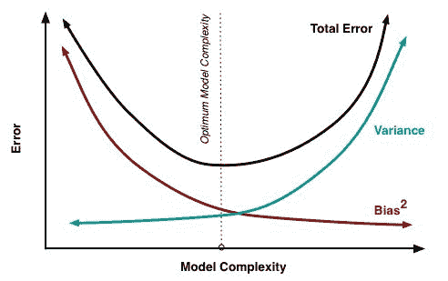**图 4：** 偏差和方差对总误差的贡献

因此，后者将会过拟合。然而，低偏差且高方差的分类器则在训练集线性或指数增长时开始占据优势，因为它们具有较低的渐近误差。高偏差的分类器则不足以提供准确的模型。

# 特征数量

对于某些类型的实验数据集，提取的特征数可能会比数据点本身的数量大得多。通常在基因组学、生物医学或文本数据中会出现这种情况。大量的特征可能会拖慢一些学习算法的速度，使得训练时间极度增加。**支持向量机**（**SVM**）在这种情况下特别适用，因为它具有较高的准确性，关于过拟合的良好理论保证，并且使用合适的核函数。

**支持向量机与核函数**：任务是找到一组权重和偏置，使得可以最大化边距的函数：

y = w*¥(x) + b,

其中 *w* 是权重，*¥* 是特征向量，*b* 是偏置。现在如果 *y > 0*，那么我们将数据分类为 *1* 类，反之为 *0* 类，而特征向量 *¥(x)* 使得数据线性可分。然而，使用核函数使得计算过程更快、更简便，尤其当特征向量 *¥* 包含高维数据时。我们来看一个具体的例子。假设我们有以下 *x* 和 *y* 的值：*x = (x1, x2, x3)* 和 *y = (y1, y2, y3)*，那么对于函数 *f(x) = (x1x1, x1x2, x1x3, x2x1, x2x2, x2x3, x3x1, x3x2, x3x3)*，核函数为 *K(x, y) = (<x, y>)²*。按照上面的方式，如果 *x = (1, 2, 3)* 和 *y = (4, 5, 6)*，那么我们得到以下值：

f(x) = (1, 2, 3, 2, 4, 6, 3, 6, 9)

f(y) = (16, 20, 24, 20, 25, 30, 24, 30, 36)

<f(x), f(y)> = 16 + 40 + 72 + 40 + 100 + 180 + 72 + 180 + 324 = 1024

这是一种简单的线性代数操作，将三维空间映射到九维空间。另一方面，核函数是用于支持向量机的相似性度量。因此，建议根据对不变性的先验知识选择合适的核函数值。核函数、核函数参数和正则化参数的选择可以通过优化基于交叉验证的模型选择来自动化。

然而，自动选择核函数及其参数是一个棘手的问题，因为很容易导致模型选择标准的过拟合。这可能导致一个比最初更差的模型。现在，如果我们使用核函数 *K(x, y)*，它给出的结果与传统计算相同，但计算过程要简单得多——即 (4 + 10 + 18) ² = 32² = 1024。

# 机器学习模型的超参数调优

调整算法参数是一个过程，通过这个过程可以让算法在运行时间和内存使用上表现得最优。在贝叶斯统计中，超参数是先验分布的一个参数。在机器学习中，超参数指的是那些不能通过常规训练过程直接学习到的参数。超参数通常在实际训练过程开始之前就已经确定。这是通过为这些超参数设置不同的值，训练不同的模型，然后通过测试它们来决定哪些效果最好。以下是一些典型的超参数示例：

+   树的叶节点数、箱数或深度

+   迭代次数

+   矩阵分解中的潜在因子数

+   学习率

+   深度神经网络中的隐藏层数

+   k-means 聚类中的聚类数量，等等。

本节将讨论如何使用交叉验证技术和网格搜索进行超参数调优。

# 超参数调优

超参数调优是一种选择合适超参数组合的技术，基于呈现数据的性能。它是从实际机器学习算法中获得有意义且准确结果的基本要求之一。下图展示了模型调优过程、考虑因素和工作流程：

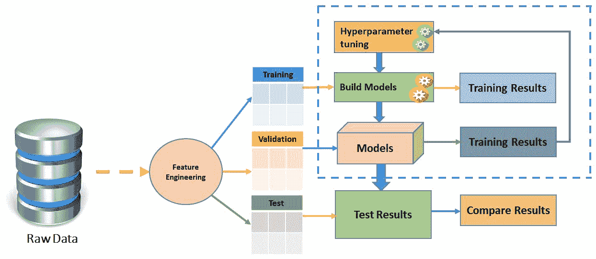**图 5**：模型调优过程、考虑因素和工作流程

例如，假设我们有两个超参数需要调节，来自第十一章的*图 17*，*学习机器学习 - Spark MLlib 和 Spark ML*，一个使用逻辑回归估计器的 Spark ML 管道模型（虚线仅出现在管道拟合过程中）。我们可以看到，我们为每个超参数提供了三个候选值。因此，总共有九种组合。然而，图中只显示了四个，即 Tokenizer、HashingTF、Transformer 和逻辑回归（LR）。现在，我们希望找到最终能得到最佳评估结果的模型。拟合后的模型包括 Tokenizer、HashingTF 特征提取器和拟合后的逻辑回归模型：

如果你回想一下来自第十一章的*图 17*，*学习机器学习 - Spark MLlib 和 Spark ML*，那么虚线仅出现在管道拟合过程中。如前所述，拟合后的管道模型是一个 Transformer。Transformer 可以用于预测、模型验证和模型检查。此外，我们还提到，机器学习算法的一个不幸的特点是，通常它们有许多超参数需要调节以提高性能。例如，这些超参数中的正则化程度，与由 Spark MLlib 优化的模型参数是不同的。

因此，没有专家知识的情况下，很难猜测或测量出最佳的超参数组合，因为需要使用的数据和算法类型都很复杂。由于复杂的数据集是基于机器学习问题类型的，管道的规模和超参数的数量可能会呈指数级（或线性）增长；即使对于机器学习专家来说，超参数调优也变得繁琐，更不用说调优结果可能变得不可靠了。

根据 Spark API 文档，Spark ML 的估算器和转换器都使用一个唯一且统一的 API 来指定。`ParamMap`是由一组（参数，值）对组成的，每个 Param 是一个具有自包含文档的命名参数，由 Spark 提供。技术上，有两种方式可以将参数传递给算法，如下所述：

+   **设置参数**：如果 LR 是逻辑回归（即 Estimator）的一个实例，你可以调用`setMaxIter()`方法，如下所示：`LR.setMaxIter(5)`。这基本上是指向回归实例的模型拟合，如下所示：`LR.fit()`。在这个特定示例中，最多会进行五次迭代。

+   **第二个选项**：这个选项涉及将`ParamMaps`传递给`fit()`或`transform()`（有关详细信息，请参见*图 5*）。在这种情况下，任何参数都会被之前通过 setter 方法在 ML 应用程序特定代码或算法中指定的`ParamMaps`覆盖。

# 网格搜索参数调优

假设在进行必要的特征工程后，你选择了你的超参数。在这种情况下，全面的网格搜索超参数和特征的空间计算开销过大。因此，你需要在 K 折交叉验证的折叠中执行一次，而不是完全的网格搜索：

+   使用交叉验证对训练集的折叠进行超参数调优，使用所有可用的特征

+   使用这些超参数选择所需的特征

+   对 K 的每个折叠重复计算

+   最终模型使用所有数据构建，使用从每个 CV 折叠中选择的 N 个最常见的特征

有趣的是，超参数也会在交叉验证循环中使用所有数据再次调优。与完全网格搜索相比，这种方法会带来较大的缺点吗？本质上，我在每个自由参数的维度上进行线性搜索（先在一个维度上找到最佳值，保持常数，然后在下一个维度上找到最佳值），而不是每一种参数设置的所有组合。沿单个参数进行搜索，而不是一起优化所有参数的最大缺点，就是你忽略了它们之间的交互作用。

举例来说，多个参数通常会影响模型的复杂度。在这种情况下，你需要查看它们之间的交互作用，以便成功地优化超参数。根据数据集的大小以及比较的模型数量，返回最大观察性能的优化策略可能会遇到问题（无论是网格搜索还是你的策略，都存在此问题）。

其原因是，搜索大量性能估计以找到最大值会削减性能估计的方差：你可能会最终得到一个看似不错的模型和训练/测试拆分组合。更糟的是，你可能会得到多个看似完美的组合，然后优化过程就无法判断选择哪个模型，从而变得不稳定。

# 交叉验证

交叉验证（也称为**旋转估计**（**RE**））是一种用于评估统计分析和结果质量的模型验证技术。其目标是使模型能够泛化到独立的测试集上。交叉验证技术的一个完美应用是从机器学习模型进行预测。它能帮助你估计当你将预测模型部署为机器学习应用时，模型在实际中的表现如何。交叉验证过程中，通常使用已知类型的数据集来训练模型，反之，则使用未知类型的数据集进行测试。

在这方面，交叉验证有助于描述数据集，以便在训练阶段使用验证集来测试模型。有两种交叉验证类型，如下所述：

+   **穷尽交叉验证**：包括留 P 交叉验证和留一交叉验证。

+   **非穷尽交叉验证**：包括 K 折交叉验证和重复随机子抽样交叉验证。

在大多数情况下，研究人员/数据科学家/数据工程师使用 10 折交叉验证，而不是在验证集上进行测试。这是跨用例和问题类型中最广泛使用的交叉验证技术，正如下图所示：

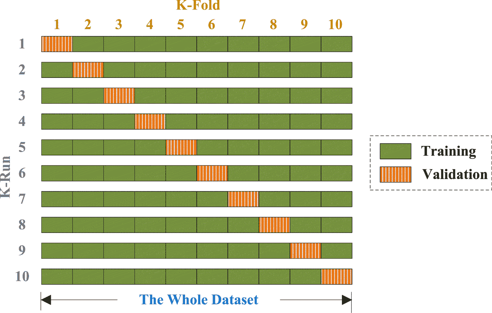**图 6：**交叉验证基本上将你的完整可用训练数据分成若干折。这个参数是可以指定的。然后，整个管道会对每一折运行一次，并且每一折都会训练一个机器学习模型。最后，通过投票方案对分类器进行联合，或者通过平均对回归进行联合。

此外，为了减少变异性，会使用不同的分区进行多次交叉验证迭代；最后，验证结果会在各轮中取平均值。下图展示了使用逻辑回归进行超参数调优的示例：

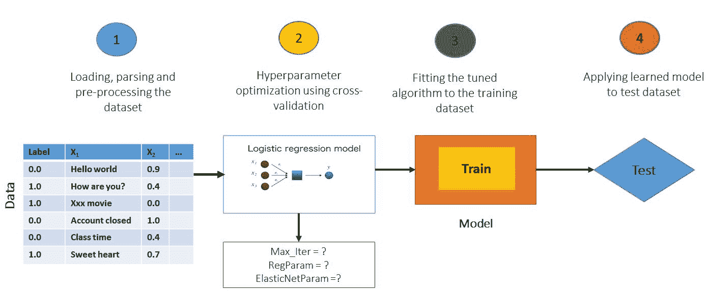**图 7：**使用逻辑回归进行超参数调优的示例

使用交叉验证代替常规验证有两个主要优点，概述如下：

+   首先，如果可用的数据不足以在单独的训练集和测试集之间进行划分，就可能会失去重要的建模或测试能力。

+   其次，K 折交叉验证估计器的方差低于单一的保留集估计器。较低的方差限制了变动，这在数据量有限时尤为重要。

在这种情况下，合理的估算模型预测和相关性能的公平方式是使用交叉验证作为一种强大的模型选择和验证技术。如果我们需要手动选择特征和参数调优，那么在此之后，我们可以对整个数据集进行 10 折交叉验证来评估模型。什么策略最合适？我们建议你选择一种提供乐观评分的策略，具体如下：

+   将数据集分为训练集，例如 80%，和测试集 20%或其他你选择的比例

+   使用 K 折交叉验证在训练集上调优模型

+   重复交叉验证，直到找到优化并调优的模型。

现在，使用你的模型对测试集进行预测，以估算模型误差。

# 信用风险分析 – 超参数调优的示例

在本节中，我们将展示机器学习超参数调优的实际示例，涉及网格搜索和交叉验证技术。更具体地说，首先，我们将开发一个信用风险管道，该管道在银行和信用合作社等金融机构中常见。随后，我们将探讨如何通过超参数调优提高预测准确性。在深入示例之前，让我们快速概述一下什么是信用风险分析，以及它为何重要？

# 什么是信用风险分析？它为何重要？

当申请人申请贷款并且银行收到该申请时，基于申请人的资料，银行需要决定是否批准该贷款申请。在这方面，银行在贷款申请决策时面临两种类型的风险：

+   **申请人属于信用风险较低**：这意味着客户或申请人更有可能偿还贷款。如果贷款未被批准，银行可能会因此失去业务。

+   **申请人属于信用风险较高**：这意味着客户或申请人最有可能无法偿还贷款。在这种情况下，批准贷款将导致银行遭受财务损失。

该机构表示，第二种情况比第一种情况更具风险，因为银行更有可能无法收回借款。因此，大多数银行或信用合作社会评估向客户、申请人或顾客借款所涉及的风险。在商业分析中，最小化风险往往能最大化银行自身的利润。

换句话说，从财务角度来看，最大化利润并最小化损失非常重要。银行通常会根据申请人的不同因素和参数（例如有关贷款申请的各类人口和社会经济条件）来决定是否批准贷款申请。

# 数据集探索

德国信用数据集从 UCI 机器学习库下载，网址为 [`archive.ics.uci.edu/ml/machine-learning-databases/statlog/german/`](https://archive.ics.uci.edu/ml/machine-learning-databases/statlog/german/)。虽然在该链接中可以找到数据集的详细描述，但我们在 **表 3** 中提供了一些简要的见解。数据包含了关于 21 个变量的信用相关数据，以及对于 1000 名贷款申请人是否被认为是好的或坏的信用风险的分类（即二分类问题）。

以下表格展示了在将数据集公开之前，所考虑的每个变量的详细信息：

| **条目** | **变量** | **说明** |
| --- | --- | --- |
| 1 | creditability | 还款能力：值为 1.0 或 0.0 |
| 2 | balance | 当前余额 |
| 3 | duration | 贷款申请期限 |
| 4 | history | 是否有不良贷款历史？ |
| 5 | purpose | 贷款目的 |
| 6 | amount | 申请金额 |
| 7 | savings | 每月储蓄 |
| 8 | employment | 就业状态 |
| 9 | instPercent | 利率百分比 |
| 10 | sexMarried | 性别及婚姻状态 |
| 11 | guarantors | 是否有担保人？ |
| 12 | residenceDuration | 当前地址的居住时长 |
| 13 | assets | 净资产 |
| 14 | age | 申请人年龄 |
| 15 | concCredit | 并行信用 |
| 16 | apartment | 住宅状态 |
| 17 | credits | 当前信用 |
| 18 | occupation | 职业 |
| 19 | dependents | 赡养人数 |
| 20 | hasPhone | 申请人是否使用电话 |
| 21 | foreign | 申请人是否为外国人 |

请注意，尽管 *表 3* 描述了与变量相关的标题，但数据集本身没有相关标题。在 *表 3* 中，我们展示了每个变量的名称、位置以及相关的重要性。

# 步骤示例：使用 Spark ML

在这里，我们将提供一个使用随机森林分类器进行信用风险预测的逐步示例。步骤包括从数据导入、一些统计分析、训练集准备，到最终的模型评估：

**步骤 1.** 加载并解析数据集到 RDD：

```py
val creditRDD = parseRDD(sc.textFile("data/germancredit.csv")).map(parseCredit) 

```

对于上一行，`parseRDD()` 方法用于用 `,` 分割条目，然后将它们转换为 `Double` 类型（即数值）。该方法如下所示：

```py
def parseRDD(rdd: RDD[String]): RDD[Array[Double]] = { 
rdd.map(_.split(",")).map(_.map(_.toDouble)) 
  } 

```

另一方面，`parseCredit()` 方法用于基于 `Credit` 案例类解析数据集：

```py
def parseCredit(line: Array[Double]): Credit = { 
Credit( 
line(0), line(1) - 1, line(2), line(3), line(4), line(5), 
line(6) - 1, line(7) - 1, line(8), line(9) - 1, line(10) - 1, 
line(11) - 1, line(12) - 1, line(13), line(14) - 1, line(15) - 1, 
line(16) - 1, line(17) - 1, line(18) - 1, line(19) - 1, line(20) - 1) 
  } 

```

`Credit` 案例类如下所示：

```py
case class Credit( 
creditability: Double, 
balance: Double, duration: Double, history: Double, purpose: Double, amount: Double, 
savings: Double, employment: Double, instPercent: Double, sexMarried: Double, guarantors: Double, 
residenceDuration: Double, assets: Double, age: Double, concCredit: Double, apartment: Double, 
credits: Double, occupation: Double, dependents: Double, hasPhone: Double, foreign: Double) 

```

**步骤 2.** 准备 ML 管道的数据框架 - 获取 ML 管道的数据框架

```py
val sqlContext = new SQLContext(sc) 
import sqlContext._ 
import sqlContext.implicits._ 
val creditDF = creditRDD.toDF().cache() 

```

将它们保存为临时视图，以便于查询：

```py
creditDF.createOrReplaceTempView("credit") 

```

让我们来看看这个数据框的快照：

```py
creditDF.show

```

上述 `show()` 方法打印了信贷数据框：

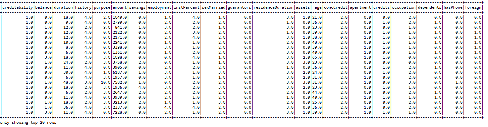**图 8：** 信贷数据集的快照

**步骤 3. 观察相关统计信息** - 首先，让我们看看一些聚合值：

```py
sqlContext.sql("SELECT creditability, avg(balance) as avgbalance, avg(amount) as avgamt, avg(duration) as avgdur  FROM credit GROUP BY creditability ").show 

```

让我们看看余额的统计数据：

```py
creditDF.describe("balance").show 

```

现在，让我们查看平均余额的信贷能力：

```py
creditDF.groupBy("creditability").avg("balance").show 

```

三行代码的输出：

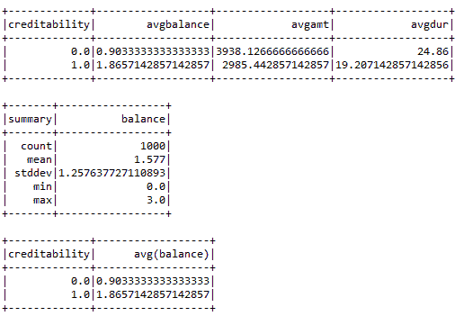**图 9：** 数据集的一些统计信息

**步骤 4. 特征向量和标签的创建** - 如你所见，credibility 列是响应列，结果时，我们需要创建特征向量，而不考虑该列。现在，让我们按照以下方式创建特征列：

```py
val featureCols = Array("balance", "duration", "history", "purpose", "amount", "savings", "employment", "instPercent", "sexMarried",
"guarantors", "residenceDuration", "assets", "age", "concCredit",
"apartment", "credits", "occupation", "dependents", "hasPhone",
"foreign") 

```

让我们使用 `VectorAssembler()` API 来组合这些选定列的所有特征，如下所示：

```py
val assembler = new VectorAssembler().setInputCols(featureCols).setOutputCol("features") 
val df2 = assembler.transform(creditDF) 

```

现在让我们看看特征向量是什么样子的：

```py
df2.select("features").show

```

上述行显示了由 VectorAssembler 转换器创建的特征：

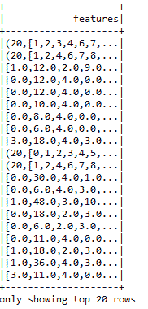**图 10：** 使用 VectorAssembler 为 ML 模型生成特征

现在，让我们使用 `StringIndexer` 从旧的响应列“creditability”中创建一个新列作为标签，如下所示：

```py
val labelIndexer = new StringIndexer().setInputCol("creditability").setOutputCol("label") 
val df3 = labelIndexer.fit(df2).transform(df2) 
df3.select("label", "features").show

```

上述行显示了由 `VectorAssembler` 转换器创建的特征和标签：

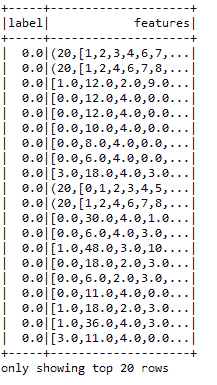**图 11：** 使用 VectorAssembler 的 ML 模型的对应标签和特征

**步骤 5.** 准备训练集和测试集：

```py
val splitSeed = 5043 
val Array(trainingData, testData) = df3.randomSplit(Array(0.80, 0.20), splitSeed) 

```

**步骤 6. 训练随机森林模型** - 首先，实例化模型：

```py
val classifier = new RandomForestClassifier() 
      .setImpurity("gini") 
      .setMaxDepth(30) 
      .setNumTrees(30) 
      .setFeatureSubsetStrategy("auto") 
      .setSeed(1234567) 
      .setMaxBins(40) 
      .setMinInfoGain(0.001) 

```

有关前面参数的解释，请参考本章中的随机森林算法部分。现在，让我们使用训练集训练模型：

```py
val model = classifier.fit(trainingData)

```

**步骤 7.** 计算测试集的原始预测：

```py
val predictions = model.transform(testData) 

```

让我们查看这个数据框的前 20 行：

```py
predictions.select("label","rawPrediction", "probability", "prediction").show()

```

上述行显示了包含标签、原始预测、概率和实际预测的 DataFrame：

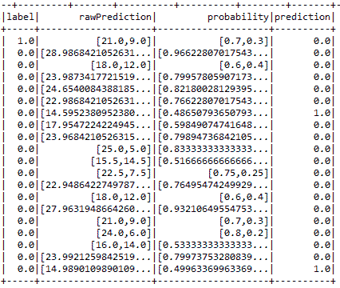**图 12：** 包含测试集原始和实际预测的 DataFrame

现在，在看到最后一列的预测后，银行可以决定接受哪些申请。

**步骤 8. 调整前的模型评估** - 实例化二元评估器：

```py
val binaryClassificationEvaluator = new BinaryClassificationEvaluator() 
      .setLabelCol("label") 
      .setRawPredictionCol("rawPrediction") 

```

计算测试集预测准确性如下：

```py
val accuracy = binaryClassificationEvaluator.evaluate(predictions) 
println("The accuracy before pipeline fitting: " + accuracy) 

```

管道拟合之前的准确率：`0.751921784149243`

这次，准确率为 75%，虽然不算很好，但让我们计算二元分类器的其他重要性能指标，如 **接收者操作特征曲线下的面积**（**AUROC**）和 **精度召回曲线下的面积**（**AUPRC**）：

```py
println("Area Under ROC before tuning: " + printlnMetric("areaUnderROC"))         
println("Area Under PRC before tuning: "+  printlnMetric("areaUnderPR")) 
Area Under ROC before tuning: 0.8453079178885631 Area Under PRC before tuning: 0.751921784149243

```

`printlnMetric()` 方法如下：

```py
def printlnMetric(metricName: String): Double = { 
  val metrics = binaryClassificationEvaluator.setMetricName(metricName)
                                             .evaluate(predictions) 
  metrics 
} 

```

最后，让我们使用 `RegressionMetrics()` API 计算一些我们在训练过程中使用的随机森林模型的其他性能指标：

```py
val rm = new RegressionMetrics( 
predictions.select("prediction", "label").rdd.map(x => 
        (x(0).asInstanceOf[Double], x(1).asInstanceOf[Double]))) 

```

现在，让我们看看我们的模型如何：

```py
println("MSE: " + rm.meanSquaredError) 
println("MAE: " + rm.meanAbsoluteError) 
println("RMSE Squared: " + rm.rootMeanSquaredError) 
println("R Squared: " + rm.r2) 
println("Explained Variance: " + rm.explainedVariance + "\n") 

```

我们得到以下输出：

```py
MSE: 0.2578947368421053
MAE: 0.2578947368421053
RMSE Squared: 0.5078333750770082
R Squared: -0.13758553274682295
Explained Variance: 0.16083102493074794

```

还不错！不过，也不算满意，对吧？让我们使用网格搜索和交叉验证技术来调整模型。

**步骤 9. 使用网格搜索和交叉验证进行模型调优** - 首先，让我们使用 `ParamGridBuilder` API 构建一个参数网格，在 20 到 70 棵树之间搜索，`maxBins` 在 25 到 30 之间，`maxDepth` 在 5 到 10 之间，且不纯度使用熵和基尼系数：

```py
val paramGrid = new ParamGridBuilder()
                    .addGrid(classifier.maxBins, Array(25, 30))
                    .addGrid(classifier.maxDepth, Array(5, 10))
                    .addGrid(classifier.numTrees, Array(20, 70))
                    .addGrid(classifier.impurity, Array("entropy", "gini"))
                    .build()

```

让我们使用训练集来训练交叉验证模型，如下所示：

```py
val cv = new CrossValidator()
             .setEstimator(pipeline)
             .setEvaluator(binaryClassificationEvaluator)
             .setEstimatorParamMaps(paramGrid)
             .setNumFolds(10)
val pipelineFittedModel = cv.fit(trainingData)

```

计算测试集的原始预测，如下所示：

```py
val predictions2 = pipelineFittedModel.transform(testData) 

```

**步骤 10. 调优后的模型评估** - 让我们看一下准确率：

```py
val accuracy2 = binaryClassificationEvaluator.evaluate(predictions2)
println("The accuracy after pipeline fitting: " + accuracy2)

```

我们得到以下输出：

```py
The accuracy after pipeline fitting: 0.8313782991202348

```

现在，准确率超过了 83%。确实有了很大的改进！让我们看看另外两个指标，计算 AUROC 和 AUPRC：

```py
def printlnMetricAfter(metricName: String): Double = { 
val metrics = binaryClassificationEvaluator.setMetricName(metricName).evaluate(predictions2) 
metrics 
    } 
println("Area Under ROC after tuning: " + printlnMetricAfter("areaUnderROC"))     
println("Area Under PRC after tuning: "+  printlnMetricAfter("areaUnderPR"))

```

我们得到以下输出：

```py
Area Under ROC after tuning: 0.8313782991202345
 Area Under PRC after tuning: 0.7460301367852662

```

现在，根据 `RegressionMetrics` API，计算其他指标：

```py
val rm2 = new RegressionMetrics(predictions2.select("prediction", "label").rdd.map(x => (x(0).asInstanceOf[Double], x(1).asInstanceOf[Double]))) 
 println("MSE: " + rm2.meanSquaredError) 
println("MAE: " + rm2.meanAbsoluteError) 
println("RMSE Squared: " + rm2.rootMeanSquaredError) 
println("R Squared: " + rm2.r2) 
println("Explained Variance: " + rm2.explainedVariance + "\n")  

```

我们得到以下输出：

```py
MSE: 0.268421052631579
 MAE: 0.26842105263157895
 RMSE Squared: 0.5180936716768301
 R Squared: -0.18401759530791795
 Explained Variance: 0.16404432132963992

```

**步骤 11. 查找最佳的交叉验证模型** - 最后，让我们找到最佳的交叉验证模型信息：

```py
pipelineFittedModel 
      .bestModel.asInstanceOf[org.apache.spark.ml.PipelineModel] 
      .stages(0) 
      .extractParamMap 
println("The best fitted model:" + pipelineFittedModel.bestModel.asInstanceOf[org.apache.spark.ml.PipelineModel].stages(0)) 

```

我们得到以下输出：

```py
The best fitted model:RandomForestClassificationModel (uid=rfc_1fcac012b37c) with 70 trees

```

# 一个基于 Spark 的推荐系统

推荐系统试图根据其他用户的历史预测用户可能感兴趣的潜在项目。基于模型的协同过滤在许多公司中被广泛使用，例如 Netflix。值得注意的是，Netflix 是一家美国娱乐公司，由 Reed Hastings 和 Marc Randolph 于 1997 年 8 月 29 日在加利福尼亚州的 Scotts Valley 创立。它专注于并提供在线流媒体和视频点播服务，以及通过邮寄方式提供 DVD。2013 年，Netflix 扩展到电影和电视制作以及在线分发。到 2017 年，该公司将总部设在加利福尼亚州的 Los Gatos（来源：维基百科）。Netflix 是一个实时电影推荐的推荐系统。在本节中，我们将看到一个完整的例子，了解它如何为新用户推荐电影。

# 基于 Spark 的模型推荐

Spark MLlib 中的实现支持基于模型的协同过滤。在基于模型的协同过滤技术中，用户和产品通过一小组因子来描述，这些因子也称为 **潜在因子** (**LFs**)。从下图中，你可以对不同的推荐系统有一些了解。*图 13* 说明了为什么我们要使用基于模型的协同过滤进行电影推荐示例：

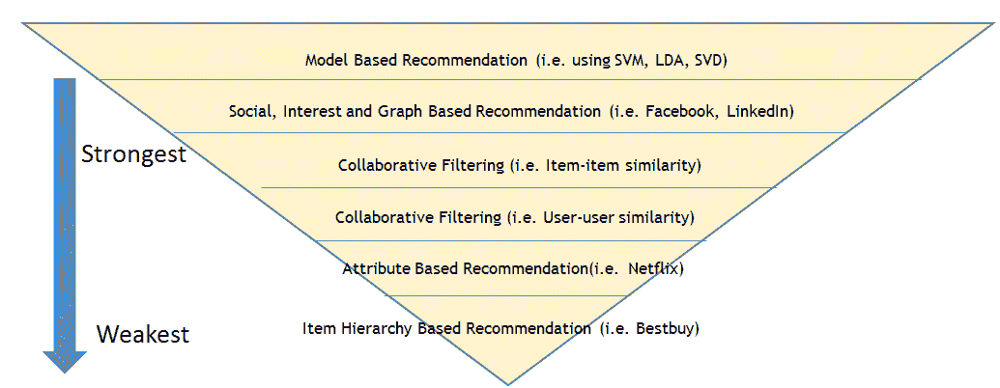**图 13**：不同推荐系统的对比视图

然后使用 LF 来预测缺失的条目。Spark API 提供了交替最小二乘法（也称为 ALS）算法的实现，该算法用于通过考虑六个参数来学习这些潜在因子，包括：

+   *numBlocks*：这是用于并行计算的块数（设置为 -1 以自动配置）。

+   *rank*：这是模型中潜在因子的数量。

+   *iterations*：这是 ALS 运行的迭代次数。ALS 通常在 20 次迭代或更少的次数内收敛到一个合理的解。

+   *lambda*：这指定了 ALS 中的正则化参数。

+   *implicitPrefs*：该参数指定是否使用 *显式反馈* ALS 变体，或者使用适应于 *隐式反馈* 数据的变体。

+   *alpha*：这是一个适用于 ALS 隐式反馈变体的参数，控制在偏好观测中的 *基线* 信心。

请注意，要构建具有默认参数的 ALS 实例；您可以根据需求设置该值。默认值如下：`numBlocks: -1`、`rank: 10`、`iterations: 10`、`lambda: 0.01`、`implicitPrefs: false` 和 `alpha: 1.0`。

# 数据探索

电影及其相应的评分数据集是从 MovieLens 网站下载的 ([`movielens.org`](https://movielens.org))。根据 MovieLens 网站上的数据描述，所有评分都记录在 `ratings.csv` 文件中。该文件中的每一行（紧跟在标题之后）代表一位用户对一部电影的评分。

CSV 数据集包含以下列：**userId**、**movieId**、**rating** 和 **timestamp**，如 *图 14* 所示。行按 **userId** 排序，用户内再按 **movieId** 排序。评分是基于五颗星的评分标准，每次增量为半颗星（从 0.5 星到 5.0 星）。时间戳表示自 1970 年 1 月 1 日午夜协调世界时（UTC）以来的秒数，我们有来自 668 个用户对 10,325 部电影的 105,339 条评分：

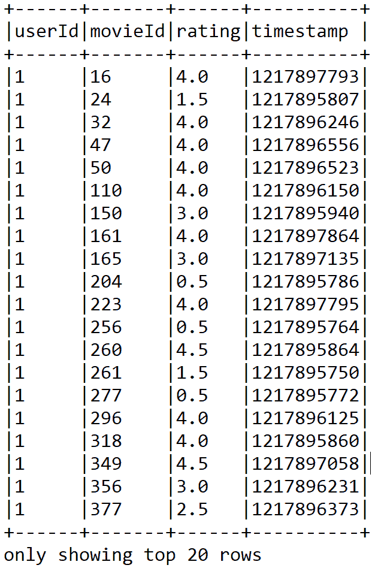**图 14：** 评分数据集快照

另一方面，电影信息包含在 `movies.csv` 文件中。除了标题信息外，该文件的每一行代表一部电影，包含以下列：movieId、title 和 genres（见 *图 14*）。电影标题可以手动创建或插入，或者从电影数据库网站 [`www.themoviedb.org/`](https://www.themoviedb.org/) 导入。然而，发行年份会显示在括号中。由于电影标题是手动插入的，因此可能存在一些错误或不一致。建议读者检查 IMDb 数据库 ([`www.ibdb.com/`](https://www.ibdb.com/))，确保没有与相应发行年份不一致或错误的标题。

类型是一个分隔列表，可以从以下类型类别中选择：

+   动作片、冒险片、动画片、儿童片、喜剧片、犯罪片

+   纪录片、剧情片、幻想片、黑色电影、恐怖片、音乐剧

+   悬疑片、浪漫片、科幻片、惊悚片、西部片、战争片

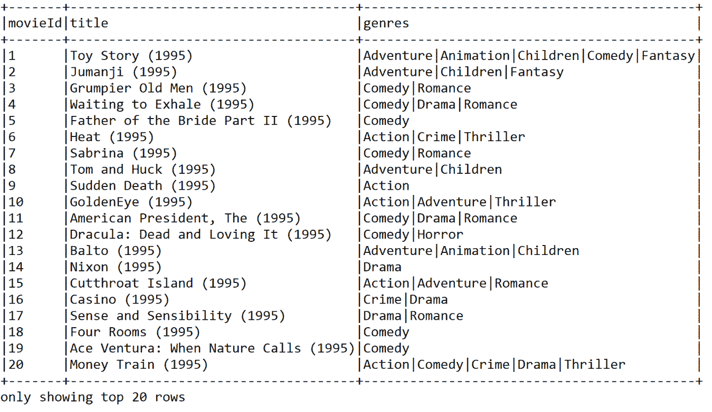**图 15**：前 20 部电影的标题和类型

# 使用 ALS 进行电影推荐

在本小节中，我们将通过从数据收集到电影推荐的逐步示例，展示如何为其他用户推荐电影。

**步骤 1\. 加载、解析和探索电影和评分数据集** - 以下是代码示例：

```py
val ratigsFile = "data/ratings.csv"
val df1 = spark.read.format("com.databricks.spark.csv").option("header", true).load(ratigsFile)
val ratingsDF = df1.select(df1.col("userId"), df1.col("movieId"), df1.col("rating"), df1.col("timestamp"))
ratingsDF.show(false)

```

该代码段应返回评分的 DataFrame。另一方面，以下代码段显示了电影的 DataFrame：

```py
val moviesFile = "data/movies.csv"
val df2 = spark.read.format("com.databricks.spark.csv").option("header", "true").load(moviesFile)
val moviesDF = df2.select(df2.col("movieId"), df2.col("title"), df2.col("genres"))

```

**步骤 2\. 将两个 DataFrame 注册为临时表以便于查询** - 为了注册这两个数据集，我们可以使用以下代码：

```py
ratingsDF.createOrReplaceTempView("ratings")
moviesDF.createOrReplaceTempView("movies")

```

这将通过在内存中创建一个临时视图作为表来加速内存查询。使用`createOrReplaceTempView()`方法创建的临时表的生命周期与用于创建该 DataFrame 的`[[SparkSession]]`相绑定。

**步骤 3\. 探索和查询相关统计信息** - 让我们检查与评分相关的统计信息。只需要使用以下代码行：

```py
val numRatings = ratingsDF.count()
val numUsers = ratingsDF.select(ratingsDF.col("userId")).distinct().count()
val numMovies = ratingsDF.select(ratingsDF.col("movieId")).distinct().count()
println("Got " + numRatings + " ratings from " + numUsers + " users on " + numMovies + " movies.")

```

你应该会发现，用户 668 对 10,325 部电影进行了 105,339 次评分。现在，让我们获取最大和最小评分，并统计评分电影的用户数。为此，你需要在前一步创建的内存中的评分表上执行 SQL 查询。这里进行查询很简单，类似于从 MySQL 数据库或关系型数据库管理系统（RDBMS）执行查询。如果你不熟悉基于 SQL 的查询，建议查阅 SQL 查询规范，了解如何使用`SELECT`从特定表中选择数据，如何使用`ORDER`进行排序，以及如何使用`JOIN`关键字进行联接操作。

好吧，如果你知道 SQL 查询，你应该能通过以下复杂的 SQL 查询获得一个新的数据集：

```py
// Get the max, min ratings along with the count of users who have rated a movie.
val results = spark.sql("select movies.title, movierates.maxr, movierates.minr, movierates.cntu "
       + "from(SELECT ratings.movieId,max(ratings.rating) as maxr,"
       + "min(ratings.rating) as minr,count(distinct userId) as cntu "
       + "FROM ratings group by ratings.movieId) movierates "
       + "join movies on movierates.movieId=movies.movieId "
       + "order by movierates.cntu desc") 
results.show(false) 

```

我们得到了以下输出：

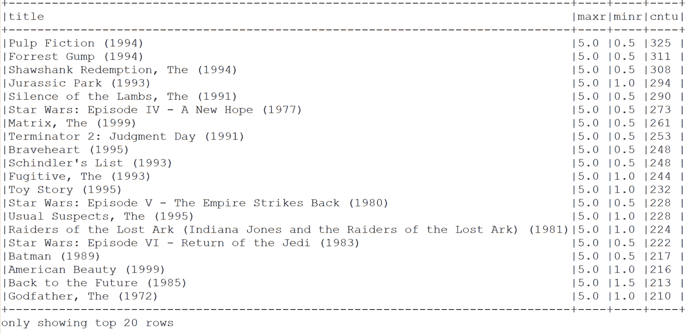**图 16：** 最大、最小评分及评分电影的用户数

为了获得更多的洞察，我们需要了解更多关于用户及其评分的信息。现在，让我们找出最活跃的用户以及他们评分电影的次数：

```py
// Show the top 10 mostactive users and how many times they rated a movie
val mostActiveUsersSchemaRDD = spark.sql("SELECT ratings.userId, count(*) as ct from ratings "
               + "group by ratings.userId order by ct desc limit 10")
mostActiveUsersSchemaRDD.show(false)

```

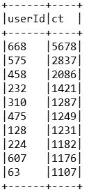**图 17：** 最活跃的 10 个用户以及他们评分电影的次数

让我们查看某个特定用户，找到例如用户 668 评分高于 4 的电影：

```py
// Find the movies that user 668 rated higher than 4
val results2 = spark.sql(
"SELECT ratings.userId, ratings.movieId,"
         + "ratings.rating, movies.title FROM ratings JOIN movies"
         + "ON movies.movieId=ratings.movieId"
         + "where ratings.userId=668 and ratings.rating > 4")
results2.show(false)

```

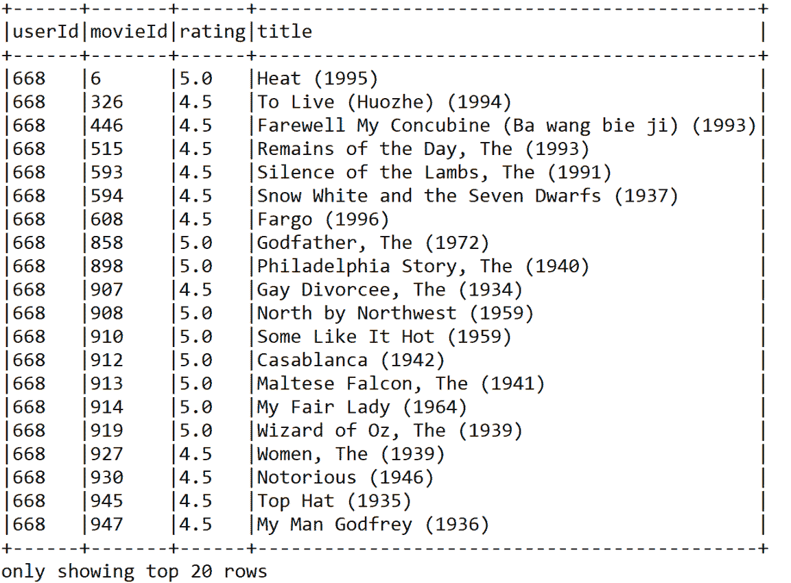**图 18：** 用户 668 评分高于 4 的电影

**步骤 4\. 准备训练和测试评分数据并查看数量** - 以下代码将评分 RDD 划分为训练数据 RDD（75%）和测试数据 RDD（25%）。这里的种子值是可选的，但为了可重复性目的，推荐使用：

```py
// Split ratings RDD into training RDD (75%) & test RDD (25%)
val splits = ratingsDF.randomSplit(Array(0.75, 0.25), seed = 12345L)
val (trainingData, testData) = (splits(0), splits(1))
val numTraining = trainingData.count()
val numTest = testData.count()
println("Training: " + numTraining + " test: " + numTest)

```

你应该会发现训练集中有 78,792 条评分，测试集中有 26,547 条评分

DataFrame。

**步骤 5\. 为构建使用 ALS 的推荐模型准备数据** - ALS 算法使用`Rating`类型的 RDD 作为训练数据。以下代码演示了如何使用 API 构建推荐模型：

```py
val ratingsRDD = trainingData.rdd.map(row => {
  val userId = row.getString(0)
  val movieId = row.getString(1)
  val ratings = row.getString(2)
  Rating(userId.toInt, movieId.toInt, ratings.toDouble)
})

```

`ratingsRDD` 是一个包含来自训练数据集的 `userId`、`movieId` 和相应评分的评分 RDD。另一方面，还需要一个测试 RDD 来评估模型。以下 `testRDD` 也包含来自前一步准备的测试 DataFrame 的相同信息：

```py
val testRDD = testData.rdd.map(row => {
  val userId = row.getString(0)
  val movieId = row.getString(1)
  val ratings = row.getString(2)
  Rating(userId.toInt, movieId.toInt, ratings.toDouble)
}) 

```

**步骤 6\. 构建 ALS 用户产品矩阵** - 基于`ratingsRDD`构建 ALS 用户矩阵模型，通过指定最大迭代次数、块数、alpha、rank、lambda、种子和`implicitPrefs`。本质上，这种技术通过其他用户对其他电影的评分来预测特定用户对特定电影的缺失评分：

```py
val rank = 20
val numIterations = 15
val lambda = 0.10
val alpha = 1.00
val block = -1
val seed = 12345L
val implicitPrefs = false
val model = new ALS()
           .setIterations(numIterations)
           .setBlocks(block)
           .setAlpha(alpha)
           .setLambda(lambda)
           .setRank(rank)
           .setSeed(seed)
           .setImplicitPrefs(implicitPrefs)
           .run(ratingsRDD) 

```

最后，我们将模型迭代学习了 15 次。通过这个设置，我们获得了良好的预测准确度。建议读者进行超参数调优，以便了解这些参数的最佳值。此外，将用户块和产品块的数量设置为 -1，以自动配置块数并并行化计算。该值为 -1。

**步骤 7\. 进行预测** - 让我们为用户 668 获取前六个电影预测。可以使用以下源代码来进行预测：

```py
// Making Predictions. Get the top 6 movie predictions for user 668
println("Rating:(UserID, MovieID, Rating)")
println("----------------------------------")
val topRecsForUser = model.recommendProducts(668, 6)
for (rating <- topRecsForUser) {
  println(rating.toString())
}
println("----------------------------------")

```

上述代码段产生了以下输出，包含了带有`UserID`、`MovieID`及相应`Rating`的电影评分预测：

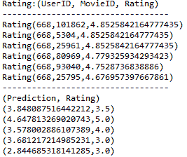**图 19**：用户 668 的前六个电影预测

**步骤 8\. 评估模型** - 为了验证模型的质量，使用**均方根误差**（**RMSE**）来衡量模型预测值与实际观测值之间的差异。默认情况下，计算出的误差越小，模型越好。为了测试模型的质量，使用测试数据（如第 4 步中所拆分的数据）。根据许多机器学习从业者的说法，RMSE 是衡量准确度的一个好方法，但仅限于比较同一变量不同模型的预测误差，而不能用于不同变量之间的比较，因为它是依赖于尺度的。以下代码行计算了使用训练集训练的模型的 RMSE 值：

```py
var rmseTest = computeRmse(model, testRDD, true)
println("Test RMSE: = " + rmseTest) //Less is better 

```

需要注意的是，`computeRmse()`是一个 UDF，具体如下：

```py
  def computeRmse(model: MatrixFactorizationModel, data: RDD[Rating], implicitPrefs: Boolean): Double = {
    val predictions: RDD[Rating] = model.predict(data.map(x => (x.user, x.product)))
    val predictionsAndRatings = predictions.map { x => ((x.user, x.product), x.rating)
  }.join(data.map(x => ((x.user, x.product), x.rating))).values
  if (implicitPrefs) {
    println("(Prediction, Rating)")
    println(predictionsAndRatings.take(5).mkString("\n"))
  }
  math.sqrt(predictionsAndRatings.map(x => (x._1 - x._2) * (x._1 - x._2)).mean())
}

```

上述方法计算 RMSE 用以评估模型。RMSE 越小，模型及其预测能力越好。

对于之前的设置，我们得到了以下输出：

```py
Test RMSE: = 0.9019872589764073

```

我们认为，前述模型的性能还可以进一步提高。感兴趣的读者可以访问此网址，了解有关调优基于 ML 的 ALS 模型的更多信息：[`spark.apache.org/docs/preview/ml-collaborative-filtering.html`](https://spark.apache.org/docs/preview/ml-collaborative-filtering.html)。

主题建模技术广泛应用于从大量文档中挖掘文本的任务。这些主题可以用来总结和组织包含主题词及其相对权重的文档。在下一部分，我们将展示使用**潜在狄利克雷分配**（**LDA**）算法进行主题建模的示例。

# 主题建模 - 文本聚类的最佳实践

主题建模技术广泛应用于从大量文档集合中挖掘文本的任务。这些主题随后可以用来总结和组织包含主题词及其相对权重的文档。这个示例所使用的数据集只是纯文本格式，然而，它是一个非结构化格式。现在，具有挑战性的部分是通过 LDA 进行主题建模，从数据中找到有用的模式。

# LDA 是如何工作的？

LDA 是一种从文本集合中推断主题的主题模型。LDA 可以看作是一种聚类算法，其中主题对应于聚类中心，文档对应于数据集中的实例（行）。主题和文档都存在于一个特征空间中，其中特征向量是词频向量（词袋模型）。与传统距离估计聚类不同，LDA 使用基于文本文档生成统计模型的函数。

LDA 通过 `setOptimizer` 函数支持不同的推断算法。`EMLDAOptimizer` 使用期望最大化对似然函数进行学习，并提供全面的结果，而 `OnlineLDAOptimizer` 使用迭代的 mini-batch 采样进行在线变分推断，通常更节省内存。LDA 输入一组文档，作为词频向量，并使用以下参数（通过构建器模式设置）：

+   `k`：主题数量（即聚类中心）。

+   `optimizer`：用于学习 LDA 模型的优化器，可以是`EMLDAOptimizer`或`OnlineLDAOptimizer`。

+   `docConcentration`：Dirichlet 参数，用于定义文档在主题分布上的先验。较大的值有助于生成更平滑的推断分布。

+   `topicConcentration`：Dirichlet 参数，用于定义主题在词汇（单词）上的分布的先验。较大的值有助于生成更平滑的推断分布。

+   `maxIterations`：迭代次数的限制。

+   `checkpointInterval`：如果使用检查点（在 Spark 配置中设置），该参数指定创建检查点的频率。如果`maxIterations`值较大，使用检查点可以帮助减少磁盘上 shuffle 文件的大小，并有助于故障恢复。

特别地，我们希望讨论从大量文本集合中，人们最常谈论的主题。自 Spark 1.3 版本发布以来，MLlib 支持 LDA，这是一种在文本挖掘和**自然语言处理**（**NLP**）领域广泛使用的主题建模技术。此外，LDA 也是第一个采用 Spark GraphX 的 MLlib 算法。

要了解有关 LDA 背后理论的更多信息，请参阅 David M. Blei、Andrew Y. Ng 和 Michael I. Jordan 的《潜在狄利克雷分配》，*机器学习研究期刊 3*（2003）993-1022。

下图展示了从随机生成的推文文本中得到的主题分布：

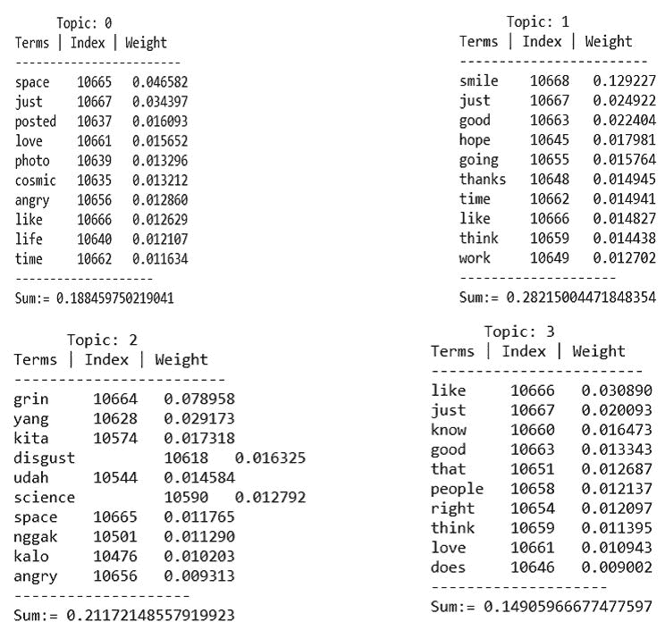

**图 20**：主题分布及其外观

在本节中，我们将通过使用 Spark MLlib 的 LDA 算法处理非结构化的原始推文数据集来演示主题建模的一个示例。请注意，这里我们使用的是 LDA，这是最常用的文本挖掘主题建模算法之一。我们还可以使用更强大的主题建模算法，如**概率潜在情感分析**（**pLSA**）、**八股分配模型**（**PAM**）或**层次狄利克雷过程**（**HDP**）算法。

然而，pLSA 存在过拟合问题。另一方面，HDP 和 PAM 是更复杂的主题建模算法，通常用于复杂的文本挖掘任务，例如从高维文本数据或非结构化文本文档中挖掘主题。此外，至今为止，Spark 只实现了一种主题建模算法，即 LDA。因此，我们必须合理使用 LDA。

# 使用 Spark MLlib 进行主题建模

在本小节中，我们展示了一种使用 Spark 进行半自动化主题建模的技术。使用默认的其他选项，我们在从 GitHub URL 下载的数据集上训练 LDA：[`github.com/minghui/Twitter-LDA/tree/master/data/Data4Model/test`](https://github.com/minghui/Twitter-LDA/tree/master/data/Data4Model/test)。以下步骤展示了从数据读取到打印主题的主题建模过程，同时显示每个主题的术语权重。下面是主题建模管道的简短工作流程：

```py
object topicModellingwithLDA {
  def main(args: Array[String]): Unit = {
    val lda = new LDAforTM() // actual computations are done here
    val defaultParams = Params().copy(input = "data/docs/") 
    // Loading the parameters
    lda.run(defaultParams) // Training the LDA model with the default
                              parameters.
  }
} 

```

主题建模的实际计算是在`LDAforTM`类中完成的。`Params`是一个案例类，用于加载训练 LDA 模型的参数。最后，我们通过`Params`类设置的参数来训练 LDA 模型。现在，我们将逐步解释每个步骤及其源代码：

**步骤 1\. 创建 Spark 会话** - 让我们通过定义计算核心数、SQL 仓库和应用程序名称来创建 Spark 会话，如下所示：

```py
val spark = SparkSession
    .builder
    .master("local[*]")
    .config("spark.sql.warehouse.dir", "E:/Exp/")
    .appName("LDA for topic modelling")
    .getOrCreate() 

```

**步骤 2\. 创建词汇表，令牌计数以便在文本预处理后训练 LDA** - 首先，加载文档，并为 LDA 做准备，如下所示：

```py
// Load documents, and prepare them for LDA.

val preprocessStart = System.nanoTime()
val (corpus, vocabArray, actualNumTokens) = preprocess(params.input, params.vocabSize, params.stopwordFile)  

```

预处理方法用于处理原始文本。首先，使用`wholeTextFiles()`方法读取整个文本，如下所示：

```py
val initialrdd = spark.sparkContext.wholeTextFiles(paths).map(_._2)
initialrdd.cache()  

```

在前面的代码中，paths 是文本文件的路径。然后，我们需要根据词干文本从原始文本准备一个形态学 RDD，如下所示：

```py
val rdd = initialrdd.mapPartitions { partition =>
  val morphology = new Morphology()
  partition.map { value => helperForLDA.getLemmaText(value, morphology) }
}.map(helperForLDA.filterSpecialCharacters)

```

这里，`helperForLDA`类中的`getLemmaText()`方法提供了在过滤掉特殊字符（如``("""[! @ # $ % ^ & * ( ) _ + - − , " ' ; : . ` ? --]``）之后的词干文本，使用`filterSpaecialChatacters()`方法作为正则表达式进行过滤。

需要注意的是，`Morphology()`类计算英语单词的基础形式，方法是去除词尾变化（而非派生形态）。也就是说，它仅处理名词的复数形式、代词的格、动词的时态和数等，而不涉及比较级形容词或派生名词等内容。这一方法来自斯坦福 NLP 小组。要使用它，你需要在主类文件中添加以下导入：`edu.stanford.nlp.process.Morphology`。在`pom.xml`文件中，你需要将以下条目作为依赖项包含：

```py
<dependency>
    <groupId>edu.stanford.nlp</groupId>
    <artifactId>stanford-corenlp</artifactId>
    <version>3.6.0</version>
</dependency>
<dependency>
    <groupId>edu.stanford.nlp</groupId>
    <artifactId>stanford-corenlp</artifactId>
    <version>3.6.0</version>
    <classifier>models</classifier>
</dependency>

```

方法实现如下：

```py
def getLemmaText(document: String, morphology: Morphology) = {
  val string = new StringBuilder()
  val value = new Document(document).sentences().toList.flatMap { a =>
  val words = a.words().toList
  val tags = a.posTags().toList
  (words zip tags).toMap.map { a =>
    val newWord = morphology.lemma(a._1, a._2)
    val addedWoed = if (newWord.length > 3) {
      newWord
    } else { "" }
      string.append(addedWoed + " ")
    }
  }
  string.toString()
} 

```

`filterSpecialCharacters()`的实现如下：

``def filterSpecialCharacters(document: String) = document.replaceAll("""[! @ # $ % ^ & * ( ) _ + - − , " ' ; : . ` ? --]""", " ")``。一旦我们手头有了去除特殊字符的 RDD，我们就可以创建一个 DataFrame，用于构建文本分析管道：

```py
rdd.cache()
initialrdd.unpersist()
val df = rdd.toDF("docs")
df.show() 

```

因此，DataFrame 仅包含文档标签。DataFrame 的快照如下：

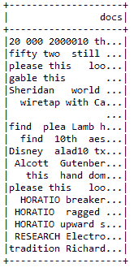**图 21**：原始文本

如果你仔细检查前面的 DataFrame，你会发现我们仍然需要对项目进行分词。此外，在像这样的 DataFrame 中存在停用词，因此我们也需要将它们移除。首先，让我们使用`RegexTokenizer` API 按以下方式对其进行分词：

```py
val tokenizer = new RegexTokenizer().setInputCol("docs").setOutputCol("rawTokens") 

```

现在，让我们按以下方式移除所有停用词：

```py
val stopWordsRemover = new StopWordsRemover().setInputCol("rawTokens").setOutputCol("tokens")
stopWordsRemover.setStopWords(stopWordsRemover.getStopWords ++ customizedStopWords)

```

此外，我们还需要应用计数胜利来从词元中仅提取重要的特征。这将有助于在管道阶段将管道链式连接。我们按以下方式操作：

```py
val countVectorizer = new CountVectorizer().setVocabSize(vocabSize).setInputCol("tokens").setOutputCol("features") 

```

现在，通过以下方式链式连接变换器（`tokenizer`、`stopWordsRemover`和`countVectorizer`）创建管道：

```py
val pipeline = new Pipeline().setStages(Array(tokenizer, stopWordsRemover, countVectorizer))

```

让我们拟合并转换管道，以适应词汇表和词元数量：

```py
val model = pipeline.fit(df)
val documents = model.transform(df).select("features").rdd.map {
  case Row(features: MLVector) =>Vectors.fromML(features)
}.zipWithIndex().map(_.swap)

```

最后，按以下方式返回词汇表和词元计数对：

```py
(documents, model.stages(2).asInstanceOf[CountVectorizerModel].vocabulary, documents.map(_._2.numActives).sum().toLong)

```

现在，让我们查看训练数据的统计信息：

```py
println()
println("Training corpus summary:")
println("-------------------------------")
println("Training set size: " + actualCorpusSize + " documents")
println("Vocabulary size: " + actualVocabSize + " terms")
println("Number of tockens: " + actualNumTokens + " tokens")
println("Preprocessing time: " + preprocessElapsed + " sec")
println("-------------------------------")
println()

```

我们得到以下输出：

```py
Training corpus summary:
 -------------------------------
 Training set size: 18 documents
 Vocabulary size: 21607 terms
 Number of tockens: 75758 tokens
 Preprocessing time: 39.768580981 sec
 **-------------------------------**

```

****步骤 4\. 在训练之前实例化 LDA 模型****

```py
val lda = new LDA()

```

**步骤 5: 设置 NLP 优化器**

为了从 LDA 模型中获得更好且经过优化的结果，我们需要为 LDA 模型设置优化器。在这里，我们使用`EMLDAOPtimizer`优化器。你也可以使用`OnlineLDAOptimizer()`优化器。不过，你需要在`MiniBatchFraction`中加入(1.0/actualCorpusSize)，以便在小数据集上更加健壮。整个操作如下。首先，按以下方式实例化`EMLDAOptimizer`：

```py
val optimizer = params.algorithm.toLowerCase match {
  case "em" => new EMLDAOptimizer
  case "online" => new OnlineLDAOptimizer().setMiniBatchFraction(0.05 + 1.0 / actualCorpusSize)
  case _ => throw new IllegalArgumentException("Only em is supported, got ${params.algorithm}.")
}

```

现在通过以下方式使用 LDA API 中的`setOptimizer()`方法设置优化器：

```py
lda.setOptimizer(optimizer)
  .setK(params.k)
  .setMaxIterations(params.maxIterations)
  .setDocConcentration(params.docConcentration)
  .setTopicConcentration(params.topicConcentration)
  .setCheckpointInterval(params.checkpointInterval)

```

`Params`案例类用于定义训练 LDA 模型的参数。其结构如下：

```py
 //Setting the parameters before training the LDA model
case class Params(input: String = "",
                  k: Int = 5,
                  maxIterations: Int = 20,
                  docConcentration: Double = -1,
                  topicConcentration: Double = -1,
                  vocabSize: Int = 2900000,
                  stopwordFile: String = "data/stopWords.txt",
                  algorithm: String = "em",
                  checkpointDir: Option[String] = None,
                  checkpointInterval: Int = 10)

```

为了获得更好的结果，你可以以简单的方式设置这些参数。或者，你可以选择交叉验证以获得更好的性能。如果你想保存当前的参数，请使用以下代码行：

```py
if (params.checkpointDir.nonEmpty) {
  spark.sparkContext.setCheckpointDir(params.checkpointDir.get)
}

```

**步骤 6.** 训练 LDA 模型：

```py
val startTime = System.nanoTime()
//Start training the LDA model using the training corpus 
val ldaModel = lda.run(corpus)
val elapsed = (System.nanoTime() - startTime) / 1e9
println(s"Finished training LDA model.  Summary:") 
println(s"t Training time: $elapsed sec")

```

对于我们所拥有的文本，LDA 模型训练时间为 6.309715286 秒。请注意，这些时间代码是可选的。我们提供这些代码仅供参考，以了解训练时间。

**步骤 7. 测量数据的似然性** - 现在，为了获得更多关于数据的统计信息，如最大似然或对数似然，我们可以使用以下代码：

```py
if (ldaModel.isInstanceOf[DistributedLDAModel]) {
  val distLDAModel = ldaModel.asInstanceOf[DistributedLDAModel]
  val avgLogLikelihood = distLDAModel.logLikelihood / actualCorpusSize.toDouble
  println("The average log likelihood of the training data: " +  avgLogLikelihood)
  println()
}

```

前述代码计算了 LDA 模型作为分布式版本的实例时的平均对数似然。我们得到了以下输出：

```py
The average log-likelihood of the training data: -208599.21351837728  

```

似然函数在数据可用后用于描述给定结果的参数（或参数向量）的函数。这在从一组统计数据估计参数时特别有用。有关似然度量的更多信息，感兴趣的读者可以参考[`en.wikipedia.org/wiki/Likelihood_function`](https://en.wikipedia.org/wiki/Likelihood_function)。

**步骤 8. 准备感兴趣的主题** - 准备前五个主题，每个主题包含 10 个词条。包括这些词条及其对应的权重。

```py
val topicIndices = ldaModel.describeTopics(maxTermsPerTopic = 10)
println(topicIndices.length)
val topics = topicIndices.map {case (terms, termWeights) => terms.zip(termWeights).map { case (term, weight) => (vocabArray(term.toInt), weight) } }

```

**步骤 9. 主题建模** - 打印前十个主题，展示每个主题的权重最高的词条。同时，列出每个主题的总权重，如下所示：

```py
var sum = 0.0
println(s"${params.k} topics:")
topics.zipWithIndex.foreach {
  case (topic, i) =>
  println(s"TOPIC $i")
  println("------------------------------")
  topic.foreach {
    case (term, weight) =>
    println(s"$termt$weight")
    sum = sum + weight
  }
  println("----------------------------")
  println("weight: " + sum)
  println()

```

现在，让我们看看 LDA 模型在主题建模方面的输出：

```py
    5 topics:
    TOPIC 0
    ------------------------------
    think 0.0105511077762379
    look  0.010393384083882656
    know  0.010121680765600402
    come  0.009999416569525854
    little      0.009880422850906338
    make  0.008982740529851225
    take  0.007061048216197747
    good  0.007040301924830752
    much  0.006273732732002744
    well  0.0062484438391950895
    ----------------------------
    weight: 0.0865522792882307

    TOPIC 1
    ------------------------------
    look  0.008658099588372216
    come  0.007972622171954474
    little      0.007596460821298818
    hand  0.0065409990798624565
    know  0.006314616294309573
    lorry 0.005843633203040061
    upon  0.005545300032552888
    make  0.005391780686824741
    take  0.00537353581562707
    time  0.005030870790464942
    ----------------------------
    weight: 0.15082019777253794

    TOPIC 2
    ------------------------------
    captain     0.006865463831587792
    nautilus    0.005175561004431676
    make  0.004910586984657019
    hepzibah    0.004378298053191463
    water 0.004063096964497903
    take  0.003959626037381751
    nemo  0.0037687537789531005
    phoebe      0.0037683642100062313
    pyncheon    0.003678496229955977
    seem  0.0034594205003318193
    ----------------------------
    weight: 0.19484786536753268

    TOPIC 3
    ------------------------------
    fogg  0.009552022075897986
    rodney      0.008705705501603078
    make  0.007016635545801613
    take  0.00676049232003675
    passepartout      0.006295907851484774
    leave 0.005565220660514245
    find  0.005077555215275536
    time  0.004852923943330551
    luke  0.004729546554304362
    upon  0.004707181805179265
    ----------------------------
    weight: 0.2581110568409608

    TOPIC 4
    ------------------------------
    dick  0.013754147765988699
    thus  0.006231933402776328
    ring  0.0052746290878481926
    bear  0.005181637978658836
    fate  0.004739983892853129
    shall 0.0046221874997173906
    hand  0.004610810387565958
    stand 0.004121100025638923
    name  0.0036093879729237
    trojan      0.0033792362039766505
    ----------------------------
    weight: 0.31363611105890865

```

从前述输出中，我们可以看到输入文档的主题为主题 5，权重最大为`0.31363611105890865`。该主题讨论了诸如 love、long、shore、shower、ring、bring、bear 等词汇。现在，为了更好地理解流程，以下是完整的源代码：

```py
package com.chapter11.SparkMachineLearning

import edu.stanford.nlp.process.Morphology
import edu.stanford.nlp.simple.Document
import org.apache.log4j.{ Level, Logger }
import scala.collection.JavaConversions._
import org.apache.spark.{ SparkConf, SparkContext }
import org.apache.spark.ml.Pipeline
import org.apache.spark.ml.feature._
import org.apache.spark.ml.linalg.{ Vector => MLVector }
import org.apache.spark.mllib.clustering.{ DistributedLDAModel, EMLDAOptimizer, LDA, OnlineLDAOptimizer }
import org.apache.spark.mllib.linalg.{ Vector, Vectors }
import org.apache.spark.rdd.RDD
import org.apache.spark.sql.{ Row, SparkSession }

object topicModellingwithLDA {
  def main(args: Array[String]): Unit = {
    val lda = new LDAforTM() // actual computations are done here
    val defaultParams = Params().copy(input = "data/docs/") 
    // Loading the parameters to train the LDA model
    lda.run(defaultParams) // Training the LDA model with the default
                              parameters.
  }
}
//Setting the parameters before training the LDA model
caseclass Params(input: String = "",
                 k: Int = 5,
                 maxIterations: Int = 20,
                 docConcentration: Double = -1,
                 topicConcentration: Double = -1,
                 vocabSize: Int = 2900000,
                 stopwordFile: String = "data/docs/stopWords.txt",
                 algorithm: String = "em",
                 checkpointDir: Option[String] = None,
                 checkpointInterval: Int = 10)

// actual computations for topic modeling are done here
class LDAforTM() {
  val spark = SparkSession
              .builder
              .master("local[*]")
              .config("spark.sql.warehouse.dir", "E:/Exp/")
              .appName("LDA for topic modelling")
              .getOrCreate()

  def run(params: Params): Unit = {
    Logger.getRootLogger.setLevel(Level.WARN)
    // Load documents, and prepare them for LDA.
    val preprocessStart = System.nanoTime()
    val (corpus, vocabArray, actualNumTokens) = preprocess(params
                      .input, params.vocabSize, params.stopwordFile)
    val actualCorpusSize = corpus.count()
    val actualVocabSize = vocabArray.length
    val preprocessElapsed = (System.nanoTime() - preprocessStart) / 1e9
    corpus.cache() //will be reused later steps
    println()
    println("Training corpus summary:")
    println("-------------------------------")
    println("Training set size: " + actualCorpusSize + " documents")
    println("Vocabulary size: " + actualVocabSize + " terms")
    println("Number of tockens: " + actualNumTokens + " tokens")
    println("Preprocessing time: " + preprocessElapsed + " sec")
    println("-------------------------------")
    println()
    // Instantiate an LDA model
    val lda = new LDA()
    val optimizer = params.algorithm.toLowerCase match {
      case "em" => new EMLDAOptimizer
      // add (1.0 / actualCorpusSize) to MiniBatchFraction be more
         robust on tiny datasets.
     case "online" => new OnlineLDAOptimizer()
                  .setMiniBatchFraction(0.05 + 1.0 / actualCorpusSize)
      case _ => thrownew IllegalArgumentException("Only em, online are
                             supported but got ${params.algorithm}.")
    }
    lda.setOptimizer(optimizer)
      .setK(params.k)
      .setMaxIterations(params.maxIterations)
      .setDocConcentration(params.docConcentration)
      .setTopicConcentration(params.topicConcentration)
      .setCheckpointInterval(params.checkpointInterval)
    if (params.checkpointDir.nonEmpty) {
      spark.sparkContext.setCheckpointDir(params.checkpointDir.get)
    }
    val startTime = System.nanoTime()
    //Start training the LDA model using the training corpus
    val ldaModel = lda.run(corpus)
    val elapsed = (System.nanoTime() - startTime) / 1e9
    println("Finished training LDA model. Summary:")
    println("Training time: " + elapsed + " sec")
    if (ldaModel.isInstanceOf[DistributedLDAModel]) {
      val distLDAModel = ldaModel.asInstanceOf[DistributedLDAModel]
      val avgLogLikelihood = distLDAModel.logLikelihood /
                             actualCorpusSize.toDouble
      println("The average log likelihood of the training data: " +
              avgLogLikelihood)
      println()
    }
    // Print the topics, showing the top-weighted terms for each topic.
    val topicIndices = ldaModel.describeTopics(maxTermsPerTopic = 10)
    println(topicIndices.length)
    val topics = topicIndices.map {case (terms, termWeights) =>
                 terms.zip(termWeights).map { case (term, weight) =>
                 (vocabArray(term.toInt), weight) } }
    var sum = 0.0
    println(s"${params.k} topics:")
    topics.zipWithIndex.foreach {
      case (topic, i) =>
      println(s"TOPIC $i")
      println("------------------------------")
      topic.foreach {
        case (term, weight) =>
        term.replaceAll("\\s", "")
        println(s"$term\t$weight")
        sum = sum + weight
      }
      println("----------------------------")
      println("weight: " + sum)
      println()
    }
    spark.stop()
  }
  //Pre-processing of the raw texts
import org.apache.spark.sql.functions._
def preprocess(paths: String, vocabSize: Int, stopwordFile: String): (RDD[(Long, Vector)], Array[String], Long) = {
  import spark.implicits._
  //Reading the Whole Text Files
  val initialrdd = spark.sparkContext.wholeTextFiles(paths).map(_._2)
  initialrdd.cache()
  val rdd = initialrdd.mapPartitions { partition =>
    val morphology = new Morphology()
    partition.map {value => helperForLDA.getLemmaText(value,
                                                      morphology)}
  }.map(helperForLDA.filterSpecialCharacters)
    rdd.cache()
    initialrdd.unpersist()
    val df = rdd.toDF("docs")
    df.show()
    //Customizing the stop words
    val customizedStopWords: Array[String] = if(stopwordFile.isEmpty) {
      Array.empty[String]
    } else {
      val stopWordText = spark.sparkContext.textFile(stopwordFile)
                            .collect()
      stopWordText.flatMap(_.stripMargin.split(","))
    }
    //Tokenizing using the RegexTokenizer
    val tokenizer = new RegexTokenizer().setInputCol("docs")
                                       .setOutputCol("rawTokens")
    //Removing the Stop-words using the Stop Words remover
    val stopWordsRemover = new StopWordsRemover()
                       .setInputCol("rawTokens").setOutputCol("tokens")
    stopWordsRemover.setStopWords(stopWordsRemover.getStopWords ++
                                  customizedStopWords)
    //Converting the Tokens into the CountVector
    val countVectorizer = new CountVectorizer().setVocabSize(vocabSize)
                        .setInputCol("tokens").setOutputCol("features")
    val pipeline = new Pipeline().setStages(Array(tokenizer,
                                    stopWordsRemover, countVectorizer))
    val model = pipeline.fit(df)
    val documents = model.transform(df).select("features").rdd.map {
      case Row(features: MLVector) => Vectors.fromML(features)
    }.zipWithIndex().map(_.swap)
    //Returning the vocabulary and tocken count pairs
    (documents, model.stages(2).asInstanceOf[CountVectorizerModel]
     .vocabulary, documents.map(_._2.numActives).sum().toLong)
    }
  }
  object helperForLDA {
    def filterSpecialCharacters(document: String) = 
      document.replaceAll("""[! @ # $ % ^ & * ( ) _ + - − ,
                          " ' ; : . ` ? --]""", " ")
    def getLemmaText(document: String, morphology: Morphology) = {
      val string = new StringBuilder()
      val value =new Document(document).sentences().toList.flatMap{a =>
      val words = a.words().toList
      val tags = a.posTags().toList
      (words zip tags).toMap.map { a =>
        val newWord = morphology.lemma(a._1, a._2)
        val addedWoed = if (newWord.length > 3) {
          newWord
        } else { "" }
        string.append(addedWoed + " ")
      }
    }
    string.toString()
  }
}

```

# LDA 的可扩展性

上述示例展示了如何使用 LDA 算法作为独立应用程序进行主题建模。LDA 的并行化并不简单，已有许多研究论文提出了不同的策略。关键的障碍在于所有方法都涉及大量的通信。根据 Databricks 网站上的博客([`databricks.com/blog/2015/03/25/topic-modeling-with-lda-mllib-meets-graphx.html`](https://databricks.com/blog/2015/03/25/topic-modeling-with-lda-mllib-meets-graphx.html))，以下是实验过程中使用的数据集及相关训练集和测试集的统计信息：

+   训练集大小：460 万篇文档

+   词汇量：110 万个词条

+   训练集大小：110 亿个标记（约 239 个词/文档）

+   100 个主题

+   16 工作节点 EC2 集群，例如，M4.large 或 M3.medium，具体取决于预算和需求

对于前述设置，10 次迭代的平均时间结果为 176 秒/迭代。从这些统计数据可以看出，LDA 对于非常大规模的语料库也具有很好的可扩展性。

# 总结

在这一章中，我们提供了有关 Spark 中一些高级机器学习主题的理论和实践方面的内容。我们还提供了关于机器学习最佳实践的一些建议。接下来，我们展示了如何使用网格搜索、交叉验证和超参数调优来调优机器学习模型，以获得更好和更优化的性能。在后续部分，我们展示了如何使用 ALS 开发一个可扩展的推荐系统，这是一个基于模型的协同过滤方法的模型推荐系统示例。最后，我们展示了如何开发一个文本聚类技术的主题建模应用。

有兴趣了解更多机器学习最佳实践的读者，可以参考名为*《Spark 大规模机器学习》*的书籍，网址为[`www.packtpub.com/big-data-and-business-intelligence/large-scale-machine-learning-spark`](https://www.packtpub.com/big-data-and-business-intelligence/large-scale-machine-learning-spark)。

在下一章中，我们将进入 Spark 的更高级应用。尽管我们已经讨论并提供了二分类和多分类的对比分析，但我们将进一步了解其他 Spark 中的多项式分类算法，如朴素贝叶斯、决策树和一对多分类器（One-vs-Rest）。
