# 第十五章：使用 Spark ML 进行文本分析

“程序必须为人类阅读而编写，只有在偶然的情况下才是为了机器执行。”

- 哈罗德·阿贝尔森

在本章中，我们将讨论使用 Spark ML 进行文本分析这一美妙的领域。文本分析是机器学习中的一个广泛领域，并且在许多用例中都很有用，比如情感分析、聊天机器人、电子邮件垃圾邮件检测和自然语言处理。我们将学习如何使用 Spark 进行文本分析，重点介绍使用 Twitter 的 10,000 个样本数据集进行文本分类的用例。

简而言之，本章将涵盖以下主题：

+   理解文本分析

+   转换器和估计器

+   分词器

+   StopWordsRemover

+   NGrams

+   TF-IDF

+   Word2Vec

+   CountVectorizer

+   使用 LDA 进行主题建模

+   实现文本分类

# 理解文本分析

在过去几章中，我们已经探索了机器学习的世界以及 Apache Spark 对机器学习的支持。正如我们所讨论的，机器学习有一个工作流程，这些流程可以通过以下步骤来解释：

1.  加载或获取数据。

1.  清洗数据。

1.  从数据中提取特征。

1.  在数据上训练模型，根据特征生成期望的结果。

1.  根据数据评估或预测某些结果。

一个典型流水线的简化视图如下所示：

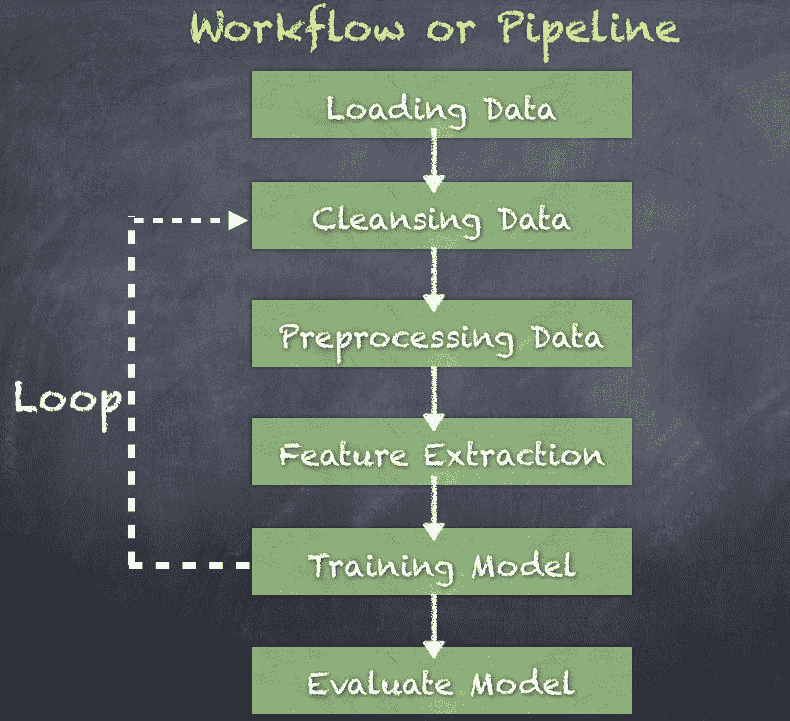

因此，在训练模型并随后部署之前，数据的转换阶段有很多种可能性。此外，我们应该预期特征和模型属性的精细调整。我们甚至可以探索一种完全不同的算法，作为新工作流的一部分重复整个任务序列。

可以通过多个转换步骤创建一个流水线，因此我们使用**领域特定语言**（**DSL**）来定义节点（数据转换步骤），从而创建一个**DAG**（**有向无环图**）节点。因此，ML 流水线是一个由多个转换器和估计器组成的序列，用于将输入数据集拟合到流水线模型中。流水线中的每个阶段称为*流水线阶段*，如下所示：

+   估计器

+   模型

+   流水线

+   转换器

+   预测器

当你看一行文本时，我们看到句子、短语、单词、名词、动词、标点符号等，它们组合在一起时具有意义和目的。人类非常擅长理解句子、单词、俚语、注释或上下文。这来自于多年的练习和学习如何读写、正确的语法、标点符号、感叹词等。那么，我们如何编写计算机程序来尝试复制这种能力呢？

# 文本分析

文本分析是从一组文本中解锁意义的方法。通过使用各种技术和算法处理和分析文本数据，我们可以揭示数据中的模式和主题。所有这些的目标是理解非结构化的文本，以便得出上下文的意义和关系。

文本分析利用几种广泛的技术类别，接下来我们将讨论这些技术。

# 情感分析

分析 Facebook、Twitter 和其他社交媒体上人们的政治观点是情感分析的一个良好示例。同样，分析 Yelp 上餐厅的评论也是情感分析的另一个很好的示例。

**自然语言处理**（**NLP**）框架和库，如 OpenNLP 和斯坦福 NLP，通常用于实现情感分析。

# 主题建模

主题建模是检测文档语料库中主题或主题的一种有用技术。这是一种无监督算法，可以在一组文档中找到主题。例如，检测新闻文章中涉及的主题。另一个例子是检测专利申请中的思想。

**潜在狄利克雷分配**（**LDA**）是一个流行的无监督聚类模型，而**潜在语义分析**（**LSA**）则在共现数据上使用概率模型。

# TF-IDF（词频-逆文档频率）

TF-IDF 衡量单词在文档中出现的频率以及在一组文档中的相对频率。此信息可用于构建分类器和预测模型。例如垃圾邮件分类、聊天对话等。

# 命名实体识别（NER）

命名实体识别通过检测句子中单词和名词的使用来提取关于人、组织、地点等的信息。这提供了关于文档实际内容的重要上下文信息，而不仅仅是将单词视为主要实体。

斯坦福 NLP 和 OpenNLP 都实现了 NER 算法。

# 事件抽取

事件抽取在 NER 基础上扩展，通过建立检测到的实体之间的关系。这可以用于推断两个实体之间的关系。因此，它增加了语义理解的层次，帮助理解文档内容。

# 变换器和估计器

**Transformer** 是一个函数对象，通过将变换逻辑（函数）应用于输入数据集，生成输出数据集，从而将一个数据集转换为另一个数据集。变换器有两种类型：标准变换器和估计器变换器。

# 标准变换器

标准变换器将输入数据集转换为输出数据集，明确地将变换函数应用于输入数据。除了读取输入列和生成输出列外，不依赖于输入数据。

这种变换器的调用方式如下所示：

```py
*outputDF = transfomer.*transform*(inputDF)*

```

标准变换器的示例如下，并将在后续章节中详细解释：

+   `Tokenizer`：此工具使用空格作为分隔符将句子拆分为单词。

+   `RegexTokenizer`：此工具使用正则表达式将句子拆分为单词。

+   `StopWordsRemover`：此工具从单词列表中去除常用的停用词。

+   `Binarizer`：将字符串转换为二进制数字 0/1

+   `NGram`：从句子中创建 N 个单词短语

+   `HashingTF`：使用哈希表索引单词来创建词频计数

+   `SQLTransformer`：实现由 SQL 语句定义的变换

+   `VectorAssembler`：将给定的列列表组合成一个单一的向量列

标准 Transformer 的示意图如下，其中来自输入数据集的输入列被转换为输出列，从而生成输出数据集：

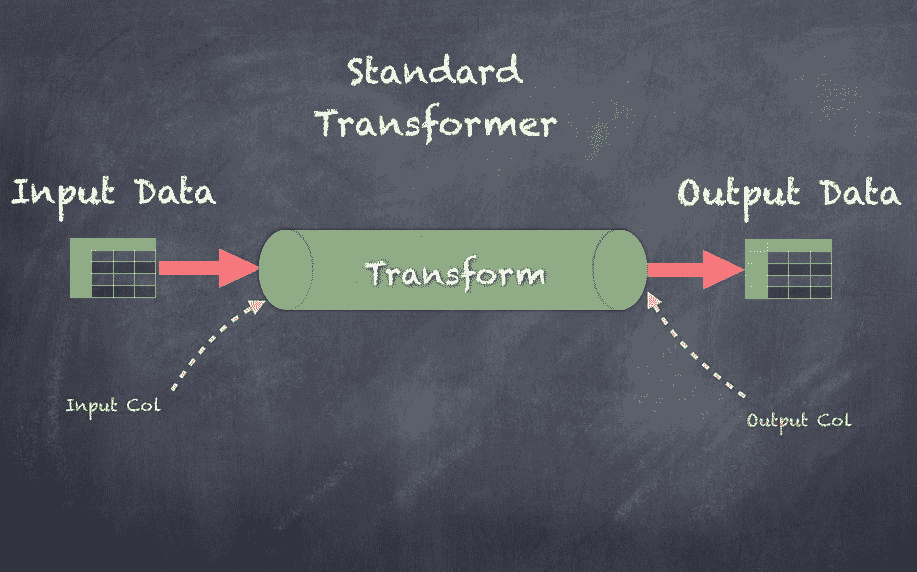

# 估算器变换器

估算器变换器通过首先根据输入数据集生成一个变换器来将输入数据集转换为输出数据集。然后，变换器处理输入数据，读取输入列并生成输出列，最终形成输出数据集。

这些变换器如下所示：

```py
*transformer = estimator.*fit*(inputDF)* *outputDF = transformer.*transform*(inputDF)*

```

估算器变换器的示例如下：

+   IDF

+   LDA

+   Word2Vec

估算器变换器的示意图如下，其中来自输入数据集的输入列被转换为输出列，从而生成输出数据集：

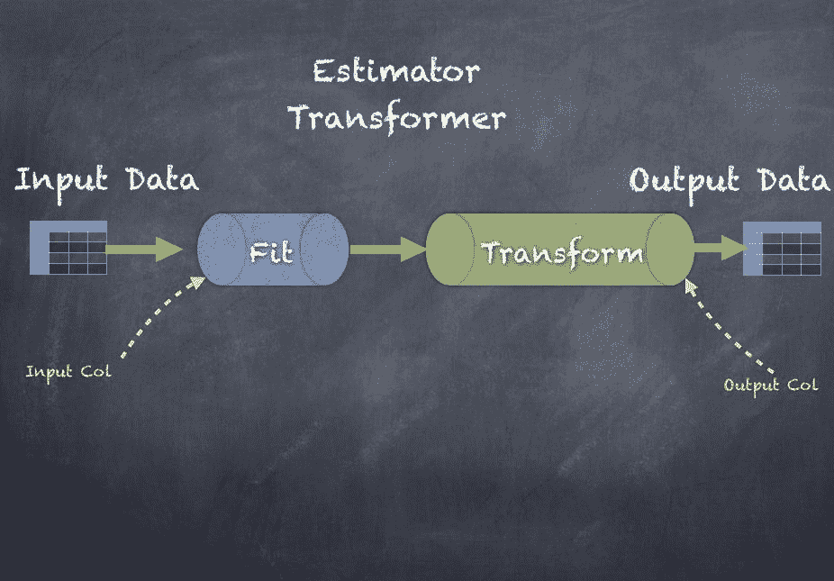

在接下来的几个部分，我们将深入探讨文本分析，使用一个简单的示例数据集，数据集包含多行文本（句子），如以下截图所示：

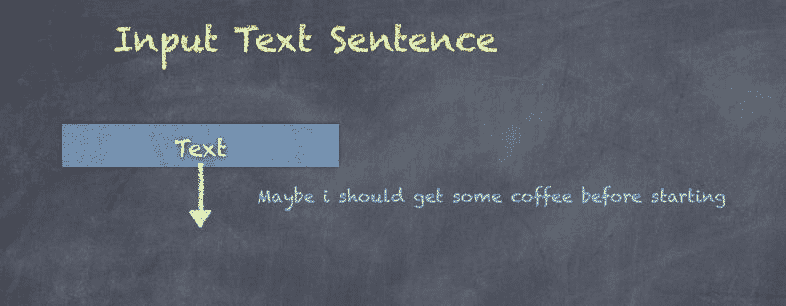

以下代码用于将文本数据加载到输入数据集中。

使用一对 ID 和文本的序列来初始化一组句子，具体如下所示。

```py
val lines = Seq(
 | (1, "Hello there, how do you like the book so far?"),
 | (2, "I am new to Machine Learning"),
 | (3, "Maybe i should get some coffee before starting"),
 | (4, "Coffee is best when you drink it hot"),
 | (5, "Book stores have coffee too so i should go to a book store")
 | )
lines: Seq[(Int, String)] = List((1,Hello there, how do you like the book so far?), (2,I am new to Machine Learning), (3,Maybe i should get some coffee before starting), (4,Coffee is best when you drink it hot), (5,Book stores have coffee too so i should go to a book store))

```

接下来，调用`createDataFrame()`函数从我们之前看到的句子序列创建一个 DataFrame。

```py
scala> val sentenceDF = spark.createDataFrame(lines).toDF("id", "sentence")
sentenceDF: org.apache.spark.sql.DataFrame = [id: int, sentence: string]

```

现在你可以看到新创建的数据集，其中显示了包含两个列 ID 和句子的 Sentence DataFrame。

```py
scala> sentenceDF.show(false)
|id|sentence |
|1 |Hello there, how do you like the book so far? |
|2 |I am new to Machine Learning |
|3 |Maybe i should get some coffee before starting |
|4 |Coffee is best when you drink it hot |
|5 |Book stores have coffee too so i should go to a book store|

```

# 分词

**分词器**将输入字符串转换为小写，并通过空格将字符串拆分为单独的标记。给定的句子通过默认的空格分隔符或使用自定义正则表达式的分词器拆分为单词。无论哪种方式，输入列都会转换为输出列。特别地，输入列通常是字符串，而输出列是一个单词序列。

分词器可以通过导入接下来的两个包来使用，分别是`Tokenizer`和`RegexTokenizer`：

```py
import org.apache.spark.ml.feature.Tokenizer
import org.apache.spark.ml.feature.RegexTokenizer

```

首先，你需要初始化一个`Tokenizer`，指定输入列和输出列：

```py
scala> val tokenizer = new Tokenizer().setInputCol("sentence").setOutputCol("words")
tokenizer: org.apache.spark.ml.feature.Tokenizer = tok_942c8332b9d8

```

接下来，在输入数据集上调用`transform()`函数会生成一个输出数据集：

```py
scala> val wordsDF = tokenizer.transform(sentenceDF)
wordsDF: org.apache.spark.sql.DataFrame = [id: int, sentence: string ... 1 more field]

```

以下是输出数据集，显示输入列的 ID、句子和输出列的单词，后者包含单词的序列：

```py
scala> wordsDF.show(false)
|id|sentence |words |
|1 |Hello there, how do you like the book so far? |[hello, there,, how, do, you, like, the, book, so, far?] |
|2 |I am new to Machine Learning |[i, am, new, to, machine, learning] |
|3 |Maybe i should get some coffee before starting |[maybe, i, should, get, some, coffee, before, starting] |
|4 |Coffee is best when you drink it hot |[coffee, is, best, when, you, drink, it, hot] |
|5 |Book stores have coffee too so i should go to a book store|[book, stores, have, coffee, too, so, i, should, go, to, a, book, store]|

```

另一方面，如果你想设置基于正则表达式的`Tokenizer`，你必须使用`RegexTokenizer`而不是`Tokenizer`。为此，你需要初始化一个`RegexTokenizer`，指定输入列和输出列，并提供要使用的正则表达式模式：

```py
scala> val regexTokenizer = new RegexTokenizer().setInputCol("sentence").setOutputCol("regexWords").setPattern("\\W")
regexTokenizer: org.apache.spark.ml.feature.RegexTokenizer = regexTok_15045df8ce41

```

接下来，在输入数据集上调用`transform()`函数会产生一个输出数据集：

```py
scala> val regexWordsDF = regexTokenizer.transform(sentenceDF)
regexWordsDF: org.apache.spark.sql.DataFrame = [id: int, sentence: string ... 1 more field]

```

以下是输出数据集，显示了输入列 ID、句子和输出列`regexWordsDF`，其中包含了单词序列：

```py
scala> regexWordsDF.show(false)
|id|sentence |regexWords |
|1 |Hello there, how do you like the book so far? |[hello, there, how, do, you, like, the, book, so, far] |
|2 |I am new to Machine Learning |[i, am, new, to, machine, learning] |
|3 |Maybe i should get some coffee before starting |[maybe, i, should, get, some, coffee, before, starting] |
|4 |Coffee is best when you drink it hot |[coffee, is, best, when, you, drink, it, hot] |
|5 |Book stores have coffee too so i should go to a book store|[book, stores, have, coffee, too, so, i, should, go, to, a, book, store]|

```

`Tokenizer`的图示如下，其中输入文本中的句子通过空格分隔符拆分成单词：

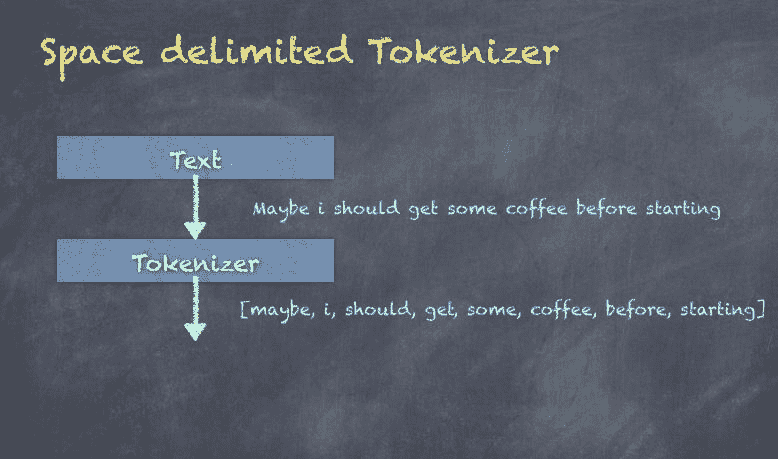

# StopWordsRemover

`StopWordsRemover`是一个转换器，它接受一个包含单词的`String`数组，并返回一个`String`数组，其中去除了所有已定义的停用词。停用词的一些示例包括 I、you、my、and、or 等，这些在英语中是非常常见的单词。你可以覆盖或扩展停用词的集合，以适应用例的目的。如果没有这个清洗过程，后续的算法可能会因常见单词的影响而产生偏差。

为了调用`StopWordsRemover`，你需要导入以下包：

```py
import org.apache.spark.ml.feature.StopWordsRemover

```

首先，你需要初始化一个`StopWordsRemover`，指定输入列和输出列。在这里，我们选择由`Tokenizer`创建的单词列，并生成一个输出列，包含在删除停用词后过滤的单词：

```py
scala> val remover = new StopWordsRemover().setInputCol("words").setOutputCol("filteredWords")
remover: org.apache.spark.ml.feature.StopWordsRemover = stopWords_48d2cecd3011

```

接下来，在输入数据集上调用`transform()`函数会产生一个输出数据集：

```py
scala> val noStopWordsDF = remover.transform(wordsDF)
noStopWordsDF: org.apache.spark.sql.DataFrame = [id: int, sentence: string ... 2 more fields]

```

以下是输出数据集，显示了输入列 ID、句子和输出列`filteredWords`，其中包含了单词的序列：

```py
scala> noStopWordsDF.show(false)
|id|sentence |words |filteredWords |
|1 |Hello there, how do you like the book so far? |[hello, there,, how, do, you, like, the, book, so, far?] |[hello, there,, like, book, far?] |
|2 |I am new to Machine Learning |[i, am, new, to, machine, learning] |[new, machine, learning] |
|3 |Maybe i should get some coffee before starting |[maybe, i, should, get, some, coffee, before, starting] |[maybe, get, coffee, starting] |
|4 |Coffee is best when you drink it hot |[coffee, is, best, when, you, drink, it, hot] |[coffee, best, drink, hot] |
|5 |Book stores have coffee too so i should go to a book store|[book, stores, have, coffee, too, so, i, should, go, to, a, book, store]|[book, stores, coffee, go, book, store]|

```

以下是输出数据集，显示了仅包含句子和`filteredWords`的内容，`filteredWords`包含了过滤后的单词序列：

```py

scala> noStopWordsDF.select("sentence", "filteredWords").show(5,false)
|sentence |filteredWords |
|Hello there, how do you like the book so far? |[hello, there,, like, book, far?] |
|I am new to Machine Learning |[new, machine, learning] |
|Maybe i should get some coffee before starting |[maybe, get, coffee, starting] |
|Coffee is best when you drink it hot |[coffee, best, drink, hot] |
|Book stores have coffee too so i should go to a book store|[book, stores, coffee, go, book, store]|

```

`StopWordsRemover`的图示如下，显示了过滤掉的停用词，如 I、should、some 和 before：

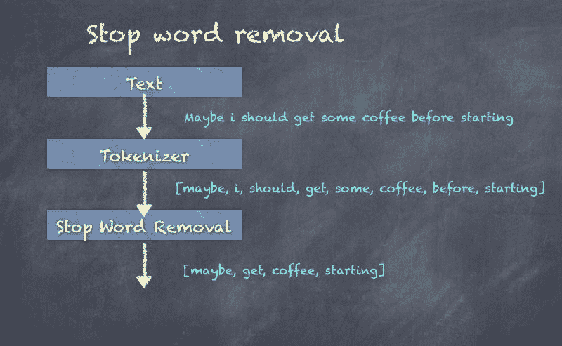

停用词是默认设置的，但可以很容易地覆盖或修改，正如下面的代码片段所示，我们将在过滤后的单词中删除“hello”，将其视为停用词：

```py
scala> val noHello = Array("hello") ++ remover.getStopWords
noHello: Array[String] = Array(hello, i, me, my, myself, we, our, ours, ourselves, you, your, yours, yourself, yourselves, he, him, his, himself, she, her, hers, herself, it, its, itself, they, them, their, theirs, themselves, what, which, who, whom, this, that, these, those, am, is, are, was, were ...
scala>

//create new transfomer using the amended Stop Words list
scala> val removerCustom = new StopWordsRemover().setInputCol("words").setOutputCol("filteredWords").setStopWords(noHello)
removerCustom: org.apache.spark.ml.feature.StopWordsRemover = stopWords_908b488ac87f

//invoke transform function
scala> val noStopWordsDFCustom = removerCustom.transform(wordsDF)
noStopWordsDFCustom: org.apache.spark.sql.DataFrame = [id: int, sentence: string ... 2 more fields]

//output dataset showing only sentence and filtered words - now will not show hello
scala> noStopWordsDFCustom.select("sentence", "filteredWords").show(5,false)
+----------------------------------------------------------+---------------------------------------+
|sentence |filteredWords |
+----------------------------------------------------------+---------------------------------------+
|Hello there, how do you like the book so far? |[there,, like, book, far?] |
|I am new to Machine Learning |[new, machine, learning] |
|Maybe i should get some coffee before starting |[maybe, get, coffee, starting] |
|Coffee is best when you drink it hot |[coffee, best, drink, hot] |
|Book stores have coffee too so i should go to a book store|[book, stores, coffee, go, book, store]|
+----------------------------------------------------------+---------------------------------------+

```

# NGrams

NGrams 是由单词组合生成的单词序列。N 代表序列中单词的数量。例如，2-gram 是两个单词在一起，3-gram 是三个单词在一起。`setN()`用于指定`N`的值。

为了生成 NGrams，你需要导入该包：

```py
import org.apache.spark.ml.feature.NGram

```

首先，你需要初始化一个`NGram`生成器，指定输入列和输出列。在这里，我们选择由`StopWordsRemover`创建的过滤单词列，并生成一个输出列，包含在删除停用词后过滤的单词：

```py
scala> val ngram = new NGram().setN(2).setInputCol("filteredWords").setOutputCol("ngrams")
ngram: org.apache.spark.ml.feature.NGram = ngram_e7a3d3ab6115

```

接下来，在输入数据集上调用`transform()`函数会产生一个输出数据集：

```py
scala> val nGramDF = ngram.transform(noStopWordsDF)
nGramDF: org.apache.spark.sql.DataFrame = [id: int, sentence: string ... 3 more fields]

```

以下是输出数据集，显示了输入列 ID、句子和输出列`ngram`，其中包含了 n-gram 序列：

```py
scala> nGramDF.show(false)
|id|sentence |words |filteredWords |ngrams |
|1 |Hello there, how do you like the book so far? |[hello, there,, how, do, you, like, the, book, so, far?] |[hello, there,, like, book, far?] |[hello there,, there, like, like book, book far?] |
|2 |I am new to Machine Learning |[i, am, new, to, machine, learning] |[new, machine, learning] |[new machine, machine learning] |
|3 |Maybe i should get some coffee before starting |[maybe, i, should, get, some, coffee, before, starting] |[maybe, get, coffee, starting] |[maybe get, get coffee, coffee starting] |
|4 |Coffee is best when you drink it hot |[coffee, is, best, when, you, drink, it, hot] |[coffee, best, drink, hot] |[coffee best, best drink, drink hot] |
|5 |Book stores have coffee too so i should go to a book store|[book, stores, have, coffee, too, so, i, should, go, to, a, book, store]|[book, stores, coffee, go, book, store]|[book stores, stores coffee, coffee go, go book, book store]|

```

以下是输出数据集，显示了句子和 2-gram：

```py
scala> nGramDF.select("sentence", "ngrams").show(5,false)
|sentence |ngrams |
|Hello there, how do you like the book so far? |[hello there,, there, like, like book, book far?] |
|I am new to Machine Learning |[new machine, machine learning] |
|Maybe i should get some coffee before starting |[maybe get, get coffee, coffee starting] |
|Coffee is best when you drink it hot |[coffee best, best drink, drink hot] |
|Book stores have coffee too so i should go to a book store|[book stores, stores coffee, coffee go, go book, book store]|

```

NGram 的图示如下，显示了在句子经过分词和去除停用词后生成的 2-gram：

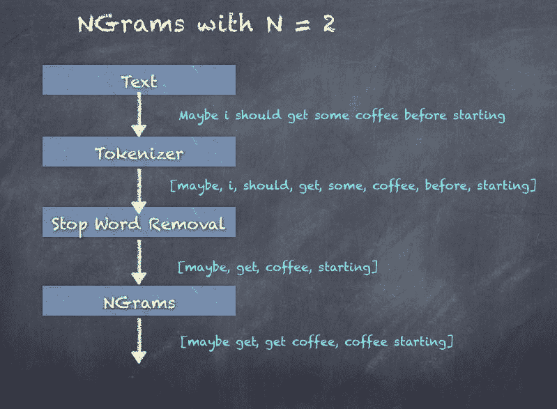

# TF-IDF

TF-IDF 代表词频-逆文档频率，它衡量一个词在文档集合中对某个文档的重要性。它在信息检索中被广泛使用，并反映了词在文档中的权重。TF-IDF 值随着词语出现次数的增加而增加，词语/术语的频率由两个关键元素组成：词频和逆文档频率。

TF 是词频，表示单词/术语在文档中的频率。

对于一个术语*t*，*tf*度量术语*t*在文档*d*中出现的次数。*tf*在 Spark 中通过哈希实现，将术语通过哈希函数映射到索引。

IDF 是逆文档频率，表示术语提供的关于该术语在文档中出现的趋势的信息。IDF 是包含该术语的文档数的对数缩放逆函数：

IDF = 总文档数/包含术语的文档数

一旦我们有了*TF*和*IDF*，我们就可以通过将*TF*和*IDF*相乘来计算*TF-IDF*值：

TF-IDF = TF * IDF

接下来，我们将看看如何使用 Spark ML 中的 HashingTF 转换器生成*TF*。

# HashingTF

**HashingTF**是一个转换器，它接受一组术语并通过哈希每个术语来生成固定长度的向量，为每个术语生成索引。然后，使用哈希表的索引生成术语频率。

在 Spark 中，HashingTF 使用**MurmurHash3**算法来对术语进行哈希处理。

为了使用`HashingTF`，您需要导入以下包：

```py
import org.apache.spark.ml.feature.HashingTF

```

首先，您需要初始化一个`HashingTF`，指定输入列和输出列。在这里，我们选择由`StopWordsRemover`转换器创建的过滤词列，并生成输出列`rawFeaturesDF`。我们还选择将特征数量设置为 100：

```py
scala> val hashingTF = new HashingTF().setInputCol("filteredWords").setOutputCol("rawFeatures").setNumFeatures(100)
hashingTF: org.apache.spark.ml.feature.HashingTF = hashingTF_b05954cb9375

```

接下来，在输入数据集上调用`transform()`函数会生成输出数据集：

```py
scala> val rawFeaturesDF = hashingTF.transform(noStopWordsDF)
rawFeaturesDF: org.apache.spark.sql.DataFrame = [id: int, sentence: string ... 3 more fields]

```

以下是输出数据集，显示了输入列 ID、句子和输出列`rawFeaturesDF`，其中包含由向量表示的特征：

```py
scala> rawFeaturesDF.show(false)
|id |sentence |words |filteredWords |rawFeatures |
|1 |Hello there, how do you like the book so far? |[hello, there,, how, do, you, like, the, book, so, far?] |[hello, there,, like, book, far?] |(100,[30,48,70,93],[2.0,1.0,1.0,1.0]) |
|2 |I am new to Machine Learning |[i, am, new, to, machine, learning] |[new, machine, learning] |(100,[25,52,72],[1.0,1.0,1.0]) |
|3 |Maybe i should get some coffee before starting |[maybe, i, should, get, some, coffee, before, starting] |[maybe, get, coffee, starting] |(100,[16,51,59,99],[1.0,1.0,1.0,1.0]) |
|4 |Coffee is best when you drink it hot |[coffee, is, best, when, you, drink, it, hot] |[coffee, best, drink, hot] |(100,[31,51,63,72],[1.0,1.0,1.0,1.0]) |
|5 |Book stores have coffee too so i should go to a book store|[book, stores, have, coffee, too, so, i, should, go, to, a, book, store]|[book, stores, coffee, go, book, store]|(100,[43,48,51,77,93],[1.0,1.0,1.0,1.0,2.0])|

```

让我们看一下前面的输出，以便更好地理解。如果仅查看`filteredWords`和`rawFeatures`列，您会看到，

1.  词汇数组`[hello, there, like, book, and far]`被转换为原始特征向量`(100,[30,48,70,93],[2.0,1.0,1.0,1.0])`。

1.  词汇数组`(book, stores, coffee, go, book, and store)`被转换为原始特征向量`(100,[43,48,51,77,93],[1.0,1.0,1.0,1.0,2.0])`。

那么，这里的向量表示什么呢？其基本逻辑是，每个单词被哈希为一个整数，并计算在单词数组中出现的次数。

Spark 内部使用一个`hashMap`（`mutable.HashMap.empty[Int, Double]`），用于存储每个单词的哈希值，其中`Integer`键表示哈希值，`Double`值表示出现次数。使用 Double 类型是为了能够与 IDF 一起使用（我们将在下一节讨论）。使用这个映射，数组`[book, stores, coffee, go, book, store]`可以看作`[hashFunc(book), hashFunc(stores), hashFunc(coffee), hashFunc(go), hashFunc(book), hashFunc(store)]`*，* 其等于`[43,48,51,77,93]`*。* 然后，如果你也统计出现次数的话，即：`book-2, coffee-1, go-1, store-1, stores-1`。

结合前面的信息，我们可以生成一个向量`(numFeatures, hashValues, Frequencies)`**，** 在这种情况下，它将是`(100,[43,48,51,77,93],[1.0,1.0,1.0,1.0,2.0])`。

# 逆文档频率（IDF）

**逆文档频率**（**IDF**）是一种估算器，它应用于数据集并通过缩放输入特征生成特征。因此，IDF 作用于 HashingTF 转换器的输出。

为了调用 IDF，您需要导入该包：

```py
import org.apache.spark.ml.feature.IDF

```

首先，您需要初始化一个`IDF`，并指定输入列和输出列。这里，我们选择由 HashingTF 创建的单词列`rawFeatures`，并生成一个输出列特征：

```py
scala> val idf = new IDF().setInputCol("rawFeatures").setOutputCol("features")
idf: org.apache.spark.ml.feature.IDF = idf_d8f9ab7e398e

```

接下来，在输入数据集上调用`fit()`函数会生成一个输出转换器（Transformer）：

```py
scala> val idfModel = idf.fit(rawFeaturesDF)
idfModel: org.apache.spark.ml.feature.IDFModel = idf_d8f9ab7e398e

```

此外，在输入数据集上调用`transform()`函数会生成一个输出数据集：

```py
scala> val featuresDF = idfModel.transform(rawFeaturesDF)
featuresDF: org.apache.spark.sql.DataFrame = [id: int, sentence: string ... 4 more fields]

```

以下是输出数据集，显示了输入列 ID 和输出列特征，其中包含前述转换中由 HashingTF 生成的缩放特征向量：

```py
scala> featuresDF.select("id", "features").show(5, false)
|id|features |
|1 |(20,[8,10,13],[0.6931471805599453,3.295836866004329,0.6931471805599453]) |
|2 |(20,[5,12],[1.0986122886681098,1.3862943611198906]) |
|3 |(20,[11,16,19],[0.4054651081081644,1.0986122886681098,2.1972245773362196]) |
|4 |(20,[3,11,12],[0.6931471805599453,0.8109302162163288,0.6931471805599453]) |
|5 |(20,[3,8,11,13,17],[0.6931471805599453,0.6931471805599453,0.4054651081081644,1.3862943611198906,1.0986122886681098])|

```

以下是输出数据集，显示了输入列 ID、句子、`rawFeatures`和输出列特征，其中包含前述转换中由 HashingTF 生成的缩放特征向量：

```py

scala> featuresDF.show(false)
|id|sentence |words |filteredWords |rawFeatures |features |
|1 |Hello there, how do you like the book so far? |[hello, there,, how, do, you, like, the, book, so, far?] |[hello, there,, like, book, far?] |(20,[8,10,13],[1.0,3.0,1.0]) |(20,[8,10,13],[0.6931471805599453,3.295836866004329,0.6931471805599453]) |
|2 |I am new to Machine Learning |[i, am, new, to, machine, learning] |[new, machine, learning] |(20,[5,12],[1.0,2.0]) |(20,[5,12],[1.0986122886681098,1.3862943611198906]) |
|3 |Maybe i should get some coffee before starting |[maybe, i, should, get, some, coffee, before, starting] |[maybe, get, coffee, starting] |(20,[11,16,19],[1.0,1.0,2.0]) |(20,[11,16,19],[0.4054651081081644,1.0986122886681098,2.1972245773362196]) |
|4 |Coffee is best when you drink it hot |[coffee, is, best, when, you, drink, it, hot] |[coffee, best, drink, hot] |(20,[3,11,12],[1.0,2.0,1.0]) |(20,[3,11,12],[0.6931471805599453,0.8109302162163288,0.6931471805599453]) |
|5 |Book stores have coffee too so i should go to a book store|[book, stores, have, coffee, too, so, i, should, go, to, a, book, store]|[book, stores, coffee, go, book, store]|(20,[3,8,11,13,17],[1.0,1.0,1.0,2.0,1.0])|(20,[3,8,11,13,17],[0.6931471805599453,0.6931471805599453,0.4054651081081644,1.3862943611198906,1.0986122886681098])|

```

TF-IDF 的示意图如下，展示了**TF-IDF 特征**的生成过程：

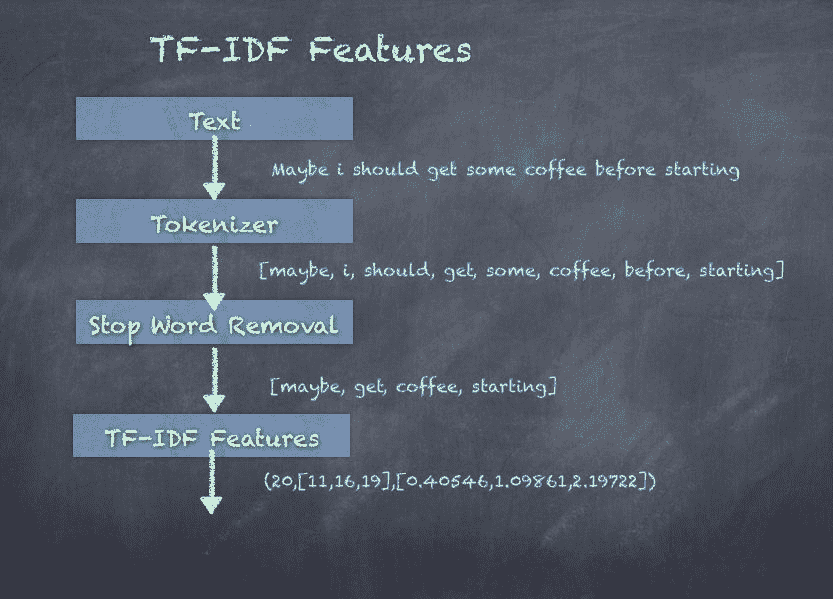

# Word2Vec

Word2Vec 是一个复杂的神经网络风格的自然语言处理工具，使用一种称为**跳字模型**（skip-grams）的方法，将一串单词转换为嵌入式向量表示。我们来看一个关于动物的句子集合，看看如何使用这种技术：

+   一只狗在叫

+   一些牛在吃草

+   狗通常会随便叫

+   那头牛喜欢吃草

使用带有隐藏层的神经网络（这种机器学习算法在许多无监督学习应用中被使用），我们可以学习到（通过足够的示例）*dog*和*barking*是相关的，*cow*和*grass*是相关的，因为它们经常出现在彼此附近，这种关系通过概率来衡量。`Word2vec`的输出是一个`Double`特征的向量。

为了调用`Word2vec`，您需要导入该包：

```py
import org.apache.spark.ml.feature.Word2Vec

```

首先，你需要初始化一个`Word2vec`转换器，指定输入列和输出列。这里，我们选择由`Tokenizer`创建的单词列，并生成一个大小为 3 的单词向量输出列：

```py
scala> val word2Vec = new Word2Vec().setInputCol("words").setOutputCol("wordvector").setVectorSize(3).setMinCount(0)
word2Vec: org.apache.spark.ml.feature.Word2Vec = w2v_fe9d488fdb69

```

接下来，对输入数据集调用`fit()`函数会生成一个输出转换器：

```py
scala> val word2VecModel = word2Vec.fit(noStopWordsDF)
word2VecModel: org.apache.spark.ml.feature.Word2VecModel = w2v_fe9d488fdb69

```

此外，对输入数据集调用`transform()`函数会生成一个输出数据集：

```py
scala> val word2VecDF = word2VecModel.transform(noStopWordsDF)
word2VecDF: org.apache.spark.sql.DataFrame = [id: int, sentence: string ... 3 more fields]

```

以下是输出数据集，显示了输入列 ID、句子以及输出列`wordvector`：

```py
scala> word2VecDF.show(false)
|id|sentence |words |filteredWords |wordvector |
|1 |Hello there, how do you like the book so far? |[hello, there,, how, do, you, like, the, book, so, far?] |[hello, there,, like, book, far?] |[0.006875938177108765,-0.00819675214588642,0.0040686681866645815]|
|2 |I am new to Machine Learning |[i, am, new, to, machine, learning] |[new, machine, learning] |[0.026012470324834187,0.023195965060343344,-0.10863214979569116] |
|3 |Maybe i should get some coffee before starting |[maybe, i, should, get, some, coffee, before, starting] |[maybe, get, coffee, starting] |[-0.004304863978177309,-0.004591284319758415,0.02117823390290141]|
|4 |Coffee is best when you drink it hot |[coffee, is, best, when, you, drink, it, hot] |[coffee, best, drink, hot] |[0.054064739029854536,-0.003801364451646805,0.06522738828789443] |
|5 |Book stores have coffee too so i should go to a book store|[book, stores, have, coffee, too, so, i, should, go, to, a, book, store]|[book, stores, coffee, go, book, store]|[-0.05887459063281615,-0.07891856770341595,0.07510609552264214] |

```

**Word2Vec 特征**的示意图如下，展示了单词如何被转换为向量：

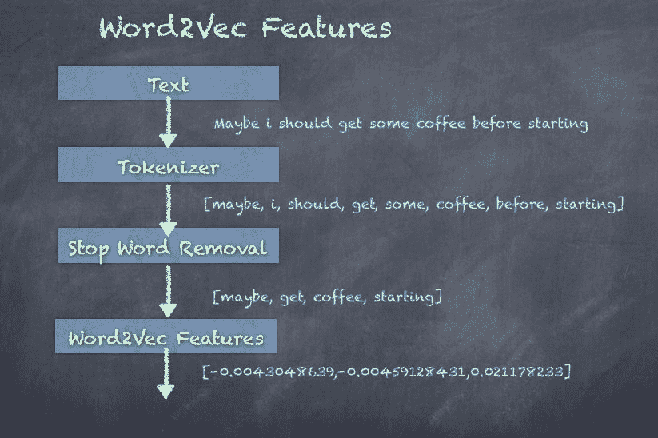

# CountVectorizer

`CountVectorizer`用于将一组文本文档转换为标记计数的向量，实质上为文档生成稀疏表示，覆盖词汇表。最终结果是一个特征向量，可以传递给其他算法。稍后，我们将看到如何在 LDA 算法中使用`CountVectorizer`的输出进行主题检测。

为了调用`CountVectorizer`，你需要导入相关的包：

```py
import org.apache.spark.ml.feature.CountVectorizer

```

首先，你需要初始化一个`CountVectorizer`转换器，指定输入列和输出列。这里，我们选择由`StopWordRemover`创建的`filteredWords`列，并生成输出列特征：

```py
scala> val countVectorizer = new CountVectorizer().setInputCol("filteredWords").setOutputCol("features")
countVectorizer: org.apache.spark.ml.feature.CountVectorizer = cntVec_555716178088

```

接下来，对输入数据集调用`fit()`函数会生成一个输出转换器：

```py
scala> val countVectorizerModel = countVectorizer.fit(noStopWordsDF)
countVectorizerModel: org.apache.spark.ml.feature.CountVectorizerModel = cntVec_555716178088

```

此外，对输入数据集调用`transform()`函数会生成一个输出数据集。

```py
scala> val countVectorizerDF = countVectorizerModel.transform(noStopWordsDF)
countVectorizerDF: org.apache.spark.sql.DataFrame = [id: int, sentence: string ... 3 more fields]

```

以下是输出数据集，显示了输入列 ID、句子以及输出列特征：

```py
scala> countVectorizerDF.show(false)
|id |sentence |words |filteredWords |features |
|1 |Hello there, how do you like the book so far? |[hello, there,, how, do, you, like, the, book, so, far?] |[hello, there,, like, book, far?] |(18,[1,4,5,13,15],[1.0,1.0,1.0,1.0,1.0])|
|2 |I am new to Machine Learning |[i, am, new, to, machine, learning] |[new, machine, learning] |(18,[6,7,16],[1.0,1.0,1.0]) |
|3 |Maybe i should get some coffee before starting |[maybe, i, should, get, some, coffee, before, starting] |[maybe, get, coffee, starting] |(18,[0,8,9,14],[1.0,1.0,1.0,1.0]) |
|4 |Coffee is best when you drink it hot |[coffee, is, best, when, you, drink, it, hot] |[coffee, best, drink, hot] |(18,[0,3,10,12],[1.0,1.0,1.0,1.0]) |
|5 |Book stores have coffee too so i should go to a book store|[book, stores, have, coffee, too, so, i, should, go, to, a, book, store]|[book, stores, coffee, go, book, store]|(18,[0,1,2,11,17],[1.0,2.0,1.0,1.0,1.0])|

```

`CountVectorizer`的示意图如下，展示了从`StopWordsRemover`转换中生成的特征：

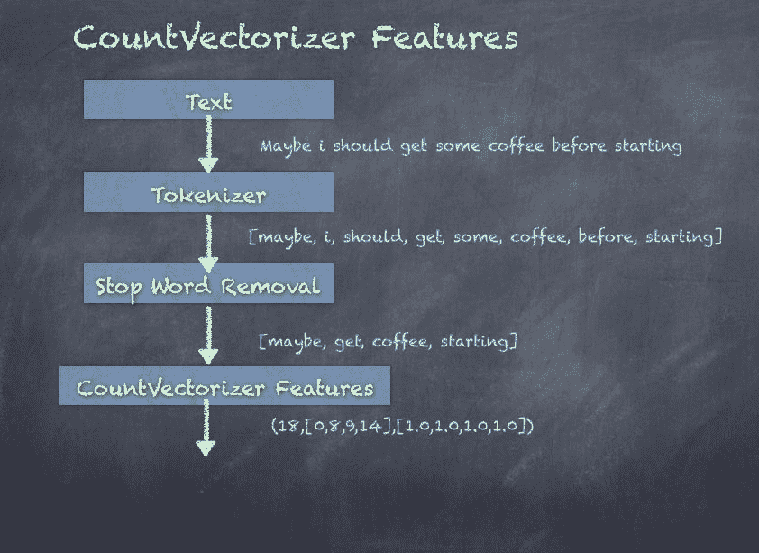

# 使用 LDA 进行主题建模

LDA 是一种主题模型，它从一组文本文档中推断出主题。LDA 可以被看作是一种无监督聚类算法，如下所示：

+   主题对应聚类中心，文档对应数据集中的行

+   主题和文档都存在于特征空间中，特征向量是词计数向量

+   LDA 不是通过传统的距离估计聚类，而是使用基于文本文档生成统计模型的函数

为了调用 LDA，你需要导入相关的包：

```py
import org.apache.spark.ml.clustering.LDA

```

**步骤 1.** 首先，你需要初始化一个 LDA 模型，设置 10 个主题和 10 次聚类迭代：

```py
scala> val lda = new LDA().setK(10).setMaxIter(10)
lda: org.apache.spark.ml.clustering.LDA = lda_18f248b08480

```

**步骤 2.** 接下来，对输入数据集调用`fit()`函数会生成一个输出转换器：

```py
scala> val ldaModel = lda.fit(countVectorizerDF)
ldaModel: org.apache.spark.ml.clustering.LDAModel = lda_18f248b08480

```

**步骤 3.** 提取`logLikelihood`，它计算在推断的主题下提供的文档的下界：

```py
scala> val ll = ldaModel.logLikelihood(countVectorizerDF)
ll: Double = -275.3298948279124

```

**步骤 4.** 提取`logPerplexity`，它计算在推断的主题下提供的文档的困惑度上界：

```py
scala> val lp = ldaModel.logPerplexity(countVectorizerDF)
lp: Double = 12.512670220189033

```

**步骤 5.** 现在，我们可以使用`describeTopics()`来获取 LDA 生成的主题：

```py
scala> val topics = ldaModel.describeTopics(10)
topics: org.apache.spark.sql.DataFrame = [topic: int, termIndices: array<int> ... 1 more field]

```

**第 6 步。** 以下是输出数据集，展示了 LDA 模型计算出的 `topic`、`termIndices` 和 `termWeights`：

```py
scala> topics.show(10, false)
|topic|termIndices |termWeights |
|0 |[2, 5, 7, 12, 17, 9, 13, 16, 4, 11] |[0.06403877783050851, 0.0638177222807826, 0.06296749987731722, 0.06129482302538905, 0.05906095287220612, 0.0583855194291998, 0.05794181263149175, 0.057342702589298085, 0.05638654243412251, 0.05601913313272188] |
|1 |[15, 5, 13, 8, 1, 6, 9, 16, 2, 14] |[0.06889315890755099, 0.06415969116685549, 0.058990446579892136, 0.05840283223031986, 0.05676844625413551, 0.0566842803396241, 0.05633554021408156, 0.05580861561950114, 0.055116582320533423, 0.05471754535803045] |
|2 |[17, 14, 1, 5, 12, 2, 4, 8, 11, 16] |[0.06230542516700517, 0.06207673834677118, 0.06089143673912089, 0.060721809302399316, 0.06020894045877178, 0.05953822260375286, 0.05897033457363252, 0.057504989644756616, 0.05586725037894327, 0.05562088924566989] |
|3 |[15, 2, 11, 16, 1, 7, 17, 8, 10, 3] |[0.06995373276880751, 0.06249041124300946, 0.061960612781077645, 0.05879695651399876, 0.05816564815895558, 0.05798721645705949, 0.05724374708387087, 0.056034215734402475, 0.05474217418082123, 0.05443850583761207] |
|4 |[16, 9, 5, 7, 1, 12, 14, 10, 13, 4] |[0.06739359010780331, 0.06716438619386095, 0.06391509491709904, 0.062049068666162915, 0.06050715515506004, 0.05925113958472128, 0.057946856127790804, 0.05594837087703049, 0.055000929117413805, 0.053537418286233956]|
|5 |[5, 15, 6, 17, 7, 8, 16, 11, 10, 2] |[0.061611492476326836, 0.06131944264846151, 0.06092975441932787, 0.059812552365763404, 0.05959889552537741, 0.05929123338151455, 0.05899808901872648, 0.05892061664356089, 0.05706951425713708, 0.05636134431063274] |
|6 |[15, 0, 4, 14, 2, 10, 13, 7, 6, 8] |[0.06669864676186414, 0.0613859230159798, 0.05902091745149218, 0.058507882633921676, 0.058373998449322555, 0.05740944364508325, 0.057039150886628136, 0.057021822698594314, 0.05677330199892444, 0.056741558062814376]|
|7 |[12, 9, 8, 15, 16, 4, 7, 13, 17, 10]|[0.06770789917351365, 0.06320078344027158, 0.06225712567900613, 0.058773135159638154, 0.05832535181576588, 0.057727684814461444, 0.056683575112703555, 0.05651178333610803, 0.056202395617563274, 0.05538103218174723]|
|8 |[14, 11, 10, 7, 12, 9, 13, 16, 5, 1]|[0.06757347958335463, 0.06362319365053591, 0.063359294927315, 0.06319462709331332, 0.05969320243218982, 0.058380063437908046, 0.057412693576813126, 0.056710451222381435, 0.056254581639201336, 0.054737785085167814] |
|9 |[3, 16, 5, 7, 0, 2, 10, 15, 1, 13] |[0.06603941595604573, 0.06312775362528278, 0.06248795574460503, 0.06240547032037694, 0.0613859713404773, 0.06017781222489122, 0.05945655694365531, 0.05910351349013983, 0.05751269894725456, 0.05605239791764803] |

```

LDA 的图示如下，展示了从 TF-IDF 特征中创建的主题：

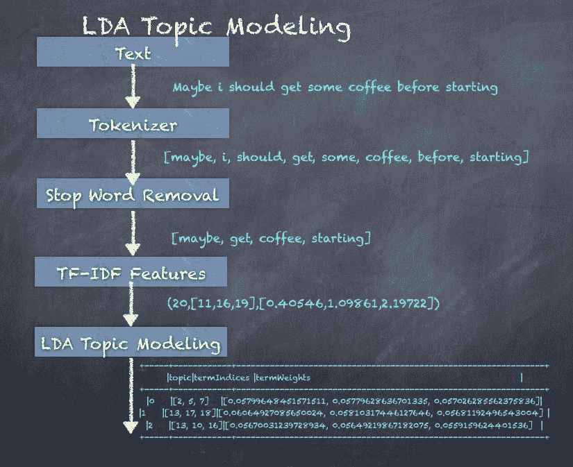

# 实现文本分类

文本分类是机器学习领域中最广泛使用的范式之一，广泛应用于垃圾邮件检测、电子邮件分类等用例。就像任何其他机器学习算法一样，工作流由变换器和算法组成。在文本处理领域，预处理步骤如去除停用词、词干提取、分词、n-gram 提取、TF-IDF 特征加权等会发挥作用。一旦所需的处理完成，模型将被训练以将文档分类为两类或更多类。

二分类是将输入分类为两个输出类，如垃圾邮件/非垃圾邮件，或者某个信用卡交易是否为欺诈行为。多类分类可以生成多个输出类，如热、冷、冰冻、雨天等。还有一种称为多标签分类的技术，它可以根据汽车特征的描述生成多个标签，如速度、安全性和燃油效率。

为此，我们将使用一个包含 10k 条推文样本的数据集，并在该数据集上使用上述技术。然后，我们将对文本行进行分词，去除停用词，然后使用 `CountVectorizer` 构建单词（特征）向量。

接下来我们将数据划分为训练集（80%）和测试集（20%），并训练一个逻辑回归模型。最后，我们将在测试数据上评估并查看其表现如何。

工作流中的步骤如下图所示：

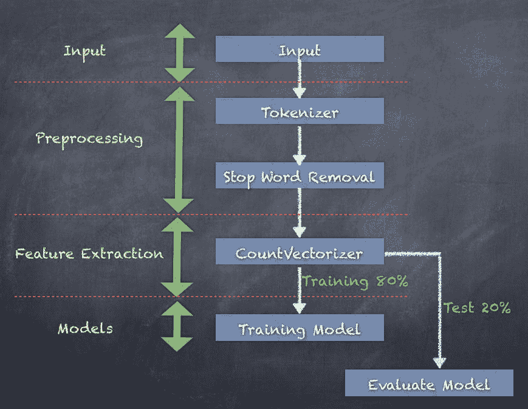

**第 1 步。** 加载包含 10k 条推文的输入文本数据，以及标签和 ID：

```py
scala> val inputText = sc.textFile("Sentiment_Analysis_Dataset10k.csv")
inputText: org.apache.spark.rdd.RDD[String] = Sentiment_Analysis_Dataset10k.csv MapPartitionsRDD[1722] at textFile at <console>:77

```

**第 2 步。** 将输入行转换为数据框（DataFrame）：

```py
scala> val sentenceDF = inputText.map(x => (x.split(",")(0), x.split(",")(1), x.split(",")(2))).toDF("id", "label", "sentence")
sentenceDF: org.apache.spark.sql.DataFrame = [id: string, label: string ... 1 more field]

```

**第 3 步。** 使用带有空格分隔符的 `Tokenizer` 将数据转换为单词：

```py
scala> import org.apache.spark.ml.feature.Tokenizer
import org.apache.spark.ml.feature.Tokenizer

scala> val tokenizer = new Tokenizer().setInputCol("sentence").setOutputCol("words")
tokenizer: org.apache.spark.ml.feature.Tokenizer = tok_ebd4c89f166e

scala> val wordsDF = tokenizer.transform(sentenceDF)
wordsDF: org.apache.spark.sql.DataFrame = [id: string, label: string ... 2 more fields]

scala> wordsDF.show(5, true)
| id|label| sentence| words|
| 1| 0|is so sad for my ...|[is, so, sad, for...|
| 2| 0|I missed the New ...|[i, missed, the, ...|
| 3| 1| omg its already ...|[, omg, its, alre...|
| 4| 0| .. Omgaga. Im s...|[, , .., omgaga.,...|
| 5| 0|i think mi bf is ...|[i, think, mi, bf...|

```

**第 4 步。** 去除停用词并创建一个新数据框，包含过滤后的单词：

```py
scala> import org.apache.spark.ml.feature.StopWordsRemover
import org.apache.spark.ml.feature.StopWordsRemover

scala> val remover = new StopWordsRemover().setInputCol("words").setOutputCol("filteredWords")
remover: org.apache.spark.ml.feature.StopWordsRemover = stopWords_d8dd48c9cdd0

scala> val noStopWordsDF = remover.transform(wordsDF)
noStopWordsDF: org.apache.spark.sql.DataFrame = [id: string, label: string ... 3 more fields]

scala> noStopWordsDF.show(5, true)
| id|label| sentence| words| filteredWords|
| 1| 0|is so sad for my ...|[is, so, sad, for...|[sad, apl, friend...|
| 2| 0|I missed the New ...|[i, missed, the, ...|[missed, new, moo...|
| 3| 1| omg its already ...|[, omg, its, alre...|[, omg, already, ...|
| 4| 0| .. Omgaga. Im s...|[, , .., omgaga.,...|[, , .., omgaga.,...|
| 5| 0|i think mi bf is ...|[i, think, mi, bf...|[think, mi, bf, c...|

```

**第 5 步。** 从过滤后的单词中创建特征向量：

```py
scala> import org.apache.spark.ml.feature.CountVectorizer
import org.apache.spark.ml.feature.CountVectorizer

scala> val countVectorizer = new CountVectorizer().setInputCol("filteredWords").setOutputCol("features")
countVectorizer: org.apache.spark.ml.feature.CountVectorizer = cntVec_fdf1512dfcbd

scala> val countVectorizerModel = countVectorizer.fit(noStopWordsDF)
countVectorizerModel: org.apache.spark.ml.feature.CountVectorizerModel = cntVec_fdf1512dfcbd

scala> val countVectorizerDF = countVectorizerModel.transform(noStopWordsDF)
countVectorizerDF: org.apache.spark.sql.DataFrame = [id: string, label: string ... 4 more fields]

scala> countVectorizerDF.show(5,true)
| id|label| sentence| words| filteredWords| features|
| 1| 0|is so sad for my ...|[is, so, sad, for...|[sad, apl, friend...|(23481,[35,9315,2...|
| 2| 0|I missed the New ...|[i, missed, the, ...|[missed, new, moo...|(23481,[23,175,97...|
| 3| 1| omg its already ...|[, omg, its, alre...|[, omg, already, ...|(23481,[0,143,686...|
| 4| 0| .. Omgaga. Im s...|[, , .., omgaga.,...|[, , .., omgaga.,...|(23481,[0,4,13,27...|
| 5| 0|i think mi bf is ...|[i, think, mi, bf...|[think, mi, bf, c...|(23481,[0,33,731,...|

```

**第 6 步。** 创建包含标签和特征的 `inputData` 数据框：

```py

scala> val inputData=countVectorizerDF.select("label", "features").withColumn("label", col("label").cast("double"))
inputData: org.apache.spark.sql.DataFrame = [label: double, features: vector]

```

**第 7 步。** 使用随机拆分将数据划分为 80% 的训练集和 20% 的测试集：

```py
scala> val Array(trainingData, testData) = inputData.randomSplit(Array(0.8, 0.2))
trainingData: org.apache.spark.sql.Dataset[org.apache.spark.sql.Row] = [label: double, features: vector]
testData: org.apache.spark.sql.Dataset[org.apache.spark.sql.Row] = [label: double, features: vector]

```

**第 8 步。** 创建一个逻辑回归模型：

```py
scala> import org.apache.spark.ml.classification.LogisticRegression
import org.apache.spark.ml.classification.LogisticRegression

scala> val lr = new LogisticRegression()
lr: org.apache.spark.ml.classification.LogisticRegression = logreg_a56accef5728

```

**第 9 步。** 通过拟合 `trainingData` 创建一个逻辑回归模型：

```py
scala> var lrModel = lr.fit(trainingData)
lrModel: org.apache.spark.ml.classification.LogisticRegressionModel = logreg_a56accef5728

scala> lrModel.coefficients
res160: org.apache.spark.ml.linalg.Vector = [7.499178040193577,8.794520490564185,4.837543313917086,-5.995818019393418,1.1754740390468577,3.2104594489397584,1.7840290776286476,-1.8391923375331787,1.3427471762591,6.963032309971087,-6.92725055841986,-10.781468845891563,3.9752.836891070557657,3.8758544006087523,-11.760894935576934,-6.252988307540...

scala> lrModel.intercept
res161: Double = -5.397920610780994

```

**第 10 步。** 检查模型摘要，特别是 `areaUnderROC`，一个好的模型其值应该是 *> 0.90*：

```py
scala> import org.apache.spark.ml.classification.BinaryLogisticRegressionSummary
import org.apache.spark.ml.classification.BinaryLogisticRegressionSummary

scala> val summary = lrModel.summary
summary: org.apache.spark.ml.classification.LogisticRegressionTrainingSummary = org.apache.spark.ml.classification.BinaryLogisticRegressionTrainingSummary@1dce712c

scala> val bSummary = summary.asInstanceOf[BinaryLogisticRegressionSummary]
bSummary: org.apache.spark.ml.classification.BinaryLogisticRegressionSummary = org.apache.spark.ml.classification.BinaryLogisticRegressionTrainingSummary@1dce712c

scala> bSummary.areaUnderROC
res166: Double = 0.9999231930196596

scala> bSummary.roc
res167: org.apache.spark.sql.DataFrame = [FPR: double, TPR: double]

scala> bSummary.pr.show()
| recall|precision|
| 0.0| 1.0|
| 0.2306543172990738| 1.0|
| 0.2596354944726621| 1.0|
| 0.2832387212429041| 1.0|
|0.30504929787869733| 1.0|
| 0.3304451747833881| 1.0|
|0.35255452644158947| 1.0|
| 0.3740663280549746| 1.0|
| 0.3952793546459516| 1.0|

```

**第 11 步。** 使用训练好的模型转换训练集和测试集数据：

```py
scala> val training = lrModel.transform(trainingData)
training: org.apache.spark.sql.DataFrame = [label: double, features: vector ... 3 more fields]

scala> val test = lrModel.transform(testData)
test: org.apache.spark.sql.DataFrame = [label: double, features: vector ... 3 more fields]

```

**第 12 步。** 计算标签和预测列匹配的记录数。它们应该匹配，以便正确评估模型，否则会不匹配：

```py
scala> training.filter("label == prediction").count
res162: Long = 8029

scala> training.filter("label != prediction").count
res163: Long = 19

scala> test.filter("label == prediction").count
res164: Long = 1334

scala> test.filter("label != prediction").count
res165: Long = 617

```

结果可以放入如下所示的表格中：

| **数据集** | **总数** | **标签 == 预测** | **标签 != 预测** |
| --- | --- | --- | --- |
| **训练** | 8048 | 8029 (99.76%) | 19 (0.24%) |
| **测试** | 1951 | 1334 (68.35%) | 617 (31.65%) |

虽然训练数据得到了很好的匹配，但测试数据的匹配率只有 68.35%。因此，仍有改进的空间，可以通过调整模型参数来实现。

逻辑回归是一种易于理解的方法，它通过输入的线性组合和以逻辑随机变量形式存在的随机噪声来预测二元结果。因此，逻辑回归模型可以通过多个参数进行调整。（本章不涉及逻辑回归模型的所有参数及其调优方法。）

可以用来调整模型的某些参数包括：

+   模型超参数包括以下参数：

    +   `elasticNetParam`：该参数指定您希望如何混合 L1 和 L2 正则化。

    +   `regParam`：该参数决定了在传入模型之前，输入应该如何进行正则化。

+   训练参数包括以下参数：

    +   `maxIter`：这是停止前的总交互次数。

    +   `weightCol`：这是权重列的名称，用于对某些行进行加权，使其比其他行更重要。

+   预测参数包括以下参数：

    +   `threshold`：这是二元预测的概率阈值。它决定了给定类别被预测的最低概率。

我们现在已经看到了如何构建一个简单的分类模型，因此可以根据训练集为任何新的推文打标签。逻辑回归只是可以使用的模型之一。

可以替代逻辑回归使用的其他模型如下：

+   决策树

+   随机森林

+   梯度提升树

+   多层感知机

# 总结

在本章中，我们介绍了使用 Spark ML 进行文本分析的世界，重点讲解了文本分类。我们了解了 Transformers 和 Estimators。我们看到了如何使用 Tokenizers 将句子分解为单词，如何去除停用词，以及生成 n-grams。我们还学习了如何实现`HashingTF`和`IDF`来生成基于 TF-IDF 的特征。我们还看到了如何使用`Word2Vec`将单词序列转换为向量。

然后，我们还查看了 LDA，一种常用的技术，用于从文档中生成主题，而无需深入了解实际文本内容。最后，我们在来自 Twitter 数据集的 1 万个推文数据集上实施了文本分类，看看如何通过使用 Transformers、Estimators 和 Logistic Regression 模型进行二元分类，将这一切结合起来。

在下一章，我们将进一步深入探讨如何调整 Spark 应用程序以获得更好的性能。
