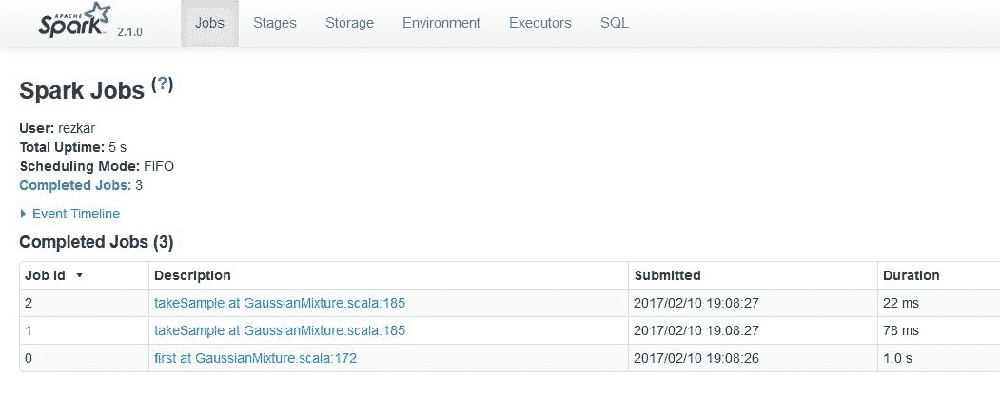
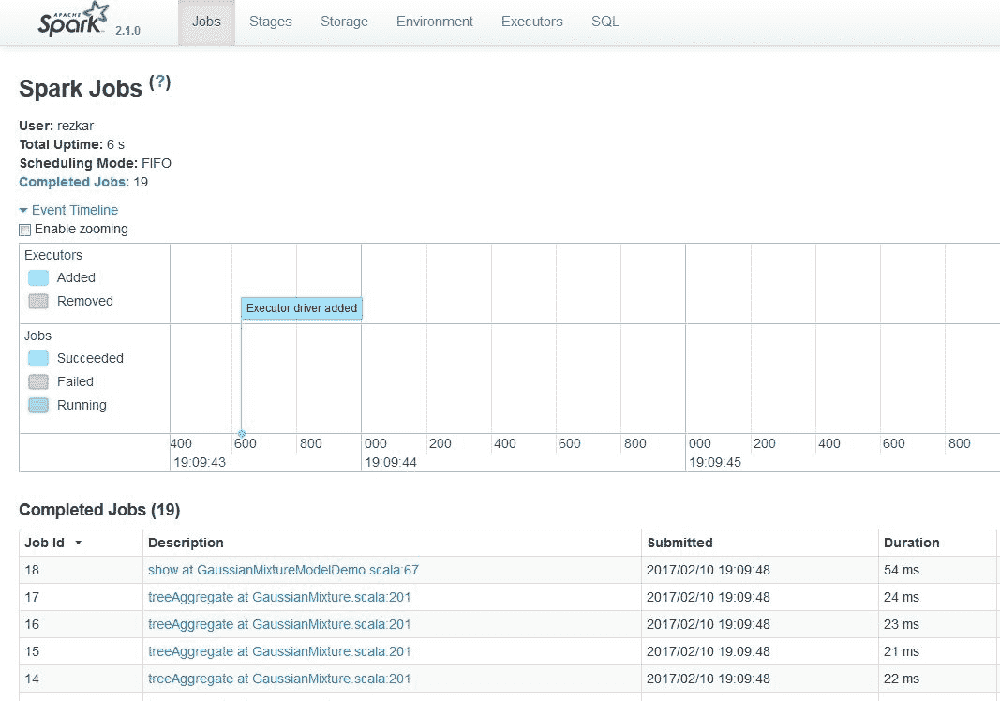
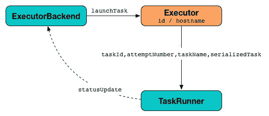

# 第十六章：Spark 调优

*“竖琴手把 90%的时间花在调弦上，只有 10%的时间是在演奏不和谐的音乐。”*

- 伊戈尔·斯特拉文斯基

在本章中，我们将深入探讨 Apache Spark 的内部机制，看到尽管 Spark 让我们感觉就像在使用另一个 Scala 集合，但我们不能忘记 Spark 实际上运行在一个分布式系统中。因此，需要额外的注意。简而言之，本章将涵盖以下主题：

+   监控 Spark 作业

+   Spark 配置

+   Spark 应用程序开发中的常见错误

+   优化技巧

# 监控 Spark 作业

Spark 提供了 Web UI，用于监控在计算节点（驱动程序或执行器）上运行或已完成的所有作业。在本节中，我们将简要讨论如何使用 Spark Web UI 监控 Spark 作业，并通过适当的示例来说明。我们将看到如何监控作业的进度（包括提交、排队和运行中的作业）。所有 Spark Web UI 中的选项卡将简要讨论。最后，我们将讨论 Spark 的日志记录过程，以便更好地进行调优。

# Spark Web 界面

Web UI（也称为 Spark UI）是一个 Web 界面，用于运行 Spark 应用程序，以便在 Firefox 或 Google Chrome 等 Web 浏览器中监控作业的执行。当 SparkContext 启动时，一个显示应用程序有用信息的 Web UI 会在独立模式下启动，并监听 4040 端口。Spark Web UI 的可用方式根据应用程序是仍在运行还是已完成执行而有所不同。

此外，你可以在应用程序执行完成后通过使用`EventLoggingListener`将所有事件持久化，从而使用 Web UI。然而，`EventLoggingListener`不能单独工作，必须结合 Spark 历史服务器一起使用。将这两项功能结合起来，可以实现以下设施：

+   调度器阶段和任务列表

+   RDD 大小的摘要

+   内存使用

+   环境信息

+   关于正在运行的执行器的信息

你可以通过在 Web 浏览器中访问`http://<driver-node>:4040`来访问 UI。例如，在独立模式下提交并运行的 Spark 作业可以通过`http://localhost:4040`访问。

请注意，如果多个 SparkContext 在同一主机上运行，它们将绑定到从 4040 开始的连续端口，依次为 4041、4042 等。默认情况下，这些信息仅在 Spark 应用程序运行期间有效。这意味着当你的 Spark 作业执行完成时，这些绑定将不再有效或可访问。

只要作业正在运行，就可以在 Spark UI 上观察到阶段。然而，要在作业完成执行后查看 Web UI，你可以在提交 Spark 作业之前将`spark.eventLog.enabled`设置为 true。这会强制 Spark 将所有事件记录到存储中（如本地文件系统或 HDFS），以便在 UI 中显示。

在前一章中，我们看到如何将 Spark 作业提交到集群。让我们重用其中一个命令来提交 k-means 聚类，如下所示：

```py
# Run application as standalone mode on 8 cores
SPARK_HOME/bin/spark-submit \
 --class org.apache.spark.examples.KMeansDemo \
 --master local[8] \
 KMeansDemo-0.1-SNAPSHOT-jar-with-dependencies.jar \
 Saratoga_NY_Homes.txt

```

如果您使用上述命令提交作业，则无法看到已完成执行的作业的状态，因此要使更改永久化，请使用以下两个选项：

```py
spark.eventLog.enabled=true 
spark.eventLog.dir=file:///home/username/log"

```

通过设置前两个配置变量，我们要求 Spark 驱动程序启用事件日志记录并保存到`file:///home/username/log`。

总结地说，通过以下更改，您的提交命令将如下所示：

```py
# Run application as standalone mode on 8 cores
SPARK_HOME/bin/spark-submit \
 --conf "spark.eventLog.enabled=true" \
 --conf "spark.eventLog.dir=file:///tmp/test" \
 --class org.apache.spark.examples.KMeansDemo \
 --master local[8] \
 KMeansDemo-0.1-SNAPSHOT-jar-with-dependencies.jar \
 Saratoga_NY_Homes.txt

```

**图 1：** Spark Web UI

如前面的屏幕截图所示，Spark Web UI 提供以下标签：

+   作业

+   阶段

+   存储

+   环境

+   执行器

+   SQL

需要注意的是，并非所有功能一次性可见，例如在运行流式作业时。

# 作业

根据 SparkContext 的不同，作业标签显示 Spark 应用程序中所有 Spark 作业的状态。当您使用 Web 浏览器访问 Spark UI 上的作业标签，地址为`http://localhost:4040`（对于独立模式），您应该看到以下选项：

+   用户：显示提交 Spark 作业的活跃用户

+   总正常运行时间：显示作业的总正常运行时间

+   调度模式：在大多数情况下，是先进先出（即 FIFO）

+   活跃作业：显示活跃作业的数量

+   已完成作业：显示已完成作业的数量

+   事件时间线：显示已完成执行的作业的时间线

在内部，作业标签由`JobsTab`类表示，它是具有作业前缀的自定义 SparkUI 标签。作业标签使用`JobProgressListener`访问关于 Spark 作业的统计信息，以在页面上显示上述信息。请看下面的屏幕截图：

**图 2：** Spark Web UI 中的作业标签

如果您在作业标签中进一步展开“活跃作业”选项，您将能够看到执行计划、状态、已完成阶段的数量以及该特定作业的作业 ID，如 DAG 可视化所示：

**图 3：** Spark Web UI 中任务的 DAG 可视化（简化版）

当用户在 Spark 控制台中输入代码（例如，Spark shell 或使用 Spark submit），Spark Core 创建操作图。这基本上是当用户在特定节点上对 RDD 执行操作（例如 reduce、collect、count、first、take、countByKey、saveAsTextFile）或转换（例如 map、flatMap、filter、mapPartitions、sample、union、intersection、distinct）时发生的情况，这些 RDD 是不可变对象。

**图 4：** DAG 调度程序将 RDD 衍生线路转换为阶段 DAG

在变换或动作期间，**有向无环图**（**DAG**）信息用于恢复节点至最后的变换和动作（参考*图 4*和*图 5*以获得更清晰的视图），以保持数据的容错性。最终，图会被提交给 DAG 调度器。

Spark 如何从 RDD 计算 DAG 并随后执行任务？

从高层次来看，当对 RDD 调用任何动作时，Spark 会创建 DAG 并将其提交给 DAG 调度器。DAG 调度器将操作符划分为任务阶段。一个阶段包含基于输入数据分区的任务。DAG 调度器将操作符串联在一起。例如，多个 map 操作符可以在单一阶段内调度。DAG 调度器的最终结果是一个阶段集合。这些阶段会传递给任务调度器。任务调度器通过集群管理器（Spark Standalone/YARN/Mesos）启动任务。任务调度器并不知道阶段之间的依赖关系。工作节点在阶段上执行任务。

DAG 调度器随后会跟踪阶段输出的 RDD 来源。它会找到一个最小化的调度来运行作业，并将相关的操作符划分为任务阶段。根据输入数据的分区，一个阶段包含多个任务。然后，操作符与 DAG 调度器一起进行流水线化。例如，多个 map 或 reduce 操作符（例如）可以在一个阶段中调度。

**图 5：** 执行动作会导致 DAGScheduler 中新的 ResultStage 和 ActiveJob 的产生

DAG 调度器中的两个基本概念是作业和阶段。因此，它必须通过内部注册表和计数器进行跟踪。技术上讲，DAG 调度器是 SparkContext 初始化的一部分，仅在驱动程序上工作（任务调度器和调度器后端准备好之后立即）。DAG 调度器负责 Spark 执行中的三项主要任务。它计算作业的执行 DAG，也就是阶段的 DAG。它确定每个任务的首选节点，并处理由于 shuffle 输出文件丢失而导致的失败。

**图 6：** 由 SparkContext 创建的 DAGScheduler 与其他服务

DAG 调度器的最终结果是一个阶段集合。因此，大多数统计数据和作业状态可以通过这种可视化查看，例如执行计划、状态、已完成的阶段数量以及特定作业的作业 ID。

# 阶段

Spark UI 中的阶段选项卡显示 Spark 应用程序中所有作业的所有阶段的当前状态，包括阶段和池详情的任务和阶段统计信息的两个可选页面。请注意，仅当应用程序以公平调度模式运行时才可用此信息。您应该能够在`http://localhost:4040/stages`访问阶段选项卡。请注意，当没有提交作业时，该选项卡除标题外不显示任何内容。阶段选项卡显示 Spark 应用程序中的阶段。在此选项卡中可以看到以下阶段：

+   活跃阶段

+   待处理阶段

+   已完成阶段

例如，当您本地提交 Spark 作业时，您应该能够看到以下状态：

**图 7：** Spark Web UI 中所有作业的阶段

在这种情况下，只有一个活动阶段。然而，在接下来的章节中，当我们将我们的 Spark 作业提交到 AWS EC2 集群时，我们将能够观察到其他阶段。

要进一步深入到已完成作业的摘要，请单击“描述”列中包含的任何链接，您应该找到有关执行时间统计作为度量标准的相关统计信息。在度量标准中，还可以看到最小值、中位数、第 25 百分位数、第 75 百分位数和最大值的大约时间。以下图中还可以看到：

**图 8：** Spark Web UI 上已完成作业的摘要

您的情况可能不同，因为在撰写本书期间，我仅执行并提交了两个作业以进行演示。您还可以查看有关执行器的其他统计信息。对于我的情况，我通过使用 8 核和 32 GB RAM 在独立模式下提交了这些作业。除此之外，还显示了与执行器相关的信息，例如 ID、带有相关端口号的 IP 地址、任务完成时间、任务数量（包括失败任务、被杀任务和成功任务的数量）以及每个记录的数据集输入大小。

图像中的其他部分显示与这两个任务相关的其他信息，例如索引、ID、尝试、状态、本地性级别、主机信息、启动时间、持续时间、**垃圾收集**（**GC**）时间等。

# 存储

存储选项卡显示每个 RDD、DataFrame 或 Dataset 的大小和内存使用情况。您应该能够看到 RDDs、DataFrames 或 Datasets 的存储相关信息。以下图显示存储元数据，例如 RDD 名称、存储级别、缓存分区的数量、已缓存数据的分数百分比以及 RDD 在主内存中的大小：

**图 9：** 存储选项卡显示 RDD 在磁盘中消耗的空间

请注意，如果 RDD 无法缓存在主内存中，则将使用磁盘空间。在本章的后续部分将进行更详细的讨论。

**图 10：** RDD 在磁盘中的数据分布和使用的存储

# 环境

Environment 标签页显示当前在你的机器（即驱动程序）上设置的环境变量。更具体地说，可以在 Runtime Information 下看到运行时信息，如 Java Home、Java 版本和 Scala 版本。Spark 属性，如 Spark 应用程序 ID、应用程序名称、驱动程序主机信息、驱动程序端口、执行器 ID、主节点 URL 以及调度模式等，也可以查看。此外，系统相关属性和作业属性，如 AWT 工具包版本、文件编码类型（例如 UTF-8）和文件编码包信息（例如 sun.io）也可以在 System Properties 下查看。

**图 11：** Spark Web UI 上的 Environment 标签页

# Executors

Executors 标签页使用`ExecutorsListener`收集关于 Spark 应用程序执行器的信息。执行器是一个分布式代理，负责执行任务。执行器的实例化方式有多种。例如，它们可以在`CoarseGrainedExecutorBackend`接收到`RegisteredExecutor`消息时实例化，适用于 Spark Standalone 和 YARN。第二种情况是在 Spark 作业提交到 Mesos 时，Mesos 的`MesosExecutorBackend`会进行注册。第三种情况是当你本地运行 Spark 作业时，也就是`LocalEndpoint`被创建。执行器通常在整个 Spark 应用程序生命周期内运行，这称为执行器的静态分配，尽管你也可以选择动态分配。执行器后端专门管理计算节点或集群中的所有执行器。执行器定期向驱动程序的**HeartbeatReceiver** RPC 端点报告心跳和活动任务的部分度量，结果会发送回驱动程序。它们还为通过块管理器由用户程序缓存的 RDD 提供内存存储。有关更清晰的理解，请参见下图：

**图 12：** Spark 驱动程序实例化一个执行器，负责处理 HeartbeatReceiver 的心跳消息

当执行器启动时，它首先向驱动程序注册，并直接与驱动程序通信以执行任务，如下图所示：

**图 13：** 使用 TaskRunners 在执行器上启动任务

你应该能够通过`http://localhost:4040/executors`访问 Executors 标签页。

**图 14：** Spark Web UI 上的 Executors 标签页

如上图所示，可以查看与执行器相关的信息，包括 Executor ID、地址、状态、RDD 块、存储内存、磁盘使用、核心数、活动任务、失败任务、完成任务、总任务数、任务时间（GC 时间）、输入、Shuffle 读取、Shuffle 写入和线程转储。

# SQL

Spark UI 中的 SQL 选项卡显示每个操作符的所有累加器值。你应该能够通过`http://localhost:4040/SQL/`访问 SQL 选项卡。默认情况下，它会显示所有 SQL 查询执行及其底层信息。然而，SQL 选项卡仅在选择查询后才会显示 SQL 查询执行的详细信息。

SQL 的详细讨论超出了本章的范围。感兴趣的读者可以参考[`spark.apache.org/docs/latest/sql-programming-guide.html#sql`](http://spark.apache.org/docs/latest/sql-programming-guide.html#sql)，了解如何提交 SQL 查询并查看其结果输出。

# 使用 Web UI 可视化 Spark 应用程序

当提交一个 Spark 作业执行时，会启动一个 Web 应用程序 UI，展示关于该应用程序的有用信息。事件时间轴显示应用程序事件的相对顺序和交错情况。时间轴视图有三个级别：跨所有作业、单个作业内部和单个阶段内部。时间轴还显示执行器的分配和解除分配情况。

**图 15：** Spark 作业作为 DAG 在 Spark Web UI 上执行

# 观察正在运行和已完成的 Spark 作业

要访问和观察正在运行及已完成的 Spark 作业，请在 Web 浏览器中打开`http://spark_driver_host:4040`。请注意，你需要根据实际情况将`spark_driver_host`替换为相应的 IP 地址或主机名。

请注意，如果多个 SparkContext 在同一主机上运行，它们会绑定到从 4040 开始的连续端口，如 4040、4041、4042 等。默认情况下，这些信息仅在 Spark 应用程序执行期间可用。这意味着当 Spark 作业完成执行后，该绑定将不再有效或可访问。

现在，要访问仍在执行的活动作业，请点击“活动作业”链接，你将看到相关作业的信息。另一方面，要访问已完成作业的状态，请点击“已完成作业”，你将看到如前一节所述的 DAG 样式的相关信息。

**图 16：** 观察正在运行和已完成的 Spark 作业

你可以通过点击“活动作业”或“已完成作业”下的作业描述链接来实现这些操作。

# 使用日志调试 Spark 应用程序

查看所有正在运行的 Spark 应用程序的信息取决于你使用的集群管理器。在调试 Spark 应用程序时，请遵循以下说明：

+   **Spark 独立模式**：前往 Spark 主节点 UI，地址为`http://master:18080`。主节点和每个工作节点会展示集群及相关作业的统计信息。此外，每个作业的详细日志输出也会写入每个工作节点的工作目录。我们将在后续内容中讨论如何使用`log4j`手动启用 Spark 日志。

+   **YARN**：如果你的集群管理器是 YARN，并假设你正在 Cloudera（或任何其他基于 YARN 的平台）上运行 Spark 作业，那么请前往 Cloudera Manager 管理控制台中的 YARN 应用程序页面。现在，要调试运行在 YARN 上的 Spark 应用程序，请查看 Node Manager 角色的日志。为此，打开日志事件查看器，然后过滤事件流，选择一个时间窗口和日志级别，并显示 Node Manager 源。你也可以通过命令访问日志。命令的格式如下：

```py
 yarn logs -applicationId <application ID> [OPTIONS]

```

例如，以下是这些 ID 的有效命令：

```py
 yarn logs -applicationId application_561453090098_0005 
 yarn logs -applicationId application_561453090070_0005 userid

```

请注意，用户 ID 是不同的。然而，只有当 `yarn.log-aggregation-enable` 在 `yarn-site.xml` 中为 true，并且应用程序已经完成执行时，这种情况才成立。

# 使用 log4j 在 Spark 中记录日志

Spark 使用 `log4j` 进行自己的日志记录。所有后台发生的操作都会记录到 Spark shell 控制台（该控制台已经配置到底层存储）。Spark 提供了一个 `log4j` 的模板作为属性文件，我们可以扩展并修改该文件来进行 Spark 中的日志记录。进入 `SPARK_HOME/conf` 目录，你应该能看到 `log4j.properties.template` 文件。这可以作为我们自己日志系统的起点。

现在，让我们在运行 Spark 作业时创建我们自己的自定义日志系统。当你完成后，将文件重命名为 `log4j.properties` 并放在同一目录下（即项目树中）。文件的一个示例快照如下所示：

**图 17：** log4j.properties 文件的快照

默认情况下，所有日志都会发送到控制台和文件。然而，如果你想将所有噪音日志绕过，发送到一个系统文件，例如 `/var/log/sparkU.log`，那么你可以在 `log4j.properties` 文件中设置这些属性，如下所示：

```py
log4j.logger.spark.storage=INFO, RollingAppender
log4j.additivity.spark.storage=false
log4j.logger.spark.scheduler=INFO, RollingAppender
log4j.additivity.spark.scheduler=false
log4j.logger.spark.CacheTracker=INFO, RollingAppender
log4j.additivity.spark.CacheTracker=false
log4j.logger.spark.CacheTrackerActor=INFO, RollingAppender
log4j.additivity.spark.CacheTrackerActor=false
log4j.logger.spark.MapOutputTrackerActor=INFO, RollingAppender
log4j.additivity.spark.MapOutputTrackerActor=false
log4j.logger.spark.MapOutputTracker=INFO, RollingAppender
log4j.additivty.spark.MapOutputTracker=false

```

基本上，我们希望隐藏 Spark 生成的所有日志，以便我们不必在 shell 中处理它们。我们将它们重定向到文件系统中进行日志记录。另一方面，我们希望我们自己的日志能够在 shell 和单独的文件中记录，这样它们就不会与 Spark 的日志混合。在这里，我们将 Splunk 指向我们自己日志所在的文件，在这个特定的情况下是 `/var/log/sparkU.log`*。

然后，`log4j.properties` 文件将在应用程序启动时被 Spark 自动加载，所以我们除了将其放置在指定位置外，别无他法。

现在让我们来看一下如何创建我们自己的日志系统。请查看以下代码并尝试理解这里发生了什么：

```py
import org.apache.spark.{SparkConf, SparkContext}
import org.apache.log4j.LogManager
import org.apache.log4j.Level
import org.apache.log4j.Logger

object MyLog {
 def main(args: Array[String]):Unit= {
   // Stting logger level as WARN
   val log = LogManager.getRootLogger
   log.setLevel(Level.WARN)

   // Creating Spark Context
   val conf = new SparkConf().setAppName("My App").setMaster("local[*]")
   val sc = new SparkContext(conf)

   //Started the computation and printing the logging information
   log.warn("Started")                        
   val data = sc.parallelize(1 to 100000)
   log.warn("Finished")
 }
}

```

上述代码在概念上仅记录警告信息。它首先打印警告信息，然后通过并行化从 1 到 100,000 的数字来创建一个 RDD。RDD 作业完成后，它会打印另一个警告日志。然而，我们还没有注意到之前代码段中的一个问题。

`org.apache.log4j.Logger` 类的一个缺点是它不可序列化（更多细节请参考优化技术部分），这意味着我们不能在 Spark API 的某些部分操作时将其用于 *闭包* 中。例如，如果你尝试执行以下代码，你应该会遇到一个异常，提示任务不可序列化：

```py
object MyLog {
  def main(args: Array[String]):Unit= {
    // Stting logger level as WARN
    val log = LogManager.getRootLogger
    log.setLevel(Level.WARN)
    // Creating Spark Context
    val conf = new SparkConf().setAppName("My App").setMaster("local[*]")
    val sc = new SparkContext(conf)
    //Started the computation and printing the logging information
    log.warn("Started")
    val i = 0
    val data = sc.parallelize(i to 100000)
    data.foreach(i => log.info("My number"+ i))
    log.warn("Finished")
  }
}

```

解决这个问题也很简单；只需要声明 Scala 对象时使用 `extends Serializable`，现在代码看起来如下所示：

```py
class MyMapper(n: Int) extends Serializable{
  @transient lazy val log = org.apache.log4j.LogManager.getLogger
                                ("myLogger")
  def MyMapperDosomething(rdd: RDD[Int]): RDD[String] =
   rdd.map{ i =>
    log.warn("mapping: " + i)
    (i + n).toString
  }
}

```

所以在前面的代码中发生的事情是，由于闭包不能在日志记录器上关闭，它不能被整齐地分发到所有分区；因此，整个 `MyMapper` 类型的实例被分发到所有分区；一旦完成，每个分区都会创建一个新的日志记录器并用于记录。

总结一下，以下是帮助我们解决此问题的完整代码：

```py
package com.example.Personal
import org.apache.log4j.{Level, LogManager, PropertyConfigurator}
import org.apache.spark._
import org.apache.spark.rdd.RDD

class MyMapper(n: Int) extends Serializable{
  @transient lazy val log = org.apache.log4j.LogManager.getLogger
                                ("myLogger")
  def MyMapperDosomething(rdd: RDD[Int]): RDD[String] =
   rdd.map{ i =>
    log.warn("Serialization of: " + i)
    (i + n).toString
  }
}

object MyMapper{
  def apply(n: Int): MyMapper = new MyMapper(n)
}

object MyLog {
  def main(args: Array[String]) {
    val log = LogManager.getRootLogger
    log.setLevel(Level.WARN)
    val conf = new SparkConf().setAppName("My App").setMaster("local[*]")
    val sc = new SparkContext(conf)
    log.warn("Started")
    val data = sc.parallelize(1 to 100000)
    val mapper = MyMapper(1)
    val other = mapper.MyMapperDosomething(data)
    other.collect()
    log.warn("Finished")
  }
}

```

输出如下所示：

```py
17/04/29 15:33:43 WARN root: Started 
.
.
17/04/29 15:31:51 WARN myLogger: mapping: 1 
17/04/29 15:31:51 WARN myLogger: mapping: 49992
17/04/29 15:31:51 WARN myLogger: mapping: 49999
17/04/29 15:31:51 WARN myLogger: mapping: 50000 
.
. 
17/04/29 15:31:51 WARN root: Finished

```

我们将在下一节讨论 Spark 的内建日志记录功能。

# Spark 配置

配置 Spark 作业的方式有很多。在本节中，我们将讨论这些方式。更具体地说，根据 Spark 2.x 的版本，系统的配置有三个位置：

+   Spark 属性

+   环境变量

+   日志记录

# Spark 属性

如前所述，Spark 属性控制大多数应用程序特定的参数，并可以通过 Spark 的 `SparkConf` 对象进行设置。或者，这些参数也可以通过 Java 系统属性进行设置。`SparkConf` 允许你配置一些常见的属性，如下所示：

```py
setAppName() // App name 
setMaster() // Master URL 
setSparkHome() // Set the location where Spark is installed on worker nodes. 
setExecutorEnv() // Set single or multiple environment variables to be used when launching executors. 
setJars() // Set JAR files to distribute to the cluster. 
setAll() // Set multiple parameters together.

```

可以配置应用程序使用你机器上可用的多个核心。例如，我们可以通过以下方式初始化一个有两个线程的应用程序。注意，我们使用`local [2]`运行，意味着两个线程，这代表最小的并行性，而使用`local [*]`则会利用你机器上的所有可用核心。或者，你可以在提交 Spark 作业时通过以下 spark-submit 脚本指定执行器的数量：

```py
val conf = new SparkConf() 
             .setMaster("local[2]") 
             .setAppName("SampleApp") 
val sc = new SparkContext(conf)

```

可能会有一些特殊情况，需要在需要时动态加载 Spark 属性。你可以在通过 spark-submit 脚本提交 Spark 作业时进行此操作。更具体地说，你可能希望避免在 `SparkConf` 中硬编码某些配置。

Apache Spark 优先级：

Spark 在提交的作业中有以下优先级：来自配置文件的配置优先级最低。来自实际代码的配置相对于来自配置文件的配置具有更高优先级，而通过 Spark-submit 脚本从命令行传递的配置具有更高的优先级。

例如，如果你想在不同的主节点、执行器或不同的内存配置下运行你的应用程序，Spark 允许你简单地创建一个空的配置对象，如下所示：

```py
val sc = new SparkContext(new SparkConf())

```

然后，你可以在运行时为 Spark 作业提供配置，如下所示：

```py
SPARK_HOME/bin/spark-submit 
 --name "SmapleApp" \
 --class org.apache.spark.examples.KMeansDemo \
 --master mesos://207.184.161.138:7077 \ # Use your IP address
 --conf spark.eventLog.enabled=false 
 --conf "spark.executor.extraJavaOptions=-XX:+PrintGCDetails" \ 
 --deploy-mode cluster \
 --supervise \
 --executor-memory 20G \
 myApp.jar

```

`SPARK_HOME/bin/spark-submit` 还会从 `SPARK_HOME /conf/spark-defaults.conf` 读取配置选项，其中每一行由键和值组成，键值之间由空格分隔。以下是一个示例：

```py
spark.master  spark://5.6.7.8:7077 
spark.executor.memor y   4g 
spark.eventLog.enabled true 
spark.serializer org.apache.spark.serializer.KryoSerializer

```

在属性文件中指定的标志值将传递给应用程序，并与通过 `SparkConf` 指定的值合并。最后，如前所述，应用程序 Web UI 在 `http://<driver>:4040` 上的 Environment 标签下列出了所有 Spark 属性。

# 环境变量

环境变量可以用于设置计算节点或机器的配置。例如，可以通过每个计算节点上的 `conf/spark-env.sh` 脚本设置 IP 地址。下表列出了需要设置的环境变量的名称和功能：

**图 18：** 环境变量及其含义

# 日志记录

最后，日志记录可以通过你 Spark 应用程序树下的 `log4j.properties` 文件进行配置，如前面所述。Spark 使用 log4j 进行日志记录。log4j 与 Spark 支持多个有效的日志级别，它们如下所示：

| **日志级别** | **用途** |
| --- | --- |
| OFF | 这是最具体的，完全不记录日志 |
| FATAL | 这是最具体的日志级别，显示带有少量数据的致命错误 |
| ERROR | 仅显示常规错误 |
| WARN | 显示建议修复但不是强制的警告 |
| INFO | 显示 Spark 作业所需的信息 |
| DEBUG | 在调试时，这些日志将被打印出来 |
| TRACE | 这是最不具体的错误追踪，包含大量数据 |
| ALL | 最不具体的日志级别，包含所有数据 |

**表格 1：** log4j 和 Spark 的日志级别

你可以在 `conf/log4j.properties` 中设置 Spark shell 的默认日志记录。在独立的 Spark 应用程序中或在 Spark Shell 会话中，使用 `conf/log4j.properties.template` 作为起点。在本章的早期部分，我们建议你将 `log4j.properties` 文件放在项目目录下，适用于像 Eclipse 这样的基于 IDE 的环境。然而，为了完全禁用日志记录，你应该使用以下 `conf/log4j.properties.template` 作为 `log4j.properties` 。只需将 `log4j.logger.org` 的标志设置为 OFF，如下所示：

```py
log4j.logger.org=OFF

```

在下一节中，我们将讨论开发人员或程序员在开发和提交 Spark 作业时常见的一些错误。

# Spark 应用开发中的常见错误

常见的错误包括应用程序失败、由于多种因素导致作业卡住、聚合、操作或转换中的错误、主线程中的异常，以及当然，**内存溢出**（**OOM**）。

# 应用程序失败

大多数情况下，应用程序失败是因为一个或多个阶段最终失败。正如本章前面讨论的那样，Spark 作业由多个阶段组成。阶段并不是独立执行的：例如，处理阶段不能在相关的输入读取阶段之前执行。因此，假设阶段 1 执行成功，但阶段 2 执行失败，整个应用程序最终会失败。可以通过以下方式展示：

**图 19：** 一个典型 Spark 作业中的两个阶段

举个例子，假设你有以下三个 RDD 操作作为阶段。可以通过*图 20*、*图 21*和*图 22*的方式可视化表示：

```py
val rdd1 = sc.textFile(“hdfs://data/data.csv”)
                       .map(someMethod)
                       .filter(filterMethod)   

```

**图 20：** rdd1 的第 1 阶段

```py
val rdd2 = sc.hadoopFile(“hdfs://data/data2.csv”)
                      .groupByKey()
                      .map(secondMapMethod)

```

从概念上讲，这可以通过*图 21*展示，首先使用`hadoopFile()`方法解析数据，使用`groupByKey()`方法对其分组，最后进行映射：

**图 21：** rdd2 的第 2 阶段

```py
val rdd3 = rdd1.join(rdd2).map(thirdMapMethod)

```

从概念上讲，这可以通过*图 22*展示，首先解析数据，进行连接，最后映射：

**图 22：** rdd3 的第 3 阶段

现在你可以执行一个聚合函数，例如，像这样执行收集操作：

```py
rdd3.collect()

```

好吧！你已经开发了一个由三个阶段组成的 Spark 作业。从概念上讲，这可以通过以下方式展示：

**图 23：** rdd3.collect() 操作的三个阶段

现在，如果其中一个阶段失败，你的任务最终会失败。因此，最终的`rdd3.collect()`语句会抛出关于阶段失败的异常。此外，你可能会遇到以下四个因素的问题：

+   聚合操作中的错误

+   主线程中的异常

+   面向对象编程（OOP）

+   使用`spark-submit`脚本提交作业时出现类未找到异常

+   关于 Spark 核心库中某些 API/方法的误解

为了摆脱上述问题，我们的通用建议是确保在执行任何 map、flatMap 或聚合操作时没有犯任何错误。其次，确保在使用 Java 或 Scala 开发应用程序时，主方法没有缺陷。有时候代码中看不到语法错误，但很重要的一点是你已经为你的应用程序开发了一些小的测试用例。主方法中最常见的异常如下：

+   `java.lang.noclassdeffounderror`

+   `java.lang.nullpointerexception`

+   `java.lang.arrayindexoutofboundsexception`

+   `java.lang.stackoverflowerror`

+   `java.lang.classnotfoundexception`

+   `java.util.inputmismatchexception`

这些异常可以通过仔细编写 Spark 应用程序代码来避免。或者，可以广泛使用 Eclipse（或其他 IDE）的代码调试功能，消除语义错误以避免异常。对于第三个问题，即 OOM，这是一个非常常见的问题。需要注意的是，Spark 至少需要 8 GB 的主内存，并且独立模式下需要有足够的磁盘空间。另一方面，要获取完整的集群计算能力，这个要求通常会更高。

准备包含所有依赖项的 JAR 文件以执行 Spark 作业至关重要。许多从业者使用 Google 的 Guava，它在大多数发行版中包含，但并不能保证向后兼容。这意味着，有时即使你明确提供了 Guava 类，你的 Spark 作业也找不到该类；这是因为 Guava 库的两个版本中的一个会优先于另一个版本，而这个版本可能不包含所需的类。为了克服这个问题，通常需要使用 shading。

确保在使用 IntelliJ、Vim、Eclipse、Notepad 等编码时，已经通过 –Xmx 参数设置了足够大的 Java 堆空间。在集群模式下工作时，提交 Spark 作业时应指定执行器内存，使用 Spark-submit 脚本。假设你需要解析一个 CSV 文件并使用随机森林分类器进行一些预测分析，你可能需要指定合适的内存量，比如 20 GB，如下所示：

```py
--executor-memory 20G

```

即使你收到 OOM 错误，你可以将内存增加到例如 32 GB 或更高。由于随机森林计算密集型，要求较大的内存，这只是随机森林的一个例子。你可能在仅解析数据时也会遇到类似的问题。即使是某个特定的阶段也可能由于这个 OOM 错误而失败。因此，确保你了解这个错误。

对于 `class not found exception`，确保已将主类包含在生成的 JAR 文件中。该 JAR 文件应包含所有依赖项，以便在集群节点上执行 Spark 作业。我们将在第十七章中提供详细的 JAR 准备指南，*前往 ClusterLand - 在集群上部署 Spark。*

对于最后一个问题，我们可以提供一些关于 Spark 核心库的常见误解的例子。例如，当你使用 `wholeTextFiles` 方法从多个文件准备 RDD 或 DataFrame 时，Spark 并不会并行运行；在 YARN 的集群模式下，有时可能会因为内存不足而失败。

曾经有一次，我遇到了一个问题，首先我将六个文件从 S3 存储复制到了 HDFS 中。然后，我尝试创建一个 RDD，如下所示：

```py
sc.wholeTextFiles("/mnt/temp") // note the location of the data files is /mnt/temp/

```

然后，我尝试使用 UDF 按行处理这些文件。当我查看计算节点时，发现每个文件只运行了一个执行器。然而，我接着收到了一个错误信息，提示 YARN 内存不足。为什么会这样？原因如下：

+   `wholeTextFiles`的目标是确保每个文件只由一个执行器处理

+   例如，如果使用`.gz`文件，则每个文件最多只有一个执行器

# 任务执行缓慢或无响应

有时，如果 SparkContext 无法连接到 Spark 独立模式的主节点，则驱动程序可能会显示如下错误：

```py
02/05/17 12:44:45 ERROR AppClient$ClientActor: All masters are unresponsive! Giving up. 
02/05/17 12:45:31 ERROR SparkDeploySchedulerBackend: Application has been killed. Reason: All masters are unresponsive! Giving up. 
02/05/17 12:45:35 ERROR TaskSchedulerImpl: Exiting due to error from cluster scheduler: Spark cluster looks down

```

在其他情况下，驱动程序能够连接到主节点，但主节点无法与驱动程序进行通信。即使驱动程序报告无法连接到主节点的日志目录，仍会尝试多次连接。

此外，你可能会经常遇到 Spark 作业的性能和进展非常缓慢。这是因为你的驱动程序在计算作业时速度较慢。如前所述，有时某个阶段可能比平常耗时更长，因为可能涉及到洗牌、映射、连接或聚合操作。即使计算机的磁盘存储或主内存不足，你也可能会遇到这些问题。例如，如果你的主节点没有响应，或者计算节点在一段时间内无响应，你可能会认为 Spark 作业已经停滞，卡在了某个阶段：

**图 24：** 执行器/驱动程序无响应的日志示例

可能的解决方案有几个，包括以下几点：

1.  检查以确保工作节点和驱动程序已正确配置，能够连接到 Spark 主节点，且连接地址与 Spark 主节点的 Web UI/日志中列出的地址完全一致。然后，在启动 Spark shell 时，显式地提供 Spark 集群的主节点 URL：

```py
 $ bin/spark-shell --master spark://master-ip:7077

```

1.  将`SPARK_LOCAL_IP`设置为驱动程序、主节点和工作节点进程可访问的集群主机名。

有时，由于硬件故障，我们会遇到一些问题。例如，如果计算节点中的文件系统意外关闭，即发生了 I/O 异常，那么你的 Spark 作业最终也会失败。这是显而易见的，因为 Spark 作业无法将结果 RDD 或数据写入本地文件系统或 HDFS 进行存储。这也意味着由于阶段失败，无法执行 DAG 操作。

有时，这种 I/O 异常是由于底层磁盘故障或其他硬件故障引起的。通常会提供如下日志：

**图 25：** 一个示例文件系统已关闭

然而，你常常会遇到作业计算性能缓慢的问题，因为你的 Java 垃圾回收有些忙，或者无法快速执行垃圾回收。例如，以下图示显示了任务 0 花费了 10 小时来完成垃圾回收！我在 2014 年遇到过这个问题，那时我刚接触 Spark。然而，这类问题的控制并不在我们手中。因此，我们的建议是，应该让 JVM 释放资源，然后重新提交作业。

**图 26：** 一个垃圾回收暂停的示例

第四个因素可能是响应缓慢或作业性能较差，原因是缺乏数据序列化。这个问题将在下一节中讨论。第五个因素可能是代码中的内存泄漏，它会导致应用程序消耗更多的内存，留下打开的文件或逻辑设备。因此，请确保没有任何可能导致内存泄漏的选项。例如，完成 Spark 应用程序时，最好调用 `sc.stop()` 或 `spark.stop()`。这将确保一个 SparkContext 仍然保持打开并处于活动状态。否则，你可能会遇到不必要的异常或问题。第六个问题是我们常常保持过多的打开文件，这有时会在洗牌或合并阶段引发 `FileNotFoundException`。

# 优化技术

调优 Spark 应用程序以获得更好的优化技术有多个方面。在本节中，我们将讨论如何通过数据序列化来进一步优化 Spark 应用程序，通过更好的内存管理调优主内存。我们还可以通过在开发 Spark 应用程序时调优 Scala 代码中的数据结构来优化性能。另一方面，可以通过利用序列化的 RDD 存储来良好维护存储。

其中最重要的一个方面是垃圾回收（GC），以及如果你使用 Java 或 Scala 编写了 Spark 应用程序，如何调优它。我们将讨论如何通过调优来优化性能。对于分布式环境和基于集群的系统，必须确保一定程度的并行性和数据局部性。此外，通过使用广播变量，还可以进一步提高性能。

# 数据序列化

序列化是任何分布式计算环境中提高性能和优化的重要调优手段。Spark 也不例外，但 Spark 作业通常数据和计算都非常繁重。因此，如果你的数据对象格式不佳，首先需要将它们转换为序列化的数据对象。这会占用大量内存的字节。最终，整个过程会大幅拖慢整个处理和计算的速度。

结果是，你常常会体验到计算节点的响应迟缓。这意味着我们有时未能 100%利用计算资源。的确，Spark 试图在方便性和性能之间保持平衡。这也意味着数据序列化应该是 Spark 调优的第一步，以获得更好的性能。

Spark 提供了两种数据序列化选项：Java 序列化和 Kryo 序列化库：

+   **Java 序列化：**Spark 使用 Java 的`ObjectOutputStream`框架序列化对象。你通过创建任何实现了`java.io.Serializable`的类来处理序列化。Java 序列化非常灵活，但通常速度较慢，这对于大数据对象的序列化并不适用。

+   **Kryo 序列化：**你也可以使用 Kryo 库更快地序列化数据对象。与 Java 序列化相比，Kryo 序列化速度快 10 倍，而且比 Java 序列化更紧凑。然而，它有一个问题，即它不支持所有可序列化类型，但你需要注册你的类。

你可以通过使用`SparkConf`初始化你的 Spark 作业，并调用`conf.set(spark.serializer, org.apache.spark.serializer.KryoSerializer)`来开始使用 Kryo。要注册你自己的自定义类到 Kryo，使用`registerKryoClasses`方法，如下所示：

```py
val conf = new SparkConf()
               .setMaster(“local[*]”)
               .setAppName(“MyApp”)
conf.registerKryoClasses(Array(classOf[MyOwnClass1], classOf[MyOwnClass2]))
val sc = new SparkContext(conf)

```

如果你的对象很大，你可能还需要增加`spark.kryoserializer.buffer`配置。这个值需要足够大，以容纳你序列化的最大对象。最后，如果你没有注册自定义类，Kryo 仍然可以工作；然而，每个对象需要存储完整的类名，这确实是浪费的。

例如，在监控 Spark 作业部分末尾的日志记录子部分，可以通过使用`Kryo`序列化来优化日志记录和计算。最初，先创建`MyMapper`类作为一个普通类（也就是没有任何序列化），如下所示：

```py
class MyMapper(n: Int) { // without any serialization
  @transient lazy val log = org.apache.log4j.LogManager.getLogger("myLogger")
  def MyMapperDosomething(rdd: RDD[Int]): RDD[String] = rdd.map { i =>
    log.warn("mapping: " + i)
    (i + n).toString
  }
}

```

现在，让我们将这个类注册为`Kyro`序列化类，然后按照如下方式设置`Kyro`序列化：

```py
conf.registerKryoClasses(Array(classOf[MyMapper])) // register the class with Kyro
conf.set("spark.serializer", "org.apache.spark.serializer.KryoSerializer") // set Kayro serialization

```

这就是你所需要的。以下给出了这个示例的完整源代码。你应该能够运行并观察到相同的输出，但与之前的示例相比，这是经过优化的：

```py
package com.chapter14.Serilazition
import org.apache.spark._
import org.apache.spark.rdd.RDD
class MyMapper(n: Int) { // without any serilization
  @transient lazy val log = org.apache.log4j.LogManager.getLogger
                                ("myLogger")
  def MyMapperDosomething(rdd: RDD[Int]): RDD[String] = rdd.map { i =>
    log.warn("mapping: " + i)
    (i + n).toString
  }
}
//Companion object
object MyMapper {
  def apply(n: Int): MyMapper = new MyMapper(n)
}
//Main object
object KyroRegistrationDemo {
  def main(args: Array[String]) {
    val log = LogManager.getRootLogger
    log.setLevel(Level.WARN)
    val conf = new SparkConf()
      .setAppName("My App")
      .setMaster("local[*]")
    conf.registerKryoClasses(Array(classOf[MyMapper2]))
     // register the class with Kyro
    conf.set("spark.serializer", "org.apache.spark.serializer
             .KryoSerializer") // set Kayro serilazation
    val sc = new SparkContext(conf)
    log.warn("Started")
    val data = sc.parallelize(1 to 100000)
    val mapper = MyMapper(1)
    val other = mapper.MyMapperDosomething(data)
    other.collect()
    log.warn("Finished")
  }
}

```

输出如下：

```py
17/04/29 15:33:43 WARN root: Started 
.
.
17/04/29 15:31:51 WARN myLogger: mapping: 1 
17/04/29 15:31:51 WARN myLogger: mapping: 49992
17/04/29 15:31:51 WARN myLogger: mapping: 49999
17/04/29 15:31:51 WARN myLogger: mapping: 50000 
.
.                                                                                
17/04/29 15:31:51 WARN root: Finished

```

做得很好！现在让我们快速看看如何调整内存。我们将在下一节中讨论一些高级策略，以确保主内存的高效使用。

# 内存调优

在本节中，我们将讨论一些高级策略，您可以通过这些策略确保在执行 Spark 作业时有效地使用内存。具体而言，我们将展示如何计算对象的内存使用情况。我们将建议一些优化数据结构或使用 Kryo 或 Java 序列化器将数据对象转换为序列化格式的高级方法。最后，我们将探讨如何调整 Spark 的 Java 堆大小、缓存大小和 Java 垃圾回收器。

调整内存使用时有三个考虑因素：

+   对象使用的内存量：您可能希望您的整个数据集能够适配内存

+   访问这些对象的成本

+   垃圾回收的开销：如果对象的更新频繁

尽管 Java 对象的访问速度足够快，但它们可能会比原始（即原始）数据在字段中占用 2 到 5 倍更多的空间。例如，每个独立的 Java 对象都有 16 字节的开销作为对象头。例如，一个 Java 字符串，比原始字符串多占用接近 40 字节的额外开销。此外，Java 集合类如 `Set`、`List`、`Queue`、`ArrayList`、`Vector`、`LinkedList`、`PriorityQueue`、`HashSet`、`LinkedHashSet`、`TreeSet` 等，也会占用额外空间。另一方面，链式数据结构过于复杂，占用了过多的额外空间，因为每个数据结构中的条目都有一个包装对象。最后，原始类型的集合通常会将它们存储为装箱对象，例如 `java.lang.Double` 和 `java.lang.Integer`。

# 内存使用和管理

您的 Spark 应用程序和底层计算节点的内存使用可以分为执行内存和存储内存。执行内存在合并、洗牌、连接、排序和聚合的计算过程中使用。另一方面，存储内存用于缓存和在集群中传播内部数据。简而言之，这是由于网络中大量的 I/O 操作。

从技术上讲，Spark 会将网络数据本地缓存。当与 Spark 进行迭代或交互式操作时，缓存或持久化是 Spark 中的优化技术。这两种技术有助于保存中间的部分结果，以便在后续阶段中重用。然后，这些中间结果（作为 RDD）可以保存在内存中（默认）或更持久的存储中，如磁盘，和/或进行复制。此外，RDD 也可以使用缓存操作进行缓存。它们也可以通过持久化操作进行持久化。缓存与持久化操作之间的区别纯粹是语法上的。缓存是持久化的同义词（`MEMORY_ONLY`），也就是说，缓存仅使用默认存储级别 `MEMORY_ONLY` 进行持久化。

如果你在 Spark Web UI 的存储选项卡中查看，你应该能够看到 RDD、DataFrame 或 Dataset 对象使用的内存/存储，如 *图 10* 所示。尽管有两个相关的配置项可以用于调节 Spark 的内存，但用户不需要重新调整它们。原因是配置文件中的默认值已经足够满足你的需求和工作负载。

`spark.memory.fraction` 是统一区域的大小，占 (JVM 堆空间 - 300 MB) 的比例（默认值为 0.6）。其余的空间（40%）保留给用户数据结构、Spark 内部元数据以及防止稀疏和异常大记录时的 OOM 错误。另一方面，`spark.memory.storageFraction` 表示 R 存储空间的大小，占统一区域的比例（默认值为 0.5）。该参数的默认值是 Java 堆空间的 50%，即 300 MB。

有关内存使用和存储的更详细讨论，请参见 第十五章，*使用 Spark ML 的文本分析*。

现在，你可能会有一个问题：选择哪个存储级别？为了解答这个问题，Spark 存储级别为你提供了内存使用和 CPU 效率之间的不同权衡。如果你的 RDDs 可以舒适地适应默认存储级别（MEMORY_ONLY），那么就让你的 Spark 驱动程序或主节点使用这个级别。这是内存效率最高的选项，允许 RDD 操作尽可能快速地运行。你应该让它使用这个级别，因为这是最节省内存的选择。这也允许对 RDDs 执行许多操作，使其尽可能快。

如果你的 RDDs 不适合主内存，也就是说，`MEMORY_ONLY` 无法正常工作，你应该尝试使用 `MEMORY_ONLY_SER`。强烈建议除非你的 **UDF**（即你为处理数据集定义的 **用户定义函数**）太过复杂，否则不要将 RDDs 溢出到磁盘。如果你的 UDF 在执行阶段过滤了大量数据，这也适用。在其他情况下，重新计算一个分区，即重新分区，可能会更快地从磁盘读取数据对象。最后，如果你需要快速的故障恢复，使用复制的存储级别。

总结来说，Spark 2.x 支持以下存储级别：（名称中的数字 _2 表示有 2 个副本）：

+   `DISK_ONLY`：适用于基于磁盘的 RDDs 操作。

+   `DISK_ONLY_2`：适用于基于磁盘的操作，适用于有 2 个副本的 RDDs。

+   `MEMORY_ONLY`：这是默认的缓存操作存储级别，适用于内存中的 RDDs。

+   `MEMORY_ONLY_2`：这是默认的内存缓存操作，适用于有 2 个副本的 RDDs。

+   `MEMORY_ONLY_SER`：如果你的 RDDs 不适合主内存，也就是说，`MEMORY_ONLY` 无法正常工作，这个选项特别适用于以序列化形式存储数据对象。

+   `MEMORY_ONLY_SER_2`：如果你的 RDD 无法适应主内存，即`MEMORY_ONLY`在 2 个副本的情况下无法使用，该选项也有助于以序列化的形式存储数据对象。

+   `MEMORY_AND_DISK`：基于内存和磁盘（即组合）存储的 RDD 持久化。

+   `MEMORY_AND_DISK_2`：基于内存和磁盘（即组合）存储的 RDD 持久化，带有 2 个副本。

+   `MEMORY_AND_DISK_SER`：如果`MEMORY_AND_DISK`无法使用，可以使用此选项。

+   `MEMORY_AND_DISK_SER_2`：如果`MEMORY_AND_DISK`在 2 个副本的情况下无法使用，可以使用此选项。

+   `OFF_HEAP`：不允许写入 Java 堆空间。

请注意，缓存是持久化的同义词（`MEMORY_ONLY`）。这意味着缓存仅在默认存储级别下持久化，即`MEMORY_ONLY`。详细信息请参见[`jaceklaskowski.gitbooks.io/mastering-apache-spark/content/spark-rdd-StorageLevel.html`](https://jaceklaskowski.gitbooks.io/mastering-apache-spark/content/spark-rdd-StorageLevel.html)。

# 调整数据结构

减少额外内存使用的第一种方法是避免 Java 数据结构中会带来额外开销的某些特性。例如，基于指针的数据结构和包装对象会带来显著的开销。为了用更好的数据结构优化源代码，以下是一些建议，可能会有所帮助。

首先，设计数据结构时，尽量更多地使用对象数组和原始类型。由此也建议更频繁地使用标准的 Java 或 Scala 集合类，如`Set`、`List`、`Queue`、`ArrayList`、`Vector`、`LinkedList`、`PriorityQueue`、`HashSet`、`LinkedHashSet`和`TreeSet`。

其次，尽量避免使用包含大量小对象和指针的嵌套结构，这样可以让你的源代码更加优化和简洁。第三，当可能时，考虑使用数字 ID，有时使用枚举对象，而不是使用字符串作为键。这样做是推荐的，因为，正如我们之前所说，单个 Java 字符串对象会额外产生 40 字节的开销。最后，如果你的主内存小于 32GB（即 RAM），请设置 JVM 标志`-XX:+UseCompressedOops`，将指针大小从 8 字节改为 4 字节。

前述选项可以在`SPARK_HOME/conf/spark-env.sh.template`中设置。只需将文件重命名为`spark-env.sh`，然后直接设置值！

# 序列化的 RDD 存储

如前所述，尽管有其他类型的内存调优，当你的对象过大，无法高效地放入主内存或磁盘时，减少内存使用的一个更简单且更好的方法是将其以序列化的形式存储。

可以通过 RDD 持久化 API 中的序列化存储级别来实现这一点，如`MEMORY_ONLY_SER`。有关更多信息，请参阅前一节关于内存管理的内容，并开始探索可用选项。

如果您指定使用`MEMORY_ONLY_SER`，Spark 将把每个 RDD 分区存储为一个大的字节数组。然而，这种方法的唯一缺点是，它可能会减慢数据访问的速度。这是合理且显而易见的；公平地说，没有办法避免这种情况，因为每个对象需要在重新使用时动态反序列化。

如前所述，我们强烈建议使用 Kryo 序列化而不是 Java 序列化，以加快数据访问速度。

# 垃圾回收调优

尽管在您的 Java 或 Scala 程序中，仅仅顺序或随机读取一次 RDD 然后执行多个操作时，GC 不会成为大问题，但如果您在驱动程序中存储了大量关于 RDD 的数据对象，**Java 虚拟机**（**JVM**）的 GC 可能会变得复杂且具有问题。当 JVM 需要从旧对象中移除过时且未使用的对象，为新对象腾出空间时，必须识别并最终从内存中移除这些对象。然而，这个操作在处理时间和存储方面是一个昂贵的操作。您可能会想，GC 的成本与存储在主内存中的 Java 对象数量成正比。因此，我们强烈建议您调优数据结构。此外，建议在内存中存储更少的对象。

GC 调优的第一步是收集与您的机器上 JVM 执行垃圾回收的频率相关的统计信息。此时需要的第二个统计数据是 JVM 在您的机器或计算节点上进行 GC 时所花费的时间。可以通过在您的 IDE（例如 Eclipse）中的 JVM 启动参数中添加`-verbose:gc -XX:+PrintGCDetails -XX:+PrintGCTimeStamps`，并指定 GC 日志文件的名称和位置来实现，如下所示：

**图 27：** 在 Eclipse 中设置 GC verbose

另外，您可以在提交 Spark 作业时，通过 Spark-submit 脚本指定`verbose:gc`，如下所示：

```py
--conf “spark.executor.extraJavaOptions = -verbose:gc -XX:-PrintGCDetails -XX:+PrintGCTimeStamps"

```

简而言之，在为 Spark 指定 GC 选项时，您必须确定希望将 GC 选项指定在哪里，是在执行器（executors）上还是在驱动程序（driver）上。当您提交作业时，指定`--driver-java-options -XX:+PrintFlagsFinal -verbose:gc`等选项。对于执行器，指定`--conf spark.executor.extraJavaOptions=-XX:+PrintFlagsFinal -verbose:gc`等选项。

现在，当您的 Spark 作业执行时，您将能够在每次发生 GC 时，在工作节点的 `/var/log/logs` 目录下看到打印的日志和信息。这种方法的缺点是，这些日志不会出现在您的驱动程序中，而是在集群的工作节点上。

需要注意的是，`verbose:gc`只有在每次 GC 回收后才会打印适当的消息或日志。相应地，它打印有关内存的详细信息。然而，如果你有兴趣寻找更关键的问题，比如内存泄漏，`verbose:gc`可能不够用。在这种情况下，你可以使用一些可视化工具，如 jhat 和 VisualVM。有关如何在 Spark 应用中进行 GC 调优的更好方法，可以参见[`databricks.com/blog/2015/05/28/tuning-java-garbage-collection-for-spark-applications.html`](https://databricks.com/blog/2015/05/28/tuning-java-garbage-collection-for-spark-applications.html)。

# 并行度

尽管你可以通过可选参数来控制要执行的 map 任务的数量（例如`SparkContext.text`文件），但 Spark 会根据文件的大小自动为每个文件设置相同的值。除此之外，对于诸如`groupByKey`和`reduceByKey`之类的分布式`reduce`操作，Spark 使用最大的父 RDD 的分区数量。然而，有时我们会犯一个错误，那就是没有充分利用计算集群中节点的计算资源。因此，除非你显式地设置并指定 Spark 作业的并行度级别，否则集群的计算资源将无法得到充分利用。因此，你应该将并行度级别作为第二个参数进行设置。

更多关于此选项的信息，请参考[`spark.apache.org/docs/latest/api/scala/index.html#org.apache.spark.rdd.PairRDDFunctions.`](https://spark.apache.org/docs/latest/api/scala/index.html#org.apache.spark.rdd.PairRDDFunctions)

另外，你也可以通过设置配置属性` spark.default.parallelism`来更改默认值。对于没有父 RDD 的并行化操作，平行度的级别取决于集群管理器，即独立模式、Mesos 或 YARN。对于本地模式，将并行度级别设置为本地机器上的核心数。对于 Mesos 或 YARN，将精细粒度模式设置为 8。在其他情况下，所有执行器节点的总核心数或 2 中较大的值，并且通常推荐每个 CPU 核心 2-3 个任务。

# 广播

广播变量使得 Spark 开发者可以将一个实例或类变量的只读副本缓存到每个驱动程序上，而不是将其自身与依赖任务一起传输。然而，只有当多个阶段的任务需要相同的数据并且以反序列化形式存在时，显式创建广播变量才有用。

在 Spark 应用开发中，使用 SparkContext 的广播选项可以大大减少每个序列化任务的大小。这也有助于减少在集群中启动 Spark 作业的开销。如果你的 Spark 作业中有某个任务使用了来自驱动程序的大型对象，你应该将其转化为广播变量。

要在 Spark 应用程序中使用广播变量，您可以使用 `SparkContext.broadcast` 来实例化它。之后，使用该类的 value 方法访问共享值，如下所示：

```py
val m = 5
val bv = sc.broadcast(m)

```

输出/日志：`bv: org.apache.spark.broadcast.Broadcast[Int] = Broadcast(0)`

```py
bv.value()

```

输出/日志：`res0: Int = 1`

**图 28：** 从驱动程序到执行器广播值

Spark 的广播功能使用**SparkContext**来创建广播值。之后，**BroadcastManager**和**ContextCleaner**用于控制其生命周期，如下图所示：

**图 29：** SparkContext 使用 BroadcastManager 和 ContextCleaner 广播变量/值

驱动程序中的 Spark 应用程序会自动打印每个任务在驱动程序上的序列化大小。因此，您可以决定任务是否过大，无法并行处理。如果任务大于 20 KB，可能值得优化。

# 数据局部性

数据局部性是指数据与待处理代码的接近程度。从技术上讲，数据局部性对在本地或集群模式下执行的 Spark 作业的性能有着不容忽视的影响。因此，如果数据和待处理的代码紧密绑定，计算应该会更快。通常，从驱动程序向执行器传输序列化代码要比数据传输更快，因为代码的大小远小于数据。

在 Spark 应用程序开发和作业执行中，有多个局部性级别。按从最接近到最远的顺序排列，级别取决于您必须处理的数据的当前位置：

| **数据局部性** | **含义** | **特殊说明** |
| --- | --- | --- |
| `PROCESS_LOCAL` | 数据和代码在同一位置 | 最佳局部性 |
| `NODE_LOCAL` | 数据和代码在同一节点上，例如，数据存储在 HDFS 上 | 比 `PROCESS_LOCAL` 略慢，因为数据需要跨进程和网络传播 |
| `NO_PREF` | 数据来自其他地方并且没有特定的局部性偏好 | 没有局部性偏好 |
| `RACK_LOCAL` | 数据位于同一机架上的服务器上，通过网络连接 | 适用于大规模数据处理 |
| `ANY` | 数据位于网络的其他地方，不在同一机架上 | 除非没有其他选择，否则不推荐使用 |

**表 2：** 数据局部性与 Spark

Spark 的开发设计使其倾向于在最佳局部性级别调度所有任务，但这并不总是保证的，且也不总是可能的。因此，根据计算节点的情况，如果可用计算资源过于繁忙，Spark 会切换到较低的局部性级别。此外，如果您希望拥有最佳的数据局部性，有两种选择：

+   等待直到繁忙的 CPU 释放出来，以便在同一服务器或同一节点上启动任务处理数据

+   立即启动一个新的任务，这需要将数据移动到那里

# 总结

在本章中，我们讨论了一些关于提高 Spark 作业性能的高级主题。我们讨论了一些基本的调优技术来优化您的 Spark 作业。我们讨论了如何通过访问 Spark web UI 来监视您的作业。我们还讨论了一些 Spark 用户常见的错误，并提供了一些建议。最后，我们讨论了一些优化技术，帮助优化 Spark 应用程序。

在下一章中，您将看到如何测试 Spark 应用程序并调试以解决大多数常见问题。
