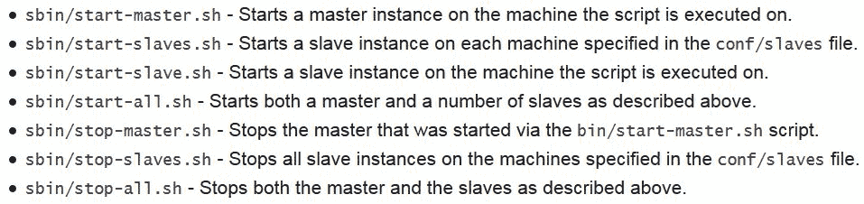

# 第十七章：进入集群世界的时刻——在集群上部署 Spark

“我看到月亮像一块剪裁过的银片。像金色的蜜蜂一样，星星围绕着她。”

- 奥斯卡·王尔德

在前面的章节中，我们已经看到如何使用不同的 Spark API 开发实用的应用程序。然而，在本章中，我们将看到 Spark 在集群模式下如何工作，并了解其底层架构。最后，我们将看到如何在集群上部署完整的 Spark 应用程序。简而言之，本章将涵盖以下主题：

+   集群中 Spark 的架构

+   Spark 生态系统与集群管理

+   在集群上部署 Spark

+   在独立集群上部署 Spark

+   在 Mesos 集群上部署 Spark

+   在 YARN 集群上部署 Spark

+   基于云的部署

+   在 AWS 上部署 Spark

# 集群中 Spark 的架构

基于 Hadoop 的**MapReduce**框架在过去几年中得到了广泛应用；然而，它在 I/O、算法复杂性、低延迟流处理作业和完全基于磁盘的操作方面存在一些问题。Hadoop 提供了**Hadoop 分布式文件系统**（**HDFS**）用于高效计算和廉价存储大数据，但你只能通过基于 Hadoop 的 MapReduce 框架以高延迟的批处理模型或静态数据进行计算。Spark 带给我们的主要大数据范式是引入了内存计算和缓存抽象。这使得 Spark 非常适合大规模数据处理，并使计算节点能够通过访问相同的输入数据来执行多个操作。

Spark 的**弹性分布式数据集**（**RDD**）模型可以完成 MapReduce 范式所能做的一切，甚至更多。然而，Spark 能够对你的数据集进行大规模的迭代计算。这个选项有助于加速执行机器学习、通用数据处理、图分析和**结构化查询语言**（**SQL**）算法，不管是否依赖 Hadoop。因此，复兴 Spark 生态系统此时变得至关重要。

了解了 Spark 的魅力和特点后，接下来，你需要了解 Spark 是如何工作的。

# Spark 生态系统简介

为了提供更多高级和附加的大数据处理能力，你的 Spark 作业可以运行在基于 Hadoop（即 YARN）或基于 Mesos 的集群之上。另一方面，Spark 中的核心 API 是用 Scala 编写的，允许你使用多种编程语言（如 Java、Scala、Python 和 R）开发 Spark 应用程序。Spark 提供了多个库，这些库是 Spark 生态系统的一部分，提供了额外的功能，适用于通用数据处理和分析、图处理、大规模结构化 SQL 以及**机器学习**（**ML**）领域。Spark 生态系统包括以下组件：

**图 1：** Spark 生态系统（直到 Spark 2.1.0）

Spark 的核心引擎是用 Scala 编写的，但支持不同的语言来开发你的 Spark 应用程序，如 R、Java、Python 和 Scala。Spark 核心引擎中的主要组件/API 如下：

1.  **SparkSQL**：帮助将 SQL 查询与 Spark 程序无缝结合，从而可以在 Spark 程序中查询结构化数据。

1.  **Spark Streaming**：用于大规模流应用程序开发，提供 Spark 与其他流数据源（如 Kafka、Flink 和 Twitter）的无缝集成。

1.  **SparkMLlib** 和 **SparKML**：这些是基于 RDD 和数据集/DataFrame 的机器学习和管道创建工具。

1.  **GraphX**：用于大规模图计算和处理，使你的图数据对象完全连接。

1.  **SparkR**：Spark 上的 R 帮助进行基本的统计计算和机器学习。

正如我们之前所述，完全可以无缝结合这些 API 来开发大规模机器学习和数据分析应用程序。此外，Spark 作业可以通过集群管理器（如 Hadoop YARN、Mesos 和独立模式）提交和执行，或者通过访问数据存储和源（如 HDFS、Cassandra、HBase、Amazon S3，甚至 RDBMS）在云中执行。然而，为了充分利用 Spark 的功能，我们需要将 Spark 应用程序部署到计算集群上。

# 集群设计

Apache Spark 是一个分布式并行处理系统，它还提供了内存计算能力。这种计算模式需要一个关联的存储系统，以便你能够在大数据集群上部署你的应用程序。为了实现这一点，你需要使用分布式存储系统，如 HDFS、S3、HBase 和 Hive。为了数据传输，你将需要其他技术，如 Sqoop、Kinesis、Twitter、Flume 和 Kafka。

实际上，你可以非常轻松地配置一个小型的 Hadoop 集群。你只需要一个主节点和多个工作节点。在你的 Hadoop 集群中，通常，主节点由**NameNode**、**DataNode**、**JobTracker**和**TaskTracker**组成。另一方面，工作节点可以配置成既作为 DataNode，又作为 TaskTracker。

出于安全原因，大多数大数据集群可能会设置在网络防火墙后面，以便通过计算节点克服或至少减少防火墙带来的复杂性。否则，计算节点将无法从外部网络访问，也就是外部网。下图展示了一个简化的大数据集群，通常用于 Spark：

**图 2：** JVM 上的大数据处理通用架构

上图显示了一个由五个计算节点组成的集群。这里每个节点都有一个专用的执行器 JVM，每个 CPU 核心一个，而 Spark Driver JVM 位于集群外部。磁盘直接连接到节点，采用 **JBOD**（**仅为一堆磁盘**）方式。非常大的文件会被分区存储到磁盘上，虚拟文件系统（如 HDFS）使这些分区数据以一个大的虚拟文件呈现。以下简化的组件模型显示了位于集群外部的 Driver JVM。它与集群管理器（参见 **图 4**）通信，以获得在工作节点上调度任务的权限，因为集群管理器会跟踪集群中所有进程的资源分配。

如果你使用 Scala 或 Java 开发了 Spark 应用程序，那么你的作业就是基于 JVM 的进程。对于这种 JVM 基于的进程，你可以通过指定以下两个参数来简单地配置 Java 堆内存：

+   **-Xmx**: **此参数**指定了 Java 堆内存的上限

+   **-Xms**: 这个参数是 Java 堆内存的下限

一旦你提交了 Spark 作业，堆内存需要为你的 Spark 作业分配。下图提供了一些分配方法的见解：

**图 3：**JVM 内存管理

如前图所示，Spark 启动 Spark 作业时，JVM 堆内存为 512 MB。然而，为了确保 Spark 作业的持续处理并避免出现**内存不足**（**OOM**）错误，Spark 允许计算节点仅使用堆的 90%（即约 461 MB），这个比例最终可以通过控制 Spark 环境中的 `spark.storage.safetyFraction` 参数来调整。更为现实地说，JVM 可以看作是由 **存储**（占 Java 堆的 60%）、执行（即 **Shuffle**）所需的 20% 堆内存，以及其余的 20% 用于其他存储构成的。

此外，Spark 是一款集群计算工具，旨在利用内存和基于磁盘的计算，并允许用户将部分数据存储在内存中。实际上，Spark 仅将主内存用于其 LRU 缓存。为了确保缓存机制的连续性，需要为应用程序特定的数据处理保留一小部分内存。非正式地说，这大约是由 `spark.memory.fraction` 控制的 Java 堆内存的 60%。

因此，如果你想查看或计算在 Spark 应用中可以缓存多少应用特定的数据，你可以简单地将所有执行器的堆内存使用量相加，然后乘以 `safetyFraction` 和 `spark.memory.fraction`。在实际应用中，你可以允许 Spark 计算节点使用总堆内存的 54%（即 276.48 MB）。现在，shuffle 内存的计算方法如下：

```py
Shuffle memory= Heap Size * spark.shuffle.safetyFraction * spark.shuffle.memoryFraction

```

`spark.shuffle.safetyFraction` 和 `spark.shuffle.memoryFraction` 的默认值分别是 80% 和 20%。因此，在实际操作中，你最多可以使用 JVM 堆内存的 *0.8*0.2 = 16%* 用于 shuffle 操作。最后，解压内存是指计算节点中可以被解压过程利用的主内存量。计算方式如下：

```py
Unroll memory = spark.storage.unrollFraction * spark.storage.memoryFraction * spark.storage.safetyFraction

```

上述约占堆内存的 11%（*0.2*0.6*0.9 = 10.8~11%*），即 Java 堆内存的 56.32 MB。

更详细的讨论可以在[`spark.apache.org/docs/latest/configuration.html.`](http://spark.apache.org/docs/latest/configuration.html)找到。

如我们稍后将看到的那样，存在各种不同的集群管理器，其中一些也能够管理其他 Hadoop 工作负载，甚至可以与 Spark 执行器并行管理非 Hadoop 应用程序。需要注意的是，执行器和驱动程序之间是双向通信的，因此从网络角度来看，它们也应该尽量靠近部署。

**图 4：** 集群中 Spark 的驱动程序、主节点和工作节点架构

Spark 使用驱动程序（即驱动程序程序）、主节点和工作节点架构（即主机、从节点或计算节点）。驱动程序（或机器）与单个协调器通信，该协调器称为主节点。主节点实际上管理所有的工作节点（即从节点或计算节点），多个执行器在集群中并行运行。需要注意的是，主节点本身也是一个计算节点，具有大内存、存储、操作系统和底层计算资源。从概念上讲，这种架构可以通过**图 4**来展示。更多细节将在本节后续讨论。

在真实的集群模式中，集群管理器（即资源管理器）管理集群中所有计算节点的资源。通常，防火墙在为集群提供安全性时，也会增加复杂性。系统组件之间的端口需要打开，以便它们能够互相通信。例如，Zookeeper 被许多组件用于配置。Apache Kafka 作为一种订阅消息系统，使用 Zookeeper 配置其主题、组、消费者和生产者。因此，需要打开客户端到 Zookeeper 的端口，可能还需要穿越防火墙。

最后，需要考虑将系统分配到集群节点。例如，如果 Apache Spark 使用 Flume 或 Kafka，那么将使用内存通道。Apache Spark 不应与其他 Apache 组件竞争内存使用。根据你的数据流和内存使用情况，可能需要将 Spark、Hadoop、Zookeeper、Flume 和其他工具部署在不同的集群节点上。或者，也可以使用 YARN、Mesos 或 Docker 等资源管理器来解决这个问题。在标准的 Hadoop 环境中，通常 YARN 本身就已经存在。

作为工作节点或 Spark 主节点的计算节点需要比防火墙内的集群处理节点更多的资源。当许多 Hadoop 生态系统组件被部署到集群时，它们都需要在主服务器上额外的内存。你应当监控工作节点的资源使用情况，并根据需要调整资源和/或应用程序的位置。例如，YARN 就会处理这些问题。

本节简要介绍了大数据集群中 Apache Spark、Hadoop 和其他工具的应用场景。然而，如何在大数据集群中配置 Apache Spark 集群本身呢？例如，可能存在多种类型的 Spark 集群管理器。下一节将详细讨论这一点，并描述每种类型的 Apache Spark 集群管理器。

# 集群管理

Spark 上下文可以通过 Spark 配置对象（即 `SparkConf`）和 Spark URL 来定义。首先，Spark 上下文的目的是连接 Spark 集群管理器，其中你的 Spark 作业将运行。集群或资源管理器随后将在计算节点之间分配所需的资源。集群管理器的第二个任务是将执行器分配到集群工作节点，以便执行 Spark 作业。第三，资源管理器还会将驱动程序（即应用程序 JAR 文件、R 代码或 Python 脚本）复制到计算节点上。最后，计算任务由资源管理器分配给计算节点。

以下小节描述了当前 Spark 版本（即本书撰写时的 Spark 2.1.0）中可用的 Apache Spark 集群管理器选项。要了解资源管理器（即集群管理器）如何管理资源，以下展示了 YARN 如何管理其所有底层计算资源。然而，无论你使用哪种集群管理器（例如 Mesos 或 YARN），这一点都是相同的：

**图 5：** 使用 YARN 进行资源管理

详细讨论请参考 [`spark.apache.org/docs/latest/cluster-overview.html#cluster-manager-types`](http://spark.apache.org/docs/latest/cluster-overview.html#cluster-manager-types)。

# 假集群模式（也叫 Spark 本地模式）

正如你已经知道的，Spark 作业可以在本地模式下运行。这有时被称为执行的假集群模式。这也是一种非分布式、基于单一 JVM 的部署模式，在这种模式下，Spark 会将所有执行组件（例如驱动程序、执行器、LocalSchedulerBackend 和主节点）放入你的单个 JVM 中。这是唯一一个驱动程序本身充当执行器的模式。下图展示了在本地模式下提交 Spark 作业的高级架构：

**图 6：** Spark 作业本地模式的高层架构（来源：[`jaceklaskowski.gitbooks.io/mastering-apache-spark/content/spark-local.html`](https://jaceklaskowski.gitbooks.io/mastering-apache-spark/content/spark-local.html)）

这会让你感到惊讶吗？不，我想不会，因为你也可以实现某种程度的并行性，默认的并行度是主节点 URL 中指定的线程数（即使用的核心数），例如，对于 4 个核心/线程为 local [4]，而 `local [*]` 表示所有可用线程。我们将在本章后续部分讨论这一话题。

# 独立模式

通过指定 Spark 配置的本地 URL，可以使应用在本地运行。通过指定 *local[n]*，可以让 Spark 使用 *n* 个线程在本地运行应用。这是一个有用的开发和测试选项，因为你可以测试某种并行化场景，但仍然将所有日志文件保留在单一机器上。独立模式使用一个由 Apache Spark 提供的基本集群管理器。Spark 主节点的 URL 将如下所示：

```py
spark://<hostname>:7077

```

这里，`<hostname>` 是运行 Spark 主节点的主机名称。我指定了 7077 作为端口，这是默认值，但它是可以配置的。这个简单的集群管理器目前只支持 **FIFO**（**先进先出**）调度。你可以通过为每个应用设置资源配置选项来实现并发应用调度。例如，`spark.core.max` 用于在应用之间共享处理器核心。本章后续会有更详细的讨论。

# Apache YARN

如果 Spark 主节点值设置为 YARN-cluster，则应用程序可以提交到集群并最终终止。集群将负责分配资源和执行任务。然而，如果应用程序主节点设置为 YARN-client，则应用程序将在整个生命周期内保持运行，并向 YARN 请求资源。这些适用于更大规模的集成场景，特别是在与 Hadoop YARN 集成时。之后的章节会提供逐步的指导，帮助你配置一个单节点的 YARN 集群来启动需要最小资源的 Spark 作业。

# Apache Mesos

Apache Mesos 是一个用于跨集群资源共享的开源系统。它通过管理和调度资源，允许多个框架共享一个集群。它是一个集群管理器，使用 Linux 容器提供隔离，允许多个系统如 Hadoop、Spark、Kafka、Storm 等安全地共享集群。这是一个基于主从架构的系统，使用 Zookeeper 进行配置管理。通过这种方式，你可以将 Spark 作业扩展到成千上万个节点。对于单主节点 Mesos 集群，Spark 主节点的 URL 将如下所示：

```py
mesos://<hostname>:5050

```

使用 Mesos 提交 Spark 作业的结果可以通过以下图示来展示：

**图 7：** Mesos 实时操作（图片来源：[`jaceklaskowski.gitbooks.io/mastering-apache-spark/content/spark-architecture.html`](https://jaceklaskowski.gitbooks.io/mastering-apache-spark/content/spark-architecture.html)）

在上图中，`<hostname>` 是 Mesos 主服务器的主机名，端口定义为 5050，这是默认的 Mesos 主端口（可以配置）。如果在大规模高可用的 Mesos 集群中有多个 Mesos 主服务器，那么 Spark 主 URL 会如下所示：

```py
mesos://zk://<hostname>:2181

```

所以，Mesos 主服务器的选举将由 Zookeeper 控制。`<hostname>` 将是 Zookeeper 仲裁节点中的主机名。此外，端口号 2181 是 Zookeeper 的默认主端口。

# 基于云的部署

云计算范式中有三种不同的抽象层次：

+   **基础设施即服务**（即 **IaaS**）

+   **平台即服务**（即 **PaaS**）

+   **软件即服务**（即 **SaaS**）

IaaS 通过为空你的 SaaS 运行的程序提供空虚拟机来提供计算基础设施。这对于在 OpenStack 上运行的 Apache Spark 也是一样的。

OpenStack 的优势在于它可以在多个不同的云服务提供商之间使用，因为它是一个开放标准，并且也是基于开源的。你甚至可以在本地数据中心使用 OpenStack，并在本地、专用和公共云数据中心之间透明动态地移动工作负载。

相比之下，PaaS 为你消除了安装和操作 Apache Spark 集群的负担，因为它作为服务提供。换句话说，你可以将其看作是一个类似操作系统的层级。

有时，你甚至可以将你的 Spark 应用程序 Docker 化，并以独立的方式部署到云平台上。然而，关于 Docker 是 IaaS 还是 PaaS 仍然存在争论，但在我们看来，这只是一种轻量级预安装虚拟机的形式，因此更倾向于 IaaS。

最后，SaaS 是云计算范式下由应用层提供和管理的服务。坦率来说，你不会看到或需要担心前两层（IaaS 和 PaaS）。

Google Cloud、Amazon AWS、Digital Ocean 和 Microsoft Azure 是提供这三层服务的云计算服务的典型例子。在本章后面，我们将展示如何使用 Amazon AWS 在云上部署 Spark 集群的示例。

# 在集群上部署 Spark 应用程序

在本节中，我们将讨论如何在计算集群上部署 Spark 作业。我们将看到如何在三种部署模式下部署集群：独立模式、YARN 和 Mesos。下图总结了本章中需要参考的集群概念术语：

**图 8：** 需要参考集群概念的术语（来源：http://spark.apache.org/docs/latest/cluster-overview.html#glossary）

然而，在深入了解之前，我们需要知道如何一般地提交一个 Spark 作业。

# 提交 Spark 作业

一旦 Spark 应用程序被打包成 JAR 文件（使用 Scala 或 Java 编写）或 Python 文件，它可以通过位于 Spark 分发版 `bin` 目录下的 Spark-submit 脚本提交（即 `$SPARK_HOME/bin`）。根据 Spark 网站提供的 API 文档（[`spark.apache.org/docs/latest/submitting-applications.html`](http://spark.apache.org/docs/latest/submitting-applications.html)），该脚本负责处理以下任务：

+   配置 `JAVA_HOME`、`SCALA_HOME` 与 Spark 的类路径

+   设置执行作业所需的所有依赖项

+   管理不同的集群管理器

+   最后，部署 Spark 支持的模型

简而言之，Spark 作业提交的语法如下：

```py
$ spark-submit [options] <app-jar | python-file> [app arguments]

```

在这里，`[options]` 可以是：`--conf <configuration_parameters> --class <main-class> --master <master-url> --deploy-mode <deploy-mode> ... # other options`

+   `<main-class>` 是主类的名称。实际上，这是我们 Spark 应用程序的入口点。

+   `--conf` 表示所有使用的 Spark 参数和配置属性。配置属性的格式为 key=value。

+   `<master-url>` 指定集群的主 URL（例如，`spark://HOST_NAME:PORT`）用于连接 Spark 独立集群的主节点，`local` 用于在本地运行 Spark 作业。默认情况下，它只允许使用一个工作线程且没有并行性。`local [k]` 可以用于在本地运行 Spark 作业，并使用 *K* 个工作线程。需要注意的是，K 是你机器上的核心数。最后，如果你指定 `local[*]` 作为主节点来本地运行 Spark 作业，那么你就是在允许 `spark-submit` 脚本使用你机器上的所有工作线程（逻辑核心）。最后，你可以将主节点指定为 `mesos://IP_ADDRESS:PORT` 来连接可用的 Mesos 集群。或者，你也可以使用 `yarn` 来运行 Spark 作业在基于 YARN 的集群上。

有关主 URL 的其他选项，请参考下图：

**图 9：** Spark 支持的主 URL 详细信息\

+   `<deploy-mode>` 你必须指定这个选项，如果你想将驱动程序部署在工作节点（集群）上，或者作为外部客户端（客户端）本地运行。支持四种模式：local、standalone、YARN 和 Mesos。

+   `<app-jar>` 是你构建的 JAR 文件，其中包含依赖项。提交作业时只需传递该 JAR 文件。

+   `<python-file>` 是使用 Python 编写的应用程序主源代码。提交任务时只需传递 `.py` 文件即可。

+   `[app-arguments]` 可能是应用程序开发人员指定的输入或输出参数。

在使用`spark-submit`脚本提交 Spark 作业时，您可以使用`--jars`选项指定 Spark 应用程序的主 jar（以及包含的其他相关 JAR 文件）。然后，所有 JAR 文件将被传输到集群中。在`--jars`后面提供的 URLs 必须用逗号分隔。

然而，如果您使用 URL 指定 jar 文件，最好在`--jars`后面用逗号分隔 JAR 文件。Spark 使用以下 URL 方案，允许为分发 JAR 文件采用不同策略：

+   **file:** 指定绝对路径和`file:/`

+   **hdfs****:**, **http****:**, **https:**, **ftp****:** JAR 文件或任何其他文件将从您指定的 URL/URI 按预期下载

+   **local:** 以`local:/`开头的 URI 可用于指向每个计算节点上的本地 jar 文件。

需要注意的是，依赖的 JAR 文件、R 代码、Python 脚本或任何其他相关的数据文件需要被复制或复制到每个计算节点的 SparkContext 工作目录中。这有时会产生较大的开销，并且需要相当大的磁盘空间。随着时间的推移，磁盘使用量会增加。因此，在某个时间点，未使用的数据对象或相关代码文件需要清理。然而，这在 YARN 上是相当容易的。YARN 会定期处理清理工作，并可以自动处理。例如，在 Spark 独立模式下，自动清理可以通过提交 Spark 作业时配置` spark.worker.cleanup.appDataTtl`属性来实现。

在计算方面，Spark 的设计是，在作业提交（使用`spark-submit`脚本）过程中，默认的 Spark 配置值可以从属性文件中加载并传递到 Spark 应用程序中。主节点将从名为`spark-default.conf`的配置文件中读取指定的选项。该文件的确切路径是`SPARK_HOME/conf/spark-defaults.conf`，位于您的 Spark 分发目录中。然而，如果您在命令行中指定所有参数，这将具有更高的优先级，并将相应地使用。

# 本地和独立模式下运行 Spark 作业

示例见第十三章，*我的名字是贝叶斯，朴素贝叶斯*，并且可以扩展到更大的数据集以解决不同的任务。您可以将这三种聚类算法及所有必需的依赖项打包，并作为 Spark 作业提交到集群中。如果您不知道如何制作包并从 Scala 类创建 jar 文件，您可以使用 SBT 或 Maven 将所有依赖项与您的应用程序捆绑在一起。

根据 Spark 文档在[`spark.apache.org/docs/latest/submitting-applications.html#advanced-dependency-management`](http://spark.apache.org/docs/latest/submitting-applications.html#advanced-dependency-management)中的描述，SBT 和 Maven 都有汇编插件，用于将您的 Spark 应用程序打包为一个 fat jar。如果您的应用程序已经捆绑了所有依赖项，则可以使用以下代码行来提交您的 k-means 聚类 Spark 作业，例如（对其他类使用类似的语法），适用于 Saratoga NY Homes 数据集。要在本地提交和运行 Spark 作业，请在 8 个核心上运行以下命令：

```py
$ SPARK_HOME/bin/spark-submit 
 --class com.chapter15.Clustering.KMeansDemo 
 --master local[8] 
 KMeans-0.0.1-SNAPSHOT-jar-with-dependencies.jar 
 Saratoga_NY_Homes.txt

```

在上述代码中，`com.chapter15.KMeansDemo`是用 Scala 编写的主类文件。Local [8]是利用您计算机的八个核心的主 URL。`KMeansDemo-0.1-SNAPSHOT-jar-with-dependencies.jar`是我们刚刚由 Maven 项目生成的应用程序 JAR 文件；`Saratoga_NY_Homes.txt`是 Saratoga NY Homes 数据集的输入文本文件。如果应用程序成功执行，您将在以下图中找到包含输出的消息（缩写）：

**图 10：** Spark 作业在终端上的输出[本地模式]

现在，让我们深入独立模式中的集群设置。要安装 Spark 独立模式，您应该在集群的每个节点上放置预构建版本的 Spark。或者，您可以自行构建并按照[`spark.apache.org/docs/latest/building-spark.html`](http://spark.apache.org/docs/latest/building-spark.html)中的说明使用它。

要将环境配置为 Spark 独立模式，您将需要为集群中的每个节点提供所需版本的预构建 Spark。或者，您可以自行构建并按照[`spark.apache.org/docs/latest/building-spark.html`](http://spark.apache.org/docs/latest/building-spark.html)中的说明使用它。现在我们将看到如何手动启动一个独立集群。您可以通过执行以下命令启动一个独立主节点：

```py
$ SPARK_HOME/sbin/start-master.sh

```

一旦启动，您应该在终端上观察以下日志：

```py
Starting org.apache.spark.deploy.master.Master, logging to <SPARK_HOME>/logs/spark-asif-org.apache.spark.deploy.master.Master-1-ubuntu.out

```

默认情况下，您应该能够访问 Spark Web UI，网址为`http://localhost:8080`。请按照以下图中所示的 UI 观察以下 UI：

**图 11：** Spark 主节点作为独立运行

您可以通过编辑以下参数更改端口号：

```py
SPARK_MASTER_WEBUI_PORT=8080

```

在`SPARK_HOME/sbin/start-master.sh`中，只需更改端口号，然后应用以下命令：

```py
$ sudo chmod +x SPARK_HOME/sbin/start-master.sh.

```

或者，您可以重新启动 Spark 主节点以应用前述更改。但是，您将需要在`SPARK_HOME/sbin/start-slave.sh`中进行类似的更改。

正如您在这里看到的那样，没有活动的工作节点与主节点关联。现在，要创建一个从节点（也称为工作节点或计算节点），请创建工作节点并使用以下命令将它们连接到主节点：

```py
$ SPARK_HOME/sbin/start-slave.sh <master-spark-URL>

```

在成功执行前述命令后，你应该能在终端上看到以下日志：

```py
Starting org.apache.spark.deploy.worker.Worker, logging to <SPARK_HOME>//logs/spark-asif-org.apache.spark.deploy.worker.Worker-1-ubuntu.out 

```

一旦启动了其中一个工作节点，你可以在 Spark Web UI 上查看其状态，网址是`http://localhost:8081`。不过，如果你启动了另一个工作节点，你可以通过连续的端口（即 8082、8083 等）访问其状态。你也应该看到新的节点列在那里，并显示它的 CPU 数量和内存，如下图所示：

**图 12：** Spark 工作节点作为独立模式

现在，如果你刷新`http://localhost:8080`，你应该能看到与你的主节点关联的一个工作节点已被添加，如下图所示：

**图 13：** Spark 主节点现在有一个工作节点作为独立模式

最后，如下图所示，这些是所有可以传递给主节点和工作节点的配置选项：

**图 14：** 可传递给主节点和工作节点的配置选项（来源：[`spark.apache.org/docs/latest/spark-standalone.html#starting-a-cluster-manually`](http://spark.apache.org/docs/latest/spark-standalone.html#starting-a-cluster-manually)）

现在，主节点和一个工作节点都在运行并处于活跃状态。最后，你可以使用以下命令以独立模式而非本地模式提交相同的 Spark 作业：

```py
$ SPARK_HOME/bin/spark-submit  
--class "com.chapter15.Clustering.KMeansDemo"  
--master spark://ubuntu:7077   
KMeans-0.0.1-SNAPSHOT-jar-with-dependencies.jar  
Saratoga_NY_Homes.txt

```

一旦作业启动，访问 Spark Web UI，主节点的网址是`http://localhost:80810`，工作节点的网址是`http://localhost:8081`，你可以查看你的作业进度，如第十四章所讨论的，*为数据分类 - 使用 Spark MLlib 对数据进行集群化*。

总结本节内容时，我们希望引导你查看以下图片（即 **图 15**），它显示了启动或停止集群时使用的 Shell 脚本：

**图 15：** 启动或停止集群的 Shell 脚本的使用方法\

# Hadoop YARN

如前所述，Apache Hadoop YARN 有两个主要组件：调度器和应用程序管理器，如下图所示：

**图 16：** Apache Hadoop YARN 架构（蓝色：系统组件；黄色和粉色：两个正在运行的应用程序）

现在，使用调度程序和应用程序管理器，可以配置以下两种部署模式，在基于 YARN 的集群上启动 Spark 作业：

+   **集群模式**：在集群模式下，Spark 驱动程序在由 YARN 的应用程序管理器管理的应用程序的主进程内运行。即使客户端在应用程序启动后被终止或断开连接，也不会影响应用程序的运行。

+   **客户端模式**：在这种模式下，Spark 驱动程序运行在客户端进程内。之后，Spark 主节点仅用于从 YARN（YARN 资源管理器）请求计算节点的计算资源。

在 Spark 独立模式和 Mesos 模式中，必须在`--master`参数中指定主节点的 URL（即地址）。然而，在 YARN 模式下，资源管理器的地址是从 Hadoop 配置文件中读取的。因此，`--master`参数为`yarn`。在提交 Spark 作业之前，您需要设置 YARN 集群。接下来的小节将详细介绍如何一步一步完成此操作。

# 配置单节点 YARN 集群

在本小节中，我们将介绍如何在 YARN 集群上运行 Spark 作业之前设置 YARN 集群。有几个步骤，请保持耐心，并按步骤操作：

# 第 1 步：下载 Apache Hadoop

从 Hadoop 官网（[`hadoop.apache.org/`](http://hadoop.apache.org/)）下载最新的发行版。我使用的是最新的稳定版本 2.7.3，在 Ubuntu 14.04 上如以下所示：

```py
$  cd /home
$  wget http://mirrors.ibiblio.org/apache/hadoop/common/hadoop-2.7.3/hadoop-2.7.3.tar.gz

```

接下来，在`/opt/yarn`中创建并解压包，如下所示：

```py
$  mkdir –p /opt/yarn
$  cd /opt/yarn
$  tar xvzf /root/hadoop-2.7.3.tar.gz

```

# 第 2 步：设置 JAVA_HOME

详细信息请参考第一章《Scala 简介》中的 Java 设置部分，并应用相同的更改。

# 第 3 步：创建用户和组

以下是可以为`hadoop`组创建的`yarn`、`hdfs`和`mapred`用户账户：

```py
$  groupadd hadoop
$  useradd -g hadoop yarn
$  useradd -g hadoop hdfs
$  useradd -g hadoop mapred

```

# 第 4 步：创建数据和日志目录

要在 Hadoop 上运行 Spark 作业，必须为数据和日志目录设置不同的权限。您可以使用以下命令：

```py
$  mkdir -p /var/data/hadoop/hdfs/nn
$  mkdir -p /var/data/hadoop/hdfs/snn
$  mkdir -p /var/data/hadoop/hdfs/dn
$  chown hdfs:hadoop /var/data/hadoop/hdfs –R
$  mkdir -p /var/log/hadoop/yarn
$  chown yarn:hadoop /var/log/hadoop/yarn -R

```

现在，您需要创建 YARN 安装的日志目录，并设置所有者和组如下所示：

```py
$  cd /opt/yarn/hadoop-2.7.3
$  mkdir logs
$  chmod g+w logs
$  chown yarn:hadoop . -R

```

# 第 5 步：配置 core-site.xml

需要将以下两个属性（即`fs.default.name`和`hadoop.http.staticuser.user`）设置到`etc/hadoop/core-site.xml`文件中。只需复制以下代码行：

```py
<configuration>
       <property>
               <name>fs.default.name</name>
               <value>hdfs://localhost:9000</value>
       </property>
       <property>
               <name>hadoop.http.staticuser.user</name>
               <value>hdfs</value>
       </property>
</configuration>

```

# 第 6 步：配置 hdfs-site.xml

需要将以下五个属性（即`dfs.replication`，`dfs.namenode.name.dir`，`fs.checkpoint.dir`，`fs.checkpoint.edits.dir`和`dfs.datanode.data.dir`）设置到`etc/hadoop/hdfs-site.xml`文件中。只需复制以下代码行：

```py
<configuration>
 <property>
   <name>dfs.replication</name>
   <value>1</value>
 </property>
 <property>
   <name>dfs.namenode.name.dir</name>
   <value>file:/var/data/hadoop/hdfs/nn</value>
 </property>
 <property>
   <name>fs.checkpoint.dir</name>
   <value>file:/var/data/hadoop/hdfs/snn</value>
 </property>
 <property>
   <name>fs.checkpoint.edits.dir</name>
   <value>file:/var/data/hadoop/hdfs/snn</value>
 </property>
 <property>
   <name>dfs.datanode.data.dir</name>
   <value>file:/var/data/hadoop/hdfs/dn</value>
 </property>
</configuration>

```

# 第 7 步：配置 mapred-site.xml

需要将以下一个属性（即`mapreduce.framework.name`）设置到`etc/hadoop/mapred-site.xml`文件中。首先，复制并替换原始模板文件为以下内容：

```py
$  cp mapred-site.xml.template mapred-site.xml

```

现在，只需复制以下代码行：

```py
<configuration>
<property>
   <name>mapreduce.framework.name</name>
   <value>yarn</value>
 </property>
</configuration>

```

# 第 8 步：配置 yarn-site.xml

需要将以下两个属性（即`yarn.nodemanager.aux-services`和`yarn.nodemanager.aux-services.mapreduce.shuffle.class`）设置到`etc/hadoop/yarn-site.xml`文件中。只需复制以下代码行：

```py
<configuration>
<property>
   <name>yarn.nodemanager.aux-services</name>
   <value>mapreduce_shuffle</value>
 </property>
 <property>
   <name>yarn.nodemanager.aux-services.mapreduce.shuffle.class</name>
   <value>org.apache.hadoop.mapred.ShuffleHandler</value>
 </property>
</configuration>

```

# 第 9 步：设置 Java 堆空间

要在基于 Hadoop 的 YARN 集群上运行 Spark 作业，您需要为 JVM 指定足够的堆空间。您需要编辑`etc/hadoop/hadoop-env.sh`文件，启用以下属性：

```py
HADOOP_HEAPSIZE="500"
HADOOP_NAMENODE_INIT_HEAPSIZE="500"

```

现在，您还需要编辑`mapred-env.sh`文件并添加以下行：

```py
HADOOP_JOB_HISTORYSERVER_HEAPSIZE=250

```

最后，确保你已编辑过 `yarn-env.sh`，以使 Hadoop YARN 的更改永久生效：

```py
JAVA_HEAP_MAX=-Xmx500m
YARN_HEAPSIZE=500

```

# 步骤 10：格式化 HDFS

如果你想启动 HDFS 的 NameNode，Hadoop 需要初始化一个目录来存储或持久化它的所有元数据，用于跟踪文件系统的所有元数据。格式化操作会销毁所有内容并设置一个新的文件系统。然后它会使用在 `etc/hadoop/hdfs-site.xml` 中设置的 `dfs.namenode.name.dir` 参数的值。要进行格式化，首先进入 `bin` 目录并执行以下命令：

```py
$  su - hdfs
$ cd /opt/yarn/hadoop-2.7.3/bin
$ ./hdfs namenode -format

```

如果前面的命令执行成功，你应该在 Ubuntu 终端看到以下内容：

```py
INFO common.Storage: Storage directory /var/data/hadoop/hdfs/nn has been successfully formatted

```

# 步骤 11：启动 HDFS

从步骤 10 的 `bin` 目录，执行以下命令：

```py
$ cd ../sbin
$ ./hadoop-daemon.sh start namenode

```

在成功执行前面的命令后，你应该在终端看到以下内容：

```py
starting namenode, logging to /opt/yarn/hadoop-2.7.3/logs/hadoop-hdfs-namenode-limulus.out

```

要启动 `secondarynamenode` 和 `datanode`，你应该使用以下命令：

```py
$ ./hadoop-daemon.sh start secondarynamenode

```

如果前面的命令成功执行，你应该在终端看到以下消息：

```py
Starting secondarynamenode, logging to /opt/yarn/hadoop-2.7.3/logs/hadoop-hdfs-secondarynamenode-limulus.out

```

然后使用以下命令启动数据节点：

```py
$ ./hadoop-daemon.sh start datanode

```

如果前面的命令成功执行，你应该在终端看到以下消息：

```py
starting datanode, logging to /opt/yarn/hadoop-2.7.3/logs/hadoop-hdfs-datanode-limulus.out

```

现在确保检查所有与这些节点相关的服务是否正在运行，使用以下命令：

```py
$ jps

```

你应该看到类似以下内容：

```py
35180 SecondaryNameNode
45915 NameNode
656335 Jps
75814 DataNode

```

# 步骤 12：启动 YARN

在使用 YARN 时，必须作为用户 yarn 启动一个 `resourcemanager` 和一个节点管理器：

```py
$  su - yarn
$ cd /opt/yarn/hadoop-2.7.3/sbin
$ ./yarn-daemon.sh start resourcemanager

```

如果前面的命令成功执行，你应该在终端看到以下消息：

```py
starting resourcemanager, logging to /opt/yarn/hadoop-2.7.3/logs/yarn-yarn-resourcemanager-limulus.out

```

然后执行以下命令启动节点管理器：

```py
$ ./yarn-daemon.sh start nodemanager

```

如果前面的命令成功执行，你应该在终端看到以下消息：

```py
starting nodemanager, logging to /opt/yarn/hadoop-2.7.3/logs/yarn-yarn-nodemanager-limulus.out

```

如果你想确保这些节点上的所有服务都在运行，你应该使用 `$jsp` 命令。此外，如果你想停止资源管理器或 `nodemanager`，可以使用以下 `g` 命令：

```py
$ ./yarn-daemon.sh stop nodemanager
$ ./yarn-daemon.sh stop resourcemanager

```

# 步骤 13：在 Web UI 上验证

访问 `http://localhost:50070` 查看 NameNode 的状态，访问 `http://localhost:8088` 查看资源管理器的状态。

前面的步骤展示了如何配置一个基于 Hadoop 的 YARN 集群，且只有少数几个节点。然而，如果你想配置一个从少数节点到包含成千上万节点的大型集群的 Hadoop YARN 集群，请参考 [`hadoop.apache.org/docs/current/hadoop-project-dist/hadoop-common/ClusterSetup.html`](https://hadoop.apache.org/docs/current/hadoop-project-dist/hadoop-common/ClusterSetup.html)。

# 在 YARN 集群上提交 Spark 作业

现在，我们的 YARN 集群已经准备好（至少满足执行小型 Spark 作业的最低要求），要在 YARN 集群模式下启动 Spark 应用程序，你可以使用以下提交命令：

```py
$ SPARK_HOME/bin/spark-submit --classpath.to.your.Class --master yarn --deploy-mode cluster [options] <app jar> [app options]

```

要运行我们的 `KMeansDemo`，应该这样做：

```py
$ SPARK_HOME/bin/spark-submit  
    --class "com.chapter15.Clustering.KMeansDemo"  
    --master yarn  
    --deploy-mode cluster  
    --driver-memory 16g  
    --executor-memory 4g  
    --executor-cores 4  
    --queue the_queue  
    KMeans-0.0.1-SNAPSHOT-jar-with-dependencies.jar  
    Saratoga_NY_Homes.txt

```

前述的`submit`命令以默认应用程序主节点启动 YARN 集群模式。然后，`KMeansDemo`将作为应用程序主节点的子线程运行。客户端将定期轮询应用程序主节点以获取状态更新并在控制台中显示它们。当您的应用程序（即我们的情况下的`KMeansDemo`）执行完毕时，客户端将退出。

提交作业后，您可能希望使用 Spark Web UI 或 Spark 历史服务器查看进度。此外，您应参考第十八章，了解如何分析驱动程序和执行器日志。

要以客户端模式启动 Spark 应用程序，您应使用先前的命令，只需将集群替换为客户端即可。对于那些希望使用 Spark Shell 的人，请在客户端模式下使用以下命令：

```py
$ SPARK_HOME/bin/spark-shell --master yarn --deploy-mode client

```

# 在 YARN 集群中提前提交作业

如果您选择更高级的方式将 Spark 作业提交到您的 YARN 集群中进行计算，您可以指定额外的参数。例如，如果您想启用动态资源分配，请将`spark.dynamicAllocation.enabled`参数设置为 true。但是，为了这样做，您还需要指定`minExecutors`、`maxExecutors`和`initialExecutors`，如以下所述。另一方面，如果您想启用分片服务，请将`spark.shuffle.service.enabled`设置为`true`。最后，您还可以尝试使用`spark.executor.instances`参数指定将运行多少个执行器实例。

现在，为了使前述讨论更具体化，您可以参考以下提交命令：

```py
$ SPARK_HOME/bin/spark-submit   
    --class "com.chapter13.Clustering.KMeansDemo"  
    --master yarn  
    --deploy-mode cluster  
    --driver-memory 16g  
    --executor-memory 4g  
    --executor-cores 4  
    --queue the_queue  
    --conf spark.dynamicAllocation.enabled=true  
    --conf spark.shuffle.service.enabled=true  
    --conf spark.dynamicAllocation.minExecutors=1  
    --conf spark.dynamicAllocation.maxExecutors=4  
    --conf spark.dynamicAllocation.initialExecutors=4  
    --conf spark.executor.instances=4  
    KMeans-0.0.1-SNAPSHOT-jar-with-dependencies.jar  
    Saratoga_NY_Homes.txt

```

然而，前述作业提交脚本的后果是复杂的，有时是不确定的。根据我的经验，如果您从代码中增加分区数和执行器数，则应用程序将更快地完成，这是可以接受的。但是，如果您仅增加执行器核心数，则完成时间相同。但是，您可能期望时间低于初始时间。其次，如果您两次启动前述代码，则可以预期两个作业都会在 60 秒内完成，但这也可能不会发生。通常情况下，两个作业可能在 120 秒后才完成。这有点奇怪，不是吗？但是，以下是能够帮助您理解此场景的解释。

假设您的机器上有 16 个核心和 8 GB 内存。现在，如果您使用四个每个核心一个的执行器，会发生什么？嗯，当您使用执行器时，Spark 会从 YARN 中保留它，并且 YARN 会分配所需的核心数（例如，在我们的情况下为一个）和所需的内存。实际上，内存需要比您要求的更多，以实现更快的处理。如果您请求 1 GB，实际上将分配几乎 1.5 GB，其中包括 500 MB 的开销。此外，它可能会为驱动程序分配一个执行器，其内存使用量可能为 1024 MB（即 1 GB）。

有时，Spark 作业需要多少内存并不重要，重要的是它保留了多少内存。在前面的例子中，它不会占用 50MB 的测试内存，而是每个执行器大约占用 1.5 GB（包括开销）。我们将在本章稍后讨论如何在 AWS 上配置 Spark 集群。

# Apache Mesos

当使用 Mesos 时，Mesos 主节点通常会取代 Spark 主节点，成为集群管理器（即资源管理器）。现在，当驱动程序创建 Spark 作业并开始分配相关任务进行调度时，Mesos 会决定哪些计算节点处理哪些任务。我们假设你已经在你的机器上配置并安装了 Mesos。

要开始使用，可以参考以下链接来安装 Mesos：[`blog.madhukaraphatak.com/mesos-single-node-setup-ubuntu/`](http://blog.madhukaraphatak.com/mesos-single-node-setup-ubuntu/)，[`mesos.apache.org/gettingstarted/`](https://mesos.apache.org/gettingstarted/)。

根据硬件配置的不同，可能需要一段时间。在我的机器上（Ubuntu 14.04 64 位，配备 Core i7 和 32 GB RAM），构建完成花费了 1 小时。

为了通过 Mesos 集群模式提交和计算 Spark 作业，请确保 Spark 二进制包存放在 Mesos 可以访问的地方。此外，确保你的 Spark 驱动程序可以配置为自动连接到 Mesos。第二种方式是在与 Mesos 从节点相同的位置安装 Spark。然后，你需要配置`spark.mesos.executor.home`参数，指向 Spark 分发包的位置。需要注意的是，默认位置是`SPARK_HOME`。

当 Mesos 第一次在 Mesos 工作节点（即计算节点）上执行 Spark 作业时，Spark 二进制包必须在该工作节点上可用。这将确保 Spark Mesos 执行器在后台运行。

Spark 二进制包可以托管到 Hadoop 上，以便使其可访问：

1\. 通过`http://`获取 URI/URL（包括 HTTP），

2\. 通过`s3n://`使用 Amazon S3，

3\. 通过`hdfs://`使用 HDFS。

如果你设置了`HADOOP_CONF_DIR`环境变量，参数通常设置为`hdfs://...`；否则，设置为`file://`。

你可以按以下方式指定 Mesos 的主节点 URL：

1.  对于单主 Mesos 集群，使用`mesos://host:5050`，对于由 ZooKeeper 控制的多主 Mesos 集群，使用`mesos://zk://host1:2181,host2:2181,host3:2181/mesos`。

如需更详细的讨论，请参考[`spark.apache.org/docs/latest/running-on-mesos.html`](http://spark.apache.org/docs/latest/running-on-mesos.html)。

# 客户端模式

在此模式下，Mesos 框架的工作方式是，Spark 作业直接在客户端机器上启动。然后，它会等待计算结果，也就是驱动程序输出。然而，为了与 Mesos 正确交互，驱动程序期望在`SPARK_HOME/conf/spark-env.sh`中指定一些特定于应用程序的配置。为此，请修改`$SPARK_HOME/conf`中的`spark-env.sh.template`文件，并在使用此客户端模式之前，在`spark-env.sh`中设置以下环境变量：

```py
$ export MESOS_NATIVE_JAVA_LIBRARY=<path to libmesos.so>

```

在 Ubuntu 上，这个路径通常是`/usr/local/lib/libmesos.so`。另一方面，在 macOS X 上，相同的库被称为`libmesos.dylib`，而不是`libmesos.so`：

```py
$ export SPARK_EXECUTOR_URI=<URL of spark-2.1.0.tar.gz uploaded above>

```

现在，在提交并启动 Spark 应用程序以在集群上执行时，必须将 Mesos 的`://HOST:PORT`作为主 URL 传入。通常在创建`SparkContext`时完成这一操作，如下所示：

```py
val conf = new SparkConf()              
                   .setMaster("mesos://HOST:5050")  
                   .setAppName("My app")             
                  .set("spark.executor.uri", "<path to spark-2.1.0.tar.gz uploaded above>")
val sc = new SparkContext(conf)

```

实现这一目标的第二种方式是使用`spak-submit`脚本，并在`SPARK_HOME/conf/spark-defaults.conf`文件中配置`spark.executor.uri`。在运行 shell 时，`spark.executor.uri`参数会从`SPARK_EXECUTOR_URI`继承，因此不需要作为系统属性重复传入。只需使用以下命令从 Spark shell 中访问客户端模式：

```py
$ SPARK_HOME/bin/spark-shell --master mesos://host:5050

```

# 集群模式

Spark 在 Mesos 上也支持集群模式。如果驱动程序已经启动了 Spark 作业（在集群上），并且计算已完成，客户端可以通过 Mesos Web UI 访问结果（来自驱动程序）。如果你通过`SPARK_HOME/sbin/start-mesos-dispatcher.sh`脚本在集群中启动了`MesosClusterDispatcher`，那么你可以使用集群模式。

同样，条件是，在创建`SparkContext`时必须传入 Mesos 的主 URL（例如，`mesos://host:5050`）。以集群模式启动 Mesos 时，还会在主机机器上启动`MesosClusterDispatcher`作为守护进程。

若要实现更灵活和高级的 Spark 作业执行，还可以使用**Marathon**。使用 Marathon 的优势在于，你可以通过 Marathon 运行`MesosClusterDispatcher`。如果这样做，请确保`MesosClusterDispatcher`在前台运行。

**Marathon** 是一个 Mesos 框架，旨在启动长时间运行的应用程序，在 Mesosphere 中，它替代了传统的初始化系统。它具有许多功能，可以简化在集群环境中运行应用程序的过程，如高可用性、节点约束、应用健康检查、脚本化和服务发现的 API，以及一个易于使用的 Web 用户界面。它为 Mesosphere 的功能集添加了扩展和自我修复能力。Marathon 可以用来启动其他 Mesos 框架，它还可以启动任何可以在常规 shell 中启动的进程。由于它是为长时间运行的应用程序设计的，因此它将确保它启动的应用程序继续运行，即使它们所在的从节点发生故障。有关在 Mesosphere 中使用 Marathon 的更多信息，请参阅 GitHub 页面 [`github.com/mesosphere/marathon`](https://github.com/mesosphere/marathon)。

更具体地说，从客户端，你可以通过使用 `spark-submit` 脚本并指定 `MesosClusterDispatcher` 的 URL（例如 `mesos://dispatcher:7077`）来提交 Spark 作业到你的 Mesos 集群。过程如下：

```py
$ SPARK_HOME /bin/spark-class org.apache.spark.deploy.mesos.MesosClusterDispatcher

```

你可以在 Spark 集群的 Web 用户界面上查看驱动程序的状态。例如，使用以下作业提交命令来查看：

```py
$ SPARK_HOME/bin/spark-submit   
--class com.chapter13.Clustering.KMeansDemo   
--master mesos://207.184.161.138:7077    
--deploy-mode cluster   
--supervise   
--executor-memory 20G   
--total-executor-cores 100   
KMeans-0.0.1-SNAPSHOT-jar-with-dependencies.jar   
Saratoga_NY_Homes.txt

```

请注意，传递给 Spark-submit 的 JARS 或 Python 文件应为 Mesos 从节点可以访问的 URI，因为 Spark 驱动程序不会自动上传本地的 JAR 文件。最后，Spark 可以在 Mesos 上以两种模式运行：*粗粒度*（默认）和 *细粒度*（已弃用）。有关更多详细信息，请参考 [`spark.apache.org/docs/latest/running-on-mesos.html`](http://spark.apache.org/docs/latest/running-on-mesos.html)。

在集群模式下，Spark 驱动程序运行在不同的机器上，即驱动程序、主节点和计算节点是不同的机器。因此，如果你尝试使用 `SparkContext.addJar` 添加 JAR 文件，这将不起作用。为了避免这个问题，请确保客户端上的 JAR 文件也可以通过 `SparkContext.addJar` 使用，在启动命令中使用 `--jars` 选项：

```py
$ SPARK_HOME/bin/spark-submit --class my.main.Class    
     --master yarn    
     --deploy-mode cluster    
     --jars my-other-jar.jar, my-other-other-jar.jar    
     my-main-jar.jar    
     app_arg1 app_arg2

```

# 部署到 AWS

在前一节中，我们介绍了如何在本地、独立或部署模式（YARN 和 Mesos）下提交 Spark 作业。在这里，我们将展示如何在 AWS EC2 上的真实集群模式下运行 Spark 应用程序。为了让我们的应用程序在 Spark 集群模式下运行，并且具有更好的可扩展性，我们考虑将 **Amazon Elastic Compute Cloud** (**EC2**) 服务作为 IaaS 或 **Platform as a Service** (**PaaS**)。有关定价和相关信息，请参考 [`aws.amazon.com/ec2/pricing/`](https://aws.amazon.com/ec2/pricing/)。

# 第一步：密钥对和访问密钥配置

我们假设你已经创建了 EC2 账户。那么，第一步是创建 EC2 密钥对和 AWS 访问密钥。EC2 密钥对是当你通过 SSH 与 EC2 服务器或实例建立安全连接时需要使用的私钥。为了生成密钥，你需要通过 AWS 控制台，访问[`docs.aws.amazon.com/AWSEC2/latest/UserGuide/ec2-key-pairs.html#having-ec2-create-your-key-pair`](http://docs.aws.amazon.com/AWSEC2/latest/UserGuide/ec2-key-pairs.html#having-ec2-create-your-key-pair)进行操作。请参阅以下截图，展示了 EC2 账户的密钥对创建页面：

**图 17:** AWS 密钥对生成窗口

下载后，请将其命名为 `aws_key_pair.pem` 并保存在本地机器上。然后，通过执行以下命令确保权限设置正确（为了安全起见，应该将此文件存储在安全位置，例如 `/usr/local/key`）：

```py
$ sudo chmod 400 /usr/local/key/aws_key_pair.pem

```

现在，你需要的是 AWS 访问密钥和你的账户凭证。如果你希望从本地机器通过 `spark-ec2` 脚本将 Spark 作业提交到计算节点，这些信息是必须的。要生成并下载这些密钥，请登录到你的 AWS IAM 服务，访问[`docs.aws.amazon.com/IAM/latest/UserGuide/id_credentials_access-keys.html#Using_CreateAccessKey`](http://docs.aws.amazon.com/IAM/latest/UserGuide/id_credentials_access-keys.html#Using_CreateAccessKey)。

下载完成后（即 `/usr/local/key`），你需要在本地机器上设置两个环境变量。只需执行以下命令：

```py
$ echo "export AWS_ACCESS_KEY_ID=<access_key_id>" >> ~/.bashrc 
$ echo " export AWS_SECRET_ACCESS_KEY=<secret_access_key_id>" >> ~/.bashrc 
$ source ~/.bashrc

```

# 步骤 2：在 EC2 上配置 Spark 集群

在 Spark 1.6.3 版本之前，Spark 发行版（即 `/SPARK_HOME/ec2`）提供了一个名为**spark-ec2**的脚本，用于从本地机器启动 EC2 实例上的 Spark 集群。这有助于启动、管理和关闭你在 AWS 上使用的 Spark 集群。然而，自 Spark 2.x 版本起，该脚本被移到了 AMPLab，以便更容易修复错误并独立维护脚本。

该脚本可以通过 GitHub 仓库[`github.com/amplab/spark-ec2`](https://github.com/amplab/spark-ec2)访问并使用。

在 AWS 上启动和使用集群会产生费用。因此，完成计算后，停止或销毁集群始终是一个好习惯。否则，将会为你带来额外的费用。如需了解更多关于 AWS 定价的信息，请参阅[`aws.amazon.com/ec2/pricing/`](https://aws.amazon.com/ec2/pricing/)。

您还需要为您的 Amazon EC2 实例（控制台）创建一个 IAM 实例配置文件。有关详细信息，请参阅[`docs.aws.amazon.com/codedeploy/latest/userguide/getting-started-create-iam-instance-profile.html`](https://github.com/amplab/spark-ec2)。为了简便起见，我们可以下载脚本并将其放在 Spark 主目录下的`ec2`目录中（`$SPARK_HOME/ec2`）。执行以下命令以启动新实例时，它会自动在集群上设置 Spark、HDFS 及其他依赖项：

```py
$ SPARK_HOME/spark-ec2 
--key-pair=<name_of_the_key_pair> 
--identity-file=<path_of_the key_pair>  
--instance-type=<AWS_instance_type > 
--region=<region> zone=<zone> 
--slaves=<number_of_slaves> 
--hadoop-major-version=<Hadoop_version> 
--spark-version=<spark_version> 
--instance-profile-name=<profile_name>
launch <cluster-name>

```

我们认为这些参数是不言自明的。或者，欲了解更多详细信息，请参考[`github.com/amplab/spark-ec2#readme`](https://github.com/amplab/spark-ec2#readme)。

**如果您已经拥有 Hadoop 集群并且希望在其上部署 Spark：** 如果您使用的是 Hadoop-YARN（甚至是 Apache Mesos），运行 Spark 作业相对更容易。即使您不使用这两者，Spark 也可以在独立模式下运行。Spark 运行一个驱动程序，该驱动程序调用 Spark 执行器。这意味着您需要告诉 Spark 在何处运行您的 Spark 守护进程（即主节点/从节点）。在您的`spark/conf`目录中，您可以看到一个名为`slaves`的文件。请更新它，列出您要使用的所有机器。您可以从源代码安装 Spark，也可以使用网站上的二进制文件。您始终应使用**完全限定域名**（**FQDN**）来指定所有节点，并确保这些机器可以从您的主节点进行无密码 SSH 访问。

假设您已经创建并配置了实例配置文件。现在，您已准备好启动 EC2 集群。对于我们的情况，它应该类似于以下内容：

```py
$ SPARK_HOME/spark-ec2 
 --key-pair=aws_key_pair 
 --identity-file=/usr/local/aws_key_pair.pem 
 --instance-type=m3.2xlarge 
--region=eu-west-1 --zone=eu-west-1a --slaves=2 
--hadoop-major-version=yarn 
--spark-version=2.1.0 
--instance-profile-name=rezacsedu_aws
launch ec2-spark-cluster-1

```

下图显示了您在 AWS 上的 Spark 主目录：

**图 18：** AWS 上的集群主页

完成后，Spark 集群将被实例化，并且在您的 EC2 账户上会有两个工作节点（从节点）。然而，这个过程有时可能需要大约半小时，具体取决于您的互联网速度和硬件配置。因此，您可能需要休息一下喝杯咖啡。集群设置完成后，您将在终端中获得 Spark 集群的 URL。为了确保集群是否正常运行，请在浏览器中检查`https://<master-hostname>:8080`，其中`master-hostname`是您在终端中获得的 URL。如果一切正常，您将看到集群在运行；请参见**图 18**中的集群主页。

# 第三步：在 AWS 集群上运行 Spark 作业

现在，您的主节点和工作节点已经激活并正在运行。这意味着您可以将 Spark 作业提交给它们进行计算。不过，在此之前，您需要使用 SSH 登录远程节点。为此，请执行以下命令来 SSH 远程 Spark 集群：

```py
$ SPARK_HOME/spark-ec2 
--key-pair=<name_of_the_key_pair> 
--identity-file=<path_of_the _key_pair> 
--region=<region> 
--zone=<zone>
login <cluster-name> 

```

对于我们的情况，它应该类似于以下内容：

```py
$ SPARK_HOME/spark-ec2 
--key-pair=my-key-pair 
--identity-file=/usr/local/key/aws-key-pair.pem 
--region=eu-west-1 
--zone=eu-west-1
login ec2-spark-cluster-1

```

现在，将你的应用程序（即 JAR 文件或 Python/R 脚本）复制到远程实例（在我们的例子中是`ec2-52-48-119-121.eu-west-1.compute.amazonaws.com`）通过执行以下命令（在新的终端中）：

```py
$ scp -i /usr/local/key/aws-key-pair.pem /usr/local/code/KMeans-0.0.1-SNAPSHOT-jar-with-dependencies.jar ec2-user@ec2-52-18-252-59.eu-west-1.compute.amazonaws.com:/home/ec2-user/

```

然后，你需要通过执行以下命令将数据（在我们的例子中是`/usr/local/data/Saratoga_NY_Homes.txt`）复制到相同的远程实例：

```py
$ scp -i /usr/local/key/aws-key-pair.pem /usr/local/data/Saratoga_NY_Homes.txt ec2-user@ec2-52-18-252-59.eu-west-1.compute.amazonaws.com:/home/ec2-user/

```

请注意，如果你已经在远程机器上配置了 HDFS 并放置了代码/数据文件，则不需要将 JAR 文件和数据文件复制到从节点；主节点会自动执行此操作。

做得很好！你已经快完成了！现在，最后，你需要提交你的 Spark 作业，由从节点或工作节点计算。为此，只需执行以下命令：

```py
$SPARK_HOME/bin/spark-submit 
 --class com.chapter13.Clustering.KMeansDemo 
--master spark://ec2-52-48-119-121.eu-west-1.compute.amazonaws.com:7077 
file:///home/ec2-user/KMeans-0.0.1-SNAPSHOT-jar-with-dependencies.jar 
file:///home/ec2-user/Saratoga_NY_Homes.txt

```

如果你的机器上没有设置 HDFS，请将输入文件放在`file:///input.txt`。

如果你已经将数据放在 HDFS 上，你应该像以下这样发出提交命令：

```py
$SPARK_HOME/bin/spark-submit 
 --class com.chapter13.Clustering.KMeansDemo 
--master spark://ec2-52-48-119-121.eu-west-1.compute.amazonaws.com:7077 
hdfs://localhost:9000/KMeans-0.0.1-SNAPSHOT-jar-with-dependencies.jar 
hdfs://localhost:9000//Saratoga_NY_Homes.txt

```

作业计算成功完成后，你应该能在 8080 端口看到作业的状态和相关统计信息。

# 第四步：暂停、重新启动和终止 Spark 集群

当计算完成后，最好停止集群以避免额外的费用。要停止集群，请从本地机器执行以下命令：

```py
$ SPARK_HOME/ec2/spark-ec2 --region=<ec2-region> stop <cluster-name>

```

对于我们的案例，应该是如下所示：

```py
$ SPARK_HOME/ec2/spark-ec2 --region=eu-west-1 stop ec2-spark-cluster-1

```

要稍后重新启动集群，执行以下命令：

```py
$ SPARK_HOME/ec2/spark-ec2 -i <key-file> --region=<ec2-region> start <cluster-name>

```

对于我们的案例，它将类似于以下内容：

```py
$ SPARK_HOME/ec2/spark-ec2 --identity-file=/usr/local/key/-key-pair.pem --region=eu-west-1 start ec2-spark-cluster-1

```

最后，要终止 AWS 上的 Spark 集群，我们使用以下代码：

```py
$ SPARK_HOME/ec2/spark-ec2 destroy <cluster-name>

```

对于我们的案例，它应该是如下所示：

```py
$ SPARK_HOME /spark-ec2 --region=eu-west-1 destroy ec2-spark-cluster-1

```

Spot 实例非常适合降低 AWS 成本，有时可以将实例成本降低一个数量级。可以通过以下链接访问使用该功能的逐步指南：[`blog.insightdatalabs.com/spark-cluster-step-by-step/`](http://blog.insightdatalabs.com/spark-cluster-step-by-step/)。

有时候，移动大数据集（比如 1 TB 的原始数据文件）非常困难。在这种情况下，如果你希望你的应用能够在大规模数据集上扩展，最快的方式是从 Amazon S3 或 EBS 设备加载数据到你节点上的 HDFS，并使用`hdfs://`指定数据文件路径。

数据文件或任何其他文件（数据、JAR、脚本等）可以托管在 HDFS 上，以便更易于访问：

1\. 通过`http://`拥有 URIs/URLs（包括 HTTP）

2\. 通过 Amazon S3 使用`s3n://`

3\. 通过 HDFS 使用`hdfs://`

如果你设置了`HADOOP_CONF_DIR`环境变量，通常参数会设置为`hdfs://...`；否则是`file://`。

# 总结

在本章中，我们讨论了 Spark 在集群模式下的工作原理及其底层架构。你还学习了如何在集群上部署一个完整的 Spark 应用程序。你了解了如何为运行 Spark 应用程序部署集群，涵盖了不同的集群模式，如本地模式、独立模式、YARN 模式和 Mesos 模式。最后，你还看到了如何使用 EC2 脚本在 AWS 上配置 Spark 集群。我们相信本章内容将帮助你对 Spark 有一定的了解。然而，由于篇幅限制，我们未能覆盖许多 API 及其底层功能。

如果你遇到任何问题，请不要忘记将其报告到 Spark 用户邮件列表 `user@spark.apache.org`。在此之前，请确保你已订阅该邮件列表。在下一章中，你将学习如何测试和调试 Spark 应用程序。
