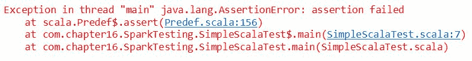
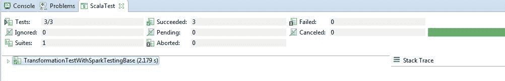

# 第十八章：测试与调试 Spark

“每个人都知道调试比编写程序本身要难两倍。所以如果你在写程序时尽可能聪明，那你怎么能调试它呢？”

- Brian W. Kernighan

在理想的世界里，我们编写完美的 Spark 代码，所有事情都完美运行，对吧？开玩笑；实际上，我们知道，处理大规模数据集几乎从来都不那么简单，总会有一些数据点暴露出代码的任何边角问题。

考虑到上述挑战，因此，在本章中，我们将看到测试一个分布式应用程序是多么困难；接下来，我们将看到一些应对方法。简而言之，本章将涵盖以下主题：

+   在分布式环境中的测试

+   测试 Spark 应用程序

+   调试 Spark 应用程序

# 在分布式环境中的测试

Leslie Lamport 定义了分布式系统这个术语，具体如下：

“分布式系统是这样一个系统，在其中我无法完成任何工作，因为一台我从未听说过的机器崩溃了。”

通过**万维网**（也叫**WWW**）进行资源共享，连接计算机的网络（也叫集群），是分布式系统的一个好例子。这些分布式环境通常是复杂的，且经常出现异质性。在这些异质环境中进行测试也充满挑战。在这一部分，首先，我们将观察在与此类系统工作时常见的一些问题。

# 分布式环境

关于分布式系统有许多定义。让我们看看一些定义，然后我们将尝试关联上述类别。Coulouris 将分布式系统定义为*一种硬件或软件组件位于联网计算机上的系统，这些组件仅通过消息传递来通信并协调其操作*。另一方面，Tanenbaum 通过几种方式定义了这个术语：

+   *一组独立的计算机，对系统用户而言，表现为一台单一的计算机。*

+   *一个由两台或更多独立计算机组成的系统，这些计算机通过同步或异步的消息传递协调它们的处理过程。*

+   *分布式系统是一组通过网络连接的自治计算机，软件设计用来提供一个集成的计算设施。*

现在，基于上述定义，分布式系统可以被分类如下：

+   只有硬件和软件是分布式的：本地分布式系统通过局域网（LAN）连接。

+   用户是分布式的，但有一些计算和硬件资源在后台运行，例如 WWW。

+   用户和硬件/软件都分布式：通过广域网（WAN）连接的分布式计算集群。例如，当你使用 Amazon AWS、Microsoft Azure、Google Cloud 或 Digital Ocean 的 droplets 时，你可以获得这些类型的计算设施。

# 分布式系统中的问题

在这里，我们将讨论在软件和硬件测试过程中需要注意的一些主要问题，以确保 Spark 作业能够在集群计算中顺利运行，而集群计算本质上是一个分布式计算环境。

请注意，所有这些问题都是不可避免的，但我们至少可以对它们进行调整以达到更好的效果。你应该遵循上一章中给出的指示和建议。根据*Kamal Sheel Mishra*和*Anil Kumar Tripathi*在《分布式软件系统的一些问题、挑战和难题》中提到的内容，见于《国际计算机科学与信息技术杂志》，第 5 卷（4 期），2014 年，4922-4925 页，网址：[`pdfs.semanticscholar.org/4c6d/c4d739bad13bcd0398e5180c1513f18275d8.pdf`](https://pdfs.semanticscholar.org/4c6d/c4d739bad13bcd0398e5180c1513f18275d8.pdf)，在分布式环境下使用软件或硬件时，需要解决几个问题：

+   扩展性

+   异构语言、平台和架构

+   资源管理

+   安全与隐私

+   透明性

+   开放性

+   互操作性

+   服务质量

+   故障管理

+   同步

+   通信

+   软件架构

+   性能分析

+   生成测试数据

+   测试组件选择

+   测试顺序

+   系统扩展性和性能测试

+   源代码的可用性

+   事件的可重现性

+   死锁和竞争条件

+   故障容忍性测试

+   分布式系统的调度问题

+   分布式任务分配

+   测试分布式软件

+   来自硬件抽象层的监控与控制机制

确实我们无法完全解决所有这些问题，但使用 Spark 后，我们至少可以控制一些与分布式系统相关的问题。例如，扩展性、资源管理、服务质量、故障管理、同步、通信、分布式系统的调度问题、分布式任务分配、以及测试分布式软件时的监控与控制机制。这些大多数问题在前两章中已有讨论。另一方面，我们可以在测试和软件方面解决一些问题，例如：软件架构、性能分析、生成测试数据、组件选择、测试顺序、系统扩展性与性能测试，以及源代码的可用性。至少本章中会显式或隐式地涵盖这些内容。

# 分布式环境中软件测试的挑战

敏捷软件开发中的任务常常伴随着一些共同的挑战，这些挑战在将软件部署之前，在分布式环境中进行测试时变得更加复杂。团队成员通常需要在错误传播后并行合并软件组件。然而，由于紧急性，合并通常发生在测试阶段之前。有时，许多利益相关者分布在不同的团队之间。因此，误解的潜力很大，团队经常因此而迷失。

例如，Cloud Foundry ([`www.cloudfoundry.org/`](https://www.cloudfoundry.org/)) 是一个开源的、重度分布式的 PaaS 软件系统，用于管理云中应用程序的部署和可扩展性。它承诺提供不同的功能，如可扩展性、可靠性和弹性，这些功能在 Cloud Foundry 上的部署中固有地要求底层的分布式系统实施措施，以确保稳健性、弹性和故障切换。

软件测试的过程早已为人熟知，包括*单元测试*、*集成测试*、*冒烟测试*、*验收测试*、*可扩展性测试*、*性能测试*和*服务质量测试*。在 Cloud Foundry 中，分布式系统的测试过程如下面的图所示：

**图 1：** 分布式环境中软件测试的示例，如 Cloud

如前面图所示（第一列），在像 Cloud 这样的分布式环境中，测试过程从对系统中最小的契约点执行单元测试开始。在所有单元测试成功执行后，进行集成测试，以验证作为一个单一一致软件系统的交互组件的行为（第二列），并运行在单个设备上（例如，**虚拟机**（**VM**）或裸机）。然而，尽管这些测试验证了系统作为一个整体的行为，但它们并不能保证在分布式部署中的系统有效性。一旦集成测试通过，下一步（第三列）是验证系统的分布式部署，并运行冒烟测试。

正如你所知道的，成功配置软件并执行单元测试为我们验证系统行为的可接受性做好了准备。这一验证是通过执行验收测试（第四列）来完成的。现在，为了克服分布式环境中上述的问题和挑战，仍然有其他隐藏的挑战需要研究人员和大数据工程师解决，但这些内容实际上超出了本书的范围。

现在我们知道了在分布式环境中，软件测试所面临的真实挑战，接下来让我们开始测试一下我们的 Spark 代码。下一节将专门介绍测试 Spark 应用程序。

# 测试 Spark 应用程序

测试 Spark 代码有很多种方式，这取决于它是 Java 代码（你可以做基本的 JUnit 测试来测试非 Spark 部分）还是 ScalaTest 用于 Scala 代码。你还可以通过在本地运行 Spark 或在小型测试集群上运行进行完整的集成测试。另一个很棒的选择是 Holden Karau 的 Spark-testing base。你可能知道，目前 Spark 没有原生的单元测试库。然而，我们可以使用以下两种库的替代方案：

+   ScalaTest

+   Spark-testing base

然而，在开始测试你用 Scala 编写的 Spark 应用程序之前，了解一些关于单元测试和测试 Scala 方法的背景知识是必须的。

# 测试 Scala 方法

在这里，我们将展示一些简单的技巧来测试 Scala 方法。对于 Scala 用户来说，这是最熟悉的单元测试框架（你也可以用它来测试 Java 代码，未来还可以用于 JavaScript）。ScalaTest 支持多种不同的测试风格，每种风格旨在支持特定类型的测试需求。详情请参见 ScalaTest 用户指南：[`www.scalatest.org/user_guide/selecting_a_style`](http://www.scalatest.org/user_guide/selecting_a_style)。虽然 ScalaTest 支持多种风格，但最简单的入门方法之一是使用以下 ScalaTest 特性，并以**TDD**（**测试驱动开发**）风格编写测试：

1.  `FunSuite`

1.  `Assertions`

1.  `BeforeAndAfter`

请随意浏览前面的链接，以了解更多关于这些特性的内容；这将使本教程的其余部分顺利进行。

需要注意的是，TDD（测试驱动开发）是一种用于开发软件的编程技术，它指出你应该从测试开始开发。因此，它不会影响如何编写测试，而是影响何时编写测试。在`ScalaTest.FunSuite`、`Assertions`和`BeforeAndAfter`中没有强制或鼓励 TDD 的特性或测试风格，它们更类似于 xUnit 测试框架。

在 ScalaTest 的任何风格特性中，都有三种可用的断言：

+   `assert`：用于你 Scala 程序中的一般断言。

+   `assertResult`：用于区分预期值与实际值。

+   `assertThrows`：用于确保某段代码抛出预期的异常。

ScalaTest 的断言定义在`Assertions`特性中，该特性进一步由`Suite`扩展。简而言之，`Suite`特性是所有风格特性的超类。根据 ScalaTest 文档：[`www.scalatest.org/user_guide/using_assertions`](http://www.scalatest.org/user_guide/using_assertions)，`Assertions`特性还提供以下功能：

+   `assume` 用于有条件地取消测试

+   `fail` 用于无条件地使测试失败

+   `cancel` 用于无条件地取消测试

+   `succeed` 用于无条件地使测试成功

+   `intercept` 用于确保某段代码抛出预期的异常，并对该异常进行断言

+   `assertDoesNotCompile` 用于确保某段代码不编译

+   `assertCompiles` 用于确保代码能够编译

+   `assertTypeError` 用于确保代码由于类型（而非解析）错误无法编译

+   `withClue` 用于添加更多关于失败的信息

从前面的列表中，我们将展示其中的一些。在你的 Scala 程序中，你可以通过调用 `assert` 并传入一个 `Boolean` 表达式来编写断言。你可以简单地开始编写你的简单单元测试用例，使用 `Assertions`。`Predef` 是一个对象，在其中定义了 assert 的行为。注意，`Predef` 的所有成员都会自动导入到每个 Scala 源文件中。以下源代码会打印 `Assertion success`，对于以下情况：

```py
package com.chapter16.SparkTesting
object SimpleScalaTest {
  def main(args: Array[String]):Unit= {
    val a = 5
    val b = 5
    assert(a == b)
      println("Assertion success")       
  }
}

```

然而，如果你将 `a = 2` 和 `b = 1`，例如，断言将失败，并且你将遇到以下输出：

**图 2：** 断言失败的示例

如果你传递一个为真的表达式，assert 将正常返回。然而，如果传入的表达式为假，assert 将会突然终止并抛出 Assertion Error。与 `AssertionError` 和 `TestFailedException` 形式不同，ScalaTest 的 assert 提供了更多的信息，告诉你测试失败发生在哪一行，或是哪个表达式出了问题。因此，ScalaTest 的 assert 提供比 Scala 的 assert 更好的错误信息。

例如，对于以下源代码，你应该会遇到 `TestFailedException`，它会告诉你 5 不等于 4：

```py
package com.chapter16.SparkTesting
import org.scalatest.Assertions._
object SimpleScalaTest {
  def main(args: Array[String]):Unit= {
    val a = 5
    val b = 4
    assert(a == b)
      println("Assertion success")       
  }
}

```

以下图像展示了前面 Scala 测试的输出：

**图 3：** TestFailedException 的示例

以下源代码解释了如何使用 `assertResult` 单元测试来测试方法的结果：

```py
package com.chapter16.SparkTesting
import org.scalatest.Assertions._
object AssertResult {
  def main(args: Array[String]):Unit= {
    val x = 10
    val y = 6
    assertResult(3) {
      x - y
    }
  }
}

```

前面的断言将失败，Scala 会抛出一个 `TestFailedException` 异常，并打印 `Expected 3 but got 4` (*图 4*)：

**图 4：** 另一个 TestFailedException 的示例

现在，让我们看一个单元测试来展示预期的异常：

```py
package com.chapter16.SparkTesting
import org.scalatest.Assertions._
object ExpectedException {
  def main(args: Array[String]):Unit= {
    val s = "Hello world!"
    try {
      s.charAt(0)
      fail()
    } catch {
      case _: IndexOutOfBoundsException => // Expected, so continue
    }
  }
}

```

如果你尝试访问超出索引范围的数组元素，前面的代码将告诉你是否可以访问前一个字符串 `Hello world!` 的第一个字符。如果你的 Scala 程序能够访问某个索引的值，断言将失败。这也意味着测试用例失败。因此，前面的测试用例将自然失败，因为第一个索引包含字符 `H`，你应该会遇到以下错误信息 (*图 5*)：

**图 5：** 第三个 TestFailedException 示例

然而，现在让我们尝试如下访问位置为 `-1` 的索引：

```py
package com.chapter16.SparkTesting
import org.scalatest.Assertions._
object ExpectedException {
  def main(args: Array[String]):Unit= {
    val s = "Hello world!"
    try {
      s.charAt(-1)
      fail()
    } catch {
      case _: IndexOutOfBoundsException => // Expected, so continue
    }
  }
}

```

现在，断言应该为真，因此，测试用例将通过。最终，代码将正常终止。现在，让我们检查一下我们的代码片段是否能编译。通常，你可能希望确保某些代表“用户错误”的代码顺序根本无法编译。其目标是检查库在错误面前的强度，以阻止不希望的结果和行为。ScalaTest 的`Assertions`特性包括以下语法：

```py
assertDoesNotCompile("val a: String = 1")

```

如果你想确保一段代码由于类型错误（而非语法错误）而无法编译，可以使用以下代码：

```py
assertTypeError("val a: String = 1")

```

语法错误仍会导致抛出`TestFailedException`。最后，如果你想声明一段代码能够编译，可以通过以下方式更明显地表达：

```py
assertCompiles("val a: Int = 1")

```

完整的示例如下所示：

```py
package com.chapter16.SparkTesting
import org.scalatest.Assertions._ 
object CompileOrNot {
  def main(args: Array[String]):Unit= {
    assertDoesNotCompile("val a: String = 1")
    println("assertDoesNotCompile True")

    assertTypeError("val a: String = 1")
    println("assertTypeError True")

    assertCompiles("val a: Int = 1")
    println("assertCompiles True")

    assertDoesNotCompile("val a: Int = 1")
    println("assertDoesNotCompile True")
  }
}

```

上述代码的输出如下图所示：

**图 6：** 多个测试一起进行

由于页面限制，我们现在将结束基于 Scala 的单元测试部分。然而，关于其他单元测试的案例，你可以参考 Scala 测试指南，网址为[`www.scalatest.org/user_guide`](http://www.scalatest.org/user_guide)。

# 单元测试

在软件工程中，通常会对单独的源代码单元进行测试，以确定它们是否适合使用。这种软件测试方法也被称为单元测试。此测试确保软件工程师或开发人员编写的源代码符合设计规范，并按预期工作。

另一方面，单元测试的目标是将程序的每个部分分开（即以模块化的方式）。然后尝试观察各个部分是否正常工作。单元测试在任何软件系统中的几个好处包括：

+   **尽早发现问题：** 它能在开发周期的早期发现错误或缺失的规范部分。

+   **促进变更：** 它有助于重构和升级，而无需担心破坏功能。

+   **简化集成：** 它使得集成测试更容易编写。

+   **文档化：** 它提供了系统的活文档。

+   **设计：** 它可以作为项目的正式设计。

# 测试 Spark 应用

我们已经看到如何使用 Scala 的内置`ScalaTest`包来测试你的 Scala 代码。然而，在本小节中，我们将看看如何测试用 Scala 编写的 Spark 应用。接下来将讨论以下三种方法：

+   **方法 1：** 使用 JUnit 测试 Spark 应用

+   **方法 2：** 使用`ScalaTest`包进行 Spark 应用测试

+   **方法 3：** 使用 Spark 测试基础进行 Spark 应用测试

方法 1 和方法 2 将在这里讨论，并附有一些实际代码。然而，方法 3 的详细讨论将在下一个小节中提供。为了简化理解，我们将使用著名的单词计数应用程序来演示方法 1 和方法 2。

# 方法 1：使用 Scala JUnit 测试

假设你已经用 Scala 编写了一个应用程序，它可以告诉你文档或文本文件中有多少个单词，如下所示：

```py
package com.chapter16.SparkTesting
import org.apache.spark._
import org.apache.spark.sql.SparkSession
class wordCounterTestDemo {
  val spark = SparkSession
    .builder
    .master("local[*]")
    .config("spark.sql.warehouse.dir", "E:/Exp/")
    .appName(s"OneVsRestExample")
    .getOrCreate()
  def myWordCounter(fileName: String): Long = {
    val input = spark.sparkContext.textFile(fileName)
    val counts = input.flatMap(_.split(" ")).distinct()
    val counter = counts.count()
    counter
  }
}

```

上述代码仅解析了一个文本文件，并通过简单地分割单词来执行 `flatMap` 操作。然后，它执行另一个操作，只考虑不同的单词。最后，`myWordCounter` 方法计算单词数量并返回计数器的值。

现在，在进行正式测试之前，让我们先检查一下前述方法是否正常工作。只需添加主方法并按如下方式创建一个对象：

```py
package com.chapter16.SparkTesting
import org.apache.spark._
import org.apache.spark.sql.SparkSession
object wordCounter {
  val spark = SparkSession
    .builder
    .master("local[*]")
    .config("spark.sql.warehouse.dir", "E:/Exp/")
    .appName("Testing")
    .getOrCreate()    
  val fileName = "data/words.txt";
  def myWordCounter(fileName: String): Long = {
    val input = spark.sparkContext.textFile(fileName)
    val counts = input.flatMap(_.split(" ")).distinct()
    val counter = counts.count()
    counter
  }
  def main(args: Array[String]): Unit = {
    val counter = myWordCounter(fileName)
    println("Number of words: " + counter)
  }
}

```

如果你执行上述代码，你应该观察到以下输出：`Number of words: 214`。太棒了！它确实像本地应用程序一样运行。现在，使用 Scala JUnit 测试用例测试前面的测试用例。

```py
package com.chapter16.SparkTesting
import org.scalatest.Assertions._
import org.junit.Test
import org.apache.spark.sql.SparkSession
class wordCountTest {
  val spark = SparkSession
    .builder
    .master("local[*]")
    .config("spark.sql.warehouse.dir", "E:/Exp/")
    .appName(s"OneVsRestExample")
    .getOrCreate()   
    @Test def test() {
      val fileName = "data/words.txt"
      val obj = new wordCounterTestDemo()
      assert(obj.myWordCounter(fileName) == 214)
           }
    spark.stop()
}

```

如果你仔细查看之前的代码，我在 `test()` 方法前使用了 `Test` 注解。在 `test()` 方法内部，我调用了 `assert()` 方法，实际的测试就在这里发生。我们尝试检查 `myWordCounter()` 方法的返回值是否等于 214。现在，按如下方式将之前的代码作为 Scala 单元测试运行（*图 7*）：

**图 7：** 以 Scala JUnit 测试运行 Scala 代码

如果测试用例通过，你应该在 Eclipse IDE 上观察到以下输出（*图 8*）：

**图 8：** 单词计数测试用例通过

现在，举个例子，尝试以以下方式进行断言：

```py
assert(obj.myWordCounter(fileName) == 210)

```

如果之前的测试用例失败，你应该观察到以下输出（*图 9*）：

**图 9：** 测试用例失败

现在让我们看一下方法 2 以及它如何帮助我们改进。

# 方法 2：使用 FunSuite 测试 Scala 代码

现在，让我们通过仅返回文档中文本的 RDD 来重新设计之前的测试用例，如下所示：

```py
package com.chapter16.SparkTesting
import org.apache.spark._
import org.apache.spark.rdd.RDD
import org.apache.spark.sql.SparkSession
class wordCountRDD {
  def prepareWordCountRDD(file: String, spark: SparkSession): RDD[(String, Int)] = {
    val lines = spark.sparkContext.textFile(file)
    lines.flatMap(_.split(" ")).map((_, 1)).reduceByKey(_ + _)
  }
}

```

所以，前述类中的 `prepareWordCountRDD()` 方法返回了一个包含字符串和整数值的 RDD。现在，如果我们想测试 `prepareWordCountRDD()` 方法的功能，我们可以通过扩展测试类，使用来自 ScalaTest 包的 `FunSuite` 和 `BeforeAndAfterAll` 来使测试更为明确。测试的工作方式如下：

+   使用来自 Scala 的 `ScalaTest` 包中的 `FunSuite` 和 `BeforeAndAfterAll` 扩展测试类

+   重写创建 Spark 上下文的 `beforeAll()` 方法

+   使用 `test()` 方法执行测试，并在 `test()` 方法内部使用 `assert()` 方法

+   重写停止 Spark 上下文的 `afterAll()` 方法

根据前面的步骤，让我们看看用于测试 `prepareWordCountRDD()` 方法的类：

```py
package com.chapter16.SparkTesting
import org.scalatest.{ BeforeAndAfterAll, FunSuite }
import org.scalatest.Assertions._
import org.apache.spark.sql.SparkSession
import org.apache.spark.rdd.RDD
class wordCountTest2 extends FunSuite with BeforeAndAfterAll {
  var spark: SparkSession = null
  def tokenize(line: RDD[String]) = {
    line.map(x => x.split(' ')).collect()
  }
  override def beforeAll() {
    spark = SparkSession
      .builder
      .master("local[*]")
      .config("spark.sql.warehouse.dir", "E:/Exp/")
      .appName(s"OneVsRestExample")
      .getOrCreate()
  }  
  test("Test if two RDDs are equal") {
    val input = List("To be,", "or not to be:", "that is the question-", "William Shakespeare")
    val expected = Array(Array("To", "be,"), Array("or", "not", "to", "be:"), Array("that", "is", "the", "question-"), Array("William", "Shakespeare"))
    val transformed = tokenize(spark.sparkContext.parallelize(input))
    assert(transformed === expected)
  }  
  test("Test for word count RDD") {
    val fileName = "C:/Users/rezkar/Downloads/words.txt"
    val obj = new wordCountRDD
    val result = obj.prepareWordCountRDD(fileName, spark)    
    assert(result.count() === 214)
  }
  override def afterAll() {
    spark.stop()
  }
}

```

第一个测试表明，如果两个 RDD 以两种不同的方式物化，那么它们的内容应该是相同的。因此，第一个测试应该通过。我们将在以下示例中看到这一点。对于第二个测试，正如我们之前所看到的，RDD 的单词计数为 214，但我们暂时假设它是未知的。如果它恰好是 214，测试用例应该通过，这就是它的预期行为。

因此，我们预期两个测试都会通过。现在，在 Eclipse 中，将测试套件作为 `ScalaTest-File` 运行，如下图所示：

 **图 10：** 作为 ScalaTest-File 运行测试套件

现在你应该观察以下输出（*图 11*）。输出显示了我们执行了多少个测试用例，多少个通过、失败、取消、忽略或待处理。它还显示了执行整个测试所需的时间。

**图 11：** 运行两个测试套件作为 ScalaTest 文件时的测试结果

太棒了！测试用例通过了。现在，让我们尝试在两个独立的测试中使用 `test()` 方法更改断言中的比较值，如下所示：

```py
test("Test for word count RDD") { 
  val fileName = "data/words.txt"
  val obj = new wordCountRDD
  val result = obj.prepareWordCountRDD(fileName, spark)    
  assert(result.count() === 210)
}
test("Test if two RDDs are equal") {
  val input = List("To be", "or not to be:", "that is the question-", "William Shakespeare")
  val expected = Array(Array("To", "be,"), Array("or", "not", "to", "be:"), Array("that", "is", "the", "question-"), Array("William", "Shakespeare"))
  val transformed = tokenize(spark.sparkContext.parallelize(input))
  assert(transformed === expected)
}

```

现在，你应该预期测试用例将失败。现在作为 `ScalaTest-File` 运行之前的类（*图 12*）：

**图 12：** 运行之前两个测试套件作为 ScalaTest-File 时的测试结果

干得好！我们已经学习了如何使用 Scala 的 FunSuite 进行单元测试。然而，如果你仔细评估前面的方法，你应该同意它有几个缺点。例如，你需要确保显式管理 `SparkContext` 的创建和销毁。作为开发者或程序员，你必须为测试一个示例方法编写更多的代码。有时，由于 *Before* 和 *After* 步骤必须在所有测试套件中重复，因此会发生代码重复。然而，这个问题是有争议的，因为公共代码可以放在一个公共特征中。

现在的问题是，我们如何改善我们的体验？我的建议是使用 Spark 测试库，让生活变得更轻松、更直观。我们将讨论如何使用 Spark 测试库进行单元测试。

# 方法 3：使用 Spark 测试库简化生活

Spark 测试库帮助你轻松地测试大多数 Spark 代码。那么，这个方法的优点是什么呢？其实有很多。例如，使用这个方法，代码不会冗长，我们可以得到非常简洁的代码。它的 API 比 ScalaTest 或 JUnit 更加丰富。支持多种语言，例如 Scala、Java 和 Python。它支持内置的 RDD 比较器。你还可以用它来测试流式应用程序。最后，也是最重要的，它支持本地模式和集群模式的测试。这对于分布式环境中的测试至关重要。

GitHub 仓库位于 [`github.com/holdenk/spark-testing-base`](https://github.com/holdenk/spark-testing-base)。

在使用 Spark 测试库进行单元测试之前，您应在项目树中的 Maven 友好型 `pom.xml` 文件中包含以下依赖项，以便支持 Spark 2.x：

```py
<dependency>
  <groupId>com.holdenkarau</groupId>
  <artifactId>spark-testing-base_2.10</artifactId>
  <version>2.0.0_0.6.0</version>
</dependency>

```

对于 SBT，您可以添加以下依赖项：

```py
"com.holdenkarau" %% "spark-testing-base" % "2.0.0_0.6.0"

```

请注意，建议在 `test` 范围内添加上述依赖项，方法是为 Maven 和 SBT 两种情况都指定 `<scope>test</scope>`。除了这些之外，还有其他需要考虑的问题，比如内存需求、OOM（内存溢出）以及禁用并行执行。在 SBT 测试中的默认 Java 选项过小，无法支持运行多个测试。有时，如果作业以本地模式提交，测试 Spark 代码会更困难！现在，您可以自然理解在真实集群模式（即 YARN 或 Mesos）下的复杂性。

为了解决这个问题，您可以增加项目树中 `build.sbt` 文件中的内存量。只需添加以下参数即可：

```py
javaOptions ++= Seq("-Xms512M", "-Xmx2048M", "-XX:MaxPermSize=2048M", "-XX:+CMSClassUnloadingEnabled")

```

然而，如果您使用 Surefire，您可以添加以下内容：

```py
<argLine>-Xmx2048m -XX:MaxPermSize=2048m</argLine>

```

在基于 Maven 的构建中，您可以通过设置环境变量中的值来实现。有关此问题的更多信息，请参阅 [`maven.apache.org/configure.html`](https://maven.apache.org/configure.html)。

这只是一个运行 Spark 测试库自己测试的示例。因此，您可能需要设置更大的值。最后，确保在您的 SBT 中禁用了并行执行，方法是添加以下代码行：

```py
parallelExecution in Test := false

```

另一方面，如果您使用 Surefire，请确保 `forkCount` 和 `reuseForks` 分别设置为 1 和 true。让我们来看一下使用 Spark 测试库的示例。以下源代码包含三个测试用例。第一个测试用例是一个虚拟测试，用来比较 1 是否等于 1，显然会通过。第二个测试用例计算句子 `Hello world! My name is Reza` 中的单词数，并比较是否有六个单词。最后一个测试用例尝试比较两个 RDD：

```py
package com.chapter16.SparkTesting
import org.scalatest.Assertions._
import org.apache.spark.rdd.RDD
import com.holdenkarau.spark.testing.SharedSparkContext
import org.scalatest.FunSuite
class TransformationTestWithSparkTestingBase extends FunSuite with SharedSparkContext {
  def tokenize(line: RDD[String]) = {
    line.map(x => x.split(' ')).collect()
  }
  test("works, obviously!") {
    assert(1 == 1)
  }
  test("Words counting") {
    assert(sc.parallelize("Hello world My name is Reza".split("\\W")).map(_ + 1).count == 6)
  }
  test("Testing RDD transformations using a shared Spark Context") {
    val input = List("Testing", "RDD transformations", "using a shared", "Spark Context")
    val expected = Array(Array("Testing"), Array("RDD", "transformations"), Array("using", "a", "shared"), Array("Spark", "Context"))
    val transformed = tokenize(sc.parallelize(input))
    assert(transformed === expected)
  }
}

```

从前面的源代码中，我们可以看到我们可以使用 Spark 测试库执行多个测试用例。在成功执行后，您应该观察到以下输出（*图 13*）：

**图 13：** 使用 Spark 测试库成功执行并通过的测试

# 在 Windows 上配置 Hadoop 运行时

我们已经了解了如何在 Eclipse 或 IntelliJ 上测试使用 Scala 编写的 Spark 应用程序，但还有另一个潜在问题不容忽视。尽管 Spark 可以在 Windows 上运行，但它是为在类 UNIX 操作系统上运行而设计的。因此，如果您在 Windows 环境中工作，您需要特别小心。

在使用 Eclipse 或 IntelliJ 开发 Spark 应用程序时，如果你在 Windows 平台上解决数据分析、机器学习、数据科学或深度学习应用，你可能会遇到 I/O 异常错误，应用程序可能无法成功编译或可能会中断。实际上，问题在于 Spark 期望 Windows 上也有 Hadoop 的运行环境。例如，如果你第一次在 Eclipse 上运行一个 Spark 应用程序，比如`KMeansDemo.scala`，你会遇到一个 I/O 异常，显示以下信息：

```py
17/02/26 13:22:00 ERROR Shell: Failed to locate the winutils binary in the hadoop binary path java.io.IOException: Could not locate executable null\bin\winutils.exe in the Hadoop binaries.

```

之所以这样，是因为 Hadoop 默认是为 Linux 环境开发的，如果你在 Windows 平台上开发 Spark 应用程序，则需要一个桥接工具，为 Spark 提供 Hadoop 运行时环境，确保 Spark 能够正确执行。I/O 异常的详细信息可以在下图中看到：

**图 14：**由于未能在 Hadoop 二进制路径中找到 winutils 二进制文件，导致 I/O 异常发生

那么，如何解决这个问题呢？解决方案很简单。正如错误信息所示，我们需要一个可执行文件，即`winutils.exe`。现在，从[`github.com/steveloughran/winutils/tree/master/hadoop-2.7.1/bin`](https://github.com/steveloughran/winutils/tree/master/hadoop-2.7.1/bin)下载`winutils.exe`文件，将其粘贴到 Spark 分发目录中，并配置 Eclipse。更具体地说，假设你的 Spark 分发包包含 Hadoop，位于`C:/Users/spark-2.1.0-bin-hadoop2.7`，在 Spark 分发包内部有一个名为 bin 的目录。现在，将可执行文件粘贴到该目录中（即，`path = C:/Users/spark-2.1.0-bin-hadoop2.7/bin/`）。

解决方案的第二阶段是进入 Eclipse，选择主类（即本例中的`KMeansDemo.scala`），然后进入运行菜单。在运行菜单中，选择运行配置选项，并从中选择环境选项卡，如下图所示：

**图 15：**解决由于 Hadoop 二进制路径中缺少 winutils 二进制文件而导致的 I/O 异常

如果你选择了该标签，你将有一个选项来为 Eclipse 创建一个新的环境变量，使用 JVM。现在创建一个名为`HADOOP_HOME`的新环境变量，并将其值设置为`C:/Users/spark-2.1.0-bin-hadoop2.7/`。然后点击应用按钮，重新运行你的应用程序，问题应该得到解决。

需要注意的是，在 Windows 上使用 PySpark 与 Spark 时，也需要`winutils.exe`文件。有关 PySpark 的参考，请参见第十九章，*PySpark 与 SparkR*。

请注意，前述解决方案同样适用于调试你的应用程序。有时，即使出现上述错误，你的 Spark 应用程序仍然可以正常运行。然而，如果数据集的大小较大，那么前述错误很可能会发生。

# 调试 Spark 应用程序

在本节中，我们将了解如何调试在本地（Eclipse 或 IntelliJ）、独立模式或 YARN 或 Mesos 集群模式下运行的 Spark 应用程序。然而，在深入探讨之前，了解 Spark 应用程序中的日志记录是必要的。

# 使用 log4j 记录 Spark 日志总结

我们已经在第十四章中讨论过这个话题，*是时候整理一下 - 使用 Spark MLlib 对数据进行聚类*。然而，为了让你的思路与当前讨论的主题*调试 Spark 应用程序*对齐，我们将重播相同的内容。如前所述，Spark 使用 log4j 进行自己的日志记录。如果你正确配置了 Spark，Spark 会将所有操作记录到 shell 控制台。以下是该文件的样本快照：

**图 16：** log4j.properties 文件的快照

将默认的 spark-shell 日志级别设置为 WARN。在运行 spark-shell 时，这个类的日志级别将覆盖根日志记录器的日志级别，从而让用户可以为 shell 和普通的 Spark 应用程序设置不同的默认值。我们还需要在启动由执行器执行并由驱动程序管理的作业时附加 JVM 参数。为此，你应该编辑 `conf/spark-defaults.conf`。简而言之，可以添加以下选项：

```py
spark.executor.extraJavaOptions=-Dlog4j.configuration=file:/usr/local/spark-2.1.1/conf/log4j.properties spark.driver.extraJavaOptions=-Dlog4j.configuration=file:/usr/local/spark-2.1.1/conf/log4j.properties

```

为了让讨论更清晰，我们需要隐藏所有 Spark 生成的日志。然后，我们可以将这些日志重定向到文件系统中。同时，我们希望自己的日志能够在 shell 和单独的文件中记录，以避免与 Spark 的日志混淆。从这里开始，我们将指向保存自己日志的文件，在此案例中为`/var/log/sparkU.log`。当应用程序启动时，Spark 会加载这个`log4j.properties`文件，因此我们只需要将其放置在指定的位置，无需做其他操作：

```py
package com.chapter14.Serilazition
import org.apache.log4j.LogManager
import org.apache.log4j.Level
import org.apache.spark.sql.SparkSession
object myCustomLog {
  def main(args: Array[String]): Unit = {   
    val log = LogManager.getRootLogger    
    //Everything is printed as INFO once the log level is set to INFO untill you set the level to new level for example WARN. 
    log.setLevel(Level.INFO)
    log.info("Let's get started!")    
    // Setting logger level as WARN: after that nothing prints other than WARN
    log.setLevel(Level.WARN)    
    // Creating Spark Session
    val spark = SparkSession
      .builder
      .master("local[*]")
      .config("spark.sql.warehouse.dir", "E:/Exp/")
      .appName("Logging")
      .getOrCreate()
    // These will note be printed!
    log.info("Get prepared!")
    log.trace("Show if there is any ERROR!")
    //Started the computation and printing the logging information
    log.warn("Started")
    spark.sparkContext.parallelize(1 to 20).foreach(println)
    log.warn("Finished")
  }
}

```

在前面的代码中，一旦日志级别设置为`INFO`，所有内容都会以 INFO 级别打印，直到你将日志级别设置为新的级别，比如`WARN`。然而，在此之后，不会再打印任何信息或跟踪等内容。此外，log4j 在 Spark 中支持多个有效的日志级别。成功执行前面的代码应该会生成以下输出：

```py
17/05/13 16:39:14 INFO root: Let's get started!
17/05/13 16:39:15 WARN root: Started
4 
1 
2 
5 
3 
17/05/13 16:39:16 WARN root: Finished

```

你还可以在 `conf/log4j.properties` 中设置 Spark shell 的默认日志记录。Spark 提供了一个 log4j 的属性文件模板，我们可以扩展并修改这个文件来进行 Spark 的日志记录。进入 `SPARK_HOME/conf` 目录，你应该会看到 `log4j.properties.template` 文件。你应该将其重命名为 `log4j.properties` 后使用这个 `conf/log4j.properties.template`。在开发 Spark 应用程序时，你可以将 `log4j.properties` 文件放在你的项目目录下，尤其是在像 Eclipse 这样的 IDE 环境中工作时。然而，要完全禁用日志记录，只需将 `log4j.logger.org` 的标志设置为 `OFF`，如下所示：

```py
log4j.logger.org=OFF

```

到目前为止，一切都很简单。然而，在前面的代码段中，我们还没有注意到一个问题。`org.apache.log4j.Logger` 类的一个缺点是它不可序列化，这意味着在进行 Spark API 的某些操作时，我们不能在闭包中使用它。例如，假设我们在 Spark 代码中做了如下操作：

```py
object myCustomLogger {
  def main(args: Array[String]):Unit= {
    // Setting logger level as WARN
    val log = LogManager.getRootLogger
    log.setLevel(Level.WARN)
    // Creating Spark Context
    val conf = new SparkConf().setAppName("My App").setMaster("local[*]")
    val sc = new SparkContext(conf)
    //Started the computation and printing the logging information
    //log.warn("Started")
    val i = 0
    val data = sc.parallelize(i to 100000)
    data.map{number =>
      log.info(“My number”+ i)
      number.toString
    }
    //log.warn("Finished")
  }
}

```

你应该会遇到如下的异常，提示 `Task` 不可序列化：

```py
org.apache.spark.SparkException: Job aborted due to stage failure: Task not serializable: java.io.NotSerializableException: ...
Exception in thread "main" org.apache.spark.SparkException: Task not serializable 
Caused by: java.io.NotSerializableException: org.apache.log4j.spi.RootLogger
Serialization stack: object not serializable

```

首先，我们可以尝试用一种简单的方法来解决这个问题。你可以做的是仅使用 `extends Serializable` 使 Scala 类（执行实际操作的类）可序列化。例如，代码如下：

```py
class MyMapper(n: Int) extends Serializable {
  @transient lazy val log = org.apache.log4j.LogManager.getLogger("myLogger")
  def logMapper(rdd: RDD[Int]): RDD[String] =
    rdd.map { i =>
      log.warn("mapping: " + i)
      (i + n).toString
    }
  }

```

本节旨在进行日志记录的讨论。然而，我们借此机会将其拓展为更通用的 Spark 编程和问题处理方法。为了更高效地解决 `task not serializable` 错误，编译器会尝试通过使整个对象（而不仅仅是 lambda）变为可序列化来发送，并强制 Spark 接受这一做法。然而，这样会显著增加数据洗牌，尤其是对于大对象！其他方法包括使整个类 `Serializable` 或者仅在传递给 map 操作的 lambda 函数内声明实例。有时，让不可序列化的对象跨节点传递也能解决问题。最后，使用 `forEachPartition()` 或 `mapPartitions()` 而不是仅仅使用 `map()` 来创建不可序列化的对象。总而言之，解决此问题的方法有以下几种：

+   使类可序列化

+   仅在传递给 map 操作的 lambda 函数内声明实例

+   将不可序列化对象设置为静态，并且每台机器只创建一次

+   调用 `forEachPartition()` 或 `mapPartitions()` 而不是 `map()` 来创建不可序列化对象

在前面的代码中，我们使用了注解 `@transient lazy`，它将 `Logger` 类标记为非持久化。另一方面，包含方法 apply（即 `MyMapperObject`）的对象实例化了 `MyMapper` 类的对象，代码如下：

```py
//Companion object 
object MyMapper {
  def apply(n: Int): MyMapper = new MyMapper(n)
}

```

最后，包含 `main()` 方法的对象如下：

```py
//Main object
object myCustomLogwithClosureSerializable {
  def main(args: Array[String]) {
    val log = LogManager.getRootLogger
    log.setLevel(Level.WARN)
    val spark = SparkSession
      .builder
      .master("local[*]")
      .config("spark.sql.warehouse.dir", "E:/Exp/")
      .appName("Testing")
      .getOrCreate()
    log.warn("Started")
    val data = spark.sparkContext.parallelize(1 to 100000)
    val mapper = MyMapper(1)
    val other = mapper.logMapper(data)
    other.collect()
    log.warn("Finished")
  }

```

现在，让我们看一个提供更好见解的例子，以便继续解决我们讨论的问题。假设我们有以下类，它计算两个整数的乘积：

```py
class MultiplicaitonOfTwoNumber {
  def multiply(a: Int, b: Int): Int = {
    val product = a * b
    product
  }
}

```

现在，实际上，如果你尝试使用这个类在 lambda 闭包中通过 `map()` 计算乘法，你将会得到我们之前描述的 `Task Not Serializable` 错误。现在，我们可以简单地使用 `foreachPartition()` 和 lambda 代码如下：

```py
val myRDD = spark.sparkContext.parallelize(0 to 1000)
    myRDD.foreachPartition(s => {
      val notSerializable = new MultiplicaitonOfTwoNumber
      println(notSerializable.multiply(s.next(), s.next()))
    })

```

现在，如果你编译它，它应该返回预期的结果。为了方便，你可以查看以下包含 `main()` 方法的完整代码：

```py
package com.chapter16.SparkTesting
import org.apache.spark.sql.SparkSession
class MultiplicaitonOfTwoNumber {
  def multiply(a: Int, b: Int): Int = {
    val product = a * b
    product
  }
}
object MakingTaskSerilazible {
  def main(args: Array[String]): Unit = {
    val spark = SparkSession
      .builder
      .master("local[*]")
      .config("spark.sql.warehouse.dir", "E:/Exp/")
      .appName("MakingTaskSerilazible")
      .getOrCreate()
 val myRDD = spark.sparkContext.parallelize(0 to 1000)
    myRDD.foreachPartition(s => {
      val notSerializable = new MultiplicaitonOfTwoNumber
      println(notSerializable.multiply(s.next(), s.next()))
    })
  }
}

```

输出结果如下：

```py
0
5700
1406
156
4032
7832
2550
650

```

# 调试 Spark 应用程序

本节将讨论如何调试本地运行的 Spark 应用程序，使用 Eclipse 或 IntelliJ，作为 YARN 或 Mesos 上的独立模式或集群模式。在开始之前，你还可以阅读调试文档，网址是[https://hortonworks.com/hadoop-tutorial/setting-spark-development-environment-scala/](https://hortonworks.com/hadoop-tutorial/setting-spark-development-environment-scala/)。

# 在 Eclipse 中调试 Spark 应用程序作为 Scala 调试

为了实现这一点，只需将 Eclipse 配置为以常规的 Scala 代码调试方式调试你的 Spark 应用程序。配置时选择 运行 | 调试配置 | Scala 应用程序，如下图所示：

**图 17：** 配置 Eclipse 以调试 Spark 应用程序作为常规的 Scala 代码调试

假设我们想调试我们的`KMeansDemo.scala`并要求 Eclipse（你在 IntelliJ IDE 上也可以有类似的选项）从第 56 行开始执行，并在第 95 行设置断点。为此，运行你的 Scala 代码进行调试，你应该在 Eclipse 上观察到以下场景：

**图 18：** 在 Eclipse 中调试 Spark 应用程序

然后，Eclipse 将在你要求它在第 95 行停止执行时暂停，如下图所示：

**图 19：** 在 Eclipse 中调试 Spark 应用程序（断点）

总结来说，简化前面的示例，如果在第 56 行和第 95 行之间出现任何错误，Eclipse 将显示实际发生错误的位置。否则，如果没有中断，它将遵循正常的工作流程。

# 调试以本地和独立模式运行的 Spark 作业

在本地调试你的 Spark 应用程序或以独立模式调试时，你需要知道调试驱动程序程序和调试某个执行器是不同的，因为使用这两种节点需要传递不同的提交参数给` spark-submit`。在本节中，我将使用端口 4000 作为地址。例如，如果你想调试驱动程序程序，可以在你的` spark-submit`命令中添加以下内容：

```py
--driver-java-options -agentlib:jdwp=transport=dt_socket,server=y,suspend=y,address=4000

```

之后，你应该设置远程调试器连接到你提交驱动程序程序的节点。对于前面的情况，已指定端口号 4000。但是，如果该端口已经被其他 Spark 作业、其他应用程序或服务等占用，你可能还需要自定义该端口，也就是说，修改端口号。

另一方面，连接到执行器类似于前面的选项，唯一不同的是地址选项。更具体来说，你需要将地址替换为本地计算机的地址（IP 地址或主机名加上端口号）。然而，通常来说，建议测试一下是否能从 Spark 集群（实际进行计算的地方）访问本地计算机。例如，你可以使用以下选项来使调试环境能够在你的 `spark-submit` 命令中启用：

```py
--num-executors 1\
--executor-cores 1 \
--conf "spark.executor.extraJavaOptions=-agentlib:jdwp=transport=dt_socket,server=n,address=localhost:4000,suspend=n"

```

总结一下，使用以下命令提交你的 Spark 作业（此处以 `KMeansDemo` 应用为例）：

```py
$ SPARK_HOME/bin/spark-submit \
--class "com.chapter13.Clustering.KMeansDemo" \
--master spark://ubuntu:7077 \
--num-executors 1\
--executor-cores 1 \
--conf "spark.executor.extraJavaOptions=-agentlib:jdwp=transport=dt_socket,server=n,address= host_name_to_your_computer.org:5005,suspend=n" \
--driver-java-options -agentlib:jdwp=transport=dt_socket,server=y,suspend=y,address=4000 \
 KMeans-0.0.1-SNAPSHOT-jar-with-dependencies.jar \
Saratoga_NY_Homes.txt

```

现在，启动本地调试器的监听模式并启动 Spark 程序。最后，等待执行器连接到调试器。你会在终端中看到如下消息：

```py
Listening for transport dt_socket at address: 4000 

```

重要的是要知道，你需要将执行器的数量设置为 1。如果设置多个执行器，它们都会尝试连接到调试器，最终会导致一些奇怪的问题。需要注意的是，有时设置 `SPARK_JAVA_OPTS` 有助于调试本地运行或独立模式下的 Spark 应用。命令如下：

```py
$ export SPARK_JAVA_OPTS=-agentlib:jdwp=transport=dt_socket,server=y,address=4000,suspend=y,onuncaught=n

```

然而，自 Spark 1.0.0 版本起，`SPARK_JAVA_OPTS` 已被弃用，并被 `spark-defaults.conf` 和 Spark-submit 或 Spark-shell 的命令行参数所取代。需要注意的是，设置 `spark.driver.extraJavaOptions` 和 `spark.executor.extraJavaOptions`，我们在前一节看到的这些，在 `spark-defaults.conf` 中并不是 `SPARK_JAVA_OPTS` 的替代品。但坦率地说，`SPARK_JAVA_OPTS` 仍然非常有效，你可以尝试使用它。

# 在 YARN 或 Mesos 集群上调试 Spark 应用

当你在 YARN 上运行 Spark 应用时，可以通过修改 `yarn-env.sh` 启用一个选项：

```py
YARN_OPTS="-agentlib:jdwp=transport=dt_socket,server=y,suspend=n,address=4000 $YARN_OPTS"

```

现在，通过 Eclipse 或 IntelliJ IDE，你可以通过 4000 端口进行远程调试。第二种方法是设置 `SPARK_SUBMIT_OPTS`。你可以使用 Eclipse 或 IntelliJ 开发你的 Spark 应用程序，并将其提交到远程的多节点 YARN 集群执行。我通常会在 Eclipse 或 IntelliJ 上创建一个 Maven 项目，将我的 Java 或 Scala 应用打包为一个 jar 文件，然后将其提交为 Spark 作业。然而，为了将你的 IDE（如 Eclipse 或 IntelliJ）调试器附加到 Spark 应用中，你可以使用如下的 `SPARK_SUBMIT_OPTS` 环境变量来定义所有的提交参数：

```py
$ export SPARK_SUBMIT_OPTS=-agentlib:jdwp=transport=dt_socket,server=y,suspend=y,address=4000

```

然后按如下方式提交你的 Spark 作业（请根据你的需求和设置更改相应的值）：

```py
$ SPARK_HOME/bin/spark-submit \
--class "com.chapter13.Clustering.KMeansDemo" \
--master yarn \
--deploy-mode cluster \
--driver-memory 16g \
--executor-memory 4g \
--executor-cores 4 \
--queue the_queue \
--num-executors 1\
--executor-cores 1 \
--conf "spark.executor.extraJavaOptions=-agentlib:jdwp=transport=dt_socket,server=n,address= host_name_to_your_computer.org:4000,suspend=n" \
--driver-java-options -agentlib:jdwp=transport=dt_socket,server=y,suspend=y,address=4000 \
 KMeans-0.0.1-SNAPSHOT-jar-with-dependencies.jar \
Saratoga_NY_Homes.txt

```

在运行上述命令后，系统将等待直到你连接调试器，如下所示：`Listening for transport dt_socket at address: 4000`。现在你可以在 IntelliJ 调试器中配置你的 Java 远程应用程序（Scala 应用也可以），如下图所示：

**图 20：** 在 IntelliJ 上配置远程调试器

对于前述情况，10.200.1.101 是远程计算节点的 IP 地址，Spark 作业基本上在该节点上运行。最后，你需要通过点击 IntelliJ 的运行菜单下的 Debug 来启动调试器。然后，如果调试器成功连接到你的远程 Spark 应用程序，你将看到 IntelliJ 中应用程序控制台的日志信息。现在，如果你可以设置断点，其他的步骤就是正常的调试过程。下图展示了在 IntelliJ 中暂停 Spark 作业并设置断点时，你将看到的界面：

**图 21：** 在 IntelliJ 中暂停 Spark 作业并设置断点时的示例

尽管它运行得很好，但有时我发现使用 `SPARK_JAVA_OPTS` 并不会在 Eclipse 或甚至 IntelliJ 的调试过程中提供太多帮助。相反，在实际集群（如 YARN、Mesos 或 AWS）上运行 Spark 作业时，应使用并导出 `SPARK_WORKER_OPTS` 和 `SPARK_MASTER_OPTS`，如下所示：

```py
$ export SPARK_WORKER_OPTS="-Xdebug -Xrunjdwp:server=y,transport=dt_socket,address=4000,suspend=n"
$ export SPARK_MASTER_OPTS="-Xdebug -Xrunjdwp:server=y,transport=dt_socket,address=4000,suspend=n"

```

然后启动你的主节点，如下所示：

```py
$ SPARKH_HOME/sbin/start-master.sh

```

现在，打开 SSH 连接到远程机器，该机器上正在实际运行 Spark 作业，并将本地主机的 4000 端口（即 `localhost:4000`）映射到 `host_name_to_your_computer.org:5000`，假设集群位于 `host_name_to_your_computer.org:5000` 并监听 5000 端口。现在，Eclipse 会认为你仅在调试一个本地 Spark 应用程序或进程。然而，要实现这一点，你需要在 Eclipse 上配置远程调试器，如下图所示：

**图 22：** 在 Eclipse 中连接远程主机进行 Spark 应用程序调试

就是这样！现在你可以像调试桌面上的应用程序一样在实时集群上调试。前述示例适用于将 Spark 主节点设置为 YARN-client 的情况。然而，它在 Mesos 集群上运行时也应该可以工作。如果你在 YARN-cluster 模式下运行，你可能需要将驱动程序设置为连接到你的调试器，而不是将调试器连接到驱动程序，因为你不一定能提前知道驱动程序将在哪种模式下执行。

# 使用 SBT 调试 Spark 应用程序

前述设置主要适用于 Eclipse 或 IntelliJ 中使用 Maven 项目的情况。假设你已经完成了应用程序并正在使用你偏好的 IDE，如 IntelliJ 或 Eclipse，具体如下：

```py
object DebugTestSBT {
  def main(args: Array[String]): Unit = {
    val spark = SparkSession
      .builder
      .master("local[*]")
      .config("spark.sql.warehouse.dir", "C:/Exp/")
      .appName("Logging")
      .getOrCreate()      
    spark.sparkContext.setCheckpointDir("C:/Exp/")
    println("-------------Attach debugger now!--------------")
    Thread.sleep(8000)
    // code goes here, with breakpoints set on the lines you want to pause
  }
}

```

现在，如果你想将此作业部署到本地集群（独立模式），第一步是将应用程序及其所有依赖项打包成一个 fat JAR。为此，请使用以下命令：

```py
$ sbt assembly

```

这将生成 fat JAR。现在的任务是将 Spark 作业提交到本地集群。你需要在系统中的某个位置有 spark-submit 脚本：

```py
$ export SPARK_JAVA_OPTS=-agentlib:jdwp=transport=dt_socket,server=y,suspend=n,address=5005

```

前述命令导出了一个 Java 参数，将用于启动带调试器的 Spark：

```py
$ SPARK_HOME/bin/spark-submit --class Test --master local[*] --driver-memory 4G --executor-memory 4G /path/project-assembly-0.0.1.jar

```

在前面的命令中，`--class`需要指向你的作业的完全限定类路径。成功执行该命令后，你的 Spark 作业将会在没有中断的情况下执行。现在，要在你的 IDE（比如 IntelliJ）中获得调试功能，你需要配置以连接到集群。有关 IDEA 官方文档的详细信息，请参阅[`stackoverflow.com/questions/21114066/attach-intellij-idea-debugger-to-a-running-java-process`](http://stackoverflow.com/questions/21114066/attach-intellij-idea-debugger-to-a-running-java-process)。

需要注意的是，如果你只是创建了一个默认的远程运行/调试配置并保持默认端口 5005，它应该可以正常工作。现在，当你下次提交作业并看到附加调试器的提示时，你有八秒钟的时间切换到 IntelliJ IDEA 并触发此运行配置。程序将继续执行，并在你定义的任何断点处暂停。然后，你可以像调试任何普通的 Scala/Java 程序一样逐步调试。你甚至可以逐步进入 Spark 的函数，查看它在背后究竟在做什么。

# 总结

在本章中，你看到了测试和调试 Spark 应用程序是多么困难。这些问题在分布式环境中可能更加严重。我们还讨论了一些高级方法来解决这些问题。总结一下，你学习了在分布式环境中进行测试的方法。接着，你学习了更好的测试 Spark 应用程序的方法。最后，我们讨论了一些调试 Spark 应用程序的高级方法。

我们相信这本书能帮助你对 Spark 有一个良好的理解。然而，由于篇幅限制，我们无法涵盖许多 API 及其底层功能。如果你遇到任何问题，请记得将问题报告到 Spark 用户邮件列表，邮件地址为`user@spark.apache.org`。在此之前，请确保你已订阅该邮件列表。

这差不多就是我们关于 Spark 高级主题的整个旅程的结束。现在，作为读者，或者如果你相对较新于数据科学、数据分析、机器学习、Scala 或 Spark，我们有一个一般性的建议：你应该首先尝试理解你想要执行哪种类型的分析。更具体地说，例如，如果你的问题是一个机器学习问题，试着猜测哪种类型的学习算法最适合，即分类、聚类、回归、推荐或频繁模式挖掘。然后定义和构建问题，之后，你应该根据我们之前讨论的 Spark 特征工程概念生成或下载适当的数据。另一方面，如果你认为你可以使用深度学习算法或 API 来解决问题，你应该使用其他第三方算法并与 Spark 集成，直接进行工作。

我们对读者的最终建议是定期浏览 Spark 网站（[`spark.apache.org/`](http://spark.apache.org/)），以获取最新更新，并尝试将 Spark 提供的常规 API 与其他第三方应用程序或工具结合使用，以获得最佳的协作效果。
