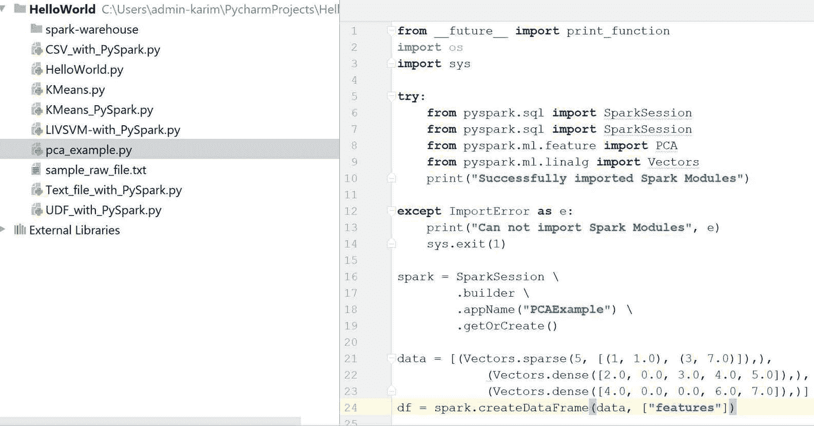

# 第十九章：PySpark 和 SparkR

在本章中，我们将讨论另外两种流行的 API：PySpark 和 SparkR，分别用于在 Python 和 R 编程语言中编写 Spark 代码。本章的第一部分将涉及使用 PySpark 时的一些技术细节。接着我们将讨论 SparkR，看看如何轻松地使用它。本章将讨论以下主题：

+   PySpark 简介

+   安装并开始使用 PySpark

+   与 DataFrame API 的交互

+   使用 PySpark 的 UDFs

+   使用 PySpark 进行数据分析

+   SparkR 简介

+   为什么选择 SparkR？

+   安装并开始使用 SparkR

+   数据处理与操作

+   使用 SparkR 处理 RDD 和 DataFrame

+   使用 SparkR 进行数据可视化

# PySpark 简介

Python 是最受欢迎的通用编程语言之一，具有多种用于数据处理和机器学习任务的激动人心的特性。为了在 Python 中使用 Spark，最初开发了 PySpark 作为 Python 到 Apache Spark 的轻量级前端，并利用 Spark 的分布式计算引擎。在本章中，我们将讨论在 Python IDE 中（如 PyCharm）使用 Spark 的一些技术细节。

许多数据科学家使用 Python，因为它拥有丰富的数值库，专注于统计、机器学习或优化。然而，在 Python 中处理大规模数据集通常很繁琐，因为其运行时是单线程的。因此，只能处理适合主内存的数据。考虑到这一限制，为了在 Python 中充分体验 Spark，PySpark 最初作为 Python 到 Apache Spark 的轻量级前端开发，并使用 Spark 的分布式计算引擎。这样，Spark 就能提供在非 JVM 语言（如 Python）中的 API。

本节 PySpark 的目的是提供使用 PySpark 的基本分布式算法。请注意，PySpark 是一个用于基本测试和调试的交互式命令行工具，不适用于生产环境。

# 安装与配置

在 Python IDE（如 PyCharm、Spider 等）中安装和配置 PySpark 有多种方式。或者，如果你已经安装了 Spark 并配置了`SPARK_HOME`，也可以使用 PySpark。第三，你还可以在 Python shell 中使用 PySpark。接下来我们将看到如何为运行独立作业配置 PySpark。

# 通过设置 SPARK_HOME

首先，下载并将 Spark 发行版放置在你偏好的位置，比如`/home/asif/Spark`。现在，让我们按如下方式设置`SPARK_HOME`：

```py
echo "export SPARK_HOME=/home/asif/Spark" >> ~/.bashrc

```

现在让我们按如下方式设置`PYTHONPATH`：

```py
echo "export PYTHONPATH=$SPARK_HOME/python/" >> ~/.bashrc
echo "export PYTHONPATH=$SPARK_HOME/python/lib/py4j-0.10.1-src.zip" >> ~/.bashrc

```

现在我们需要将以下两个路径添加到环境变量路径中：

```py
echo "export PATH=$PATH:$SPARK_HOME" >> ~/.bashrc
echo "export PATH=$PATH:$PYTHONPATH" >> ~/.bashrc

```

最后，让我们刷新当前的终端，以便使用新修改的`PATH`变量：

```py
source ~/.bashrc

```

PySpark 依赖于`py4j` Python 包。它帮助 Python 解释器动态访问来自 JVM 的 Spark 对象。可以通过以下方式在 Ubuntu 上安装该包：

```py
$ sudo pip install py4j

```

或者，也可以使用默认的 `py4j`，它已经包含在 Spark 中（`$SPARK_HOME/python/lib`）。

# 使用 Python Shell

与 Scala 交互式 Shell 类似，Python 也提供了一个交互式 Shell。你可以从 Spark 根目录文件夹执行 Python 代码，方法如下：

```py
$ cd $SPARK_HOME
$ ./bin/pyspark

```

如果命令执行成功，你应该在终端（Ubuntu）上看到以下屏幕：

**图 1**：开始使用 PySpark Shell

现在你可以通过 Python 交互式 Shell 使用 Spark。这种 Shell 对于实验和开发可能已经足够。但对于生产环境，你应该使用独立应用程序。

到现在，PySpark 应该已经在系统路径中。编写 Python 代码后，只需使用 Python 命令运行代码，它就会在本地 Spark 实例中使用默认配置运行：

```py
$ python <python_file.py>

```

请注意，目前的 Spark 发行版仅兼容 Python 2.7+。因此，我们在这一点上将严格遵守。

此外，如果你想在运行时传递配置值，最好使用 `spark-submit` 脚本。该命令与 Scala 的类似：

```py
$ cd $SPARK_HOME
$ ./bin/spark-submit  --master local[*] <python_file.py>

```

配置值可以在运行时传递，或者可以更改 `conf/spark-defaults.conf` 文件中的配置。配置 Spark 配置文件后，修改内容将在使用简单 Python 命令运行 PySpark 应用时反映出来。

然而，不幸的是，在撰写本文时，使用 PySpark 并没有 pip 安装的优势。但预计在 Spark 2.2.0 版本中会提供此功能（更多信息，请参见 [`issues.apache.org/jira/browse/SPARK-1267`](https://issues.apache.org/jira/browse/SPARK-1267)）。没有 pip 安装 PySpark 的原因可以在 JIRA 工单 [`issues.apache.org/jira/browse/SPARK-1267`](https://issues.apache.org/jira/browse/SPARK-1267) 中找到。

# 通过在 Python IDE 中设置 PySpark

我们还可以通过 Python IDE（如 PyCharm）来配置和运行 PySpark。在本节中，我们将展示如何操作。如果你是学生，可以在 [`www.jetbrains.com/student/`](https://www.jetbrains.com/student/) 使用你的大学/学院/机构电子邮件地址注册后免费获得 PyCharm 的授权版。此外，还有 PyCharm 的社区版（即免费的版本），因此你不必是学生也可以使用它。

最近，PySpark 已经通过 Spark 2.2.0 发布到了 PyPI（请参见 [`pypi.python.org/pypi/pyspark`](https://pypi.python.org/pypi/pyspark)）。这一变化是长期以来的期待（之前的版本发布了可以 pip 安装的组件，但由于种种原因无法发布到 PyPI）。所以，如果你（或你的朋友）希望能够在本地笔记本电脑上使用 PySpark，现有的安装路径更加简便，只需执行以下命令：

```py
$ sudo pip install pyspark # for python 2.7 
$ sudo pip3 install pyspark # for python 3.3+

```

然而，如果你使用的是 Windows 7、8 或 10，你需要手动安装 pyspark。例如，使用 PyCharm，你可以按照以下步骤操作：

**图 2：** 在 Windows 10 上的 Pycharm IDE 安装 PySpark

首先，您应创建一个 Python 脚本，并将项目解释器设置为 Python 2.7+。然后，您可以按如下方式导入 pyspark 和其他所需的模块：

```py
import os
import sys
import pyspark

```

如果您是 Windows 用户，Python 还需要安装 Hadoop 运行时；您应将 `winutils.exe` 文件放入 `SPARK_HOME/bin` 文件夹中。然后，创建一个环境变量，方式如下：

选择您的 Python 文件 | 运行 | 编辑配置 | 创建一个环境变量，键为 `HADOOP_HOME`，值为 `PYTHON_PATH`，例如在我的情况下，它是 `C:\Users\admin-karim\Downloads\spark-2.1.0-bin-hadoop2.7`。最后，按 OK 完成设置：

**图 3：** 在 Windows 10 上的 Pycharm IDE 设置 Hadoop 运行时环境

这些就是您需要的内容。现在，如果您开始编写 Spark 代码，首先应将导入语句放入 `try` 块中，如下所示（仅为示例）：

```py
try: 
    from pyspark.ml.featureimport PCA
    from pyspark.ml.linalgimport Vectors
    from pyspark.sqlimport SparkSession
    print ("Successfully imported Spark Modules")

```

`catch` 块可以按如下方式放置：

```py
ExceptImportErroras e: 
    print("Can not import Spark Modules", e)
    sys.exit(1)

```

请参阅以下图示，展示了在 PySpark shell 中导入并放置 Spark 包：

**图 4**：在 PySpark shell 中导入并放置 Spark 包

如果这些代码块成功执行，您应在控制台看到以下信息：

**图 5**：PySpark 包已成功导入

# 开始使用 PySpark

在深入之前，首先，我们需要了解如何创建 Spark 会话。可以通过以下方式完成：

```py
spark = SparkSession\
         .builder\
         .appName("PCAExample")\
         .getOrCreate()

```

现在，在这个代码块下，您应放置您的代码，例如：

```py
data = [(Vectors.sparse(5, [(1, 1.0), (3, 7.0)]),),
         (Vectors.dense([2.0, 0.0, 3.0, 4.0, 5.0]),),
         (Vectors.dense([4.0, 0.0, 0.0, 6.0, 7.0]),)]
 df = spark.createDataFrame(data, ["features"])

 pca = PCA(k=3, inputCol="features", outputCol="pcaFeatures")
 model = pca.fit(df)

 result = model.transform(df).select("pcaFeatures")
 result.show(truncate=False)

```

上述代码演示了如何在 RowMatrix 上计算主成分，并使用它们将向量投影到低维空间。为了更清楚地理解，请参阅以下代码，展示了如何在 PySpark 上使用 PCA 算法：

```py
import os
import sys

try:
from pyspark.sql import SparkSession
from pyspark.ml.feature import PCA
from pyspark.ml.linalg import Vectors
print ("Successfully imported Spark Modules")

except ImportErrorase:
print ("Can not import Spark Modules", e)
 sys.exit(1)

spark = SparkSession\
   .builder\
   .appName("PCAExample")\
   .getOrCreate()

data = [(Vectors.sparse(5, [(1, 1.0), (3, 7.0)]),),
    (Vectors.dense([2.0, 0.0, 3.0, 4.0, 5.0]),),
    (Vectors.dense([4.0, 0.0, 0.0, 6.0, 7.0]),)]
df = spark.createDataFrame(data, ["features"])

pca = PCA(k=3, inputCol="features", outputCol="pcaFeatures")
model = pca.fit(df)

result = model.transform(df).select("pcaFeatures")
result.show(truncate=False)

spark.stop()

```

输出结果如下：

**图 6**：Python 脚本成功执行后的 PCA 结果

# 使用 DataFrame 和 RDD

SparkDataFrame 是一个分布式的按列命名的行集合。更简单地说，它可以看作是一个关系数据库中的表，具有列标题。此外，PySpark DataFrame 类似于 Python 的 pandas。但它也与 RDD 共享一些共同特性：

+   **不可变：** 就像 RDD 一样，一旦创建了 DataFrame，它就不能被更改。我们可以在应用转换后将 DataFrame 转换为 RDD，反之亦然。

+   **延迟评估：** 它的特点是延迟评估。换句话说，任务不会执行，直到执行某个操作时才会触发。

+   **分布式：** RDD 和 DataFrame 都具有分布式特性。

就像 Java/Scala 的 DataFrame 一样，PySpark DataFrame 设计用于处理大量结构化数据；您甚至可以处理 PB 级别的数据。表格结构帮助我们理解 DataFrame 的模式，这也有助于优化 SQL 查询的执行计划。此外，它支持广泛的数据格式和数据源。

您可以通过多种方式使用 PySpark 创建 RDD、数据集和 DataFrame。在接下来的子部分中，我们将展示一些示例。

# 读取 LIBSVM 格式的数据集

让我们看看如何使用读取 API 和`load()`方法通过指定数据的格式（即`libsvm`）来读取 LIBSVM 格式的数据，方法如下：

```py
# Creating DataFrame from libsvm dataset
 myDF = spark.read.format("libsvm").load("C:/Exp//mnist.bz2")

```

上述 MNIST 数据集可以从[`www.csie.ntu.edu.tw/~cjlin/libsvmtools/datasets/multiclass/mnist.bz2`](https://www.csie.ntu.edu.tw/~cjlin/libsvmtools/datasets/multiclass/mnist.bz2)下载。这将返回一个 DataFrame，并且可以通过调用`show()`方法查看内容，方法如下：

```py
myDF.show() 

```

输出结果如下：

**图 7**：LIBSVM 格式的手写数据集快照

您还可以指定其他选项，例如想要为 DataFrame 提供多少原始数据集特征，方法如下：

```py
myDF= spark.read.format("libsvm")
           .option("numFeatures", "780")
           .load("data/Letterdata_libsvm.data")

```

现在，如果您想从相同的数据集中创建一个 RDD，可以使用`pyspark.mllib.util`中的 MLUtils API，方法如下：

```py
*Creating RDD from the libsvm data file* myRDD = MLUtils.loadLibSVMFile(spark.sparkContext, "data/Letterdata_libsvm.data")

```

现在，您可以按照如下方式将 RDD 保存在您喜欢的位置：

```py
myRDD.saveAsTextFile("data/myRDD")

```

# 读取 CSV 文件

让我们从加载、解析和查看简单的航班数据开始。首先，下载纽约市航班数据集的 CSV 文件，链接地址为：[`s3-us-west-2.amazonaws.com/sparkr-data/nycflights13.csv`](https://s3-us-west-2.amazonaws.com/sparkr-data/nycflights13.csv)。现在，让我们使用 PySpark 的`read.csv()` API 来加载和解析数据集：

```py
# Creating DataFrame from data file in CSV formatdf = spark.read.format("com.databricks.spark.csv")
          .option("header", "true")
          .load("data/nycflights13.csv")

```

这与读取 libsvm 格式非常相似。现在您可以看到生成的 DataFrame 的结构，如下所示：

```py
df.printSchema() 

```

输出结果如下：

**图 8**：纽约市航班数据集的架构

现在，让我们使用`show()`方法查看数据集的快照，方法如下：

```py
df.show() 

```

现在，让我们查看数据的样本，方法如下：

**图 9**：纽约市航班数据集的样本

# 读取并操作原始文本文件

您可以使用`textFile()`方法读取原始文本数据文件。假设您有一些购买记录的日志：

```py
number\tproduct_name\ttransaction_id\twebsite\tprice\tdate0\tjeans\t30160906182001\tebay.com\t100\t12-02-20161\tcamera\t70151231120504\tamazon.com\t450\t09-08-20172\tlaptop\t90151231120504\tebay.ie\t1500\t07--5-20163\tbook\t80151231120506\tpackt.com\t45\t03-12-20164\tdrone\t8876531120508\talibaba.com\t120\t01-05-2017

```

现在，使用`textFile()`方法读取和创建 RDD 变得非常简单，方法如下：

```py
myRDD = spark.sparkContext.textFile("sample_raw_file.txt")
$cd myRDD
$ cat part-00000  
number\tproduct_name\ttransaction_id\twebsite\tprice\tdate  0\tjeans\t30160906182001\tebay.com\t100\t12-02-20161\tcamera\t70151231120504\tamazon.com\t450\t09-08-2017

```

如您所见，结构并不容易阅读。所以我们可以考虑通过将文本转换为 DataFrame 来提供更好的结构。首先，我们需要收集头信息，方法如下：

```py
header = myRDD.first() 

```

现在，过滤掉头信息，确保其余部分看起来正确，方法如下：

```py
textRDD = myRDD.filter(lambda line: line != header)
newRDD = textRDD.map(lambda k: k.split("\\t"))

```

我们仍然有 RDD，但是数据的结构略有改进。不过，将其转换为 DataFrame 将提供更好的事务数据视图。

以下代码通过指定`header.split`来创建一个 DataFrame，这个操作提供了列的名称：

```py
 textDF = newRDD.toDF(header.split("\\t"))
 textDF.show()

```

输出结果如下：

**图 10**：事务数据样本

现在，您可以将这个 DataFrame 保存为视图，并进行 SQL 查询。现在让我们使用这个 DataFrame 做一个查询：

```py
textDF.createOrReplaceTempView("transactions")
spark.sql("SELECT *** FROM transactions").show()
spark.sql("SELECT product_name, price FROM transactions WHERE price >=500 ").show()
spark.sql("SELECT product_name, price FROM transactions ORDER BY price DESC").show()

```

输出结果如下：

**图 11**：使用 Spark SQL 对事务数据的查询结果

# 在 PySpark 中编写 UDF

像 Scala 和 Java 一样，你也可以在 PySpark 中使用**用户定义函数**（即**UDF**）。让我们通过以下示例来看一下。假设我们想根据一些已经在大学上过课程的学生的分数来查看成绩分布。

我们可以将它们存储在两个独立的数组中，如下所示：

```py
# Let's generate somerandom lists
 students = ['Jason', 'John', 'Geroge', 'David']
 courses = ['Math', 'Science', 'Geography', 'History', 'IT', 'Statistics']

```

现在让我们声明一个空数组来存储关于课程和学生的数据，以便稍后将它们添加到该数组中，如下所示：

```py
rawData = []
for (student, course) in itertools.product(students, courses):
    rawData.append((student, course, random.randint(0, 200)))

```

请注意，要使前面的代码正常工作，请在文件开头导入以下内容：

```py
import itertools
import random

```

现在让我们从这两个对象创建一个 DataFrame，用于根据每个分数转换相应的成绩。为此，我们需要定义一个显式的模式。假设在你计划的 DataFrame 中，会有三列，分别命名为`Student`、`Course`和`Score`。

首先，让我们导入必要的模块：

```py
from pyspark.sql.types
import StructType, StructField, IntegerType, StringType

```

现在可以按如下方式定义模式：

```py
schema = StructType([StructField("Student", StringType(), nullable=False),
                     StructField("Course", StringType(), nullable=False),
                     StructField("Score", IntegerType(), nullable=False)])

```

现在让我们从原始数据中创建一个 RDD，如下所示：

```py
courseRDD = spark.sparkContext.parallelize(rawData)

```

现在让我们将 RDD 转换为 DataFrame，如下所示：

```py
courseDF = spark.createDataFrame(courseRDD, schema) 
coursedDF.show() 

```

输出如下所示：

**图 12**：学生在科目中的随机生成分数示例

好的，现在我们有了三列。然而，我们需要将分数转换为等级。假设你有如下的评分标准：

+   *90~100 => A*

+   *80~89 => B*

+   *60~79 => C*

+   *0~59 => D*

为此，我们可以创建自己的 UDF， 将数字分数转换为成绩。这可以通过多种方式完成。以下是一个实现示例：

```py
# Define udfdef scoreToCategory(grade):
 if grade >= 90:
 return 'A'
 elif grade >= 80:
 return 'B'
 elif grade >= 60:
 return 'C'
 else:
 return 'D'

```

现在我们可以创建自己的 UDF，如下所示：

```py
from pyspark.sql.functions
import udf
udfScoreToCategory = udf(scoreToCategory, StringType())

```

`udf()`方法中的第二个参数是方法的返回类型（即`scoreToCategory`）。现在你可以非常简单地调用这个 UDF 来将分数转换为成绩。让我们来看一下它的示例：

```py
courseDF.withColumn("Grade", udfScoreToCategory("Score")).show(100)

```

前面的这一行将接受所有条目的分数作为输入，并将分数转换为等级。此外，还将添加一个名为`Grade`的新 DataFrame 列。

输出如下所示：

**图 13**：分配的成绩

现在我们也可以使用 SQL 语句来使用 UDF。然而，为此我们需要按照以下方式注册这个 UDF：

```py
spark.udf.register("udfScoreToCategory", scoreToCategory, StringType()) 

```

前面这一行默认会将 UDF 注册为数据库中的临时函数。现在我们需要创建一个团队视图以便执行 SQL 查询：

```py
courseDF.createOrReplaceTempView("score")

```

现在让我们在视图`score`上执行 SQL 查询，如下所示：

```py
spark.sql("SELECT Student, Score, udfScoreToCategory(Score) as Grade FROM score").show() 

```

输出如下所示：

**图 14**：查询学生分数和对应的成绩

该示例的完整源代码如下：

```py
import os
import sys
import itertools
import random

from pyspark.sql import SparkSession
from pyspark.sql.types import StructType, StructField, IntegerType, StringType
from pyspark.sql.functions import udf

spark = SparkSession \
        .builder \
        .appName("PCAExample") \
        .getOrCreate()

# Generate Random RDD
students = ['Jason', 'John', 'Geroge', 'David']
courses = ['Math', 'Science', 'Geography', 'History', 'IT', 'Statistics']
rawData = []
for (student, course) in itertools.product(students, courses):
    rawData.append((student, course, random.randint(0, 200)))

# Create Schema Object
schema = StructType([
    StructField("Student", StringType(), nullable=False),
    StructField("Course", StringType(), nullable=False),
    StructField("Score", IntegerType(), nullable=False)
])

courseRDD = spark.sparkContext.parallelize(rawData)
courseDF = spark.createDataFrame(courseRDD, schema)
courseDF.show()

# Define udf
def scoreToCategory(grade):
    if grade >= 90:
        return 'A'
    elif grade >= 80:
        return 'B'
    elif grade >= 60:
        return 'C'
    else:
        return 'D'

udfScoreToCategory = udf(scoreToCategory, StringType())
courseDF.withColumn("Grade", udfScoreToCategory("Score")).show(100)

spark.udf.register("udfScoreToCategory", scoreToCategory, StringType())
courseDF.createOrReplaceTempView("score")
spark.sql("SELECT Student, Score, udfScoreToCategory(Score) as Grade FROM score").show()

spark.stop()

```

有关使用 UDF 的更详细讨论，请访问[`jaceklaskowski.gitbooks.io/mastering-apache-spark/content/spark-sql-udfs.html.`](https://jaceklaskowski.gitbooks.io/mastering-apache-spark/content/spark-sql-udfs.html)

现在让我们在 PySpark 上进行一些分析任务。在接下来的部分，我们将展示一个使用 PySpark 进行聚类任务的 k-means 算法示例。

# 让我们使用 k-means 聚类进行一些分析

异常数据是指与正常分布不同的数据。因此，检测异常是网络安全中的一个重要任务，异常数据包或请求可以标记为错误或潜在攻击。

在这个示例中，我们将使用 KDD-99 数据集（可以在这里下载：[`kdd.ics.uci.edu/databases/kddcup99/kddcup99.html`](http://kdd.ics.uci.edu/databases/kddcup99/kddcup99.html)）。根据数据点的某些标准，许多列将被过滤掉。这将帮助我们理解示例。其次，对于无监督任务，我们将不得不移除标注的数据。让我们将数据集作为简单文本加载和解析。然后，看看数据集有多少行：

```py
INPUT = "C:/Users/rezkar/Downloads/kddcup.data" spark = SparkSession\
         .builder\
         .appName("PCAExample")\
         .getOrCreate()

 kddcup_data = spark.sparkContext.textFile(INPUT)

```

这本质上返回一个 RDD。让我们使用`count()`方法查看数据集中有多少行，如下所示：

```py
count = kddcup_data.count()
print(count)>>4898431

```

因此，数据集非常庞大，包含许多特征。由于我们已经将数据集解析为简单文本，所以不应期望看到数据集的更好结构。因此，让我们朝着将 RDD 转换为 DataFrame 的方向进行：

```py
kdd = kddcup_data.map(lambda l: l.split(","))
from pyspark.sql import SQLContext
sqlContext = SQLContext(spark)
df = sqlContext.createDataFrame(kdd)

```

然后，让我们查看 DataFrame 中的一些选定列，如下所示：

```py
df.select("_1", "_2", "_3", "_4", "_42").show(5)

```

输出如下：

**图 15**：KKD 杯 99 数据集样本

因此，这个数据集已经标注过了。这意味着恶意网络行为的类型已经被分配到一行，其中标签位于最后一列（即`_42`）。数据框架的前五行被标注为正常。这意味着这些数据点是正常的。现在，我们需要为整个数据集中的每种标签类型确定标签的计数：

```py
#Identifying the labels for unsupervised tasklabels = kddcup_data.map(lambda line: line.strip().split(",")[-1])
from time import time
start_label_count = time()
label_counts = labels.countByValue()
label_count_time = time()-start_label_count

from collections import OrderedDict
sorted_labels = OrderedDict(sorted(label_counts.items(), key=lambda t: t[1], reverse=True))
for label, count in sorted_labels.items():
 print label, count

```

输出如下：

**图 16**：KDD 杯数据集中的可用标签（攻击类型）

我们可以看到有 23 个不同的标签（数据对象的行为）。大多数数据点属于 Smurf。这是一种异常行为，也称为 DoS 数据包洪水。Neptune 是第二大异常行为。*正常*事件是数据集中第三大出现类型。然而，在一个真实的网络数据集中，你不会看到任何这样的标签。

此外，正常流量将远高于任何异常流量。因此，从大规模无标签数据中识别异常攻击或异常将是繁琐的。为了简化起见，我们忽略最后一列（即标签），假设这个数据集也是没有标签的。在这种情况下，唯一的异常检测概念化方式是使用无监督学习算法，如 k-means 聚类。

现在，让我们朝着对数据点进行聚类的方向努力。关于 K-means 的一个重要事项是，它只接受数值型数据进行建模。然而，我们的数据集还包含一些类别特征。现在，我们可以根据这些特征是否是*TCP*，为类别特征分配 1 或 0 的二进制值。这样可以通过以下方式完成：

```py
from numpy import array
def parse_interaction(line):
     line_split = line.split(",")
     clean_line_split = [line_split[0]]+line_split[4:-1]
     return (line_split[-1], array([float(x) for x in clean_line_split]))

 parsed_data = kddcup_data.map(parse_interaction)
 pd_values = parsed_data.values().cache()

```

因此，我们的数据集几乎准备好了。现在我们可以准备训练集和测试集，轻松地训练 k-means 模型：

```py
 kdd_train = pd_values.sample(False, .75, 12345)
 kdd_test = pd_values.sample(False, .25, 12345)
 print("Training set feature count: " + str(kdd_train.count()))
 print("Test set feature count: " + str(kdd_test.count()))

```

输出如下：

```py
Training set feature count: 3674823 Test set feature count: 1225499

```

然而，由于我们将一些分类特征转换为数值特征，因此还需要进行标准化。标准化可以提高优化过程中的收敛速度，并且可以防止具有非常大方差的特征在模型训练过程中产生影响。

现在我们将使用 StandardScaler，它是一个特征转换器。它通过将特征缩放到单位方差来帮助我们标准化特征。然后，它通过使用训练集样本中的列汇总统计量将均值设置为零：

```py
standardizer = StandardScaler(True, True) 

```

现在让我们通过拟合前面的转换器来计算汇总统计数据，如下所示：

```py
standardizer_model = standardizer.fit(kdd_train) 

```

现在的问题是，我们用于训练 k-means 的数据没有正态分布。因此，我们需要将训练集中的每个特征进行标准化，使其具有单位标准差。为实现这一点，我们需要进一步转换前面的标准化器模型，如下所示：

```py
data_for_cluster = standardizer_model.transform(kdd_train) 

```

干得好！现在训练集终于准备好训练 k-means 模型了。正如我们在聚类章节中讨论的，聚类算法中最棘手的事情是通过设置 K 值来找到最优的簇数，使得数据对象能够自动聚类。

一种天真的方法是将 `K=2`，观察结果并进行尝试，直到得到最优值。然而，更好的方法是肘部法则，我们可以不断增加 `K` 的值，并计算**簇内平方误差和**（**WSSSE**）作为聚类成本。简而言之，我们将寻找能够最小化 WSSSE 的最佳 `K` 值。每当观察到急剧下降时，我们就能确定 `K` 的最优值：

```py
import numpy
our_k = numpy.arange(10, 31, 10)
metrics = []
def computeError(point):
 center = clusters.centers[clusters.predict(point)]
 denseCenter = DenseVector(numpy.ndarray.tolist(center))
return sqrt(sum([x**2 for x in (DenseVector(point.toArray()) - denseCenter)]))
for k in our_k:
      clusters = KMeans.train(data_for_cluster, k, maxIterations=4, initializationMode="random")
      WSSSE = data_for_cluster.map(lambda point: computeError(point)).reduce(lambda x, y: x + y)
      results = (k, WSSSE)
 metrics.append(results)
print(metrics)

```

输出如下：

```py
[(10, 3364364.5203123973), (20, 3047748.5040717563), (30, 2503185.5418753517)]

```

在这种情况下，30 是 k 的最佳值。让我们查看当我们有 30 个簇时每个数据点的聚类分配。下一个测试将会是运行 `k` 值为 30、35 和 40 的情况。三个 k 值并不是单次运行中测试的最大值，而是用于这个示例：

```py
modelk30 = KMeans.train(data_for_cluster, 30, maxIterations=4, initializationMode="random")
 cluster_membership = data_for_cluster.map(lambda x: modelk30.predict(x))
 cluster_idx = cluster_membership.zipWithIndex()
 cluster_idx.take(20)
 print("Final centers: " + str(modelk30.clusterCenters))

```

输出如下：

**图 17**：每种攻击类型的最终聚类中心（简化版）

现在让我们计算并打印出整体聚类的总成本，如下所示：

```py
print("Total Cost: " + str(modelk30.computeCost(data_for_cluster)))

```

输出如下：

```py
Total Cost: 68313502.459

```

最后，我们可以计算并打印出我们的 k-means 模型的 WSSSE，如下所示：

```py
WSSSE = data_for_cluster.map(lambda point: computeError
(point)).reduce(lambda x, y: x + y)
 print("WSSSE: " + str(WSSSE))

```

输出如下：

```py
WSSSE: 2503185.54188

```

你的结果可能会有所不同。这是因为当我们首次开始聚类算法时，质心的位置是随机的。多次执行这个过程可以让你观察数据点在变化它们的 k 值时是如何变化的，或者保持不变。该解决方案的完整源代码如下：

```py
import os
import sys
import numpy as np
from collections import OrderedDict

try:
    from collections import OrderedDict
    from numpy import array
    from math import sqrt
    import numpy
    import urllib
    import pyspark
    from pyspark.sql import SparkSession
    from pyspark.mllib.feature import StandardScaler
    from pyspark.mllib.clustering import KMeans, KMeansModel
    from pyspark.mllib.linalg import DenseVector
    from pyspark.mllib.linalg import SparseVector
    from collections import OrderedDict
    from time import time
    from pyspark.sql.types import *
    from pyspark.sql import DataFrame
    from pyspark.sql import SQLContext
    from pyspark.sql import Row
    print("Successfully imported Spark Modules")

except ImportError as e:
    print ("Can not import Spark Modules", e)
    sys.exit(1)

spark = SparkSession\
        .builder\
        .appName("PCAExample")\
        .getOrCreate()

INPUT = "C:/Exp/kddcup.data.corrected"
kddcup_data = spark.sparkContext.textFile(INPUT)
count = kddcup_data.count()
print(count)
kddcup_data.take(5)
kdd = kddcup_data.map(lambda l: l.split(","))
sqlContext = SQLContext(spark)
df = sqlContext.createDataFrame(kdd)
df.select("_1", "_2", "_3", "_4", "_42").show(5)

#Identifying the leabels for unsupervised task
labels = kddcup_data.map(lambda line: line.strip().split(",")[-1])
start_label_count = time()
label_counts = labels.countByValue()
label_count_time = time()-start_label_count

sorted_labels = OrderedDict(sorted(label_counts.items(), key=lambda t: t[1], reverse=True))
for label, count in sorted_labels.items():
    print(label, count)

def parse_interaction(line):
    line_split = line.split(",")
    clean_line_split = [line_split[0]]+line_split[4:-1]
    return (line_split[-1], array([float(x) for x in clean_line_split]))

parsed_data = kddcup_data.map(parse_interaction)
pd_values = parsed_data.values().cache()

kdd_train = pd_values.sample(False, .75, 12345)
kdd_test = pd_values.sample(False, .25, 12345)
print("Training set feature count: " + str(kdd_train.count()))
print("Test set feature count: " + str(kdd_test.count()))

standardizer = StandardScaler(True, True)
standardizer_model = standardizer.fit(kdd_train)
data_for_cluster = standardizer_model.transform(kdd_train)

initializationMode="random"

our_k = numpy.arange(10, 31, 10)
metrics = []

def computeError(point):
    center = clusters.centers[clusters.predict(point)]
    denseCenter = DenseVector(numpy.ndarray.tolist(center))
    return sqrt(sum([x**2 for x in (DenseVector(point.toArray()) - denseCenter)]))

for k in our_k:
     clusters = KMeans.train(data_for_cluster, k, maxIterations=4, initializationMode="random")
     WSSSE = data_for_cluster.map(lambda point: computeError(point)).reduce(lambda x, y: x + y)
     results = (k, WSSSE)
     metrics.append(results)
print(metrics)

modelk30 = KMeans.train(data_for_cluster, 30, maxIterations=4, initializationMode="random")
cluster_membership = data_for_cluster.map(lambda x: modelk30.predict(x))
cluster_idx = cluster_membership.zipWithIndex()
cluster_idx.take(20)
print("Final centers: " + str(modelk30.clusterCenters))
print("Total Cost: " + str(modelk30.computeCost(data_for_cluster)))
WSSSE = data_for_cluster.map(lambda point: computeError(point)).reduce(lambda x, y: x + y)
print("WSSSE" + str(WSSSE))

```

关于此主题的更全面讨论可以参见 [`github.com/jadianes/kdd-cup-99-spark`](https://github.com/jadianes/kdd-cup-99-spark)。此外，感兴趣的读者还可以参考 PySpark API 的最新官方文档：[`spark.apache.org/docs/latest/api/python/`](http://spark.apache.org/docs/latest/api/python/)。

好的，现在是时候了解 SparkR 了，它是另一个与人口统计编程语言 R 配合使用的 Spark API。

# SparkR 介绍

R 是最流行的统计编程语言之一，具有许多令人兴奋的功能，支持统计计算、数据处理和机器学习任务。然而，在 R 中处理大规模数据集通常是繁琐的，因为其运行时是单线程的。因此，只有适合机器内存的数据集才能被处理。考虑到这一限制，并为了充分发挥 Spark 在 R 中的优势，SparkR 最初在 AMPLab 开发，作为 R 到 Apache Spark 的轻量级前端，并使用 Spark 的分布式计算引擎。

这样，它使得 R 程序员能够通过 RStudio 从 R shell 使用 Spark 进行大规模数据分析。在 Spark 2.1.0 中，SparkR 提供了一个支持选择、过滤和聚合等操作的分布式数据框架实现。这与 R 中的数据框架（如 `dplyr`）有些相似，但可以扩展到大规模数据集。

# 为什么选择 SparkR？

你也可以使用 SparkR 编写 Spark 代码，支持使用 MLlib 进行分布式机器学习。总之，SparkR 继承了与 Spark 紧密集成的诸多优势，包括以下几点：

+   **支持各种数据源 API：** SparkR 可用于从多种数据源读取数据，包括 Hive 表、JSON 文件、关系数据库（RDBMS）和 Parquet 文件。

+   **DataFrame 优化：** SparkR DataFrame 还继承了计算引擎中在代码生成、内存管理等方面所做的所有优化。从下图可以看出，Spark 的优化引擎使得 SparkR 能与 Scala 和 Python 相媲美：

**图 18：** SparkR DataFrame 与 Scala/Python DataFrame 对比

+   **可扩展性：** 在 SparkR DataFrame 上执行的操作会自动分布到 Spark 集群中所有可用的核心和机器上。因此，SparkR DataFrame 可用于处理数 TB 的数据，并且可以在具有成千上万台机器的集群上运行。

# 安装和开始使用

使用 SparkR 的最佳方式是通过 RStudio。你的 R 程序可以通过 RStudio 使用 R shell、Rescript 或其他 R IDE 连接到 Spark 集群。

**选项 1.** 在环境中设置`SPARK_HOME`（您可以查看[`stat.ethz.ch/R-manual/R-devel/library/base/html/Sys.getenv.html`](https://stat.ethz.ch/R-manual/R-devel/library/base/html/Sys.getenv.html)），加载 SparkR 包，并调用`sparkR.session`如下所示。它将检查 Spark 安装情况，如果未找到，将自动下载和缓存：

```py
if (nchar(Sys.getenv("SPARK_HOME")) < 1) { 
Sys.setenv(SPARK_HOME = "/home/spark") 
} 
library(SparkR, lib.loc = c(file.path(Sys.getenv("SPARK_HOME"), "R", "lib"))) 

```

**选项 2.** 您还可以在 RStudio 上手动配置 SparkR。为此，请在 RStudio 上创建一个 R 脚本并执行以下 R 代码：

```py
SPARK_HOME = "spark-2.1.0-bin-hadoop2.7/R/lib" 
HADOOP_HOME= "spark-2.1.0-bin-hadoop2.7/bin" 
Sys.setenv(SPARK_MEM = "2g") 
Sys.setenv(SPARK_HOME = "spark-2.1.0-bin-hadoop2.7") 
.libPaths(c(file.path(Sys.getenv("SPARK_HOME"), "R", "lib"), .libPaths())) 

```

现在如下加载 SparkR 库：

```py
library(SparkR, lib.loc = SPARK_HOME)

```

现在，像 Scala/Java/PySpark 一样，您的 SparkR 程序的入口点是通过调用`sparkR.session`创建的 SparkR 会话，如下所示：

```py
sparkR.session(appName = "Hello, Spark!", master = "local[*]")

```

此外，如果需要，还可以指定某些 Spark 驱动程序属性。通常，这些应用程序属性和运行时环境无法以编程方式设置，因为驱动程序 JVM 进程已启动；在这种情况下，SparkR 会为您处理。要设置它们，请将它们传递给`sparkR.session()`中的`sparkConfig`参数，如下所示：

```py
sparkR.session(master = "local[*]", sparkConfig = list(spark.driver.memory = "2g")) 

```

此外，还可以在 RStudio 上使用`sparkR.session`设置以下 Spark 驱动程序属性：

**图 19**：可以使用`sparkR.session`从 RStudio 设置 Spark 驱动程序属性的`sparkConfig`

# 入门

让我们从加载、解析和查看简单的航班数据开始。首先，从[`s3-us-west-2.amazonaws.com/sparkr-data/nycflights13.csv`](https://s3-us-west-2.amazonaws.com/sparkr-data/nycflights13.csv)下载 NY 航班数据集作为 CSV 文件。现在让我们使用 R 的`read.csv()` API 加载和解析数据集：

```py
#Creating R data frame
dataPath<- "C:/Exp/nycflights13.csv"
df<- read.csv(file = dataPath, header = T, sep =",")

```

现在让我们使用 R 的`View()`方法查看数据集的结构如下：

```py
View(df)

```

**图 20**：NYC 航班数据集的快照

现在让我们从 R DataFrame 创建 Spark DataFrame 如下：

```py
##Converting Spark DataFrame 
 flightDF<- as.DataFrame(df)

```

让我们通过探索 DataFrame 的模式来查看其结构：

```py
printSchema(flightDF)

```

输出如下：

**图 21**：NYC 航班数据集的模式

现在让我们看看 DataFrame 的前 10 行：

```py
showDF(flightDF, numRows = 10)

```

输出如下：

**图 22**：NYC 航班数据集的前 10 行

因此，您可以看到相同的结构。但是，这不具有可扩展性，因为我们使用标准的 R API 加载了 CSV 文件。为了使其更快速和可扩展，就像在 Scala 中一样，我们可以使用外部数据源 API。

# 使用外部数据源 API

正如前面提到的，我们也可以使用外部数据源 API 创建 DataFrame。对于以下示例，我们使用`com.databricks.spark.csv` API 如下：

```py
flightDF<- read.df(dataPath,  
header='true',  
source = "com.databricks.spark.csv",  
inferSchema='true') 

```

让我们通过探索 DataFrame 的模式来查看其结构：

```py
printSchema(flightDF)

```

输出如下：

**图 23**：使用外部数据源 API 的 NYC 航班数据集相同的模式

现在让我们看看 DataFrame 的前 10 行：

```py
showDF(flightDF, numRows = 10)

```

输出如下：

**图 24**：使用外部数据源 API 的纽约市航班数据集中的相同样本数据

如此，你可以看到相同的结构。做得好！现在是时候探索更多内容了，比如使用 SparkR 进行数据处理。

# 数据处理

显示 SparkDataFrame 中的列名，如下所示：

```py
columns(flightDF)
[1] "year" "month" "day" "dep_time" "dep_delay" "arr_time" "arr_delay" "carrier" "tailnum" "flight" "origin" "dest" 
[13] "air_time" "distance" "hour" "minute" 

```

显示 SparkDataFrame 中的行数，如下所示：

```py
count(flightDF)
[1] 336776

```

过滤出目的地仅为迈阿密的航班数据，并显示前六条记录，如下所示：

```py
 showDF(flightDF[flightDF$dest == "MIA", ], numRows = 10)

```

输出如下：

**图 25**：仅目的地为迈阿密的航班

选择特定的列。例如，让我们选择所有前往爱荷华州的延误航班，并包括起点机场名称：

```py
delay_destination_DF<- select(flightDF, "flight", "dep_delay", "origin", "dest") 
 delay_IAH_DF<- filter(delay_destination_DF, delay_destination_DF$dest == "IAH") showDF(delay_IAH_DF, numRows = 10)

```

输出如下：

**图 26**：所有前往爱荷华州的延误航班

我们甚至可以用它来链接数据框操作。举个例子，首先按日期分组航班，然后找出每日的平均延误时间。最后，将结果写入 SparkDataFrame，如下所示：

```py
install.packages(c("magrittr")) 
library(magrittr) 
groupBy(flightDF, flightDF$day) %>% summarize(avg(flightDF$dep_delay), avg(flightDF$arr_delay)) ->dailyDelayDF 

```

现在打印计算后的 DataFrame：

```py
head(dailyDelayDF)

```

输出如下：

**图 27**：按日期分组航班，然后计算每日平均延误时间

让我们看一个聚合所有目标机场的平均到达延误时间的例子：

```py
avg_arr_delay<- collect(select(flightDF, avg(flightDF$arr_delay))) 
 head(avg_arr_delay)
avg(arr_delay)
 1 6.895377

```

甚至可以执行更复杂的聚合操作。例如，以下代码聚合了每个目标机场的平均、最大和最小延误时间。它还显示了在这些机场降落的航班数量：

```py
flight_avg_arrival_delay_by_destination<- collect(agg( 
 groupBy(flightDF, "dest"), 
 NUM_FLIGHTS=n(flightDF$dest), 
 AVG_DELAY = avg(flightDF$arr_delay), 
 MAX_DELAY=max(flightDF$arr_delay), 
 MIN_DELAY=min(flightDF$arr_delay) 
 ))
head(flight_avg_arrival_delay_by_destination)

```

输出如下：

**图 28**：每个目标机场的最大和最小延误

# 查询 SparkR DataFrame

类似于 Scala，我们可以对已保存为 `TempView` 的 DataFrame 执行 SQL 查询，方法是使用 `createOrReplaceTempView()`。让我们看一个例子。首先，我们将航班 DataFrame（即 `flightDF`）保存如下：

```py
# First, register the flights SparkDataFrame as a table
createOrReplaceTempView(flightDF, "flight")

```

现在让我们选择所有航班的目的地及其关联的航空公司信息，如下所示：

```py
destDF<- sql("SELECT dest, origin, carrier FROM flight") 
 showDF(destDF, numRows=10)

```

输出如下：

**图 29**：所有航班及其关联的航空公司信息

现在让我们让 SQL 查询变得更加复杂，比如查找所有至少延误 120 分钟的航班的目标机场，如下所示：

```py
selected_flight_SQL<- sql("SELECT dest, origin, arr_delay FROM flight WHERE arr_delay>= 120")
showDF(selected_flight_SQL, numRows = 10)

```

上述代码片段查询并显示了所有至少延误 2 小时的航班的机场名称：

**图 30**：所有至少延误 2 小时的航班的目的地机场

现在让我们进行一个更复杂的查询。让我们找出所有前往爱荷华州且至少延误 2 小时的航班的起点。最后，按到达延误时间对它们进行排序，并将结果限制为最多 20 条，如下所示：

```py
selected_flight_SQL_complex<- sql("SELECT origin, dest, arr_delay FROM flight WHERE dest='IAH' AND arr_delay>= 120 ORDER BY arr_delay DESC LIMIT 20")
showDF(selected_flight_SQL_complex, numRows=20)

```

上述代码片段查询并显示了所有至少延误 2 小时前往爱荷华州的航班的机场名称：

**图 31**：所有前往爱荷华州且至少延误 2 小时的航班的起点

# 在 RStudio 中可视化数据

在前一节中，我们已经了解了如何加载、解析、操作和查询 DataFrame。现在，如果我们能够展示数据以便更好地观察效果，那就太好了。例如，如何处理航空公司承运人数据？我的意思是，我们能否从图表中找到最常见的承运人？让我们尝试一下 `ggplot2`。首先，加载该库：

```py
library(ggplot2) 

```

现在我们已经拥有了 SparkDataFrame。如果我们直接尝试在 `ggplot2` 中使用我们的 SparkSQL DataFrame 类，会怎样呢？

```py
my_plot<- ggplot(data=flightDF, aes(x=factor(carrier)))
>>
ERROR: ggplot2 doesn't know how to deal with data of class SparkDataFrame.

```

显然，这样不行，因为 `ggplot2` 函数不知道如何处理这些分布式数据框（即 Spark 数据）。相反，我们需要将数据收集到本地，并将其转换回传统的 R 数据框，如下所示：

```py
flight_local_df<- collect(select(flightDF,"carrier"))

```

现在让我们使用 `str()` 方法查看我们得到的结果，如下所示：

```py
str(flight_local_df)

```

输出结果如下：

```py
'data.frame':  336776 obs. of 1 variable: $ carrier: chr "UA" "UA" "AA" "B6" ...

```

这很好，因为当我们从 SparkSQL DataFrame 中收集结果时，我们会得到一个常规的 R `data.frame`。这也非常方便，因为我们可以根据需要进行操作。现在我们准备好创建 `ggplot2` 对象，如下所示：

```py
my_plot<- ggplot(data=flight_local_df, aes(x=factor(carrier)))

```

最后，让我们将图表适当地展示为条形图，如下所示：

```py
my_plot + geom_bar() + xlab("Carrier")

```

输出结果如下：

**图 32**：最常见的承运人是 UA、B6、EV 和 DL

从图表中可以看出，最常见的承运人是 UA、B6、EV 和 DL。从 R 代码的以下一行中可以看得更清楚：

```py
carrierDF = sql("SELECT carrier, COUNT(*) as cnt FROM flight GROUP BY carrier ORDER BY cnt DESC")
showDF(carrierDF)

```

输出结果如下：

**图 33：** 最常见的承运人是 UA、B6、EV 和 DL

以下是前述分析的完整源代码，帮助理解代码的流程：

```py
#Configure SparkR
SPARK_HOME = "C:/Users/rezkar/Downloads/spark-2.1.0-bin-hadoop2.7/R/lib"
HADOOP_HOME= "C:/Users/rezkar/Downloads/spark-2.1.0-bin-hadoop2.7/bin"
Sys.setenv(SPARK_MEM = "2g")
Sys.setenv(SPARK_HOME = "C:/Users/rezkar/Downloads/spark-2.1.0-bin-hadoop2.7")
.libPaths(c(file.path(Sys.getenv("SPARK_HOME"), "R", "lib"), .libPaths()))

#Load SparkR
library(SparkR, lib.loc = SPARK_HOME)

# Initialize SparkSession
sparkR.session(appName = "Example", master = "local[*]", sparkConfig = list(spark.driver.memory = "8g"))
# Point the data file path:
dataPath<- "C:/Exp/nycflights13.csv"

#Creating DataFrame using external data source API
flightDF<- read.df(dataPath,
header='true',
source = "com.databricks.spark.csv",
inferSchema='true')
printSchema(flightDF)
showDF(flightDF, numRows = 10)
# Using SQL to select columns of data

# First, register the flights SparkDataFrame as a table
createOrReplaceTempView(flightDF, "flight")
destDF<- sql("SELECT dest, origin, carrier FROM flight")
showDF(destDF, numRows=10)

#And then we can use SparkR sql function using condition as follows:
selected_flight_SQL<- sql("SELECT dest, origin, arr_delay FROM flight WHERE arr_delay>= 120")
showDF(selected_flight_SQL, numRows = 10)

#Bit complex query: Let's find the origins of all the flights that are at least 2 hours delayed where the destiantionn is Iowa. Finally, sort them by arrival delay and limit the count upto 20 and the destinations
selected_flight_SQL_complex<- sql("SELECT origin, dest, arr_delay FROM flight WHERE dest='IAH' AND arr_delay>= 120 ORDER BY arr_delay DESC LIMIT 20")
showDF(selected_flight_SQL_complex)

# Stop the SparkSession now
sparkR.session.stop()

```

# 总结

在本章中，我们展示了如何在 Python 和 R 中编写 Spark 代码的一些示例。这些是数据科学家社区中最流行的编程语言。

我们讨论了使用 PySpark 和 SparkR 进行大数据分析的动机，这两者与 Java 和 Scala 的使用几乎同样简便。我们讲解了如何在流行的集成开发环境（IDE）上安装这些 API，例如 PySpark 在 PyCharm 中安装，SparkR 在 RStudio 中安装。我们还展示了如何在这些 IDE 中使用 DataFrame 和 RDD。进一步，我们讨论了如何从 PySpark 和 SparkR 执行 Spark SQL 查询。然后，我们也讨论了如何通过可视化数据集来执行一些分析。最后，我们展示了如何使用 PySpark 中的 UDF，并通过示例进行讲解。

因此，我们已经讨论了 Spark 两个 API 的若干方面：PySpark 和 SparkR。还有更多内容待探索。感兴趣的读者可以参考它们的官方网站获取更多信息：

+   PySpark: [`spark.apache.org/docs/latest/api/python/`](http://spark.apache.org/docs/latest/api/python/)

+   SparkR: [`spark.apache.org/docs/latest/sparkr.html`](https://spark.apache.org/docs/latest/sparkr.html)
