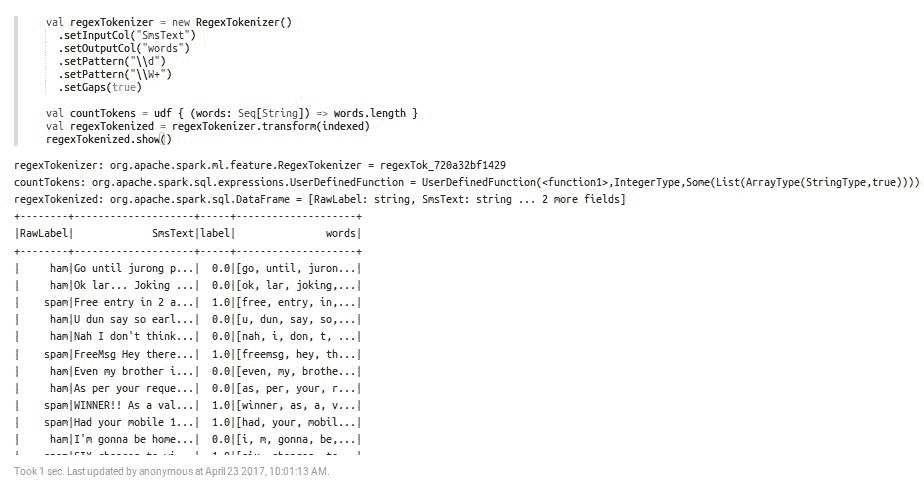

# 第二十一章：使用 Apache Zeppelin 进行交互式数据分析

从数据科学的角度来看，数据分析的交互式可视化同样重要。Apache Zeppelin 是一个基于 Web 的笔记本，用于交互式和大规模的数据分析，支持多种后端和解释器，如 Spark、Scala、Python、JDBC、Flink、Hive、Angular、Livy、Alluxio、PostgreSQL、Ignite、Lens、Cassandra、Kylin、Elasticsearch、JDBC、HBase、BigQuery、Pig、Markdown、Shell 等。

Spark 在可扩展和快速处理大规模数据集方面的能力是毋庸置疑的。然而，Spark 中有一点是缺失的——它没有实时或交互式的可视化支持。考虑到 Zeppelin 所具备的上述令人兴奋的特点，本章将讨论如何使用 Apache Zeppelin 进行大规模数据分析，后端使用 Spark 作为解释器。总结来说，以下主题将被涵盖：

+   Apache Zeppelin 简介

+   安装与入门

+   数据摄取

+   数据分析

+   数据可视化

+   数据协作

# Apache Zeppelin 简介

Apache Zeppelin 是一个基于 Web 的笔记本，能够以交互方式进行数据分析。使用 Zeppelin，您可以制作美观的、数据驱动的、交互式的、协作式的文档，支持 SQL、Scala 等语言。Apache Zeppelin 的解释器概念允许将任何语言/数据处理后端插件集成到 Zeppelin 中。目前，Apache Zeppelin 支持多种解释器，如 Apache Spark、Python、JDBC、Markdown 和 Shell 等。Apache Zeppelin 是 Apache 软件基金会推出的相对较新的技术，能够帮助数据科学家、工程师和从业人员利用数据探索、可视化、共享和协作功能。

# 安装与入门

由于本书的目标并不是使用其他解释器，而是使用 Spark 在 Zeppelin 上，因此所有的代码将使用 Scala 编写。因此，在本节中，我们将展示如何使用只包含 Spark 解释器的二进制包配置 Zeppelin。Apache Zeppelin 官方支持并在以下环境上进行测试：

| **要求** | **值/版本** | **其他要求** |
| --- | --- | --- |
| Oracle JDK | 1.7 或更高版本 | 设置 `JAVA_HOME` |

| 操作系统 | macOS 10.X+ Ubuntu 14.X+ |

CentOS 6.X+

Windows 7 Pro SP1+ | - |

# 安装与配置

如前表所示，在 Zeppelin 上执行 Spark 代码需要 Java。因此，如果尚未设置，请在上述平台上安装并配置 Java。或者，您可以参考第一章，*Scala 入门*，了解如何在您的机器上设置 Java。

可以从[`zeppelin.apache.org/download.html`](https://zeppelin.apache.org/download.html)下载最新版本的 Apache Zeppelin。每个版本提供三种选项：

1.  **包含所有解释器的二进制包**：它包含对许多解释器的支持。例如，目前 Zeppelin 支持 Spark、JDBC、Pig、Beam、Scio、BigQuery、Python、Livy、HDFS、Alluxio、Hbase、Scalding、Elasticsearch、Angular、Markdown、Shell、Flink、Hive、Tajo、Cassandra、Geode、Ignite、Kylin、Lens、Phoenix 和 PostgreSQL 等。

1.  **包含 Spark 解释器的二进制包**：它通常只包含 Spark 解释器，同时也包含解释器的 net-install 脚本。

1.  **源代码**：你也可以从 GitHub 仓库构建包含所有最新更改的 Zeppelin（更多内容即将发布）。

为了展示如何安装和配置 Zeppelin，我们已从以下站点镜像下载了二进制包：

[`www.apache.org/dyn/closer.cgi/zeppelin/zeppelin-0.7.1/zeppelin-0.7.1-bin-netinst.tgz`](http://www.apache.org/dyn/closer.cgi/zeppelin/zeppelin-0.7.1/zeppelin-0.7.1-bin-netinst.tgz)

一旦下载完成，将其解压到机器的某个位置。假设你解压的路径是 `/home/Zeppelin/`。

# 从源代码构建

你也可以从 GitHub 仓库构建包含所有最新更改的 Zeppelin。如果你想从源代码构建，必须先安装以下工具：

+   Git：任何版本

+   Maven：3.1.x 或更高版本

+   JDK：1.7 或更高版本

+   npm：最新版本

+   libfontconfig：最新版本

如果你还没有安装 Git 和 Maven，请查看 [`zeppelin.apache.org/docs/0.8.0-SNAPSHOT/install/build.html#build-requirements`](http://zeppelin.apache.org/docs/0.8.0-SNAPSHOT/install/build.html#build-requirements) 中的构建要求说明。然而，由于页面限制，我们没有详细讨论所有步骤。如果你有兴趣，应该参考这个 URL 获取更多详细信息：[`zeppelin.apache.org/docs/snapshot/install/build.html`](http://zeppelin.apache.org/docs/snapshot/install/build.html)。

# 启动和停止 Apache Zeppelin

在所有类 Unix 平台（例如，Ubuntu、macOS 等）上，使用以下命令：

```py
$ bin/zeppelin-daemon.sh start

```

如果前面的命令执行成功，你应该在终端看到以下日志：

**图 1**：从 Ubuntu 终端启动 Zeppelin

如果你使用 Windows，请使用以下命令：

```py
$ bin\zeppelin.cmd

```

Zeppelin 成功启动后，使用你的浏览器访问 `http://localhost:8080`，你将看到 Zeppelin 正在运行。更具体地说，你将会在浏览器中看到以下界面：

**图 2**：Zeppelin 正在 http://localhost:8080 上运行

恭喜你；你已经成功安装了 Apache Zeppelin！现在，让我们继续进入 Zeppelin 并开始进行数据分析，一旦我们配置好首选的解释器。

现在，要从命令行停止 Zeppelin，请输入以下命令：

```py
$ bin/zeppelin-daemon.sh stop

```

# 创建笔记本

一旦你进入`http://localhost:8080/`，你可以探索不同的选项和菜单，帮助你了解如何熟悉 Zeppelin。你可以在[`zeppelin.apache.org/docs/0.7.1/quickstart/explorezeppelinui.html`](https://zeppelin.apache.org/docs/0.7.1/quickstart/explorezeppelinui.html)找到更多关于 Zeppelin 及其用户友好界面的信息（你也可以根据可用版本参考最新的快速入门文档）。

现在，让我们首先创建一个示例笔记本并开始操作。如以下图所示，你可以通过点击“创建新笔记”选项来创建一个新的笔记本：

**图 3**：创建一个示例 Zeppelin 笔记本

如前图所示，默认的解释器被选择为 Spark。在下拉列表中，你也只会看到 Spark，因为我们已经为 Zeppelin 下载了仅包含 Spark 的二进制包。

# 配置解释器

每个解释器都属于一个解释器组。解释器组是启动/停止解释器的单位。默认情况下，每个解释器都属于一个单独的组，但一个组可能包含更多的解释器。例如，Spark 解释器组包括 Spark 支持、pySpark、Spark SQL 和依赖加载器。如果你想在 Zeppelin 上执行 SQL 语句，你应该使用`%`符号指定解释器类型；例如，使用 SQL 时应使用`%sql`，使用 markdown 时应使用`%md`，等等。

有关更多信息，请参见以下图片：

**图 4**：在 Zeppelin 中使用 Spark 的解释器属性 数据摄取

好的，一旦你创建了笔记本，你就可以直接在代码部分编写 Spark 代码。对于这个简单的示例，我们将使用银行数据集，它是公开可用的用于研究，并可以从[`archive.ics.uci.edu/ml/machine-learning-databases/00222/`](https://archive.ics.uci.edu/ml/machine-learning-databases/00222/)下载，感谢 S. Moro、R. Laureano 和 P. Cortez 提供的《使用数据挖掘进行银行直销：CRISP-DM 方法的应用》。该数据集包含了诸如年龄、工作职位、婚姻状况、教育程度、是否为违约者、银行余额、住房情况、借款人是否从银行借款等客户信息，数据格式为 CSV。数据集的样例如下所示：

**图 5**：银行数据集示例

现在，让我们首先在 Zeppelin 笔记本中加载数据：

```py
valbankText = sc.textFile("/home/asif/bank/bank-full.csv")

```

执行此行代码后，创建一个新段落，并将其命名为数据摄取段落：

**图 6**：数据摄取段落

如果你仔细观察前面的图片，你会发现代码已经生效，并且我们无需定义 Spark 上下文。原因是它已经在那里定义为`sc`。你甚至不需要隐式地定义 Scala。我们稍后将看到一个示例。

# 数据处理与可视化

现在，让我们创建一个案例类，它将告诉我们如何从数据集中选择字段：

```py
case class Bank(age:Int, job:String, marital : String, education : String, balance : Integer)

```

现在，拆分每一行，过滤掉标题（以`age`开头），并将其映射到`Bank`案例类，如下所示：

```py
val bank = bankText.map(s=>s.split(";")).filter(s => (s.size)>5).filter(s=>s(0)!="\"age\"").map( 
  s=>Bank(s(0).toInt,  
  s(1).replaceAll("\"", ""), 
  s(2).replaceAll("\"", ""), 
  s(3).replaceAll("\"", ""), 
  s(5).replaceAll("\"", "").toInt 
        ) 
) 

```

最后，转换为 DataFrame 并创建临时表：

```py
bank.toDF().createOrReplaceTempView("bank")

```

以下截图显示了所有代码片段已成功执行，没有出现任何错误：

**图 7**：数据处理段落

为了使其更透明，让我们查看在代码执行每个案例后，右上角（绿色标记）的状态，如下所示：

**图 8**：每个段落成功执行 Spark 代码的结果

现在，让我们加载一些数据，通过以下 SQL 命令进行操作：

```py
%sql select age, count(1) from bank where age >= 45 group by age order by age

```

请注意，上面那行代码是一个纯 SQL 语句，选择所有年龄大于或等于 45 岁的客户的名字（即，年龄分布）。最后，它会统计同一客户组的数量。

现在，让我们看看前面的 SQL 语句如何作用于临时视图（即`bank`）：

**图 9**：SQL 查询，选择所有客户的名字和年龄分布 [表格]

现在，您可以从表格图标旁边的选项卡中选择图形选项，例如直方图、饼图、条形图等（在结果部分）。例如，使用直方图，您可以查看`年龄组 >=45`的对应计数。

**图 10**：SQL 查询，选择所有客户的名字和年龄分布 [直方图]

这是使用饼图的效果：

**图 11**：SQL 查询，选择所有客户的名字和年龄分布 [饼图]

太棒了！我们现在几乎准备好使用 Zeppelin 进行更复杂的数据分析问题了。

# 使用 Zeppelin 进行复杂数据分析

在本节中，我们将看到如何使用 Zeppelin 执行更复杂的分析。首先，我们将形式化问题，然后探索将要使用的数据集。最后，我们将应用一些可视化分析和机器学习技术。

# 问题定义

在本节中，我们将构建一个垃圾邮件分类器，将原始文本分类为垃圾邮件或正常邮件。我们还将展示如何评估这样的模型。我们将尝试重点使用并与 DataFrame API 一起工作。最后，垃圾邮件分类器模型将帮助你区分垃圾邮件和正常邮件。以下图片展示了两个消息（分别为垃圾邮件和正常邮件）的概念视图：

**图 12**：垃圾邮件与正常邮件示例

我们利用一些基本的机器学习技术，构建并评估这种问题的分类器。特别地，将使用逻辑回归算法来解决这个问题。

# 数据集描述与探索

我们从 [`archive.ics.uci.edu/ml/datasets/SMS+Spam+Collection`](https://archive.ics.uci.edu/ml/datasets/SMS+Spam+Collection) 下载的垃圾短信数据集包含 5,564 条短信，这些短信经过人工分类为正常短信（ham）或垃圾短信（spam）。其中只有 13.4% 的短信是垃圾短信。这意味着数据集是偏斜的，只有少量的垃圾短信样本。需要注意的是，这可能在训练模型时引入偏差：

**图 13**：SMS 数据集快照

那么，这些数据看起来怎么样呢？正如你可能看到的，社交媒体文本常常很“脏”，包含俚语、拼写错误、缺失的空格、缩写词，例如 *u*、*urs*、*yrs* 等等，并且经常违反语法规则。有时，消息中甚至包含琐碎的词语。因此，我们也需要处理这些问题。在接下来的步骤中，我们将遇到这些问题，以便更好地解读分析结果。

**步骤 1\. 在 Zeppelin 上加载所需的包和 API** - 在我们将数据集导入 Zeppelin 之前，让我们加载所需的包和 API，并创建第一个段落：

**图 14**：包/API 加载段落

**步骤 2\. 加载并解析数据集** - 我们将使用 Databricks 提供的 CSV 解析库（即 `com.databricks.spark.csv`）将数据读取到 DataFrame 中：

**图 15**：数据导入/加载段落

**步骤 3\. 使用** `StringIndexer` **创建数值标签** - 由于原始 DataFrame 中的标签是分类的，我们需要将其转换为数值类型，以便可以将其输入到机器学习模型中：

**图 16**：StringIndexer 段落，输出显示了原始标签、原始文本和对应的标签。

**步骤 4\. 使用** `RegexTokenizer` **创建词袋** - 我们将使用 `RegexTokenizer` 来删除不需要的词语，并创建一个词袋：

**图 17**：RegexTokenizer 段落，输出显示了原始标签、原始文本、对应的标签和标记

**步骤 5\. 去除停用词并创建过滤后的** **DataFrame** - 我们将去除停用词并创建一个过滤后的 DataFrame 以便进行可视化分析。最后，我们展示该 DataFrame：

**图 18**：StopWordsRemover 段落，输出显示了原始标签、原始文本、对应标签、标记和去除停用词后的标记

**步骤 6\. 查找垃圾短信/词语及其频率** - 让我们尝试创建一个 DataFrame，其中只包含垃圾词及其各自的频率，以便理解数据集中消息的上下文。我们可以在 Zeppelin 上创建一个段落：

**图 19**：带有频率的垃圾词标记段落

现在，让我们使用 SQL 查询在图表中查看它们。以下查询选择所有频率大于 100 的标记。然后，我们按频率的降序排列标记。最后，我们使用动态表单限制记录数。第一个只是一个原始的表格格式：

**图 20**：垃圾邮件标记及其频率可视化段落 [表格]

然后，我们将使用条形图，它提供了更多的视觉洞察。现在我们可以看到，垃圾邮件中最频繁的单词是“call”和“free”，它们的频率分别为 355 和 224：

**图 21**：垃圾邮件标记及其频率可视化段落 [直方图]

最后，使用饼图提供了更好的可视化效果，特别是当你指定列范围时：

**图 22**：垃圾邮件标记及其频率可视化段落 [饼图]

**步骤 7. 使用 HashingTF 进行词频** - 使用`HashingTF`生成每个过滤标记的词频，如下所示：

**图 23**：HashingTF 段落，输出显示原始标签、原始文本、对应标签、标记、过滤后的标记和每行的对应词频

**步骤 8. 使用 IDF 进行词频-逆文档频率（TF-IDF）** - TF-IDF 是一种广泛用于文本挖掘的特征向量化方法，用于反映一个术语在语料库中对文档的重要性：

**图 24**：IDF 段落，输出显示原始标签、原始文本、对应标签、标记、过滤后的标记、词频和每行的对应 IDF

**词袋模型：** 词袋模型为每个单词在句子中的出现分配`1`的值。这可能并不理想，因为句子中的每个类别通常会有相同频率的*the*、*and*等词，而像*viagra*和*sale*这样的词可能在判断文本是否为垃圾邮件时应该具有更高的权重。

**TF-IDF：** 这是“文本频率 - 逆文档频率”的缩写。这个术语本质上是每个单词的文本频率和逆文档频率的乘积。它通常用于自然语言处理（NLP）或文本分析中的词袋方法。

**使用 TF-IDF：** 让我们看看词频。这里我们考虑的是单个条目中的词频，即术语。计算文本频率（TF）的目的是找出在每个条目中似乎很重要的术语。然而，像 *the* 和 *and* 这样的词在每个条目中可能会非常频繁地出现。我们希望减少这些词的权重，因此我们可以想象，将前面的 TF 乘以文档频率的倒数可能有助于找出重要的词语。然而，由于文本集合（语料库）可能非常庞大，通常会对倒数文档频率取对数。简而言之，我们可以想象，TF-IDF 的高值可能表示在确定文档内容时非常重要的词语。创建 TF-IDF 向量需要将所有文本加载到内存中，并在开始训练模型之前计算每个单词的出现次数。

**步骤 9. 使用 VectorAssembler 为 Spark ML 管道生成原始特征** - 如你在上一步中看到的，我们只有过滤后的标记、标签、TF 和 IDF。然而，当前没有可以输入任何 ML 模型的相关特征。因此，我们需要使用 Spark 的 VectorAssembler API，基于前面 DataFrame 中的属性来创建特征，具体如下：

**图 25**：使用 VectorAssembler 进行特征创建的段落

**步骤 10. 准备训练集和测试集** - 现在我们需要准备训练集和测试集。训练集将用于在步骤 11 中训练逻辑回归模型，而测试集将用于在步骤 12 中评估模型。在这里，我将训练集比例设为 75%，测试集比例设为 25%。你可以根据需要调整：

**图 26**：准备训练/测试集段落

**步骤 11. 训练二分类逻辑回归模型** - 由于这个问题本身是一个二分类问题，我们可以使用二分类逻辑回归分类器，具体如下：

**图 27**：逻辑回归段落，展示了如何使用必要的标签、特征、回归参数、弹性网参数和最大迭代次数来训练逻辑回归分类器

请注意，为了获得更好的结果，我们将训练迭代了 200 次。我们将回归参数和弹性网参数设置得非常低——即 0.0001，以使训练更加密集。

**步骤 12. 模型评估** - 让我们计算测试集的原始预测结果。然后，我们使用二分类评估器来实例化原始预测，具体如下：

******图 28**：模型评估器段落

现在让我们计算模型在测试集上的准确度，具体如下：

**图 29**：准确度计算段落

这相当令人印象深刻。然而，如果你选择使用交叉验证进行模型调优，例如，你可能会获得更高的准确度。最后，我们将计算混淆矩阵以获得更多的洞察：

**图 30**：混淆矩阵段落展示了正确和错误预测的数量，通过每个类别进行汇总和拆解

# 数据和结果协作

此外，Apache Zeppelin 提供了一个发布笔记本段落结果的功能。使用这个功能，你可以在自己的网站上展示 Zeppelin 笔记本段落的结果。这非常简单；只需在你的页面上使用 `<iframe>` 标签。如果你想分享 Zeppelin 笔记本的链接，发布段落结果的第一步是复制段落链接。在 Zeppelin 笔记本中运行一个段落后，点击右侧的齿轮按钮。然后，在菜单中点击“Link this paragraph”选项，如下图所示：

**图 31**：链接段落

然后，只需复制提供的链接，如下所示：

**图 32**：获取段落链接以便与合作者共享

现在，即使你想发布已复制的段落，也可以在自己的网站上使用 `<iframe>` 标签。以下是一个示例：

```py
<iframe src="img/...?asIframe" height="" width="" ></iframe>

```

现在，你可以在自己的网站上展示漂亮的可视化结果。这基本上标志着我们在 Apache Zeppelin 中的数据分析旅程的结束。有关更多信息和相关更新，请访问 Apache Zeppelin 的官方网站 [`zeppelin.apache.org/`](https://zeppelin.apache.org/)；你甚至可以通过 users-subscribe@zeppelin.apache.org 订阅 Zeppelin 用户。

# 总结

Apache Zeppelin 是一个基于 Web 的笔记本，能够以交互式方式进行数据分析。使用 Zeppelin，你可以制作美观的数据驱动、交互式和协作型文档，支持 SQL、Scala 等语言。随着更多新特性不断加入到最近的版本中，它正日益受到欢迎。然而，由于页面限制，并且为了让你更专注于仅使用 Spark，我们展示的示例仅适用于使用 Spark 和 Scala。然而，你也可以用 Python 编写 Spark 代码，并且可以同样轻松地测试你的笔记本。

在本章中，我们讨论了如何使用 Apache Zeppelin 进行大规模数据分析，Spark 在后台作为解释器。我们了解了如何安装并开始使用 Zeppelin。接着，我们看到如何获取数据并解析分析，以便更好地可视化。然后，我们看到如何通过可视化提供更深入的洞察。最后，我们了解了如何与合作者共享 Zeppelin 笔记本。
