# 第一章： 开始使用 Apache Spark

在本章中，我们将设置和配置 Spark。本章分为以下教程：

+   从二进制文件安装 Spark

+   使用 Maven 构建 Spark 源代码

+   在 Amazon EC2 上启动 Spark

+   在独立模式下在集群上部署 Spark

+   在 Mesos 集群上部署 Spark

+   在 YARN 集群上部署 Spark

+   使用 Tachyon 作为离堆存储层

# 介绍

Apache Spark 是一个通用的集群计算系统，用于处理大数据工作负载。Spark 与其前身 MapReduce 的区别在于其速度、易用性和复杂的分析。

Apache Spark 最初是在 2009 年由加州大学伯克利分校的 AMPLab 开发的。它于 2010 年以 BSD 许可证开源，并于 2013 年切换到 Apache 2.0 许可证。在 2013 年后期，Spark 的创造者成立了 Databricks，专注于 Spark 的开发和未来发布。

谈到速度，Spark 可以在大数据工作负载上实现亚秒延迟。为了实现如此低的延迟，Spark 利用内存进行存储。在 MapReduce 中，内存主要用于实际计算。Spark 使用内存来计算和存储对象。

Spark 还提供了一个统一的运行时，连接到各种大数据存储源，如 HDFS、Cassandra、HBase 和 S3。它还提供了丰富的高级库，用于不同的大数据计算任务，如机器学习、SQL 处理、图处理和实时流处理。这些库使开发更快，并且可以以任意方式组合。

尽管 Spark 是用 Scala 编写的，而本书只关注 Scala 中的教程，但 Spark 也支持 Java 和 Python。

Spark 是一个开源社区项目，每个人都使用纯开源的 Apache 发行版进行部署，不像 Hadoop 有多个带有供应商增强的发行版可用。

以下图显示了 Spark 生态系统：

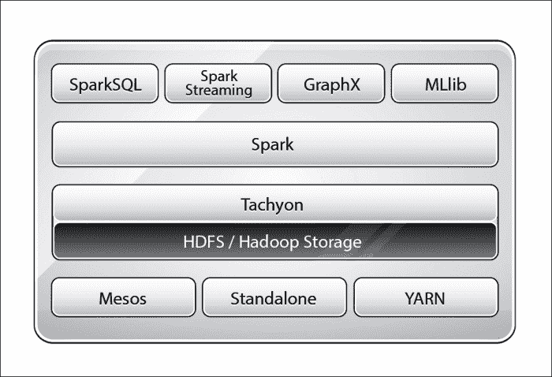

Spark 运行时在各种集群管理器上运行，包括 YARN（Hadoop 的计算框架）、Mesos 和 Spark 自己的集群管理器**独立模式**。Tachyon 是一个以内存为中心的分布式文件系统，可以在集群框架之间以内存速度可靠地共享文件。简而言之，它是内存中的离堆存储层，有助于在作业和用户之间共享数据。Mesos 是一个集群管理器，正在演变成数据中心操作系统。YARN 是 Hadoop 的计算框架，具有强大的资源管理功能，Spark 可以无缝使用。

# 从二进制文件安装 Spark

Spark 可以从源代码构建，也可以从[`spark.apache.org`](http://spark.apache.org)下载预编译的二进制文件。对于标准用例，二进制文件已经足够好，本教程将重点介绍使用二进制文件安装 Spark。

## 准备就绪

本书中的所有教程都是在 Ubuntu Linux 上开发的，但在任何 POSIX 环境中都应该可以正常工作。Spark 需要安装 Java，并设置`JAVA_HOME`环境变量。

在 Linux/Unix 系统中，有关文件和目录位置的一些标准，我们将在本书中遵循。以下是一个快速的备忘单：

| 目录 | 描述 |
| --- | --- |
| `/bin` | 基本命令二进制文件 |
| `/etc` | 特定主机系统配置 |
| `/opt` | 附加应用软件包 |
| `/var` | 可变数据 |
| `/tmp` | 临时文件 |
| `/home` | 用户主目录 |

## 如何做...

在撰写本文时，Spark 的当前版本是 1.4。请从 Spark 的下载页面[`spark.apache.org/downloads.html`](http://spark.apache.org/downloads.html)检查最新版本。二进制文件是使用最新和稳定版本的 Hadoop 开发的。要使用特定版本的 Hadoop，推荐的方法是从源代码构建，这将在下一个教程中介绍。

以下是安装步骤：

1.  打开终端并使用以下命令下载二进制文件：

```scala
$ wget http://d3kbcqa49mib13.cloudfront.net/spark-1.4.0-bin-hadoop2.4.tgz

```

1.  解压二进制文件：

```scala
$ tar -zxf spark-1.4.0-bin-hadoop2.4.tgz

```

1.  通过剥离版本信息重命名包含二进制文件的文件夹：

```scala
$ sudo mv spark-1.4.0-bin-hadoop2.4 spark

```

1.  将配置文件夹移动到`/etc`文件夹，以便稍后可以将其创建为符号链接：

```scala
$ sudo mv spark/conf/* /etc/spark

```

1.  在`/opt`目录下创建您公司特定的安装目录。由于本书中的示例在`infoobjects`沙箱上进行了测试，我们将使用`infoobjects`作为目录名称。创建`/opt/infoobjects`目录：

```scala
$ sudo mkdir -p /opt/infoobjects

```

1.  将`spark`目录移动到`/opt/infoobjects`，因为它是一个附加软件包：

```scala
$ sudo mv spark /opt/infoobjects/

```

1.  更改`spark`主目录的所有权为`root`：

```scala
$ sudo chown -R root:root /opt/infoobjects/spark

```

1.  更改`spark`主目录的权限，`0755 = 用户：读-写-执行组：读-执行世界：读-执行`：

```scala
$ sudo chmod -R 755 /opt/infoobjects/spark

```

1.  转到`spark`主目录：

```scala
$ cd /opt/infoobjects/spark

```

1.  创建符号链接：

```scala
$ sudo ln -s /etc/spark conf

```

1.  在`.bashrc`中追加`PATH`：

```scala
$ echo "export PATH=$PATH:/opt/infoobjects/spark/bin" >> /home/hduser/.bashrc

```

1.  打开一个新的终端。

1.  在`/var`中创建`log`目录：

```scala
$ sudo mkdir -p /var/log/spark

```

1.  将`hduser`设置为 Spark `log`目录的所有者。

```scala
$ sudo chown -R hduser:hduser /var/log/spark

```

1.  创建 Spark `tmp`目录：

```scala
$ mkdir /tmp/spark

```

1.  使用以下命令行配置 Spark：

```scala
$ cd /etc/spark
$ echo "export HADOOP_CONF_DIR=/opt/infoobjects/hadoop/etc/hadoop" >> spark-env.sh
$ echo "export YARN_CONF_DIR=/opt/infoobjects/hadoop/etc/Hadoop" >> spark-env.sh
$ echo "export SPARK_LOG_DIR=/var/log/spark" >> spark-env.sh
$ echo "export SPARK_WORKER_DIR=/tmp/spark" >> spark-env.sh

```

# 使用 Maven 构建 Spark 源代码

在大多数情况下，使用二进制文件安装 Spark 效果很好。对于高级情况，例如以下情况（但不限于此），从源代码编译是更好的选择：

+   为特定的 Hadoop 版本编译

+   添加 Hive 集成

+   添加 YARN 集成

## 准备就绪

这个示例的先决条件是：

+   Java 1.6 或更高版本

+   Maven 3.x

## 如何做...

以下是使用 Maven 构建 Spark 源代码的步骤：

1.  增加`MaxPermSize`以扩展堆：

```scala
$ echo "export _JAVA_OPTIONS=\"-XX:MaxPermSize=1G\""  >> /home/hduser/.bashrc

```

1.  打开一个新的终端窗口并从 GitHub 下载 Spark 源代码：

```scala
$ wget https://github.com/apache/spark/archive/branch-1.4.zip

```

1.  解压缩存档：

```scala
$ gunzip branch-1.4.zip

```

1.  转到`spark`目录：

```scala
$ cd spark

```

1.  使用以下标志编译源代码：启用 Yarn，Hadoop 版本 2.4，启用 Hive，并跳过测试以加快编译速度：

```scala
$ mvn -Pyarn -Phadoop-2.4 -Dhadoop.version=2.4.0 -Phive -DskipTests clean package

```

1.  将`conf`文件夹移动到`etc`文件夹，以便稍后可以将其创建为符号链接：

```scala
$ sudo mv spark/conf /etc/

```

1.  将`spark`目录移动到`/opt`，因为它是一个附加软件包：

```scala
$ sudo mv spark /opt/infoobjects/spark

```

1.  更改`spark`主目录的所有权为`root`：

```scala
$ sudo chown -R root:root /opt/infoobjects/spark

```

1.  更改`spark`主目录的权限`0755 = 用户：rwx 组：r-x 世界：r-x`：

```scala
$ sudo chmod -R 755 /opt/infoobjects/spark

```

1.  转到`spark`主目录：

```scala
$ cd /opt/infoobjects/spark

```

1.  创建一个符号链接：

```scala
$ sudo ln -s /etc/spark conf

```

1.  通过编辑`.bashrc`将 Spark 可执行文件放入路径中：

```scala
$ echo "export PATH=$PATH:/opt/infoobjects/spark/bin" >> /home/hduser/.bashrc

```

1.  在`/var`中创建`log`目录：

```scala
$ sudo mkdir -p /var/log/spark

```

1.  将`hduser`设置为 Spark `log`目录的所有者：

```scala
$ sudo chown -R hduser:hduser /var/log/spark

```

1.  创建 Spark `tmp`目录：

```scala
$ mkdir /tmp/spark

```

1.  使用以下命令行配置 Spark：

```scala
$ cd /etc/spark
$ echo "export HADOOP_CONF_DIR=/opt/infoobjects/hadoop/etc/hadoop" >> spark-env.sh
$ echo "export YARN_CONF_DIR=/opt/infoobjects/hadoop/etc/Hadoop" >> spark-env.sh
$ echo "export SPARK_LOG_DIR=/var/log/spark" >> spark-env.sh
$ echo "export SPARK_WORKER_DIR=/tmp/spark" >> spark-env.sh

```

# 在 Amazon EC2 上启动 Spark

**Amazon Elastic Compute Cloud**（**Amazon EC2**）是一种提供可调整大小的云中计算实例的网络服务。Amazon EC2 提供以下功能：

+   通过互联网按需交付 IT 资源

+   提供您喜欢的实例数量

+   按小时支付您使用实例的费用，就像您的水电费一样

+   没有设置费用，没有安装费用，也没有任何额外费用

+   当您不再需要实例时，您可以关闭或终止并离开

+   这些实例在所有熟悉的操作系统上都是可用的

EC2 提供不同类型的实例，以满足所有计算需求，例如通用实例、微型实例、内存优化实例、存储优化实例等。它们有一个免费的微型实例套餐可供尝试。

## 准备就绪

`spark-ec2`脚本与 Spark 捆绑在一起，可以轻松在 Amazon EC2 上启动、管理和关闭集群。

在开始之前，您需要做以下事情：

1.  登录到 Amazon AWS 帐户（[`aws.amazon.com`](http://aws.amazon.com)）。

1.  在右上角的帐户名称下单击**安全凭据**。

1.  单击**访问密钥**和**创建新的访问密钥**：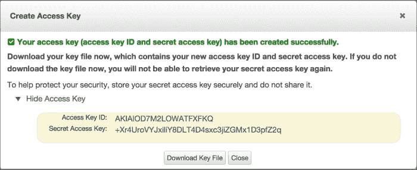

1.  记下访问密钥 ID 和秘密访问密钥。

1.  现在转到**服务** | **EC2**。

1.  在左侧菜单中单击**密钥对**，然后单击**网络和安全**下的**密钥对**。

1.  单击**创建密钥对**，并输入 `kp-spark` 作为密钥对名称：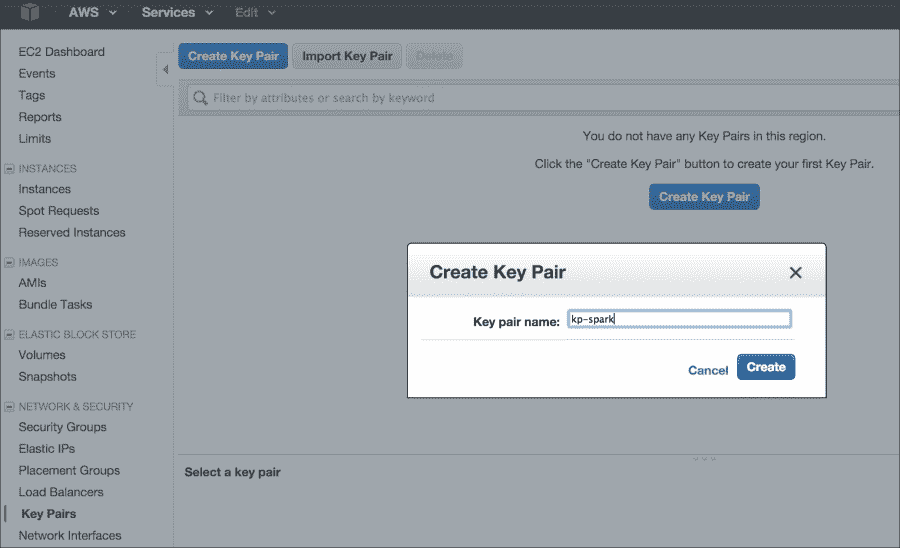

1.  下载私钥文件并将其复制到 `/home/hduser/keypairs` 文件夹中。

1.  将密钥文件权限设置为 `600`。

1.  设置环境变量以反映访问密钥 ID 和秘密访问密钥（请用您自己的值替换示例值）：

```scala
$ echo "export AWS_ACCESS_KEY_ID=\"AKIAOD7M2LOWATFXFKQ\"" >> /home/hduser/.bashrc
$ echo "export AWS_SECRET_ACCESS_KEY=\"+Xr4UroVYJxiLiY8DLT4DLT4D4sxc3ijZGMx1D3pfZ2q\"" >> /home/hduser/.bashrc
$ echo "export PATH=$PATH:/opt/infoobjects/spark/ec2" >> /home/hduser/.bashrc

```

## 如何做...

1.  Spark 预先捆绑了用于在 Amazon EC2 上启动 Spark 集群的脚本。让我们使用以下命令启动集群：

```scala
$ cd /home/hduser
$ spark-ec2 -k <key-pair> -i <key-file> -s <num-slaves> launch <cluster-name>

```

1.  使用示例值启动集群：

```scala
$ spark-ec2 -k kp-spark -i /home/hduser/keypairs/kp-spark.pem --hadoop-major-version 2  -s 3 launch spark-cluster

```

### 注意

+   `<key-pair>`: 这是在 AWS 中创建的 EC2 密钥对的名称

+   `<key-file>`: 这是您下载的私钥文件

+   `<num-slaves>`: 这是要启动的从节点数量

+   `<cluster-name>`: 这是集群的名称

1.  有时，默认的可用区不可用；在这种情况下，通过指定您正在请求的特定可用区来重试发送请求：

```scala
$ spark-ec2 -k kp-spark -i /home/hduser/keypairs/kp-spark.pem -z us-east-1b --hadoop-major-version 2  -s 3 launch spark-cluster

```

1.  如果您的应用程序需要在实例关闭后保留数据，请将 EBS 卷附加到它（例如，10 GB 空间）：

```scala
$ spark-ec2 -k kp-spark -i /home/hduser/keypairs/kp-spark.pem --hadoop-major-version 2 -ebs-vol-size 10 -s 3 launch spark-cluster

```

1.  如果您使用 Amazon spot 实例，以下是操作方法：

```scala
$ spark-ec2 -k kp-spark -i /home/hduser/keypairs/kp-spark.pem -spot-price=0.15 --hadoop-major-version 2  -s 3 launch spark-cluster

```

### 注意

Spot 实例允许您为 Amazon EC2 计算能力命名自己的价格。您只需对多余的 Amazon EC2 实例进行竞标，并在您的出价超过当前 spot 价格时运行它们，该价格根据供求实时变化（来源：[amazon.com](http://amazon.com)）。

1.  一切都启动后，通过转到最后打印的 web UI URL 来检查集群的状态。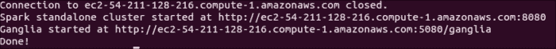

1.  检查集群的状态：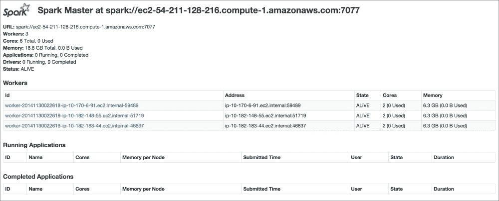

1.  现在，要访问 EC2 上的 Spark 集群，让我们使用**安全外壳协议**（**SSH**）连接到主节点：

```scala
$ spark-ec2 -k kp-spark -i /home/hduser/kp/kp-spark.pem  login spark-cluster

```

您应该得到类似以下的内容：

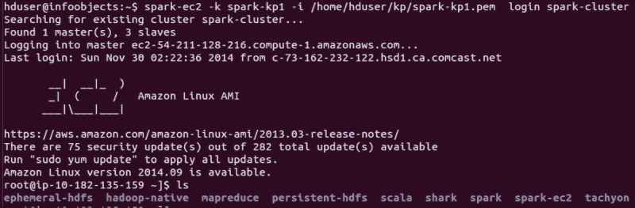

1.  检查主节点中的目录并查看它们的作用：

| 目录 | 描述 |
| --- | --- |
| `ephemeral-hdfs` | 这是 Hadoop 实例，其中的数据是暂时的，当您停止或重新启动机器时会被删除。 |
| `persistent-hdfs` | 每个节点都有非常少量的持久存储（大约 3 GB）。如果使用此实例，数据将保留在该空间中。 |
| `hadoop-native` | 这些是支持 Hadoop 的本地库，如 snappy 压缩库。 |
| `Scala` | 这是 Scala 安装。 |
| `shark` | 这是 Shark 安装（Shark 不再受支持，已被 Spark SQL 取代）。 |
| `spark` | 这是 Spark 安装 |
| `spark-ec2` | 这些是支持此集群部署的文件。 |
| `tachyon` | 这是 Tachyon 安装 |

1.  使用以下命令检查暂时实例中的 HDFS 版本：

```scala
$ ephemeral-hdfs/bin/hadoop version
Hadoop 2.0.0-chd4.2.0

```

1.  使用以下命令检查持久实例中的 HDFS 版本：

```scala
$ persistent-hdfs/bin/hadoop version
Hadoop 2.0.0-chd4.2.0

```

1.  更改日志中的配置级别：

```scala
$ cd spark/conf

```

1.  默认的日志级别信息太冗长了，所以让我们将其更改为错误：

1.  通过重命名模板创建 `log4.properties` 文件：

```scala
$ mv log4j.properties.template log4j.properties

```

1.  在 vi 或您喜欢的编辑器中打开 `log4j.properties`：

```scala
$ vi log4j.properties

```

1.  将第二行从 `| log4j.rootCategory=INFO, console` 更改为 `| log4j.rootCategory=ERROR, console`。

1.  更改后将配置复制到所有从节点：

```scala
$ spark-ec2/copydir spark/conf

```

您应该得到类似以下的内容：

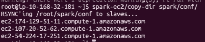

1.  销毁 Spark 集群：

```scala
$ spark-ec2 destroy spark-cluster

```

### 另请参阅

+   [`aws.amazon.com/ec2`](http://aws.amazon.com/ec2)

# 在独立模式下的集群部署

在分布式环境中管理计算资源，以便资源利用率高效，并且每个作业都有公平的运行机会。Spark 预先捆绑了其自己的集群管理器，方便地称为**独立模式**。Spark 还支持与 YARN 和 Mesos 集群管理器一起工作。

应该选择的集群管理器主要受到传统问题的驱动，以及其他框架（如 MapReduce）是否共享相同的计算资源池。如果您的集群有传统的 MapReduce 作业运行，并且所有这些作业都无法转换为 Spark 作业，那么使用 YARN 作为集群管理器是一个好主意。Mesos 正在成为一个数据中心操作系统，方便地跨框架管理作业，并且与 Spark 非常兼容。

如果 Spark 框架是集群中唯一的框架，那么独立模式就足够了。随着 Spark 作为技术的发展，您将看到越来越多的 Spark 被用作独立框架来满足所有大数据计算需求的用例。例如，目前可能有一些作业正在使用 Apache Mahout，因为 MLlib 没有特定的机器学习库，而作业需要。一旦 MLlib 获得了这个库，这个特定的作业就可以迁移到 Spark 中。

## 准备就绪

让我们以一个六个节点的集群为例：一个主节点和五个从节点（用集群中实际的节点名称替换它们）：

```scala
Master
m1.zettabytes.com
Slaves
s1.zettabytes.com
s2.zettabytes.com
s3.zettabytes.com
s4.zettabytes.com
s5.zettabytes.com

```

## 如何做...

1.  由于 Spark 的独立模式是默认模式，所以您只需要在主节点和从节点上安装 Spark 二进制文件。在每个节点上将`/opt/infoobjects/spark/sbin`添加到路径中：

```scala
$ echo "export PATH=$PATH:/opt/infoobjects/spark/sbin" >> /home/hduser/.bashrc

```

1.  启动独立的主服务器（首先 SSH 到主节点）：

```scala
hduser@m1.zettabytes.com~] start-master.sh

```

默认情况下，Master 在端口 7077 上启动，从节点使用该端口连接到 Master。它还在端口 8088 上有一个 Web UI。

1.  请 SSH 到主节点并启动从节点：

```scala
hduser@s1.zettabytes.com~] spark-class org.apache.spark.deploy.worker.Worker spark://m1.zettabytes.com:7077

```

| - 参数（用于细粒度配置，以下参数适用于主节点和从节点） | 意义 |
| --- | --- |
| - --- | --- |
| - `-i <ipaddress>,-ip <ipaddress>` | IP 地址/DNS 服务监听的地址 |
| - `-p <port>, --port <port>` | 服务监听的端口 |
| - `--webui-port <port>` | Web UI 的端口（默认情况下，主节点为 8080，从节点为 8081） |
| - `-c <cores>,--cores <cores>` | 机器上可以用于 Spark 应用程序的总 CPU 核心数（仅限 worker） |
| - `-m <memory>,--memory <memory>` | 机器上可以用于 Spark 应用程序的总 RAM（仅限 worker） |
| - `-d <dir>,--work-dir <dir>` | 用于临时空间和作业输出日志的目录 |

1.  与手动在每个节点上启动主和从守护程序相比，也可以使用集群启动脚本来完成。

1.  首先，在主节点上创建`conf/slaves`文件，并添加每个从节点主机名的一行（使用五个从节点的示例，用集群中从节点的 DNS 替换）：

```scala
hduser@m1.zettabytes.com~] echo "s1.zettabytes.com" >> conf/slaves
hduser@m1.zettabytes.com~] echo "s2.zettabytes.com" >> conf/slaves
hduser@m1.zettabytes.com~] echo "s3.zettabytes.com" >> conf/slaves
hduser@m1.zettabytes.com~] echo "s4.zettabytes.com" >> conf/slaves
hduser@m1.zettabytes.com~] echo "s5.zettabytes.com" >> conf/slaves

```

一旦从节点设置好，就可以调用以下脚本来启动/停止集群：

| - 脚本名称 | 目的 |
| --- | --- |
| - --- | --- |
| - `start-master.sh` | 在主机上启动主实例 |
| - `start-slaves.sh` | 在 slaves 文件中的每个节点上启动一个从节点实例 |
| - `start-all.sh` | 启动主节点和从节点 |
| - `stop-master.sh` | 停止主机上的主实例 |
| - `stop-slaves.sh` | 停止 slaves 文件中所有节点上的从节点实例 |
| - `stop-all.sh` | 停止主节点和从节点 |

1.  通过 Scala 代码将应用程序连接到集群：

```scala
val sparkContext = new SparkContext(new SparkConf().setMaster("spark://m1.zettabytes.com:7077")

```

1.  通过 Spark shell 连接到集群：

```scala
$ spark-shell --master spark://master:7077

```

## 它是如何工作的...

在独立模式下，Spark 遵循主从架构，非常类似于 Hadoop、MapReduce 和 YARN。计算主守护程序称为**Spark master**，在一个主节点上运行。Spark master 可以使用 ZooKeeper 实现高可用性。如果需要，还可以在运行时添加更多的备用主节点。

计算从节点守护程序称为**worker**，位于每个从节点上。worker 守护程序执行以下操作：

+   报告从节点上计算资源的可用性，例如核心数、内存等，到 Spark master

+   当 Spark master 要求时，生成执行程序

+   如果执行程序死掉，则重新启动执行程序

每个应用程序每个从节点最多只有一个执行程序。

Spark 的 master 和 worker 都非常轻量级。通常，500 MB 到 1 GB 之间的内存分配就足够了。可以通过在`conf/spark-env.sh`中设置`SPARK_DAEMON_MEMORY`参数来设置这个值。例如，以下配置将为 master 和 worker daemon 设置内存为 1 GB。在运行之前确保你有`sudo`超级用户权限：

```scala
$ echo "export SPARK_DAEMON_MEMORY=1g" >> /opt/infoobjects/spark/conf/spark-env.sh

```

默认情况下，每个从属节点上都有一个工作程序实例在运行。有时，您可能有一些比其他机器更强大的机器。在这种情况下，可以通过以下配置在该机器上生成多个工作程序（仅在这些机器上）：

```scala
$ echo "export SPARK_WORKER_INSTANCES=2" >> /opt/infoobjects/spark/conf/spark-env.sh

```

Spark worker 默认使用从属机器上的所有核心作为其执行器。如果要限制工作程序可以使用的核心数，可以通过以下配置将其设置为该数字（例如 12）：

```scala
$ echo "export SPARK_WORKER_CORES=12" >> /opt/infoobjects/spark/conf/spark-env.sh

```

Spark worker 默认使用所有可用的 RAM（执行器为 1 GB）。请注意，您无法分配每个特定执行器将使用多少内存（您可以从驱动程序配置中控制此操作）。要为所有执行器组合使用的总内存（例如，24 GB）分配另一个值，请执行以下设置：

```scala
$ echo "export SPARK_WORKER_MEMORY=24g" >> /opt/infoobjects/spark/conf/spark-env.sh

```

在驱动程序级别可以进行一些设置：

+   要指定集群中给定应用程序可以使用的最大 CPU 核心数，可以在 Spark submit 或 Spark shell 中设置`spark.cores.max`配置如下：

```scala
$ spark-submit --conf spark.cores.max=12

```

+   要指定每个执行器应分配的内存量（最低建议为 8 GB），可以在 Spark submit 或 Spark shell 中设置`spark.executor.memory`配置如下：

```scala
$ spark-submit --conf spark.executor.memory=8g

```

以下图表描述了 Spark 集群的高级架构：


## 另请参阅

+   [`spark.apache.org/docs/latest/spark-standalone.html`](http://spark.apache.org/docs/latest/spark-standalone.html)查找更多配置选项

# 在具有 Mesos 的集群上部署

Mesos 正在逐渐成为数据中心操作系统，用于管理数据中心中的所有计算资源。Mesos 可以在运行 Linux 操作系统的任何计算机上运行。Mesos 是使用与 Linux 内核相同的原则构建的。让我们看看如何安装 Mesos。

## 如何做...

Mesosphere 提供了 Mesos 的二进制发行版。可以通过执行以下步骤从 Mesosphere 存储库安装 Mesos 的最新软件包：

1.  使用 Ubuntu OS 的 trusty 版本执行 Mesos：

```scala
$ sudo apt-key adv --keyserver keyserver.ubuntu.com --recv E56151BF DISTRO=$(lsb_release -is | tr '[:upper:]' '[:lower:]') CODENAME=$(lsb_release -cs)
$ sudo vi /etc/apt/sources.list.d/mesosphere.list

deb http://repos.mesosphere.io/Ubuntu trusty main

```

1.  更新存储库：

```scala
$ sudo apt-get -y update

```

1.  安装 Mesos：

```scala
$ sudo apt-get -y install mesos

```

1.  将 Spark 连接到 Mesos 以将 Spark 与 Mesos 集成，使 Spark 二进制文件可用于 Mesos，并配置 Spark 驱动程序以连接到 Mesos。

1.  使用第一个配方中的 Spark 二进制文件并上传到 HDFS：

```scala
$ 
hdfs dfs
 -put spark-1.4.0-bin-hadoop2.4.tgz spark-1.4.0-bin-hadoop2.4.tgz

```

1.  单主 Mesos 的主 URL 是`mesos://host:5050`，而 ZooKeeper 管理的 Mesos 集群的主 URL 是`mesos://zk://host:2181`。

1.  在`spark-env.sh`中设置以下变量：

```scala
$ sudo vi spark-env.sh
export MESOS_NATIVE_LIBRARY=/usr/local/lib/libmesos.so
export SPARK_EXECUTOR_URI= hdfs://localhost:9000/user/hduser/spark-1.4.0-bin-hadoop2.4.tgz

```

1.  从 Scala 程序运行：

```scala
val conf = new SparkConf().setMaster("mesos://host:5050")
val sparkContext = new SparkContext(conf)

```

1.  从 Spark shell 运行：

```scala
$ spark-shell --master mesos://host:5050

```

### 注意

Mesos 有两种运行模式：

**细粒度**：在细粒度（默认）模式下，每个 Spark 任务都作为单独的 Mesos 任务运行

**粗粒度**：此模式将在每个 Mesos 机器上启动一个长时间运行的 Spark 任务

1.  要在粗粒度模式下运行，设置`spark.mesos.coarse`属性：

```scala
conf.set("spark.mesos.coarse","true")

```

# 在具有 YARN 的集群上部署

**另一个资源协商者**（**YARN**）是 Hadoop 的计算框架，运行在 HDFS 之上，HDFS 是 Hadoop 的存储层。

YARN 遵循主从架构。主守护程序称为`ResourceManager`，从守护程序称为`NodeManager`。除此应用程序外，生命周期管理由`ApplicationMaster`完成，它可以在任何从节点上生成，并在应用程序的生命周期内保持活动状态。

当 Spark 在 YARN 上运行时，`ResourceManager`扮演 Spark master 的角色，而`NodeManagers`作为执行器节点工作。

在使用 YARN 运行 Spark 时，每个 Spark 执行器都作为 YARN 容器运行。

## 准备就绪

在 YARN 上运行 Spark 需要具有 YARN 支持的 Spark 二进制发行版。在两个 Spark 安装配方中，我们已经注意到了这一点。

## 如何操作...

1.  要在 YARN 上运行 Spark，第一步是设置配置：

```scala
HADOOP_CONF_DIR: to write to HDFS
YARN_CONF_DIR: to connect to YARN ResourceManager
$ cd /opt/infoobjects/spark/conf (or /etc/spark)
$ sudo vi spark-env.sh
export HADOOP_CONF_DIR=/opt/infoobjects/hadoop/etc/Hadoop
export YARN_CONF_DIR=/opt/infoobjects/hadoop/etc/hadoop

```

您可以在以下截图中看到这一点：

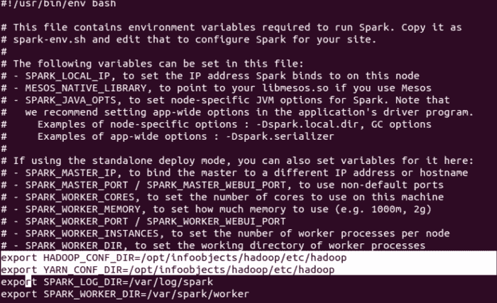

1.  以下命令在`yarn-client`模式下启动 YARN Spark：

```scala
$ spark-submit --class path.to.your.Class --master yarn-client [options] <app jar> [app options]

```

这是一个例子：

```scala
$ spark-submit --class com.infoobjects.TwitterFireHose --master yarn-client --num-executors 3 --driver-memory 4g --executor-memory 2g --executor-cores 1 target/sparkio.jar 10

```

1.  以下命令在`yarn-client`模式下启动 Spark shell：

```scala
$ spark-shell --master yarn-client

```

1.  以`yarn-cluster`模式启动的命令如下：

```scala
$ spark-submit --class path.to.your.Class --master yarn-cluster [options] <app jar> [app options]

```

这是一个例子：

```scala
$ spark-submit --class com.infoobjects.TwitterFireHose --master yarn-cluster --num-executors 3 --driver-memory 4g --executor-memory 2g --executor-cores 1 targe
t/sparkio.jar 10

```

## 工作原理...

YARN 上的 Spark 应用程序以两种模式运行：

+   `yarn-client`：Spark Driver 在 YARN 集群之外的客户端进程中运行，`ApplicationMaster`仅用于从 ResourceManager 协商资源

+   `yarn-cluster`：Spark Driver 在由从节点上的`NodeManager`生成的`ApplicationMaster`中运行

`yarn-cluster`模式适用于生产部署，而`yarn-client`模式适用于开发和调试，当您希望立即看到输出时。在任何模式下都不需要指定 Spark 主节点，因为它是从 Hadoop 配置中选择的，主参数是`yarn-client`或`yarn-cluster`。

以下图显示了在客户端模式下如何使用 YARN 运行 Spark：

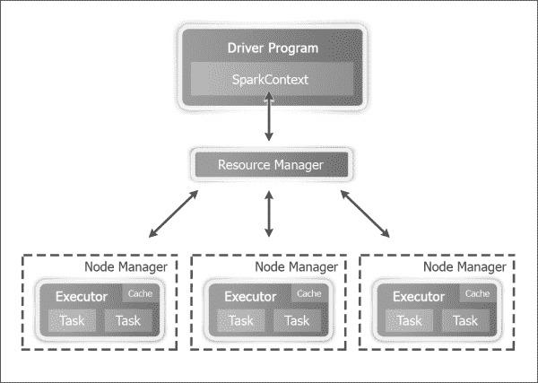

以下图显示了在集群模式下如何使用 YARN 运行 Spark：

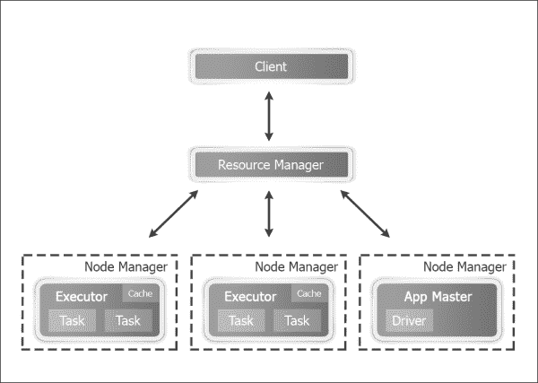

在 YARN 模式下，可以设置以下配置参数：

+   `--num-executors`：配置将分配多少个 executor

+   `--executor-memory`：每个 executor 的 RAM

+   `--executor-cores`：每个 executor 的 CPU 核心

# 使用 Tachyon 作为离堆存储层

Spark RDD 是一种在内存中存储数据集的好方法，同时在不同应用程序中产生相同数据的多个副本。Tachyon 解决了 Spark RDD 管理中的一些挑战。其中一些是：

+   RDD 仅存在于 Spark 应用程序的持续时间内

+   同一进程执行计算和 RDD 内存存储；因此，如果一个进程崩溃，内存存储也会消失

+   即使是针对相同底层数据的不同作业也不能共享 RDD，例如导致 HDFS 块的情况：

+   向磁盘写入速度慢

+   内存中数据的重复，内存占用更高

+   如果一个应用程序的输出需要与另一个应用程序共享，由于磁盘中的复制，速度会很慢

Tachyon 提供了一个离堆内存层来解决这些问题。这一层是离堆的，不受进程崩溃的影响，也不受垃圾回收的影响。这也允许 RDD 在应用程序之间共享，并且在特定作业或会话之外存在；实质上，数据的内存中只有一个副本，如下图所示：

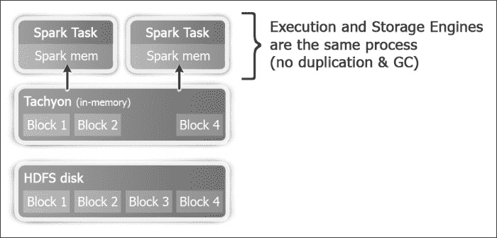

## 如何操作...

1.  让我们下载并编译 Tachyon（默认情况下，Tachyon 配置为 Hadoop 1.0.4，因此需要根据正确的 Hadoop 版本从源代码编译）。将版本替换为当前版本。撰写本书时的当前版本为 0.6.4：

```scala
$ wget https://github.com/amplab/tachyon/archive/v<version>.zip

```

1.  解压源代码：

```scala
$ unzip  v-<version>.zip

```

1.  为方便起见，从`tachyon`源文件夹名称中删除版本：

```scala
$ mv tachyon-<version> tachyon

```

1.  切换到`tachyon`文件夹：

```scala
$ cd tachyon
$ mvn -Dhadoop.version=2.4.0 clean package -DskipTests=true
$ cd conf
$ sudo mkdir -p /var/tachyon/journal
$ sudo chown -R hduser:hduser /var/tachyon/journal
$ sudo mkdir -p /var/tachyon/ramdisk
$ sudo chown -R hduser:hduser /var/tachyon/ramdisk

$ mv tachyon-env.sh.template tachyon-env.sh
$ vi tachyon-env.sh

```

1.  注释以下行：

```scala
export TACHYON_UNDERFS_ADDRESS=$TACHYON_HOME/underfs

```

1.  取消注释以下行：

```scala
export TACHYON_UNDERFS_ADDRESS=hdfs://localhost:9000

```

1.  更改以下属性：

```scala
-Dtachyon.master.journal.folder=/var/tachyon/journal/

export TACHYON_RAM_FOLDER=/var/tachyon/ramdisk

$ sudo mkdir -p /var/log/tachyon
$ sudo chown -R hduser:hduser /var/log/tachyon
$ vi log4j.properties

```

1.  将`${tachyon.home}`替换为`/var/log/tachyon`。

1.  在`conf`目录中创建一个新的`core-site.xml`文件：

```scala
$ sudo vi core-site.xml
<configuration>
<property>
 <name>fs.tachyon.impl</name>
 <value>tachyon.hadoop.TFS</value>
 </property>
</configuration>
$ cd ~
$ sudo mv tachyon /opt/infoobjects/
$ sudo chown -R root:root /opt/infoobjects/tachyon
$ sudo chmod -R 755 /opt/infoobjects/tachyon

```

1.  将`<tachyon home>/bin`添加到路径中：

```scala
$ echo "export PATH=$PATH:/opt/infoobjects/tachyon/bin" >> /home/hduser/.bashrc

```

1.  重新启动 shell 并格式化 Tachyon：

```scala
$ tachyon format
$ tachyon-start.sh local //you need to enter root password as RamFS needs to be formatted

```

Tachyon 的 web 界面是`http://hostname:19999`：

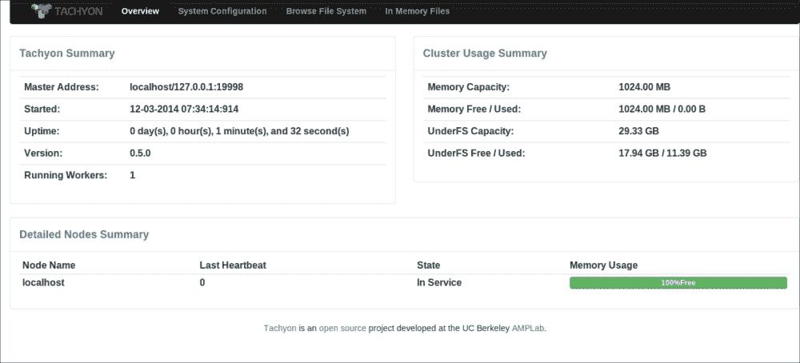

1.  运行示例程序，查看 Tachyon 是否正常运行：

```scala
$ tachyon runTest Basic CACHE_THROUGH

```

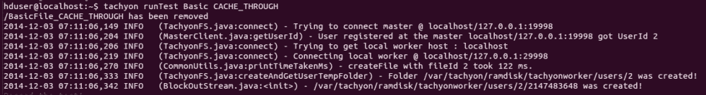

1.  您可以随时通过运行以下命令停止 Tachyon：

```scala
$ tachyon-stop.sh

```

1.  在 Tachyon 上运行 Spark：

```scala
$ spark-shell
scala> val words = sc.textFile("tachyon://localhost:19998/words")
scala> words.count
scala> words.saveAsTextFile("tachyon://localhost:19998/w2")
scala> val person = sc.textFile("hdfs://localhost:9000/user/hduser/person")
scala> import org.apache.spark.api.java._
scala> person.persist(StorageLevels.OFF_HEAP)

```

## 另请参阅

+   点击链接[`www.cs.berkeley.edu/~haoyuan/papers/2013_ladis_tachyon.pdf`](http://www.cs.berkeley.edu/~haoyuan/papers/2013_ladis_tachyon.pdf)了解 Tachyon 的起源

+   点击链接[`www.tachyonnexus.com`](http://www.tachyonnexus.com)
