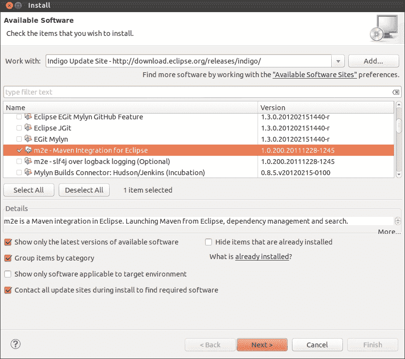
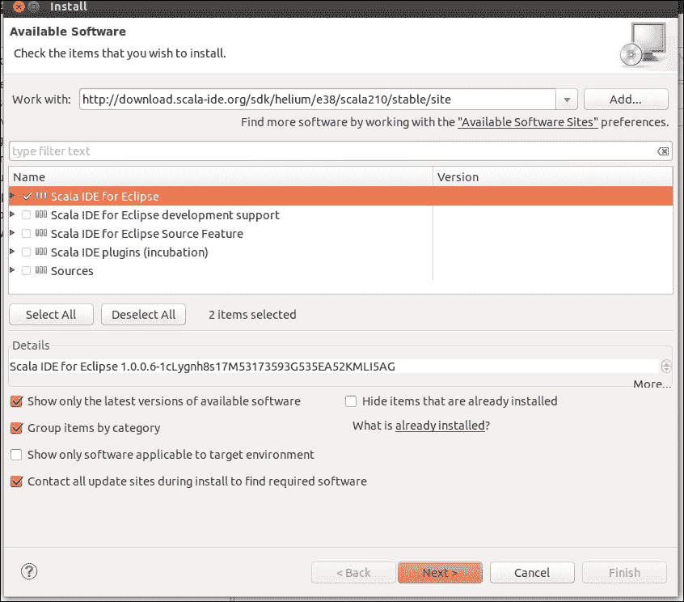
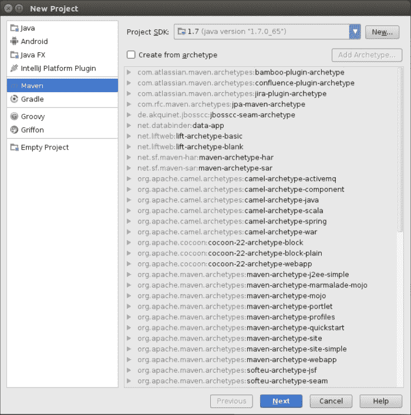
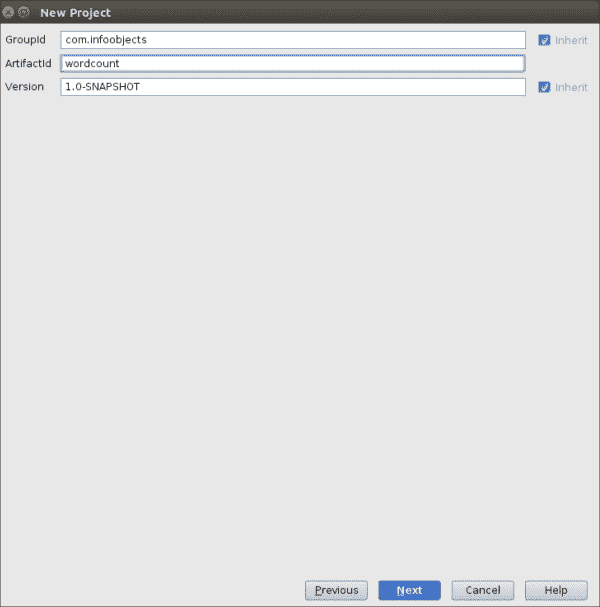
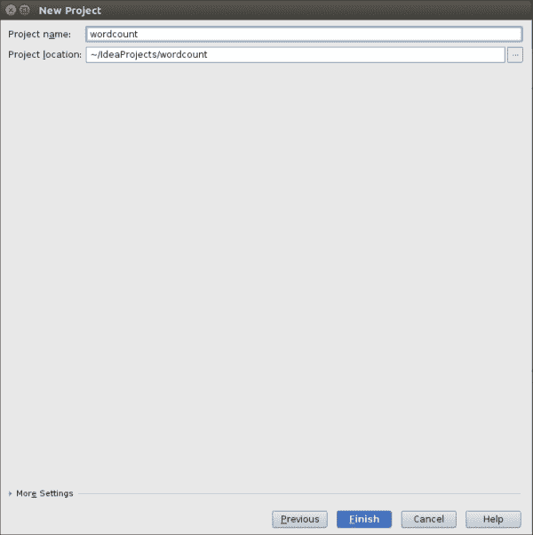

# 第二章：使用 Spark 开发应用程序

在本章中，我们将涵盖：

+   探索 Spark shell

+   在 Eclipse 中使用 Maven 开发 Spark 应用程序

+   在 Eclipse 中使用 SBT 开发 Spark 应用程序

+   在 Intellij IDEA 中使用 Maven 开发 Spark 应用程序

+   在 Intellij IDEA 中使用 SBT 开发 Spark 应用程序

# 介绍

要创建生产质量的 Spark 作业/应用程序，使用各种**集成开发环境**（**IDEs**）和构建工具非常有用。本章将涵盖各种 IDE 和构建工具。

# 探索 Spark shell

Spark 自带一个 REPL shell，它是 Scala shell 的包装器。尽管 Spark shell 看起来像是用于简单事务的命令行，但实际上也可以使用它执行许多复杂的查询。本章探讨了可以开发 Spark 应用程序的不同开发环境。

## 如何做...

使用 Spark shell，Hadoop MapReduce 的单词计数变得非常简单。在这个示例中，我们将创建一个简单的一行文本文件，将其上传到**Hadoop 分布式文件系统**（**HDFS**），并使用 Spark 来计算单词的出现次数。让我们看看如何做到：

1.  使用以下命令创建`words`目录：

```scala
$ mkdir words

```

1.  进入`words`目录：

```scala
$ cd words

```

1.  创建一个`sh.txt`文本文件，并在其中输入`"to be or not to be"`：

```scala
$ echo "to be or not to be" > sh.txt

```

1.  启动 Spark shell：

```scala
$ spark-shell

```

1.  将`words`目录加载为 RDD：

```scala
Scala> val words = sc.textFile("hdfs://localhost:9000/user/hduser/words")

```

1.  统计行数（结果：1）：

```scala
Scala> words.count

```

1.  将行（或行）分成多个单词：

```scala
Scala> val wordsFlatMap = words.flatMap(_.split("\\W+"))

```

1.  将`word`转换为（word,1）—即，将`1`作为每个`word`出现的值作为键输出：

```scala
Scala> val wordsMap = wordsFlatMap.map( w => (w,1))

```

1.  使用`reduceByKey`方法将每个单词的出现次数作为键相加（该函数在两个连续值上运行，由`a`和`b`表示）：

```scala
Scala> val wordCount = wordsMap.reduceByKey( (a,b) => (a+b))

```

1.  对结果进行排序：

```scala
Scala> val wordCountSorted = wordCount.sortByKey(true)

```

1.  打印 RDD：

```scala
Scala> wordCountSorted.collect.foreach(println)

```

1.  将所有前述操作合并为一步如下：

```scala
Scala> sc.textFile("hdfs://localhost:9000/user/hduser/words"). flatMap(_.split("\\W+")).map( w => (w,1)). reduceByKey( (a,b) => (a+b)).sortByKey(true).collect.foreach(println)

```

这给我们以下输出：

```scala
(or,1)
(to,2)
(not,1)
(be,2)

```

现在您了解了基础知识，可以加载大量文本（例如故事）到 HDFS 中，看看魔法。

如果文件以压缩格式存在，可以直接在 HDFS 中加载它们。Hadoop 和 Spark 都有用于解压缩的编解码器，它们根据文件扩展名使用。

当`wordsFlatMap`转换为`wordsMap` RDD 时，发生了隐式转换。这将 RDD 转换为`PairRDD`。这是一个隐式转换，不需要做任何事情。如果您在 Scala 代码中执行此操作，请添加以下`import`语句：

```scala
import org.apache.spark.SparkContext._
```

# 在 Eclipse 中使用 Maven 开发 Spark 应用程序

多年来，Maven 作为构建工具已经成为事实上的标准。如果我们深入了解 Maven 所带来的承诺，这并不令人意外。Maven 有两个主要特点，它们是：

+   **约定优于配置**：在 Maven 之前的构建工具中，开发人员可以自由选择放置源文件、测试文件、编译文件等的位置。Maven 取消了这种自由。有了这种自由，所有关于位置的混乱也消失了。在 Maven 中，每样东西都有一个特定的目录结构。以下表格显示了一些最常见的位置：

| `/src/main/scala` | Scala 中的源代码 |
| --- | --- |
| `/src/main/java` | Java 中的源代码 |
| `/src/main/resources` | 源代码使用的资源，如配置文件 |
| `/src/test/scala` | Scala 中的测试代码 |
| `/src/test/java` | Java 中的测试代码 |
| `/src/test/resources` | 测试代码使用的资源，如配置文件 |

+   **声明式依赖管理**：在 Maven 中，每个库都是通过以下三个坐标来定义的：

| `groupId` | 逻辑上将类库分组的一种方式，类似于 Java/Scala 中的包，至少必须是您拥有的域名，例如`org.apache.spark` |
| --- | --- |
| `artifactId` | 项目和 JAR 的名称 |
| `version` | 标准版本号 |

在`pom.xml`中（告诉 Maven 有关项目的所有信息的配置文件）中，依赖关系以这三个坐标的形式声明。无需在互联网上搜索、下载、解压缩和复制库。您只需要提供所需的依赖 JAR 的三个坐标，Maven 将为您完成其余工作。以下是使用 JUnit 依赖项的示例：

```scala
<dependency>
  <groupId>junit</groupId>
  <artifactId>junit</artifactId>
  <version>4.12</version>
</dependency>
```

这使得包括传递依赖关系在内的依赖管理变得非常容易。在 Maven 之后出现的构建工具，如 SBT 和 Gradle，也遵循这两个规则，并在其他方面提供增强功能。

## 准备工作

从这个食谱开始，本章假设您已经安装了 Eclipse。请访问[`www.eclipse.org`](http://www.eclipse.org)获取详细信息。

## 如何做...

让我们看看如何为 Eclipse 安装 Maven 插件：

1.  打开 Eclipse，导航到**帮助** | **安装新软件**。

1.  单击“工作区”下拉菜单。

1.  选择<eclipse 版本>更新站点。

1.  单击**协作工具**。

1.  检查 Maven 与 Eclipse 的集成，如下截图所示：

1.  单击**下一步**，然后单击**完成**。

重新启动 Eclipse 后，将会出现提示安装 Maven。

现在让我们看看如何为 Eclipse 安装 Scala 插件：

1.  打开 Eclipse，导航到**帮助** | **安装新软件**。

1.  单击“工作区”下拉菜单。

1.  选择<eclipse 版本>更新站点。

1.  键入`http://download.scala-ide.org/sdk/helium/e38/scala210/stable/site`。

1.  按下*Enter*。

1.  选择**Scala IDE for Eclipse**：

1.  单击**下一步**，然后单击**完成**。重新启动 Eclipse 后，将会出现提示安装 Scala。

1.  导航到**窗口** | **打开透视图** | **Scala**。

Eclipse 现在已准备好用于 Scala 开发！

# 在 Eclipse 中使用 SBT 开发 Spark 应用程序

**Simple Build Tool**（**SBT**）是专为基于 Scala 的开发而制作的构建工具。SBT 遵循 Maven 的命名约定和声明性依赖管理。

SBT 相对于 Maven 提供了以下增强功能：

+   依赖关系以`build.sbt`文件中的键值对的形式提供，而不是 Maven 中的`pom.xml`

+   它提供了一个 shell，非常方便执行构建操作

+   对于没有依赖关系的简单项目，甚至不需要`build.sbt`文件

在`build.sbt`中，第一行是项目定义：

```scala
lazy val root = (project in file("."))
```

每个项目都有一个不可变的键值对映射。这个映射通过 SBT 中的设置进行更改，如下所示：

```scala
lazy val root = (project in file("."))
  settings(
    name := "wordcount"
  )
```

设置的每次更改都会导致一个新的映射，因为它是一个不可变的映射。

## 如何做...

以下是如何添加`sbteclipse`插件的方法：

1.  将此添加到全局插件文件中：

```scala
$ mkdir /home/hduser/.sbt/0.13/plugins
$ echo addSbtPlugin("com.typesafe.sbteclipse" % "sbteclipse-plugin" % "2.5.0" )  > /home/hduser/.sbt/0.12/plugins/plugin.sbt

```

或者，您可以将以下内容添加到您的项目中：

```scala
$ cd <project-home>
$ echo addSbtPlugin("com.typesafe.sbteclipse" % "sbteclipse-plugin" % "2.5.0" )  > plugin.sbt

```

1.  不带任何参数启动`sbt` shell：

```scala
$sbt

```

1.  键入`eclipse`，它将创建一个准备好的 Eclipse 项目：

```scala
$ eclipse

```

1.  现在，您可以导航到**文件** | **导入** | **将现有项目导入工作区**，将项目加载到 Eclipse 中。

现在，您可以使用 Eclipse 和 SBT 在 Scala 中开发 Spark 应用程序。

# 在 IntelliJ IDEA 中使用 Maven 开发 Spark 应用程序

IntelliJ IDEA 自带了对 Maven 的支持。我们将看到如何在本食谱中创建一个新的 Maven 项目。

## 如何做...

在 IntelliJ IDEA 上使用 Maven 开发 Spark 应用程序，请执行以下步骤：

1.  在新项目窗口中选择**Maven**，然后单击**下一步**：

1.  输入项目的三个维度：

1.  输入项目的名称和位置：

1.  单击**完成**，Maven 项目已准备就绪。

# 在 IntelliJ IDEA 中使用 SBT 开发 Spark 应用程序

在 Eclipse 成名之前，IntelliJ IDEA 被认为是最优秀的 IDE 之一。IDEA 至今仍然保持着它以前的荣耀，很多开发者喜爱 IDEA。IDEA 也有一个免费的社区版。IDEA 对 SBT 提供了原生支持，这使得它非常适合 SBT 和 Scala 开发。

## 如何做到...

执行以下步骤在 IntelliJ IDEA 上使用 SBT 开发 Spark 应用程序：

1.  添加`sbt-idea`插件。

1.  添加到全局插件文件中：

```scala
$mkdir /home/hduser/.sbt/0.13/plugins
$echo addSbtPlugin("com.github.mpeltone" % "sbt-idea" % "1.6.0" )  > /home/hduser/.sbt/0.12/plugins/plugin.sbt

```

或者，你也可以将其添加到你的项目中：

```scala
$cd <project-home>
$ echo addSbtPlugin("com.github.mpeltone" % "sbt-idea" % "1.6.0" ) > plugin.sbt

```

IDEA 已经准备好与 SBT 一起使用。

现在你可以使用 Scala 开发 Spark 代码，并使用 SBT 构建。
