# 第三章：外部数据源

Spark 的一个优点是它提供了一个可以连接各种底层数据源的单一运行时。

在本章中，我们将连接到不同的数据源。本章分为以下几个示例：

+   从本地文件系统加载数据

+   从 HDFS 加载数据

+   使用自定义 InputFormat 从 HDFS 加载数据

+   从亚马逊 S3 加载数据

+   从 Apache Cassandra 加载数据

+   从关系数据库加载数据

# 介绍

Spark 为大数据提供了统一的运行时。HDFS，即 Hadoop 的文件系统，是 Spark 最常用的存储平台，因为它提供了成本效益的存储方式，可以在通用硬件上存储非结构化和半结构化数据。Spark 不仅限于 HDFS，还可以与任何 Hadoop 支持的存储一起使用。

Hadoop 支持的存储意味着可以与 Hadoop 的`InputFormat`和`OutputFormat`接口一起使用的存储格式。`InputFormat`负责从输入数据创建`InputSplits`，并将其进一步划分为记录。`OutputFormat`负责写入存储。

我们将从本地文件系统开始写入，然后转移到从 HDFS 加载数据。在*从 HDFS 加载数据*的示例中，我们将介绍最常见的文件格式：常规文本文件。在下一个示例中，我们将介绍如何在 Spark 中使用任何`InputFormat`接口来加载数据。我们还将探讨如何加载存储在亚马逊 S3 中的数据，这是一个领先的云存储平台。

我们将探索从 Apache Cassandra 加载数据，这是一个 NoSQL 数据库。最后，我们将探索从关系数据库加载数据。

# 从本地文件系统加载数据

尽管本地文件系统不适合存储大数据，因为磁盘大小限制和缺乏分布式特性，但从技术上讲，你可以使用本地文件系统在分布式系统中加载数据。但是你要访问的文件/目录必须在每个节点上都可用。

请注意，如果您计划使用此功能来加载辅助数据，这不是一个好主意。为了加载辅助数据，Spark 有一个广播变量功能，将在接下来的章节中讨论。

在这个示例中，我们将看看如何从本地文件系统中加载数据到 Spark 中。

## 如何做...

让我们从莎士比亚的"to be or not to be"的例子开始：

1.  使用以下命令创建`words`目录：

```scala
$ mkdir words

```

1.  进入`words`目录：

```scala
$ cd words

```

1.  创建`sh.txt`文本文件，并在其中输入`"to be or not to be"`：

```scala
$ echo "to be or not to be" > sh.txt

```

1.  启动 Spark shell：

```scala
$ spark-shell

```

1.  将`words`目录加载为 RDD：

```scala
scala> val words = sc.textFile("file:///home/hduser/words")

```

1.  计算行数：

```scala
scala> words.count

```

1.  将行（或行）分成多个单词：

```scala
scala> val wordsFlatMap = words.flatMap(_.split("\\W+"))

```

1.  将`word`转换为（word,1）—即，将`1`作为每个`word`的出现次数的值输出为键：

```scala
scala> val wordsMap = wordsFlatMap.map( w => (w,1))

```

1.  使用`reduceByKey`方法将每个单词的出现次数作为键添加（此函数一次处理两个连续的值，表示为`a`和`b`）：

```scala
scala> val wordCount = wordsMap.reduceByKey( (a,b) => (a+b))

```

1.  打印 RDD：

```scala
scala> wordCount.collect.foreach(println)

```

1.  在一个步骤中执行所有前面的操作如下：

```scala
scala> sc.textFile("file:///home/hduser/ words"). flatMap(_.split("\\W+")).map( w => (w,1)). reduceByKey( (a,b) => (a+b)).foreach(println)

```

这会产生以下输出：

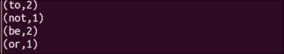

# 从 HDFS 加载数据

HDFS 是最广泛使用的大数据存储系统。HDFS 被广泛采用的原因之一是模式在读取时。这意味着在写入数据时，HDFS 不会对数据施加任何限制。任何类型的数据都受欢迎并且可以以原始格式存储。这个特性使其成为原始非结构化数据和半结构化数据的理想存储介质。

在读取数据方面，即使是非结构化数据也需要给予一些结构以理解。Hadoop 使用`InputFormat`来确定如何读取数据。Spark 完全支持 Hadoop 的`InputFormat`，因此任何 Hadoop 可以读取的内容也可以被 Spark 读取。

默认的`InputFormat`是`TextInputFormat`。`TextInputFormat`将行的字节偏移量作为键，行的内容作为值。Spark 使用`sc.textFile`方法使用`TextInputFormat`进行读取。它忽略字节偏移量并创建一个字符串的 RDD。

有时文件名本身包含有用的信息，例如时间序列数据。在这种情况下，您可能希望单独读取每个文件。`sc.wholeTextFiles`方法允许您这样做。它创建一个 RDD，其中文件名和路径（例如`hdfs://localhost:9000/user/hduser/words`）作为键，整个文件的内容作为值。

Spark 还支持使用 DataFrame 读取各种序列化和压缩友好的格式，如 Avro、Parquet 和 JSON。这些格式将在接下来的章节中介绍。

在本教程中，我们将学习如何从 HDFS 中的 Spark shell 加载数据。

## 如何做...

让我们进行单词计数，计算每个单词的出现次数。在本教程中，我们将从 HDFS 加载数据。

1.  使用以下命令创建`words`目录：

```scala
$ mkdir words

```

1.  更改目录到`words`：

```scala
$ cd words

```

1.  创建`sh.txt text`文件并在其中输入`"to be or not to be"`：

```scala
$ echo "to be or not to be" > sh.txt

```

1.  启动 Spark shell：

```scala
$ spark-shell

```

1.  将`words`目录加载为 RDD：

```scala
scala> val words = sc.textFile("hdfs://localhost:9000/user/hduser/words")

```

### 注意

`sc.textFile`方法还支持传递用于分区数的额外参数。默认情况下，Spark 为每个`InputSplit`类创建一个分区，这大致对应一个块。

您可以要求更多的分区。这对于计算密集型作业（如机器学习）非常有效。由于一个分区不能包含多个块，因此分区数不能少于块数。

1.  计算行数（结果将为`1`）：

```scala
scala> words.count

```

1.  将行（或行）分成多个单词：

```scala
scala> val wordsFlatMap = words.flatMap(_.split("\\W+"))

```

1.  将单词转换为(word,1)——也就是说，将`word`作为键的每次出现输出`1`作为值：

```scala
scala> val wordsMap = wordsFlatMap.map( w => (w,1))

```

1.  使用`reduceByKey`方法将每个单词的出现次数作为键相加（此函数一次处理两个连续的值，由`a`和`b`表示）：

```scala
scala> val wordCount = wordsMap.reduceByKey( (a,b) => (a+b))

```

1.  打印 RDD：

```scala
scala> wordCount.collect.foreach(println)

```

1.  在一步中执行所有前面的操作如下：

```scala
scala> sc.textFile("hdfs://localhost:9000/user/hduser/words"). flatMap(_.split("\\W+")).map( w => (w,1)). reduceByKey( (a,b) => (a+b)).foreach(println)

```

这将产生以下输出：


## 还有更多...

有时我们需要一次访问整个文件。有时文件名包含有用的数据，比如时间序列。有时您需要将多行作为一个记录进行处理。`sparkContext.wholeTextFiles`在这里派上了用场。我们将查看来自 ftp://ftp.ncdc.noaa.gov/pub/data/noaa/的天气数据集。

顶层目录的样子如下：

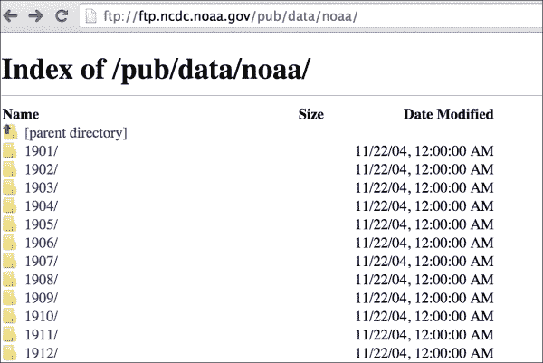

查看特定年份目录，例如 1901 年，如下截图所示：

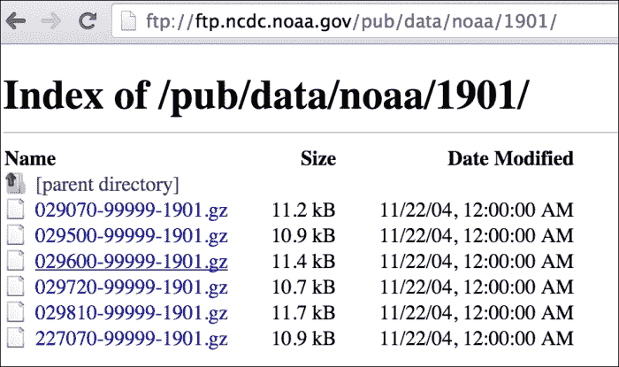

这里的数据被划分为每个文件名包含有用信息的方式，即 USAF-WBAN-year，其中 USAF 是美国空军站点编号，WBAN 是天气局陆军海军位置编号。

您还会注意到所有文件都以`.gz`扩展名压缩为 gzip。压缩是自动处理的，所以您只需要将数据上传到 HDFS。我们将在接下来的章节中回到这个数据集。

由于整个数据集并不大，因此也可以在伪分布式模式下上传到 HDFS 中：

1.  下载数据：

```scala
$ wget -r ftp://ftp.ncdc.noaa.gov/pub/data/noaa/

```

1.  在 HDFS 中加载天气数据：

```scala
$ hdfs dfs -put ftp.ncdc.noaa.gov/pub/data/noaa weather/

```

1.  启动 Spark shell：

```scala
$ spark-shell

```

1.  在 RDD 中加载 1901 年的天气数据：

```scala
scala> val weatherFileRDD = sc.wholeTextFiles("hdfs://localhost:9000/user/hduser/weather/1901")

```

1.  将天气缓存在 RDD 中，以便每次访问时不需要重新计算：

```scala
scala> val weatherRDD = weatherFileRDD.cache

```

### 注意

在 Spark 中，RDD 可以持久化在各种 StorageLevels 上。`rdd.cache`是`rdd.persist(MEMORY_ONLY)` StorageLevel 的简写。

1.  计算元素的数量：

```scala
scala> weatherRDD.count

```

1.  由于整个文件的内容被加载为一个元素，我们需要手动解释数据，因此让我们加载第一个元素：

```scala
scala> val firstElement = weatherRDD.first

```

1.  读取第一个 RDD 的值：

```scala
scala> val firstValue = firstElement._2

```

`firstElement`包含以(string, string)形式的元组。元组可以通过两种方式访问：

+   使用从`_1`开始的位置函数。

+   使用`productElement`方法，例如`tuple.productElement(0)`。这里的索引从`0`开始，就像大多数其他方法一样。

1.  通过行来分割`firstValue`：

```scala
scala> val firstVals = firstValue.split("\\n")

```

1.  计算`firstVals`中的元素数量：

```scala
scala> firstVals.size

```

1.  天气数据的模式非常丰富，文本的位置作为分隔符。您可以在国家气象局网站上获取有关模式的更多信息。让我们获取风速，它来自 66-69 节（以米/秒为单位）：

```scala
scala> val windSpeed = firstVals.map(line => line.substring(65,69)

```

# 使用自定义 InputFormat 从 HDFS 加载数据

有时您需要以特定格式加载数据，而`TextInputFormat`不适合。Spark 为此提供了两种方法：

+   `sparkContext.hadoopFile`：支持旧的 MapReduce API

+   `sparkContext.newAPIHadoopFile`：支持新的 MapReduce API

这两种方法支持所有 Hadoop 内置的 InputFormats 接口以及任何自定义`InputFormat`。

## 如何操作...

我们将以键值格式加载文本数据，并使用`KeyValueTextInputFormat`将其加载到 Spark 中：

1.  使用以下命令创建`currency`目录：

```scala
$ mkdir currency
```

1.  将当前目录更改为`currency`：

```scala
$ cd currency
```

1.  创建`na.txt`文本文件，并以制表符分隔的键值格式输入货币值（键：国家，值：货币）：

```scala
$ vi na.txt
United States of America        US Dollar
Canada  Canadian Dollar
Mexico  Peso

```

您可以为每个大陆创建更多的文件。

1.  将`currency`文件夹上传到 HDFS：

```scala
$ hdfs dfs -put currency /user/hduser/currency

```

1.  启动 Spark shell：

```scala
$ spark-shell

```

1.  导入语句：

```scala
scala> import org.apache.hadoop.io.Text
scala> import org.apache.hadoop.mapreduce.lib.input.KeyValueTextInputFormat

```

1.  将`currency`目录加载为 RDD：

```scala
val currencyFile = sc.newAPIHadoopFile("hdfs://localhost:9000/user/hduser/currency",classOf[KeyValueTextInputFormat],classOf[Text],classOf[Text])

```

1.  将其从（Text，Text）元组转换为（String，String）元组：

```scala
val currencyRDD = currencyFile.map( t => (t._1.toString,t._2.toString))

```

1.  计算 RDD 中的元素数量：

```scala
scala> currencyRDD.count

```

1.  打印值：

```scala
scala> currencyRDD.collect.foreach(println)

```

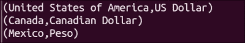

### 注意

您可以使用此方法加载任何 Hadoop 支持的`InputFormat`接口的数据。

# 从 Amazon S3 加载数据

亚马逊**简单存储服务**（**S3**）为开发人员和 IT 团队提供了一个安全、耐用和可扩展的存储平台。Amazon S3 的最大优势在于没有预先的 IT 投资，公司可以根据需要构建容量（只需点击一个按钮）。

尽管 Amazon S3 可以与任何计算平台一起使用，但它与亚马逊的云服务（如亚马逊**弹性计算云**（**EC2**）和亚马逊**弹性块存储**（**EBS**））结合得非常好。因此，使用**Amazon Web Services**（**AWS**）的公司可能已经在 Amazon S3 上存储了大量数据。

这很好地说明了从 Amazon S3 中加载数据到 Spark 的情况，这正是这个教程要讲的。

## 如何操作...

让我们从 AWS 门户开始：

1.  前往[`aws.amazon.com`](http://aws.amazon.com)并使用您的用户名和密码登录。

1.  登录后，导航至**存储和内容交付** | **S3** | **创建存储桶**：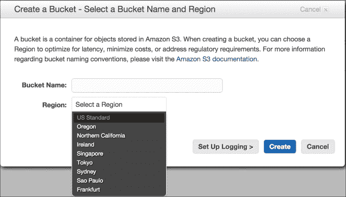

1.  输入存储桶名称，例如`com.infoobjects.wordcount`。请确保输入唯一的存储桶名称（全球没有两个 S3 存储桶可以具有相同的名称）。

1.  选择**区域**，单击**创建**，然后单击您创建的存储桶名称，您将看到以下屏幕：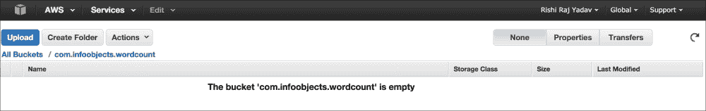

1.  单击**创建文件夹**，输入`words`作为文件夹名称。

1.  在本地文件系统上创建`sh.txt`文本文件：

```scala
$ echo "to be or not to be" > sh.txt

```

1.  导航至**Words** | **上传** | **添加文件**，并从对话框中选择`sh.txt`，如下图所示：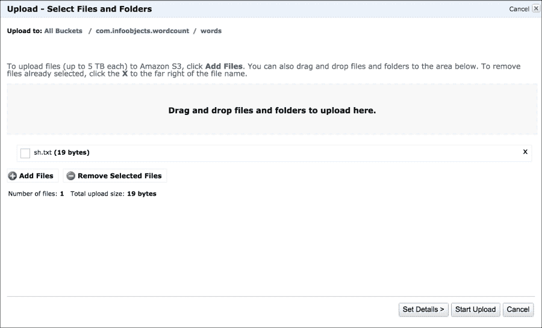

1.  单击**开始上传**。

1.  选择**sh.txt**，单击**属性**，它将显示文件的详细信息：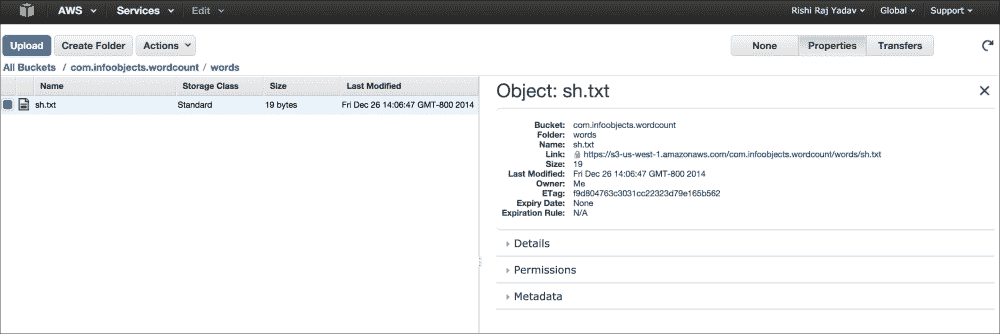

1.  将`AWS_ACCESS_KEY`和`AWS_SECRET_ACCESS_KEY`设置为环境变量。

1.  打开 Spark shell 并从`s3`中的`words`目录加载`words` RDD：

```scala
scala>  val words = sc.textFile("s3n://com.infoobjects.wordcount/words")

```

现在 RDD 已加载，您可以继续对 RDD 进行常规转换和操作。

### 注意

有时会混淆`s3://`和`s3n://`。`s3n://`表示位于 S3 存储桶中的常规文件，但可以被外部世界读取和写入。该文件系统对文件大小有 5GB 的限制。

`s3://`表示位于 S3 存储桶中的 HDFS 文件。这是一个基于块的文件系统。该文件系统要求您为此文件系统专门分配一个存储桶。在此系统中，文件大小没有限制。

# 从 Apache Cassandra 加载数据

Apache Cassandra 是一个无主环集群结构的 NoSQL 数据库。虽然 HDFS 非常适合流数据访问，但对于随机访问效果不佳。例如，当你的平均文件大小为 100MB 并且想要读取整个文件时，HDFS 会很好地工作。但是，如果你经常访问文件中的第 n 行或其他部分作为记录，HDFS 将会太慢。

传统上，关系数据库提供了解决方案，提供低延迟、随机访问，但它们在处理大数据方面效果不佳。Cassandra 等 NoSQL 数据库通过在商品服务器上提供分布式架构中的关系数据库类型访问来填补这一空白。

在本教程中，我们将从 Cassandra 加载数据作为 Spark RDD。为了实现这一点，Cassandra 背后的公司 Datastax 贡献了`spark-cassandra-connector`。这个连接器让你将 Cassandra 表加载为 Spark RDD，将 Spark RDD 写回 Cassandra，并执行 CQL 查询。

## 如何做...

执行以下步骤从 Cassandra 加载数据：

1.  使用 CQL shell 在 Cassandra 中创建一个名为`people`的 keyspace：

```scala
cqlsh> CREATE KEYSPACE people WITH replication = {'class': 'SimpleStrategy', 'replication_factor': 1 };

```

1.  在较新版本的 Cassandra 中创建一个列族（从 CQL 3.0 开始，也可以称为**表**）`person`：

```scala
cqlsh> create columnfamily person(id int primary key,first_name varchar,last_name varchar);

```

1.  在列族中插入几条记录：

```scala
cqlsh> insert into person(id,first_name,last_name) values(1,'Barack','Obama');
cqlsh> insert into person(id,first_name,last_name) values(2,'Joe','Smith');

```

1.  将 Cassandra 连接器依赖项添加到 SBT：

```scala
"com.datastax.spark" %% "spark-cassandra-connector" % 1.2.0

```

1.  您还可以将 Cassandra 依赖项添加到 Maven 中：

```scala
<dependency>
  <groupId>com.datastax.spark</groupId>
  <artifactId>spark-cassandra-connector_2.10</artifactId>
  <version>1.2.0</version>
</dependency>
```

或者，您也可以直接下载`spark-cassandra-connector` JAR 并在 Spark shell 中使用：

```scala
$ wget http://central.maven.org/maven2/com/datastax/spark/spark-cassandra-connector_2.10/1.1.0/spark-cassandra-connector_2.10-1.2.0.jar

```

### 注意

如果您想要构建带有所有依赖项的`uber` JAR，请参考*更多内容...*部分。

1.  现在启动 Spark shell。

1.  在 Spark shell 中设置`spark.cassandra.connection.host`属性：

```scala
scala> sc.getConf.set("spark.cassandra.connection.host", "localhost")

```

1.  导入特定于 Cassandra 的库：

```scala
scala> import com.datastax.spark.connector._

```

1.  将`person`列族加载为 RDD：

```scala
scala> val personRDD = sc.cassandraTable("people","person")

```

1.  计算 RDD 中的记录数：

```scala
scala> personRDD.count

```

1.  打印 RDD 中的数据：

```scala
scala> personRDD.collect.foreach(println)

```

1.  检索第一行：

```scala
scala> val firstRow = personRDD.first

```

1.  获取列名：

```scala
scala> firstRow.columnNames

```

1.  Cassandra 也可以通过 Spark SQL 访问。它在`SQLContext`周围有一个名为`CassandraSQLContext`的包装器；让我们加载它：

```scala
scala> val cc = new org.apache.spark.sql.cassandra.CassandraSQLContext(sc)

```

1.  将`person`数据加载为`SchemaRDD`：

```scala
scala> val p = cc.sql("select * from people.person")

```

1.  检索`person`数据：

```scala
scala> p.collect.foreach(println)

```

## 更多内容...

Spark Cassandra 的连接器库有很多依赖项。连接器本身和它的一些依赖项是 Spark 的第三方，不作为 Spark 安装的一部分提供。

这些依赖项需要在驱动程序和执行器运行时提供。一种方法是捆绑所有传递依赖项，但这是一个费力且容易出错的过程。推荐的方法是将所有依赖项与连接器库一起捆绑。这将产生一个 fat JAR，通常称为`uber` JAR。

SBT 提供了`sb-assembly`插件，可以很容易地创建`uber` JAR。以下是创建`spark-cassandra-connector`的`uber` JAR 的步骤。这些步骤足够通用，可以用来创建任何`uber` JAR：

1.  创建一个名为`uber`的文件夹：

```scala
$ mkdir uber

```

1.  将目录更改为`uber`：

```scala
$ cd uber

```

1.  打开 SBT 提示符：

```scala
$ sbt

```

1.  给这个项目命名为`sc-uber`：

```scala
> set name := "sc-uber"

```

1.  保存会话：

```scala
> session save

```

1.  退出会话：

```scala
> exit

```

这将在`uber`文件夹中创建`build.sbt`，`project`和`target`文件夹，如下面的屏幕截图所示：

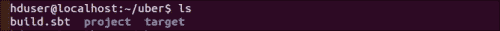

1.  在`build.sbt`的末尾添加`spark-cassandra-driver`依赖项，留下一个空行，如下面的屏幕截图所示：

```scala
$ vi buid.sbt

```

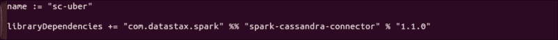

1.  我们将使用`MergeStrategy.first`作为默认选项。此外，有一些文件，如`manifest.mf`，每个 JAR 都会捆绑用于元数据，我们可以简单地丢弃它们。我们将使用`MergeStrategy.discard`。以下是带有`assemblyMergeStrategy`的`build.sbt`的屏幕截图：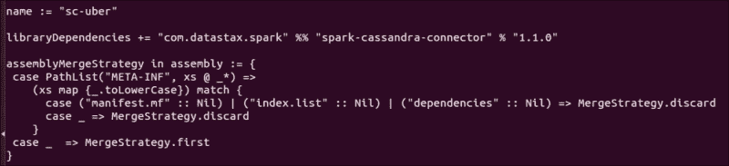

1.  现在在`project`文件夹中创建`plugins.sbt`，并为`sbt-assembly`插件输入以下内容：

```scala
addSbtPlugin("com.eed3si9n" % "sbt-assembly" % "0.12.0")

```

1.  我们现在准备构建（装配）一个 JAR：

```scala
$ sbt assembly

```

`uber` JAR 现在创建在`target/scala-2.10/sc-uber-assembly-0.1-SNAPSHOT.jar`中。

1.  将其复制到一个适当的位置，您可以在那里保存所有第三方 JAR 文件，例如`/home/hduser/thirdparty`，并将其重命名为更简单的名称（除非您喜欢更长的名称）：

```scala
$ mv thirdparty/sc-uber-assembly-0.1-SNAPSHOT.jar  thirdparty/sc-uber.jar

```

1.  使用`--jars`加载`uber` JAR 启动 Spark shell：

```scala
$ spark-shell --jars thirdparty/sc-uber.jar

```

1.  要将 Scala 代码提交到集群，可以使用相同的 JARS 选项调用`spark-submit`：

```scala
$ spark-submit --jars thirdparty/sc-uber.jar

```

### sbt-assembly 中的合并策略

如果多个 JAR 具有具有相同名称和相同相对路径的文件，则`sbt-assembly`插件的默认合并策略是验证所有文件的内容是否相同，否则会出错。此策略称为`MergeStrategy.deduplicate`。

sbt-assembly 插件中可用的合并策略如下：

| 策略名称 | 描述 |
| --- | --- |
| `MergeStrategy.deduplicate` | 默认策略 |
| `MergeStrategy.first` | 根据类路径选择第一个文件 |
| `MergeStrategy.last` | 根据类路径选择最后一个文件 |
| `MergeStrategy.singleOrError` | 出错（不期望合并冲突） |
| `MergeStrategy.concat` | 将所有匹配的文件连接在一起 |
| `MergeStrategy.filterDistinctLines` | 连接并排除重复行 |
| `MergeStrategy.rename` | 重命名文件 |

# 从关系数据库加载数据

Spark 需要查询的许多重要数据存储在关系数据库中。JdbcRDD 是一个 Spark 功能，允许将关系表加载为 RDD。本教程将解释如何使用 JdbcRDD。

下一章将介绍的 Spark SQL 包括一个用于 JDBC 的数据源。这应该优先于当前的教程，因为结果将作为 DataFrame（将在下一章中介绍）返回，可以很容易地由 Spark SQL 处理，并与其他数据源连接。

## 准备工作

请确保 JDBC 驱动程序 JAR 在客户端节点和所有执行程序将运行的所有从节点上可见。

## 如何做…

执行以下步骤从关系数据库中加载数据：

1.  使用以下 DDL 在 MySQL 中创建名为`person`的表：

```scala
CREATE TABLE 'person' (
  'person_id' int(11) NOT NULL AUTO_INCREMENT,
  'first_name' varchar(30) DEFAULT NULL,
  'last_name' varchar(30) DEFAULT NULL,
  'gender' char(1) DEFAULT NULL,
  PRIMARY KEY ('person_id');
)
```

1.  插入一些数据：

```scala
Insert into person values('Barack','Obama','M');
Insert into person values('Bill','Clinton','M');
Insert into person values('Hillary','Clinton','F');
```

1.  从[`dev.mysql.com/downloads/connector/j/`](http://dev.mysql.com/downloads/connector/j/)下载`mysql-connector-java-x.x.xx-bin.jar`。

1.  使 MySQL 驱动程序可用于 Spark shell 并启动它：

```scala
$ spark-shell --jars /path-to-mysql-jar/mysql-connector-java-5.1.29-bin.jar

```

### 注意

请注意，`path-to-mysql-jar`不是实际的路径名。您应该使用实际的路径名。

1.  创建用户名、密码和 JDBC URL 的变量：

```scala
scala> val url="jdbc:mysql://localhost:3306/hadoopdb"
scala> val username = "hduser"
scala> val password = "******"

```

1.  导入 JdbcRDD：

```scala
scala> import org.apache.spark.rdd.JdbcRDD

```

1.  导入与 JDBC 相关的类：

```scala
scala> import java.sql.{Connection, DriverManager, ResultSet}

```

1.  创建 JDBC 驱动程序的实例：

```scala
scala> Class.forName("com.mysql.jdbc.Driver").newInstance

```

1.  加载 JdbcRDD：

```scala
scala> val myRDD = new JdbcRDD( sc, () =>
DriverManager.getConnection(url,username,password) ,
"select first_name,last_name,gender from person limit ?, ?",
1, 5, 2, r => r.getString("last_name") + ", " + r.getString("first_name"))

```

1.  现在查询结果：

```scala
scala> myRDD.count
scala> myRDD.foreach(println)

```

1.  将 RDD 保存到 HDFS：

```scala
scala> myRDD.saveAsTextFile("hdfs://localhost:9000/user/hduser/person")

```

## 工作原理… 

JdbcRDD 是一个在 JDBC 连接上执行 SQL 查询并检索结果的 RDD。以下是一个 JdbcRDD 构造函数：

```scala
JdbcRDD( SparkContext, getConnection: () => Connection,
sql: String, lowerBound: Long, upperBound: Long,
numPartitions: Int,  mapRow: (ResultSet) => T =
 JdbcRDD.resultSetToObjectArray)

```

两个?是 JdbcRDD 内部准备语句的绑定变量。第一个?是偏移量（下限），也就是说，我们应该从哪一行开始计算，第二个?是限制（上限），也就是说，我们应该读取多少行。

JdbcRDD 是一种直接从关系数据库中以临时基础加载数据到 Spark 的好方法。如果您想要从 RDBMS 中批量加载数据，还有其他更好的方法，例如，Apache Sqoop 是一个强大的工具，可以将数据从关系数据库导入到 HDFS，并从 HDFS 导出数据。
