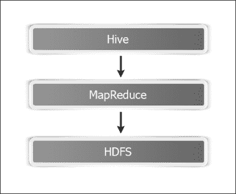
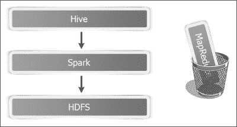
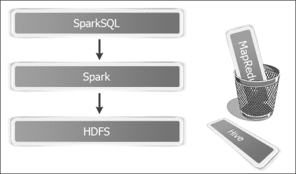
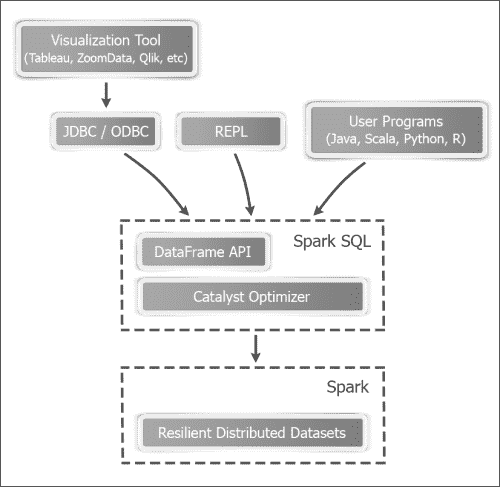
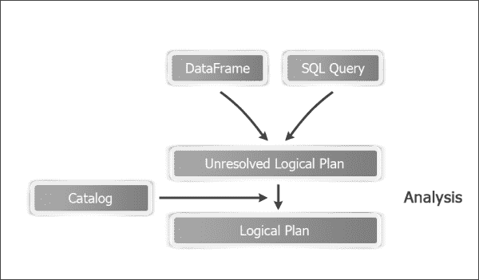
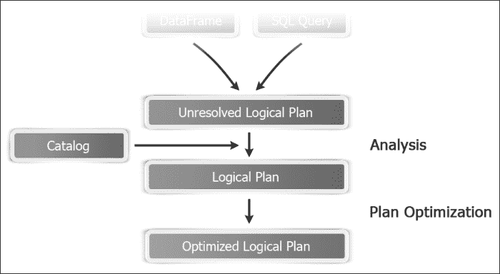
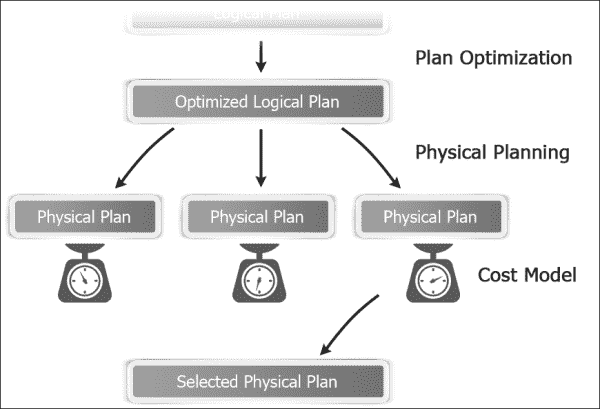

# 第四章：Spark SQL

Spark SQL 是用于处理结构化数据的 Spark 模块。本章分为以下几个部分：

+   了解 Catalyst 优化器

+   创建 HiveContext

+   使用案例类推断模式

+   以编程方式指定模式

+   使用 Parquet 格式加载和保存数据

+   使用 JSON 格式加载和保存数据

+   从关系数据库加载和保存数据

+   从任意源加载和保存数据

# 介绍

Spark 可以处理来自各种数据源的数据，如 HDFS、Cassandra、HBase 和关系数据库，包括 HDFS。大数据框架（不像关系数据库系统）在写入时不强制执行模式。HDFS 是一个完美的例子，在写入阶段任何任意文件都是可以的。然而，读取数据是另一回事。即使是完全非结构化的数据，你也需要给它一些结构来理解。有了这些结构化数据，SQL 在分析时非常方便。

Spark SQL 是 Spark 生态系统中相对较新的组件，首次在 Spark 1.0 中引入。它包含了一个名为 Shark 的项目，这是一个让 Hive 在 Spark 上运行的尝试。

Hive 本质上是一个关系抽象，它将 SQL 查询转换为 MapReduce 作业。



Shark 用 Spark 替换了 MapReduce 部分，同时保留了大部分代码库。



最初，它运行良好，但很快，Spark 开发人员遇到了障碍，无法进一步优化。最终，他们决定从头开始编写 SQL 引擎，这就诞生了 Spark SQL。



Spark SQL 解决了所有性能挑战，但它必须与 Hive 兼容，因此，`HiveContext`上面创建了一个新的包装器上下文`SQLContext`。

Spark SQL 支持使用标准 SQL 查询和 HiveQL 访问数据，HiveQL 是 Hive 使用的类似 SQL 的查询语言。在本章中，我们将探索 Spark SQL 的不同特性。它支持 HiveQL 的一个子集以及 SQL 92 的一个子集。它可以在现有的 Hive 部署中运行 SQL/HiveQL 查询或替代它们。

运行 SQL 只是创建 Spark SQL 的原因之一。一个很大的原因是它有助于更快地创建和运行 Spark 程序。它让开发人员编写更少的代码，程序读取更少的数据，并让优化器来处理所有繁重的工作。

Spark SQL 使用了一个名为 DataFrame 的编程抽象。它是一个以命名列组织的分布式数据集合。DataFrame 相当于数据库表，但提供了更精细的优化级别。DataFrame API 还确保了 Spark 在不同语言绑定中的性能是一致的。

让我们对比一下 DataFrame 和 RDD。RDD 是一个不透明的对象集合，对底层数据格式一无所知。相反，DataFrame 与它们关联了模式。实际上，直到 Spark 1.2，有一个名为**SchemaRDD**的组件，现在已经演变成了 DataFrame。它们提供比 SchemaRDD 更丰富的功能。

关于模式的额外信息使得许多优化成为可能，这是其他情况下不可能的。

DataFrame 还可以透明地从各种数据源加载，如 Hive 表、Parquet 文件、JSON 文件和使用 JDBC 的外部数据库。DataFrame 可以被视为一组行对象的 RDD，允许用户调用过程式的 Spark API，如 map。

DataFrame API 在 Spark 1.4 开始提供 Scala、Java、Python 和 R。

用户可以使用**领域特定语言**（**DSL**）在 DataFrame 上执行关系操作。DataFrame 支持所有常见的关系操作符，它们都使用有限的 DSL 中的表达式对象，让 Spark 捕获表达式的结构。

我们将从 Spark SQL 的入口点 SQLContext 开始。我们还将介绍 HiveContext，它是 SQLContext 的包装器，用于支持 Hive 功能。请注意，HiveContext 经过了更多的实战检验，并提供了更丰富的功能，因此强烈建议即使您不打算连接到 Hive，也要使用它。慢慢地，SQLContext 将达到与 HiveContext 相同的功能水平。

有两种方法可以将模式与 RDD 关联起来创建 DataFrame。简单的方法是利用 Scala case 类，我们将首先介绍这种方法。Spark 使用 Java 反射从 case 类中推断模式。还有一种方法可以为高级需求编程指定模式，我们将在下一节中介绍。

Spark SQL 提供了一种简单的方法来加载和保存 Parquet 文件，我们也将介绍。最后，我们将介绍从 JSON 加载和保存数据。

# 理解 Catalyst 优化器

Spark SQL 的大部分功能都来自于 Catalyst 优化器，因此花一些时间来了解它是有意义的。



## 工作原理…

Catalyst 优化器主要利用了 Scala 的函数式编程构造，如模式匹配。它提供了一个通用的框架来转换树，我们用它来执行分析、优化、规划和运行时代码生成。

Catalyst 优化器有两个主要目标：

+   使添加新的优化技术变得容易

+   使外部开发人员能够扩展优化器

Spark SQL 在四个阶段使用 Catalyst 的转换框架：

+   分析逻辑计划以解析引用

+   逻辑计划优化

+   物理规划

+   代码生成以将查询的部分编译为 Java 字节码

### 分析

分析阶段涉及查看 SQL 查询或 DataFrame，创建一个逻辑计划（仍未解析）（引用的列可能不存在或类型错误），然后使用 Catalog 对象解析此计划（连接到物理数据源），并创建一个逻辑计划，如下图所示：



### 逻辑计划优化

逻辑计划优化阶段对逻辑计划应用标准的基于规则的优化。这些包括常量折叠、谓词下推、投影修剪、空值传播、布尔表达式简化和其他规则。

我想特别注意这里的谓词下推规则。这个概念很简单；如果您在一个地方发出查询来运行对大量数据的查询，这个数据存储在另一个地方，它可能导致大量不必要的数据在网络上移动。

如果我们可以将查询的一部分下推到数据存储的地方，从而过滤掉不必要的数据，就可以显著减少网络流量。



### 物理规划

在物理规划阶段，Spark SQL 接受逻辑计划并生成一个或多个物理计划。然后它测量每个物理计划的成本，并基于此生成一个物理计划。



### 代码生成

查询优化的最后阶段涉及生成 Java 字节码以在每台机器上运行。它使用了一种特殊的 Scala 功能，称为**准引用**来实现这一点。

# 创建 HiveContext

`SQLContext`及其后代`HiveContext`是进入 Spark SQL 世界的两个入口点。`HiveContext`提供了 SQLContext 提供的功能的超集。附加功能包括：

+   更完整和经过实战检验的 HiveQL 解析器

+   访问 Hive UDFs

+   从 Hive 表中读取数据的能力

从 Spark 1.3 开始，Spark shell 加载了 sqlContext（它是`HiveContext`的实例，而不是`SQLContext`）。如果您在 Scala 代码中创建`SQLContext`，可以使用`SparkContext`来创建，如下所示：

```scala
val sc: SparkContext
val sqlContext = new org.apache.spark.sql.SQLContext(sc)
```

在本教程中，我们将介绍如何创建`HiveContext`的实例，然后通过 Spark SQL 访问 Hive 功能。

## 准备工作

为了启用 Hive 功能，请确保已启用 Hive（-Phive）装配 JAR 可在所有工作节点上使用；另外，将`hive-site.xml`复制到 Spark 安装的`conf`目录中。Spark 必须能够访问`hive-site.xml`，否则它将创建自己的 Hive 元数据存储，并且不会连接到现有的 Hive 仓库。

默认情况下，Spark SQL 创建的所有表都是由 Hive 管理的表，也就是说，Hive 完全控制表的生命周期，包括使用`drop table`命令删除表元数据。这仅适用于持久表。Spark SQL 还有机制可以将 DataFrame 创建为临时表，以便编写查询，它们不受 Hive 管理。

请注意，Spark 1.4 支持 Hive 版本 0.13.1。您可以在使用 Maven 构建时使用`-Phive-<version> build`选项指定要构建的 Hive 版本。例如，要使用 0.12.0 构建，您可以使用`-Phive-0.12.0`。

## 如何做...

1.  启动 Spark shell 并为其提供一些额外的内存：

```scala
$ spark-shell --driver-memory 1G

```

1.  创建`HiveContext`的实例：

```scala
scala> val hc = new org.apache.spark.sql.hive.HiveContext(sc)

```

1.  创建一个 Hive 表`Person`，其中`first_name`、`last_name`和`age`作为列：

```scala
scala>  hc.sql("create table if not exists person(first_name string, last_name string, age int) row format delimited fields terminated by ','")

```

1.  在另一个 shell 中创建`person`数据并放入本地文件：

```scala
$ mkdir person
$ echo "Barack,Obama,53" >> person/person.txt
$ echo "George,Bush,68" >> person/person.txt
$ echo "Bill,Clinton,68" >> person/person.txt

```

1.  在`person`表中加载数据：

```scala
scala> hc.sql("load data local inpath \"/home/hduser/person\" into table person")

```

1.  或者，从 HDFS 中加载`person`表中的数据：

```scala
scala> hc.sql("load data inpath \"/user/hduser/person\" into table person")

```

### 注意

请注意，使用`load data inpath`将数据从另一个 HDFS 位置移动到 Hive 的`warehouse`目录，默认为`/user/hive/warehouse`。您还可以指定完全限定的路径，例如`hdfs://localhost:9000/user/hduser/person`。

1.  使用 HiveQL 选择人员数据：

```scala
scala> val persons = hc.sql("from person select first_name,last_name,age")
scala> persons.collect.foreach(println)

```

1.  从`select`查询的输出创建新表：

```scala
scala> hc.sql("create table person2 as select first_name, last_name from person;")

```

1.  您还可以直接从一个表复制到另一个表：

```scala
scala> hc.sql("create table person2 like person location '/user/hive/warehouse/person'")

```

1.  创建两个表`people_by_last_name`和`people_by_age`来保持计数：

```scala
scala> hc.sql("create table people_by_last_name(last_name string,count int)")
scala> hc.sql("create table people_by_age(age int,count int)")

```

1.  您还可以使用 HiveQL 查询将记录插入多个表中：

```scala
scala> hc.sql("""from person
 insert overwrite table people_by_last_name
 select last_name, count(distinct first_name)
 group by last_name
insert overwrite table people_by_age
 select age, count(distinct first_name)
 group by age; """)

```

# 使用案例类推断模式

案例类是 Scala 中的特殊类，为您提供了构造函数、getter（访问器）、equals 和 hashCode 的样板实现，并实现了`Serializable`。案例类非常适合封装数据作为对象。熟悉 Java 的读者可以将其与**普通旧的 Java 对象**（**POJOs**）或 Java bean 相关联。

案例类的美妙之处在于，所有在 Java 中需要的繁重工作都可以在案例类中用一行代码完成。Spark 使用案例类的反射来推断模式。

## 如何做...

1.  启动 Spark shell 并为其提供一些额外的内存：

```scala
$ spark-shell --driver-memory 1G

```

1.  导入隐式转换：

```scala
scala> import sqlContext.implicits._

```

1.  创建一个`Person`案例类：

```scala
scala> case class Person(first_name:String,last_name:String,age:Int)

```

1.  在另一个 shell 中，创建一些样本数据放入 HDFS 中：

```scala
$ mkdir person
$ echo "Barack,Obama,53" >> person/person.txt
$ echo "George,Bush,68" >> person/person.txt
$ echo "Bill,Clinton,68" >> person/person.txt
$ hdfs dfs -put person person

```

1.  将`person`目录加载为 RDD：

```scala
scala> val p = sc.textFile("hdfs://localhost:9000/user/hduser/person")

```

1.  根据逗号将每行拆分为字符串数组，作为分隔符：

```scala
val pmap = p.map( line => line.split(","))

```

1.  将 Array[String]的 RDD 转换为`Person`案例对象的 RDD：

```scala
scala> val personRDD = pmap.map( p => Person(p(0),p(1),p(2).toInt))

```

1.  将`personRDD`转换为`personDF` DataFrame：

```scala
scala> val personDF = personRDD.toDF

```

1.  将`personDF`注册为表：

```scala
scala> personDF.registerTempTable("person")

```

1.  对其运行 SQL 查询：

```scala
scala> val people = sql("select * from person")

```

1.  从`persons`获取输出值：

```scala
scala> people.collect.foreach(println)

```

# 以编程方式指定模式

有些情况下案例类可能不起作用；其中之一是案例类不能拥有超过 22 个字段。另一种情况可能是您事先不知道模式。在这种方法中，数据被加载为`Row`对象的 RDD。模式是使用`StructType`和`StructField`对象分别创建的，它们分别表示表和字段。模式应用于`Row` RDD 以创建 DataFrame。

## 如何做...

1.  启动 Spark shell 并为其提供一些额外的内存：

```scala
$ spark-shell --driver-memory 1G

```

1.  导入隐式转换：

```scala
scala> import sqlContext.implicit._

```

1.  导入 Spark SQL 数据类型和`Row`对象：

```scala
scala> import org.apache.spark.sql._
scala> import org.apache.spark.sql.types._

```

1.  在另一个 shell 中，创建一些样本数据放入 HDFS 中：

```scala
$ mkdir person
$ echo "Barack,Obama,53" >> person/person.txt
$ echo "George,Bush,68" >> person/person.txt
$ echo "Bill,Clinton,68" >> person/person.txt
$ hdfs dfs -put person person

```

1.  在 RDD 中加载`person`数据：

```scala
scala> val p = sc.textFile("hdfs://localhost:9000/user/hduser/person")

```

1.  根据逗号将每行拆分为字符串数组，作为分隔符：

```scala
scala> val pmap = p.map( line => line.split(","))

```

1.  将 array[string]的 RDD 转换为`Row`对象的 RDD：

```scala
scala> val personData = pmap.map( p => Row(p(0),p(1),p(2).toInt))

```

1.  使用`StructType`和`StructField`对象创建模式。`StructField`对象以参数名、参数类型和可空性的形式接受参数：

```scala
scala> val schema = StructType(
 Array(StructField("first_name",StringType,true),
StructField("last_name",StringType,true),
StructField("age",IntegerType,true)
))

```

1.  应用模式以创建`personDF` DataFrame：

```scala
scala> val personDF = sqlContext.createDataFrame(personData,schema)

```

1.  将`personDF`注册为表：

```scala
scala> personDF.registerTempTable("person")

```

1.  对其运行 SQL 查询：

```scala
scala> val persons = sql("select * from person")

```

1.  从`persons`获取输出值：

```scala
scala> persons.collect.foreach(println)

```

在本教程中，我们学习了如何通过以编程方式指定模式来创建 DataFrame。

## 它是如何工作的…

`StructType`对象定义了模式。您可以将其视为关系世界中的表或行的等价物。`StructType`接受`StructField`对象的数组，如以下签名所示：

```scala
StructType(fields: Array[StructField])
```

`StructField`对象具有以下签名：

```scala
StructField(name: String, dataType: DataType, nullable: Boolean = true, metadata: Metadata = Metadata.empty)
```

以下是有关使用的参数的更多信息：

+   `name`：这代表字段的名称。

+   `dataType`：这显示了该字段的数据类型。

允许以下数据类型：

| `IntegerType` | `FloatType` |
| --- | --- |
| `BooleanType` | `ShortType` |
| `LongType` | `ByteType` |
| `DoubleType` | `StringType` |

+   `nullable`：这显示了该字段是否可以为 null。

+   `metadata`：这显示了该字段的元数据。元数据是`Map[String,Any]`的包装器，因此它可以包含任意元数据。

# 使用 Parquet 格式加载和保存数据

Apache Parquet 是一种列式数据存储格式，专为大数据存储和处理而设计。Parquet 基于 Google Dremel 论文中的记录分解和组装算法。在 Parquet 中，单个列中的数据是连续存储的。

列格式为 Parquet 带来了一些独特的好处。例如，如果您有一个具有 100 列的表，并且您主要访问 10 列，在基于行的格式中，您将不得不加载所有 100 列，因为粒度级别在行级别。但是，在 Parquet 中，您只会加载 10 列。另一个好处是，由于给定列中的所有数据都是相同的数据类型（根据定义），因此压缩效率要高得多。

## 如何做…

1.  打开终端并在本地文件中创建`person`数据：

```scala
$ mkdir person
$ echo "Barack,Obama,53" >> person/person.txt
$ echo "George,Bush,68" >> person/person.txt
$ echo "Bill,Clinton,68" >> person/person.txt

```

1.  将`person`目录上传到 HDFS：

```scala
$ hdfs dfs -put person /user/hduser/person

```

1.  启动 Spark shell 并为其提供一些额外的内存：

```scala
$ spark-shell --driver-memory 1G

```

1.  导入隐式转换：

```scala
scala> import sqlContext.implicits._

```

1.  为`Person`创建一个 case 类：

```scala
scala> case class Person(firstName: String, lastName: String, age:Int)

```

1.  从 HDFS 加载`person`目录并将其映射到`Person` case 类：

```scala
scala> val personRDD = sc.textFile("hdfs://localhost:9000/user/hduser/person").map(_.split("\t")).map(p => Person(p(0),p(1),p(2).toInt))

```

1.  将`personRDD`转换为`person` DataFrame：

```scala
scala> val person = personRDD.toDF

```

1.  将`person` DataFrame 注册为临时表，以便可以对其运行 SQL 查询。请注意，DataFrame 名称不必与表名相同。

```scala
scala> person.registerTempTable("person")

```

1.  选择所有年龄超过 60 岁的人：

```scala
scala> val sixtyPlus = sql("select * from person where age > 60")

```

1.  打印值：

```scala
scala> sixtyPlus.collect.foreach(println)

```

1.  让我们以 Parquet 格式保存这个`sixtyPlus` RDD：

```scala
scala> sixtyPlus.saveAsParquetFile("hdfs://localhost:9000/user/hduser/sp.parquet")

```

1.  上一步在 HDFS 根目录中创建了一个名为`sp.parquet`的目录。您可以在另一个 shell 中运行`hdfs dfs -ls`命令来确保它已创建：

```scala
$ hdfs dfs -ls sp.parquet

```

1.  在 Spark shell 中加载 Parquet 文件的内容：

```scala
scala> val parquetDF = sqlContext.load("hdfs://localhost:9000/user/hduser/sp.parquet")

```

1.  将加载的`parquet` DF 注册为`temp`表：

```scala
scala> 
parquetDF
.registerTempTable("sixty_plus")

```

1.  对上述`temp`表运行查询：

```scala
scala> sql("select * from sixty_plus")

```

## 它是如何工作的…

让我们花一些时间更深入地了解 Parquet 格式。以下是以表格格式表示的示例数据：

| 名 | 姓 | 年龄 |
| --- | --- | --- |
| Barack | Obama | 53 |
| George | Bush | 68 |
| Bill | Clinton | 68 |

在行格式中，数据将存储如下：

| Barack | Obama | 53 | George | Bush | 68 | Bill | Clinton | 68 |
| --- | --- | --- | --- | --- | --- | --- | --- | --- |

在列式布局中，数据将存储如下：

| 行组 => | Barack | George | Bill | Obama | Bush | Clinton | 53 | 68 | 68 |
| --- | --- | --- | --- | --- | --- | --- | --- | --- | --- |
|   | 列块 | 列块 | 列块 |

以下是有关不同部分的简要描述：

+   **行组**：这显示了数据在行中的水平分区。行组由列块组成。

+   **列块**：列块包含行组中给定列的数据。列块始终是物理上连续的。每个行组每列只有一个列块。

+   **页面**：列块被分成页面。页面是存储单位，不能进一步分割。页面在列块中依次写入。页面的数据可以被压缩。

如果 Hive 表中已经有数据，比如`person`表，您可以通过以下步骤直接将其保存为 Parquet 格式：

1.  创建名为`person_parquet`的表，模式与`person`相同，但存储格式为 Parquet（从 Hive 0.13 开始）：

```scala
hive> create table person_parquet like person stored as parquet

```

1.  通过从`person`表导入数据，在`person_parquet`表中插入数据：

```scala
hive> insert overwrite table person_parquet select * from person;

```

### 提示

有时，从其他来源（如 Impala）导入的数据会将字符串保存为二进制。在读取时将其转换为字符串，设置以下属性在`SparkConf`中：

```scala
scala> sqlContext.setConf("spark.sql.parquet.binaryAsString","true")

```

## 还有更多...

如果您使用的是 Spark 1.4 或更高版本，有一个新的接口可以写入和从 Parquet 中读取。要将数据写入 Parquet（第 11 步重写），让我们将这个`sixtyPlus` RDD 保存为 Parquet 格式（RDD 隐式转换为 DataFrame）：

```scala
scala>sixtyPlus.write.parquet("hdfs://localhost:9000/user/hduser/sp.parquet")

```

要从 Parquet 中读取（第 13 步重写；结果是 DataFrame），在 Spark shell 中加载 Parquet 文件的内容：

```scala
scala>val parquetDF = sqlContext.read.parquet("hdfs://localhost:9000/user/hduser/sp.parquet")

```

# 使用 JSON 格式加载和保存数据

JSON 是一种轻量级的数据交换格式。它基于 JavaScript 编程语言的一个子集。JSON 的流行与 XML 的不受欢迎直接相关。XML 是提供数据结构的一种很好的解决方案，以纯文本格式呈现。随着时间的推移，XML 文档变得越来越沉重，开销不值得。

JSON 通过提供结构并最小化开销解决了这个问题。有些人称 JSON 为**无脂肪 XML**。

JSON 语法遵循以下规则：

+   数据以键值对的形式呈现：

```scala
"firstName" : "Bill"
```

+   JSON 中有四种数据类型：

+   字符串（"firstName"："Barack"）

+   数字（"age"：53）

+   布尔值（"alive"：true）

+   null（"manager"：null）

+   数据由逗号分隔

+   花括号{}表示对象：

```scala
{ "firstName" : "Bill", "lastName": "Clinton", "age": 68 }
```

+   方括号[]表示数组：

```scala
[{ "firstName" : "Bill", "lastName": "Clinton", "age": 68 },{"firstName": "Barack","lastName": "Obama", "age": 43}]
```

在本教程中，我们将探讨如何以 JSON 格式保存和加载数据。

## 如何做...

1.  打开终端并以 JSON 格式创建`person`数据：

```scala
$ mkdir jsondata
$ vi jsondata/person.json
{"first_name" : "Barack", "last_name" : "Obama", "age" : 53}
{"first_name" : "George", "last_name" : "Bush", "age" : 68 }
{"first_name" : "Bill", "last_name" : "Clinton", "age" : 68 }

```

1.  将`jsondata`目录上传到 HDFS：

```scala
$ hdfs dfs -put jsondata /user/hduser/jsondata

```

1.  启动 Spark shell 并为其提供一些额外的内存：

```scala
$ spark-shell --driver-memory 1G

```

1.  创建`SQLContext`的实例：

```scala
scala> val sqlContext = new org.apache.spark.sql.SQLContext(sc)

```

1.  导入隐式转换：

```scala
scala> import sqlContext.implicits._

```

1.  从 HDFS 加载`jsondata`目录：

```scala
scala> val person = sqlContext.jsonFile("hdfs://localhost:9000/user/hduser/jsondata")

```

1.  将`person` DF 注册为`temp`表，以便对其运行 SQL 查询：

```scala
scala> person.registerTempTable("person")

```

1.  选择所有年龄超过 60 岁的人：

```scala
scala> val sixtyPlus = sql("select * from person where age > 60")

```

1.  打印值：

```scala
scala> sixtyPlus.collect.foreach(println)
```

1.  让我们以 JSON 格式保存这个`sixtyPlus`数据框

```scala
scala> sixtyPlus.toJSON.saveAsTextFile("hdfs://localhost:9000/user/hduser/sp")

```

1.  上一步在 HDFS 根目录创建了一个名为`sp`的目录。您可以在另一个 shell 中运行`hdfs dfs -ls`命令来确保它已创建：

```scala
$ hdfs dfs -ls sp

```

## 它的工作原理...

`sc.jsonFile`内部使用`TextInputFormat`，它一次处理一行。因此，一个 JSON 记录不能跨多行。如果使用多行，它将是有效的 JSON 格式，但不会在 Spark 中工作，并会抛出异常。

允许一行中有多个对象。例如，您可以将两个人的信息作为数组放在一行中，如下所示：

```scala
[{"firstName":"Barack", "lastName":"Obama"},{"firstName":"Bill", "lastName":"Clinton"}]
```

本教程介绍了使用 Spark 以 JSON 格式保存和加载数据的方法。

## 还有更多...

如果您使用的是 Spark 1.4 或更高版本，`SqlContext`提供了一个更容易的接口来从 HDFS 加载`jsondata`目录：

```scala
scala> val person = sqlContext.read.json ("hdfs://localhost:9000/user/hduser/jsondata")

```

`sqlContext.jsonFile`在 1.4 版本中已被弃用，推荐使用`sqlContext.read.json`。

# 从关系数据库加载和保存数据

在上一章中，我们学习了如何使用 JdbcRDD 将关系数据加载到 RDD 中。Spark 1.4 支持直接从 JDBC 资源加载数据到 Dataframe。本教程将探讨如何实现这一点。

## 准备工作

请确保 JDBC 驱动程序 JAR 在客户端节点和所有执行器将运行的从节点上可见。

## 如何做...

1.  在 MySQL 中创建名为`person`的表，使用以下 DDL：

```scala
CREATE TABLE 'person' (
  'person_id' int(11) NOT NULL AUTO_INCREMENT,
  'first_name' varchar(30) DEFAULT NULL,
  'last_name' varchar(30) DEFAULT NULL,
  'gender' char(1) DEFAULT NULL,
  'age' tinyint(4) DEFAULT NULL,
  PRIMARY KEY ('person_id')
)
```

1.  插入一些数据：

```scala
Insert into person values('Barack','Obama','M',53);
Insert into person values('Bill','Clinton','M',71);
Insert into person values('Hillary','Clinton','F',68);
Insert into person values('Bill','Gates','M',69);
Insert into person values('Michelle','Obama','F',51);
```

1.  从[`dev.mysql.com/downloads/connector/j/`](http://dev.mysql.com/downloads/connector/j/)下载`mysql-connector-java-x.x.xx-bin.jar`。

1.  使 MySQL 驱动程序可用于 Spark shell 并启动它：

```scala
$ spark-shell --driver-class-path/path-to-mysql-jar/mysql-connector-java-5.1.34-bin.jar

```

### 注意

请注意，`path-to-mysql-jar`不是实际的路径名。您需要使用您的路径名。

1.  构建 JDBC URL：

```scala
scala> val url="jdbc:mysql://localhost:3306/hadoopdb"

```

1.  创建一个包含用户名和密码的连接属性对象：

```scala
scala> val prop = new java.util.Properties
scala> prop.setProperty("user","hduser")
scala> prop.setProperty("password","********")

```

1.  使用 JDBC 数据源加载 DataFrame（url、表名、属性）：

```scala
 scala> val people = sqlContext.read.jdbc(url,"person",prop)

```

1.  通过执行以下命令以漂亮的表格格式显示结果：

```scala
scala> people.show

```

1.  这已经加载了整个表。如果我只想加载男性（url、表名、谓词、属性）怎么办？要做到这一点，请运行以下命令：

```scala
scala> val males = sqlContext.read.jdbc(url,"person",Array("gender='M'"),prop)
scala> males.show

```

1.  通过执行以下命令只显示名字：

```scala
scala> val first_names = people.select("first_name")
scala> first_names.show

```

1.  通过执行以下命令只显示年龄低于 60 岁的人：

```scala
scala> val below60 = people.filter(people("age") < 60)
scala> below60.show

```

1.  按性别对人进行分组：

```scala
scala> val grouped = people.groupBy("gender")

```

1.  通过执行以下命令找到男性和女性的数量：

```scala
scala> val gender_count = grouped.count
scala> gender_count.show

```

1.  通过执行以下命令找到男性和女性的平均年龄：

```scala
scala> val avg_age = grouped.avg("age")
scala> avg_age.show

```

1.  现在，如果您想将这个`avg_age`数据保存到一个新表中，请运行以下命令：

```scala
scala> gender_count.write.jdbc(url,"gender_count",prop)

```

1.  将 people DataFrame 以 Parquet 格式保存：

```scala
scala> people.write.parquet("people.parquet")

```

1.  将 people DataFrame 保存为 JSON 格式：

```scala
scala> people.write.json("people.json")

```

# 从任意数据源加载和保存数据

到目前为止，我们已经涵盖了三种内置于 DataFrame 中的数据源——`parquet`（默认），`json`和`jdbc`。DataFrame 不仅限于这三种，可以通过手动指定格式加载和保存到任意数据源。

在本教程中，我们将介绍从任意数据源加载和保存数据。

## 如何做到这一点...

1.  启动 Spark shell 并为其提供一些额外的内存：

```scala
$ spark-shell --driver-memory 1G

```

1.  从 Parquet 加载数据；由于`parquet`是默认数据源，您不必指定它：

```scala
scala> val people = sqlContext.read.load("hdfs://localhost:9000/user/hduser/people.parquet") 

```

1.  通过手动指定格式从 Parquet 加载数据：

```scala
scala> val people = sqlContext.read.format("org.apache.spark.sql.parquet").load("hdfs://localhost:9000/user/hduser/people.parquet") 

```

1.  对于内置数据类型（`parquet`，`json`和`jdbc`），您不必指定完整的格式名称，只需指定`"parquet"`，`"json"`或`"jdbc"`即可：

```scala
scala> val people = sqlContext.read.format("parquet").load("hdfs://localhost:9000/user/hduser/people.parquet") 

```

### 注意

在写入数据时，有四种保存模式：`append`，`overwrite`，`errorIfExists`和`ignore`。`append`模式将数据添加到数据源，`overwrite`将其覆盖，`errorIfExists`在数据已经存在时抛出异常，`ignore`在数据已经存在时不执行任何操作。

1.  将 people 保存为 JSON 格式，使用`append`模式：

```scala
scala> val people = people.write.format("json").mode("append").save ("hdfs://localhost:9000/user/hduser/people.json") 

```

## 还有更多...

Spark SQL 的数据源 API 可以保存到各种数据源。要获取更多信息，请访问[`spark-packages.org/`](http://spark-packages.org/)。
