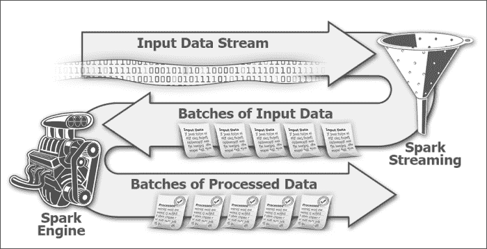
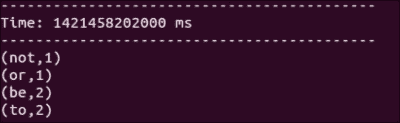
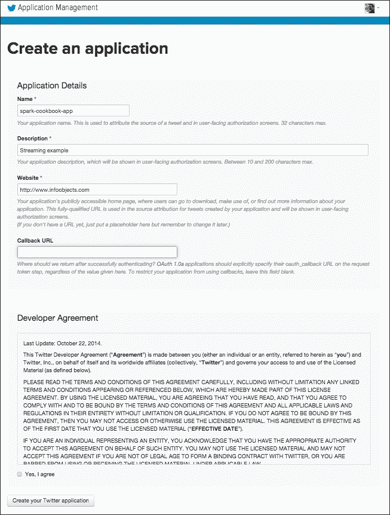
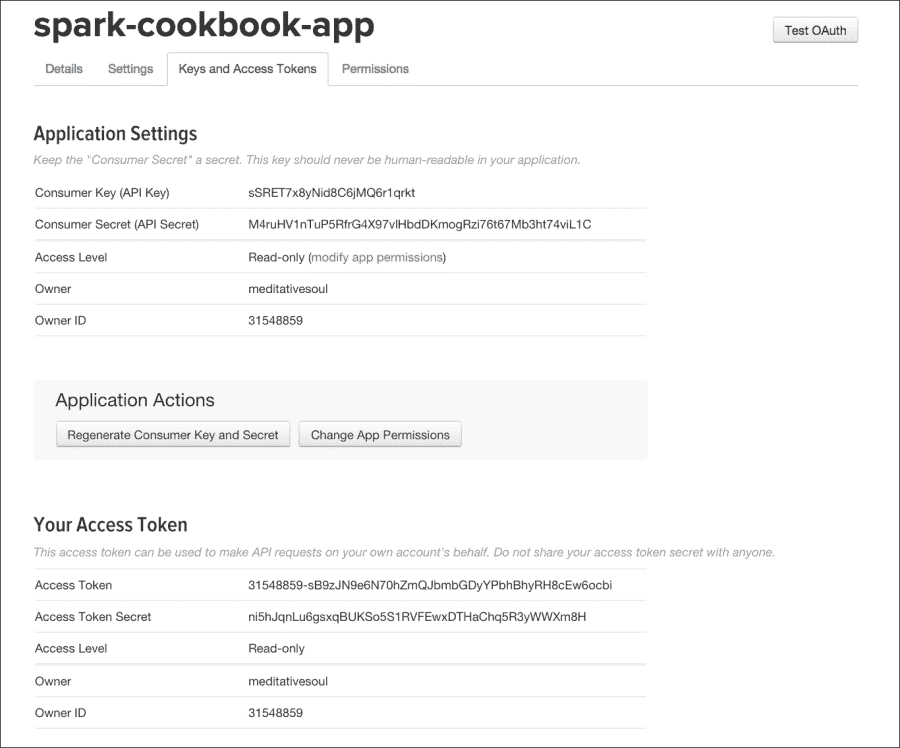
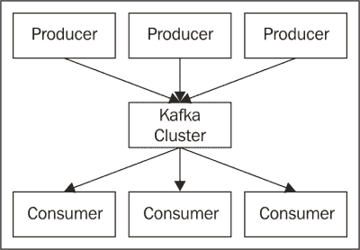
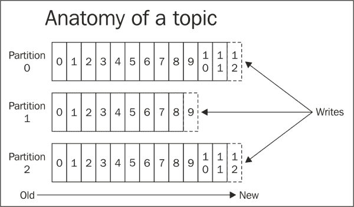
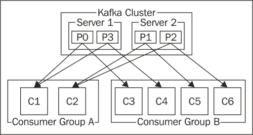
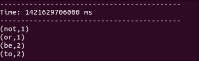

# 第五章：Spark Streaming

Spark Streaming 为 Apache Spark 增加了大数据处理的圣杯——即实时分析。它使 Spark 能够摄取实时数据流，并以极低的延迟（几秒钟）提供实时智能。

在本章中，我们将涵盖以下配方：

+   使用流式处理的单词计数

+   流式处理 Twitter 数据

+   使用 Kafka 进行流式处理

# 介绍

流式处理是将持续流动的输入数据分成离散单元的过程，以便可以轻松处理。现实生活中熟悉的例子是流式视频和音频内容（尽管用户可以在观看之前下载完整的电影，但更快的解决方案是以小块流式传输数据，这些数据开始播放给用户，而其余数据则在后台下载）。

除了多媒体之外，流式处理的实际例子包括市场数据源、天气数据、电子股票交易数据等的处理。所有这些应用程序产生大量数据，速度非常快，并且需要对数据进行特殊处理，以便实时从数据中获取洞察。

流式处理有一些基本概念，在我们专注于 Spark Streaming 之前最好先了解。流式应用程序接收数据的速率称为**数据速率**，以**每秒千字节**（**kbps**）或**每秒兆字节**（**mbps**）的形式表示。

流式处理的一个重要用例是**复杂事件处理**（**CEP**）。在 CEP 中，控制正在处理的数据范围很重要。这个范围称为窗口，可以基于时间或大小。基于时间的窗口的一个例子是分析过去一分钟内的数据。基于大小的窗口的一个例子可以是给定股票的最近 100 笔交易的平均要价。

Spark Streaming 是 Spark 的库，提供支持处理实时数据。这个流可以来自任何来源，比如 Twitter、Kafka 或 Flume。

在深入研究配方之前，Spark Streaming 有一些基本构建块，我们需要充分理解。

Spark Streaming 有一个称为`StreamingContext`的上下文包装器，它包装在`SparkContext`周围，并且是 Spark Streaming 功能的入口点。流式数据根据定义是连续的，需要进行时间切片处理。这段时间被称为**批处理间隔**，在创建`StreamingContext`时指定。RDD 和批处理之间是一对一的映射，也就是说，每个批处理都会产生一个 RDD。正如您在下图中所看到的，Spark Streaming 接收连续数据，将其分成批次并馈送给 Spark。



批处理间隔对于优化流式应用程序非常重要。理想情况下，您希望至少以数据获取的速度进行处理；否则，您的应用程序将产生积压。Spark Streaming 在一个批处理间隔的持续时间内收集数据，比如 2 秒。一旦这个 2 秒的间隔结束，该间隔内收集的数据将被交给 Spark 进行处理，而流式处理将专注于收集下一个批处理间隔的数据。现在，这个 2 秒的批处理间隔是 Spark 处理数据的全部时间，因为它应该空闲以接收下一个批处理的数据。如果 Spark 能够更快地处理数据，您可以将批处理间隔减少到 1 秒。如果 Spark 无法跟上这个速度，您必须增加批处理间隔。

Spark Streaming 中的 RDD 的连续流需要以一种抽象的形式表示，通过这种抽象可以对其进行处理。这种抽象称为**离散流**（**DStream**）。对 DStream 应用的任何操作都会导致对底层 RDD 的操作。

每个输入 DStream 都与一个接收器相关联（除了文件流）。接收器从输入源接收数据并将其存储在 Spark 的内存中。有两种类型的流式源：

+   基本来源，如文件和套接字连接

+   高级来源，如 Kafka 和 Flume

Spark Streaming 还提供了窗口计算，您可以在其中对数据的滑动窗口应用转换。滑动窗口操作基于两个参数：

+   **窗口长度**：这是窗口的持续时间。例如，如果您想要获取最后 1 分钟的数据分析，窗口长度将是 1 分钟。

+   **滑动间隔**：这表示您希望多频繁执行操作。比如您希望每 10 秒执行一次操作；这意味着每 10 秒，窗口的 1 分钟将有 50 秒的数据与上一个窗口相同，以及 10 秒的新数据。

这两个参数都作用于底层的 RDD，显然不能被分开；因此，这两个参数都应该是批处理间隔的倍数。窗口长度也必须是滑动间隔的倍数。

DStream 还具有输出操作，允许将数据推送到外部系统。它们类似于 RDD 上的操作（在 DStream 上发生的抽象级别更高）。

除了打印 DStream 的内容之外，还支持标准 RDD 操作，例如`saveAsTextFile`，`saveAsObjectFile`和`saveAsHadoopFile`，分别由类似的对应物`saveAsTextFiles`，`saveAsObjectFiles`和`saveAsHadoopFiles`。

一个非常有用的输出操作是`foreachRDD(func)`，它将任意函数应用于所有 RDD。

# 使用流媒体进行单词计数

让我们从一个简单的流媒体示例开始，在其中一个终端中，我们将输入一些文本，流媒体应用程序将在另一个窗口中捕获它。

## 如何做...

1.  启动 Spark shell 并为其提供一些额外的内存：

```scala
$ spark-shell --driver-memory 1G

```

1.  流特定的导入：

```scala
scala> import org.apache.spark.SparkConf
scala> import org.apache.spark.streaming.{Seconds, StreamingContext}
scala> import org.apache.spark.storage.StorageLevel
scala> import StorageLevel._

```

1.  隐式转换的导入：

```scala
scala> import org.apache.spark._
scala> import org.apache.spark.streaming._
scala> import org.apache.spark.streaming.StreamingContext._

```

1.  使用 2 秒批处理间隔创建`StreamingContext`： 

```scala
scala> val ssc = new StreamingContext(sc, Seconds(2))

```

1.  在本地主机上使用端口`8585`创建一个`SocketTextStream` Dstream，并使用`MEMORY_ONLY`缓存：

```scala
scala> val lines = ssc.socketTextStream("localhost",8585,MEMORY_ONLY)

```

1.  将行分成多个单词：

```scala
scala> val wordsFlatMap = lines.flatMap(_.split(" "))

```

1.  将单词转换为（单词，1），即将`1`作为单词的每次出现的值输出为键：

```scala
scala> val wordsMap = wordsFlatMap.map( w => (w,1))

```

1.  使用`reduceByKey`方法为每个单词的出现次数添加一个数字作为键（该函数一次处理两个连续的值，由`a`和`b`表示）：

```scala
scala> val wordCount = wordsMap.reduceByKey( (a,b) => (a+b))

```

1.  打印`wordCount`：

```scala
scala> wordCount.print

```

1.  启动`StreamingContext`；记住，直到启动`StreamingContext`之前什么都不会发生：

```scala
scala> ssc.start

```

1.  现在，在一个单独的窗口中，启动 netcat 服务器：

```scala
$ nc -lk 8585

```

1.  输入不同的行，例如`to be or not to be`：

```scala
to be or not to be

```

1.  检查 Spark shell，您将看到类似以下截图的单词计数结果：

# 流媒体 Twitter 数据

Twitter 是一个著名的微博平台。它每天产生大量数据，大约有 5 亿条推文。Twitter 允许通过 API 访问其数据，这使其成为测试任何大数据流应用程序的典范。

在这个示例中，我们将看到如何使用 Twitter 流媒体库在 Spark 中实时流式传输数据。Twitter 只是提供流数据给 Spark 的一个来源，并没有特殊的地位。因此，Twitter 没有内置的库。尽管如此，Spark 确实提供了一些 API 来促进与 Twitter 库的集成。

使用实时 Twitter 数据源的一个示例用途是查找过去 5 分钟内的热门推文。

## 如何做...

1.  如果您还没有 Twitter 帐户，请创建一个 Twitter 帐户。

1.  转到[`apps.twitter.com`](http://apps.twitter.com)。

1.  点击**创建新应用**。

1.  输入**名称**，**描述**，**网站**和**回调 URL**，然后点击**创建您的 Twitter 应用程序**。

1.  您将到达**应用程序管理**屏幕。

1.  导航到**密钥和访问令牌** | **创建我的访问令牌**。

1.  记下屏幕上的四个值，我们将在第 14 步中使用：

**消费者密钥（API 密钥）**

**消费者密钥（API 密钥）**

**访问令牌**

访问令牌密钥

1.  我们将需要在一段时间内在这个屏幕上提供这些值，但是，现在，让我们从 Maven 中央库下载所需的第三方库：

```scala
$ wget http://central.maven.org/maven2/org/apache/spark/spark-streaming-twitter_2.10/1.2.0/spark-streaming-twitter_2.10-1.2.0.jar
$ wget http://central.maven.org/maven2/org/twitter4j/twitter4j-stream/4.0.2/twitter4j-stream-4.0.2.jar
$ wget http://central.maven.org/maven2/org/twitter4j/twitter4j-core/4.0.2/twitter4j-core-4.0.2.jar

```

1.  打开 Spark shell，提供前面三个 JAR 作为依赖项：

```scala
$ spark-shell --jars spark-streaming-twitter_2.10-1.2.0.jar, twitter4j-stream-4.0.2.jar,twitter4j-core-4.0.2.jar

```

1.  执行特定于 Twitter 的导入：

```scala
scala> import org.apache.spark.streaming.twitter._
scala> import twitter4j.auth._
scala> import twitter4j.conf._

```

1.  流特定的导入：

```scala
scala> import org.apache.spark.streaming.{Seconds, StreamingContext}

```

1.  导入隐式转换：

```scala
scala> import org.apache.spark._
scala> import org.apache.spark.streaming._
scala> import org.apache.spark.streaming.StreamingContext._

```

1.  使用 10 秒批处理间隔创建`StreamingContext`：

```scala
scala> val ssc = new StreamingContext(sc, Seconds(10))

```

1.  使用 2 秒批处理间隔创建`StreamingContext`：

```scala
scala> val cb = new ConfigurationBuilder
scala> cb.setDebugEnabled(true)
.setOAuthConsumerKey("FKNryYEKeCrKzGV7zuZW4EKeN")
.setOAuthConsumerSecret("x6Y0zcTBOwVxpvekSCnGzbi3NYNrM5b8ZMZRIPI1XRC3pDyOs1")
 .setOAuthAccessToken("31548859-DHbESdk6YoghCLcfhMF88QEFDvEjxbM6Q90eoZTGl")
.setOAuthAccessTokenSecret("wjcWPvtejZSbp9cgLejUdd6W1MJqFzm5lByUFZl1NYgrV")
val auth = new OAuthAuthorization(cb.build)

```

### 注意

这些是示例值，您应该放入自己的值。

1.  创建 Twitter DStream：

```scala
scala> val tweets = TwitterUtils.createStream(ssc,auth)

```

1.  过滤掉英文推文：

```scala
scala> val englishTweets = tweets.filter(_.getLang()=="en")

```

1.  从推文中获取文本：

```scala
scala> val status = englishTweets.map(status => status.getText)

```

1.  设置检查点目录：

```scala
scala> ssc.checkpoint("hdfs://localhost:9000/user/hduser/checkpoint")

```

1.  启动`StreamingContext`：

```scala
scala> ssc.start
scala> ssc.awaitTermination

```

1.  您可以使用`:paste`将所有这些命令放在一起：

```scala
scala> :paste
import org.apache.spark.streaming.twitter._
import twitter4j.auth._
import twitter4j.conf._
import org.apache.spark.streaming.{Seconds, StreamingContext}
import org.apache.spark._
import org.apache.spark.streaming._
import org.apache.spark.streaming.StreamingContext._
val ssc = new StreamingContext(sc, Seconds(10))
val cb = new ConfigurationBuilder
cb.setDebugEnabled(true).setOAuthConsumerKey("FKNryYEKeCrKzGV7zuZW4EKeN")
 .setOAuthConsumerSecret("x6Y0zcTBOwVxpvekSCnGzbi3NYNrM5b8ZMZRIPI1XRC3pDyOs1")
 .setOAuthAccessToken("31548859-DHbESdk6YoghCLcfhMF88QEFDvEjxbM6Q90eoZTGl")
 .setOAuthAccessTokenSecret("wjcWPvtejZSbp9cgLejUdd6W1MJqFzm5lByUFZl1NYgrV")
val auth = new OAuthAuthorization(cb.build)
val tweets = TwitterUtils.createStream(ssc,Some(auth))
val englishTweets = tweets.filter(_.getLang()=="en")
val status = englishTweets.map(status => status.getText)
status.print
ssc.checkpoint("hdfs://localhost:9000/checkpoint")
ssc.start
ssc.awaitTermination

```

# 使用 Kafka 进行流处理

Kafka 是一个分布式、分区和复制的提交日志服务。简单地说，它是一个分布式消息服务器。Kafka 将消息源维护在称为**主题**的类别中。主题的一个示例可以是您想要获取有关的公司的新闻的股票代码，例如 Cisco 的 CSCO。

生成消息的进程称为**生产者**，消费消息的进程称为**消费者**。在传统的消息传递中，消息服务有一个中央消息服务器，也称为**代理**。由于 Kafka 是一个分布式消息传递服务，它有一个代理集群，功能上充当一个 Kafka 代理，如下所示：



对于每个主题，Kafka 维护分区日志。这个分区日志由分布在集群中的一个或多个分区组成，如下图所示：



Kafka 从 Hadoop 和其他大数据框架借鉴了许多概念。分区的概念与 Hadoop 中的`InputSplit`概念非常相似。在最简单的形式中，使用`TextInputFormat`时，`InputSplit`与块相同。块以`TextInputFormat`中的键值对形式读取，其中键是行的字节偏移量，值是行的内容本身。类似地，在 Kafka 分区中，记录以键值对的形式存储和检索，其中键是称为偏移量的顺序 ID 号，值是实际消息。

在 Kafka 中，消息的保留不取决于消费者的消费。消息将保留一段可配置的时间。每个消费者可以以任何他们喜欢的顺序读取消息。它需要保留的只是一个偏移量。另一个类比可以是阅读一本书，其中页码类似于偏移量，而页内容类似于消息。只要他们记住书签（当前偏移量），读者可以以任何方式阅读。

为了提供类似于传统消息系统中的发布/订阅和 PTP（队列）的功能，Kafka 有消费者组的概念。消费者组是一组消费者，Kafka 集群将其视为一个单元。在消费者组中，只需要一个消费者接收消息。如果消费者 C1 在下图中接收主题 T1 的第一条消息，则该主题上的所有后续消息也将传递给该消费者。使用这种策略，Kafka 保证了给定主题的消息传递顺序。

在极端情况下，当所有消费者都在一个消费者组中时，Kafka 集群的行为类似于 PTP/队列。在另一个极端情况下，如果每个消费者都属于不同的组，它的行为类似于发布/订阅。在实践中，每个消费者组有一定数量的消费者。



这个示例将展示如何使用来自 Kafka 的数据执行单词计数。

## 准备好

这个示例假设 Kafka 已经安装。Kafka 自带 ZooKeeper。我们假设 Kafka 的主目录在`/opt/infoobjects/kafka`中：

1.  启动 ZooKeeper：

```scala
$ /opt/infoobjects/kafka/bin/zookeeper-server-start.sh /opt/infoobjects/kafka/config/zookeeper.properties

```

1.  启动 Kafka 服务器：

```scala
$ /opt/infoobjects/kafka/bin/kafka-server-start.sh /opt/infoobjects/kafka/config/server.properties

```

1.  创建一个`test`主题：

```scala
$ /opt/infoobjects/kafka/bin/kafka-topics.sh --create --zookeeper localhost:2181 --replication-factor 1 --partitions 1 --topic test

```

## 如何做...：

1.  下载`spark-streaming-kafka`库及其依赖项：

```scala
$ wget http://central.maven.org/maven2/org/apache/spark/spark-streaming-kafka_2.10/1.2.0/spark-streaming-kafka_2.10-1.2.0.jar
$ wget http://central.maven.org/maven2/org/apache/kafka/kafka_2.10/0.8.1/kafka_2.10-0.8.1.jar
$ wget http://central.maven.org/maven2/com/yammer/metrics/metrics-core/2.2.0/metrics-core-2.2.0.jar
$ wget http://central.maven.org/maven2/com/101tec/zkclient/0.4/zkclient-0.4.jar

```

1.  启动 Spark shell 并提供`spark-streaming-kafka`库：

```scala
$ spark-shell --jars spark-streaming-kafka_2.10-1.2.0.jar, kafka_2.10-0.8.1.jar,metrics-core-2.2.0.jar,zkclient-0.4.jar

```

1.  流特定导入：

```scala
scala> import org.apache.spark.streaming.{Seconds, StreamingContext}

```

1.  隐式转换导入：

```scala
scala> import org.apache.spark._
scala> import org.apache.spark.streaming._
scala> import org.apache.spark.streaming.StreamingContext._
scala> import org.apache.spark.streaming.kafka.KafkaUtils

```

1.  创建具有 2 秒批处理间隔的`StreamingContext`：

```scala
scala> val ssc = new StreamingContext(sc, Seconds(2))

```

1.  设置 Kafka 特定变量：

```scala
scala> val zkQuorum = "localhost:2181"
scala> val group = "test-group"
scala> val topics = "test"
scala> val numThreads = 1

```

1.  创建`topicMap`：

```scala
scala> val topicMap = topics.split(",").map((_,numThreads.toInt)).toMap

```

1.  创建 Kafka DStream：

```scala
scala> val lineMap = KafkaUtils.createStream(ssc, zkQuorum, group, topicMap)

```

1.  从 lineMap 中取出值：

```scala
scala> val lines = lineMap.map(_._2)

```

1.  创建值的`flatMap`：

```scala
scala> val words = lines.flatMap(_.split(" "))

```

1.  创建（单词，出现次数）的键值对：

```scala
scala> val pair = words.map( x => (x,1))

```

1.  对滑动窗口进行单词计数：

```scala
scala> val wordCounts = pair.reduceByKeyAndWindow(_ + _, _ - _, Minutes(10), Seconds(2), 2)
scala> wordCounts.print

```

1.  设置`checkpoint`目录：

```scala
scala> ssc.checkpoint("hdfs://localhost:9000/user/hduser/checkpoint")

```

1.  启动`StreamingContext`：

```scala
scala> ssc.start
scala> ssc.awaitTermination

```

1.  在另一个窗口的 Kafka 中的`test`主题上发布一条消息：

```scala
$ /opt/infoobjects/kafka/bin/kafka-console-producer.sh --broker-list localhost:9092 --topic test

```

1.  现在，通过在第 15 步按*Enter*并在每条消息后按*Enter*来在 Kafka 上发布消息。

1.  现在，当您在 Kafka 上发布消息时，您将在 Spark shell 中看到它们：

## 还有更多...

假设您想要维护每个单词出现次数的运行计数。Spark Streaming 具有名为`updateStateByKey`操作的功能。`updateStateByKey`操作允许您在更新时维护任意状态并使用新提供的信息进行更新。

这种任意状态可以是聚合值，也可以是状态的改变（比如 Twitter 用户的心情）。执行以下步骤：

1.  让我们在对 RDD 对调用`updateStateByKey`：

```scala
scala> val runningCounts = wordCounts.updateStateByKey( (values: Seq[Int], state: Option[Int]) => Some(state.sum + values.sum))

```

### 注意

`updateStateByKey`操作返回一个新的“状态”DStream，其中每个键的状态都通过在键的先前状态和键的新值上应用给定函数来更新。这可以用于维护每个键的任意状态数据。

使此操作生效涉及两个步骤：

+   定义状态

+   定义状态`update`函数

对于每个键，都会调用一次`updateStateByKey`操作，值表示与该键关联的值序列，非常类似于 MapReduce，状态可以是任意状态，我们选择使其为`Option[Int]`。在第 18 步的每次调用中，通过将当前值的总和添加到先前状态来更新先前状态。

1.  打印结果：

```scala
scala> runningCounts.print

```

1.  以下是使用`updateStateByKey`操作来维护任意状态的所有步骤的组合：

```scala
Scala> :paste
import org.apache.spark.streaming.{Seconds, StreamingContext}
 import org.apache.spark._
 import org.apache.spark.streaming._
 import org.apache.spark.streaming.kafka._
 import org.apache.spark.streaming.StreamingContext._
 val ssc = new StreamingContext(sc, Seconds(2))
 val zkQuorum = "localhost:2181"
 val group = "test-group"
 val topics = "test"
 val numThreads = 1
 val topicMap = topics.split(",").map((_,numThreads.toInt)).toMap
 val lineMap = KafkaUtils.createStream(ssc, zkQuorum, group, topicMap)
 val lines = lineMap.map(_._2)
 val words = lines.flatMap(_.split(" "))
 val pairs = words.map(x => (x,1))
 val runningCounts = pairs.updateStateByKey( (values: Seq[Int], state: Option[Int]) => Some(state.sum + values.sum))
 runningCounts.print
ssc.checkpoint("hdfs://localhost:9000/user/hduser/checkpoint")
 ssc.start
 ssc.awaitTermination

```

1.  按下*Ctrl* + *D*运行它（使用`:paste`粘贴的代码）。
