# 第七章：使用 MLlib 进行监督学习 - 回归

本章分为以下几个部分：

+   使用线性回归

+   理解成本函数

+   使用套索进行线性回归

+   进行岭回归

# 介绍

以下是维基百科对监督学习的定义：

> *“监督学习是从标记的训练数据中推断函数的机器学习任务。”*

监督学习有两个步骤：

+   使用训练数据集训练算法；这就像是先提出问题和它们的答案

+   使用测试数据集向训练好的算法提出另一组问题。

有两种监督学习算法：

+   **回归**：这预测连续值输出，比如房价。

+   **分类**：这预测离散值输出（0 或 1）称为标签，比如一封电子邮件是否是垃圾邮件。分类不仅限于两个值；它可以有多个值，比如标记一封电子邮件为重要、不重要、紧急等等（0, 1, 2…）。

### 注意

本章将介绍回归，下一章将介绍分类。

作为回归的示例数据集，我们将使用加利福尼亚州萨拉托加市最近售出的房屋数据作为训练集来训练算法。一旦算法训练好了，我们将要求它根据房屋的尺寸来预测房价。下图说明了工作流程：

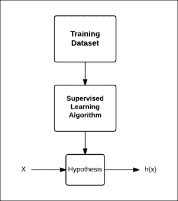

这里的假设，对于它的作用来说，可能听起来像一个误称，你可能会认为预测函数可能是一个更好的名字，但是假设这个词是出于历史原因而使用的。

如果我们只使用一个特征来预测结果，就称为**双变量分析**。当我们有多个特征时，就称为**多变量分析**。事实上，我们可以有任意多个特征。其中一种算法，**支持向量机**（**SVM**），我们将在下一章中介绍，实际上允许你拥有无限数量的特征。

本章将介绍如何使用 MLlib，Spark 的机器学习库进行监督学习。

### 注意

数学解释已尽可能简单地提供，但你可以随意跳过数学，直接转到*如何做……*部分。

# 使用线性回归

线性回归是一种基于一个或多个预测变量或特征*x*来建模响应变量*y*值的方法。

## 准备工作

让我们使用一些房屋数据来预测房屋的价格，基于它的大小。以下是 2014 年初加利福尼亚州萨拉托加市房屋的大小和价格：

| 房屋大小（平方英尺） | 价格 |
| --- | --- |
| 2100 | $ 1,620,000 |
| 2300 | $ 1,690,000 |
| 2046 | $ 1,400,000 |
| 4314 | $ 2,000,000 |
| 1244 | $ 1,060,000 |
| 4608 | $ 3,830,000 |
| 2173 | $ 1,230,000 |
| 2750 | $ 2,400,000 |
| 4010 | $ 3,380,000 |
| 1959 | $ 1,480,000 |

这里有一个相同的图形表示：

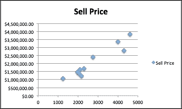

## 如何做…

1.  启动 Spark shell：

```scala
$ spark-shell

```

1.  导入统计和相关类：

```scala
scala> import org.apache.spark.mllib.linalg.Vectors
scala> import org.apache.spark.mllib.regression.LabeledPoint
scala> import org.apache.spark.mllib.regression.LinearRegressionWithSGD

```

1.  创建`LabeledPoint`数组，房价作为标签：

```scala
scala> val points = Array(
LabeledPoint(1620000,Vectors.dense(2100)),
LabeledPoint(1690000,Vectors.dense(2300)),
LabeledPoint(1400000,Vectors.dense(2046)),
LabeledPoint(2000000,Vectors.dense(4314)),
LabeledPoint(1060000,Vectors.dense(1244)),
LabeledPoint(3830000,Vectors.dense(4608)),
LabeledPoint(1230000,Vectors.dense(2173)),
LabeledPoint(2400000,Vectors.dense(2750)),
LabeledPoint(3380000,Vectors.dense(4010)),
LabeledPoint(1480000,Vectors.dense(1959))
)

```

1.  创建上述数据的 RDD：

```scala
scala> val pricesRDD = sc.parallelize(points)

```

1.  使用这些数据训练模型，进行 100 次迭代。这里，步长被保持得很小，以适应响应变量的非常大的值，也就是房价。第四个参数是每次迭代使用的数据集的一部分，最后一个参数是要使用的初始权重集（不同特征的权重）：

```scala
scala> val model = LinearRegressionWithSGD.train(pricesRDD,100,0.0000006,1.0,Vectors.zeros(1))

```

1.  预测一个 2500 平方英尺的房屋的价格：

```scala
scala> val prediction = model.predict(Vectors.dense(2500))

```

房屋大小只是一个预测变量。房价取决于其他变量，比如地块大小，房屋年龄等等。你拥有的变量越多，你的预测就会越准确。

# 理解成本函数

成本函数或损失函数在机器学习算法中非常重要。大多数算法都有某种形式的成本函数，目标是最小化它。影响成本函数的参数，比如上一个步骤中的`stepSize`，需要手动设置。因此，理解成本函数的整个概念非常重要。

在这个步骤中，我们将分析线性回归的成本函数。线性回归是一个简单的算法，可以帮助读者理解成本函数对于复杂算法的作用。

让我们回到线性回归。目标是找到最佳拟合线，使得误差的均方最小。这里，我们将误差定义为最佳拟合线的值与训练数据集中响应变量的实际值之间的差异。

对于单个自变量的简单情况，最佳拟合线可以写成：

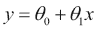

这个函数也被称为**假设函数**，可以写成：

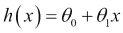

线性回归的目标是找到最佳拟合线。在这条线上，θ[0]代表*y*轴上的截距，θ[1]代表线的斜率，如下方程所示：


我们必须选择θ[0]和θ[1]，使得*h(x)*对于训练数据集中的*y*最接近。因此，对于第*i*个数据点，线与数据点之间的距离的平方为：

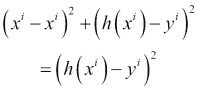

换句话说，这是预测房价与房屋实际售价之间的差的平方。现在，让我们计算训练数据集中这个值的平均值：

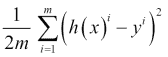

上述方程被称为线性回归的成本函数*J*。目标是最小化这个成本函数。

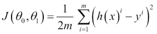

这个成本函数也被称为**平方误差函数**。如果它们分别针对*J*绘制，θ[0]和θ[1]都会遵循凸曲线。

让我们举一个非常简单的数据集的例子，包括三个值，(1,1), (2,2), 和 (3,3)，以便计算更容易：

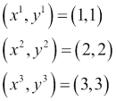

假设θ[1]为 0，也就是说，最佳拟合线与*x*轴平行。在第一种情况下，假设最佳拟合线是*x*轴，也就是*y=0*。那么，成本函数的值将如下：

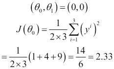

现在，让我们把这条线稍微移动到*y=1*。那么，成本函数的值将如下：

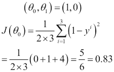

现在，让我们把这条线进一步移动到*y=2*。那么，成本函数的值将如下：

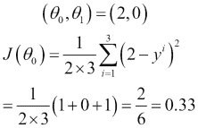

现在，当我们把这条线进一步移动到*y=3*，成本函数的值将如下：

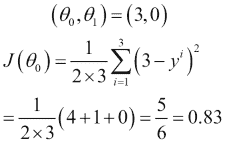

现在，让我们把这条线进一步移动到*y=4*。那么，成本函数的值将如下：

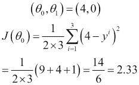

所以，你看到成本函数的值先减少，然后再次增加，就像这样：

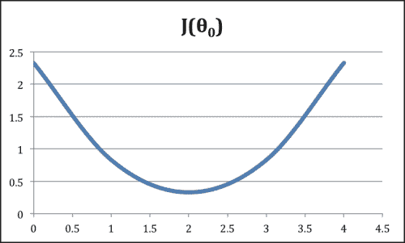

现在，让我们通过将θ[0]设为 0 并使用不同的θ[1]值来重复这个练习。

在第一种情况下，假设最佳拟合线是*x*轴，也就是*y=0*。那么，成本函数的值将如下：


现在，让我们使用斜率为 0.5。那么，成本函数的值将如下：

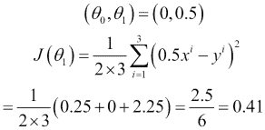

现在，让我们使用斜率为 1。那么，成本函数的值将如下：

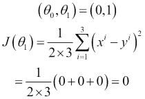

现在，当我们使用斜率为 1.5 时，以下将是成本函数的值：

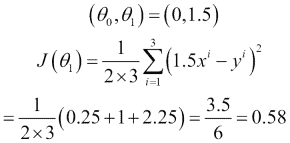

现在，让我们使用斜率为 2.0。以下将是成本函数的值：

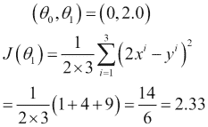

如您在两个图中所见，当斜率或曲线的梯度为 0 时，*J*的最小值是。

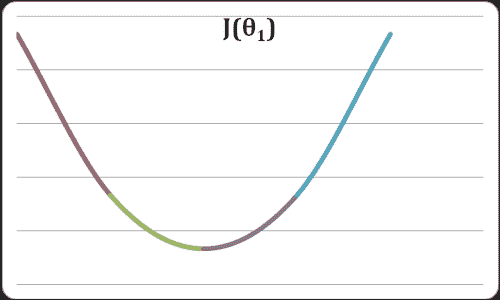

当θ[0]和θ[1]都映射到 3D 空间时，它就像一个碗的形状，成本函数的最小值在其底部。

到达最小值的这种方法称为**梯度下降**。在 Spark 中，实现是随机梯度下降。

# 使用套索进行线性回归

套索是线性回归的收缩和选择方法。它最小化了通常的平方误差和系数绝对值之和的边界。它基于原始套索论文，可在[`statweb.stanford.edu/~tibs/lasso/lasso.pdf`](http://statweb.stanford.edu/~tibs/lasso/lasso.pdf)找到。

我们在上一个示例中使用的最小二乘法也称为**普通最小二乘法**（**OLS**）。OLS 有两个挑战：

+   **预测准确性**：使用 OLS 进行的预测通常具有较低的预测偏差和较高的方差。通过缩小一些系数（甚至使它们为零），可以提高预测准确性。偏差会有所增加，但整体预测准确性会提高。

+   **解释**：对于预测变量的数量较多，希望找到其中表现最强的子集（相关性）。

### 注意

偏差与方差

预测误差背后有两个主要原因：偏差和方差。理解偏差和方差的最佳方法是看一个情况，我们在同一数据集上多次进行预测。

偏差是预测结果与实际值之间的估计差距，方差是不同预测值之间的差异的估计。

通常，添加更多的特征有助于减少偏差，这是很容易理解的。如果在构建预测模型时，我们遗漏了一些具有显著相关性的特征，这将导致显著的误差。

如果您的模型方差很高，可以删除特征以减少它。更大的数据集也有助于减少方差。

在这里，我们将使用一个简单的数据集，这是一个不适当的数据集。不适当的数据集是指样本数据量小于预测变量的数量。

| y | x0 | x1 | x2 | x3 | x4 | x5 | x6 | x7 | x8 |
| --- | --- | --- | --- | --- | --- | --- | --- | --- | --- |
| 1 | 5 | 3 | 1 | 2 | 1 | 3 | 2 | 2 | 1 |
| 2 | 9 | 8 | 8 | 9 | 7 | 9 | 8 | 7 | 9 |

您可以很容易地猜到，在这里，九个预测变量中，只有两个与*y*有强相关性，即*x0*和*x1*。我们将使用这个数据集和套索算法来验证其有效性。

## 如何做…

1.  启动 Spark shell：

```scala
$ spark-shell

```

1.  导入统计和相关类：

```scala
scala> import org.apache.spark.mllib.linalg.Vectors
scala> import org.apache.spark.mllib.regression.LabeledPoint
scala> import org.apache.spark.mllib.regression.LassoWithSGD

```

1.  创建带有房价作为标签的`LabeledPoint`数组：

```scala
scala> val points = Array(
LabeledPoint(1,Vectors.dense(5,3,1,2,1,3,2,2,1)),
LabeledPoint(2,Vectors.dense(9,8,8,9,7,9,8,7,9))
)

```

1.  创建一个 RDD 的前述数据：

```scala
scala> val rdd = sc.parallelize(points)

```

1.  使用这些数据训练一个模型，使用 100 次迭代。在这里，步长和正则化参数已经手动设置：

```scala
scala> val model = LassoWithSGD.train(rdd,100,0.02,2.0)

```

1.  检查有多少预测变量的系数被设置为零：

```scala
scala> model.weights
org.apache.spark.mllib.linalg.Vector = [0.13455106581619633,0.02240732644670294,0.0,0.0,0.0,0.01360995990267153,0.0,0.0,0.0]

```

如您所见，九个预测变量中有六个的系数被设置为零。这是套索的主要特征：它认为不实用的任何预测变量，通过将它们的系数设置为零，从方程中移除它们。

# 进行岭回归

改进预测质量的套索的另一种方法是岭回归。在套索中，许多特征的系数被设置为零，因此从方程中消除，在岭回归中，预测变量或特征受到惩罚，但永远不会被设置为零。

## 如何做…

1.  启动 Spark shell：

```scala
$ spark-shell

```

1.  导入统计和相关类：

```scala
scala> import org.apache.spark.mllib.linalg.Vectors
scala> import org.apache.spark.mllib.regression.LabeledPoint
scala> import org.apache.spark.mllib.regression.RidgeRegressionWithSGD

```

1.  创建带有房价作为标签的`LabeledPoint`数组：

```scala
scala> val points = Array(
LabeledPoint(1,Vectors.dense(5,3,1,2,1,3,2,2,1)),
LabeledPoint(2,Vectors.dense(9,8,8,9,7,9,8,7,9))
)

```

1.  创建一个包含上述数据的 RDD：

```scala
scala> val rdd = sc.parallelize(points)

```

1.  使用这些数据训练一个模型，进行 100 次迭代。在这里，步长和正则化参数已经手动设置：

```scala
scala> val model = RidgeRegressionWithSGD.train(rdd,100,0.02,2.0)

```

1.  检查有多少预测变量的系数被设为零：

```scala
scala> model.weights
org.apache.spark.mllib.linalg.Vector = [0.049805969577244584,0.029883581746346748,0.009961193915448916,0.019922387830897833,0.009961193915448916,0.029883581746346748,0.019922387830897833,0.019922387830897833,0.009961193915448916]

```

如您所见，与套索不同，岭回归不会将任何预测变量的系数设为零，但它确实使一些系数非常接近于零。
