# 第八章：监督学习与 MLlib – 分类

本章分为以下几个部分：

+   使用逻辑回归进行分类

+   使用支持向量机进行二元分类

+   使用决策树进行分类

+   使用随机森林进行分类

+   使用梯度提升树进行分类

+   使用朴素贝叶斯进行分类

# 介绍

分类问题类似于上一章讨论的回归问题，只是结果变量 *y* 只取少数离散值。在二元分类中，*y* 只取两个值：0 或 1。你也可以将分类中响应变量可以取的值看作代表类别。

# 使用逻辑回归进行分类

在分类中，响应变量 *y* 具有离散值，而不是连续值。一些例子包括电子邮件（垃圾邮件/非垃圾邮件）、交易（安全/欺诈）等。

下面方程中的 *y* 变量可以取两个值，0 或 1：


这里，0 被称为负类，1 表示正类。虽然我们称它们为正类或负类，但这只是为了方便起见。算法对这种分配持中立态度。

线性回归，虽然对于回归任务效果很好，但对于分类任务存在一些限制。这些包括：

+   拟合过程对异常值非常敏感

+   不能保证假设函数 *h(x)* 将适合于 0（负类）到 1（正类）的范围内

逻辑回归保证 *h(x)* 将适合于 0 到 1 之间。尽管逻辑回归中有回归一词，但这更像是一个误称，它实际上是一个分类算法：

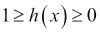

在线性回归中，假设函数如下：

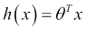

在逻辑回归中，我们稍微修改假设方程如下：

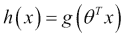

*g* 函数被称为**Sigmoid 函数**或**逻辑函数**，对于实数 *t* 定义如下：

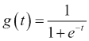

这是 Sigmoid 函数的图形：

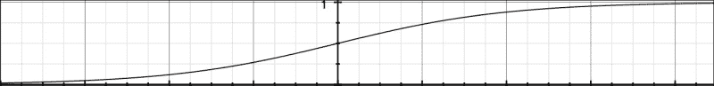

正如你所看到的，当 *t* 接近负无穷时，*g(t)* 接近 0，当 *t* 接近无穷时，*g(t)* 接近 1。因此，这保证了假设函数的输出永远不会超出 0 到 1 的范围。

现在假设函数可以重写为：

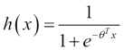

*h(x)* 是给定预测变量 *x* 的 *y = 1* 的估计概率，因此 *h(x)* 也可以重写为：

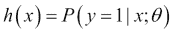

换句话说，假设函数显示了在给定特征矩阵 *x* 的情况下 *y* 为 1 的概率，由 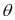 参数化。这个概率可以是 0 到 1 之间的任意实数，但我们的分类目标不允许我们有连续值；我们只能有两个值 0 或 1，表示负类或正类。

假设我们预测 *y = 1* 如果

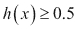

并且 *y = 0* 否则。如果我们再次看一下 S 形函数图，我们会意识到，当 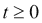 S 形函数是 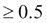，也就是说，对于 *t* 的正值，它将预测为正类：

自从使用逻辑回归进行分类，这意味着对于使用逻辑回归进行分类的情况下，将会预测正类。为了更好地说明这一点，让我们将其扩展到双变量情况的非矩阵形式：

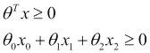

由方程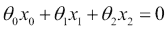表示的平面将决定给定向量属于正类还是负类。这条线被称为决策边界。

这个边界不一定是线性的，取决于训练集。如果训练数据不能在线性边界上分离，可以添加更高级别的多项式特征来促进它。一个例子是通过平方 x1 和 x2 来添加两个新特征，如下所示：

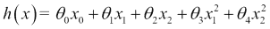

请注意，对于学习算法来说，这种增强与以下方程式完全相同：

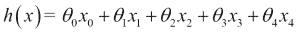

学习算法将把多项式的引入视为另一个特征。这给了你在拟合过程中很大的权力。这意味着通过正确选择多项式和参数，可以创建任何复杂的决策边界。

让我们花一些时间来理解如何选择参数的正确值，就像我们在线性回归的情况下所做的那样。线性回归的成本函数*J*是：

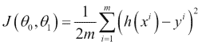

正如你所知，我们在这个成本函数中对成本进行了平均。让我们用成本项来表示这一点：

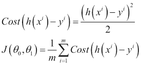

换句话说，成本项是算法在预测*h(x)*的真实响应变量值*y*时必须支付的成本：

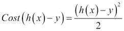

这个成本对于线性回归来说效果很好，但是对于逻辑回归来说，这个成本函数是非凸的（也就是说，它会导致多个局部最小值），我们需要找到一个更好的凸方式来估计成本。

逻辑回归中效果很好的成本函数如下：

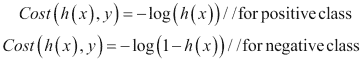

让我们通过结合这两个成本函数将它们合并成一个：

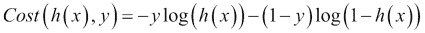

让我们将这个成本函数重新放回到*J*中：

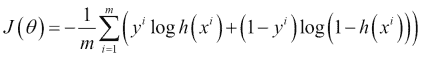

目标是最小化成本，也就是最小化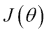的值。这是通过梯度下降算法来实现的。Spark 有两个支持逻辑回归的类：

+   `LogisticRegressionWithSGD`

+   `LogisticRegressionWithLBFGS`

`LogisticRegressionWithLBFGS`类更受欢迎，因为它消除了优化步长的步骤。

## 准备工作

2006 年，铃木、鹤崎和光岡在日本不同海滩上对一种濒临灭绝的穴居蜘蛛的分布进行了一些研究。

让我们看一些关于颗粒大小和蜘蛛存在的数据：

| 颗粒大小（mm） | 蜘蛛存在 |
| --- | --- |
| 0.245 | 不存在 |
| 0.247 | 不存在 |
| 0.285 | 存在 |
| 0.299 | 存在 |
| 0.327 | 存在 |
| 0.347 | 存在 |
| 0.356 | 不存在 |
| 0.36 | 存在 |
| 0.363 | 不存在 |
| 0.364 | 存在 |
| 0.398 | 不存在 |
| 0.4 | 存在 |
| 0.409 | 不存在 |
| 0.421 | 存在 |
| 0.432 | 不存在 |
| 0.473 | 存在 |
| 0.509 | 存在 |
| 0.529 | 存在 |
| 0.561 | 不存在 |
| 0.569 | 不存在 |
| 0.594 | 存在 |
| 0.638 | 存在 |
| 0.656 | 存在 |
| 0.816 | 存在 |
| 0.853 | 存在 |
| 0.938 | 存在 |
| 1.036 | 存在 |
| 1.045 | 存在 |

我们将使用这些数据来训练算法。缺席将表示为 0，存在将表示为 1。

## 如何做…

1.  启动 Spark shell：

```scala
$ spark-shell

```

1.  导入统计和相关类：

```scala
scala> import org.apache.spark.mllib.linalg.Vectors
scala> import org.apache.spark.mllib.regression.LabeledPoint
scala> import org.apache.spark.mllib.classification.LogisticRegressionWithLBFGS

```

1.  创建一个带有蜘蛛存在或不存在的`LabeledPoint`数组作为标签：

```scala
scala> val points = Array(
LabeledPoint(0.0,Vectors.dense(0.245)),
LabeledPoint(0.0,Vectors.dense(0.247)),
LabeledPoint(1.0,Vectors.dense(0.285)),
LabeledPoint(1.0,Vectors.dense(0.299)),
LabeledPoint(1.0,Vectors.dense(0.327)),
LabeledPoint(1.0,Vectors.dense(0.347)),
LabeledPoint(0.0,Vectors.dense(0.356)),
LabeledPoint(1.0,Vectors.dense(0.36)),
LabeledPoint(0.0,Vectors.dense(0.363)),
LabeledPoint(1.0,Vectors.dense(0.364)),
LabeledPoint(0.0,Vectors.dense(0.398)),
LabeledPoint(1.0,Vectors.dense(0.4)),
LabeledPoint(0.0,Vectors.dense(0.409)),
LabeledPoint(1.0,Vectors.dense(0.421)),
LabeledPoint(0.0,Vectors.dense(0.432)),
LabeledPoint(1.0,Vectors.dense(0.473)),
LabeledPoint(1.0,Vectors.dense(0.509)),
LabeledPoint(1.0,Vectors.dense(0.529)),
LabeledPoint(0.0,Vectors.dense(0.561)),
LabeledPoint(0.0,Vectors.dense(0.569)),
LabeledPoint(1.0,Vectors.dense(0.594)),
LabeledPoint(1.0,Vectors.dense(0.638)),
LabeledPoint(1.0,Vectors.dense(0.656)),
LabeledPoint(1.0,Vectors.dense(0.816)),
LabeledPoint(1.0,Vectors.dense(0.853)),
LabeledPoint(1.0,Vectors.dense(0.938)),
LabeledPoint(1.0,Vectors.dense(1.036)),
LabeledPoint(1.0,Vectors.dense(1.045)))

```

1.  创建前述数据的 RDD：

```scala
scala> val spiderRDD = sc.parallelize(points)

```

1.  使用这些数据训练模型（当所有预测因子为零时，截距是该值）：

```scala
scala> val lr = new LogisticRegressionWithLBFGS().setIntercept(true)
scala> val model = lr.run(spiderRDD)

```

1.  预测粒度为`0.938`的蜘蛛的存在：

```scala
scala> val predict = model.predict(Vectors.dense(0.938))

```

# 使用 SVM 进行二元分类

分类是一种根据其效用将数据分为不同类别的技术。例如，电子商务公司可以对潜在访客应用两个标签“会购买”或“不会购买”。

这种分类是通过向机器学习算法提供一些已经标记的数据来完成的，称为**训练数据**。挑战在于如何标记两个类之间的边界。让我们以下图所示的简单示例为例：

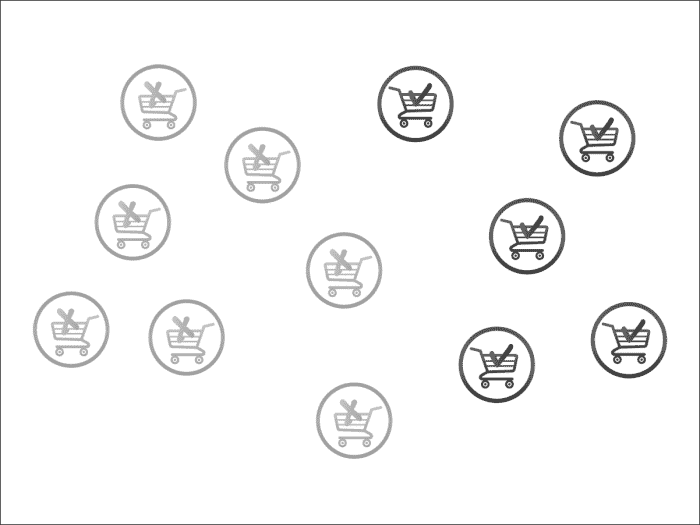

在前面的案例中，我们将灰色和黑色指定为“不会购买”和“会购买”标签。在这里，画一条线将两个类别分开就像下面这样简单：

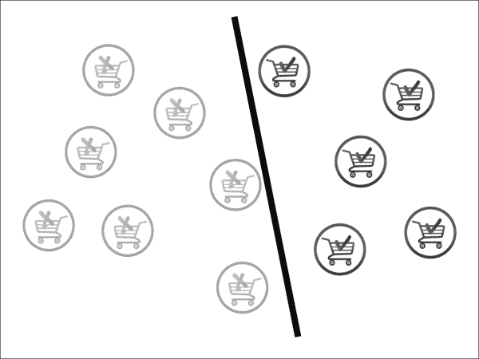

这是我们能做到的最好吗？实际上并不是，让我们试着做得更好。黑色分类器与“会购买”和“不会购买”车辆并不是真正等距的。让我们尝试做得更好，就像下面这样：


现在看起来不错。实际上，这正是 SVM 算法所做的。您可以在前面的图中看到，实际上只有三辆车决定了线的斜率：线上方的两辆黑色车和线下方的一辆灰色车。这些车被称为**支持向量**，而其余的车，即向量，是无关紧要的。

有时候画一条线并不容易，可能需要一条曲线来分开两个类别，就像下面这样：

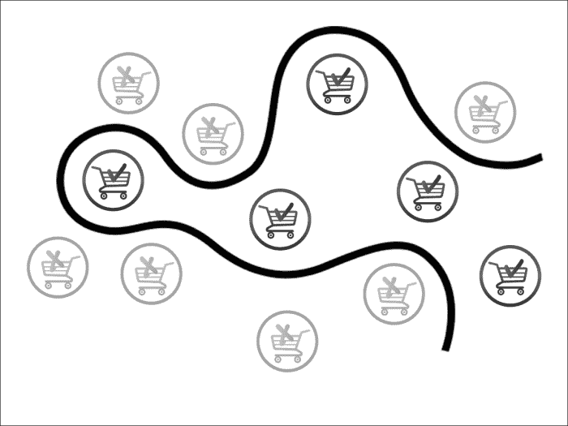

有时甚至这还不够。在这种情况下，我们需要超过两个维度来解决问题。我们需要的不是分类线，而是一个超平面。实际上，每当数据过于混乱时，增加额外的维度有助于找到一个分离类别的超平面。下图说明了这一点：

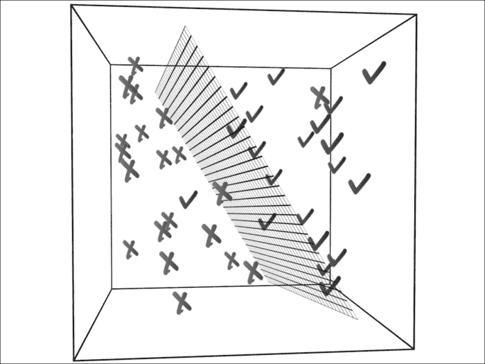

这并不意味着增加额外的维度总是一个好主意。大多数情况下，我们的目标是减少维度，只保留相关的维度/特征。有一整套算法专门用于降维；我们将在后面的章节中介绍这些算法。

## 如何做…

1.  Spark 库中加载了示例`libsvm`数据。我们将使用这些数据并将其加载到 HDFS 中：

```scala
$ hdfs dfs -put /opt/infoobjects/spark/data/mllib/sample_libsvm_data.txt /user/hduser/sample_libsvm_data.txt

```

1.  启动 Spark shell：

```scala
$ spark-shell

```

1.  执行所需的导入：

```scala
scala> import org.apache.spark.mllib.classification.SVMWithSGD
scala> import org.apache.spark.mllib.evaluation.BinaryClassificationMetrics
scala> import org.apache.spark.mllib.regression.LabeledPoint
scala> import org.apache.spark.mllib.linalg.Vectors
scala> import org.apache.spark.mllib.util.MLUtils

```

1.  将数据加载为 RDD：

```scala
scala> val svmData = MLUtils.loadLibSVMFile(sc,"sample_libsvm_data.txt")

```

1.  记录的数量：

```scala
scala> svmData.count

```

1.  现在让我们将数据集分成一半训练数据和一半测试数据：

```scala
scala> val trainingAndTest = svmData.randomSplit(Array(0.5,0.5))

```

1.  分配`training`和`test`数据：

```scala
scala> val trainingData = trainingAndTest(0)
scala> val testData = trainingAndTest(1)

```

1.  训练算法并构建模型进行 100 次迭代（您可以尝试不同的迭代次数，但您会发现，在某个时候，结果开始收敛，这是一个不错的选择）：

```scala
scala> val model = SVMWithSGD.train(trainingData,100)

```

1.  现在我们可以使用这个模型来预测任何数据集的标签。让我们预测测试数据中第一个点的标签：

```scala
scala> val label = model.predict(testData.first.features)

```

1.  让我们创建一个元组，第一个值是测试数据的预测值，第二个值是实际标签，这将帮助我们计算算法的准确性：

```scala
scala> val predictionsAndLabels = testData.map( r => (model.predict(r.features),r.label))

```

1.  您可以计算有多少记录预测和实际标签不匹配：

```scala
scala> predictionsAndLabels.filter(p => p._1 != p._2).count

```

# 使用决策树进行分类

决策树是机器学习算法中最直观的。我们经常在日常生活中使用决策树。

决策树算法有很多有用的特性：

+   易于理解和解释

+   处理分类和连续特征

+   处理缺失的特征

+   不需要特征缩放

决策树算法以倒序方式工作，其中包含特征的表达式在每个级别进行评估，并将数据集分成两个类别。我们将通过一个简单的哑剧的例子来帮助您理解这一点，大多数人在大学时都玩过。我猜了一个动物，然后让我的同事问我问题来猜出我的选择。她的提问是这样的：

Q1：这是一只大动物吗？

A：是的

Q2：这种动物是否活了 40 年以上？

A：是的

Q3：这种动物是大象吗？

A：是的

这显然是一个过于简化的情况，她知道我假设了一只大象（在大数据世界中你还能猜到什么？）。让我们扩展这个例子，包括一些更多的动物，如下图所示（灰色框是类）：

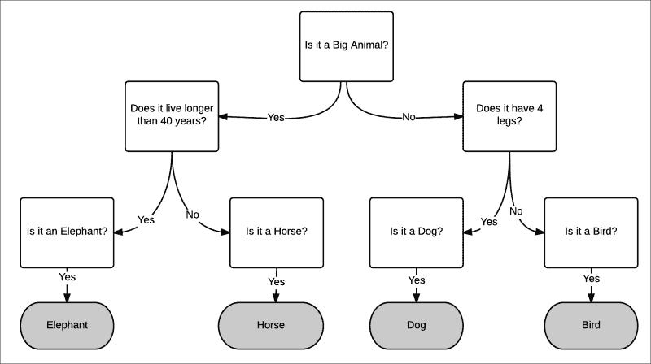

前面的例子是多类分类的一个案例。在这个配方中，我们将专注于二元分类。 

## 准备就绪

每当我们的儿子早上要上网球课时，前一天晚上教练会查看天气预报，并决定第二天早上是否适合打网球。这个配方将使用这个例子来构建一个决策树。

让我们决定影响早上是否打网球的天气特征：

+   雨

+   风速

+   温度

让我们建立一个不同组合的表：

| 雨 | 有风 | 温度 | 打网球？ |
| --- | --- | --- | --- |
| 是 | 是 | 炎热 | 否 |
| 是 | 是 | 正常 | 否 |
| 是 | 是 | 凉爽 | 否 |
| 否 | 是 | 炎热 | 否 |
| 否 | 是 | 凉爽 | 否 |
| 否 | 否 | 炎热 | 是 |
| 否 | 否 | 正常 | 是 |
| 否 | 否 | 凉爽 | 否 |

现在我们如何构建决策树呢？我们可以从雨、有风或温度中的一个开始。规则是从一个特征开始，以便最大化信息增益。

在雨天，正如你在表中看到的，其他特征并不重要，也不会打网球。对于风速很高的情况也是如此。

决策树，像大多数其他算法一样，只接受特征值作为双精度值。所以，让我们进行映射：

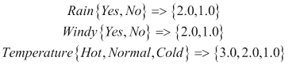

正类是 1.0，负类是 0.0。让我们使用 CSV 格式加载数据，使用第一个值作为标签：

```scala
$vi tennis.csv
0.0,1.0,1.0,2.0
0.0,1.0,1.0,1.0
0.0,1.0,1.0,0.0
0.0,0.0,1.0,2.0
0.0,0.0,1.0,0.0
1.0,0.0,0.0,2.0
1.0,0.0,0.0,1.0
0.0,0.0,0.0,0.0

```

## 如何做...

1.  启动 Spark shell：

```scala
$ spark-shell

```

1.  执行所需的导入：

```scala
scala> import org.apache.spark.mllib.tree.DecisionTree
scala> import org.apache.spark.mllib.regression.LabeledPoint
scala> import org.apache.spark.mllib.linalg.Vectors
scala> import org.apache.spark.mllib.tree.configuration.Algo._
scala> import org.apache.spark.mllib.tree.impurity.Entropy

```

1.  加载文件：

```scala
scala> val data = sc.textFile("tennis.csv")
```

1.  解析数据并将其加载到`LabeledPoint`中：

```scala
scala> val parsedData = data.map {
line =>  val parts = line.split(',').map(_.toDouble)
 LabeledPoint(parts(0), Vectors.dense(parts.tail)) }

```

1.  用这些数据训练算法：

```scala
scala> val model = DecisionTree.train(parsedData, Classification, Entropy, 3)

```

1.  为无雨、大风和凉爽的温度创建一个向量：

```scala
scala> val v=Vectors.dense(0.0,1.0,0.0)

```

1.  预测是否应该打网球：

```scala
scala> model.predict(v)

```

## 工作原理...

让我们为这个配方中创建的网球决策树绘制决策树：

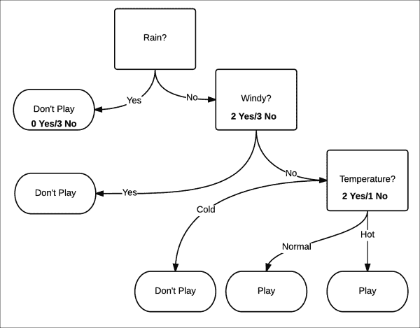

这个模型有三个级别的深度。选择哪个属性取决于我们如何最大化信息增益。它的衡量方式是通过衡量分裂的纯度。纯度意味着，无论确定性是否增加，那么给定的数据集将被视为正面或负面。在这个例子中，这相当于是否打网球的机会在增加，还是不打网球的机会在增加。

纯度是用熵来衡量的。熵是系统中混乱程度的度量。在这种情况下，更容易理解它是一种不确定性的度量：

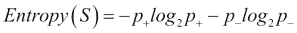

纯度的最高级别是 0，最低级别是 1。让我们尝试使用公式来确定纯度。

当雨是是的时候，打网球的概率是*p+*为 0/3 = 0。不打网球的概率*p_*为 3/3 = 1：

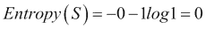

这是一个纯净的集合。

当雨不下时，打网球的概率*p+*为 2/5 = 0.4。不打网球的概率*p_*为 3/5 = 0.6：

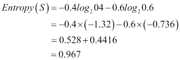

这几乎是一个不纯的集合。最不纯的情况是概率为 0.5 的情况。

Spark 使用三种方法来确定不纯度：

+   基尼不纯度（分类）

+   熵（分类）

+   方差（回归）

信息增益是父节点杂质与两个子节点杂质的加权和之差。让我们看一下第一个分裂，将大小为 8 的数据分成大小为 3（左）和 5（右）的两个数据集。让我们称第一个分裂为*s1*，父节点为*rain*，左子节点为*no rain*，右子节点为*wind*。所以信息增益将是：

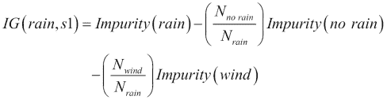

由于我们已经为*no rain*和*wind*计算了熵的杂质，现在让我们计算*rain*的熵：

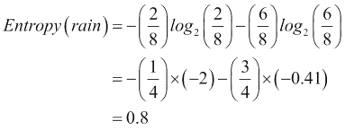

现在让我们计算信息增益：

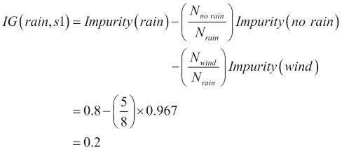

所以在第一个分裂中，信息增益为 0.2。这是我们能达到的最好效果吗？让我们看看我们的算法得出了什么。首先，让我们找出树的深度：

```scala
scala> model.depth
Int = 2

```

在这里，深度是`2`，而我们直观地构建的是`3`，所以这个模型似乎更优化。让我们看看树的结构：

```scala
scala> model.toDebugString
String =  "DecisionTreeModel classifier of depth 2 with 5 nodes
If (feature 1 <= 0.0)
 If (feature 2 <= 0.0)
 Predict: 0.0
 Else (feature 2 > 0.0)
 Predict: 1.0
Else (feature 1 > 0.0)
 Predict: 0.0

```

让我们以可视化的方式构建它，以便更好地理解：

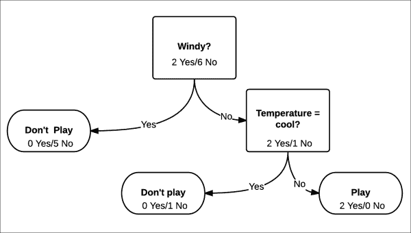

我们不会在这里详细介绍，因为我们已经在之前的模型中做过了。我们将直接计算信息增益：0.44

正如你在这种情况下所看到的，信息增益为 0.44，是第一个模型的两倍多。

如果你看第二级节点，杂质为零。在这种情况下，这是很好的，因为我们在深度为 2 的情况下得到了它。想象一种情况，深度为 50。在那种情况下，决策树对训练数据效果很好，但对测试数据效果很差。这种情况被称为**过拟合**。

避免过拟合的一个解决方案是修剪。你将训练数据分成两组：训练集和验证集。你使用训练集训练模型。现在你用模型对验证集进行测试，逐渐移除左节点。如果移除叶节点（通常是单例节点，即只包含一个数据点）改善了模型的性能，那么这个叶节点就从模型中被修剪掉。

# 使用随机森林进行分类

有时一个决策树是不够的，所以会使用一组决策树来产生更强大的模型。这些被称为**集成学习算法**。集成学习算法不仅限于使用决策树作为基本模型。

集成学习算法中最受欢迎的是随机森林。在随机森林中，不是生长单一树，而是生长*K*棵树。每棵树都被赋予训练数据的一个随机子集*S*。更有趣的是，每棵树只使用特征的一个子集。在进行预测时，对树进行多数投票，这就成为了预测。

让我们用一个例子来解释这一点。目标是对一个给定的人做出预测，判断他/她的信用是好还是坏。

为了做到这一点，我们将提供带有标签的训练数据，也就是说，在这种情况下，一个带有特征和标签的人。现在我们不想创建特征偏差，所以我们将提供一个随机选择的特征集。提供一个随机选择的特征子集的另一个原因是，大多数真实世界的数据具有数百甚至数千个特征。例如，文本分类算法通常具有 50k-100k 个特征。

在这种情况下，为了给故事增添趣味，我们不会提供特征，而是会问不同的人为什么他们认为一个人信用好或坏。现在根据定义，不同的人暴露于一个人的不同特征（有时是重叠的），这给了我们与随机选择特征相同的功能。

我们的第一个例子是 Jack，他被贴上了“坏信用”的标签。我们将从 Jack 最喜欢的酒吧——大象酒吧的 Joey 开始。一个人能够推断为什么给定一个标签的唯一方法是通过问是/否的问题。让我们看看 Joey 说了什么：

Q1: Jack 是否慷慨地给小费？（特征：慷慨）

A: 不

Q2：杰克每次至少花 60 美元吗？（特征：挥霍）

A：是的

Q3：他是否倾向于在最小的挑衅下卷入酒吧斗殴？（特征：易怒）

A：是的

这就解释了为什么杰克信用不好。

现在我们问杰克的女朋友斯泰西：

Q1：我们一起出去玩时，杰克是否总是买单？（特征：慷慨）

A：不

Q2：杰克是否还我 500 美元？（特征：责任）

A：不

Q3：他是否有时为了炫耀而过度花钱？（特征：挥霍）

A：是的

这就解释了为什么杰克信用不好。

现在我们问杰克的好朋友乔治：

Q1：当杰克和我在我的公寓里玩时，他会自己清理吗？（特征：有组织）

A：不

Q2：杰克在我超级碗聚餐时是空手而来吗？（特征：关心）

A：是的

Q3：他是否曾经用“我忘了在家里带钱包”这个借口让我付他在餐馆的账单？（特征：责任）

A：是的

这就解释了为什么杰克信用不好。

现在我们谈谈信用良好的杰西卡。让我们问杰西卡的姐姐斯泰西：

Q1：每当我钱不够时，杰西卡是否会主动帮忙？（特征：慷慨）

A：是的

Q2：杰西卡是否按时支付账单？（特征：责任）

A：是的

Q3：杰西卡是否愿意帮我照顾孩子？（特征：关心）

A：是的

这就解释了为什么杰西卡信用良好。

现在我们问乔治，他碰巧是她的丈夫：

Q1：杰西卡是否保持房子整洁？（特征：有组织）

A：是的

Q2：她是否期望昂贵的礼物？（特征：挥霍）

A：不

Q3：当你忘记割草时，她会生气吗？（特征：易怒）

A：不

这就解释了为什么杰西卡信用良好。

现在让我们问大象酒吧的调酒师乔伊：

Q1：每当她和朋友一起来酒吧时，她是否大多是指定司机？（特征：负责）

A：是的

Q2：她是否总是带剩菜回家？（特征：挥霍）

A：是的

Q3：她是否慷慨地给小费？（特征：慷慨）

A：是的

随机森林的工作方式是在两个级别上进行随机选择：

+   数据的一个子集

+   一些特征的子集来分割数据

这两个子集可能会重叠。

在我们的例子中，我们有六个特征，我们将为每棵树分配三个特征。这样，我们有很大的机会会有重叠。

让我们将另外八个人添加到我们的训练数据集中：

| 名字 | 标签 | 慷慨 | 责任 | 关心 | 组织 | 挥霍 | 易怒 |
| --- | --- | --- | --- | --- | --- | --- | --- |
| 杰克 | 0 | 0 | 0 | 0 | 0 | 1 | 1 |
| 杰西卡 | 1 | 1 | 1 | 1 | 1 | 0 | 0 |
| 珍妮 | 0 | 0 | 0 | 1 | 0 | 1 | 1 |
| 瑞克 | 1 | 1 | 1 | 0 | 1 | 0 | 0 |
| 帕特 | 0 | 0 | 0 | 0 | 0 | 1 | 1 |
| 杰布：1 | 1 | 1 | 1 | 0 | 0 | 0 |
| 杰伊 | 1 | 0 | 1 | 1 | 1 | 0 | 0 |
| 纳特 | 0 | 1 | 0 | 0 | 0 | 1 | 1 |
| 罗恩 | 1 | 0 | 1 | 1 | 1 | 0 | 0 |
| 马特 | 0 | 1 | 0 | 0 | 0 | 1 | 1 |

## 准备好了

让我们将创建的数据放入以下文件的`libsvm`格式中：

```scala
rf_libsvm_data.txt
0 5:1 6:1
1 1:1 2:1 3:1 4:1
0 3:1 5:1 6:1
1 1:1 2:1 4:1
0 5:1 6:1
1 1:1 2:1 3:1 4:1
0 1:1 5:1 6:1
1 2:1 3:1 4:1
0 1:1 5:1 6:1

```

现在将其上传到 HDFS：

```scala
$ hdfs dfs -put rf_libsvm_data.txt

```

## 如何做…

1.  启动 Spark shell：

```scala
$ spark-shell

```

1.  执行所需的导入：

```scala
scala> import org.apache.spark.mllib.tree.RandomForest
scala> import org.apache.spark.mllib.tree.configuration.Strategy
scala> import org.apache.spark.mllib.util.MLUtils

```

1.  加载和解析数据：

```scala
scala> val data =
 MLUtils.loadLibSVMFile(sc, "rf_libsvm_data.txt")

```

1.  将数据分割成“训练”和“测试”数据集：

```scala
scala> val splits = data.randomSplit(Array(0.7, 0.3))
scala> val (trainingData, testData) = (splits(0), splits(1))

```

1.  创建分类作为树策略（随机森林也支持回归）：

```scala
scala> val treeStrategy = Strategy.defaultStrategy("Classification")

```

1.  训练模型：

```scala
scala> val model = RandomForest.trainClassifier(trainingData,
 treeStrategy, numTrees=3, featureSubsetStrategy="auto", seed = 12345)

```

1.  在测试实例上评估模型并计算测试错误：

```scala
scala> val testErr = testData.map { point =>
 val prediction = model.predict(point.features)
 if (point.label == prediction) 1.0 else 0.0
}.mean()
scala> println("Test Error = " + testErr)

```

1.  检查模型：

```scala
scala> println("Learned Random Forest:n" + model.toDebugString)
Learned Random Forest:nTreeEnsembleModel classifier with 3 trees
 Tree 0:
 If (feature 5 <= 0.0)
 Predict: 1.0
 Else (feature 5 > 0.0)
 Predict: 0.0
 Tree 1:
 If (feature 3 <= 0.0)
 Predict: 0.0
 Else (feature 3 > 0.0)
 Predict: 1.0
 Tree 2:
 If (feature 0 <= 0.0)
 Predict: 0.0
 Else (feature 0 > 0.0)
 Predict: 1.0

```

## 它是如何工作的…

正如您在这个小例子中所看到的，三棵树使用了不同的特征。在具有数千个特征和训练数据的实际用例中，这种情况不会发生，但大多数树在如何看待特征和多数票的情况下会有所不同。请记住，在回归的情况下，树的平均值会得到最终值。

# 使用梯度提升树进行分类

另一个集成学习算法是**梯度提升树**（**GBTs**）。GBTs 一次训练一棵树，每棵新树都改进了先前训练树的缺点。

由于 GBTs 一次训练一棵树，所以它们可能比随机森林需要更长的时间。

## 准备好了

我们将使用前一个配方中使用的相同数据。

## 如何做…

1.  启动 Spark shell：

```scala
$ spark-shell

```

1.  执行所需的导入操作：

```scala
scala> import org.apache.spark.mllib.tree.GradientBoostedTrees
scala> import org.apache.spark.mllib.tree.configuration.BoostingStrategy
scala> import org.apache.spark.mllib.util.MLUtils

```

1.  加载并解析数据：

```scala
scala> val data =
 MLUtils.loadLibSVMFile(sc, "rf_libsvm_data.txt")

```

1.  将数据分成“训练”和“测试”数据集：

```scala
scala> val splits = data.randomSplit(Array(0.7, 0.3))
scala> val (trainingData, testData) = (splits(0), splits(1))

```

1.  创建一个分类作为增强策略，并将迭代次数设置为`3`：

```scala
scala> val boostingStrategy =
 BoostingStrategy.defaultParams("Classification")
scala> boostingStrategy.numIterations = 3

```

1.  训练模型：

```scala
scala> val model = GradientBoostedTrees.train(trainingData, boostingStrategy)

```

1.  在测试实例上评估模型并计算测试误差：

```scala
scala> val testErr = testData.map { point =>
 val prediction = model.predict(point.features)
 if (point.label == prediction) 1.0 else 0.0
}.mean()
scala> println("Test Error = " + testErr)

```

1.  检查模型：

```scala
scala> println("Learned Random Forest:n" + model.toDebugString)

```

在这种情况下，模型的准确率为 0.9，低于我们在随机森林情况下得到的准确率。

# 使用朴素贝叶斯进行分类

让我们考虑使用机器学习构建电子邮件垃圾邮件过滤器。在这里，我们对两类感兴趣：垃圾邮件表示未经请求的消息，非垃圾邮件表示常规电子邮件：

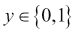

第一个挑战是，当给定一封电子邮件时，我们如何将其表示为特征向量*x*。一封电子邮件只是一堆文本或一组单词（因此，这个问题领域属于更广泛的**文本分类**类别）。让我们用一个长度等于字典大小的特征向量来表示一封电子邮件。如果字典中的给定单词出现在电子邮件中，则值为 1；否则为 0。让我们构建一个表示内容为*在线药店销售*的电子邮件的向量：

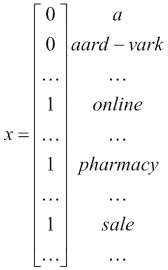

该特征向量中的单词字典称为*词汇表*，向量的维度与词汇表的大小相同。如果词汇表大小为 10,000，则该特征向量中的可能值将为 210,000。

我们的目标是对*y*给定*x*的概率进行建模。为了对*P(x|y)*进行建模，我们将做出一个强烈的假设，即*x*是有条件独立的。这个假设被称为**朴素贝叶斯假设**，基于这个假设的算法被称为**朴素贝叶斯分类器**。

例如，对于*y=1*，表示垃圾邮件，出现“在线”和“药店”这两个词的概率是独立的。这是一个与现实无关的强烈假设，但在获得良好预测时效果非常好。

## 准备就绪

Spark 自带一个用于朴素贝叶斯的示例数据集。让我们将这个数据集加载到 HDFS 中：

```scala
$ hdfs dfs -put /opt/infoobjects/spark/data/mllib/sample_naive_bayes_data.txt
 sample_naive_bayes_data.txt

```

## 如何做…

1.  启动 Spark shell：

```scala
$ spark-shell

```

1.  执行所需的导入操作：

```scala
scala> import org.apache.spark.mllib.classification.NaiveBayes
scala> import org.apache.spark.mllib.linalg.Vectors
scala> import org.apache.spark.mllib.regression.LabeledPoint

```

1.  将数据加载到 RDD 中：

```scala
scala> val data = sc.textFile("sample_naive_bayes_data.txt")

```

1.  将数据解析为`LabeledPoint`：

```scala
scala> val parsedData = data.map { line =>
 val parts = line.split(',')
 LabeledPoint(parts(0).toDouble, Vectors.dense(parts(1).split(' ').map(_.toDouble)))
}

```

1.  将数据一分为二，分别放入“训练”和“测试”数据集中：

```scala
scala> val splits = parsedData.randomSplit(Array(0.5, 0.5), seed = 11L)
scala> val training = splits(0)
scala> val test = splits(1)

```

1.  使用“训练”数据集训练模型：

```scala
val model = NaiveBayes.train(training, lambda = 1.0)

```

1.  预测“测试”数据集的标签：

```scala
val predictionAndLabel = test.map(p => (model.predict(p.features), p.label))

```
