# 第九章：使用 MLlib 进行无监督学习

本章将介绍如何使用 MLlib、Spark 的机器学习库进行无监督学习。

本章分为以下几个部分：

+   使用 k-means 进行聚类

+   使用主成分分析进行降维

+   使用奇异值分解进行降维

# 介绍

以下是维基百科对无监督学习的定义：

> *"在机器学习中，无监督学习的问题是尝试在未标记的数据中找到隐藏的结构。"*

与监督学习相比，我们有标记数据来训练算法，在无监督学习中，我们要求算法自行找到结构。让我们来看下面的样本数据集：

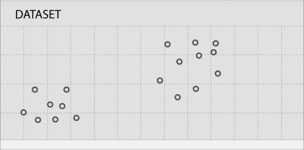

从上图可以看出，数据点形成了两个簇，如下所示：

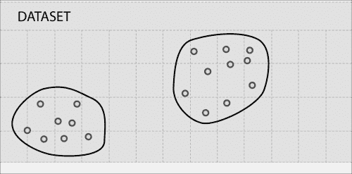

事实上，聚类是最常见的无监督学习算法类型。

# 使用 k-means 进行聚类

聚类分析或聚类是将数据分成多个组的过程，使得一组中的数据类似于其他组中的数据。

以下是聚类使用的一些示例：

+   **市场细分**：将目标市场分成多个细分，以便更好地满足每个细分的需求

+   **社交网络分析**：通过社交网络网站（如 Facebook）找到社交网络中一致的人群进行广告定位

+   **数据中心计算集群**：将一组计算机放在一起以提高性能

+   **天文数据分析**：理解天文数据和事件，如星系形成

+   **房地产**：根据相似特征识别社区

+   **文本分析**：将小说或散文等文本文档分成流派

k-means 算法最好通过图像来说明，所以让我们再次看看我们的样本图：


k-means 的第一步是随机选择两个点，称为**聚类中心**：

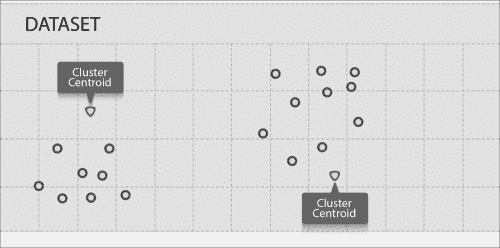

k-means 算法是一个迭代算法，分为两个步骤：

+   **簇分配步骤**：该算法将遍历每个数据点，并根据其距离更近的质心，将其分配给该质心，从而分配给它代表的簇

+   **移动质心步骤**：该算法将取每个质心并将其移动到簇中数据点的平均值

让我们看看在簇分配后我们的数据是什么样子：

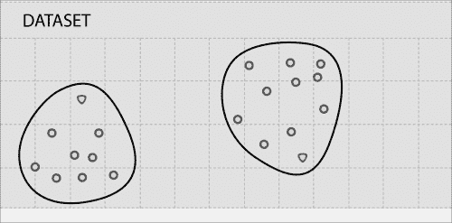

现在让我们将聚类中心移动到簇中数据点的平均值，如下所示：

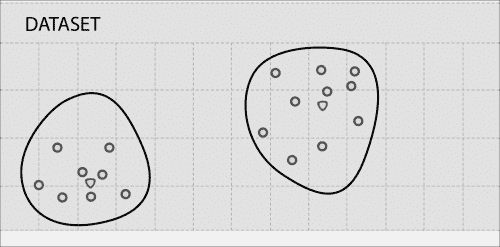

在这种情况下，一次迭代就足够了，进一步的迭代不会移动聚类中心。对于大多数真实数据，需要多次迭代才能将质心移动到最终位置。

k-means 算法需要输入一定数量的簇。

## 准备工作

让我们使用加利福尼亚州萨拉托加市的一些不同的住房数据。这次，我们将考虑地块面积和房价：

| 地块面积 | 房价（以千美元计） |
| --- | --- |
| --- | --- |
| 12839 | 2405 |
| 10000 | 2200 |
| 8040 | 1400 |
| 13104 | 1800 |
| 10000 | 2351 |
| 3049 | 795 |
| 38768 | 2725 |
| 16250 | 2150 |
| 43026 | 2724 |
| 44431 | 2675 |
| 40000 | 2930 |
| 1260 | 870 |
| 15000 | 2210 |
| 10032 | 1145 |
| 12420 | 2419 |
| 69696 | 2750 |
| 12600 | 2035 |
| 10240 | 1150 |
| 876 | 665 |
| 8125 | 1430 |
| 11792 | 1920 |
| 1512 | 1230 |
| 1276 | 975 |
| 67518 | 2400 |
| 9810 | 1725 |
| 6324 | 2300 |
| 12510 | 1700 |
| 15616 | 1915 |
| 15476 | 2278 |
| 13390 | 2497.5 |
| 1158 | 725 |
| 2000 | 870 |
| 2614 | 730 |
| 13433 | 2050 |
| 12500 | 3330 |
| 15750 | 1120 |
| 13996 | 4100 |
| 10450 | 1655 |
| 7500 | 1550 |
| 12125 | 2100 |
| 14500 | 2100 |
| 10000 | 1175 |
| 10019 | 2047.5 |
| 48787 | 3998 |
| 53579 | 2688 |
| 10788 | 2251 |
| 11865 | 1906 |

让我们将这些数据转换为一个名为`saratoga.c` `sv`的逗号分隔值（CSV）文件，并将其绘制为散点图：

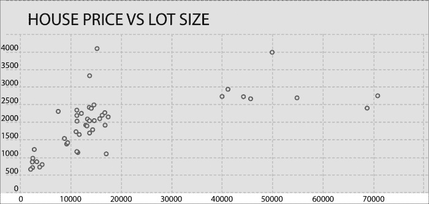

找到簇的数量是一项棘手的任务。在这里，我们有视觉检查的优势，而对于超平面上的数据（超过三个维度），这是不可用的。让我们粗略地将数据分成四个簇，如下所示：

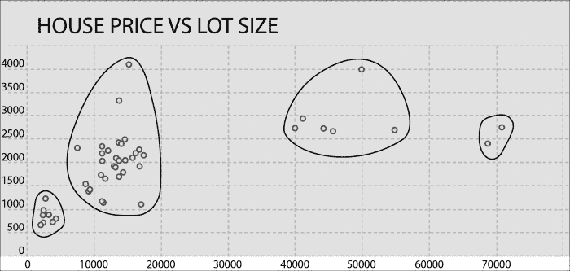

我们将运行 k-means 算法来做同样的事情，并看看我们的结果有多接近。

## 如何做…

1.  将`sarataga.csv`加载到 HDFS：

```scala
$ hdfs dfs -put saratoga.csv saratoga.csv

```

1.  启动 Spark shell：

```scala
$ spark-shell

```

1.  导入统计和相关类：

```scala
scala> import org.apache.spark.mllib.linalg.Vectors
scala> import org.apache.spark.mllib.clustering.KMeans

```

1.  将`saratoga.csv`作为 RDD 加载：

```scala
scala> val data = sc.textFile("saratoga.csv")

```

1.  将数据转换为密集向量的 RDD：

```scala
scala> val parsedData = data.map( line => Vectors.dense(line.split(',').map(_.toDouble)))

```

1.  为四个簇和五次迭代训练模型：

```scala
scala> val kmmodel= KMeans.train(parsedData,4,5)

```

1.  将`parsedData`收集为本地 scala 集合：

```scala
scala> val houses = parsedData.collect

```

1.  预测第 0 个元素的簇：

```scala
scala> val prediction = kmmodel.predict(houses(0))

```

1.  现在让我们比较 k-means 与我们单独完成的簇分配。k-means 算法从 0 开始给出簇 ID。一旦你检查数据，你会发现我们给出的 A 到 D 簇 ID 与 k-means 之间的以下映射：A=>3, B=>1, C=>0, D=>2。

1.  现在，让我们从图表的不同部分挑选一些数据，并预测它属于哪个簇。

1.  让我们看看房屋（18）的数据，占地面积为 876 平方英尺，售价为 665K 美元：

```scala
scala> val prediction = kmmodel.predict(houses(18))
resxx: Int = 3

```

1.  现在，看看占地面积为 15,750 平方英尺，价格为 1.12 百万美元的房屋（35）的数据：

```scala
scala> val prediction = kmmodel.predict(houses(35))
resxx: Int = 1

```

1.  现在看看房屋（6）的数据，占地面积为 38,768 平方英尺，售价为 2.725 百万美元：

```scala
scala> val prediction = kmmodel.predict(houses(6))
resxx: Int = 0

```

1.  现在看看房屋（15）的数据，占地面积为 69,696 平方英尺，售价为 275 万美元：

```scala
scala>  val prediction = kmmodel.predict(houses(15))
resxx: Int = 2

```

你可以用更多的数据测试预测能力。让我们进行一些邻域分析，看看这些簇承载着什么含义。簇 3 中的大多数房屋都靠近市中心。簇 2 中的房屋位于多山的地形上。

在这个例子中，我们处理了一组非常小的特征；常识和视觉检查也会导致相同的结论。k-means 算法的美妙之处在于它可以对具有无限数量特征的数据进行聚类。当你有原始数据并想了解数据中的模式时，它是一个很好的工具。

# 使用主成分分析进行降维

降维是减少维度或特征数量的过程。很多真实数据包含非常多的特征。拥有成千上万个特征并不罕见。现在，我们需要深入研究重要的特征。

降维有几个目的，比如：

+   数据压缩

+   可视化

当维度减少时，它会减少磁盘占用和内存占用。最后但同样重要的是；它可以帮助算法运行得更快。它还可以将高度相关的维度减少到一个维度。

人类只能可视化三个维度，但数据可以拥有更高的维度。可视化可以帮助发现数据中隐藏的模式。降维可以通过将多个特征压缩成一个特征来帮助可视化。

降维最流行的算法是主成分分析（PCA）。

让我们看看以下数据集：

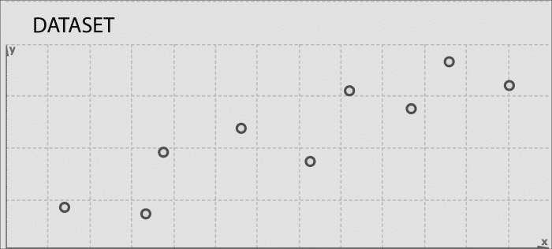

假设目标是将这个二维数据分成一维。做法是找到一条我们可以将这些数据投影到的线。让我们找一条适合将这些数据投影的线：

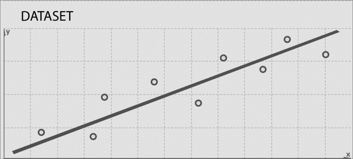

这是与数据点具有最短投影距离的线。让我们通过从每个数据点到这条投影线的最短线来进一步解释：

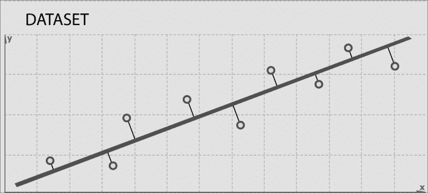

另一种看待的方式是，我们必须找到一条线来投影数据，使得数据点到这条线的平方距离之和最小化。这些灰色线段也被称为**投影误差**。

## 准备好了

让我们来看看萨拉托加市的房屋数据的三个特征，即房屋大小、地块大小和价格。使用 PCA，我们将房屋大小和地块大小特征合并为一个特征—*z*。让我们称这个特征为**房屋密度**。

值得注意的是，并不总是可能赋予新特征以意义。在这种情况下，很容易，因为我们只有两个特征要合并，我们可以用常识来结合这两者的效果。在更实际的情况下，您可能有 1000 个特征要投影到 100 个特征。可能不可能给这 100 个特征中的每一个赋予现实生活中的意义。

在这个练习中，我们将使用 PCA 推导出房屋密度，然后我们将进行线性回归，看看这个密度如何影响房价。

在我们深入 PCA 之前有一个预处理阶段：**特征缩放**。当两个特征的范围相差很大时，特征缩放就会出现。在这里，房屋大小的范围在 800 平方英尺到 7000 平方英尺之间变化，而地块大小在 800 平方英尺到几英亩之间变化。

为什么我们之前不需要进行特征缩放？答案是我们真的不需要让特征处于一个公平的水平上。梯度下降是另一个特征缩放非常有用的领域。

有不同的特征缩放方法：

+   将特征值除以最大值，这将使每个特征处于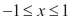范围内

+   将特征值除以范围，即最大值减最小值

+   通过减去特征值的平均值，然后除以范围

+   通过减去特征值的平均值，然后除以标准差

我们将使用最佳的第四种选择来进行缩放。以下是我们将用于此示例的数据：

| 房屋大小 | 地块大小 | 缩放后的房屋大小 | 缩放后的地块大小 | 房屋价格（以 1000 美元计） |
| --- | --- | --- | --- | --- |
| 2524 | 12839 | -0.025 | -0.231 | 2405 |
| 2937 | 10000 | 0.323 | -0.4 | 2200 |
| 1778 | 8040 | -0.654 | -0.517 | 1400 |
| 1242 | 13104 | -1.105 | -0.215 | 1800 |
| 2900 | 10000 | 0.291 | -0.4 | 2351 |
| 1218 | 3049 | -1.126 | -0.814 | 795 |
| 2722 | 38768 | 0.142 | 1.312 | 2725 |
| 2553 | 16250 | -0.001 | -0.028 | 2150 |
| 3681 | 43026 | 0.949 | 1.566 | 2724 |
| 3032 | 44431 | 0.403 | 1.649 | 2675 |
| 3437 | 40000 | 0.744 | 1.385 | 2930 |
| 1680 | 1260 | -0.736 | -0.92 | 870 |
| 2260 | 15000 | -0.248 | -0.103 | 2210 |
| 1660 | 10032 | -0.753 | -0.398 | 1145 |
| 3251 | 12420 | 0.587 | -0.256 | 2419 |
| 3039 | 69696 | 0.409 | 3.153 | 2750 |
| 3401 | 12600 | 0.714 | -0.245 | 2035 |
| 1620 | 10240 | -0.787 | -0.386 | 1150 |
| 876 | 876 | -1.414 | -0.943 | 665 |
| 1889 | 8125 | -0.56 | -0.512 | 1430 |
| 4406 | 11792 | 1.56 | -0.294 | 1920 |
| 1885 | 1512 | -0.564 | -0.905 | 1230 |
| 1276 | 1276 | -1.077 | -0.92 | 975 |
| 3053 | 67518 | 0.42 | 3.023 | 2400 |
| 2323 | 9810 | -0.195 | -0.412 | 1725 |
| 3139 | 6324 | 0.493 | -0.619 | 2300 |
| 2293 | 12510 | -0.22 | -0.251 | 1700 |
| 2635 | 15616 | 0.068 | -0.066 | 1915 |
| 2298 | 15476 | -0.216 | -0.074 | 2278 |
| 2656 | 13390 | 0.086 | -0.198 | 2497.5 |
| 1158 | 1158 | -1.176 | -0.927 | 725 |
| 1511 | 2000 | -0.879 | -0.876 | 870 |
| 1252 | 2614 | -1.097 | -0.84 | 730 |
| 2141 | 13433 | -0.348 | -0.196 | 2050 |
| 3565 | 12500 | 0.852 | -0.251 | 3330 |
| 1368 | 15750 | -0.999 | -0.058 | 1120 |
| 5726 | 13996 | 2.672 | -0.162 | 4100 |
| 2563 | 10450 | 0.008 | -0.373 | 1655 |
| 1551 | 7500 | -0.845 | -0.549 | 1550 |
| 1993 | 12125 | -0.473 | -0.274 | 2100 |
| 2555 | 14500 | 0.001 | -0.132 | 2100 |
| 1572 | 10000 | -0.827 | -0.4 | 1175 |
| 2764 | 10019 | 0.177 | -0.399 | 2047.5 |
| 7168 | 48787 | 3.887 | 1.909 | 3998 |
| 4392 | 53579 | 1.548 | 2.194 | 2688 |
| 3096 | 10788 | 0.457 | -0.353 | 2251 |
| 2003 | 11865 | -0.464 | -0.289 | 1906 |

让我们将经过缩放的房屋大小和经过缩放的房价数据保存为`scaledhousedata.csv`。 

## 如何做到这一点…

1.  将`scaledhousedata.csv`加载到 HDFS：

```scala
$ hdfs dfs -put scaledhousedata.csv scaledhousedata.csv

```

1.  启动 Spark shell：

```scala
$ spark-shell

```

1.  导入统计和相关类：

```scala
scala> import org.apache.spark.mllib.linalg.Vectors
scala> import org.apache.spark.mllib.linalg.distributed.RowMatrix

```

1.  将`saratoga.csv`加载为一个 RDD：

```scala
scala> val data = sc.textFile("scaledhousedata.csv")

```

1.  将数据转换为密集向量的 RDD：

```scala
scala> val parsedData = data.map( line => Vectors.dense(line.split(',').map(_.toDouble)))

```

1.  从`parsedData`创建一个`RowMatrix`：

```scala
scala> val mat = new RowMatrix(parsedData)

```

1.  计算一个主成分：

```scala
scala> val pc= mat.computePrincipalComponents(1)

```

1.  将行投影到由主成分张成的线性空间：

```scala
scala> val projected = mat.multiply(pc)

```

1.  将投影的`RowMatrix`转换回 RDD：

```scala
scala> val projectedRDD = projected.rows

```

1.  将`projectedRDD`保存回 HDFS：

```scala
scala> projectedRDD.saveAsTextFile("phdata")

```

现在我们将使用这个投影特征，我们决定称之为住房密度，将其与房价绘制在一起，看看是否出现任何新的模式：

1.  将 HDFS 目录`phdata`下载到本地目录`phdata`：

```scala
scala> hdfs dfs -get phdata phdata

```

1.  修剪数据中的起始和结束括号，并将数据加载到 MS Excel 中，放在房价旁边。

以下是房价与住房密度的图表：

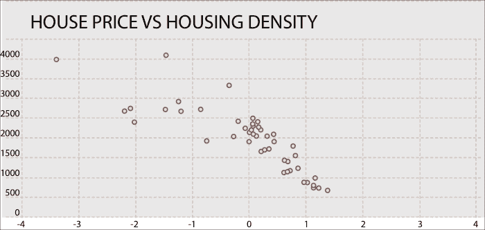

让我们按照以下数据画一些模式：

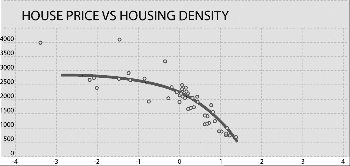

我们在这里看到了什么模式？从高密度到低密度住房的转移，人们愿意支付高昂的溢价。随着住房密度的降低，这种溢价趋于平稳。例如，人们愿意支付高额溢价，从公寓和联排别墅搬到独栋住宅，但是在一个可比的建成区域内，拥有 3 英亩地块大小的独栋住宅与拥有 2 英亩地块大小的独栋住宅的溢价并不会有太大的不同。

# 奇异值分解降维

通常，原始维度并不能最好地表示数据。正如我们在 PCA 中看到的，有时可以将数据投影到更少的维度，仍然保留大部分有用的信息。

有时，最好的方法是沿着展现大部分变化的特征对齐维度。这种方法有助于消除不代表数据的维度。

让我们再次看一下下图，它显示了两个维度上的最佳拟合线：


投影线显示了对原始数据的最佳近似，使用了一个维度。如果我们取灰线与黑线相交的点，并隔离黑线，我们将得到原始数据的减少表示，尽可能保留了尽可能多的变化，如下图所示：

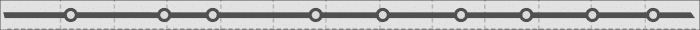

让我们画一条垂直于第一投影线的线，如下图所示：

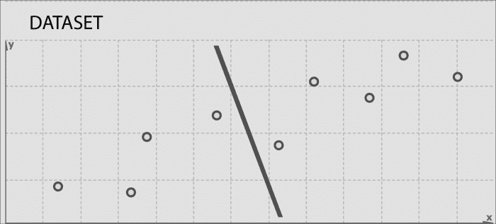

这条线尽可能多地捕捉了原始数据集的第二维度上的变化。它在近似原始数据方面做得不好，因为这个维度本来就变化较少。可以使用这些投影线来生成一组不相关的数据点，这些数据点将显示原始数据中一开始看不到的子分组。

这就是 SVD 的基本思想。将高维度、高变异性的数据点集合减少到一个更低维度的空间，更清晰地展现原始数据的结构，并按照变化最大到最小的顺序排列。SVD 非常有用的地方，尤其是对于 NLP 应用，是可以简单地忽略某个阈值以下的变化，从而大幅减少原始数据，确保保留原始关系的兴趣。

现在让我们稍微深入理论。SVD 基于线性代数中的一个定理，即一个矩阵 A 可以分解为三个矩阵的乘积——一个正交矩阵 U，一个对角矩阵 S，和一个正交矩阵 V 的转置。我们可以如下展示：

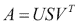

*U*和*V*是正交矩阵：

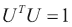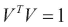

*U*的列是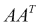的正交归一化特征向量，*V*的列是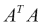的正交归一化特征向量。*S*是一个对角矩阵，按降序包含来自*U*或*V*的特征值的平方根。

## 准备就绪

让我们看一个术语-文档矩阵的例子。我们将看两篇关于美国总统选举的新闻。以下是两篇文章的链接：

+   **Fox**: [`www.foxnews.com/politics/2015/03/08/top-2016-gop-presidential-hopefuls-return-to-iowa-to-hone-message-including/`](http://www.foxnews.com/politics/2015/03/08/top-2016-gop-presidential-hopefuls-return-to-iowa-to-hone-message-including/)

+   **Npr**: [`www.npr.org/blogs/itsallpolitics/2015/03/09/391704815/in-iowa-2016-has-begun-at-least-for-the-republican-party`](http://www.npr.org/blogs/itsallpolitics/2015/03/09/391704815/in-iowa-2016-has-begun-at-least-for-the-republican-party)

让我们用这两条新闻构建总统候选人矩阵：

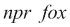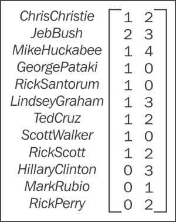

让我们把这个矩阵放在一个 CSV 文件中，然后把它放在 HDFS 中。我们将对这个矩阵应用 SVD 并分析结果。

## 如何做…

1.  将`scaledhousedata.csv`加载到 HDFS 中：

```scala
$ hdfs dfs -put pres.csv scaledhousedata.csv

```

1.  启动 Spark shell：

```scala
$ spark-shell

```

1.  导入统计和相关类：

```scala
scala> import org.apache.spark.mllib.linalg.Vectors
scala> import org.apache.spark.mllib.linalg.distributed.RowMatrix

```

1.  将`pres.csv`加载为 RDD：

```scala
scala> val data = sc.textFile("pres.csv")

```

1.  将数据转换为密集向量的 RDD：

```scala
scala> val parsedData = data.map( line => Vectors.dense(line.split(',').map(_.toDouble)))

```

1.  从`parsedData`创建`RowMatrix`：

```scala
scala> val mat = new RowMatrix(parsedData)

```

1.  计算`svd`：

```scala
scala> val svd = mat.computeSVD(2,true)

```

1.  计算`U`因子（特征向量）：

```scala
scala> val U = svd.U

```

1.  计算奇异值（特征值）矩阵：

```scala
scala> val s = svd.s

```

1.  计算`V`因子（特征向量）：

```scala
scala> val s = svd.s

```

如果你看`S`，你会意识到它给 Npr 文章的评分比 Fox 文章高得多。
