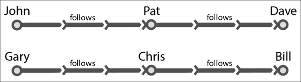

# 第十一章：使用 GraphX 进行图处理

本章将介绍如何使用 GraphX 进行图处理，即 Spark 的图处理库。

本章分为以下几个部分：

+   图的基本操作

+   使用 PageRank

+   查找连接的组件

+   执行邻域聚合

# 介绍

图分析在我们的生活中比我们想象的更常见。以最常见的例子为例，当我们要求 GPS 找到到达目的地的最短路径时，它使用图处理算法。

让我们从理解图开始。图是顶点集合的表示，其中一些顶点对由边连接。当这些边从一个方向移动到另一个方向时，称为**有向图**或**有向图**。

GraphX 是用于图处理的 Spark API。它提供了一个围绕 RDD 的包装器，称为**弹性分布式属性图**。属性图是一个具有属性附加到每个顶点和边的有向多重图。

有两种类型的图——有向图（有向图）和常规图。有向图具有沿一个方向运行的边，例如，从顶点 A 到顶点 B。Twitter 的关注者是有向图的一个很好的例子。如果约翰是大卫的 Twitter 关注者，这并不意味着大卫是约翰的关注者。另一方面，Facebook 是常规图的一个很好的例子。如果约翰是大卫的 Facebook 朋友，大卫也是约翰的 Facebook 朋友。

多重图是允许具有多个边（也称为**平行边**）的图。由于 GraphX 中的每条边都有属性，因此每条边都有自己的标识。

传统上，对于分布式图处理，有两种类型的系统：

+   数据并行

+   图并行

GraphX 旨在将两者结合在一个系统中。GraphX API 使用户能够在不移动数据的情况下将数据同时视为图和集合（RDD）。

# 图的基本操作

在这个示例中，我们将学习如何创建图并对其进行基本操作。

## 准备工作

作为一个起始示例，我们将有三个顶点，分别代表加利福尼亚州的三个城市的市中心——圣克拉拉、弗里蒙特和旧金山。以下是这些城市之间的距离：

| 源 | 目的地 | 距离（英里） |
| --- | --- | --- |
| 圣克拉拉，加利福尼亚 | 弗里蒙特，加利福尼亚 | 20 |
| 弗里蒙特，加利福尼亚 | 旧金山，加利福尼亚 | 44 |
| 旧金山，加利福尼亚 | 圣克拉拉，加利福尼亚 | 53 |

## 如何做…

1.  导入与 GraphX 相关的类：

```scala
scala> import org.apache.spark.graphx._
scala> import org.apache.spark.rdd.RDD

```

1.  将顶点数据加载到数组中：

```scala
scala> val vertices = Array((1L, ("Santa Clara","CA")),(2L, ("Fremont","CA")),(3L, ("San Francisco","CA")))

```

1.  将顶点数组加载到顶点的 RDD 中：

```scala
scala> val vrdd = sc.parallelize(vertices)

```

1.  将边数据加载到数组中：

```scala
scala> val edges = Array(Edge(1L,2L,20),Edge(2L,3L,44),Edge(3L,1L,53))

```

1.  将数据加载到边的 RDD 中：

```scala
scala> val erdd = sc.parallelize(edges)

```

1.  创建图：

```scala
scala> val graph = Graph(vrdd,erdd)

```

1.  打印图的所有顶点：

```scala
scala> graph.vertices.collect.foreach(println)

```

1.  打印图的所有边：

```scala
scala> graph.edges.collect.foreach(println)

```

1.  打印边的三元组；通过向边添加源和目的地属性来创建三元组：

```scala
scala> graph.triplets.collect.foreach(println)

```

1.  图的入度是它具有的内向边的数量。打印每个顶点的入度（作为`VertexRDD[Int]`）：

```scala
scala> graph.inDegrees

```

# 使用 PageRank

PageRank 衡量了图中每个顶点的重要性。PageRank 是由谷歌的创始人发起的，他们使用了这样一个理论，即互联网上最重要的页面是链接到它们的链接最多的页面。PageRank 还考虑了指向目标页面的页面的重要性。因此，如果给定的网页从排名较高的页面接收到传入链接，它将排名较高。

## 准备工作

我们将使用维基百科页面链接数据来计算页面排名。维基百科以数据库转储的形式发布其数据。我们将使用来自[`haselgrove.id.au/wikipedia.htm`](http://haselgrove.id.au/wikipedia.htm)的链接数据，该数据以两个文件的形式存在：

+   `links-simple-sorted.txt`

+   `titles-sorted.txt`

我已经将它们都放在了 Amazon S3 上，路径为`s3n://com.infoobjects.wiki/links`和`s3n://com.infoobjects.wiki/nodes`。由于数据量较大，建议您在 Amazon EC2 或本地集群上运行。沙箱可能会非常慢。

您可以使用以下命令将文件加载到`hdfs`中：

```scala
$ hdfs dfs -mkdir wiki
$ hdfs dfs -put links-simple-sorted.txt wiki/links.txt
$ hdfs dfs -put titles-sorted.txt wiki/nodes.txt

```

## 如何做…

1.  导入与 GraphX 相关的类：

```scala
scala> import org.apache.spark.graphx._

```

1.  从`hdfs`加载边缘，使用 20 个分区：

```scala
scala> val edgesFile = sc.textFile("wiki/links.txt",20)

```

或者，从 Amazon S3 加载边缘：

```scala
scala> val edgesFile = sc.textFile("s3n:// com.infoobjects.wiki/links",20)

```

### 注意

`links`文件以“源链接：link1 link2…”的格式包含链接。

1.  展平并将其转换为“link1,link2”格式，然后将其转换为`Edge`对象的 RDD：

```scala
scala> val edges = edgesFile.flatMap { line =>
 val links = line.split("\\W+")
 val from = links(0)
 val to = links.tail
 for ( link <- to) yield (from,link)
 }.map( e => Edge(e._1.toLong,e._2.toLong,1))

```

1.  从`hdfs`加载顶点，使用 20 个分区：

```scala
scala> val verticesFile = sc.textFile("wiki/nodes.txt",20)

```

1.  或者，从 Amazon S3 加载边缘：

```scala
scala> val verticesFile = sc.textFile("s3n:// com.infoobjects.wiki/nodes",20)

```

1.  为顶点提供索引，然后交换它以使其成为（索引，标题）格式：

```scala
scala> val vertices = verticesFile.zipWithIndex.map(_.swap)

```

1.  创建`graph`对象：

```scala
scala> val graph = Graph(vertices,edges)

```

1.  运行 PageRank 并获取顶点：

```scala
scala> val ranks = graph.pageRank(0.001).vertices

```

1.  由于排名是以（顶点 ID，pagerank）格式，因此交换它以使其成为（pagerank，顶点 ID）格式：

```scala
scala> val swappedRanks = ranks.map(_.swap)

```

1.  排序以首先获取排名最高的页面：

```scala
scala> val sortedRanks = swappedRanks.sortByKey(false)

```

1.  获取排名最高的页面：

```scala
scala> val highest = sortedRanks.first

```

1.  前面的命令给出了顶点 ID，您仍然需要查找以查看具有排名的实际标题。让我们进行连接：

```scala
scala> val join = sortedRanks.join(vertices)

```

1.  在将格式从（顶点 ID，（页面排名，标题））转换为（页面排名，（顶点 ID，标题））格式后，再次对连接的 RDD 进行排序：

```scala
scala> val final = join.map ( v => (v._2._1, (v._1,v._2._2))).sortByKey(false)

```

1.  打印排名前五的页面

```scala
scala> final.take(5).collect.foreach(println)

```

这是输出应该是什么样子的：

```scala
(12406.054646736622,(5302153,United_States'_Country_Reports_on_Human_Rights_Practices))
(7925.094429748747,(84707,2007,_Canada_budget)) (7635.6564216408515,(88822,2008,_Madrid_plane_crash)) (7041.479913258444,(1921890,Geographic_coordinates)) (5675.169862343964,(5300058,United_Kingdom's))

```

# 查找连接的组件

连接的组件是原始图的子图（其顶点是原始图的顶点集的子集，其边是原始图的边集的子集），其中任何两个顶点都通过边或一系列边连接到彼此。

理解它的一种简单方法是看一下夏威夷的道路网络图。这个州有许多岛屿，它们之间没有通过道路连接。在每个岛屿内，大多数道路将相互连接。找到连接的组件的目标是找到这些集群。

连接的组件算法使用其最低编号的顶点的 ID 标记图的每个连接组件。

## 准备好了

我们将在这里为我们知道的集群构建一个小图，并使用连接的组件来对它们进行分隔。让我们看看以下数据：



| 追随者 | 跟随者 |
| --- | --- |
| 约翰 | 帕特 |
| 帕特 | 戴夫 |
| 加里 | 克里斯 |
| 克里斯 | 比尔 |

前面的数据是一个简单的数据，有六个顶点和两个集群。让我们将这些数据放在两个文件的形式中：`nodes.csv`和`edges.csv`。

以下是`nodes.csv`的内容：

```scala
1,John
2,Pat
3,Dave
4,Gary
5,Chris
6,Bill
```

以下是`edges.csv`的内容：

```scala
1,2,follows
2,3,follows
4,5,follows
5,6,follows
```

我们应该期望连接组件算法识别出两个集群，第一个由（1,约翰）标识，第二个由（4,加里）标识。

您可以使用以下命令将文件加载到`hdfs`中：

```scala
$ hdfs dfs -mkdir data/cc
$ hdfs dfs -put nodes.csv data/cc/nodes.csv
$ hdfs dfs -put edges.csv data/cc/edges.csv

```

## 如何做…

1.  加载 Spark shell：

```scala
$ spark-shell

```

1.  导入与 GraphX 相关的类：

```scala
scala> import org.apache.spark.graphx._

```

1.  从`hdfs`加载边缘：

```scala
scala> val edgesFile = sc.textFile("hdfs://localhost:9000/user/hduser/data/cc/edges.csv")

```

1.  将`edgesFile` RDD 转换为边的 RDD：

```scala
scala> val edges = edgesFile.map(_.split(",")).map(e => Edge(e(0).toLong,e(1).toLong,e(2)))

```

1.  从`hdfs`加载顶点：

```scala
scala> val verticesFile = sc.textFile("hdfs://localhost:9000/user/hduser/data/cc/nodes.csv")

```

1.  映射顶点：

```scala
scala> val vertices = verticesFile.map(_.split(",")).map( e => (e(0).toLong,e(1)))

```

1.  创建`graph`对象：

```scala
scala> val graph = Graph(vertices,edges)

```

1.  计算连接的组件：

```scala
scala> val cc = graph.connectedComponents

```

1.  找到连接组件的顶点（这是一个子图）：

```scala
scala> val ccVertices = cc.vertices

```

1.  打印`ccVertices`：

```scala
scala> ccVertices.collect.foreach(println)

```

如您在输出中所见，顶点 1,2,3 指向 1，而 4,5,6 指向 4。这两个都是它们各自集群中索引最低的顶点。

# 执行邻域聚合

GraphX 通过隔离每个顶点及其邻居来进行大部分计算。这使得在分布式系统上处理大规模图数据变得更加容易。这使得邻域操作非常重要。GraphX 有一种机制可以在每个邻域级别进行，即`aggregateMessages`方法。它分两步进行：

1.  在第一步（方法的第一个函数）中，消息被发送到目标顶点或源顶点（类似于 MapReduce 中的 Map 函数）。

1.  在第二步（方法的第二个函数）中，对这些消息进行聚合（类似于 MapReduce 中的 Reduce 函数）。

## 准备好了

让我们构建一个追随者的小数据集：

| 追随者 | 跟随者 |
| --- | --- |
| 约翰 | 巴拉克 |
| 帕特 | 巴拉克 |
| 加里 | 巴拉克 |
| 克里斯 | 米特 |
| 罗布 | 米特 |

我们的目标是找出每个节点有多少关注者。让我们以两个文件的形式加载这些数据：`nodes.csv`和`edges.csv`。

以下是`nodes.csv`的内容：

```scala
1,Barack
2,John
3,Pat
4,Gary
5,Mitt
6,Chris
7,Rob
```

以下是`edges.csv`的内容：

```scala
2,1,follows
3,1,follows
4,1,follows
6,5,follows
7,5,follows
```

您可以使用以下命令将文件加载到`hdfs`：

```scala
$ hdfs dfs -mkdir data/na
$ hdfs dfs -put nodes.csv data/na/nodes.csv
$ hdfs dfs -put edges.csv data/na/edges.csv

```

## 如何做…

1.  加载 Spark shell：

```scala
$ spark-shell

```

1.  导入与 GraphX 相关的类：

```scala
scala> import org.apache.spark.graphx._

```

1.  从`hdfs`加载边：

```scala
scala> val edgesFile = sc.textFile("hdfs://localhost:9000/user/hduser/data/na/edges.csv")

```

1.  将边转换为边的 RDD：

```scala
scala> val edges = edgesFile.map(_.split(",")).map(e => Edge(e(0).toLong,e(1).toLong,e(2)))

```

1.  从`hdfs`加载顶点：

```scala
scala> val verticesFile = sc.textFile("hdfs://localhost:9000/user/hduser/data/cc/nodes.csv")

```

1.  映射顶点：

```scala
scala> val vertices = verticesFile.map(_.split(",")).map( e => (e(0).toLong,e(1)))

```

1.  创建`graph`对象：

```scala
scala> val graph = Graph(vertices,edges)

```

1.  通过向关注者发送消息，消息中包含每个关注者的关注者数量，即 1，然后添加关注者数量来进行邻域聚合：

```scala
scala> val followerCount = graph.aggregateMessages(Int), (a, b) => (a+b))

```

1.  以（被关注者，关注者数量）的形式打印`followerCount`：

```scala
scala> followerCount.collect.foreach(println)

```

您应该获得类似以下的输出：

```scala
(1,3)
(5,2)

```
