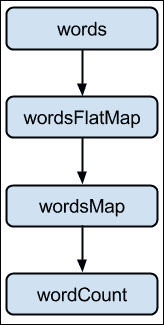
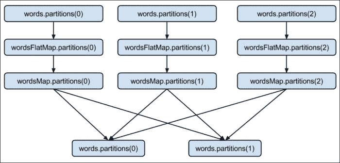
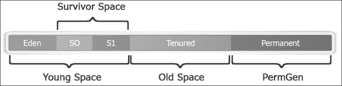
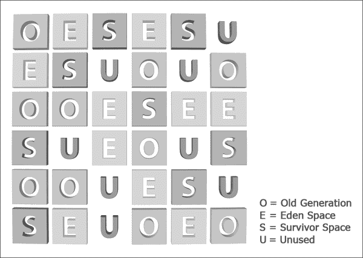
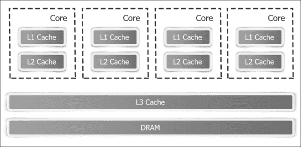

# 第十二章：优化和性能调优

本章涵盖了在使用 Spark 时的各种优化和性能调优最佳实践。

本章分为以下几个配方：

+   优化内存

+   使用压缩以提高性能

+   使用序列化以提高性能

+   优化垃圾收集

+   优化并行级别

+   理解优化的未来-项目钨

# 介绍

在研究各种优化 Spark 的方法之前，最好先了解 Spark 的内部情况。到目前为止，我们已经在较高级别上看待了 Spark，重点是各种库提供的功能。

让我们重新定义一个 RDD。从外部来看，RDD 是一个分布式的不可变对象集合。在内部，它由以下五个部分组成：

+   一组分区（`rdd.getPartitions`）

+   对父 RDD 的依赖列表（`rdd.dependencies`）

+   计算分区的函数，给定其父级

+   分区器（可选）（`rdd.partitioner`）

+   每个分区的首选位置（可选）（`rdd.preferredLocations`）

前三个是 RDD 重新计算所需的，以防数据丢失。当组合在一起时，称为**血统**。最后两个部分是优化。

一组分区是数据如何分布到节点的。在 HDFS 的情况下，这意味着`InputSplits`，它们大多与块相同（除非记录跨越块边界；在这种情况下，它将比块稍大）。

让我们重新审视我们的`wordCount`示例，以了解这五个部分。这是`wordCount`在数据集级别视图下的 RDD 图的样子：



基本上，流程如下：

1.  将`words`文件夹加载为 RDD：

```scala
scala> val words = sc.textFile("hdfs://localhost:9000/user/hduser/words")

```

以下是`words` RDD 的五个部分：

| **分区** | 每个 hdfs 输入拆分/块一个分区（`org.apache.spark.rdd.HadoopPartition`） |
| --- | --- |
| **依赖** | 无 |
| **计算函数** | 读取块 |
| **首选位置** | hdfs 块位置 |
| **分区器** | 无 |

1.  将`words` RDD 中的单词标记化，每个单词占一行：

```scala
scala> val wordsFlatMap = words.flatMap(_.split("\\W+"))

```

以下是`wordsFlatMap` RDD 的五个部分：

| **分区** | 与父 RDD 相同，即`words`（`org.apache.spark.rdd.HadoopPartition`） |
| --- | --- |
| **依赖** | 与父 RDD 相同，即`words`（`org.apache.spark.OneToOneDependency`） |
| **计算函数** | 计算父级并拆分每个元素并展平结果 |
| **首选位置** | 询问父母 |
| **分区器** | 无 |

1.  将`wordsFlatMap` RDD 中的每个单词转换为（单词，1）元组：

```scala
scala> val wordsMap = wordsFlatMap.map( w => (w,1))

```

以下是`wordsMap` RDD 的五个部分：

| **分区** | 与父 RDD 相同，即 wordsFlatMap（org.apache.spark.rdd.HadoopPartition） |
| --- | --- |
| **依赖** | 与父 RDD 相同，即 wordsFlatMap（org.apache.spark.OneToOneDependency） |
| **计算函数** | 计算父级并将其映射到 PairRDD |
| **首选位置** | 询问父母 |
| **分区器** | 无 |

1.  将给定键的所有值减少并求和：

```scala
scala> val wordCount = wordsMap.reduceByKey(_+_)

```

以下是`wordCount` RDD 的五个部分：

| **分区** | 每个 reduce 任务一个（`org.apache.spark.rdd.ShuffledRDDPartition`） |
| --- | --- |
| **依赖** | 每个父级的 Shuffle 依赖（`org.apache.spark.ShuffleDependency`） |
| **计算函数** | 对洗牌数据进行加法 |
| **首选位置** | 无 |
| **分区器** | HashPartitioner（`org.apache.spark.HashPartitioner`） |

这是`wordCount`在分区级别视图下的 RDD 图的样子：



# 优化内存

Spark 是一个复杂的分布式计算框架，有许多组成部分。各种集群资源，如内存、CPU 和网络带宽，可能在各个点成为瓶颈。由于 Spark 是一个内存计算框架，内存的影响最大。

另一个问题是，Spark 应用程序通常使用大量内存，有时超过 100GB。这种内存使用量在传统的 Java 应用程序中并不常见。

在 Spark 中，有两个地方需要进行内存优化，即在驱动程序和执行程序级别。

您可以使用以下命令来设置驱动程序内存：

+   Spark shell：

```scala
$ spark-shell --drive-memory 4g

```

+   Spark 提交：

```scala
$ spark-submit --drive-memory 4g

```

您可以使用以下命令来设置执行程序内存：

+   Spark shell：

```scala
$ spark-shell --executor-memory 4g

```

+   Spark 提交：

```scala
$ spark-submit --executor-memory 4g

```

要理解内存优化，了解 Java 中内存管理的工作原理是一个好主意。对象驻留在 Java 堆中。堆在 JVM 启动时创建，并且可以根据需要调整大小（基于配置中分配的最小和最大大小，即`-Xms`和`-Xmx`）。

堆被分为两个空间或代：年轻空间和老年空间。年轻空间用于分配新对象。年轻空间包括一个称为**伊甸园**的区域和两个较小的幸存者空间。当幼儿园变满时，通过运行称为**年轻收集**的特殊过程来收集垃圾，其中所有已经存在足够长时间的对象都被提升到老年空间。当老年空间变满时，通过运行称为**老年收集**的过程来在那里收集垃圾。



幼儿园背后的逻辑是，大多数对象的寿命非常短。年轻收集旨在快速找到新分配的对象并将它们移动到老年空间。

JVM 使用标记和清除算法进行垃圾回收。标记和清除收集包括两个阶段。

在标记阶段，所有具有活动引用的对象都被标记为活动的，其余的被假定为垃圾收集的候选对象。在清除阶段，垃圾收集候选对象占用的空间被添加到空闲列表中，即它们可以分配给新对象。

标记和清除有两个改进。一个是**并发标记和清除**（**CMS**），另一个是并行标记和清除。CMS 专注于较低的延迟，而后者专注于更高的吞吐量。这两种策略都有性能权衡。CMS 不进行压缩，而并行**垃圾收集器**（**GC**）执行整个堆的压缩，这会导致暂停时间。作为经验法则，对于实时流处理，应该使用 CMS，否则使用并行 GC。

如果您希望同时具有低延迟和高吞吐量，Java 1.7 更新 4 之后还有另一个选项，称为**垃圾优先 GC**（**G1**）。G1 是一种服务器式垃圾收集器，主要用于具有大内存的多核机器。它计划作为 CMS 的长期替代品。因此，为了修改我们的经验法则，如果您使用 Java 7 及以上版本，只需使用 G1。

G1 将堆分成一组大小相等的区域，每个区域都是虚拟内存的连续范围。每个区域被分配了一个角色，如伊甸园、幸存者和老年。G1 执行并发全局标记阶段，以确定整个堆中对象的活动引用。标记阶段结束后，G1 知道哪些区域大部分是空的。它首先在这些区域中进行收集，从而释放更多的内存。



G1 选择的用于垃圾收集的区域使用疏散进行垃圾收集。G1 将对象从堆的一个或多个区域复制到堆上的单个区域，并且它既压缩又释放内存。这种疏散是在多个核心上并行执行的，以减少暂停时间并增加吞吐量。因此，每次垃圾收集循环都会减少碎片化，同时在用户定义的暂停时间内工作。

在 Java 中内存优化有三个方面：

+   内存占用

+   访问内存中的对象的成本

+   垃圾收集的成本

一般来说，Java 对象访问速度快，但占用的空间比其中的实际数据多得多。

# 使用压缩来提高性能

数据压缩涉及使用比原始表示更少的位对信息进行编码。压缩在大数据技术中发挥着重要作用。它使数据的存储和传输更加高效。

当数据经过压缩时，它变得更小，因此磁盘 I/O 和网络 I/O 都变得更快。它还节省了存储空间。每种优化都有成本，压缩的成本体现在增加的 CPU 周期上，用于压缩和解压缩数据。

Hadoop 需要将数据分割成块，无论数据是否经过压缩。只有少数压缩格式是可分割的。

大数据加载的两种最流行的压缩格式是 LZO 和 Snappy。 Snappy 不可分割，而 LZO 可以。另一方面，Snappy 是一种更快的格式。

如果压缩格式像 LZO 一样是可分割的，输入文件首先被分割成块，然后进行压缩。由于压缩发生在块级别，因此解压缩可以在块级别以及节点级别进行。

如果压缩格式不可分割，则压缩发生在文件级别，然后将其分割成块。在这种情况下，块必须合并回文件，然后才能进行解压缩，因此无法在节点级别进行解压缩。

对于支持的压缩格式，Spark 将自动部署编解码器进行解压缩，用户无需采取任何操作。

# 使用序列化来提高性能

序列化在分布式计算中起着重要作用。有两种支持序列化 RDD 的持久性（存储）级别：

+   `MEMORY_ONLY_SER`：将 RDD 存储为序列化对象。它将为每个分区创建一个字节数组

+   `MEMORY_AND_DISK_SER`：这类似于`MEMORY_ONLY_SER`，但会将不适合内存的分区溢出到磁盘

以下是添加适当持久性级别的步骤：

1.  启动 Spark shell：

```scala
$ spark-shell

```

1.  导入与之相关的`StorageLevel`和隐式转换：

```scala
scala> import org.apache.spark.storage.StorageLevel._

```

1.  创建一个 RDD：

```scala
scala> val words = sc.textFile("words")

```

1.  持久化 RDD：

```scala
scala> words.persist(MEMORY_ONLY_SER)

```

尽管序列化大大减少了内存占用，但由于反序列化而增加了额外的 CPU 周期。

默认情况下，Spark 使用 Java 的序列化。由于 Java 序列化速度较慢，更好的方法是使用`Kryo`库。 `Kryo`要快得多，有时甚至比默认值紧凑 10 倍。

## 如何做到…

您可以通过在`SparkConf`中进行以下设置来使用`Kryo`：

1.  通过设置`Kryo`作为序列化器启动 Spark shell：

```scala
$ spark-shell --conf spark.serializer=org.apache.spark.serializer.KryoSerializer

```

1.  `Kryo`自动注册大部分核心 Scala 类，但如果您想注册自己的类，可以使用以下命令：

```scala
scala> sc.getConf.registerKryoClasses(Array(classOf[com.infoobjects.CustomClass1],classOf[com.infoobjects.CustomClass2])

```

# 优化垃圾收集

如果有大量短寿命的 RDD，JVM 垃圾收集可能会成为一个挑战。 JVM 需要检查所有对象以找到需要进行垃圾回收的对象。垃圾收集的成本与 GC 需要检查的对象数量成正比。因此，使用更少的对象和使用更少对象的数据结构（更简单的数据结构，如数组）有助于减少垃圾收集的成本。

序列化在这里也很出色，因为一个字节数组只需要一个对象进行垃圾回收。

默认情况下，Spark 使用 60％的执行器内存来缓存 RDD，其余 40％用于常规对象。有时，您可能不需要 60％的 RDD，并且可以减少此限制，以便为对象创建提供更多空间（减少对 GC 的需求）。

## 如何做到…

您可以通过启动 Spark shell 并设置内存分数来将 RDD 缓存的内存分配设置为 40％：

```scala
$ spark-shell --conf spark.storage.memoryFraction=0.4

```

# 优化并行级别

优化并行级别对充分利用集群容量非常重要。在 HDFS 的情况下，这意味着分区的数量与`InputSplits`的数量相同，这与块的数量大致相同。

在本教程中，我们将介绍优化分区数量的不同方法。

## 如何做到…

在加载文件到 RDD 时指定分区数量，具体步骤如下：

1.  启动 Spark shell：

```scala
$ spark-shell

```

1.  使用自定义分区数量作为第二个参数加载 RDD：

```scala
scala> sc.textFile("hdfs://localhost:9000/user/hduser/words",10)

```

另一种方法是通过执行以下步骤更改默认并行度：

1.  使用新的默认并行度值启动 Spark shell：

```scala
$ spark-shell --conf spark.default.parallelism=10

```

1.  检查默认并行度的值：

```scala
scala> sc.defaultParallelism

```

### 注

您还可以使用 RDD 方法`coalesce(numPartitions)`来减少分区数量，其中`numPartitions`是您希望的最终分区数量。如果您希望数据在网络上重新分配，可以调用 RDD 方法`repartition(numPartitions)`，其中`numPartitions`是您希望的最终分区数量。

# 了解优化的未来-项目钨

项目钨从 Spark 1.4 版本开始，旨在将 Spark 更接近裸金属。该项目的目标是大幅提高 Spark 应用程序的内存和 CPU 效率，并推动底层硬件的极限。

在分布式系统中，传统智慧一直是始终优化网络 I/O，因为这一直是最稀缺和最瓶颈的资源。这一趋势在过去几年已经改变。在过去 5 年中，网络带宽已经从每秒 1 千兆位增加到每秒 10 千兆位。

在类似的情况下，磁盘带宽已经从 50MB/s 增加到 500MB/s，SSD 的部署也越来越多。另一方面，CPU 时钟速度在 5 年前是~3GHz，现在仍然是一样的。这使得网络不再是瓶颈，而使 CPU 成为分布式处理中的新瓶颈。

### 注

另一个增加 CPU 性能负担的趋势是新的压缩数据格式，比如 Parquet。正如我们在本章的前几个示例中看到的，压缩和序列化会导致更多的 CPU 周期。这一趋势也推动了减少 CPU 周期成本的 CPU 优化的需求。

在类似的情况下，让我们看看内存占用。在 Java 中，GC 进行内存管理。GC 在将内存管理从程序员手中拿走并使其透明方面做得很好。为了做到这一点，Java 必须付出很大的开销，这大大增加了内存占用。例如，一个简单的字符串"abcd"，在 Java 中应该占用 4 个字节，实际上占用了 48 个字节。

如果我们放弃 GC，像在 C 等低级编程语言中那样手动管理内存会怎样？自 Java 1.7 版本以来，Java 确实提供了一种方法来做到这一点，称为`sun.misc.Unsafe`。Unsafe 基本上意味着您可以构建长区域的内存而不进行任何安全检查。这是项目钨的第一个特点。

## 通过利用应用程序语义进行手动内存管理

通过利用应用程序语义进行手动内存管理，如果你不知道自己在做什么，这可能非常危险，但在 Spark 中是一种福音。我们利用数据模式（DataFrames）的知识直接布局内存。这不仅可以摆脱 GC 开销，还可以最小化内存占用。

第二点是将数据存储在 CPU 缓存与内存中。每个人都知道 CPU 缓存很棒，因为从主内存获取数据需要三个周期，而缓存只需要一个周期。这是项目钨的第二个特点。

## 使用算法和数据结构

算法和数据结构被用来利用内存层次结构，实现更多的缓存感知计算。

CPU 缓存是存储 CPU 下一个需要的数据的小内存池。CPU 有两种类型的缓存：指令缓存和数据缓存。数据缓存按照 L1、L2 和 L3 的层次结构排列：

+   L1 缓存是计算机中最快、最昂贵的缓存。它存储最关键的数据，是 CPU 查找信息的第一个地方。

+   L2 缓存比 L1 稍慢，但仍位于同一处理器芯片上。这是 CPU 查找信息的第二个地方。

+   L3 缓存仍然较慢，但由所有核心共享，例如 DRAM（内存）。

这些可以在以下图表中看到：



第三点是，Java 在字节码生成方面不太擅长，比如表达式求值。如果这种代码生成是手动完成的，效率会更高。代码生成是 Tungsten 项目的第三个特性。

### 代码生成

这涉及利用现代编译器和 CPU，以便直接在二进制数据上进行高效操作。目前，Tungsten 项目还处于起步阶段，在 1.5 版本中将有更广泛的支持。
