# 第一章：为深度学习开发设置 Spark

在本章中，将涵盖以下内容：

+   下载 Ubuntu 桌面镜像

+   在 macOS 上使用 VMWare Fusion 安装和配置 Ubuntu

+   在 Windows 上使用 Oracle VirtualBox 安装和配置 Ubuntu

+   在 Google Cloud Platform 上安装和配置 Ubuntu 桌面

+   在 Ubuntu 桌面上安装和配置 Spark 和先决条件

+   将 Jupyter 笔记本与 Spark 集成

+   启动和配置 Spark 集群

+   停止 Spark 集群

# 介绍

深度学习是机器学习算法的专注研究，其主要学习方法是使用神经网络。深度学习在过去几年内迅速发展。微软、谷歌、Facebook、亚马逊、苹果、特斯拉等许多公司都在其应用程序、网站和产品中使用深度学习模型。与此同时，作为运行在大数据源之上的内存计算引擎，Spark 已经使处理大量信息变得更加容易和快速。事实上，Spark 现在已成为数据工程师、机器学习工程师和数据科学家的主要大数据开发工具。

由于深度学习模型在处理更多数据时表现更好，Spark 和深度学习之间的协同作用实现了完美的结合。几乎与用于执行深度学习算法的代码一样重要的是能够实现最佳开发的工作环境。许多才华横溢的人渴望开发神经网络，以帮助回答他们研究中的重要问题。不幸的是，深度学习模型开发的最大障碍之一是获得学习大数据所需的技术资源。本章的目的是为 Spark 上的深度学习创建一个理想的虚拟开发环境。

# 下载 Ubuntu 桌面镜像

Spark 可以为各种操作系统设置，无论是在本地还是在云中。对于我们的目的，Spark 将安装在以 Ubuntu 为操作系统的基于 Linux 的虚拟机上。使用 Ubuntu 作为首选虚拟机有几个优势，其中最重要的是成本。由于它们基于开源软件，Ubuntu 操作系统是免费使用的，不需要许可证。成本始终是一个考虑因素，本出版物的主要目标之一是尽量减少在 Spark 框架上开始深度学习所需的财务开支。

# 准备就绪

下载镜像文件需要满足一些最低要求：

+   至少 2GHz 双核处理器

+   至少 2GB 的系统内存

+   至少 25GB 的免费硬盘空间

# 操作步骤...

按照配方中的步骤下载 Ubuntu 桌面镜像：

1.  要创建 Ubuntu 桌面的虚拟机，首先需要从官方网站下载文件：[`www.ubuntu.com/download/desktop.`](https://www.ubuntu.com/download/desktop)

1.  截至目前，Ubuntu 桌面 16.04.3 是可供下载的最新版本。

1.  一旦下载完成，以.iso 格式访问以下文件：

`ubuntu-16.04.3-desktop-amd64.iso`

# 工作原理...

虚拟环境通过隔离与物理或主机机器的关系，提供了一个最佳的开发工作空间。开发人员可能会使用各种类型的主机环境，如运行 macOS 的 MacBook，运行 Windows 的 Microsoft Surface，甚至在 Microsoft Azure 或 AWS 云上的虚拟机；然而，为了确保代码执行的一致性，将部署一个 Ubuntu 桌面内的虚拟环境，可以在各种主机平台上使用和共享。

# 还有更多...

根据主机环境的不同，桌面虚拟化软件有几种选择。在使用 macOS 时，有两种常见的虚拟化软件应用：

+   VMWare Fusion

+   Parallels

# 另请参阅

要了解有关 Ubuntu 桌面的更多信息，请访问[`www.ubuntu.com/desktop`](https://www.ubuntu.com/desktop)。

# 在 macOS 上使用 VMWare Fusion 安装和配置 Ubuntu

本节将重点介绍使用 Ubuntu 操作系统构建虚拟机的过程，使用**VMWare Fusion**。

# 准备就绪

您的系统需要先安装 VMWare Fusion。如果您目前没有安装，可以从以下网站下载试用版本：

[`www.vmware.com/products/fusion/fusion-evaluation.html`](https://www.vmware.com/products/fusion/fusion-evaluation.html)

# 如何操作...

按照本文步骤配置在 macOS 上使用 VMWare Fusion 的 Ubuntu：

1.  一旦 VMWare Fusion 启动并运行，点击左上角的*+*按钮开始配置过程，并选择 New...，如下截图所示：

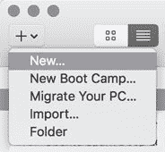

1.  选择后，选择从磁盘或镜像安装的选项，如下截图所示：

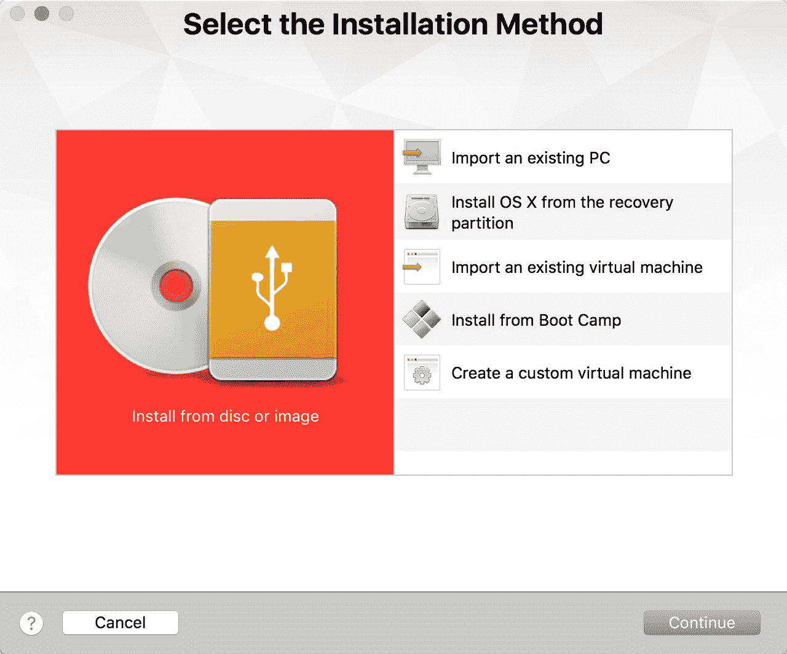

1.  选择从 Ubuntu 桌面网站下载的操作系统的`iso`文件，如下截图所示：

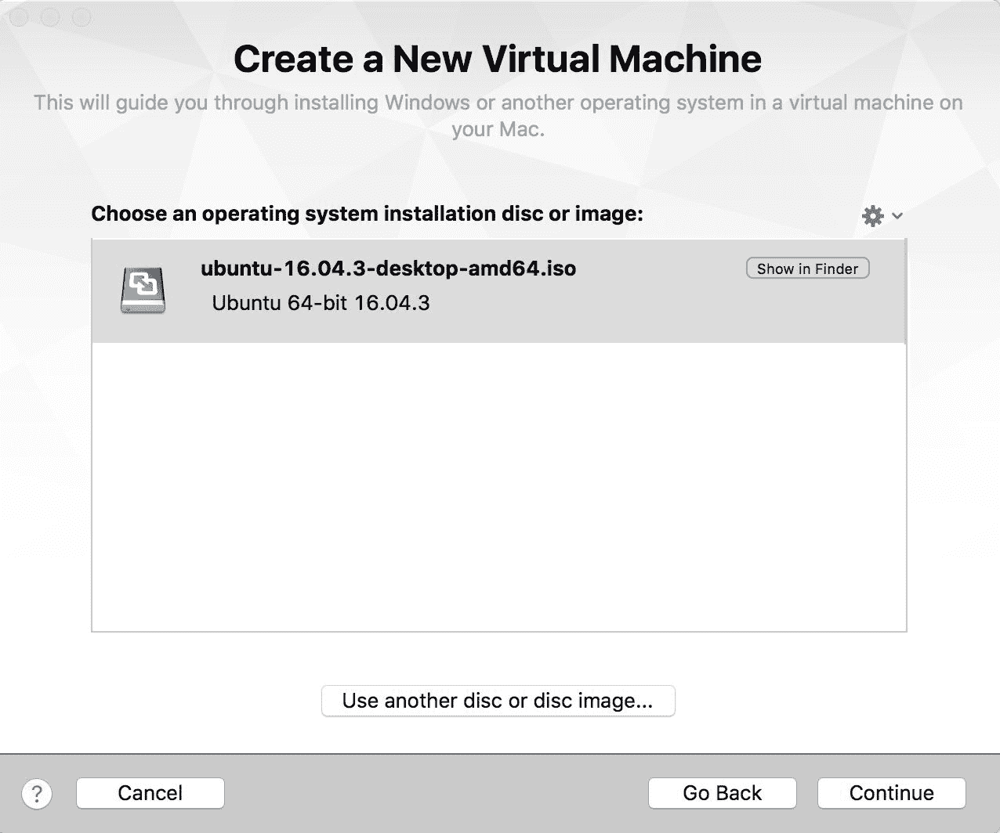

1.  下一步将询问是否要选择 Linux Easy Install。建议这样做，并为 Ubuntu 环境设置显示名称/密码组合，如下截图所示：

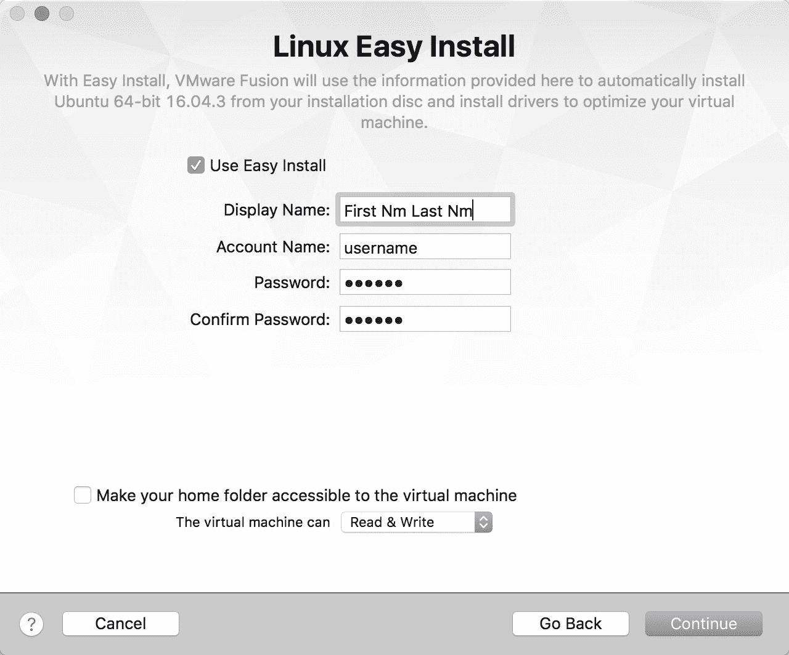

1.  配置过程几乎完成了。显示虚拟机摘要，可以选择自定义设置以增加内存和硬盘，如下截图所示：

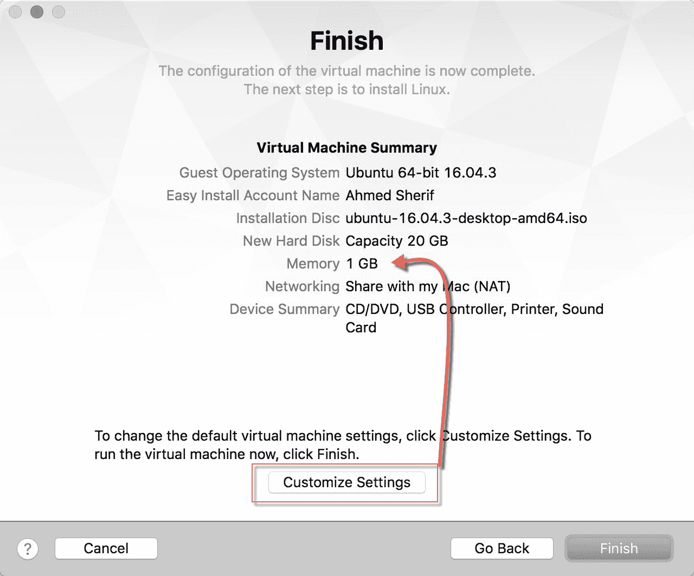

1.  虚拟机需要 20 到 40 GB 的硬盘空间就足够了；但是，将内存增加到 2 GB 甚至 4 GB 将有助于虚拟机在执行后续章节中的 Spark 代码时的性能。通过在虚拟机的设置下选择处理器和内存，并将内存增加到所需的数量来更新内存，如下截图所示：

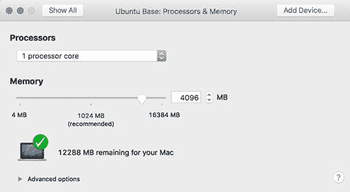

# 工作原理...

设置允许手动配置必要的设置，以便在 VMWare Fusion 上成功运行 Ubuntu 桌面。根据主机机器的需求和可用性，可以增加或减少内存和硬盘存储。

# 还有更多...

现在剩下的就是第一次启动虚拟机，这将启动系统安装到虚拟机的过程。一旦所有设置完成并且用户已登录，Ubuntu 虚拟机应该可以用于开发，如下截图所示：

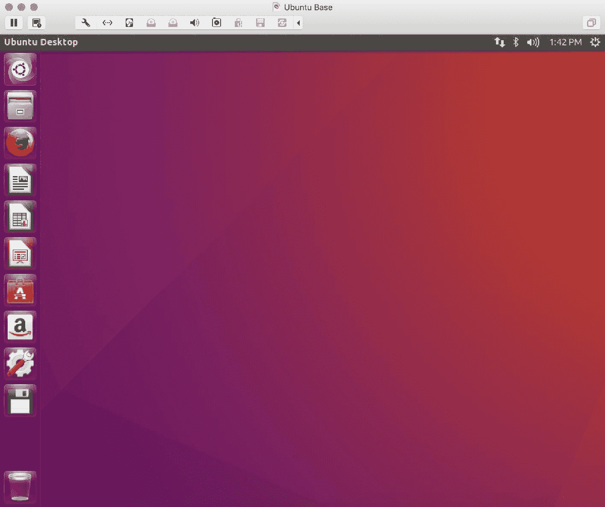

# 另请参阅

除了 VMWare Fusion 外，在 Mac 上还有另一款提供类似功能的产品。它被称为 Parallels Desktop for Mac。要了解有关 VMWare 和 Parallels 的更多信息，并决定哪个程序更适合您的开发，请访问以下网站：

+   [`www.vmware.com/products/fusion.html`](https://www.vmware.com/products/fusion.html) 下载并安装 Mac 上的 VMWare Fusion

+   [`parallels.com`](https://parallels.com) 下载并安装 Parallels Desktop for Mac

# 在 Windows 上使用 Oracle VirtualBox 安装和配置 Ubuntu

与 macOS 不同，在 Windows 中有几种虚拟化系统的选项。这主要是因为在 Windows 上虚拟化非常常见，因为大多数开发人员都在使用 Windows 作为他们的主机环境，并且需要虚拟环境进行测试，而不会影响依赖于 Windows 的任何依赖项。

# 准备就绪

Oracle 的 VirtualBox 是一款常见的虚拟化产品，可以免费使用。Oracle VirtualBox 提供了一个简单的过程，在 Windows 环境中运行 Ubuntu 桌面虚拟机。

# 如何操作...

按照本配方中的步骤，在 Windows 上使用**VirtualBox**配置 Ubuntu：

1.  启动 Oracle VM VirtualBox Manager。接下来，通过选择新建图标并指定机器的名称、类型和版本来创建一个新的虚拟机，如下截图所示：

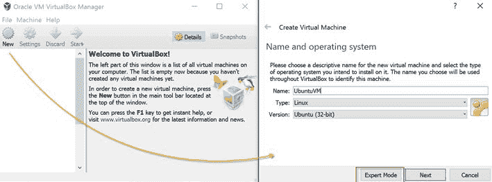

1.  选择“专家模式”，因为一些配置步骤将被合并，如下截图所示：

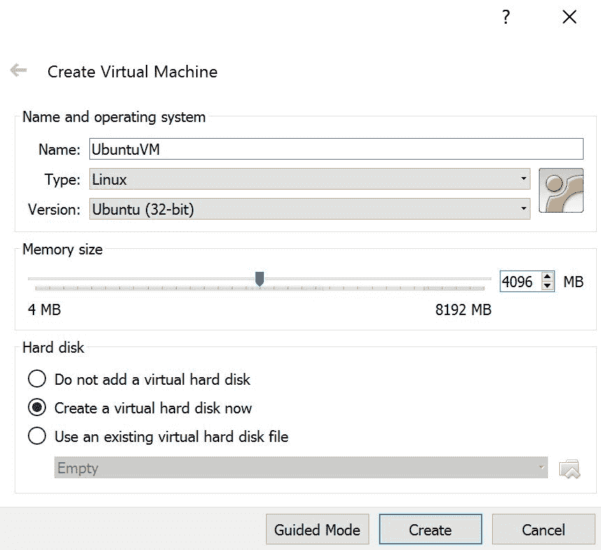

理想的内存大小应至少设置为`2048`MB，或者更好的是`4096`MB，具体取决于主机机器上的资源。

1.  此外，为在 Ubuntu 虚拟机上执行深度学习算法设置一个最佳硬盘大小至少为 20GB，如果可能的话更大，如下截图所示：

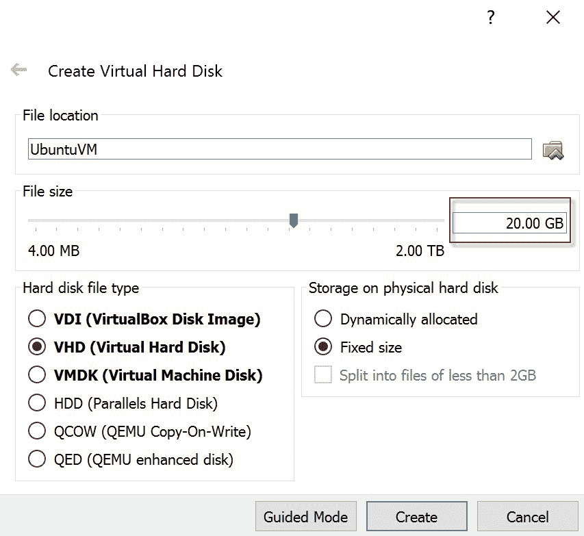

1.  将虚拟机管理器指向 Ubuntu `iso`文件下载的启动磁盘位置，然后开始创建过程，如下截图所示：

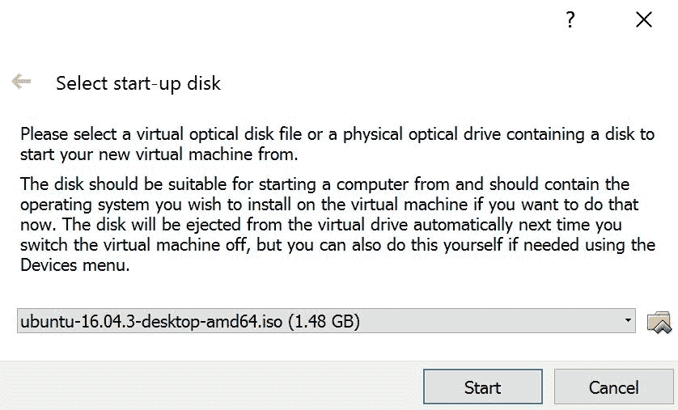

1.  在安装一段时间后，选择启动图标以完成虚拟机，并准备好进行开发，如下截图所示：

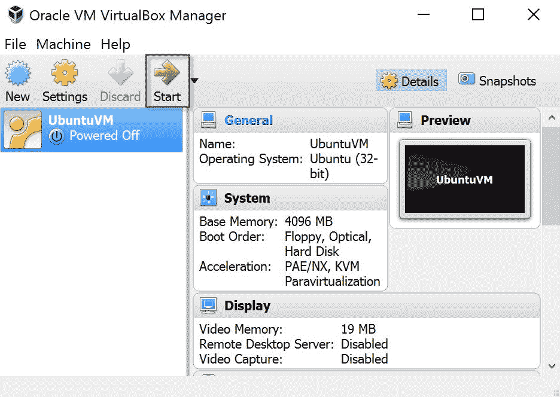

# 工作原理...

该设置允许手动配置必要的设置，以便在 Oracle VirtualBox 上成功运行 Ubuntu 桌面。与 VMWare Fusion 一样，内存和硬盘存储可以根据主机机器的需求和可用性进行增加或减少。

# 还有更多...

请注意，一些运行 Microsoft Windows 的机器默认情况下未设置为虚拟化，并且用户可能会收到初始错误，指示 VT-x 未启用。这可以在重新启动时在 BIOS 中进行反转，并且可以启用虚拟化。

# 另请参阅

要了解更多关于 Oracle VirtualBox 并决定是否适合您，请访问以下网站并选择 Windows 主机开始下载过程：[`www.virtualbox.org/wiki/Downloads`](https://www.virtualbox.org/wiki/Downloads)。

# 安装和配置 Ubuntu 桌面以在 Google Cloud Platform 上运行

之前，我们看到了如何在 VMWare Fusion 上本地设置 Ubuntu 桌面。在本节中，我们将学习如何在**Google Cloud Platform**上进行相同的设置。

# 准备工作

唯一的要求是一个 Google 账户用户名。首先使用您的 Google 账户登录到 Google Cloud Platform。Google 提供一个免费的 12 个月订阅，账户中有 300 美元的信用额度。设置将要求您的银行详细信息；但是，Google 不会在未明确告知您的情况下向您收费。继续验证您的银行账户，然后您就可以开始了。

# 操作方法...

按照配方中的步骤配置 Ubuntu 桌面以在 Google Cloud Platform 上运行：

1.  一旦登录到您的 Google Cloud Platform，访问一个看起来像下面截图的仪表板：

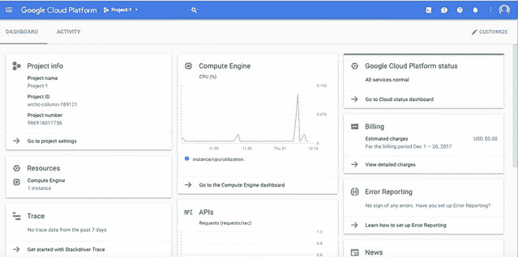

Google Cloud Platform 仪表板

1.  首先，点击屏幕左上角的产品服务按钮。在下拉菜单中，在计算下，点击 VM 实例，如下截图所示：

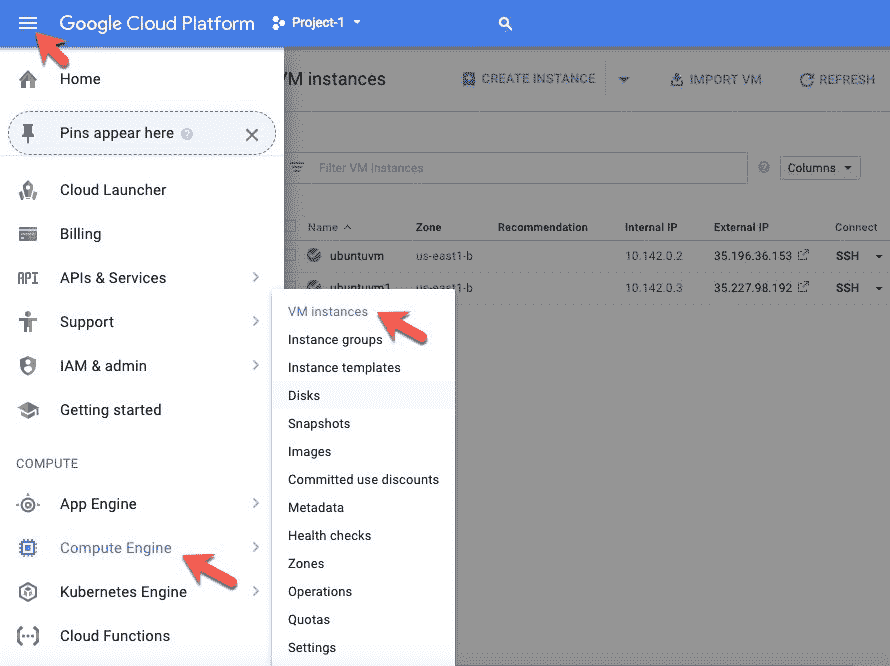

1.  创建一个新实例并命名它。在我们的案例中，我们将其命名为`ubuntuvm1`。在启动实例时，Google Cloud 会自动创建一个项目，并且实例将在项目 ID 下启动。如果需要，可以重命名项目。

1.  点击**创建实例**后，选择您所在的区域。

1.  在启动磁盘下选择**Ubuntu 16.04LTS**，因为这是将在云中安装的操作系统。请注意，LTS 代表版本，并且将获得来自 Ubuntu 开发人员的长期支持。

1.  接下来，在启动磁盘选项下，选择 SSD 持久磁盘，并将大小增加到 50GB，以增加实例的存储空间，如下截图所示：

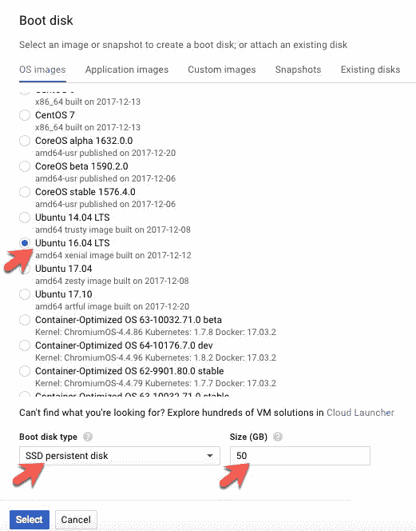

1.  接下来，将访问范围设置为**允许对所有云 API 进行完全访问**。

1.  在防火墙下，请检查**允许 HTTP 流量**和**允许 HTTPS 流量**，如下图所示：

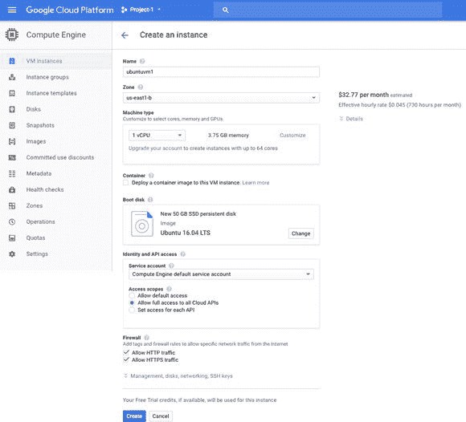

选择选项允许 HTTP 流量和 HTTPS 流量

1.  一旦实例配置如本节所示，点击“创建”按钮创建实例。

点击“创建”按钮后，您会注意到实例已经创建，并且具有唯一的内部和外部 IP 地址。我们将在后期需要这个。SSH 是安全外壳隧道的缩写，基本上是在客户端-服务器架构中进行加密通信的一种方式。可以将其视为数据通过加密隧道从您的笔记本电脑到谷歌的云服务器，以及从谷歌的云服务器到您的笔记本电脑的方式。

1.  点击新创建的实例。从下拉菜单中，点击**在浏览器窗口中打开**，如下图所示：

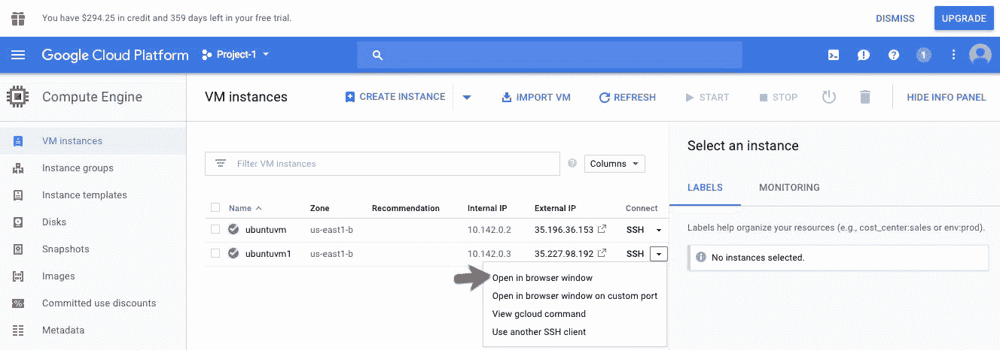

1.  您会看到谷歌在一个新窗口中打开了一个 shell/终端，如下图所示：

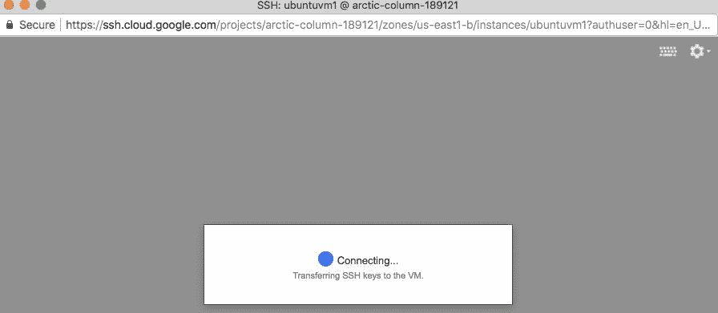

1.  一旦 shell 打开，您应该看到一个如下图所示的窗口：

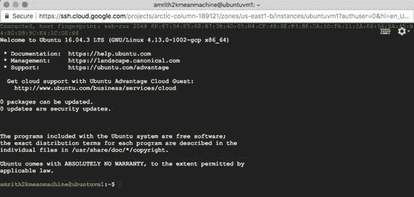

1.  在 Google 云 shell 中输入以下命令：

```scala
$ sudo apt-get update
$ sudo apt-get upgrade
$ sudo apt-get install gnome-shell
$ sudo apt-get install ubuntu-gnome-desktop
$ sudo apt-get install autocutsel
$ sudo apt-get install gnome-core
$ sudo apt-get install gnome-panel
$ sudo apt-get install gnome-themes-standard
```

1.  当提示是否继续时，输入`y`并选择 ENTER，如下图所示：


1.  完成上述步骤后，输入以下命令设置`vncserver`并允许连接到本地 shell：

```scala
$ sudo apt-get install tightvncserver
$ touch ~/.Xresources
```

1.  接下来，通过输入以下命令启动服务器：

```scala
$ tightvncserver
```

1.  这将提示您输入密码，稍后将用于登录到 Ubuntu 桌面虚拟机。此密码限制为八个字符，需要设置和验证，如下图所示：

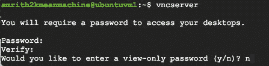

1.  外壳自动生成了一个启动脚本，如下图所示。可以通过复制并粘贴其`PATH`来访问和编辑此启动脚本：

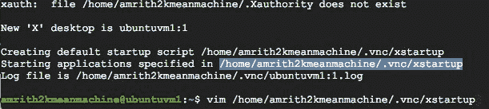

1.  在我们的情况下，查看和编辑脚本的命令是：

```scala
:~$ vim /home/amrith2kmeanmachine/.vnc/xstartup
```

这个`PATH`在每种情况下可能会有所不同。确保设置正确的`PATH`。`vim`命令会在 Mac 上的文本编辑器中打开脚本。

本地 shell 生成了一个启动脚本以及一个日志文件。启动脚本需要在文本编辑器中打开和编辑，接下来将讨论这一点。

1.  输入`vim`命令后，启动脚本的屏幕应该看起来像下图所示：

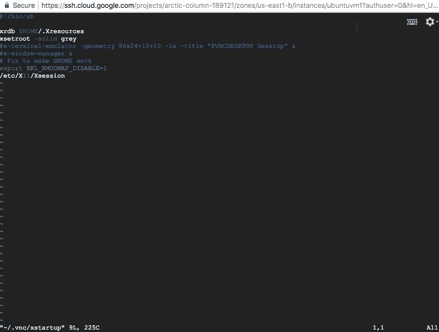

1.  输入`i`进入`INSERT`模式。接下来，删除启动脚本中的所有文本。然后它应该看起来像下图所示：

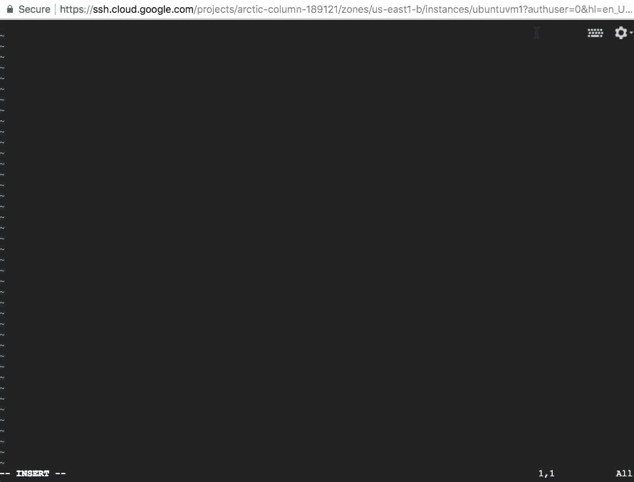

1.  将以下代码复制粘贴到启动脚本中：

```scala
#!/bin/sh
autocutsel -fork
xrdb $HOME/.Xresources
xsetroot -solid grey
export XKL_XMODMAP_DISABLE=1
export XDG_CURRENT_DESKTOP="GNOME-Flashback:Unity"
export XDG_MENU_PREFIX="gnome-flashback-"
unset DBUS_SESSION_BUS_ADDRESS
gnome-session --session=gnome-flashback-metacity --disable-acceleration-check --debug &
```

1.  脚本应该出现在编辑器中，如下截图所示：

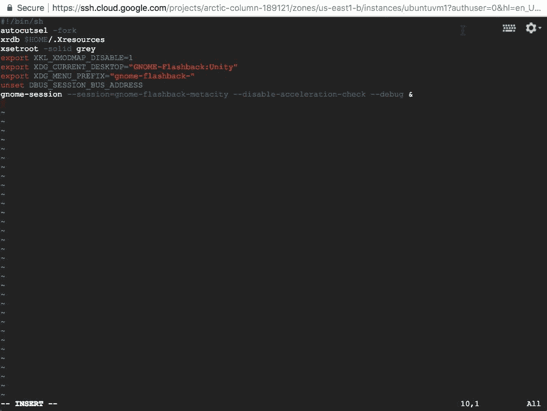

1.  按 Esc 退出`INSERT`模式，然后输入`:wq`以写入并退出文件。

1.  启动脚本配置完成后，在 Google shell 中输入以下命令关闭服务器并保存更改：

```scala
$ vncserver -kill :1
```

1.  此命令应该生成一个类似下图中的进程 ID：

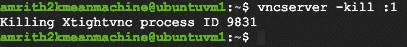

1.  通过输入以下命令重新启动服务器：

```scala
$ vncserver -geometry 1024x640
```

接下来的一系列步骤将专注于从本地主机安全地进入 Google Cloud 实例的外壳隧道。在本地 shell/终端上输入任何内容之前，请确保已安装 Google Cloud。如果尚未安装，请按照位于以下网站的快速入门指南中的说明进行安装：

[`cloud.google.com/sdk/docs/quickstart-mac-os-x`](https://cloud.google.com/sdk/docs/quickstart-mac-os-x)

1.  安装完 Google Cloud 后，在您的机器上打开终端，并输入以下命令连接到 Google Cloud 计算实例：

```scala
$ gcloud compute ssh \
YOUR INSTANCE NAME HERE \
--project YOUR PROJECT NAME HERE \
--zone YOUR TIMEZONE HERE \
--ssh-flag "-L 5901:localhost:5901"
```

1.  确保在上述命令中正确指定实例名称、项目 ID 和区域。按下 ENTER 后，本地 shell 的输出会变成下图所示的样子：

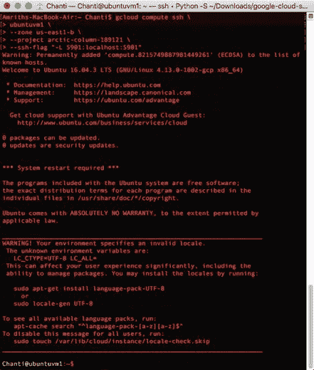

1.  一旦您看到实例名称后跟着`":~$"`，这意味着本地主机/笔记本电脑和 Google Cloud 实例之间已成功建立了连接。成功通过 SSH 进入实例后，我们需要一个名为**VNC Viewer**的软件来查看和与已在 Google Cloud Compute 引擎上成功设置的 Ubuntu 桌面进行交互。接下来的几个步骤将讨论如何实现这一点。

1.  可以使用以下链接下载 VNC Viewer：

[`www.realvnc.com/en/connect/download/viewer/`](https://www.realvnc.com/en/connect/download/viewer/)

1.  安装完成后，点击打开 VNC Viewer，并在搜索栏中输入`localhost::5901`，如下截图所示：

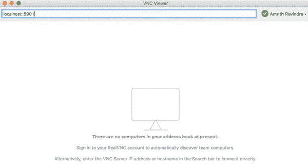

1.  接下来，在提示以下屏幕时点击**continue**：

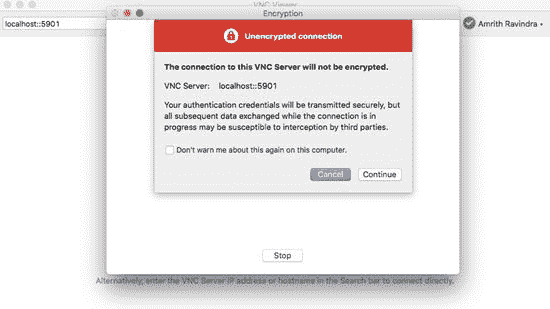

1.  这将提示您输入虚拟机的密码。输入您在第一次启动`tightvncserver`命令时设置的密码，如下截图所示：

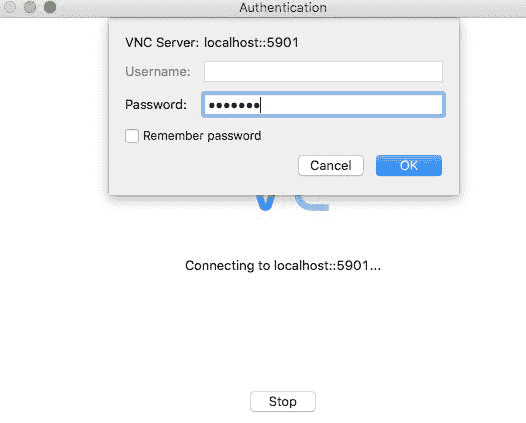

1.  您将最终被带入到您在 Google Cloud Compute 上的 Ubuntu 虚拟机的桌面。当在 VNC Viewer 上查看时，您的 Ubuntu 桌面屏幕现在应该看起来像以下截图：

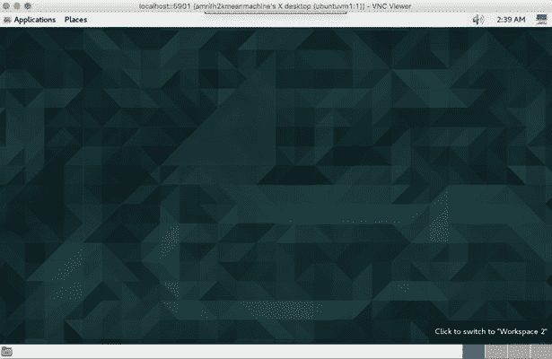

# 工作原理...

您现在已成功为与 Ubuntu 虚拟机/桌面交互设置了 VNC Viewer。建议在 Google Cloud 实例不使用时暂停或关闭实例，以避免产生额外费用。云方法对于可能无法访问高内存和存储资源的开发人员来说是最佳的。

# 还有更多...

虽然我们讨论了 Google Cloud 作为 Spark 的云选项，但也可以在以下云平台上利用 Spark：

+   Microsoft Azure

+   Amazon Web Services

# 另请参阅

要了解更多关于 Google Cloud Platform 并注册免费订阅，请访问以下网站：

[`cloud.google.com/`](https://cloud.google.com/)

# 在 Ubuntu 桌面上安装和配置 Spark 及其先决条件

在 Spark 可以运行之前，需要在新创建的 Ubuntu 桌面上安装一些必要的先决条件。本节将重点介绍在 Ubuntu 桌面上安装和配置以下内容：

+   Java 8 或更高版本

+   Anaconda

+   Spark

# 准备工作

本节的唯一要求是具有在 Ubuntu 桌面上安装应用程序的管理权限。

# 操作步骤...

本节将逐步介绍在 Ubuntu 桌面上安装 Python 3、Anaconda 和 Spark 的步骤：

1.  通过终端应用程序在 Ubuntu 上安装 Java，可以通过搜索该应用程序并将其锁定到左侧的启动器上找到，如下截图所示：

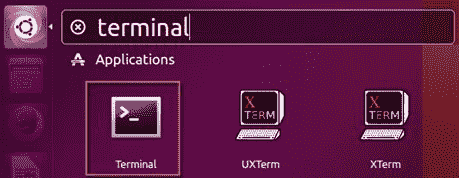

1.  通过在终端执行以下命令，在虚拟机上进行 Java 的初始测试：

```scala
java -version
```

1.  在终端执行以下四个命令来安装 Java：

```scala
sudo apt-get install software-properties-common 
$ sudo add-apt-repository ppa:webupd8team/java
$ sudo apt-get update
$ sudo apt-get install oracle-java8-installer
```

1.  接受 Oracle 的必要许可协议后，在终端再次执行`java -version`进行 Java 的二次测试。成功安装 Java 将在终端显示以下结果：

```scala
$ java -version
java version "1.8.0_144"
Java(TM) SE Runtime Environment (build 1.8.0_144-b01)
Java HotSpot(TM) 64-Bit Server VM (build 25.144-b01, mixed mode)
```

1.  接下来，安装最新版本的 Anaconda。当前版本的 Ubuntu 桌面预装了 Python。虽然 Ubuntu 预装 Python 很方便，但安装的版本是 Python 2.7，如下输出所示：

```scala
$ python --version
Python 2.7.12
```

1.  当前版本的 Anaconda 是 v4.4，Python 3 的当前版本是 v3.6。下载后，通过以下命令访问`Downloads`文件夹查看 Anaconda 安装文件：

```scala
$ cd Downloads/
~/Downloads$ ls
Anaconda3-4.4.0-Linux-x86_64.sh
```

1.  进入`Downloads`文件夹后，通过执行以下命令启动 Anaconda 的安装：

```scala
~/Downloads$ bash Anaconda3-4.4.0-Linux-x86_64.sh 
Welcome to Anaconda3 4.4.0 (by Continuum Analytics, Inc.)
In order to continue the installation process, please review the license agreement.
Please, press ENTER to continue
```

请注意，Anaconda 的版本以及其他安装的软件的版本可能会有所不同，因为新的更新版本会发布给公众。本章和本书中使用的 Anaconda 版本可以从[`repo.continuum.io/archive/Anaconda3-4.4.0-Linux-x86.sh`](https://repo.continuum.io/archive/Anaconda3-4.4.0-Linux-x86.sh)下载

1.  安装完成 Anaconda 后，重新启动终端应用程序，通过在终端中执行`python --version`来确认 Python 3 现在是 Anaconda 的默认 Python 环境：

```scala
$ python --version
Python 3.6.1 :: Anaconda 4.4.0 (64-bit)
```

1.  Linux 仍然提供 Python 2 版本，但在执行脚本时需要显式调用，如下命令所示：

```scala
~$ python2 --version
Python 2.7.12
```

1.  访问以下网站开始 Spark 下载和安装过程：

[`spark.apache.org/downloads.html`](https://spark.apache.org/downloads.html)

1.  选择下载链接。以下文件将下载到 Ubuntu 的**下载**文件夹中：

`spark-2.2.0-bin-hadoop2.7.tgz`

1.  通过执行以下命令在终端级别查看文件：

```scala
$ cd Downloads/
~/Downloads$ ls
spark-2.2.0-bin-hadoop2.7.tgz
```

1.  通过执行以下命令提取`tgz`文件：

```scala
~/Downloads$ tar -zxvf spark-2.2.0-bin-hadoop2.7.tgz
```

1.  使用`ls`查看**下载**目录，显示`tgz`文件和提取的文件夹：

```scala
~/Downloads$ ls
spark-2.2.0-bin-hadoop2.7 spark-2.2.0-bin-hadoop2.7.tgz
```

1.  通过执行以下命令，将提取的文件夹从**下载**文件夹移动到**主目录**文件夹：

```scala
~/Downloads$ mv spark-2.2.0-bin-hadoop2.7 ~/
~/Downloads$ ls
spark-2.2.0-bin-hadoop2.7.tgz
~/Downloads$ cd
~$ ls
anaconda3 Downloads Pictures Templates
Desktop examples.desktop Public Videos
Documents Music spark-2.2.0-bin-hadoop2.7
```

1.  现在，`spark-2.2.0-bin-hadoop2.7`文件夹已移动到**主目录**文件夹中，在左侧工具栏上选择**文件**图标时可以查看，如下截图所示：

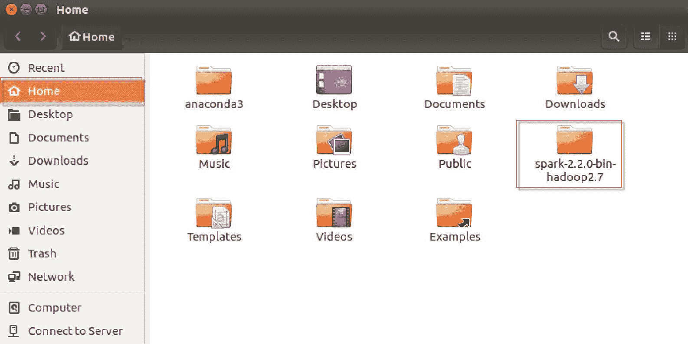

1.  Spark 现在已安装。通过在终端级别执行以下脚本来启动 Spark：

```scala
~$ cd ~/spark-2.2.0-bin-hadoop2.7/
~/spark-2.2.0-bin-hadoop2.7$ ./bin/pyspark
```

1.  执行最终测试，以确保 Spark 在终端上运行，通过执行以下命令来确保`SparkContext`在本地环境中驱动集群：

```scala
>>> sc
<SparkContext master=local[*] appName=PySparkShell>
```

# 工作原理...

本节解释了 Python、Anaconda 和 Spark 的安装过程背后的原因。

1.  Spark 在**Java 虚拟机**（**JVM**）上运行，Java **软件开发工具包**（**SDK**）是 Spark 在 Ubuntu 虚拟机上运行的先决条件安装。

为了使 Spark 在本地机器或集群上运行，安装需要最低版本的 Java 6。

1.  Ubuntu 建议使用`sudo apt install`方法安装 Java，因为这样可以确保下载的软件包是最新的。

1.  请注意，如果尚未安装 Java，则终端中的输出将显示以下消息：

```scala
The program 'java' can be found in the following packages:
* default-jre
* gcj-5-jre-headless
* openjdk-8-jre-headless
* gcj-4.8-jre-headless
* gcj-4.9-jre-headless
* openjdk-9-jre-headless
Try: sudo apt install <selected package>
```

1.  虽然 Python 2 也可以，但被视为传统 Python。 Python 2 将于 2020 年面临终止生命周期日期；因此，建议所有新的 Python 开发都使用 Python 3，就像本出版物中的情况一样。直到最近，Spark 只能与 Python 2 一起使用。现在不再是这种情况。Spark 可以与 Python 2 和 3 一起使用。通过 Anaconda 是安装 Python 3 以及许多依赖项和库的便捷方式。Anaconda 是 Python 和 R 的免费开源发行版。Anaconda 管理 Python 中用于数据科学相关任务的许多常用软件包的安装和维护。

1.  在安装 Anaconda 过程中，重要的是确认以下条件：

+   Anaconda 安装在`/home/username/Anaconda3`位置

+   Anaconda 安装程序将 Anaconda3 安装位置前置到`/home/username/.bashrc`中的`PATH`中

1.  安装 Anaconda 后，下载 Spark。与 Python 不同，Spark 不会预先安装在 Ubuntu 上，因此需要下载和安装。

1.  为了进行深度学习开发，将选择以下 Spark 的偏好设置：

+   **Spark 版本**：**2.2.0** (2017 年 7 月 11 日)

+   **软件包类型**：预构建的 Apache Hadoop 2.7 及更高版本

+   **下载类型**：直接下载

1.  一旦 Spark 安装成功，通过在命令行执行 Spark 的输出应该看起来类似于以下截图：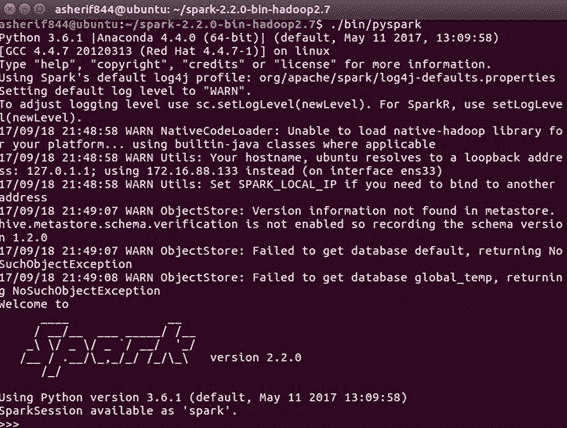

1.  初始化 Spark 时需要注意的两个重要特性是，它是在`Python 3.6.1` | `Anaconda 4.4.0 (64 位)` | 框架下，并且 Spark 标志的版本是 2.2.0。

1.  恭喜！Spark 已成功安装在本地 Ubuntu 虚拟机上。但是，还没有完成所有工作。当 Spark 代码可以在 Jupyter 笔记本中执行时，Spark 开发效果最佳，特别是用于深度学习。幸运的是，Jupyter 已经在本节前面执行的 Anaconda 分发中安装了。

# 还有更多...

也许你会问为什么我们不直接使用`pip install pyspark`在 Python 中使用 Spark。之前的 Spark 版本需要按照我们在本节中所做的安装过程。从 2.2.0 开始的未来版本的 Spark 将开始允许通过`pip`方法直接安装。我们在本节中使用完整的安装方法，以确保您能够在使用早期版本的 Spark 时安装和完全集成 Spark。

# 另请参阅

要了解更多关于 Jupyter 笔记本及其与 Python 的集成，请访问以下网站：

[`jupyter.org`](http://jupyter.org)

要了解有关 Anaconda 的更多信息并下载 Linux 版本，请访问以下网站：

[`www.anaconda.com/download/`](https://www.anaconda.com/download/)

# 将 Jupyter 笔记本与 Spark 集成

初学 Python 时，使用 Jupyter 笔记本作为交互式开发环境（IDE）非常有用。这也是 Anaconda 如此强大的主要原因之一。它完全整合了 Python 和 Jupyter 笔记本之间的所有依赖关系。PySpark 和 Jupyter 笔记本也可以做到同样的事情。虽然 Spark 是用 Scala 编写的，但 PySpark 允许在 Python 中进行代码转换。

# 做好准备

本节大部分工作只需要从终端访问`.bashrc`脚本。

# 如何操作...

PySpark 默认情况下未配置为在 Jupyter 笔记本中工作，但稍微调整`.bashrc`脚本即可解决此问题。我们将在本节中逐步介绍这些步骤：

1.  通过执行以下命令访问`.bashrc`脚本：

```scala
$ nano .bashrc
```

1.  滚动到脚本的最后应该会显示最后修改的命令，这应该是在上一节安装过程中由 Anaconda 设置的`PATH`。`PATH`应该如下所示：

```scala
# added by Anaconda3 4.4.0 installer
export PATH="/home/asherif844/anaconda3/bin:$PATH"
```

1.  在 Anaconda 安装程序添加的`PATH`下，可以包括一个自定义函数，帮助将 Spark 安装与 Anaconda3 中的 Jupyter 笔记本安装进行通信。在本章和后续章节中，我们将把该函数命名为`sparknotebook`。配置应该如下所示：`sparknotebook()`

```scala
function sparknotebook()
{
export SPARK_HOME=/home/asherif844/spark-2.2.0-bin-hadoop2.7
export PYSPARK_PYTHON=python3
export PYSPARK_DRIVER_PYTHON=jupyter
export PYSPARK_DRIVER_PYTHON_OPTS="notebook"
$SPARK_HOME/bin/pyspark
}
```

1.  更新后的`.bashrc`脚本应该保存后如下所示：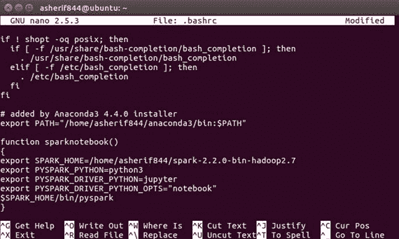

1.  保存并退出`.bashrc`文件。建议通过执行以下命令并重新启动终端应用程序来确认`.bashrc`文件已更新：

```scala
$ source .bashrc
```

# 它是如何工作的...

本节的目标是将 Spark 直接集成到 Jupyter 笔记本中，以便我们不是在终端上进行开发，而是利用在笔记本中开发的好处。本节解释了在 Jupyter 笔记本中进行 Spark 集成的过程。

1.  我们将创建一个名为`sparknotebook`的命令函数，我们可以从终端调用它，通过 Anaconda 安装打开一个 Spark 会话的 Jupyter 笔记本。这需要在`.bashrc`文件中设置两个设置：

1.  PySpark Python 设置为 python 3

1.  将 PySpark 驱动程序设置为 Jupyter 的 Python

1.  现在可以直接从终端访问`sparknotebook`函数，方法是执行以下命令：

```scala
$ sparknotebook
```

1.  然后，该函数应通过默认的 Web 浏览器启动全新的 Jupyter 笔记本会话。可以通过单击右侧的“新建”按钮并在“笔记本”下选择“Python 3”来创建 Jupyter 笔记本中的新 Python 脚本，其扩展名为`.ipynb`，如下截图所示: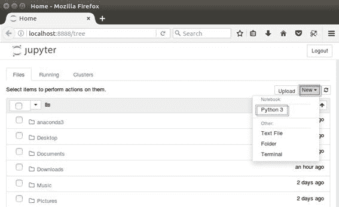

1.  再次，就像在终端级别为 Spark 做的那样，将在笔记本中执行`sc`的简单脚本，以确认 Spark 是否通过 Jupyter 正常运行: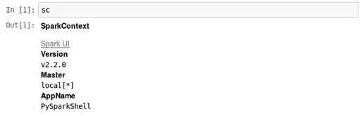

1.  理想情况下，版本、主节点和应用名称应与在终端执行`sc`时的输出相同。如果是这种情况，那么 PySpark 已成功安装和配置为与 Jupyter 笔记本一起工作。

# 还有更多...

重要的是要注意，如果我们通过终端调用 Jupyter 笔记本而没有指定`sparknotebook`，我们的 Spark 会话将永远不会启动，并且在执行`SparkContext`脚本时会收到错误。

我们可以通过在终端执行以下内容来访问传统的 Jupyter 笔记本：

```scala
jupyter-notebook
```

一旦我们启动笔记本，我们可以尝试执行与之前相同的`sc.master`脚本，但这次我们将收到以下错误：

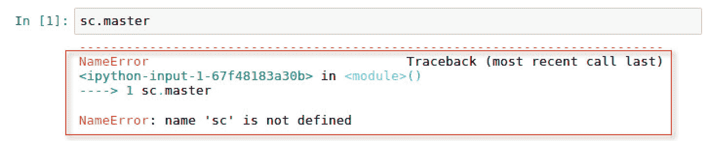

# 另请参阅

在线提供了许多公司提供 Spark 的托管服务，通过笔记本界面，Spark 的安装和配置已经为您管理。以下是：

+   Hortonworks ([`hortonworks.com/`](https://hortonworks.com/))

+   Cloudera ([`www.cloudera.com/`](https://www.cloudera.com/))

+   MapR ([`mapr.com/`](https://mapr.com/))

+   DataBricks ([`databricks.com/`](https://mapr.com/))

# 启动和配置 Spark 集群

对于大多数章节，我们将要做的第一件事是初始化和配置我们的 Spark 集群。

# 准备就绪

在初始化集群之前导入以下内容。

+   `from pyspark.sql import SparkSession`

# 如何做...

本节介绍了初始化和配置 Spark 集群的步骤。

1.  使用以下脚本导入`SparkSession`：

```scala
from pyspark.sql import SparkSession
```

1.  使用以下脚本配置名为`spark`的`SparkSession`：

```scala
spark = SparkSession.builder \
    .master("local[*]") \
    .appName("GenericAppName") \
    .config("spark.executor.memory", "6gb") \
.getOrCreate()
```

# 它是如何工作的...

本节解释了`SparkSession`作为在 Spark 中开发的入口点的工作原理。

1.  从 Spark 2.0 开始，不再需要创建`SparkConf`和`SparkContext`来开始在 Spark 中进行开发。导入`SparkSession`将处理初始化集群。此外，重要的是要注意，`SparkSession`是`pyspark`的`sql`模块的一部分。

1.  我们可以为我们的`SparkSession`分配属性：

1.  `master`：将 Spark 主 URL 分配给在我们的`local`机器上运行，并使用最大可用的核心数。

1.  `appName`：为应用程序分配一个名称

1.  `config`：将`spark.executor.memory`分配为`6gb`

1.  `getOrCreate`：确保如果没有可用的`SparkSession`，则创建一个，并在可用时检索现有的`SparkSession`

# 还有更多...

出于开发目的，当我们在较小的数据集上构建应用程序时，我们可以只使用`master("local")`。如果我们要在生产环境中部署，我们将希望指定`master("local[*]")`，以确保我们使用最大可用的核心并获得最佳性能。

# 另请参阅

要了解有关`SparkSession.builder`的更多信息，请访问以下网站：

[`spark.apache.org/docs/2.2.0/api/java/org/apache/spark/sql/SparkSession.Builder.html`](https://spark.apache.org/docs/2.2.0/api/java/org/apache/spark/sql/SparkSession.Builder.html)

# 停止 Spark 集群

一旦我们在集群上开发完成，最好关闭它并保留资源。

# 如何做...

本节介绍了停止`SparkSession`的步骤。

1.  执行以下脚本：

`spark.stop()`

1.  通过执行以下脚本来确认会话是否已关闭：

`sc.master`

# 它是如何工作的...

本节将解释如何确认 Spark 集群已关闭。

1.  如果集群已关闭，当在笔记本中执行另一个 Spark 命令时，将会收到以下截图中看到的错误消息：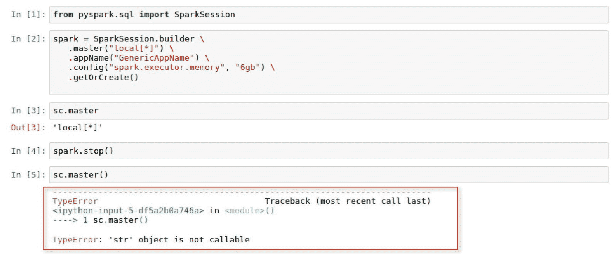

# 还有更多...

在本地环境中工作时，关闭 Spark 集群可能并不那么重要；然而，在 Spark 部署在计算成本需要付费的云环境中，关闭集群将会很昂贵。
