# 第二章：在 Spark 中创建神经网络

在本章中，将涵盖以下内容：

+   在 PySpark 中创建数据框

+   在 PySpark 数据框中操作列

+   将 PySpark dataframe 转换为数组

+   在散点图中可视化数组

+   设置权重和偏差以输入神经网络

+   对神经网络的输入数据进行归一化

+   验证数组以获得最佳神经网络性能

+   使用 Sigmoid 设置激活函数

+   创建 Sigmoid 导数函数

+   在神经网络中计算成本函数

+   基于身高和体重预测性别

+   可视化预测分数

# 介绍

本书的大部分内容将集中在使用 Python 中的库构建深度学习算法，例如 TensorFlow 和 Keras。虽然这些库有助于构建深度神经网络，而无需深入研究深度学习的微积分和线性代数，但本章将深入探讨在 PySpark 中构建一个简单的神经网络，以基于身高和体重进行性别预测。理解神经网络的基础之一是从头开始构建模型，而不使用任何流行的深度学习库。一旦建立了神经网络框架的基础，理解和利用一些更流行的深度神经网络库将变得更简单。

# 在 PySpark 中创建数据框

数据框将作为构建深度学习模型中使用的所有数据的框架。与 Python 中的`pandas`库类似，PySpark 具有内置功能来创建数据框。

# 准备工作

在 Spark 中创建数据框有几种方法。一种常见的方法是通过导入`.txt`、`.csv`或`.json`文件。另一种方法是手动输入字段和数据行到 PySpark 数据框中，虽然这个过程可能有点繁琐，但在处理小数据集时特别有帮助。本章将在 PySpark 中手动构建一个数据框，以身高和体重为基础预测性别。使用的数据集如下：

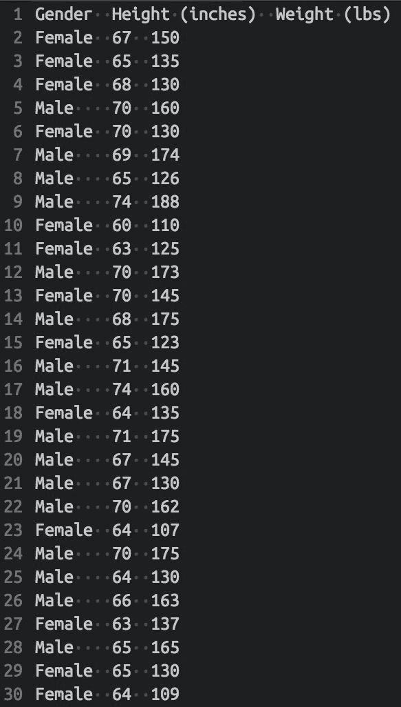

虽然本章将手动将数据集添加到 PySpark 中，但数据集也可以从以下链接查看和下载：

[`github.com/asherif844/ApacheSparkDeepLearningCookbook/blob/master/CH02/data/HeightAndWeight.txt`](https://github.com/asherif844/ApacheSparkDeepLearningCookbook/blob/master/CH02/data/HeightAndWeight.txt)

最后，我们将通过使用以下终端命令在第一章中创建的 Jupyter 笔记本配置的 Spark 环境开始本章和未来的章节：

```scala
sparknotebook
```

# 如何做...

在使用 PySpark 时，必须首先导入和初始化`SparkSession`，然后才能创建任何数据框：

1.  使用以下脚本导入`SparkSession`：

```scala
from pyspark.sql import SparkSession

```

1.  配置`SparkSession`：

```scala
spark = SparkSession.builder \
         .master("local") \
         .appName("Neural Network Model") \
         .config("spark.executor.memory", "6gb") \
         .getOrCreate()
sc = spark.sparkContext
```

1.  在这种情况下，`SparkSession`的`appName`已命名为`Neural Network Model`，并且`6gb`已分配给会话内存。

# 它是如何工作的...

本节解释了如何创建我们的 Spark 集群并配置我们的第一个数据框。

1.  在 Spark 中，我们使用`.master()`来指定我们是在分布式集群上运行作业还是在本地运行。在本章和其余章节中，我们将使用`.master('local')`在本地执行 Spark，并指定一个工作线程。这对于测试和开发目的是可以的，但如果部署到生产环境可能会遇到性能问题。在生产环境中，建议使用`.master('local[*]')`来设置 Spark 在本地可用的尽可能多的工作节点上运行。如果我们的机器上有 3 个核心，并且我们想要设置我们的节点数与之匹配，那么我们将指定`.master('local[3]')`。

1.  `数据框`变量`df`首先通过插入每列的行值，然后使用以下脚本插入列标题名称来创建：

```scala
df = spark.createDataFrame([('Male', 67, 150), # insert column values
                            ('Female', 65, 135),
                            ('Female', 68, 130),
                            ('Male', 70, 160),
                            ('Female', 70, 130),
                            ('Male', 69, 174),
                            ('Female', 65, 126),
                            ('Male', 74, 188),
                            ('Female', 60, 110),
                            ('Female', 63, 125),
                            ('Male', 70, 173),
                            ('Male', 70, 145),
                            ('Male', 68, 175),
                            ('Female', 65, 123),
                            ('Male', 71, 145),
                            ('Male', 74, 160),
                            ('Female', 64, 135),
                            ('Male', 71, 175),
                            ('Male', 67, 145),
                            ('Female', 67, 130),
                            ('Male', 70, 162),
                            ('Female', 64, 107),
                            ('Male', 70, 175),
                            ('Female', 64, 130),
                            ('Male', 66, 163),
                            ('Female', 63, 137),
                            ('Male', 65, 165),
                            ('Female', 65, 130),
                            ('Female', 64, 109)], 
                           ['gender', 'height','weight']) # insert header values
```

1.  在 PySpark 中，`show()`函数可以预览前 20 行，如使用上述脚本时所示：

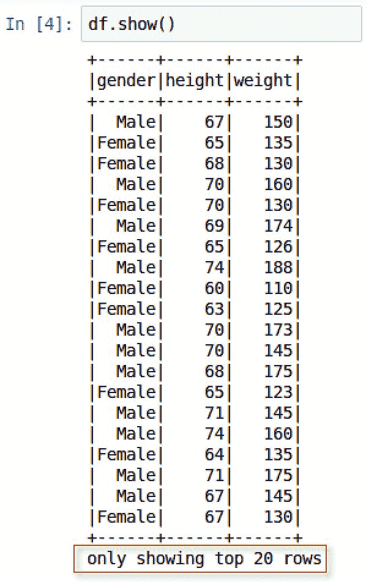

# 还有更多...

如果没有明确说明，`.show()`功能默认显示 20 行。如果我们只想显示数据框的前 5 行，我们需要明确说明，如下脚本所示：`df.show(5)`。

# 另请参阅

要了解有关 SparkSQL、数据框、函数和 PySpark 中数据集的更多信息，请访问以下网站：

[`spark.apache.org/docs/latest/sql-programming-guide.html`](https://spark.apache.org/docs/latest/sql-programming-guide.html)

# 在 PySpark 数据框中操作列

数据框几乎完成了；但在构建神经网络之前，有一个需要解决的问题。与其将`gender`值保留为字符串，不如将该值转换为数值整数以进行计算，随着本章的进行，这一点将变得更加明显。

# 准备工作

这一部分需要导入以下内容：

+   `from pyspark.sql import functions`

# 如何做...

本节将介绍将数据框中的字符串转换为数值的步骤：

+   Female --> 0

+   Male --> 1

1.  在数据框中转换列值需要导入`functions`：

```scala
from pyspark.sql import functions
```

1.  接下来，使用以下脚本将`gender`列修改为数值：

```scala
df = df.withColumn('gender',functions.when(df['gender']=='Female',0).otherwise(1))
```

1.  最后，使用以下脚本重新排列列，使`gender`成为数据框中的最后一列：

```scala
df = df.select('height', 'weight', 'gender')
```

# 它是如何工作的...

本节解释了如何应用对数据框的操作。

1.  `pyspark.sql`中的`functions`具有几个有用的逻辑应用，可用于在 Spark 数据框中对列应用 if-then 转换。在我们的情况下，我们将`Female`转换为 0，`Male`转换为 1。

1.  使用`.withColumn()`转换将数值应用于 Spark 数据框。

1.  对于 Spark 数据框，`.select()`功能类似于传统 SQL，按照请求的顺序和方式选择列。

1.  最终预览数据框将显示更新后的数据集，如下截图所示：

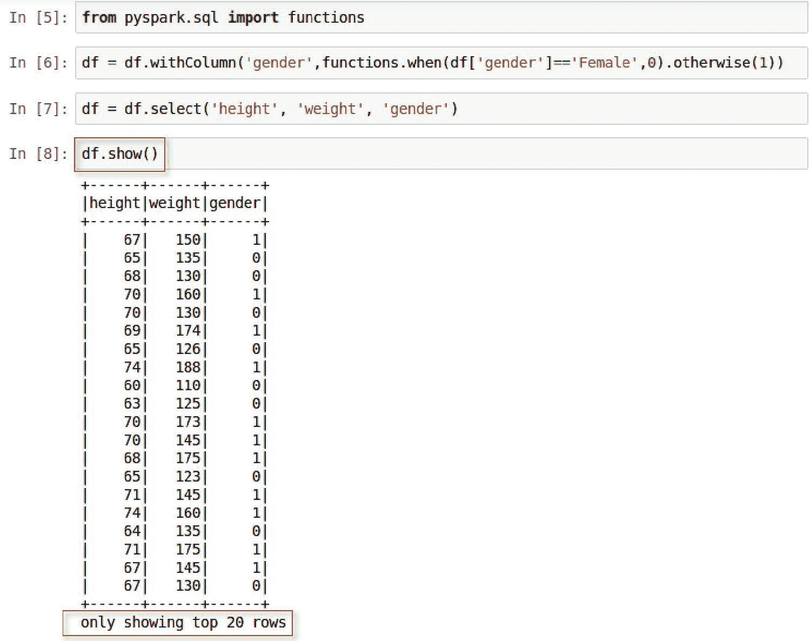

# 还有更多...

除了数据框的`withColumn()`方法外，还有`withColumnRenamed()`方法，用于重命名数据框中的列。

# 将 PySpark 数据框转换为数组

为了构建神经网络的基本组件，PySpark 数据框必须转换为数组。Python 有一个非常强大的库`numpy`，使得处理数组变得简单。

# 准备工作

`numpy`库应该已经随着`anaconda3` Python 包的安装而可用。但是，如果由于某种原因`numpy`库不可用，可以使用终端上的以下命令进行安装：

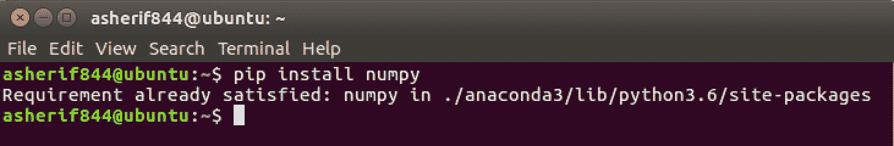

`pip install`或`sudo pip install`将通过使用请求的库来确认是否已满足要求：

```scala
import numpy as np
```

# 如何做...

本节将介绍将数据框转换为数组的步骤：

1.  使用以下脚本查看从数据框中收集的数据：

```scala
df.select("height", "weight", "gender").collect()
```

1.  使用以下脚本将收集的值存储到名为`data_array`的数组中：

```scala
data_array =  np.array(df.select("height", "weight", "gender").collect())
```

1.  执行以下脚本以访问数组的第一行：

```scala
data_array[0]
```

1.  同样，执行以下脚本以访问数组的最后一行：

```scala
data_array[28]
```

# 它是如何工作的...

本节解释了如何将数据框转换为数组：

1.  我们的数据框的输出可以使用`collect()`收集，并如下截图所示查看：

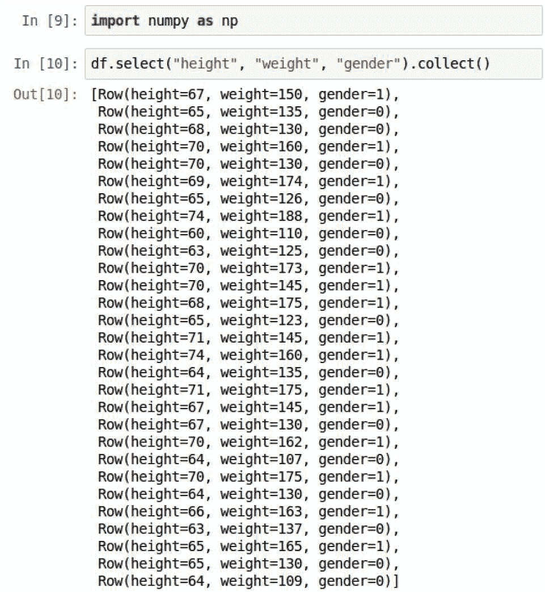

1.  数据框转换为数组，并且可以在以下截图中看到该脚本的输出：

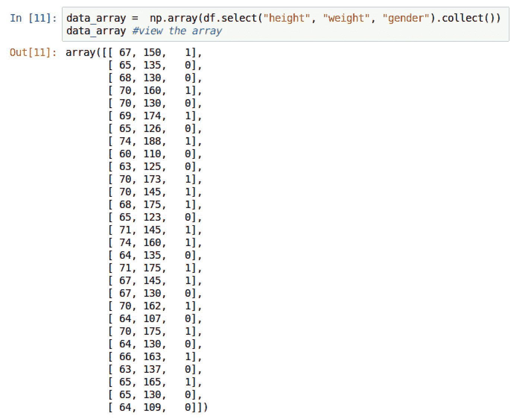

1.  可以通过引用数组的索引来访问任何一组`height`，`weight`和`gender`值。数组的形状为(29,3)，长度为 29 个元素，每个元素由三个项目组成。虽然长度为 29，但索引从`[0]`开始到`[28]`结束。可以在以下截图中看到数组形状以及数组的第一行和最后一行的输出：

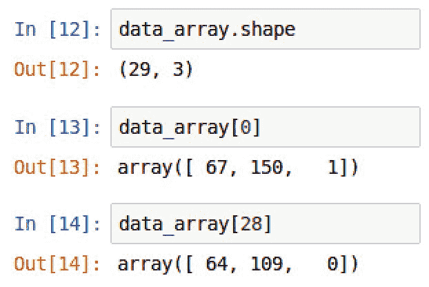

1.  可以将数组的第一个和最后一个值与原始数据框进行比较，以确认转换的结果没有改变值和顺序。

# 还有更多...

除了查看数组中的数据点外，还可以检索数组中每个特征的最小和最大点：

1.  检索`height`，`weight`和`gender`的最小和最大值，可以使用以下脚本：

```scala
print(data_array.max(axis=0))
print(data_array.min(axis=0))
```

1.  脚本的输出可以在以下截图中看到：

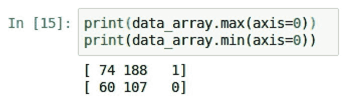

最大`height`为`74`英寸，最小`height`为`60`英寸。最大重量为`188`磅，最小重量为`107`磅。性别的最小和最大值并不那么重要，因为我们已经为它们分配了`0`和`1`的数值。

# 另请参阅

要了解更多关于 numpy 的信息，请访问以下网站：

[www.numpy.org](http://www.numpy.org)

# 在散点图中可视化数组

本章将开发的神经网络的目标是在已知`height`和`weight`的情况下预测个体的性别。了解`height`，`weight`和`gender`之间的关系的一个强大方法是通过可视化数据点来喂养神经网络。这可以通过流行的 Python 可视化库`matplotlib`来实现。

# 准备工作

与`numpy`一样，`matplotlib`应该在安装 anaconda3 Python 包时可用。但是，如果由于某种原因`matplotlib`不可用，可以在终端使用以下命令进行安装：

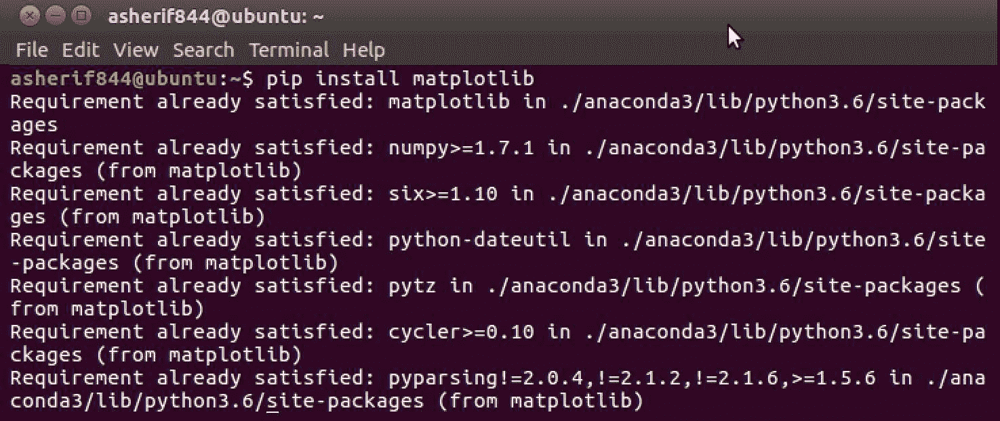

`pip install`或`sudo pip install`将通过使用所需的库来确认要求已经满足。

# 如何做到...

本节将介绍通过散点图可视化数组的步骤。

1.  导入`matplotlib`库并使用以下脚本配置库以在 Jupyter 笔记本中可视化绘图：

```scala
 import matplotlib.pyplot as plt
 %matplotlib inline
```

1.  接下来，使用`numpy`的`min()`和`max()`函数确定散点图的*x*和 y 轴的最小和最大值，如下脚本所示：

```scala
min_x = data_array.min(axis=0)[0]-10
max_x = data_array.max(axis=0)[0]+10
min_y = data_array.min(axis=0)[1]-10
max_y = data_array.max(axis=0)[1]+10
```

1.  执行以下脚本来绘制每个`gender`的`height`和`weight`：

```scala
# formatting the plot grid, scales, and figure size
plt.figure(figsize=(9, 4), dpi= 75)
plt.axis([min_x,max_x,min_y,max_y])
plt.grid()
for i in range(len(data_array)):
    value = data_array[i]
    # assign labels values to specific matrix elements
    gender = value[2]
    height = value[0]
    weight = value[1]

    # filter data points by gender
    a = plt.scatter(height[gender==0],weight[gender==0], marker 
      = 'x', c= 'b', label = 'Female')
    b = plt.scatter(height[gender==1],weight[gender==1], marker 
      = 'o', c= 'b', label = 'Male')

   # plot values, title, legend, x and y axis
   plt.title('Weight vs Height by Gender')
   plt.xlabel('Height (in)')
   plt.ylabel('Weight (lbs)')
   plt.legend(handles=[a,b])
```

# 它是如何工作的...

本节将解释如何将数组绘制为散点图：

1.  将`matplotlib`库导入到 Jupyter 笔记本中，并配置`matplotlib`库以在 Jupyter 笔记本的单元格中内联绘制可视化

1.  确定 x 和 y 轴的最小和最大值以调整我们的绘图，并给出一个最佳的外观图形。脚本的输出可以在以下截图中看到：

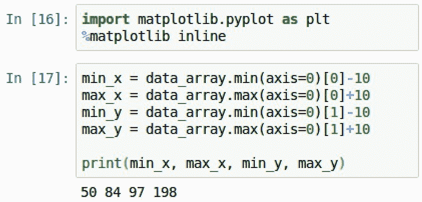

1.  每个轴都添加了`10`个像素的缓冲区，以确保捕获所有数据点而不被切断。

1.  创建一个循环来迭代每一行的值，并绘制`weight`与`height`。

1.  此外，`Female gender`分配了不同的样式点`x`，而`Male gender`分配了`o`。

1.  可以在以下截图中看到绘制 Weight vs Height by Gender 的脚本的输出：

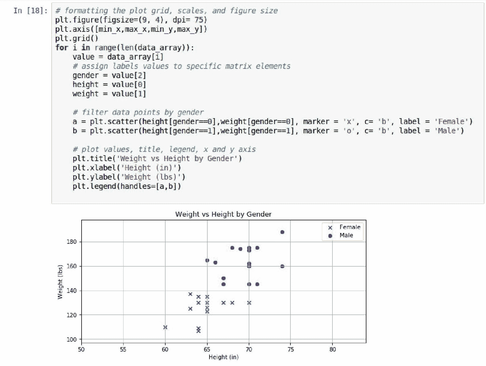

# 还有更多...

散点图快速而简单地解释了数据的情况。散点图的右上象限和左下象限之间存在明显的分割。所有超过 140 磅的数据点表示`Male gender`，而所有低于该值的数据点属于`Female gender`，如下截图所示：

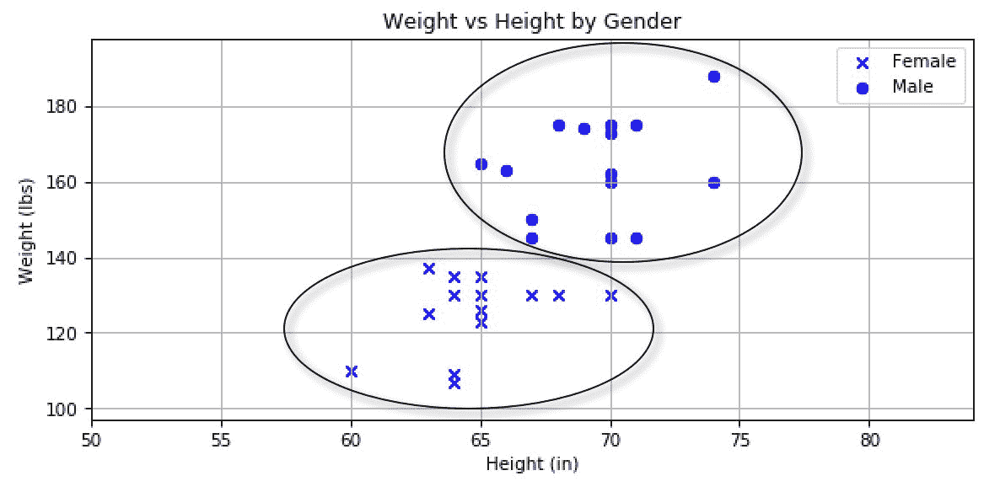

这个散点图将有助于确认当在本章后面创建神经网络时，选择随机身高和体重来预测性别的结果是什么。

# 另请参阅

要了解更多关于`matplotlib`的信息，请访问以下网站：

[www.matplotlib.org](http://www.matplotlib.org/)

# 为输入神经网络设置权重和偏差。

PySpark 框架和数据现在已经完成。是时候转向构建神经网络了。无论神经网络的复杂性如何，开发都遵循类似的路径：

1.  输入数据

1.  添加权重和偏差

1.  求和数据和权重的乘积

1.  应用激活函数

1.  评估输出并将其与期望结果进行比较

本节将重点放在设置权重上，这些权重创建了输入，输入进入激活函数。

# 准备工作

简单了解神经网络的基本构建模块对于理解本节和本章的其余部分是有帮助的。每个神经网络都有输入和输出。在我们的案例中，输入是个体的身高和体重，输出是性别。为了得到输出，输入与值（也称为权重：w1 和 w2）相乘，然后加上偏差（b）。这个方程被称为求和函数 z，并给出以下方程式：

z = (输入 1) x (w1) + (输入 2) x (w2) + b

权重和偏差最初只是随机生成的值，可以使用`numpy`执行。权重将通过增加或减少对输出的影响来为输入增加权重。偏差将在一定程度上起到不同的作用，它将根据需要将求和（z）的基线向上或向下移动。然后，z 的每个值通过激活函数转换为 0 到 1 之间的预测值。激活函数是一个转换器，它给我们一个可以转换为二进制输出（男/女）的值。然后将预测输出与实际输出进行比较。最初，预测和实际输出之间的差异将很大，因为在刚开始时权重是随机的。然而，使用一种称为反向传播的过程来最小化实际和预测之间的差异，使用梯度下降的技术。一旦我们在实际和预测之间达成可忽略的差异，我们就会存储神经网络的 w1、w2 和 b 的值。

# 如何做...

本节将逐步介绍设置神经网络的权重和偏差的步骤。

1.  使用以下脚本设置值生成器的随机性：

```scala
np.random.seed(12345)
```

1.  使用以下脚本设置权重和偏差：

```scala
w1 = np.random.randn()
w2 = np.random.randn()
b= np.random.randn()
```

# 工作原理...

本节解释了如何初始化权重和偏差，以便在本章的后续部分中使用：

1.  权重是使用`numpy`随机生成的，并设置了随机种子以确保每次生成相同的随机数

1.  权重将被分配一个通用变量`w1`和`w2`

1.  偏差也是使用`numpy`随机生成的，并设置了随机种子以确保每次生成相同的随机数

1.  偏差将被分配一个通用变量`b`

1.  这些值被插入到一个求和函数`z`中，它生成一个初始分数，将输入到另一个函数中，即激活函数，稍后在本章中讨论

1.  目前，所有三个变量都是完全随机的。`w1`、`w2`和`b`的输出可以在以下截图中看到：

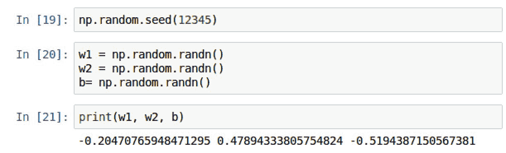

# 还有更多...

最终目标是获得一个预测输出，与实际输出相匹配。对权重和值进行求和的过程有助于实现这一过程的一部分。因此，随机输入的`0.5`和`0.5`将产生以下求和输出：

```scala
z = 0.5 * w1 + 0.5 * w2 + b 
```

或者，使用我们当前随机值`w1`和`w2`，将得到以下输出：

```scala
z = 0.5 * (-0.2047) + 0.5 * (0.47894) + (-0.51943) = -7.557
```

变量`z`被分配为权重与数据点的乘积总和。目前，权重和偏差是完全随机的。然而，正如本节前面提到的，通过一个称为反向传播的过程，使用梯度下降，权重将被调整，直到确定出更理想的结果。梯度下降只是识别出我们的权重的最佳值的过程，这将给我们最好的预测输出，并且具有最小的误差。确定最佳值的过程涉及识别函数的局部最小值。梯度下降将在本章后面讨论。

# 另请参阅

要了解更多关于人工神经网络中权重和偏差的知识，请访问以下网站：

[`en.wikipedia.org/wiki/Artificial_neuron`](https://en.wikipedia.org/wiki/Artificial_neuron)

# 为神经网络标准化输入数据

当输入被标准化时，神经网络的工作效率更高。这最小化了特定输入的幅度对其他可能具有较低幅度值的输入的整体结果的影响。本节将标准化当前个体的`身高`和`体重`输入。

# 准备好

输入值的标准化需要获取这些值的平均值和标准差进行最终计算。

# 如何做...

本节将介绍标准化身高和体重的步骤。

1.  使用以下脚本将数组切片为输入和输出：

```scala
X = data_array[:,:2]
y = data_array[:,2]
```

1.  可以使用以下脚本计算 29 个个体的平均值和标准差：

```scala
x_mean = X.mean(axis=0)
x_std = X.std(axis=0)

```

1.  创建一个标准化函数，使用以下脚本对`X`进行标准化：

```scala
 def normalize(X):
     x_mean = X.mean(axis=0)
     x_std = X.std(axis=0)
     X = (X - X.mean(axis=0))/X.std(axis=0)
     return X
```

# 它是如何工作的...

本节将解释身高和体重是如何被标准化的。

1.  `data_array`矩阵分为两个矩阵：

1.  `X`由身高和体重组成

1.  `y`由性别组成

1.  两个数组的输出可以在以下截图中看到：

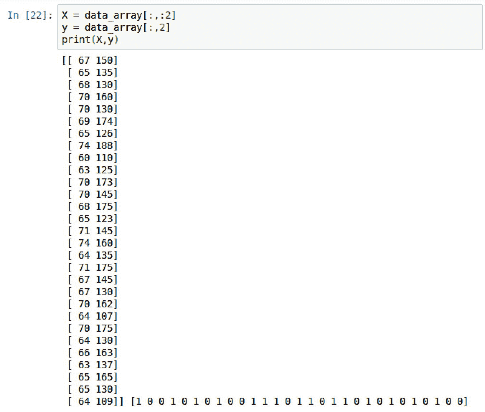

1.  `X`组件是输入，是唯一会经历标准化过程的部分。*y*组件，或性别，暂时将被忽略。标准化过程涉及提取所有 29 个个体的输入的平均值和标准差。身高和体重的平均值和标准差的输出可以在以下截图中看到：

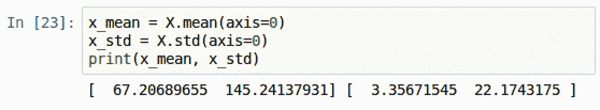

1.  身高的平均值约为 67 英寸，标准差约为 3.4 英寸。体重的平均值约为 145 磅，标准差约为 22 磅。

1.  一旦它们被提取，使用以下方程对输入进行标准化：`X_norm = (X - X_mean)/X_std`。

1.  使用 Python 函数`normalize()`对`X`数组进行标准化，现在`X`数组被分配到新创建的标准化集的值，如下截图所示：

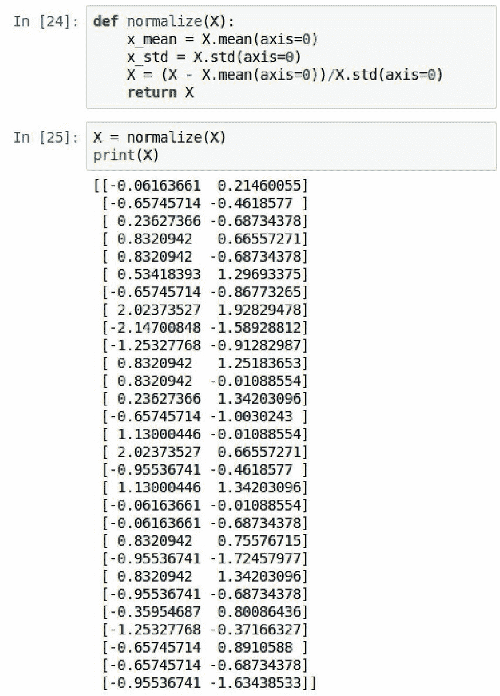

# 另请参阅

要了解更多关于统计标准化的知识，请访问以下网站：

[`en.wikipedia.org/wiki/Normalization_(statistics)`](https://en.wikipedia.org/wiki/Normalization_(statistics))

# 验证数组以获得最佳神经网络性能

在确保我们的数组在即将到来的神经网络中获得最佳性能的过程中，一点验证工作可以走很长的路。

# 准备好

这一部分需要使用`numpy.stack()`函数进行一些`numpy`魔术。

# 如何做...

以下步骤将验证我们的数组是否已被标准化。

1.  执行以下步骤以打印数组输入的平均值和标准差：

```scala
print('standard deviation')
print(round(X[:,0].std(axis=0),0))
print('mean')
print(round(X[:,0].mean(axis=0),0))
```

1.  执行以下脚本将身高、体重和性别组合成一个数组`data_array`：

```scala
data_array = np.column_stack((X[:,0], X[:,1],y))
```

# 它是如何工作的...

本节解释了数组如何被验证和构建，以便在神经网络中实现最佳的未来使用。

1.  身高的新`mean`应为 0，`standard deviation`应为 1。这可以在以下截图中看到：

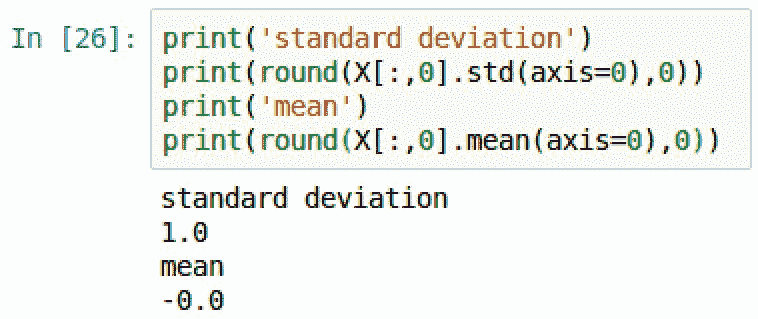

1.  这是归一化数据集的确认，因为它包括平均值为 0 和标准差为 1。

1.  原始的`data_array`对于神经网络不再有用，因为它包含了`height`、`weight`和`gender`的原始、非归一化的输入值。

1.  然而，通过一点点`numpy`魔法，`data_array`可以被重组，包括归一化的`height`和`weight`，以及`gender`。这是通过`numpy.stack()`完成的。新数组`data_array`的输出如下截图所示：

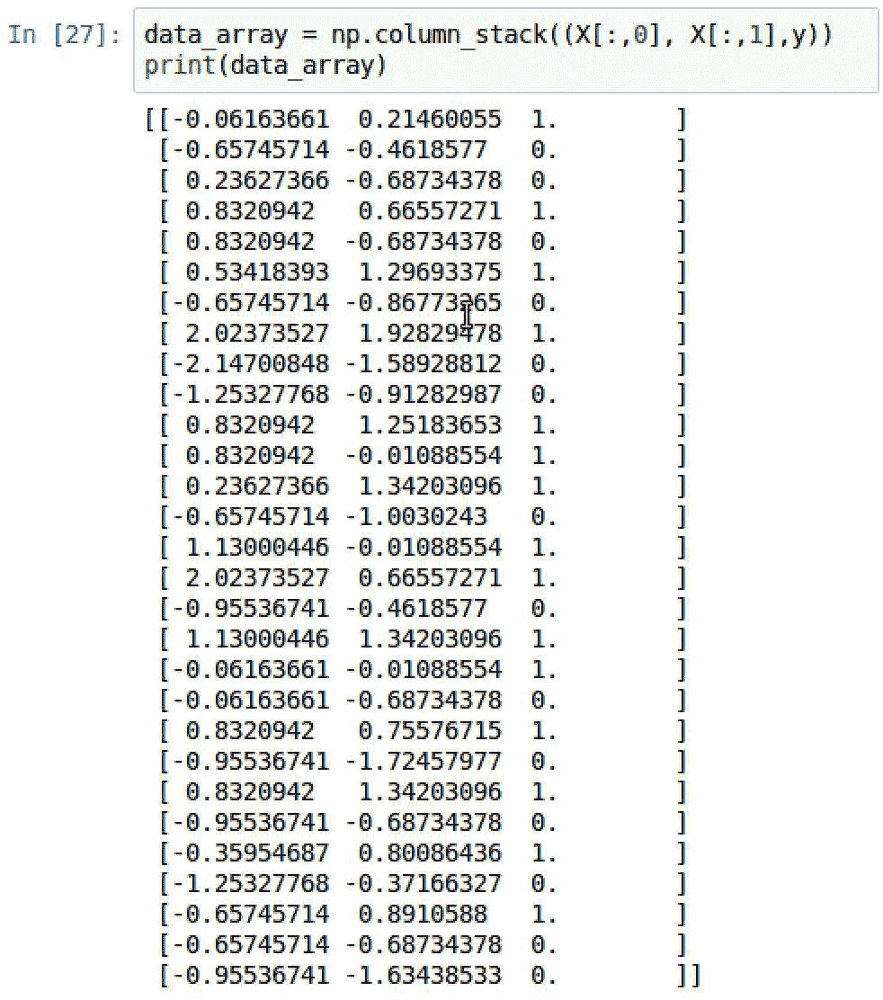

# 还有更多...

我们的数组现在已经准备就绪。我们的身高和体重的输入已经归一化，我们的性别输出标记为 0 或 1。

# 另请参阅

要了解有关`numpy.stack()`的更多信息，请访问以下网站：

[`docs.scipy.org/doc/numpy/reference/generated/numpy.stack.html`](https://docs.scipy.org/doc/numpy/reference/generated/numpy.stack.html)

# 使用`sigmoid`设置激活函数

激活函数在神经网络中用于帮助确定输出，无论是是或否，真或假，或者在我们的情况下是 0 或 1（男/女）。此时，输入已经被归一化，并且已经与权重和偏差`w1`、`w2`和`b`相加。然而，权重和偏差目前完全是随机的，并且没有被优化以产生与实际输出匹配的预测输出。构建预测结果的缺失环节在于激活或`sigmoid`函数，如下图所示：

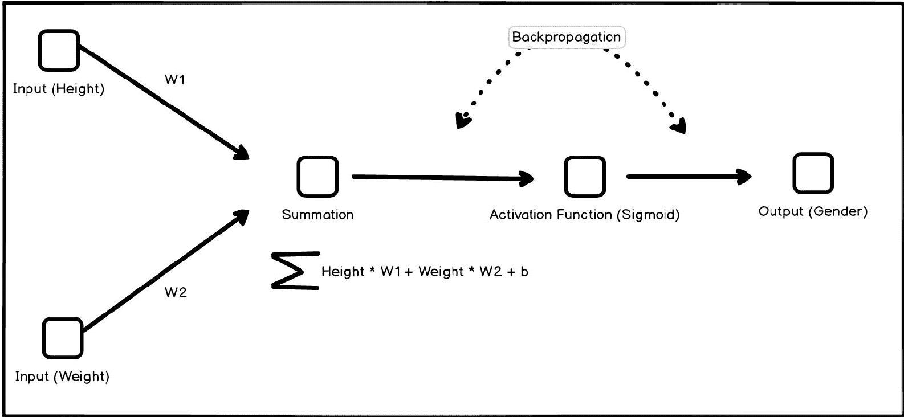

如果总和产生的数字非常小，它将产生激活为 0。同样，如果总和产生的数字相当大，它将产生激活为 1。这个函数很有用，因为它将输出限制为二进制结果，这对于分类非常有用。这些输出的后果将在本章的其余部分中讨论和澄清。

# 准备工作

`sigmoid`函数类似于逻辑回归函数，因为它计算出 0 到 1 之间的概率结果。此外，它给出了介于两者之间的范围。因此，可以设置条件，将大于 0.5 的任何值关联到 1，小于 0.5 的值关联到 0。

# 如何做到...

本节将逐步介绍使用样本数据创建和绘制`sigmoid`函数的步骤。

1.  使用 Python 函数创建`sigmoid`函数，如下脚本所示：

```scala
def sigmoid(input):
  return 1/(1+np.exp(-input))
```

1.  使用以下脚本为`sigmoid`曲线创建样本`x`值：

```scala
X = np.arange(-10,10,1)
```

1.  此外，使用以下脚本为`sigmoid`曲线创建样本`y`值：

```scala
Y = sigmoid(X)
```

1.  使用以下脚本绘制这些点的`x`和`y`值：

```scala
plt.figure(figsize=(6, 4), dpi= 75)
plt.axis([-10,10,-0.25,1.2])
plt.grid()
plt.plot(X,Y)
plt.title('Sigmoid Function')
plt.show()
```

# 它是如何工作的...

本节介绍了 S 型函数背后的数学原理。

1.  `sigmoid`函数是逻辑回归的专门版本，用于分类。逻辑回归的计算用以下公式表示：

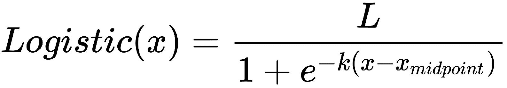

1.  逻辑回归函数的变量代表以下含义：

+   *L*代表函数的最大值

+   *k*代表曲线的陡峭程度

+   *x[midpoint]*代表函数的中点值

1.  由于`sigmoid`函数的陡度值为 1，中点为 0，最大值为 1，它产生以下函数：

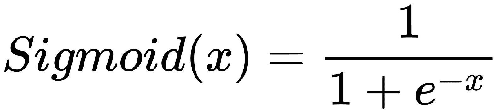

1.  我们可以绘制一个通用的`sigmoid`函数，其 x 值范围从-5 到 5，y 值范围从 0 到 1，如下截图所示：

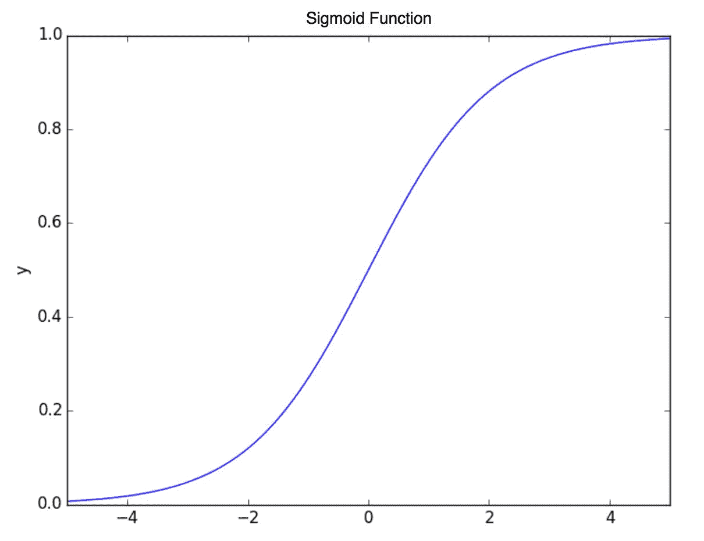

1.  我们使用 Python 创建了自己的`sigmoid`函数，并使用样本数据在`-10`和`10`之间绘制了它。我们的绘图看起来与之前的通用`sigmoid`绘图非常相似。我们的`sigmoid`函数的输出如下截图所示：

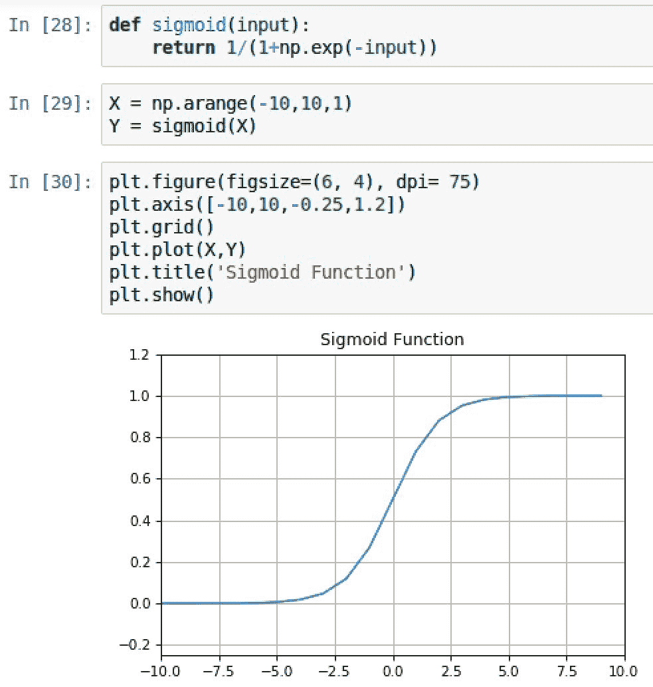

# 另请参阅

要了解更多关于`sigmoid`函数起源的信息，请访问以下网站：

[`en.wikipedia.org/wiki/Sigmoid_function`](https://en.wikipedia.org/wiki/Sigmoid_function)

# 创建 Sigmoid 导数函数

Sigmoid 函数是一个独特的函数，其中 Sigmoid 函数的导数值包括 Sigmoid 函数的值。也许你会问这有什么了不起。然而，由于 Sigmoid 函数已经计算，这使得在执行多层反向传播时处理更简单、更高效。此外，在计算中使用 Sigmoid 函数的导数来得出最佳的`w1`、`w2`和`b`值，以得出最准确的预测输出。

# 准备工作

对微积分中的导数有一定的了解将有助于理解 Sigmoid 导数函数。

# 如何做...

本节将介绍创建 Sigmoid 导数函数的步骤。

1.  就像`sigmoid`函数一样，使用以下脚本可以使用 Python 创建`sigmoid`函数的导数：

```scala
def sigmoid_derivative(x):
    return sigmoid(x) * (1-sigmoid(x))
```

1.  使用以下脚本绘制`sigmoid`函数的导数与原始`sigmoid`函数：

```scala
plt.figure(figsize=(6, 4), dpi= 75)
plt.axis([-10,10,-0.25,1.2])
plt.grid()
X = np.arange(-10,10,1)
Y = sigmoid(X)
Y_Prime = sigmoid_derivative(X)
c=plt.plot(X, Y, label="Sigmoid",c='b')
d=plt.plot(X, Y_Prime, marker=".", label="Sigmoid Derivative", c='b')
plt.title('Sigmoid vs Sigmoid Derivative')
plt.xlabel('X')
plt.ylabel('Y')
plt.legend()
plt.show()
```

# 工作原理...

本节将解释 Sigmoid 函数的导数背后的数学原理，以及使用 Python 创建 Sigmoid 函数的导数的逻辑。

1.  神经网络将需要`sigmoid`函数的导数来预测`gender`的准确输出。`sigmoid`函数的导数使用以下公式计算：

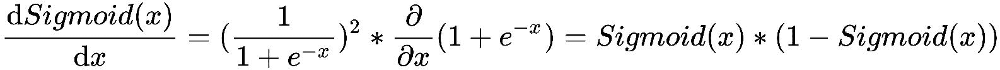

1.  然后，我们可以使用 Python 中的原始 Sigmoid 函数`sigmoid()`创建 Sigmoid 函数的导数`sigmoid_derivate()`。我们可以在以下截图中将两个函数并排绘制：

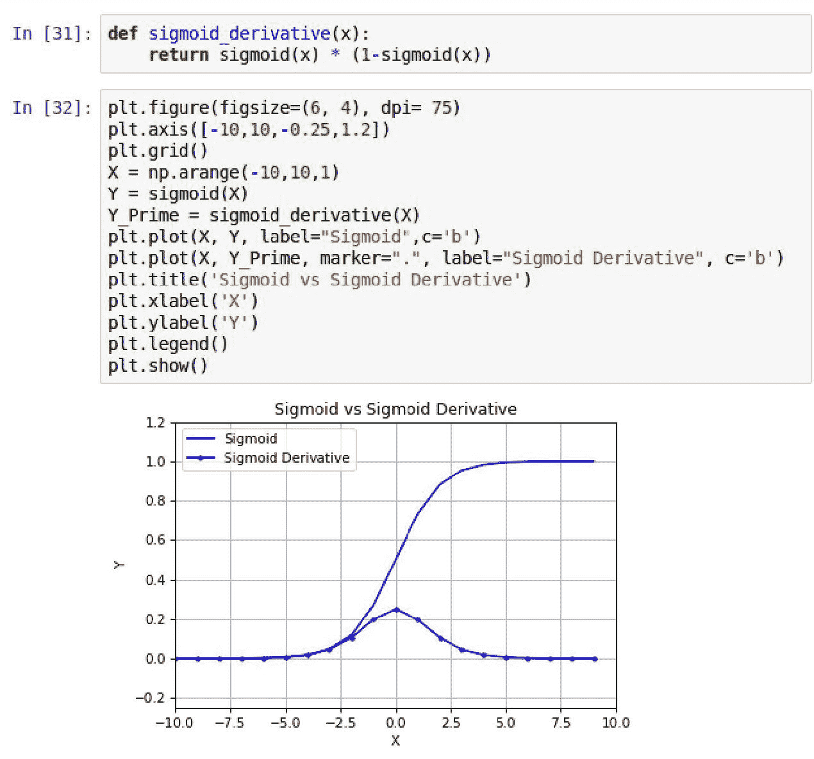

1.  Sigmoid 导数跟踪原始 Sigmoid 函数的斜率。在绘图的早期阶段，当 Sigmoid 的斜率完全水平时，Sigmoid 导数也是 0.0。当 Sigmoid 的值接近 1 时，斜率也几乎完全水平。Sigmoid 的斜率的峰值在 x 轴的中点。因此，这也是 Sigmoid 导数的峰值。

# 另请参阅

要深入了解导数，请访问以下网站：

[`www.khanacademy.org/math/calculus-home/taking-derivatives-calc`](https://www.khanacademy.org/math/calculus-home/taking-derivatives-calc)

# 在神经网络中计算成本函数

此时，是时候将本章前面强调的所有部分汇总起来，计算成本函数了，神经网络将使用该函数来确定预测结果与原始或实际结果的匹配程度，给定当前可用的 29 个个体数据点。成本函数的目的是确定实际值和预测值之间的差异。然后使用梯度下降来增加或减少`w1`、`w2`和`b`的值，以减少成本函数的值，最终实现我们的目标，得出与实际值匹配的预测值。

# 准备工作

成本函数的公式如下：

成本(x)=(预测-实际)²

如果成本函数看起来很熟悉，那是因为这实际上只是最小化实际输出和预测之间的平方差的另一种方式。神经网络中梯度下降或反向传播的目的是将成本函数最小化，直到该值接近 0。在那一点上，权重和偏差（`w1`、`w2`和`b`）将不再是由`numpy`生成的随机无关紧要的值，而是对神经网络模型有实际贡献的实际重要权重。

# 如何做...

本节将介绍计算成本函数的步骤。

1.  设置学习率值为`0.1`，逐步改变权重和偏差，直到使用以下脚本选择最终输出：

```scala
learningRate = 0.1
```

1.  使用以下脚本初始化一个名为`allCosts`的 Python 列表。

```scala
allCosts = []
```

1.  创建一个`for`循环，使用以下脚本迭代 100,000 个场景：

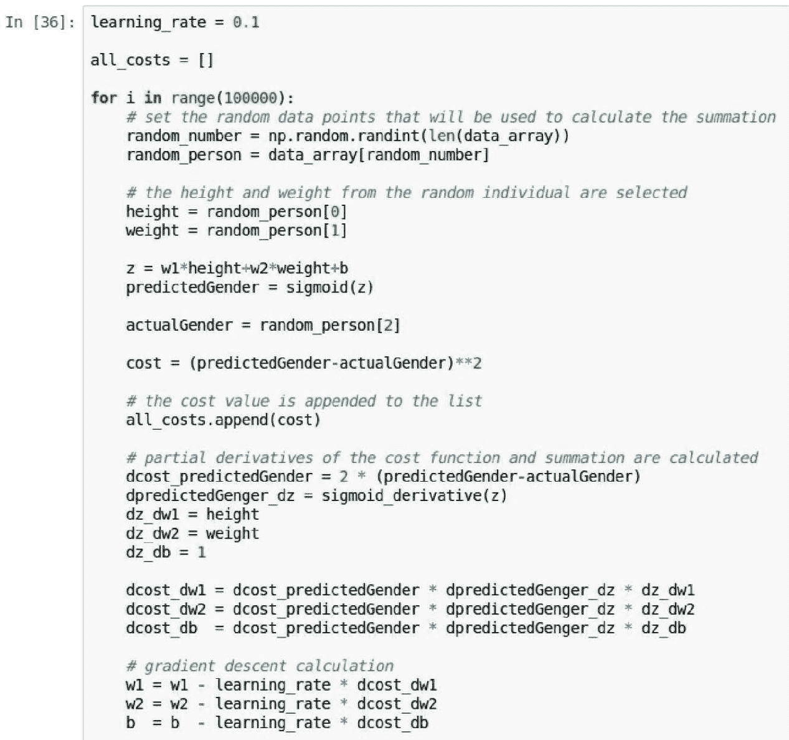

1.  使用以下脚本绘制 100,000 次迭代中收集的成本值：

```scala
plt.plot(all_costs)
plt.title('Cost Value over 100,000 iterations')
plt.xlabel('Iteration')
plt.ylabel('Cost Value')
plt.show()
```

1.  可以使用以下脚本查看权重和偏差的最终值：

```scala
print('The final values of w1, w2, and b')
print('---------------------------------')
print('w1 = {}'.format(w1))
print('w2 = {}'.format(w2))
print('b = {}'.format(b))
```

# 它是如何工作的...

本节解释了如何使用成本函数生成权重和偏差。

1.  将实施一个`for`循环，该循环将对权重和偏差执行梯度下降，以调整值，直到成本函数接近 0。

1.  循环将迭代 100,000 次成本函数。每次从 29 个个体中随机选择`height`和`weight`的值。

1.  从随机的`height`和`weight`计算出总和值`z`，并使用输入计算出`sigmoid`函数的`predictedGender`分数。

1.  计算成本函数，并将其添加到跟踪 100,000 次迭代中的所有成本函数的列表`allCosts`中。

1.  计算了一系列关于总和值（`z`）以及成本函数（`cost`）的偏导数。

1.  这些计算最终用于根据成本函数更新权重和偏差，直到它们（`w1`、`w2`和`b`）在 100,000 次迭代中返回接近 0 的值。

1.  最终，目标是使成本函数的值随着迭代次数的增加而减少。成本函数在 100,000 次迭代中的输出可以在下面的截图中看到：

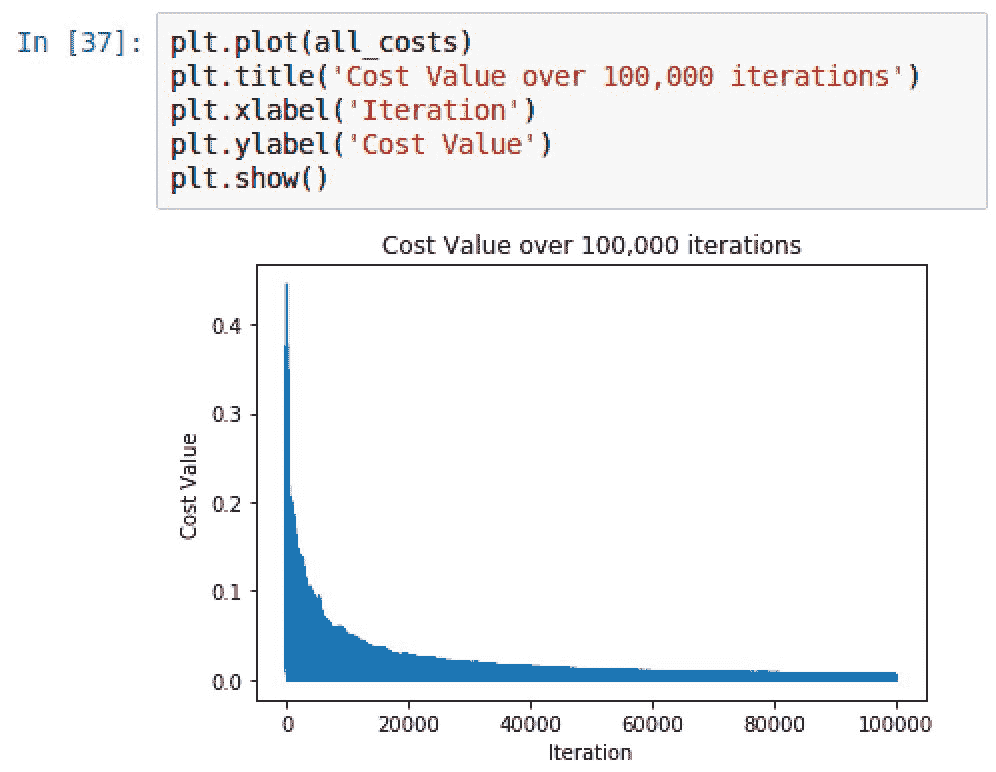

1.  在迭代过程中，成本值从约 0.45 下降到约 0.01。

1.  此外，我们可以查看产生成本函数最低值的`w1`、`w2`和`b`的最终输出，如下截图所示：

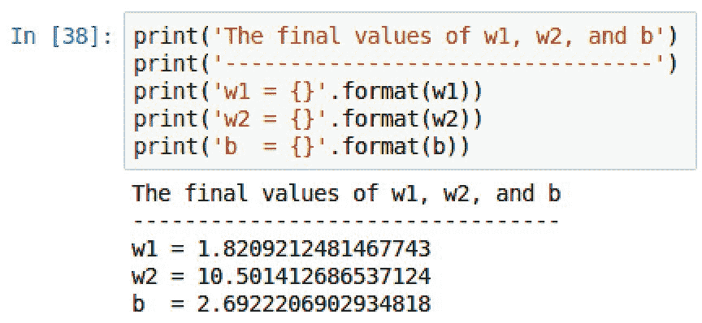

# 还有更多...

现在可以测试权重和偏差的最终值，以计算成本函数的工作效果以及预测值与实际分数的比较。

以下脚本将通过每个个体创建一个循环，并基于权重（`w1`、`w2`）和偏差（`b`）计算预测的性别分数：

```scala
for i in range(len(data_array)):
    random_individual = data_array[i]
    height = random_individual[0]
    weight = random_individual[1]
    z = height*w1 + weight*w2 + b
    predictedGender=sigmoid(z)
    print("Individual #{} actual score: {} predicted score:                           {}".format(i+1,random_individual[2],predictedGender))
```

可以在下面的截图中看到脚本的输出：

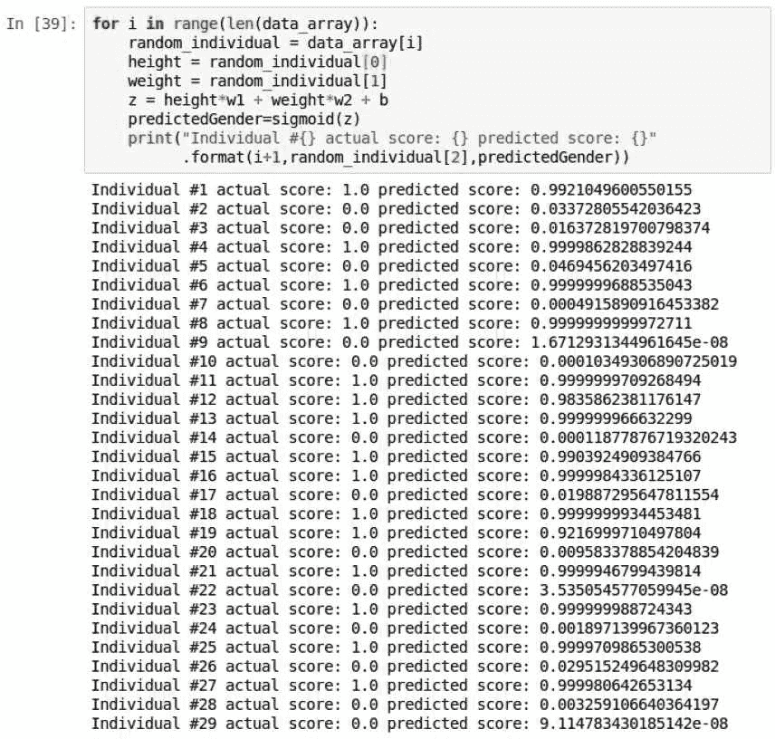

29 个实际分数大约与预测分数相匹配。虽然这对于确认模型在训练数据上产生匹配结果是有好处的，但最终的测试将是确定模型是否能够对引入的新个体进行准确的性别预测。

# 另请参阅

要了解更多关于使用梯度下降来最小化成本函数或平方（差）误差函数的信息，请访问以下网站：

[`en.wikipedia.org/wiki/Gradient_descent`](https://en.wikipedia.org/wiki/Gradient_descent)

# 根据身高和体重预测性别

只有当预测模型实际上可以根据新信息进行预测时，它才有用。这适用于简单的逻辑或线性回归，或更复杂的神经网络模型。

# 准备好了

这就是乐趣开始的地方。本节的唯一要求是为男性和女性个体提取样本数据点，并使用其身高和体重值来衡量前一节中创建的模型的准确性。

# 如何做...

本节介绍了如何根据身高和体重预测性别的步骤。

1.  创建一个名为`input_normalize`的 Python 函数，用于输入`height`和`weight`的新值，并输出归一化的身高和体重，如下脚本所示：

```scala
def input_normalize(height, weight):
    inputHeight = (height - x_mean[0])/x_std[0]
    inputWeight = (weight - x_mean[1])/x_std[1]
    return inputHeight, inputWeight
```

1.  为`height`设置值为`70`英寸，为`weight`设置值为`180`磅，并将其分配给名为`score`的变量，如下脚本所示：

```scala
score = input_normalize(70, 180)
```

1.  创建另一个 Python 函数，名为`predict_gender`，输出一个概率分数`gender_score`，介于 0 和 1 之间，以及一个性别描述，通过应用与`w1`、`w2`和`b`的求和以及`sigmoid`函数，如下脚本所示：

```scala
def predict_gender(raw_score):
    gender_summation = raw_score[0]*w1 + raw_score[1]*w2 + b
    gender_score = sigmoid(gender_summation)
    if gender_score <= 0.5:
        gender = 'Female'
    else:
        gender = 'Male'
    return gender, gender_score
```

# 工作原理...

本节解释了如何使用身高和体重的新输入来生成性别的预测分数。

1.  创建一个函数来输入新的身高和体重值，并将实际值转换为规范化的身高和体重值，称为`inputHeight`和`inputWeight`。

1.  使用一个变量`score`来存储规范化的值，并创建另一个函数`predictGender`来输入分数值，并根据前一节中创建的`w1`、`w2`和`b`的值输出性别分数和描述。这些值已经经过梯度下降进行了预调整，以微调这些值并最小化`cost`函数。

1.  将`score`值应用到`predict_gender`函数中，应该显示性别描述和分数，如下截图所示：

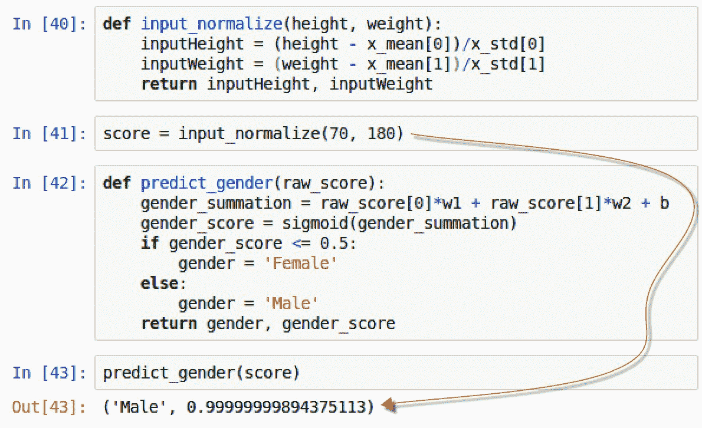

1.  似乎`70`英寸的`height`和`180`磅的`weight`的规格是男性的高预测器（99.999%）。

1.  对于`50`英寸的`height`和`150`磅的`weight`的另一个测试可能会显示不同的性别，如下截图所示：

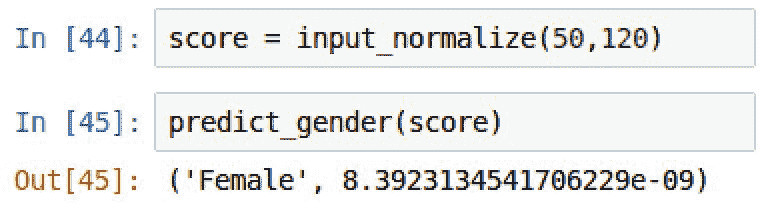

1.  同样，这个输入从`sigmoid`函数中产生了一个非常低的分数（0.00000000839），表明这些特征与`Female`性别密切相关。

# 另请参阅

要了解更多关于测试、训练和验证数据集的信息，请访问以下网站：

[`en.wikipedia.org/wiki/Training,_test,_and_validation_sets`](https://en.wikipedia.org/wiki/Training,_test,_and_validation_sets)

# 可视化预测分数

虽然我们可以根据特定身高和体重的个体单独预测性别，但整个数据集可以通过使用每个数据点来绘制和评分，以确定输出是女性还是男性。

# 准备工作

本节不需要任何依赖项。

# 如何做...

本节将通过步骤来可视化图表中的所有预测点。

1.  使用以下脚本计算图表的最小和最大点：

```scala
x_min = min(data_array[:,0])-0.1
x_max = max(data_array[:,0])+0.1
y_min = min(data_array[:,1])-0.1
y_max = max(data_array[:,1])+0.1
increment= 0.05

print(x_min, x_max, y_min, y_max)
```

1.  生成*x*和*y*值，增量为 0.05 单位，然后创建一个名为`xy_data`的数组，如下脚本所示：

```scala
x_data= np.arange(x_min, x_max, increment)
y_data= np.arange(y_min, y_max, increment)
xy_data = [[x_all, y_all] for x_all in x_data for y_all in y_data]
```

1.  最后，使用本章前面使用过的类似脚本来生成性别分数并填充图表，如下脚本所示：

```scala
for i in range(len(xy_data)):
    data = (xy_data[i])
    height = data[0]
    weight = data[1] 
    z_new = height*w1 + weight*w2 + b
    predictedGender_new=sigmoid(z_new)
    # print(height, weight, predictedGender_new)
    ax = plt.scatter(height[predictedGender_new<=0.5],
            weight[predictedGender_new<=0.5],     
            marker = 'o', c= 'r', label = 'Female')    
    bx = plt.scatter(height[predictedGender_new > 0.5],
            weight[predictedGender_new>0.5], 
            marker = 'o', c= 'b', label = 'Male') 
    # plot values, title, legend, x and y axis
    plt.title('Weight vs Height by Gender')
    plt.xlabel('Height (in)')
    plt.ylabel('Weight (lbs)')
    plt.legend(handles=[ax,bx])
```

# 工作原理...

本节解释了如何创建数据点以生成将被绘制的预测值。

1.  根据数组值计算图表的最小和最大值。脚本的输出可以在下面的截图中看到：

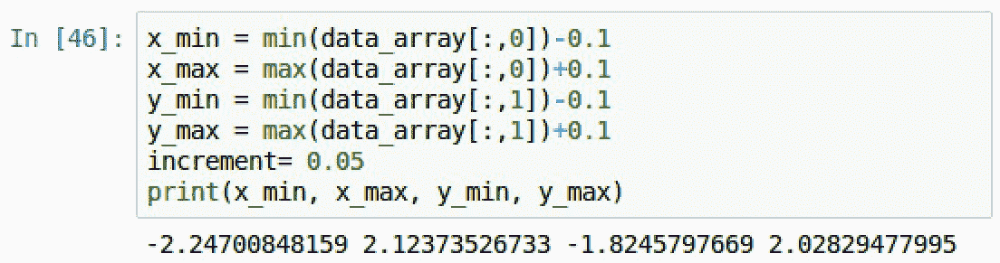

1.  我们为每个数据点生成 x 和 y 值，在 0.05 的增量内的最小和最大值，并将每个（x，y）点运行到预测分数中以绘制这些值。女性性别分数分配为红色，男性性别分数分配为蓝色，如下截图所示：

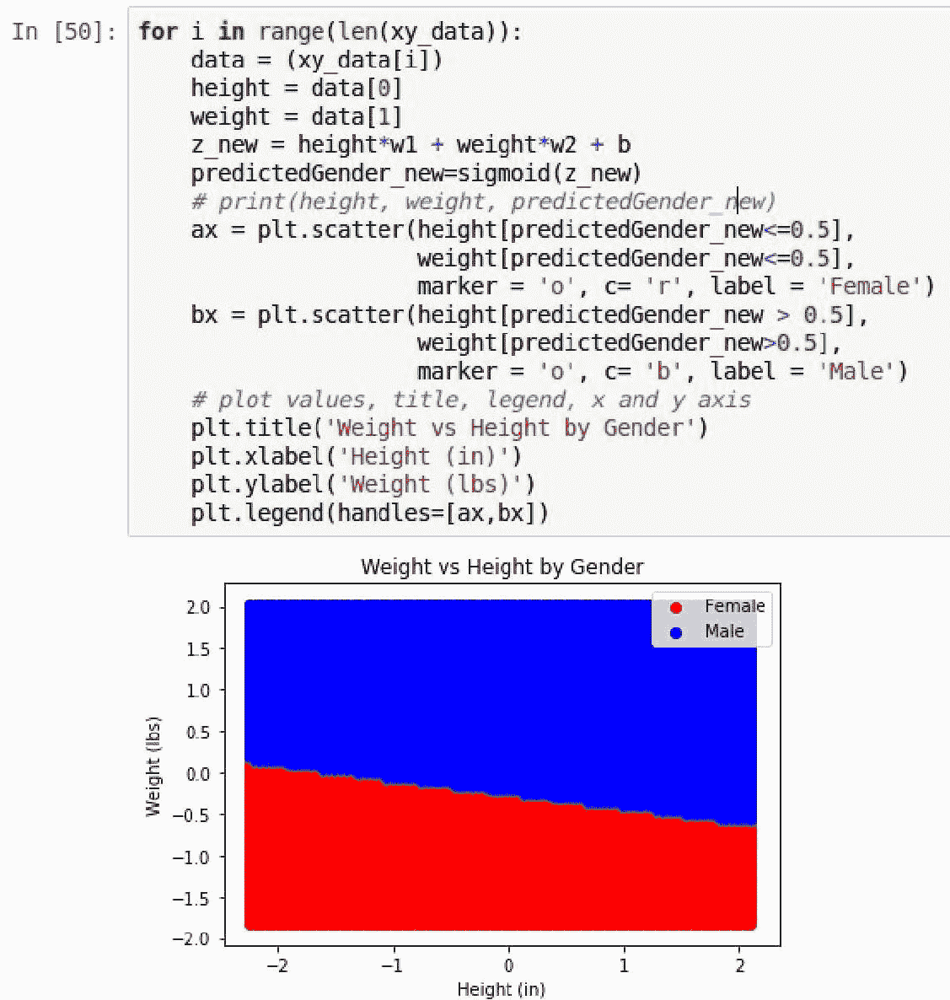

1.  图表显示了根据所选的`height`和`weight`之间的性别分数的分界线。
