# 第三章：卷积神经网络的痛点

在本章中，将介绍以下内容：

+   痛点＃1：导入 MNIST 图像

+   痛点＃2：可视化 MNIST 图像

+   痛点＃3：将 MNIST 图像导出为文件

+   痛点＃4：增强 MNIST 图像

+   痛点＃5：利用训练图像的替代来源

+   痛点＃6：优先考虑用于 CNN 的高级库

# 介绍

**卷积神经网络**（**CNN**）在过去几年中一直备受关注。在图像识别方面取得了巨大成功。随着现代智能手机的出现，任何人现在都有能力拍摄大量物体的照片并将其发布在社交媒体网站上，这在当今时代非常相关。正是由于这种现象，卷积神经网络如今需求量很大。

有几个特性使 CNN 能够最佳地执行。它们需要以下特性：

+   大量的训练数据

+   视觉和空间数据

+   强调过滤（池化）、激活和卷积，而不是传统神经网络中更明显的全连接层

虽然 CNN 已经广受欢迎，但由于其计算需求以及需要大量训练数据来获得性能良好的模型，它们在使用中存在一些局限性。我们将专注于可以应用于数据的技术，这些技术最终将有助于开发卷积神经网络，并解决这些局限性。在后面的章节中，当我们为图像分类开发模型时，我们将应用其中一些技术。

# 痛点＃1：导入 MNIST 图像

用于图像分类的最常见数据集之一是`MNIST`数据集，它由成千上万个手写数字样本组成。根据 Yann LeCun、Corinna Cortes 和 Christopher J.C. Burges 的说法，**修改后的国家标准与技术研究所**（**MNIST**）有以下用途：

这是一个适合想要尝试在真实世界数据上学习技术和模式识别方法的人的良好数据库，同时在预处理和格式化上花费最少的精力。

在我们的 Jupyter 笔记本中导入 MNIST 图像有几种方法。在本章中，我们将介绍以下两种方法：

1.  直接通过 TensorFlow 库

1.  通过 MNIST 网站手动操作

需要注意的一点是，我们将主要使用 MNIST 图像作为我们如何改进卷积神经网络性能的示例。所有这些将应用于 MNIST 图像的技术都可以应用于用于训练 CNN 的任何图像。

# 准备工作

唯一需要的要求是安装`TensorFlow`。它可能不会预先安装在 anaconda3 软件包中；因此，简单的`pip`安装将确认`TensorFlow`的可用性，或者如果当前不可用，则安装它。`TensorFlow`可以在终端中轻松安装，如下截图所示：

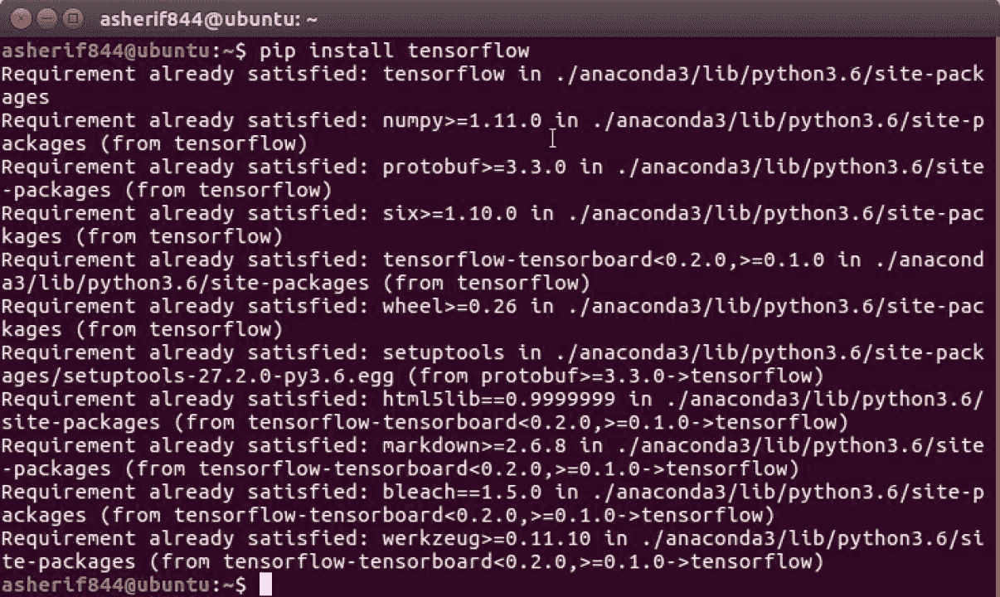

# 如何做...

`TensorFlow`库中有一个方便的内置示例集，可以直接使用。其中一个示例数据集就是`MNIST`。本节将介绍访问这些图像的步骤。

1.  使用以下脚本将`TensorFlow`导入库，并使用别名`tf`：

```scala
import tensorflow as tf
```

1.  使用以下脚本从库中下载和提取图像，并保存到本地文件夹：

```scala
from tensorflow.examples.tutorials.mnist import input_data
data = input_data.read_data_sets('MNIST/', one_hot=True)
```

1.  使用以下脚本检索将用于评估图像分类准确性的训练和测试数据集的最终计数：

```scala
print('Image Inventory')
print('----------')
print('Training: ' + str(len(data.train.labels)))
print('Testing: '+ str(len(data.test.labels)))
print('----------')
```

# 工作原理...

本节解释了访问 MNIST 数据集的过程：

1.  一旦我们收到确认`TensorFlow`库已正确安装，就将其导入笔记本。

1.  我们可以确认`TensorFlow`的版本，并将图像提取到我们的`MNIST/`本地文件夹中。提取过程可在笔记本的输出中看到，如下截图所示：

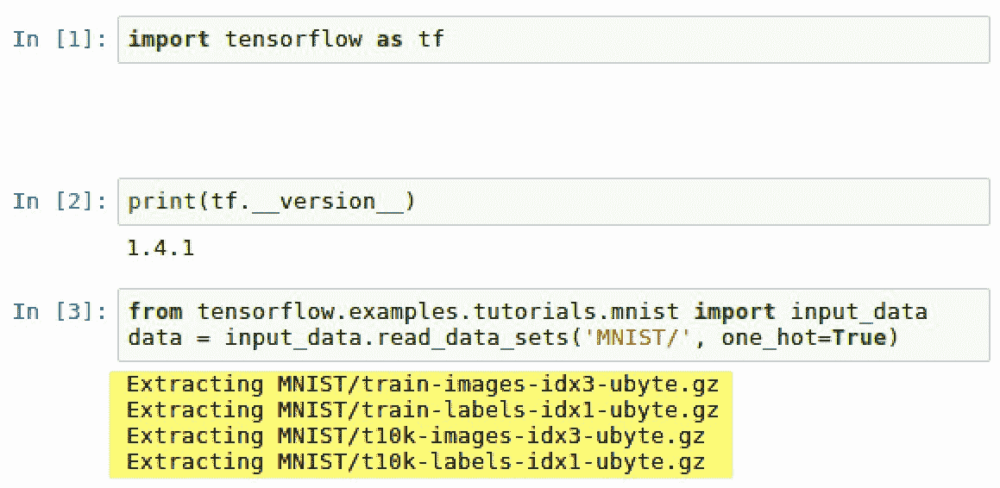

1.  提取的四个文件分别命名为：

1.  `t10k-images-idx3-ubyte.gz`

1.  `t10k-labels-idx1-ubyte.gz`

1.  `train-images-idx3-ubyte.gz`

1.  `train-labels-idx1-ubyte.gz`

1.  它们已经下载到`MNIST/`子文件夹中，如下截图所示：

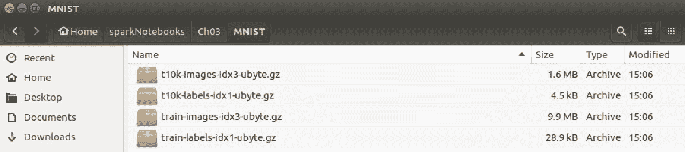

1.  此外，可以在我们的笔记本中查看这四个文件，如下截图所示：

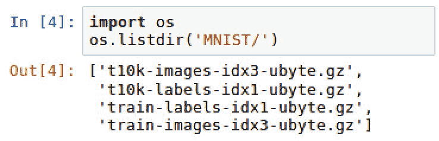

1.  这四个文件是测试和训练图像以及相应的测试和训练标签，用于识别测试和训练数据集中的每个图像。此外，明确定义了`one_hot = True`特性。这表明标签使用 one-hot 编码，有助于模型中的特征选择，因为每列的值将是 0 或 1。 

1.  还导入了库的一个子类，它将 MNIST 的手写图像存储到指定的本地文件夹中。包含所有图像的文件夹应该大约为 12MB，包括 55,000 张训练图像和 10,000 张测试图像，如下截图所示：

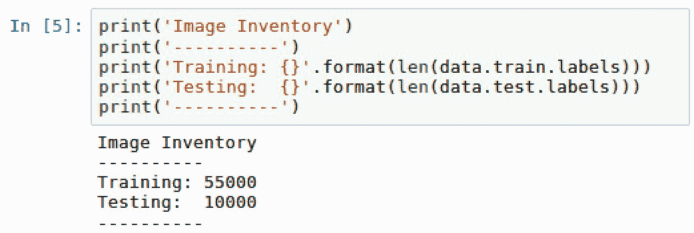

1.  这 10,000 张图像将用于测试我们将在 55,000 张图像上训练的模型的准确性。

# 还有更多...

在尝试通过`TensorFlow`直接访问 MNIST 数据集时，有时可能会出现错误或警告。就像在本节前面看到的那样，当导入 MNIST 时，我们收到了以下警告：

警告：从<ipython-input-3-ceaef6f48460>:2 读取数据集（来自 tensorflow.contrib.learn.python.learn.datasets.mnist）已被弃用，并将在将来的版本中删除。

更新说明：

请使用替代方案，例如来自 tensorflow/models 的 official/mnist/dataset.py。

数据集可能会在未来的`TensorFlow`版本中被弃用，因此不再直接可访问。有时，当通过`TensorFlow`提取 MNIST 图像时，我们可能会遇到典型的*HTTP 403 错误*。这可能是因为网站暂时不可用。无论哪种情况，都有一种手动方法可以使用以下链接下载这四个`.gz`文件：

[`yann.lecun.com/exdb/mnist/`](http://yann.lecun.com/exdb/mnist/)

这些文件位于网站上，如下截图所示：

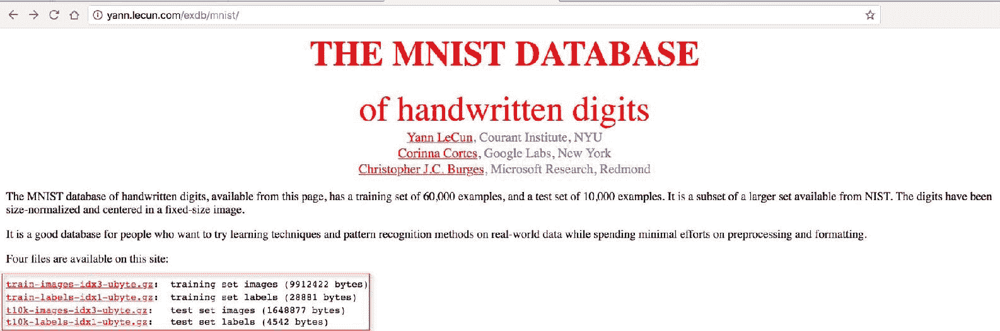

下载这些文件并将它们保存到一个可访问的本地文件夹，类似于直接从`TensorFlow`获取的文件所做的操作。

# 另请参阅

要了解更多关于`MNIST`手写数字数据库的信息，请访问以下网站：[`yann.lecun.com/exdb/mnist/`](http://yann.lecun.com/exdb/mnist/)。

要了解更多关于 one-hot 编码的信息，请访问以下网站：[`hackernoon.com/what-is-one-hot-encoding-why-and-when-do-you-have-to-use-it-e3c6186d008f.`](https://hackernoon.com/what-is-one-hot-encoding-why-and-when-do-you-have-to-use-it-e3c6186d008f)

# 痛点＃2：可视化 MNIST 图像

在 Jupyter 笔记本中处理图形时，绘制图像通常是一个主要的痛点。显示训练数据集中的手写图像至关重要，特别是当比较与手写图像相关联的标签的实际值时。

# 准备工作

用于可视化手写图像的唯一 Python 库是`numpy`和`matplotlib`。这两个库应该已经通过 Anaconda 中的软件包可用。如果由于某种原因它们不可用，可以在终端使用以下命令进行`pip`安装：

+   `pip install matplotlib`

+   `pip install numpy`

# 如何做...

本节将介绍在 Jupyter 笔记本中可视化 MNIST 手写图像的步骤：

1.  导入以下库，`numpy`和`matplotlib`，并使用以下脚本配置`matplotlib`以进行`inline`绘图：

```scala
import numpy as np
import matplotlib.pyplot as plt
%matplotlib inline
```

1.  使用以下脚本绘制前两个样本图像：

```scala
for i in range(2):
    image = data.train.images[i]
    image = np.array(image, dtype='float')
    label = data.train.labels[i]
    pixels = image.reshape((28, 28))
    plt.imshow(pixels, cmap='gray')
    print('-----------------')
    print(label)
    plt.show()
```

# 它是如何工作的...

本节将介绍在 Jupyter 笔记本中查看 MNIST 手写图像的过程：

1.  在 Python 中生成一个循环，从训练数据集中取样两幅图像。

1.  最初，图像只是存储在`numpy`数组中的 0 到 1 之间的浮点格式的一系列值。数组的值是一个名为`image`的标记图像。然后将`image`数组重塑为一个名为`pixels`的 28 x 28 矩阵，其中 0 处为黑色，非 0 处为灰色。值越高，灰色越浅。例如，可以在以下截图中看到数字 8 的示例：

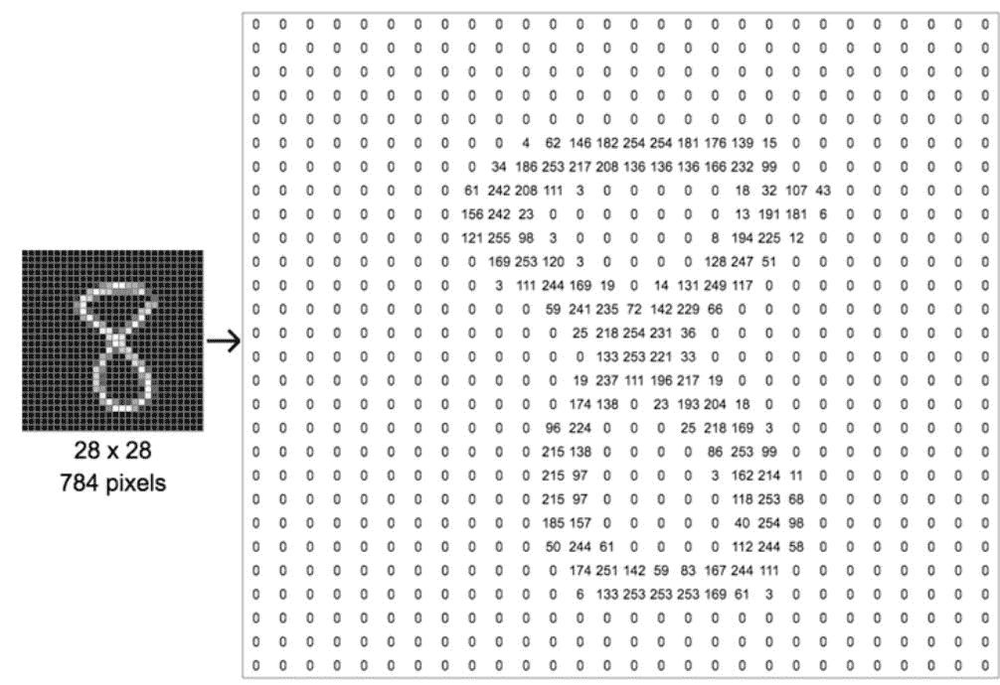

1.  循环的输出产生了数字 7 和 3 的两幅手写图像以及它们的标签，如下截图所示：

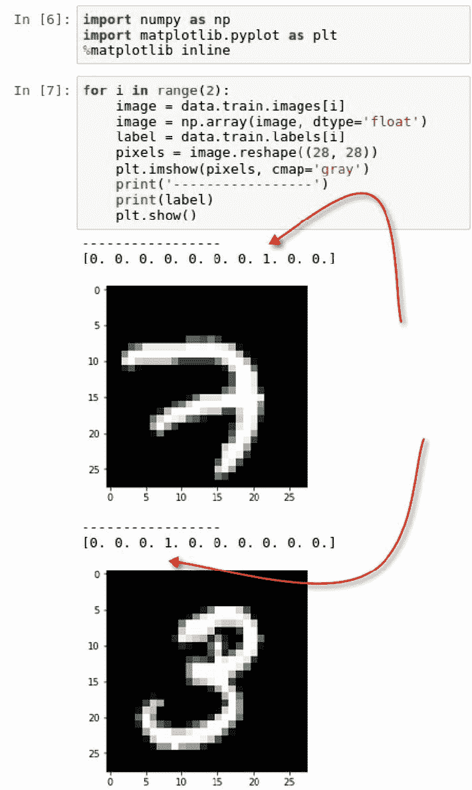

1.  除了绘制图像外，还会在图像上方打印训练数据集的标签。标签是一个长度为 10 的数组，对于所有 10 个数字，只有 0 或 1 的值。对于数字 7，数组中的第 8 个元素的值为 1，对于数字 3，数组中的第 4 个元素的值为 1。所有其他值都为 0。

# 还有更多...

图像的数值可能不会立即显而易见。虽然大多数人能够确定第一幅图像是 7，第二幅图像是 3，但从标签数组中获得确认会更有帮助。

数组中有 10 个元素，每个元素引用数字 0 到 9 的标签值。由于第一个数组在第 8 个位置有一个正值或 1，这表明图像的值是 7，因为 7 在数组的第 8 个索引中。所有其他值应为 0。此外，第二幅图像在第 4 个位置有一个值为 1，表示 3 的正值。

# 另请参阅

Leun、Cortes 和 Burges 在以下声明中讨论了为什么图像像素设置为 28 x 28：

NIST 的原始黑白（双色）图像被尺寸标准化以适应 20x20 像素的框，同时保持其纵横比。由于标准化算法使用的抗锯齿技术，生成的图像包含灰度级。通过计算像素的质心，并将图像平移到使该点位于 28x28 区域的中心，将图像置于 28x28 图像中心。

--来自[`yann.lecun.com/exdb/mnist/.`](http://yann.lecun.com/exdb/mnist/)的 Leun、Cortes 和 Burges

# 痛点＃3：将 MNIST 图像导出为文件

我们经常需要直接在图像中工作，而不是作为数组向量。本节将指导我们将数组转换为`.png`图像。

# 准备工作

将向图像导出向量需要导入以下库：

+   `从 matplotlib 导入图像`

# 如何做...

本节将介绍将 MNIST 数组样本转换为本地文件的步骤。

1.  创建一个子文件夹，将我们的图像保存到我们的主文件夹`MNIST/`中，使用以下脚本：

```scala
if not os.path.exists('MNIST/images'):
   os.makedirs('MNIST/images/')
os.chdir('MNIST/images/')
```

1.  循环遍历 MNIST 数组的前 10 个样本，并使用以下脚本将它们转换为`.png`文件：

```scala
from matplotlib import image
for i in range(1,10):
     png = data.train.images[i]
     png = np.array(png, dtype='float')
     pixels = png.reshape((28, 28))
     image.imsave('image_no_{}.png'.format(i), pixels, cmap = 'gray')
```

1.  执行以下脚本以查看从`image_no_1.png`到`image_no_9.png`的图像列表：

```scala
print(os.listdir())
```

# 它是如何工作的...

本节解释了如何将 MNIST 数组转换为图像并保存到本地文件夹中。

1.  我们创建一个名为`MNIST/images`的子文件夹，以帮助我们存储临时的`.png`图像，并将它们与 MNIST 数组和标签分开。

1.  再次循环遍历`data.train`图像，并获得可以用于取样的九个数组。然后将图像保存为`.png`文件到我们的本地目录，格式如下：`'image_no_{}.png'.format(i), pixels, cmap = 'gray'`

1.  可以在本地目录中看到九个图像的输出，如下截图所示：

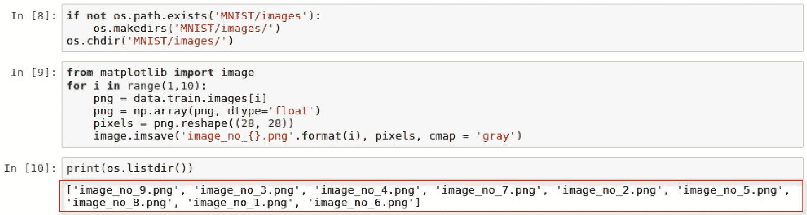

# 还有更多...

除了查看目录中的图像列表外，我们还可以在 Linux 中查看目录中的图像，如下截图所示：

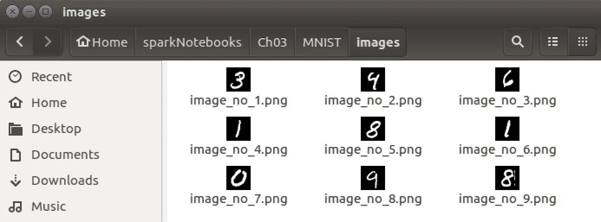

# 另请参阅

要了解有关`matplotlib`中`image.imsave`的更多信息，请访问以下网站：

[`matplotlib.org/api/_as-gen/matplotlib.pyplot.imsave.html`](https://matplotlib.org/api/_as-gen/matplotlib.pyplot.imsave.html)

# 痛点＃4：增强 MNIST 图像

在处理图像识别时的主要缺点之一是某些图像的变化不够多样化。这可能导致卷积神经网络的运行不如我们希望的那样理想，并且由于训练数据的缺乏多样性而返回不理想的结果。有一些技术可用于规避这一缺点，我们将在本节中讨论其中一种。

# 准备工作

再次，我们已经为我们做了大部分繁重的工作。我们将使用一个流行的 Python 包`augmentor`，它经常与机器学习和深度学习建模一起使用，以生成现有图像的额外版本，经过扭曲和增强以获得更多的变化。

首先必须使用以下脚本进行`pip`安装：`pip install augmentor`

然后我们应该得到确认该包已安装，如下截图所示：

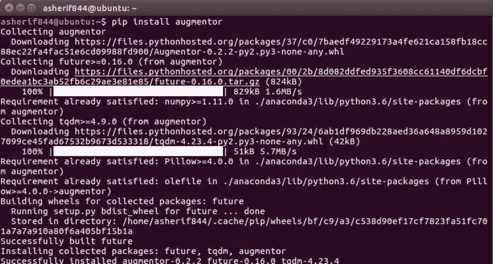

然后我们需要从 augmentor 中导入 pipeline 类：

+   `from Augmentor import Pipeline`

# 操作步骤...

本节介绍了增加我们九个样本图像的频率和增强的步骤。

1.  使用以下脚本初始化`augmentor`函数：

```scala
from Augmentor import Pipeline
augmentor = Pipeline('/home/asherif844/sparkNotebooks/Ch03/MNIST/images')
```

1.  执行以下脚本，以便`augmentor`函数可以根据以下规格`旋转`我们的图像：

```scala
augmentor.rotate(probability=0.9, max_left_rotation=25, max_right_rotation=25)
```

1.  执行以下脚本，使每个图像通过两次迭代，每次迭代 10 次增强：

```scala
for i in range(1,3):
     augmentor.sample(10)
```

# 工作原理...

本节解释了如何使用我们的九个图像创建额外的扭曲图像。

1.  我们需要为图像变换创建一个`Pipeline`并指定将要使用的图像的位置。这确保了以下内容：

1.  图像的源位置

1.  将要转换的图像数量

1.  图像的目标位置

1.  我们可以看到我们的目标位置已创建一个名为`/output/`的子文件夹，如下截图所示：

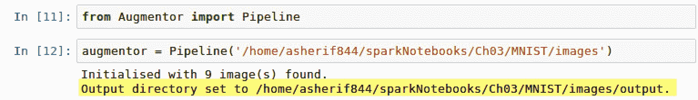

1.  `augmentor`函数被配置为将每个图像向右旋转 25 度或向左旋转 25 度，概率为 90%。基本上，概率配置确定增强发生的频率。

1.  创建一个循环，对每个图像进行两次遍历，并对每个图像应用两次变换；但是，由于我们对每个变换都添加了概率，因此有些图像可能不会被转换，而其他图像可能会被转换超过两次。变换完成后，我们应该收到一条消息，如下截图所示：

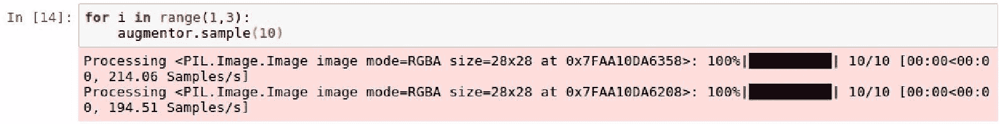

1.  一旦我们完成增强，我们可以访问`/output/`子目录，并查看每个数字如何略有改变，如下截图所示：

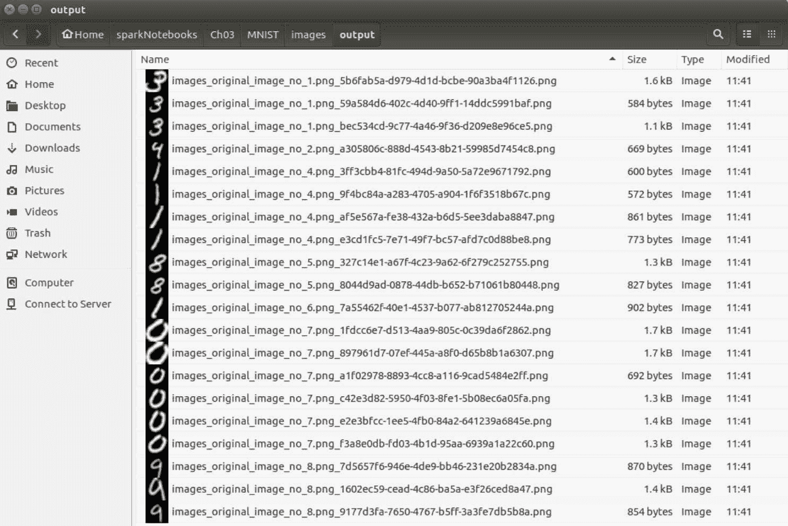

1.  我们可以看到我们有几个数字 3、1、8、0 和 9 的变化，都有不同程度的旋转。现在我们已经将样本数据集增加了三倍，并且增加了更多的变化，而不必去提取更多的图像进行训练和测试。

# 还有更多...

我们只应用了`rotate`变换；但是，还有几种变换和增强功能可用于图像：

+   透视扭曲

+   弹性变形

+   剪切

+   裁剪

+   镜像

当寻求增加训练数据集的频率和多样性时，并非所有这些转换都是必要的，但使用一些特征的组合并评估模型性能可能是有益的。

# 另请参阅

要了解更多关于`augmentor`的信息，请访问以下网站：

[`augmentor.readthedocs.io/en/master/`](https://augmentor.readthedocs.io/en/master/)

# 痛点＃5：利用训练图像的替代来源

有时，没有足够的资源来执行卷积神经网络。这些资源可能来自计算的角度或数据收集的角度。在这种情况下，我们依赖其他来源来帮助我们对图像进行分类。

# 准备工作

利用预训练模型作为其他数据集上测试结果的来源的技术称为迁移学习。这里的优势在于，用于训练图像的大部分 CPU 资源被外包给了预训练模型。迁移学习最近已成为深度学习的常见扩展。

# 如何做...

本节解释了迁移学习的工作过程。

1.  收集一系列数据集或图像，您有兴趣对其进行分类，就像您对传统机器学习或深度学习一样。

1.  将数据集分割为训练和测试集，例如 75/25 或 80/20。

1.  确定将用于识别图像模式和识别您希望分类的图像的预训练模型。

1.  构建一个深度学习管道，将训练数据连接到预训练模型，并开发识别测试数据所需的权重和参数。

1.  最后，在测试数据上评估模型性能。

# 它是如何工作的...

本节解释了将迁移学习应用于 MNIST 数据集的过程。

1.  我们在使用迁移学习时确实采取了一种捷径的方法，因为我们要么在资源、时间或两者方面受到限制，我们正在利用已经完成的先前工作，并希望它能帮助我们解决一些新问题。

1.  由于我们正在处理图像分类问题，因此应使用曾经用于分类常见图像的预训练模型。有许多常见的模型，但其中两个突出的是：

1.  由微软开发的 ResNet 模型。

1.  谷歌开发的 Inception 模型。

1.  由于微软和谷歌都拥有广泛的图像库，因此两种模型都对图像分类非常有用，可以在更详细的层面提取特征。

1.  在 Spark 中，有能力构建深度学习管道，并调用一个名为`DeepImageFeaturizer`的类，并将`InceptionV3`模型应用于从训练数据中收集的一组特征。然后使用某种二元或多分类评估器在测试数据上评估训练数据集。

1.  深度学习或机器学习中的管道只是用于从数据收集的初始环境到应用模型对收集的数据进行最终评估或分类的工作流程过程。

# 还有更多...

与一切一样，使用迁移学习有利有弊。正如我们在本节前面讨论的那样，当您在资源有限时，对大型数据集进行自己的建模时，迁移学习是理想的选择。手头的源数据可能不具备预训练模型中的许多独特特征，导致模型性能不佳。可以随时切换到另一个预训练模型并评估模型性能。再次强调，迁移学习是一种快速失败的方法，当其他选择不可用时可以采取。

# 另请参阅

要了解有关微软 ResNet 的更多信息，请访问以下网站：

[`resnet.microsoft.com/`](https://resnet.microsoft.com/)

要了解有关谷歌 Inception 的更多信息，请访问以下网站：

[`www.tensorflow.org/tutorials/image_recognition`](https://www.tensorflow.org/tutorials/image_recognition)

要了解更多关于 InceptionV3 的信息，您可以阅读康奈尔大学的题为《重新思考计算机视觉的 Inception 架构》的论文：

[`arxiv.org/abs/1512.00567`](https://arxiv.org/abs/1512.00567)

# 痛点＃6：优先考虑用于 CNN 的高级库

有许多库可用于执行卷积神经网络。其中一些被认为是低级的，比如 TensorFlow，其中许多配置和设置需要大量编码。这对于经验不足的开发人员来说可能是一个主要痛点。还有其他库，比如 Keras，它是建立在诸如 TensorFlow 之类的库之上的高级框架。这些库需要更少的代码来构建卷积神经网络。通常，刚开始构建神经网络的开发人员会尝试使用 TensorFlow 来实现模型，并在途中遇到几个问题。本节将首先建议使用 Keras 构建卷积神经网络，而不是使用 TensorFlow 来预测 MNIST 数据集中的手写图像。

# 准备工作

在本节中，我们将使用 Keras 训练一个模型，以识别 MNIST 中的手写图像。您可以通过在终端执行以下命令来安装 Keras：

```scala
pip install keras
```

# 如何做...

本节将介绍构建一个模型来识别 MNIST 中手写图像的步骤。

1.  使用以下脚本基于以下变量创建测试和训练图像和标签：

```scala
xtrain = data.train.images
ytrain = np.asarray(data.train.labels)
xtest = data.test.images 
ytest = np.asarray(data.test.labels)
```

1.  使用以下脚本重塑测试和训练数组：

```scala
xtrain = xtrain.reshape( xtrain.shape[0],28,28,1)
xtest = xtest.reshape(xtest.shape[0],28,28,1)
ytest= ytest.reshape(ytest.shape[0],10)
ytrain = ytrain.reshape(ytrain.shape[0],10)
```

1.  从`keras`导入以下内容以构建卷积神经网络模型：

```scala
import keras
import keras.backend as K
from keras.models import Sequential
from keras.layers import Dense, Flatten, Conv2D
```

1.  使用以下脚本设置图像排序：

```scala
K.set_image_dim_ordering('th')
```

1.  使用以下脚本初始化`Sequential` `model`：

```scala
model = Sequential()
```

1.  使用以下脚本向`model`添加层：

```scala
model.add(Conv2D(32, kernel_size=(3, 3),activation='relu', 
            input_shape=(1,28,28)))
model.add(Flatten())
model.add(Dense(128, activation='relu'))
model.add(Dense(10, activation='sigmoid'))
```

1.  使用以下脚本编译`model`：

```scala
model.compile(optimizer='adam',loss='binary_crossentropy', 
              metrics=['accuracy'])
```

1.  使用以下脚本训练`model`：

```scala
model.fit(xtrain,ytrain,batch_size=512,epochs=5,
            validation_data=(xtest, ytest))
```

1.  使用以下脚本测试`model`的性能：

```scala
stats = model.evaluate(xtest, ytest)
print('The accuracy rate is {}%'.format(round(stats[1],3)*100))
print('The loss rate is {}%'.format(round(stats[0],3)*100))
```

# 它是如何工作的...

本节解释了如何在 Keras 上构建卷积神经网络以识别 MNIST 中的手写图像。

1.  对于任何模型开发，我们需要确定我们的测试和训练数据集以及特征和标签。在我们的情况下，这相当简单，因为来自 TensorFlow 的 MNIST 数据已经被分解为`data.train.images`用于特征和`data.train.labels`用于标签。此外，我们希望将标签转换为数组，因此我们利用`np.asarray()`来处理`ytest`和`ytrain`。

1.  `xtrain`、`xtest`、`ytrain`和`ytest`的数组目前不是用于 Keras 中的卷积神经网络的正确形状。正如我们在本章早期确定的那样，MNIST 图像的特征表示为 28 x 28 像素图像，标签表示 0 到 9 之间的十个值中的一个。x-arrays 将被重塑为(,28,28,1)，y-arrays 将被重塑为(,10)。新数组的`shape`如下截图所示：

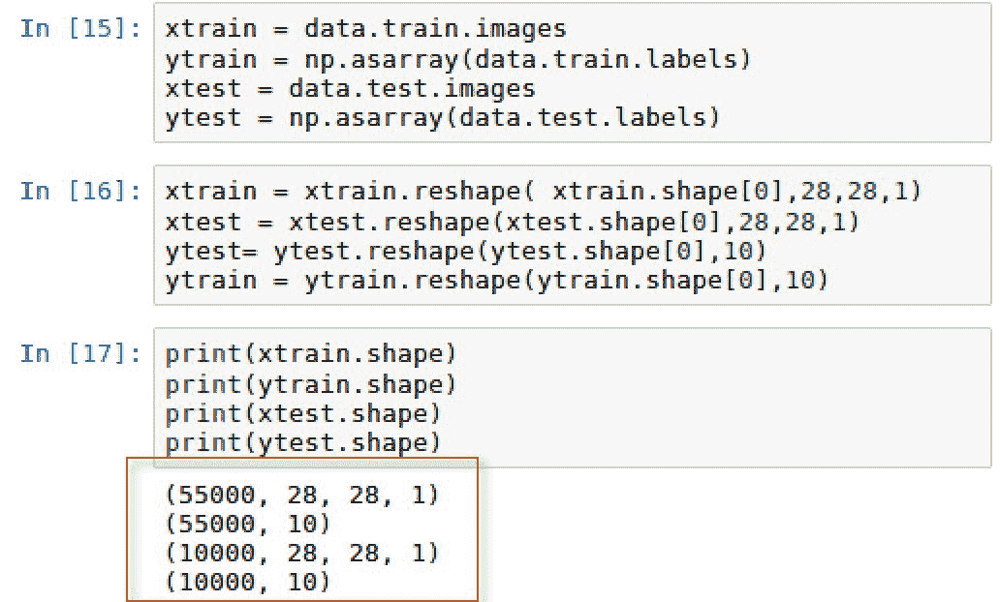

1.  如前所述，Keras 是一个高级库；因此，它不会执行张量或卷积操作，而没有低级库（如 TensorFlow）的帮助。为了配置这些操作，我们将`backend`设置为`K`，`Keras`的图像维度排序`image_dim_ordering`设置为`tf`，表示 TensorFlow。

请注意，后端也可以设置为其他低级库，如`Theano`。我们将维度排序设置为`th`。此外，我们需要重构特征的形状。然而，在过去的几年中，`Theano`并没有像`TensorFlow`那样获得同样的采用率。

1.  一旦我们导入构建 CNN 模型所需的必要库，我们就可以开始构建模型的序列或层，`Sequential()`。为了演示目的，我们将保持这个模型尽可能简单，只有 4 层，以证明我们仍然可以在最小的复杂性下获得高准确性。每一层都是使用`.add()`方法添加的。

1.  第一层被设置为构建一个二维（`Conv2D`）卷积层，这对于空间图像如 MNIST 数据是常见的。由于这是第一层，我们必须明确定义传入数据的`input_shape`。此外，我们指定一个`kernel_size`，用于设置用于卷积的窗口滤波器的高度和宽度。通常，这是 32 个滤波器的 3x3 窗口或 5x5 窗口。此外，我们必须为这一层设置一个激活函数，对于效率目的，特别是在神经网络的早期阶段，`relu`是一个不错的选择。

1.  接下来，第二层将第一层的输入展平，以获取一个分类，我们可以用来确定图像是否是可能的 10 个数字之一。

1.  第三，我们将第二层的输出传递到具有 128 个隐藏层的另一个具有`relu`激活函数的`dense`层。密集连接层中的函数包括`input_shape`和`kernel_size`以及偏差，以创建每个 128 个隐藏层的输出。

1.  最后一层是输出层，将决定 MNIST 图像的预测值是什么。我们添加另一个具有`sigmoid`函数的`dense`层，以输出我们的 MNIST 图像可能的 10 种情况的概率。Sigmoid 函数对于二元或多类分类结果很有用。

1.  下一步是使用`adam`作为`optimizer`编译模型，并评估`accuracy`作为`metrics`。`adam`优化器对于 CNN 模型很常见，当处理 10 种可能结果的多类分类场景时，使用`categorical_crossentropy`作为损失函数也很常见，这也是我们的情况。

1.  我们使用`batch_size`为`512`的图像进行`5`次运行或`epochs`来训练模型。每个 epoch 的损失和准确性都被捕获，并可以在以下截图中看到：

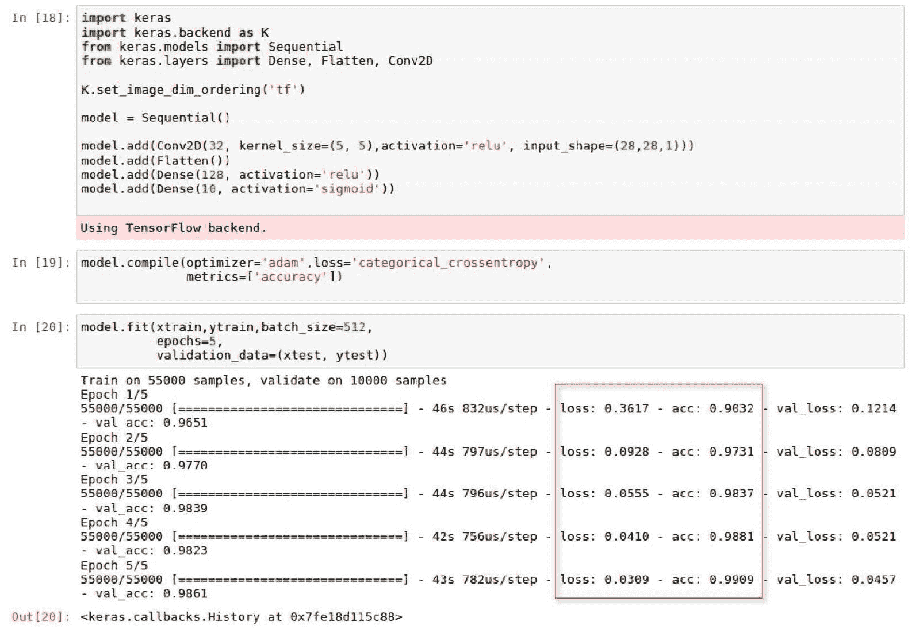

1.  我们通过在测试数据集上评估训练模型来计算准确性和损失率，如下截图所示：

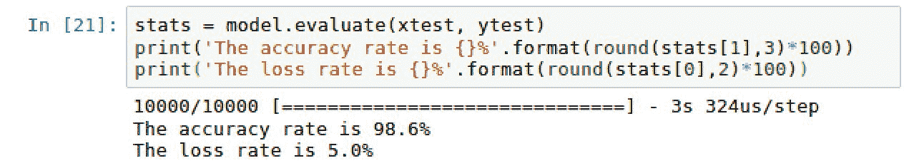

1.  我们的模型似乎表现良好，准确率为 98.6%，损失率为 5%。

1.  我们在 Keras 中使用了五行代码来构建一个简单的卷积神经网络模型。Keras 是一个快速上手的模型设计工具。一旦您准备好转向更复杂的模型开发和控制，可能更有意义的是在 TensorFlow 中构建卷积神经网络。

# 还有更多...

除了获取模型的准确性，我们还可以通过执行以下脚本来产生 CNN 建模过程中每一层的形状：

```scala
model.summary()
```

`model.summary()`的输出可以在以下截图中看到：

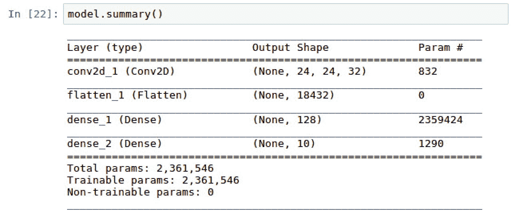

我们看到第一层的输出形状（None, 24, 24, 32）通过在第二层中乘以 24 x 24 x 32 而展平为形状（None, 18432）。此外，我们看到我们的第三和第四层具有我们使用 Dense 层函数分配给它们的形状。

# 另请参阅

要了解更多关于 Keras 中 2D 卷积层开发的信息，请访问以下网站：

[`keras.io/layers/convolutional/#conv2d`](https://keras.io/layers/convolutional/#conv2d)

要了解如何在 TensorFlow 中使用 MNIST 图像构建卷积神经网络，请访问以下网站：

[`www.tensorflow.org/versions/r1.4/get_started/mnist/pros`](https://www.tensorflow.org/versions/r1.4/get_started/mnist/pros)
