# 第四章：循环神经网络的痛点

在本章中，我们将涵盖以下内容：

+   前馈网络简介

+   RNN 的顺序工作

+   痛点＃1 - 梯度消失问题

+   痛点＃2 - 梯度爆炸问题

+   LSTM 的顺序工作

# 介绍

循环神经网络已被证明在涉及学习和预测序列数据的任务中非常高效。然而，当涉及自然语言时，长期依赖性的问题就出现了，这基本上是记住特定对话、段落或句子的上下文，以便在未来做出更好的预测。例如，考虑一个句子，说：

*去年，我碰巧访问了中国。中国的食物不仅与世界上其他地方提供的中国食物不同，而且人们也非常热情好客。在这个美丽的国家呆了三年，我学会了说一口很好的......*

如果将前面的句子输入到循环神经网络中以预测句子中的下一个单词（比如中国），网络会发现很难，因为它没有句子上下文的记忆。这就是我们所说的长期依赖性。为了正确预测单词“中国”，网络需要知道句子的上下文，还需要记住我碰巧去年访问中国的事实。因此，循环神经网络在执行此类任务时效率低下。然而，**长短期记忆单元**（**LSTM**）可以克服这个问题，它能够记住长期依赖性并将信息存储在细胞状态中。稍后将讨论 LSTM，但本章的大部分内容将重点介绍神经网络、激活函数、循环网络、循环网络的一些主要痛点或缺点，以及如何通过使用 LSTM 来克服这些缺点。

# 前馈网络简介

要理解循环网络，首先必须了解前馈网络的基础知识。这两种网络都是根据它们通过网络节点执行的一系列数学运算的方式命名的。一种只通过每个节点向一个方向传递信息（永远不会两次触及给定节点），而另一种则通过循环将信息传递并将其反馈到同一节点（有点像反馈循环）。很容易理解第一种称为**前馈网络**，而后者是循环的。

# 准备就绪

理解任何神经网络图表的最重要概念是计算图的概念。计算图实际上就是相互连接的神经网络节点，每个节点执行特定的数学函数。

# 操作步骤...

前馈神经网络通过一组计算节点（即数学运算符和激活函数）将输入（到输入层）传递到计算网络输出的层。输出层是神经网络的最终层，通常包含线性函数。输入层和输出层之间的层称为**隐藏层**，通常包含非线性元素或函数：

1.  下图（a）显示了前馈神经网络中节点如何相互连接：

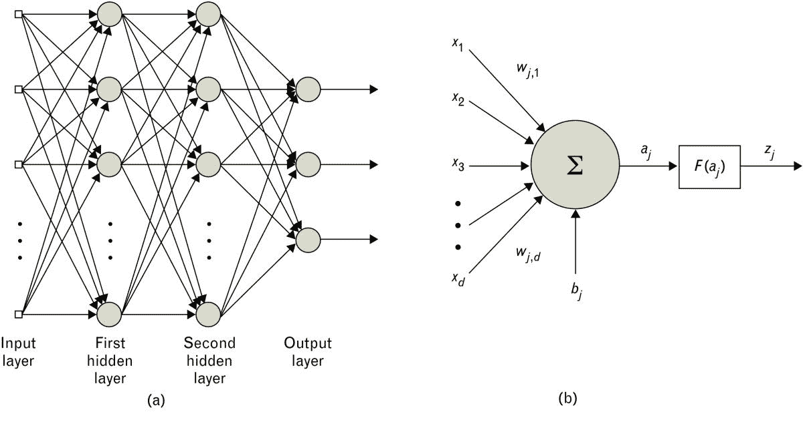

前馈神经网络

1.  前馈神经网络主要通过隐藏层节点中使用的函数（激活函数）的类型来区分彼此。它们还通过在训练期间用于优化网络的其他参数的算法来区分彼此。

1.  在前面的图中显示的节点之间的关系不需要对每个节点进行完全填充；优化策略通常从大量的隐藏节点开始，并通过消除连接和可能的节点来调整网络，随着训练的进行。在训练过程中可能不需要利用每个节点。

# 工作原理...

神经元是任何神经网络的基本结构元素。神经元可以被看作是一个简单的数学函数或运算符，它对通过它流动的输入进行操作，以产生从它流出的输出。神经元的输入与节点的权重矩阵相乘，对所有输入求和，进行平移，并通过激活函数传递。这基本上是数学中的矩阵运算，如下所述：

1.  神经元的计算图表示如前图(b)所示。

1.  单个神经元或节点的传递函数如下所示：

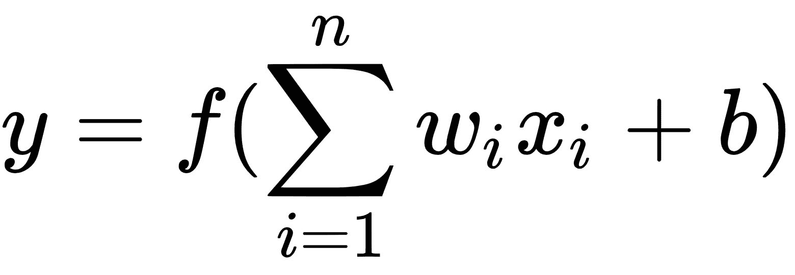

这里，*x*[ *i* ]是第 i 个节点的输入，*w*[ *i* ]是与第 i 个节点相关的权重项，*b*是通常添加的偏差，以防止过拟合，*f*(⋅)是作用于流入节点的输入的激活函数，*y*是节点的输出。

1.  具有 S 形激活函数的神经元通常用于神经网络的隐藏层，并且恒等函数通常用于输出层。

1.  激活函数通常被选择为确保节点的输出严格增加、平滑（连续的一阶导数）或渐近的方式。

1.  以下的逻辑函数被用作 S 形激活函数：

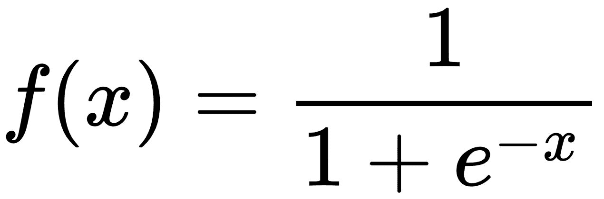

1.  使用反向传播算法训练的神经元，如果激活函数是反对称的，即*f*(-*x*) = -*f*(*x*)，可能会学习得更快，就像 S 形激活函数的情况一样。反向传播算法将在本章的后续部分中详细讨论。

1.  逻辑函数不是反对称的，但可以通过简单的缩放和移位来使其成为反对称，从而得到具有由*f*(*x*) = 1 - *f*²(*x*)描述的一阶导数的双曲正切函数，如下数学函数所示：

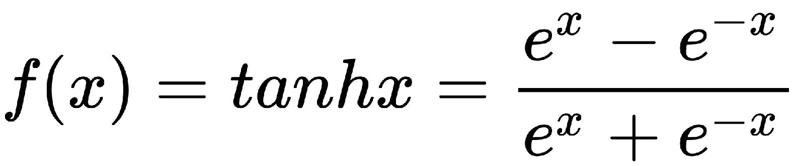

1.  S 形函数及其导数的简单形式允许快速准确地计算梯度，以优化权重和偏差的选择，并进行二阶误差分析。

# 还有更多...

在神经网络的各层中的每个神经元/节点上执行一系列矩阵运算。下图以更数学化的方式展示了前馈网络，这将帮助您更好地理解每个节点/神经元的操作：

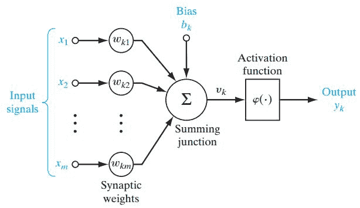

1.  直观地，我们可以看到输入（向量或矩阵）首先被权重矩阵相乘。然后添加一个偏差项，然后使用激活函数（如 ReLU、tanh、sigmoid、阈值等）激活以产生输出。激活函数是确保网络能够学习线性和非线性函数的关键。 

1.  然后，这个输出作为下一个神经元的输入，然后再次执行相同的一系列操作。许多这样的神经元组合在一起形成一个层（执行输入向量的某个功能或学习某个特征），许多这样的层组合在一起形成一个前馈神经网络，可以完全学会识别输入，如下图所示：

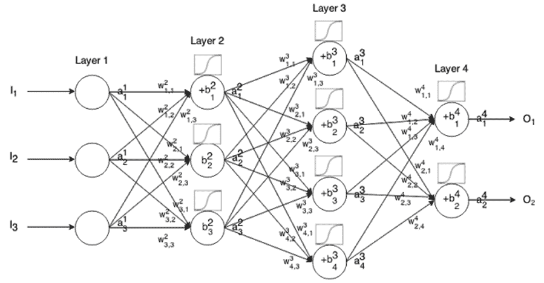

1.  假设我们的前馈网络已经训练好，可以对狗和猫的图像进行分类。一旦网络训练好，如下图所示，它将学会在呈现新图像时将图像标记为狗或猫：

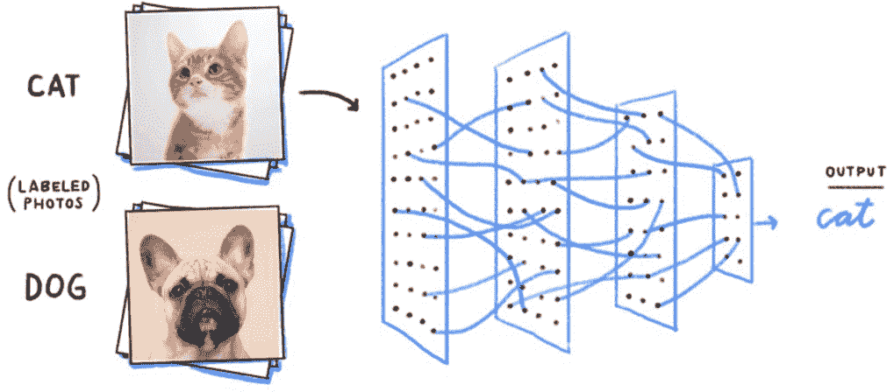

1.  在这样的网络中，当前输出与先前或未来的输出之间没有关系。

1.  这意味着前馈网络基本上可以暴露给任何随机的图像集合，它暴露给的第一张图像不一定会改变它对第二张或第三张图像的分类方式。因此，我们可以说在时间步*t*的输出与时间步*t-1*的输出是独立的。

1.  前馈网络在图像分类等情况下效果很好，其中数据不是顺序的。前馈网络在使用两个相关变量时也表现良好，比如温度和位置、身高和体重、汽车速度和品牌等。

1.  然而，可能存在当前输出依赖于先前时间步的输出的情况（数据的顺序很重要）。

1.  考虑阅读一本书的情景。你对书中句子的理解基于你对句子中所有单词的理解。使用前馈网络来预测句子中的下一个单词是不可能的，因为在这种情况下输出取决于先前的输出。

1.  同样，有许多情况下，输出需要先前的输出或一些先前输出的信息（例如，股市数据、自然语言处理、语音识别等）。前馈网络可以被修改如下图所示，以捕获先前输出的信息：

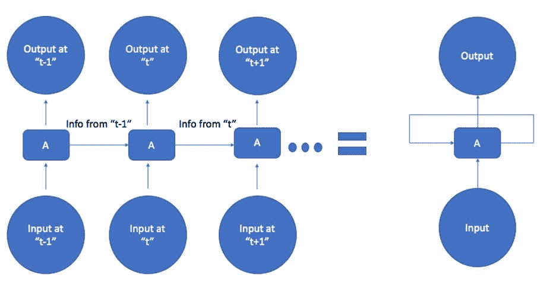

1.  在时间步*t*，输入*t*以及*t-1*的信息都提供给网络，以获得时间*t*的输出。

1.  同样，从时间步*t*以及新输入都被输入到网络中的时间步*t+1*，以产生*t+1*的输出。前面图表的右侧是表示这样一个网络的一般方式，其中网络的输出会作为未来时间步的输入。这样的网络被称为**循环神经网络**（**RNN**）。

# 另请参见

**激活函数**：在人工神经网络中，节点的激活函数决定了节点在给定输入或一组输入时产生的输出类型。输出*y[k]*由输入*u[k]*和偏置*b[k]*通过激活函数*φ(.)*得到，如下式所示：

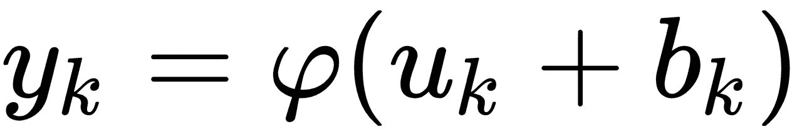

有各种类型的激活函数。以下是常用的几种：

1.  **阈值函数**：

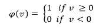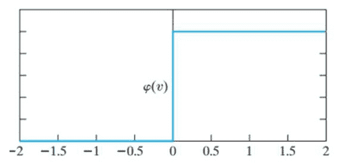

从前面的图表可以清楚地看出，这种函数限制了神经元的输出值在 0 和 1 之间。在许多情况下，这可能是有用的。然而，这个函数是不可微的，这意味着它不能用于学习非线性，而在使用反向传播算法时，这是至关重要的。

1.  **Sigmoid 函数**：

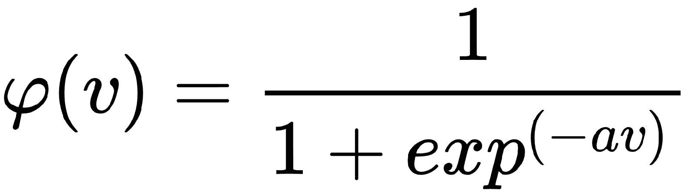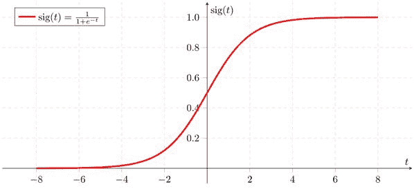

Sigmoid 函数是一个具有下限为 0 和上限为 1 的逻辑函数，与阈值函数一样。这个激活函数是连续的，因此也是可微的。在 Sigmoid 函数中，前面函数的斜率参数由α给出。这个函数是非线性的，这对于提高性能至关重要，因为它能够容纳输入数据中的非线性，而常规线性函数不能。具有非线性能力确保权重和偏置的微小变化会导致神经元输出的显著变化。

1.  **双曲正切函数（tanh）**：

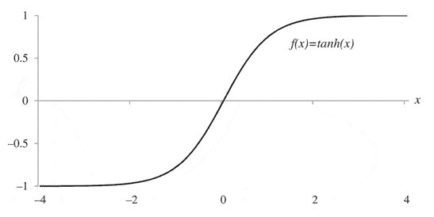

这个函数使激活函数的范围从 0 到 1 变为-1 到+1。

1.  **修正线性单元（ReLU）函数**：ReLU 是许多逻辑单元的平滑近似，产生稀疏的活动向量。以下是该函数的方程：

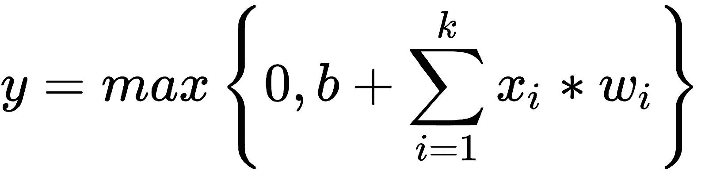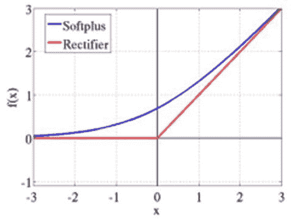

ReLU 函数图

在前面的图表中，softplus (x) = log ( 1 + e^x)是整流器的平滑近似。

1.  **Maxout 函数**：该函数利用一种称为**“dropout”**的技术，并改进了快速近似模型平均的准确性，以便促进优化。

Maxout 网络不仅学习隐藏单元之间的关系，还学习每个隐藏单元的激活函数。通过主动丢弃隐藏单元，网络被迫在训练过程中找到其他路径以从给定输入到输出。以下图表是这个过程如何工作的图形描述：

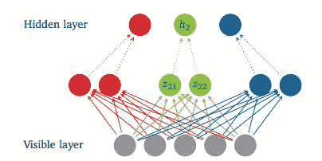

Maxout 网络

前面的图表显示了具有五个可见单元、三个隐藏单元和每个隐藏单元两个神经元的 Maxout 网络。Maxout 函数由以下方程给出：

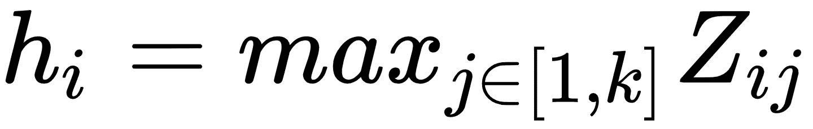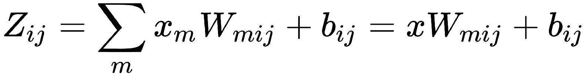

这里 W..[ij ]是通过访问矩阵 W ∈  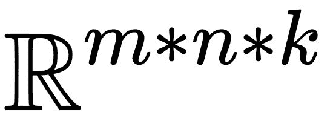的第二坐标 *i* 和第三坐标 *j*获得的输入的大小的均值向量。中间单元的数量（*k）*称为 Maxout 网络使用的片数。以下图表显示了 Maxout 函数与 ReLU 和**参数修正线性单元**（**PReLU**）函数的比较：

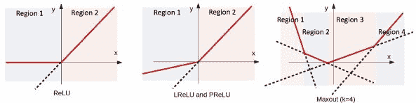

Maxout、ReLU 和 PReLU 函数的图形比较

# RNN 的顺序工作

递归神经网络是一种人工神经网络，旨在识别和学习数据序列中的模式。此类序列数据的一些示例包括：

+   手写

+   诸如客户评论、书籍、源代码等文本

+   口语/自然语言

+   数值时间序列/传感器数据

+   股价变动数据

# 准备工作

在递归神经网络中，来自上一个时间步的隐藏状态被反馈到下一个时间步的网络中，如下图所示：

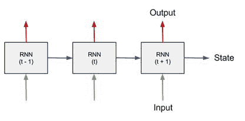

基本上，进入网络的朝上箭头代表 RNN 在每个时间步的输入（矩阵/向量），而从网络中出来的朝上箭头代表每个 RNN 单元的输出。水平箭头表示在特定时间步（由特定神经元）学习的信息传递到下一个时间步。

有关使用 RNN 的更多信息，请访问：

[`deeplearning4j.org/usingrnns`](https://deeplearning4j.org/usingrnns)

# 如何做…

在递归网络的每个节点/神经元上，进行一系列矩阵乘法步骤。首先将输入向量/矩阵乘以权重向量/矩阵，然后添加偏差项，最后通过激活函数产生输出（就像前馈网络的情况一样）：

1.  以下图表显示了一种直观和数学化的方式来可视化 RNNs，以计算图的形式：

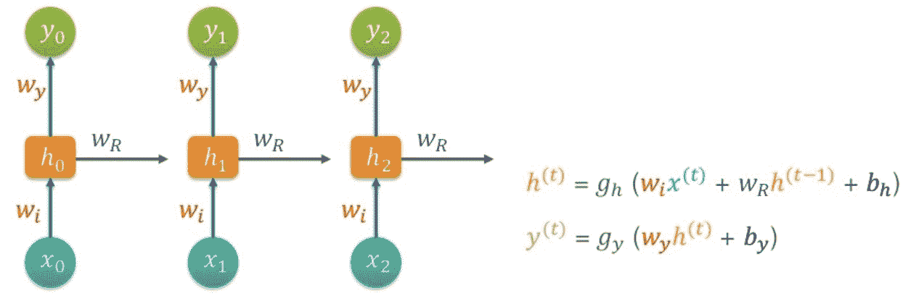

1.  在第一个时间步骤（即*t=0*），使用前面图表右侧的第一个公式计算*h*[*0*]。由于*h*^(*-1*)不存在，中间项变为零。

1.  输入矩阵*x*[*0*]乘以权重矩阵*w[i]*，并且将偏差*b[h]*添加到这个项。

1.  然后将前面的两个矩阵相加，然后通过激活函数*g[h]*获得*h[0]*。

1.  同样，*y[0]*使用前面图表右侧的第二个方程计算，方法是将*h[0]*与权重矩阵*w[y]*相乘，加上偏差*b[y]*，并通过激活函数*g[y]*传递。

1.  在下一个时间步（即*t=1*），*h^((t-1))*存在。它就是*h[0]*。这个项乘以权重矩阵*w[R]*，也作为网络的输入与新的输入矩阵*x[1]*一起提供。

1.  这个过程在多个时间步骤中重复进行，权重、矩阵和偏差在不同的时间步骤中通过整个网络流动。

1.  整个过程在一个迭代中执行，这构成了网络的前向传递。

# 它是如何工作的...

训练前馈神经网络最常用的技术是通过时间的反向传播。这是一种监督学习方法，用于通过在每个时间步之后更新网络中的权重和偏差来减少损失函数。执行多个训练周期（也称为时代），其中由损失函数确定的误差通过梯度下降的技术进行反向传播。在每个训练周期结束时，网络更新其权重和偏差，以产生接近期望输出的输出，直到达到足够小的误差：

1.  在每次迭代期间，反向传播算法基本上实现以下三个基本步骤：

+   输入数据的前向传递和计算损失函数

+   梯度和误差的计算

+   通过时间的反向传播和相应地调整权重和偏差

1.  在通过激活函数加上偏差后的输入的加权和被馈送到网络中并获得输出后，网络立即比较预测输出与实际情况（正确输出）的差异有多大。

1.  接下来，网络计算误差。这实际上就是网络输出减去实际/正确的输出。

1.  下一步涉及根据计算的误差在整个网络中进行反向传播。然后更新权重和偏差以观察误差是增加还是减少。

1.  网络还记得，增加权重和偏差会增加误差，或者减少权重和偏差会减少误差。

1.  根据前述推论，网络在每次迭代期间继续以使误差最小的方式更新权重和偏差。下面的例子将使事情更清楚。

1.  考虑一个简单的情况，教会机器如何将一个数字加倍，如下表所示：

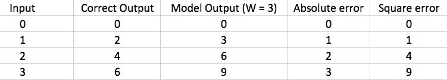

1.  正如你所看到的，通过随机初始化权重（*W = 3*），我们得到了 0、3、6 和 9 的输出。

1.  误差是通过将正确输出的列减去模型输出的列来计算的。平方误差实际上就是每个误差项与自身相乘。通常最好使用平方误差，因为它消除了误差项中的负值。

1.  模型随后意识到，为了最小化误差，需要更新权重。

1.  假设在下一次迭代中，模型将其权重更新为*W = 4*。这将导致以下输出：

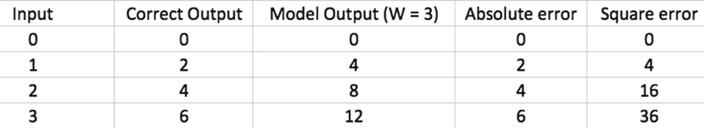

1.  模型现在意识到，通过增加权重到*W = 4*，实际上误差增加了。因此，在下一次迭代中，模型通过将权重减小到*W = 2*来更新权重，从而得到实际/正确的输出。

1.  请注意，在这个简单的情况下，当增加权重时，误差增加，当减少权重时，误差减少，如下所示：

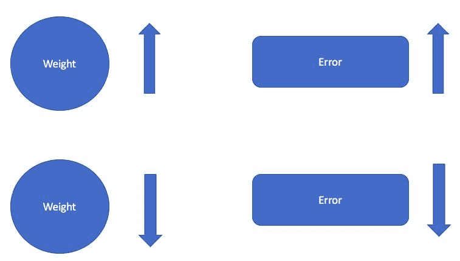

1.  在实际的神经网络中，每次迭代期间都会执行多次这样的权重更新，直到模型收敛到实际/正确的输出。

# 还有更多...

如前面的情况所示，当增加权重时，误差增加，但当减少权重时，误差减少。但这并不总是成立。网络使用以下图表来确定如何更新权重以及何时停止更新它们：

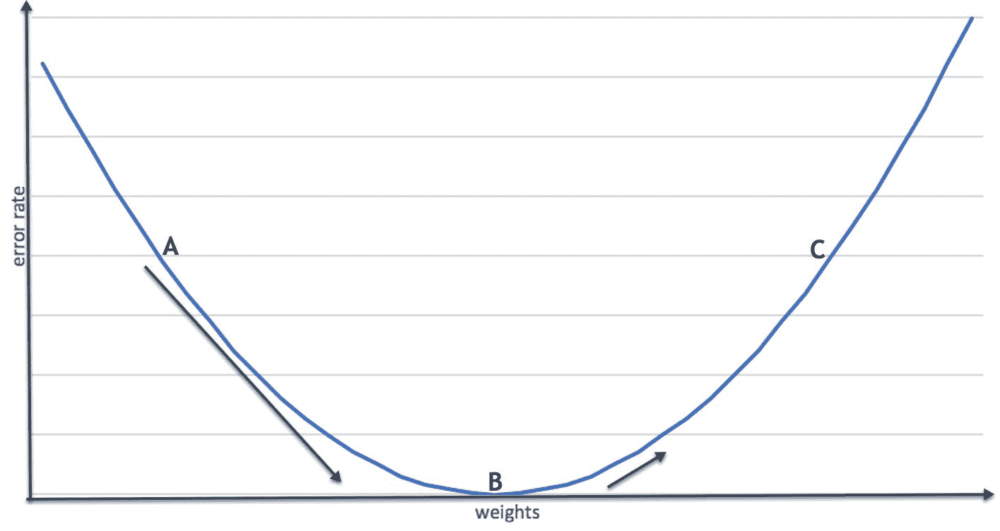

+   让权重在第一次迭代开始时初始化为零。当网络通过从点 A 到 B 增加权重时，误差率开始减少。

+   一旦权重达到 B 点，误差率就变得最小。网络不断跟踪误差率。

+   进一步增加从点 B 到点 C 的权重后，网络意识到错误率再次开始增加。因此，网络停止更新其权重，并恢复到点 B 的权重，因为它们是最佳的。

+   在下一个场景中，考虑一种情况，即权重被随机初始化为某个值（比如说，点 C），如下图所示：

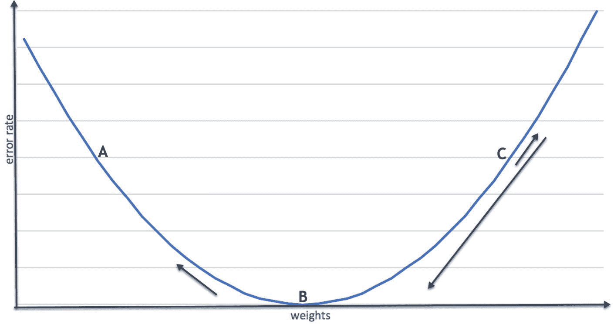

+   进一步增加这些随机权重后，错误也增加了（从点 C 开始并远离点 B，图中的小箭头表示）。

+   网络意识到错误增加，并开始从点 C 减小权重，以使错误减少（在图中从点 C 向点 B 移动的长箭头表示）。这种权重减少会一直持续，直到错误达到最小值（图中的点 B）。

+   网络继续在达到点 B 后进一步更新其权重（在图中从点 B 远离并向点 A 移动的箭头表示）。然后它意识到错误再次增加。因此，它停止权重更新，并恢复到给出最小错误值的权重（即点 B 处的权重）。

+   这是神经网络在反向传播后执行权重更新的方式。这种权重更新是基于动量的。它依赖于在每次迭代期间网络中每个神经元计算的梯度，如下图所示：

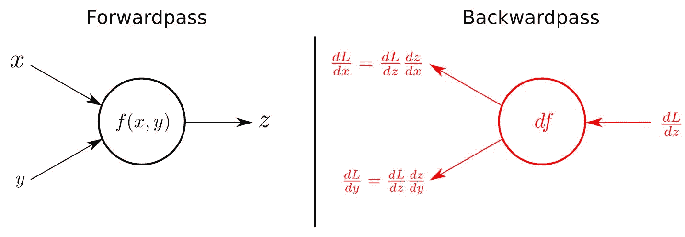

基本上，每次输入流入神经元时，都会针对输出计算每个输入的梯度。链式法则用于在反向传播的后向传递期间计算梯度。

# 另请参阅

可以在以下链接找到反向传播背后的数学详细解释：

+   [`mattmazur.com/2015/03/17/a-step-by-step-backpropagation-example/`](https://mattmazur.com/2015/03/17/a-step-by-step-backpropagation-example/)

+   [`becominghuman.ai/back-propagation-is-very-simple-who-made-it-complicated-97b794c97e5`](https://becominghuman.ai/back-propagation-is-very-simple-who-made-it-complicated-97b794c97e5c)

Andrej Karpathy 的博客中有大量关于递归神经网络的有用信息。以下是一个解释它们不合理有效性的链接：

+   [`karpathy.github.io/2015/05/21/rnn-effectiveness/`](http://karpathy.github.io/2015/05/21/rnn-effectiveness/)

# 痛点＃1 - 梯度消失问题

递归神经网络非常适用于涉及序列数据的任务。然而，它们也有缺点。本节将重点讨论其中一个缺点，即**梯度消失问题**。

# 准备工作

梯度消失问题的名称源于在反向传播步骤中，一些梯度消失或变为零。从技术上讲，这意味着在网络的反向传播过程中没有错误项被向后传播。当网络变得更深更复杂时，这就成为了一个问题。

# 如何做...

本节将描述递归神经网络中梯度消失问题的发生方式：

+   在使用反向传播时，网络首先计算错误，这只是模型输出减去实际输出的平方（如平方误差）。

+   使用这个错误，模型然后计算错误相对于权重变化的变化（de/dw）。

+   计算得到的导数乘以学习率  得到 w，这就是权重的变化。术语 w 被添加到原始权重上，以将它们更新为新的权重。

+   假设 de/dw（错误相对于权重的梯度或变化率）的值远小于 1，那么该术语乘以学习率  （始终远小于 1）得到一个非常小的可忽略的数字。

+   这是因为在反向传播过程中，权重更新仅对最近的时间步准确，而在通过以前的时间步进行反向传播时，准确性会降低，并且当权重更新通过许多时间步回溯时，这种准确性几乎变得微不足道。

+   在某些情况下，句子可能非常长，神经网络试图预测句子中的下一个单词。它基于句子的上下文进行预测，因此需要来自许多先前时间步的信息（这些被称为长期依赖）。网络需要通过的先前时间步数随着句子长度的增加而增加。在这种情况下，循环网络无法记住过去许多时间步的信息，因此无法进行准确的预测。

+   当出现这种情况时，网络需要进行更多复杂的计算，因此迭代次数大大增加，同时误差项的变化减少（随着时间的推移）并且权重的变化变得微不足道。因此，新的或更新的权重几乎等于先前的权重。

+   由于没有发生权重更新，网络停止学习或无法更新其权重，这是一个问题，因为这将导致模型过度拟合数据。

+   整个过程如下图所示：

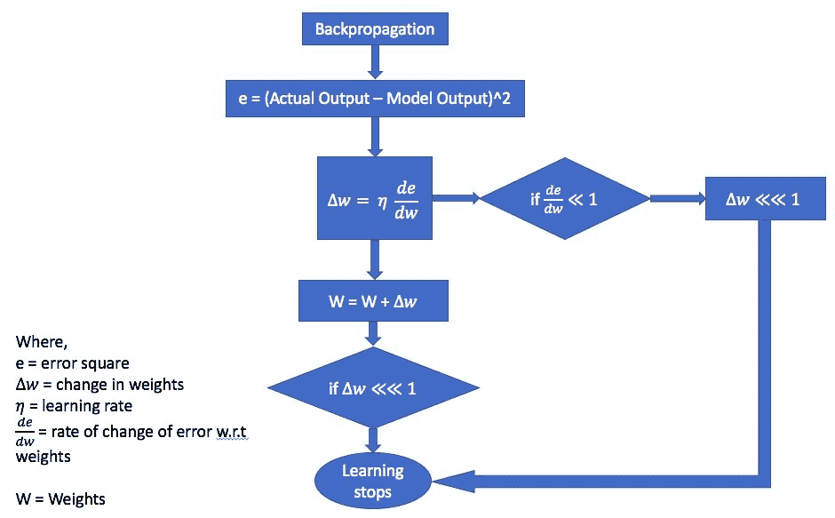

# 它是如何工作的...

本节将描述梯度消失问题的一些后果：

1.  当我们使用一些基于梯度的优化技术训练神经网络模型时，就会出现这个问题。

1.  通常，增加更多的隐藏层倾向于使网络能够学习更复杂的任意函数，从而在预测未来结果方面做得更好。深度学习由于具有大量的隐藏层（从 10 到 200 个），因此产生了很大的影响。现在可以理解复杂的序列数据，并执行诸如语音识别、图像分类、图像字幕等任务。

1.  由前述步骤引起的问题是，在某些情况下，梯度变得非常小，几乎消失，这反过来阻止权重在未来时间步骤中更新其值。

1.  在最坏的情况下，这可能导致网络的训练过程停止，这意味着网络停止通过训练步骤学习不同的特征。

1.  反向传播的主要思想是，它允许我们作为研究人员监视和理解机器学习算法如何处理和学习各种特征。当梯度消失时，就不可能解释网络中发生了什么，因此识别和调试错误变得更加具有挑战性。

# 还有更多...

以下是解决梯度消失问题的一些方法：

+   一种方法在一定程度上克服这个问题是使用 ReLU 激活函数。它计算函数*f(x)=max(0,x)（即，激活函数简单地将输出的较低级别阈值设为零），并防止网络产生负梯度。

+   另一种克服这个问题的方法是对每个层进行无监督训练，然后通过反向传播对整个网络进行微调，就像 Jürgen Schmidhuber 在他对神经网络中多层次层次结构的研究中所做的那样。该论文的链接在下一节中提供。

+   解决这个问题的第三种方法是使用 LSTM（长短期记忆）单元或 GRUs（门控循环单元），这些是特殊类型的 RNN。

# 另请参阅

以下链接提供了对梯度消失问题的更深入描述，以及一些解决该问题的方法：

+   [`ayearofai.com/rohan-4-the-vanishing-gradient-problem-ec68f76ffb9b`](https://ayearofai.com/rohan-4-the-vanishing-gradient-problem-ec68f76ffb9b)

+   [`www.cs.toronto.edu/~rgrosse/courses/csc321_2017/readings/L15%20Exploding%20and%20Vanishing%20Gradients.pdf`](http://www.cs.toronto.edu/~rgrosse/courses/csc321_2017/readings/L15%20Exploding%20and%20Vanishing%20Gradients.pdf)

+   [`people.idsia.ch/~juergen/cvpr2012.pdf`](http://people.idsia.ch/~juergen/cvpr2012.pdf)

# 痛点＃2 - 爆炸梯度问题

递归神经网络的另一个缺点是爆炸梯度问题。这与梯度消失问题类似，但完全相反。有时在反向传播过程中，梯度会爆炸成异常大的值。与梯度消失问题一样，爆炸梯度问题发生在网络架构变得更深时。

# 准备工作

爆炸梯度问题的名称源于反向传播步骤中一些梯度消失或变为零的事实。从技术上讲，这意味着在网络的反向传播过程中没有误差项向后传播。当网络变得更深更复杂时，这就成为了一个问题。

# 如何做...

本节将描述递归神经网络中的爆炸梯度问题：

+   爆炸梯度问题与梯度消失问题非常相似，但完全相反。

+   当递归神经网络中出现长期依赖时，误差项向后传播时有时会爆炸或变得非常大。

+   这个误差项乘以学习率的结果是一个极端大的w。这导致产生的新权重看起来与以前的权重非常不同。这被称为爆炸梯度问题，因为梯度的值变得太大。

+   爆炸梯度问题以算法方式在以下图表中进行了说明：

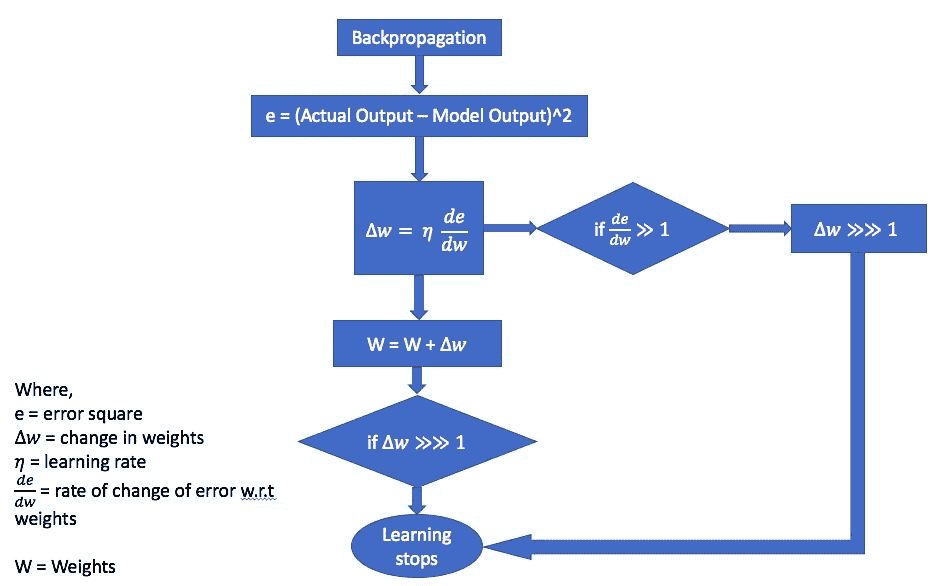

# 工作原理...

由于神经网络使用基于梯度的优化技术来学习数据中存在的特征，因此必须保留这些梯度，以便网络根据梯度的变化计算误差。本节将描述爆炸梯度问题在递归神经网络中是如何发生的：

+   在使用反向传播时，网络首先计算误差，这只是模型输出减去实际输出的平方（如平方误差）。

+   使用这个误差，模型然后计算了相对于权重变化的误差变化（de/dw）。

+   计算得到的导数乘以学习率得到w，这只是权重的变化。项w 被添加到原始权重上，以将它们更新为新的权重。

+   假设 de/dw（误差相对于权重的梯度或变化率）的值大于 1，那么该项乘以学习率将得到一个非常非常大的数字，对于网络在进一步优化权重时是毫无用处的，因为权重已不再处于相同的范围内。

+   这是因为在反向传播过程中，权重更新仅对最近的时间步准确，而在通过以前的时间步进行反向传播时，这种准确性会降低，并且当权重更新通过许多时间步回溯时几乎变得无关紧要。

+   网络需要通过的以前时间步数随着输入数据中序列数量的增加而增加。在这种情况下，递归网络无法记住过去许多时间步的信息，因此无法准确预测未来时间步。

+   当出现这种情况时，网络需要进行更多复杂的计算，因此迭代次数大大增加，错误项的变化超过 1，权重（w）的变化激增。结果，与先前的权重相比，新的或更新的权重完全超出范围。

+   由于没有发生权重更新，网络停止学习或无法在指定范围内更新其权重，这是一个问题，因为这将导致模型过度拟合数据。

# 还有更多...

以下是解决梯度爆炸问题的一些方法：

+   可以应用某些梯度裁剪技术来解决梯度爆炸的问题。

+   另一种预防方法是使用截断的时间反向传播，而不是从最后一个时间步（或输出层）开始反向传播，我们可以选择一个较小的时间步（比如 15）开始反向传播。这意味着网络将一次只反向传播最后的 15 个时间步，并且只学习与这 15 个时间步相关的信息。这类似于将小批量数据馈送到网络中，因为在大型数据集的情况下，计算每个数据集元素的梯度将变得过于昂贵。

+   防止梯度爆炸的最后一种选择是监控它们并相应地调整学习率。

# 另请参阅

可以在以下链接找到有关消失和爆炸梯度问题的更详细解释：

+   [`neuralnetworksanddeeplearning.com/chap5.html`](http://neuralnetworksanddeeplearning.com/chap5.html)

+   [`www.dlology.com/blog/how-to-deal-with-vanishingexploding-gradients-in-keras/`](https://www.dlology.com/blog/how-to-deal-with-vanishingexploding-gradients-in-keras/)

+   [`machinelearningmastery.com/exploding-gradients-in-neural-networks/`](https://machinelearningmastery.com/exploding-gradients-in-neural-networks/)

# LSTMs 的顺序工作

**长短期记忆单元**（**LSTM**）单元只是相对于循环网络而言稍微更先进的架构。LSTMs 可以被认为是一种具有学习顺序数据中存在的长期依赖关系能力的特殊类型的循环神经网络。其主要原因是 LSTMs 包含内存，并且能够存储和更新其单元内的信息，而不像循环神经网络那样。

# 准备好了

长短期记忆单元的主要组成部分如下：

+   输入门

+   遗忘门

+   更新门

这些门中的每一个都由一个 S 形层和一个逐点乘法操作组成。S 形层输出介于零和一之间的数字。这些值描述了每个组件的信息有多少被允许通过相应的门。值为零意味着门不允许任何信息通过，而值为一意味着门允许所有信息通过。

了解 LSTM 单元的最佳方法是通过计算图，就像循环神经网络的情况一样。

LSTMs 最初是由 Sepp Hochreiter 和 Jurgen Schmidhuber 于 1997 年开发的。以下是他们发表的论文链接：

+   [`www.bioinf.jku.at/publications/older/2604.pdf`](http://www.bioinf.jku.at/publications/older/2604.pdf)

# 如何做...

本节将描述单个 LSTM 单元的内部组件，主要是单元内部存在的三个不同门。一系列这样的单元堆叠在一起形成一个 LSTM 网络：

1.  LSTMs 也像 RNNs 一样具有链式结构。标准 RNN 基本上是重复单元的模块，如简单函数（例如 tanh）。

1.  与 RNN 相比，由于每个单元中存在内存，LSTM 具有比 RNN 更长时间地保留信息的能力。这使它们能够在输入序列的早期阶段学习重要信息，并且还赋予了它们在每个时间步的决策中产生重要影响的能力。

1.  通过能够从输入序列的早期阶段存储信息，LSTM 能够积极地保留可以通过时间和层进行反向传播的错误，而不是让该错误消失或爆炸。

1.  LSTM 能够在许多时间步长上学习信息，因此通过保留通过这些层进行反向传播的错误，具有更密集的层架构。

1.  细胞结构称为**“门”**赋予了 LSTM 保留信息、添加信息或从**细胞状态**中删除信息的能力。

1.  以下图示了 LSTM 的结构。在尝试理解 LSTM 时的关键特征在于理解 LSTM 网络架构和细胞状态，可以在这里进行可视化：

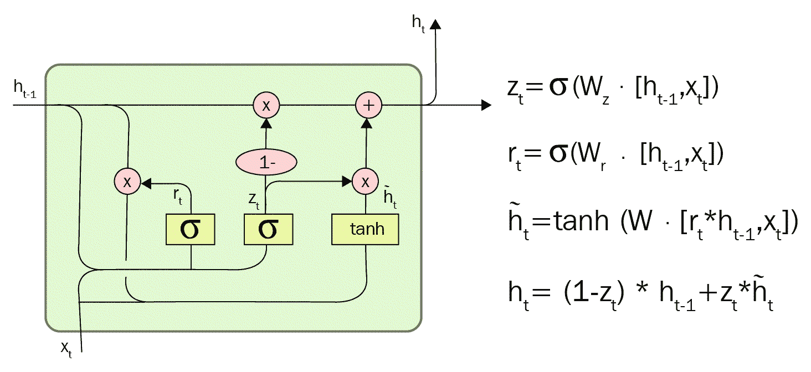

1.  在前面的图中，*x[t]*和*h[t-1]*是细胞的两个输入。*x*[*t*]是当前时间步的输入，而*h[t-1]*是上一个时间步的输入（即上一个时间步的细胞的输出）。除了这两个输入，我们还有*h*[, ]，它是经过门控循环单元（LSTM）细胞对这两个输入进行操作后的当前输出（即时间步 t）。

1.  在前面的图中，r[t]表示从输入门中出现的输出，它接受*h*[*t-1*]和*x[t]*的输入，将这些输入与其权重矩阵*W[z]*相乘，并通过 S 形激活函数传递。

1.  类似地，术语*z[t]*表示从遗忘门中出现的输出。这个门有一组权重矩阵（由*W[r]*表示），这些权重矩阵特定于这个特定的门，并控制门的功能。

1.  最后，还有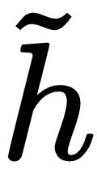[t]，它是从更新门中出现的输出。在这种情况下，有两个部分。第一部分是一个称为**输入门层**的 S 形层，其主要功能是决定要更新哪些值。下一层是一个 tanh 层。这一层的主要功能是创建一个包含可以添加到细胞状态中的新值的向量或数组。

# 它是如何工作的...

一系列 LSTM 细胞/单元的组合形成了 LSTM 网络。这种网络的架构如下图所示：

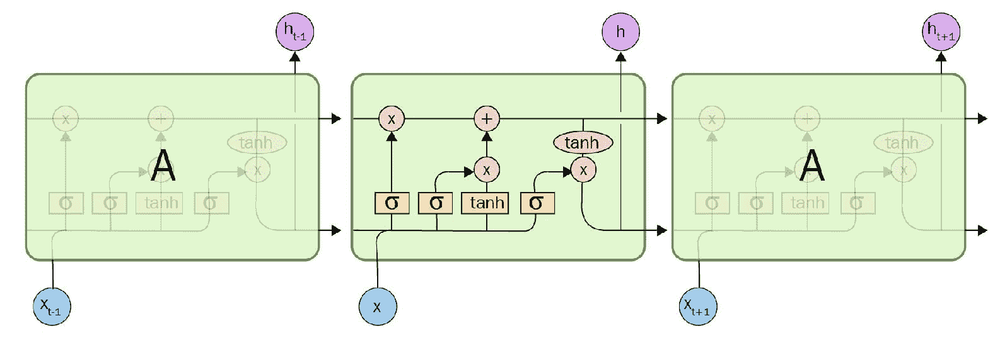

1.  在前面的图中，完整的 LSTM 细胞由***“A”***表示。细胞接受输入序列的当前输入（*x**[i]*），并产生（*h**[i]*），这实际上就是当前隐藏状态的输出。然后将此输出作为下一个 LSTM 细胞的输入。

1.  LSTM 细胞比 RNN 细胞稍微复杂一些。RNN 细胞只有一个作用于当前输入的功能/层，而 LSTM 细胞有三个层，即控制细胞在任何给定时间点流动的三个门。

1.  细胞的行为很像计算机中的硬盘内存。因此，细胞具有允许在其细胞状态内写入、读取和存储信息的能力。细胞还会决定存储哪些信息，以及何时允许读取、写入和擦除信息。这是通过相应地打开或关闭门来实现的。

1.  LSTM 细胞中的门是模拟的，与当今计算机中的数字存储系统形成对比。这意味着门只能通过 S 形函数的逐元素乘法来控制，产生介于 0 和 1 之间的概率值。高值将导致门保持打开，而低值将导致门保持关闭。

1.  模拟系统在神经网络操作方面比数字系统更具优势，因为它们是可微分的。这使得模拟系统更适合像反向传播这样主要依赖于梯度的任务。

1.  门传递信息或阻止信息，或者只让部分信息根据其强度和重要性流过它们。每一次时间步骤，信息都会通过特定于每个门的权重矩阵集合进行过滤。因此，每个门都完全控制如何对接收到的信息进行操作。

1.  与每个门相关的权重矩阵，如调制输入和隐藏状态的权重，都是根据递归网络的学习过程和梯度下降进行调整的。

1.  第一个门被称为“遗忘门”，它控制从上一个状态中保留哪些信息。该门将上一个细胞的输出（*h**[t]** - 1*）作为其输入，以及当前输入（*x**[t]*），并应用 sigmoid 激活（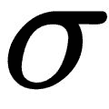）以产生每个隐藏单元的 0 到 1 之间的输出值。然后进行与当前状态的逐元素乘法（在前面图表中的第一个操作中说明）。

1.  第二个门被称为“更新门”，其主要功能是根据当前输入更新细胞状态。该门将与遗忘门的输入相同的输入（*h**[t-1]*和*x**[t]*）传递到一个 sigmoid 激活层（），然后经过 tanh 激活层，并对这两个结果进行逐元素乘法。接下来，将结果与当前状态进行逐元素加法（在前面图表中的第二个操作中说明）。

1.  最后，有一个输出门，它控制传递到相邻细胞的信息和信息量，以作为下一个时间步骤的输入。当前细胞状态通过 tanh 激活层传递，并在通过 sigmoid 层（）进行此操作后，与细胞输入（*h**[t-1]*和*x**[t]*）进行逐元素乘法。

1.  更新门的行为就像细胞决定输出到下一个细胞的过滤器。这个输出 h[t]然后传递给下一个 LSTM 细胞作为它的输入，并且如果许多 LSTM 细胞堆叠在一起，也传递给上面的层。

# 还有更多...

与前馈网络和循环神经网络相比，LSTM 是一个重大的飞跃。人们可能会想知道未来的下一个重大进步是什么，甚至可能是什么。许多研究人员认为，“注意力”是人工智能领域的下一个重大进步。随着每天数据量的急剧增长，处理每一位数据变得不可能。这就是注意力可能成为潜在的游戏改变者的地方，使网络只关注高优先级或感兴趣的数据或区域，并忽略无用的信息。例如，如果一个 RNN 被用来创建图像字幕引擎，它将只选择图像的一部分来关注，以便输出每个单词。

徐等人在 2015 年的最新论文正是这样做的。他们探索了在 LSTM 细胞中添加注意力。阅读这篇论文可以是学习神经网络中使用注意力的好起点。在各种任务中使用注意力已经取得了一些良好的结果，目前正在对该主题进行更多的研究。徐等人的论文可以通过以下链接找到：

[`arxiv.org/pdf/1502.03044v2.pdf`](https://arxiv.org/pdf/1502.03044v2.pdf)

注意力并不是 LSTM 的唯一变体。一些其他活跃的研究是基于格子 LSTM 的利用，正如 Kalchbrenner 等人在其论文中使用的那样，链接在：[`arxiv.org/pdf/1507.01526v1.pdf`](https://arxiv.org/pdf/1507.01526v1.pdf)。

# 另请参阅

关于生成网络中的 RNN 和 LSTM 的其他有用信息和论文可以通过访问以下链接找到：

+   [`www.deeplearningbook.org/contents/rnn.html`](http://www.deeplearningbook.org/contents/rnn.html)

+   [`arxiv.org/pdf/1502.04623.pdf`](https://arxiv.org/pdf/1502.04623.pdf)

+   [`arxiv.org/pdf/1411.7610v3.pdf`](https://arxiv.org/pdf/1411.7610v3.pdf)

+   [`arxiv.org/pdf/1506.02216v3.pdf`](https://arxiv.org/pdf/1506.02216v3.pdf)
