# 第五章：使用 Spark ML 预测消防部门呼叫

在本章中，将涵盖以下内容：

+   下载旧金山消防部门呼叫数据集

+   识别逻辑回归模型的目标变量

+   为逻辑回归模型准备特征变量

+   应用逻辑回归模型

+   评估逻辑回归模型的准确性

# 介绍

分类模型是预测定义的分类结果的一种流行方式。我们经常使用分类模型的输出。每当我们去电影院看电影时，我们都想知道这部电影是否被认为是正确的？数据科学社区中最流行的分类模型之一是逻辑回归。逻辑回归模型产生的响应由 S 形函数激活。S 形函数使用模型的输入并产生一个在 0 和 1 之间的输出。该输出通常以概率分数的形式呈现。许多深度学习模型也用于分类目的。通常会发现逻辑回归模型与深度学习模型一起执行，以帮助建立深度学习模型的基线。S 形激活函数是深度学习中使用的许多激活函数之一，用于产生概率输出。我们将利用 Spark 内置的机器学习库构建一个逻辑回归模型，该模型将预测旧金山消防部门的呼叫是否实际与火灾有关，而不是其他事件。

# 下载旧金山消防部门呼叫数据集

旧金山市在整个地区收集消防部门的服务呼叫记录做得非常好。正如他们的网站上所述，每条记录包括呼叫编号、事件编号、地址、单位标识符、呼叫类型和处理结果。包含旧金山消防部门呼叫数据的官方网站可以在以下链接找到：

[`data.sfgov.org/Public-Safety/Fire-Department-Calls-for-Service/nuek-vuh3`](https://data.sfgov.org/Public-Safety/Fire-Department-Calls-for-Service/nuek-vuh3)

有关数据集的一些一般信息，包括列数和行数，如下截图所示：

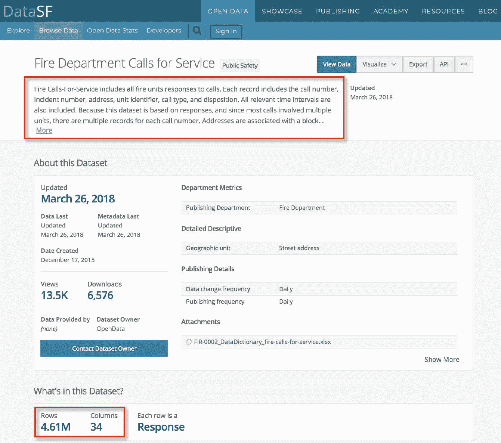

这个当前数据集，更新于 2018 年 3 月 26 日，大约有 461 万行和 34 列。

# 准备工作

数据集以`.csv`文件的形式可供下载，并可在本地机器上下载，然后导入 Spark。

# 操作步骤如下：

本节将介绍下载和导入`.csv`文件到我们的 Jupyter 笔记本的步骤。

1.  通过选择导出然后 CSV 从网站下载数据集，如下截图所示： 

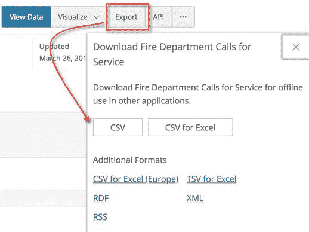

1.  如果还没有这样做，请将下载的数据集命名为`Fire_Department_Calls_for_Service.csv`

1.  将数据集保存到任何本地目录，尽管理想情况下应该保存到包含本章中将使用的 Spark 笔记本的相同文件夹中，如下截图所示：

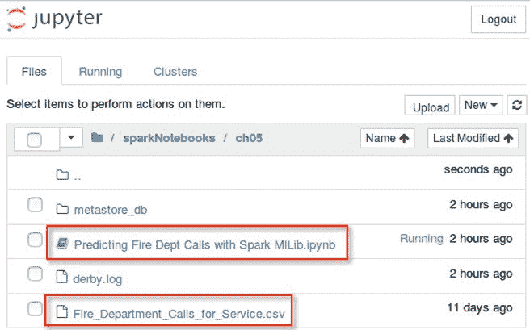

1.  一旦数据集已保存到与笔记本相同的目录中，执行以下`pyspark`脚本将数据集导入 Spark 并创建一个名为`df`的数据框：

```scala
from pyspark.sql import SparkSession
spark = SparkSession.builder \
                    .master("local") \
                    .appName("Predicting Fire Dept Calls") \
                    .config("spark.executor.memory", "6gb") \
                    .getOrCreate()

df = spark.read.format('com.databricks.spark.csv')\
                    .options(header='true', inferschema='true')\
                    .load('Fire_Department_Calls_for_Service.csv')
df.show(2)
```

# 工作原理如下：

数据集保存在与 Jupyter 笔记本相同的目录中，以便轻松导入到 Spark 会话中。

1.  通过从`pyspark.sql`导入`SparkSession`来初始化本地`pyspark`会话。

1.  通过使用选项`header='true'`和`inferschema='true'`读取 CSV 文件创建一个名为`df`的数据框。

1.  最后，始终最好运行一个脚本来显示已通过数据框导入 Spark 的数据，以确认数据已传输。可以在以下截图中看到该脚本的结果，显示了来自旧金山消防局呼叫的数据集的前两行：

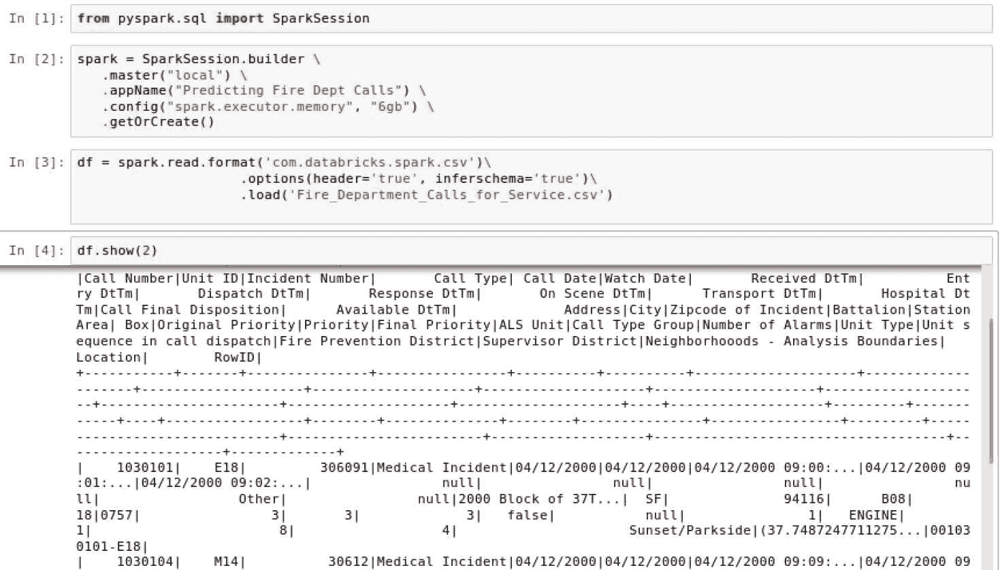

请注意，当我们将文件读入 spark 时，我们使用`.load()`将`.csv`文件拉入 Jupyter 笔记本。对于我们的目的来说，这是可以的，因为我们使用的是本地集群，但如果我们要利用 Hadoop 中的集群，这种方法就行不通了。

# 还有更多...

数据集附带有数据字典，定义了 34 列的标题。可以通过以下链接从同一网站访问此数据字典：

[`data.sfgov.org/api/views/nuek-vuh3/files/ddb7f3a9-0160-4f07-bb1e-2af744909294?download=true&filename=FIR-0002_DataDictionary_fire-calls-for-service.xlsx`](https://data.sfgov.org/api/views/nuek-vuh3/files/ddb7f3a9-0160-4f07-bb1e-2af744909294?download=true&filename=FIR-0002_DataDictionary_fire-calls-for-service.xlsx)

# 另请参阅

旧金山政府网站允许在线可视化数据，可用于进行一些快速数据概要分析。可以通过选择可视化下拉菜单在网站上访问可视化应用程序，如下截图所示：

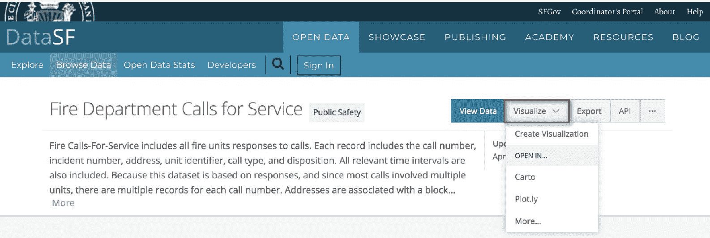

# 识别逻辑回归模型的目标变量

逻辑回归模型作为分类算法运行，旨在预测二进制结果。在本节中，我们将指定数据集中用于预测运营商呼入电话是否与火灾或非火灾事件相关的最佳列。

# 准备就绪

在本节中，我们将可视化许多数据点，这将需要以下操作：

1.  通过在命令行中执行`pip install matplotlib`来确保安装了`matplotlib`。

1.  运行`import matplotlib.pyplot as plt`，并确保通过运行`%matplotlib inline`在单元格中查看图形。

此外，将对`pyspark.sql`中的函数进行一些操作，需要`importing functions as F`。

# 如何做...

本节将介绍如何可视化来自旧金山消防局的数据。

1.  执行以下脚本以对`Call Type Group`列中唯一值进行快速识别：

```scala
df.select('Call Type Group').distinct().show()
```

1.  有五个主要类别：

1.  `警报`。

1.  `潜在危及生命`。

1.  `非危及生命`。

1.  `火`。

1.  `null`。

1.  不幸的是，其中一个类别是`null`值。有必要获取每个唯一值的行计数，以确定数据集中有多少`null`值。执行以下脚本以生成`Call Type Group`列的每个唯一值的行计数：

```scala
df.groupBy('Call Type Group').count().show()
```

1.  不幸的是，有超过 280 万行数据没有与之关联的`呼叫类型组`。这超过了 460 万可用行的 60％。执行以下脚本以查看条形图中空值的不平衡情况：

```scala
df2 = df.groupBy('Call Type Group').count()
graphDF = df2.toPandas()
graphDF = graphDF.sort_values('count', ascending=False)

import matplotlib.pyplot as plt
%matplotlib inline

graphDF.plot(x='Call Type Group', y = 'count', kind='bar')
plt.title('Call Type Group by Count')
plt.show()
```

1.  可能需要选择另一个指标来确定目标变量。相反，我们可以对`Call Type`进行概要分析，以识别与火灾相关的呼叫与所有其他呼叫。执行以下脚本以对`Call Type`进行概要分析：

```scala
df.groupBy('Call Type').count().orderBy('count', ascending=False).show(100)
```

1.  与`Call Type Group`一样，似乎没有任何`null`值。`Call Type`有 32 个唯一类别；因此，它将被用作火灾事件的目标变量。执行以下脚本以标记包含`Fire`的`Call Type`列：

```scala
from pyspark.sql import functions as F
fireIndicator = df.select(df["Call Type"],F.when(df["Call Type"].like("%Fire%"),1)\
                          .otherwise(0).alias('Fire Indicator'))
fireIndicator.show()
```

1.  执行以下脚本以检索`Fire Indicator`的不同计数：

```scala
fireIndicator.groupBy('Fire Indicator').count().show()
```

1.  执行以下脚本以将`Fire Indicator`列添加到原始数据框`df`中：

```scala
df = df.withColumn("fireIndicator",\ 
F.when(df["Call Type"].like("%Fire%"),1).otherwise(0))
```

1.  最后，将`fireIndicator`列添加到数据框`df`中，并通过执行以下脚本进行确认：

```scala
df.printSchema()
```

# 它是如何工作的...

建立成功的逻辑回归模型的关键步骤之一是建立一个二元目标变量，该变量将用作预测结果。本节将介绍选择目标变量背后的逻辑：

1.  通过识别`Call Type Group`的唯一列值来执行潜在目标列的数据概要分析。我们可以查看`Call Type Group`列的唯一值，如下截图所示：

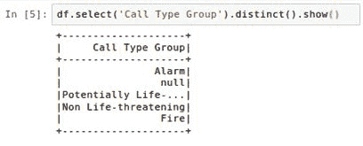

1.  目标是确定`Call Type Group`列中是否存在缺失值，以及如何处理这些缺失值。有时，可以直接删除列中的缺失值，而其他时候可以对其进行处理以填充值。

1.  以下截图显示了存在多少空值：

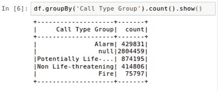

1.  此外，我们还可以绘制存在多少`null`值，以更好地直观感受值的丰富程度，如下截图所示：

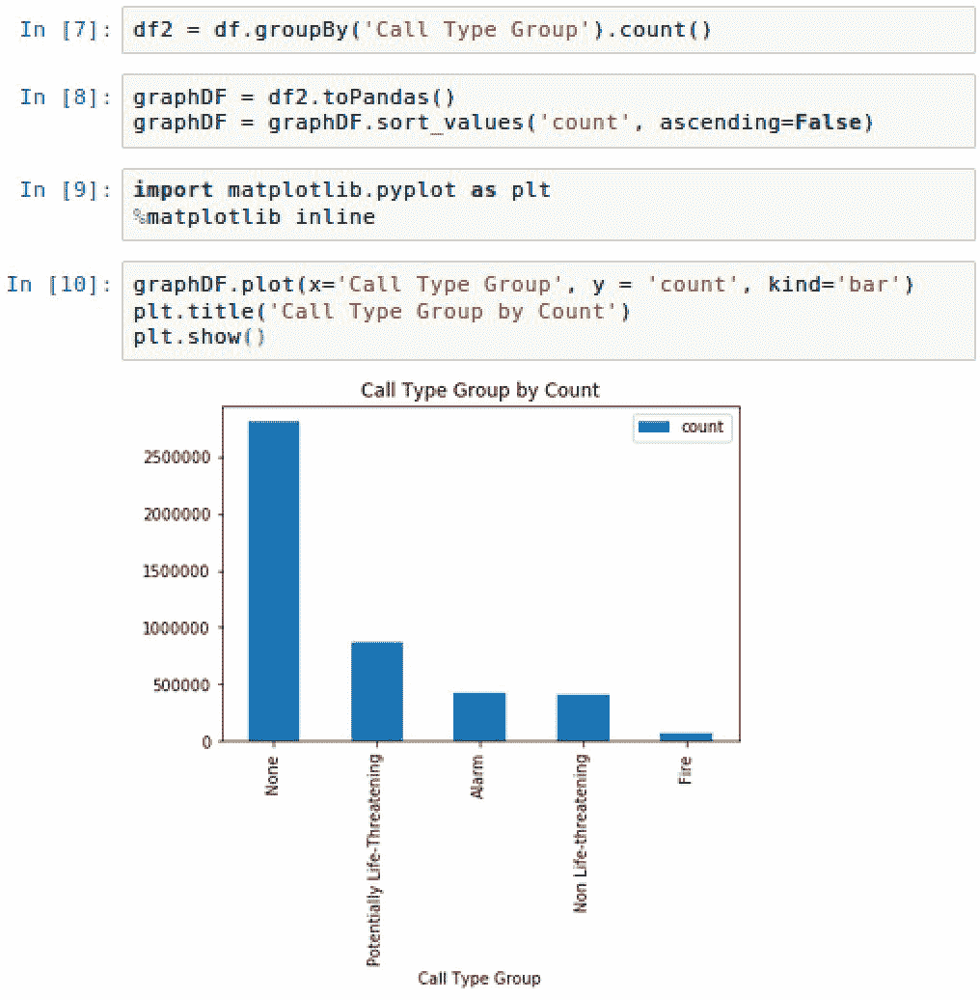

1.  由于`Call Type Group`中有超过 280 万行缺失，如`df.groupBy`脚本和条形图所示，删除所有这些值是没有意义的，因为这超过了数据集的总行数的 60%。因此，需要选择另一列作为目标指示器。

1.  在对`Call Type`列进行数据概要分析时，我们发现 32 个可能值中没有空行。这使得`Call Type`成为逻辑回归模型的更好目标变量候选项。以下是`Call Type`列的数据概要分析截图：

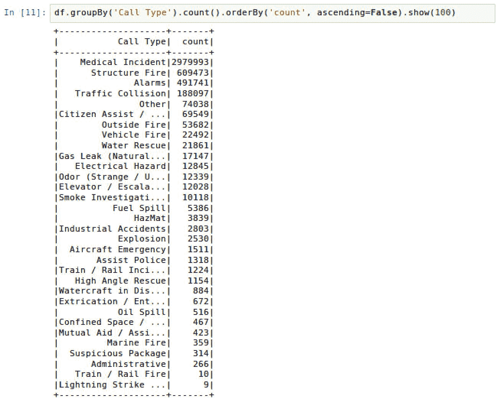

1.  由于逻辑回归在有二元结果时效果最佳，因此使用`withColumn()`操作符在`df`数据框中创建了一个新列，以捕获与火灾相关事件或非火灾相关事件相关的指示器（0 或 1）。新列名为`fireIndicator`，如下截图所示：

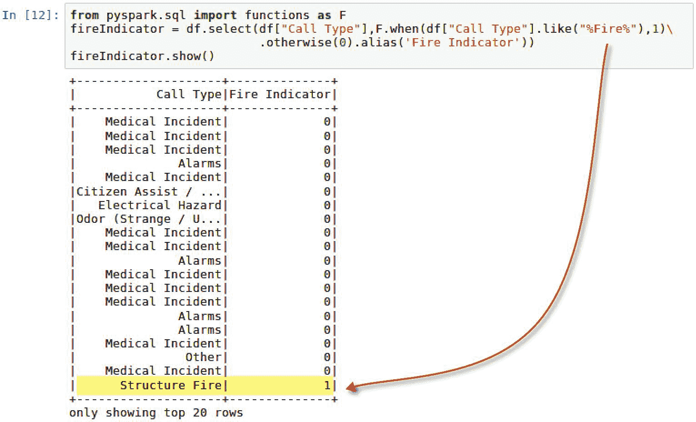

1.  我们可以通过执行`groupBy().count()`来确定火警呼叫与其他呼叫的普遍程度，如下截图所示：

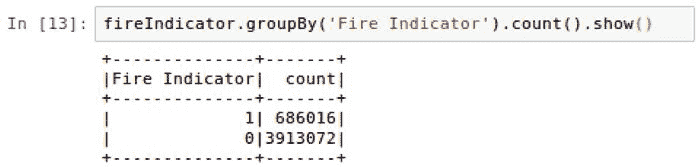

1.  最佳实践是通过执行新修改的数据框的`printSchema()`脚本来确认新列是否已附加到现有数据框。新模式的输出如下截图所示：

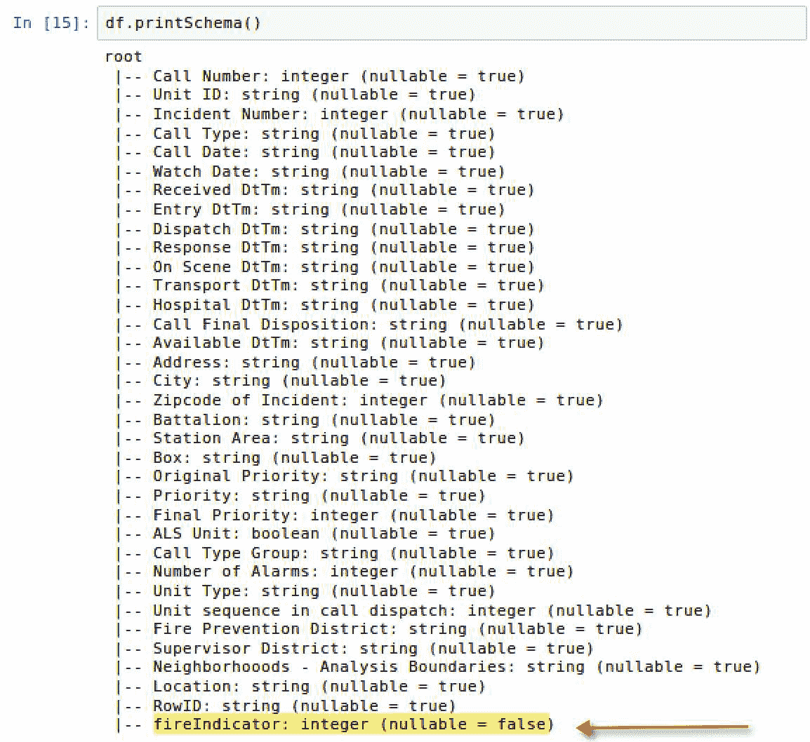

# 还有更多...

在本节中，使用`pyspark.sql`模块进行了一些列操作。`withColumn()`操作符通过添加新列或修改同名现有列来返回新的数据框，或修改现有数据框。这与`withColumnRenamed()`操作符不同，后者也返回新的数据框，但是通过修改现有列的名称为新列。最后，我们需要执行一些逻辑操作，将与`Fire`相关的值转换为 0，没有`Fire`的值转换为 1。这需要使用`pyspark.sql.functions`模块，并将`where`函数作为 SQL 中 case 语句的等价物。该函数使用以下语法创建了一个 case 语句方程：

```scala
CASE WHEN Call Type LIKE %Fire% THEN 1 ELSE 0 END
```

新数据集的结果，`Call Type`和`fireIndicator`两列如下所示：

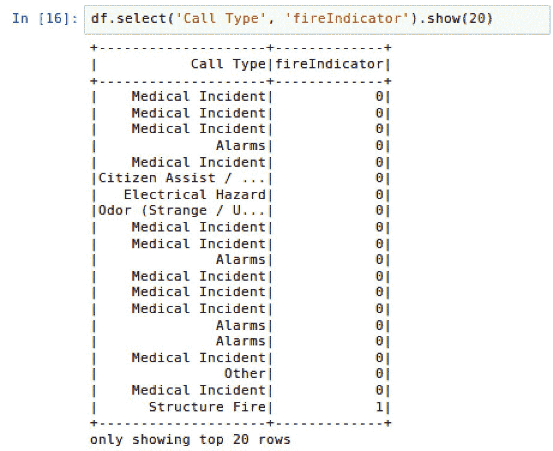

# 另请参阅

要了解更多关于 Spark 中可用的`pyspark.sql`模块的信息，请访问以下网站：

[`spark.apache.org/docs/2.2.0/api/python/pyspark.sql.html`](http://spark.apache.org/docs/2.2.0/api/python/pyspark.sql.html)

# 为逻辑回归模型准备特征变量

在上一节中，我们确定了将用作逻辑回归模型预测结果的目标变量。本节将重点关注确定所有最有助于模型确定目标的特征。这被称为**特征选择**。

# 准备工作

本节将需要从`pyspark.ml.feature`中导入`StringIndexer`。为了确保正确的特征选择，我们需要将字符串列映射到索引列。这将有助于为分类变量生成不同的数值，从而为机器学习模型提供独立变量的计算便利，用于预测目标结果。

# 如何操作...

本节将逐步介绍为我们的模型准备特征变量的步骤。

1.  执行以下脚本来更新数据框`df`，只选择与任何火灾指示无关的字段：

```scala
df = df.select('fireIndicator', 
    'Zipcode of Incident',
    'Battalion',
    'Station Area',
    'Box', 
    'Number of Alarms',
    'Unit sequence in call dispatch',
    'Neighborhooods - Analysis Boundaries',
    'Fire Prevention District',
    'Supervisor District')
df.show(5)
```

1.  下一步是识别数据框中的任何空值并在存在时删除它们。执行以下脚本来识别具有任何空值的行数：

```scala
print('Total Rows')
df.count()
print('Rows without Null values')
df.dropna().count()
print('Row with Null Values')
df.count()-df.dropna().count()
```

1.  有 16,551 行具有缺失值。执行以下脚本来更新数据框以删除所有具有空值的行：

```scala
df = df.dropna()
```

1.  执行以下脚本来检索`fireIndicator`的更新目标计数：

```scala
df.groupBy('fireIndicator').count().orderBy('count', ascending = False).show()
```

1.  从`pyspark.ml.feature`中导入`StringIndexer`类，为特征分配数值，如下脚本所示：

```scala
from pyspark.ml.feature import StringIndexer
```

1.  使用以下脚本为模型创建所有特征变量的 Python 列表：

```scala
column_names = df.columns[1:]
```

1.  执行以下脚本来指定输出列格式`outputcol`，它将从输入列`inputcol`的特征列表中进行`stringIndexed`：

```scala
categoricalColumns = column_names
indexers = []
for categoricalCol in categoricalColumns:
    stringIndexer = StringIndexer(inputCol=categoricalCol, outputCol=categoricalCol+"_Index")
    indexers += [stringIndexer]
```

1.  执行以下脚本创建一个`model`，用于`fit`输入列并为现有数据框`df`生成新定义的输出列：

```scala
models = []
for model in indexers:
    indexer_model = model.fit(df)
    models+=[indexer_model]

for i in models:
    df = i.transform(df)
```

1.  执行以下脚本来定义数据框`df`中将用于模型的特征的最终选择：

```scala
df = df.select(
          'fireIndicator',
          'Zipcode of Incident_Index',
          'Battalion_Index',
          'Station Area_Index',
          'Box_Index',
          'Number of Alarms_Index',
          'Unit sequence in call dispatch_Index',
          'Neighborhooods - Analysis Boundaries_Index',
          'Fire Prevention District_Index',
          'Supervisor District_Index')
```

# 工作原理...

本节将解释为我们的模型准备特征变量的步骤背后的逻辑。

1.  只选择数据框中真正与火灾指示无关的指标，以贡献于预测结果的逻辑回归模型。执行此操作的原因是为了消除数据集中可能已经显示预测结果的任何潜在偏见。这最小化了人为干预最终结果。更新后的数据框的输出可以在下面的截图中看到：

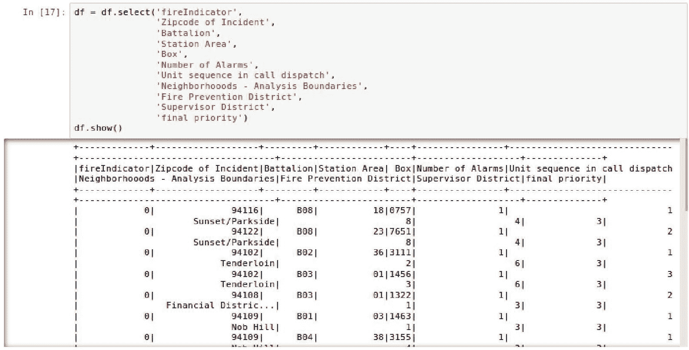

请注意，列`邻里-分析边界`在我们提取的数据中原本拼写错误。出于连续性目的，我们将继续使用拼写错误。但是，可以使用 Spark 中的`withColumnRenamed()`函数来重命名列名。

1.  最终选择的列如下所示：

+   `火灾指示`

+   `事故邮政编码`

+   `大队`

+   `站点区域`

+   `箱`

+   `警报数量`

+   `呼叫调度中的单位序列`

+   `邻里-分析边界`

+   `消防预防区`

+   `监管区`

1.  选择这些列是为了避免我们建模中的数据泄漏。数据泄漏在建模中很常见，可能导致无效的预测模型，因为它可能包含直接由我们试图预测的结果产生的特征。理想情况下，我们希望包含真正与结果无关的特征。有几列似乎是有泄漏的，因此从我们的数据框和模型中删除了这些列。

1.  识别并删除所有具有缺失或空值的行，以便在不夸大或低估关键特征的情况下获得模型的最佳性能。可以计算并显示具有缺失值的行的清单，如下脚本所示，数量为 16,551：

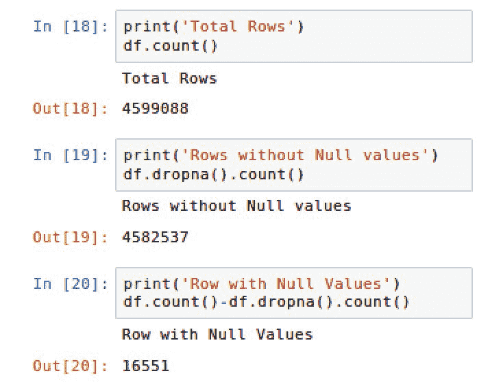

1.  我们可以看一下与火灾相关的呼叫频率与非火灾相关的呼叫频率，如下截图所示：

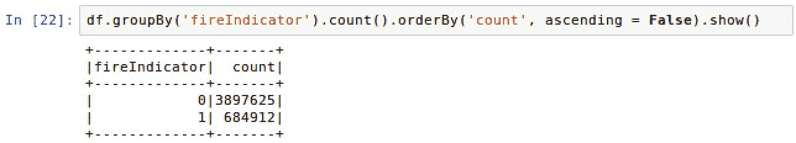

1.  导入`StringIndexer`以帮助将几个分类或字符串特征转换为数字值，以便在逻辑回归模型中进行计算。特征的输入需要以向量或数组格式，这对于数字值是理想的。可以在以下屏幕截图中看到将在模型中使用的所有特征的列表：

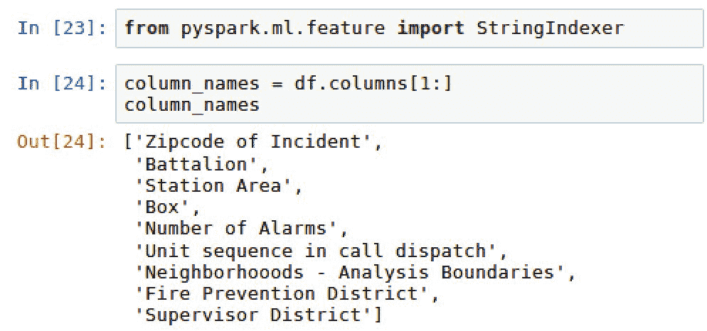

1.  为每个分类变量构建了一个索引器，指定了模型中将使用的输入（`inputCol`）和输出（`outputCol`）列。数据框中的每一列都会被调整或转换，以重新构建一个具有更新索引的新输出，范围从 0 到该特定列的唯一计数的最大值。新列在末尾附加了`_Index`。在创建更新的列的同时，原始列仍然可在数据框中使用，如下屏幕截图所示：

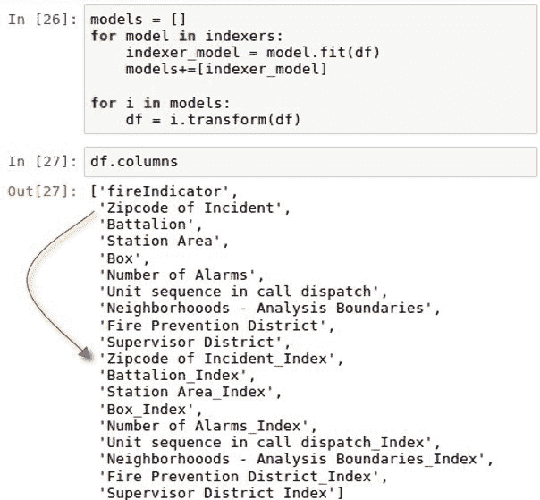

1.  我们可以查看其中一个新创建的列，并将其与原始列进行比较，以查看字符串是如何转换为数字类别的。以下屏幕截图显示了`Neighborhooods - Analysis Boundaries`与`Neighborhooods - Analysis Boundaries_Index`的比较：

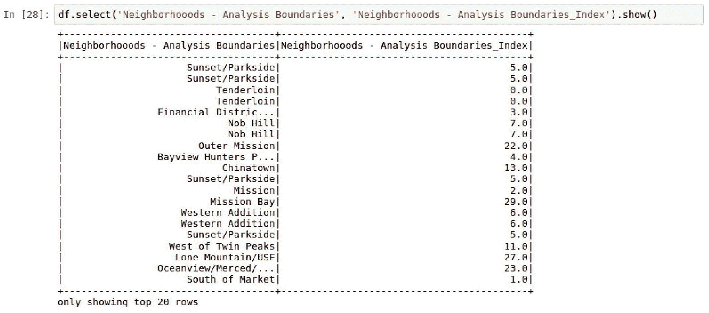

1.  然后，数据框被修剪以仅包含数字值，并删除了转换的原始分类变量。非数字值从建模的角度来看不再有意义，并且从数据框中删除。

1.  打印出新列以确认数据框的每个值类型都是双精度或整数，如下屏幕截图所示：

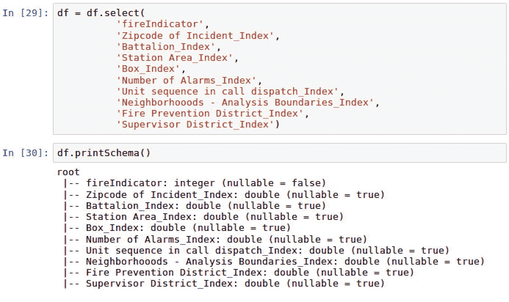

# 还有更多...

最终查看新修改的数据框将只显示数字值，如下屏幕截图所示：

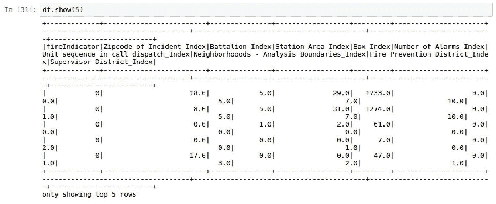

# 另请参阅

要了解更多关于`StringIndexer`的信息，请访问以下网站：[`spark.apache.org/docs/2.2.0/ml-features.html#stringindexer`](https://spark.apache.org/docs/2.2.0/ml-features.html#stringindexer)。

# 应用逻辑回归模型

现在已经准备好将模型应用于数据框。

# 准备工作

本节将重点介绍一种非常常见的分类模型，称为**逻辑回归**，这将涉及从 Spark 中导入以下内容：

```scala
from pyspark.ml.feature import VectorAssembler
from pyspark.ml.evaluation import BinaryClassificationEvaluator
from pyspark.ml.classification import LogisticRegression
```

# 如何做...

本节将介绍应用我们的模型和评估结果步骤。

1.  执行以下脚本，将数据框中的所有特征变量汇总到名为`features`的列表中：

```scala
features = df.columns[1:]
```

1.  执行以下操作以导入`VectorAssembler`并配置将被分配给特征向量的字段，通过分配`inputCols`和`outputCol`：

```scala
from pyspark.ml.feature import VectorAssembler
feature_vectors = VectorAssembler(
    inputCols = features,
    outputCol = "features")
```

1.  执行以下脚本，将`VectorAssembler`应用于数据框，并使用`transform`函数：

```scala
df = feature_vectors.transform(df)
```

1.  修改数据框，删除除`fireIndicator`和`features`之外的所有列，如下脚本所示：

```scala
df = df.drop( 'Zipcode of Incident_Index',
              'Battalion_Index',
              'Station Area_Index',
              'Box_Index',
              'Number of Alarms_Index',
              'Unit sequence in call dispatch_Index',
              'Neighborhooods - Analysis Boundaries_Index',
              'Fire Prevention District_Index',
              'Supervisor District_Index')
```

1.  修改数据框，将`fireIndicator`重命名为`label`，如下脚本所示：

```scala
df = df.withColumnRenamed('fireIndicator', 'label')
```

1.  将整个数据框`df`分割为 75:25 的训练和测试集，随机种子设置为`12345`，如下脚本所示：

```scala
(trainDF, testDF) = df.randomSplit([0.75, 0.25], seed = 12345)
```

1.  从`pyspark.ml.classification`中导入`LogisticRegression`库，并配置以将数据框中的`label`和`features`合并，然后在训练数据集`trainDF`上拟合，如下脚本所示：

```scala
from pyspark.ml.classification import LogisticRegression
logreg = LogisticRegression(labelCol="label", featuresCol="features", maxIter=10)
LogisticRegressionModel = logreg.fit(trainDF)
```

1.  转换测试数据框`testDF`以应用逻辑回归模型。具有预测得分的新数据框称为`df_predicted`，如下脚本所示：

```scala
df_predicted = LogisticRegressionModel.transform(testDF)
```

# 它是如何工作的...

本节将解释应用我们的模型和评估结果步骤背后的逻辑。

1.  当所有特征被合并为单个向量进行训练时，分类模型的效果最佳。因此，我们通过将所有特征收集到一个名为`features`的列表中开始向量化过程。由于我们的标签是数据框的第一列，我们将其排除，并将其后的每一列作为特征列或特征变量引入。

1.  向量化过程继续，将`features`列表中的所有变量转换为名为`features`的单个向量输出到列中。此过程需要从`pyspark.ml.feature`导入`VectorAssembler`。

1.  应用`VectorAssembler`转换数据框，创建一个名为`features`的新添加列，如下截图所示：

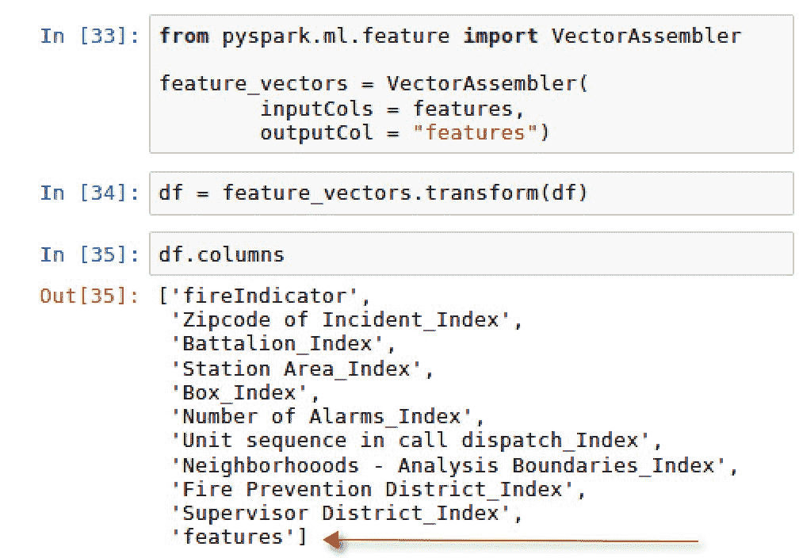

1.  在这一点上，我们在模型中需要使用的唯一列是标签列`fireIndicator`和`features`列。数据框中的所有其他列都可以删除，因为它们在建模过程中将不再需要。

1.  此外，为了帮助逻辑回归模型，我们将名为`fireIndicator`的列更改为`label`。可以在以下截图中看到`df.show()`脚本的输出，其中包含新命名的列：

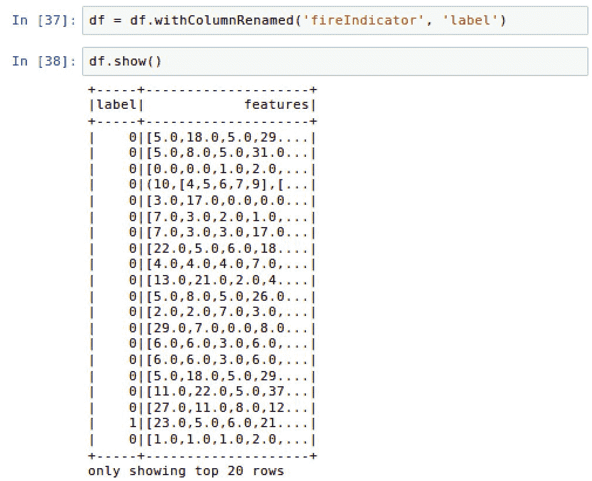

1.  为了最小化过拟合模型，数据框将被拆分为测试和训练数据集，以在训练数据集`trainDF`上拟合模型，并在测试数据集`testDF`上进行测试。设置随机种子为`12345`，以确保每次执行单元格时随机性保持一致。可以在以下截图中看到数据拆分的行数：

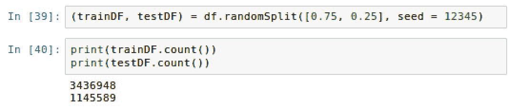

1.  然后，从`pyspark.ml.classification`导入逻辑回归模型`LogisticRegression`，并配置以从与特征和标签相关的数据框中输入适当的列名。此外，逻辑回归模型分配给一个名为`logreg`的变量，然后拟合以训练我们的数据集`trainDF`。

1.  基于测试数据框`testDF`的转换，创建一个名为`predicted_df`的新数据框，一旦逻辑回归模型对其进行评分。该模型为`predicted_df`创建了三个额外的列，基于评分。这三个额外的列是`rawPrediction`、`probability`和`prediction`，如下截图所示：

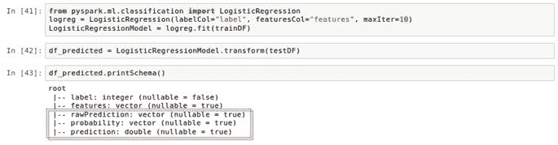

1.  最后，可以对`df_predicted`中的新列进行概要，如下截图所示：

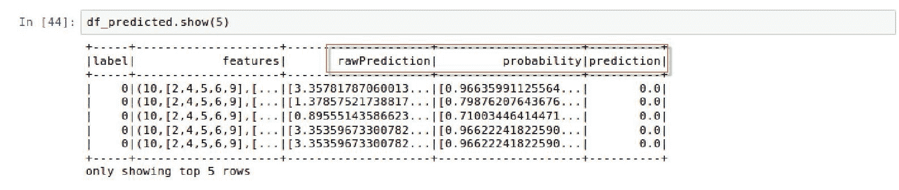

# 还有更多...

需要牢记的一件重要事情是，因为它可能最初看起来有些违反直觉，我们的概率阈值在数据框中设置为 50%。任何概率为 0.500 及以上的呼叫都会被预测为 0.0，任何概率小于 0.500 的呼叫都会被预测为 1.0。这是在管道开发过程中设置的，只要我们知道阈值是多少以及如何分配预测，我们就没问题。

# 另请参阅

要了解有关`VectorAssembler`的更多信息，请访问以下网站：

[`spark.apache.org/docs/latest/ml-features.html#vectorassembler`](https://spark.apache.org/docs/latest/ml-features.html#vectorassembler)

# 评估逻辑回归模型的准确性

现在我们准备好评估预测呼叫是否被正确分类为火灾事件的性能。

# 准备工作

我们将执行模型分析，需要导入以下内容：

+   `from sklearn import metrics`

# 如何做...

本节将逐步介绍评估模型性能的步骤。

1.  使用`.crosstab()`函数创建混淆矩阵，如下脚本所示：

```scala
df_predicted.crosstab('label', 'prediction').show()
```

1.  从`sklearn`导入`metrics`以帮助使用以下脚本衡量准确性：

```scala
from sklearn import metrics
```

1.  为了衡量准确性，从数据框中创建`actual`和`predicted`列的两个变量，使用以下脚本：

```scala
actual = df_predicted.select('label').toPandas()
predicted = df_predicted.select('prediction').toPandas()
```

1.  使用以下脚本计算准确度预测分数：

```scala
metrics.accuracy_score(actual, predicted)
```

# 它是如何工作的...

本节解释了如何评估模型性能。

1.  为了计算我们模型的准确度，重要的是能够确定我们的预测有多准确。通常，最好使用混淆矩阵交叉表来可视化，显示正确和错误的预测分数。我们使用`df_predicted`数据框的`crosstab()`函数创建一个混淆矩阵，它显示我们对标签为 0 的有 964,980 个真负预测，对标签为 1 的有 48,034 个真正预测，如下截图所示：

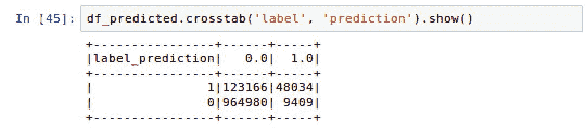

1.  我们从本节前面知道`testDF`数据框中共有 1,145,589 行；因此，我们可以使用以下公式计算模型的准确度：*(TP + TN) / 总数*。准确度为 88.4%。

1.  需要注意的是，并非所有的假分数都是相等的。例如，将一个呼叫分类为与火灾无关，最终却与火灾有关，比相反的情况对火灾安全的影响更大。这被称为假阴性。有一个考虑**假阴性**（**FN**）的指标，称为**召回率**。

1.  虽然我们可以手动计算准确度，如最后一步所示，但最好是自动计算准确度。这可以通过导入`sklearn.metrics`来轻松实现，这是一个常用于评分和模型评估的模块。

1.  `sklearn.metrics`接受两个参数，我们拥有标签的实际结果和从逻辑回归模型中得出的预测值。因此，创建了两个变量`actual`和`predicted`，并使用`accuracy_score()`函数计算准确度分数，如下截图所示：

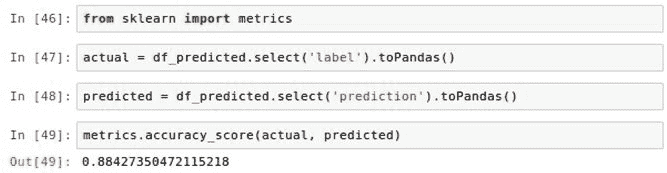

1.  准确度分数与我们手动计算的相同，为 88.4%。

# 还有更多...

现在我们知道我们的模型能够准确预测呼叫是否与火灾相关的比率为 88.4%。起初，这可能听起来是一个强有力的预测；然而，将其与一个基准分数进行比较总是很重要，其中每个呼叫都被预测为非火灾呼叫。预测的数据框`df_predicted`中标签`1`和`0`的分布如下截图所示：

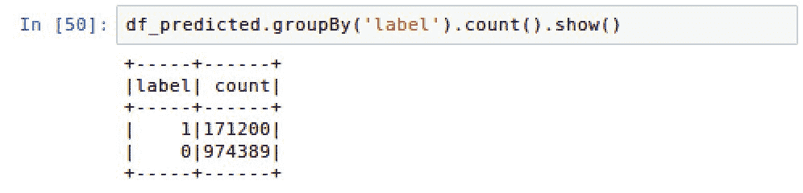

我们可以对同一数据框运行一些统计，使用`df_predicted.describe('label').show()`脚本得到值为`1`的标签出现的平均值。该脚本的输出如下截图所示：

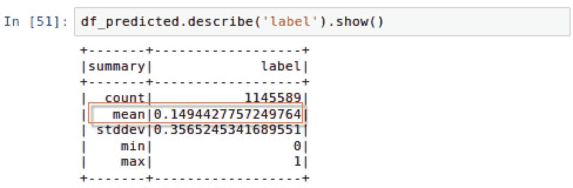

基础模型的预测值为`1`的比率为 14.94%，换句话说，它对值为 0 的预测率为*100 - 14.94*%，即 85.06%。因此，由于 85.06%小于模型的预测率 88.4%，这个模型相比于盲目猜测呼叫是否与火灾相关提供了改进。

# 另请参阅

要了解更多关于准确度与精确度的信息，请访问以下网站：

[`www.mathsisfun.com/accuracy-precision.html`](https://www.mathsisfun.com/accuracy-precision.html)
