# 第六章：在生成网络中使用 LSTMs

阅读完本章后，您将能够完成以下任务：

+   下载将用作输入文本的小说/书籍

+   准备和清理数据

+   对句子进行标记化

+   训练并保存 LSTM 模型

+   使用模型生成类似的文本

# 介绍

由于**循环神经网络**（**RNNs**）在反向传播时存在一些缺点，**长短期记忆单元**（**LSTMs**）和**门控循环单元**（**GRUs**）在学习顺序输入数据时近来变得越来越受欢迎，因为它们更适合解决梯度消失和梯度爆炸的问题。

# 下载将用作输入文本的小说/书籍

在本示例中，我们将介绍下载小说/书籍所需的步骤，这些将作为本示例的输入文本进行执行。

# 准备工作

+   将输入数据以`.txt`文件的形式放在工作目录中。

+   输入可以是任何类型的文本，如歌词、小说、杂志文章和源代码。

+   大多数经典文本不再受版权保护，可以免费下载并用于实验。获取免费书籍的最佳途径是 Project [Gutenberg](http://www.gutenberg.org/)。

+   在本章中，我们将使用 Rudyard Kipling 的《丛林之书》作为输入来训练我们的模型，并生成统计上类似的文本作为输出。下面的截图显示了如何以`.txt`格式下载必要的文件：

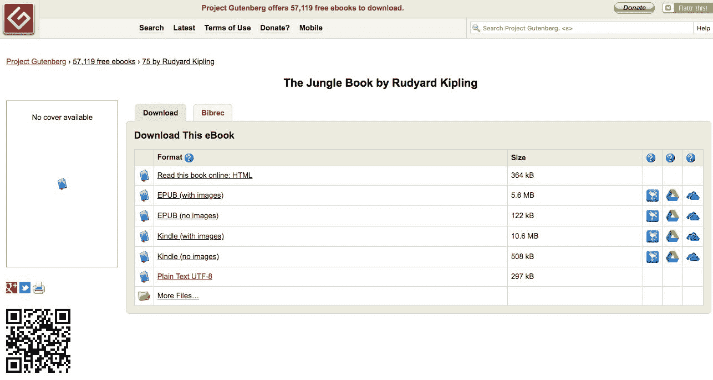

+   访问网站并搜索所需的书籍后，点击“Plain Text UTF-8”并下载。UTF-8 基本上指定了编码的类型。可以通过点击链接将文本复制粘贴或直接保存到工作目录中。

# 操作步骤...

在开始之前，先看一下数据并进行分析总是有帮助的。查看数据后，我们可以看到有很多标点符号、空格、引号以及大写和小写字母。在对其进行任何分析或将其馈送到 LSTM 网络之前，我们需要先准备好数据。我们需要一些能够更轻松处理数据的库：

1.  通过以下命令导入必要的库：

```scala
from keras.preprocessing.text import Tokenizer
from keras.utils import to_categorical
from keras.models import Sequential
from keras.layers import Dense, lSTM, Dropout, Embedding
import numpy as np
from pickle import dump
import string
```

1.  前面命令的输出如下截屏所示：

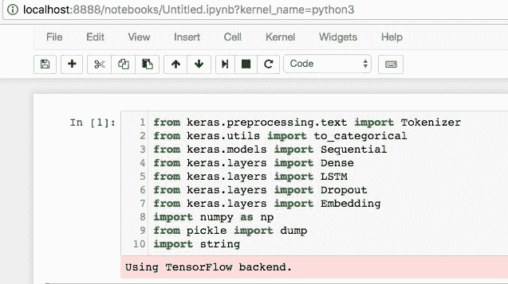

1.  始终要仔细检查当前工作目录，并选择所需的文件夹作为工作目录。在我们的案例中，`.txt`文件名为`junglebook.txt`，保存在名为`Chapter 8`的文件夹中。因此，我们将选择该文件夹作为整个章节的工作目录。可以按照下面的截图所示进行操作：

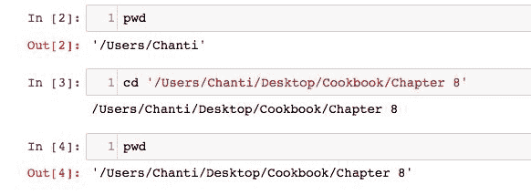

1.  接下来，通过定义一个名为`load_document`的函数将文件加载到程序的内存中，可以通过以下命令完成：

```scala
def load_document(name):
    file = open(name, 'r')
    text = file.read()
    file.close()
    return text
```

1.  使用先前定义的函数将文档加载到内存中，并使用以下脚本打印文本文件的前 2000 个字符：

```scala
input_filename = 'junglebook.txt'
doc = load_document(input_filename)
print(doc[:2000])
```

1.  运行前述函数以及命令会产生如下截屏所示的输出：

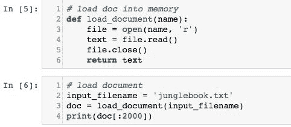

上述代码的输出如下截屏所示：

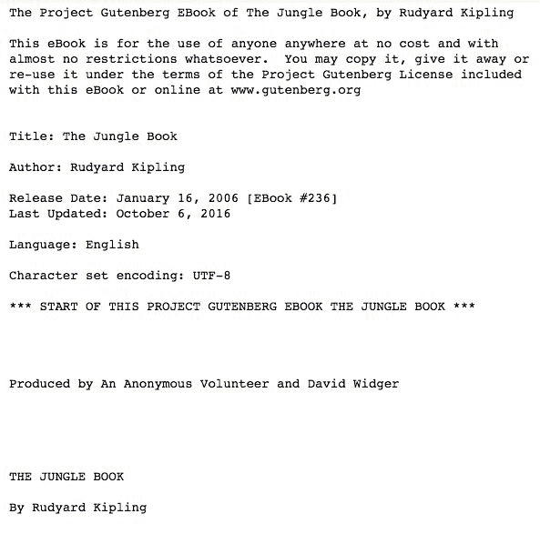

下面的截图是前面输出的延续：

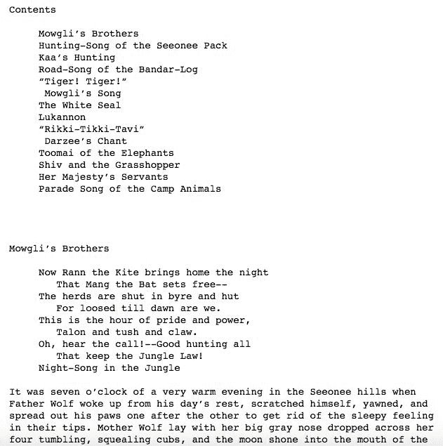

1.  如前面的截图所示，打印了`.txt`文件中的前 2000 个字符。在执行任何预处理之前，始终先分析数据是个好主意。这将更好地指导我们如何进行预处理步骤。

# 工作原理...

1.  `array`函数将用于处理数组形式的数据。`numpy`库提供了这个函数。

1.  由于我们的数据只是文本数据，我们将需要字符串库来处理所有输入数据作为字符串，然后将单词编码为整数，以便进行馈送。

1.  `tokenizer`函数将用于将所有句子拆分为标记，其中每个标记代表一个单词。

1.  pickle 库将被需要，以便使用`dump`函数将字典保存到 pickle 文件中。

1.  `keras`库中的`to_categorical`函数将类向量（整数）转换为二进制类矩阵，例如，用于`categorical_crossentropy`，我们以后将需要将标记映射到唯一整数，反之亦然。

1.  本章中所需的其他 Keras 层包括 LSTM 层、密集层、dropout 层和嵌入层。模型将被顺序定义，因此我们需要`keras`库中的顺序模型。

# 还有更多...

+   您还可以使用相同的模型处理不同类型的文本，例如网站上的客户评论、推文、结构化文本（如源代码、数学理论等）等。

+   本章的目的是了解 LSTM 如何学习长期依赖关系，以及与循环神经网络相比，它们在处理序列数据时表现更好的方式。

+   另一个好主意是将* Pokémon *名称输入模型，并尝试生成自己的* Pokémon *名称。

# 另请参阅

有关使用的不同库的更多信息可以在以下链接找到：

+   [`www.scipy-lectures.org/intro/numpy/array_object.html`](https://www.scipy-lectures.org/intro/numpy/array_object.html)

+   [`docs.python.org/2/library/string.html`](https://docs.python.org/2/library/string.html)

+   [`wiki.python.org/moin/UsingPickle`](https://wiki.python.org/moin/UsingPickle)

+   [`keras.io/preprocessing/text/`](https://keras.io/preprocessing/text/)

+   [`keras.io/layers/core/`](https://keras.io/layers/core/)

+   [`keras.io/layers/recurrent/`](https://keras.io/layers/recurrent/)

# 准备和清理数据

本章的这一部分将讨论在将其作为输入馈送到模型之前涉及的各种数据准备和文本预处理步骤。我们准备数据的具体方式取决于我们打算对其进行建模的方式，这又取决于我们打算如何使用它。

# 准备工作

语言模型将基于统计数据，并预测给定文本输入序列的每个单词的概率。预测的单词将被馈送到模型中，以便生成下一个单词。

一个关键决定是输入序列应该有多长。它们需要足够长，以使模型能够学习单词的上下文以进行预测。此输入长度还将定义用于生成新序列的种子文本的长度，当我们使用模型时。

为了简单起见，我们将任意选择长度为 50 个单词的输入序列长度。

# 如何做...

根据对文本的审查（我们之前做过），以下是可以执行的一些操作，以清理和预处理输入文件中的文本。我们提出了一些关于文本预处理的选项。但是，您可能希望探索更多的清理操作作为练习：

+   用空格替换破折号`–`，以便更好地拆分单词

+   基于空格拆分单词

+   删除输入文本中的所有标点符号，以减少输入模型的文本中唯一字符的数量（例如，Why? 变为 Why）

+   删除所有非字母的单词，以删除独立的标点符号标记和表情符号

+   将所有单词从大写转换为小写，以进一步减少标记的总数并消除任何差异和数据冗余

词汇量是语言建模和决定模型训练时间的决定性因素。较小的词汇量会导致训练速度更快的更高效的模型。在某些情况下，拥有较小的词汇量是有益的，但在其他情况下，拥有较大的词汇量可以防止过拟合。为了预处理数据，我们需要一个函数，它接受整个输入文本，根据空格分割文本，删除所有标点，规范化所有情况，并返回一个标记序列。为此，通过以下命令定义`clean_document`函数：

```scala
 import string
 def clean_document(doc):
     doc = doc.replace('--', ' ')
     tokens = doc.split()
     table = str.maketrans('', '', string.punctuation)
     tokens = [w.translate(table) for w in tokens]
     tokens = [word for word in tokens if word.isalpha()]
     tokens = [word.lower() for word in tokens]
     return tokens
```

1.  先前定义的函数基本上会将加载的文档/文件作为其参数，并返回一个干净的标记数组，如下面的屏幕截图所示：

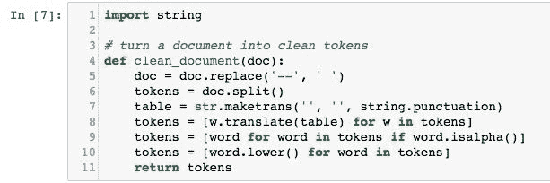

1.  接下来，打印出一些标记和统计数据，以更好地了解`clean_document`函数的作用。通过以下命令完成此步骤：

```scala
tokens = clean_document(doc)
print(tokens[:200])
print('Total Tokens: %d' % len(tokens))
print('Total Unique Tokens: %d' % len(set(tokens)))
```

1.  上述一系列命令的输出打印了前两百个标记，如下面的屏幕截图所示：

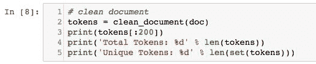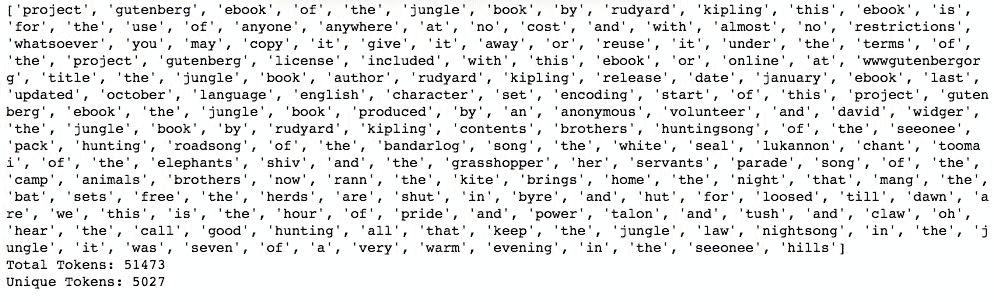

1.  接下来，使用以下命令将所有这些标记组织成序列，每个序列包含 50 个单词（任意选择）：

```scala
 length = 50 + 1
 sequences = list()
 for i in range(length, len(tokens)):
     seq = tokens[i-sequence_length:i]
     line = ' '.join(seq)
     sequences.append(line)
 print('Total Sequences: %d' % len(sequences))
```

可以通过打印输出文档形成的序列的总数来查看，如下面的屏幕截图所示：

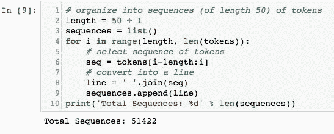

1.  通过以下命令定义`save_doc`函数，将所有生成的标记以及序列保存到工作目录中的文件中：

```scala
def save_document(lines, name):
    data = '\n'.join(lines)
    file = open(name, 'w')
    file.write(data)
    file.close()
```

要保存这些序列，请使用以下两个命令：

```scala
 output_filename = 'junglebook_sequences.txt'
 save_document(sequences, output_filename)
```

1.  该过程如下屏幕截图所示：

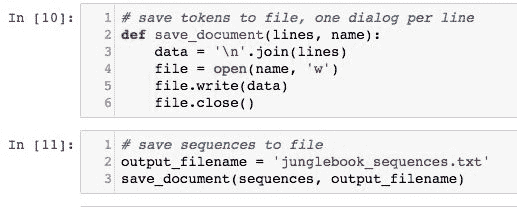

1.  接下来，加载保存的文档，其中包含所有保存的标记和序列，到内存中使用定义如下的`load_document`函数：

```scala
def load_document(name):
    file = open(name, 'r')
    text = file.read()
    file.close()
    return text

# function to load document and split based on lines
input_filename = 'junglebook_sequences.txt'
doc = load_document(input_filename)
lines = doc.split('\n')
```

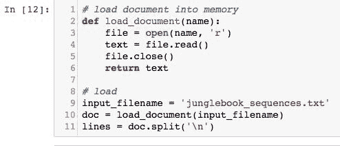

# 工作原理...

1.  `clean_document`函数删除所有空格、标点、大写文本和引号，并将整个文档分割成标记，其中每个标记都是一个单词。

1.  通过打印文档中的标记总数和唯一标记总数，我们会注意到`clean_document`函数生成了 51,473 个标记，其中 5,027 个标记（或单词）是唯一的。

1.  然后，`save_document`函数保存所有这些标记，以及生成我们每个 50 个单词的序列所需的唯一标记。请注意，通过循环遍历所有生成的标记，我们能够生成一个包含 51,422 个序列的长列表。这些序列将用作训练语言模型的输入。

1.  在对所有 51,422 个序列进行模型训练之前，将标记以及序列保存到文件中始终是一个良好的做法。一旦保存，可以使用定义的`load_document`函数将文件加载回内存。

1.  这些序列组织为 50 个输入标记和一个输出标记（这意味着每个序列有 51 个标记）。为了预测每个输出标记，将使用前 50 个标记作为模型的输入。我们可以通过迭代从第 51 个标记开始的标记列表，并将前 50 个标记作为一个序列，然后重复此过程直到所有标记列表的末尾来实现这一点。

# 另请参阅

访问以下链接，以更好地了解使用各种函数进行数据准备：

+   [`docs.python.org/3/library/tokenize.html`](https://docs.python.org/3/library/tokenize.html)

+   [`keras.io/utils/`](https://keras.io/utils/)

+   [`www.pythonforbeginners.com/dictionary/python-split`](http://www.pythonforbeginners.com/dictionary/python-split)

+   [`www.tutorialspoint.com/python/string_join.htm`](https://www.tutorialspoint.com/python/string_join.htm)

+   [`www.tutorialspoint.com/python/string_lower.htm`](https://www.tutorialspoint.com/python/string_lower.htm)

# 对句子进行标记

在定义和输入数据到 LSTM 网络之前，重要的是将数据转换为神经网络可以理解的形式。计算机理解的一切都是二进制代码（0 和 1），因此，文本或字符串格式的数据需要转换为独热编码变量。

# 准备工作

要了解独热编码的工作原理，请访问以下链接：

+   [`machinelearningmastery.com/how-to-one-hot-encode-sequence-data-in-python/`](https://machinelearningmastery.com/how-to-one-hot-encode-sequence-data-in-python/)

+   [`scikit-learn.org/stable/modules/generated/sklearn.preprocessing.OneHotEncoder.html`](http://scikit-learn.org/stable/modules/generated/sklearn.preprocessing.OneHotEncoder.html)

+   [`stackoverflow.com/questions/37292872/how-can-i-one-hot-encode-in-python`](https://stackoverflow.com/questions/37292872/how-can-i-one-hot-encode-in-python)

+   [`www.ritchieng.com/machinelearning-one-hot-encoding/`](https://www.ritchieng.com/machinelearning-one-hot-encoding/)

+   [`hackernoon.com/what-is-one-hot-encoding-why-and-when-do-you-have-to-use-it-e3c6186d008f`](https://hackernoon.com/what-is-one-hot-encoding-why-and-when-do-you-have-to-use-it-e3c6186d008f)

# 如何做...

经过上一节的学习，您应该能够清理整个语料库并拆分句子。接下来涉及独热编码和标记化句子的步骤可以按以下方式完成：

1.  一旦标记和序列被保存到文件并加载到内存中，它们必须被编码为整数，因为模型中的词嵌入层期望输入序列由整数而不是字符串组成。

1.  这是通过将词汇表中的每个单词映射到唯一的整数并对输入序列进行编码来完成的。稍后，在进行预测时，可以将预测转换（或映射）回数字，以查找它们在相同映射中关联的单词，并从整数到单词的反向映射。

1.  为了执行这种编码，利用 Keras API 中的 Tokenizer 类。在编码之前，必须对整个数据集进行训练，以便找到所有唯一的标记，并为每个标记分配一个唯一的整数。要这样做的命令如下：

```scala
tokenizer = Tokenizer()
tokenizer.fit_on_texts(lines)
sequences = tokenizer.texts_to_sequences(lines)
```

1.  在后面定义嵌入层之前，还需要计算词汇表的大小。这是通过计算映射字典的大小来确定的。

1.  因此，在向嵌入层指定词汇表大小时，将其指定为实际词汇表大小加 1。因此，词汇表大小定义如下：

```scala
vocab_size = len(tokenizer.word_index) + 1
print('Vocabulary size : %d' % vocab_size)
```

1.  现在，一旦输入序列已经被编码，它们需要被分成输入和输出元素，这可以通过数组切片来完成。

1.  分离后，对输出单词进行独热编码。这意味着将其从整数转换为 n 维向量，其中每个词汇表中的单词都有一个 0 值，用 1 表示单词的整数值的索引处的特定单词。Keras 提供了`to_categorical()`函数，可用于为每个输入-输出序列对独热编码输出单词。

1.  最后，指定嵌入层输入序列的长度。我们知道有 50 个单词，因为模型是通过将序列长度指定为 50 来设计的，但指定序列长度的一个好的通用方法是使用输入数据形状的第二维（列数）。

1.  可以通过发出以下命令来完成：

```scala
sequences = array(sequences)
Input, Output = sequences[:,:-1], sequences[:,-1]
Output = to_categorical(Output, num_classes=vocab_size)
sequence_length = Input.shape[1]
```

# 工作原理...

本节将描述在执行上一节中的命令时必须看到的输出：

1.  在对句子进行标记化和计算词汇表长度的命令运行后，您应该看到如下屏幕截图所示的输出：

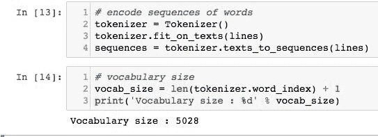

1.  单词被分配值，从 1 开始，直到单词的总数（例如，在这种情况下为 5,027）。嵌入层需要为词汇表中从索引 1 到最大索引的每个单词分配一个向量表示。词汇表末尾的单词的索引将是 5,027；这意味着数组的长度必须是 5,027 + 1。

1.  数组切片和将句子分隔成每个序列 50 个单词的序列后，输出应该如下截图所示：

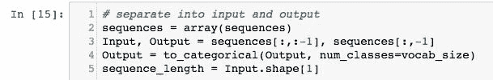

1.  使用`to_categorical()`函数，使模型学习预测下一个单词的概率分布。

# 还有更多...

有关在 Python 中重新整形数组的更多信息，请访问以下链接：

+   [`docs.scipy.org/doc/numpy/reference/generated/numpy.reshape.html`](https://docs.scipy.org/doc/numpy/reference/generated/numpy.reshape.html)

+   [`machinelearningmastery.com/index-slice-reshape-numpy-arrays-machine-learning-python/`](https://machinelearningmastery.com/index-slice-reshape-numpy-arrays-machine-learning-python/)

# 训练和保存 LSTM 模型

现在可以从准备好的数据中训练统计语言模型。

将要训练的模型是神经语言模型。它具有一些独特的特点：

+   它使用分布式表示来表示单词，使得具有相似含义的不同单词具有相似的表示

+   它在学习模型的同时学习表示

+   它学会使用前 50 个单词的上下文来预测下一个单词的概率

具体来说，您将使用嵌入层来学习单词的表示，以及**长短期记忆**（**LSTM**）递归神经网络来学习根据上下文预测单词。

# 准备工作

如前所述，学习的嵌入需要知道词汇表的大小和输入序列的长度。它还有一个参数，用于指定将用于表示每个单词的维度的数量。这就是嵌入向量空间的大小。

常见值为 50、100 和 300。我们将在这里使用 100，但考虑测试更小或更大的值，并评估这些值的指标。

网络将由以下组成：

+   两个具有 200 个记忆单元的 LSTM 隐藏层。更多的记忆单元和更深的网络可能会取得更好的结果。

+   一个 dropout 层，dropout 率为 0.3 或 30%，这将帮助网络减少对每个神经元/单元的依赖，并减少过拟合数据。

+   一个具有 200 个神经元的全连接层连接到 LSTM 隐藏层，以解释从序列中提取的特征。

+   输出层预测下一个单词，作为词汇表大小的单个向量，其中每个单词在词汇表中都有一个概率。

+   在第二个密集或全连接层中使用 softmax 分类器，以确保输出具有归一化概率的特性（例如在 0 和 1 之间）。

# 如何做...

1.  使用以下命令定义模型，并在以下截图中进行说明：

```scala
model = Sequential()
model.add(Embedding(vocab_size, 100, input_length=sequence_length))
model.add(LSTM(200, return_sequences=True))
model.add(LSTM(200))
model.add(Dropout(0.3))
model.add(Dense(200, activation='relu'))
model.add(Dense(vocab_size, activation='softmax'))
print(model.summary())
```

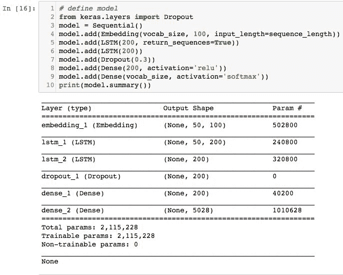

1.  打印模型摘要，以确保模型按预期构建。

1.  编译模型，指定需要拟合模型的分类交叉熵损失。将 epochs 数设置为 75，并使用批量大小为 250 的小批量训练模型。使用以下命令完成：

```scala
 model.compile(loss='categorical_crossentropy', optimizer='adam', 
        metrics=['accuracy'])

 model.fit(Input, Output, batch_size=250, epochs=75)
```

1.  上述命令的输出在以下截图中进行说明：

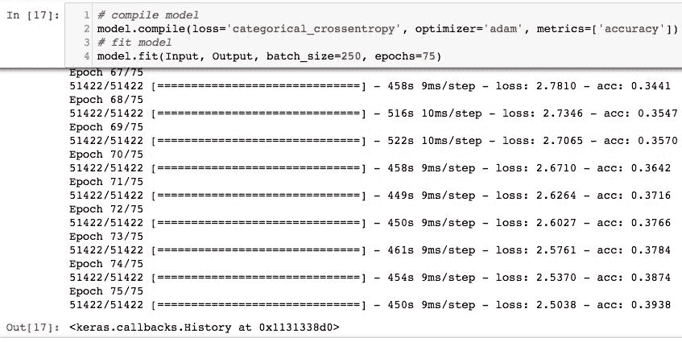

1.  模型编译完成后，使用以下命令保存：

```scala
model.save('junglebook_trained.h5')

dump(tokenizer, open('tokenizer.pkl', 'wb'))
```

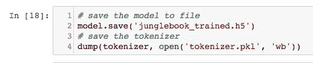

# 它是如何工作的...

1.  模型是使用 Keras 框架中的`Sequential()`函数构建的。模型中的第一层是一个嵌入层，它以词汇量、向量维度和输入序列长度作为参数。

1.  接下来的两层是每个具有 200 个内存单元的 LSTM 层。可以尝试使用更多内存单元和更深的网络来检查是否可以提高准确性。

1.  接下来的一层是一个丢弃层，丢弃概率为 30%，这意味着在训练过程中某个记忆单元不被使用的概率为 30%。这可以防止数据过拟合。同样，可以调整和调优丢弃概率。

1.  最后两层是两个全连接层。第一个具有`relu`激活函数，第二个具有 softmax 分类器。打印模型摘要以检查模型是否按要求构建。

1.  请注意，在这种情况下，可训练参数的总数为 2,115,228。模型摘要还显示了模型中每个层将被训练的参数数量。

1.  在我们的案例中，模型是在 75 个时期的小批量中训练的，以最小化训练时间。将时期数增加到 100 以上，并在训练时使用更小的批量，可以大大提高模型的准确性，同时减少损失。

1.  在训练过程中，您将看到性能摘要，包括每个批次更新结束时从训练数据评估的损失和准确性。在我们的案例中，运行了 75 个时期后，我们获得了接近 40%的准确性。

1.  模型的目标不是以 100%的准确性记住文本，而是捕捉输入文本的属性，如自然语言和句子中存在的长期依赖关系和结构。

1.  在训练完成后，模型将保存在名为`junglebook_trained.h5`的工作目录中。

1.  当模型稍后加载到内存中进行预测时，我们还需要单词到整数的映射。这在`Tokenizer`对象中存在，并且也使用`Pickle`库中的`dump()`函数保存。

# 还有更多...

Jason Brownlee 在 Machine Learning Mastery 的博客上有很多关于开发、训练和调整自然语言处理机器学习模型的有用信息。可以在以下链接找到：

[`machinelearningmastery.com/deep-learning-for-nlp/`](https://machinelearningmastery.com/deep-learning-for-nlp/)

[`machinelearningmastery.com/lstms-with-python/`](https://machinelearningmastery.com/lstms-with-python/)

[`machinelearningmastery.com/blog/`](https://machinelearningmastery.com/deep-learning-for-nlp/)

# 另请参阅

有关本节中使用的不同 keras 层和其他函数的更多信息可以在以下链接找到：

+   [`keras.io/models/sequential/`](https://keras.io/models/sequential/)

+   [`docs.python.org/2/library/pickle.html`](https://docs.python.org/2/library/pickle.html)

+   [`keras.io/optimizers/`](https://keras.io/optimizers/)

+   [`keras.io/models/model/`](https://keras.io/models/model/)

# 使用模型生成类似的文本

现在您有了一个经过训练的语言模型，可以使用它。在这种情况下，您可以使用它来生成具有与源文本相同统计特性的新文本序列。至少对于这个例子来说，这并不实际，但它给出了语言模型学到了什么的一个具体例子。

# 准备工作

1.  首先重新加载训练序列。您可以使用我们最初开发的`load_document()`函数来实现。通过以下代码实现：

```scala
def load_document(name):
    file = open(name, 'r')
    text = file.read()
    file.close()
    return text

# load sequences of cleaned text
input_filename = 'junglebook_sequences.txt'
doc = load_document(input_filename)
lines = doc.split('\n')
```

上述代码的输出如下截图所示：

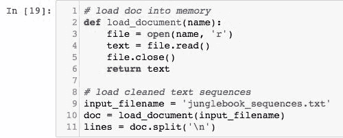

1.  请注意，输入文件名现在是`'junglebook_sequences.txt'`，这将把保存的训练序列加载到内存中。我们需要文本，以便我们可以选择一个源序列作为模型的输入，以生成新的文本序列。

1.  模型将需要 50 个单词作为输入。

随后，需要指定输入的预期长度。这可以通过计算加载的数据的一行的长度并减去 1 来从输入序列中确定，因为预期的输出单词也在同一行上，如下所示：

`sequence_length = len(lines[0].split()) - 1`

1.  接下来，通过执行以下命令将训练和保存的模型加载到内存中：

```scala
 from keras.models import load_model
 model = load_model('junglebook.h5')
```

1.  生成文本的第一步是准备种子输入。为此目的，从输入文本中随机选择一行文本。一旦选择，打印它以便您对使用的内容有一些了解。操作如下：

```scala
from random import randint
seed_text = lines[randint(0,len(lines))]
print(seed_text + '\n')
```

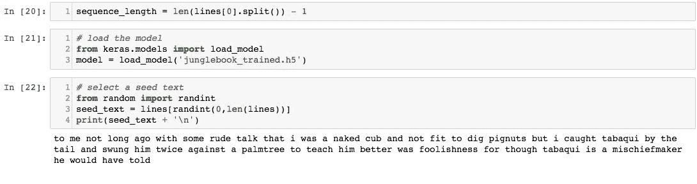

# 如何做...

1.  现在，您可以逐个生成新单词。首先，使用训练模型时使用的相同标记器将种子文本编码为整数，操作如下：

`encoded = tokenizer.texts_to_sequences([seed_text])[0]`

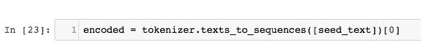

1.  模型可以通过调用`model.predict_classes()`直接预测下一个单词，这将返回具有最高概率的单词的索引：

```scala
 prediction = model.predict_classes(encoded, verbose=0)

```

1.  查找标记器映射中的索引以获取相关联的单词，如下所示：

```scala
 out_word = ''
 for word, index in tokenizer.word_index.items():
         if index == prediction:
                 out_word = word
                 break
```

1.  将这个单词附加到种子文本中并重复这个过程。重要的是，输入序列将变得太长。在将输入序列编码为整数后，我们可以将其截断为所需的长度。Keras 提供了`pad_sequences()`函数，我们可以使用它来执行这种截断，如下所示：

```scala
 encoded = pad_sequences([encoded], maxlen=seq_length, truncating='pre')

```

1.  将所有这些封装到一个名为`generate_sequence()`的函数中，该函数以模型、标记器、输入序列长度、种子文本和要生成的单词数量作为输入。然后，它返回模型生成的一系列单词。您可以使用以下代码来实现：

```scala
 from random import randint
 from pickle import load
 from keras.models import load_model
 from keras.preprocessing.sequence import pad_sequences

 def load_document(filename):
     file = open(filename, 'r')
     text = file.read()
     file.close()
     return text

 def generate_sequence(model, tokenizer, sequence_length, seed_text, n_words):
     result = list()
     input_text = seed_text
     for _ in range(n_words):
         encoded = tokenizer.texts_to_sequences([input_text])[0]
         encoded = pad_sequences([encoded], maxlen=seq_length,                 truncating='pre')
         prediction = model.predict_classes(encoded, verbose=0)
         out_word = ''
             for word, index in tokenizer.word_index.items():
                 if index == prediction:
                     out_word = word
                     break
      input_text += ' ' + out_word
      result.append(out_word)
    return ' '.join(result)

 input_filename = 'junglebook_sequences.txt'
 doc = load_document(input_filename)
 lines = doc.split('\n')
 seq_length = len(lines[0].split()) - 1
```

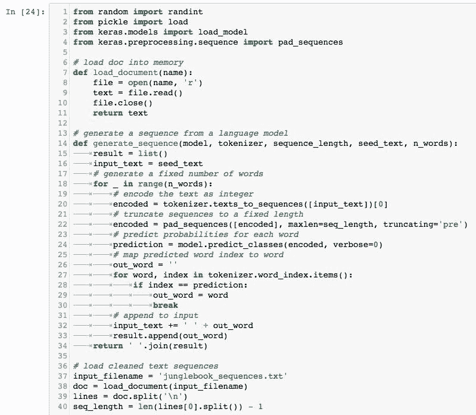

# 工作原理...

现在，我们准备生成一系列新单词，假设我们有一些种子文本：

1.  首先使用以下命令将模型重新加载到内存中：

```scala
 model = load_model('junglebook.h5')
```

1.  接下来，通过输入以下命令加载标记器：

```scala
 tokenizer = load(open('tokenizer.pkl', 'rb'))
```

1.  通过使用以下命令随机选择一个种子文本：

```scala
 seed_text = lines[randint(0,len(lines))]
 print(seed_text + '\n')
```

1.  最后，通过使用以下命令生成一个新序列：

```scala
 generated = generate_sequence(model, tokenizer, sequence_length,             seed_text, 50)
 print(generated)
```

1.  在打印生成的序列时，您将看到类似于以下屏幕截图的输出：

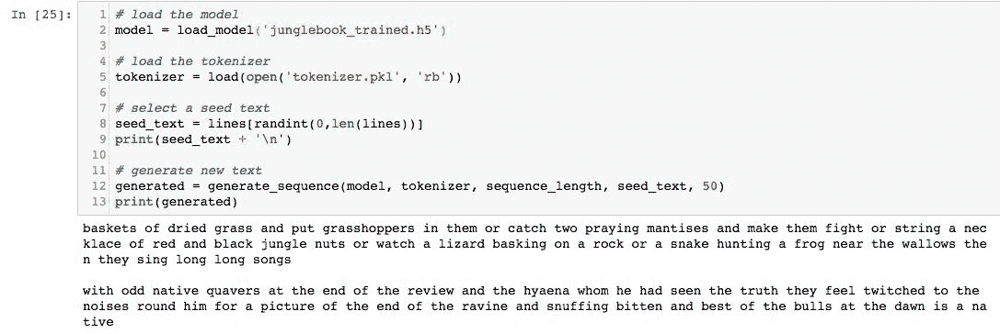

1.  模型首先打印随机种子文本的 50 个单词，然后打印生成文本的 50 个单词。在这种情况下，随机种子文本如下：

*篮子里装满了干草，放入蚱蜢，或者捉两只螳螂让它们打架，或者串一串红色和黑色的丛林果仁做成项链，或者看蜥蜴在岩石上晒太阳，或者蛇在泥坑附近捕捉青蛙，然后它们唱着长长的歌*

在这种情况下，模型生成的 50 个单词如下：

*在评论结束时有奇怪的本地颤音，他看到的鬣狗，他们感到被拉到他周围的噪音，为了峡谷末端的画面，嗅着被咬的和最好的公牛在黎明时是本地人*

1.  请注意模型输出了一系列随机单词，这些单词是根据它从输入文本中学到的内容生成的。您还会注意到，模型在模仿输入文本并生成自己的故事方面做得相当不错。尽管文本没有太多意义，但它为我们提供了宝贵的见解，即模型如何学习将统计上相似的单词放在一起。

# 还有更多...

+   更改设置的随机种子后，网络生成的输出也会发生变化。您可能无法获得与前面示例完全相同的输出文本，但它将与用于训练模型的输入非常相似。

+   以下是通过多次运行生成文本片段获得的不同结果的一些屏幕截图：

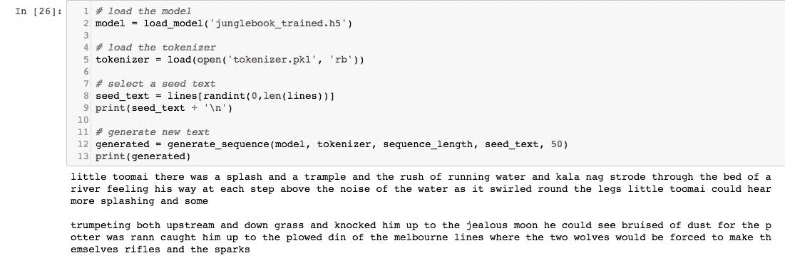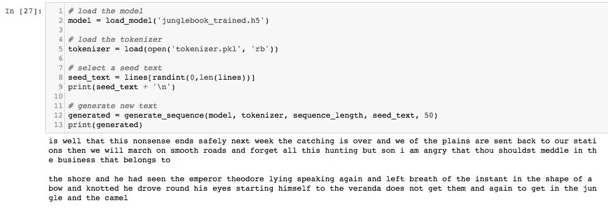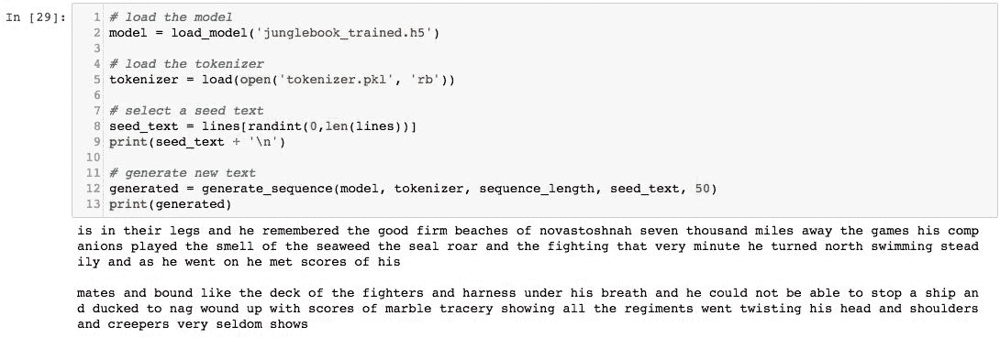

+   模型甚至生成了自己版本的项目古腾堡许可证，如下屏幕截图所示：

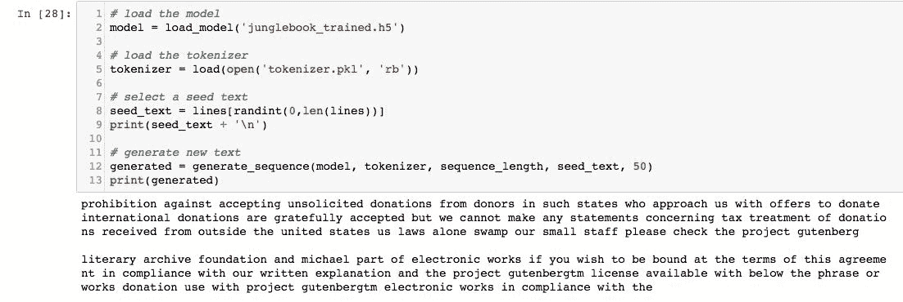

+   模型的准确性可以通过将时代数量从大约 100 增加到 200 来提高到约 60％。另一种增加学习的方法是通过以大约 50 和 100 的小批量训练模型。尝试玩弄不同的超参数和激活函数，以查看以最佳方式影响结果的方法。

+   还可以通过在定义模型时包含更多的 LSTM 和丢失层来使模型更加密集。但是，请注意，如果模型更复杂并且运行的时代更长，它只会增加训练时间。

+   经过大量实验，发现理想的批处理大小在 50 到 100 之间，并且确定了训练模型的理想时代数量在 100 到 200 之间。

+   执行前述任务的确切方法并不存在。您还可以尝试使用不同的文本输入到模型，例如推文，客户评论或 HTML 代码。

+   还可以执行一些其他任务，包括使用简化的词汇表（例如删除所有停用词）以进一步增强字典中的唯一单词；调整嵌入层的大小和隐藏层中的记忆单元数量；并扩展模型以使用预训练模型，例如 Google 的 Word2Vec（预训练词模型），以查看是否会产生更好的模型。

# 另请参阅

有关本章最后一节中使用的各种函数和库的更多信息，请访问以下链接：

+   [`keras.io/preprocessing/sequence/`](https://keras.io/preprocessing/sequence/)

+   [`wiki.python.org/moin/UsingPickle`](https://wiki.python.org/moin/UsingPickle)

+   [`docs.python.org/2/library/random.html`](https://docs.python.org/2/library/random.html)

+   [`www.tensorflow.org/api_docs/python/tf/keras/models/load_model`](https://www.tensorflow.org/api_docs/python/tf/keras/models/load_model)
