# 第七章：使用 TF-IDF 进行自然语言处理

在本章中，将涵盖以下内容：

+   下载治疗机器人会话文本数据集

+   分析治疗机器人会话数据集

+   可视化数据集中的词频

+   计算文本的情感分析

+   从文本中删除停用词

+   训练 TF-IDF 模型

+   评估 TF-IDF 模型性能

+   将模型性能与基准分数进行比较

# 介绍

自然语言处理（NLP）最近成为新闻的焦点，如果你问五个不同的人，你会得到十个不同的定义。最近，NLP 已被用于帮助识别互联网上试图传播假新闻或更糟的是欺凌行为的机器人或喷子。事实上，最近在西班牙发生了一起案件，一所学校的学生通过社交媒体账户遭到网络欺凌，这对学生的健康产生了严重影响，老师们开始介入。学校联系了研究人员，他们能够帮助识别使用 TF-IDF 等 NLP 方法的潜在喷子。最终，潜在的学生名单被提交给学校，当面对时，实际嫌疑人承认了自己的行为。这个故事发表在一篇名为《Twitter 社交网络中喷子档案检测的监督机器学习：网络欺凌的真实案例应用》的论文中，作者是 Patxi Galan-Garcıa、Jose Gaviria de la Puerta、Carlos Laorden Gomez、Igor Santos 和 Pablo Garcıa Bringas。

本文重点介绍了利用多种不同方法分析文本和开发类似人类语言处理的能力。正是这种方法将自然语言处理（NLP）融入到机器学习、深度学习和人工智能中。让机器能够摄取文本数据并可能从同样的文本数据中做出决策是自然语言处理的核心。有许多用于 NLP 的算法，例如以下内容：

+   TF-IDF

+   Word2Vec

+   N-gram

+   潜在狄利克雷分配（LDA）

+   长短期记忆（LSTM）

本章将专注于一个包含个人与在线治疗网站聊天机器人之间对话的数据集。聊天机器人的目的是识别需要立即引起个人关注而不是继续与聊天机器人讨论的对话。最终，我们将专注于使用 TF-IDF 算法对数据集进行文本分析，以确定聊天对话是否需要被升级到个人的分类。TF-IDF 代表词项频率-逆文档频率。这是一种常用的算法技术，用于识别文档中单词的重要性。此外，TF-IDF 在处理文档中的高词频时易于计算，并且能够衡量单词的独特性。在处理聊天机器人数据时，这非常有用。主要目标是快速识别一个唯一的单词，触发升级到个人以提供即时支持。

# 下载治疗机器人会话文本数据集

本节将重点介绍下载和设置本章中用于 NLP 的数据集。

# 准备工作

本章将使用基于治疗机器人与在线治疗网站访客之间的互动的数据集。它包含 100 个互动，每个互动都被标记为“升级”或“不升级”。如果讨论需要更严肃的对话，机器人将会将讨论标记为“升级”给个人。否则，机器人将继续与用户讨论。

# 它是如何工作的...

本节将介绍下载聊天机器人数据的步骤。

1.  从以下 GitHub 存储库访问数据集：[`github.com/asherif844/ApacheSparkDeepLearningCookbook/tree/master/CH07/data`](https://github.com/asherif844/ApacheSparkDeepLearningCookbook/tree/master/CH07/data)

1.  一旦您到达存储库，右键单击以下截图中看到的文件：

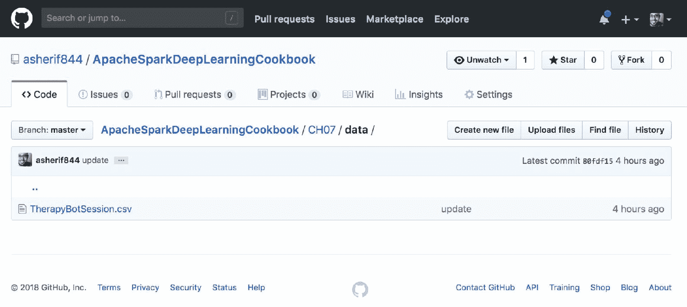

1.  下载 `TherapyBotSession.csv` 并保存到与 Jupyter 笔记本 `SparkSession` 相同的本地目录中。

1.  通过以下脚本在 Jupyter 笔记本中访问数据集，构建名为 `spark` 的 `SparkSession`，并将数据集分配给 Spark 中的数据框 `df`：

```scala
spark = SparkSession.builder \
        .master("local") \
        .appName("Natural Language Processing") \
        .config("spark.executor.memory", "6gb") \
        .getOrCreate()
df = spark.read.format('com.databricks.spark.csv')\
     .options(header='true', inferschema='true')\
     .load('TherapyBotSession.csv')  
```

# 如何做...

本节解释了聊天机器人数据如何进入我们的 Jupyter 笔记本。

1.  数据集的内容可以通过点击存储库中的 TherapyBotSession.csv 查看，如下截图所示：

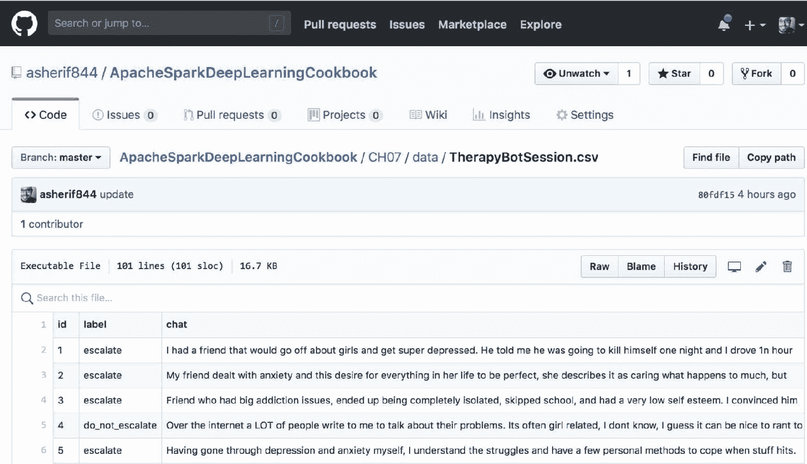

1.  一旦数据集被下载，它可以被上传并转换为一个名为 `df` 的数据框。可以通过执行 `df.show()` 来查看数据框，如下截图所示：

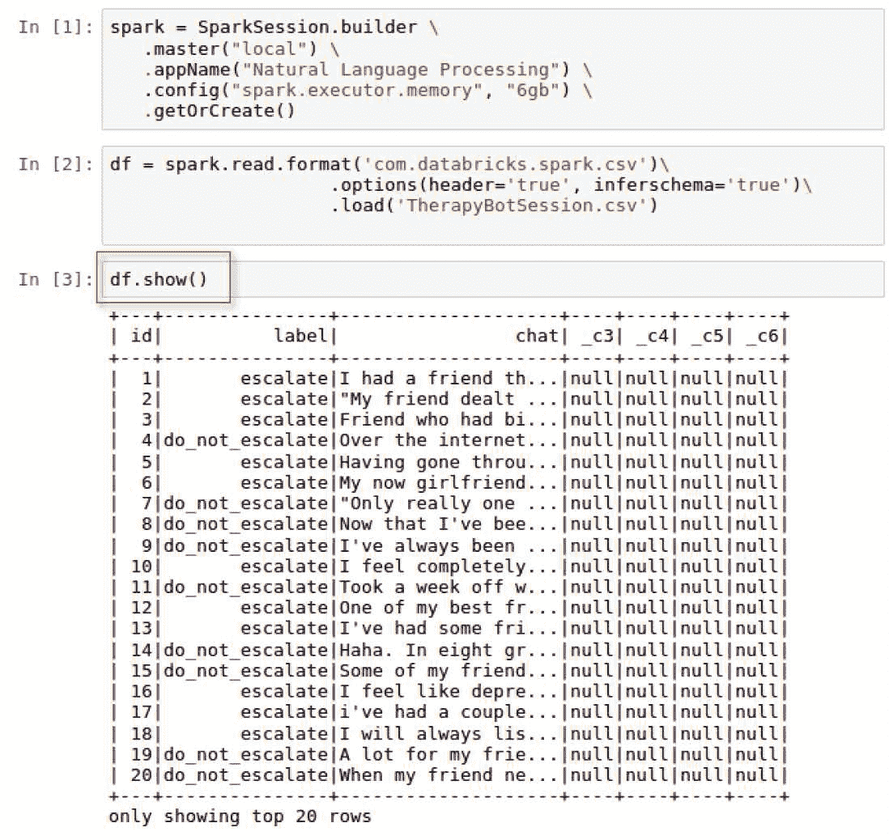

1.  有 3 个主要字段对我们来说特别感兴趣：

1.  `id`：网站访问者和聊天机器人之间每笔交易的唯一标识。

1.  `label`：由于这是一种监督建模方法，我们知道我们要预测的结果，每个交易都被分类为 `escalate` 或 `do_not_escalate`。在建模过程中，将使用该字段来训练文本以识别属于这两种情况之一的单词。

1.  `chat`：最后我们有来自网站访问者的 `chat` 文本，我们的模型将对其进行分类。

# 还有更多...

数据框 `df` 还有一些额外的列 `_c3`、`_c4`、`_c5` 和 `_c6`，这些列将不会在模型中使用，因此可以使用以下脚本从数据集中排除。

```scala
df = df.select('id', 'label', 'chat')
df.show()
```

脚本的输出可以在以下截图中看到：

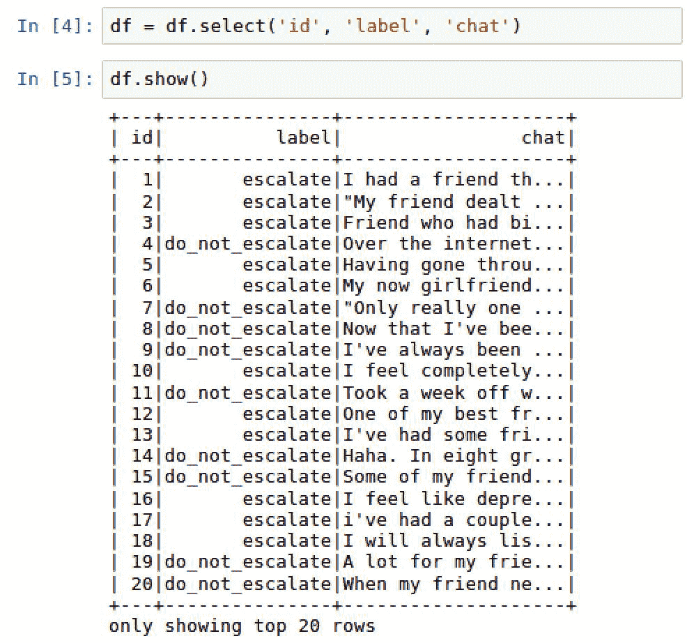

# 分析治疗机器人会话数据

在应用模型之前，始终先分析任何数据集是很重要的

# 准备工作

这一部分将需要从 `pyspark.sql` 导入 `functions` 来在我们的数据框上执行。

```scala
import pyspark.sql.functions as F
```

# 如何做...

以下部分将介绍对文本数据进行分析的步骤。

1.  执行以下脚本来对 `label` 列进行分组并生成计数分布：

```scala
df.groupBy("label") \
   .count() \
   .orderBy("count", ascending = False) \
   .show()
```

1.  使用以下脚本向数据框 `df` 添加一个新列 `word_count`：

```scala
import pyspark.sql.functions as F
df = df.withColumn('word_count', F.size(F.split(F.col('response_text'),' ')))
```

1.  使用以下脚本按 `label` 聚合平均单词计数 `avg_word_count`：

```scala
df.groupBy('label')\
  .agg(F.avg('word_count').alias('avg_word_count'))\
  .orderBy('avg_word_count', ascending = False) \
  .show()
```

# 它是如何工作的...

以下部分解释了分析文本数据所获得的反馈。

1.  收集跨多行的数据并按维度对结果进行分组是很有用的。在这种情况下，维度是 `label`。使用 `df.groupby()` 函数来测量按 `label` 分布的 100 笔在线治疗交易的计数。我们可以看到 `do_not_escalate` 到 `escalate` 的分布是 `65`：`35`，如下截图所示：

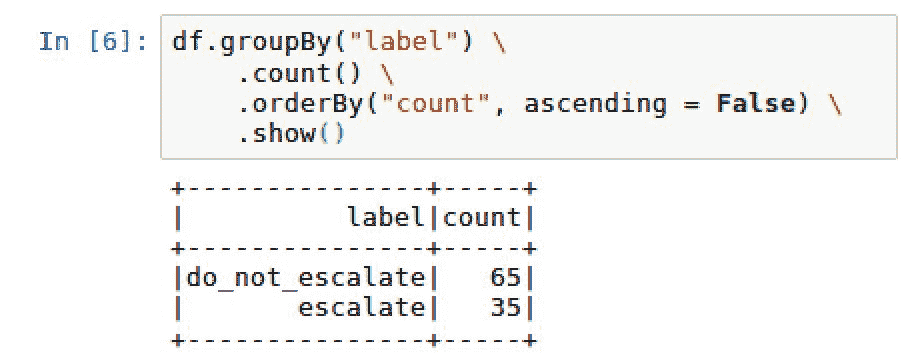

1.  创建一个新列 `word_count`，用于计算聊天机器人和在线访问者之间的 100 笔交易中每笔交易使用了多少单词。新创建的列 `word_count` 可以在以下截图中看到：

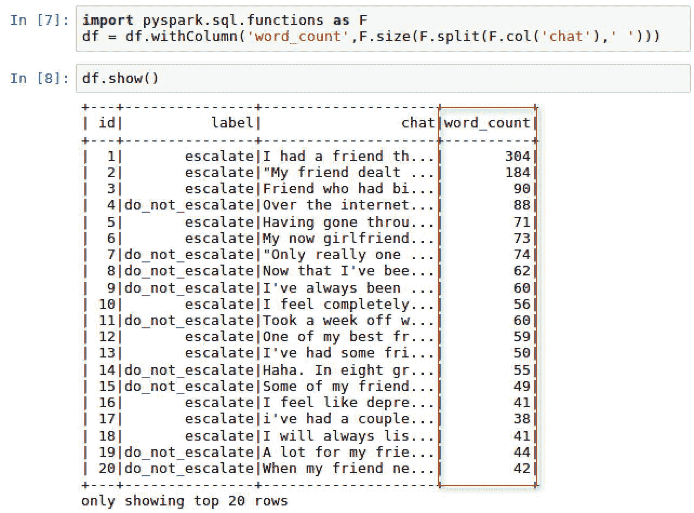

1.  由于现在在数据框中添加了 `word_count`，可以对其进行聚合以计算按 `label` 的平均单词计数。一旦执行了这个操作，我们可以看到 `escalate` 对话的平均长度是 `do_not_escalate` 对话的两倍多，如下截图所示：

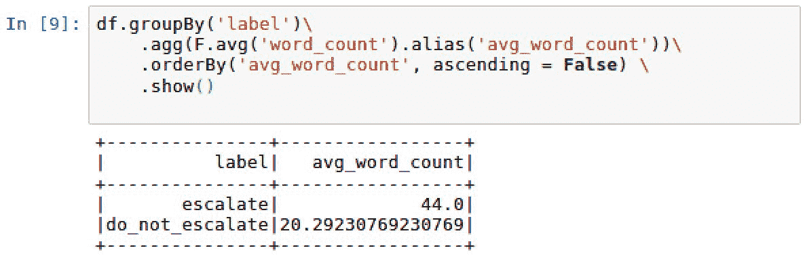

# 可视化数据集中的单词计数

一张图片胜过千言万语，本节将证明这一点。不幸的是，截至版本 2.2，Spark 没有任何内在的绘图能力。为了在数据框中绘制值，我们必须转换为 `pandas`。

# 准备工作

本节将需要导入`matplotlib`进行绘图：

```scala
import matplotlib.pyplot as plt
%matplotlib inline
```

# 如何做...

本节将介绍将 Spark 数据框转换为可以在 Jupyter 笔记本中查看的可视化的步骤。

1.  使用以下脚本将 Spark 数据框转换为`pandas`数据框：

```scala
df_plot = df.select('id', 'word_count').toPandas()
```

1.  使用以下脚本绘制数据框：

```scala
import matplotlib.pyplot as plt
%matplotlib inline

df_plot.set_index('id', inplace=True)
df_plot.plot(kind='bar', figsize=(16, 6))
plt.ylabel('Word Count')
plt.title('Word Count distribution')
plt.show()
```

# 工作原理...

本节解释了如何将 Spark 数据框转换为`pandas`，然后绘制。

1.  从 Spark 中收集数据框的子集，并使用 Spark 中的`toPandas()`方法转换为`pandas`。

1.  然后使用 matplotlib 绘制数据的子集，将 y 值设置为`word_count`，将 x 值设置为`id`，如下面的屏幕截图所示：

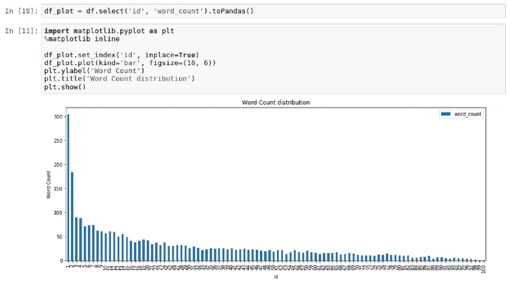

# 另请参阅

Python 中除了`matplotlib`之外还有其他绘图功能，例如`bokeh`、`plotly`和`seaborn`。

要了解有关`bokeh`的更多信息，请访问以下网站：

[`bokeh.pydata.org/en/latest/`](https://bokeh.pydata.org/en/latest/)

要了解有关`plotly`的更多信息，请访问以下网站：

[`plot.ly/`](https://plot.ly/)

要了解有关`seaborn`的更多信息，请访问以下网站：

[`seaborn.pydata.org/`](https://seaborn.pydata.org/)

# 计算文本的情感分析

情感分析是从单词或一系列单词中推导出语气和感觉的能力。本节将利用 Python 技术从数据集中的 100 个交易中计算情感分析分数。

# 准备工作

本节将需要在 PySpark 中使用函数和数据类型。此外，我们还将导入`TextBlob`库进行情感分析。为了在 PySpark 中使用 SQL 和数据类型函数，必须导入以下内容：

```scala
from pyspark.sql.types import FloatType 
```

此外，为了使用`TextBlob`，必须导入以下库：

```scala
from textblob import TextBlob
```

# 如何做...

以下部分将介绍将情感分数应用于数据集的步骤。

1.  使用以下脚本创建情感分数函数`sentiment_score`：

```scala
from textblob import TextBlob
def sentiment_score(chat):
    return TextBlob(chat).sentiment.polarity
```

1.  使用以下脚本在数据框中的每个对话响应上应用`sentiment_score`：

1.  创建一个名为`sentiment_score_udf`的`lambda`函数，将`sentiment_score`映射到 Spark 中的用户定义函数`udf`，并指定`FloatType()`的输出类型，如下脚本所示：

```scala
from pyspark.sql.types import FloatType
sentiment_score_udf = F.udf(lambda x: sentiment_score(x), FloatType())
```

1.  在数据框中的每个`chat`列上应用函数`sentiment_score_udf`，如下脚本所示：

```scala
df = df.select('id', 'label', 'chat','word_count',
                   sentiment_score_udf('chat').alias('sentiment_score'))
```

1.  使用以下脚本计算按`label`分组的平均情感分数`avg_sentiment_score`：

```scala
df.groupBy('label')\
     .agg(F.avg('sentiment_score').alias('avg_sentiment_score'))\
     .orderBy('avg_sentiment_score', ascending = False) \
     .show()
```

# 工作原理...

本节解释了如何将 Python 函数转换为 Spark 中的用户定义函数`udf`，以将情感分析分数应用于数据框中的每一列。

1.  `Textblob`是 Python 中的情感分析库。它可以从名为`sentiment.polarity`的方法中计算情感分数，该方法的得分范围为-1（非常负面）到+1（非常正面），0 为中性。此外，`Textblob`还可以从 0（非常客观）到 1（非常主观）测量主观性；尽管在本章中我们不会测量主观性。

1.  将 Python 函数应用于 Spark 数据框有几个步骤：

1.  导入`Textblob`并将名为`sentiment_score`的函数应用于`chat`列，以生成每个机器人对话的情感极性，并在新列中生成情感分数，也称为`sentiment_score`。

1.  Python 函数不能直接应用于 Spark 数据框，而必须先经过用户定义函数转换`udf`，然后在 Spark 中应用。

1.  此外，函数的输出也必须明确说明，无论是整数还是浮点数据类型。在我们的情况下，我们明确说明函数的输出将使用`FloatType() from pyspark.sql.types`。最后，使用`udf`情感分数函数内的`lambda`函数在每行上应用情感。

1.  通过执行`df.show()`，可以看到具有新创建字段`情感分数`的更新后的数据框，如下截屏所示：

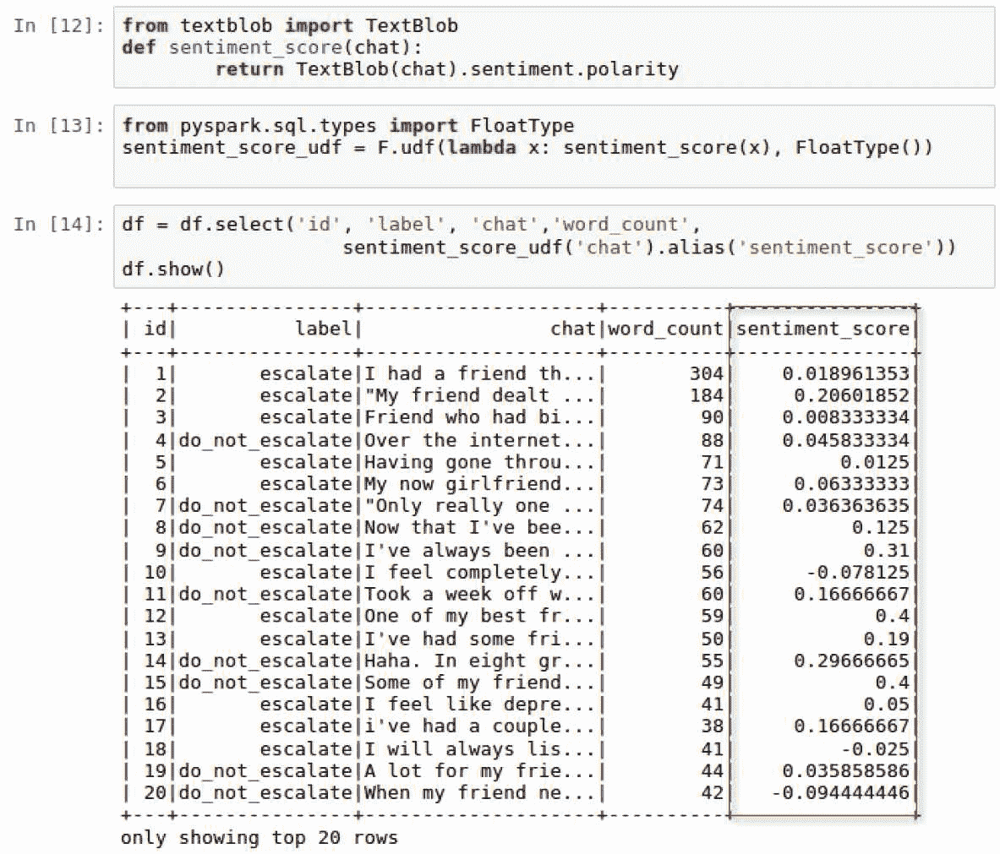

1.  现在，对于聊天对话中的每个响应计算了`sentiment_score`之后，我们可以为每行指定-1（非常负面的极性）到+1（非常正面的极性）的值范围。就像我们对计数和平均词数所做的那样，我们可以比较`升级`对话在情感上是否比`不升级`对话更积极或更消极。我们可以通过`label`计算平均情感分数`avg_sentiment_score`，如下截屏所示：

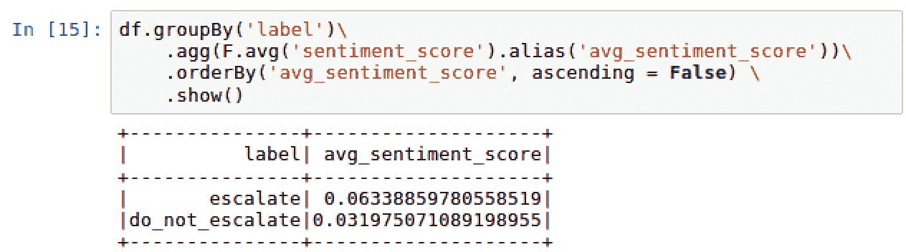

1.  最初，假设`升级`对话的极性得分会比`不升级`更负面是有道理的。实际上，我们发现`升级`在极性上比`不升级`稍微更积极；但是，两者都相当中性，因为它们接近 0。

# 另请参阅

要了解有关`TextBlob`库的更多信息，请访问以下网站：

[`textblob.readthedocs.io/en/dev/`](http://textblob.readthedocs.io/en/dev/)

# 从文本中删除停用词

停用词是英语中非常常见的单词，通常会从常见的 NLP 技术中删除，因为它们可能会分散注意力。常见的停用词可能是诸如*the*或*and*之类的单词。

# 准备工作

本节需要导入以下库：

```scala
from pyspark.ml.feature import StopWordsRemover 
from pyspark.ml import Pipeline
```

# 操作步骤...

本节介绍了删除停用词的步骤。

1.  执行以下脚本，将`chat`中的每个单词提取为数组中的字符串：

```scala
df = df.withColumn('words',F.split(F.col('chat'),' '))
```

1.  使用以下脚本将一组常见单词分配给变量`stop_words`，这些单词将被视为停用词：

```scala
stop_words = ['i','me','my','myself','we','our','ours','ourselves',
'you','your','yours','yourself','yourselves','he','him',
'his','himself','she','her','hers','herself','it','its',
'itself','they','them','their','theirs','themselves',
'what','which','who','whom','this','that','these','those',
'am','is','are','was','were','be','been','being','have',
'has','had','having','do','does','did','doing','a','an',
'the','and','but','if','or','because','as','until','while',
'of','at','by','for','with','about','against','between',
'into','through','during','before','after','above','below',
'to','from','up','down','in','out','on','off','over','under',
'again','further','then','once','here','there','when','where',
'why','how','all','any','both','each','few','more','most',
'other','some','such','no','nor','not','only','own','same',
'so','than','too','very','can','will','just','don','should','now']
```

1.  执行以下脚本，从 PySpark 导入`StopWordsRemover`函数，并配置输入和输出列`words`和`word without stop`：

```scala
from pyspark.ml.feature import StopWordsRemover 

stopwordsRemovalFeature = StopWordsRemover(inputCol="words", 
                   outputCol="words without stop").setStopWords(stop_words)
```

1.  执行以下脚本以导入 Pipeline 并为将应用于数据框的停用词转换过程定义`stages`：

```scala
from pyspark.ml import Pipeline

stopWordRemovalPipeline = Pipeline(stages=[stopwordsRemovalFeature])
pipelineFitRemoveStopWords = stopWordRemovalPipeline.fit(df)
```

1.  最后，使用以下脚本将停用词移除转换`pipelineFitRemoveStopWords`应用于数据框`df`：

```scala
df = pipelineFitRemoveStopWords.transform(df)
```

# 工作原理...

本节解释了如何从文本中删除停用词。

1.  就像我们在对`chat`数据进行分析时一样，我们也可以调整`chat`对话的文本，并将每个单词分解为单独的数组。这将用于隔离停用词并将其删除。

1.  将每个单词提取为字符串的新列称为`words`，可以在以下截屏中看到：

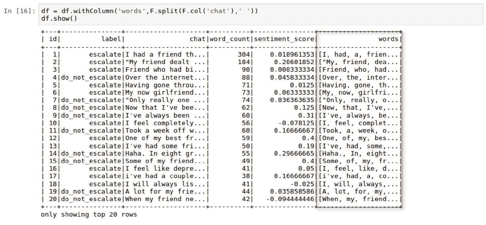

1.  有许多方法可以将一组单词分配给停用词列表。其中一些单词可以使用适当的 Python 库`nltk`（自然语言工具包）自动下载和更新。对于我们的目的，我们将利用一个常见的 124 个停用词列表来生成我们自己的列表。可以轻松地手动添加或从列表中删除其他单词。

1.  停用词不会为文本增添任何价值，并且将通过指定`outputCol="words without stop"`从新创建的列中删除。此外，通过指定`inputCol = "words"`来设置将用作转换源的列。

1.  我们创建一个管道，`stopWordRemovalPipeline`，来定义将转换数据的步骤或`阶段`的顺序。在这种情况下，唯一用于转换数据的阶段是特征`stopwordsRemover`。

1.  管道中的每个阶段都可以具有转换角色和估计角色。估计角色`pipeline.fit(df)`用于生成名为`pipelineFitRemoveStopWords`的转换器函数。最后，在数据框上调用`transform(df)`函数，以生成具有名为`words without stop`的新列的更新后的数据框。我们可以将两列并排比较以查看差异，如下截屏所示：

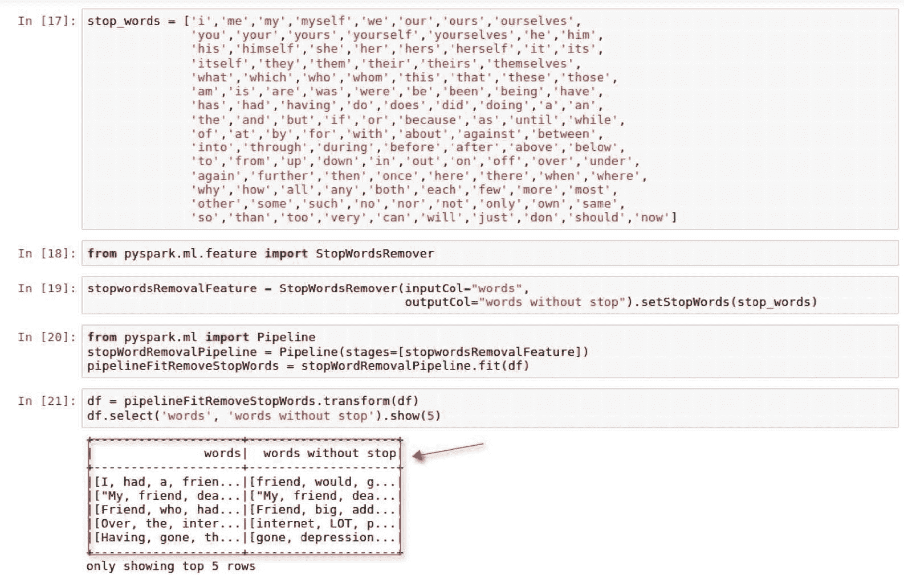

1.  新列`words without stop`不包含原始列`words`中被视为停用词的任何字符串。

# 另请参阅

要了解有关`nltk`的停用词的更多信息，请访问以下网站：

[`www.nltk.org/data.html`](https://www.nltk.org/data.html)

要了解更多关于 Spark 机器学习管道的信息，请访问以下网站：

[`spark.apache.org/docs/2.2.0/ml-pipeline.html`](https://spark.apache.org/docs/2.2.0/ml-pipeline.html)

要了解 PySpark 中`StopWordsRemover`功能的更多信息，请访问以下网站：

[`spark.apache.org/docs/2.2.0/api/python/pyspark.ml.html#pyspark.ml.feature.StopWordsRemover`](https://spark.apache.org/docs/2.2.0/api/python/pyspark.ml.html#pyspark.ml.feature.StopWordsRemover)

# 训练 TF-IDF 模型

我们现在准备训练我们的 TF-IDF NLP 模型，并查看是否可以将这些交易分类为`升级`或`不升级`。

# 准备工作

本节将需要从`spark.ml.feature`和`spark.ml.classification`导入。

# 操作步骤...

以下部分将逐步介绍训练 TF-IDF 模型的步骤。

1.  创建一个新的用户定义函数`udf`，使用以下脚本为`label`列定义数值：

```scala
label = F.udf(lambda x: 1.0 if x == 'escalate' else 0.0, FloatType())
df = df.withColumn('label', label('label'))
```

1.  执行以下脚本以设置单词向量化的 TF 和 IDF 列：

```scala
import pyspark.ml.feature as feat
TF_ = feat.HashingTF(inputCol="words without stop", 
                     outputCol="rawFeatures", numFeatures=100000)
IDF_ = feat.IDF(inputCol="rawFeatures", outputCol="features")
```

1.  使用以下脚本设置管道`pipelineTFIDF`，以设置`TF_`和`IDF_`的阶段顺序：

```scala
pipelineTFIDF = Pipeline(stages=[TF_, IDF_])
```

1.  使用以下脚本将 IDF 估计器拟合到数据框`df`上：

```scala
pipelineFit = pipelineTFIDF.fit(df)
df = pipelineFit.transform(df)
```

1.  使用以下脚本将数据框拆分为 75:25 的比例，用于模型评估目的：

```scala
(trainingDF, testDF) = df.randomSplit([0.75, 0.25], seed = 1234)
```

1.  使用以下脚本导入和配置分类模型`LogisticRegression`：

```scala
from pyspark.ml.classification import LogisticRegression
logreg = LogisticRegression(regParam=0.25)
```

1.  将逻辑回归模型`logreg`拟合到训练数据框`trainingDF`上。基于逻辑回归模型的`transform()`方法，创建一个新的数据框`predictionDF`，如下脚本所示：

```scala
logregModel = logreg.fit(trainingDF)
predictionDF = logregModel.transform(testDF)
```

# 工作原理...

以下部分解释了如何有效地训练 TF-IDF NLP 模型。

1.  最好将标签以数值格式而不是分类形式呈现，因为模型能够在将输出分类为 0 和 1 之间时解释数值。因此，`label`列下的所有标签都转换为 0.0 或 1.0 的数值`label`，如下截图所示：

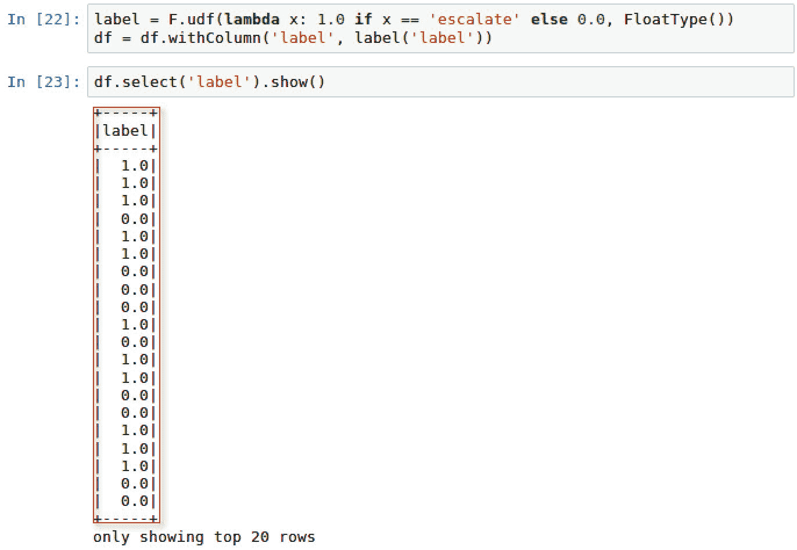

1.  TF-IDF 模型需要通过从`pyspark.ml.feature`导入`HashingTF`和`IDF`来进行两步处理，以处理不同的任务。第一个任务仅涉及导入`HashingTF`和`IDF`并为输入和随后的输出列分配值。`numfeatures`参数设置为 100,000，以确保它大于数据框中单词的不同数量。如果`numfeatures`小于不同的单词计数，模型将不准确。

1.  如前所述，管道的每个步骤都包含一个转换过程和一个估计器过程。管道`pipelineTFIDF`被配置为按顺序排列步骤，其中`IDF`将跟随`HashingTF`。

1.  `HashingTF`用于将`words without stop`转换为新列`rawFeatures`中的向量。随后，`rawFeatures`将被`IDF`消耗，以估算大小并适应数据框以生成名为`features`的新列，如下截图所示：

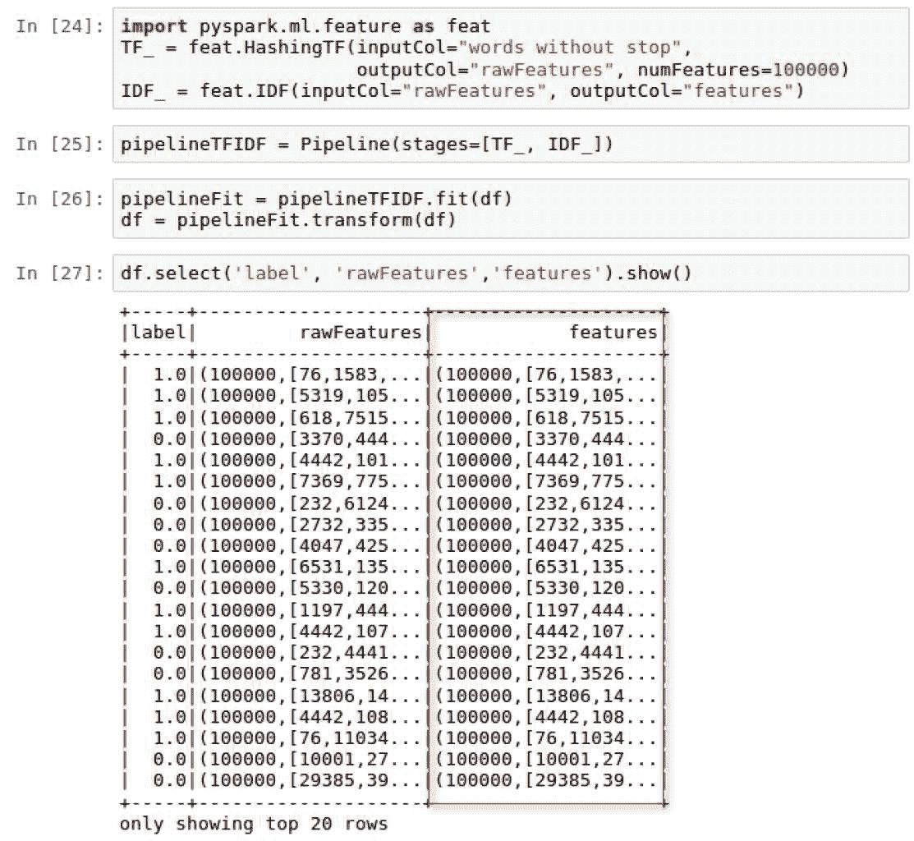

1.  为了培训目的，我们的数据框将以`75`:`25`的比例保守地拆分，随机种子设置为`1234`。

1.  由于我们的主要目标是将每个对话分类为`升级`以进行升级或`不升级`以进行继续的机器人聊天，因此我们可以使用 PySpark 库中的传统分类算法，如逻辑回归模型。逻辑回归模型配置了正则化参数`regParam`为 0.025。我们使用该参数略微改进模型，以最小化过度拟合，代价是略微偏差。

1.  逻辑回归模型在`trainingDF`上进行训练和拟合，然后创建一个新的数据框`predictionDF`，其中包含新转换的字段`prediction`，如下截图所示：

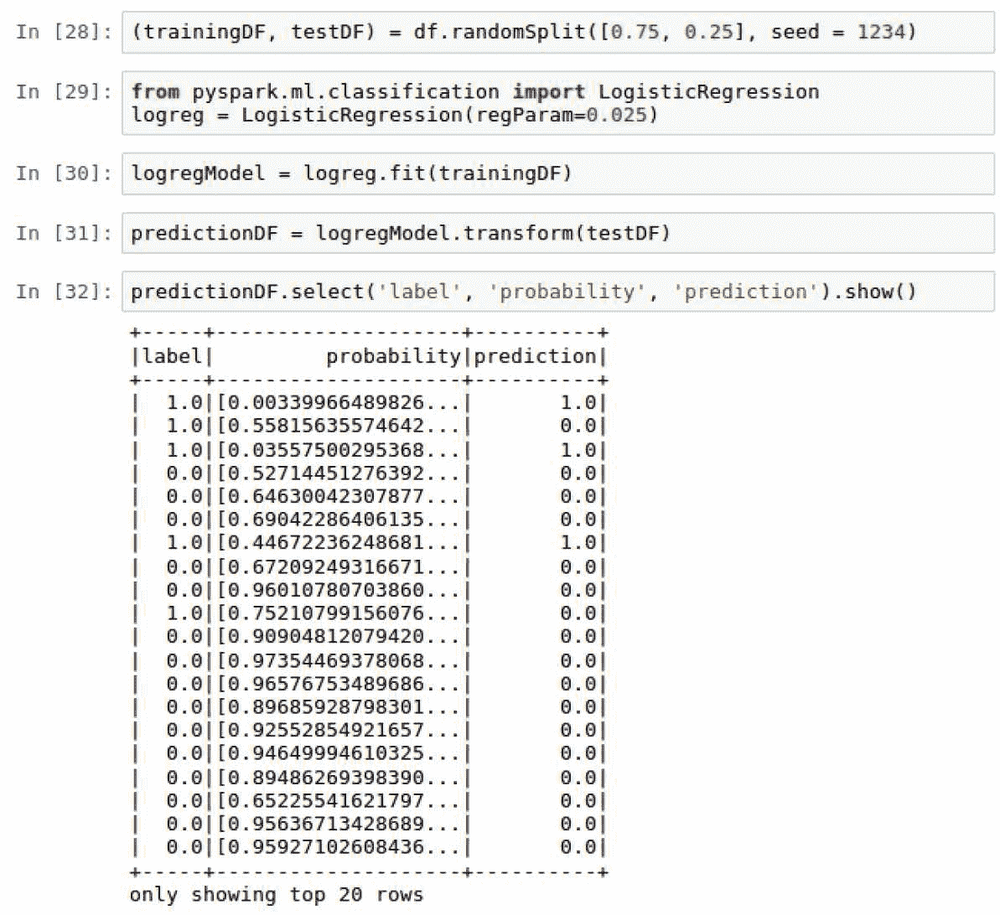

# 还有更多...

虽然我们确实使用了用户定义的函数`udf`来手动创建一个数值标签列，但我们也可以使用 PySpark 的内置功能`StringIndexer`来为分类标签分配数值。要查看`StringIndexer`的操作，请访问第五章，*使用 Spark ML 预测消防部门呼叫*。

# 另请参阅

要了解有关 PySpark 中 TF-IDF 模型的更多信息，请访问以下网站：

[`spark.apache.org/docs/latest/mllib-feature-extraction.html#tf-idf`](https://spark.apache.org/docs/latest/mllib-feature-extraction.html#tf-idf)

# 评估 TF-IDF 模型性能

此时，我们已准备好评估我们模型的性能

# 准备工作

本节将需要导入以下库：

+   来自`sklearn`的`metrics`

+   `pyspark.ml.evaluation`中的`BinaryClassificationEvaluator`

# 如何做...

本节介绍了评估 TF-IDF NLP 模型的步骤。

1.  使用以下脚本创建混淆矩阵：

```scala
predictionDF.crosstab('label', 'prediction').show()
```

1.  使用以下脚本从`sklearn`评估模型的`metrics`：

```scala
from sklearn import metrics

actual = predictionDF.select('label').toPandas()
predicted = predictionDF.select('prediction').toPandas()
print('accuracy score: {}%'.format(round(metrics.accuracy_score(actual,         predicted),3)*100))
```

1.  使用以下脚本计算 ROC 分数：

```scala
from pyspark.ml.evaluation import BinaryClassificationEvaluator

scores = predictionDF.select('label', 'rawPrediction')
evaluator = BinaryClassificationEvaluator()
print('The ROC score is {}%'.format(round(evaluator.evaluate(scores),3)*100))
```

# 它是如何工作的...

本节解释了我们如何使用评估计算来确定模型的准确性。

1.  混淆矩阵有助于快速总结实际结果和预测结果之间的准确性数字。由于我们有 75:25 的分割，我们应该从训练数据集中看到 25 个预测。我们可以使用以下脚本构建混淆矩阵：`predictionDF.crosstab('label', 'prediction').show()`。脚本的输出可以在以下截图中看到：

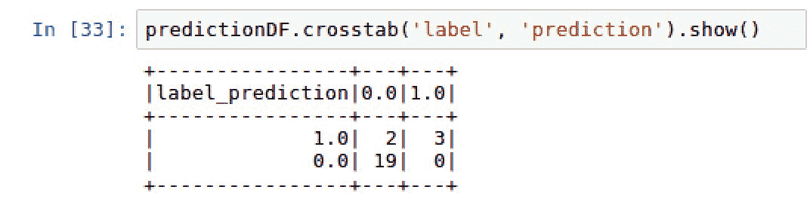

1.  我们现在处于通过比较`prediction`值和实际`label`值来评估模型准确度的阶段。`sklearn.metrics`接受两个参数，与`label`列相关联的`actual`值，以及从逻辑回归模型派生的`predicted`值。

请注意，我们再次将 Spark 数据框的列值转换为 pandas 数据框，使用`toPandas()`方法。

1.  创建了两个变量`actual`和`predicted`，并使用`metrics.accuracy_score()`函数计算了 91.7%的准确度分数，如下截图所示：

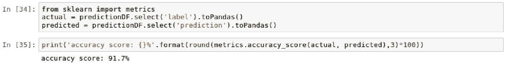

1.  ROC（接收器操作特性）通常与测量真正率相对于假正率的曲线相关联。曲线下面积越大，越好。与曲线相关的 ROC 分数是另一个指标，可用于衡量模型的性能。我们可以使用`BinaryClassificationEvaluator`计算`ROC`，如下截图所示：

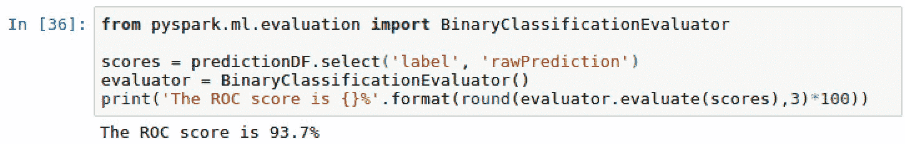

# 另请参阅

要了解有关 PySpark 中的`BinaryClassificationEvaluator`的更多信息，请访问以下网站：

[`spark.apache.org/docs/2.2.0/api/java/index.html?org/apache/spark/ml/evaluation/BinaryClassificationEvaluator.html`](https://spark.apache.org/docs/2.2.0/api/java/index.html?org/apache/spark/ml/evaluation/BinaryClassificationEvaluator.html)

# 将模型性能与基线分数进行比较

虽然我们的模型具有 91.7%的高准确度分数，这很好，但将其与基线分数进行比较也很重要。我们在本节中深入探讨了这个概念。

# 如何做...

本节介绍了计算基线准确度的步骤。

1.  执行以下脚本以从`describe()`方法中检索平均值：

```scala
predictionDF.describe('label').show()
```

1.  减去`1-平均值分数`以计算基线准确度。

# 它是如何工作的...

本节解释了基线准确度背后的概念，以及我们如何使用它来理解模型的有效性。

1.  如果每个`chat`对话都被标记为`do_not_escalate`或反之亦然，我们是否会有高于 91.7％的基准准确率？找出这一点最简单的方法是使用以下脚本在`predictionDF`的`label`列上运行`describe()`方法：`predictionDF.describe('label').show()`

1.  可以在以下截图中看到脚本的输出：

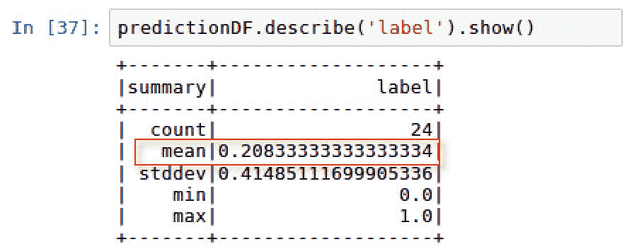

1.  `label`的平均值为 0.2083 或约 21％，这意味着`label`为 1 的情况仅发生了 21％的时间。因此，如果我们将每个对话标记为`do_not_escalate`，我们将有大约 79％的准确率，这低于我们的模型准确率 91.7％。

1.  因此，我们可以说我们的模型表现比盲目基准性能模型更好。

# 另请参阅

要了解 PySpark 数据框中`describe()`方法的更多信息，请访问以下网站：

[`spark.apache.org/docs/2.2.0/api/python/pyspark.sql.html#pyspark.sql.DataFrame.describe`](http://spark.apache.org/docs/2.2.0/api/python/pyspark.sql.html#pyspark.sql.DataFrame.describe)
