# 第八章：使用 XGBoost 进行房地产价值预测

房地产市场是定价最具竞争力的市场之一。这往往会根据诸多因素而显著变化，如位置、物业年龄、大小等。因此，准确预测房地产价格（特别是房地产市场中的价格）已成为一个现代挑战，以便做出更好的投资决策。本章将处理这个问题。

阅读完本章后，您将能够：

+   下载金县房屋销售数据集

+   进行探索性分析和可视化

+   绘制价格与其他特征之间的相关性

+   预测房屋价格

# 下载金县房屋销售数据集

在没有数据集的情况下，我们无法构建模型。我们将在本节中下载我们的数据。

# 准备工作

Kaggle ([`www.kaggle.com/`](https://www.kaggle.com/))是一个用于预测建模和分析竞赛的平台，统计学家和数据挖掘者在这里竞争，以产生最佳的模型来预测和描述由公司和用户上传的数据集。金县房屋销售数据集包含了在 1900 年至 2015 年间在纽约金县出售的 21,613 套房屋的记录。数据集还包含了每套房屋的 21 个不同变量，如位置、邮政编码、卧室数量、生活空间面积等。

# 如何做...

1.  可以从以下网站访问数据集：[`www.kaggle.com/harlfoxem/housesalesprediction`](https://www.kaggle.com/harlfoxem/housesalesprediction)。数据集来自金县的公共记录，可以免费下载和在任何分析中使用。

1.  一旦您到达网站，您可以点击下载按钮，如下图所示：

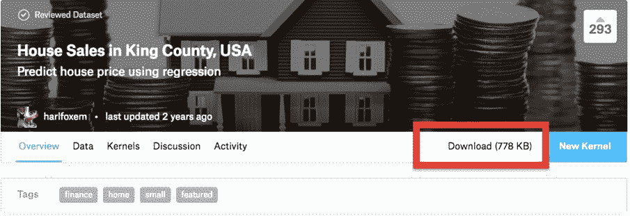

金县房屋销售数据集

1.  从压缩下载的文件`housesalesprediction.zip`中出现一个名为`kc_house_data.csv`的文件。

1.  将名为`kc_house_data.csv`的文件保存在当前工作目录中，因为这将是我们的数据集。这将被加载到 IPython 笔记本中进行分析和预测。

# 它是如何工作的...

1.  使用以下代码安装本章所需的必要库：

```scala
import numpy as np
import pandas as pd
import matplotlib.pyplot as plt
import seaborn as sns
import mpl_toolkits
from sklearn import preprocessing
from sklearn.preprocessing import LabelEncoder, OneHotEncoder
from sklearn.feature_selection import RFE
from sklearn import linear_model
from sklearn.cross_validation import train_test_split %matplotlib inline
```

1.  前面的步骤应该会产生一个输出，如下面的屏幕截图所示：

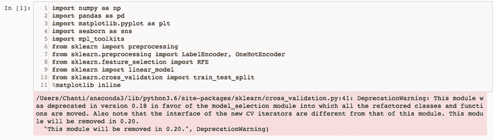

1.  检查当前工作目录并将其设置为存储数据集的目录是一个好主意。如下图所示：

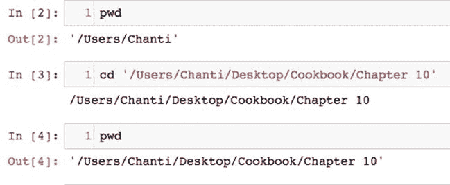

在我们的案例中，名为`Chapter 10`的文件夹被设置为当前工作目录。

1.  使用`read_csv()`函数将文件中的数据读入名为`dataframe`的 Pandas 数据框中，并使用`list(dataframe)`命令列出特征/标题，如下图所示：

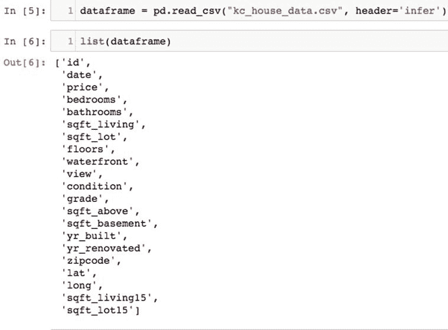

您可能已经注意到，数据集包含 21 个不同的变量，如 id、日期、价格、卧室、浴室等。

# 还有更多...

本章中使用的库及其函数如下：

+   `Numpy`，用于整理数组形式的数据以及以数组形式存储名称列表

+   `Pandas`，用于所有数据整理和数据框形式的数据管理

+   `Seaborn`，这是一种用于探索性分析和绘图的可视化库

+   `MPL_Toolkits`，其中包含`Matplotlib`所需的许多函数和依赖项

+   本章所需的主要科学和统计库`Scikit Learn`库中的函数

+   我们还需要一些其他库，如`XGBoost`，但这些将在构建模型时根据需要导入。

# 另请参阅

有关不同库的更多文档可以通过访问以下链接找到：

+   [`scikit-learn.org/stable/modules/preprocessing.html`](http://scikit-learn.org/stable/modules/preprocessing.html)

+   [`scikit-learn.org/stable/modules/generated/sklearn.feature_selection.RFE.html`](http://scikit-learn.org/stable/modules/generated/sklearn.feature_selection.RFE.html)

+   [`seaborn.pydata.org/`](https://seaborn.pydata.org/)

+   [`matplotlib.org/mpl_toolkits/index.html`](https://matplotlib.org/mpl_toolkits/index.html)

# 进行探索性分析和可视化

在预测`price`等变量时，可视化数据并了解因变量受其他变量影响的方式有助于预测。探索性分析提供了许多数据中不容易获得的见解。本章的这一部分将描述如何从大数据中可视化并得出见解。

# 准备工作

+   可以使用`dataframe.head()`函数打印`dataframe`的头部，产生如下屏幕截图所示的输出：

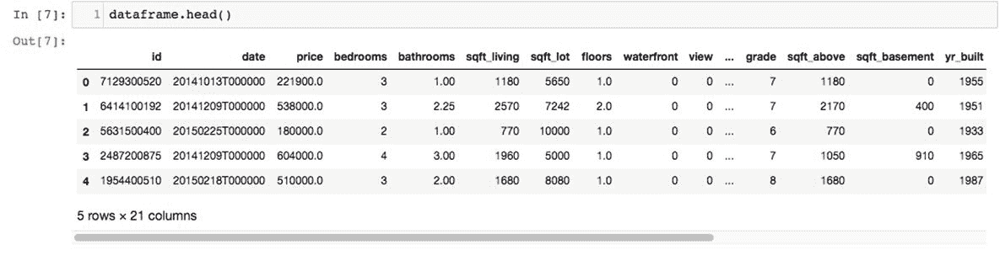

+   同样，可以使用`dataframe.tail()`函数打印`dataframe`的尾部，产生如下屏幕截图所示的输出：

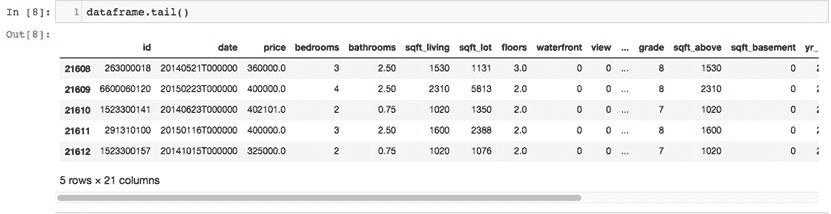

+   `dataframe.describe()`函数用于获得一些基本统计数据，如每列的最大值、最小值和平均值。如下屏幕截图所示：

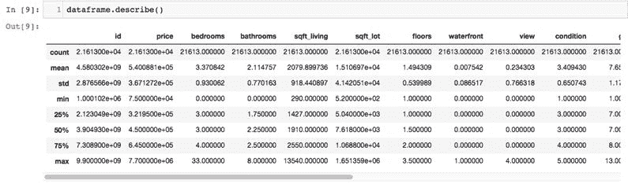

dataframe.describe()函数输出

+   正如您所看到的，数据集中有 21,613 条记录，记录了 1900 年至 2015 年间售出的房屋。

+   仔细观察统计数据，我们意识到大多数售出的房屋平均有大约三间卧室。我们还可以看到房屋中卧室数量的最小值为 0，最大的房屋有 33 间卧室，占地面积为 13,540 平方英尺。

# 如何做到...

1.  让我们绘制整个数据集中卧室数量的计数，以了解三居室房屋与两居室或一居室房屋的情况。使用以下代码完成：

```scala
dataframe['bedrooms'].value_counts().plot(kind='bar') plt.title('No. of bedrooms')
plt.xlabel('Bedrooms')
plt.ylabel('Count')
sns.despine
```

1.  我们也可以使用以下命令绘制相同数据的饼图：

```scala
 dataframe['bedrooms'].value_counts().plot(kind='pie')
plt.title('No. of bedrooms')
```

1.  接下来，让我们尝试看看金县最常售出的房屋有多少层。这可以通过使用以下命令绘制条形图来完成：

```scala
dataframe['floors'].value_counts().plot(kind='bar') plt.title('Number of floors')
plt.xlabel('No. of floors')
plt.ylabel('Count')
sns.despine
```

1.  接下来，我们需要了解哪些地点售出的房屋数量最多。我们可以使用数据集中的`latitude`和`longitude`变量来做到这一点，如下代码所示：

```scala
plt.figure(figsize=(20,20))
sns.jointplot(x=dataframe.lat.values, y=dataframe.long.values, size=9)
plt.xlabel('Longitude', fontsize=10)
plt.ylabel('Latitude', fontsize=10)
plt.show()
sns.despine()
```

1.  让我们也看看不同卧室数量的房屋价格如何相比，执行以下命令：

```scala
 plt.figure(figsize=(20,20))
sns.jointplot(x=dataframe.lat.values, y=dataframe.long.values, size=9)
plt.xlabel('Longitude', fontsize=10)
plt.ylabel('Latitude', fontsize=10)
plt.show()
sns.despine()
```

1.  使用以下命令获得房屋价格与卧室数量的图：

```scala
plt.figure(figsize=(20,20))
sns.jointplot(x=dataframe.lat.values, y=dataframe.long.values, size=9)
plt.xlabel('Longitude', fontsize=10)
plt.ylabel('Latitude', fontsize=10)
plt.show()
sns.despine()
```

1.  同样，让我们看看价格与所有售出房屋的居住面积的比较。这可以通过使用以下命令来完成：

```scala
plt.figure(figsize=(8,8))
plt.scatter(dataframe.price, dataframe.sqft_living)
plt.xlabel('Price')
plt.ylabel('Square feet')
plt.show()
```

1.  售出的房屋的条件也给了我们一些重要的信息。让我们将其与价格绘制在一起，以更好地了解一般趋势。使用以下命令完成：

```scala
plt.figure(figsize=(5,5))
plt.bar(dataframe.condition, dataframe.price)
plt.xlabel('Condition')
plt.ylabel('Price')
plt.show()
```

1.  我们可以使用以下命令查看哪些邮政编码在金县有最多的房屋销售：

```scala
plt.figure(figsize=(8,8))
plt.scatter(dataframe.zipcode, dataframe.price)
plt.xlabel('Zipcode')
plt.ylabel('Price')
plt.show()
```

1.  最后，绘制每个房屋的等级与价格的关系，以了解基于每个房屋的等级的房屋销售趋势，使用以下命令：

```scala
plt.figure(figsize=(10,10))
plt.scatter(dataframe.grade, dataframe.price)
plt.xlabel('Grade')
plt.ylabel('Price')
plt.show()
```

# 工作原理...

1.  卧室数量的图必须给出输出，如下屏幕截图所示：

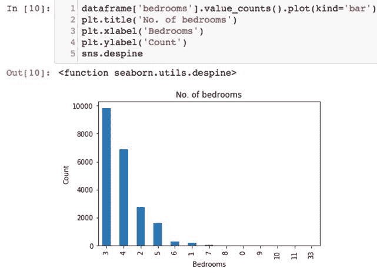

1.  很明显，三居室的房屋销售最多，其次是四居室，然后是两居室，然后是令人惊讶的五居室和六居室。

1.  卧室数量的饼图输出如下屏幕截图所示：

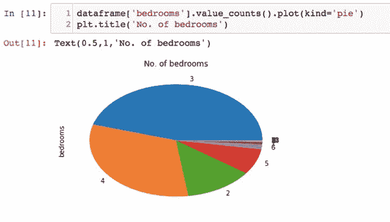

1.  您会注意到，三居室房屋大约占金县所有售出房屋的 50%。大约 25%是四居室房屋，其余 25%由两居室、五居室、六居室等房屋组成。

1.  运行脚本以查看按楼层分类的最常售出的房屋时，我们注意到以下输出：

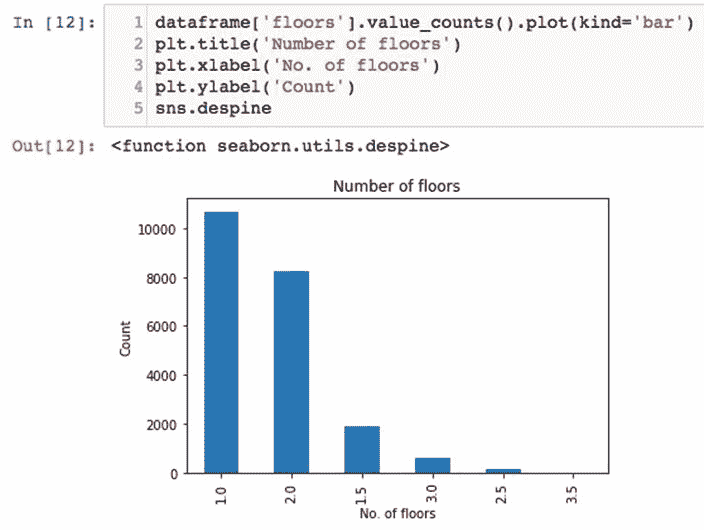

1.  很明显，单层房屋销售量最大，其次是两层房屋。超过两层的房屋数量相当少，这可能是家庭规模和居住在金县的居民收入的指示。

1.  检查不同位置出售房屋的密度后，我们得到了一个输出，如下面的屏幕截图所示。很明显，一些地方的房屋销售密度比其他地方要高：

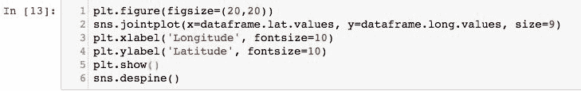

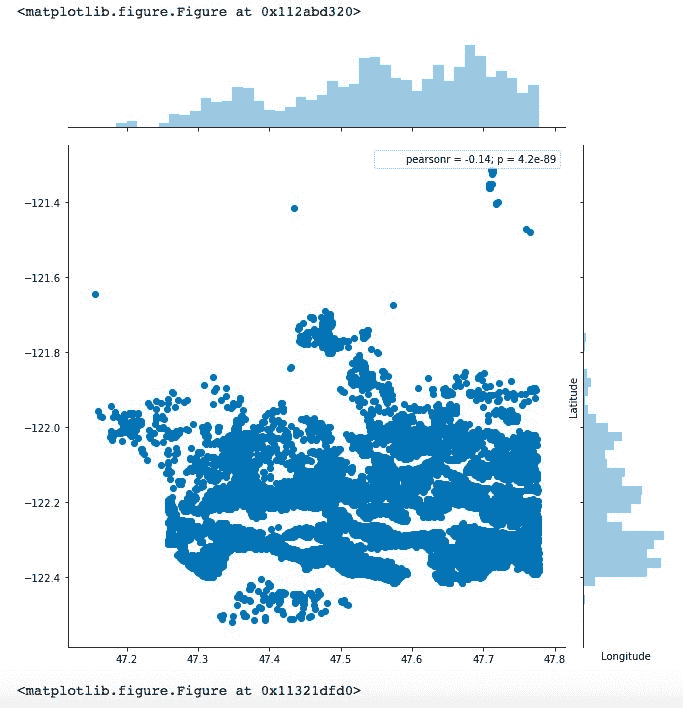

1.  从前述图表中观察到的趋势，很容易注意到在纬度-122.2 和-122.4 之间销售的房屋数量更多。同样，在经度 47.5 和 47.8 之间销售的房屋密度比其他经度更高。这可能是其他社区相比，更安全、更宜居社区的指示。

1.  在绘制房屋价格与房屋卧室数量的关系时，我们意识到房屋卧室数量与价格之间的趋势与价格成正比，直到六个卧室，然后变为反比，如下面的屏幕截图所示：

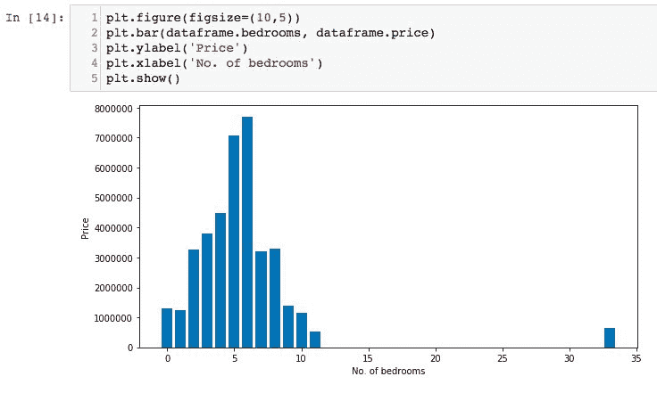

1.  将每个房屋的居住面积与价格进行对比，我们发现价格随着房屋面积的增加而增加的趋势。最昂贵的房屋似乎有 12000 平方英尺的居住面积，如下面的屏幕截图所示：

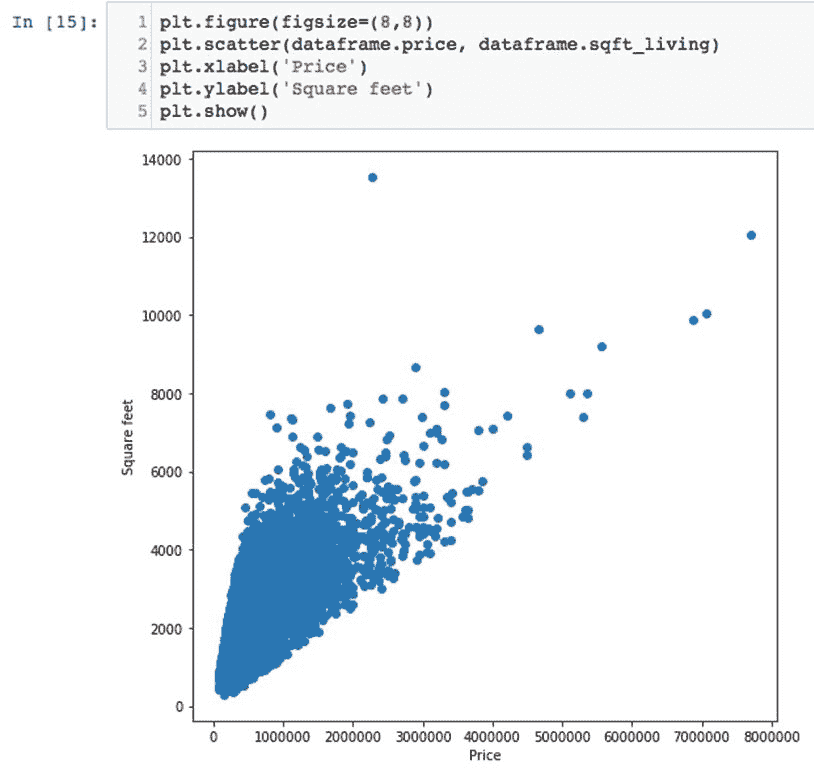

# 还有更多...

1.  在绘制房屋状况与价格的关系时，我们再次注意到了一个预期的趋势，即随着房屋状况评分的提高，价格也在增加，如下面的屏幕截图所示。有趣的是，五卧室房屋的平均价格比四卧室房屋要低，这可能是因为对这么大的房子的购买者较少：

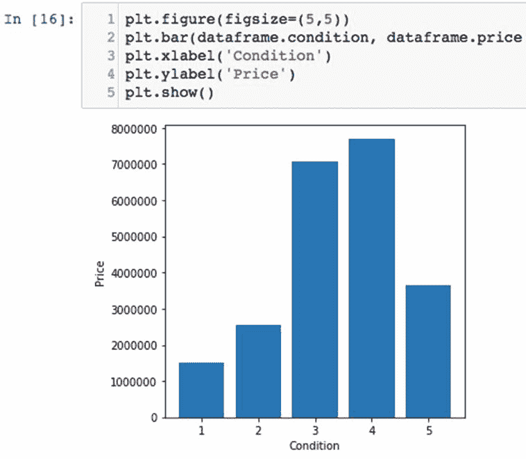

1.  房屋邮政编码与价格的图表显示了不同邮政编码地区房屋价格的趋势。您可能已经注意到，某些邮政编码，如 98100 至 98125 之间的邮政编码，比其他地区有更多的房屋销售密度，而 98040 邮政编码地区的房屋价格高于平均价格，可能表明这是一个更富裕的社区，如下面的屏幕截图所示：

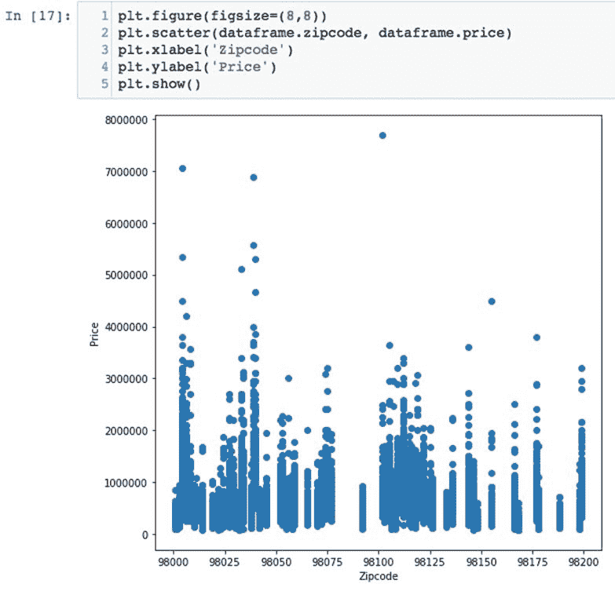

1.  房屋等级与价格的图表显示，随着等级的提高，价格呈一致增长的趋势。两者之间似乎存在明显的线性关系，如下面的屏幕截图所示：

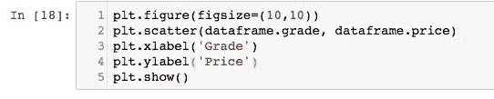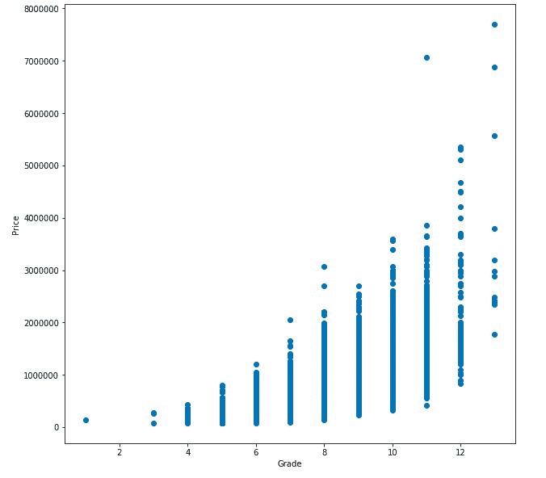

# 另请参阅

在对数据进行任何模型运行之前，以下链接很好地解释了为什么数据可视化如此重要：

+   [`www.slideshare.net/Centerline_Digital/the-importance-of-data-visualization`](https://www.slideshare.net/Centerline_Digital/the-importance-of-data-visualization)

+   [`data-visualization.cioreview.com/cxoinsight/what-is-data-visualization-and-why-is-it-important-nid-11806-cid-163.html`](https://data-visualization.cioreview.com/cxoinsight/what-is-data-visualization-and-why-is-it-important-nid-11806-cid-163.html)

+   [`www.techchange.org/2015/05/19/data-visualization-analysis-international-development/`](https://www.techchange.org/2015/05/19/data-visualization-analysis-international-development/)

# 绘制价格与其他特征之间的相关性

现在初步的探索性分析已经完成，我们对不同变量如何影响每个房屋的价格有了更好的了解。然而，我们不知道每个变量在预测价格时的重要性。由于我们有 21 个变量，如果将所有变量合并到一个模型中，建模就会变得困难。因此，一些变量可能需要被丢弃或忽略，如果它们的重要性不如其他变量。

# 准备工作

相关系数在统计学中用于衡量两个变量之间的关系强度。特别是，在进行线性回归时，皮尔逊相关系数是最常用的系数。相关系数通常取-1 到+1 之间的值：

+   相关系数为 1 意味着对于一个变量的正增加，另一个变量也会以固定比例正增加。例如，鞋子尺寸几乎与脚长完美相关。

+   相关系数为-1 意味着对于一个变量的正增加，另一个变量会以固定比例负减少。例如，油箱中的汽油量几乎与加速度或齿轮机构完美相关（在一档行驶的时间较长时，与四档相比，汽油的使用量减少）。

+   零意味着对于每次增加，没有正面或负面的增加。两者之间没有关系。

# 如何做...

1.  通过使用以下命令从数据集中删除`id`和`date`特征开始。在我们的预测中，我们不会使用它们，因为 ID 变量都是唯一的，在我们的分析中没有价值，而日期需要使用不同的函数来正确处理它们。这留给读者自己练习：

```scala
 x_df = dataframe.drop(['id','date',], axis = 1)
 x_df
```

1.  使用以下命令将因变量（在本例中为房价）复制到新的`dataframe`中：

```scala
 y = dataframe[['price']].copy()
 y_df = pd.DataFrame(y)
 y_df
```

1.  价格和其他每个变量之间的相关性可以通过以下脚本手动找到：

```scala
 print('Price Vs Bedrooms: %s' % x_df['price'].corr(x_df['bedrooms']))
 print('Price Vs Bathrooms: %s' % x_df['price'].corr(x_df['bathrooms']))
 print('Price Vs Living Area: %s' % x_df['price'].corr(x_df['sqft_living']))
 print('Price Vs Plot Area: %s' % x_df['price'].corr(x_df['sqft_lot']))
 print('Price Vs No. of floors: %s' % x_df['price'].corr(x_df['floors']))
 print('Price Vs Waterfront property: %s' % x_df['price'].corr(x_df['waterfront']))
 print('Price Vs View: %s' % x_df['price'].corr(x_df['view']))
 print('Price Vs Grade: %s' % x_df['price'].corr(x_df['grade']))
 print('Price Vs Condition: %s' % x_df['price'].corr(x_df['condition']))
 print('Price Vs Sqft Above: %s' % x_df['price'].corr(x_df['sqft_above']))
 print('Price Vs Basement Area: %s' % x_df['price'].corr(x_df['sqft_basement']))
 print('Price Vs Year Built: %s' % x_df['price'].corr(x_df['yr_built']))
 print('Price Vs Year Renovated: %s' % x_df['price'].corr(x_df['yr_renovated']))
 print('Price Vs Zipcode: %s' % x_df['price'].corr(x_df['zipcode']))
 print('Price Vs Latitude: %s' % x_df['price'].corr(x_df['lat']))
 print('Price Vs Longitude: %s' % x_df['price'].corr(x_df['long']))
```

1.  除了前面的方法，还可以通过以下方式使用一个命令在一个`dataframe`中找到一个变量与所有其他变量（或列）之间的相关性：

`x_df.corr().iloc[:,-19]`

1.  相关变量可以使用`seaborn`库和以下脚本绘制：

```scala
 sns.pairplot(data=x_df,
 x_vars=['price'],
 y_vars=['bedrooms', 'bathrooms', 'sqft_living',
 'sqft_lot', 'floors', 'waterfront','view',
 'grade','condition','sqft_above','sqft_basement',
 'yr_built','yr_renovated','zipcode','lat','long'],
 size = 5)
```

# 它是如何工作的...

1.  删除`id`和`date`变量后，新的名为`x_df`的`dataframe`包含 19 个变量或列，如以下截图所示。对于本书的目的，只打印出前十个条目：

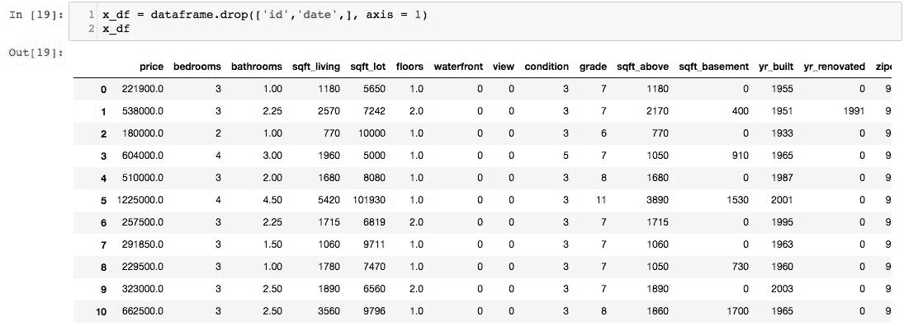

输出的前 10 个条目

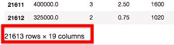

1.  创建一个只包含因变量（价格）的新`dataframe`，您将看到以下输出。这个新的`dataframe`名为`y_df`。同样，为了说明，只打印价格列的前十个条目：

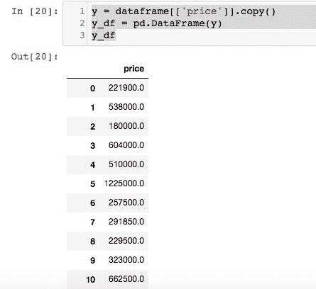

1.  价格和其他变量之间的相关性显示在以下截图中：

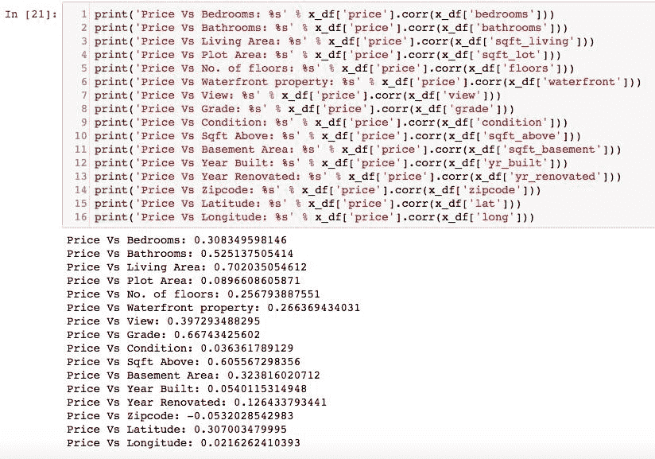

1.  您可能已经注意到，`sqft_living`变量与价格的相关性最高，相关系数为 0.702035。其次是`grade`，相关系数为 0.667434，其次是`sqft_above`，相关系数为 0.605567。`Zipcode`与价格的相关性最低，相关系数为-0.053202。

# 还有更多...

+   使用简化代码找到的相关系数给出了完全相同的值，但也给出了价格与自身的相关性，结果是 1.0000，这是预期的。如以下截图所示：

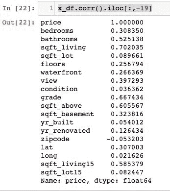

+   使用`seaborn`库绘制的相关系数在以下截图中呈现。请注意，每个图中价格都在 x 轴上：

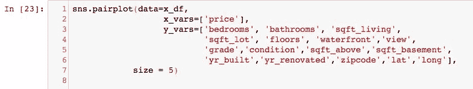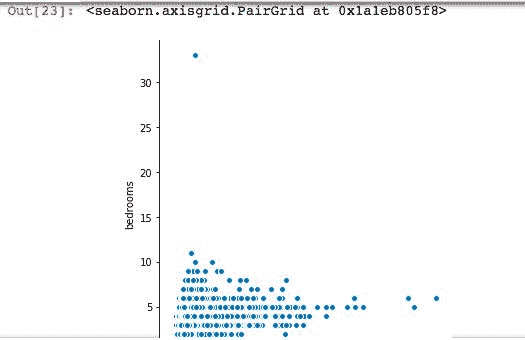

相关系数的绘制

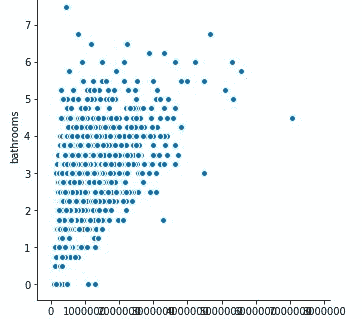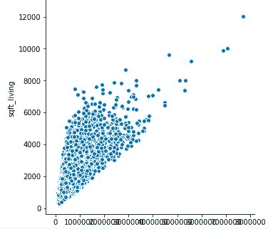

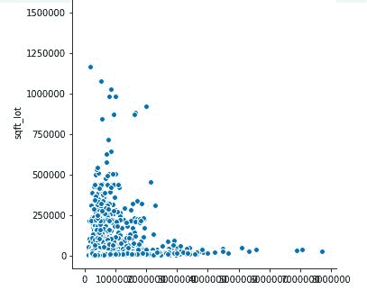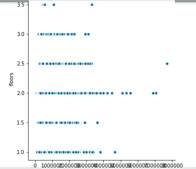

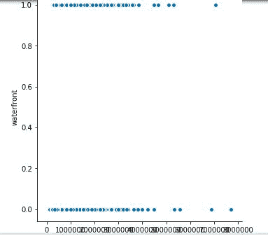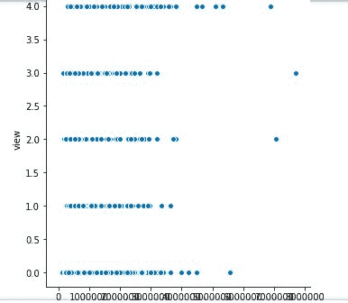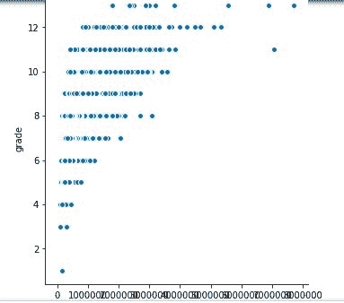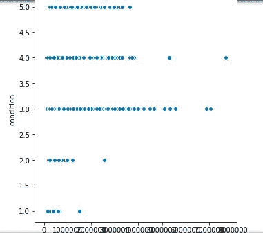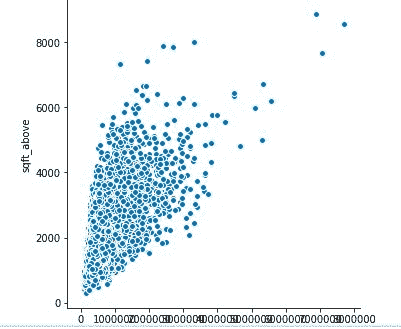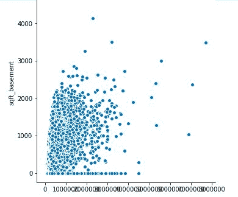

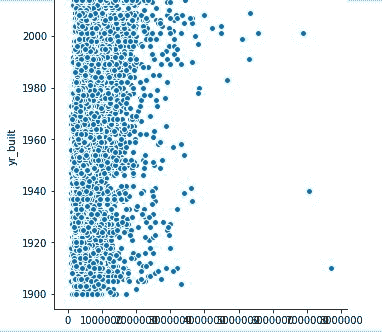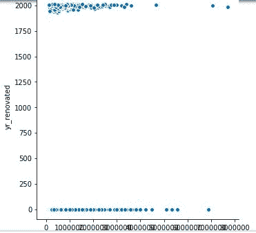

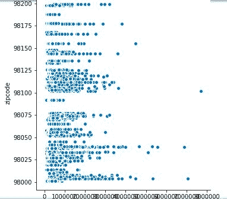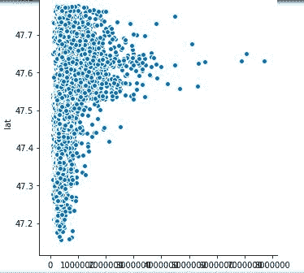

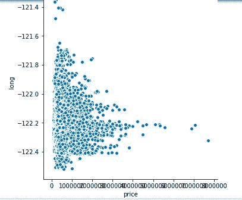

# 另请参阅

以下链接提供了对皮尔逊相关系数的出色解释以及如何手动计算它：

[`en.wikipedia.org/wiki/Pearson_correlation_coefficient`](https://en.wikipedia.org/wiki/Pearson_correlation_coefficient)

[`www.statisticshowto.com/probability-and-statistics/correlation-coefficient-formula/`](http://www.statisticshowto.com/probability-and-statistics/correlation-coefficient-formula/)

# 预测房价

本节将使用当前`数据框`中的所有特征构建一个简单的线性模型来预测房价。然后，我们将评估模型，并尝试在本节的后半部分使用更复杂的模型来提高准确性。

# 准备工作

访问以下链接以了解线性回归的工作原理以及如何在 Scikit Learn 库中使用线性回归模型：

[`en.wikipedia.org/wiki/Linear_regression`](https://en.wikipedia.org/wiki/Linear_regression)

[`www.stat.yale.edu/Courses/1997-98/101/linreg.htm`](http://www.stat.yale.edu/Courses/1997-98/101/linreg.htm)

[`newonlinecourses.science.psu.edu/stat501/node/251/`](https://newonlinecourses.science.psu.edu/stat501/node/251/)

[`scikit-learn.org/stable/modules/generated/sklearn.linear_model.LinearRegression.html`](http://scikit-learn.org/stable/modules/generated/sklearn.linear_model.LinearRegression.html)

[`scikit-learn.org/stable/modules/linear_model.html`](http://scikit-learn.org/stable/modules/linear_model.html)

# 如何做...

1.  使用以下脚本从`x_df`数据框中删除`Price`列，并将其保存到名为`x_df2`的新`数据框`中：

```scala
 x_df2 = x_df.drop(['price'], axis = 1)
```

1.  声明一个名为`reg`的变量，并使用以下脚本将其等于 Scikit Learn 库中的`LinearRegression()`函数：

```scala
 reg=linear_model.LinearRegression()
```

1.  使用以下脚本将数据集分割为测试集和训练集：

```scala
 x_train,x_test,y_train,y_test = train_test_split(x_df2,y_df,test_size=0.4,random_state=4)
```

1.  使用以下脚本在训练集上拟合模型：

```scala
 reg.fit(x_train,y_train)
```

1.  通过使用`reg.coef_`命令打印应用线性回归到训练集和测试集生成的系数。

1.  使用以下脚本生成的模型预测列进行查看：

```scala
 predictions=reg.predict(x_test)
 predictions
```

1.  使用以下命令打印模型的准确性：

```scala
 reg.score(x_test,y_test)
```

# 它是如何工作的...

1.  将回归模型拟合到训练集后的输出必须如下截屏所示：

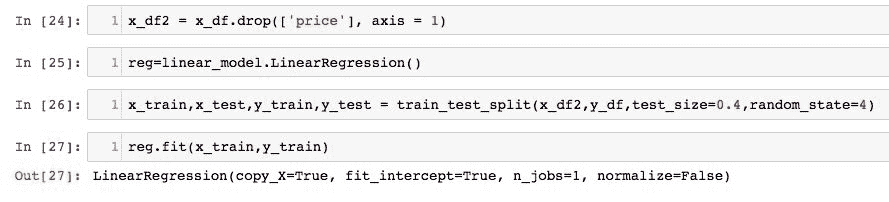

1.  `reg.coeff_`命令生成了 18 个系数，每个系数对应数据集中的一个变量，如下截屏所示：

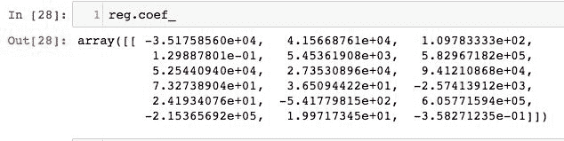

1.  具有最正值的特征/变量的系数在价格预测中具有更高的重要性，与具有负值的特征/变量的系数相比。这是回归系数的主要重要性。

1.  打印预测时，您必须看到一个输出，其中包含从 1 到 21,612 的值数组，数据集中的每一行都有一个值，如下截屏所示：

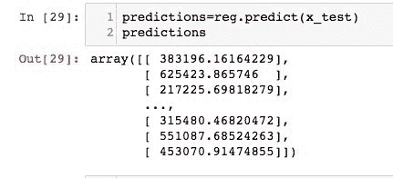

1.  最后，打印模型的准确性，我们获得了 70.37%的准确性，对于线性模型来说并不差。如下截屏所示：

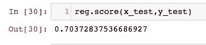

# 还有更多...

线性模型在第一次尝试时表现不错，但如果我们希望模型更准确，我们将不得不使用一个带有一些非线性的更复杂模型，以便很好地拟合所有数据点。XGBoost 是我们将在本节中使用的模型，以尝试通过线性回归提高准确性。这是以下方式完成的：

1.  使用`import xgboost`命令导入`XGBoost`库。

1.  如果出现错误，您将不得不通过终端进行库的 pip 安装。这可以通过打开一个新的终端窗口并发出以下命令来完成：

```scala
/usr/bin/ruby -e "$(curl -fsSL https://raw.githubusercontent.com/Homebrew/install/master/install)"
```

1.  在这个阶段，您必须看到一个输出，其外观如下截屏所示：

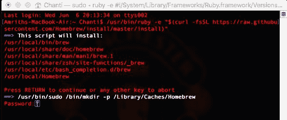

1.  在这个阶段，您将被提示输入密码。安装 Homebrew 后，您将看到如下截屏所示的输出：

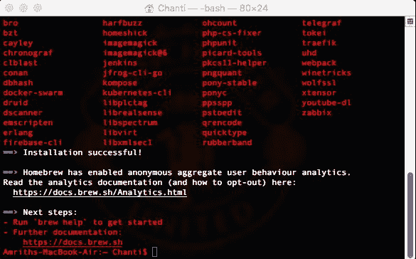

1.  接下来，使用以下命令安装 Python：

`brew install python`

1.  使用`brew doctor`命令检查您的安装并遵循 homebrew 的建议。

1.  一旦安装了`Homebrew`，请使用以下命令 pip 安装 XGBoost：

`pip install xgboost`

1.  安装完成后，您应该能够将 XGBoost 导入到 IPython 环境中。

一旦 XGBoost 成功导入到 Jupyter 环境中，您就可以使用库中的函数声明和存储模型。可以按以下步骤完成：

1.  声明一个名为`new_model`的变量来存储模型，并使用以下命令声明所有超参数：

```scala
new_model = xgboost.XGBRegressor(n_estimators=750, learning_rate=0.09,         gamma=0, subsample=0.65, colsample_bytree=1, max_depth=7)
```

1.  上述命令的输出必须看起来像以下截图中显示的那样：

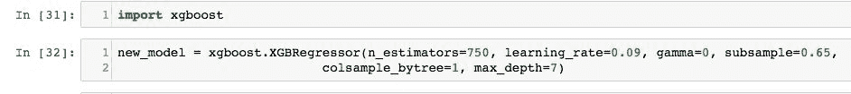

1.  将数据分割为测试集和训练集，并使用以下命令将新模型拟合到拆分数据中：

```scala
 from sklearn.model_selection import train_test_split
 traindf, testdf = train_test_split(x_train, test_size = 0.2)
 new_model.fit(x_train,y_train)
```

1.  在这一点上，您将看到类似以下截图中显示的输出：

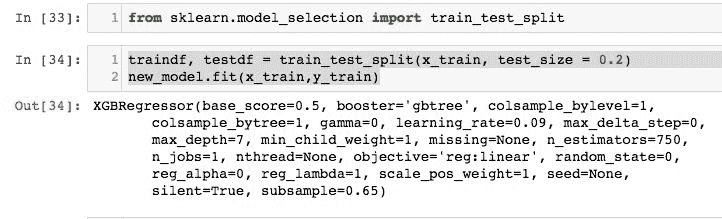

1.  最后，使用新拟合的模型预测房屋价格，并使用以下命令评估新模型：

```scala
 from sklearn.metrics import explained_variance_score
 predictions = new_model.predict(x_test)
 print(explained_variance_score(predictions,y_test))
```

1.  执行上述命令时，您必须看到类似以下截图中显示的输出：

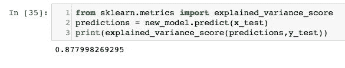

1.  请注意，新模型的准确性现在为 87.79%，约为 88%。这被认为是最佳的。

1.  在这种情况下，`估计器数量`设置为 750。在 100 到 1,000 之间进行实验后，确定 750 个估计器给出了最佳准确性。`学习率`设置为 0.09。`子采样率`设置为 65%。`最大深度`设置为 7。`max_depth`对模型准确性似乎没有太大影响。然而，使用较慢的学习率确实提高了准确性。通过尝试各种超参数，我们能够进一步将准确性提高到 89%。

1.  未来的步骤涉及对诸如卧室、浴室、楼层、邮政编码等变量进行独热编码，并在模型拟合之前对所有变量进行归一化。尝试调整超参数，如学习率、XGBoost 模型中的估计器数量、子采样率等，以查看它们如何影响模型准确性。这留给读者作为练习。

1.  此外，您可能希望尝试结合 XGBoost 和交叉验证，以找出模型中树的最佳数量，从而进一步提高准确性。

1.  可以进行的另一个练习是使用不同大小的测试和训练数据集，以及在训练过程中合并`date`变量。在我们的情况下，我们将其分割为 80%的训练数据和 20%的测试数据。尝试将测试集增加到 40%，看看模型准确性如何变化。

# 另请参阅

访问以下链接以了解如何调整 XGBoost 模型中的超参数以及如何在 XGBoost 中实现交叉验证：

[`xgboost.readthedocs.io/en/latest/python/index.html`](https://xgboost.readthedocs.io/en/latest/python/index.html)

[`xgboost.readthedocs.io/en/latest/get_started/`](http://xgboost.readthedocs.io/en/latest/get_started/)

[`www.kaggle.com/cast42/xg-cv`](https://www.kaggle.com/cast42/xg-cv)
