# 第九章：使用 LSTM 预测苹果股票市场成本

多年来一直有股票市场预测，并且已经产生了整个预言家行业。这并不奇怪，因为如果预测正确，它可以带来可观的利润。了解何时是买入或卖出股票的好时机是在华尔街占据上风的关键。本章将专注于使用 Keras 上的 LSTM 创建深度学习模型来预测 AAPL 的股票市场报价。

本章将涵盖以下配方：

+   下载苹果的股票市场数据

+   探索和可视化苹果的股票市场数据

+   为模型性能准备股票数据

+   构建 LSTM 模型

+   评估 LSTM 模型

# 下载苹果的股票市场数据

有许多资源可用于下载苹果的股票市场数据。对于我们的目的，我们将使用 Yahoo! Finance 网站。

# 准备工作

本节将需要初始化一个 Spark 集群，该集群将用于本章中的所有配方。可以在终端使用`sparknotebook`初始化 Spark 笔记本，如下屏幕截图所示：

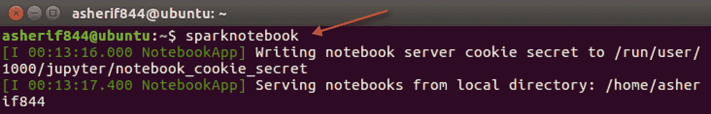

可以使用以下脚本在 Jupyter 笔记本中初始化`SparkSession`：

```scala
spark = SparkSession.builder \
    .master("local") \
    .appName("StockMarket") \
    .config("spark.executor.memory", "6gb") \
    .getOrCreate()
```

# 如何做到...

以下部分将介绍下载苹果的历史股票市场数据的步骤。

1.  访问以下网站，跟踪苹果的每日历史调整收盘股票价值，其股票代码为 AAPL：[`finance.yahoo.com/quote/AAPL/history`](https://finance.yahoo.com/quote/AAPL/history)

1.  设置并应用以下参数到历史数据选项卡：

1.  时间段：2000 年 1 月 1 日至 2018 年 4 月 30 日。

1.  显示：历史价格。

1.  频率：每日。

1.  通过单击下载数据链接，使用指定参数将数据集下载到`.csv`文件中，如下屏幕截图所示：

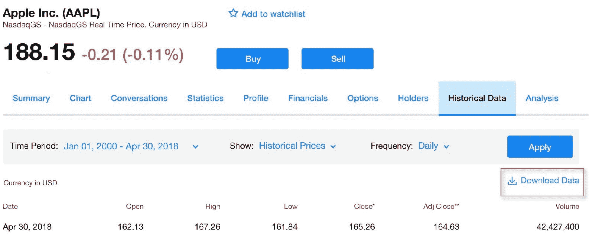

1.  下载文件`AAPL.csv`，然后使用以下脚本将相同的数据集上传到 Spark 数据框中：

```scala
df =spark.read.format('com.databricks.spark.csv')\
   .options(header='true', inferschema='true')\
   .load('AAPL.csv')
```

# 工作原理...

以下部分解释了如何将股票市场数据纳入 Jupyter 笔记本。

1.  Yahoo! Finance 是公开交易公司股票市场报价的重要来源。苹果的股票报价 AAPL 在纳斯达克交易，可以捕获历史报价以进行模型开发和分析。Yahoo! Finance 提供了在每日、每周或每月快照上捕获股票报价的选项。

1.  本章的目的是在每日级别预测股票，因为这将为我们的训练模型带来最多的数据。我们可以通过追溯数据到 2000 年 1 月 1 日，一直到 2018 年 4 月 30 日来实现这一点。

1.  一旦我们设置了下载参数，我们就会从 Yahoo! Finance 收到一个格式良好的逗号分隔值文件，可以很容易地转换为具有最少问题的 Spark 数据框。

1.  数据框将允许我们每天查看股票的日期、开盘价、最高价、最低价、收盘价、调整收盘价和成交量。数据框中的列跟踪开盘和收盘股票价值，以及当天交易的最高和最低价值。还捕获了当天交易的股票数量。Spark 数据框的输出`df`可以通过执行`df.show()`来显示，如下面的屏幕截图所示：

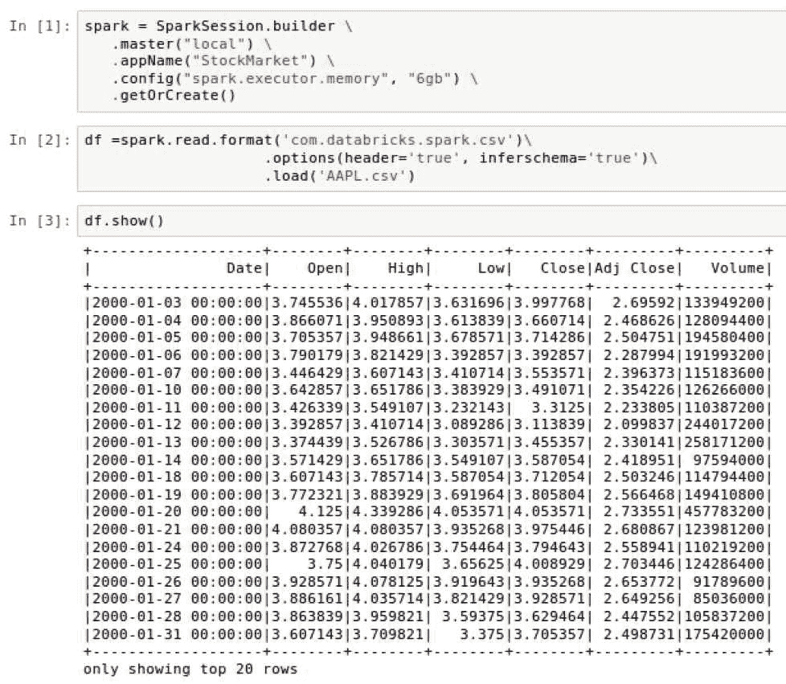

# 还有更多...

Python 有股票市场 API，允许您自动连接并拉取公开交易公司（如苹果）的股票市场报价。您需要输入参数并检索可以存储在数据框中的数据。然而，截至 2018 年 4 月，*Yahoo! Finance* API 不再运作，因此不是提取本章数据的可靠解决方案。

# 另请参阅

`Pandas_datareader` 是一个非常强大的库，可以从网站上提取数据，例如 Yahoo! Finance。要了解更多关于该库以及它如何在恢复在线后与 Yahoo! Finance 连接的信息，请访问以下网站：

[`github.com/pydata/pandas-datareader`](https://github.com/pydata/pandas-datareader)

# 探索和可视化苹果股票市场数据

在对数据进行任何建模和预测之前，首先探索和可视化手头的数据是很重要的，以发现任何隐藏的宝藏。

# 准备工作

在本节中，我们将对数据框进行转换和可视化。这将需要在 Python 中导入以下库：

+   `pyspark.sql.functions`

+   `matplotlib`

# 如何做...

以下部分将介绍探索和可视化股票市场数据的步骤。

1.  使用以下脚本通过删除时间戳来转换数据框中的 `Date` 列：

```scala
import pyspark.sql.functions as f
df = df.withColumn('date', f.to_date('Date'))
```

1.  创建一个循环来向数据框添加三个额外的列。循环将把 `date` 字段分解为 `year`、`month` 和 `day`，如下面的脚本所示：

```scala
date_breakdown = ['year', 'month', 'day']
for i in enumerate(date_breakdown):
    index = i[0]
    name = i[1]
    df = df.withColumn(name, f.split('date', '-')[index])
```

1.  使用以下脚本将 Spark 数据框的子集保存到名为 `df_plot` 的 `pandas` 数据框中：`df_plot = df.select('year', 'Adj Close').toPandas()`.

1.  使用以下脚本在笔记本中绘制和可视化 `pandas` 数据框 `df_plot`：

```scala
from matplotlib import pyplot as plt
%matplotlib inline

df_plot.set_index('year', inplace=True)
df_plot.plot(figsize=(16, 6), grid=True)
plt.title('Apple stock')
plt.ylabel('Stock Quote ($)')
plt.show()
```

1.  使用以下脚本计算我们的 Spark 数据框的行和列数：`df.toPandas().shape`。

1.  执行以下脚本来确定数据框中的空值：`df.dropna().count()`。

1.  执行以下脚本来获取 `Open`、`High`、`Low`、`Close` 和 `Adj Close` 的统计数据：

```scala
df.select('Open', 'High', 'Low', 'Close', 'Adj Close').describe().show()
```

# 它是如何工作的...

以下部分解释了探索性数据分析所使用的技术和获得的见解。

1.  数据框中的日期列更像是一个带有时间值的日期时间列，所有时间值都以 00:00:00 结尾。这对于我们建模过程中的需求是不必要的，因此可以从数据集中删除。幸运的是，PySpark 有一个 `to_date` 函数可以很容易地做到这一点。数据框 `df` 使用 `withColumn()` 函数进行转换，现在只显示日期列而没有时间戳，如下面的屏幕截图所示：

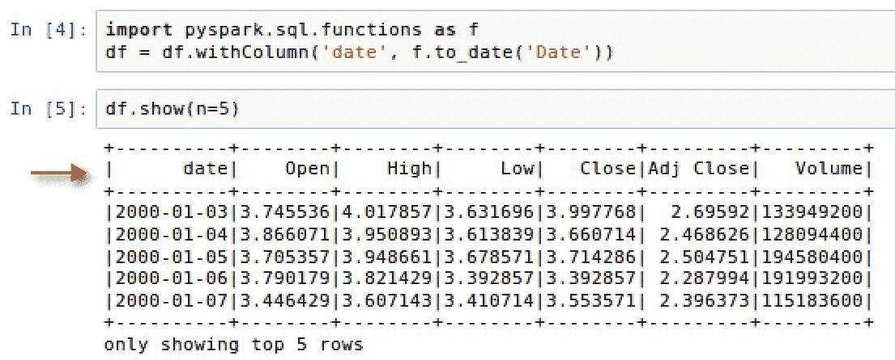

1.  为了分析目的，我们想要从日期列中提取 `day`、`month` 和 `year`。我们可以通过枚举一个自定义列表 `date_breakdown` 来实现这一点，通过 `-` 分割日期，然后使用 `withColumn()` 函数为年、月和日添加新列。更新后的数据框中可以看到新添加的列，如下面的屏幕截图所示：

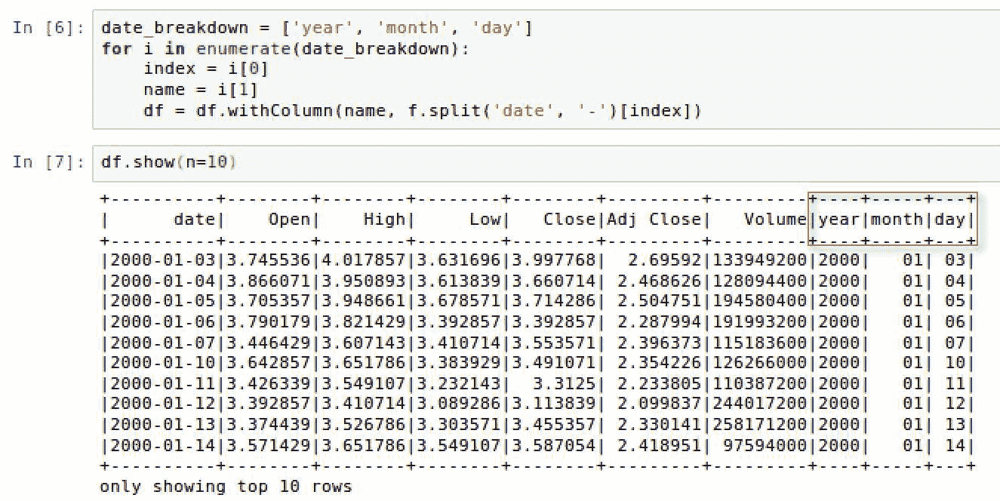

一个重要的要点是，`PySpark` 也有一个用于日期的 SQL 函数，可以从日期时间戳中提取日、月或年。例如，如果我们要向数据框添加一个月份列，我们将使用以下脚本：`df.withColumn("month",f.month("date")).show()`。这是为了突出在 Spark 中有多种方法可以转换数据。

1.  Spark 数据框的可视化功能比 `pandas` 数据框更有限。因此，我们将从 Spark 数据框 `df` 中提取两列，并将它们转换为 `pandas` 数据框，以绘制线形或时间序列图。y 轴将是股票的调整收盘价，x 轴将是日期的年份。

1.  准备好的 pandas 数据框 df_plot 可以在设置一些格式特性后使用 matplotlib 进行绘制，例如网格可见性、绘图的图形大小以及标题和轴的标签。此外，我们明确指出数据框的索引需要指向年份列。否则，默认索引将出现在 x 轴上而不是年份。最终的时间序列图可以在下面的屏幕截图中看到：

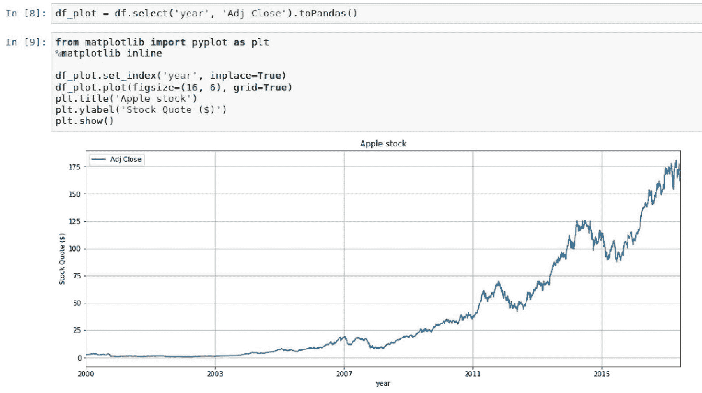

1.  在过去的 18 年中，苹果经历了广泛的增长。虽然有几年出现了一些下跌，但总体趋势是稳步上升，过去几年的股票报价在 150 美元和 175 美元之间徘徊。

1.  到目前为止，我们对数据框进行了一些更改，因此重要的是要对行和列的总数进行清点，因为这将影响后面在本章中对数据集进行测试和训练的方式。如下截图所示，我们总共有 10 列和 4,610 行：

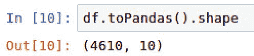

1.  当执行`df.dropna().count()`时，我们可以看到行数仍然是 4,610，与上一步的行数相同，表明没有任何行具有空值。

1.  最后，我们可以得到每个将用于模型的列的行数、均值、标准差、最小值和最大值的良好读数。这可以帮助确定数据中是否存在异常。需要注意的一点是，将用于模型的五个字段的标准差都高于均值，表明数据更分散，而不是围绕均值聚集。可以在以下截图中看到 Open、High、Low、Close 和 Adj Close 的统计数据：

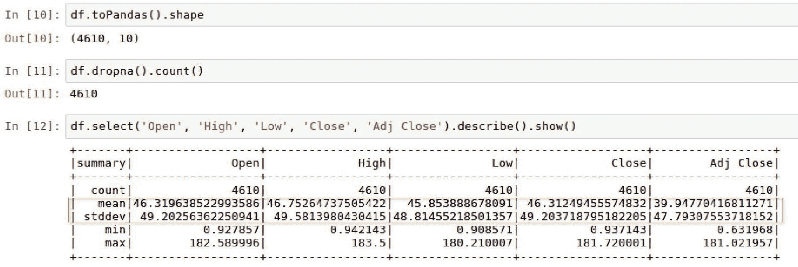

# 还有更多...

虽然 Spark 中的数据框没有`pandas`数据框中的本地可视化功能，但有些公司可以通过笔记本提供高级可视化功能，而无需使用诸如`matplotlib`之类的库。Databricks 是一家提供此功能的公司之一。

以下是使用 Databricks 笔记本中内置功能的可视化示例：

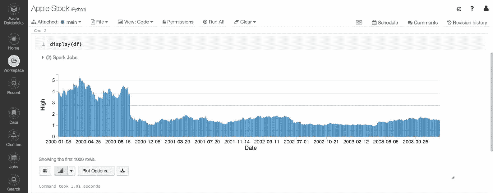

# 另请参阅

要了解有关 Databricks 的更多信息，请访问以下网站：[`databricks.com/`](https://databricks.com/)。

要了解 Databricks 笔记本中的可视化更多信息，请访问以下网站：[`docs.databricks.com/user-guide/visualizations/index.html`](https://docs.databricks.com/user-guide/visualizations/index.html)。

要了解如何通过 Microsoft Azure 订阅访问 Databricks 的更多信息，请访问以下网站：

[`azure.microsoft.com/en-us/services/databricks/`](https://azure.microsoft.com/en-us/services/databricks/)

# 为模型性能准备股票数据

我们几乎准备好为苹果的股票价值表现构建预测算法了。手头剩下的任务是以确保最佳预测结果的方式准备数据。

# 准备工作

在本节中，我们将对数据框执行转换和可视化。这将需要在 Python 中导入以下库：

+   `numpy`

+   `MinMaxScaler()`

# 如何做...

本节将介绍为我们的模型准备股票市场数据的步骤。

1.  执行以下脚本将年份列按`Adj Close`计数分组：

```scala
df.groupBy(['year']).agg({'Adj Close':'count'})\
     .withColumnRenamed('count(Adj Close)', 'Row Count')\
     .orderBy(["year"],ascending=False)\
     .show()
```

1.  执行以下脚本创建两个新的用于训练和测试的数据框：

```scala
trainDF = df[df.year < 2017]
testDF = df[df.year > 2016]
```

1.  使用以下脚本将两个新数据框转换为`pandas`数据框，以获取行和列计数：

```scala
trainDF.toPandas().shape
testDF.toPandas().shape
```

1.  与`df`之前所做的一样，我们使用以下脚本可视化`trainDF`和`testDF`：

```scala
trainDF_plot = trainDF.select('year', 'Adj Close').toPandas()
trainDF_plot.set_index('year', inplace=True)
trainDF_plot.plot(figsize=(16, 6), grid=True)
plt.title('Apple Stock 2000-2016')
plt.ylabel('Stock Quote ($)')
plt.show()

testDF_plot = testDF.select('year', 'Adj Close').toPandas()
testDF_plot.set_index('year', inplace=True)
testDF_plot.plot(figsize=(16, 6), grid=True)
plt.title('Apple Stock 2017-2018')
plt.ylabel('Stock Quote ($)')
plt.show()
```

1.  我们根据以下脚本创建两个新数组`trainArray`和`testArray`，除了日期列以外的数据框的数据：

```scala
import numpy as np
trainArray = np.array(trainDF.select('Open', 'High', 'Low',                     'Close','Volume', 'Adj Close' ).collect())
testArray = np.array(testDF.select('Open', 'High', 'Low', 'Close','Volume',     'Adj Close' ).collect())
```

1.  为了将数组缩放到 0 到 1 之间，从`sklearn`导入`MinMaxScaler`并创建一个函数调用`MinMaxScale`，使用以下脚本：

```scala
from sklearn.preprocessing import MinMaxScaler
minMaxScale = MinMaxScaler()
```

1.  然后在`trainArray`上拟合`MinMaxScaler`并使用以下脚本创建两个新数组，以便进行缩放：

```scala
minMaxScale.fit(trainArray)

testingArray = minMaxScale.transform(testArray)
trainingArray = minMaxScale.transform(trainArray)
```

1.  使用以下脚本将`testingArray`和`trainingArray`拆分为特征`x`和标签`y`：

```scala
xtrain = trainingArray[:, 0:-1]
xtest = testingArray[:, 0:-1]
ytrain = trainingArray[:, -1:]
ytest = testingArray[:, -1:]
```

1.  执行以下脚本以检索所有四个数组的最终形状清单：

```scala
print('xtrain shape = {}'.format(xtrain.shape))
print('xtest shape = {}'.format(xtest.shape))
print('ytrain shape = {}'.format(ytrain.shape))
print('ytest shape = {}'.format(ytest.shape))
```

1.  执行以下脚本来绘制报价`open`、`high`、`low`和`close`的训练数组：

```scala
plt.figure(figsize=(16,6))
plt.plot(xtrain[:,0],color='red', label='open')
plt.plot(xtrain[:,1],color='blue', label='high')
plt.plot(xtrain[:,2],color='green', label='low')
plt.plot(xtrain[:,3],color='purple', label='close')
plt.legend(loc = 'upper left')
plt.title('Open, High, Low, and Close by Day')
plt.xlabel('Days')
plt.ylabel('Scaled Quotes')
plt.show()
```

1.  此外，我们使用以下脚本绘制`volume`的训练数组：

```scala
plt.figure(figsize=(16,6))
plt.plot(xtrain[:,4],color='black', label='volume')
plt.legend(loc = 'upper right')
plt.title('Volume by Day')
plt.xlabel('Days')
plt.ylabel('Scaled Volume')
plt.show()
```

# 工作原理...

本节将解释数据在模型中使用时所需的转换。

1.  建立模型的第一步之一是将数据分割为训练和测试数据集，以进行模型评估。我们的目标是使用 2000 年至 2016 年的所有股票报价来预测 2017 年至 2018 年的股票趋势。我们知道从前面的部分我们有总共 4,610 天的股票报价，但我们不知道每年有多少。我们可以使用数据框中的`groupBy()`函数来获取每年股票报价的唯一计数，如下图所示：

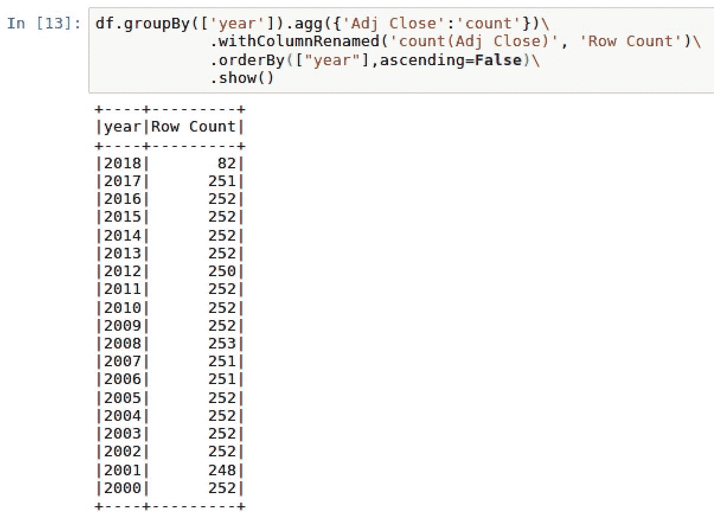

1.  2016 年和 2017 年的合并数据大约占总数据的 7%，这对于测试数据集来说有点小。但是，对于这个模型的目的来说，应该是足够的。剩下的 93%的数据将用于 2000 年至 2016 年的训练。因此，使用筛选器创建了两个数据框，以确定是否包括或排除 2016 年之前或之后的行。

1.  我们现在可以看到测试数据集`testDF`包含 333 行，而训练数据集`trainDF`包含 4,277 行。当两者合并时，我们可以得到原始数据框`df`的总行数为 4,610。最后，我们看到`testDF`仅由 2017 年和 2018 年的数据组成，2017 年有 251 行，2018 年有 82 行，总共 333 行，如下图所示：

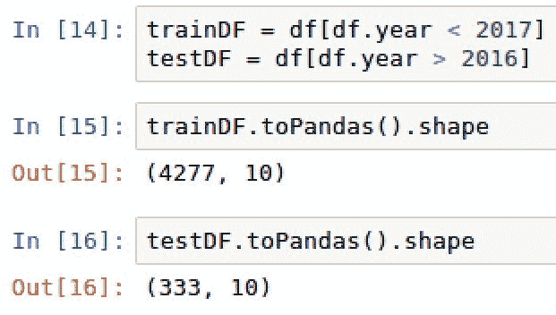

请注意，每当我们将 Spark 数据框转换为`pandas`数据框时，它可能不适用于大数据。虽然对于我们的特定示例它可以工作，因为我们使用的是相对较小的数据集，但是将数据转换为`pandas`数据框意味着所有数据都加载到驱动程序的内存中。一旦发生这种转换，数据就不会存储在 Spark 工作节点中，而是存储在主驱动节点中。这并不是最佳的做法，可能会产生内存不足的错误。如果您发现需要将 Spark 转换为`pandas`数据框来可视化数据，建议从 Spark 中提取一个随机样本，或者将 Spark 数据聚合到一个更易管理的数据集中，然后在`pandas`中进行可视化。

1.  一旦将数据的子集转换为`toPandas()`以利用`pandas`的内置绘图功能，就可以使用`matplotlib`可视化测试和训练数据框。将数据框并排可视化展示了当未缩放调整收盘价的 y 轴时，图表看起来相似。实际上，我们可以看到`trainDF_plot`从 0 开始，而`testDF_plot`从 110 开始，如下两个截图所示。

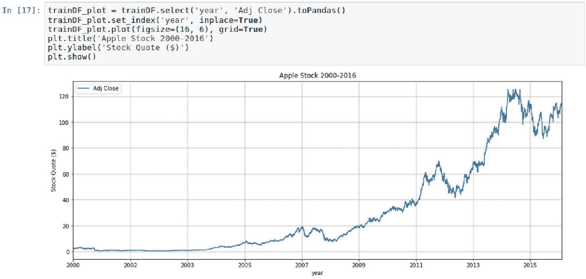

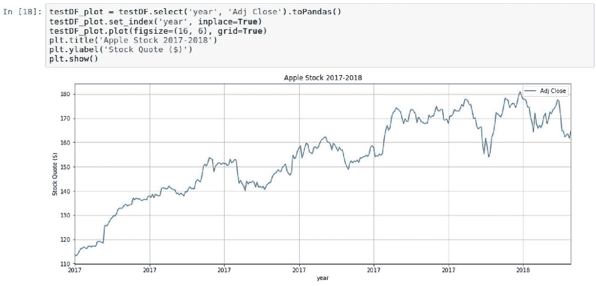

1.  目前我们的股票价值不适合深度学习建模，因为没有归一化或标准化的基线。在使用神经网络时，最好将值保持在 0 到 1 之间，以匹配 Sigmoid 或 Step 函数中的结果，这些函数用于激活。为了实现这一点，我们必须首先将`pyspark`数据框`trainDF`和`testDF`转换为`numpy`数组，即`trainArray`和`testArray`。由于这些现在是数组而不是数据框，我们将不再使用日期列，因为神经网络只对数值感兴趣。每个数组的第一个值可以在以下截图中看到：

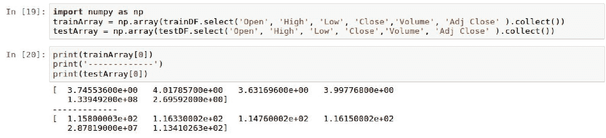

1.  有许多方法可以将数组值缩放到 0 到 1 之间的范围。它涉及使用以下公式：`缩放后的数组值 = (数组值 - 最小数组值) / (最大数组值 - 最小数组值)`。幸运的是，我们不需要手动计算数组的值。我们可以利用`sklearn`中的`MinMaxScaler()`函数来缩放这两个数组。

1.  `MinMaxScaler()`函数适用于训练数组`trainArray`，然后应用于创建两个全新的数组`trainingArray`和`testingArray`，它们的值在 0 到 1 之间进行了缩放。每个数组的第一行可以在下面的截图中看到：

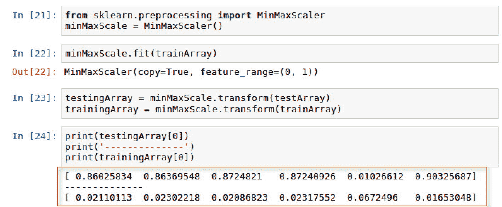

1.  现在，我们准备通过将数组切片为测试和训练目的的 x 和 y 来设置我们的标签和特征变量。数组中的前五个元素是特征或 x 值，最后一个元素是标签或 y 值。特征由 Open、High、Low、Close 和 Volume 的值组成。标签由 Adj Close 组成。`trainingArray`的第一行的拆分可以在下面的截图中看到：

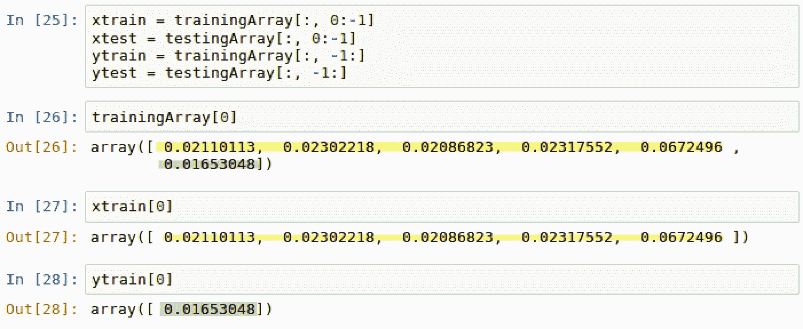

1.  最后，我们将查看我们在模型中将要使用的四个数组的形状，以确认我们有 4,227 个训练数据矩阵行，333 个测试数据矩阵行，5 个特征元素(`x`)和 1 个标签元素(`y`)，如下截图所示：

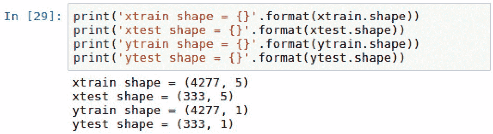

1.  训练数组`xtrain`的 open、low、high 和 close 的值可以使用新调整的 0 到 1 之间的标度绘制报价，如下截图所示：

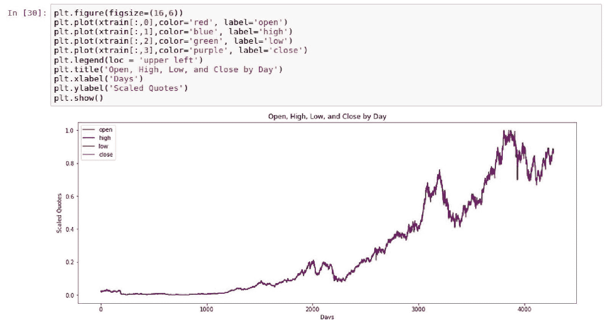

1.  此外，`volume`也可以使用 0 到 1 之间的缩放体积得分绘制，如下截图所示：

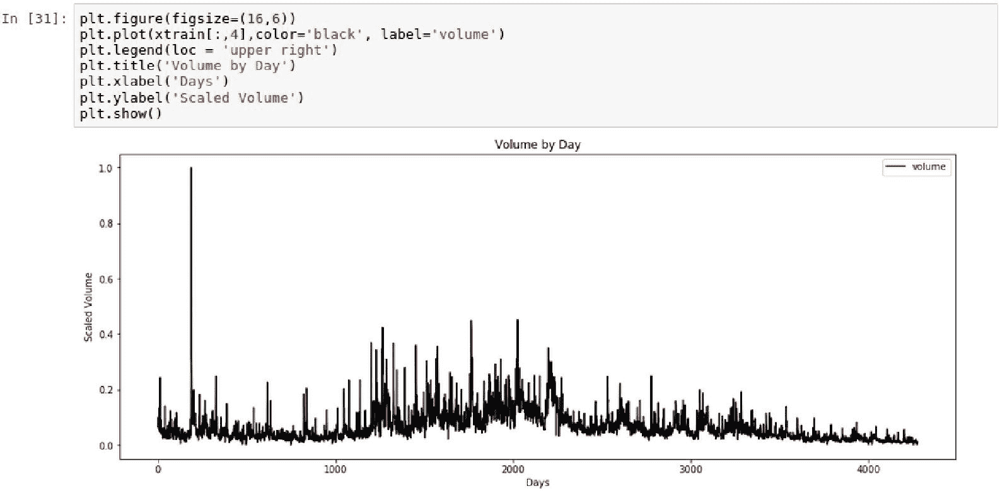

# 还有更多...

虽然我们使用了来自`sklearn`的`MinMaxScaler`，但也很重要的是要了解，`pyspark.ml.feature`中也有一个`MinMaxScaler`函数可供使用。它的工作方式与`sklearn`完全相同，通过将每个特征重新缩放为 0 到 1 之间的值。如果我们在本章中使用了 PySpark 中的机器学习库来进行预测，我们将使用`pyspark.ml.feature`中的`MinMaxScaler`。

# 另请参阅

要了解来自`sklearn`的`MinMaxScaler`的更多信息，请访问以下网站：

[`scikit-learn.org/stable/modules/generated/sklearn.preprocessing.MinMaxScaler.html.`](http://scikit-learn.org/stable/modules/generated/sklearn.preprocessing.MinMaxScaler.html)

要了解来自`pyspark`的`MinMaxScaler`的更多信息，请访问以下网站：

[`spark.apache.org/docs/2.2.0/ml-features.html#minmaxscaler.`](https://spark.apache.org/docs/2.2.0/ml-features.html#minmaxscaler)

# 构建 LSTM 模型

现在数据以符合 Keras 用于 LSTM 建模的模型开发格式。因此，我们将在本节中设置和配置深度学习模型，以预测 2017 年和 2018 年苹果股票报价。

# 准备工作

在本节中，我们将对模型进行模型管理和超参数调整。这将需要在 Python 中导入以下库：

```scala
from keras import models
from keras import layers
```

# 如何做...

本节将介绍设置和调整 LSTM 模型的步骤。

1.  使用以下脚本从`keras`导入以下库：

```scala
from keras import models, layers
```

1.  使用以下脚本构建一个`Sequential`模型：

```scala
model = models.Sequential()
model.add(layers.LSTM(1, input_shape=(1,5)))
model.add(layers.Dense(1))
model.compile(loss='mean_squared_error', optimizer='adam')
```

1.  使用以下脚本将测试和训练数据集转换为三维数组：

```scala
xtrain = xtrain.reshape((xtrain.shape[0], 1, xtrain.shape[1]))
xtest = xtest.reshape((xtest.shape[0], 1, xtest.shape[1]))
```

1.  使用以下脚本使用名为`loss`的变量来`fit`模型：

```scala
loss = model.fit(xtrain, ytrain, batch_size=10, epochs=100)
```

1.  使用以下脚本创建一个新数组`predicted`：

```scala
predicted = model.predict(xtest)
```

1.  使用以下脚本将`predicted`和`ytest`数组合并成一个统一的数组`combined_array`：

```scala
combined_array = np.concatenate((ytest, predicted), axis = 1)
```

# 它是如何工作的...

本节解释了如何配置 LSTM 神经网络模型以在我们的数据集上进行训练。

1.  大部分用于构建 LSTM 模型的`keras`功能将来自`models`和`layers`。

1.  构建的`LSTM`模型将使用`Sequential`类进行定义，该类与依赖于序列的时间序列非常匹配。LSTM 模型的`input_shape = (1,5)`，表示我们的训练数据集中有一个因变量和五个自变量。只使用一个`Dense`层来定义神经网络，因为我们希望保持模型简单。在 keras 中编译模型时需要一个损失函数，由于我们正在对递归神经网络进行操作，因此最好使用`mean_squared_error`计算来确定预测值与实际值的接近程度。最后，在编译模型时还需要定义一个优化器来调整神经网络中的权重。`adam`在递归神经网络中表现良好，尤其是在使用时。

1.  我们当前的数组`xtrain`和`xtest`目前是二维数组；然而，为了将它们纳入 LSTM 模型中，它们需要使用`reshape()`转换为三维数组，如下面的屏幕截图所示：

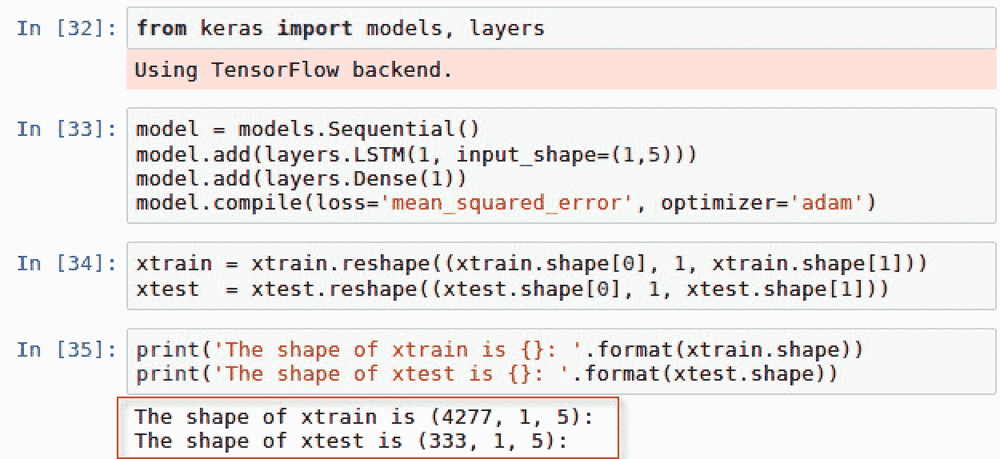

1.  LSTM 模型使用`xtrain`和`ytrain`进行拟合，批量大小设置为 10，时期数设置为 100。批量大小是定义一起训练的对象数量的设置。我们可以根据需要设置批量大小的大小，但要记住，批量数量越低，需要的内存就越多。此外，时期是模型遍历整个数据集的次数的度量。最终，这些参数可以根据时间和内存分配进行调整。

每个时期的均方误差损失都被捕获并可视化。在第五或第六个时期之后，我们可以看到损失逐渐减小，如下面的屏幕截图所示：

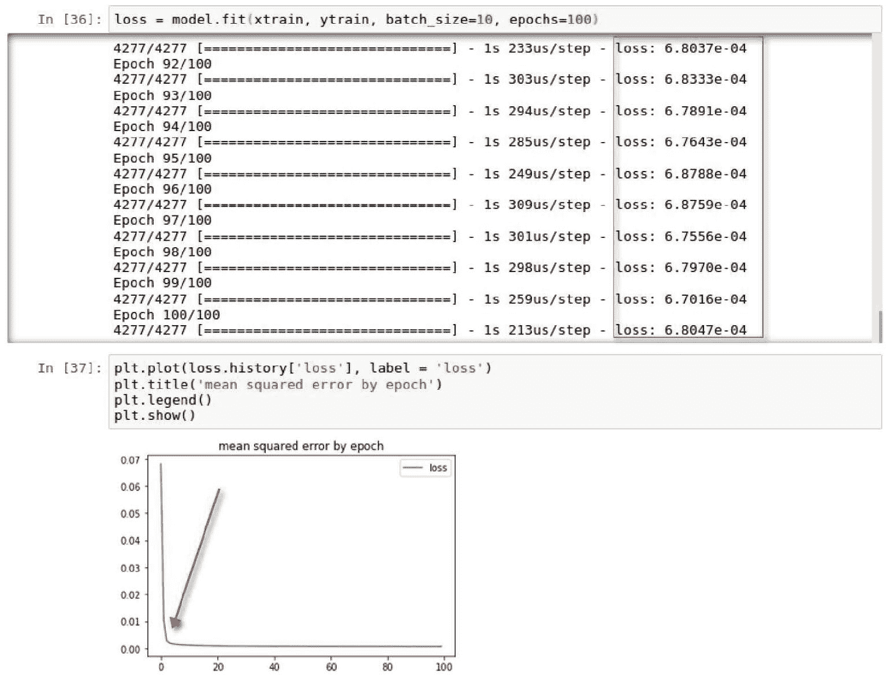

1.  我们现在可以创建一个新数组`predicted`，基于应用于`xtest`的拟合模型，然后将其与`ytest`结合在一起，以便进行准确性比较。

# 另请参阅

要了解更多关于 keras 中参数调整模型的信息，请访问以下网站：[`keras.io/models/model/`](https://keras.io/models/model/)

# 评估模型

现在到了关键时刻：我们将看看我们的模型是否能够为 2017 年和 2018 年的 AAPL 股票提供良好的预测。

# 准备工作

我们将使用均方误差进行模型评估。因此，我们需要导入以下库：

```scala
import sklearn.metrics as metrics
```

# 如何做...

本节介绍了可视化和计算 2017 年和 2018 年苹果公司预测与实际股票报价的过程。

1.  绘制`Actual`与`Predicted`股票的并排比较图，使用以下脚本：

```scala
plt.figure(figsize=(16,6))
plt.plot(combined_array[:,0],color='red', label='actual')
plt.plot(combined_array[:,1],color='blue', label='predicted')
plt.legend(loc = 'lower right')
plt.title('2017 Actual vs. Predicted APPL Stock')
plt.xlabel('Days')
plt.ylabel('Scaled Quotes')
plt.show()
```

1.  使用以下脚本计算实际`ytest`与`predicted`股票之间的均方误差：

```scala
import sklearn.metrics as metrics
np.sqrt(metrics.mean_squared_error(ytest,predicted))
```

# 工作原理...

本节解释了 LSTM 模型评估的结果。

1.  从图形上看，我们可以看到我们的预测与 2017 年至 2018 年的实际股票报价非常接近，如下面的屏幕截图所示：

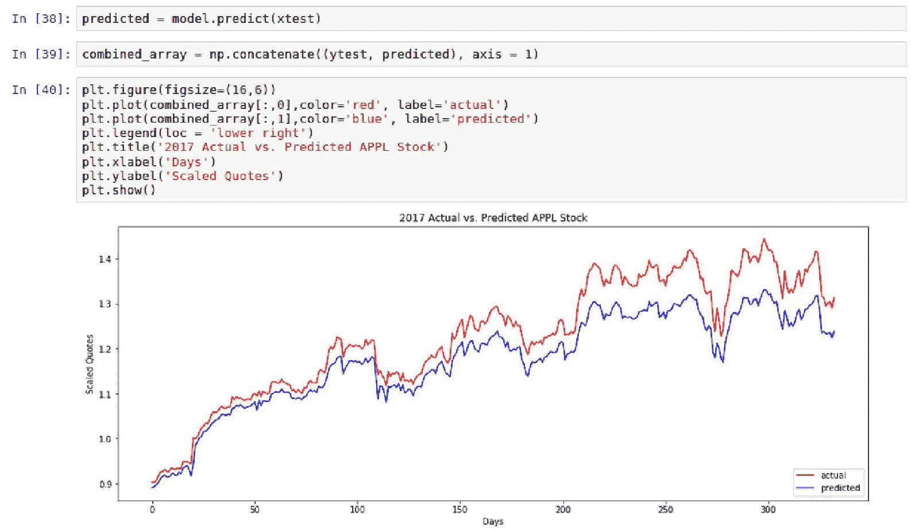

1.  我们的模型显示，对于 2017 年和 2018 年的前几天，预测值与实际值更接近。总的来说，虽然我们的预测值和实际得分似乎非常接近，但最好还是进行均方误差计算，以了解两者之间的偏差有多大。正如我们所看到的，我们的均方误差为 0.05841，约为 5.8%。

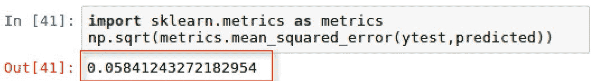

# 另请参阅

要了解更多关于 sklearn 中如何计算均方误差的信息，请访问以下网站：

[`scikit-learn.org/stable/modules/generated/sklearn.metrics.mean_squared_error.html`](http://scikit-learn.org/stable/modules/generated/sklearn.metrics.mean_squared_error.html)。
