# 第十章：使用深度卷积网络进行人脸识别

在本章中，我们将涵盖以下配方：

+   下载并将 MIT-CBCL 数据集加载到内存中

+   从目录中绘制和可视化图像

+   图像预处理

+   模型构建、训练和分析

# 介绍

在当今世界，维护信息安全的需求变得越来越重要，同时也变得越来越困难。有各种方法可以强制执行此安全性（密码、指纹 ID、PIN 码等）。然而，就易用性、准确性和低侵入性而言，人脸识别算法一直表现得非常出色。随着高速计算的可用性和深度卷积网络的发展，进一步增加了这些算法的稳健性成为可能。它们已经变得如此先进，以至于现在它们被用作许多电子设备（例如 iPhoneX）甚至银行应用程序中的主要安全功能。本章的目标是开发一个稳健的、姿势不变的人脸识别算法，用于安全系统。为了本章的目的，我们将使用公开可用的`MIT-CBCL`数据集，其中包含 10 个不同主题的人脸图像。

# 下载并将 MIT-CBCL 数据集加载到内存中

在这个配方中，我们将了解如何下载 MIT-CBCL 数据集并将其加载到内存中。

到 2025 年，生物识别行业的预测价值将达到 150 亿美元，这意味着它将前所未有地增长。用于生物识别认证的一些生理特征的例子包括指纹、DNA、面部、视网膜或耳朵特征和声音。虽然 DNA 认证和指纹等技术相当先进，但人脸识别也带来了自己的优势。

由于深度学习模型的最新发展，易用性和稳健性是人脸识别算法如此受欢迎的驱动因素之一。

# 准备工作

对于这个配方，需要考虑以下关键点：

+   `MIT-CBCL`数据集由 3,240 张图像组成（每个主题 324 张图像）。在我们的模型中，我们将安排增加数据以增加模型的稳健性。我们将采用诸如移动主题、旋转、缩放和剪切主题等技术来获得这些增强的数据。

+   我们将使用数据集的 20%（648 张图像）来测试我们的模型，通过从数据集中随机选择这些图像。同样，我们随机选择数据集中 80%的图像，并将其用作我们的训练数据集（2,592 张图像）。

+   最大的挑战是裁剪图像到完全相同的大小，以便它们可以被馈送到神经网络中。

+   众所周知，当所有输入图像的大小相同时，设计网络要容易得多。然而，由于这些图像中的一些主题具有侧面轮廓或旋转/倾斜轮廓，我们必须使我们的网络适应接受不同大小的输入图像。

# 操作方法...

步骤如下。

1.  通过访问人脸识别主页下载`MIT-CBCL`数据集，该主页包含用于人脸识别实验的多个数据库。链接以及主页的屏幕截图如下所示：

[`www.face-rec.org/databases/`](http://www.face-rec.org/databases/)

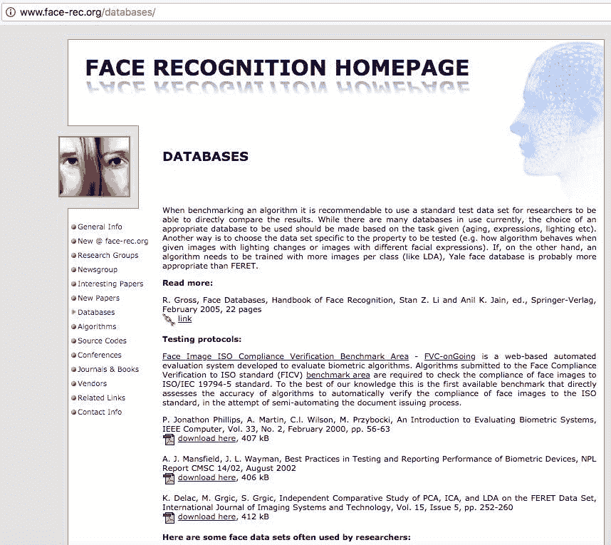

1.  向下导航到名为 MIT-CBCL 人脸识别数据库的链接，并单击它，如下面的屏幕截图所示：

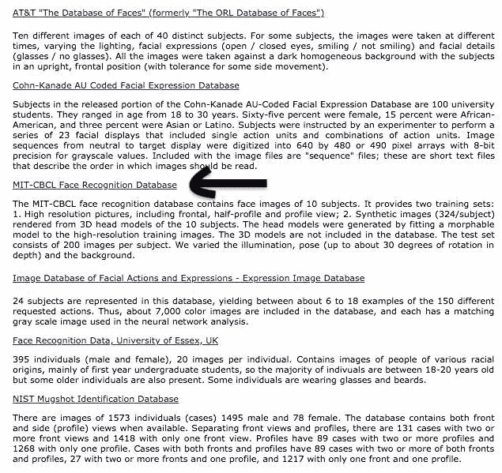

1.  一旦你点击它，它会带你到一个许可页面，在这个页面上你需要接受许可协议并转到下载页面。一旦在下载页面上，点击`立即下载`。这将下载一个大约 116MB 的 zip 文件。继续提取内容到工作目录中。

# 工作原理...

功能如下：

1.  许可协议要求在任何项目中使用数据库时进行适当引用。该数据库是由麻省理工学院的研究团队开发的。

1.  特此感谢麻省理工学院和生物计算学习中心提供面部图像数据库。许可证还要求提及题为*Component-based Face Recognition with 3D Morphable Models, First IEEE Workshop on Face Processing in Video,* Washington, D.C., 2004, B. Weyrauch, J. Huang, B. Heisele, and V. Blanz 的论文。

1.  以下截图描述了许可协议以及下载数据集的链接：

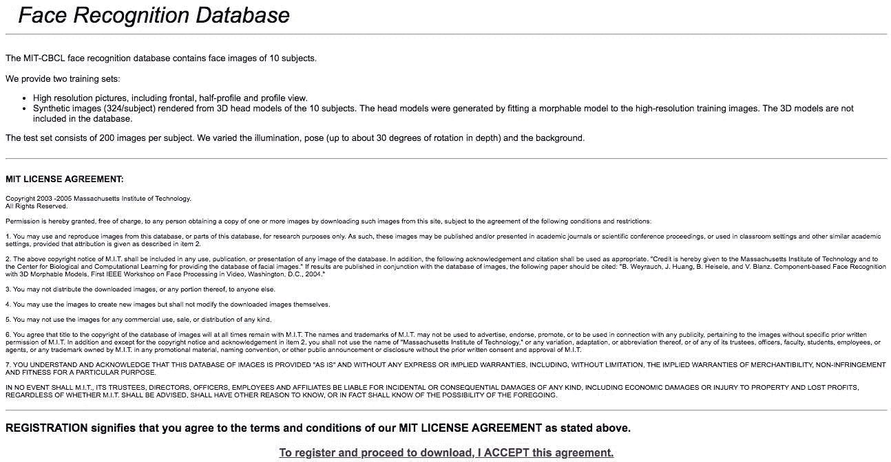

面部识别数据库主页

1.  数据集下载并提取后，您将看到一个名为 MIT-CBCL-facerec-database 的文件夹。

1.  为本章的目的，我们将仅使用**`training-synthetic`**文件夹中的图像，该文件夹包含所有 3,240 张图像，如下截图所示：

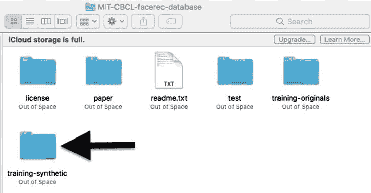

# 还有更多...

对于本章，您将需要 Python 导入以下库：

+   `os`

+   `matplotlib`

+   `numpy`

+   `keras`

+   `TensorFlow`

本章的以下部分将涉及导入必要的库和预处理图像，然后构建神经网络模型并将其加载到其中。 

# 另请参阅

有关本章中使用的软件包的完整信息，请访问以下链接：

+   [`matplotlib.org/`](https://matplotlib.org/)

+   [`docs.python.org/2/library/os.html`](https://docs.python.org/2/library/os.html)

+   [`www.tensorflow.org/get_started/`](https://www.tensorflow.org/get_started/)

+   [`keras.io/layers/about-keras-layers/`](https://keras.io/layers/about-keras-layers/)

+   [`docs.scipy.org/doc/numpy-1.9.1/reference/`](https://docs.scipy.org/doc/numpy-1.9.1/reference/)

# 绘制和可视化目录中的图像

本节将描述如何在对图像进行预处理并输入到神经网络进行训练之前，如何读取和可视化下载的图像。这是本章中的重要步骤，因为需要可视化图像以更好地了解图像尺寸，以便可以准确裁剪以省略背景并仅保留必要的面部特征。

# 准备工作

在开始之前，完成导入必要库和函数以及设置工作目录路径的初始设置。

# 如何做...

步骤如下：

1.  使用以下代码行下载必要的库。输出必须产生一行，显示`Using TensorFlow backend`，如下截图所示：

```scala
%matplotlib inline
from os import listdir
from os.path import isfile, join
import matplotlib.pyplot as plt
import matplotlib.image as mpimg
import numpy as np
from keras.models import Sequential
from keras.layers import Dense, Dropout, Activation, Flatten, Conv2D
from keras.optimizers import Adam
from keras.layers.normalization import BatchNormalization
from keras.utils import np_utils
from keras.layers import MaxPooling2D
from keras.preprocessing.image import ImageDataGenerator
```

导入库如下所示：

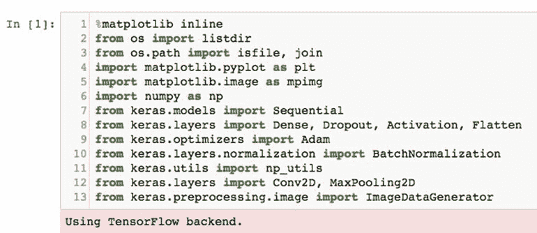

1.  按照以下截图中所示的方式打印并设置当前工作目录。在我们的案例中，桌面被设置为工作目录：

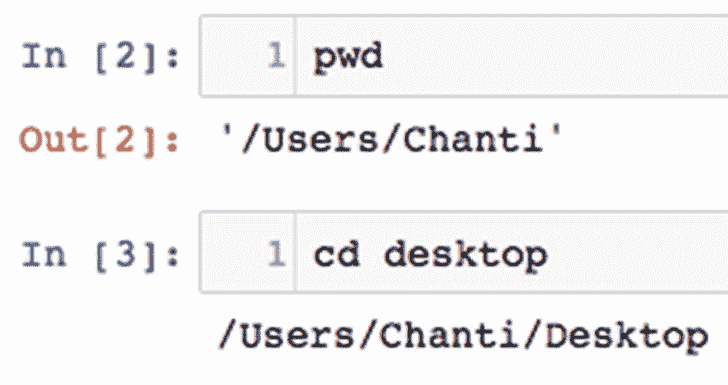

1.  通过使用以下截图中说明的命令直接从文件夹中读取所有图像：

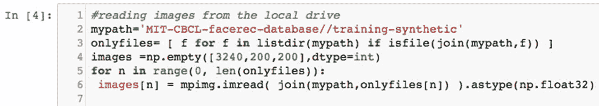

1.  使用`plt.imshow(images[])`命令从数据集中打印一些随机图像，如下截图所示，以更好地了解图像中的面部轮廓。这也将给出图像的大小的概念，这将在后期需要：

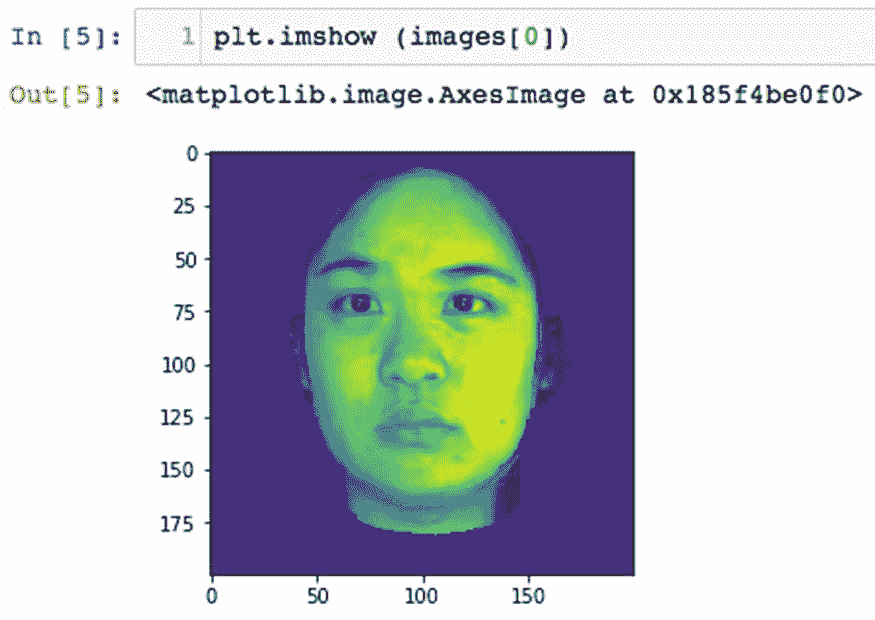

1.  这里显示了来自第一张图像的不同测试对象的图像。

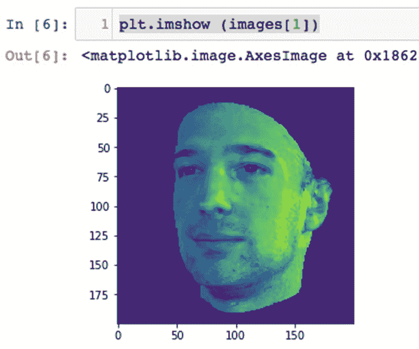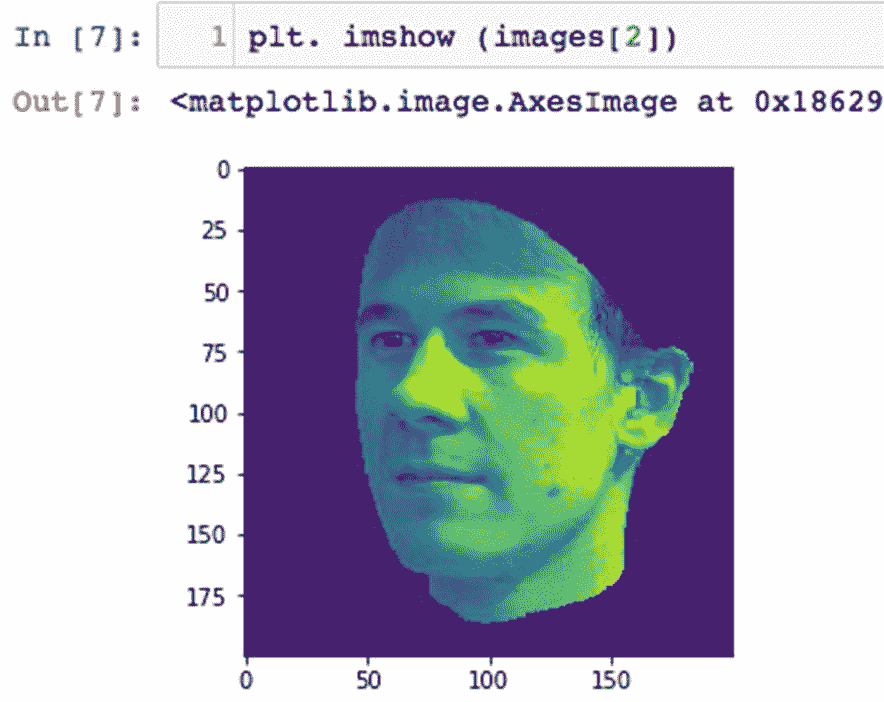

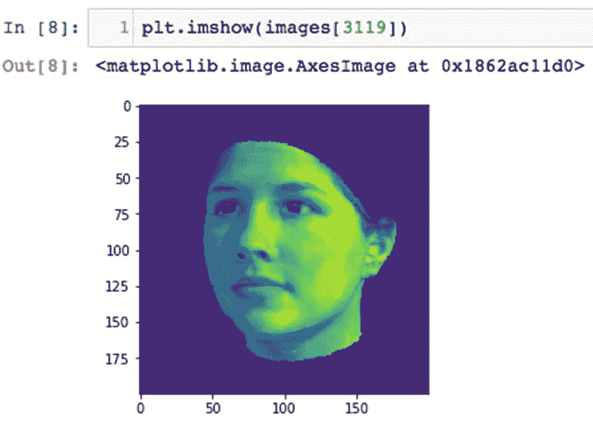

# 工作原理...

功能如下：

1.  `mypath`变量设置要从中读取所有文件的路径。在此步骤中指定了`training-synthetic`文件夹，因为本章仅使用该文件夹中的文件。

1.  `onlyfiles`变量用于通过循环遍历文件夹中包含的所有文件来计算文件夹中的所有文件的数量。这将在下一步中用于读取和存储图像。

1.  `images`变量用于创建一个大小为 3,240 的空数组，以存储所有尺寸为 200 x 200 像素的图像。

1.  接下来，通过在 for 循环中使用`onlyfiles`变量作为参数来循环遍历所有文件，将文件夹中包含的每个图像读取并存储到先前定义的`images`数组中，使用`matplotlib.image`函数。

1.  最后，通过指定不同索引的图像来打印随机选择的图像，您将注意到每个图像都是一个 200 x 200 像素的数组，每个主题可能是面向前方，也可能在两侧之间旋转零至十五度。

# 还有更多...

以下几点值得注意：

+   该数据库的一个有趣特点是，每个文件名的第四个数字描述了相应图像中的主题是谁。

+   图像的名称在某种意义上是唯一的，第四个数字代表了相应图像中的个体。图像名称的两个示例是`0001_-4_0_0_60_45_1.pgm`和`0006_-24_0_0_0_75_15_1.pgm`。可以很容易地理解，第四个数字分别代表了第二个和第七个个体。

+   我们需要存储这些信息以备将来在进行预测时使用。这将有助于神经网络在训练过程中了解它正在学习哪个主题的面部特征。

+   可以通过以下代码将每个图像的文件名读入数组，并使用以下代码将十个主题中的每一个分隔开：

```scala
y =np.empty([3240,1],dtype=int)
for x in range(0, len(onlyfiles)):
    if onlyfiles[x][3]=='0': y[x]=0
    elif onlyfiles[x][3]=='1': y[x]=1
    elif onlyfiles[x][3]=='2': y[x]=2
    elif onlyfiles[x][3]=='3': y[x]=3
    elif onlyfiles[x][3]=='4': y[x]=4
    elif onlyfiles[x][3]=='5': y[x]=5
    elif onlyfiles[x][3]=='6': y[x]=6
    elif onlyfiles[x][3]=='7': y[x]=7
    elif onlyfiles[x][3]=='8': y[x]=8
    elif onlyfiles[x][3]=='9': y[x]=9
```

+   上述代码将初始化一个大小为 3,240 的空的一维`numpy`数组（`training-synthetic`文件夹中的图像数量），并通过循环遍历整个文件集，将相关主题存储在不同的数组中。

+   `if`语句基本上是在检查每个文件名下的第四个数字，并将该数字存储在初始化的`numpy`数组中。

+   在 iPython 笔记本中的输出如下截图所示：

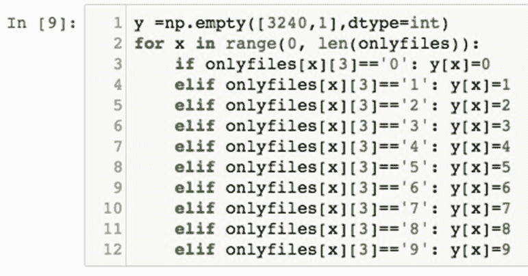

# 另请参阅

以下博客描述了 Python 中裁剪图像的方法，并可用于图像预处理，这将在下一节中需要：

+   [`www.blog.pythonlibrary.org/2017/10/03/how-to-crop-a-photo-with-python/`](https://www.blog.pythonlibrary.org/2017/10/03/how-to-crop-a-photo-with-python/)

有关 Adam Optimizer 及其用例的更多信息，请访问以下链接：

+   [`www.tensorflow.org/api_docs/python/tf/train/AdamOptimizer`](https://www.tensorflow.org/api_docs/python/tf/train/AdamOptimizer)

+   [`arxiv.org/abs/1412.6980`](https://arxiv.org/abs/1412.6980)

+   [`www.coursera.org/lecture/deep-neural-network/adam-optimization-algorithm-w9VCZ`](https://www.coursera.org/lecture/deep-neural-network/adam-optimization-algorithm-w9VCZ)

# 图像预处理

在前一节中，您可能已经注意到所有图像都不是脸部正面视图，还有些略微旋转的侧面轮廓。您可能还注意到每个图像中都有一些不必要的背景区域需要去除。本节将描述如何预处理和处理图像，使其准备好被馈送到网络进行训练。

# 准备工作

考虑以下内容：

+   许多算法被设计用来裁剪图像的重要部分；例如 SIFT、LBP、Haar-cascade 滤波器等。

+   然而，我们将用一个非常简单的天真代码来解决这个问题，从图像中裁剪出面部部分。这是该算法的一个新颖之处。

+   我们发现不必要的背景部分的像素强度为 28。

+   请记住，每个图像都是一个三通道的 200 x 200 像素矩阵。这意味着每个图像包含三个矩阵或张量，红色、绿色和蓝色像素的强度范围从 0 到 255。

+   因此，我们将丢弃图像中仅包含像素强度为 28 的行或列。

+   我们还将确保所有图像在裁剪操作后具有相同的像素大小，以实现卷积神经网络的最高并行性。

# 操作步骤如下：

步骤如下：

1.  定义`crop()`函数以裁剪图像，仅获取重要部分，如下代码所示：

```scala
 #function for cropping images to obtain only the significant part
 def crop(img):
      a=28*np.ones(len(img)) 
      b=np.where((img== a).all(axis=1)) 
      img=np.delete(img,(b),0) 
      plt.imshow(img)
      img=img.transpose()
      d=28*np.ones(len(img[0]))
      e=np.where((img== d).all(axis=1))
      img=np.delete(img,e,0) 
      img=img.transpose()
      print(img.shape) 
      super_threshold_indices = img < 29 
      img[super_threshold_indices] = 0
      plt.imshow (img)
      return img[0:150, 0:128]
```

1.  使用以下代码循环遍历文件夹中的每个图像并使用前面定义的函数进行裁剪：

```scala
#cropping all the images
 image = np.empty([3240,150,128],dtype=int)
 for n in range(0, len(images)):
     image[n]=crop(images[n])
```

1.  接下来，随机选择一幅图像并打印它，以检查它是否已从 200 x 200 大小的图像裁剪到不同的大小。在我们的案例中，我们选择了图像 23。可以使用以下代码完成：

```scala
 print (image[22])
 print (image[22].shape)
```

1.  接下来，使用文件夹中`80%`的图像作为训练集，剩余的`20%`作为测试集，将数据分割为测试集和训练集。可以使用以下命令完成：

```scala
# Split data into 80/20 split for testing and training
test_ind=np.random.choice(range(3240), 648, replace=False) train_ind=np.delete(range(0,len(onlyfiles)),test_ind)
```

1.  一旦数据完成拆分，使用以下命令将训练和测试图像分开：

```scala
 # slicing the training and test images 
 y1_train=y[train_ind]
 x_test=image[test_ind]
 y1_test=y[test_ind]
```

1.  接下来，将所有裁剪后的图像重塑为 128 x 150 的大小，因为这是要馈送到神经网络中的大小。可以使用以下命令完成：

```scala
#reshaping the input images
 x_train = x_train.reshape(x_train.shape[0], 128, 150, 1)
 x_test = x_test.reshape(x_test.shape[0], 128, 150, 1)
```

1.  一旦数据完成重塑，将其转换为`float32`类型，这将使其在下一步中更容易处理。可以使用以下命令从 int 转换为 float32：

```scala
 #converting data to float32
 x_train = x_train.astype('float32')
 x_test = x_test.astype('float32')
```

1.  在重塑和将数据转换为 float32 类型后，必须对其进行归一化，以调整所有值到相似的范围。这是防止数据冗余的重要步骤。使用以下命令执行归一化：

```scala
 #normalizing data
 x_train/=255
 x_test/=255
 #10 digits represent the 10 classes
 number_of_persons = 10
```

1.  最后一步是将重塑、归一化的图像转换为向量，因为这是神经网络理解的唯一输入形式。使用以下命令将图像转换为向量：

```scala
 #convert data to vectors
 y_train = np_utils.to_categorical(y1_train, number_of_persons)
 y_test = np_utils.to_categorical(y1_test, number_of_persons)
```

# 工作原理如下：

功能如下：

1.  `crop()`函数执行以下任务：

1.  将所有像素强度为 28 的像素乘以一个 numpy 数组 1，并存储在变量`a`中。

1.  检查所有实例，其中整列仅由像素强度为 28 的像素组成，并存储在变量`b`中。

1.  删除所有列（或*Y*轴）中像素强度为 28 的整列。

1.  绘制生成的图像。

1.  1.  转置图像，以便对所有行（或*X*轴）执行类似的操作。

1.  1.  将所有像素强度为 28 的像素乘以一个`numpy`数组 1，并存储在变量`d`中。

1.  检查所有实例，其中整列仅由像素强度为 28 的像素组成，并存储在变量`e`中。

1.  删除所有列（从转置图像中）中像素强度为 28 的整列。

1.  转置图像以恢复原始图像。

1.  打印图像的形状。

1.  在发现像素强度小于 29 的地方，将这些像素强度替换为零，这将导致通过使它们变白来裁剪所有这些像素。

1.  绘制生成的图像。

1.  将生成的图像重塑为 150 x 128 像素的大小。

`crop()`函数的输出，如在 Jupyter 笔记本执行期间所见，如下截图所示：

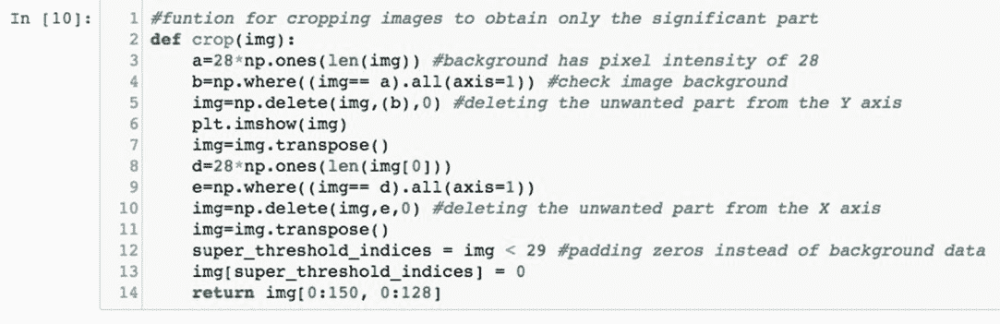

1.  接下来，通过循环遍历`training-synthetic`文件夹中包含的所有文件，将定义的`crop()`函数应用于所有文件。这将导致如下截图所示的输出：

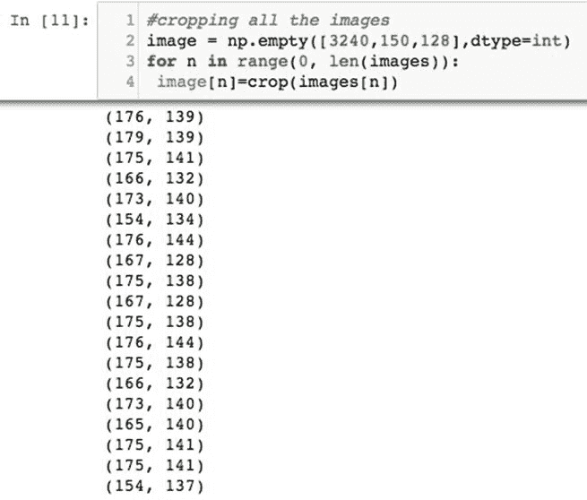

输出如下：

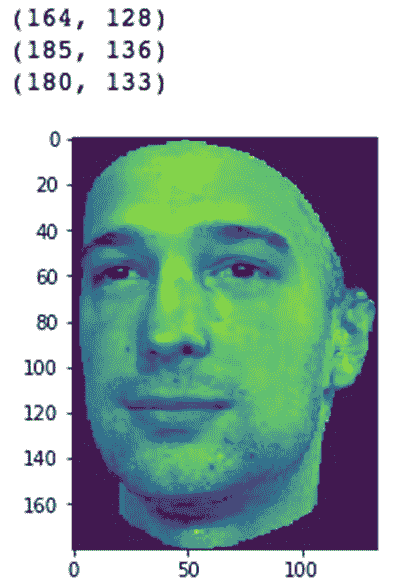

注意，仅保留了相关的面部特征，并且所有裁剪后的图像的形状都小于 200 x 200，这是初始大小。

1.  打印任意图像的图像和形状，您会注意到每个图像现在都被调整为一个 150 x 128 像素的数组，并且您将看到以下输出：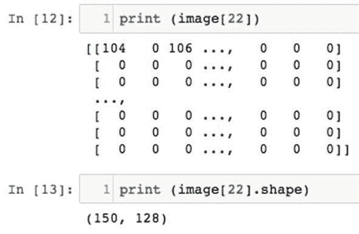

1.  将图像分割为测试集和训练集，并将它们分隔为名为`x_train`、`y1_train`、`x_test`和`y1_test`的变量，将导致以下截图中看到的输出：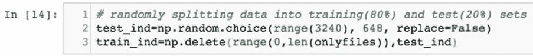

1.  数据的分离如下进行：

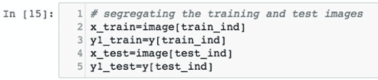

1.  对训练和测试图像进行重塑并将数据类型转换为 float32 将导致以下截图中看到的输出：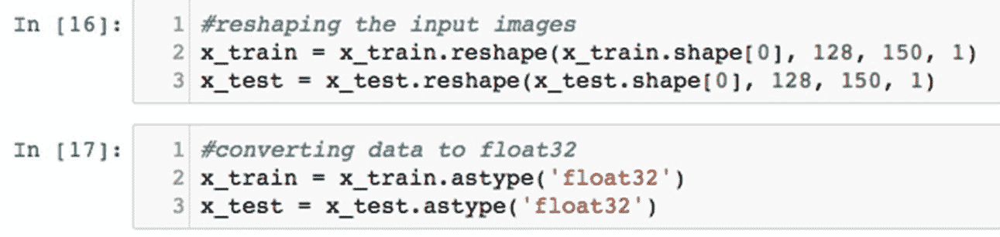

# 还有更多...

考虑以下内容：

+   一旦图像完成预处理，它们仍然需要被规范化并转换为向量（在本例中是张量），然后才能被输入到网络中。

+   在最简单的情况下，规范化意味着调整在不同尺度上测量的值到一个概念上的共同尺度，通常是在平均之前。规范化数据总是一个好主意，以防止梯度在梯度下降过程中爆炸或消失，如梯度消失和爆炸问题所示。规范化还确保没有数据冗余。

+   通过将每个图像中的每个像素除以`255`来对数据进行规范化，因为像素值的范围在 0 和`255`之间。这将导致以下截图中看到的输出：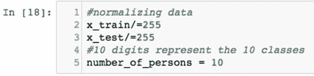

+   接下来，使用`numpy_utils`中的`to_categorical()`函数将图像转换为具有十个不同类的输入向量，如下截图所示：

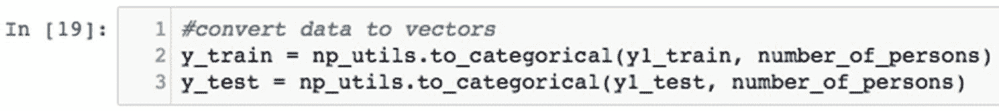

# 另请参阅

以下是其他资源：

+   有关数据规范化的更多信息，请查看以下链接：

[`www.quora.com/What-is-normalization-in-machine-learning`](https://www.quora.com/What-is-normalization-in-machine-learning)

+   有关过拟合以及为什么数据被分成测试集和训练集的信息，请访问以下链接：

[`towardsdatascience.com/train-test-split-and-cross-validation-in-python-80b61beca4b6`](https://towardsdatascience.com/train-test-split-and-cross-validation-in-python-80b61beca4b6)

+   有关编码变量及其重要性的更多信息，请访问以下链接：

[`pbpython.com/categorical-encoding.html`](http://pbpython.com/categorical-encoding.html)

# 模型构建、训练和分析

我们将使用`keras`库中的标准顺序模型来构建 CNN。该网络将包括三个卷积层，两个最大池化层和四个全连接层。输入层和随后的隐藏层有 16 个神经元，而最大池化层包含(2,2)的池大小。四个全连接层包括两个密集层和一个扁平层和一个 dropout 层。使用 0.25 的 dropout 来减少过拟合问题。该算法的另一个新颖之处是使用数据增强来对抗过拟合现象。数据增强通过旋转、移位、剪切和缩放图像到不同程度来适应模型。

在输入和隐藏层中，使用`relu`函数作为激活函数，而在输出层中使用`softmax`分类器来根据预测的输出对测试图像进行分类。

# 准备工作

将构建的网络可视化如下图所示：

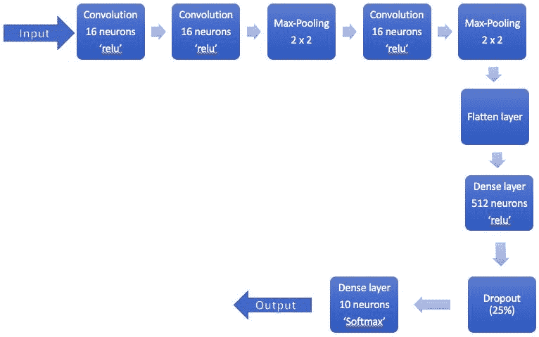

# 如何做...

步骤如下：

1.  使用以下命令在 Keras 框架中使用`Sequential()`函数定义模型：

```scala
model = Sequential()
model.add(Conv2D(16, (3, 3), input_shape=(128,150,1)))  
model.add(Activation('relu')) 
model.add(Conv2D(16, (3, 3))) 
model.add(Activation('relu'))
model.add(MaxPooling2D(pool_size=(2,2))) 
model.add(Conv2D(16,(3, 3))) 
model.add(Activation('relu'))
model.add(MaxPooling2D(pool_size=(2,2))) 
model.add(Flatten()) 

model.add(Dense(512))
model.add(Activation('relu'))
model.add(Dropout(0.25)) 
model.add(Dense(10))

model.add(Activation('softmax')) 
```

1.  打印模型的摘要以更好地了解模型的构建方式，并确保它是根据前述规格构建的。这可以通过使用`model.summary()`命令来完成。

1.  接下来，使用以下命令编译模型：

```scala
model.compile(loss='categorical_crossentropy', optimizer=Adam(), metrics=        ['accuracy'])
```

1.  为了防止过拟合并进一步提高模型的准确性，实现某种形式的数据增强。在这一步中，图像将被剪切、水平和垂直轴上移动、放大和旋转。模型学习和识别这些异常的能力将决定模型的鲁棒性。使用以下命令增强数据：

```scala
# data augmentation to minimize overfitting
gen = ImageDataGenerator(rotation_range=8, 
        width_shift_range=0.08, shear_range=0.3,
        height_shift_range=0.08,zoom_range=0.08)
test_gen = ImageDataGenerator()
train_generator = gen.flow(x_train, y_train, batch_size=16) 
test_generator = test_gen.flow(x_test, y_test, batch_size=16)
```

1.  最后，使用以下命令进行数据增强后拟合和评估模型：

```scala
model.fit_generator(train_generator, epochs=5, validation_data=test_generator)

scores = model.evaluate(x_test, y_test, verbose=0)
print("Recognition Error: %.2f%%" % (100-scores[1]*100))
```

# 工作原理...

功能如下：

1.  通过使用 sequential 函数，定义了一个九层卷积神经网络，每一层执行以下功能：

1.  第一层是一个具有 16 个神经元的卷积层，并对输入张量/矩阵进行卷积。特征图的大小被定义为一个 3 x 3 的矩阵。由于神经网络需要知道期望的输入类型，因此需要为第一层指定输入形状。由于所有图像都被裁剪为 128 x 150 像素的大小，这也将是网络第一层定义的输入形状。在这一层中使用的激活函数是**修正线性单元**（**relu**）。

1.  网络的第二层（第一个隐藏层）是另一个具有 16 个神经元的卷积层。同样，这一层的激活函数将使用`relu`。

1.  网络的第三层（第二个隐藏层）是一个具有 2 x 2 池大小的最大池化层。这一层的功能是提取通过前两层卷积学习到的所有有效特征，并减小包含所有学习到的特征的矩阵的大小。卷积无非是特征图和输入矩阵（在我们的情况下是图像）之间的矩阵乘法。网络将存储卷积过程中产生的结果值。这些存储的值中的最大值将定义输入图像中的某个特征。这些最大值将由最大池化层保留，该层将省略不相关的特征。

1.  网络的第四层（第三个隐藏层）是另一个 3 x 3 的特征图的卷积层。在这一层中使用的激活函数将再次是`relu`函数。

1.  网络的第五层（第四个隐藏层）是一个具有 2 x 2 池大小的最大池化层。

1.  网络的第六层（第五个隐藏层）是一个扁平化层，它将包含所有学习到的特征（以数字形式存储）的矩阵转换为单行，而不是多维矩阵。

1.  1.  网络中的第七层（第六个隐藏层）是一个具有 512 个神经元和`relu`激活的密集层。每个神经元基本上会处理特定的权重和偏差，这无非是对特定图像中所有学习到的特征的表示。这是为了通过在密集层上使用`softmax`分类器轻松对图像进行分类。

1.  网络中的第八层（第七个隐藏层）是一个具有 0.25 或 25%的丢弃概率的丢弃层。这一层将在训练过程中随机丢弃 25%的神经元，并通过鼓励网络使用许多替代路径来防止过拟合。

1.  网络中的最后一层是一个只有 10 个神经元和`softmax`分类器的密集层。这是第八个隐藏层，也将作为网络的输出层。

1.  在定义模型后的输出必须如下截图所示：

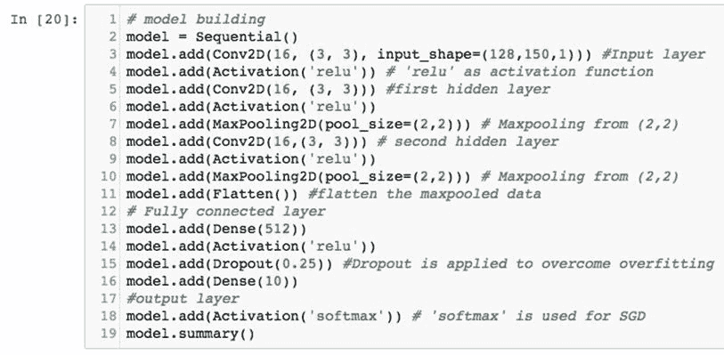

1.  在打印`model.summary()`函数时，必须看到如下截图中的输出：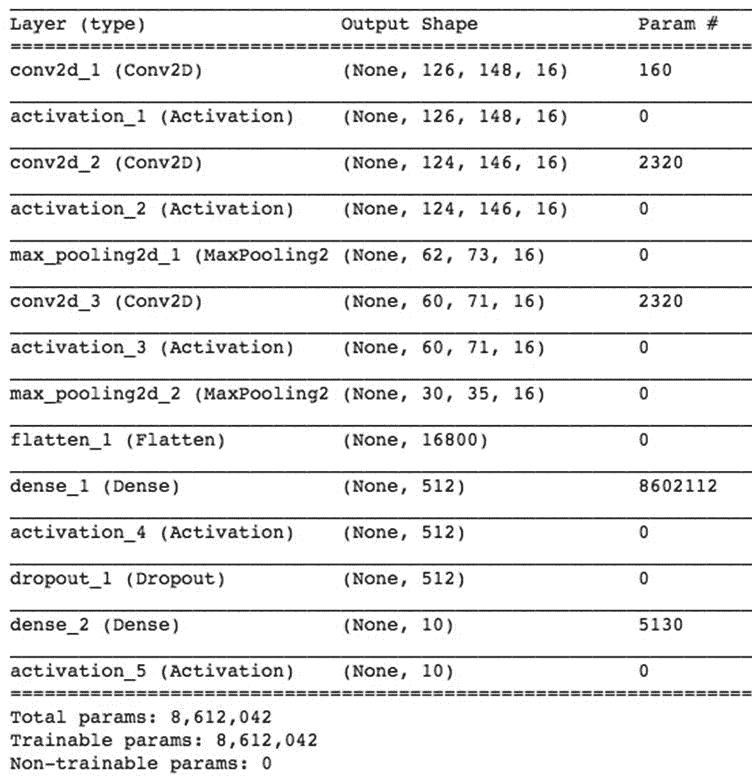

1.  该模型使用分类交叉熵进行编译，这是一个函数，用于在将信息从一个层传输到后续层时测量和计算网络的损失。模型将使用 Keras 框架中的`Adam()`优化器函数，它基本上会指导网络在学习特征时如何优化权重和偏差。`model.compile()`函数的输出必须如下截图所示：

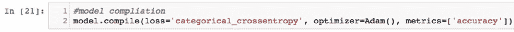

1.  由于神经网络非常密集，总图像数量仅为 3,240，因此我们设计了一种方法来防止过拟合。这是通过执行数据增强从训练集生成更多图像来完成的。在这一步中，图像是通过`ImageDataGenerator()`函数生成的。该函数通过以下方式对训练和测试集进行图像增强：

+   旋转它们

+   剪切它们

+   移动宽度，基本上是扩大图像

+   在水平轴上移动图像

+   在垂直轴上移动图像

前述函数的输出必须如下截图所示：

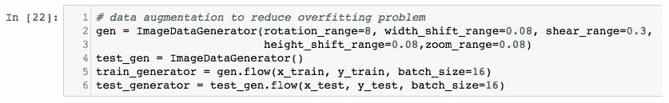

1.  最后，模型在训练 5 个时期后适应数据并进行评估。我们获得的输出如下截图所示：

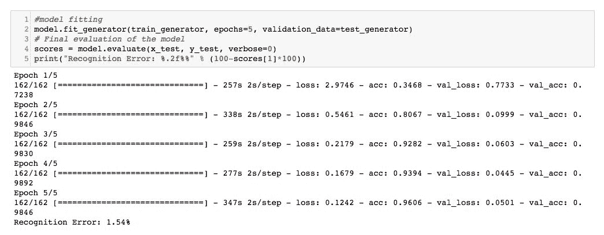

1.  如您所见，我们获得了 98.46%的准确性，导致错误率为 1.54%。这相当不错，但是卷积网络已经进步了很多，我们可以通过调整一些超参数或使用更深的网络来改进这个错误率。

# 还有更多...

使用 12 层更深的 CNN（一个额外的卷积和一个额外的最大池化层）将准确性提高到 99.07%，如下截图所示：

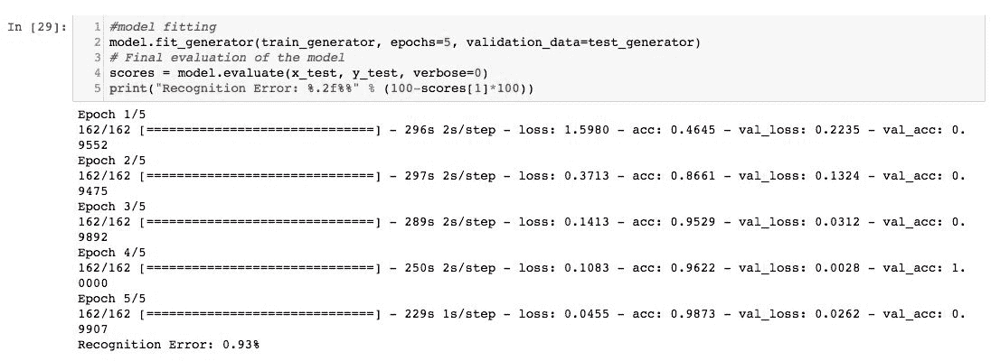

在模型构建过程中每两层之后使用数据归一化后，我们进一步将准确性提高到 99.85%，如下截图所示：

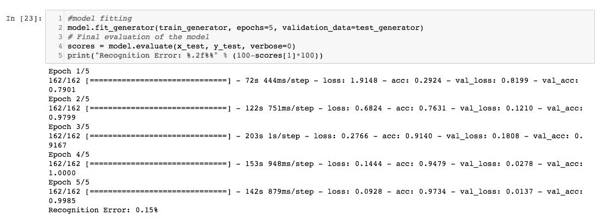

您可能会得到不同的结果，但可以随意运行几次训练步骤。以下是您可以采取的一些步骤，以便在将来实验网络以更好地了解它：

+   尝试更好地调整超参数，并实施更高的丢失百分比，看看网络的响应如何。

+   当我们尝试使用不同的激活函数或更小（不太密集）的网络时，准确性大大降低。

+   此外，更改特征图和最大池化层的大小，并查看这如何影响训练时间和模型准确性。

+   尝试在不太密集的 CNN 中包含更多的神经元并进行调整以提高准确性。这也可能导致更快的网络，训练时间更短。

+   使用更多的训练数据。探索其他在线存储库，找到更大的数据库来训练网络。当训练数据的大小增加时，卷积神经网络通常表现更好。

# 另请参见

以下已发表的论文是了解卷积神经网络的更好资源。它们可以作为进一步阅读，以更多地了解卷积神经网络的各种应用：

+   [`papers.nips.cc/paper/4824-imagenet-classification-with-deep-convolutional-neural-networks`](http://papers.nips.cc/paper/4824-imagenet-classification-with-deep-convolutional-neural-networks)

+   [`arxiv.org/abs/1408.5882`](https://arxiv.org/abs/1408.5882)

+   [`www.cv-foundation.org/openaccess/content_cvpr_2014/papers/Karpathy_Large-scale_Video_Classification_2014_CVPR_paper.pdf`](https://www.cv-foundation.org/openaccess/content_cvpr_2014/papers/Karpathy_Large-scale_Video_Classification_2014_CVPR_paper.pdf)

+   [`www.cs.cmu.edu/~bhiksha/courses/deeplearning/Fall.2016/pdfs/Simard.pdf`](http://www.cs.cmu.edu/~bhiksha/courses/deeplearning/Fall.2016/pdfs/Simard.pdf)

+   [`dl.acm.org/citation.cfm?id=2807412`](https://dl.acm.org/citation.cfm?id=2807412)

+   [`ieeexplore.ieee.org/abstract/document/6165309/`](https://ieeexplore.ieee.org/abstract/document/6165309/)

+   [`openaccess.thecvf.com/content_cvpr_2014/papers/Oquab_Learning_and_Transferring_2014_CVPR_paper.pdf`](http://openaccess.thecvf.com/content_cvpr_2014/papers/Oquab_Learning_and_Transferring_2014_CVPR_paper.pdf)

+   [`www.aaai.org/ocs/index.php/IJCAI/IJCAI11/paper/download/3098/3425`](http://www.aaai.org/ocs/index.php/IJCAI/IJCAI11/paper/download/3098/3425)

+   [`ieeexplore.ieee.org/abstract/document/6288864/`](https://ieeexplore.ieee.org/abstract/document/6288864/)
