# 第十二章：使用 Keras 创建电影推荐引擎

本章将涵盖以下配方：

+   下载 MovieLens 数据集

+   操作和合并 MovieLens 数据集

+   探索 MovieLens 数据集

+   为深度学习流水线准备数据集

+   使用 Keras 应用深度学习流水线

+   评估推荐引擎的准确性

# 介绍

2006 年，一家小型 DVD 租赁公司着手使他们的推荐引擎提高 10%。那家公司是 Netflix，Netflix 奖值 100 万美元。这场比赛吸引了来自世界各地一些最大科技公司的许多工程师和科学家。获胜参与者的推荐引擎是通过机器学习构建的。Netflix 现在是流媒体数据和向其客户推荐下一步应该观看的内容方面的领先科技巨头之一。

如今，评分随处可见，无论你在做什么。如果你正在寻找去新餐馆吃饭的建议，在线订购服装，观看当地影院的新电影，或者在电视或在线上观看新系列，很可能有一个网站或移动应用会给你一些类型的评分以及对你要购买的产品或服务的反馈。正是因为这种反馈的迅速增加，推荐算法在过去几年变得更加受欢迎。本章将专注于使用深度学习库 Keras 为用户构建电影推荐引擎。

# 下载 MovieLens 数据集

有一个伟大的研究实验室，它始于 1992 年，位于明尼阿波利斯，明尼苏达州，名为**GroupLens**，专注于推荐引擎，并且慷慨地从 MovieLens 网站上收集了数百万行数据。我们将使用它的数据集作为我们推荐引擎模型的数据来源。

# 准备工作

MovieLens 数据集存放在 GroupLens 的以下网站上：

[`grouplens.org/datasets/movielens/`](https://grouplens.org/datasets/movielens/).

重要的是要注意，我们将使用的数据集将直接来自他们的网站，而不是来自第三方中介或存储库。此外，有两个不同的数据集可供我们查询：

+   推荐用于新研究

+   推荐用于教育和开发

使用这个数据集的目的纯粹是为了教育目的，因此我们将从网站的教育和开发部分下载数据。教育数据仍然包含大量行数，因为它包含了 10 万个评分，如下截图所示：

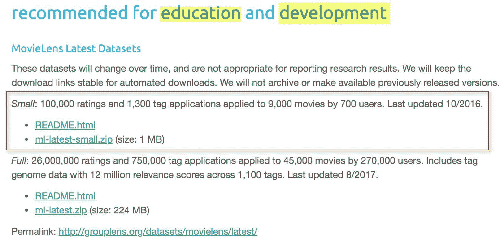

此外，该数据集包含了在 1995 年 1 月 9 日至 2015 年 3 月 31 日期间收集的 600 多个匿名用户的信息。该数据集最后更新于 2017 年 10 月。

F Maxwell Harper 和 Joseph A Konstan，2015 年。*The MovieLens Datasets: History and Context*。ACM **交互智能系统交易** (**TiiS**) 5, 4, Article 19 (2015 年 12 月)，19 页。DOI: [`dx.doi.org/10.1145/2827872`](http://dx.doi.org/10.1145/2827872)

# 如何做...

本节将涵盖下载和解压 MovieLens 数据集：

1.  下载较小的 MovieLens 数据集的研究版本，可在以下网站公开下载：[`grouplens.org/datasets/movielens/latest/`](https://grouplens.org/datasets/movielens/latest/).

1.  下载名为`ml-latest-small.zip`的`ZIP`文件到我们的一个本地文件夹中，如下截图所示：

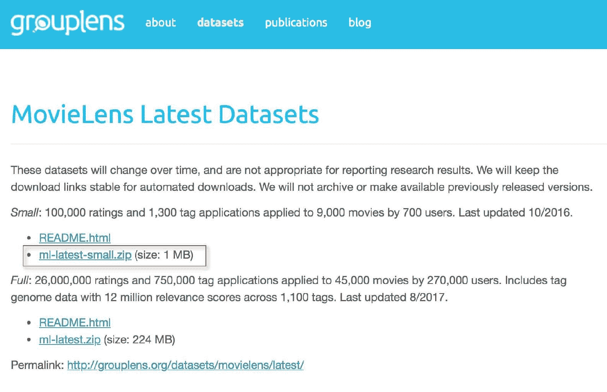

1.  当下载并解压`ml-latest-small.zip`后，应提取以下四个文件：

1.  `links.csv`

1.  `movies.csv`

1.  `ratings.csv`

1.  ``tags.csv``

1.  执行以下脚本开始我们的`SparkSession`：

```scala
spark = SparkSession.builder \
         .master("local") \
         .appName("RecommendationEngine") \
         .config("spark.executor.memory", "6gb") \
         .getOrCreate()
```

1.  通过执行以下脚本确认以下六个文件可供访问：

```scala
import os
os.listdir('ml-latest-small/')
```

1.  使用以下脚本将每个数据集加载到 Spark 数据框中：

```scala
movies = spark.read.format('com.databricks.spark.csv')\
            .options(header='true', inferschema='true')\
            .load('ml-latest-small/movies.csv')
tags = spark.read.format('com.databricks.spark.csv')\
            .options(header='true', inferschema='true')\
            .load('ml-latest-small/tags.csv')
links = spark.read.format('com.databricks.spark.csv')\
            .options(header='true', inferschema='true')\
            .load('ml-latest-small/links.csv')
ratings = spark.read.format('com.databricks.spark.csv')\
            .options(header='true', inferschema='true')\
            .load('ml-latest-small/ratings.csv')
```

1.  通过执行以下脚本来确认每个数据集的行数：

```scala
print('The number of rows in movies dataset is {}'.format(movies.toPandas().shape[0]))
print('The number of rows in ratings dataset is {}'.format(ratings.toPandas().shape[0]))
print('The number of rows in tags dataset is {}'.format(tags.toPandas().shape[0]))
print('The number of rows in links dataset is {}'.format(links.toPandas().shape[0]))
```

# 工作原理...

本节将重点介绍 MovieLens 100K 数据集中每个数据集中的字段。请看以下步骤：

1.  这些数据集都包含在压缩文件`ml-latest-small.zip`中，其中`ratings.csv`数据集将作为我们的数据的伪事实表，因为它包含了每部电影的交易。数据集`ratings`中有四个列名，如下截图所示：

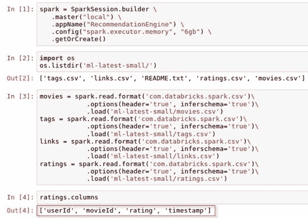

1.  该数据集显示了每个用户在其时间内选择的评分，从最早的评分到最新的评分。评分的范围可以从 0.5 到 5.0 星，如下截图中的`userId = 1`所示：


1.  `tags`数据集包含一个标签列，其中包含用户用于描述特定电影 ID 的特定单词或短语。如下截图所示，用户 15 对桑德拉·布洛克在她的一部电影中并不特别喜欢：

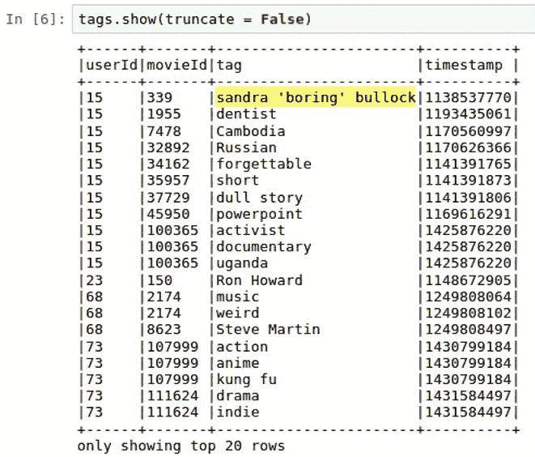

1.  `movies`数据集主要是电影类型的查找表。有 19 种唯一的类型可以与电影相关联；但是，重要的是要注意，一部电影可以同时与多种类型相关联，如下截图所示：

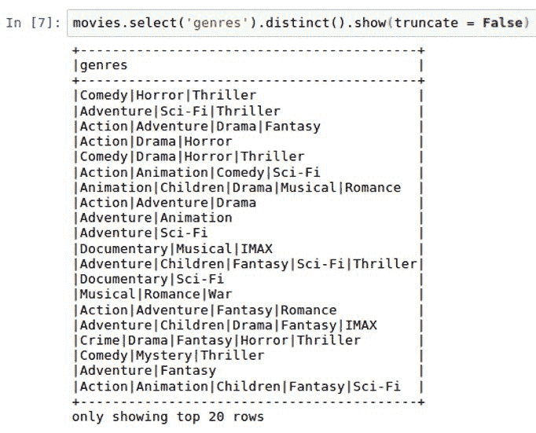

1.  最后一个数据集是`links`数据集，它也充当查找表。它将 MovieLens 中的电影与流行电影数据库网站（如[`www.imdb.com`](http://www.imdb.com)和[`www.themoviedb.org`](https://www.themoviedb.org)）上可用的数据连接起来。IMDB 的链接在名为 imdbId 的列下，而 MovieDB 的链接在名为 tmdbId 的列下，如下截图所示：

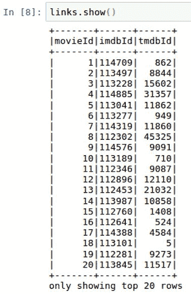

1.  在完成之前，确认我们确实从所有数据集中获得了预期的行数总是一个好主意。这有助于确保我们在将文件上传到笔记本时没有遇到任何问题。我们应该期望在`ratings`数据集中看到大约 10 万行，如下截图所示：

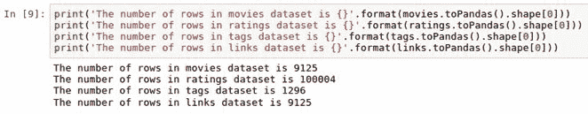

# 还有更多...

虽然我们不会在本章中使用 MovieLens 的 2000 万行数据集版本，但您可以选择在此推荐引擎中使用它。您仍将拥有相同的四个数据集，但`ratings`数据集的数据量将更大。如果选择这种方法，完整的压缩数据集可以从以下网站下载：

[`files.grouplens.org/datasets/movielens/ml-latest.zip`](http://files.grouplens.org/datasets/movielens/ml-latest.zip)

# 另请参阅

要了解本章中使用的 MovieLens 数据集背后的元数据，请访问以下网站：

[`files.grouplens.org/datasets/movielens/ml-latest-small-README.html`](http://files.grouplens.org/datasets/movielens/ml-latest-small-README.html)

要了解本章中使用的 MovieLens 数据集的历史和背景，请访问以下网站：

[`www.slideshare.net/maxharp3r/the-movielens-datasets-history-and-context`](https://www.slideshare.net/maxharp3r/the-movielens-datasets-history-and-context)

要了解有关*Netflix 奖*的更多信息，请访问以下网站：

[`www.netflixprize.com/`](https://www.netflixprize.com/)

# 操作和合并 MovieLens 数据集

我们目前有四个不同的数据集，但最终我们希望将其减少到一个数据集。本章将重点介绍如何将我们的数据集减少到一个。

# 准备工作

本节不需要导入 PySpark 库，但了解 SQL 连接将很有帮助，因为我们将探索多种连接数据框的方法。

# 如何做...

本节将介绍在 PySpark 中连接数据框的以下步骤：

1.  执行以下脚本将`ratings`中的所有字段名重命名，将`_1`附加到名称的末尾：

```scala
for i in ratings.columns:
     ratings = ratings.withColumnRenamed(i, i+'_1') 
```

1.  执行以下脚本将`movies`数据集与`ratings`数据集进行`内连接`，创建一个名为`temp1`的新表：

```scala
temp1 = ratings.join(movies, ratings.movieId_1 == movies.movieId, how = 'inner')
```

1.  执行以下脚本将`temp1`数据集与`links`数据集进行内连接，创建一个名为`temp2`的新表：

```scala
temp2 = temp1.join(links, temp1.movieId_1 == links.movieId, how = 'inner')
```

1.  通过左连接`temp2`与`tags`，创建我们的最终组合数据集`mainDF`，使用以下脚本：

```scala
mainDF = temp2.join(tags, (temp2.userId_1 == tags.userId) & (temp2.movieId_1 == tags.movieId), how = 'left')
```

1.  通过执行以下脚本，仅选择我们最终`mainDF`数据集所需的列：

```scala
mainDF = mainDF.select('userId_1',
                       'movieId_1',
                       'rating_1',
                       'title', 
                       'genres', 
                       'imdbId',
                       'tmdbId', 
                       'timestamp_1').distinct()
```

# 工作原理...

本节将介绍我们连接表的设计过程，以及将保留哪些最终列：

1.  如前一节所述，评分数据框将作为我们的事实表，因为它包含每个用户随时间的所有主要评分交易。评分中的列将在与其他三个表的每个后续连接中使用，并且为了保持列的唯一性，我们将在每个列名的末尾附加“_1”，如下图所示：

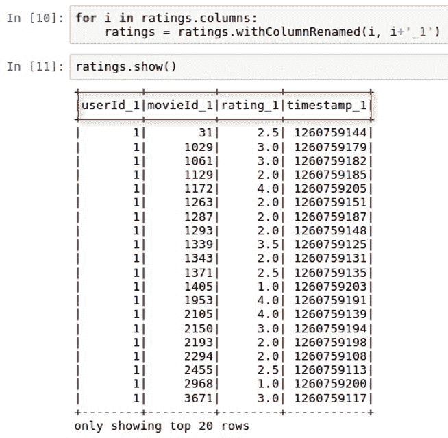

1.  现在我们可以将三个查找表与评分表进行连接。前两个与评分的连接是内连接，因为 temp1 和 temp2 的行数仍然是 100,004 行。从 tags 到评分的第三个连接需要是外连接，以避免丢失行。此外，连接需要应用于 movieId 和 userId，因为标签在任何给定时间都是唯一的，对于特定用户和特定电影。三个表 temp1、temp2 和 mainDF 的行数可以在下图中看到：

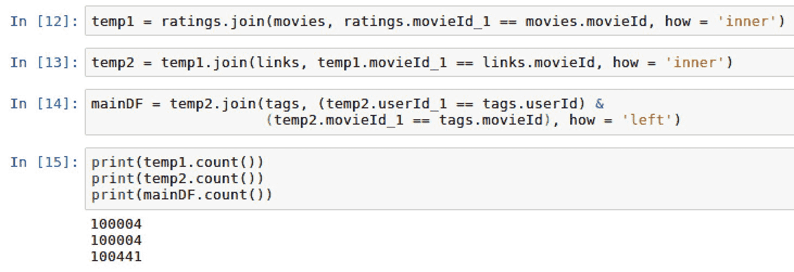

在处理数据集之间的连接时，通常会遇到三种类型的连接：内连接、左连接和右连接。内连接只在数据集 1 和数据集 2 的连接键都可用时才产生结果集。左连接将产生数据集 1 的所有行，以及数据集 2 中匹配键的行。右连接将产生数据集 2 的所有行，以及数据集 1 中匹配键的行。在本节的后面，我们将探讨 Spark 中的 SQL 连接。

1.  有趣的是，我们新创建的数据集 mainDF 有 100,441 行，而不是原始评分数据集中的 100,004 行，以及 temp1 和 temp2。有 437 个评分有多个标签与之关联。此外，我们可以看到大多数 ratings_1 都有一个空的 tag 值与之关联，如下图所示：

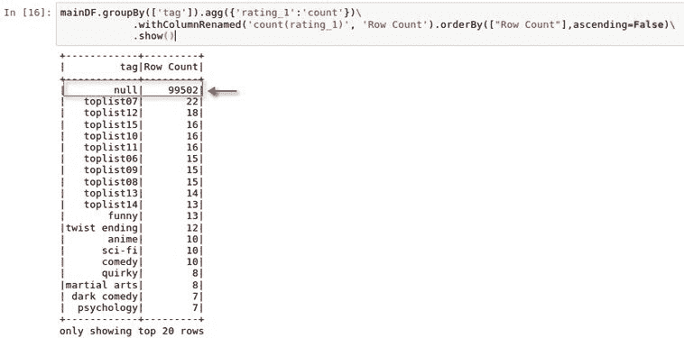

1.  我们积累了不再需要的额外重复列。总共有 14 列，如下图所示：

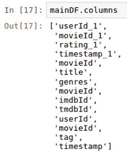

1.  另外，我们已经确定 tags 字段相对无用，因为有超过 99k 个空值。因此，我们将使用数据框架上的`select()`函数，只提取我们推荐引擎所需的八列。然后，我们可以确认我们的最终新数据框`mainDF`有正确的行数，即 100,004 行，如下截图所示：

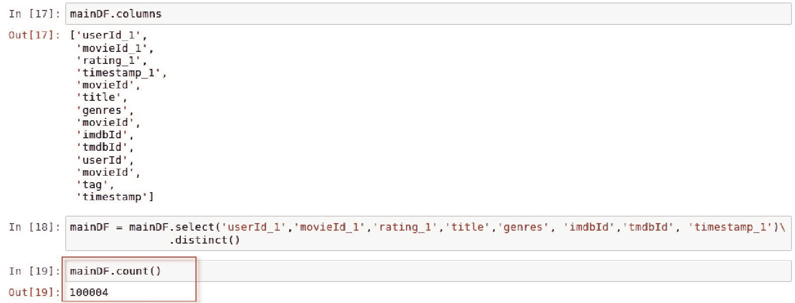

# 还有更多...

虽然我们使用 PySpark 在 Spark 数据框架中使用函数进行了连接，但我们也可以通过将数据框注册为临时表，然后使用`sqlContext.sql()`进行连接：

1.  首先，我们将使用`creatorReplaceTempView()`将每个数据集注册为临时视图，如下脚本所示：

```scala
movies.createOrReplaceTempView('movies_')
links.createOrReplaceTempView('links_')
ratings.createOrReplaceTempView('ratings_')
```

1.  接下来，我们将编写我们的 SQL 脚本，就像我们在任何其他关系数据库中所做的那样，使用`sqlContext.sql()`函数，如下脚本所示：

```scala
mainDF_SQL = \
sqlContext.sql(
"""
    select
    r.userId_1
    ,r.movieId_1
    ,r.rating_1
    ,m.title
    ,m.genres
    ,l.imdbId
    ,l.tmdbId
    ,r.timestamp_1
    from ratings_ r

    inner join movies_ m on 
    r.movieId_1 = m.movieId
    inner join links_ l on 
    r.movieId_1 = l.movieId
"""
)
```

1.  最后，我们可以对新数据框 mainDF_SQL 进行分析，并观察它看起来与我们的其他数据框 mainDF 相同，同时保持完全相同的行数，如下图所示：

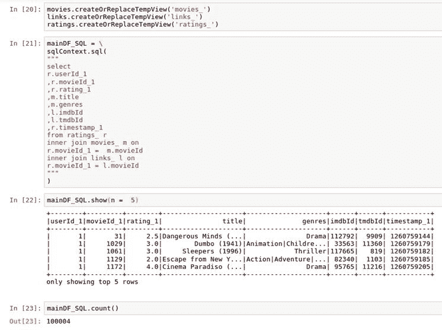

# 另请参阅

要了解有关 Spark 中 SQL 编程的更多信息，请访问以下网站：

[`spark.apache.org/docs/latest/sql-programming-guide.html`](https://spark.apache.org/docs/latest/sql-programming-guide.html)

# 探索 MovieLens 数据集

在进行任何建模之前，熟悉源数据集并进行一些探索性数据分析是很重要的。

# 准备工作

我们将导入以下库来帮助可视化和探索 MovieLens 数据集：`matplotlib`。

# 如何做...

本节将介绍分析 MovieLens 数据库中电影评分的步骤：

1.  通过执行以下脚本，检索`rating_1`列的一些摘要统计：

```scala
mainDF.describe('rating_1').show
```

1.  通过执行以下脚本构建评分分布的直方图：

```scala
import matplotlib.pyplot as plt
%matplotlib inline

mainDF.select('rating_1').toPandas().hist(figsize=(16, 6), grid=True)
plt.title('Histogram of Ratings')
plt.show()
```

1.  执行以下脚本以在电子表格数据框中查看直方图的值：

```scala
mainDF.groupBy(['rating_1']).agg({'rating_1':'count'})\
 .withColumnRenamed('count(rating_1)', 'Row Count').orderBy(["Row Count"],ascending=False)\
 .show()
```

1.  通过执行以下脚本，可以将用户对评分的唯一计数存储为数据框`userId_frequency`：

```scala
userId_frequency = mainDF.groupBy(['userId_1']).agg({'rating_1':'count'})\
         .withColumnRenamed('count(rating_1)', '# of Reviews').orderBy(["# of             Reviews"],ascending=False)
```

1.  使用以下脚本绘制`userID_frequency`的直方图：

```scala
userId_frequency.select('# of Reviews').toPandas().hist(figsize=(16, 6), grid=True)
plt.title('Histogram of User Ratings')
plt.show()
```

# 工作原理...

本节将讨论 MovieLens 数据库中评分和用户活动的分布。请查看以下步骤：

1.  我们可以看到用户平均电影评分约为 3.5，如下截图所示：

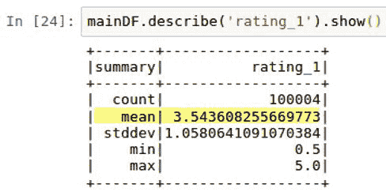

1.  尽管平均评分为 3.54，但我们可以看到直方图显示中位数评分为 4，这表明用户评分严重偏向较高的评分，如下截图所示：

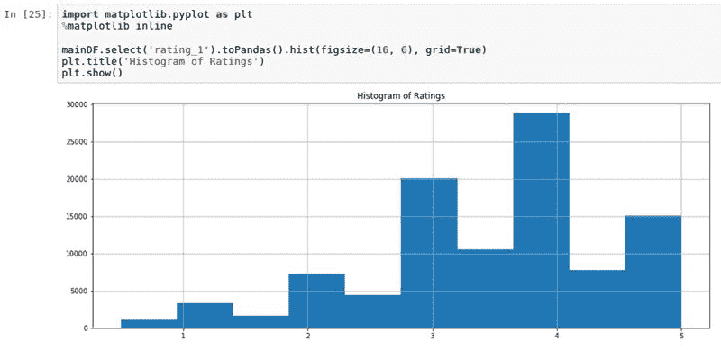

1.  直方图背后的数据再次显示，用户最频繁选择 4.0，其次是 3.0，然后是 5.0。此外，有趣的是用户更有可能给出 0.0 级别的评分，而不是 0.5 级别的评分，如下截图所示：

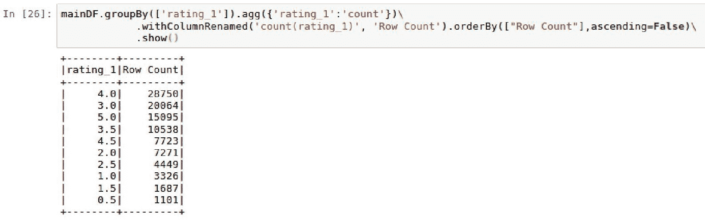

1.  我们可以查看用户对评分的分布，并且看到一些用户非常活跃地表达对他们所看电影的意见。例如，匿名用户 547 发布了 2391 条评分，如下截图所示：


1.  然而，当我们查看用户进行评分选择的分布时，我们确实看到，虽然有一些用户单独进行了一千多次选择，但绝大多数用户的选择次数少于 250 次，如下截图所示：

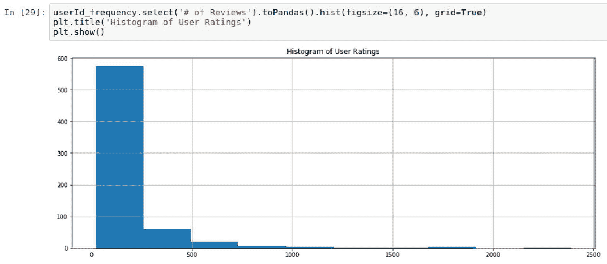

1.  在上一个截图中直方图的分布呈现长尾格式，表明大多数发生在直方图中心之外。这表明绝大多数评分是由少数用户定义的。

# 还有更多...

`pyspark`数据框中有一些类似于`pandas`数据框的特性，并且可以对特定列执行一些摘要统计。

在`pandas`中，我们使用以下脚本执行摘要统计：`dataframe['column'].describe()`。

在`pyspark`中，我们使用以下脚本执行摘要统计：`dataframe.describe('column').show()`。

# 另请参阅

要了解 PySpark 中`describe()`函数的更多信息，请访问以下网站：

[`spark.apache.org/docs/2.1.0/api/python/pyspark.sql.html#pyspark.sql.DataFrame.describe`](http://spark.apache.org/docs/2.1.0/api/python/pyspark.sql.html#pyspark.sql.DataFrame.describe)

# 为深度学习流水线准备数据集

我们现在准备将我们的数据集准备好，以便输入到我们将在 Keras 中构建的深度学习模型中。

# 准备工作

在为`Keras`准备数据集时，我们将在笔记本中导入以下库：

+   `import pyspark.sql.functions as F`

+   `import numpy as np`

+   `from pyspark.ml.feature import StringIndexer`

+   `import keras.utils`

# 如何做...

本节将介绍准备数据集用于深度学习流水线的以下步骤：

1.  执行以下脚本清理列名：

```scala
mainDF = mainDF.withColumnRenamed('userId_1', 'userid')
mainDF = mainDF.withColumnRenamed('movieId_1', 'movieid')
mainDF = mainDF.withColumnRenamed('rating_1', 'rating')
mainDF = mainDF.withColumnRenamed('timestamp_1', 'timestamp')
mainDF = mainDF.withColumnRenamed('imdbId', 'imdbid')
mainDF = mainDF.withColumnRenamed('tmdbId', 'tmdbid')
```

1.  “评分”列目前被分为 0.5 的增量。使用以下脚本调整评分，使其四舍五入为整数：

```scala
import pyspark.sql.functions as F
mainDF = mainDF.withColumn("rating", F.round(mainDF["rating"], 0))
```

1.  根据“流派”标签的频率，将“流派”列从字符串转换为名为 genreCount 的索引，如下脚本所示：

```scala
from pyspark.ml.feature import StringIndexer
string_indexer = StringIndexer(inputCol="genres", outputCol="genreCount")
mainDF = string_indexer.fit(mainDF).transform(mainDF)
```

1.  使用以下脚本简化我们的数据框：

```scala
mainDF = mainDF.select('rating', 'userid', 'movieid', 'imdbid', 'tmdbid', 'timestamp', 'genreCount')
```

1.  使用以下脚本将 mainDF 分割为用于模型训练的训练集和测试集：

```scala
trainDF, testDF = mainDF.randomSplit([0.8, 0.2], seed=1234)
```

1.  使用以下脚本将我们的两个 Spark 数据框 trainDF 和 testDF 转换为四个 numpy 数组，以便在我们的深度学习模型中使用：

```scala
import numpy as np

xtrain_array = np.array(trainDF.select('userid','movieid', 'genreCount').collect())
xtest_array = np.array(testDF.select('userid','movieid', 'genreCount').collect())

ytrain_array = np.array(trainDF.select('rating').collect())
ytest_array = np.array(testDF.select('rating').collect()
```

1.  使用以下脚本将 ytrain_array 和 ytest_array 转换为独热编码标签 ytrain_OHE 和 ytest_OHE：

```scala
import keras.utils as u
ytrain_OHE = u.to_categorical(ytrain_array)
ytest_OHE = u.to_categorical(ytest_array)
```

# 它是如何工作的...

本节将解释我们如何准备数据集用于深度学习流水线：

1.  在深度学习流水线内使用时，最好在流水线接收数据之前清理列名和列的顺序。重命名列标题后，我们可以查看更新后的列，如下脚本所示：

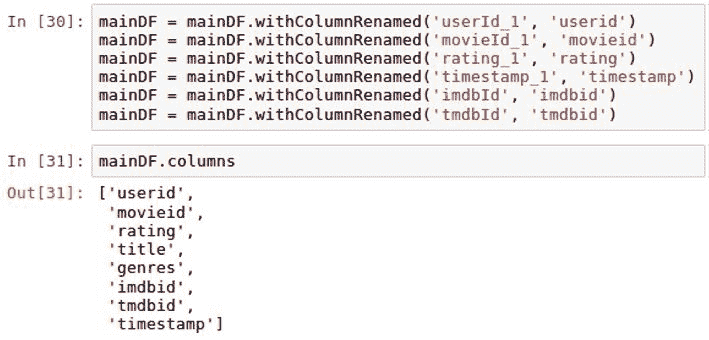

1.  对“评分”列进行一些操作，将 0.5 增量的值四舍五入为下一个最接近的整数。这将有助于我们在 Keras 中进行多类分类时，将“评分”分为六个类别，而不是 11 个类别。

1.  为了在深度学习模型中使用电影流派类型，我们需要将“流派”的字符串值转换为数字标签。最常见的流派类型将获得值 0，下一个最常见的类型将增加值。在以下截图中，我们可以看到 Good Will Hunting 有两种与之关联的流派（Drama | Romance），这是第四种最常见的 genreCount，值为 3.0：

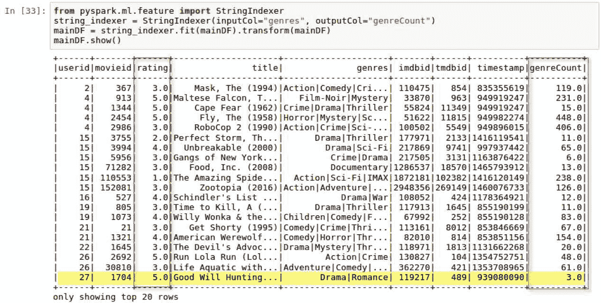

1.  流派列对于深度模型不再需要，因为它将被 genreCount 列替换，如下截图所示：

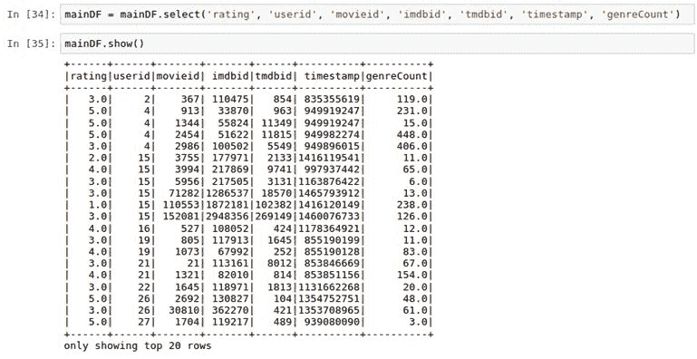

1.  我们的主数据框 mainDF 被分成 trainDF 和 testDF，用于建模、训练和评估，采用 80/20 的分割。所有三个数据框的行数可以在以下截图中看到：

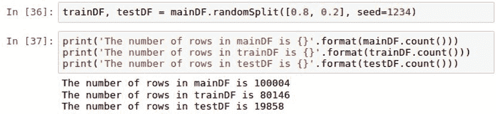

1.  数据被传递到 Keras 深度学习模型中，使用矩阵而不是数据框。因此，我们的训练和测试数据框被转换为 numpy 数组，并分为 x 和 y。选择用于 xtrain_array 和 xtest_array 的特征是 userid、movieid 和 genreCount。这些是我们用来确定用户可能评分的唯一特征。我们放弃了 imdbid 和 tmdbid，因为它们直接与 movieid 相关，因此不会提供任何额外的价值。时间戳将被删除以过滤掉与投票频率相关的任何偏见。最后，ytest_array 和 ytrain_array 将包含评分的标签值。所有四个数组的形状可以在以下截图中看到：

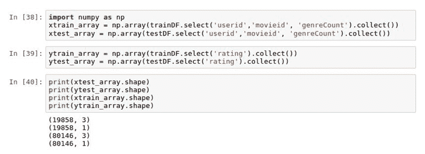

# 还有更多...

虽然`ytrain_array`和`ytest_array`都是矩阵格式的标签，但它们并不是理想的深度学习编码。由于我们正在构建的是一个分类模型，我们需要以一种能够被模型理解的方式对标签进行编码。这意味着我们的 0 到 5 的评分应该根据它们的值元素被编码为 0 或 1 值。因此，如果一个评分获得了最高值 5，它应该被编码为[0,0,0,0,0,1]。第一个位置保留给 0，第六个位置保留给 1，表示值为 5。我们可以使用`keras.utils`进行此转换，并将我们的分类变量转换为独热编码变量。通过这样做，我们的训练标签的形状从(80146,1)转换为(80146,6)，如下面的屏幕截图所示：


# 另请参阅

要了解有关`keras.utils`的更多信息，请访问以下网站：[`keras.io/utils/`](https://keras.io/utils/)

# 使用 Keras 应用深度学习模型

此时，我们已经准备好将 Keras 应用于我们的数据。

# 准备工作

我们将使用 Keras 中的以下内容：

+   `from keras.models import Sequential`

+   `from keras.layers import Dense, Activation`

# 如何做...

本节将通过以下步骤介绍如何在数据集上应用 Keras 进行深度学习模型：

1.  从`keras`中导入以下库以构建`Sequential`模型，使用以下脚本：

```scala
from keras.models import Sequential
from keras.layers import Dense, Activation
```

1.  使用以下脚本配置`keras`中的`Sequential`模型：

```scala
model = Sequential()
model.add(Dense(32, activation='relu', input_dim=xtrain_array.shape[1]))
model.add(Dense(10, activation='relu'))
model.add(Dense(ytrain_OHE.shape[1], activation='softmax'))
model.compile(optimizer='adam', loss='categorical_crossentropy', metrics=['accuracy'])
```

1.  我们`fit`和训练模型，并将结果存储到名为`accuracy_history`的变量中，使用以下脚本：

```scala
accuracy_history = model.fit(xtrain_array, ytrain_OHE, epochs=20, batch_size=32)
```

# 工作原理...

本节介绍了应用于数据集的 Keras 模型的配置，以基于所选特征预测评分。

1.  在 Keras 中，`Sequential`模型只是层的线性组合，包括以下内容：`Dense`用于在深度神经网络中定义全连接层的层类型。最后，`Activation`用于将特征的输入转换为可以用作预测的输出。在神经网络中可以使用许多类型的激活函数；但是，在本章中，我们将使用`relu`和`softmax`。

1.  `Sequential`模型配置为包括三个`Dense`层：

1.  第一层的`input_dim`设置为`xtrain_array`中的特征数量。`shape`特征拉取值为 3，使用`xtrain_array.shape[1]`。此外，第一层设置为神经网络的第一层有`32`个神经元。最后，三个输入参数使用`relu`激活函数激活。只有第一层需要显式定义输入维度。在后续层中不需要，因为它们将能够从前一层推断出维度的数量。

1.  `Sequential`模型中的第二层在神经网络中有`10`个神经元，并且激活函数设置为`relu`。在神经网络过程中早期使用修正线性单元是有效的，因为它们在训练过程中是有效的。这是因为方程的简单性，任何小于 0 的值都被舍弃，而其他激活函数则不是这样。

1.  `Sequential`模型的第三层需要根据从 0 到 5 的每种可能的评分情况生成六个输出。这需要将输出设置为`ytrain_OHE.shape[1]`的值。输出使用`softmax`函数生成，这在神经网络的末端通常是这样，因为它对分类非常有用。此时，我们正在寻找对 0 到 5 之间的值进行分类。

1.  一旦层被指定，我们必须`compile`模型。

1.  我们使用`adam`来优化模型，它代表**自适应矩估计**。优化器非常适合配置模型用于调整和更新神经网络权重的梯度下降的学习率。`adam`是一种流行的优化器，据说它结合了其他常见优化器的一些最佳特性。

1.  我们的损失函数设置为`categorical_crossentroy`，通常用于预测多类分类时使用。损失函数评估模型在训练过程中的性能。

1.  我们使用训练特征`xtrain_array`和训练标签`ytrain_OHE`来训练模型。模型在 20 个时期内进行训练，每次批量大小设置为 32。每个时期的模型输出`accuracy`和`loss`都被记录在一个名为`accuracy_history`的变量中，可以在以下截图中查看：

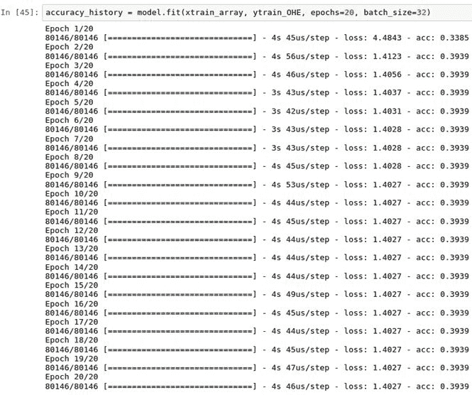

# 还有更多...

虽然我们可以在每个时期打印出损失和准确度分数，但最好是在每个 20 个时期内可视化这两个输出。我们可以使用以下脚本绘制两者：

```scala
plt.plot(accuracy_history.history['acc'])
plt.title('Accuracy vs. Epoch')
plt.xlabel('Epoch')
plt.ylabel('Accuracy')
plt.show()

plt.plot(accuracy_history.history['loss'])
plt.title('Loss vs. Epoch')
plt.xlabel('Epoch')
plt.ylabel('Loss')
plt.show()
```

脚本的输出可以在以下截图中看到：

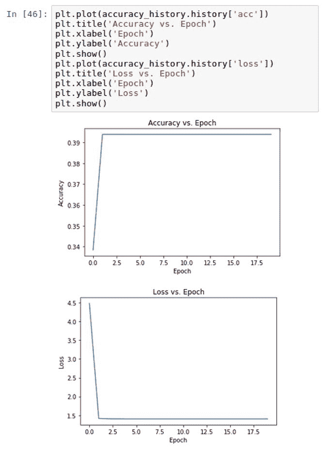

看起来在第二个时期之后，模型的损失和准确度都稳定下来了。

# 另请参阅

要了解有关使用`keras`中的`Sequential`模型入门的更多信息，请访问以下网站：[`keras.io/getting-started/sequential-model-guide/`](https://keras.io/getting-started/sequential-model-guide/)。

# 评估推荐引擎的准确性

我们现在可以计算我们基于 Keras 构建的深度学习模型的准确率。

# 准备工作

评估`Sequential`模型的准确性需要使用 Keras 中的`model.evaluate()`函数。

# 如何做...

我们可以通过执行以下脚本简单地计算准确度分数`accuracy_rate`：

```scala
score = model.evaluate(xtest_array, ytest_OHE, batch_size=128)
accuracy_rate = score[1]*100
print('accuracy is {}%'.format(round(accuracy_rate,2)))
```

# 它是如何工作的...

我们的模型性能是基于评估我们的测试特征`xtest_array`和测试标签`ytest_OHE`。我们可以使用`model.evaluate()`并将`batch_size`设置为`128`来进行评估。我们可以看到我们的准确度约为 39%，如以下截图所示：

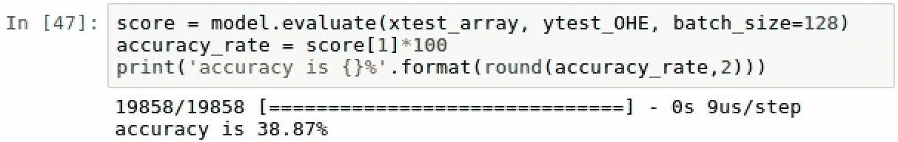

这意味着我们能够以近 39%的准确率确定用户对 0 到 5 之间的评分。

# 另请参阅

要了解有关 Keras 指标的模型性能的更多信息，请访问以下网站：

[`keras.io/metrics/`](https://keras.io/metrics/)
