# 第十三章：在 Spark 上使用 TensorFlow 进行图像分类

本章将涵盖以下内容：

+   下载 30 张梅西和罗纳尔多的图像

+   配置 PySpark 安装与深度学习包

+   将图像加载到 PySpark 数据框中

+   理解迁移学习

+   创建图像分类训练管道

+   评估模型性能

+   微调模型参数

# 介绍

在过去的几年里，图像识别软件需求不断增加。这种需求与大数据存储的进步不是巧合。Google Photos、Facebook 和 Apple 都利用图像分类软件为用户标记照片。这些公司使用的许多图像识别软件都是基于 TensorFlow 等流行库构建的深度学习模型。本章将通过利用一组图像的训练来学习或识别另一组图像，从而扩展了深度学习的技术。这个概念被称为迁移学习。在本章中，我们将专注于利用迁移学习来识别世界上排名前两位的足球运动员：

1.  利昂内尔·梅西

1.  克里斯蒂亚诺·罗纳尔多

看一下这张照片：

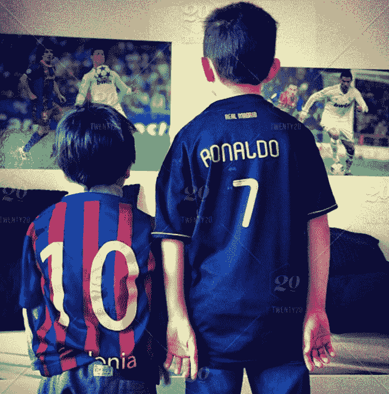

# 下载 30 张梅西和罗纳尔多的图像

在对图像进行任何分类之前，我们必须先从网络上下载我们的足球运动员的图像。

# 准备工作

浏览器有几个可以批量下载图像的插件。由于 Ubuntu 预装了 Mozilla Firefox 作为浏览器，我们将使用它作为我们首选的浏览器来安装批量图像下载扩展。

# 如何做...

以下部分解释了如何批量下载图像。看一下这些步骤：

1.  访问以下网站下载和安装 Firefox 插件：

[`addons.mozilla.org/en-US/firefox/`](https://addons.mozilla.org/en-US/firefox/)

1.  搜索并选择“下载所有图像”插件，如下截图所示：

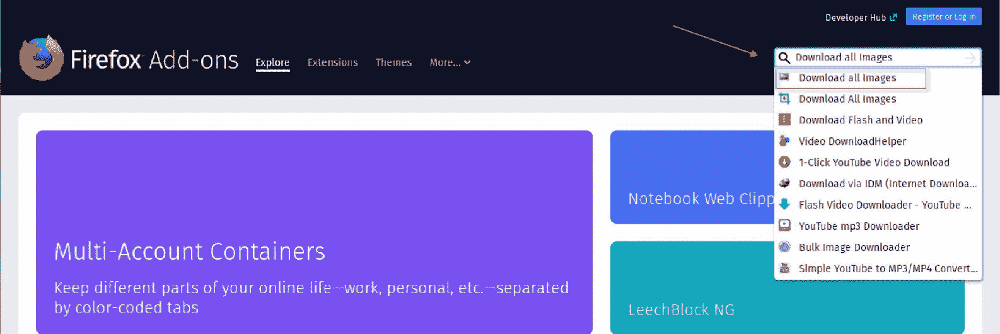

1.  这将带我们到安装页面。在此时，选择“添加到 Firefox”，如下截图所示：

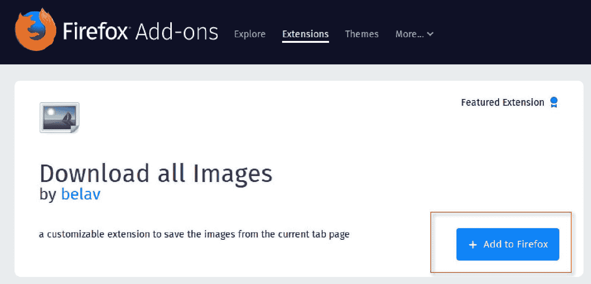

1.  确认您的安装，因为此插件将需要权限访问您的浏览器下载历史记录，访问所有网站的数据，并向您发送通知。

1.  完成后，您应该在浏览器右上角看到一个小图片图标，用于下载所有图像，如下截图所示：


1.  现在我们已经准备好开始下载我们的足球运动员的图像，使用新添加的 Firefox 扩展。我们可以访问许多不同的网站来下载图像，例如[`www.google.com`](https://www.google.com)。在本章的目的是，搜索克里斯蒂亚诺·罗纳尔多，并使用[`www.pexels.com`](https://www.pexels.com)下载他的图像，如下截图所示：

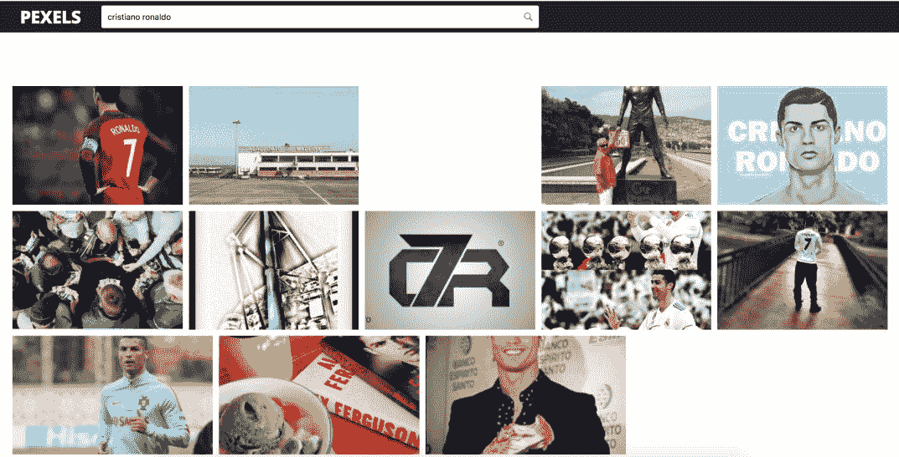

1.  接下来，点击“下载所有图像”图标，并按照以下截图中显示的设置下载图像：

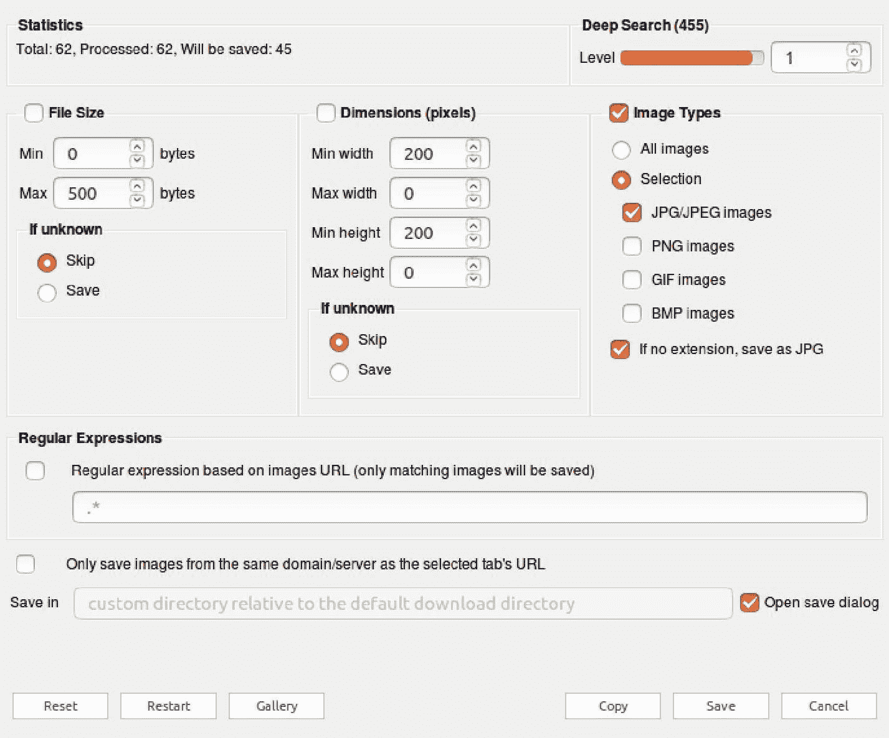

1.  点击保存，然后您将有选项将所有图片下载为`.zip`文件到本地目录。然后您可以将文件解压缩到一个文件夹中，并浏览所有图像。在我们的示例中，所有图像都已提取到`/Home/sparkNotebooks/Ch13/football/ronaldo/`，如下截图所示：

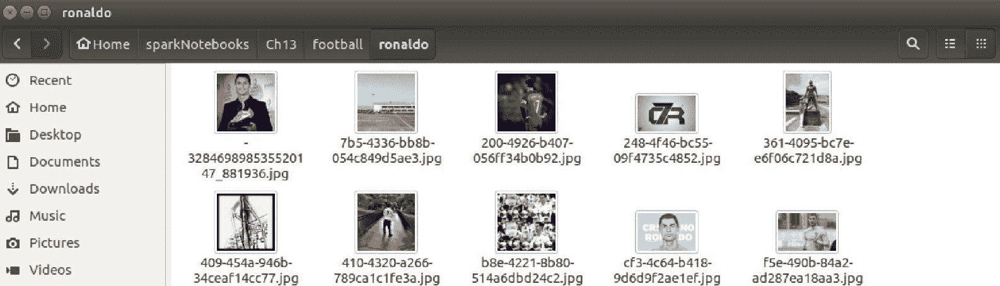

1.  在文件夹中的所有图像中，选择 30 张罗纳尔多的图像，并将它们命名为`ronaldo1.jpg`，`ronaldo2.jpg`....`ronaldo30.jpg`，如下截图所示：

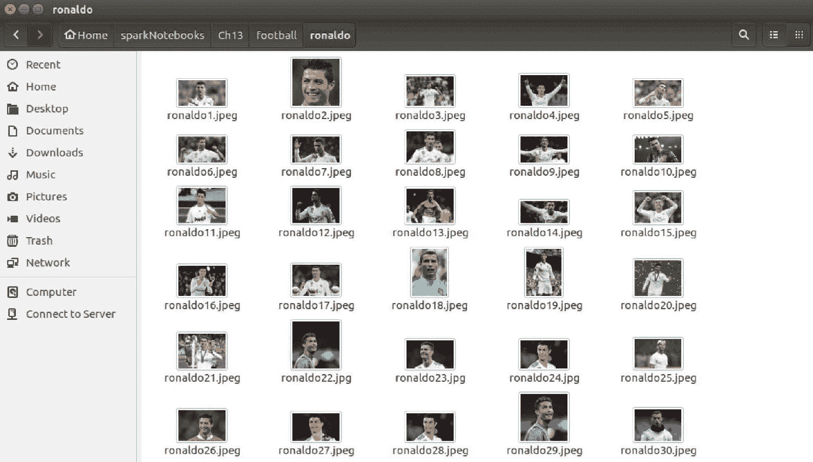

1.  重复上述步骤，这次为梅西获取 30 张图像。最终的文件夹结构应该如下所示：

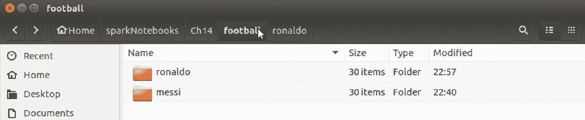

# 工作原理...

本节解释了插件如何批量下载图像到我们想要的位置的过程：

1.  批量图像下载软件现在已经在浏览器中集成。我们将使用 Firefox 的 Download all Images 附加组件快速下载 Messi 和 Ronaldo 的图片。

1.  我们希望在应用程序中指定设置以下载质量较低的图片，因此我们设置了最小阈值为 0 字节，最大阈值为 500 字节，图像类型为`jpg`或`jpeg`。

1.  最后，我们希望精选出最能代表每个球员的 30 张图片，其中 20 张将作为我们的训练数据集，剩下的 10 张将作为我们的测试数据集。其他所有图片都可以删除。

1.  所有图片都将通过它们的姓氏和 1 到 30 之间的数字进行标记或标签，用于训练目的。例如，`Messi1.jpg`，`Messi2.jpg`，`Ronaldo1.jpg`，`Ronaldo2.jpg`等。

# 还有更多...

虽然您可以使用您自己下载的图片，使用 Download all Images 下载 Ronaldo 和 Messi 的相同图片，这些图片将在本章用于训练目的。

对于 Messi：

[`github.com/asherif844/ApacheSparkDeepLearningCookbook/tree/master/CH13/football/messi`](https://github.com/asherif844/ApacheSparkDeepLearningCookbook/tree/master/CH13/football/messi)

对于 Ronaldo：

[`github.com/asherif844/ApacheSparkDeepLearningCookbook/tree/master/CH13/football/ronaldo`](https://github.com/asherif844/ApacheSparkDeepLearningCookbook/tree/master/CH13/football/ronaldo)

# 另请参阅

其他浏览器也有类似的附加组件和扩展。如果您使用的是 Google Chrome，可以从以下网站下载一个名为*D*ownload'em All 的类似附加组件：

[`chrome.google.com/webstore/detail/downloadem-all/ccdfjnniglfbpaplecpifdiglfmcebce?hl=en-US`](https://chrome.google.com/webstore/detail/downloadem-all/ccdfjnniglfbpaplecpifdiglfmcebce?hl=en-US)

# 配置 PySpark 安装以使用深度学习包

在 PySpark 中有一些额外的配置需要完成，以实现 Databricks 的深度学习包`spark-deep-learning`。这些配置是在第一章中进行的，*为深度学习设置您的 Spark 环境*。

# 准备工作

此配置需要在终端中进行更改，使用**bash**。

# 如何做...

以下部分将逐步介绍如何配置 PySpark 以使用深度学习包：

1.  打开终端应用程序，输入以下命令：

```scala
nano .bashrc.
```

1.  滚动到文档底部，查找我们在第一章中创建的`sparknotebook()`函数。

1.  更新函数的最后一行。它目前应该看起来像下面这样：

```scala
$SPARK_HOME/bin/pyspark.
```

将其更改为以下内容：

```scala
$SPARK_HOME/bin/pyspark --packages databricks:spark-deep-learning:0.1.0-spark2.1-s_2.11.
```

1.  一旦配置更改完成，退出文档并执行以下脚本以确认所有必要的更改已保存：

```scala
source .bashrc.
```

# 它是如何工作的...

以下部分解释了如何修改 PySpark 以整合深度学习包，请查看这些步骤：

1.  访问 bash 允许我们在命令行上进行配置，如下截图所示：

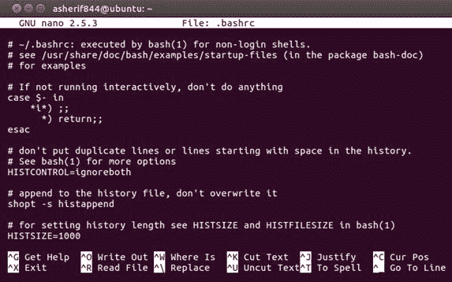

1.  在我们的文档末尾，我们可以看到我们的原始函数`sparknotebook()`仍然完整；但是，我们需要修改它以整合`spark-deep-learning`包。

1.  由于这个修改是直接针对 PySpark 的，而不是针对 Python 库的，我们无法使用典型的`pip`安装将其合并到我们的框架中。相反，我们将修改我们的 PySpark 配置，使其显示如下截图所示：

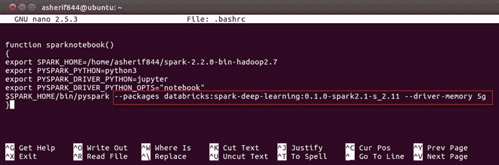

1.  我们现在已经配置了我们的 PySpark 安装，以整合包含帮助构建各种解决方案模型的深度学习库。

# 还有更多...

这个包`spark-deep-learning`由`Databricks`管理。 Databricks 是由 Spark 的共同创始人之一 Ali Ghodsi 创立的，并且用于通过统一平台提供托管的 Spark 产品。

# 另请参阅

要了解为 Spark 开发的其他第三方包，请访问以下网站：

[`spark-packages.org/`](https://spark-packages.org/)。

# 将图像加载到 PySpark 数据框中

现在我们已经准备好开始将图像导入我们的笔记本进行分类。

# 准备工作

在本节中，我们将使用几个库及其依赖项，这将要求我们在 Ubuntu Desktop 的终端上通过`pip install`安装以下软件包：

```scala
pip install tensorflow==1.4.1
pip install keras==2.1.5
pip install sparkdl
pip install tensorframes
pip install kafka
pip install py4j
pip install tensorflowonspark
pip install jieba
```

# 如何做到...

以下步骤将演示如何将图像解码为 Spark 数据框：

1.  使用以下脚本启动`spark`会话：

```scala
spark = SparkSession.builder \
      .master("local") \
      .appName("ImageClassification") \
      .config("spark.executor.memory", "6gb") \
      .getOrCreate()
```

1.  从 PySpark 导入以下库以创建数据框，使用以下脚本：

```scala
import pyspark.sql.functions as f
import sparkdl as dl
```

1.  执行以下脚本，为 Messi 和 Ronaldo 创建两个数据框，使用每个球员的主文件夹位置：

```scala
dfMessi = dl.readImages('football/messi/').withColumn('label', f.lit(0))
dfRonaldo = dl.readImages('football/ronaldo/').withColumn('label',             f.lit(1))
```

1.  将每个数据框拆分为`66.7/33.3`的训练和测试集，并设置随机种子为`12`，使用以下脚本：

```scala
trainDFmessi, testDFmessi = dfMessi.randomSplit([66.7, 33.3], seed = 12)
trainDFronaldo, testDFronaldo = dfRonaldo.randomSplit([66.7, 33.3], seed =     12)
```

1.  最后，使用以下脚本将训练数据框和测试数据框合并成一个新的数据框`trainDF`和`testDF`：

```scala
trainDF = trainDFmessi.unionAll(trainDFronaldo)
testDF = testDFmessi.unionAll(testDFronaldo)
```

# 它是如何工作的...

以下部分解释了如何加载图像并将其读入 Jupyter 笔记本。看看这些步骤：

1.  我们总是通过启动 Spark 会话来开始一个 Spark 项目，以设置应用程序名称以及设置 Spark 执行器内存。

1.  我们导入`pyspark.sql.functions`和`sparkdl`来帮助基于编码图像构建数据框。当导入`sparkdl`时，我们看到它在后台使用 TensorFlow，如下图所示：

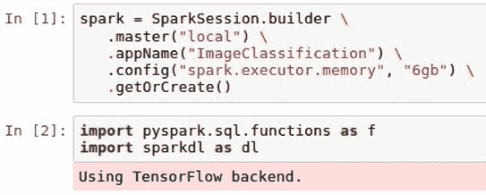

1.  使用`sparkdl`创建数据框，包括三列：文件路径、图像和标签。 Sparkdl 用于导入每个图像并按颜色和形状对其进行编码。此外，使用`lit`函数将文字值（0 或 1）标记到两个数据框的标签列下，以供训练目的，如下图所示：

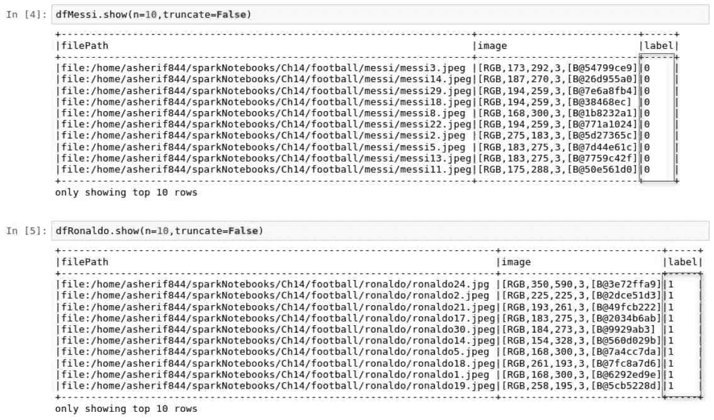

1.  由于每个足球运动员有 30 张图像，因此使用 66.7/33.3 的拆分比例创建 18 张训练图像和 12 张测试图像，如下图所示：

请注意，在使用深度学习时，训练过程中使用的图像越多越好。然而，我们将在本章中尝试证明的一点是，通过将迁移学习作为深度学习的扩展实现，我们可以使用更少的训练样本对图像进行分类，就像本章中 Ronaldo 和 Messi 各只有 30 张图像一样。

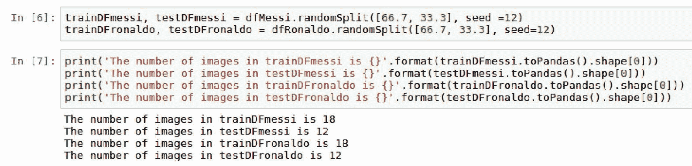

1.  为了构建我们的模型，我们只对创建一个包含 36 张图像的训练数据框感兴趣，以及一个包含剩余 24 张图像的测试数据框。一旦合并数据框，我们可以确认它们的大小是否正确，如下图所示：

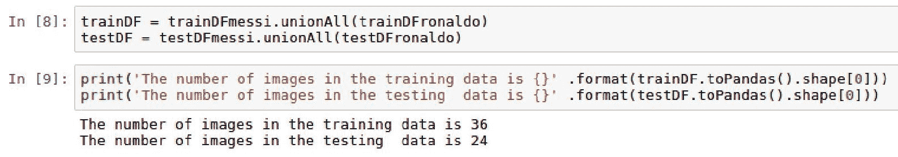

# 还有更多...

在这个过程中可能会丢失，但重要的是要注意，将图像加载到数据框中很容易，只需使用`sparkdl.readImages`几行代码即可。这展示了使用 Spark 提供的机器学习管道的强大功能。

# 另请参阅

要了解有关`sparkdl`包的更多信息，请访问以下存储库：

[`databricks.github.io/spark-deep-learning/site/api/python/sparkdl.html`](https://databricks.github.io/spark-deep-learning/site/api/python/sparkdl.html)

# 理解迁移学习

本章的其余部分将涉及迁移学习技术；因此，我们将在本节中解释迁移学习在我们的架构中的工作原理。

# 准备工作

本节不需要任何依赖项。

# 如何做到...

本节将介绍迁移学习的工作步骤：

1.  确定一个预先训练的模型，将其用作将转移到我们选择的任务的训练方法。在我们的情况下，任务将是识别梅西和罗纳尔多的图像。

1.  有几种可用的预训练模型可以使用。最受欢迎的是以下几种：

1.  Xception

1.  InceptionV3

1.  ResNet50

1.  VGG16

1.  VGG19

1.  从预先训练的卷积神经网络中提取并保存一定数量的图像的特征，经过多层的过滤和池化。

1.  预先训练的卷积神经网络的最后一层被替换为我们要基于数据集分类的特定特征。

# 工作原理...

本节解释了迁移学习的方法：

1.  在早期章节中，我们讨论了机器学习模型，尤其是深度学习模型，如何在训练目的上最适合较大的样本。事实上，深度学习的一般座右铭是越多越好。

1.  然而，有时候高数量的数据或图像并不可用于训练模型。在这种情况下，我们希望将一个领域的学习转移到预测不同领域的结果。已经由开发许多预先训练的模型的机构执行了从卷积神经网络中提取特征和过滤层的繁重工作，例如 InceptionV3 和 ResNet50：

1.  InceptionV3 是在 Google 开发的，比 ResNet50 和 VGG 的权重要小

1.  ResNet50 使用 50 个权重层

1.  VGG16 和 VGG19 分别具有 16 和 19 个权重层

1.  一些更高级的深度学习库，如 Keras，现在预先构建了这些预先训练的网络，通过指定模型名称来更简化应用。

# 还有更多...

确定哪个预先训练的模型最适合所涉及的数据或图像集将取决于使用的图像类型。最好尝试不同的预先训练集，并确定哪一个提供了最佳的准确性。

# 另请参阅

要了解有关 Inception V3 预训练模型的更多信息，请阅读以下论文：

[`arxiv.org/abs/1409.4842`](https://arxiv.org/abs/1409.4842)

要了解有关 VGG 预训练模型的更多信息，请阅读以下论文：

[`arxiv.org/abs/1409.1556`](https://arxiv.org/abs/1409.1556)

# 创建图像分类训练管道

我们现在准备构建用于训练数据集的深度学习管道。

# 准备工作

将导入以下库以帮助管道开发：

+   `LogisticRegression`

+   `Pipeline`

# 如何操作...

以下部分将介绍创建图像分类管道的以下步骤：

1.  执行以下脚本以开始深度学习管道，并配置分类参数：

```scala
from pyspark.ml.classification import LogisticRegression
from pyspark.ml import Pipeline

vectorizer = dl.DeepImageFeaturizer(inputCol="image", 
                           outputCol="features", 
                           modelName="InceptionV3")
logreg = LogisticRegression(maxIter=30, 
         labelCol="label")
pipeline = Pipeline(stages=[vectorizer, logreg])
pipeline_model = pipeline.fit(trainDF)
```

1.  创建一个新的数据框`predictDF`，其中包含原始测试标签以及新的预测分数，使用以下脚本：

```scala
predictDF = pipeline_model.transform(testDF)
predictDF.select('prediction', 'label').show(n = testDF.toPandas().shape[0], truncate=False)
```

# 工作原理...

以下部分解释了如何配置图像分类管道以实现最佳性能：

1.  `LogisticRegression`被导入，因为它将是用于区分梅西和罗纳尔多图像的主要分类算法。`DeepImageFeaturizer`从`sparkdl`中导入，以根据图像创建特征，这将作为逻辑回归算法的最终输入。

重要的是要注意，从`DeepImageFeaturizer`创建的特征将使用基于`InceptionV3`的预训练模型，并分配一个`vectorizer`变量。

逻辑回归模型被调整为最多运行 30 次迭代。最后，管道将`vectorizer`和`LogisticRegression`变量一起输入并将其拟合到训练数据框`trainDF`中。`vectorizer`用于从图像中创建数值。`DeepImageFeaturizer`的输出可以在以下截图中看到：

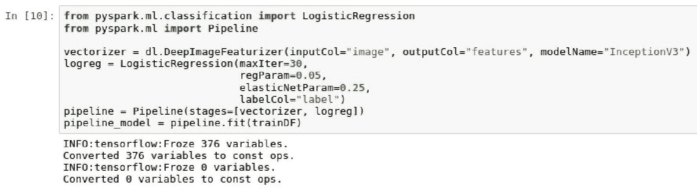

1.  测试数据框`testDF`通过应用拟合的管道模型`pipeline_model`转换为一个新的数据框`predictDF`，从而创建一个名为 prediction 的新列。然后我们可以将我们的标签列与我们的预测列进行比较，如下面的屏幕截图所示：

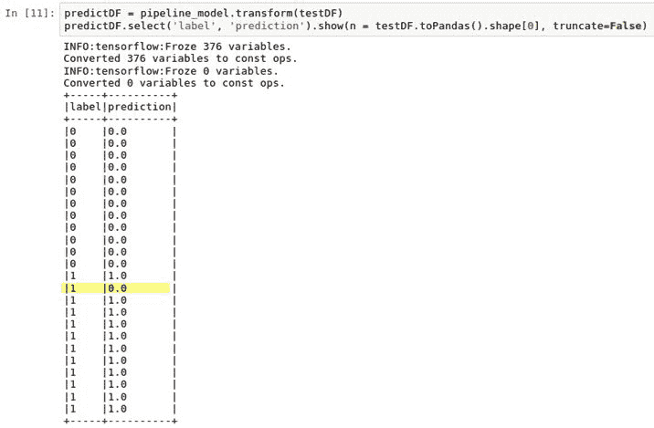

# 还有更多...

`InceptionV3`是我们用于分类图像的图像分类器模型；然而，我们也可以很容易地选择其他预训练模型，并在我们的管道中比较准确度。

# 另请参阅

要了解更多关于迁移学习的信息，请阅读威斯康星大学的以下文章：

[`ftp.cs.wisc.edu/machine-learning/shavlik-group/torrey.handbook09.pdf`](http://ftp.cs.wisc.edu/machine-learning/shavlik-group/torrey.handbook09.pdf)

# 评估模型性能

我们准备好评估我们的模型，并看看我们能多好地区分梅西和罗纳尔多。

# 准备工作

由于我们将进行一些模型评估，我们需要导入以下库：

+   `MulticlassClassificationEvaluator`

# 如何做...

以下部分将介绍以下步骤来评估模型性能：

1.  执行以下脚本，从`predictDF`数据框中创建混淆矩阵：

```scala
predictDF.crosstab('prediction', 'label').show().
```

1.  通过执行以下脚本，基于我们的 24 张罗纳尔多和梅西的测试图像，计算一个准确度得分：

```scala
from pyspark.ml.evaluation import MulticlassClassificationEvaluator

scoring = predictDF.select("prediction", "label")
accuracy_score = MulticlassClassificationEvaluator(metricName="accuracy")
rate = accuracy_score.evaluate(scoring)*100
print("accuracy: {}%" .format(round(rate,2))).
```

# 它是如何工作的...

以下部分解释了我们如何评估模型性能。看看这些图片：

1.  我们可以将我们的数据框`predictDF`转换为交叉表，以创建一个混淆矩阵。这样可以让我们了解我们的模型中有多少真正阳性、假阳性、真正阴性和假阴性，如下面的屏幕截图所示：

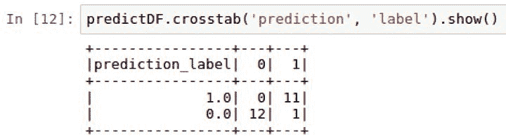

1.  此时，我们准备好计算我们使用 36 张训练图像来准确分类剩下的 24 张罗纳尔多和梅西的测试图像的模型表现如何。从之前的屏幕截图中可以看出，我们有 24 张中的 21 张被准确分类。我们有 2 张梅西的图像被错误分类为罗纳尔多，只有一张罗纳尔多的图像被错误分类为梅西。这应该得出一个准确度得分为 88%。我们可以看到`MulticlassClassificationEvaluator`的准确度得分也为 87.5%，如下面的屏幕截图所示：

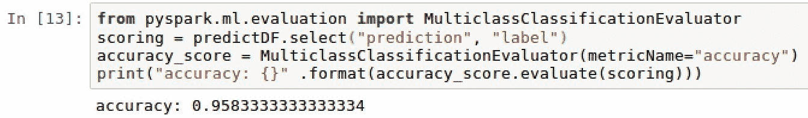

# 还有更多...

虽然我们最终使用准确度作为衡量模型表现的基准指标，但我们也可以轻松地使用精确度或召回率。此外，我们使用`MulticlassClassificationEvaluator`来评估模型的准确性。由于在这种情况下我们处理的是二元结果，只有两种类型的罗纳尔多或梅西的图像，我们也可以使用`BinaryClassificationEvaluator`，如下面的屏幕截图所示：

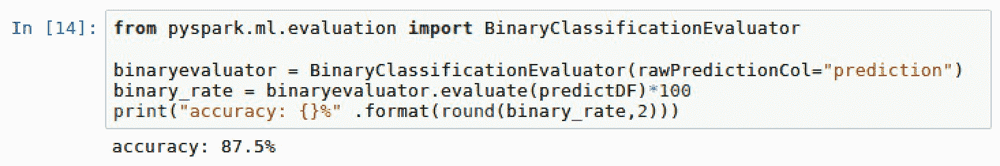

我们最终的准确率仍然是 87.5%。

# 另请参阅

要了解有关 PySpark 中逻辑回归函数的`MulticlassClassificationEvaluator`的更多信息，请访问以下网站：

[`spark.apache.org/docs/2.2.0/ml-classification-regression.html`](https://spark.apache.org/docs/2.2.0/ml-classification-regression.html)

# 微调模型参数

任何模型的准确度都有改进的空间。在本节中，我们将讨论一些可以调整以提高我们模型准确度得分的参数。

# 准备工作

本节不需要任何新的先决条件。

# 如何做...

本节将介绍微调模型的步骤。

1.  使用以下脚本定义一个新的逻辑回归模型，其中包括`regParam`和`elasticNetParam`的额外参数：

```scala
logregFT = LogisticRegression(
 regParam=0.05, 
 elasticNetParam=0.3,
 maxIter=15,labelCol = "label", featuresCol="features")
```

1.  使用以下脚本创建一个为新创建的模型配置的新管道：

```scala
pipelineFT = Pipeline(stages=[vectorizer, logregFT])
```

1.  使用以下脚本将管道拟合到训练数据集`trainDF`：

```scala
pipeline_model_FT = pipelineFT.fit(trainDF)
```

1.  将模型转换应用于测试数据集`testDF`，以便使用以下脚本比较实际与预测分数：

```scala
predictDF_FT = pipeline_model_FT.transform(testDF)
predictDF_FT.crosstab('prediction', 'label').show()
```

1.  最后，使用以下脚本评估新模型的准确率`binary_rate_FT`：

```scala
binary_rate_FT = binaryevaluator.evaluate(predictDF_FT)*100
print("accuracy: {}%" .format(round(binary_rate_FT,2)))
```

# 工作原理...

本节解释了模型如何进行微调：

1.  逻辑回归模型`logregFT`使用`regParam`和`elasticNetParam`参数进行微调。这两个参数对应于逻辑回归模型的γ和α参数。正则化参数或`regParam`用于在最小化损失函数和最小化模型过拟合之间找到平衡。我们使模型越复杂，它就越可能过拟合并且不被泛化，但我们也可能会得到更低的训练误差。此外，我们使模型越简单，它就越不容易过拟合，但训练误差可能会更高。

1.  弹性网参数或`elasticNetParam`是另一种正则化技术，用于结合多个正则化器 L1 和 L2，以最小化模型的过拟合。此外，我们将迭代次数从 20 降低到 15，以查看是否可以通过包括正则化和减少运行次数同时获得更好的准确度分数。

1.  再次，就像我们在本章中之前所做的那样，我们创建了一个流水线，其中包括从图像生成的数值特征`vectorizer`，以及我们的逻辑回归模型`logregFT`。

1.  然后在训练数据`trainDF`上拟合模型，并将模型的转换应用于测试数据`testDF`。

1.  我们可以再次通过交叉表比较模型结果的实际与预测结果，如下截图所示：

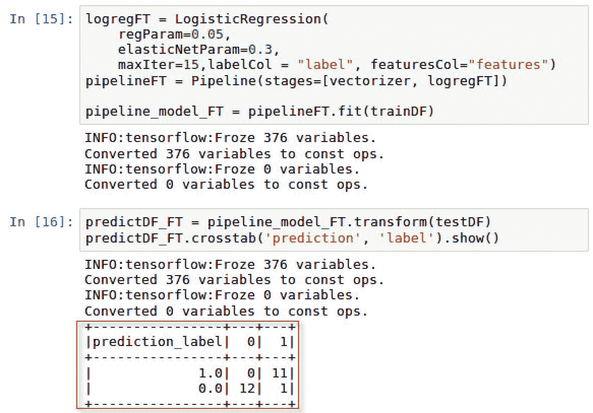

1.  与上一节相比，我们现在只有 1 张错分的图像，而不是 3 张。我们通过将`maxIter`降低到`15`次运行，并将`regParam`设置为`0.05`，`elasticNetParam`设置为`0.3`来实现这一点。

1.  我们的新准确率现在为`95.83%`，如下截图所示：

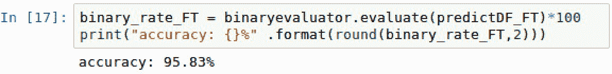

# 还有更多...

当然，我们通过将特定参数纳入我们的模型，将准确率从 87.5%提高到 95.83%。可以进行额外的微调和调整参数，以确定是否可以达到 100%的图像分类模型准确度。

# 另请参阅

要了解有关逻辑回归中正则化和弹性网参数的更多信息，请访问以下网站：

[`spark.apache.org/docs/2.2.0/mllib-linear-methods.html#logistic-regression`](https://spark.apache.org/docs/2.2.0/mllib-linear-methods.html#logistic-regression)
