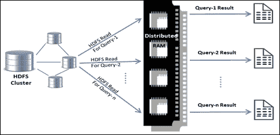
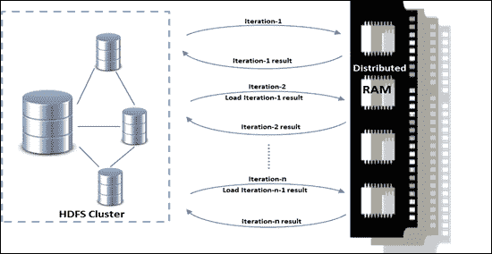
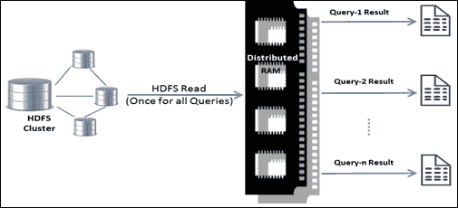
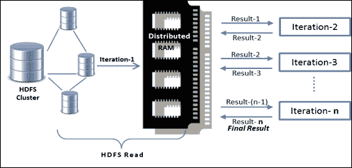
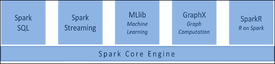

# 第一章：大数据和数据科学-介绍

*大数据绝对是一件大事！*它承诺通过从庞大的数据堆中获取隐藏的见解，并开辟新的业务发展途径，为组织创造和保持竞争优势提供了丰富的机会。通过先进的分析技术利用大数据已经成为组织的必然选择。

本章解释了大数据的全部内容，大数据分析的各种挑战，以及 Apache Spark 如何成为解决计算挑战的事实标准，并且还作为数据科学平台。

本章涵盖的主题如下：

+   大数据概述-为什么如此重要？

+   大数据分析的挑战-为什么如此困难？

+   大数据分析的演变-数据分析趋势

+   数据分析的 Spark-解决大数据挑战的解决方案

+   Spark 堆栈-构成完整大数据解决方案的一切

# 大数据概述

关于大数据已经有很多言论和文章，但没有明确的标准来清晰地定义它。在某种程度上，这实际上是一个相对的术语。无论数据是小还是大，只有当你能够正确地分析它时，你才能利用它。为了从数据中得出一些意义，需要正确的分析技术，并且在数据分析中选择正确的工具和技术至关重要。然而，当数据本身成为问题的一部分，并且在执行数据分析之前需要解决计算挑战时，它就成为了一个大数据问题。

在万维网上发生了一场革命，也被称为 Web 2.0，改变了人们使用互联网的方式。静态网页变成了互动网站，并开始收集越来越多的数据。云计算、社交媒体和移动计算的技术进步创造了数据爆炸。每个数字设备开始发出数据，许多其他来源开始驱动数据洪流。来自各个角落的数据流产生了各种大量的数据，速度之快！以这种方式形成大数据是一种自然现象，因为这就是万维网的演变方式，没有明确的特定努力。这是关于过去的事情！如果考虑到正在发生的变化，以及未来将会发生的变化，数据生成的数量和速度超出了人们的预期。我之所以要做出这样的表态，是因为如今每个设备都变得更加智能，这要感谢物联网（IoT）。

IT 趋势是技术进步也促进了数据爆炸。随着更便宜的在线存储集群和廉价的通用硬件的出现，数据存储经历了一次范式转变。将来自不同来源的数据以其原生形式存储在单一数据湖中，迅速取代了精心设计的数据集市和数据仓库。使用模式也从严格的基于模式的 RDBMS 方法转变为无模式、持续可用的 NoSQL 数据存储驱动的解决方案。因此，无论是结构化、半结构化还是非结构化的数据创建速度都加速了前所未有的速度。

组织非常确信，利用大数据不仅可以回答特定的业务问题，还可以带来机会，以覆盖业务中未发现的可能性，并解决与此相关的不确定性。因此，除了自然的数据涌入外，组织开始制定策略，产生越来越多的数据，以保持其竞争优势并做好未来准备。举个例子来更好地理解这一点。想象一下，在制造工厂的机器上安装了传感器，这些传感器不断地发出数据，因此可以得知机器零部件的状态，公司能够预测机器何时会发生故障。这让公司能够预防故障或损坏，避免计划外停机，从而节省大量资金。

# 大数据分析的挑战

在大数据分析中，主要存在两种类型的严峻挑战。第一个挑战是需要一个庞大的计算平台，一旦建立起来，第二个挑战就是在规模上分析和理解大量数据。

## 计算挑战

随着数据量的增加，大数据的存储需求也越来越大。数据管理变成了一项繁琐的任务。尽管处理器的处理速度和 RAM 的频率达到了标准，但由于寻道时间导致的访问磁盘存储的延迟成为了主要瓶颈。

从各种业务应用程序和数据孤岛中提取结构化和非结构化数据，对其进行整合并加工以找到有用的业务见解是具有挑战性的。只有少数应用程序能够解决任何一个领域，或者只能解决少数多样化的业务需求。然而，将这些应用程序集成在一起以统一方式解决大部分业务需求只会增加复杂性。

为了解决这些挑战，人们转向了具有分布式文件系统的分布式计算框架，例如 Hadoop 和**Hadoop 分布式文件系统**（**HDFS**）。这可以消除由于磁盘 I/O 而产生的延迟，因为数据可以在机器集群上并行读取。

分布式计算技术在之前已存在几十年，但直到行业意识到大数据的重要性后才变得更加突出。因此，诸如 Hadoop 和 HDFS 或 Amazon S3 之类的技术平台成为了行业标准。除了 Hadoop 之外，还开发了许多其他解决方案，如 Pig、Hive、Sqoop 等，以满足不同类型的行业需求，如存储、**提取、转换和加载**（**ETL**）以及数据集成，从而使 Hadoop 成为一个统一的平台。

## 分析挑战

分析数据以发现一些隐藏的见解一直是具有挑战性的，因为处理大型数据集涉及到额外的复杂性。传统的 BI 和 OLAP 解决方案无法解决由大数据带来的大部分挑战。举个例子，如果数据集有多个维度，比如 100 个，那么很难将这些变量相互比较以得出结论，因为会有大约 100C2 种组合。这种情况需要使用统计技术，如*相关性*等，来发现隐藏的模式。

尽管许多问题都有统计解决方案，但对于数据科学家或分析专业人员来说，除非他们将整个数据集加载到内存中的**DataFrame**中，否则很难对数据进行切片和切块以找到智能洞见。主要障碍在于，大多数用于统计分析和机器学习的通用算法都是单线程的，并且是在数据集通常不那么庞大且可以适应单台计算机的 RAM 中编写的时代编写的。这些用 R 或 Python 编写的算法在原始形式上在分布式计算环境中部署时不再非常有用，因为存在内存计算的限制。

为了解决这一挑战，统计学家和计算机科学家不得不共同努力，重写大部分算法，使其在分布式计算环境中能够良好运行。因此，在 Hadoop 上开发了一个名为**Mahout**的库，用于机器学习算法的并行处理。它包含了行业中经常使用的大多数常见算法。其他分布式计算框架也采取了类似的举措。

# 大数据分析的演变

前一节概述了如何解决大数据需求的计算和数据分析挑战。这是可能的，因为多个相关趋势的融合，如低成本的通用硬件、大数据的可访问性和改进的数据分析技术。Hadoop 成为许多大型分布式数据处理基础设施的基石。

然而，人们很快意识到 Hadoop 的局限性。Hadoop 解决方案最适合特定类型的大数据需求，如 ETL；它只在这些需求中才变得流行。

有时数据工程师或分析师需要对数据集执行即席查询进行交互式数据分析。每次在 Hadoop 上运行查询时，数据都会从磁盘（HDFS 读取）读取并加载到内存中，这是一项昂贵的工作。实际上，作业的运行速度取决于网络和磁盘集群上的 I/O 传输速度，而不是 CPU 和 RAM 的速度。

以下是情景的图示表示：

Hadoop 的 MapReduce 模型无法很好地适应迭代性质的机器学习算法。Hadoop MapReduce 在迭代计算中性能不佳，延迟巨大。由于 Map 和 Reduce 工作者之间禁止通信的受限编程模型，中间结果需要存储在稳定的存储器中。因此，这些结果被推送到 HDFS，然后写入磁盘，而不是保存在 RAM 中，然后在后续迭代中重新加载到内存中，其他迭代也是如此。磁盘 I/O 的数量取决于算法中涉及的迭代次数，这还伴随着在保存和加载数据时的序列化和反序列化开销。总的来说，这是计算昂贵的，与预期相比，并没有达到预期的受欢迎程度。

以下是这种情景的图示表示：

为了解决这个问题，开发了定制解决方案，例如谷歌的 Pregel，这是一种迭代图处理算法，针对进程间通信和中间结果的内存存储进行了优化，以使其运行更快。类似地，还开发或重新设计了许多其他解决方案，以最好地满足一些特定的算法使用的特定需求。

不需要重新设计所有算法，而是需要一个通用引擎，大多数算法可以利用它在分布式计算平台上进行内存计算。人们也期望这样的设计会导致迭代计算和临时数据分析的更快执行。这就是 Spark 项目在加州大学伯克利分校的 AMPLab 中开辟道路的方式。

# 用于数据分析的 Spark

在 AMPLab 中，Spark 项目成功之后，它于 2010 年开源，并于 2013 年转移到 Apache 软件基金会。目前由 Databricks 领导。

Spark 相对于其他分布式计算平台具有许多明显的优势，例如：

+   用于迭代机器学习和交互式数据分析的更快执行平台

+   用于批处理、SQL 查询、实时流处理、图处理和复杂数据分析的单一堆栈

+   通过隐藏分布式编程的复杂性，提供高级 API 来开发各种分布式应用程序

+   对各种数据源的无缝支持，如 RDBMS、HBase、Cassandra、Parquet、MongoDB、HDFS、Amazon S3 等

以下是迭代算法的内存数据共享的图示表示：

Spark 隐藏了编写核心 MapReduce 作业的复杂性，并通过简单的函数调用提供了大部分功能。由于其简单性，它能够满足更广泛和更大的受众群体，如数据科学家、数据工程师、统计学家和 R/Python/Scala/Java 开发人员。

Spark 架构主要包括数据存储层、管理框架和 API。它旨在在 HDFS 文件系统之上工作，并因此利用现有的生态系统。部署可以作为独立服务器或在诸如 Apache Mesos 或 YARN 之类的分布式计算框架上进行。提供了 Scala 的 API，这是 Spark 编写的语言，以及 Java、R 和 Python。

# Spark 堆栈

Spark 是一个通用的集群计算系统，它赋予其他更高级别的组件利用其核心引擎的能力。它与 Apache Hadoop 是可互操作的，可以从 HDFS 读取和写入数据，并且还可以与 Hadoop API 支持的其他存储系统集成。

虽然它允许在其上构建其他更高级的应用程序，但它已经在其核心之上构建了一些组件，这些组件与其核心引擎紧密集成，以利用核心的未来增强。这些应用程序与 Spark 捆绑在一起，以满足行业中更广泛的需求。大多数现实世界的应用程序需要在项目之间进行集成，以解决通常具有一组要求的特定业务问题。Apache Spark 可以简化这一点，因为它允许其更高级别的组件无缝集成，例如在开发项目中的库。

此外，由于 Spark 内置支持 Scala、Java、R 和 Python，更广泛的开发人员和数据工程师能够利用整个 Spark 堆栈：

## Spark 核心

Spark 核心在某种程度上类似于操作系统的内核。它是通用执行引擎，既快速又容错。整个 Spark 生态系统都是建立在这个核心引擎之上的。它主要设计用于作业调度、任务分发和跨工作节点的作业监控。它还负责内存管理，与各种异构存储系统的交互以及各种其他操作。

Spark 核心的主要构建模块是**弹性分布式数据集**（**RDD**），它是一个不可变的、容错的元素集合。Spark 可以从各种数据源（如 HDFS、本地文件系统、Amazon S3、其他 RDD、Cassandra 等 NoSQL 数据存储）创建 RDD。它们在失败时会自动重建，因此具有容错性。RDD 是通过惰性并行转换构建的。它们可以被缓存和分区，也可以或者不可以被实现。

整个 Spark 核心引擎可以被视为对分布式数据集进行简单操作的集合。Spark 中所有作业的调度和执行都是基于与每个 RDD 相关联的方法完成的。此外，与每个 RDD 相关联的方法定义了它们自己的分布式内存计算方式。

## Spark SQL

这个 Spark 模块旨在查询、分析和对结构化数据执行操作。这是整个 Spark 堆栈中非常重要的一个组件，因为大多数组织数据都是结构化的，尽管非结构化数据正在迅速增长。作为一个分布式查询引擎，它使 Hadoop Hive 查询在不进行任何修改的情况下可以运行得更快，最多可以提高 100 倍。除了 Hive，它还支持 Apache Parquet（一种高效的列存储）、JSON 和其他结构化数据格式。Spark SQL 使得可以在 Python、Scala 和 Java 中运行 SQL 查询以及复杂程序。

Spark SQL 提供了一个名为**数据框**的分布式编程抽象，之前称为 SchemaRDD，它的相关函数较少。数据框是命名列的分布式集合，类似于 SQL 表或 Python 的 Pandas 数据框。它们可以使用具有模式的各种数据源构建，例如 Hive、Parquet、JSON、其他 RDBMS 源，以及 Spark RDD。

Spark SQL 可用于跨不同格式的 ETL 处理，然后进行临时分析。Spark SQL 配备了一个名为 Catalyst 的优化器框架，可以将 SQL 查询转换为更高效的形式。

## Spark 流处理

企业数据的处理窗口正在变得比以往任何时候都要短。为了满足行业的实时处理需求，设计了 Spark 的这个组件，它既具有容错性又可扩展。Spark 通过支持对实时数据流进行数据分析、机器学习和图处理，实现了对实时数据流的实时数据分析。

它提供了一个名为**离散流**（**DStream**）的 API，用于操作实时数据流。实时数据流被切分成小批次，比如说，*x*秒。Spark 将每个批次视为 RDD 并对它们进行基本的 RDD 操作。DStreams 可以从 HDFS、Kafka、Flume 或任何其他能够通过 TCP 套接字流式传输数据的源创建出来。通过在 DStreams 上应用一些高级操作，可以产生其他 DStreams。

Spark 流处理的最终结果可以被写回到 Spark 支持的各种数据存储中，也可以被推送到任何仪表板进行可视化。

## MLlib

MLlib 是 Spark 堆栈中内置的机器学习库。它是在 Spark 0.8 中引入的。其目标是使机器学习变得可扩展和简单。开发人员可以无缝地在他们选择的编程语言（Java、Python 或 Scala）中使用 Spark SQL、Spark 流处理和 GraphX。MLlib 提供了执行各种统计分析（如相关性、抽样、假设检验等）所需的函数。此组件还涵盖了分类、回归、协同过滤、聚类和分解等领域的广泛应用和算法。

机器学习工作流程涉及收集和预处理数据，构建和部署模型，评估结果和改进模型。在现实世界中，预处理步骤需要大量的工作。这些通常是涉及昂贵的中间读/写操作的多阶段工作流程。通常情况下，这些处理步骤可能会在一段时间内多次执行。引入了一个新概念**ML Pipelines**来简化这些预处理步骤。管道是一个转换序列，其中一个阶段的输出是另一个阶段的输入，形成一个链。ML Pipeline 利用了 Spark 和 MLlib，使开发人员能够定义可重用的转换序列。

## GraphX

GraphX 是 Spark 上的一个薄层统一图分析框架。它旨在成为一个通用的分布式数据流框架，取代专门的图处理框架。它具有容错性，并且利用了内存计算。

GraphX 是一个嵌入式图处理 API，用于操作图（例如社交网络）和进行图并行计算（例如 Google 的 Pregel）。它结合了 Spark 堆栈上图并行和数据并行系统的优势，统一了探索性数据分析、迭代图计算和 ETL 处理。它扩展了 RDD 抽象，引入了**Resilient Distributed Graph**（**RDG**），这是一个带有每个顶点和边属性的有向图。

GraphX 包括大量的图算法，如 PageRank、K-Core、Triangle Count、LDA 等。

## SparkR

SparkR 项目旨在将 R 的统计分析和机器学习能力与 Spark 的可伸缩性相结合。它解决了 R 的局限性，即其能够处理的数据量受限于单台机器的内存。现在，R 程序可以通过 SparkR 在分布式环境中扩展。

SparkR 实际上是一个 R 包，提供了一个 R shell 来利用 Spark 的分布式计算引擎。借助 R 丰富的内置数据分析包，数据科学家可以交互式地分析大型数据集。

# 总结

在本章中，我们简要介绍了大数据的概念。然后，我们讨论了大数据分析中涉及的计算和分析挑战。后来，我们看了一下大数据背景下分析领域是如何随着时间的推移而发展的，趋势是什么。我们还介绍了 Spark 如何解决了大部分大数据分析挑战，并成为了数据科学和并行计算的通用统一分析平台。在本章的结尾，我们简要介绍了 Spark 堆栈及其组件。

在下一章中，我们将学习 Spark 编程模型。我们将深入了解 Spark 的基本构建块，即 RDD。此外，我们将学习如何在 Scala 和 Python 上使用 RDD API 进行编程。

# 参考资料

Apache Spark 概述：

+   [`spark.apache.org/docs/latest/`](http://spark.apache.org/docs/latest/)

+   [`databricks.com/spark/about`](https://databricks.com/spark/about)

Apache Spark 架构：

+   [`lintool.github.io/SparkTutorial/slides/day1_context.pdf`](http://lintool.github.io/SparkTutorial/slides/day1_context.pdf)
