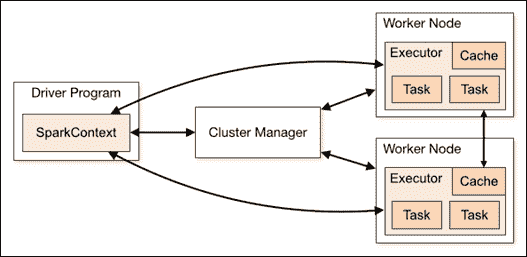
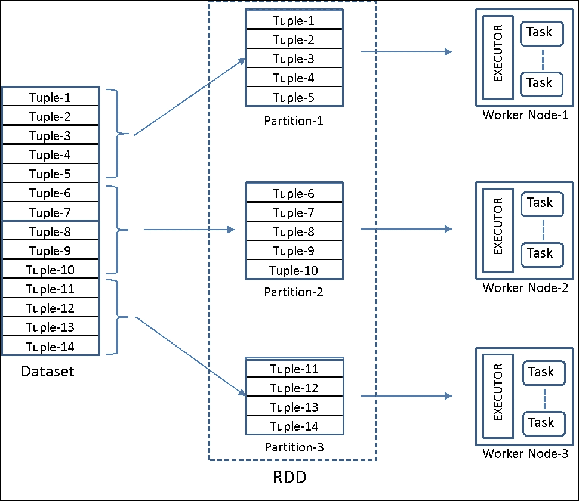
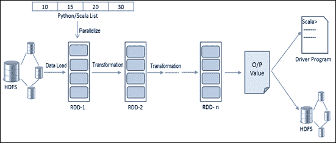

# 第二章：Spark 编程模型

大规模数据处理使用数千个具有内置容错能力的节点已经变得普遍，这是由于开源框架的可用性，Hadoop 是一个受欢迎的选择。这些框架在执行特定任务（如**提取、转换和加载**（**ETL**）以及处理网络规模数据的存储应用程序）方面非常成功。然而，开发人员在使用这些框架时需要使用大量的工具，以及成熟的 Hadoop 生态系统。需要一个单一的、通用的开发平台，满足批处理、流式处理、交互式和迭代式需求。这就是 Spark 背后的动机。

上一章概述了大数据分析的挑战，以及 Spark 在很高的层次上解决了大部分问题。在本章中，我们将深入研究 Spark 的设计目标和选择，以更清楚地了解其作为大数据科学平台的适用性。我们还将深入介绍核心抽象**弹性分布式数据集**（**RDD**）并提供示例。

在本章之前，需要基本了解 Python 或 Scala 以及对 Spark 的初步了解。本章涵盖的主题如下：

+   编程范式 - 语言支持和设计优势

+   支持的编程语言

+   选择正确的语言

+   Spark 引擎 - Spark 核心组件及其影响

+   驱动程序

+   Spark shell

+   SparkContext

+   工作节点

+   执行器

+   共享变量

+   执行流程

+   RDD API - 理解 RDD 基础

+   RDD 基础

+   持久性

+   RDD 操作 - 让我们动手做

+   开始使用 shell

+   创建 RDD

+   对普通 RDD 的转换

+   对成对 RDD 的转换

+   操作

# 编程范式

为了解决大数据挑战并作为数据科学和其他可扩展应用程序的平台，Spark 在设计时考虑周全，并提供了语言支持。

Spark 提供了专为各种应用程序开发人员设计的 API，使用标准 API 接口创建基于 Spark 的应用程序。Spark 提供了 Scala、Java、R 和 Python 编程语言的 API，如下节所述。

## 支持的编程语言

Spark 内置对多种语言的支持，可以通过一个称为**读取-求值-打印-循环**（**REPL**）的 shell 进行交互式使用，这对任何语言的开发人员来说都会感到熟悉。开发人员可以使用他们选择的语言，利用现有的库，并与 Spark 及其生态系统无缝交互。让我们看看 Spark 支持的语言以及它们如何适应 Spark 生态系统。

### Scala

Spark 本身是用 Scala 编写的，Scala 是一种基于**Java 虚拟机**（**JVM**）的函数式编程语言。Scala 编译器生成的字节码在 JVM 上执行。因此，它可以与任何其他基于 JVM 的系统（如 HDFS、Cassandra、HBase 等）无缝集成。Scala 是首选语言，因为它具有简洁的编程接口、交互式 shell 以及捕获函数并有效地在集群中的节点之间传输的能力。Scala 是一种可扩展（可伸缩，因此得名）、静态类型的、高效的多范式语言，支持函数式和面向对象的语言特性。

除了完整的应用程序外，Scala 还支持 shell（Spark shell），用于在 Spark 上进行交互式数据分析。

### Java

由于 Spark 是基于 JVM 的，它自然地支持 Java。这有助于现有的 Java 开发人员开发数据科学应用程序以及其他可扩展的应用程序。几乎所有内置库函数都可以从 Java 中访问。在 Spark 中使用 Java 进行数据科学任务的编码相对困难，但对 Java 非常熟悉的人可能会觉得很容易。

这个 Java API 只缺少一个基于 shell 的接口，用于在 Spark 上进行交互式数据分析。

### Python

Python 通过 PySpark 在 Spark 上得到支持，它是建立在 Spark 的 Java API（使用 Py4J）之上的。从现在开始，我们将使用术语**PySpark**来指代 Spark 上的 Python 环境。Python 在数据整理、数据处理和其他数据科学相关任务方面已经非常受开发人员欢迎。随着 Spark 能够解决可伸缩计算的挑战，对 Python 在 Spark 上的支持变得更加流行。

通过 Python 在 Spark 上的交互式 shell（PySpark），可以进行大规模的交互式数据分析。

### R

R 通过 SparkR 支持 Spark，这是一个 R 包，通过它可以通过 R 访问 Spark 的可伸缩性。SparkR 使 R 能够解决单线程运行时的限制，因此计算仅限于单个节点。

由于 R 最初只设计用于统计分析和机器学习，它已经丰富了大部分的包。数据科学家现在可以在大规模数据上工作，学习曲线很小。R 仍然是许多数据科学家的首选。

## 选择合适的语言

除了开发人员的语言偏好之外，有时还有其他约束条件可能会引起注意。在选择一种语言而不是另一种语言时，以下方面可能会补充您的开发经验：

+   在开发复杂逻辑时，交互式 shell 非常方便。除了 Java 之外，Spark 支持的所有语言都有交互式 shell。

+   R 是数据科学家的通用语言。由于其更丰富的库集，它绝对更适合纯数据分析。R 支持是在 Spark 1.4.0 中添加的，以便 Spark 能够接触到使用 R 的数据科学家。

+   Java 拥有更广泛的开发人员基础。Java 8 已经包含了 lambda 表达式，因此具有函数式编程方面。尽管如此，Java 往往冗长。

+   Python 在数据科学领域逐渐变得更受欢迎。Pandas 和其他数据处理库的可用性，以及其简单和表达性的特性，使 Python 成为一个强有力的选择。Python 在数据聚合、数据清洗、自然语言处理等方面比 R 更灵活。

+   Scala 可能是实时分析的最佳选择，因为它与 Spark 最接近。对于来自其他语言的开发人员来说，初始学习曲线不应成为严重生产系统的障碍。Spark 的最新增加通常首先在 Scala 中可用。其静态类型和复杂的类型推断提高了效率以及编译时检查。Scala 可以利用 Java 的库，因为 Scala 自己的库基础仍处于早期阶段，但正在迎头赶上。

# Spark 引擎

要使用 Spark 进行编程，需要对 Spark 组件有基本的了解。在本节中，将解释一些重要的 Spark 组件以及它们的执行机制，以便开发人员和数据科学家可以编写程序和构建应用程序。

在深入细节之前，我们建议您查看以下图表，以便在阅读更多内容时更容易理解 Spark 齿轮的描述：



## 驱动程序

Spark shell 是驱动程序的一个示例。驱动程序是在 JVM 中执行并在其上运行用户的*main*函数的进程。它具有一个 SparkContext 对象，它是与底层集群管理器的连接。驱动程序启动时启动 Spark 应用程序，并在驱动程序停止时完成。通过 SparkContext 的实例，驱动程序协调 Spark 应用程序中的所有进程。

主要是在驱动程序端使用数据源（可能是 RDD）和转换构建 RDD 谱系有向无环图（DAG）。当遇到*action*方法时，此 DAG 被提交给 DAG 调度程序。然后 DAG 调度程序将 DAG 拆分为逻辑工作单元（例如 map 或 reduce）称为阶段。每个阶段又是一组任务，每个任务由任务调度程序分配给执行者（工作节点）。作业可以按 FIFO 顺序或循环顺序执行，具体取决于配置。

### 提示

在单个 Spark 应用程序中，如果从不同的线程提交，多个并行作业可以同时运行。

## Spark shell

Spark shell 实际上就是由 Scala 和 Python 提供的接口。它看起来非常类似于任何其他交互式 shell。它有一个 SparkContext 对象（默认为您创建），让您利用分布式集群。交互式 shell 非常适用于探索性或临时分析。您可以通过 shell 逐步开发复杂的脚本，而无需经历编译-构建-执行的周期。

## SparkContext

SparkContext 是 Spark 核心引擎的入口点。此对象用于在集群上创建和操作 RDD，并创建共享变量。SparkContext 对象连接到负责资源分配的集群管理器。Spark 自带其自己的独立集群管理器。由于集群管理器在 Spark 中是可插拔的组件，因此可以通过外部集群管理器（如 Apache Mesos 或 YARN）进行管理。

当启动 Spark shell 时，默认会为您创建一个 SparkContext 对象。您也可以通过传递一个用于设置各种 Spark 配置参数的 SparkConf 对象来创建它。请注意，在一个 JVM 中只能有一个 SparkContext 对象。

## 工作节点

工作节点是在集群中运行应用程序代码的节点，遵循驱动程序。实际工作实际上是由工作节点执行的。集群中的每台机器可能有一个或多个工作实例（默认一个）。工作节点执行属于一个或多个 Spark 应用程序的一个或多个执行者。它包括一个*块管理器*组件，负责管理数据块。这些块可以是缓存的 RDD 数据、中间洗牌数据或广播数据。当可用的 RAM 不足时，它会自动将一些数据块移动到磁盘上。块管理器的另一个责任是在节点之间复制数据。

## 执行者

每个应用程序都有一组执行者进程。执行者驻留在工作节点上，并一旦由集群管理器建立连接，就直接与驱动程序通信。所有执行者都由 SparkContext 管理。执行者是一个单独的 JVM 实例，为单个 Spark 应用程序提供服务。执行者负责通过任务、存储和缓存在每个工作节点上管理计算。它可以同时运行多个任务。

## 共享变量

通常，代码会与变量的单独副本一起传输到分区。这些变量不能用于将结果（例如中间工作计数）传播回驱动程序。共享变量用于此目的。共享变量有两种，即**广播变量**和**累加器**。

广播变量使程序员能够保留只读副本，而不是将其与任务一起传输到每个节点。如果大型只读数据在多个操作中使用，可以将其指定为广播变量，并且只传输一次到所有工作节点。以这种方式广播的数据以序列化形式缓存，并在运行每个任务之前进行反序列化。后续操作可以访问这些变量以及与代码一起移动的本地变量。在所有情况下都不需要创建广播变量，除非跨多个阶段的任务需要相同的只读数据副本。

累加器是始终递增的变量，例如计数器或累积和。Spark 本身支持数值类型的累加器，但允许程序员为新类型添加支持。请注意，工作节点无法读取累加器的值；它们只能修改它们的值。

## 执行流程

一个 Spark 应用程序由一个*驱动*程序和多个*工作*(*执行器*)程序组成。驱动程序包含应用程序的*main*函数和一个代表与 Spark 集群的连接的 SparkContext 对象。驱动程序和其他进程之间的协调通过 SparkContext 对象进行。

典型的 Spark 客户端程序执行以下步骤：

1.  当程序在 Spark shell 上运行时，它被称为驱动程序，其中包含用户的`main`方法。它在运行驱动程序的系统的 JVM 中执行。

1.  第一步是使用所需的配置参数创建一个 SparkContext 对象。当您运行 PySpark 或 Spark shell 时，默认情况下会实例化它，但对于其他应用程序，您必须显式创建它。SparkContext 实际上是通往 Spark 的入口。

1.  下一步是定义一个或多个 RDD，可以通过加载文件或通过以并行集合引用项目数组来以编程方式定义

1.  然后，更多的 RDD 可以通过一系列的转换来定义，这些转换由一个**血统图**跟踪和管理。这些 RDD 转换可以被视为管道 UNIX 命令，其中一个命令的输出成为下一个命令的输入，依此类推。每个*转换*步骤的结果 RDD 都有一个指向其父 RDD 的指针，并且还有一个用于计算其数据的函数。只有在遇到*操作*语句后，RDD 才会被执行。因此，*转换*是用于定义新 RDD 的惰性操作，而*操作*会启动计算以将值返回给程序或将数据写入外部存储。我们将在接下来的部分中更详细地讨论这一方面。

1.  在这个阶段，Spark 创建一个执行图，其中节点表示 RDD，边表示转换步骤。Spark 将作业分解为多个任务在单独的机器上运行。这就是 Spark 如何在集群中的节点之间发送**计算**，而不是将所有数据聚集在一起进行计算。

# RDD API

RDD 是一个只读的、分区的、容错的记录集合。从设计的角度来看，需要一个单一的数据结构抽象，隐藏处理各种各样的数据源的复杂性，无论是 HDFS、文件系统、RDBMS、NOSQL 数据结构还是任何其他数据源。用户应该能够从这些源中定义 RDD。目标是支持各种操作，并让用户以任何顺序组合它们。

## RDD 基础

每个数据集在 Spark 的编程接口中表示为一个名为 RDD 的对象。Spark 提供了两种创建 RDD 的方式。一种方式是并行化现有集合。另一种方式是引用外部存储系统中的数据集，例如文件系统。

一个 RDD 由一个或多个数据源组成，可能经过一系列的转换，包括几个操作符。每个 RDD 或 RDD 分区都知道如何在发生故障时重新创建自己。它具有转换的日志，或者是从稳定存储或另一个 RDD 重新创建自己所需的*血统*。因此，使用 Spark 的任何程序都可以确保具有内置的容错性，而不管底层数据源和 RDD 的类型如何。

RDD 上有两种方法可用：转换和操作。转换是用于创建 RDD 的方法。操作是利用 RDD 的方法。RDD 通常是分区的。用户可以选择持久化 RDD，以便在程序中重复使用。

RDD 是不可变（只读）的数据结构，因此任何转换都会创建一个新的 RDD。转换是懒惰地应用的，只有当对它们应用任何操作时，而不是在定义 RDD 时。除非用户明确将 RDD 持久化在内存中，否则每次在操作中使用 RDD 时都会重新计算 RDD。保存在内存中可以节省大量时间。如果内存不足以容纳整个 RDD，剩余部分将自动存储（溢出）到硬盘上。懒惰转换的一个优点是可以优化转换步骤。例如，如果操作是返回第一行，Spark 只计算一个分区并跳过其余部分。

RDD 可以被视为一组分区（拆分），具有对父 RDD 的依赖关系列表和一个计算分区的函数。有时，父 RDD 的每个分区被单个子 RDD 使用。这被称为*窄依赖*。窄依赖是可取的，因为当父 RDD 分区丢失时，只需要重新计算一个子分区。另一方面，计算涉及*group-by-keys*等操作的单个子 RDD 分区依赖于多个父 RDD 分区。每个父 RDD 分区的数据依次用于创建多个子 RDD 分区的数据。这样的依赖被称为*宽依赖*。在窄依赖的情况下，可以将父 RDD 分区和子 RDD 分区都保留在单个节点上（共同分区）。但在宽依赖的情况下是不可能的，因为父数据分散在多个分区中。在这种情况下，数据应该在分区之间*洗牌*。数据洗牌是一个资源密集型的操作，应尽量避免。宽依赖的另一个问题是，即使丢失一个父 RDD 分区，所有子 RDD 分区也需要重新计算。

## 持久性

RDD 在每次通过操作方法进行操作时都是即时计算的。开发人员有能力覆盖这种默认行为，并指示在分区之间*持久化*或*缓存*数据集。如果这个数据集需要参与多个操作，那么持久化可以节省大量的时间、CPU 周期、磁盘 I/O 和网络带宽。容错机制也适用于缓存分区。当任何分区由于节点故障而丢失时，它将使用一个血统图进行重新计算。如果可用内存不足，Spark 会优雅地将持久化的分区溢出到磁盘上。开发人员可以使用*unpersist*来删除不需要的 RDD。然而，Spark 会自动监视缓存，并使用**最近最少使用**（**LRU**）算法删除旧的分区。

### 提示

`Cache()`与`persist()`或`persist(MEMORY_ONLY)`相同。虽然`persist()`方法可以有许多其他参数用于不同级别的持久性，比如仅内存、内存和磁盘、仅磁盘等，但`cache()`方法仅设计用于在内存中持久化。

# RDD 操作

Spark 编程通常从选择一个合适的接口开始，这取决于您的熟练程度。如果您打算进行交互式数据分析，那么 shell 提示符将是显而易见的选择。然而，选择 Python shell（PySpark）或 Scala shell（Spark-Shell）在某种程度上取决于您对这些语言的熟练程度。如果您正在构建一个完整的可扩展应用程序，那么熟练程度就非常重要，因此您应该选择 Scala、Java 和 Python 中的一种语言来开发应用程序，并将其提交给 Spark。我们将在本书的后面更详细地讨论这个方面。

## 创建 RDDs

在本节中，我们将使用 Python shell（PySpark）和 Scala shell（Spark-Shell）来创建一个 RDD。这两个 shell 都有一个预定义的、解释器感知的 SparkContext，分配给一个名为`sc`的变量。

让我们从一些简单的代码示例开始。请注意，代码假定当前工作目录是 Spark 的主目录。以下代码片段启动了 Spark 交互式 shell，从本地文件系统读取文件，并打印该文件的第一行：

**Python**:

```scala
> bin/pyspark  // Start pyspark shell  
>>> _         // For simplicity sake, no Log messages are shown here 

>>> type(sc)    //Check the type of Predefined SparkContext object 
<class 'pyspark.context.SparkContext'> 

//Pass the file path to create an RDD from the local file system 
>>> fileRDD = sc.textFile('RELEASE') 

>>> type(fileRDD)  //Check the type of fileRDD object  
<class 'pyspark.rdd.RDD'> 

>>>fileRDD.first()   //action method. Evaluates RDD DAG and also returns the first item in the RDD along with the time taken 
took 0.279229 s 
u'Spark Change Log' 

```

**Scala**:

```scala
> bin/Spark-Shell  // Start Spark-shell  
Scala> _      // For simplicity sake, no Log messages are shown here 

Scala> sc   //Check the type of Predefined SparkContext object 
res1: org.apache.spark.SparkContext = org.apache.spark.SparkContext@70884875 

//Pass the file path to create an RDD from the local file system 

Scala> val fileRDD = sc.textFile("RELEASE") 

Scala> fileRDD  //Check the type of fileRDD object  
res2: org.apache.spark.rdd.RDD[String] = ../ RELEASE
MapPartitionsRDD[1] at textFile at <console>:21 

Scala>fileRDD.first()   //action method. Evaluates RDD DAG and also returns the first item in the RDD along with the time taken 
0.040965 s 
res6: String = Spark Change Log 

```

在前面的两个例子中，第一行已经调用了交互式 shell。SparkContext 变量`sc`已经按预期定义。我们已经创建了一个名为`fileRDD`的 RDD，指向一个名为`RELEASE`的文件。这个语句只是一个转换，直到遇到一个动作才会被执行。你可以尝试给一个不存在的文件名，但直到执行下一个语句（也就是一个*动作*语句）时才会得到任何错误。

我们已经完成了启动 Spark 应用程序（shell）、创建 RDD 和消耗它的整个循环。由于 RDD 在执行动作时每次都会重新计算，`fileRDD`没有被持久化在内存或硬盘上。这使得 Spark 能够优化步骤序列并智能地执行。实际上，在前面的例子中，优化器可能只读取了输入文件的一个分区，因为`first()`不需要完整的文件扫描。

请记住，创建 RDD 有两种方式：一种是创建一个指向数据源的指针，另一种是并行化一个现有的集合。前面的例子涵盖了一种方式，即从存储系统加载文件。现在我们将看到第二种方式，即并行化现有集合。通过传递内存中的集合来创建 RDD 是简单的，但对于大型集合可能效果不佳，因为输入集合应该完全适合驱动节点的内存。

以下示例通过使用`parallelize`函数传递 Python/Scala 列表来创建一个 RDD：

**Python**:

```scala
// Pass a Python collection to create an RDD 
>>> numRDD = sc.parallelize([1,2,3,4],2) 
>>> type(numRDD) 
<class 'pyspark.rdd.RDD'> 
>>> numRDD 
ParallelCollectionRDD[1] at parallelize at PythonRDD.scala:396 
>>> numRDD.first() 
1 
>>> numRDD.map(lambda(x) : x*x).collect() 
[1,4,9,16] 
>>> numRDD.map(lambda(x) : x * x).reduce(lambda a,b: a+b) 
30 

```

### 提示

Lambda 函数是一个无名函数，通常用作其他函数的函数参数。Python lambda 函数只能是一个单一表达式。如果你的逻辑需要多个步骤，创建一个单独的函数并在 lambda 表达式中使用它。

**Scala**:

```scala
// Pass a Scala collection to create an RDD 
Scala> val numRDD = sc.parallelize(List(1,2,3,4),2) 
numRDD: org.apache.spark.rdd.RDD[Int] = ParallelCollectionRDD[8] at parallelize at <console>:21 

Scala> numRDD 
res15: org.apache.spark.rdd.RDD[Int] = ParallelCollectionRDD[8] at parallelize at <console>:21 

Scala> numRDD.first() 
res16: Int = 1 

Scala> numRDD.map(x => x*x).collect() 
res2: Array[Int] = Array(1, 4, 9, 16) 

Scala> numRDD.map(x => x * x).reduce(_+_) 
res20: Int = 30 

```

正如我们在前面的例子中看到的，我们能够传递一个 Scala/Python 集合来创建一个 RDD，并且我们也有自由来指定将这些集合切分成的分区数。Spark 对集群的每个分区运行一个任务，因此必须仔细决定以优化计算工作。虽然 Spark 根据集群自动设置分区数，但我们可以通过将其作为`parallelize`函数的第二个参数手动设置（例如，`sc.parallelize(data, 3)`）。以下是一个 RDD 的图形表示，它是使用一个包含 14 条记录（或元组）的数据集创建的，并且被分区为 3 个，分布在 3 个节点上：



编写 Spark 程序通常包括转换和动作。转换是延迟操作，定义了如何构建 RDD。大多数转换接受一个函数参数。所有这些方法都将一个数据源转换为另一个数据源。每次对任何 RDD 执行转换时，都会生成一个新的 RDD，即使是一个小的改变，如下图所示：



这是因为 RDD 是不可变（只读）的抽象设计。从动作中产生的输出可以被写回到存储系统，也可以返回给驱动程序进行本地计算，以便产生最终输出。

到目前为止，我们已经看到了一些简单的转换来定义 RDD，并进行了一些处理和生成一些输出的动作。让我们快速浏览一些方便的转换和转换对配对 RDD 的转换。

## 对普通 RDD 的转换

Spark API 包括丰富的转换操作符，开发人员可以以任意方式组合它们。尝试在交互式 shell 上尝试以下示例，以更好地理解这些操作。

### filter 操作

`filter`操作返回一个只包含满足`filter`条件的元素的 RDD，类似于 SQL 中的`WHERE`条件。

**Python**：

```scala
a = sc.parallelize([1,2,3,4,5,6], 3) 
b = a.filter(lambda x: x % 3 == 0) 
b.collect() 
[3,6] 

```

**Scala**：

```scala
val a = sc.parallelize(1 to 10, 3) 
val b = a.filter(_ % 3 == 0) 
b.collect 

res0: Array[Int] = Array(3, 6, 9) 

```

### distinct 操作

distinct(`[numTasks]`)操作在消除重复后返回一个新数据集的 RDD。

**Python**：

```scala
c = sc.parallelize(["John", "Jack", "Mike", "Jack"], 2) 
c.distinct().collect() 

['Mike', 'John', 'Jack'] 

```

**Scala**：

```scala
val c = sc.parallelize(List("John", "Jack", "Mike", "Jack"), 2) 
c.distinct.collect 
res6: Array[String] = Array(Mike, John, Jack) 

val a = sc.parallelize(List(11,12,13,14,15,16,17,18,19,20)) 
a.distinct(2).partitions.length      //create 2 tasks on two partitions of the same RDD for parallel execution 

res16: Int = 2 

```

### 交集操作

intersection 操作接受另一个数据集作为输入。它返回一个包含共同元素的数据集。

**Python**：

```scala
x = sc.parallelize([1,2,3,4,5,6,7,8,9,10]) 
y = sc.parallelize([5,6,7,8,9,10,11,12,13,14,15]) 
z = x.intersection(y) 
z.collect() 

[8, 9, 10, 5, 6, 7] 

```

**Scala**：

```scala
val x = sc.parallelize(1 to 10) 
val y = sc.parallelize(5 to 15) 
val z = x.intersection(y) 
z.collect 

res74: Array[Int] = Array(8, 9, 5, 6, 10, 7) 

```

### union 操作

union 操作接受另一个数据集作为输入。它返回一个包含自身元素和提供给它的输入数据集的元素的数据集。如果两个集合中有共同的值，则它们将在联合后的结果集中出现为重复值。

**Python**：

```scala
a = sc.parallelize([3,4,5,6,7], 1) 
b = sc.parallelize([7,8,9], 1) 
c = a.union(b) 
c.collect() 

[3, 4, 5, 6, 7, 7, 8, 9] 

```

**Scala**：

```scala
val a = sc.parallelize(3 to 7, 1) 
val b = sc.parallelize(7 to 9, 1) 
val c = a.union(b)     // An alternative way is (a ++ b).collect 

res0: Array[Int] = Array(3, 4, 5, 6, 7, 7, 8, 9) 

```

### map 操作

map 操作通过在输入数据集的每个元素上执行输入函数来返回一个分布式数据集。

**Python**：

```scala
a = sc.parallelize(["animal", "human", "bird", "rat"], 3) 
b = a.map(lambda x: len(x)) 
c = a.zip(b) 
c.collect() 

[('animal', 6), ('human', 5), ('bird', 4), ('rat', 3)] 

```

**Scala**：

```scala
val a = sc.parallelize(List("animal", "human", "bird", "rat"), 3) 
val b = a.map(_.length) 
val c = a.zip(b) 
c.collect 

res0: Array[(String, Int)] = Array((animal,6), (human,5), (bird,4), (rat,3)) 

```

### flatMap 操作

flatMap 操作类似于`map`操作。而`map`为每个输入元素返回一个元素，`flatMap`为每个输入元素返回零个或多个元素的列表。

**Python**：

```scala
a = sc.parallelize([1,2,3,4,5], 4) 
a.flatMap(lambda x: range(1,x+1)).collect() 
   // Range(1,3) returns 1,2 (excludes the higher boundary element) 
[1, 1, 2, 1, 2, 3, 1, 2, 3, 4, 1, 2, 3, 4, 5] 

sc.parallelize([5, 10, 20], 2).flatMap(lambda x:[x, x, x]).collect() 
[5, 5, 5, 10, 10, 10, 20, 20, 20] 

```

**Scala**：

```scala
val a = sc.parallelize(1 to 5, 4) 
a.flatMap(1 to _).collect 
res47: Array[Int] = Array(1, 1, 2, 1, 2, 3, 1, 2, 3, 4, 1, 2, 3, 4, 5) 

//One more example 
sc.parallelize(List(5, 10, 20), 2).flatMap(x => List(x, x, x)).collect 
res85: Array[Int] = Array(5, 5, 5, 10, 10, 10, 20, 20, 20) 

```

### keys 操作

keys 操作返回每个元组的键的 RDD。

**Python**：

```scala
a = sc.parallelize(["black", "blue", "white", "green", "grey"], 2) 
b = a.map(lambda x:(len(x), x)) 
c = b.keys() 
c.collect() 

[5, 4, 5, 5, 4] 

```

**Scala**：

```scala
val a = sc.parallelize(List("black", "blue", "white", "green", "grey"), 2) 
val b = a.map(x => (x.length, x)) 
b.keys.collect 

res2: Array[Int] = Array(5, 4, 5, 5, 4) 

```

### cartesian 操作

`cartesian`操作接受另一个数据集作为参数，并返回两个数据集的笛卡尔积。这可能是一个昂贵的操作，返回一个大小为`m` x `n`的数据集，其中`m`和`n`是输入数据集的大小。

**Python**：

```scala
x = sc.parallelize([1,2,3]) 
y = sc.parallelize([10,11,12]) 
x.cartesian(y).collect() 

[(1, 10), (1, 11), (1, 12), (2, 10), (2, 11), (2, 12), (3, 10), (3, 11), (3, 12)] 

```

**Scala**：

```scala
val x = sc.parallelize(List(1,2,3)) 
val y = sc.parallelize(List(10,11,12)) 
x.cartesian(y).collect 

res0: Array[(Int, Int)] = Array((1,10), (1,11), (1,12), (2,10), (2,11), (2,12), (3,10), (3,11), (3,12))  

```

## 对成对 RDD 的转换

一些 Spark 操作仅适用于键值对的 RDD。请注意，除了计数操作之外，这些操作通常涉及洗牌，因为与键相关的数据可能并不总是驻留在单个分区上。

### groupByKey 操作

类似于 SQL 的`groupBy`操作，这根据键对输入数据进行分组，您可以使用`aggregateKey`或`reduceByKey`执行聚合操作。

**Python**：

```scala
a = sc.parallelize(["black", "blue", "white", "green", "grey"], 2) 
b = a.groupBy(lambda x: len(x)).collect() 
sorted([(x,sorted(y)) for (x,y) in b]) 

[(4, ['blue', 'grey']), (5, ['black', 'white', 'green'])] 

```

**Scala**：

```scala
val a = sc.parallelize(List("black", "blue", "white", "green", "grey"), 2) 
val b = a.keyBy(_.length) 
b.groupByKey.collect 

res11: Array[(Int, Iterable[String])] = Array((4,CompactBuffer(blue, grey)), (5,CompactBuffer(black, white, green))) 

```

### join 操作

join 操作接受另一个数据集作为输入。两个数据集都应该是键值对类型。结果数据集是另一个具有来自两个数据集的键和值的键值数据集。

**Python**：

```scala
a = sc.parallelize(["blue", "green", "orange"], 3) 
b = a.keyBy(lambda x: len(x)) 
c = sc.parallelize(["black", "white", "grey"], 3) 
d = c.keyBy(lambda x: len(x)) 
b.join(d).collect() 
[(4, ('blue', 'grey')), (5, ('green', 'black')), (5, ('green', 'white'))] 

//leftOuterJoin 
b.leftOuterJoin(d).collect() 
[(6, ('orange', None)), (4, ('blue', 'grey')), (5, ('green', 'black')), (5, ('green', 'white'))] 

//rightOuterJoin 
b.rightOuterJoin(d).collect() 
[(4, ('blue', 'grey')), (5, ('green', 'black')), (5, ('green', 'white'))] 

//fullOuterJoin 
b.fullOuterJoin(d).collect() 
[(6, ('orange', None)), (4, ('blue', 'grey')), (5, ('green', 'black')), (5, ('green', 'white'))] 

```

**Scala**：

```scala
val a = sc.parallelize(List("blue", "green", "orange"), 3) 
val b = a.keyBy(_.length) 
val c = sc.parallelize(List("black", "white", "grey"), 3) 
val d = c.keyBy(_.length) 
b.join(d).collect 
res38: Array[(Int, (String, String))] = Array((4,(blue,grey)), (5,(green,black)), (5,(green,white))) 

//leftOuterJoin 
b.leftOuterJoin(d).collect 
res1: Array[(Int, (String, Option[String]))] = Array((6,(orange,None)), (4,(blue,Some(grey))), (5,(green,Some(black))), (5,(green,Some(white)))) 

//rightOuterJoin 
b.rightOuterJoin(d).collect 
res1: Array[(Int, (Option[String], String))] = Array((4,(Some(blue),grey)), (5,(Some(green),black)), (5,(Some(green),white))) 

//fullOuterJoin 
b.fullOuterJoin(d).collect 
res1: Array[(Int, (Option[String], Option[String]))] = Array((6,(Some(orange),None)), (4,(Some(blue),Some(grey))), (5,(Some(green),Some(black))), (5,(Some(green),Some(white))))  

```

### reduceByKey 操作

reduceByKey 操作使用关联的 reduce 函数合并每个键的值。这也会在将结果发送到 reducer 并生成哈希分区输出之前在每个 mapper 上本地执行合并。

**Python**：

```scala
a = sc.parallelize(["black", "blue", "white", "green", "grey"], 2) 
b = a.map(lambda x: (len(x), x)) 
b.reduceByKey(lambda x,y: x + y).collect() 
[(4, 'bluegrey'), (5, 'blackwhitegreen')] 

a = sc.parallelize(["black", "blue", "white", "orange"], 2) 
b = a.map(lambda x: (len(x), x)) 
b.reduceByKey(lambda x,y: x + y).collect() 
[(4, 'blue'), (6, 'orange'), (5, 'blackwhite')] 

```

**Scala**：

```scala
val a = sc.parallelize(List("black", "blue", "white", "green", "grey"), 2) 
val b = a.map(x => (x.length, x)) 
b.reduceByKey(_ + _).collect 
res86: Array[(Int, String)] = Array((4,bluegrey), (5,blackwhitegreen)) 

val a = sc.parallelize(List("black", "blue", "white", "orange"), 2) 
val b = a.map(x => (x.length, x)) 
b.reduceByKey(_ + _).collect 
res87: Array[(Int, String)] = Array((4,blue), (6,orange), (5,blackwhite))  

```

### aggregate 操作

aggregrate 操作返回每个元组的键的 RDD。

**Python**：

```scala
z = sc.parallelize([1,2,7,4,30,6], 2) 
z.aggregate(0,(lambda x, y: max(x, y)),(lambda x, y: x + y)) 
37 
z = sc.parallelize(["a","b","c","d"],2) 
z.aggregate("",(lambda x, y: x + y),(lambda x, y: x + y)) 
'abcd' 
z.aggregate("s",(lambda x, y: x + y),(lambda x, y: x + y)) 
'ssabsscds' 
z = sc.parallelize(["12","234","345","56789"],2) 
z.aggregate("",(lambda x, y: str(max(len(str(x)), len(str(y))))),(lambda x, y: str(y) + str(x))) 
'53' 
z.aggregate("",(lambda x, y: str(min(len(str(x)), len(str(y))))),(lambda x, y: str(y) + str(x))) 
'11' 
z = sc.parallelize(["12","234","345",""],2) 
z.aggregate("",(lambda x, y: str(min(len(str(x)), len(str(y))))),(lambda x, y: str(y) + str(x))) 
'01' 

```

**Scala**：

```scala
val z = sc.parallelize(List(1,2,7,4,30,6), 2) 
z.aggregate(0)(math.max(_, _), _ + _) 
res40: Int = 37 

val z = sc.parallelize(List("a","b","c","d"),2) 
z.aggregate("")(_ + _, _+_) 
res115: String = abcd 

z.aggregate("x")(_ + _, _+_) 
res116: String = xxabxcd 

val z = sc.parallelize(List("12","234","345","56789"),2) 
z.aggregate("")((x,y) => math.max(x.length, y.length).toString, (x,y) => x + y) 
res141: String = 53 

z.aggregate("")((x,y) => math.min(x.length, y.length).toString, (x,y) => x + y) 
res142: String = 11 

val z = sc.parallelize(List("12","234","345",""),2) 
z.aggregate("")((x,y) => math.min(x.length, y.length).toString, (x,y) => x + y) 
res143: String = 01 

```

### 注意

请注意，在前面的聚合示例中，您得到的结果字符串（例如`abcd`，`xxabxcd`，`53`，`01`）不一定要与此处显示的输出完全匹配。这取决于各个任务返回其输出的顺序。

## 动作

一旦创建了 RDD，各种转换只有在对其执行*动作*时才会执行。动作的结果可以是写回存储系统的数据，也可以返回给启动此操作的驱动程序，以便在本地进行进一步计算以生成最终结果。

我们已经在之前的转换示例中涵盖了一些动作函数。以下是一些更多的示例，但还有很多需要您去探索。

### collect()函数

`collect()`函数将 RDD 操作的所有结果作为数组返回给驱动程序。这通常对于生成数据集足够小的操作非常有用。理想情况下，结果应该很容易适应托管驱动程序的系统的内存。

### count()函数

这返回数据集中的元素数量或 RDD 操作的结果输出。

### take(n)函数

`take(n)`函数返回数据集的前(`n`)个元素或 RDD 操作的结果输出。

### first()函数

`first()`函数返回数据集的第一个元素或 RDD 操作的结果输出。它的工作方式类似于`take(1)`函数。

### takeSample()函数

`takeSample(withReplacement, num, [seed])`函数返回数据集中元素的随机样本数组。它有三个参数如下：

+   `withReplacement`/`withoutReplacement`：这表示采样是否有放回（在取多个样本时，它表示是否将旧样本放回集合然后取新样本或者不放回取样）。对于`withReplacement`，参数应为`True`，否则为`False`。

+   `num`：这表示样本中的元素数量。

+   `Seed`：这是一个随机数生成器的种子（可选）。

### countByKey()函数

`countByKey()`函数仅适用于键值类型的 RDD。它返回一个(`K`, `Int`)对的表，其中包含每个键的计数。

以下是一些关于 Python 和 Scala 的示例代码片段：

**Python**：

```scala
>>> sc.parallelize([2, 3, 4]).count() 
3 

>>> sc.parallelize([2, 3, 4]).collect() 
[2, 3, 4] 

>>> sc.parallelize([2, 3, 4]).first() 
2 

>>> sc.parallelize([2, 3, 4]).take(2) 
[2, 3] 

```

**Scala**：

```scala
Scala> sc.parallelize(List(2, 3, 4)).count() 
res0: Long = 3 

Scala> sc.parallelize(List(2, 3, 4)).collect() 
res1: Array[Int] = Array(2, 3, 4) 

Scala> sc.parallelize(List(2, 3, 4)).first() 
res2: Int = 2 

Scala> sc.parallelize(List(2, 3, 4)).take(2) 
res3: Array[Int] = Array(2, 3)  

```

# 总结

在本章中，我们涉及了支持的编程语言，它们的优势以及何时选择一种语言而不是另一种语言。我们讨论了 Spark 引擎的设计以及其核心组件及其执行机制。我们看到了 Spark 如何将要计算的数据发送到许多集群节点上。然后我们讨论了一些 RDD 概念。我们学习了如何通过 Scala 和 Python 在 RDD 上创建 RDD 并对其执行转换和操作。我们还讨论了一些 RDD 的高级操作。

在下一章中，我们将详细了解 DataFrame 以及它们如何证明适用于各种数据科学需求。

# 参考资料

Scala 语言：

+   [`www.scala-lang.org`](http://www.scala-lang.org)

Apache Spark 架构：

+   [`lintool.github.io/SparkTutorial/slides/day1_context.pdf`](http://lintool.github.io/SparkTutorial/slides/day1_context.pdf)

Spark 编程指南是概念的主要资源；参考特定语言的 API 文档以获取可用操作的完整列表。

+   [`spark.apache.org/docs/latest/programming-guide.html`](http://spark.apache.org/docs/latest/programming-guide.html)

弹性分布式数据集：Matei Zaharia 等人的《内存集群计算的容错抽象》是 RDD 基础知识的原始来源：

+   [`people.csail.mit.edu/matei/papers/2012/nsdi_spark.pdf`](https://people.csail.mit.edu/matei/papers/2012/nsdi_spark.pdf)

+   [`www.eecs.berkeley.edu/Pubs/TechRpts/2014/EECS-2014-12.pdf`](http://www.eecs.berkeley.edu/Pubs/TechRpts/2014/EECS-2014-12.pdf)

Spark Summit 是 Apache Spark 的官方活动系列，提供了大量最新信息。查看过去活动的演示文稿和视频：

+   [`spark-summit.org/2016/`](https://spark-summit.org/2016/)
