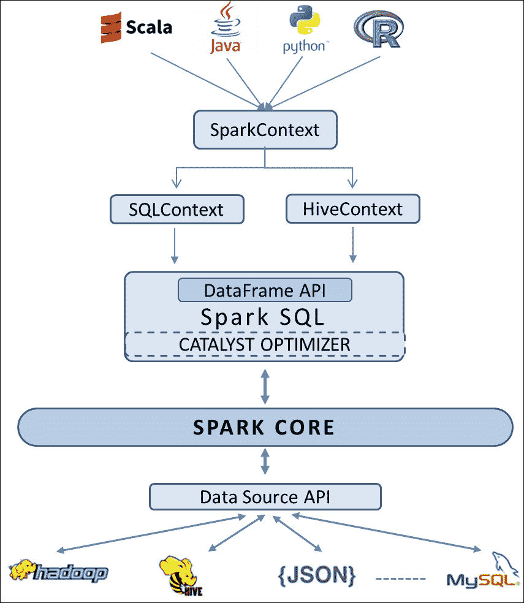

# 第三章：DataFrames 简介

要解决任何真实的大数据分析问题，绝对需要访问一个高效且可扩展的计算系统。然而，如果计算能力对目标用户不易于访问，那么这几乎没有任何意义。交互式数据分析通过可以表示为命名列的数据集变得更加容易，而这在普通的 RDDs 中是不可能的。因此，需要一种基于模式的方法来以标准化的方式表示数据，这就是 DataFrames 背后的灵感来源。

上一章概述了 Spark 的一些设计方面。我们了解到 Spark 如何通过内存计算在分布式数据集（RDDs）上进行分布式数据处理。它涵盖了大部分内容，揭示了 Spark 作为一个快速、高效和可扩展的计算平台。在本章中，我们将看到 Spark 如何引入 DataFrame API，使数据科学家能够轻松进行他们通常的数据分析活动。

这个主题将作为许多即将到来的章节的基础，并且我们强烈建议您非常了解这里涵盖的概念。作为本章的先决条件，需要对 SQL 和 Spark 有基本的了解。本章涵盖的主题如下：

+   为什么要使用 DataFrames？

+   Spark SQL

+   Catalyst 优化器

+   DataFrame API

+   DataFrame 基础知识

+   RDD 与 DataFrame

+   创建 DataFrames

+   从 RDDs

+   从 JSON

+   从 JDBC 数据源

+   从其他数据源

+   操作 DataFrames

# 为什么要使用 DataFrames？

除了大规模、可扩展的计算能力外，大数据应用还需要一些其他特性的混合，例如支持交互式数据分析的关系系统（简单的 SQL 风格）、异构数据源以及不同的存储格式以及不同的处理技术。

尽管 Spark 提供了一个用于操作分布式数据集的函数式编程 API，但最终却以元组（_1、_2 等）结束。对元组进行操作的编码有时会有些复杂和混乱，有时还会很慢。因此，需要一个标准化的层，具有以下特点：

+   具有模式的命名列（比元组更高级的抽象），使得操作和跟踪它们变得容易

+   从各种数据源（如 Hive、Parquet、SQL Server、PostgreSQL、JSON 以及 Spark 的本地 RDDs）整合数据的功能，并将它们统一到一个通用格式中

+   利用特殊文件格式（如 Avro、CSV、JSON 等）中的内置模式的能力

+   支持简单的关系操作以及复杂的逻辑操作

+   消除了基于特定领域任务定义列对象的需求，以便 ML 算法能够正常工作，并为 MLlib 中的所有算法提供一个通用的数据层

+   一个可以在不同语言的函数之间传递的与语言无关的实体

为了满足上述要求，DataFrame API 被构建为在 Spark SQL 之上的另一层抽象。

# Spark SQL

执行基本业务需求的 SQL 查询非常常见，几乎每个企业都会使用某种数据库进行操作。因此，Spark SQL 也支持使用基本 SQL 语法或 HiveQL 编写的 SQL 查询。Spark SQL 还可以用于从现有的 Hive 安装中读取数据。除了这些普通的 SQL 操作，Spark SQL 还解决了一些棘手的问题。通过关系查询设计复杂的逻辑有时很麻烦，几乎不可能。因此，Spark SQL 被设计为整合关系处理和函数式编程的能力，以便在分布式计算环境中实现、优化和扩展复杂的逻辑。与 Spark SQL 交互的基本上有三种方式，包括 SQL、DataFrame API 和 Dataset API。Dataset API 是在撰写本书时添加到 Spark 1.6 中的一个实验性层，因此我们将限制我们的讨论只涉及 DataFrames。

Spark SQL 将 DataFrames 公开为更高级别的 API，并处理所有涉及的复杂性，并执行所有后台任务。通过声明性语法，用户可以专注于程序应该完成的任务，而不必担心由 Spark SQL 内置的 Catalyst 优化器处理的控制流。

## Catalyst 优化器

Catalyst 优化器是 Spark SQL 和 DataFrame 的支点。它是使用 Scala 的函数式编程构造构建的，并具有以下功能：

+   来自各种数据格式的模式推断：

+   Spark 内置支持 JSON 模式推断。用户只需将任何 JSON 文件注册为表，并使用 SQL 语法简单查询即可创建表格。

+   RDDs 是 Scala 对象；类型信息从 Scala 的类型系统中提取，即**case classes**，如果它们包含 case classes。

+   RDDs 是 Python 对象；类型信息是使用不同的方法提取的。由于 Python 不是静态类型的，并遵循动态类型系统，RDD 可以包含多种类型。因此，Spark SQL 对数据集进行抽样，并使用类似于 JSON 模式推断的算法推断模式。

+   未来，将提供对 CSV、XML 和其他格式的内置支持。

+   内置支持广泛的数据源和查询联合以实现高效的数据导入：

+   Spark 具有内置机制，可以通过查询联合从一些外部数据源（例如 JSON、JDBC、Parquet、MySQL、Hive、PostgreSQL、HDFS、S3 等）中获取数据。它可以使用开箱即用的 SQL 数据类型和其他复杂数据类型（如 Struct、Union、Array 等）准确地对数据进行建模。

+   它还允许用户使用**Data Source API**从不受支持的数据源（例如 CSV、Avro HBase、Cassandra 等）中获取数据。

+   Spark 使用谓词下推（将过滤或聚合推入外部存储系统）来优化从外部系统获取数据并将它们组合成数据管道。

+   控制和优化代码生成：

+   优化实际上发生在整个执行管道的非常晚期。

+   Catalyst 旨在优化查询执行的所有阶段：分析、逻辑优化、物理规划和代码生成，以将查询的部分编译为 Java 字节码。

# DataFrame API

类似 Excel 电子表格的数据表示，或者来自数据库投影的输出（select 语句的输出），最接近人类的数据表示始终是一组具有多行统一列的数据。这种通常具有标记行和列的二维数据结构在某些领域被称为 DataFrame，例如 R DataFrames 和 Python 的 Pandas DataFrames。在 DataFrame 中，通常单个列具有相同类型的数据，并且行描述了关于该列的数据点，这些数据点一起表示某种含义，无论是关于一个人、一次购买还是一场棒球比赛的结果。您可以将其视为矩阵、电子表格或 RDBMS 表。

R 和 Pandas 中的 DataFrames 非常方便地对数据进行切片、重塑和分析-这是任何数据整理和数据分析工作流程中必不可少的操作。这启发了在 Spark 上开发类似概念的 DataFrames。

## DataFrame 基础知识

DataFrame API 首次在 2015 年 3 月发布的 Spark 1.3.0 中引入。它是 Spark SQL 的编程抽象，用于结构化和半结构化数据处理。它使开发人员能够通过 Python，Java，Scala 和 R 利用 DataFrame 数据结构的强大功能。与 RDD 类似，Spark DataFrame 是一个分布式记录集合，组织成命名列，类似于 RDBMS 表或 R 或 Pandas 的 DataFrame。但是，与 RDD 不同的是，它们跟踪模式并促进关系操作以及`map`等过程操作。在内部，DataFrame 以列格式存储数据，但在需要时通过过程函数构造行对象。

DataFrame API 带来了两个特性：

+   内置支持各种数据格式，如 Parquet，Hive 和 JSON。尽管如此，通过 Spark SQL 的外部数据源 API，DataFrame 可以访问各种第三方数据源，如数据库和 NoSQL 存储。

+   具有为常见任务设计的函数的更健壮和功能丰富的 DSL，例如：

+   元数据

+   抽样

+   关系数据处理 - 项目，过滤，聚合，连接

+   UDFs

DataFrame API 建立在 Spark SQL 查询优化器之上，可以在机器集群上自动高效地执行代码。

## RDD 与 DataFrame

RDD 和 DataFrame 是 Spark 提供的两种不同类型的容错和分布式数据抽象。它们在某种程度上相似，但在实现时有很大的不同。开发人员需要清楚地了解它们的差异，以便能够将其需求与正确的抽象匹配。

### 相似之处

以下是 RDD 和 DataFrame 之间的相似之处：

+   两者都是 Spark 中的容错，分区数据抽象

+   两者都可以处理不同的数据源

+   两者都是惰性评估的（在它们上执行输出操作时发生执行），因此具有最优化的执行计划的能力

+   这两个 API 在 Scala，Python，Java 和 R 中都可用

### 差异

以下是 RDD 和 DataFrame 之间的区别：

+   数据框架比 RDDs 更高级的抽象。

+   RDD 的定义意味着定义一个**有向无环图**（**DAG**），而定义 DataFrame 会导致创建一个**抽象语法树**（**AST**）。 AST 将由 Spark SQL catalyst 引擎利用和优化。

+   RDD 是一种通用的数据结构抽象，而 DataFrame 是一种专门处理二维表格数据的数据结构。

DataFrame API 实际上是 SchemaRDD 重命名。重命名是为了表示它不再继承自 RDD，并且以熟悉的名称和概念安慰数据科学家。

# 创建数据框架

Spark DataFrame 的创建类似于 RDD 的创建。要访问 DataFrame API，您需要 SQLContext 或 HiveContext 作为入口点。在本节中，我们将演示如何从各种数据源创建数据框架，从基本的代码示例开始，使用内存集合：



## 从 RDD 创建数据框架

以下代码从颜色列表创建了一个 RDD，然后是一个包含颜色名称及其长度的元组集合。它使用`toDF`方法将 RDD 转换为 DataFrame。`toDF`方法将列标签列表作为可选参数：

**Python**：

```scala
   //Create a list of colours 
>>> colors = ['white','green','yellow','red','brown','pink'] 
//Distribute a local collection to form an RDD 
//Apply map function on that RDD to get another RDD containing colour, length tuples 
>>> color_df = sc.parallelize(colors) 
        .map(lambda x:(x,len(x))).toDF(["color","length"]) 

>>> color_df 
DataFrame[color: string, length: bigint] 

>>> color_df.dtypes        //Note the implicit type inference 
[('color', 'string'), ('length', 'bigint')] 

>>> color_df.show()  //Final output as expected. Order need not be the same as shown 
+------+------+ 
| color|length| 
+------+------+ 
| white|     5| 
| green|     5| 
|yellow|     6| 
|   red|     3| 
| brown|     5| 
|  pink|     4| 
+------+------+ 

```

**Scala**：

```scala
//Create a list of colours 
Scala> val colors = List("white","green","yellow","red","brown","pink") 
//Distribute a local collection to form an RDD 
//Apply map function on that RDD to get another RDD containing colour, length tuples 
Scala> val color_df = sc.parallelize(colors) 
         .map(x => (x,x.length)).toDF("color","length") 

Scala> color_df 
res0: org.apache.spark.sql.DataFrame = [color: string, length: int] 

Scala> color_df.dtypes  //Note the implicit type inference   
res1: Array[(String, String)] = Array((color,StringType), (length,IntegerType)) 

Scala> color_df.show()//Final output as expected. Order need not be the same as shown 
+------+------+ 
| color|length| 
+------+------+ 
| white|     5| 
| green|     5| 
|yellow|     6| 
|   red|     3| 
| brown|     5| 
|  pink|     4| 
+------+------+ 

```

从上面的示例中可以看出，从开发人员的角度来看，创建 DataFrame 与从 RDD 创建类似。我们在这里创建了一个 RDD，然后将其转换为元组，然后将其发送到`toDF`方法。请注意，`toDF`接受元组列表而不是标量元素。即使要创建单列 DataFrame，您也需要传递元组。每个元组类似于一行。您可以选择标记列；否则，Spark 会创建类似`_1`、`_2`的模糊名称。列的类型推断隐式发生。

如果您已经将数据作为 RDDs，Spark SQL 支持将现有 RDDs 转换为 DataFrame 的两种不同方法：

+   第一种方法使用反射来推断包含特定类型对象的 RDD 的模式，这意味着您了解模式。

+   第二种方法是通过编程接口，允许您构建模式，然后将其应用于现有的 RDD。虽然这种方法更冗长，但它允许您在运行时构建 DataFrame，当列类型直到运行时才知道时。

## 从 JSON 创建 DataFrame

JavaScript 对象表示法（JSON）是一种与语言无关、自描述、轻量级的数据交换格式。JSON 已经成为一种流行的数据交换格式，并且变得无处不在。除了 JavaScript 和 RESTful 接口之外，诸如 MySQL 之类的数据库已经接受 JSON 作为一种数据类型，而 MongoDB 以二进制形式将所有数据存储为 JSON 文档。数据与 JSON 之间的转换对于任何现代数据分析工作流程都是必不可少的。Spark DataFrame API 允许开发人员将 JSON 对象转换为 DataFrame，反之亦然。让我们仔细看一下以下示例，以便更好地理解：

Python：

```scala
//Pass the source json data file path 
>>> df = sqlContext.read.json("./authors.json") 
>>> df.show() //json parsed; Column names and data    types inferred implicitly 
+----------+---------+ 
|first_name|last_name| 
+----------+---------+ 
|      Mark|    Twain| 
|   Charles|  Dickens| 
|    Thomas|    Hardy| 
+----------+---------+ 

```

Scala：

```scala
//Pass the source json data file path 
Scala> val df = sqlContext.read.json("./authors.json") 
Scala> df.show()  //json parsed; Column names and    data types inferred implicitly 
+----------+---------+ 
|first_name|last_name| 
+----------+---------+ 
|      Mark|    Twain| 
|   Charles|  Dickens| 
|    Thomas|    Hardy| 
+----------+---------+ 

```

Spark 会自动从键中推断模式并相应地创建 DataFrame。

## 使用 JDBC 从数据库创建 DataFrame

Spark 允许开发人员使用 JDBC 从其他数据库创建 DataFrame，只要确保所需数据库的 JDBC 驱动程序可访问。JDBC 驱动程序是一种软件组件，允许 Java 应用程序与数据库交互。不同的数据库需要不同的驱动程序。通常，诸如 MySQL 之类的数据库提供商会提供这些驱动程序组件以访问他们的数据库。您必须确保您拥有要使用的数据库的正确驱动程序。

以下示例假设您已经在给定的 URL 上运行了 MySQL 数据库，在名为`test`的数据库中有一个名为`people`的表，并且有有效的凭据登录。还有一个额外的步骤是使用适当的 JAR 文件重新启动 REPL shell：

### 注意

如果您的系统中尚未有 JAR 文件，请从 MySQL 网站下载：[`dev.mysql.com/downloads/connector/j/`](https://dev.mysql.com/downloads/connector/j/)。

Python：

```scala
//Launch shell with driver-class-path as a command line argument 
pyspark --driver-class-path /usr/share/   java/mysql-connector-java.jar 
   //Pass the connection parameters 
>>> peopleDF = sqlContext.read.format('jdbc').options( 
                        url = 'jdbc:mysql://localhost', 
                        dbtable = 'test.people', 
                        user = 'root', 
                        password = 'mysql').load() 
   //Retrieve table data as a DataFrame 
>>> peopleDF.show() 
+----------+---------+------+----------+----------+---------+ 
|first_name|last_name|gender|       dob|occupation|person_id| 
+----------+---------+------+----------+----------+---------+ 
|    Thomas|    Hardy|     M|1840-06-02|    Writer|      101| 
|     Emily|   Bronte|     F|1818-07-30|    Writer|      102| 
| Charlotte|   Bronte|     F|1816-04-21|    Writer|      103| 
|   Charles|  Dickens|     M|1812-02-07|    Writer|      104| 
+----------+---------+------+----------+----------+---------+ 

```

Scala：

```scala
//Launch shell with driver-class-path as a command line argument 
spark-shell --driver-class-path /usr/share/   java/mysql-connector-java.jar 
   //Pass the connection parameters 
scala> val peopleDF = sqlContext.read.format("jdbc").options( 
           Map("url" -> "jdbc:mysql://localhost", 
               "dbtable" -> "test.people", 
               "user" -> "root", 
               "password" -> "mysql")).load() 
peopleDF: org.apache.spark.sql.DataFrame = [first_name: string, last_name: string, gender: string, dob: date, occupation: string, person_id: int] 
//Retrieve table data as a DataFrame 
scala> peopleDF.show() 
+----------+---------+------+----------+----------+---------+ 
|first_name|last_name|gender|       dob|occupation|person_id| 
+----------+---------+------+----------+----------+---------+ 
|    Thomas|    Hardy|     M|1840-06-02|    Writer|      101| 
|     Emily|   Bronte|     F|1818-07-30|    Writer|      102| 
| Charlotte|   Bronte|     F|1816-04-21|    Writer|      103| 
|   Charles|  Dickens|     M|1812-02-07|    Writer|      104| 
+----------+---------+------+----------+----------+---------+ 

```

## 从 Apache Parquet 创建 DataFrame

Apache Parquet 是 Hadoop 生态系统中任何项目都可以使用的高效的、压缩的列式数据表示。列式数据表示按列存储数据，而不是传统的按行存储数据的方法。需要频繁查询多个列中的两到三列的用例因此受益于这样的安排，因为列在磁盘上是连续存储的，您不必读取不需要的列在面向行的存储中。另一个优势在于压缩。单个列中的数据属于单一类型。这些值往往是相似的，有时是相同的。这些特性极大地增强了压缩和编码的效率。Parquet 允许在每列级别指定压缩方案，并允许在发明和实现更多编码时添加更多编码。

Apache Spark 提供了对 Parquet 文件的读取和写入支持，可以自动保留原始数据的模式。以下示例将在上一个示例中加载到 DataFrame 中的 people 数据写入 Parquet 格式，然后重新读取到 RDD 中：

**Python**：

```scala
//Write DataFrame contents into Parquet format 
>>> peopleDF.write.parquet('writers.parquet') 
//Read Parquet data into another DataFrame 
>>> writersDF = sqlContext.read.parquet('writers.parquet')  
writersDF: org.apache.spark.sql.DataFrame = [first_name:    string, last_name: string, gender: string, dob:    date, occupation: string, person_id: int]
```

**Scala**：

```scala
//Write DataFrame contents into Parquet format 
scala> peopleDF.write.parquet("writers.parquet") 
//Read Parquet data into another DataFrame 
scala> val writersDF = sqlContext.read.parquet("writers.parquet")  
writersDF: org.apache.spark.sql.DataFrame = [first_name:    string, last_name: string, gender: string, dob:    date, occupation: string, person_id: int]
```

## 从其他数据源创建数据框架

Spark 提供了对多种数据源的内置支持，例如 JSON、JDBC、HDFS、Parquet、MYSQL、Amazon S3 等。此外，它还提供了一个数据源 API，通过 Spark SQL 提供了一种可插拔的机制来访问结构化数据。基于这个可插拔组件构建了几个库，例如 CSV、Avro、Cassandra 和 MongoDB 等。这些库不是 Spark 代码库的一部分，它们是为个别数据源构建的，并托管在一个名为 Spark packages 的社区网站上。

# DataFrame 操作

在本章的前一部分，我们学习了创建数据框架的许多不同方法。在本节中，我们将重点关注可以在数据框架上执行的各种操作。开发人员可以链接多个操作来过滤、转换、聚合和排序数据框架中的数据。底层的 Catalyst 优化器确保这些操作的高效执行。这里的函数与通常在表上进行的 SQL 操作中常见的函数相似：

**Python**：

```scala
//Create a local collection of colors first 
>>> colors = ['white','green','yellow','red','brown','pink'] 
//Distribute the local collection to form an RDD 
//Apply map function on that RDD to get another RDD containing colour, length tuples and convert that RDD to a DataFrame 
>>> color_df = sc.parallelize(colors) 
        .map(lambda x:(x,len(x))).toDF(['color','length']) 
//Check the object type 
>>> color_df 
DataFrame[color: string, length: bigint] 
//Check the schema 
>>> color_df.dtypes 
[('color', 'string'), ('length', 'bigint')] 

//Check row count 
>>> color_df.count() 
6 
//Look at the table contents. You can limit displayed rows by passing parameter to show 
color_df.show() 
+------+------+ 
| color|length| 
+------+------+ 
| white|     5| 
| green|     5| 
|yellow|     6| 
|   red|     3| 
| brown|     5| 
|  pink|     4| 
+------+------+ 

//List out column names 
>>> color_df.columns 
[u'color', u'length'] 

//Drop a column. The source DataFrame color_df remains the same. //Spark returns a new DataFrame which is being passed to show 
>>> color_df.drop('length').show() 
+------+ 
| color| 
+------+ 
| white| 
| green| 
|yellow| 
|   red| 
| brown| 
|  pink| 
+------+ 
//Convert to JSON format 
>>> color_df.toJSON().first() 
u'{"color":"white","length":5}' 
//filter operation is similar to WHERE clause in SQL 
//You specify conditions to select only desired columns and rows 
//Output of filter operation is another DataFrame object that is usually passed on to some more operations 
//The following example selects the colors having a length of four or five only and label the column as "mid_length" 
filter 
------ 
>>> color_df.filter(color_df.length.between(4,5)) 
      .select(color_df.color.alias("mid_length")).show() 
+----------+ 
|mid_length| 
+----------+ 
|     white| 
|     green| 
|     brown| 
|      pink| 
+----------+ 

//This example uses multiple filter criteria 
>>> color_df.filter(color_df.length > 4) 
     .filter(color_df[0]!="white").show() 
+------+------+ 
| color|length| 
+------+------+ 
| green|     5| 
|yellow|     6| 
| brown|     5| 
+------+------+ 

//Sort the data on one or more columns 
sort 
---- 
//A simple single column sorting in default (ascending) order 
>>> color_df.sort("color").show() 
+------+------+ 
| color|length| 
+------+------+ 
| brown|     5| 
| green|     5| 
|  pink|     4| 
|   red|     3| 
| white|     5| 
|yellow|     6| 
+------+------+ 
//First filter colors of length more than 4 and then sort on multiple columns 
//The Filtered rows are sorted first on the column length in default ascending order. Rows with same length are sorted on color in descending order   
>>> color_df.filter(color_df['length']>=4).sort("length", 'color',ascending=False).show()
+------+------+ 
| color|length| 
+------+------+ 
|yellow|     6| 
| white|     5| 
| green|     5| 
| brown|     5| 
|  pink|     4| 
+------+------+ 

//You can use orderBy instead, which is an alias to sort 
>>> color_df.orderBy('length','color').take(4)
[Row(color=u'red', length=3), Row(color=u'pink', length=4), Row(color=u'brown', length=5), Row(color=u'green', length=5)]

//Alternative syntax, for single or multiple columns.  
>>> color_df.sort(color_df.length.desc(),   color_df.color.asc()).show() 
+------+------+ 
| color|length| 
+------+------+ 
|yellow|     6| 
| brown|     5| 
| green|     5| 
| white|     5| 
|  pink|     4| 
|   red|     3| 
+------+------+ 
//All the examples until now have been acting on one row at a time, filtering or transforming or reordering.  
//The following example deals with regrouping the data 
//These operations require "wide dependency" and often involve shuffling.  
groupBy 
------- 
>>> color_df.groupBy('length').count().show() 
+------+-----+ 
|length|count| 
+------+-----+ 
|     3|    1| 
|     4|    1| 
|     5|    3| 
|     6|    1| 
+------+-----+ 
//Data often contains missing information or null values. We may want to drop such rows or replace with some filler information. dropna is provided for dropping such rows 
//The following json file has names of famous authors. Firstname data is missing in one row. 
dropna 
------ 
>>> df1 = sqlContext.read.json('./authors_missing.json')
>>> df1.show() 
+----------+---------+ 
|first_name|last_name| 
+----------+---------+ 
|      Mark|    Twain| 
|   Charles|  Dickens| 
|      null|    Hardy| 
+----------+---------+ 

//Let us drop the row with incomplete information 
>>> df2 = df1.dropna() 
>>> df2.show()  //Unwanted row is dropped 
+----------+---------+ 
|first_name|last_name| 
+----------+---------+ 
|      Mark|    Twain| 
|   Charles|  Dickens| 
+----------+---------+ 

```

**Scala**：

```scala
//Create a local collection of colors first 
Scala> val colors = List("white","green","yellow","red","brown","pink") 
//Distribute a local collection to form an RDD 
//Apply map function on that RDD to get another RDD containing color, length tuples and convert that RDD to a DataFrame 
Scala> val color_df = sc.parallelize(colors) 
        .map(x => (x,x.length)).toDF("color","length") 
//Check the object type 
Scala> color_df 
res0: org.apache.spark.sql.DataFrame = [color: string, length: int] 
//Check the schema 
Scala> color_df.dtypes 
res1: Array[(String, String)] = Array((color,StringType), (length,IntegerType)) 
//Check row count 
Scala> color_df.count() 
res4: Long = 6 
//Look at the table contents. You can limit displayed rows by passing parameter to show 
color_df.show() 
+------+------+ 
| color|length| 
+------+------+ 
| white|     5| 
| green|     5| 
|yellow|     6| 
|   red|     3| 
| brown|     5| 
|  pink|     4| 
+------+------+ 
//List out column names 
Scala> color_df.columns 
res5: Array[String] = Array(color, length) 
//Drop a column. The source DataFrame color_df remains the same. 
//Spark returns a new DataFrame which is being passed to show 
Scala> color_df.drop("length").show() 
+------+ 
| color| 
+------+ 
| white| 
| green| 
|yellow| 
|   red| 
| brown| 
|  pink| 
+------+ 
//Convert to JSON format 
color_df.toJSON.first() 
res9: String = {"color":"white","length":5} 

//filter operation is similar to WHERE clause in SQL 
//You specify conditions to select only desired columns and rows 
//Output of filter operation is another DataFrame object that is usually passed on to some more operations 
//The following example selects the colors having a length of four or five only and label the column as "mid_length" 
filter 
------ 
Scala> color_df.filter(color_df("length").between(4,5)) 
       .select(color_df("color").alias("mid_length")).show() 
+----------+ 
|mid_length| 
+----------+ 
|     white| 
|     green| 
|     brown| 
|      pink| 
+----------+ 

//This example uses multiple filter criteria. Notice the not equal to operator having double equal to symbols  
Scala> color_df.filter(color_df("length") > 4).filter(color_df( "color")!=="white").show() 
+------+------+ 
| color|length| 
+------+------+ 
| green|     5| 
|yellow|     6| 
| brown|     5| 
+------+------+ 
//Sort the data on one or more columns 
sort 
---- 
//A simple single column sorting in default (ascending) order 
Scala> color_df..sort("color").show() 
+------+------+                                                                  
| color|length| 
+------+------+ 
| brown|     5| 
| green|     5| 
|  pink|     4| 
|   red|     3| 
| white|     5| 
|yellow|     6| 
+------+------+ 
//First filter colors of length more than 4 and then sort on multiple columns 
//The filtered rows are sorted first on the column length in default ascending order. Rows with same length are sorted on color in descending order  
Scala> color_df.filter(color_df("length")>=4).sort($"length", $"color".desc).show() 
+------+------+ 
| color|length| 
+------+------+ 
|  pink|     4| 
| white|     5| 
| green|     5| 
| brown|     5| 
|yellow|     6| 
+------+------+ 
//You can use orderBy instead, which is an alias to sort. 
scala> color_df.orderBy("length","color").take(4) 
res19: Array[org.apache.spark.sql.Row] = Array([red,3], [pink,4], [brown,5], [green,5]) 
//Alternative syntax, for single or multiple columns 
scala> color_df.sort(color_df("length").desc, color_df("color").asc).show() 
+------+------+ 
| color|length| 
+------+------+ 
|yellow|     6| 
| brown|     5| 
| green|     5| 
| white|     5| 
|  pink|     4| 
|   red|     3| 
+------+------+ 
//All the examples until now have been acting on one row at a time, filtering or transforming or reordering. 
//The following example deals with regrouping the data.  
//These operations require "wide dependency" and often involve shuffling. 
groupBy 
------- 
Scala> color_df.groupBy("length").count().show() 
+------+-----+ 
|length|count| 
+------+-----+ 
|     3|    1| 
|     4|    1| 
|     5|    3| 
|     6|    1| 
+------+-----+ 
//Data often contains missing information or null values.  
//The following json file has names of famous authors. Firstname data is missing in one row. 
dropna 
------ 
Scala> val df1 = sqlContext.read.json("./authors_missing.json") 
Scala> df1.show() 
+----------+---------+ 
|first_name|last_name| 
+----------+---------+ 
|      Mark|    Twain| 
|   Charles|  Dickens| 
|      null|    Hardy| 
+----------+---------+ 
//Let us drop the row with incomplete information 
Scala> val df2 = df1.na.drop() 
Scala> df2.show()  //Unwanted row is dropped 
+----------+---------+ 
|first_name|last_name| 
+----------+---------+ 
|      Mark|    Twain| 
|   Charles|  Dickens| 
+----------+---------+ 

```

## 底层

你现在已经知道 DataFrame API 是由 Spark SQL 支持的，并且 Spark SQL 的 Catalyst 优化器在优化性能方面起着关键作用。

尽管查询是惰性执行的，但它使用 Catalyst 的*catalog*组件来识别程序中使用的列名或表达式是否存在于正在使用的表中，数据类型是否正确，以及采取许多其他预防性措施。这种方法的优势在于，用户一输入无效表达式，就会立即弹出错误，而不是等到程序执行。

# 摘要

在本章中，我们解释了开发 Spark 数据框架 API 背后的动机，以及 Spark 开发如何变得比以往更容易。我们简要介绍了数据框架 API 的设计方面，以及它是如何构建在 Spark SQL 之上的。我们讨论了从不同数据源（如 RDD、JSON、Parquet 和 JDBC）创建数据框架的各种方法。在本章末尾，我们简要介绍了如何对数据框架执行操作。在接下来的章节中，我们将更详细地讨论数据科学和机器学习中的 DataFrame 操作。

在下一章中，我们将学习 Spark 如何支持统一数据访问，并详细讨论数据集和结构化流组件。

# 参考资料

Apache Spark 官方资源的 SQL 编程指南上的 DataFrame 参考：

+   [`spark.apache.org/docs/latest/sql-programming-guide.html#creating-dataframes`](https://spark.apache.org/docs/latest/sql-programming-guide.html#creating-dataframes)

Databricks：介绍 Apache Spark 用于大规模数据科学的数据框架：

+   [`databricks.com/blog/2015/02/17/introducing-dataframes-in-spark-for-large-scale-data-science.html`](https://databricks.com/blog/2015/02/17/introducing-dataframes-in-spark-for-large-scale-data-science.html)

Databricks：从 Pandas 到 Apache Spark 的 DataFrame：

+   [`databricks.com/blog/2015/08/12/from-pandas-to-apache-sparks-dataframe.html`](https://databricks.com/blog/2015/08/12/from-pandas-to-apache-sparks-dataframe.html)

Scala 中 Spark 数据框架的 API 参考指南：

+   [`spark.apache.org/docs/1.5.1/api/java/org/apache/spark/sql/DataFrame.html`](https://spark.apache.org/docs/1.5.1/api/java/org/apache/spark/sql/DataFrame.html)

Cloudera 博客关于 Parquet - 一种高效的通用列式文件格式，用于 Apache Hadoop：

+   [`blog.cloudera.com/blog/2013/03/introducing-parquet-columnar-storage-for-apache-hadoop/`](http://blog.cloudera.com/blog/2013/03/introducing-parquet-columnar-storage-for-apache-hadoop/)
